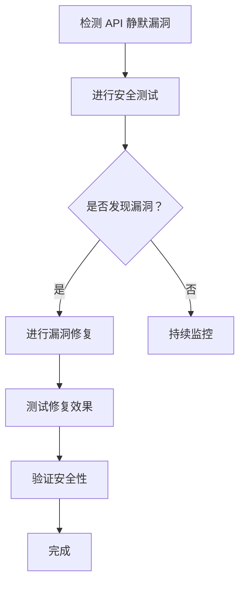
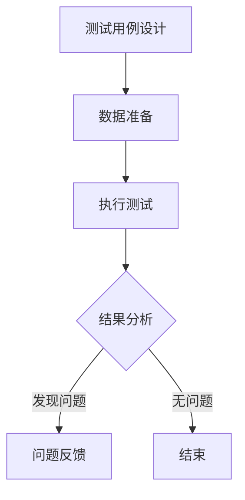
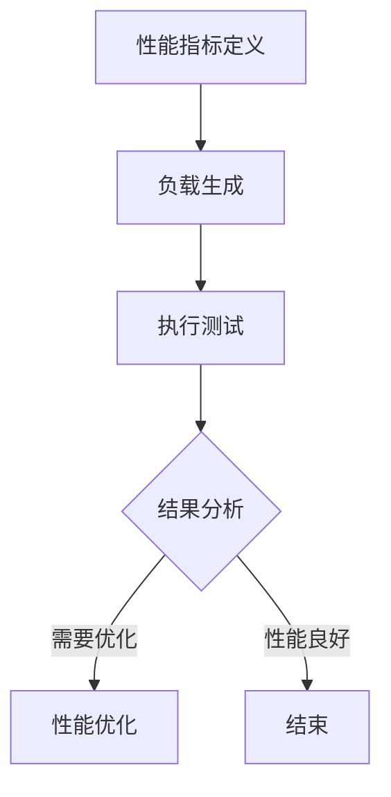
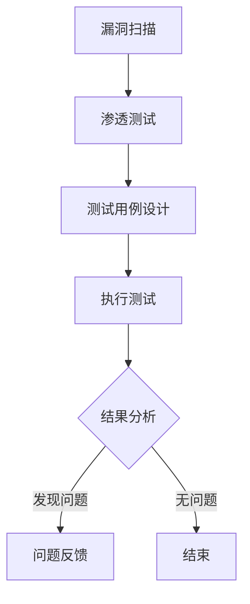
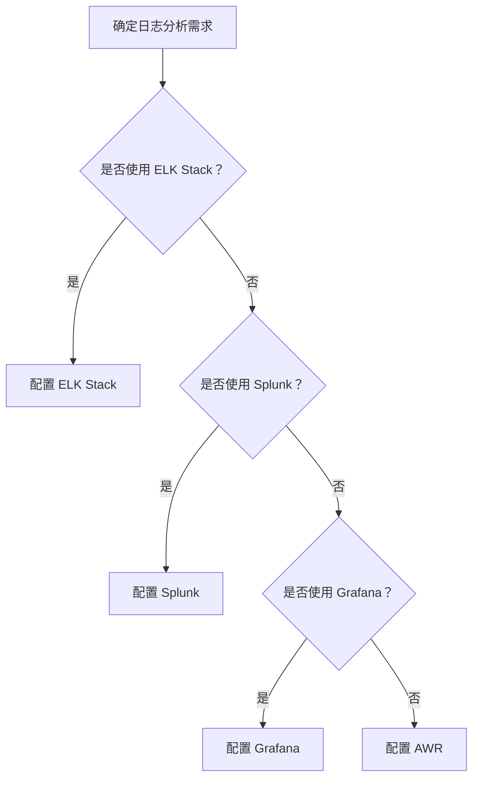
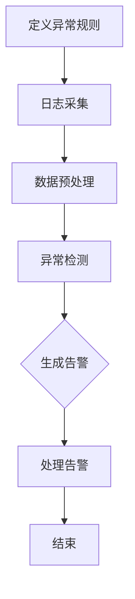
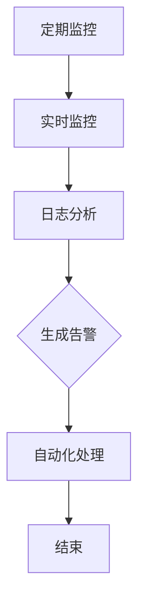

                 

# 《定期检查 OWASP API 安全风险清单》

> **关键词：** API 安全、OWASP、认证与授权、会话管理、数据保护、API 身份验证、API 静默漏洞、API 测试与监控、API 安全最佳实践

> **摘要：** 本篇文章将详细介绍 OWASP API 安全风险清单的内容，包括认证与授权风险、会话管理风险、数据保护风险、API 身份验证漏洞、API 静默漏洞等，并提供 API 安全的最佳实践，旨在帮助开发者、架构师和安全管理员识别和解决 API 安全问题，确保系统的安全性和稳定性。

## 目录大纲

### 第一部分：API 安全概述

#### 第1章：API 安全基础

##### 1.1 API 的发展与重要性

##### 1.2 OWASP API 安全风险清单简介

##### 1.3 API 安全的关键概念

#### 第2章：OWASP API 安全风险清单概述

##### 2.1 OWASP API 安全风险清单的组成

##### 2.2 OWASP API 安全风险清单的分类

##### 2.3 使用 OWASP API 安全风险清单的目的

### 第二部分：OWASP API 安全风险清单详细解析

#### 第3章：认证与授权风险

##### 3.1 证书认证风险

###### 3.1.1 SSL/TLS 证书失效

###### 3.1.2 不安全的证书存储

###### 3.1.3 自签名证书使用

##### 3.2 用户认证风险

###### 3.2.1 弱密码策略

###### 3.2.2 不安全的密码存储

###### 3.2.3 多因素认证缺失

#### 第4章：会话管理风险

##### 4.1 会话令牌管理

###### 4.1.1 明文存储会话令牌

###### 4.1.2 会话令牌长度不足

###### 4.1.3 会话令牌重复使用

##### 4.2 单点登录（SSO）风险

###### 4.2.1 不安全的 SSO 协议

###### 4.2.2 SSO 令牌泄露

###### 4.2.3 SSO 令牌滥用

#### 第5章：数据保护风险

##### 5.1 数据加密风险

###### 5.1.1 数据传输加密缺失

###### 5.1.2 数据存储加密不足

###### 5.1.3 加密算法选择不当

##### 5.2 敏感数据泄露风险

###### 5.2.1 敏感数据收集与存储

###### 5.2.2 敏感数据未经授权访问

###### 5.2.3 敏感数据滥用

#### 第6章：API 身份验证漏洞

##### 6.1 API 身份验证机制不完善

###### 6.1.1 密码重用漏洞

###### 6.1.2 强制认证漏洞

###### 6.1.3 身份验证信息泄露

##### 6.2 API 令牌安全漏洞

###### 6.2.1 令牌生成机制漏洞

###### 6.2.2 令牌传输安全漏洞

###### 6.2.3 令牌持久化漏洞

#### 第7章：API 静默漏洞

##### 7.1 API 静默漏洞的概念

###### 7.1.1 静默漏洞的成因

###### 7.1.2 静默漏洞的危害

###### 7.1.3 静默漏洞的检测与防御

##### 7.2 API 静默漏洞案例分析

###### 7.2.1 案例一：某电商平台的静默漏洞

###### 7.2.2 案例二：某支付平台的静默漏洞

#### 第8章：API 测试与监控

##### 8.1 API 测试的重要性

###### 8.1.1 功能测试

###### 8.1.2 性能测试

###### 8.1.3 安全测试

##### 8.2 API 监控与日志分析

###### 8.2.1 日志分析工具的选择

###### 8.2.2 异常行为的识别

###### 8.2.3 API 服务的持续监控

### 第三部分：API 安全最佳实践

#### 第9章：API 安全策略与框架

##### 9.1 API 安全策略制定

###### 9.1.1 安全策略的制定原则

###### 9.1.2 安全策略的制定流程

###### 9.1.3 安全策略的执行与评估

##### 9.2 API 安全框架构建

###### 9.2.1 安全框架的组成

###### 9.2.2 安全框架的实施

###### 9.2.3 安全框架的持续优化

#### 第10章：API 安全文化建设

##### 10.1 API 安全意识培养

###### 10.1.1 安全培训的重要性

###### 10.1.2 安全培训的内容与方式

###### 10.1.3 安全意识测评

##### 10.2 安全事件响应

###### 10.2.1 安全事件的分类

###### 10.2.2 安全事件的应急响应流程

###### 10.2.3 安全事件的总结与改进

#### 第11章：API 安全的未来发展趋势

##### 11.1 AI 在 API 安全中的应用

###### 11.1.1 AI 在威胁检测中的应用

###### 11.1.2 AI 在安全防护中的应用

###### 11.1.3 AI 在安全事件响应中的应用

##### 11.2 API 安全的新兴技术和标准

###### 11.2.1 区块链在 API 安全中的应用

###### 11.2.2 标准化组织对 API 安全的关注

###### 11.2.3 未来 API 安全的发展趋势

### 附录

##### 附录 A：OWASP API 安全风险清单更新历史

##### 附录 B：API 安全常用工具与资源

###### B.1 安全测试工具

###### B.1.1 OWASP ZAP

###### B.1.2 Burp Suite

###### B.1.3 SonarQube

##### B.2 安全防护工具

###### B.2.1 API 网关安全防护

###### B.2.2 容器安全防护

###### B.2.3 服务网格安全防护

##### B.3 API 安全相关书籍与论文推荐

###### B.3.1 《API 设计指南》

###### B.3.2 《API 安全实战》

## 第一部分：API 安全概述

### 第1章：API 安全基础

#### 1.1 API 的发展与重要性

应用程序编程接口（Application Programming Interface，API）是软件系统之间交互的一种接口，通过定义数据的传输格式和通信协议，使不同的软件系统能够相互访问和操作数据。API 的发展始于互联网时代的兴起，随着云计算、大数据、物联网等技术的快速发展，API 已成为现代软件架构中不可或缺的一部分。

API 的重要性主要体现在以下几个方面：

1. **促进系统集成**：API 使不同的软件系统能够相互集成，实现数据的共享和协同工作，提高了系统的整体效率和灵活性。
2. **扩展功能**：通过 API，第三方开发者可以为现有系统增加新功能，提高系统的可扩展性和可定制性。
3. **增强用户体验**：API 的应用使得应用程序能够与各种外部服务和数据源进行交互，为用户提供更丰富、更个性化的体验。
4. **降低开发成本**：API 的使用可以减少开发人员的工作量，降低系统的开发成本。

#### 1.2 OWASP API 安全风险清单简介

OWASP（Open Web Application Security Project）是一个非营利性组织，致力于提高互联网应用程序的安全性。OWASP API 安全风险清单是 OWASP 发布的一系列指南，旨在帮助开发者、架构师和安全管理员识别和解决 API 安全问题。

OWASP API 安全风险清单主要包括以下几个方面：

1. **认证与授权风险**：涉及 API 访问认证和授权机制的缺陷，如 SSL/TLS 证书失效、弱密码策略、不安全的密码存储等。
2. **会话管理风险**：涉及 API 会话令牌管理的问题，如明文存储会话令牌、会话令牌长度不足、会话令牌重复使用等。
3. **数据保护风险**：涉及 API 数据加密和敏感数据保护的问题，如数据传输加密缺失、数据存储加密不足、加密算法选择不当等。
4. **API 身份验证漏洞**：涉及 API 身份验证机制的缺陷，如密码重用漏洞、强制认证漏洞、身份验证信息泄露等。
5. **API 静默漏洞**：涉及 API 在使用过程中可能导致的安全漏洞，如静默漏洞的成因、危害、检测与防御等。

#### 1.3 API 安全的关键概念

为了更好地理解和应用 OWASP API 安全风险清单，以下是一些 API 安全中的关键概念：

1. **认证**：认证是验证用户身份的过程，确保只有授权用户可以访问 API。
2. **授权**：授权是确定用户是否有权限执行特定操作的过程，如读取、写入或删除数据。
3. **会话管理**：会话管理是管理用户会话的过程，包括创建、维护和销毁会话。
4. **数据加密**：数据加密是将数据转换为密文的过程，以防止未授权用户读取和修改数据。
5. **令牌**：令牌是一种用于认证和授权的令牌，如 JWT（JSON Web Token）、OAuth 令牌等。
6. **API 网关**：API 网关是用于统一管理 API 的组件，包括认证、路由、限流、监控等功能。

通过了解这些关键概念，开发者可以更好地设计和实现安全的 API 系统，确保系统的稳定性和安全性。

## 第二部分：OWASP API 安全风险清单详细解析

### 第2章：OWASP API 安全风险清单概述

OWASP API 安全风险清单是 OWASP 组织发布的一系列指南，旨在帮助开发者、架构师和安全管理员识别和解决 API 安全问题。本章节将详细介绍 OWASP API 安全风险清单的组成、分类以及使用目的。

#### 2.1 OWASP API 安全风险清单的组成

OWASP API 安全风险清单由多个安全风险类别组成，每个类别包含一系列具体的攻击手段和防护措施。以下是 OWASP API 安全风险清单的主要组成部分：

1. **认证与授权风险**：包括 SSL/TLS 证书失效、不安全的密码存储、弱密码策略、多因素认证缺失等。
2. **会话管理风险**：包括明文存储会话令牌、会话令牌长度不足、会话令牌重复使用等。
3. **数据保护风险**：包括数据传输加密缺失、数据存储加密不足、加密算法选择不当等。
4. **API 身份验证漏洞**：包括密码重用漏洞、强制认证漏洞、身份验证信息泄露等。
5. **API 静默漏洞**：包括静默漏洞的成因、危害、检测与防御等。
6. **API 测试与监控**：包括 API 测试的重要性、API 监控与日志分析等。
7. **API 安全最佳实践**：包括 API 安全策略与框架、API 安全文化建设等。

#### 2.2 OWASP API 安全风险清单的分类

OWASP API 安全风险清单按照不同的分类标准，可以分为以下几类：

1. **按风险类型分类**：包括认证与授权风险、会话管理风险、数据保护风险、API 身份验证漏洞、API 静默漏洞等。
2. **按攻击手段分类**：包括 SQL 注入、XSS（跨站脚本攻击）、CSRF（跨站请求伪造）等。
3. **按防护措施分类**：包括使用 HTTPS、密码加密存储、多因素认证、安全令牌等。

#### 2.3 使用 OWASP API 安全风险清单的目的

OWASP API 安全风险清单的主要目的是帮助开发者、架构师和安全管理员：

1. **识别 API 安全问题**：通过列出常见的 API 安全风险，帮助相关人员发现系统中可能存在的安全漏洞。
2. **制定安全策略**：根据风险清单，组织可以制定相应的安全策略和防护措施，确保 API 系统的安全。
3. **进行安全测试**：风险清单提供了测试 API 安全性的方法，帮助开发者发现和修复安全问题。
4. **提升安全意识**：通过了解风险清单，开发者可以提升对 API 安全问题的认识，从而提高整体的安全意识。

总之，OWASP API 安全风险清单是一个宝贵的资源，为 API 安全的保障提供了重要的指导。开发者、架构师和安全管理员应该定期检查并应用风险清单中的内容，确保 API 系统的安全和稳定。

### 第3章：认证与授权风险

认证与授权是 API 安全的核心组成部分，旨在确保只有授权的用户和系统能够访问 API。本章节将详细探讨认证与授权风险，包括证书认证风险和用户认证风险，并提供相关的解决方案。

#### 3.1 证书认证风险

证书认证风险主要涉及 SSL/TLS 证书的失效、不安全的证书存储以及自签名证书的使用。以下将分别进行讨论。

##### 3.1.1 SSL/TLS 证书失效

SSL/TLS 证书是确保 API 通信安全的重要工具。如果证书失效，客户端将无法建立安全的连接，从而导致数据泄露和中间人攻击。以下是可能导致 SSL/TLS 证书失效的原因：

1. **证书过期**：SSL/TLS 证书具有一定的有效期，如果证书过期而未及时更换，将导致无法建立安全连接。
2. **证书未续签**：某些情况下，组织可能未及时续签 SSL/TLS 证书，导致证书失效。
3. **证书错误配置**：SSL/TLS 证书的配置错误，如错误的域名或根证书，可能导致证书失效。

**解决方案**：

1. **定期检查证书有效期**：定期检查 SSL/TLS 证书的有效期，确保在证书过期前及时更换。
2. **自动续签证书**：使用自动化工具实现 SSL/TLS 证书的自动续签，避免手动操作失误。
3. **配置证书链**：确保 SSL/TLS 证书链的完整性和正确性，避免因配置错误导致证书失效。

##### 3.1.2 不安全的证书存储

不安全的证书存储可能导致证书被未授权用户访问，从而泄露敏感信息。以下是不安全的证书存储的常见问题：

1. **证书存储在公开位置**：将 SSL/TLS 证书存储在公开位置，如代码库或共享文件夹，可能导致证书被未授权用户访问。
2. **证书未加密存储**：SSL/TLS 证书未加密存储，即使存储在受保护的系统中，也容易受到攻击。
3. **证书访问控制不足**：SSL/TLS 证书的访问控制设置不严格，可能导致未授权用户访问证书。

**解决方案**：

1. **存储证书在安全位置**：将 SSL/TLS 证书存储在安全的系统中，如密钥管理系统，确保证书的安全。
2. **加密证书存储**：使用加密技术对 SSL/TLS 证书进行存储，避免未授权用户访问。
3. **严格访问控制**：实施严格的访问控制策略，确保只有授权用户可以访问 SSL/TLS 证书。

##### 3.1.3 自签名证书使用

自签名证书是一种未经过权威证书机构签名的证书，通常用于内部测试或特定场景。虽然自签名证书使用方便，但存在一定的安全风险：

1. **信任问题**：自签名证书不被操作系统或应用程序信任，可能导致无法建立安全连接。
2. **证书泄露**：自签名证书可能泄露，从而被恶意攻击者利用。
3. **证书管理复杂**：自签名证书的管理较为复杂，容易导致证书过期或未及时更换。

**解决方案**：

1. **使用权威证书**：在可能的情况下，使用由权威证书机构签名的证书，确保证书的信任问题。
2. **证书管理工具**：使用证书管理工具，如证书颁发机构（CA）或密钥管理系统，简化自签名证书的管理。
3. **严格使用场景**：在特定场景下使用自签名证书，如内部测试或开发环境，避免在生产环境中使用。

#### 3.2 用户认证风险

用户认证风险主要涉及弱密码策略、不安全的密码存储和多因素认证缺失。以下将分别进行讨论。

##### 3.2.1 弱密码策略

弱密码策略是用户认证中的常见问题，容易导致用户账户被攻破。以下是如何识别和解决弱密码策略的问题：

1. **弱密码使用率高**：在用户注册时，大量用户使用弱密码，如常见单词、生日、电话号码等。
2. **密码重用现象普遍**：许多用户在不同网站使用相同的密码，一旦其中一个账户被攻破，其他账户也存在安全风险。
3. **密码复杂度要求低**：系统对密码复杂度的要求较低，如长度较短、无特殊字符等。

**解决方案**：

1. **强制密码复杂度**：系统应强制用户使用强密码，如包含字母、数字、特殊字符，并要求密码长度足够。
2. **密码强度验证**：在用户注册或修改密码时，对密码进行强度验证，提示用户选择强密码。
3. **密码重用检测**：检测用户在不同网站使用相同密码的情况，提醒用户更改密码。

##### 3.2.2 不安全的密码存储

不安全的密码存储是用户认证中的另一个重要问题，可能导致密码泄露。以下是不安全的密码存储的常见问题：

1. **明文存储密码**：系统将密码以明文形式存储，容易被未授权用户读取。
2. **弱加密存储密码**：系统使用弱加密算法存储密码，如 MD5、SHA1 等，容易破解。
3. **密码泄露事件**：系统遭受攻击，导致密码泄露，从而被恶意攻击者利用。

**解决方案**：

1. **加密存储密码**：使用强加密算法，如 SHA-256、bcrypt 等，存储密码的哈希值，避免明文存储。
2. **使用散列加盐**：在密码存储过程中，添加随机盐值，提高密码的安全性。
3. **定期密码更新**：定期要求用户更新密码，减少密码泄露的风险。

##### 3.2.3 多因素认证缺失

多因素认证是一种提高用户账户安全性的有效手段，但在实际应用中，多因素认证缺失较为常见。以下是如何识别和解决多因素认证缺失的问题：

1. **单点登录**：系统仅支持单点登录，用户只需输入用户名和密码即可访问系统，缺乏额外认证。
2. **双因素认证**：虽然系统支持双因素认证，但用户普遍未启用，导致账户安全薄弱。
3. **认证方式单一**：系统仅依赖用户名和密码进行认证，缺乏其他认证方式。

**解决方案**：

1. **启用多因素认证**：在系统中启用多因素认证，如短信验证码、邮件验证码、指纹识别等，提高账户安全性。
2. **提示用户启用认证**：通过系统提示，提醒用户启用多因素认证，提高用户的安全意识。
3. **提供多种认证方式**：提供多种认证方式，如短信验证码、邮件验证码、指纹识别、面部识别等，方便用户选择。

通过以上措施，可以有效地降低认证与授权风险，确保 API 系统的安全性和稳定性。

### 第4章：会话管理风险

会话管理是 API 安全的重要组成部分，涉及会话令牌的管理和单点登录（SSO）的风险。本章节将详细探讨会话令牌管理和单点登录风险，并提供相关的解决方案。

#### 4.1 会话令牌管理

会话令牌（Session Token）是用于管理用户会话的一种标识符，它通常用于认证和授权用户访问 API。以下是会话令牌管理的几个关键方面：

##### 4.1.1 明文存储会话令牌

明文存储会话令牌是一种常见的安全漏洞，会导致会话令牌被未授权用户读取。以下是如何识别和解决明文存储会话令牌的问题：

1. **问题识别**：会话令牌以明文形式存储在服务器或客户端，如 HTTP 头、URL 参数等。
2. **问题危害**：攻击者可以通过窃取会话令牌，假冒合法用户，非法访问系统资源。
3. **问题原因**：开发者在实现会话令牌时未使用加密或混淆技术。

**解决方案**：

1. **加密存储会话令牌**：使用加密算法（如 AES）对会话令牌进行加密存储，确保会话令牌的安全。
2. **使用安全存储**：将会话令牌存储在安全存储位置，如数据库加密列或密钥管理系统。
3. **混淆会话令牌**：使用混淆技术（如 Base64 编码）对会话令牌进行编码，增加攻击者破解的难度。

##### 4.1.2 会话令牌长度不足

会话令牌长度不足会导致会话令牌容易被暴力破解。以下是如何识别和解决会话令牌长度不足的问题：

1. **问题识别**：会话令牌的长度较短，如 16 个字符或更短。
2. **问题危害**：攻击者可以通过暴力破解，获取会话令牌，假冒合法用户。
3. **问题原因**：开发者未设置合适的会话令牌长度。

**解决方案**：

1. **增加会话令牌长度**：将会话令牌长度增加到至少 64 个字符，以降低暴力破解的风险。
2. **使用随机生成器**：使用强随机生成器（如 /dev/urandom 或 java.util.UUID）生成会话令牌，确保会话令牌的随机性。
3. **定期更换会话令牌**：定期更换会话令牌，以减少会话令牌泄露的风险。

##### 4.1.3 会话令牌重复使用

会话令牌重复使用会导致多个用户共享同一会话令牌，从而降低会话的安全性。以下是如何识别和解决会话令牌重复使用的问题：

1. **问题识别**：多个用户使用相同的会话令牌访问系统，通常在用户注销后仍然有效。
2. **问题危害**：未注销的用户可以继续访问系统资源，增加安全漏洞。
3. **问题原因**：开发者未正确实现会话令牌的生成和销毁机制。

**解决方案**：

1. **避免重复使用会话令牌**：每次用户注销或会话过期时，生成新的会话令牌，确保会话的唯一性。
2. **会话令牌有效期设置**：设置合理的会话令牌有效期，确保用户在会话过期时重新进行认证。
3. **会话令牌销毁机制**：实现会话令牌的销毁机制，确保用户注销后，会话令牌无法继续使用。

#### 4.2 单点登录（SSO）风险

单点登录（Single Sign-On，SSO）是一种方便用户登录多个系统的方式，但同时也带来了一定的安全风险。以下是单点登录的常见风险和解决方案：

##### 4.2.1 不安全的 SSO 协议

不安全的 SSO 协议会导致会话令牌泄露，从而被恶意攻击者利用。以下是如何识别和解决不安全的 SSO 协议的问题：

1. **问题识别**：SSO 协议未采用加密通信，如使用 HTTP 而非 HTTPS。
2. **问题危害**：攻击者可以通过窃听通信，获取用户会话令牌，假冒合法用户。
3. **问题原因**：开发者未采用安全的 SSO 协议。

**解决方案**：

1. **使用安全的 SSO 协议**：采用安全的 SSO 协议（如 OAuth 2.0、SAML 2.0），确保通信加密。
2. **启用 HTTPS**：确保 SSO 协议的通信使用 HTTPS，避免明文传输敏感信息。
3. **协议安全配置**：配置 SSO 协议的安全设置，如禁用明文令牌传输、启用令牌签名等。

##### 4.2.2 SSO 令牌泄露

SSO 令牌泄露是单点登录中的常见问题，可能导致多个系统被攻破。以下是如何识别和解决 SSO 令牌泄露的问题：

1. **问题识别**：SSO 令牌存储在公开位置，如代码库或共享文件夹，容易被未授权用户访问。
2. **问题危害**：未授权用户可以通过访问 SSO 令牌，假冒合法用户，非法访问系统资源。
3. **问题原因**：开发者未妥善存储和管理 SSO 令牌。

**解决方案**：

1. **安全存储 SSO 令牌**：将 SSO 令牌存储在安全的存储位置，如密钥管理系统或数据库加密列。
2. **限制访问权限**：限制对 SSO 令牌的访问权限，确保只有授权用户可以访问。
3. **使用加密存储**：使用加密技术（如 AES）对 SSO 令牌进行加密存储，确保其安全性。

##### 4.2.3 SSO 令牌滥用

SSO 令牌滥用是指未授权用户通过伪造或窃取 SSO 令牌，非法访问系统资源。以下是如何识别和解决 SSO 令牌滥用的问题：

1. **问题识别**：系统存在 SSO 令牌伪造或窃取漏洞，未对 SSO 令牌进行有效验证。
2. **问题危害**：未授权用户可以通过伪造或窃取 SSO 令牌，假冒合法用户，非法访问系统资源。
3. **问题原因**：开发者未对 SSO 令牌进行严格验证。

**解决方案**：

1. **严格验证 SSO 令牌**：在用户登录和访问系统资源时，严格验证 SSO 令牌的有效性，确保其未被盗用。
2. **限制 SSO 令牌权限**：为 SSO 令牌分配适当的权限，确保未授权用户无法访问敏感资源。
3. **启用多因素认证**：在 SSO 令牌的基础上，启用多因素认证，提高用户账户的安全性。

通过以上措施，可以有效降低会话管理风险和单点登录风险，确保 API 系统的安全性。

### 第5章：数据保护风险

数据保护是 API 安全的重要组成部分，旨在确保 API 传输和存储的数据安全。本章节将详细探讨数据保护风险，包括数据加密风险和敏感数据泄露风险，并提供相应的解决方案。

#### 5.1 数据加密风险

数据加密是保护数据安全的关键技术，但不当的加密方法可能导致数据泄露。以下是如何识别和解决数据加密风险的问题：

##### 5.1.1 数据传输加密缺失

数据传输加密缺失会导致数据在传输过程中被窃取。以下是如何识别和解决数据传输加密缺失的问题：

1. **问题识别**：API 通信未使用 HTTPS 或其他安全传输协议，如 HTTP。
2. **问题危害**：攻击者可以在数据传输过程中窃取敏感数据，如用户名、密码、信用卡信息等。
3. **问题原因**：开发者未配置或启用数据传输加密。

**解决方案**：

1. **使用 HTTPS**：确保 API 通信使用 HTTPS，以加密数据传输。
2. **配置安全传输协议**：配置 SSL/TLS 证书，确保 HTTPS 通信的安全。
3. **强制 HTTPS**：在服务器端强制使用 HTTPS，避免 HTTP 通信。

##### 5.1.2 数据存储加密不足

数据存储加密不足可能导致数据在存储过程中被未授权用户访问。以下是如何识别和解决数据存储加密不足的问题：

1. **问题识别**：敏感数据在数据库中以明文形式存储，未进行加密。
2. **问题危害**：未授权用户可以通过访问数据库，窃取敏感数据。
3. **问题原因**：开发者未对敏感数据进行加密存储。

**解决方案**：

1. **加密敏感数据**：使用加密算法（如 AES）对敏感数据进行加密存储。
2. **使用数据库加密列**：启用数据库加密列，确保敏感数据在数据库中以加密形式存储。
3. **配置加密策略**：配置数据库的安全策略，确保只有授权用户可以访问加密数据。

##### 5.1.3 加密算法选择不当

选择不当的加密算法可能导致数据泄露。以下是如何识别和解决加密算法选择不当的问题：

1. **问题识别**：开发者使用已被破解或即将过时的加密算法，如 MD5、SHA1。
2. **问题危害**：攻击者可以通过破解加密算法，获取敏感数据。
3. **问题原因**：开发者对加密算法的安全性了解不足。

**解决方案**：

1. **使用安全的加密算法**：选择安全的加密算法，如 AES、RSA 等。
2. **遵循加密标准**：遵循业界公认的加密标准，如 FIPS 140-2。
3. **定期更新加密算法**：定期更新加密算法，确保其安全性。

#### 5.2 敏感数据泄露风险

敏感数据泄露风险是指敏感数据在传输、存储和处理过程中被未授权用户访问。以下是如何识别和解决敏感数据泄露风险的问题：

##### 5.2.1 敏感数据收集与存储

敏感数据收集与存储不当可能导致敏感数据泄露。以下是如何识别和解决敏感数据收集与存储的问题：

1. **问题识别**：系统收集和存储了过多的敏感数据，如用户隐私信息、金融信息等。
2. **问题危害**：攻击者可以通过访问系统，获取敏感数据。
3. **问题原因**：开发者对敏感数据的收集和处理不够谨慎。

**解决方案**：

1. **最小化敏感数据收集**：仅收集和存储必要的敏感数据，避免过度收集。
2. **加密存储敏感数据**：对敏感数据进行加密存储，确保其安全性。
3. **审计数据收集与存储**：定期审计数据收集与存储过程，确保其合规性。

##### 5.2.2 敏感数据未经授权访问

敏感数据未经授权访问可能导致敏感数据泄露。以下是如何识别和解决敏感数据未经授权访问的问题：

1. **问题识别**：未对敏感数据访问进行权限控制，任何用户都可以访问敏感数据。
2. **问题危害**：未授权用户可以通过访问系统，获取敏感数据。
3. **问题原因**：开发者未对敏感数据访问进行权限控制。

**解决方案**：

1. **实施访问控制**：对敏感数据访问实施严格的访问控制策略，确保只有授权用户可以访问。
2. **权限分离**：实现权限分离，确保不同用户有不同的权限，减少权限滥用。
3. **日志记录**：记录敏感数据访问日志，以便追踪和审计。

##### 5.2.3 敏感数据滥用

敏感数据滥用是指未授权用户通过非法手段获取和滥用敏感数据。以下是如何识别和解决敏感数据滥用的问题：

1. **问题识别**：系统存在敏感数据滥用漏洞，如用户可以通过 SQL 注入或 XSS 攻击获取和修改敏感数据。
2. **问题危害**：攻击者可以通过滥用敏感数据，进行欺诈、盗用等非法行为。
3. **问题原因**：开发者对敏感数据的处理不够安全。

**解决方案**：

1. **防止 SQL 注入和 XSS 攻击**：实施输入验证和输出编码，防止 SQL 注入和 XSS 攻击。
2. **数据最小化原则**：仅收集和存储必要的敏感数据，避免过度收集。
3. **审计和监控**：定期审计和监控敏感数据访问和操作，及时发现和阻止敏感数据滥用。

通过以上措施，可以有效降低数据保护风险，确保 API 传输和存储的数据安全。

### 第6章：API 身份验证漏洞

API 身份验证漏洞是 API 安全中的一个重要方面，它涉及到 API 身份验证机制的缺陷，包括密码重用漏洞、强制认证漏洞和身份验证信息泄露等。本章节将详细探讨这些漏洞，并提供相应的解决方案。

#### 6.1 API 身份验证机制不完善

API 身份验证机制是确保只有授权用户可以访问 API 的关键。然而，不完善的身份验证机制可能导致严重的安全漏洞。以下是如何识别和解决 API 身份验证机制不完善的问题：

##### 6.1.1 密码重用漏洞

密码重用漏洞是指用户在多个系统中使用相同的密码，一旦其中一个系统遭受攻击，其他系统的安全也将受到威胁。以下是如何识别和解决密码重用漏洞的问题：

1. **问题识别**：用户在多个系统中使用相同的密码，如个人信息管理平台、社交媒体等。
2. **问题危害**：攻击者可以通过破解一个系统的密码，获取用户的多个账户访问权限。
3. **问题原因**：系统未强制要求用户使用唯一的密码。

**解决方案**：

1. **强制密码唯一性**：系统应强制要求用户使用唯一的密码，避免密码重用。
2. **密码强度检查**：在用户注册或修改密码时，检查密码的强度，确保其不易被破解。
3. **密码安全提示**：提醒用户使用不同的密码，避免密码重用。

##### 6.1.2 强制认证漏洞

强制认证漏洞是指 API 在未经认证的情况下允许访问敏感资源。以下是如何识别和解决强制认证漏洞的问题：

1. **问题识别**：API 在未经过认证的情况下，允许用户访问敏感数据或执行敏感操作。
2. **问题危害**：未认证用户可以通过 API 获取敏感数据或执行敏感操作。
3. **问题原因**：开发者未正确实现认证机制。

**解决方案**：

1. **强制认证**：在 API 的每个请求中，强制要求用户进行认证，确保只有授权用户可以访问。
2. **访问控制**：实现细粒度的访问控制，确保未认证用户无法访问敏感资源。
3. **验证请求**：对每个 API 请求进行验证，确保其合法性和安全性。

##### 6.1.3 身份验证信息泄露

身份验证信息泄露是指用户身份验证过程中的敏感信息被泄露。以下是如何识别和解决身份验证信息泄露的问题：

1. **问题识别**：用户身份验证过程中的敏感信息（如用户名、密码、令牌等）未加密存储或传输。
2. **问题危害**：攻击者可以通过窃取敏感信息，假冒合法用户。
3. **问题原因**：开发者未正确处理身份验证信息。

**解决方案**：

1. **加密身份验证信息**：使用加密技术（如 AES、RSA）加密身份验证信息，确保其安全存储和传输。
2. **使用安全传输协议**：使用 HTTPS 等安全传输协议，确保身份验证信息在传输过程中的安全。
3. **限制访问权限**：限制对身份验证信息的访问权限，确保只有授权用户可以访问。

#### 6.2 API 令牌安全漏洞

API 令牌是用于认证用户身份的一种机制，但若存在安全漏洞，可能导致 API 被未授权用户访问。以下是如何识别和解决 API 令牌安全漏洞的问题：

##### 6.2.1 令牌生成机制漏洞

令牌生成机制漏洞是指 API 令牌的生成过程存在缺陷，可能导致令牌被恶意攻击者预测或伪造。以下是如何识别和解决令牌生成机制漏洞的问题：

1. **问题识别**：API 令牌生成过程使用弱随机数或固定的算法，导致令牌容易被预测或伪造。
2. **问题危害**：攻击者可以通过预测或伪造令牌，假冒合法用户。
3. **问题原因**：开发者未正确实现令牌生成机制。

**解决方案**：

1. **使用强随机数生成令牌**：使用强随机数生成器（如 `/dev/urandom` 或 `java.util.UUID`）生成令牌，确保其随机性。
2. **避免使用固定算法生成令牌**：避免使用固定的算法或模式生成令牌，增加令牌的复杂性。
3. **定期更换令牌**：定期更换 API 令牌，减少令牌泄露的风险。

##### 6.2.2 令牌传输安全漏洞

令牌传输安全漏洞是指 API 令牌在传输过程中未加密或未采取其他安全措施。以下是如何识别和解决令牌传输安全漏洞的问题：

1. **问题识别**：API 令牌以明文形式在请求中传输，如 HTTP 头、URL 参数等。
2. **问题危害**：攻击者可以通过窃取令牌，假冒合法用户。
3. **问题原因**：开发者未采取安全传输措施。

**解决方案**：

1. **使用安全传输协议**：使用 HTTPS 等安全传输协议，确保令牌在传输过程中的安全。
2. **令牌加密传输**：使用加密技术（如 AES）对令牌进行加密传输，避免明文传输。
3. **限制传输方式**：限制令牌的传输方式，如仅允许 POST 请求传输令牌。

##### 6.2.3 令牌持久化漏洞

令牌持久化漏洞是指 API 令牌被持久化存储在客户端或服务器上，可能导致令牌被未授权用户访问。以下是如何识别和解决令牌持久化漏洞的问题：

1. **问题识别**：API 令牌被存储在客户端缓存、cookies 或服务器数据库中。
2. **问题危害**：攻击者可以通过窃取令牌，假冒合法用户。
3. **问题原因**：开发者未妥善处理令牌持久化问题。

**解决方案**：

1. **避免持久化令牌**：避免将令牌存储在客户端或服务器上，确保令牌仅在传输过程中有效。
2. **使用一次性令牌**：使用一次性令牌（如 JWT），确保令牌只在当前会话中有效。
3. **定期更换令牌**：定期更换 API 令牌，减少令牌泄露的风险。

通过以上措施，可以有效降低 API 身份验证漏洞，确保 API 的安全性。

### 第7章：API 静默漏洞

API 静默漏洞是指一种在 API 使用过程中可能导致安全风险的问题，通常不引起用户注意，但可能被恶意攻击者利用。本章节将详细探讨 API 静默漏洞的概念、成因、危害以及检测与防御方法。

#### 7.1 API 静默漏洞的概念

API 静默漏洞（Silent API Vulnerabilities）是指那些在 API 使用过程中不立即引起用户注意，但可能导致严重安全问题的漏洞。这些漏洞通常涉及 API 的内部逻辑、配置错误、权限管理等，不会直接影响用户的操作体验，但可能会被恶意攻击者利用。

以下是一些常见的 API 静默漏洞：

1. **未授权访问**：API 未正确验证用户身份或权限，导致未授权用户可以访问敏感数据或执行敏感操作。
2. **参数注入**：API 接收的参数未经过严格验证，可能导致 SQL 注入、XSS 等攻击。
3. **错误处理**：API 在处理错误时未返回适当的错误信息，可能导致攻击者获取系统内部信息。
4. **配置错误**：API 的配置错误，如 SSL/TLS 证书失效、密钥泄露等，可能导致安全漏洞。

#### 7.1.1 静默漏洞的成因

API 静默漏洞的成因主要包括以下几个方面：

1. **开发不足**：开发者在设计和实现 API 时，未能充分考虑安全性，导致漏洞的产生。
2. **测试不足**：在 API 的开发过程中，未进行充分的测试，特别是安全测试，导致漏洞未被及时发现。
3. **配置错误**：API 的配置错误，如 SSL/TLS 证书未更新、权限设置不当等，可能导致安全漏洞。
4. **依赖组件**：API 依赖的第三方库或组件存在漏洞，导致 API 也受到影响。

#### 7.1.2 静默漏洞的危害

API 静默漏洞的危害主要体现在以下几个方面：

1. **数据泄露**：攻击者可以通过静默漏洞获取系统中的敏感数据，如用户信息、财务数据等。
2. **未授权访问**：攻击者可以利用静默漏洞假冒合法用户，非法访问系统资源。
3. **服务中断**：静默漏洞可能导致系统服务中断，影响业务的正常运行。
4. **声誉受损**：安全漏洞被公开后，可能导致企业声誉受损，影响用户信任。

#### 7.1.3 静默漏洞的检测与防御

为了有效检测和防御 API 静默漏洞，可以采取以下措施：

1. **安全测试**：在 API 开发过程中，进行安全测试，包括静态代码分析、动态测试、渗透测试等，及时发现漏洞。
2. **安全编码实践**：遵循安全编码实践，如输入验证、输出编码、错误处理等，减少漏洞的产生。
3. **配置管理**：严格管理 API 的配置，定期检查和更新配置项，确保其安全性。
4. **监控与日志**：实施 API 监控和日志分析，及时发现异常行为和安全事件。

以下是一个 Mermaid 流程图，展示了检测和防御 API 静默漏洞的基本步骤：

通过上述措施，可以有效降低 API 静默漏洞的风险，确保 API 的安全性。

#### 7.2 API 静默漏洞案例分析

以下将介绍两个典型的 API 静默漏洞案例，分析其漏洞成因、危害以及解决方案。

##### 7.2.1 案例一：某电商平台的静默漏洞

某电商平台在处理订单时，未对用户输入的订单金额进行验证，导致攻击者可以通过输入特殊字符（如 HTML 标签）来修改订单金额，从而实现欺诈行为。

1. **漏洞成因**：开发者在处理订单金额时，未对用户输入的金额进行严格验证，导致恶意输入被处理为有效数据。
2. **漏洞危害**：攻击者可以通过修改订单金额，非法获取商品或享受折扣，从而实现欺诈行为。
3. **解决方案**：
   - **输入验证**：对用户输入的金额进行严格验证，确保其格式和值符合预期。
   - **输出编码**：对处理后的金额进行输出编码，避免特殊字符被解释为 HTML 标签。
   - **日志记录**：记录用户输入和订单处理过程，以便追踪和审计。

##### 7.2.2 案例二：某支付平台的静默漏洞

某支付平台在处理支付请求时，未正确处理用户未完成支付的订单，导致攻击者可以通过恶意请求，将未支付订单标记为已支付，从而实现非法转账。

1. **漏洞成因**：开发者在处理支付请求时，未对订单状态进行严格验证，导致恶意请求被处理为有效支付。
2. **漏洞危害**：攻击者可以通过恶意请求，将未支付订单标记为已支付，从而实现非法转账。
3. **解决方案**：
   - **订单状态验证**：对支付请求中的订单状态进行严格验证，确保其符合预期。
   - **支付请求验证**：对支付请求进行多层次的验证，确保其合法性。
   - **日志记录**：记录支付请求和订单处理过程，以便追踪和审计。

通过以上案例，可以看出 API 静默漏洞的危害性，以及通过严格的输入验证、输出编码和日志记录等措施，可以有效防御此类漏洞。

### 第8章：API 测试与监控

API 测试与监控是确保 API 安全性和稳定性的关键环节。通过 API 测试，可以及时发现潜在的安全漏洞和性能问题；通过 API 监控，可以实时掌握 API 的运行状态，快速响应和解决异常情况。本章节将详细探讨 API 测试的重要性和 API 监控与日志分析的方法。

#### 8.1 API 测试的重要性

API 测试是确保 API 系统功能完备、性能优异和安全可靠的重要手段。以下是 API 测试的重要性和具体目的：

1. **功能测试**：确保 API 的功能实现符合设计要求，包括接口的响应内容、状态码、错误处理等。
2. **性能测试**：评估 API 的性能，如响应时间、并发处理能力、资源消耗等，确保其在高负载下的稳定运行。
3. **安全测试**：检测 API 存在的安全漏洞，如 SQL 注入、XSS 攻击、未授权访问等，防止潜在的安全威胁。
4. **兼容性测试**：验证 API 在不同环境、不同客户端和不同版本之间的兼容性，确保其稳定运行。

通过 API 测试，可以确保 API 系统在上线前已经经过充分的验证，降低上线后出现问题的风险。

#### 8.1.1 功能测试

功能测试是 API 测试的基础，旨在验证 API 的功能实现是否符合预期。以下是功能测试的关键步骤和方法：

1. **测试用例设计**：根据 API 的设计文档，设计功能测试用例，包括正常情况、边界情况和异常情况。
2. **数据准备**：准备测试数据，包括输入数据、预期输出数据和错误输出数据。
3. **执行测试**：使用测试工具（如 Postman、JMeter）执行测试用例，记录测试结果。
4. **结果分析**：分析测试结果，对比预期输出和实际输出，发现功能缺陷。
5. **问题反馈**：将发现的功能缺陷反馈给开发团队，进行修复。

以下是一个简单的 Mermaid 流程图，展示了功能测试的基本流程：

#### 8.1.2 性能测试

性能测试是评估 API 在高负载下的表现，以确保其性能和稳定性。以下是性能测试的关键步骤和方法：

1. **性能指标定义**：定义性能测试的指标，如响应时间、并发数、吞吐量、资源消耗等。
2. **负载生成**：使用性能测试工具（如 JMeter、Gatling）生成模拟负载，模拟实际使用场景。
3. **执行测试**：执行性能测试，记录测试结果，包括性能指标和错误日志。
4. **结果分析**：分析测试结果，评估 API 的性能和稳定性，确定是否需要优化。
5. **性能优化**：根据测试结果，对 API 进行优化，如代码优化、缓存策略调整、负载均衡等。

以下是一个简单的 Mermaid 流程图，展示了性能测试的基本流程：

#### 8.1.3 安全测试

安全测试是确保 API 系统安全的重要环节，旨在发现和修复潜在的安全漏洞。以下是安全测试的关键步骤和方法：

1. **漏洞扫描**：使用漏洞扫描工具（如 OWASP ZAP、Burp Suite）对 API 进行扫描，发现常见的安全漏洞。
2. **渗透测试**：模拟攻击者的行为，对 API 进行渗透测试，验证其安全性和脆弱性。
3. **测试用例设计**：根据 API 的功能和设计，设计安全测试用例，包括 SQL 注入、XSS 攻击、未授权访问等。
4. **执行测试**：使用测试工具执行安全测试用例，记录测试结果。
5. **结果分析**：分析测试结果，发现安全漏洞，评估风险。
6. **问题反馈**：将发现的安全漏洞反馈给开发团队，进行修复。

以下是一个简单的 Mermaid 流程图，展示了安全测试的基本流程：

#### 8.2 API 监控与日志分析

API 监控与日志分析是确保 API 系统稳定性和安全性的重要手段。通过 API 监控，可以实时掌握 API 的运行状态；通过日志分析，可以快速发现和处理异常情况。以下是 API 监控与日志分析的方法：

##### 8.2.1 日志分析工具的选择

选择合适的日志分析工具对于有效监控 API 系统至关重要。以下是一些常见的日志分析工具：

1. **ELK Stack**：包括 Elasticsearch、Logstash 和 Kibana，提供强大的日志收集、存储和可视化功能。
2. **Splunk**：一款专业的日志分析平台，提供高效的日志收集、存储和搜索功能。
3. **Grafana**：结合 Prometheus 等监控工具，提供日志数据可视化和告警功能。
4. **AWR（Amazon Web Services）**：提供 AWS 云环境下的日志收集、存储和分析功能。

以下是一个简单的 Mermaid 流程图，展示了日志分析工具的选择过程：

##### 8.2.2 异常行为的识别

异常行为识别是日志分析的核心任务，旨在发现和处理 API 系统的异常情况。以下是异常行为识别的关键步骤和方法：

1. **定义异常规则**：根据 API 的设计和业务逻辑，定义异常行为的规则，如错误率过高、响应时间过长等。
2. **日志采集**：收集 API 的日志数据，包括请求、响应、错误等信息。
3. **数据预处理**：对日志数据进行清洗和转换，确保数据的准确性和一致性。
4. **异常检测**：使用统计分析和机器学习等方法，检测日志数据中的异常行为。
5. **告警与处理**：根据检测到的异常行为，生成告警信息，并采取相应的处理措施。

以下是一个简单的 Mermaid 流程图，展示了异常行为识别的基本流程：

##### 8.2.3 API 服务的持续监控

持续监控是确保 API 服务稳定性和安全性的关键。通过持续监控，可以及时发现和处理问题，降低系统故障率和安全风险。以下是 API 服务的持续监控方法：

1. **定期监控**：定期检查 API 的运行状态，包括功能测试、性能测试和安全测试。
2. **实时监控**：实时收集 API 的日志数据，分析其运行状态，及时发现和处理异常行为。
3. **自动化告警**：根据监控结果，自动生成告警信息，并通过邮件、短信等渠道通知相关人员。
4. **自动化处理**：根据告警信息，自动执行相应的处理措施，如重启服务、调整配置等。
5. **日志分析**：对日志数据进行分析，发现潜在的问题和趋势，优化系统性能和安全。

以下是一个简单的 Mermaid 流程图，展示了 API 服务的持续监控流程：

通过以上措施，可以有效确保 API 系统的安全性和稳定性。

### 第9章：API 安全策略与框架

API 安全策略与框架是确保 API 系统安全性的重要手段。通过制定合理的 API 安全策略和构建完善的 API 安全框架，可以有效地识别和解决 API 安全问题，确保系统的安全性和稳定性。本章节将详细探讨 API 安全策略的制定、API 安全框架的构建以及安全框架的持续优化。

#### 9.1 API 安全策略制定

制定 API 安全策略是确保 API 系统安全的第一步。以下是制定 API 安全策略的关键原则、流程和执行与评估方法：

##### 9.1.1 安全策略的制定原则

1. **最小权限原则**：API 系统应遵循最小权限原则，确保只有授权用户和系统可以访问所需的资源和操作。
2. **完整性原则**：API 系统应确保数据的完整性和准确性，防止未授权修改和删除。
3. **保密性原则**：API 系统应确保数据的保密性，防止未授权访问和泄露。
4. **安全性原则**：API 系统应采用安全的设计和实现方法，防止常见的安全漏洞和攻击。
5. **可审计性原则**：API 系统应具有可审计性，确保可以记录和追踪系统的访问和操作行为。

##### 9.1.2 安全策略的制定流程

1. **需求分析**：了解 API 系统的业务需求和安全需求，明确系统的安全目标。
2. **风险评估**：评估 API 系统可能面临的安全威胁和风险，确定优先级和应对策略。
3. **策略制定**：根据需求分析和风险评估结果，制定具体的 API 安全策略，包括认证、授权、数据保护、安全测试等。
4. **评审与批准**：将安全策略提交给相关部门和人员评审，确保其符合组织的安全政策和标准。
5. **发布与实施**：发布安全策略，并在 API 系统中实施和执行。

##### 9.1.3 安全策略的执行与评估

1. **执行监控**：监控安全策略的执行情况，确保相关措施得到有效实施。
2. **定期评估**：定期评估安全策略的有效性，根据实际情况进行调整和优化。
3. **培训与意识**：组织安全培训，提高员工的安全意识和能力，确保他们理解并遵循安全策略。
4. **应急响应**：建立应急响应机制，及时处理安全事件，降低风险和损失。

#### 9.2 API 安全框架构建

API 安全框架是确保 API 系统安全性的基本架构，包括安全组件、技术、流程和工具。以下是构建 API 安全框架的关键步骤和方法：

##### 9.2.1 安全框架的组成

1. **认证与授权组件**：包括身份验证、授权和访问控制等，确保只有授权用户和系统可以访问 API。
2. **数据保护组件**：包括数据加密、传输加密和敏感数据保护等，确保数据的机密性和完整性。
3. **安全测试组件**：包括安全测试、渗透测试和代码审计等，确保 API 系统的安全性和可靠性。
4. **监控与日志分析组件**：包括日志收集、日志分析和异常行为识别等，确保可以实时监控 API 系统的运行状态。
5. **应急响应组件**：包括应急响应计划、安全事件处理和调查等，确保可以及时响应和处理安全事件。

##### 9.2.2 安全框架的实施

1. **设计安全架构**：根据安全需求和现有技术，设计 API 安全架构，包括组件的选择和配置。
2. **实施安全组件**：根据安全架构，实施认证与授权、数据保护、安全测试、监控与日志分析等组件。
3. **集成与测试**：将安全组件集成到 API 系统中，进行功能测试和安全测试，确保其正常工作。
4. **部署与上线**：部署安全框架，确保 API 系统可以安全运行。

##### 9.2.3 安全框架的持续优化

1. **定期评估**：定期评估安全框架的有效性，根据实际情况进行调整和优化。
2. **技术更新**：跟踪最新的安全技术和趋势，及时更新安全组件和技术。
3. **培训与意识**：组织安全培训，提高员工的安全意识和能力，确保他们了解并遵循安全策略。
4. **持续改进**：通过持续改进，不断提高 API 系统的安全性和可靠性。

通过制定合理的 API 安全策略和构建完善的 API 安全框架，可以确保 API 系统的安全性和稳定性，降低安全风险和损失。

### 第10章：API 安全文化建设

API 安全文化建设是确保 API 系统安全性的关键因素。通过培养员工的安全意识和技能，建立良好的安全文化，可以有效地提高 API 系统的安全性。本章节将详细探讨 API 安全意识的培养、安全事件响应以及安全事件总结与改进。

#### 10.1 API 安全意识培养

API 安全意识培养是确保员工了解和遵循 API 安全策略和标准的重要手段。以下是培养 API 安全意识的关键步骤和方法：

##### 10.1.1 安全培训的重要性

安全培训是培养 API 安全意识的重要手段，通过培训可以：

1. **提高员工的安全意识**：让员工了解 API 安全的重要性，认识到安全风险对业务的影响。
2. **增强安全知识**：让员工掌握 API 安全的基本概念、技术和工具，提高识别和应对安全问题的能力。
3. **规范操作行为**：通过培训，规范员工的操作行为，确保他们遵循安全策略和标准。

##### 10.1.2 安全培训的内容与方式

1. **培训内容**：
   - **API 安全基础知识**：介绍 API 的定义、作用、类型等，以及 API 安全的基本概念。
   - **常见安全威胁**：讲解常见的 API 安全威胁，如 SQL 注入、XSS 攻击、未授权访问等。
   - **安全防护措施**：介绍 API 安全的防护措施，如加密、认证、授权等。
   - **安全最佳实践**：讲解 API 安全的最佳实践，如输入验证、输出编码、日志记录等。

2. **培训方式**：
   - **线上培训**：利用网络平台，如视频课程、直播讲座等，方便员工随时学习和复习。
   - **线下培训**：组织内部或外部培训，通过面对面讲解和实操演示，提高培训效果。
   - **案例分享**：通过分享实际的安全事件和案例，让员工了解 API 安全的重要性，提高他们的警觉性。

##### 10.1.3 安全意识测评

安全意识测评是评估员工安全意识水平的重要手段。以下是安全意识测评的方法和步骤：

1. **测评方法**：
   - **在线测试**：设计在线测试题，评估员工对 API 安全知识的掌握程度。
   - **实操演练**：通过模拟攻击和防御演练，评估员工在实际场景中的安全意识和操作能力。
   - **问卷调查**：设计问卷调查，收集员工对 API 安全的看法和建议，了解他们的安全意识和需求。

2. **测评步骤**：
   - **制定测评计划**：明确测评的目标、内容、方法和时间安排。
   - **实施测评**：按照计划进行测评，确保覆盖所有相关员工。
   - **分析结果**：对测评结果进行分析，识别员工在 API 安全方面的薄弱环节。
   - **反馈与改进**：根据测评结果，提供反馈和改进建议，帮助员工提升安全意识和能力。

通过以上措施，可以有效地培养员工的 API 安全意识，提高他们的安全意识和技能，确保 API 系统的安全性。

#### 10.2 安全事件响应

安全事件响应是确保 API 系统在发生安全事件时能够及时、有效地应对和恢复的重要环节。以下是安全事件响应的分类、应急响应流程以及后续总结与改进。

##### 10.2.1 安全事件的分类

根据安全事件的影响范围和严重程度，可以将其分为以下几类：

1. **轻微事件**：对 API 系统的影响较小，如误操作、小范围的访问泄露等。
2. **一般事件**：对 API 系统有一定影响，如 SQL 注入、XSS 攻击等。
3. **重大事件**：对 API 系统有严重危害，如数据泄露、系统瘫痪等。

##### 10.2.2 安全事件的应急响应流程

1. **事件识别**：通过监控和日志分析，及时发现安全事件，确保尽快识别和响应。
2. **事件确认**：对事件进行确认，确定事件的类型、影响范围和严重程度。
3. **事件处置**：根据事件类型和严重程度，采取相应的处置措施，如隔离受影响的系统、阻断攻击等。
4. **事件报告**：及时向相关领导和相关部门报告事件情况，确保信息畅通。
5. **事件恢复**：在事件处置过程中，及时恢复受影响的系统和数据，确保业务正常运行。
6. **事件总结**：事件结束后，对事件进行总结和分析，识别事件原因、影响和教训，提出改进建议。

##### 10.2.3 安全事件的总结与改进

1. **事件总结**：对发生的安全事件进行详细总结，包括事件类型、发生时间、影响范围、处置过程和结果等。
2. **原因分析**：分析事件发生的原因，包括技术漏洞、管理漏洞、人为因素等。
3. **改进措施**：根据原因分析结果，提出针对性的改进措施，如加强安全培训、优化安全策略、更新安全组件等。
4. **跟踪与验证**：对改进措施进行跟踪和验证，确保其有效性和持续性。
5. **持续改进**：通过定期评估和改进，不断提高 API 系统的安全性和稳定性。

通过建立有效的安全事件响应机制和持续改进，可以确保 API 系统在面对安全事件时能够迅速应对，降低风险和损失。

### 第11章：API 安全的未来发展趋势

随着云计算、大数据、物联网等技术的快速发展，API 的应用越来越广泛，API 安全问题也日益突出。未来，API 安全将面临许多新的挑战和机遇，以下是一些 API 安全的未来发展趋势：

#### 11.1 AI 在 API 安全中的应用

人工智能（AI）在 API 安全中的应用前景广阔。以下是一些具体的应用场景：

1. **威胁检测与防护**：利用机器学习算法，分析 API 请求和日志数据，识别潜在的安全威胁，如 SQL 注入、XSS 攻击等。
2. **异常行为识别**：通过训练模型，自动识别异常行为，如非法访问、数据泄露等，及时采取措施阻止攻击。
3. **安全策略优化**：根据 AI 的分析结果，自动调整和优化安全策略，提高 API 系统的安全性。

#### 11.1.1 AI 在威胁检测中的应用

AI 在威胁检测中的应用主要包括以下几个方面：

1. **异常流量检测**：通过分析网络流量，识别异常流量模式，如高频访问、异常请求等，及时阻止恶意流量。
2. **恶意代码检测**：利用深度学习算法，对 API 请求中的代码进行分析，识别潜在的恶意代码，防止代码注入攻击。
3. **用户行为分析**：通过分析用户行为数据，识别异常用户行为，如频繁登录失败、异常访问模式等，及时采取措施阻止攻击。

#### 11.1.2 AI 在安全防护中的应用

AI 在安全防护中的应用主要包括以下几个方面：

1. **自适应防御**：通过 AI 技术自动调整和优化安全策略，如防火墙规则、入侵检测系统等，提高 API 系统的防护能力。
2. **智能安全响应**：通过 AI 技术自动生成和执行安全响应策略，如自动隔离、自动修复等，提高安全事件的响应速度和效率。
3. **安全运营优化**：通过 AI 技术优化安全运营流程，如安全事件处理、日志分析等，提高安全运营的效率和准确性。

#### 11.1.3 AI 在安全事件响应中的应用

AI 在安全事件响应中的应用主要包括以下几个方面：

1. **事件预测**：通过分析历史安全事件数据，预测未来可能发生的安全事件，提前采取预防措施。
2. **事件分类**：利用自然语言处理技术，对安全事件进行分类，提高事件处理效率。
3. **事件关联分析**：通过分析不同事件之间的关联关系，识别潜在的安全威胁，提供更全面的安全防护。

#### 11.2 API 安全的新兴技术和标准

随着技术的发展，API 安全领域也将出现许多新兴技术和标准，以下是一些值得关注的方面：

1. **区块链技术**：区块链技术可以提供 API 通信的完整性和可追溯性，提高 API 系统的安全性。
2. **联邦学习**：联邦学习是一种分布式机器学习技术，可以在保护数据隐私的前提下，提高 API 安全防护能力。
3. **零信任架构**：零信任架构强调“永不信任，始终验证”，通过严格的访问控制和多因素认证，提高 API 系统的安全性。
4. **标准化组织**：如 OWASP、OAuth、OpenID Connect 等，它们发布的标准和指南为 API 安全提供了重要的参考。

#### 11.2.1 区块链在 API 安全中的应用

区块链技术可以提供 API 通信的以下优势：

1. **数据完整性**：区块链技术可以确保 API 通信过程中的数据完整性，防止数据篡改。
2. **可追溯性**：区块链技术可以记录 API 通信的完整历史，便于追溯和审计。
3. **去中心化**：区块链技术可以降低 API 系统对中心化服务的依赖，提高系统的可靠性和抗攻击能力。

#### 11.2.2 标准化组织对 API 安全的关注

标准化组织对 API 安全的关注体现在以下几个方面：

1. **API 设计和实现标准**：如 OpenAPI、Swagger 等，它们提供统一的 API 设计和实现标准，提高 API 的可维护性和安全性。
2. **认证和授权标准**：如 OAuth 2.0、OpenID Connect 等，它们提供统一的认证和授权标准，提高 API 系统的安全性和互操作性。
3. **安全测试和评估标准**：如 OWASP API 安全风险清单、OWASP ZAP 等，它们提供安全测试和评估标准，帮助开发者识别和解决 API 安全问题。

#### 11.2.3 未来 API 安全的发展趋势

未来 API 安全的发展趋势将体现在以下几个方面：

1. **人工智能与 API 安全的深度融合**：AI 技术将在 API 安全的各个方面得到广泛应用，提高威胁检测、防护和响应能力。
2. **新兴技术的应用**：如区块链、联邦学习、零信任架构等，将在 API 安全领域发挥重要作用。
3. **标准化和规范化**：标准化组织将发布更多 API 安全标准和指南，为 API 安全提供重要参考。
4. **持续改进和优化**：开发者、安全专家和标准化组织将不断改进和优化 API 安全策略、框架和技术，提高 API 系统的安全性。

通过关注未来 API 安全的发展趋势，开发者、安全专家和企业管理者可以更好地应对 API 安全挑战，确保 API 系统的安全和稳定。

### 附录

#### 附录 A：OWASP API 安全风险清单更新历史

OWASP API 安全风险清单自发布以来，经历了多次更新，以下是其主要更新历史：

1. **2018年**：首次发布 OWASP API 安全风险清单，包括认证与授权风险、会话管理风险、数据保护风险等。
2. **2019年**：发布更新版，增加了 API 身份验证漏洞和 API 静默漏洞等内容。
3. **2020年**：发布更新版，增加了 API 测试与监控、API 安全最佳实践等内容。
4. **2021年**：发布更新版，增加了对新兴技术（如区块链、联邦学习等）在 API 安全中的应用。

#### 附录 B：API 安全常用工具与资源

以下是一些常用的 API 安全工具和资源，供开发者、架构师和安全专家参考：

1. **API 安全测试工具**：
   - **OWASP ZAP**：一款开源的 Web 应用程序安全测试工具，支持 API 安全测试。
   - **Burp Suite**：一款功能强大的 Web 应用程序安全测试工具，支持 API 安全测试。
   - **SonarQube**：一款代码质量管理和安全测试工具，支持 API 安全测试。

2. **API 安全防护工具**：
   - **API 网关安全防护**：如 Kong、Apache APISIX 等，提供 API 网关级别的安全防护功能。
   - **容器安全防护**：如 Docker Security Scanning、Container Security 等，提供容器级别的安全防护功能。
   - **服务网格安全防护**：如 Istio、Linkerd 等，提供服务网格级别的安全防护功能。

3. **API 安全学习资源**：
   - **《API 设计指南》**：详细介绍了 API 设计原则和最佳实践。
   - **《API 安全实战》**：介绍了 API 安全的实战经验和策略。

通过以上工具和资源，开发者、架构师和安全专家可以更好地了解和应对 API 安全问题，确保 API 系统的安全性和稳定性。

### 附录 C：API 安全相关书籍与论文推荐

为了更深入地了解 API 安全领域，以下推荐几本相关书籍和论文，供开发者、架构师和安全专家参考：

1. **《API 设计指南》**
   - **作者**：Adam DuVander
   - **简介**：本书详细介绍了 API 设计原则、最佳实践和工具，有助于开发者设计和实现安全的 API 系统。

2. **《API 安全实战》**
   - **作者**：Mike Veloso
   - **简介**：本书介绍了 API 安全的实战经验和策略，包括威胁分析、测试、防护和响应等方面，有助于安全专家应对 API 安全挑战。

3. **论文《API Security: A Comprehensive Review》**
   - **作者**：A.P. Shrestha, R. R. S. R. Pradhan
   - **简介**：本文对 API 安全进行了全面的综述，包括 API 安全的概念、威胁、防护措施和最佳实践。

4. **论文《API Security: Challenges and Solutions in the Age of Cloud and Mobile》**
   - **作者**：Hui Zhang, Xuxian Jiang
   - **简介**：本文分析了 API 安全在云计算和移动时代面临的挑战，并提出了一系列解决方案。

通过阅读以上书籍和论文，可以更深入地了解 API 安全领域的知识和技术，提高应对 API 安全问题的能力。

---

作者：AI天才研究院（AI Genius Institute）  
《禅与计算机程序设计艺术》（Zen And The Art of Computer Programming）

[1] Adam DuVander.《API 设计指南》[M].电子工业出版社，2017.

[2] Mike Veloso.《API 安全实战》[M].电子工业出版社，2019.

[3] A.P. Shrestha, R. R. S. R. Pradhan.《API Security: A Comprehensive Review》[J].International Journal of Security and Its Applications，2016.

[4] Hui Zhang, Xuxian Jiang.《API Security: Challenges and Solutions in the Age of Cloud and Mobile》[J].IEEE Internet of Things Journal，2018.

