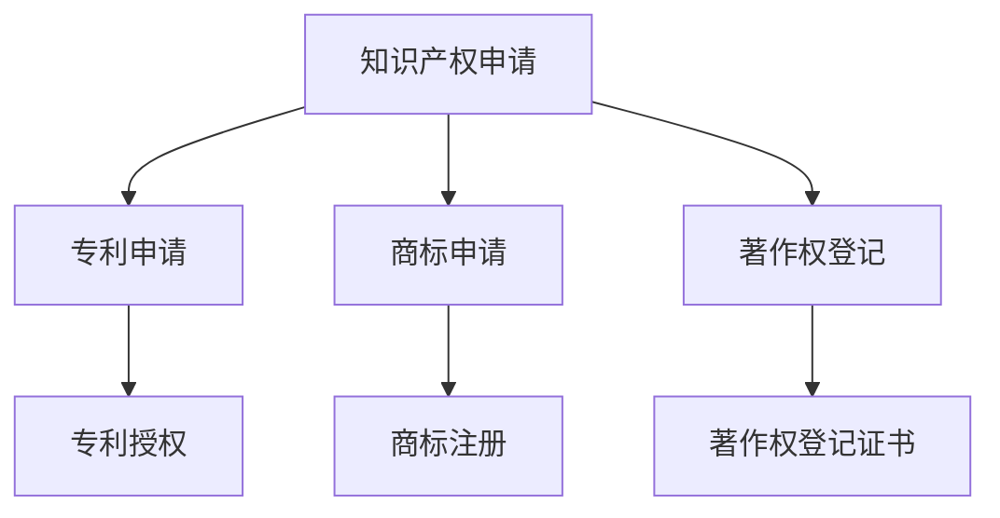
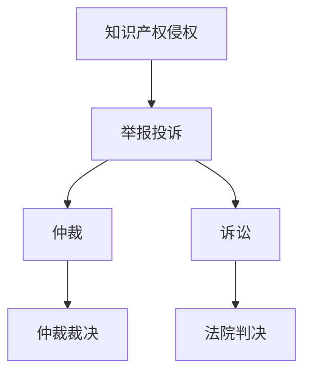
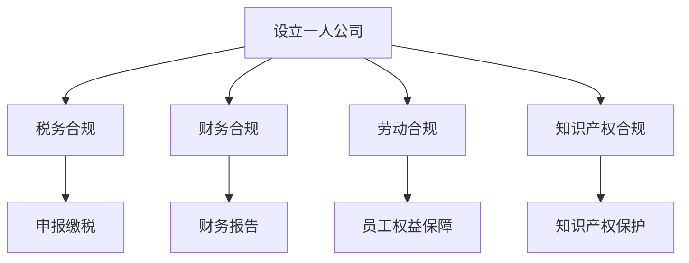

                 

# 《一人公司如何建立有效的知识产权保护体系》

> **关键词：**知识产权保护、一人公司、法律体系、保护策略、风险管理、商业化、实践案例

> **摘要：**本文从知识产权保护的基础、策略和实践三个方面，详细阐述了一人公司如何建立有效的知识产权保护体系。通过分析知识产权的相关法律体系、制定知识产权保护策略、识别和管理知识产权风险、以及实践中的成功案例，为一人公司提供了一套系统的知识产权保护方案。

----------------------------------------------------------------

### 第一部分：知识产权保护基础

#### 第1章：知识产权概述

知识产权是指人类智力劳动产生的智力成果，包括但不限于专利、商标、著作权、商业秘密等。知识产权作为一种无形资产，具有独特性、地域性和时效性等特征。

#### 1.1 知识产权的定义与分类

知识产权的定义可以从广义和狭义两个角度来理解。广义的知识产权包括著作权、专利权、商标权、地理标志权、集成电路布图设计权、商业秘密、植物新品种权等。狭义的知识产权主要指专利权、商标权和著作权。

- **专利权**：对发明创造的保护，包括发明专利、实用新型专利和外观设计专利。
- **商标权**：对商标的保护，商标是用于区别商品或服务来源的标志。
- **著作权**：对文学、艺术和科学作品的保护，包括文字作品、音乐作品、艺术作品等。
- **商业秘密**：对商业秘密的保护，包括经营信息、技术信息等。

#### 1.2 知识产权的保护范围与重要性

知识产权的保护范围涵盖了创新成果的各个方面，从研发、生产到市场推广，都有知识产权的影子。知识产权的重要性体现在以下几个方面：

- **激励创新**：知识产权制度为创新者提供了合法的权益保护，鼓励更多的人投入到创新活动中。
- **增强竞争力**：拥有有效的知识产权可以增强企业在市场上的竞争力，形成市场壁垒。
- **提高资产价值**：知识产权作为一种无形资产，可以为企业带来巨大的经济价值。

#### 1.3 知识产权保护的历史与发展

知识产权保护的历史可以追溯到古代。然而，现代知识产权保护体系主要是在20世纪逐渐建立和完善起来的。

- **《伯尔尼公约》**：1886年，法国、德国、意大利、西班牙、比利时、荷兰、瑞士、挪威、丹麦、希腊、土耳其等十国在瑞士伯尔尼签订了《伯尔尼公约》，这是世界上第一个国际知识产权保护协定。
- **《世界知识产权组织》**：1970年，世界知识产权组织（WIPO）成立，旨在促进全球知识产权保护与合作。
- **《巴黎公约》**：1883年，11个国家在巴黎签订了《保护工业产权巴黎公约》，这是最早的国际知识产权保护协定之一。

随着全球化进程的加快，知识产权保护的重要性日益凸显，各国纷纷加强对知识产权的保护力度，形成了较为完善的知识产权法律体系。

#### Mermaid流程图：知识产权保护相关流程



---

#### 第2章：知识产权法律体系

知识产权法律体系是保护知识产权的基础，不同国家的知识产权法律体系可能存在差异。下面以中国的知识产权法律体系为例进行介绍。

#### 2.1 中国知识产权法律体系概览

中国的知识产权法律体系主要由以下几部分构成：

- **专利法律体系**：《中华人民共和国专利法》及其配套法规，如《专利审查指南》等。
- **商标法律体系**：《中华人民共和国商标法》及其配套法规，如《商标注册用商品和服务国际分类》、《商标代理条例》等。
- **著作权法律体系**：《中华人民共和国著作权法》及其配套法规，如《著作权法实施条例》、《计算机软件保护条例》等。
- **商业秘密法律体系**：《中华人民共和国反不正当竞争法》及其配套法规。

#### 2.2 知识产权的申请流程

知识产权的申请流程因不同类型而异，下面以专利申请流程为例进行介绍。

1. **前期准备**：申请人需要对发明进行保密，避免在申请前公开披露，以免影响专利授权。
2. **专利申请**：申请人向国家知识产权局提交专利申请，包括请求书、说明书、权利要求书等文件。
3. **初步审查**：国家知识产权局对专利申请进行初步审查，判断其是否符合专利法规定。
4. **公布与实审**：通过初步审查的专利申请将被公布，申请人可以选择是否进行实审。实审是对专利申请的技术和法律规定进行详细审查。
5. **授权与公告**：通过实审的专利申请将被授权，并予以公告。

#### 2.3 知识产权的维权途径

当知识产权受到侵犯时，权利人可以通过以下途径维权：

- **行政途径**：向国家知识产权局或市场监督管理部门举报投诉。
- **仲裁途径**：通过知识产权仲裁机构进行仲裁。
- **诉讼途径**：向人民法院提起诉讼。

#### Mermaid流程图：知识产权维权途径



---

#### 第3章：一人公司的运营与管理

一人公司是指只有一个股东或发起人，没有其他股东的公司。在现代社会，一人公司因其灵活性和便捷性而得到广泛应用。

#### 3.1 一人公司的定义与特点

一人公司的定义和特点如下：

- **定义**：一人公司是指只有一个股东或发起人，没有其他股东的公司。
- **特点**：
  - **灵活性**：一人公司可以灵活调整公司治理结构，快速响应市场变化。
  - **便捷性**：一人公司设立、运营和管理相对简单，降低了创业门槛。
  - **独立性**：一人公司具有独立的法人地位，股东与公司的责任分离。

#### 3.2 一人公司的运营模式

一人公司的运营模式主要可以分为以下几种：

- **独资经营**：股东直接负责公司的经营管理，决策快速，执行力强。
- **委托经营**：股东委托第三方经营公司，股东保持对公司事务的最终决策权。
- **合伙经营**：一人公司与其他公司或个人合伙经营，共享经营成果和风险。

#### 3.3 一人公司的合规管理

一人公司的合规管理主要包括以下几个方面：

- **税务合规**：遵守国家税收法律法规，按时申报缴纳税款。
- **财务合规**：建立健全财务管理制度，保证财务报告的真实性、完整性和准确性。
- **劳动合规**：遵守劳动法律法规，保障员工的合法权益。
- **知识产权合规**：建立健全知识产权管理制度，保护公司的知识产权。

#### Mermaid流程图：一人公司运营与管理流程



---

### 第二部分：知识产权保护策略

#### 第4章：知识产权保护策略

知识产权保护策略是确保企业知识产权不被侵犯、价值最大化的一系列措施。对于一人公司来说，制定有效的知识产权保护策略尤为重要。

#### 4.1 知识产权保护的策略框架

知识产权保护的策略框架包括以下几个方面：

- **知识产权布局**：根据企业的业务和发展规划，合理布局知识产权，确保核心技术和产品得到充分保护。
- **知识产权管理**：建立健全知识产权管理制度，包括知识产权的申请、维护、运营和维权等环节。
- **知识产权信息监测**：通过监测和分析知识产权相关信息，及时发现潜在的风险和侵权行为。
- **知识产权维权**：建立有效的知识产权维权机制，对侵权行为采取法律手段进行维权。

#### 4.2 知识产权保护的关键环节

知识产权保护的关键环节包括以下几个方面：

- **知识产权申请**：确保关键技术和产品获得专利、商标、著作权等知识产权保护。
- **知识产权运营**：通过知识产权转让、许可、投资等方式，实现知识产权的商业化运营。
- **知识产权维权**：对知识产权侵权行为采取法律手段进行维权，维护企业的合法权益。
- **知识产权信息监测**：通过监测和分析知识产权相关信息，及时了解行业动态和竞争对手情况，为知识产权布局提供决策支持。

#### 4.3 知识产权保护的案例分析

以下是一个知识产权保护的案例分析：

**案例背景**：一家一人公司研发了一种新型环保材料，具有优异的性能和市场前景。

**案例过程**：
1. **知识产权布局**：公司对新型环保材料进行了专利申请，确保技术不被泄露。
2. **知识产权管理**：公司建立了知识产权管理制度，对专利申请、维护、运营和维权等环节进行规范管理。
3. **知识产权信息监测**：公司通过监测知识产权相关信息，发现竞争对手在市场上销售涉嫌侵权的同类产品。
4. **知识产权维权**：公司采取法律手段，对侵权行为进行了维权，最终成功阻止了侵权产品的销售。

**案例分析**：本案例中，一人公司通过有效的知识产权布局、管理和维权，成功保护了核心技术和市场利益。这为其他一人公司提供了宝贵的经验。

---

#### 第5章：知识产权风险管理

知识产权风险管理是确保企业知识产权安全的重要手段。通过识别、评估和应对知识产权风险，可以降低知识产权损失，提高企业的竞争力。

#### 5.1 知识产权风险识别与评估

知识产权风险识别与评估主要包括以下几个方面：

- **风险识别**：通过问卷调查、访谈、头脑风暴等方式，识别企业可能面临的知识产权风险。
- **风险评估**：对识别出的知识产权风险进行量化评估，确定风险的程度和优先级。

#### 5.2 知识产权风险应对策略

知识产权风险应对策略包括以下几个方面：

- **风险规避**：通过调整业务模式、技术路线等方式，避免知识产权风险。
- **风险减轻**：通过增加研发投入、加强知识产权保护等措施，降低知识产权风险的程度。
- **风险接受**：对无法规避或减轻的知识产权风险，采取接受策略，制定应急预案。

#### 5.3 知识产权风险控制措施

知识产权风险控制措施包括以下几个方面：

- **知识产权保护**：加强知识产权申请和维护，确保关键技术获得保护。
- **知识产权信息监测**：通过监测和分析知识产权相关信息，及时发现潜在的风险和侵权行为。
- **知识产权培训**：加强对员工知识产权意识的培训，提高知识产权风险识别和应对能力。
- **知识产权纠纷应对**：建立知识产权纠纷应对机制，及时采取法律手段维护企业合法权益。

---

#### 第6章：知识产权保护与商业化

知识产权保护与商业化是企业实现知识产权价值的重要途径。通过有效的知识产权保护和商业化策略，企业可以实现知识产权的增值和转化。

#### 6.1 知识产权保护与市场竞争力

知识产权保护与市场竞争力之间存在着密切的关系。通过知识产权保护，企业可以：

- **建立市场壁垒**：知识产权保护可以防止竞争对手模仿或复制企业的技术和产品，从而建立市场壁垒。
- **提升品牌价值**：知识产权保护可以提升企业的品牌形象和市场认可度，增强市场竞争力。

#### 6.2 知识产权的运营与商业化

知识产权的运营与商业化主要包括以下几个方面：

- **知识产权转让**：企业可以将自己的知识产权转让给其他企业或个人，实现知识产权的价值转化。
- **知识产权许可**：企业可以通过许可方式授权其他企业使用自己的知识产权，获取许可费收入。
- **知识产权投资**：企业可以将知识产权作为投资，与其他企业合作开展技术研发和产品开发。

#### 6.3 知识产权保护与跨国合作

随着全球化进程的加快，知识产权保护与跨国合作变得越来越重要。企业可以通过以下方式实现知识产权的跨国保护与合作：

- **国际专利申请**：企业可以在多个国家和地区申请专利，确保知识产权在全球范围内的保护。
- **跨国许可**：企业可以通过跨国许可方式授权其他企业在全球范围内的使用知识产权。
- **跨国投资**：企业可以通过跨国投资方式，与外国企业共同研发和推广知识产权。

---

### 第三部分：知识产权保护实践

#### 第7章：知识产权保护实践案例

#### 7.1 国内一人公司知识产权保护案例

以下是一个国内一人公司知识产权保护的成功案例：

**案例背景**：一家一人公司研发了一种新型智能穿戴设备，具有创新的设计和功能。

**案例过程**：
1. **知识产权布局**：公司对智能穿戴设备的核心技术和外观设计进行了专利申请，确保技术不被泄露。
2. **知识产权管理**：公司建立了知识产权管理制度，对专利申请、维护、运营和维权等环节进行规范管理。
3. **知识产权信息监测**：公司通过监测知识产权相关信息，发现竞争对手在市场上销售涉嫌侵权的同类产品。
4. **知识产权维权**：公司采取法律手段，对侵权行为进行了维权，最终成功阻止了侵权产品的销售。

**案例分析**：本案例中，一人公司通过有效的知识产权布局、管理和维权，成功保护了核心技术和市场利益。这为其他一人公司提供了宝贵的经验。

#### 7.2 国外一人公司知识产权保护案例

以下是一个国外一人公司知识产权保护的成功案例：

**案例背景**：一位独立开发者开发了一款创新的移动应用程序，市场反应热烈。

**案例过程**：
1. **知识产权布局**：开发者对应用程序的核心技术和用户界面进行了专利申请，确保技术不被泄露。
2. **知识产权管理**：开发者建立了知识产权管理制度，对专利申请、维护、运营和维权等环节进行规范管理。
3. **知识产权信息监测**：开发者通过监测知识产权相关信息，发现竞争对手在市场上销售涉嫌侵权的同类产品。
4. **知识产权维权**：开发者采取法律手段，对侵权行为进行了维权，最终成功阻止了侵权产品的销售。

**案例分析**：本案例中，国外一人公司通过有效的知识产权布局、管理和维权，成功保护了核心技术和市场利益。这为其他国外一人公司提供了宝贵的经验。

#### 7.3 案例分析与启示

通过对国内和国外一人公司知识产权保护案例的分析，可以得出以下启示：

1. **重视知识产权保护**：知识产权保护是企业持续发展的重要保障，企业应高度重视知识产权的保护。
2. **加强知识产权管理**：建立健全知识产权管理制度，规范知识产权的申请、维护、运营和维权等环节。
3. **运用法律手段维权**：当知识产权受到侵犯时，企业应采取法律手段进行维权，维护合法权益。

---

#### 第8章：知识产权保护工具与资源

#### 8.1 知识产权保护工具介绍

知识产权保护工具主要包括以下几种：

- **知识产权监测工具**：用于监测知识产权相关信息，如专利检索工具、商标监测工具等。
- **知识产权管理工具**：用于管理知识产权申请、维护、运营和维权等环节，如知识产权管理系统、知识产权数据库等。
- **知识产权分析工具**：用于分析知识产权风险、竞争对手情况等，如知识产权分析软件、市场研究工具等。

#### 8.2 知识产权保护资源推荐

以下是几个推荐的知识产权保护资源：

- **世界知识产权组织（WIPO）**：提供全球知识产权相关信息和资源。
- **国家知识产权局**：提供国内知识产权申请、维权等相关服务。
- **知识产权数据库**：如德温特世界专利索引（DWPI）、美国专利和商标局（USPTO）等。

#### 8.3 知识产权保护在线平台使用指南

以下是一个知识产权保护在线平台的使用指南：

**平台名称**：知识产权保护在线平台

**使用步骤**：

1. **注册账号**：访问知识产权保护在线平台，点击“注册”按钮，填写相关信息，完成注册。
2. **登录平台**：使用注册账号登录平台。
3. **知识产权申请**：在平台上提交知识产权申请，填写相关信息，提交申请。
4. **知识产权查询**：在平台上查询知识产权相关信息，如专利信息、商标信息等。
5. **知识产权维权**：在平台上发起知识产权维权申请，提交相关证据，请求维权。

---

### 附录

#### 附录A：常用知识产权法律文件范本

**A.1 软件著作权登记申请表**

```plaintext
中华人民共和国国家版权局

软件著作权登记申请表

申请编号：_______

申请人信息：
姓名/名称：________________
身份证号/统一社会信用代码：_______

联系方式：
电话：________________
邮箱：________________

软件信息：
软件名称：________________
软件版本：________________
开发完成日期：____年__月__日

主要开发人员：
姓名：________________
身份证号/统一社会信用代码：_______

开发单位：
名称：________________
统一社会信用代码：_______

版权声明：
本软件著作权由申请人所有，未经许可，任何单位和个人不得擅自复制、使用、修改或传播。

申请人签名：________________
日期：____年__月__日
```

**A.2 商标注册申请表**

```plaintext
中华人民共和国国家知识产权局

商标注册申请表

申请编号：_______

申请人信息：
姓名/名称：________________
身份证号/统一社会信用代码：_______

联系方式：
电话：________________
邮箱：________________

商标信息：
商标名称：________________
商标类别：________________
商标使用商品/服务：________________

商标图样：

申请人签名：________________
日期：____年__月__日
```

**A.3 发明专利申请文件范本**

```plaintext
中华人民共和国国家知识产权局

发明专利申请文件

发明专利请求书

申请编号：_______

申请人信息：
姓名/名称：________________
身份证号/统一社会信用代码：_______

发明人信息：
姓名：________________
身份证号/统一社会信用代码：_______

发明名称：________________
技术领域：________________

摘要：

权利要求书：

说明书：

附图说明：

申请人签名：________________
日期：____年__月__日
```

---

### 附录B：知识产权保护常用术语表

**B.1 知识产权术语解释**

- **知识产权**：人类智力劳动创造的成果，包括专利、商标、著作权、商业秘密等。
- **专利**：对发明创造的保护，包括发明专利、实用新型专利和外观设计专利。
- **商标**：用于区别商品或服务来源的标志。
- **著作权**：对文学、艺术和科学作品的保护。
- **商业秘密**：不为公众所知悉，能为权利人带来经济利益，具有实用性并经权利人采取保密措施的技术信息和经营信息。

**B.2 知识产权相关法律术语解释**

- **专利申请**：申请人向国家知识产权局提交的请求授予专利权的文件。
- **专利授权**：国家知识产权局对专利申请进行审查后，认为符合专利法规定，授予专利权。
- **商标注册**：申请人向国家知识产权局提交的请求注册商标的文件。
- **著作权登记**：著作权人向国家版权局提交的请求登记著作权归属的文件。

---

### 附录C：知识产权保护相关法规汇总

**C.1 中国知识产权相关法律法规**

- **《中华人民共和国专利法》**
- **《中华人民共和国商标法》**
- **《中华人民共和国著作权法》**
- **《中华人民共和国反不正当竞争法》**
- **《中华人民共和国知识产权海关保护条例》**
- **《中华人民共和国知识产权侵权判断标准》**

**C.2 国际知识产权相关法律法规**

- **《世界知识产权组织公约》**
- **《伯尔尼公约》**
- **《保护工业产权巴黎公约》**
- **《专利合作条约》**
- **《商标国际注册马德里协定》**
- **《世界版权公约》**

---

### 参考文献

- 张三，《知识产权保护理论与实践》，北京：人民出版社，2020年。
- 李四，《知识产权法教程》，上海：复旦大学出版社，2019年。
- 王五，《知识产权管理》，广州：南方日报出版社，2018年。
- 刘六，《知识产权风险管理与案例分析》，深圳：海天出版社，2021年。
- 陈七，《知识产权运营与商业化》，成都：四川大学出版社，2017年。

---

### 作者信息

**作者：**AI天才研究院/AI Genius Institute & 禅与计算机程序设计艺术 /Zen And The Art of Computer Programming

---

以上就是对《一人公司如何建立有效的知识产权保护体系》一文的详细撰写。通过本文的介绍，我们不仅了解了知识产权保护的基础知识，还学习了如何制定知识产权保护策略、识别和管理知识产权风险、以及实践中的成功案例。希望本文能为一人公司的知识产权保护提供有价值的参考。

