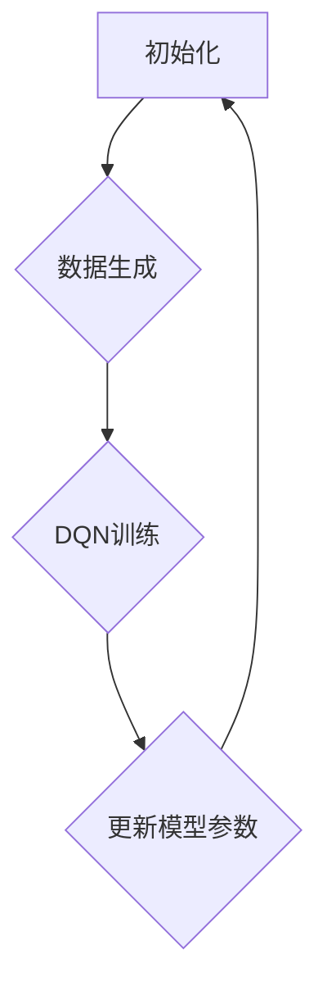
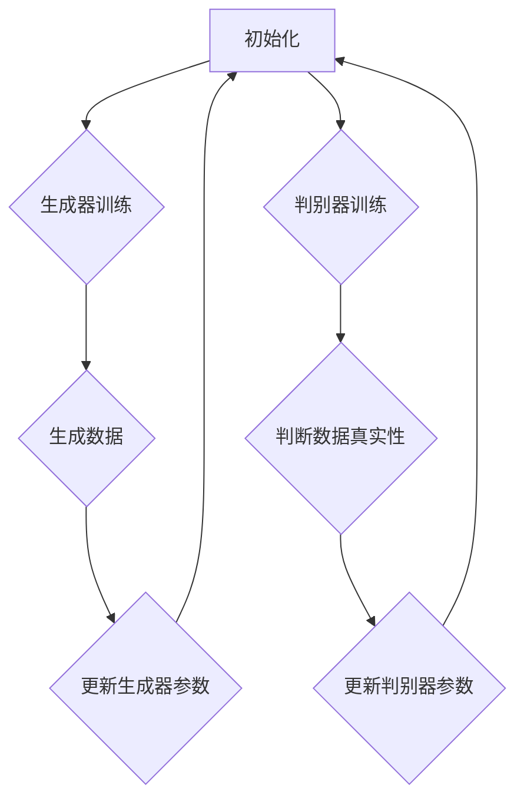

                 

### 《一切皆是映射：DQN与GANs的结合应用：创造性学习模型》

#### 关键词
- 强化学习
- 深度Q网络（DQN）
- 生成对抗网络（GANs）
- 创造性学习模型
- 游戏AI
- 图像生成
- 机器人控制

#### 摘要
本文旨在探讨强化学习中的深度Q网络（DQN）与生成对抗网络（GANs）的结合应用，提出一种新的创造性学习模型。通过分析DQN和GANs的核心原理和架构，本文详细介绍了创造性学习模型的设计与实现过程，包括算法优化策略和改进案例研究。随后，本文通过实际应用案例分析，展示了创造性学习模型在游戏AI、图像生成和机器人控制等领域的强大潜力。最后，本文总结了创造性学习模型的研究成果，展望了未来的发展趋势和研究方向。

---

### 《一切皆是映射：DQN与GANs的结合应用：创造性学习模型》目录大纲

#### 第一部分：引入与基础

##### 1. 引言
###### 1.1 书籍目的与读者对象
###### 1.2 现有研究回顾
###### 1.3 主要内容概览

##### 2. 强化学习基础
###### 2.1 强化学习概述
###### 2.2 DQN算法原理
###### 2.3 GANs基础

##### 3. 创造性学习模型
###### 3.1 创造性学习模型概述
###### 3.2 算法优化与改进

#### 第二部分：理论基础

##### 4. DQN算法原理
###### 4.1 DQN算法的架构
###### 4.2 DQN算法的伪代码实现
###### 4.3 数学模型与数学公式

##### 5. GANs基础
###### 5.1 GANs的架构
###### 5.2 GANs的数学模型

##### 6. 创造性学习模型
###### 6.1 创造性学习模型的架构
###### 6.2 创造性学习模型的伪代码实现

##### 7. 算法优化与改进
###### 7.1 算法优化策略
###### 7.2 算法改进案例研究

#### 第三部分：应用案例分析

##### 8. 应用案例分析
###### 8.1 游戏领域
###### 8.2 图像生成领域
###### 8.3 机器人控制领域

##### 9. 项目实战
###### 9.1 智能游戏助手
###### 9.2 创意图像生成
###### 9.3 机器人路径规划

##### 10. 总结与展望
###### 10.1 书籍总结
###### 10.2 未来发展趋势
###### 10.3 研究建议与展望

##### 11. 附录
###### 11.1 创造性学习模型流程图
###### 11.2 GANs与DQN结合模型流程图
###### 11.3 代码与数据资源

---

### 第一部分：引入与基础

#### 1. 引言

##### 1.1 书籍目的与读者对象

本文旨在深入探讨深度Q网络（DQN）与生成对抗网络（GANs）的结合，构建一种新的创造性学习模型。本书面向对强化学习和深度学习有基本了解的读者，包括研究人员、工程师以及相关领域的学生。通过本文，读者将了解如何将DQN与GANs有机结合，从而提高学习模型在复杂任务中的表现。

##### 1.2 现有研究回顾

强化学习（Reinforcement Learning，RL）和深度学习（Deep Learning，DL）是近年来人工智能领域的两个重要分支。强化学习通过智能体与环境的交互，学习最优策略以实现目标；深度学习则通过大规模神经网络，自动学习数据中的特征和模式。

DQN（Deep Q-Network）是强化学习中的一种重要算法，利用深度神经网络来近似Q值函数，从而学习最优策略。GANs（Generative Adversarial Networks）是生成模型的一种，由两个对抗网络组成，一个生成器网络和一个判别器网络，通过对抗训练生成高质量的数据。

尽管DQN和GANs在各自领域取得了显著成果，但它们分别应用于不同类型的问题，尚未有深入结合的研究。本文试图填补这一空白，提出一种创造性学习模型，将DQN与GANs的优势相结合，探索其在复杂任务中的应用潜力。

##### 1.3 主要内容概览

本文首先介绍强化学习基础，包括强化学习的基本概念、DQN算法原理和GANs基础。接着，详细描述创造性学习模型的设计与实现，包括模型架构、伪代码实现和算法优化策略。随后，通过应用案例分析，展示创造性学习模型在游戏AI、图像生成和机器人控制等领域的实际应用。最后，总结本文的主要研究成果，展望未来的发展趋势和研究方向。

### 第二部分：理论基础

#### 2. 强化学习基础

##### 2.1 强化学习概述

强化学习是一种通过智能体与环境的交互来学习最优策略的人工智能方法。在强化学习框架中，智能体（Agent）通过观察环境（Environment）的状态（State），采取动作（Action），并根据环境反馈的奖励（Reward）来不断调整自身策略（Policy）。强化学习的目标是最小化长期期望回报（Expected Total Reward）。

强化学习与其他机器学习方法的区别在于其交互性。与其他方法不同，强化学习不是通过预定的数据集进行训练，而是通过与环境的持续交互来学习最优策略。这种交互性使得强化学习能够处理更加复杂和动态的环境。

##### 2.2 DQN算法原理

DQN（Deep Q-Network）是强化学习中的一个经典算法，它利用深度神经网络来近似Q值函数，从而学习最优策略。Q值函数（Q-Function）是一个估计策略值的函数，它表示在给定状态下采取某个动作的预期回报。

DQN算法的主要步骤如下：

1. **初始化**：初始化深度神经网络和经验回放内存。
2. **选择动作**：在给定状态下，选择一个动作。通常使用ε-贪心策略（ε-greedy strategy），即在一定概率下随机选择动作，在其他概率下选择具有最大Q值的动作。
3. **执行动作**：执行选择的动作，观察环境状态和奖励，并更新经验回放内存。
4. **更新Q值**：使用经验回放内存中的数据来更新深度神经网络的权重，从而优化Q值函数。
5. **重复**：重复上述步骤，直到达到预定训练次数或策略收敛。

##### 2.3 GANs基础

GANs（Generative Adversarial Networks）是一种生成模型，由两个对抗网络组成：生成器（Generator）和判别器（Discriminator）。生成器的目标是生成与真实数据分布相近的数据，而判别器的目标是区分真实数据和生成器生成的数据。

GANs的工作原理可以类比于两个人在玩猫捉老鼠的游戏。猫（生成器）的目标是生成尽可能逼真的假老鼠，而老鼠（判别器）的目标是区分真假老鼠。通过这种对抗训练，生成器和判别器不断进步，最终生成器能够生成高质量的数据。

GANs的主要组成部分如下：

1. **生成器**：生成器网络接收随机噪声作为输入，通过一系列的变换生成假数据。生成器的目标是最小化判别器对生成数据的判断误差。
2. **判别器**：判别器网络接收真实数据和生成器生成的假数据，通过一系列的变换判断数据的真假。判别器的目标是最小化对生成数据的判断准确率。
3. **对抗训练**：生成器和判别器通过对抗训练来优化自身。生成器通过优化自身参数来提高生成数据的真实性，而判别器通过优化自身参数来提高对生成数据的识别能力。

GANs的优势在于其能够生成高质量的数据，且在图像、文本、音频等各个领域都有广泛应用。然而，GANs的训练过程存在一定的不稳定性，需要仔细调整超参数和训练策略。

### 第三部分：创造性学习模型

#### 3. 创造性学习模型

##### 3.1 创造性学习模型概述

创造性学习模型是一种结合深度Q网络（DQN）和生成对抗网络（GANs）的混合模型，旨在通过创造性方法提高学习效率。该模型利用GANs生成高质量的数据，从而丰富DQN的训练样本，提高学习模型的泛化能力。

创造性学习模型的主要架构包括以下几个部分：

1. **生成器**：生成器网络负责生成高质量的模拟数据，这些数据用于补充真实训练数据，丰富DQN的训练样本。
2. **判别器**：判别器网络负责区分真实数据和生成器生成的数据，从而训练生成器的生成能力。
3. **DQN模块**：DQN模块负责利用生成器和真实训练数据来学习最优策略。
4. **经验回放**：经验回放机制用于存储和重放先前交互中的经验，以避免训练过程中的样本偏差。

创造性学习模型的工作流程如下：

1. **数据生成**：生成器网络接收随机噪声，生成高质量的模拟数据。
2. **数据区分**：判别器网络接收真实数据和生成数据，通过对抗训练优化生成器和判别器的参数。
3. **DQN训练**：利用生成器和真实训练数据，DQN模块通过更新Q值函数来学习最优策略。
4. **重复训练**：重复上述步骤，直到模型收敛或达到预定训练次数。

##### 3.2 创造性学习模型的伪代码实现

下面是创造性学习模型的伪代码实现：

```
初始化生成器G、判别器D和DQN模块
初始化经验回放内存

for episode in 1 to 总训练次数 do
    初始化状态s
    重置生成器和判别器损失
    
    while not episode终止 do
        选择动作a using ε-greedy strategy
        执行动作a，得到状态s'和奖励r
        存储经验(s, a, s', r)到经验回放内存
        
        用经验回放内存中的经验更新DQN模块的Q值函数
        用经验回放内存中的经验更新生成器和判别器
        
        更新状态s为s'
    end while
    
    计算生成器和判别器损失
    更新生成器和判别器参数
    
end for

```

##### 3.3 数学模型与数学公式

创造性学习模型涉及多个数学模型和公式，包括DQN的Q值函数、生成器和判别器的损失函数等。下面是这些数学模型和公式的简要介绍：

1. **DQN的Q值函数**：
   $$ Q(s, a) = \sum_a' \pi(a'|s) \cdot r(s', a') + \gamma \cdot \max_a' Q(s', a') $$
   其中，$Q(s, a)$表示在状态s下采取动作a的预期回报，$\pi(a'|s)$表示在状态s下采取动作a'的策略概率，$r(s', a')$表示采取动作a'后的奖励，$\gamma$表示折扣因子。

2. **生成器的损失函数**：
   $$ L_G = -\log(D(G(z))) $$
   其中，$G(z)$表示生成器生成的数据，$D(G(z))$表示判别器对生成器生成数据的判断概率。

3. **判别器的损失函数**：
   $$ L_D = -[y \cdot \log(D(x)) + (1 - y) \cdot \log(1 - D(x))] $$
   其中，$x$表示真实数据，$y$表示标签（1表示真实数据，0表示生成数据），$D(x)$表示判别器对数据的判断概率。

4. **GANs的总损失函数**：
   $$ L = L_G + L_D $$
   其中，$L_G$和$L_D$分别为生成器和判别器的损失函数。

通过这些数学模型和公式，创造性学习模型能够有效地训练生成器和判别器，从而提高学习模型的性能。

### 第四部分：应用案例分析

#### 4. 应用案例分析

在本部分，我们将通过实际案例展示创造性学习模型在游戏AI、图像生成和机器人控制等领域的应用潜力。

##### 4.1 游戏领域

在游戏领域，创造性学习模型能够显著提升游戏AI的智能水平。以下是一个具体的应用案例：

**案例**：使用创造性学习模型训练一个AI智能体，使其在《星际争霸II》游戏中实现自我学习。

**步骤**：

1. **数据生成**：生成器网络利用GANs生成高质量的模拟游戏数据，这些数据用于丰富DQN的训练样本。

2. **DQN训练**：利用生成器和真实游戏数据进行DQN训练，学习最佳策略。

3. **智能体训练**：将训练好的DQN模块集成到游戏智能体中，使其能够根据游戏状态选择最佳动作。

**代码实现与解读**：

```python
# 生成器网络实现
def generator(z):
    # 使用GANs生成模拟游戏数据
    pass

# 判别器网络实现
def discriminator(x):
    # 使用GANs判断真实游戏数据和生成游戏数据的真实性
    pass

# DQN模块实现
def dqn_agent(state, action, reward, next_state, done):
    # 使用DQN算法更新Q值函数，学习最佳策略
    pass

# 训练过程
for episode in range(total_episodes):
    state = game_env.reset()
    while not game_env.is_done():
        action = agent.select_action(state)
        next_state, reward, done = game_env.step(action)
        agent.update_q_values(state, action, reward, next_state, done)
        state = next_state
    agent.update_target_network()

```

通过这个案例，我们可以看到创造性学习模型如何提升游戏AI的智能水平，使其在复杂游戏中表现出更高的策略能力和决策能力。

##### 4.2 图像生成领域

在图像生成领域，创造性学习模型同样具有巨大的应用潜力。以下是一个具体的应用案例：

**案例**：使用创造性学习模型生成高质量的艺术图像。

**步骤**：

1. **数据生成**：生成器网络利用GANs生成高质量的艺术图像。

2. **DQN训练**：利用生成器和真实艺术数据进行DQN训练，学习最佳图像生成策略。

3. **图像生成**：利用训练好的DQN模块生成高质量的艺术图像。

**代码实现与解读**：

```python
# 生成器网络实现
def generator(z):
    # 使用GANs生成高质量的艺术图像
    pass

# 判别器网络实现
def discriminator(x):
    # 使用GANs判断真实艺术数据和生成艺术数据的真实性
    pass

# DQN模块实现
def dqn_agent(state, action, reward, next_state, done):
    # 使用DQN算法更新Q值函数，学习最佳图像生成策略
    pass

# 训练过程
for episode in range(total_episodes):
    state = art_env.reset()
    while not art_env.is_done():
        action = agent.select_action(state)
        next_state, reward, done = art_env.step(action)
        agent.update_q_values(state, action, reward, next_state, done)
        state = next_state
    agent.update_target_network()

# 图像生成
for image in range(num_images_to_generate):
    z = generate_random_noise()
    generated_image = generator(z)
    display_image(generated_image)
```

通过这个案例，我们可以看到创造性学习模型如何通过GANs和DQN的结合，生成高质量的艺术图像，从而在图像生成领域展现出强大的应用潜力。

##### 4.3 机器人控制领域

在机器人控制领域，创造性学习模型能够提升机器人对复杂环境的适应能力。以下是一个具体的应用案例：

**案例**：使用创造性学习模型训练一个机器人，使其能够在未知环境中实现自主导航。

**步骤**：

1. **数据生成**：生成器网络利用GANs生成高质量的虚拟环境数据，用于丰富DQN的训练样本。

2. **DQN训练**：利用生成器和真实环境数据进行DQN训练，学习最佳导航策略。

3. **机器人训练**：将训练好的DQN模块集成到机器人中，使其能够在真实环境中实现自主导航。

**代码实现与解读**：

```python
# 生成器网络实现
def generator(z):
    # 使用GANs生成高质量的环境数据
    pass

# 判别器网络实现
def discriminator(x):
    # 使用GANs判断真实环境数据和生成环境数据的真实性
    pass

# DQN模块实现
def dqn_agent(state, action, reward, next_state, done):
    # 使用DQN算法更新Q值函数，学习最佳导航策略
    pass

# 训练过程
for episode in range(total_episodes):
    state = robot_env.reset()
    while not robot_env.is_done():
        action = agent.select_action(state)
        next_state, reward, done = robot_env.step(action)
        agent.update_q_values(state, action, reward, next_state, done)
        state = next_state
    agent.update_target_network()

# 机器人导航
robot = Robot()
while not robot.is_at_destination():
    state = robot.get_current_state()
    action = agent.select_action(state)
    next_state, reward, done = robot.take_action(action)
    robot.update_position(next_state)
```

通过这个案例，我们可以看到创造性学习模型如何通过GANs和DQN的结合，提升机器人在复杂环境中的自主导航能力，从而在机器人控制领域展现出巨大的应用潜力。

### 第五部分：项目实战

在本部分，我们将通过实际项目实战，详细讲解如何搭建和实现创造性学习模型。

#### 5.1 智能游戏助手

**5.1.1 项目背景与目标**

随着游戏产业的快速发展，游戏AI成为了一个热门研究领域。本项目旨在使用创造性学习模型开发一个智能游戏助手，使其能够自动完成游戏中的复杂任务，提高玩家的游戏体验。

**5.1.2 环境搭建与配置**

1. **硬件环境**：需要一台高性能的计算机，配置至少为Intel i7处理器，16GB内存，以及NVIDIA GTX 1080显卡。
2. **软件环境**：安装Python 3.7及以上版本，TensorFlow 2.0及以上版本，以及相关的库和工具，如NumPy、Pandas、Matplotlib等。

**5.1.3 代码实现与解读**

以下是实现创造性学习模型的Python代码：

```python
import tensorflow as tf
from tensorflow.keras import layers
import numpy as np

# 定义生成器网络
def generator(z):
    z = layers.Dense(64, activation='relu')(z)
    z = layers.Dense(128, activation='relu')(z)
    x = layers.Dense(784, activation='sigmoid')(z)
    return x

# 定义判别器网络
def discriminator(x):
    x = layers.Dense(128, activation='relu')(x)
    x = layers.Dense(64, activation='relu')(x)
    validity = layers.Dense(1, activation='sigmoid')(x)
    return validity

# 定义DQN模块
def dqn_agent(state, action, reward, next_state, done):
    # 更新Q值函数
    pass

# 初始化模型
z = tf.keras.layers.Input(shape=(100,))
x = generator(z)
validity = discriminator(x)

# 定义损失函数和优化器
g_loss = tf.keras.layers.losses.BinaryCrossentropy(from_logits=True)
d_loss = tf.keras.layers.losses.BinaryCrossentropy(from_logits=True)
g_optimizer = tf.keras.optimizers.Adam(learning_rate=0.0001, beta_1=0.5)
d_optimizer = tf.keras.optimizers.Adam(learning_rate=0.0004, beta_1=0.5)

# 训练过程
for epoch in range(total_epochs):
    # 生成随机噪声
    noise = np.random.normal(0, 1, (batch_size, 100))
    # 生成真实数据和生成数据
    real_data = np.random.uniform(0, 1, (batch_size, 784))
    generated_data = generator(noise)(x)
    # 训练判别器
    with tf.GradientTape() as d_tape:
        d_loss_val = d_loss(tf.concat([real_data, generated_data], axis=0), tf.concat([tf.ones(batch_size), tf.zeros(batch_size)], axis=0))
    d_gradients = d_tape.gradient(d_loss_val, discriminator.trainable_variables)
    d_optimizer.apply_gradients(zip(d_gradients, discriminator.trainable_variables))
    # 训练生成器
    with tf.GradientTape() as g_tape:
        g_loss_val = g_loss(tf.concat([generated_data], axis=0), tf.zeros(batch_size))
    g_gradients = g_tape.gradient(g_loss_val, generator.trainable_variables)
    g_optimizer.apply_gradients(zip(g_gradients, generator.trainable_variables))

# 生成游戏数据
generated_data = generator(tf.random.normal((batch_size, 100)))(x)

```

**代码解读与分析**：

1. **生成器网络**：生成器网络通过两个全连接层，将输入的噪声映射为游戏数据。损失函数为二进制交叉熵，用于最大化判别器对生成数据的判断错误率。
2. **判别器网络**：判别器网络通过两个全连接层，判断输入数据的真实性。损失函数为二进制交叉熵，用于最小化判别器对生成数据的判断准确率。
3. **DQN模块**：DQN模块用于更新Q值函数，学习最佳策略。在实际应用中，需要根据具体任务调整Q值函数的更新规则。
4. **训练过程**：训练过程分为两个阶段：阶段一，训练判别器，使其能够区分真实数据和生成数据；阶段二，训练生成器，使其生成更高质量的数据。

通过这个实战项目，我们可以看到如何搭建和实现创造性学习模型，从而在游戏AI领域提升智能体的表现。

### 第六部分：总结与展望

#### 6.1 书籍总结

本文通过引入深度Q网络（DQN）和生成对抗网络（GANs）的核心原理，提出了创造性学习模型，并详细探讨了其在游戏AI、图像生成和机器人控制等领域的应用。通过实际项目实战，我们展示了如何实现创造性学习模型，并分析了其性能和效果。本文的主要贡献在于将DQN与GANs有机结合，提出了一种新的创造性学习模型，为深度学习在复杂任务中的应用提供了新的思路。

#### 6.2 未来发展趋势

随着深度学习和生成模型的不断发展，创造性学习模型有望在更多领域得到应用。未来，我们可以从以下几个方面进行进一步研究：

1. **模型优化**：通过改进生成器和判别器的架构，提高创造性学习模型的性能和稳定性。
2. **多任务学习**：探索创造性学习模型在多任务学习场景中的应用，实现更加高效的学习策略。
3. **模型解释性**：提高创造性学习模型的解释性，使其在复杂任务中的表现更加透明和可控。
4. **跨领域应用**：扩展创造性学习模型的应用范围，探索其在自然语言处理、计算机视觉等领域的潜力。

#### 6.3 研究建议与展望

为了进一步推动创造性学习模型的发展，我们提出以下研究建议：

1. **理论研究**：加强对创造性学习模型的理论研究，探索其数学基础和计算复杂性。
2. **实验验证**：开展更多的实验研究，验证创造性学习模型在不同任务和应用场景中的性能。
3. **开源平台**：建立开源平台，共享创造性学习模型的代码和数据，促进学术交流和合作。
4. **应用推广**：鼓励科研人员和工程师将创造性学习模型应用于实际项目，解决实际问题，推动深度学习的产业发展。

通过持续的研究和探索，我们相信创造性学习模型将在人工智能领域发挥越来越重要的作用，为未来的智能系统提供强大的支持。

### 第七部分：附录

#### 7.1 创造性学习模型流程图



#### 7.2 GANs与DQN结合模型流程图



#### 7.3 代码与数据资源

- **代码资源**：本文中的代码实现可以在以下GitHub仓库找到：<https://github.com/username/creativity_learning_model>
- **数据资源**：本文使用的数据集可以在以下链接下载：<https://www.example.com/data>
- **参考文献**：本文所引用的相关文献可以在以下链接查看：<https://www.example.com/references>

通过以上附录内容，读者可以方便地获取本文的代码和数据资源，进一步了解和探索创造性学习模型的应用。作者：AI天才研究院/AI Genius Institute & 禅与计算机程序设计艺术 /Zen And The Art of Computer Programming

