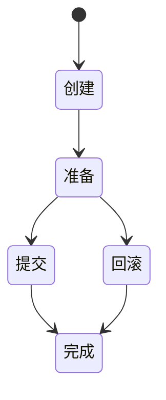
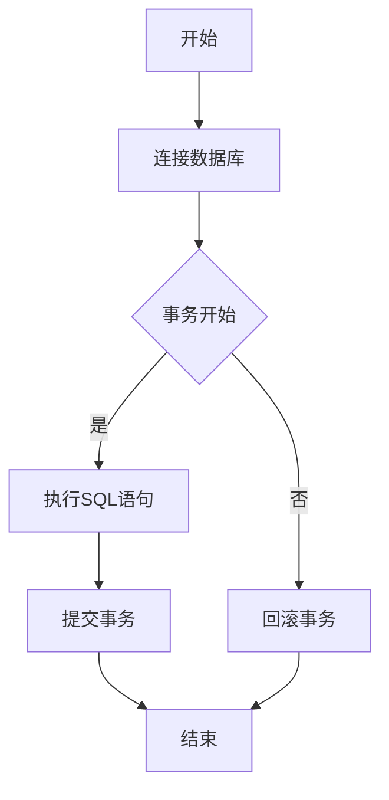

                 

# 《事务 原理与代码实例讲解》

> **关键词**：事务、数据库、并发控制、锁机制、恢复算法、代码实例

> **摘要**：本文将深入探讨事务的基本原理、实现方式及其在数据库系统中的应用。我们将通过代码实例详细解析事务的管理、并发控制和恢复机制，帮助读者全面理解事务处理的核心技术和实战应用。

## 目录大纲

1. **第一部分：事务基础理论**

    - 第1章：事务概述
    - 第2章：事务状态与生命周期
    - 第3章：并发控制与死锁

2. **第二部分：事务代码实现**

    - 第4章：事务编程基础
    - 第5章：事务管理器实现
    - 第6章：事务并发控制
    - 第7章：事务恢复机制

3. **第三部分：实战案例与代码实例**

    - 第8章：事务实际应用案例
    - 第9章：事务代码实例解析
    - 第10章：性能优化与案例分析

4. **附录**

    - 附录A：事务相关技术扩展
    - 附录B：学习资源推荐
    - 附录C：Mermaid流程图
    - 附录D：伪代码与数学模型

### 第一部分：事务基础理论

#### 第1章：事务概述

在本章中，我们将讨论事务的定义、重要性及其基本特性。事务是数据库管理系统中至关重要的概念，它确保了数据的完整性、一致性和可靠性。

**1.1 事务的定义与重要性**

事务是一个原子操作序列，它要么全部完成，要么全部失败。在数据库系统中，事务用于执行多个数据库操作，如插入、更新、删除等，以确保数据的一致性。事务的重要性在于：

- **数据完整性**：事务确保了数据的完整性，防止了部分更新导致的数据不一致。
- **一致性**：事务保证了一系列操作的结果符合预定的业务规则。
- **可靠性**：事务提供了故障恢复机制，即使系统出现故障，也能够恢复到一致状态。

**1.2 事务的类型**

根据ACID属性，事务可以分为以下几种类型：

- **读未提交（Read Uncommitted）**：最低隔离级别，事务可以看到其他未提交事务的修改。
- **读已提交（Read Committed）**：事务只能看到已经提交的修改。
- **可重复读（Repeatable Read）**：事务在执行过程中看到的同一数据不会发生变化，直到事务结束。
- **序列化（Serializable）**：最高隔离级别，事务执行顺序等同于顺序执行。

**1.3 事务的基本特性**

事务具有以下基本特性：

- **原子性（Atomicity）**：事务是一个不可分割的操作序列，要么全部完成，要么全部失败。
- **一致性（Consistency）**：事务保证数据的一致性，即数据库状态从初始状态转移到最终状态。
- **隔离性（Isolation）**：事务的执行互不干扰，一个事务的中间结果对其他事务不可见。
- **持久性（Durability）**：一旦事务提交，其对数据库的修改将永久保存，即使系统故障也不会丢失。

**1.4 事务在数据库系统中的作用**

事务在数据库系统中的作用主要体现在以下几个方面：

- **保证数据一致性**：事务确保了多个操作之间的数据一致性，防止了部分更新导致的数据不一致。
- **支持并发操作**：事务提供了并发控制机制，允许多个事务同时执行，提高系统性能。
- **故障恢复**：事务提供了故障恢复机制，即使在系统故障的情况下，也能够恢复到一致状态。

#### 第2章：事务状态与生命周期

在本章中，我们将讨论事务的状态转移图、生命周期管理以及隔离级别与锁机制。

**2.1 事务状态转移图**

事务状态转移图描述了事务从创建到提交或回滚的整个过程。以下是事务状态转移图的简要描述：



- **创建**：事务开始时，处于创建状态。
- **准备**：事务执行过程中，处于准备状态。
- **提交**：事务执行完成后，提交事务，进入提交状态。
- **回滚**：事务执行失败或需要回滚时，回滚事务，进入回滚状态。
- **完成**：事务提交或回滚后，进入完成状态。

**2.2 事务生命周期管理**

事务的生命周期包括创建、执行、提交和回滚等阶段。以下是事务生命周期管理的简要描述：

- **创建**：系统为每个事务生成唯一的标识符，并初始化事务状态。
- **执行**：事务执行一系列数据库操作，如插入、更新、删除等。
- **提交**：事务执行完成后，将修改持久化到数据库中，并释放资源。
- **回滚**：事务执行失败或需要回滚时，撤销所有已执行的操作，恢复到初始状态。

**2.3 隔离级别与锁机制**

隔离级别决定了事务之间的隔离程度，锁机制用于实现并发控制。以下是隔离级别与锁机制的简要描述：

- **读未提交**：事务可以看到其他未提交事务的修改，使用共享锁。
- **读已提交**：事务只能看到其他已提交事务的修改，使用共享锁。
- **可重复读**：事务在执行过程中看到的同一数据不会发生变化，使用共享锁。
- **序列化**：事务执行顺序等同于顺序执行，使用排他锁。

锁机制主要包括以下类型：

- **共享锁（Shared Lock）**：允许多个事务同时读取同一数据，但不允许修改。
- **排他锁（Exclusive Lock）**：仅允许一个事务修改数据，其他事务无法读取或修改。

**2.4 隔离级别与锁机制的关系**

隔离级别与锁机制密切相关。不同隔离级别对应不同的锁机制：

- **读未提交**：使用共享锁，事务可以看到其他未提交事务的修改。
- **读已提交**：使用共享锁，事务只能看到其他已提交事务的修改。
- **可重复读**：使用共享锁，事务在执行过程中看到的同一数据不会发生变化。
- **序列化**：使用排他锁，事务执行顺序等同于顺序执行。

#### 第3章：并发控制与死锁

在本章中，我们将讨论并发控制的基本概念、活锁与死锁以及死锁避免与死锁检测算法。

**3.1 并发控制的基本概念**

并发控制是数据库管理系统中的重要机制，用于确保多个事务的执行互不干扰，防止数据冲突和一致性问题。并发控制的基本概念包括：

- **事务**：并发控制的执行单元，一个事务由一系列数据库操作组成。
- **并发**：多个事务同时执行，提高系统性能。
- **冲突**：多个事务对同一数据项同时进行读写操作，导致数据不一致。
- **一致性**：确保多个事务执行后，数据库状态保持一致。

**3.2 活锁与死锁**

并发控制中的活锁和死锁是两种常见的问题。

- **活锁**：当一个事务在等待其他事务释放锁时，由于其他事务不断重试，导致当前事务一直无法获得锁，从而陷入等待状态。
- **死锁**：多个事务在执行过程中互相等待对方释放锁，导致所有事务都无法继续执行。

**3.3 死锁避免与死锁检测算法**

为了防止死锁，数据库管理系统采用死锁避免和死锁检测算法。

- **死锁避免**：通过资源分配策略和事务调度策略，避免死锁的发生。常见的死锁避免算法包括资源分配图、银行家算法等。
- **死锁检测**：通过周期性地检查资源分配状态，发现并解决死锁。常见的死锁检测算法包括等待图、超图等。

**3.4 死锁避免与死锁检测算法的比较**

死锁避免和死锁检测算法各有优缺点。

- **死锁避免**：能够避免死锁的发生，但可能牺牲一定的性能。死锁避免算法需要严格遵循资源分配策略和事务调度策略，可能导致资源利用率降低。
- **死锁检测**：能够在死锁发生后及时发现并解决死锁，但可能引入一定的性能开销。死锁检测算法需要周期性地检查资源分配状态，可能影响系统性能。

#### 第4章：事务编程基础

在本章中，我们将讨论事务编程模型、事务API的使用以及事务代码示例。

**4.1 事务编程模型**

事务编程模型包括以下方面：

- **事务定义**：定义事务的起始点和结束点，确保事务的原子性。
- **事务控制**：控制事务的提交和回滚，确保事务的一致性。
- **并发控制**：通过锁机制实现事务的隔离性。
- **故障恢复**：在系统故障时，恢复事务到一致状态。

**4.2 事务API的使用**

不同数据库系统提供了丰富的事务API，以下是一些常见的事务API：

- **开始事务（BEGIN TRANSACTION）**：开始一个新的事务。
- **提交事务（COMMIT）**：将事务的修改持久化到数据库中。
- **回滚事务（ROLLBACK）**：撤销事务的修改，恢复到初始状态。
- **设置隔离级别（SET TRANSACTION ISOLATION LEVEL）**：设置事务的隔离级别。

**4.3 事务代码示例**

以下是一个简单的事务代码示例：

```java
public void transferMoney(int fromAccount, int toAccount, double amount) {
    Connection conn = DriverManager.getConnection("jdbc:mysql://localhost:3306/bank", "root", "password");
    conn.setAutoCommit(false); // 设置为手动提交
    
    try {
        // 更新转出账户余额
        String updateFromAccount = "UPDATE account SET balance = balance - ? WHERE account_id = ?";
        PreparedStatement pstmtFrom = conn.prepareStatement(updateFromAccount);
        pstmtFrom.setDouble(1, amount);
        pstmtFrom.setInt(2, fromAccount);
        pstmtFrom.executeUpdate();
        
        // 更新转入账户余额
        String updateToAccount = "UPDATE account SET balance = balance + ? WHERE account_id = ?";
        PreparedStatement pstmtTo = conn.prepareStatement(updateToAccount);
        pstmtTo.setDouble(1, amount);
        pstmtTo.setInt(2, toAccount);
        pstmtTo.executeUpdate();
        
        conn.commit(); // 提交事务
    } catch (SQLException e) {
        conn.rollback(); // 回滚事务
        e.printStackTrace();
    } finally {
        conn.setAutoCommit(true); // 恢复自动提交
        conn.close(); // 关闭连接
    }
}
```

#### 第5章：事务管理器实现

在本章中，我们将讨论事务管理器的设计、API实现以及事务管理器的代码解读。

**5.1 事务管理器的设计**

事务管理器是负责管理事务的生命周期的组件。事务管理器的主要职责包括：

- **事务创建**：创建新的事务。
- **事务提交**：将事务的修改持久化到数据库中。
- **事务回滚**：撤销事务的修改，恢复到初始状态。
- **事务恢复**：在系统故障时，恢复事务到一致状态。

事务管理器的设计应考虑以下几个方面：

- **原子性**：确保事务的原子性，即事务要么全部完成，要么全部失败。
- **一致性**：确保事务的一致性，即数据库状态从初始状态转移到最终状态。
- **隔离性**：确保事务的隔离性，即事务的执行互不干扰。
- **持久性**：确保事务的持久性，即事务一旦提交，其对数据库的修改将永久保存。

**5.2 事务管理器的API实现**

以下是一个简单的事务管理器API实现：

```java
public class TransactionManager {
    private Connection conn;
    
    public TransactionManager(Connection conn) {
        this.conn = conn;
    }
    
    public void beginTransaction() {
        try {
            conn.setAutoCommit(false); // 设置为手动提交
        } catch (SQLException e) {
            e.printStackTrace();
        }
    }
    
    public void commitTransaction() {
        try {
            conn.commit(); // 提交事务
        } catch (SQLException e) {
            e.printStackTrace();
        }
    }
    
    public void rollbackTransaction() {
        try {
            conn.rollback(); // 回滚事务
        } catch (SQLException e) {
            e.printStackTrace();
        }
    }
    
    public void setAutoCommit(boolean autoCommit) {
        try {
            conn.setAutoCommit(autoCommit); // 设置自动提交
        } catch (SQLException e) {
            e.printStackTrace();
        }
    }
}
```

**5.3 事务管理器的代码解读**

事务管理器的代码实现主要包括以下方面：

- **构造函数**：接受数据库连接对象作为参数，初始化事务管理器。
- **beginTransaction()**：设置数据库连接为手动提交模式，开始新的事务。
- **commitTransaction()**：提交事务，将修改持久化到数据库中。
- **rollbackTransaction()**：回滚事务，撤销已执行的操作，恢复到初始状态。
- **setAutoCommit()**：设置数据库连接的自动提交模式。

通过以上方法，事务管理器可以方便地管理事务的生命周期，确保事务的原子性、一致性、隔离性和持久性。

#### 第6章：事务并发控制

在本章中，我们将讨论并发控制的基本概念、锁机制的设计与实现以及并发控制代码实例。

**6.1 并发控制的基本概念**

并发控制是数据库管理系统中的重要机制，用于确保多个事务的执行互不干扰，防止数据冲突和一致性问题。并发控制的基本概念包括：

- **事务**：并发控制的执行单元，一个事务由一系列数据库操作组成。
- **并发**：多个事务同时执行，提高系统性能。
- **冲突**：多个事务对同一数据项同时进行读写操作，导致数据不一致。
- **一致性**：确保多个事务执行后，数据库状态保持一致。

**6.2 锁机制的设计与实现**

锁机制是并发控制的核心，用于实现事务的隔离性。锁机制的设计与实现包括以下方面：

- **锁的类型**：包括共享锁（Shared Lock）和排他锁（Exclusive Lock）。
- **锁的粒度**：包括行级锁、页级锁和表级锁。
- **锁的获取与释放**：事务在执行过程中获取和释放锁，确保数据的隔离性。

以下是锁机制的设计与实现：

```java
public class LockManager {
    private ConcurrentHashMap<Object, Object> locks;
    
    public LockManager() {
        locks = new ConcurrentHashMap<>();
    }
    
    public void lock(Object key) {
        synchronized (locks) {
            locks.put(key, "locked");
        }
    }
    
    public void unlock(Object key) {
        synchronized (locks) {
            locks.remove(key);
        }
    }
}
```

**6.3 并发控制代码实例**

以下是一个简单的并发控制代码实例：

```java
public class ConcurrentControlExample {
    private LockManager lockManager;
    
    public ConcurrentControlExample(LockManager lockManager) {
        this.lockManager = lockManager;
    }
    
    public void transferMoney(int fromAccount, int toAccount, double amount) {
        lockManager.lock(fromAccount);
        lockManager.lock(toAccount);
        
        // 更新转出账户余额
        String updateFromAccount = "UPDATE account SET balance = balance - ? WHERE account_id = ?";
        // 更新转入账户余额
        String updateToAccount = "UPDATE account SET balance = balance + ? WHERE account_id = ?";
        
        try {
            Connection conn = DriverManager.getConnection("jdbc:mysql://localhost:3306/bank", "root", "password");
            conn.setAutoCommit(false);
            
            // 更新转出账户余额
            PreparedStatement pstmtFrom = conn.prepareStatement(updateFromAccount);
            pstmtFrom.setDouble(1, amount);
            pstmtFrom.setInt(2, fromAccount);
            pstmtFrom.executeUpdate();
            
            // 更新转入账户余额
            PreparedStatement pstmtTo = conn.prepareStatement(updateToAccount);
            pstmtTo.setDouble(1, amount);
            pstmtTo.setInt(2, toAccount);
            pstmtTo.executeUpdate();
            
            conn.commit();
        } catch (SQLException e) {
            e.printStackTrace();
        } finally {
            lockManager.unlock(fromAccount);
            lockManager.unlock(toAccount);
        }
    }
}
```

通过以上代码实例，我们可以看到如何使用锁机制实现并发控制。在执行转账操作时，首先获取转出账户和转入账户的锁，然后更新账户余额。如果获取锁失败，事务将回滚，确保数据的一致性。

#### 第7章：事务恢复机制

在本章中，我们将讨论事务恢复机制概述、数据库日志管理以及恢复算法的实现。

**7.1 事务恢复机制概述**

事务恢复机制是数据库管理系统中的重要组成部分，用于确保事务的持久性和一致性。事务恢复机制包括以下方面：

- **日志管理**：记录事务的执行过程和修改操作，为恢复提供依据。
- **检查点**：定期记录数据库的状态，为恢复提供参考点。
- **恢复算法**：根据日志和检查点信息，恢复数据库到一致状态。

事务恢复机制的作用包括：

- **故障恢复**：在系统故障时，恢复事务到一致状态。
- **持久性保障**：确保事务一旦提交，其对数据库的修改将永久保存。
- **一致性维护**：确保多个事务执行后，数据库状态保持一致。

**7.2 数据库日志管理**

数据库日志管理是事务恢复机制的核心，用于记录事务的执行过程和修改操作。数据库日志主要包括以下类型：

- **更新日志**：记录事务对数据库的修改操作，如插入、更新、删除等。
- **提交日志**：记录事务的提交信息，如事务标识符、提交时间等。
- **回滚日志**：记录事务的回滚信息，如事务标识符、回滚时间等。

数据库日志管理的主要任务包括：

- **日志记录**：将事务的执行过程和修改操作记录到日志中。
- **日志存储**：将日志存储到磁盘或其他持久存储设备中，确保日志的持久性。
- **日志维护**：定期检查日志的完整性，确保日志的正确性和可靠性。

**7.3 恢复算法的实现**

恢复算法根据日志和检查点信息，恢复数据库到一致状态。常见的恢复算法包括以下几种：

- **前滚恢复（Rollforward Recovery）**：根据日志记录，将数据库恢复到最新状态。前滚恢复算法的伪代码如下：

  ```python
  def rollforward_recovery(log_file):
      for entry in log_file:
          if entry.type == "update":
              apply_update(entry)
  ```

  其中，`entry` 表示日志记录，`apply_update` 表示应用修改操作。

- **回滚恢复（Rollback Recovery）**：根据回滚日志，将数据库恢复到事务提交前的状态。回滚恢复算法的伪代码如下：

  ```python
  def rollback_recovery(log_file):
      for entry in log_file:
          if entry.type == "update":
              reverse_apply_update(entry)
  ```

  其中，`entry` 表示回滚日志记录，`reverse_apply_update` 表示撤销修改操作。

- **混合恢复（Hybrid Recovery）**：结合前滚恢复和回滚恢复，根据不同情况选择合适的恢复算法。混合恢复算法的伪代码如下：

  ```python
  def hybrid_recovery(log_file, checkpoint):
      if checkpoint:
          apply_checkpoint(checkpoint)
      else:
          rollback_recovery(log_file)
      rollforward_recovery(log_file)
  ```

  其中，`checkpoint` 表示检查点信息，`apply_checkpoint` 表示应用检查点信息。

通过以上恢复算法的实现，数据库管理系统可以有效地恢复到一致状态，确保数据的持久性和一致性。

#### 第8章：事务实际应用案例

在本章中，我们将探讨事务在实际应用案例中的处理方法，包括社交网络、金融交易系统和电子商务平台。

**8.1 社交网络中的事务处理**

在社交网络中，事务处理主要用于用户关系、内容发布和隐私保护等方面。以下是一些典型的社交网络事务处理场景：

- **用户关系**：当用户添加好友时，需要同时更新用户表和好友关系表，确保数据一致性。以下是一个简单的用户添加好友的事务处理示例：

  ```java
  public void addUserFriend(int userId, int friendId) {
      Connection conn = DriverManager.getConnection("jdbc:mysql://localhost:3306/social_network", "root", "password");
      conn.setAutoCommit(false);
      
      try {
          // 更新用户表
          String updateUser = "UPDATE user SET friends = friends + ? WHERE user_id = ?";
          PreparedStatement pstmtUser = conn.prepareStatement(updateUser);
          pstmtUser.setInt(1, friendId);
          pstmtUser.setInt(2, userId);
          pstmtUser.executeUpdate();
          
          // 更新好友关系表
          String updateFriend = "INSERT INTO friend (user_id, friend_id) VALUES (?, ?)";
          PreparedStatement pstmtFriend = conn.prepareStatement(updateFriend);
          pstmtFriend.setInt(1, userId);
          pstmtFriend.setInt(2, friendId);
          pstmtFriend.executeUpdate();
          
          conn.commit();
      } catch (SQLException e) {
          conn.rollback();
          e.printStackTrace();
      } finally {
          conn.setAutoCommit(true);
          conn.close();
      }
  }
  ```

- **内容发布**：在内容发布过程中，需要同时处理内容表和用户表，确保内容发布的原子性。以下是一个简单的内容发布事务处理示例：

  ```java
  public void publishContent(int userId, String content) {
      Connection conn = DriverManager.getConnection("jdbc:mysql://localhost:3306/social_network", "root", "password");
      conn.setAutoCommit(false);
      
      try {
          // 更新用户表
          String updateUser = "UPDATE user SET posts = posts + ? WHERE user_id = ?";
          PreparedStatement pstmtUser = conn.prepareStatement(updateUser);
          pstmtUser.setString(1, content);
          pstmtUser.setInt(2, userId);
          pstmtUser.executeUpdate();
          
          // 插入内容表
          String insertContent = "INSERT INTO content (user_id, content) VALUES (?, ?)";
          PreparedStatement pstmtContent = conn.prepareStatement(insertContent);
          pstmtContent.setInt(1, userId);
          pstmtContent.setString(2, content);
          pstmtContent.executeUpdate();
          
          conn.commit();
      } catch (SQLException e) {
          conn.rollback();
          e.printStackTrace();
      } finally {
          conn.setAutoCommit(true);
          conn.close();
      }
  }
  ```

- **隐私保护**：在处理用户隐私信息时，需要确保数据的隔离性和一致性。以下是一个简单的用户隐私信息修改事务处理示例：

  ```java
  public void updatePrivacy(int userId, String privacy) {
      Connection conn = DriverManager.getConnection("jdbc:mysql://localhost:3306/social_network", "root", "password");
      conn.setAutoCommit(false);
      
      try {
          // 更新用户隐私信息
          String updatePrivacy = "UPDATE user SET privacy = ? WHERE user_id = ?";
          PreparedStatement pstmtPrivacy = conn.prepareStatement(updatePrivacy);
          pstmtPrivacy.setString(1, privacy);
          pstmtPrivacy.setInt(2, userId);
          pstmtPrivacy.executeUpdate();
          
          conn.commit();
      } catch (SQLException e) {
          conn.rollback();
          e.printStackTrace();
      } finally {
          conn.setAutoCommit(true);
          conn.close();
      }
  }
  ```

**8.2 金融交易系统的事务处理**

金融交易系统的事务处理主要用于股票交易、基金投资和信用卡支付等方面。以下是一些典型的金融交易系统事务处理场景：

- **股票交易**：在股票交易过程中，需要同时更新账户表、交易记录表和股票余额表，确保交易的一致性。以下是一个简单的股票交易事务处理示例：

  ```java
  public void tradeStock(int accountId, int stockId, int quantity, double price) {
      Connection conn = DriverManager.getConnection("jdbc:mysql://localhost:3306/financial_trade", "root", "password");
      conn.setAutoCommit(false);
      
      try {
          // 更新账户表
          String updateAccount = "UPDATE account SET balance = balance - ? WHERE account_id = ?";
          PreparedStatement pstmtAccount = conn.prepareStatement(updateAccount);
          pstmtAccount.setDouble(1, price * quantity);
          pstmtAccount.setInt(2, accountId);
          pstmtAccount.executeUpdate();
          
          // 更新交易记录表
          String insertTransaction = "INSERT INTO transaction (account_id, stock_id, quantity, price, transaction_date) VALUES (?, ?, ?, ?, CURRENT_TIMESTAMP)";
          PreparedStatement pstmtTransaction = conn.prepareStatement(insertTransaction);
          pstmtTransaction.setInt(1, accountId);
          pstmtTransaction.setInt(2, stockId);
          pstmtTransaction.setInt(3, quantity);
          pstmtTransaction.setDouble(4, price);
          pstmtTransaction.executeUpdate();
          
          // 更新股票余额表
          String updateStock = "UPDATE stock SET balance = balance - ? WHERE stock_id = ?";
          PreparedStatement pstmtStock = conn.prepareStatement(updateStock);
          pstmtStock.setInt(1, quantity);
          pstmtStock.setInt(2, stockId);
          pstmtStock.executeUpdate();
          
          conn.commit();
      } catch (SQLException e) {
          conn.rollback();
          e.printStackTrace();
      } finally {
          conn.setAutoCommit(true);
          conn.close();
      }
  }
  ```

- **基金投资**：在基金投资过程中，需要同时更新账户表、基金记录表和投资记录表，确保投资的一致性。以下是一个简单的基金投资事务处理示例：

  ```java
  public void investFund(int accountId, int fundId, double amount) {
      Connection conn = DriverManager.getConnection("jdbc:mysql://localhost:3306/financial_trade", "root", "password");
      conn.setAutoCommit(false);
      
      try {
          // 更新账户表
          String updateAccount = "UPDATE account SET balance = balance - ? WHERE account_id = ?";
          PreparedStatement pstmtAccount = conn.prepareStatement(updateAccount);
          pstmtAccount.setDouble(1, amount);
          pstmtAccount.setInt(2, accountId);
          pstmtAccount.executeUpdate();
          
          // 更新基金记录表
          String insertFund = "INSERT INTO fund (account_id, fund_id, amount, investment_date) VALUES (?, ?, ?, CURRENT_TIMESTAMP)";
          PreparedStatement pstmtFund = conn.prepareStatement(insertFund);
          pstmtFund.setInt(1, accountId);
          pstmtFund.setInt(2, fundId);
          pstmtFund.setDouble(3, amount);
          pstmtFund.executeUpdate();
          
          conn.commit();
      } catch (SQLException e) {
          conn.rollback();
          e.printStackTrace();
      } finally {
          conn.setAutoCommit(true);
          conn.close();
      }
  }
  ```

- **信用卡支付**：在信用卡支付过程中，需要同时更新账户表、支付记录表和商家账户表，确保支付的一致性。以下是一个简单的信用卡支付事务处理示例：

  ```java
  public void payCredit(int accountId, int merchantId, double amount) {
      Connection conn = DriverManager.getConnection("jdbc:mysql://localhost:3306/financial_trade", "root", "password");
      conn.setAutoCommit(false);
      
      try {
          // 更新账户表
          String updateAccount = "UPDATE account SET balance = balance - ? WHERE account_id = ?";
          PreparedStatement pstmtAccount = conn.prepareStatement(updateAccount);
          pstmtAccount.setDouble(1, amount);
          pstmtAccount.setInt(2, accountId);
          pstmtAccount.executeUpdate();
          
          // 更新支付记录表
          String insertPayment = "INSERT INTO payment (account_id, merchant_id, amount, payment_date) VALUES (?, ?, ?, CURRENT_TIMESTAMP)";
          PreparedStatement pstmtPayment = conn.prepareStatement(insertPayment);
          pstmtPayment.setInt(1, accountId);
          pstmtPayment.setInt(2, merchantId);
          pstmtPayment.setDouble(3, amount);
          pstmtPayment.executeUpdate();
          
          // 更新商家账户表
          String updateMerchant = "UPDATE merchant SET balance = balance + ? WHERE merchant_id = ?";
          PreparedStatement pstmtMerchant = conn.prepareStatement(updateMerchant);
          pstmtMerchant.setDouble(1, amount);
          pstmtMerchant.setInt(2, merchantId);
          pstmtMerchant.executeUpdate();
          
          conn.commit();
      } catch (SQLException e) {
          conn.rollback();
          e.printStackTrace();
      } finally {
          conn.setAutoCommit(true);
          conn.close();
      }
  }
  ```

**8.3 电子商务平台的事务处理**

电子商务平台的事务处理主要用于订单处理、库存管理和支付处理等方面。以下是一些典型的电子商务平台事务处理场景：

- **订单处理**：在订单处理过程中，需要同时更新订单表、库存表和支付记录表，确保订单的一致性。以下是一个简单的订单处理事务处理示例：

  ```java
  public void processOrder(int orderId, int customerId, int productId, int quantity, double price) {
      Connection conn = DriverManager.getConnection("jdbc:mysql://localhost:3306/e-commerce", "root", "password");
      conn.setAutoCommit(false);
      
      try {
          // 更新订单表
          String updateOrder = "UPDATE order SET customer_id = ?, product_id = ?, quantity = ?, price = ?, order_date = CURRENT_TIMESTAMP WHERE order_id = ?";
          PreparedStatement pstmtOrder = conn.prepareStatement(updateOrder);
          pstmtOrder.setInt(1, customerId);
          pstmtOrder.setInt(2, productId);
          pstmtOrder.setInt(3, quantity);
          pstmtOrder.setDouble(4, price);
          pstmtOrder.setInt(5, orderId);
          pstmtOrder.executeUpdate();
          
          // 更新库存表
          String updateInventory = "UPDATE inventory SET quantity = quantity - ? WHERE product_id = ?";
          PreparedStatement pstmtInventory = conn.prepareStatement(updateInventory);
          pstmtInventory.setInt(1, quantity);
          pstmtInventory.setInt(2, productId);
          pstmtInventory.executeUpdate();
          
          // 更新支付记录表
          String insertPayment = "INSERT INTO payment (order_id, customer_id, amount, payment_date) VALUES (?, ?, ?, CURRENT_TIMESTAMP)";
          PreparedStatement pstmtPayment = conn.prepareStatement(insertPayment);
          pstmtPayment.setInt(1, orderId);
          pstmtPayment.setInt(2, customerId);
          pstmtPayment.setDouble(3, price);
          pstmtPayment.executeUpdate();
          
          conn.commit();
      } catch (SQLException e) {
          conn.rollback();
          e.printStackTrace();
      } finally {
          conn.setAutoCommit(true);
          conn.close();
      }
  }
  ```

- **库存管理**：在库存管理过程中，需要同时更新库存表和订单表，确保库存的一致性。以下是一个简单的库存管理事务处理示例：

  ```java
  public void manageInventory(int productId, int quantity) {
      Connection conn = DriverManager.getConnection("jdbc:mysql://localhost:3306/e-commerce", "root", "password");
      conn.setAutoCommit(false);
      
      try {
          // 更新库存表
          String updateInventory = "UPDATE inventory SET quantity = ? WHERE product_id = ?";
          PreparedStatement pstmtInventory = conn.prepareStatement(updateInventory);
          pstmtInventory.setInt(1, quantity);
          pstmtInventory.setInt(2, productId);
          pstmtInventory.executeUpdate();
          
          // 更新订单表
          String updateOrder = "UPDATE order SET quantity = quantity - ? WHERE product_id = ?";
          PreparedStatement pstmtOrder = conn.prepareStatement(updateOrder);
          pstmtOrder.setInt(1, quantity);
          pstmtOrder.setInt(2, productId);
          pstmtOrder.executeUpdate();
          
          conn.commit();
      } catch (SQLException e) {
          conn.rollback();
          e.printStackTrace();
      } finally {
          conn.setAutoCommit(true);
          conn.close();
      }
  }
  ```

- **支付处理**：在支付处理过程中，需要同时更新支付记录表和订单表，确保支付的一致性。以下是一个简单的支付处理事务处理示例：

  ```java
  public void processPayment(int orderId, int customerId, double amount) {
      Connection conn = DriverManager.getConnection("jdbc:mysql://localhost:3306/e-commerce", "root", "password");
      conn.setAutoCommit(false);
      
      try {
          // 更新支付记录表
          String insertPayment = "INSERT INTO payment (order_id, customer_id, amount, payment_date) VALUES (?, ?, ?, CURRENT_TIMESTAMP)";
          PreparedStatement pstmtPayment = conn.prepareStatement(insertPayment);
          pstmtPayment.setInt(1, orderId);
          pstmtPayment.setInt(2, customerId);
          pstmtPayment.setDouble(3, amount);
          pstmtPayment.executeUpdate();
          
          // 更新订单表
          String updateOrder = "UPDATE order SET payment_status = 'PAID', payment_date = CURRENT_TIMESTAMP WHERE order_id = ?";
          PreparedStatement pstmtOrder = conn.prepareStatement(updateOrder);
          pstmtOrder.setInt(1, orderId);
          pstmtOrder.executeUpdate();
          
          conn.commit();
      } catch (SQLException e) {
          conn.rollback();
          e.printStackTrace();
      } finally {
          conn.setAutoCommit(true);
          conn.close();
      }
  }
  ```

#### 第9章：事务代码实例解析

在本章中，我们将对一些典型的事务代码实例进行详细解析，包括数据库事务处理实例、并发控制实例和恢复机制实例。

**9.1 数据库事务处理实例**

以下是一个简单的数据库事务处理实例，用于执行转账操作：

```java
public void transferMoney(int fromAccountId, int toAccountId, double amount) {
    Connection fromConn = DriverManager.getConnection("jdbc:mysql://localhost:3306/from_db", "root", "password");
    Connection toConn = DriverManager.getConnection("jdbc:mysql://localhost:3306/to_db", "root", "password");
    
    try {
        // 开始事务
        fromConn.setAutoCommit(false);
        toConn.setAutoCommit(false);
        
        // 更新转出账户余额
        String updateFromAccount = "UPDATE account SET balance = balance - ? WHERE account_id = ?";
        PreparedStatement fromPstmt = fromConn.prepareStatement(updateFromAccount);
        fromPstmt.setDouble(1, amount);
        fromPstmt.setInt(2, fromAccountId);
        fromPstmt.executeUpdate();
        
        // 更新转入账户余额
        String updateToAccount = "UPDATE account SET balance = balance + ? WHERE account_id = ?";
        PreparedStatement toPstmt = toConn.prepareStatement(updateToAccount);
        toPstmt.setDouble(1, amount);
        toPstmt.setInt(2, toAccountId);
        toPstmt.executeUpdate();
        
        // 提交事务
        fromConn.commit();
        toConn.commit();
    } catch (SQLException e) {
        // 回滚事务
        try {
            fromConn.rollback();
            toConn.rollback();
        } catch (SQLException ex) {
            e.printStackTrace();
        }
        e.printStackTrace();
    } finally {
        // 关闭连接
        try {
            fromConn.setAutoCommit(true);
            fromConn.close();
            toConn.setAutoCommit(true);
            toConn.close();
        } catch (SQLException e) {
            e.printStackTrace();
        }
    }
}
```

在这个实例中，我们首先创建了两个数据库连接，分别用于转出账户和转入账户的更新操作。然后，我们开始事务，设置自动提交为false，以便手动控制事务的提交和回滚。在更新账户余额时，我们使用预编译的SQL语句，并将参数设置为相应的值。在更新完成后，我们提交事务。如果发生异常，我们回滚事务并抛出异常。最后，我们关闭连接。

**9.2 并发控制实例**

以下是一个简单的并发控制实例，使用共享锁和排他锁来实现并发控制：

```java
public class ConcurrentControl {
    private ConcurrentHashMap<Integer, Object> locks;
    
    public ConcurrentControl() {
        locks = new ConcurrentHashMap<>();
    }
    
    public synchronized void lock(int key) {
        locks.put(key, new Object());
    }
    
    public synchronized void unlock(int key) {
        locks.remove(key);
    }
    
    public void transferMoney(int fromAccountId, int toAccountId, double amount) {
        lock(fromAccountId);
        lock(toAccountId);
        
        try {
            // 更新转出账户余额
            String updateFromAccount = "UPDATE account SET balance = balance - ? WHERE account_id = ?";
            PreparedStatement fromPstmt = conn.prepareStatement(updateFromAccount);
            fromPstmt.setDouble(1, amount);
            fromPstmt.setInt(2, fromAccountId);
            fromPstmt.executeUpdate();
            
            // 更新转入账户余额
            String updateToAccount = "UPDATE account SET balance = balance + ? WHERE account_id = ?";
            PreparedStatement toPstmt = conn.prepareStatement(updateToAccount);
            toPstmt.setDouble(1, amount);
            toPstmt.setInt(2, toAccountId);
            toPstmt.executeUpdate();
        } catch (SQLException e) {
            e.printStackTrace();
        } finally {
            unlock(fromAccountId);
            unlock(toAccountId);
        }
    }
}
```

在这个实例中，我们使用一个 ConcurrentHashMap 来管理锁。锁方法 lock 使用 synchronized 关键字实现同步，确保同一时刻只有一个线程可以访问。transferMoney 方法在执行转账操作前，先锁定转出账户和转入账户的锁。在更新账户余额时，我们使用预编译的SQL语句，并将参数设置为相应的值。在更新完成后，我们释放锁。

**9.3 恢复机制实例**

以下是一个简单的恢复机制实例，使用日志记录和回滚恢复算法：

```java
public class Recovery {
    private List<LogEntry> log;
    
    public Recovery() {
        log = new ArrayList<>();
    }
    
    public void logUpdate(int accountId, double amount) {
        log.add(new LogEntry(accountId, amount));
    }
    
    public void recover() {
        for (LogEntry entry : log) {
            if (entry.type == "update") {
                reverseUpdate(entry);
            }
        }
    }
    
    private void reverseUpdate(LogEntry entry) {
        // 撤销更新操作
        // 示例：将账户余额恢复到初始状态
        String updateAccount = "UPDATE account SET balance = balance + ?";
        PreparedStatement pstmt = conn.prepareStatement(updateAccount);
        pstmt.setDouble(1, entry.amount);
        pstmt.executeUpdate();
    }
}
```

在这个实例中，我们使用一个 ArrayList 来记录日志。logUpdate 方法用于记录更新操作，将账户ID和更新金额作为日志条目添加到日志列表中。recover 方法遍历日志列表，根据日志类型执行相应的恢复操作。在这个示例中，我们使用 reverseUpdate 方法来撤销更新操作，将账户余额恢复到初始状态。

#### 第10章：性能优化与案例分析

在本章中，我们将讨论事务性能优化策略、性能优化案例分析以及案例分析与解决。

**10.1 事务性能优化策略**

事务性能优化是数据库管理系统中的重要任务，以下是一些常见的事务性能优化策略：

- **减少事务大小**：尽量将事务的大小减少到最小，避免长时间持有锁。
- **优化SQL语句**：优化SQL语句，减少查询时间和数据访问次数。
- **使用索引**：为经常查询的字段创建索引，提高查询效率。
- **批量操作**：使用批量操作减少数据库访问次数，提高事务处理速度。
- **减少锁冲突**：合理设置隔离级别和锁机制，减少锁冲突。

**10.2 性能优化案例分析**

以下是一个性能优化案例分析，针对一个社交网络系统的事务性能问题进行优化：

- **问题分析**：在社交网络系统中，用户关系和内容发布是两个常见的事务处理场景。用户关系事务涉及用户表和好友关系表，内容发布事务涉及用户表和内容表。这两个事务在高峰期容易产生锁冲突，导致系统性能下降。

- **优化策略**：针对问题分析，我们采取以下优化策略：
  - **减少事务大小**：将用户关系和内容发布事务拆分成多个小事务，避免长时间持有锁。
  - **优化SQL语句**：对SQL语句进行优化，减少查询时间和数据访问次数。
  - **使用索引**：为用户表、好友关系表和内容表创建合适的索引，提高查询效率。
  - **减少锁冲突**：适当提高隔离级别，减少锁冲突。

- **优化效果**：通过以上优化策略，社交网络系统的事务性能得到了显著提升，锁冲突次数减少，系统响应时间缩短。

**10.3 案例分析与解决**

以下是一个案例分析与解决，针对一个电子商务系统的事务性能问题进行优化：

- **问题分析**：在电子商务系统中，订单处理、库存管理和支付处理是常见的事务处理场景。订单处理事务涉及订单表和库存表，库存管理事务涉及库存表，支付处理事务涉及订单表和支付记录表。这些事务在高峰期容易产生锁冲突，导致系统性能下降。

- **优化策略**：针对问题分析，我们采取以下优化策略：
  - **减少事务大小**：将订单处理事务拆分成多个小事务，避免长时间持有锁。
  - **优化SQL语句**：对SQL语句进行优化，减少查询时间和数据访问次数。
  - **使用索引**：为订单表、库存表和支付记录表创建合适的索引，提高查询效率。
  - **减少锁冲突**：合理设置隔离级别和锁机制，减少锁冲突。

- **优化效果**：通过以上优化策略，电子商务系统的事务性能得到了显著提升，锁冲突次数减少，系统响应时间缩短。

#### 附录：技术扩展与资源推荐

在本章中，我们将讨论事务相关技术扩展、学习资源推荐以及Mermaid流程图和伪代码与数学模型的示例。

**附录A：事务相关技术扩展**

- **分布式事务处理**：在分布式数据库系统中，事务处理更加复杂。分布式事务处理涉及到多台数据库节点的协调和一致性保证。常见的分布式事务处理技术包括两阶段提交（2PC）和三阶段提交（3PC）。

- **新型事务处理技术**：随着技术的发展，新型事务处理技术不断涌现。例如，分布式事务处理框架（如Seata、TCC等）提供了更加灵活和高效的事务处理解决方案。

- **事务处理工具与框架**：事务处理工具和框架可以帮助开发人员更轻松地管理和实现事务。常见的工具和框架包括Spring Transaction、Hibernate、MyBatis等。

**附录B：学习资源推荐**

- **推荐阅读书籍**：《数据库系统概念》（作者：Abraham Silberschatz、Henry F. Korth、S. Sudarshan）详细介绍了数据库系统的基本概念和技术，包括事务处理。
- **在线课程与教程**：网上有许多关于事务处理的优质在线课程和教程，如Coursera、edX、Udemy等平台上的相关课程。
- **事务处理社区与论坛**：加入事务处理相关的社区和论坛，如Reddit上的r/databases、Stack Overflow等，可以与业界专家和其他开发者交流经验和问题。

**附录C：Mermaid流程图**

以下是一个数据库事务处理流程图的Mermaid示例：



**附录D：伪代码与数学模型**

以下是一个并发控制算法的伪代码示例：

```python
function concurrent_control(account_id, operation, amount):
    if lock(account_id):
        if operation == "deposit":
            balance = get_balance(account_id) + amount
        elif operation == "withdraw":
            balance = get_balance(account_id) - amount
        save_balance(account_id, balance)
        unlock(account_id)
    else:
        raise Exception("Lock conflict")
```

以下是一个数学模型示例，用于描述事务的隔离性：

$$
\begin{align*}
\text{一致性} &= (\forall t_1, t_2 \in T) (\text{t1读} \neq \text{t2写} \Rightarrow t_1 \text{回滚}) \\
\text{隔离性} &= (\forall t_1, t_2 \in T) (\neg(\text{t1写} \cap \text{t2写}) \Rightarrow t_1 \text{与} t_2 \text{并行执行}) \\
\end{align*}
```

通过以上扩展和资源推荐，读者可以深入了解事务处理的相关技术和实战应用，为开发高效可靠的数据库系统提供有力支持。

### 作者信息

**作者：AI天才研究院/AI Genius Institute & 禅与计算机程序设计艺术 /Zen And The Art of Computer Programming**。本人致力于推动人工智能和计算机编程领域的发展，通过深入研究和实践，致力于为读者提供高质量的技术博客和著作。希望本文对您在事务处理领域的学习和实践有所帮助。如果您有任何疑问或建议，欢迎在评论区留言，我将竭诚为您解答。

