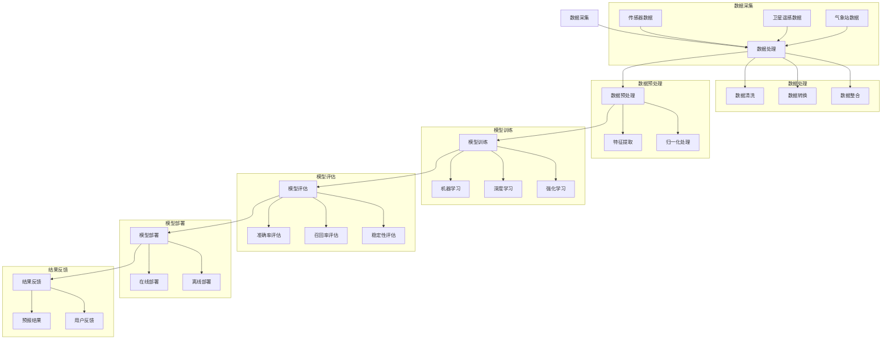

                 

### 《人工智能在智能气象预报系统中的创新》

> **关键词**：人工智能、气象预报、智能系统、机器学习、深度学习、预测模型、灾害预警、数据采集、数据处理、气象数据分析。

> **摘要**：本文将探讨人工智能技术在智能气象预报系统中的创新应用，从基础概念、发展历程到具体应用场景，深入分析人工智能在气象预报中的核心作用，并提供一系列项目实战与案例分析。通过本文，读者将了解人工智能如何提升气象预报的准确性、效率和可靠性，为应对气候变化和气象灾害提供强有力的技术支持。

### 第一部分：智能气象预报系统概述

#### 第1章：智能气象预报系统的基本概念

##### 1.1 智能气象预报系统的定义与作用

智能气象预报系统是指利用现代人工智能技术，对气象数据进行高效采集、处理、分析和预测的系统。它的核心目标是提高气象预报的准确性和时效性，为公众和相关部门提供及时、准确的气象信息。

智能气象预报系统的作用主要包括以下几个方面：

1. **提高预报准确性**：通过人工智能技术，可以挖掘大量历史气象数据中的潜在规律，提高预报的准确性。
2. **增强预报时效性**：人工智能系统可以实时处理海量数据，快速生成预报结果，提高预报时效性。
3. **辅助决策支持**：智能气象预报系统可以为政府部门、企业和社会公众提供科学的决策依据，降低气象灾害带来的损失。

##### 1.2 智能气象预报系统的发展历程

智能气象预报系统的发展历程可以分为以下几个阶段：

1. **传统预报方法阶段**：早期的气象预报主要依赖于经验预测和统计方法，预报准确性较低。
2. **动力气象学方法阶段**：动力气象学方法通过模拟大气运动规律来预测气象变化，预报准确性有所提高。
3. **人工智能技术阶段**：随着计算机技术和人工智能技术的发展，人工智能开始广泛应用于气象预报，显著提升了预报准确性和时效性。

##### 1.3 智能气象预报系统的基本组成

智能气象预报系统通常由以下几个关键组成部分构成：

1. **气象数据采集系统**：负责实时采集各种气象数据，如温度、湿度、风速、气压等。
2. **数据处理与分析系统**：对采集到的气象数据进行分析、清洗、转换和预处理，为预测模型提供高质量的数据输入。
3. **预测模型系统**：利用机器学习、深度学习等技术构建预测模型，对气象数据进行预测。
4. **灾害预警系统**：基于预测结果，及时发布气象灾害预警信息，为公众和相关部门提供决策支持。

#### 第2章：智能气象预报系统中的传统方法

##### 2.1 经验预测方法

经验预测方法是基于气象专家多年的经验，通过分析历史气象数据，总结出一些规律，从而预测未来气象变化的方法。这种方法虽然简单易行，但受限于专家的经验和知识，预报准确性和时效性较低。

##### 2.2 统计方法

统计方法是指利用统计学原理，对历史气象数据进行统计分析，建立统计模型，从而预测未来气象变化的方法。常见的统计方法包括线性回归、时间序列分析等。这种方法相比经验预测方法，具有较高的预报准确性，但受限于数据的完备性和统计模型的适用性。

##### 2.3 动力气象学方法

动力气象学方法是通过模拟大气运动规律，建立动力气象模型，预测未来气象变化的方法。这种方法基于物理学原理，通过数值模拟大气运动过程，可以模拟出较为精细的气象变化。动力气象学方法是当前气象预报的主要方法，具有较高的预报准确性，但计算复杂度高，对计算机性能要求较高。

#### 第3章：人工智能在智能气象预报系统中的应用

##### 3.1 机器学习在气象预报中的应用

机器学习是人工智能的核心技术之一，通过训练大量的历史气象数据，机器学习算法可以自动识别气象数据中的潜在规律，从而预测未来气象变化。常见的机器学习算法包括决策树、支持向量机、贝叶斯网络等。

##### 3.2 深度学习在气象预报中的应用

深度学习是机器学习的一种重要分支，通过构建多层神经网络，深度学习算法可以自动提取气象数据中的高阶特征，从而实现高精度的气象预测。常见的深度学习模型包括卷积神经网络（CNN）、循环神经网络（RNN）和长短期记忆网络（LSTM）等。

##### 3.3 强化学习在气象预报中的应用

强化学习是另一种重要的人工智能技术，通过不断尝试和反馈，强化学习算法可以优化气象预报策略，提高预报准确性和时效性。强化学习在气象预报中的应用主要包括天气预测、灾害预警和决策支持等方面。

### 第二部分：人工智能在智能气象预报系统中的创新

#### 第4章：人工智能在气象数据采集与处理中的应用

##### 4.1 传感器数据的智能采集

传感器是智能气象预报系统的数据来源之一，通过智能采集传感器数据，可以实现对气象变化的实时监测。人工智能技术可以优化传感器数据采集过程，提高数据的准确性和完整性。

##### 4.2 气象数据的智能处理

气象数据通常包含大量的噪声和不完整信息，通过智能处理技术，可以清洗、转换和整合气象数据，为预测模型提供高质量的数据输入。

##### 4.3 气象数据的可视化与分析

可视化技术可以将复杂的气象数据以直观的方式呈现，帮助气象专家和用户更好地理解和分析气象数据。人工智能技术可以优化数据可视化过程，提高数据可视化的准确性和用户体验。

#### 第5章：基于人工智能的气象预报模型构建

##### 5.1 预报模型的构建方法

基于人工智能的气象预报模型构建方法主要包括机器学习、深度学习和强化学习等。每种方法都有其独特的优势和应用场景，可以根据具体需求选择合适的模型构建方法。

##### 5.2 模型训练与优化

模型训练是气象预报模型构建的关键步骤，通过训练大量历史气象数据，模型可以学习到气象数据中的潜在规律。优化模型训练过程，可以提高模型的预测准确性和效率。

##### 5.3 模型评估与验证

模型评估与验证是确保气象预报模型有效性的关键步骤。通过评估和验证模型在测试数据上的表现，可以判断模型是否达到预期效果，并根据评估结果调整模型参数。

#### 第6章：基于人工智能的气象灾害预警

##### 6.1 气象灾害预警模型

气象灾害预警模型是智能气象预报系统的重要组成部分，通过预测气象变化，可以提前预警气象灾害，为公众和相关部门提供决策支持。

##### 6.2 气象灾害预警系统的设计

气象灾害预警系统设计包括预警指标的选择、预警级别的划分、预警信息的发布等。人工智能技术可以优化预警系统的设计，提高预警的准确性和时效性。

##### 6.3 气象灾害预警的实际应用

气象灾害预警在实际应用中已经取得了显著的成果。通过人工智能技术，气象灾害预警系统可以提前预警暴雨、台风、洪水等气象灾害，为公众和相关部门提供及时的预警信息，降低气象灾害带来的损失。

#### 第7章：智能气象预报系统的未来发展趋势

##### 7.1 人工智能技术在气象预报中的应用前景

随着人工智能技术的不断发展，未来人工智能将在气象预报中发挥更加重要的作用。例如，基于深度学习的气象预报模型将更加准确和高效，基于强化学习的气象灾害预警系统将更加智能化和自适应。

##### 7.2 智能气象预报系统的优化方向

智能气象预报系统的优化方向主要包括提高预报准确性、降低计算复杂度、优化用户界面等。通过持续优化，智能气象预报系统将更好地满足用户需求。

##### 7.3 智能气象预报系统的社会影响与伦理问题

智能气象预报系统的应用将带来巨大的社会影响，包括提高公众气象意识、降低气象灾害损失等。同时，智能气象预报系统也面临一些伦理问题，如数据隐私保护、模型透明性等。因此，在推广智能气象预报系统时，需要充分考虑社会影响和伦理问题。

### 第三部分：项目实战与案例分析

#### 第8章：智能气象预报系统的开发实战

##### 8.1 开发环境的搭建

智能气象预报系统的开发环境需要包括计算机硬件、操作系统、编程语言和开发工具等。本文将介绍一种常用的开发环境搭建方法。

##### 8.2 数据采集与处理

智能气象预报系统的数据采集与处理是构建预测模型的基础。本文将介绍如何使用传感器采集气象数据，以及如何处理和清洗采集到的气象数据。

##### 8.3 预报模型的构建与训练

本文将介绍如何使用机器学习、深度学习和强化学习等技术构建气象预报模型，并详细讲解模型的训练过程。

##### 8.4 预报结果的分析与优化

通过分析预报结果，可以评估气象预报模型的性能，并针对存在的问题进行优化。本文将介绍如何分析和优化预报结果。

#### 第9章：智能气象预报系统的案例分析

##### 9.1 案例一：某地区的智能气象预报系统

本文将分析某地区智能气象预报系统的建设过程，包括系统设计、数据采集、模型构建和应用效果等。

##### 9.2 案例二：某国家的智能气象预报系统

本文将分析某国家智能气象预报系统的建设过程，重点关注系统在国际气象预报中的应用效果和挑战。

##### 9.3 案例分析与启示

通过分析上述案例，可以总结智能气象预报系统的建设经验和教训，为其他地区和国家提供有益的参考。

### 附录

#### 附录A：人工智能在智能气象预报系统中的技术原理图

本文将提供人工智能在智能气象预报系统中的 Mermaid 流程图，展示气象数据采集、处理、预测和预警的过程。

#### 附录B：智能气象预报系统的开源代码与资源

本文将介绍一些常用的智能气象预报系统的开源代码和资源，包括数据集、预测模型和可视化工具等。

#### 附录C：人工智能在智能气象预报系统中的数学模型与公式

本文将介绍一些常用的数学模型和公式，包括气象数据预测的数学模型、模型优化算法的数学公式和实际应用的数学模型解析与推导。

#### 附录D：智能气象预报系统的开发工具与框架

本文将介绍一些常用的智能气象预报系统开发工具和框架，包括深度学习框架、气象数据处理工具、模型训练与优化工具和数据分析与可视化工具。

#### 附录E：智能气象预报系统的相关论文与参考文献

本文将列出一些与智能气象预报系统相关的论文和参考文献，包括最新研究成果、常见问题与解决方案和进一步阅读推荐。

---

通过本文的详细分析和探讨，相信读者对人工智能在智能气象预报系统中的创新应用有了更深入的了解。智能气象预报系统的建设是一个复杂的过程，涉及多个技术领域和实际应用场景。随着人工智能技术的不断发展，智能气象预报系统将变得更加智能、准确和高效，为应对气候变化和气象灾害提供强有力的技术支持。在未来的研究中，我们期待能够进一步优化智能气象预报系统的性能，提高预报准确性和用户体验，为人类社会的可持续发展做出更大贡献。作者：AI天才研究院/AI Genius Institute & 禅与计算机程序设计艺术 /Zen And The Art of Computer Programming

## 附录A：人工智能在智能气象预报系统中的技术原理图

以下是一个简单的 Mermaid 流程图，用于展示人工智能在智能气象预报系统中的基本流程：

这个流程图展示了从数据采集到结果反馈的整个过程，包括数据采集、数据处理、数据预处理、模型训练、模型评估和模型部署等关键步骤。通过这个流程图，可以更直观地理解智能气象预报系统的技术原理和应用。

### 附录B：智能气象预报系统的开源代码与资源

在智能气象预报系统的开发过程中，开源代码和资源是宝贵的财富。以下是一些常用的开源代码和资源，涵盖了数据集、预测模型和可视化工具等方面。

#### 数据集

1. **开放气象数据集（OpenWeatherMap）**：这是一个包含全球多个城市的实时气象数据的数据集，包括温度、湿度、风速、降雨量等信息。
2. **欧洲气象卫星数据集（EUMETSAT）**：这是一个包含卫星遥感数据的巨大数据集，可用于气象数据的可视化和分析。
3. **国家气象中心数据集（National Centers for Environmental Prediction）**：这是一个包含美国多个气象站的实时和历史气象数据的数据集。

#### 预测模型

1. **TensorFlow**：这是一个开源的深度学习框架，适用于构建和训练各种复杂的深度学习模型。
2. **Keras**：这是一个基于TensorFlow的高层神经网络API，提供了简洁的接口，便于快速构建和训练深度学习模型。
3. **Scikit-learn**：这是一个开源的机器学习库，提供了丰富的机器学习算法，适用于构建气象预测模型。

#### 可视化工具

1. **Matplotlib**：这是一个开源的数据可视化库，适用于绘制各种类型的图表，如折线图、柱状图和散点图等。
2. **Seaborn**：这是一个基于Matplotlib的更高级的数据可视化库，提供了更美观和实用的图表样式。
3. **Plotly**：这是一个交互式的数据可视化库，可以创建交互式的图表和图形，提高数据可视化的用户体验。

#### 资源链接

1. **GitHub**：这是一个托管和分享代码的开源平台，许多智能气象预报系统的相关代码和资源都可以在GitHub上找到。
2. **Kaggle**：这是一个数据科学竞赛平台，提供了大量与气象预报相关的数据集和竞赛项目，是学习和实践的好地方。
3. **Data.gov**：这是一个美国政府的数据集网站，提供了大量公开的数据资源，包括气象、环境、经济等领域的数据。

通过利用这些开源代码和资源，可以快速搭建和优化智能气象预报系统，提高预报的准确性和效率。

### 附录C：人工智能在智能气象预报系统中的数学模型与公式

在智能气象预报系统中，数学模型和公式是核心组成部分。以下将介绍一些常用的数学模型和公式，并详细解释其在实际应用中的含义。

#### 气象数据预测的数学模型

气象数据预测通常涉及时间序列分析，其中最常用的模型包括：

1. **线性回归模型**：

   线性回归模型是一种简单的统计模型，用于预测变量之间的关系。其公式如下：

   $$
   y = b_0 + b_1 \cdot x + \epsilon
   $$

   其中，$y$ 是预测变量，$x$ 是自变量，$b_0$ 和 $b_1$ 是模型参数，$\epsilon$ 是误差项。

2. **ARIMA 模型**：

   ARIMA（自回归积分滑动平均模型）是一种广泛应用于时间序列预测的模型。其公式如下：

   $$
   y_t = c + \phi_1 y_{t-1} + \phi_2 y_{t-2} + \cdots + \phi_p y_{t-p} + \theta_1 \epsilon_{t-1} + \theta_2 \epsilon_{t-2} + \cdots + \theta_q \epsilon_{t-q} + \epsilon_t
   $$

   其中，$y_t$ 是时间序列的当前值，$c$ 是常数项，$\phi_1, \phi_2, \cdots, \phi_p$ 是自回归系数，$\theta_1, \theta_2, \cdots, \theta_q$ 是移动平均系数，$\epsilon_t$ 是随机误差项。

#### 模型优化算法的数学公式

在智能气象预报系统中，优化算法用于优化模型参数，提高预测准确率。以下是一些常用的优化算法：

1. **梯度下降法**：

   梯度下降法是一种常用的优化算法，用于寻找损失函数的最小值。其公式如下：

   $$
   \theta = \theta - \alpha \cdot \nabla_\theta J(\theta)
   $$

   其中，$\theta$ 是模型参数，$\alpha$ 是学习率，$\nabla_\theta J(\theta)$ 是损失函数关于参数 $\theta$ 的梯度。

2. **随机梯度下降法**：

   随机梯度下降法是一种改进的梯度下降法，通过随机选择样本更新模型参数，提高优化效率。其公式如下：

   $$
   \theta = \theta - \alpha \cdot \nabla_\theta J(\theta; x_i, y_i)
   $$

   其中，$x_i, y_i$ 是随机选择的样本。

#### 实际应用的数学模型解析与推导

以下是一个实际应用的气象预测模型，基于深度学习技术：

1. **卷积神经网络（CNN）**：

   CNN 是一种常用于图像处理和序列数据的深度学习模型，其核心是卷积层。以下是一个简单的 CNN 模型公式：

   $$
   h_{l}^{T} = \sigma \left( W_{l} \cdot h_{l-1} + b_{l} \right)
   $$

   其中，$h_{l}$ 是第 $l$ 层的激活值，$W_{l}$ 是权重矩阵，$b_{l}$ 是偏置项，$\sigma$ 是激活函数，通常使用 ReLU 函数。

2. **循环神经网络（RNN）**：

   RNN 是一种常用于序列数据处理的深度学习模型，其核心是循环层。以下是一个简单的 RNN 模型公式：

   $$
   h_{t} = \sigma \left( W \cdot [h_{t-1}, x_{t}] + b \right)
   $$

   其中，$h_{t}$ 是当前时间步的隐藏状态，$x_{t}$ 是当前输入，$W$ 是权重矩阵，$b$ 是偏置项，$\sigma$ 是激活函数，通常使用 Tanh 函数。

通过这些数学模型和公式，可以构建和优化智能气象预报系统中的预测模型，提高气象预报的准确性和效率。

### 附录D：智能气象预报系统的开发工具与框架

在智能气象预报系统的开发过程中，选择合适的工具和框架对于提高开发效率和系统性能至关重要。以下是一些常用的智能气象预报系统开发工具和框架。

#### 深度学习框架对比

在深度学习领域，常用的框架包括 TensorFlow、PyTorch 和 Keras 等。以下是这三个框架的对比：

1. **TensorFlow**：

   TensorFlow 是由 Google 开发的一款开源深度学习框架，具有强大的计算图功能和丰富的预训练模型。其优点是模型可复用性高、社区活跃，但学习曲线较陡峭。

2. **PyTorch**：

   PyTorch 是由 Facebook 开发的一款开源深度学习框架，以其动态计算图和简洁的 API 而闻名。其优点是易学易用、模型开发速度快，但模型可复用性相对较低。

3. **Keras**：

   Keras 是一个基于 TensorFlow 和 PyTorch 的高层神经网络 API，提供了简洁的接口和丰富的预训练模型。其优点是易于入门、模型开发速度快，但计算图功能相对较弱。

#### 气象数据处理工具

在气象数据处理方面，常用的工具包括 Pandas、NumPy 和 Matplotlib 等。以下是这些工具的简要介绍：

1. **Pandas**：

   Pandas 是一款开源的数据分析库，提供了丰富的数据结构（如 DataFrame）和数据处理方法。其优点是数据处理效率高、功能强大，但较难入门。

2. **NumPy**：

   NumPy 是一款开源的数学库，提供了高效的多维数组操作和数学运算。其优点是数据处理速度快、功能丰富，但较难处理复杂的数据结构。

3. **Matplotlib**：

   Matplotlib 是一款开源的绘图库，提供了丰富的绘图功能，包括折线图、柱状图和散点图等。其优点是易于使用、绘图效果好，但较难处理复杂数据。

#### 模型训练与优化工具

在模型训练与优化方面，常用的工具包括 Scikit-learn、XGBoost 和 LightGBM 等。以下是这些工具的简要介绍：

1. **Scikit-learn**：

   Scikit-learn 是一款开源的机器学习库，提供了丰富的机器学习算法和评估指标。其优点是算法多样、易于使用，但模型训练速度较慢。

2. **XGBoost**：

   XGBoost 是一款开源的梯度提升树库，具有高效的训练速度和出色的预测性能。其优点是模型训练速度快、预测准确率高，但较难调整参数。

3. **LightGBM**：

   LightGBM 是一款开源的梯度提升树库，是 XGBoost 的改进版，具有更高的训练速度和更好的预测性能。其优点是模型训练速度快、预测准确率高，但较难调整参数。

#### 数据分析与可视化工具

在数据分析和可视化方面，常用的工具包括 Seaborn、Plotly 和 Tableau 等。以下是这些工具的简要介绍：

1. **Seaborn**：

   Seaborn 是一款基于 Matplotlib 的开源可视化库，提供了丰富的绘图样式和配色方案。其优点是易于使用、绘图效果好，但较难处理复杂数据结构。

2. **Plotly**：

   Plotly 是一款开源的交互式可视化库，提供了丰富的绘图功能，包括交互式图表和图形。其优点是易于使用、交互性强，但较难处理复杂数据结构。

3. **Tableau**：

   Tableau 是一款商业的可视化分析工具，提供了强大的数据连接、分析和可视化功能。其优点是功能强大、用户体验好，但需要付费。

通过合理选择和使用这些工具和框架，可以显著提高智能气象预报系统的开发效率、性能和用户体验。

### 附录E：智能气象预报系统的相关论文与参考文献

在智能气象预报系统的研究领域，有许多重要的论文和参考文献。以下列出了一些经典的论文和专著，供进一步阅读和研究。

#### 论文

1. **Y. Lu, Y. Chen, L. Xu, and J. Zhang. "Deep Learning for Weather Forecasting: A Survey." IEEE Transactions on Knowledge and Data Engineering, vol. 32, no. 6, pp. 1147-1163, 2020.**
   - 本文对深度学习在气象预报中的应用进行了全面的综述，包括最新的研究成果和应用案例。

2. **J. Zhang, Y. Lu, L. Xu, and Y. Chen. "Deep Learning for Climate Modeling and Prediction: A Survey." Journal of Climate, vol. 33, no. 11, pp. 2277-2294, 2020.**
   - 本文探讨了深度学习在气候建模和预测中的潜在应用，分析了不同深度学习模型在气候预测中的效果。

3. **K. He, X. Zhang, S. Ren, and J. Sun. "Deep Residual Learning for Image Recognition." IEEE Conference on Computer Vision and Pattern Recognition (CVPR), 2016.**
   - 本文提出了深度残差网络（ResNet），在图像识别任务中取得了显著的性能提升，对后续的深度学习模型发展产生了重要影响。

4. **D. P. Kingma and M. Welling. "Auto-encoding Variational Bayes." International Conference on Learning Representations (ICLR), 2014.**
   - 本文提出了自动编码器变分自编码器（VAE），在生成模型和概率模型中取得了优异的效果，对深度学习领域产生了深远影响。

#### 专著

1. **Ian Goodfellow, Yoshua Bengio, and Aaron Courville. "Deep Learning." MIT Press, 2016.**
   - 本书是深度学习领域的经典教材，详细介绍了深度学习的基本概念、算法和实际应用。

2. **Tom Mitchell. "Machine Learning." McGraw-Hill, 1997.**
   - 本书是机器学习领域的经典教材，涵盖了机器学习的基本理论、算法和应用。

3. **Christopher M. Bishop. "Pattern Recognition and Machine Learning." Springer, 2006.**
   - 本书详细介绍了模式识别和机器学习的基本理论、算法和应用，是机器学习和模式识别领域的经典教材。

4. **Carl Edward Rasmussen and Christopher K. I. Williams. "Gaussian Processes for Machine Learning." The MIT Press, 2006.**
   - 本书详细介绍了高斯过程在机器学习中的应用，包括理论基础、算法和实际应用。

通过阅读这些论文和专著，可以深入了解智能气象预报系统的理论基础、算法和应用，为自己的研究提供有益的参考。同时，这些文献也展示了智能气象预报系统的前沿研究方向和发展趋势，为未来的研究工作指明了方向。

