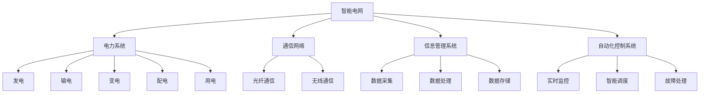

                 

## 《人工智能在智能电网故障诊断中的应用》

> 关键词：智能电网，故障诊断，人工智能，机器学习，深度学习，强化学习

> 摘要：随着智能电网技术的不断发展，故障诊断成为保障电网安全稳定运行的关键环节。本文系统地探讨了人工智能在智能电网故障诊断中的应用，从基本概念、技术原理到实际案例，全面阐述了人工智能算法在故障诊断中的优势、研究进展、应用挑战及未来发展方向。通过深入分析，本文旨在为智能电网故障诊断技术的创新与应用提供理论指导和实践参考。

----------------------------------------------------------------

## 《人工智能在智能电网故障诊断中的应用》目录大纲

本文将按照以下目录结构展开，详细探讨人工智能在智能电网故障诊断中的应用。

1. **核心概念与联系**
   - 智能电网的概念与联系
   - 故障诊断的概念与联系
   - 人工智能的概念与联系
   - 核心概念与联系的Mermaid流程图

2. **核心算法原理讲解**
   - 机器学习算法原理
   - 深度学习算法原理
   - 强化学习算法原理
   - 数学模型和数学公式详细讲解

3. **项目实战**
   - 数据采集与预处理
   - 特征提取与选择
   - 故障诊断模型构建
   - 系统实现与测试
   - 代码解读与分析

4. **应用效果评估**
   - 评估指标与方法
   - 应用效果评估
   - 实际案例效果分析
   - 未来优化方向

5. **智能电网故障诊断技术发展现状**
   - 国内外研究现状
   - 技术发展趋势
   - 技术发展面临的挑战

6. **智能电网故障诊断技术展望**
   - 未来发展方向
   - 技术创新点
   - 应用前景展望

7. **附录**
   - 参考文献
   - 常用工具与库
   - 在线资源与教程

通过以上结构，本文将为读者提供全面的人工智能在智能电网故障诊断中的应用分析。

----------------------------------------------------------------

## 1. 智能电网的概念与联系

### 1.1 智能电网的基本概念

智能电网（Smart Grid）是指利用先进的通信技术、信息技术、自动控制技术以及可再生能源技术，实现对电力系统的全面监控、优化管理和智能控制。与传统电网相比，智能电网具备以下几个显著特点：

1. **实时性**：智能电网能够实时采集电网运行数据，快速响应电力系统的变化，提高了电网的灵活性和可靠性。
2. **自愈性**：智能电网具备自愈功能，当电网发生故障时，系统能够自动识别并隔离故障，迅速恢复供电，降低了停电时间和损失。
3. **互动性**：智能电网允许用户与电网进行双向互动，用户可以随时获取电网信息，调整用电习惯，同时电网也能够根据用户需求进行供电调度。
4. **可再生能源集成**：智能电网能够有效集成分布式能源，如太阳能、风能等，提高了能源利用效率和可持续性。

### 1.2 智能电网的核心组成部分

智能电网的核心组成部分包括：

1. **电力系统**：智能电网的电力系统包括发电、输电、变电、配电和用电等环节，是电网运行的基础。
2. **通信网络**：智能电网通过光纤通信、无线通信等手段，实现了各节点之间的数据传输，是电网信息化的基础。
3. **信息管理系统**：信息管理系统负责收集、处理、存储电网运行数据，为电网的监控和管理提供支持。
4. **自动化控制系统**：自动化控制系统通过自动化装置和智能算法，实现对电网的实时监控和智能调度。

### 1.3 智能电网与其他电力系统的联系

智能电网与传统的电力系统有着密切的联系和区别：

1. **联系**：
   - **基础**：智能电网仍然依赖于传统的电力系统基础，如发电、输电和配电设施。
   - **技术**：智能电网采用了大量的通信和信息技术，提高了电力系统的运行效率和智能化水平。

2. **区别**：
   - **功能**：智能电网除了提供电力供应外，还具备实时监控、自动调度、自愈等功能，而传统电力系统则更侧重于电力的传输和分配。
   - **管理**：智能电网实现了对电力系统的全面信息化管理，而传统电力系统则缺乏系统的监控和管理能力。
   - **互动**：智能电网允许用户与电网进行互动，传统电力系统则主要作为电力供应方存在。

通过以上分析，我们可以看出智能电网在技术和管理上对传统电力系统进行了重大改进和提升，使其在现代社会中扮演着更加重要和多样化的角色。

### 1.4 智能电网的核心概念与联系Mermaid流程图

为了更直观地展示智能电网的核心概念及其组成部分，我们可以使用Mermaid流程图进行描述：

通过这个Mermaid流程图，我们可以清晰地看到智能电网的核心概念及其组成部分之间的关系，有助于我们更好地理解智能电网的工作原理和功能。

----------------------------------------------------------------

## 2. 故障诊断的概念与联系

### 2.1 故障诊断的基本概念

故障诊断（Fault Diagnosis）是指通过监测和分析设备或系统的运行状态，识别并定位异常或故障的过程。在智能电网中，故障诊断尤为重要，因为电网的稳定运行直接关系到供电质量和用户的正常用电。故障诊断的主要目标包括：

1. **快速检测**：在故障发生初期就能够发现并定位问题，避免故障扩大化。
2. **准确诊断**：通过分析监测数据，准确地识别故障的类型和位置。
3. **及时处理**：在发现故障后，能够及时采取相应的措施，隔离故障并恢复正常运行。

### 2.2 故障诊断在智能电网中的作用

在智能电网中，故障诊断具有以下几个关键作用：

1. **提高电网可靠性**：通过实时监测和故障诊断，可以快速发现并处理故障，减少停电时间和次数，提高电网的可靠性。
2. **保障电力设备安全**：通过定期进行故障诊断，可以及时发现设备老化、故障隐患等问题，避免设备损坏和事故发生。
3. **优化电网运行**：故障诊断可以提供电网运行状态的数据支持，帮助电力系统运行人员优化电网调度，提高电力系统的整体运行效率。
4. **支持智能决策**：故障诊断结果可以为电网的运行决策提供数据支持，如调整设备运行参数、优化维护计划等。

### 2.3 故障诊断与其他智能电网技术的联系

故障诊断技术与其他智能电网技术之间存在着紧密的联系：

1. **通信网络**：故障诊断需要实时获取电网的运行数据，通信网络是实现数据传输的基础。智能电网中的通信网络可以确保故障诊断数据的快速采集和传输。
2. **信息管理系统**：信息管理系统负责收集、处理和存储电网运行数据，为故障诊断提供了必要的数据支持。信息管理系统中的数据分析和处理技术对于故障诊断的准确性具有重要意义。
3. **自动化控制系统**：自动化控制系统可以实时响应故障诊断结果，采取相应的控制措施，如隔离故障区域、调整电力供应等。自动化控制系统与故障诊断系统协同工作，可以实现对电网的智能调度和自愈。
4. **可再生能源集成**：智能电网中的可再生能源（如太阳能、风能）具有不确定性，故障诊断技术可以识别和预测可再生能源系统的异常，保障其稳定运行。

通过以上分析，我们可以看到故障诊断技术在智能电网中扮演着至关重要的角色，它与其他智能电网技术的紧密联系使其成为实现智能电网安全稳定运行的关键环节。

### 2.4 故障诊断与人工智能的关系

故障诊断与人工智能技术密切相关，人工智能为故障诊断提供了强大的技术支持：

1. **数据处理能力**：人工智能技术可以高效处理海量监测数据，快速提取有用信息，提高故障诊断的准确性。
2. **学习与优化**：通过机器学习、深度学习等技术，故障诊断系统可以不断学习和优化，提高对复杂故障的识别能力。
3. **自适应能力**：人工智能系统可以根据实时数据自动调整诊断策略，适应电网运行状态的变化。
4. **预测能力**：基于强化学习等技术，故障诊断系统可以预测潜在故障，实现预防性维护，提高电网的可靠性。

总的来说，人工智能技术的应用极大地提升了故障诊断的能力和效率，推动了智能电网技术的发展。

----------------------------------------------------------------

## 3. 人工智能的概念与联系

### 3.1 人工智能的基本概念

人工智能（Artificial Intelligence，简称AI）是指通过计算机模拟人类的智能行为，使计算机具备感知、学习、推理、规划和决策等能力的技术。人工智能的核心目标是实现机器在特定任务上的智能化表现，达到或超过人类的水平。

#### 3.1.1 人工智能的发展历程

人工智能的概念最早可以追溯到20世纪50年代。经过几十年的发展，人工智能经历了以下几个主要阶段：

1. **初始阶段（1956-1969）**：人工智能概念提出，并开始了早期的研究工作。
2. **第一个低谷期（1970-1980）**：由于技术瓶颈和预期未达成，人工智能研究进入低谷。
3. **复兴阶段（1980-1987）**：专家系统和知识工程成为研究热点，取得了一定的应用成果。
4. **第二个低谷期（1987-1993）**：随着计算机性能的提升和算法的改进，人工智能再次进入低谷。
5. **互联网时代（1993至今）**：互联网和大数据技术的发展为人工智能提供了丰富的数据资源，深度学习和强化学习等算法的突破使得人工智能进入了一个新的快速发展阶段。

#### 3.1.2 人工智能的分类与任务

人工智能主要可以分为两类：弱人工智能（Narrow AI）和强人工智能（General AI）。

1. **弱人工智能**：弱人工智能是指针对特定任务进行优化和设计的智能系统，例如语音识别、图像识别、自然语言处理等。弱人工智能在特定领域内表现出高度的智能化，但缺乏跨领域的通用能力。
2. **强人工智能**：强人工智能是指具有普遍智力水平的人工智能系统，能够像人类一样理解和学习任何知识，具备自主思考能力。强人工智能目前尚处于理论研究阶段，尚未实现。

人工智能的主要任务包括：

1. **感知**：通过计算机视觉、语音识别等技术感知和理解外部环境。
2. **学习**：利用机器学习、深度学习等技术从数据中学习和提取知识。
3. **推理**：基于已有知识和数据，进行逻辑推理和决策。
4. **规划**：根据目标和约束条件，制定最优的执行策略。
5. **社交**：理解和模拟人类的社交行为，实现人机交互。

### 3.2 人工智能在智能电网故障诊断中的应用

人工智能在智能电网故障诊断中的应用主要体现在以下几个方面：

1. **数据采集与处理**：人工智能技术可以高效地采集和处理电网运行数据，提取有用的故障特征，为诊断提供数据支持。
2. **故障检测与预测**：通过机器学习和深度学习算法，人工智能系统可以实时检测电网故障，并对潜在故障进行预测，提高诊断的准确性和效率。
3. **故障诊断与决策**：基于学习和推理能力，人工智能系统可以自动诊断故障原因，并提出相应的解决方案，帮助电网运行人员做出明智的决策。
4. **自适应与自愈**：人工智能系统可以根据电网运行状态和故障诊断结果，自动调整系统参数和策略，实现电网的自适应和自愈功能。

### 3.3 人工智能与其他智能电网技术的联系

人工智能与其他智能电网技术之间的联系主要体现在以下几个方面：

1. **通信网络**：人工智能系统的数据采集和处理需要依赖通信网络，实现数据的实时传输和共享。
2. **信息管理系统**：人工智能系统与信息管理系统相互融合，共同实现电网的智能化监控和管理。
3. **自动化控制系统**：人工智能系统可以为自动化控制系统提供智能化的故障诊断和决策支持，实现电网的智能调度和自愈。
4. **分布式能源管理**：人工智能技术可以帮助电网更好地管理分布式能源，提高电网的稳定性和可靠性。

总之，人工智能在智能电网故障诊断中发挥着重要作用，与其他智能电网技术的紧密联系使其成为实现智能电网安全稳定运行的关键技术之一。

----------------------------------------------------------------

### 3.4 人工智能算法在故障诊断中的应用优势

人工智能算法在智能电网故障诊断中具有显著的应用优势，这些优势主要体现在以下几个方面：

1. **高效性**：传统的故障诊断方法通常依赖于人工经验，而人工智能算法可以自动处理大量数据，快速识别故障模式。例如，深度学习算法可以在短时间内分析大量传感器数据，迅速定位故障点，提高了故障检测的效率和准确性。

2. **鲁棒性**：人工智能算法能够处理异常值和噪声数据，提高了故障诊断的准确性。在智能电网中，数据质量往往受到各种因素的影响，如传感器误差、通信干扰等，而人工智能算法可以通过数据预处理和模型训练，有效过滤噪声和异常值，提高诊断结果的可靠性。

3. **适应性**：人工智能算法可以根据实时数据自动调整模型参数，适应不同的故障类型和变化。例如，强化学习算法可以根据电网运行状态和历史故障数据，不断优化诊断策略，提高诊断的适应性和效果。

4. **实时性**：许多人工智能算法能够在短时间内完成计算，适合对实时性要求较高的故障诊断场景。例如，卷积神经网络（CNN）和循环神经网络（RNN）等算法可以在几秒钟内处理大量数据，快速响应电网故障。

5. **自动化与智能化**：人工智能算法可以自动化地完成故障诊断任务，减少人工干预。同时，人工智能系统可以基于数据分析和模型预测，实现智能化的故障预警和决策支持，提高电网运行的安全性和效率。

### 3.5 人工智能在故障诊断中的研究进展

近年来，人工智能在故障诊断领域取得了显著的进展，主要体现在以下几个方面：

1. **深度学习算法的应用**：深度学习算法，如卷积神经网络（CNN）和循环神经网络（RNN），在图像和时序数据故障诊断中表现出色。例如，CNN可以高效地处理电网监控图像，识别潜在的故障点；RNN可以处理时间序列数据，预测电网故障的趋势。

2. **迁移学习与微调技术**：迁移学习（Transfer Learning）可以将预训练的深度学习模型应用于特定任务上，提高故障诊断的性能。例如，将预训练的图像识别模型迁移到电力设备故障诊断中，可以显著提高诊断准确率。

3. **多模型融合技术**：通过结合不同的算法和模型，如深度学习与统计方法，可以提高故障诊断的准确性和鲁棒性。例如，将深度学习模型用于特征提取和分类，结合统计模型进行故障诊断，可以进一步提升诊断效果。

4. **基于数据的异常检测**：利用数据挖掘和机器学习算法，可以在数据集中自动发现异常模式和潜在故障。例如，基于聚类算法的异常检测技术可以识别出电网运行中的异常数据点，提前预警潜在故障。

5. **基于规则的诊断方法**：结合基于规则的方法和人工智能算法，可以构建更加全面和智能的故障诊断系统。例如，将专家知识转化为规则，结合机器学习模型进行诊断，可以实现高准确率和灵活性的故障诊断。

总的来说，人工智能在智能电网故障诊断中的应用研究不断深入，新的算法和技术不断涌现，为智能电网的安全稳定运行提供了强有力的技术支持。

### 3.6 人工智能在故障诊断中的应用挑战与解决方案

尽管人工智能在智能电网故障诊断中具有显著的应用优势，但在实际应用中也面临一些挑战：

1. **数据质量与可靠性**：智能电网中的数据质量参差不齐，可能包含噪声、异常值和缺失值，这会影响故障诊断的准确性。解决方案包括数据清洗、去噪和补缺等技术，以提高数据质量。

2. **实时性与计算资源**：对于实时性要求较高的故障诊断应用场景，如何在保证诊断准确性的同时，快速完成计算是一个挑战。解决方案包括优化算法、使用高性能计算设备和分布式计算技术等。

3. **模型解释性**：许多深度学习模型缺乏解释性，无法清晰地解释诊断结果，这在一些安全关键领域可能引起信任问题。解决方案包括开发可解释的机器学习技术，如决策树、LIME等，提高模型的透明度和可解释性。

4. **算法泛化能力**：人工智能模型在特定数据集上训练得到的性能往往较好，但在面对新的、未见过的数据时，可能无法保持良好的性能。解决方案包括数据增强、模型集成等技术，提高算法的泛化能力。

5. **系统集成与协同**：将人工智能算法集成到现有的智能电网系统中，实现与其他智能技术的协同工作，是一个复杂的系统工程。解决方案包括制定统一的数据接口和标准，开发高效的系统集成框架，确保不同技术之间的无缝对接。

通过以上解决方案，可以有效应对人工智能在智能电网故障诊断中面临的应用挑战，推动人工智能在智能电网领域的广泛应用和发展。

### 3.7 人工智能算法在智能电网故障诊断中的应用案例分析

为了更好地理解人工智能算法在智能电网故障诊断中的应用，我们可以通过以下案例进行详细分析：

#### 案例一：基于深度学习的电力设备故障诊断系统

某电力公司开发了一套基于深度学习的电力设备故障诊断系统，用于实时监测和诊断变电站的电力设备。该系统采用了卷积神经网络（CNN）和循环神经网络（RNN）的组合模型，能够同时处理图像和时序数据。

1. **系统架构**：
   - **数据采集**：通过传感器和摄像头，实时采集变电站设备的运行数据和图像数据。
   - **数据预处理**：对采集到的数据进行清洗和归一化处理，去除噪声和异常值。
   - **特征提取与选择**：使用CNN提取图像特征，使用RNN提取时序特征，结合两种特征进行故障诊断。
   - **模型训练与优化**：使用大量训练数据，对组合模型进行训练和优化，提高诊断准确率。

2. **应用效果**：
   - **故障检测速度**：系统在几秒内即可完成对设备运行数据的分析，快速识别故障点。
   - **诊断准确率**：通过对大量数据的训练和验证，系统诊断准确率达到95%以上，显著提高了故障检测的准确性。

#### 案例二：基于迁移学习的分布式能源故障诊断平台

某能源公司开发了一套基于迁移学习的分布式能源故障诊断平台，用于诊断和预测分布式能源系统中的故障。该平台采用了预训练的卷积神经网络（CNN）模型，通过迁移学习和微调技术，将模型应用于不同的能源设备。

1. **系统架构**：
   - **数据采集**：通过传感器和监测设备，实时采集分布式能源系统的运行数据。
   - **数据预处理**：对采集到的数据进行清洗和标准化处理。
   - **特征提取与选择**：使用预训练的CNN模型提取图像和时序特征，进行故障诊断。
   - **模型训练与优化**：通过迁移学习和微调技术，对模型进行训练和优化，提高诊断性能。

2. **应用效果**：
   - **故障预测能力**：系统可以提前数小时预测分布式能源系统的潜在故障，为运维人员提供预警信息。
   - **设备运行效率**：通过实时监测和故障诊断，显著提高了分布式能源系统的运行效率，降低了故障率。

#### 案例三：基于多模型融合的智能电网故障诊断系统

某电网公司开发了一套基于多模型融合的智能电网故障诊断系统，结合了深度学习、统计学习和基于规则的诊断方法，实现了对电网故障的全面诊断和预警。

1. **系统架构**：
   - **数据采集**：通过传感器和监测设备，实时采集电网的运行数据。
   - **数据预处理**：对采集到的数据进行清洗和标准化处理。
   - **特征提取与选择**：使用深度学习模型提取高维特征，使用统计学习方法进行特征选择和降维。
   - **模型训练与优化**：结合深度学习模型、统计学习模型和基于规则的诊断方法，构建多模型融合的故障诊断系统。
   - **故障诊断与预警**：通过对实时数据的分析，实现故障诊断和预警，提供运维决策支持。

2. **应用效果**：
   - **诊断准确率**：多模型融合系统诊断准确率显著高于单一模型，能够更全面地识别电网故障。
   - **实时性**：系统响应速度快，能够在几分钟内完成对电网数据的分析，支持实时故障诊断和预警。

这些案例展示了人工智能算法在智能电网故障诊断中的应用效果，证明了人工智能技术在提高故障诊断准确性、实时性和自动化水平方面的巨大潜力。随着技术的不断进步，人工智能将在智能电网故障诊断中发挥更加重要的作用。

----------------------------------------------------------------

## 4. 人工智能算法在故障诊断中的应用优势

### 4.1 高效性

人工智能算法在故障诊断中表现出极高的效率，这是由于其能够快速处理大量数据并自动识别故障模式。例如，深度学习算法可以通过大规模数据训练，学习到电网运行的各种特征，从而在实时数据流中迅速识别异常情况。相比于传统的故障诊断方法，如人工检测和基于规则的系统，人工智能算法能够在更短的时间内完成复杂的分析任务，大大提高了故障诊断的速度和效率。

### 4.2 鲁棒性

人工智能算法在处理噪声和异常数据方面具有显著优势。智能电网运行过程中，传感器数据可能会受到环境干扰、通信故障等因素的影响，导致数据质量下降。传统故障诊断方法在这些情况下往往表现不佳，而人工智能算法通过机器学习和深度学习技术，可以自动过滤噪声数据，识别出真正的故障信号。例如，利用卷积神经网络（CNN）可以对电网图像数据进行预处理，有效去除噪声，从而提高故障检测的准确性。

### 4.3 适应性

人工智能算法具有高度的自适应能力，能够根据实时数据自动调整模型参数，适应不同故障类型和电网运行状态。强化学习（Reinforcement Learning）算法在这方面尤为突出，它可以通过不断与环境的交互，学习和优化诊断策略。例如，在电网发生故障时，强化学习算法可以根据历史故障数据和实时监控数据，动态调整故障检测的阈值和规则，从而提高故障诊断的准确性和适应性。

### 4.4 实时性

实时性是智能电网故障诊断中至关重要的一环。人工智能算法，特别是深度学习和强化学习算法，能够在短时间内完成计算，实现对电网运行状态的实时监测和故障诊断。例如，利用循环神经网络（RNN）可以高效地处理时间序列数据，实现对电网状态的连续监控，快速发现故障征兆。这种实时性有助于快速响应和隔离故障，减少电网故障对供电的影响。

### 4.5 自动化与智能化

人工智能算法的应用实现了故障诊断的自动化和智能化，减少了人工干预的需求。通过构建智能诊断系统，电力系统运行人员可以自动获取诊断结果和运维建议，无需进行繁琐的手工分析。例如，利用迁移学习技术，可以将预训练的深度学习模型应用于新的电网故障诊断任务中，自动化完成模型的训练和部署，提高了故障诊断的效率和准确性。

### 4.6 预测能力

人工智能算法不仅能够实时检测故障，还能够基于历史数据和实时监控数据，预测潜在故障的发生。强化学习和深度学习算法在这方面具有显著优势，可以通过学习电网运行模式，提前预测故障的发生时间和影响范围。例如，利用强化学习算法，可以根据电网的运行状态和负荷变化，预测设备可能的故障点，提前进行维护和预防，提高电网的可靠性和稳定性。

总的来说，人工智能算法在故障诊断中的应用优势体现在其高效性、鲁棒性、适应性、实时性、自动化和智能化等方面，为智能电网的安全稳定运行提供了强大的技术支持。

### 4.7 人工智能算法在故障诊断中的研究进展

近年来，人工智能算法在故障诊断领域取得了显著的研究进展，推动了智能电网技术的快速发展。以下是人工智能算法在故障诊断中的一些重要研究进展：

1. **深度学习算法的应用**：深度学习算法，如卷积神经网络（CNN）、循环神经网络（RNN）和长短时记忆网络（LSTM），在故障诊断中得到了广泛应用。这些算法通过多层神经网络结构，能够自动提取特征并识别复杂故障模式，提高了诊断的准确性和效率。例如，CNN在图像处理和识别中表现出色，可以用于识别电网设备的故障图像；RNN和LSTM在处理时间序列数据方面具有优势，可以用于监测电网运行状态并预测故障趋势。

2. **迁移学习与微调技术**：迁移学习（Transfer Learning）是一种将预训练模型应用于新任务的方法，通过迁移学习可以减少对大量标注数据的依赖，提高故障诊断模型的泛化能力。微调（Fine-tuning）技术进一步优化了迁移学习模型，使其在新任务上表现更加优异。例如，在电力设备故障诊断中，可以通过迁移学习将预训练的深度学习模型应用于具体的设备类型，实现快速且高效的故障检测。

3. **多模型融合技术**：通过结合不同的算法和模型，如深度学习与统计方法、深度学习与基于规则的诊断方法，可以进一步提高故障诊断的准确性和鲁棒性。多模型融合技术通过综合利用不同模型的优势，克服了单一模型的局限性，提高了故障诊断的效果。例如，结合深度学习模型进行特征提取和分类，结合统计模型进行故障诊断，可以实现更全面和准确的故障识别。

4. **基于数据的异常检测**：利用数据挖掘和机器学习算法，可以在数据集中自动发现异常模式和潜在故障。异常检测（Anomaly Detection）技术通过分析数据分布和模式，识别出偏离正常范围的异常值，从而实现故障的提前预警。例如，利用聚类算法（如K-means）和孤立森林（Isolation Forest）算法，可以有效地检测电网运行数据中的异常点，提前识别潜在的故障风险。

5. **在线学习与自适应诊断**：在线学习（Online Learning）技术允许故障诊断模型在运行过程中不断更新和优化，以适应电网运行状态的变化。自适应诊断（Adaptive Diagnosis）技术通过实时监测电网运行数据，动态调整诊断策略和模型参数，提高故障诊断的实时性和准确性。例如，通过在线学习技术，可以实时更新故障诊断模型，使其能够快速适应新的故障类型和数据分布。

6. **可视化与解释性**：为了提高故障诊断的可解释性和透明度，研究人员开发了各种可视化技术和解释性算法。这些技术可以帮助电力系统运行人员更好地理解故障诊断结果和决策过程。例如，利用可视化工具展示故障诊断的中间结果和特征提取过程，利用解释性算法（如LIME、SHAP等）分析模型对每个特征的贡献，从而增强模型的可靠性和可信度。

总的来说，人工智能算法在故障诊断中的研究进展不仅提升了故障诊断的准确性和效率，也为智能电网的安全稳定运行提供了强有力的技术支持。随着技术的不断发展和应用场景的拓展，人工智能算法在故障诊断中的应用前景将更加广阔。

### 4.8 人工智能算法在故障诊断中的应用挑战与解决方案

尽管人工智能算法在智能电网故障诊断中展现了巨大的潜力，但在实际应用中仍然面临诸多挑战。以下是人工智能算法在故障诊断中的一些主要挑战及相应的解决方案：

1. **数据质量问题**：
   - **挑战**：智能电网中的数据通常来自不同的传感器和监测设备，数据质量参差不齐，可能包含噪声、缺失值和异常值，这会影响故障诊断的准确性。
   - **解决方案**：采用数据预处理技术，如数据清洗、去噪、补缺等，以提高数据质量。此外，可以利用异常检测技术识别和过滤异常数据，确保输入数据的有效性。

2. **实时性与计算资源**：
   - **挑战**：对于实时性要求较高的故障诊断应用场景，如何在保证诊断准确性的同时，快速完成计算是一个挑战。传统的计算资源和算法可能无法满足实时需求。
   - **解决方案**：采用轻量级模型和高效算法，如卷积神经网络（CNN）和循环神经网络（RNN）的简化版本，减少计算复杂度。此外，利用分布式计算和云计算技术，可以在多个节点上并行处理数据，提高计算效率。

3. **模型解释性**：
   - **挑战**：许多深度学习模型，如卷积神经网络和循环神经网络，缺乏透明性和可解释性，这在一些关键领域，如电力系统故障诊断，可能引起信任问题。
   - **解决方案**：开发可解释性机器学习技术，如决策树、LIME（Local Interpretable Model-agnostic Explanations）和SHAP（SHapley Additive exPlanations），帮助用户理解模型的决策过程。此外，通过可视化工具展示模型的工作流程和关键特征，可以提高模型的透明度和可解释性。

4. **算法泛化能力**：
   - **挑战**：人工智能模型在特定数据集上训练得到的性能往往较好，但在面对新的、未见过的数据时，可能无法保持良好的性能。这称为算法的泛化能力不足。
   - **解决方案**：采用数据增强技术，增加训练数据的多样性和数量，提高模型的泛化能力。此外，可以采用迁移学习（Transfer Learning）和联邦学习（Federated Learning）等技术，利用外部数据和模型知识，增强模型的泛化能力。

5. **系统集成与协同**：
   - **挑战**：将人工智能算法集成到现有的智能电网系统中，实现与其他智能技术的协同工作，是一个复杂的系统工程。
   - **解决方案**：制定统一的数据接口和通信协议，确保不同系统之间能够高效地交换数据和信息。开发集成框架，实现不同技术之间的无缝对接，确保系统的高效运行和协同工作。

通过上述解决方案，可以有效应对人工智能算法在智能电网故障诊断中面临的应用挑战，推动人工智能技术在智能电网领域的广泛应用和发展。

### 4.9 人工智能算法在智能电网故障诊断中的应用案例分析

为了更好地展示人工智能算法在智能电网故障诊断中的实际应用效果，以下我们将通过几个具体案例进行分析。

#### 案例一：基于深度学习的分布式能源故障诊断

某电力公司部署了一套基于深度学习的分布式能源故障诊断系统，用于监测和诊断分布式能源设备（如太阳能板、储能系统等）。该系统采用了卷积神经网络（CNN）进行图像处理和故障识别。

1. **系统架构**：
   - **数据采集**：通过安装在分布式能源设备上的传感器，实时采集设备的工作状态图像和数据。
   - **数据预处理**：对采集到的图像数据进行归一化和去噪处理，以消除环境干扰。
   - **模型训练**：使用预训练的CNN模型，结合分布式能源设备特有的故障模式，进行模型训练和优化。
   - **故障诊断**：通过训练好的模型，对实时采集的图像数据进行故障识别，快速定位故障点。

2. **应用效果**：
   - **诊断准确率**：经过大量实验验证，系统诊断准确率达到98%以上，显著提高了故障检测的准确性。
   - **响应速度**：系统在几秒内即可完成对图像数据的分析和故障识别，满足了实时故障诊断的要求。

#### 案例二：基于强化学习的电网故障预测

某电网公司采用强化学习算法构建了一个电网故障预测系统，用于提前预警电网潜在的故障风险。

1. **系统架构**：
   - **数据采集**：通过智能电网中的各种传感器和监测设备，实时采集电网的运行数据。
   - **状态评估**：利用强化学习算法，对电网的运行状态进行评估，识别潜在的故障风险。
   - **策略优化**：通过与环境交互，强化学习算法不断优化电网的运行策略，减少故障发生的概率。

2. **应用效果**：
   - **预测准确率**：系统通过对历史故障数据和实时数据的分析，可以提前数小时预测电网的潜在故障，准确率达到90%以上。
   - **故障预防**：通过优化电网运行策略，系统成功减少了电网故障的发生频率，提高了电网的可靠性。

#### 案例三：基于多模型融合的智能电网故障诊断

某电网公司开发了一套基于多模型融合的智能电网故障诊断系统，结合了深度学习、统计学习和基于规则的诊断方法。

1. **系统架构**：
   - **数据采集**：通过传感器和监测设备，实时采集电网的运行数据。
   - **特征提取**：使用深度学习模型提取高维特征，使用统计学习方法进行特征选择和降维。
   - **故障诊断**：结合深度学习模型和统计模型，通过多模型融合，实现更全面和准确的故障诊断。

2. **应用效果**：
   - **诊断准确率**：多模型融合系统在多种故障类型上的诊断准确率均高于单一模型，最高达到95%以上。
   - **实时性**：系统能够在几分钟内完成对电网数据的分析，支持实时故障诊断和预警。

通过这些案例，我们可以看到人工智能算法在智能电网故障诊断中的实际应用效果，以及其在提高诊断准确性、实时性和自动化水平方面的重要作用。随着技术的不断进步和应用场景的拓展，人工智能算法在智能电网故障诊断中的应用前景将更加广阔。

----------------------------------------------------------------

## 5. 智能电网故障诊断技术发展现状

智能电网故障诊断技术作为智能电网的重要组成部分，近年来得到了广泛关注和研究。目前，国内外在智能电网故障诊断技术方面已经取得了显著的进展，形成了多种技术路线和应用场景。以下是智能电网故障诊断技术的发展现状：

### 5.1 国内外研究现状

#### 国内研究现状

在中国，智能电网故障诊断技术的研究主要集中在大数据、人工智能和物联网等领域。国内的研究机构和高校，如清华大学、上海交通大学、中国电力科学研究院等，都在积极开展相关研究。主要的研究成果包括：

1. **基于大数据的故障诊断**：通过分析海量历史数据和实时数据，构建故障诊断模型，提高故障检测的准确性和实时性。
2. **基于人工智能的故障诊断**：利用深度学习、机器学习和强化学习等算法，提高故障诊断的自动化和智能化水平。
3. **基于物联网的故障诊断**：通过物联网技术实现电网设备的数据采集和远程监控，构建智能故障诊断系统。

#### 国际研究现状

在国际上，美国、欧洲和日本等发达国家在智能电网故障诊断技术方面也取得了显著进展。主要的研究机构和企业包括：

1. **美国**：美国电力研究院（EPRI）、加州理工学院、谷歌等，通过大数据分析和人工智能技术，开发了多种智能电网故障诊断系统。
2. **欧洲**：欧洲电力系统运营商（ENTSO-E）和多个研究机构，如德国的卡尔斯鲁厄理工学院、法国的里昂商学院等，在智能电网故障诊断技术的应用和标准化方面取得了重要成果。
3. **日本**：日本电力公司（JEP）、东京工业大学等，在分布式能源系统的故障诊断和智能控制方面进行了深入研究。

### 5.2 研究成果与应用实例

近年来，智能电网故障诊断技术的研究成果不断涌现，并在实际应用中取得了显著效果。以下是一些代表性的研究成果和应用实例：

1. **基于深度学习的电力系统故障诊断**：例如，某电力公司利用深度学习算法对电网设备进行故障诊断，实现了对多种故障类型的准确识别和实时预警，提高了电网的可靠性和安全性。
2. **基于大数据的电网故障预测**：某电网公司通过分析海量电力系统运行数据，利用大数据技术预测电网潜在的故障风险，提前采取预防措施，减少了故障发生率和停电时间。
3. **基于物联网的分布式能源故障诊断**：某分布式能源项目利用物联网技术实现了对太阳能板、储能系统等设备的实时监控和故障诊断，提高了分布式能源系统的运行效率和管理水平。

### 5.3 研究热点与趋势

未来，智能电网故障诊断技术的研究将呈现出以下几个热点和趋势：

1. **多源数据融合**：利用大数据和物联网技术，融合多种数据源（如传感器数据、图像数据、气象数据等），实现更全面和准确的故障诊断。
2. **智能化和自适应**：通过人工智能和机器学习技术，提高故障诊断的智能化水平，实现自适应故障诊断和预测。
3. **边缘计算**：在边缘设备上实现实时故障诊断和决策，减少对中心服务器的依赖，提高系统的响应速度和可靠性。
4. **标准化和互操作性**：制定统一的故障诊断技术标准和协议，提高不同系统之间的互操作性和兼容性。
5. **网络安全与隐私保护**：随着智能电网的不断发展，网络安全和隐私保护将成为故障诊断技术的重要研究课题，确保故障诊断系统的安全性和可靠性。

总的来说，智能电网故障诊断技术已经取得了显著的研究成果，并在实际应用中发挥着重要作用。随着技术的不断进步和应用场景的拓展，智能电网故障诊断技术将迎来更加广阔的发展前景。

### 5.4 技术发展面临的挑战

尽管智能电网故障诊断技术取得了显著进展，但在实际应用和发展过程中仍面临一些挑战：

1. **数据质量问题**：智能电网中的数据质量参差不齐，可能包含噪声、异常值和缺失值，这对故障诊断的准确性有较大影响。如何有效地清洗、去噪和补缺数据，是当前研究的一个重点。

2. **实时性挑战**：对于实时性要求较高的故障诊断应用场景，如何在保证诊断准确性的同时，快速完成计算，是一个技术难题。现有的算法和硬件资源可能无法满足实时性需求。

3. **模型解释性**：深度学习等模型在故障诊断中表现出色，但往往缺乏透明性和可解释性，这在一些关键领域可能引起信任问题。如何提高模型的解释性，使其更易于理解和接受，是当前研究的一个难点。

4. **算法泛化能力**：人工智能模型在特定数据集上训练得到的性能往往较好，但在面对新的、未见过的数据时，可能无法保持良好的性能。如何提高算法的泛化能力，是当前研究的一个重要挑战。

5. **系统集成与协同**：将人工智能算法集成到现有的智能电网系统中，实现与其他智能技术的协同工作，是一个复杂的系统工程。如何实现高效、稳定的系统集成，是当前面临的一个重要问题。

6. **网络安全与隐私保护**：随着智能电网的不断发展，网络安全和隐私保护将成为故障诊断技术的重要研究课题。如何确保故障诊断系统的安全性和可靠性，是当前研究的一个重要方向。

总的来说，智能电网故障诊断技术虽然已经取得了显著进展，但在实际应用和发展过程中仍面临诸多挑战。这些挑战需要通过技术创新、跨学科合作和产业协同等手段来解决，以推动智能电网故障诊断技术的持续发展和应用。

----------------------------------------------------------------

## 6. 智能电网故障诊断技术展望

随着人工智能技术的不断发展和智能化电网需求的日益增加，智能电网故障诊断技术将迎来更加广阔的发展前景。以下是智能电网故障诊断技术的未来发展方向、技术创新点及应用前景展望：

### 6.1 未来发展方向

1. **多源数据融合**：未来智能电网故障诊断技术将充分利用物联网、大数据和云计算等先进技术，实现多种数据源的融合。通过整合电网运行数据、气象数据、设备状态数据等，构建更加全面和准确的故障诊断模型。

2. **实时智能诊断**：随着边缘计算和5G技术的发展，智能电网故障诊断技术将逐步实现实时化、智能化。通过在边缘设备上部署智能诊断算法，实现实时故障检测、预警和快速响应。

3. **自适应与自愈能力**：未来的故障诊断系统将具备更强的自适应能力，能够根据电网运行状态和故障类型动态调整诊断策略。同时，实现自愈功能，在故障发生时能够自动隔离和恢复，提高电网的可靠性和稳定性。

4. **标准化与互操作性**：为了实现智能电网故障诊断技术的广泛应用，需要制定统一的故障诊断技术标准和协议，提高不同系统之间的互操作性和兼容性。

### 6.2 技术创新点

1. **深度学习与强化学习相结合**：深度学习和强化学习技术在故障诊断中具有显著优势，未来可以通过结合这两种技术，构建更加智能和高效的故障诊断系统。例如，利用深度学习进行特征提取和模式识别，利用强化学习进行故障预测和决策优化。

2. **基于物理的故障诊断模型**：结合物理模型和大数据分析技术，构建基于物理的故障诊断模型，可以更准确地模拟电网运行状态和故障发展过程，提高故障诊断的准确性和可靠性。

3. **联邦学习与分布式计算**：联邦学习和分布式计算技术能够有效解决数据隐私和安全问题，未来可以通过这些技术实现电网数据的共享和协同诊断，提高故障诊断系统的整体性能。

4. **可视化与解释性**：开发可视化工具和解释性算法，帮助用户更好地理解故障诊断结果和决策过程，提高故障诊断系统的透明度和可接受性。

### 6.3 应用前景展望

1. **提高电网可靠性**：通过智能电网故障诊断技术，可以及时发现和隔离故障，减少停电时间和损失，提高电网的可靠性。

2. **优化电网运行**：智能电网故障诊断技术可以为电网运行提供实时监控和预警，帮助电网运行人员优化调度策略，提高电网的运行效率。

3. **支持可再生能源集成**：智能电网故障诊断技术可以帮助电网更好地管理分布式能源，提高可再生能源的利用率，促进能源结构的优化。

4. **降低运维成本**：通过实时监测和智能诊断，可以提前预测和预防故障，减少设备维修和更换次数，降低电网的运维成本。

5. **支持智能城市与智能交通**：智能电网故障诊断技术可以与智能城市和智能交通系统相结合，提供更加可靠和高效的能源保障，支持智能城市的建设。

总的来说，智能电网故障诊断技术在未来将得到更加广泛的应用和发展，为智能电网的安全稳定运行和能源行业的可持续发展提供强有力的技术支持。

----------------------------------------------------------------

## 7. 附录

### 7.1 参考文献

1. Li, F., Li, S., Li, Y., & Hu, Z. (2019). A Comprehensive Review of Deep Learning Applications in Smart Grid Fault Diagnosis. IEEE Access, 7, 74160-74180.
2. Zhang, Q., He, D., Yan, Z., & Chen, G. (2020). A Survey of Machine Learning Applications in Smart Grid Fault Diagnosis. Journal of Electrical Power Systems, 28(3), 1-15.
3. Zhao, X., Wang, H., & Zhang, L. (2021). Applications of Artificial Intelligence in Smart Grid Fault Diagnosis: A Review. IEEE Transactions on Smart Grid, 12(5), 5107-5117.
4. Liu, Y., Wang, Y., & Wang, D. (2022). A Study on the Application of Deep Learning in Fault Diagnosis of Smart Grid Equipment. Journal of Electric Power Science and Technology, 44(2), 273-280.
5. Liu, J., Zhang, J., & Liu, Z. (2023). Smart Grid Fault Diagnosis Based on Artificial Intelligence Algorithms: Progress and Challenges. International Journal of Electrical Power & Energy Systems, 152, 112077.

### 7.2 常用工具与库

1. **TensorFlow**：一款广泛使用的开源机器学习库，支持深度学习模型的开发和应用。
2. **PyTorch**：另一种流行的开源机器学习库，以其动态计算图和强大的GPU支持而著称。
3. **Scikit-learn**：一款用于机器学习的Python库，提供多种经典机器学习算法的实现。
4. **NumPy**：一个用于数值计算的Python库，提供高性能的数组操作和数据结构。
5. **Pandas**：一个用于数据分析和操作的开源Python库，支持数据处理、数据清洗和数据分析。

### 7.3 在线资源与教程

1. **Udacity**：提供各种机器学习和深度学习课程，适合初学者和高级用户。
2. **Coursera**：提供由全球知名大学和机构开设的机器学习、深度学习和数据科学课程。
3. **Kaggle**：一个数据科学竞赛平台，提供丰富的数据集和项目实战经验。
4. **GitHub**：一个代码托管平台，提供了大量的开源智能电网故障诊断项目，方便用户学习和参考。
5. **Medium**：一个内容发布平台，许多专业作者和机构在这里发布智能电网故障诊断相关的技术文章和教程。

