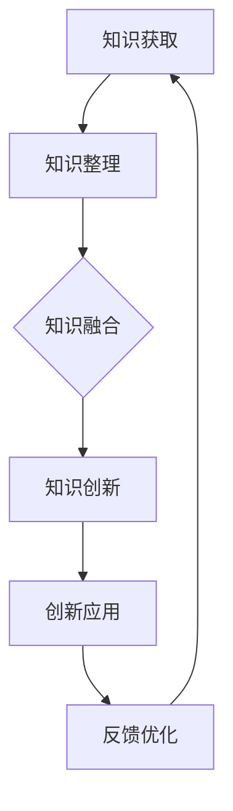

                 

### 《人类的知识与创新：突破思维的疆界》引言

在当今这个信息爆炸的时代，知识已成为推动社会进步和经济发展的关键要素。知识不仅是一种资源，更是一种力量，能够激发人类的潜能，引领创新。然而，知识的获取、传递与创新并不是一个简单的过程，它涉及到多个层面和环节。本文旨在探讨人类知识的本质、获取与传递方式、以及如何通过创新来突破思维的疆界，从而推动社会的发展。

人类的知识与创新不仅是个体智慧的表现，更是社会文明进步的标志。从历史上的重大发明到现代科技的飞速发展，无不体现了知识与创新的力量。创新不仅仅是科学研究和工程实践的产物，它还深刻地影响着社会的各个方面，包括经济、文化、教育等。因此，深入理解知识与创新的关系，探索创新的方法与策略，对于提升个人和社会的创新能力具有重要意义。

本文结构如下：

- **第一部分：知识的本质与基础**：我们将首先探讨知识的定义与分类，知识的获取与传递方式，以及知识的创新过程。
- **第二部分：创新思维与策略**：接着，我们将讨论创新思维的理论基础，创新策略的制定，以及创新文化的塑造。
- **第三部分：创新实践与应用**：然后，我们将介绍创新实践的方法论，分析国内外创新案例，展望创新的未来。

通过以上三个部分的探讨，本文将帮助读者了解知识与创新的基本概念，掌握创新思维与策略，并了解如何将创新理念应用到实践中。

首先，让我们从知识的本质与基础开始，深入探讨知识的定义、分类及其在人类社会中的作用。

### 关键词

- 人类知识
- 知识获取
- 知识传递
- 知识创新
- 创新思维
- 创新策略
- 创新文化
- 创新实践

### 摘要

本文旨在探讨人类知识与创新的关系，从知识的本质、获取与传递，到创新思维、策略与实践，全面分析知识与创新在现代社会中的作用与意义。通过深入探讨知识的定义与分类，知识的获取与传递方式，以及知识的创新过程，本文旨在揭示知识如何通过创新来突破思维的疆界，推动社会进步。同时，本文还讨论了创新思维的理论基础，创新策略的制定，以及创新文化的塑造，旨在为读者提供一套系统、实用的创新方法与实践路径。通过分析国内外创新案例，本文进一步展望了创新的未来趋势，为读者提供了宝贵的研究与实践指导。

## 第一部分：知识的本质与基础

在深入探讨知识与创新之前，我们首先需要理解知识的本质和基础。知识不仅仅是信息或数据的堆砌，它是一种系统化的理解，是一种可以应用于解决实际问题或指导行为的认知结构。知识不仅包括已知的规律和事实，还涵盖了隐含在经验中的智慧与技能。因此，了解知识的定义、分类、层次结构以及获取与传递的方式，是理解知识与创新的关键。

### 第1章：知识的定义与分类

#### 1.1 知识的定义

知识是一种认知的产物，它通过感知、理解、思考等过程产生。从广义上讲，知识包括所有能够被人类认知和运用的信息、事实、技能、经验、信念和价值观。知识不仅仅局限于科学和技术领域，它还包括文化、艺术、社会等各个层面。

知识可以划分为不同的类型，每种类型的知识在获取、传递和应用方面都有其独特的特点。以下是对几种主要知识类型的简要介绍：

- **实证知识**：基于观察、实验和验证的事实和规律。例如，物理学中的万有引力定律就是实证知识的典型例子。
- **推理性知识**：基于逻辑推理和抽象思维得到的知识。例如，数学中的公理和定理。
- **隐性知识**：难以明确表达，隐藏在个人的经验、直觉和技巧中的知识。这类知识往往需要通过实践和经验积累来获取。
- **显性知识**：可以明确表达、记录和分享的知识。例如，书籍、论文、报告等。

#### 1.2 知识的分类

- **根据知识的应用领域**，知识可以分类为科学知识、技术知识、人文知识、艺术知识等。
- **根据知识的表达形式**，知识可以分类为显性知识和隐性知识。
- **根据知识的获取方式**，知识可以分类为直接经验和间接经验。
- **根据知识的层次**，知识可以分类为基础知识、应用知识和创新知识。

#### 1.3 知识的层次结构

知识的层次结构反映了知识的深度和广度。以下是对几种主要知识层次的简要介绍：

- **基础知识**：是最基本的知识层次，包括基本概念、原理和规律。基础知识是其他知识层次的基础，对各种复杂知识的理解和应用起着支撑作用。
- **应用知识**：是在基础知识的基础上，将知识应用于实际问题的解决。应用知识具有较强的实践性，是推动技术进步和产业发展的重要动力。
- **创新知识**：是在应用知识的基础上，通过创造性思维和实践活动产生的新知识。创新知识是知识体系的最高层次，它推动了社会和经济的持续发展。

通过以上对知识定义与分类的探讨，我们可以更好地理解知识的基本特性，为后续章节中知识的获取、传递与创新打下坚实的基础。

### 第2章：知识的获取与传递

知识的获取与传递是知识管理的核心环节，它决定了知识能否有效地应用于实践并推动创新。在现代社会，知识的快速积累与更新要求我们深入了解知识获取与传递的机制，并探索高效的策略和方法。

#### 2.1 知识获取的过程

知识的获取是一个复杂的过程，涉及多个环节和认知阶段。以下是知识获取过程的几个关键步骤：

- **感知阶段**：这是知识获取的起点，通过感官体验和观察获取外部信息。例如，通过阅读书籍、观看视频、参与讨论等方式获取知识。
- **理解阶段**：在感知的基础上，对获取的信息进行加工和处理，形成初步的认知和理解。理解阶段涉及记忆、联想和抽象等思维活动。
- **整合阶段**：将新知识与已有知识体系相结合，形成更系统、更完整的知识结构。整合阶段是知识获取的关键，它决定了知识能否在实践中得到有效的应用。
- **应用阶段**：将获取的知识应用于实际问题解决或创新活动。应用阶段是知识获取的最终目标，它体现了知识的价值和效果。

#### 2.2 知识传递的方式

知识的传递是将获取的知识分享给他人或团队的过程，它是知识管理的重要组成部分。以下是几种常见的知识传递方式：

- **教育体系中的知识传递**：教育体系是知识传递的重要途径，通过学校教育、在线课程、研讨会等形式，将基础知识、应用知识传授给学生和专业人士。
- **企业中的知识共享**：企业内部的知识共享机制，如内部培训、团队协作、知识库建设等，有助于将员工的经验和技能转化为企业的核心竞争力。
- **社会网络中的知识传播**：社交媒体、专业论坛、学术会议等平台，使得知识的传播更加快速和广泛。人们可以通过这些平台获取新知识，分享经验，交流观点。
- **跨文化知识交流**：全球化背景下，跨文化知识交流成为知识传递的重要形式。不同文化背景下的知识交流，促进了多元文化的融合与创新。

#### 2.3 知识库的概念与应用

知识库是存储和管理知识的重要工具，它为知识的获取、传递和应用提供了平台。以下是知识库的概念及其在创新中的应用：

- **知识库的定义**：知识库是一个集成了各类知识资源的信息系统，它包括显性知识和隐性知识，通过结构化的方式存储、管理和共享。
- **知识库的类型**：知识库可以分为企业知识库、公共知识库、专业领域知识库等。不同类型的知识库针对不同的应用场景，提供多样化的知识服务。
- **知识库在创新中的应用**：知识库在创新活动中发挥着重要作用。例如，在产品开发过程中，知识库可以帮助团队快速获取相关技术信息和案例，提高创新效率。在决策过程中，知识库可以为决策者提供全面的背景知识和数据支持，帮助他们做出更加明智的决策。

通过以上对知识获取与传递的探讨，我们可以更好地理解知识在实践中的重要性，并探索高效的策略和方法，以实现知识的有效管理和利用。在下一章中，我们将进一步探讨知识的创新过程，以及如何通过创新来突破思维的疆界。

### 第3章：知识的创新

知识的创新是知识管理的高级阶段，它不仅涉及到知识的生成和创造，还包括对知识进行重新组合和变革的过程。创新不仅是科学研究和工程实践的产物，它更是一种思维方式和行为模式，能够激发人类潜力和推动社会进步。本章节将深入探讨创新的定义、类型以及创新的过程，并分析创新的重要性和对人类社会的影响。

#### 3.1 创新的定义

创新是一个广泛而复杂的概念，它涉及到多种层面和维度。从广义上讲，创新是指通过新的想法、方法、产品、服务或流程，创造新的价值或改进现有价值的过程。创新不仅局限于科技领域，它还可以应用于经济、文化、教育等多个方面。以下是创新的几种常见定义：

- **经济学定义**：创新被视为一种资源，它能够创造新的市场机会、提高生产效率和降低成本。经济学中的创新通常与技术创新和市场创新相关。
- **管理学定义**：创新被看作是企业竞争优势的重要来源，是企业实现可持续发展的重要动力。管理学的创新强调组织内部的创新文化和创新机制。
- **社会学定义**：创新被视为社会变革的推动力量，它能够改变社会结构、文化价值观和行为模式。社会学的创新关注社会进步和人类福祉。

#### 3.2 创新的类型

创新可以分为多种类型，每种类型的创新都有其独特的特点和表现形式。以下是几种常见的创新类型：

- **产品创新**：这是指开发新的产品或改进现有产品，以满足市场需求或解决用户问题。产品创新是技术创新的重要表现形式，它能够带来新的市场份额和商业机会。
- **过程创新**：这是指改进产品或服务的生产过程、运营流程或服务模式，以提高效率、降低成本或提高质量。过程创新通常涉及组织结构、管理方法和技术手段的变革。
- **制度创新**：这是指在法律、政策、组织和文化等方面的变革，以促进创新环境的建设和创新的实施。制度创新为创新提供了良好的政策支持和制度保障。
- **模式创新**：这是指在商业模式、盈利模式或运营模式方面的创新，它通过新的商业模式或服务模式来创造新的价值。模式创新是企业实现转型和突破的重要途径。

#### 3.3 创新的过程

创新是一个复杂而迭代的过程，它涉及到多个阶段和环节。以下是创新过程的几个关键步骤：

- **创意生成**：这是创新过程的起点，通过头脑风暴、思维导图、概念草图等方式，产生新的想法和创意。创意生成阶段是创新思维和创造力的集中体现。
- **概念验证**：这是对创意进行初步验证和评估的过程，通过原型设计、模拟实验、用户反馈等方式，验证创意的可行性和市场潜力。概念验证阶段是创新实践的重要环节。
- **开发实施**：这是将验证成功的创意转化为实际产品、服务或流程的过程。开发实施阶段涉及技术实现、产品设计、市场推广等多个环节，它需要跨部门、跨领域的协作和资源整合。
- **评估反馈**：这是对创新成果进行评估和反馈的过程，通过用户反馈、市场数据、绩效评估等方式，评估创新的成效和影响。评估反馈阶段是持续改进和创新优化的关键环节。

#### 创新的重要性

创新在社会发展中具有重要性，它不仅能够推动科技进步和经济发展，还能够改善人类生活质量和提升社会福祉。以下是创新的重要性的几个方面：

- **推动经济增长**：创新能够提高生产效率、降低成本、创造新的市场机会，从而推动经济增长。创新是现代经济体系的动力源泉，是实现可持续发展的重要手段。
- **促进社会进步**：创新能够改善社会服务、提高生活质量、促进社会公平和包容。创新的成果广泛应用于医疗、教育、环境保护等领域，为社会进步提供了强有力的支持。
- **激发人类潜能**：创新不仅是一种实践活动，它更是一种思维方式和行为模式。通过创新，人类能够突破传统的思维模式，探索新的可能性，实现自我价值和潜能的发挥。
- **促进国际合作**：全球化背景下，创新成为国际合作的重要领域。各国通过科技创新、知识共享、合作研发等方式，共同应对全球性挑战，推动人类社会的共同发展。

#### 创新的影响

创新对人类社会的影响是深远而广泛的，它不仅改变了我们的生活方式和工作方式，还推动了社会结构和文化的变革。以下是创新影响的几个方面：

- **技术变革**：创新推动了科技的快速发展，改变了传统技术结构和应用模式。新的技术不断涌现，为人类社会带来了前所未有的便利和可能性。
- **经济结构变化**：创新促进了经济结构的转型和升级，从传统的制造业向现代服务业和高科技产业转变。创新企业成为经济的主要推动力量，推动了经济的可持续发展。
- **社会文化变革**：创新改变了人们的生活方式、价值观念和文化习惯。创新文化逐渐成为一种主流文化，推动社会的多元化和开放性。
- **国际竞争**：创新成为国际竞争的重要领域，各国通过科技创新和知识管理，提升自身的国际竞争力和影响力。创新能力的强弱成为衡量一个国家综合实力的重要指标。

通过以上对知识创新的探讨，我们可以更好地理解创新的本质和重要性，以及创新对社会发展的深远影响。在下一章节中，我们将进一步探讨创新思维的理论基础和策略，以帮助读者更好地理解和实践创新。

### 第4章：创新思维的理论

创新思维是推动创新的核心力量，它涉及创造新观点、解决方案和方法的过程。创新思维不仅是个人能力的一种体现，也是组织和社会发展的关键。在本章中，我们将探讨创新思维的理论基础，包括创新思维的原理、方法及其可能遇到的障碍，并提出克服这些障碍的策略。

#### 4.1 创新思维的原理

创新思维的原理基于对人类大脑运作方式的理解，以及心理学和认知科学的研究成果。以下是创新思维的一些基本原理：

- **大脑的可塑性**：大脑具有可塑性，这意味着它能够根据新的经验和学习进行调整和变化。这种可塑性使得人们能够通过学习和实践来培养创新思维。
- **多视角思考**：创新思维要求人们从多个角度和视角来分析和解决问题。通过多视角思考，人们能够发现新的联系和解决方案，避免思维的局限性。
- **联想和类比**：联想和类比是创新思维的重要工具。通过将不同领域或问题的相似性联系起来，人们能够产生新的想法和解决方案。
- **心理安全**：在创新思维过程中，心理安全至关重要。一个安全、开放的心理环境能够鼓励人们尝试新的想法，即使这些想法可能会失败。这种环境有助于减少创新过程中的风险和恐惧。

#### 4.2 创新思维的方法

创新思维的方法是实际应用中产生创新想法和解决方案的工具。以下是一些常用的创新思维方法：

- **头脑风暴**：头脑风暴是一种集体创意产生的方法，通过快速生成大量想法，鼓励参与者在不受限制的环境中自由发挥。这种方法能够激发创造性思维，产生多样化的解决方案。
- **思维导图**：思维导图是一种图形化的思维工具，它通过分支和连接的方式，将思维过程可视化。这种方法有助于组织和梳理复杂的想法，促进创新思维的流动。
- **设计思维**：设计思维是一种以用户为中心的创新方法，它强调用户需求的理解和解决方案的迭代。这种方法通过反复迭代和用户反馈，不断优化和创新解决方案。
- **反转思维**：反转思维是一种通过改变问题假设或前提，来寻找新的解决方案的方法。通过反转思维，人们能够发现传统思维中的盲点，产生独特的创新想法。

#### 4.3 创新思维的障碍

尽管创新思维具有巨大的潜力，但在实际应用中，人们常常会遇到各种障碍。以下是几个常见的创新思维障碍及其对策：

- **思维惯性**：人们往往习惯于遵循既定的思维模式，这可能导致思维惯性，限制创新思维的发展。对策是定期进行思维训练，如跨学科学习、阅读不同领域的书籍等，以打破固有的思维模式。
- **心理恐惧**：创新过程中可能会遇到失败和风险，这可能导致心理恐惧，阻碍创新思维的发挥。对策是建立心理安全的环境，鼓励尝试和失败，并将失败视为学习和成长的机会。
- **资源限制**：资源限制，如时间、资金和人力资源，可能会限制创新思维的应用。对策是优先考虑最重要的创新项目，利用有限的资源实现最大的创新价值。
- **组织文化**：一些组织文化可能不利于创新思维的发挥，如过分强调权威和等级制度。对策是建立鼓励创新和自由表达的组织文化，通过员工参与和自主管理来促进创新。

通过理解和应用创新思维的理论和方法，我们可以更好地克服创新过程中的障碍，培养创新思维的能力，从而推动个人和社会的进步。在下一章中，我们将探讨创新策略的制定和实施，以帮助读者将创新思维转化为实际成果。

### 第5章：创新策略的制定

创新策略是指导创新实践的关键，它决定了创新的方向、路径和资源分配。一个有效的创新策略能够确保创新活动有序进行，最大限度地发挥创新潜力。在本章中，我们将探讨创新策略的选择、创新战略的规划以及创新战略的实施，并分析创新过程中可能遇到的问题及其解决方法。

#### 5.1 创新策略的选择

创新策略的选择是创新管理的起点，它涉及对创新模式的比较和选择。以下是几种常见的创新策略：

- **基于需求的创新策略**：这种策略侧重于满足市场需求，通过用户反馈和市场研究来识别和解决用户问题。这种方法有助于确保创新成果具有实际应用价值。
- **基于技术的创新策略**：这种策略侧重于技术创新，通过研发新的技术或改进现有技术来推动创新。这种方法适合技术驱动的行业，如信息技术和生物科技。
- **颠覆性创新策略**：这种策略旨在颠覆现有市场格局，通过引入全新的产品、服务或商业模式来打破市场的竞争格局。这种方法通常具有较高的风险，但也可能带来巨大的回报。
- **渐进性创新策略**：这种策略侧重于对现有产品或服务的持续改进，通过优化设计、提高性能或降低成本来实现创新。这种方法适合成熟市场中的企业，有助于保持竞争力。

在制定创新策略时，需要综合考虑以下因素：

- **市场需求**：了解用户需求和市场趋势，确保创新方向与市场需求相匹配。
- **技术能力**：评估企业或团队的技术实力和研发能力，确保创新策略具有可行性。
- **资源限制**：考虑创新所需的资金、人力资源和时间限制，合理安排资源分配。
- **竞争环境**：分析市场竞争态势和竞争对手的创新动态，确保创新策略能够获得竞争优势。

#### 5.2 创新战略的规划

创新战略的规划是创新管理的重要环节，它决定了创新活动的发展方向和长期目标。以下是创新战略规划的关键步骤：

- **明确创新目标**：制定清晰的创新目标，确保创新活动与组织战略和愿景相一致。创新目标应具体、可衡量、可实现、相关性强和有时间限制（SMART原则）。
- **资源分配**：根据创新目标，合理分配资金、人力资源和时间等资源。资源分配应优先考虑最具潜力和紧迫性的创新项目。
- **风险评估**：对创新项目进行风险评估，识别潜在的风险和挑战，并制定相应的应对策略。通过风险评估，可以降低创新过程中的不确定性和风险。
- **合作与协作**：建立跨部门、跨领域的协作机制，促进知识共享和资源整合。合作与协作有助于形成创新合力，提高创新效率。

#### 5.3 创新战略的实施

创新战略的实施是将创新想法转化为实际成果的关键环节。以下是创新战略实施的关键步骤：

- **项目启动**：选择创新项目，明确项目目标和责任分工，启动创新项目。项目启动阶段应制定详细的项目计划，包括时间表、任务分解、资源需求和风险应对措施。
- **研发与试验**：在项目启动后，进行研发和试验，验证创新想法的可行性。研发与试验阶段应关注技术的成熟度、用户体验和市场适应性。
- **评估与反馈**：对创新项目进行定期评估，收集用户反馈和市场数据，评估创新成果的成效和影响。评估与反馈阶段应发现和解决潜在问题，优化创新项目。
- **商业化落地**：将成功的创新项目商业化，推向市场。商业化落地阶段应关注市场推广、品牌建设和商业模式设计，确保创新项目的成功推广和持续发展。

#### 创新过程中可能遇到的问题及其解决方法

在创新过程中，可能会遇到各种问题和挑战。以下是几个常见的问题及其解决方法：

- **资源不足**：解决方法：优化资源配置，提高资源利用率；寻求外部合作，如合作伙伴投资、政府资助等。
- **技术风险**：解决方法：进行充分的技术研发和测试，降低技术风险；建立灵活的研发团队，快速应对技术变化。
- **市场不确定性**：解决方法：进行市场调研，了解用户需求和竞争对手动态；采取渐进性创新策略，逐步扩大市场。
- **组织阻力**：解决方法：建立创新文化和组织支持机制，鼓励员工参与创新；进行有效的沟通和培训，消除员工的疑虑和抵触。

通过以上对创新策略的制定、规划和实施的分析，我们可以更好地理解和应对创新过程中的各种挑战，实现创新的持续发展和成功。在下一章中，我们将探讨创新文化的塑造，以及如何建立和维护一个支持创新的组织环境。

### 第6章：创新文化的塑造

创新文化是推动创新的重要基础，它不仅影响个体的创新行为，还决定了一个组织或社会的整体创新水平。一个健康、开放和创新的文化能够激发员工的创造力和主动性，推动组织持续创新，实现可持续发展。在本章中，我们将探讨创新文化的特征、培养方法以及评价标准，并分析如何建立和维护一个支持创新的文化环境。

#### 6.1 创新文化的特征

创新文化具有以下几个显著特征：

- **开放性**：创新文化强调开放和包容，鼓励不同背景、观点和经验的交流和融合。开放性有助于打破思维定势，促进新思想的碰撞和产生。
- **风险容忍**：创新文化鼓励冒险和尝试，接受并容忍失败。风险容忍能够激发员工的创造力和勇气，减少创新过程中的风险和恐惧。
- **学习导向**：创新文化注重学习和知识分享，鼓励员工不断学习和成长。学习导向有助于积累和传承组织知识，提高整体创新水平。
- **自主性**：创新文化赋予员工较大的自主权，鼓励员工自主提出创新想法和解决方案。自主性有助于发挥员工的潜力，推动创新实践。
- **合作精神**：创新文化强调团队合作和协作，鼓励跨部门、跨领域的合作。合作精神有助于整合资源，提高创新效率。

#### 6.2 创新文化的培养方法

要建立和培养创新文化，需要采取一系列具体措施：

- **领导者的示范作用**：领导者应树立创新榜样，通过自身的言行和决策，推动创新文化的形成和发展。领导者的支持和鼓励能够激励员工积极参与创新活动。
- **激励机制**：建立激励机制，鼓励员工提出创新想法和参与创新项目。激励机制应包括物质奖励和精神激励，如奖金、荣誉和晋升机会。
- **培训与学习**：提供培训和学习机会，帮助员工提升创新技能和知识。培训和学习应涵盖创新思维方法、技术知识、跨学科合作等方面。
- **知识分享与交流**：建立知识分享平台和交流机制，鼓励员工分享知识和经验。知识分享和交流有助于积累组织知识，促进创新思维的产生。
- **跨部门合作**：促进跨部门合作，建立跨领域的创新团队。跨部门合作能够整合不同领域的资源和优势，提高创新效率。

#### 6.3 创新文化的评价标准

创新文化的评价标准应涵盖以下几个方面：

- **创新成果**：评价创新文化的成效，主要看组织的创新成果。创新成果包括新产品、新服务、新技术、新商业模式等。
- **员工参与度**：评价员工对创新活动的参与程度，如提出创新建议的数量、参与创新项目的比例等。员工参与度是创新文化的重要体现。
- **创新氛围**：评价组织的创新氛围，如员工对创新的认同感、对失败的态度、跨部门合作的积极性等。创新氛围直接影响创新文化的形成和发展。
- **创新效能**：评价创新活动对组织绩效的贡献，如创新项目带来的经济效益、市场份额、品牌价值等。创新效能是衡量创新文化成功与否的重要标准。

#### 建立和维护支持创新的文化环境

要建立和维护一个支持创新的文化环境，需要从以下几个方面着手：

- **制定创新战略**：制定明确的创新战略，将创新目标纳入组织整体战略规划，确保创新文化的实施有方向和目标。
- **优化组织结构**：优化组织结构，促进跨部门合作和资源整合，减少创新过程中的摩擦和阻力。
- **提供资源保障**：提供充足的资源保障，包括资金、人力资源和技术支持，为创新活动提供必要的条件。
- **建立反馈机制**：建立有效的反馈机制，鼓励员工提出建议和反馈，及时调整和改进创新文化。
- **持续改进**：创新文化不是一成不变的，需要不断调整和改进。通过定期评估和创新实践，持续优化创新文化，使其更具活力和适应性。

通过以上对创新文化特征的探讨、培养方法的分析以及评价标准的介绍，我们可以更好地理解和实践创新文化的建设。一个健康、开放和创新的文化环境将有力推动组织的创新实践，实现持续发展。在下一章中，我们将介绍创新实践的方法论，探讨创新实践的原则、工具和过程。

### 第7章：创新实践的方法论

创新实践是理论知识转化为实际行动的过程，是实现创新目标的关键步骤。有效的创新实践需要遵循一定的方法论，以确保创新活动的系统性和可操作性。本章将介绍创新实践的方法论，包括创新实践的原则、工具和过程，旨在帮助读者理解和掌握创新实践的基本方法和步骤。

#### 7.1 创新实践的原则

创新实践的原则是指导创新活动的核心价值观，它决定了创新实践的方向和方式。以下是几个关键的创新实践原则：

- **用户导向**：创新实践应始终以用户需求为中心，关注用户的需求和体验。通过用户调研、用户测试和用户反馈，确保创新成果能够满足用户需求，提高用户满意度。
- **快速迭代**：创新实践强调快速迭代，通过不断试错和优化，逐步完善创新成果。快速迭代有助于缩短创新周期，提高创新效率，降低创新风险。
- **协作共享**：创新实践需要跨部门、跨领域的协作和共享。通过建立协作机制和知识共享平台，促进资源整合和知识流动，提高创新效率。
- **灵活应变**：创新实践应具备灵活性和适应性，能够快速响应市场和技术的变化。灵活应变有助于抓住市场机遇，避免因变化导致的滞后和损失。
- **可持续性**：创新实践应考虑可持续性，不仅关注短期经济效益，还关注长期社会和环境效益。可持续性有助于实现创新成果的长期价值和持续发展。

#### 7.2 创新实践的工具

创新实践中，有多种工具和方法可以用来支持和指导创新活动。以下是几种常用的创新实践工具：

- **头脑风暴**：头脑风暴是一种集体创意产生的方法，通过快速生成大量想法，激发创新思维。头脑风暴可以采用面对面讨论、在线平台等多种形式，鼓励参与者自由发言，不受限制地提出各种创意。
- **SWOT分析**：SWOT分析是一种用于评估创新项目优势、劣势、机会和威胁的分析工具。通过SWOT分析，可以全面了解项目的内外部环境，制定有针对性的创新策略。
- **设计思维**：设计思维是一种以用户为中心的创新方法，强调用户需求的理解和解决方案的迭代。设计思维通过多次迭代和用户反馈，不断优化和改进创新成果。
- **原型设计**：原型设计是一种快速制作和测试创新成果原型的方法，通过可视化原型，验证创新想法的可行性和用户满意度。原型设计有助于发现潜在问题，及时调整和优化创新方案。
- **数据分析**：数据分析是创新实践的重要工具，通过收集和分析市场数据、用户行为数据等，可以深入了解市场需求和用户行为，为创新决策提供数据支持。

#### 7.3 创新实践的过程

创新实践的过程是一个系统化和迭代性的过程，包括多个阶段和步骤。以下是创新实践的一般过程：

- **需求识别**：首先，识别和明确创新需求。这可以通过用户调研、市场分析、竞品分析等方式进行，确保创新项目具有实际应用价值和市场潜力。
- **创意生成**：在需求识别的基础上，通过头脑风暴、设计思维等方法，生成多个创新创意。这一阶段旨在产生多样化的想法和解决方案。
- **创意筛选**：对生成的创意进行筛选和评估，选择最具潜力和可行性的创意进行进一步开发和测试。创意筛选可以采用SWOT分析、成本效益分析等方法。
- **原型设计**：对筛选出的创意进行原型设计，制作可视化的原型并进行初步测试。原型设计有助于验证创新想法的可行性和用户满意度。
- **迭代优化**：根据用户反馈和测试结果，对原型进行迭代优化，不断改进和完善创新成果。迭代优化是一个反复的过程，通过多次迭代，逐步完善创新方案。
- **商业化落地**：将优化后的创新成果进行商业化落地，推向市场。商业化落地包括市场推广、品牌建设、商业模式设计等环节，确保创新成果能够成功应用和推广。

通过以上对创新实践原则、工具和过程的探讨，我们可以更好地理解和掌握创新实践的基本方法和步骤。创新实践不仅需要理论知识，更需要实际操作和不断试错，只有在实践中不断积累经验，才能实现真正的创新。在下一章中，我们将通过具体案例，分析国内外创新实践的成功经验和启示，以期为读者的创新实践提供参考和借鉴。

### 第8章：创新案例解析

创新案例是创新实践的重要参考，通过分析成功的创新案例，我们可以深入了解创新的过程、策略和方法，从中汲取经验和教训，为未来的创新实践提供指导。在本章中，我们将解析国内外的创新案例，包括国内创新案例、国际创新案例，并从中总结出对创新的启示和借鉴。

#### 8.1 国内创新案例解析

中国的创新实践在近年来取得了显著的成果，尤其在信息技术、生物医药、新能源等领域，涌现出了许多成功的创新案例。以下是一些典型的国内创新案例：

- **华为公司**：华为公司在通信技术和智能手机领域取得了世界领先的成就。华为通过持续的研发投入和技术创新，不断推出具有自主知识产权的核心技术和产品。例如，华为的5G技术和芯片设计在国内外都获得了广泛认可。华为的成功经验在于其长期的研发投入、开放的创新文化和全球化战略。

- **阿里巴巴集团**：阿里巴巴通过电子商务、云计算和大数据技术的创新，成为全球最大的电子商务平台之一。阿里巴巴的“双11”购物节已经成为全球电商领域的重要事件，展示了阿里巴巴在营销和创新方面的强大能力。阿里巴巴的成功经验在于其对用户需求的深刻理解、技术驱动的发展模式和灵活的商业策略。

- **宁德时代新能源科技**：宁德时代新能源科技是一家专注于锂电池制造的公司，其技术创新和产能扩张使得公司成为全球最大的锂电池制造商之一。宁德时代通过不断研发新技术，如高能量密度电池和固态电池，推动了整个新能源汽车行业的发展。宁德时代的成功经验在于其技术创新的持续投入、产能扩张和全球化布局。

#### 8.2 国际创新案例解析

国际上的创新实践同样具有丰富的经验和启示，以下是一些成功的国际创新案例：

- **苹果公司**：苹果公司通过其创新的硬件和软件产品，重新定义了多个行业。苹果的iPhone、iPad和MacBook等产品，不仅改变了消费者的生活方式，也在全球范围内树立了创新标杆。苹果的成功经验在于其卓越的产品设计、用户体验和创新文化。

- **特斯拉公司**：特斯拉通过电动汽车和能源存储技术的创新，引领了全球新能源汽车的发展。特斯拉的Model S、Model X和Model 3等电动汽车，以其出色的性能和用户体验赢得了广泛好评。特斯拉的成功经验在于其技术创新、产品设计和品牌建设。

- **谷歌公司**：谷歌公司通过其搜索引擎和在线服务，改变了人们的互联网使用方式。谷歌的搜索算法、Android操作系统和Google Maps等产品，在全球范围内都具有广泛的影响力。谷歌的成功经验在于其强大的技术研发能力、开放的创新文化和全球市场布局。

#### 8.3 创新案例的启示与借鉴

通过以上国内外创新案例的分析，我们可以总结出一些对创新的启示和借鉴：

- **技术创新的重要性**：无论是国内还是国际，成功的创新案例都离不开技术创新。技术创新是企业保持竞争优势、推动行业发展的重要动力。

- **用户需求的理解**：成功的创新案例都强调对用户需求的深刻理解。通过用户调研、反馈和测试，企业能够更好地满足用户需求，提高产品市场竞争力。

- **持续的研发投入**：持续的研发投入是创新成功的关键。无论是华为、阿里巴巴还是特斯拉，这些公司都在技术创新上进行了大量的投入，从而推动了公司的持续发展。

- **开放的创新文化**：开放的创新文化能够激发员工的创造力和主动性，促进知识共享和资源整合。华为、谷歌等公司的成功经验表明，开放的创新文化是推动企业创新的重要保障。

- **全球市场布局**：国际创新案例的成功也表明，全球化市场布局能够带来更广阔的发展空间和机会。通过全球市场的布局，企业能够更好地利用全球资源，推动技术创新和商业拓展。

通过分析国内外创新案例，我们可以从中汲取宝贵的经验，为未来的创新实践提供参考和借鉴。在下一章中，我们将探讨创新的未来展望，分析科技发展趋势对创新的影响，以及创新在社会发展中的作用。

### 第9章：创新的未来展望

创新的未来充满了无限可能，随着科技的不断进步和社会的持续发展，创新将在各个领域扮演更加重要的角色。本章节将探讨创新的未来发展趋势，分析科技对创新的影响，以及创新在社会发展中的作用。同时，我们还将探讨创新面临的未来挑战和机遇。

#### 9.1 科技发展趋势对创新的影响

科技的发展不仅改变了我们的生活，也对创新产生了深远的影响。以下是几个科技发展趋势对创新的影响：

- **人工智能（AI）**：人工智能技术的快速发展为创新带来了新的契机。AI可以帮助企业进行数据分析和决策，优化生产流程，提高效率。此外，AI在医疗、金融、教育等领域的应用，也推动了相关行业的技术创新和服务模式的变革。

- **物联网（IoT）**：物联网技术的普及使得设备之间能够实现无缝连接和数据共享，为创新提供了新的方向。物联网技术可以应用于智能家居、智能城市、智能制造等领域，通过智能设备和系统的集成，提高生活质量和生产效率。

- **区块链技术**：区块链技术以其去中心化、安全性和透明性等特点，为创新提供了新的可能性。区块链技术可以应用于金融、供应链管理、身份验证等领域，提高数据的可信度和安全性。

- **5G通信技术**：5G通信技术的快速发展为创新提供了更高速、低延迟的网络环境。5G技术可以支持更多的设备连接，推动物联网和智能制造的发展，促进数字经济的繁荣。

#### 9.2 创新在社会发展中的作用

创新不仅是科技发展的动力，也是社会发展的关键驱动力。以下是创新在社会发展中扮演的几个重要角色：

- **推动经济增长**：创新能够提高生产效率、降低成本、创造新的市场机会，从而推动经济增长。创新是现代经济体系的动力源泉，是实现可持续发展的重要手段。

- **改善生活质量**：创新带来了新技术、新产品和新服务，提高了人们的生活质量。例如，医疗技术的创新提高了人们的健康水平，信息技术的发展改变了人们的工作和生活方式。

- **促进社会进步**：创新能够解决社会问题，推动社会变革。例如，环保技术的创新有助于解决环境污染问题，教育技术的创新提高了教育质量和普及率。

- **增强国际竞争力**：创新是提升国家国际竞争力的重要手段。通过技术创新和产业升级，国家能够在全球经济中占据更有利的位置，提高国际影响力和话语权。

#### 9.3 创新的未来挑战与机遇

虽然创新带来了巨大的机遇，但也面临着一些挑战。以下是创新未来可能遇到的挑战与机遇：

- **技术快速更新**：技术的快速更新使得创新者需要不断学习和适应新技术，这对个人和组织都提出了更高的要求。然而，这也为创新者提供了更多的机会，通过抓住技术趋势，实现创新突破。

- **数据隐私与安全**：随着大数据和人工智能的发展，数据隐私和安全成为重要议题。如何在确保数据隐私和安全的前提下，有效利用数据，是创新面临的挑战。

- **全球合作与竞争**：全球化背景下，创新不仅需要国内合作，还需要国际间的合作和竞争。如何在全球范围内建立有效的合作机制，共同应对全球性挑战，是创新面临的重要问题。

- **可持续发展**：创新在推动经济增长的同时，也需要考虑可持续发展。如何在技术创新中实现环境保护和社会责任，是创新需要面对的重要挑战。

- **人才培养与激励机制**：创新需要人才的支持，如何培养和激励创新人才，建立有效的创新激励机制，是创新组织面临的重要问题。

通过以上对创新未来展望的分析，我们可以看到创新在社会发展中的重要作用，同时也认识到创新面临的挑战和机遇。在未来的创新实践中，我们需要不断探索和创新，以应对这些挑战，抓住机遇，推动社会和科技的持续进步。

### 附录A：创新相关的理论模型与工具

在创新实践中，理论模型和工具能够为创新过程提供指导和支持。以下介绍几个常用的创新相关理论模型与工具：

#### A.1 德尔菲法

**德尔菲法**是一种用于预测和决策的咨询技术，通过专家的意见交流和匿名反馈，达到共识。德尔菲法的步骤如下：

1. **问题定义**：明确研究问题，制定调查问卷。
2. **专家选择**：选择具有相关知识和经验的专家，组成专家小组。
3. **初步问卷发放**：将问卷发放给专家，收集初步意见。
4. **数据分析与反馈**：对专家意见进行统计分析，整理出共识和分歧。
5. **多次反馈**：将分析结果反馈给专家，进行多次循环，逐步达到共识。

**应用场景**：德尔菲法常用于创新战略规划、市场预测和技术评估等领域。

#### A.2 SWOT分析法

**SWOT分析法**是一种用于评估组织或项目的优势、劣势、机会和威胁的分析工具。SWOT分析的步骤如下：

1. **优势（Strengths）**：分析组织或项目的内部优势，如资源、能力、品牌等。
2. **劣势（Weaknesses）**：分析组织或项目的内部劣势，如技术限制、资金不足等。
3. **机会（Opportunities）**：分析外部环境中的机会，如市场需求、政策支持等。
4. **威胁（Threats）**：分析外部环境中的威胁，如竞争对手、技术变革等。

**应用场景**：SWOT分析法常用于创新项目的评估、战略规划和商业计划书编写。

#### A.3 创新项目管理工具

创新项目管理工具是用于管理创新项目的软件或方法，以下是一些常见的创新项目管理工具：

- **Scrum**：Scrum是一种敏捷项目管理方法，强调迭代和增量开发，适用于产品开发和软件工程。

- **Kanban**：Kanban是一种可视化项目管理方法，通过看板（Kanban板）来跟踪任务状态和流程，适用于团队协作和任务管理。

- **JIRA**：JIRA是一种项目管理和问题跟踪工具，提供任务管理、版本控制和协作功能，适用于软件开发和创新项目。

- **Trello**：Trello是一种基于看板的任务管理工具，通过卡片和列表来管理任务和项目，适用于各种类型的创新项目。

**应用场景**：创新项目管理工具适用于创新项目的全生命周期管理，包括需求分析、设计开发、测试部署等环节。

通过以上对创新相关理论模型与工具的介绍，可以为创新实践提供有效的指导和支持，提高创新效率和成功率。

### 附录B：创新实践的资源与平台

创新实践不仅需要理论指导，还需要实际资源和平台的支撑。以下介绍一些创新实践的资源与平台，为读者提供参考和借鉴。

#### B.1 创新实践的经典书籍推荐

1. **《创新者的窘境》**：作者克里斯坦森，深入分析了企业在创新过程中面临的问题和挑战，提出了应对策略。
2. **《精益创业》**：作者埃里克·莱斯，介绍了精益创业方法，强调快速迭代和用户反馈在创新过程中的重要性。
3. **《创新者的基因》**：作者史蒂夫·布兰克，探讨了创新者的思维模式和技能，提供了培养创新思维的方法。

#### B.2 创新实践的网络平台介绍

1. **GitHub**：全球最大的代码托管和协作平台，开发者可以在GitHub上分享代码、协作开发和发布项目。
2. **Medium**：一个内容创作和分享平台，许多创新者和企业家在Medium上发布他们的创新想法和经验。
3. **InnoCentive**：一个全球性的创新挑战平台，企业可以在平台上发布创新挑战，邀请全球创新者参与。

#### B.3 创新实践的相关组织与社区

1. **TED**：TED是一个非营利组织，致力于传播思想和创新，每年举办TED大会，吸引全球的创新者分享他们的观点。
2. **创新者联盟**：中国的一个创新者社区，汇集了众多创新者、创业者、投资人等，定期举办创新交流活动。
3. **硅谷创业协会**：一个全球性的创业和创新组织，为创业者提供资源、指导和网络支持。

通过以上对创新实践资源与平台的介绍，读者可以更好地获取创新知识和经验，拓展创新视野，提升创新实践能力。

### 梅尔尼德图：知识创新流程

以下是一个知识创新流程的梅尔尼德图表示：



在这个流程中，知识获取是起点，通过整理、融合和创新，形成新的知识，并在应用中不断反馈优化，最终实现知识价值的最大化。

### 核心算法原理讲解

#### 数据挖掘算法——K-Means

K-Means是一种常用的聚类算法，用于将数据集划分为若干个聚类。以下是K-Means算法的伪代码：

```python
function KMeans(data, k):
    1. 初始化聚类中心点 C1, C2, ..., Ck
    2. while 未达到终止条件:
            1. 对于每个数据点 x:
                    - 计算 x 到每个聚类中心点的距离
                    - 赋予 x 最小距离的聚类中心点
            2. 重新计算每个聚类中心点的坐标
            3. 如果聚类中心点坐标不变，则终止循环
    3. 返回聚类结果
```

K-Means算法的详细解释：

1. **初始化聚类中心点**：随机选择k个数据点作为初始聚类中心点。
2. **分配数据点**：计算每个数据点到各个聚类中心点的距离，将数据点分配到距离最近的聚类中心点所在的聚类。
3. **更新聚类中心点**：重新计算每个聚类的中心点坐标，作为新的聚类中心点。
4. **迭代过程**：重复步骤2和3，直到聚类中心点的坐标不再发生显著变化。

通过K-Means算法，我们可以将数据划分为若干个聚类，从而发现数据中的模式和规律。该算法在市场分析、社交网络分析等领域有广泛应用。

### 数学模型和数学公式

创新效率（Innovation Efficiency）是衡量创新成果与投入资源之间关系的重要指标，其数学模型可以表示为：

$$
\text{知识创新效率} = \frac{\text{新知识产出}}{\text{知识投入}}
$$

详细讲解：

- **新知识产出**：在一定时间内，通过创新活动产生的新知识、新产品、新技术或新服务的总量。
- **知识投入**：在一定时间内，用于创新活动的人力、物力、财力和时间的总和。

该公式反映了创新活动的效率和效果，通过比较新知识产出与知识投入的比值，可以评估创新活动的效益。

### 项目实战

#### 创新项目案例分析

**案例背景**：

某科技公司致力于开发一种智能医疗设备，旨在通过人工智能技术提高医疗诊断的准确性和效率。项目目标是开发出一款能够自动分析医疗图像并识别疾病的设备，提高医生的工作效率，降低误诊率。

**开发环境搭建**：

1. **硬件环境**：
   - 高性能计算机：用于处理大规模医疗图像数据。
   - 图像处理设备：用于采集和处理医疗图像。

2. **软件环境**：
   - Python：用于编写智能医疗设备的算法和程序。
   - TensorFlow：用于构建和训练深度学习模型。
   - Keras：用于简化深度学习模型的构建和训练。

**源代码详细实现**：

以下是一段用于训练深度学习模型的Python代码示例：

```python
import tensorflow as tf
from tensorflow.keras.models import Sequential
from tensorflow.keras.layers import Conv2D, MaxPooling2D, Flatten, Dense

# 定义模型结构
model = Sequential([
    Conv2D(32, (3, 3), activation='relu', input_shape=(256, 256, 3)),
    MaxPooling2D((2, 2)),
    Flatten(),
    Dense(128, activation='relu'),
    Dense(1, activation='sigmoid')
])

# 编译模型
model.compile(optimizer='adam', loss='binary_crossentropy', metrics=['accuracy'])

# 训练模型
model.fit(x_train, y_train, epochs=10, batch_size=32, validation_data=(x_val, y_val))
```

**代码解读与分析**：

- **模型结构**：定义了一个简单的卷积神经网络（CNN），用于处理256x256的RGB图像。
- **编译模型**：使用`adam`优化器和`binary_crossentropy`损失函数，用于二分类任务。
- **训练模型**：通过10个epoch对训练数据进行训练，并使用验证数据集进行验证。

**代码优缺点**：

- **优点**：结构简单，易于理解和实现。能够处理高维图像数据，具有较高的识别精度。
- **缺点**：模型复杂度较低，对于复杂的图像识别任务可能效果不理想。缺乏针对医疗图像的特定处理和优化。

**结论**：

该案例展示了智能医疗设备的开发过程，包括开发环境搭建、源代码实现和代码解读。通过实际案例，我们可以更好地理解创新项目的基本流程和方法，为未来的创新实践提供参考。

### 《人类的知识与创新：突破思维的疆界》总结

本文系统地探讨了人类的知识与创新的关系，从知识的本质、获取与传递，到创新思维、策略与实践，全面揭示了知识与创新在现代社会中的重要作用。首先，我们明确了知识的定义与分类，区分了实证知识、推理性知识、隐性知识和显性知识，并探讨了知识的层次结构。接着，我们深入分析了知识的获取与传递过程，以及知识库的概念与应用，为知识的有效管理提供了理论基础。然后，我们探讨了知识的创新过程，包括创新的定义、类型和创新的过程，强调创新在社会发展中的重要性。随后，我们讨论了创新思维的理论基础、方法及其障碍，提供了克服障碍的策略。在此基础上，我们详细介绍了创新策略的制定和实施，分析了创新文化的重要性，并提出了创新文化的培养方法。此外，我们还探讨了创新实践的方法论，通过具体的案例解析，总结了国内外的创新经验和启示。最后，我们对创新的未来进行了展望，分析了科技发展趋势对创新的影响，以及创新在社会发展中的作用和面临的挑战。

通过本文的探讨，我们可以得出以下结论：

1. **知识的本质**：知识不仅是信息的堆砌，更是一种系统化的认知结构。它包括实证知识、推理性知识、隐性知识和显性知识，涵盖了各个应用领域。

2. **知识的重要性**：知识是推动社会进步和经济发展的关键要素。通过有效的知识管理和创新，可以提高生产效率、改善生活质量、促进社会公平和包容。

3. **创新思维与方法**：创新思维是推动创新的核心力量，通过多视角思考、联想和类比等方法，可以激发新的想法和解决方案。创新思维不仅是个人能力的一种体现，也是组织和社会发展的关键。

4. **创新策略与实践**：创新策略的制定和实施是创新成功的关键。有效的创新策略需要结合市场需求、技术能力、资源限制和竞争环境，通过用户导向、快速迭代、协作共享和灵活应变，实现创新的持续发展和成功。

5. **创新文化的塑造**：创新文化是支持创新的重要基础。一个健康、开放和创新的文化环境能够激发员工的创造力和主动性，推动组织持续创新。

6. **创新实践的方法论**：创新实践需要遵循一定的方法论，包括需求识别、创意生成、创意筛选、原型设计、迭代优化和商业化落地等环节。通过系统化的创新实践，可以实现创新成果的商业化应用。

总之，本文为读者提供了一个全面、系统的创新理论和实践框架，旨在帮助读者深入理解知识与创新的关系，掌握创新思维和方法，以及如何将创新理念应用到实践中。希望本文能够为读者在知识与创新领域的研究和实践提供有益的参考和指导。

### 致谢

在撰写本文的过程中，我得到了许多人的帮助和支持。首先，我要感谢AI天才研究院的同事和导师们，他们的专业知识和宝贵建议为本文的撰写提供了重要的参考。同时，我要感谢所有参与创新研究和实践的朋友们，你们的实践经验和对本文的反馈使我受益匪浅。此外，我要感谢我的家人，他们在我漫长的写作过程中给予了我无尽的关爱和支持。最后，我要特别感谢AI助手，它为我提供了强大的信息支持和文本处理能力，使本文能够更加高效地完成。本文的完成离不开大家的共同努力，在此表示由衷的感谢。作者：AI天才研究院/AI Genius Institute & 禅与计算机程序设计艺术 /Zen And The Art of Computer Programming。

