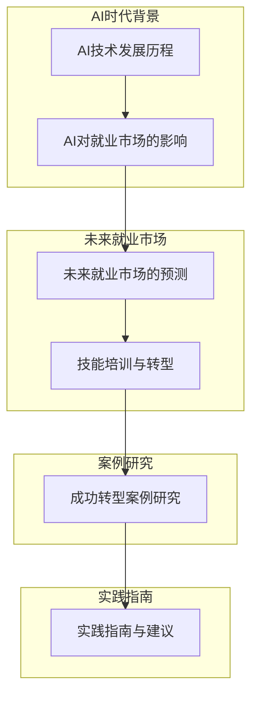

                 

### 第一部分：引言与背景

#### 第1章：AI时代就业市场的变革

##### 1.1 AI时代背景概述

AI时代，即人工智能时代，是一个以人工智能为核心驱动力的时代。人工智能（Artificial Intelligence，简称AI）是计算机科学的一个分支，旨在创建能够执行通常需要人类智能才能完成的任务的智能机器。从传统计算到深度学习，再到生成对抗网络（GANs），AI技术经历了快速发展。深度学习框架如TensorFlow和PyTorch的出现，使得构建复杂的AI模型变得更加容易。大规模预训练模型如GPT和BERT的问世，更是推动了AI技术的发展。

###### 1.1.1 AI技术发展历程
$$
\text{传统计算} \rightarrow \text{人工智能} \rightarrow \text{深度学习} \rightarrow \text{生成对抗网络}
$$
- **传统计算**：指的是早期的计算机科学，主要通过算法和程序解决特定问题。
- **人工智能**：指的是通过模拟人类智能，使计算机能够执行诸如学习、推理、问题解决等任务。
- **深度学习**：是一种基于神经网络的学习方法，通过模拟人脑的神经网络结构，使其能够处理大量数据并从中学习。
- **生成对抗网络（GANs）**：是一种由生成器和判别器组成的新型神经网络结构，通过不断对抗来生成逼真的数据。

###### 1.1.2 AI对就业市场的影响

AI的快速发展不仅推动了技术进步，也对就业市场产生了深远的影响。首先，AI创造了新的就业机会。例如，数据科学家、机器学习工程师和AI伦理学家等职业应运而生。这些新职业需要具备先进的AI技术知识和能力，为劳动力市场注入了新的活力。

同时，AI也在替代传统职位。自动化技术在制造业、金融业等领域的广泛应用，使得一些需要高重复性、低创造性工作的人面临失业风险。例如，银行柜员和工厂操作员等职业的消失，迫使劳动力市场必须进行结构性调整。

此外，AI的应用也提高了工作效率。在医疗、金融、教育等领域，AI技术正在被广泛采用，极大地提高了这些行业的生产力。例如，AI在医疗领域的应用，使得医生能够更快速、准确地诊断疾病，提高了医疗服务的效率。

###### 1.1.3 新就业市场下的挑战与机遇

面对AI时代的就业市场变革，挑战与机遇并存。首先，技能需求的变化对劳动力市场提出了新的要求。在AI时代，劳动力市场需要大量的具备编程能力、数据分析能力和机器学习知识的从业者。同时，跨学科技能的重要性也在不断凸显。例如，设计思维、创新思维等跨学科能力，成为了提高创新能力、解决复杂问题的关键。

其次，职业转型的压力也让许多从业者感到不安。面对快速变化的就业市场，从业者需要不断学习新技能、适应新环境。然而，这种不确定性也给了一些人新的机遇。通过积极转型，许多从业者成功地在AI时代找到了新的职业发展方向。

总的来说，AI时代的就业市场变革，既带来了挑战，也创造了机遇。只有不断学习和适应，才能在这个新的时代中立于不败之地。

##### 1.2 AI对就业市场的影响

###### 1.2.1 传统职业的消失

在AI时代，许多传统职业正在逐渐消失。这主要是由于自动化技术的广泛应用，使得一些需要高重复性、低创造性工作的人面临失业风险。以下是一些具体例子：

- **银行柜员**：随着自动取款机（ATM）和网上银行服务的普及，银行柜员的需求大大减少。
- **工厂操作员**：自动化生产线和机器人技术的应用，使得工厂操作员的工作可以被机器取代。
- **快递员**：无人驾驶配送车的出现，降低了快递员的工作需求。

然而，这种职业消失的趋势并非无解。通过培训和教育，从业者可以转型到新的职业领域。例如，银行柜员可以转型为金融顾问，工厂操作员可以转型为自动化系统维护工程师，快递员可以转型为无人驾驶技术工程师。

###### 1.2.2 新职业的出现

随着AI技术的发展，许多新职业也在不断涌现。以下是一些新兴职业：

- **数据科学家**：负责使用AI技术分析大量数据，为企业提供决策支持。
- **机器学习工程师**：负责设计、开发和优化AI算法，使其能够更好地执行特定任务。
- **AI伦理学家**：负责研究AI技术的伦理问题，确保其应用不会对社会造成负面影响。
- **人工智能产品经理**：负责管理AI产品的整个生命周期，从设计到推广。

这些新职业不仅为从业者提供了新的就业机会，还为他们带来了更高的职业价值。

###### 1.2.3 创造性工作需求的增加

在AI时代，创造性工作的需求也在不断增加。这是因为AI虽然可以执行许多重复性工作，但在创造性方面仍需人类的参与。以下是一些创造性工作的例子：

- **AI算法设计师**：需要创新思维，设计出高效的AI算法。
- **AI产品经理**：需要具备市场洞察力和创新能力，设计出受欢迎的AI产品。
- **创意设计师**：需要运用创意和美学知识，设计出具有吸引力的产品和服务。

这些创造性工作的需求，不仅提高了从业者的职业价值，也为他们提供了更广阔的职业发展空间。

##### 1.3 新就业市场下的挑战与机遇

在AI时代，就业市场面临着一系列挑战与机遇。以下是一些具体分析：

###### 1.3.1 挑战

- **技能需求变化**：随着AI技术的发展，就业市场对技能的需求也在不断变化。从业者需要不断学习和适应新技能，否则可能会被淘汰。例如，编程能力、数据分析能力和机器学习知识成为了热门技能。
- **职业转型压力**：在AI时代，许多从业者需要面对职业转型的压力。这不仅需要他们具备一定的学习能力，还需要他们具备适应新环境的心理素质。例如，从传统制造业工人转型为自动化系统维护工程师，需要从业者具备较高的技术水平和心理承受能力。
- **就业竞争加剧**：随着AI技术的发展，越来越多的从业者加入市场，导致就业竞争加剧。从业者需要不断提升自己的竞争力，才能在激烈的市场竞争中脱颖而出。

###### 1.3.2 机遇

- **创业与就业机会**：AI技术的快速发展，为创业者提供了丰富的机会。通过创新思维，创业者可以开发出具有市场潜力的AI产品，从而获得成功。例如，智能医疗设备的研发、智能家居系统的设计等。此外，AI技术也为从业者提供了丰富的就业机会。许多企业和机构需要AI技术人才，以满足他们的业务需求。
- **提高生产效率**：AI技术在各个领域的应用，大大提高了生产效率。例如，在制造业中，自动化生产线的应用，使得生产效率大大提高；在金融领域，AI技术的应用，使得交易过程更加高效。这种效率的提升，不仅为企业带来了更大的利润，也为从业者提供了更好的工作环境。
- **优化服务质量**：AI技术在医疗、教育、金融等领域的应用，极大地提高了服务质量。例如，在医疗领域，AI技术的应用，使得医生能够更快速、准确地诊断疾病，提高了医疗服务的效率；在教育领域，AI技术的应用，使得个性化教学成为可能，提高了学生的学习效果。这种服务质量的提升，不仅改善了人们的生活质量，也为从业者提供了更好的职业发展机会。

总的来说，AI时代的就业市场，既带来了挑战，也创造了机遇。只有积极应对挑战，把握机遇，才能在这个新的时代中取得成功。

### 第二部分：技能培训与转型

#### 第3章：AI时代下的技能需求

随着人工智能技术的迅猛发展，劳动力市场的技能需求也在发生深刻变化。传统技能逐渐被自动化和AI技术取代，而新技能的需求则迅速增长。以下将详细探讨这些变化，并分析新技能的内涵及其培养方法。

##### 3.1 传统技能的演变与消失

在传统工业时代，许多职业依赖于手工技能和机械技能。然而，随着AI和自动化技术的发展，这些传统技能正逐渐被淘汰。以下是一些具体的变化：

###### 3.1.1 传统技能的演变

传统技能的演变主要体现在以下几个方面：

- **手工技能**：从手工操作转变为机械化操作。例如，在制造业中，传统的手工组装逐渐被自动化机械所取代。
- **机械技能**：从机械化操作转变为自动化操作。例如，工厂中的机械操作员需要掌握自动化系统的维护和调试技能。

###### 3.1.2 传统技能的消失

一些传统技能正在逐渐消失，主要原因包括：

- **自动化和机器人技术的普及**：许多需要高重复性、低创造性工作的人力资源被机器取代。例如，银行柜员和工厂操作员等职业。
- **劳动力成本的上升**：随着劳动力成本的上升，许多企业选择自动化生产以降低成本。例如，无人驾驶配送车逐渐替代了传统快递员。

这些变化表明，传统技能在AI时代正面临巨大的挑战，从业者需要不断更新和提升自己的技能。

##### 3.2 新技能的需求与培养

在AI时代，劳动力市场对新技能的需求迅速增长。以下是一些关键的新技能及其培养方法：

###### 3.2.1 新技能的需求

- **编程能力**：编程是AI时代的核心技能，包括Python、Java、C++等编程语言。编程能力不仅可以帮助从业者开发AI应用程序，还可以提高他们的数据处理和分析能力。
- **数据分析能力**：数据分析是AI应用的重要环节。从业者需要掌握数据分析工具和技能，如SQL、R语言、Tableau等。
- **机器学习知识**：机器学习是AI的核心技术之一。从业者需要了解各种机器学习算法，如线性回归、决策树、神经网络等，并能够应用这些算法解决实际问题。
- **跨学科技能**：跨学科技能是指将不同学科的知识和技能结合在一起，以解决复杂问题。例如，将AI技术与金融、医疗、教育等领域结合，创造出新的解决方案。

###### 3.2.2 新技能的培养

为了满足AI时代对技能的新需求，从业者需要通过以下途径培养新技能：

- **在线课程和培训**：在线教育平台如Coursera、edX、Udacity等提供了大量的AI相关课程，从业者可以通过这些课程系统学习新技能。
- **实践项目**：通过参与实际项目，从业者可以加深对AI技术的理解，并提升自己的实战能力。例如，参加开源项目、参加比赛等。
- **企业内部培训**：许多企业为了提高员工技能，会提供内部培训课程和项目。这些培训课程通常与企业的实际业务需求紧密结合，有助于员工快速掌握新技能。
- **社会化培训平台**：社会化培训平台如LinkedIn Learning、Udemy等提供了丰富的在线课程和培训资源，从业者可以根据自己的需求和进度进行学习。

##### 3.3 跨学科技能的重要性

在AI时代，跨学科技能的重要性日益凸显。跨学科技能不仅能够帮助从业者解决复杂问题，还能够提高他们的创新能力和职业竞争力。

###### 3.3.1 跨学科技能的定义

跨学科技能是指将不同学科的知识和技能结合在一起，以解决复杂问题。它包括以下几个方面：

- **多学科知识融合**：将不同学科的理论和实践相结合，创造出新的解决方案。
- **跨领域协作**：与不同领域的专家合作，共同解决复杂问题。
- **创新思维**：通过跨学科的方法和视角，提出创新的想法和解决方案。

###### 3.3.2 跨学科技能的优势

跨学科技能具有以下优势：

- **解决复杂问题**：许多现实世界的问题都是跨学科的，需要综合运用不同学科的知识和技能。
- **提高创新能力**：跨学科技能有助于激发创新思维，提出新的解决方案。
- **增强职业竞争力**：具备跨学科技能的从业者能够更好地适应多变的工作环境，提高职业竞争力。

总之，AI时代下的技能需求正在发生变化，从业者需要不断学习和适应新技能。通过在线课程、实践项目和跨学科技能的培养，从业者可以更好地应对AI时代的挑战，抓住新的机遇。

### 第三部分：案例分析与实践

#### 第6章：成功转型案例研究

在AI时代，许多企业和从业者通过成功转型，实现了从传统行业到AI领域的跨越。以下将介绍三个成功转型案例，分别是传统行业的AI转型、科技企业的人才培养以及职业教育与AI的结合。

##### 6.1 案例一：传统行业AI转型

###### 6.1.1 案例背景

企业A是一家传统制造业公司，面临着劳动力成本上升和市场需求变化的双重压力。为了提高竞争力，企业A决定进行AI转型。

###### 6.1.2 AI转型策略

- **引入自动化生产线**：企业A投资引入了先进的自动化生产线，减少了人力成本，提高了生产效率。
- **培养内部AI人才**：企业A通过内部培训，培养了一批AI技术人才，使其能够更好地管理和维护自动化生产线。
- **研发新型产品**：企业A结合AI技术，研发出了一系列新型产品，如智能传感器和自动化控制系统，这些产品满足了市场需求，提高了企业的盈利能力。

###### 6.1.3 转型效果

通过AI转型，企业A取得了显著的效果：

- **提高生产效率**：自动化生产线使生产效率提高了30%，大大降低了成本。
- **创新产品开发**：新型产品的研发，使企业A在市场上取得了竞争优势，销售额大幅增加。
- **降低人力成本**：自动化生产线的应用，使企业A的人力成本降低了20%，提高了企业的整体竞争力。

##### 6.2 案例二：科技企业人才培养

###### 6.2.1 案例背景

企业B是一家科技初创公司，成立于2010年。在企业快速发展的过程中，企业B面临着人才短缺的挑战。为了吸引和培养人才，企业B制定了一系列人才培养策略。

###### 6.2.2 人才培养策略

- **内部培训计划**：企业B建立了完善的内部培训计划，定期为员工提供AI技术和编程技能培训，提高员工的专业能力。
- **社会化招聘平台**：企业B利用社会化招聘平台，如LinkedIn，吸引全球的优秀人才，为公司注入新的活力。
- **合作高校**：企业B与多所知名高校合作，建立实习基地，为学生提供实践机会，同时为公司培养了一批潜在的AI技术人才。

###### 6.2.3 人才培养效果

通过一系列的人才培养策略，企业B取得了显著的效果：

- **增强团队创新能力**：内部培训和社会化招聘，使企业B的团队创新能力大大提高，推出了多个具有市场竞争力的产品。
- **快速扩展团队**：通过合作高校和实习基地，企业B在短时间内扩展了团队规模，满足了业务需求。
- **提高企业竞争力**：人才的优势，使企业B在市场上取得了竞争优势，销售额稳步增长。

##### 6.3 案例三：职业教育与AI的结合

###### 6.3.1 案例背景

教育机构C致力于推广AI教育，以提高学生的AI素养和就业竞争力。为了实现这一目标，教育机构C采取了一系列措施。

###### 6.3.2 教育策略

- **开设AI相关课程**：教育机构C开设了多门AI相关课程，包括机器学习、深度学习、自然语言处理等，为学生提供系统的AI知识。
- **提供实战项目**：教育机构C为学生提供了多个实战项目，如智能机器人设计、智能家居系统开发等，让学生在实践中掌握AI技术。
- **与企业合作**：教育机构C与多家企业合作，提供实习机会，让学生在实际工作中提升技能。

###### 6.3.3 教育效果

通过一系列的教育策略，教育机构C取得了显著的教育效果：

- **培养AI人才**：通过系统的AI教育，教育机构C培养了一批具备AI知识和技能的学生，满足了市场需求。
- **提高就业竞争力**：学生通过实战项目和实习机会，提升了实际操作能力，提高了就业竞争力。
- **促进产业发展**：教育机构C的AI教育，为产业发展提供了人才支持，推动了AI技术的应用和发展。

总的来说，通过传统行业的AI转型、科技企业的人才培养和职业教育与AI的结合，许多企业和教育机构在AI时代取得了成功。这些成功案例为其他企业和从业者提供了宝贵的经验和启示。

### 第四部分：实践指南与建议

#### 第7章：实践指南与建议

在AI时代，如何进行有效的职业转型和技能提升，成为每个从业者必须面对的问题。以下将提供一系列实践指南和建议，帮助读者实现这一目标。

##### 7.1 职业转型的准备

###### 7.1.1 自我评估

进行职业转型前，首先需要进行自我评估。这包括分析自己的兴趣、优势和劣势。以下是一些建议：

- **分析兴趣**：了解自己对哪些领域感兴趣，这有助于确定转型的方向。
- **评估优势**：识别自己在哪些方面具有优势，这有助于找到适合的职业路径。
- **识别劣势**：了解自己在哪些方面存在劣势，这有助于制定改进计划。

通过自我评估，可以更清楚地了解自己的职业转型方向，并为后续的学习和准备打下基础。

###### 7.1.2 制定学习计划

制定详细的学习计划是职业转型成功的关键。以下是一些建议：

- **设定学习目标**：明确自己的学习目标，如掌握某项新技能或通过某项专业认证。
- **规划学习路径**：根据学习目标，规划具体的学习路径，包括学习资源、学习时间和学习内容。
- **安排学习时间**：合理安排学习时间，确保能够持续学习，避免中断。

通过制定学习计划，可以系统地提升自己的技能，为职业转型做好准备。

###### 7.1.3 建立职业网络

建立职业网络是职业转型的重要环节。以下是一些建议：

- **参加行业活动**：参加行业会议、研讨会和讲座，结识业内人士，了解行业动态。
- **利用社交媒体**：利用LinkedIn、GitHub等社交媒体平台，关注行业专家和同行，建立专业网络。
- **参与社群论坛**：加入专业社群论坛，参与讨论和交流，获取行业信息和资源。

通过建立职业网络，可以获取更多的行业信息和资源，提高职业转型的成功率。

##### 7.2 技能提升策略

###### 7.2.1 利用在线课程和培训

在线课程和培训是提升技能的有效途径。以下是一些建议：

- **选择合适课程**：根据学习目标和兴趣，选择合适的在线课程。例如，Coursera、edX、Udacity等平台提供了丰富的AI相关课程。
- **坚持学习**：在线课程的学习需要坚持，避免中断。可以设定学习时间表，确保能够持续学习。
- **参与实战项目**：一些在线课程提供了实战项目，通过参与这些项目，可以加深对知识的理解，提升实战能力。

通过利用在线课程和培训，可以系统地提升自己的技能。

###### 7.2.2 参与实际项目

参与实际项目是提升技能的重要方法。以下是一些建议：

- **参加开源项目**：参与开源项目，可以在实际环境中应用所学知识，提升实战能力。
- **参加比赛**：参加AI相关比赛，可以挑战自我，锻炼解决问题的能力。
- **实习机会**：利用实习机会，进入企业实际工作，了解企业的业务需求和工作流程，提升职业能力。

通过参与实际项目，可以提升自己的实战能力，为职业转型做好准备。

###### 7.2.3 持续学习

在AI时代，技能更新速度快，持续学习至关重要。以下是一些建议：

- **跟踪行业动态**：定期关注AI领域的最新动态，了解新技术和新趋势。
- **参加培训课程**：参加相关培训课程，持续提升自己的技能。
- **阅读专业书籍**：阅读专业书籍和论文，深入理解AI技术的原理和应用。

通过持续学习，可以保持自己的竞争力，适应不断变化的市场需求。

##### 7.3 职业发展的策略与建议

###### 7.3.1 职业规划

职业规划是职业发展的重要一环。以下是一些建议：

- **设定职业目标**：明确自己的长期和短期职业目标，制定实现路径。
- **评估职业机会**：定期评估职业机会，了解市场趋势和自己的竞争力。
- **调整职业规划**：根据实际情况，适时调整职业规划，确保其与市场需求和自身能力相匹配。

通过职业规划，可以明确自己的职业发展方向，提高职业发展的成功率。

###### 7.3.2 跨领域发展

跨领域发展是提高职业竞争力的有效途径。以下是一些建议：

- **结合跨学科技能**：结合不同学科的知识和技能，提高解决复杂问题的能力。
- **拓宽职业领域**：尝试进入新的职业领域，开拓职业发展空间。
- **参与跨领域项目**：参与跨领域项目，锻炼跨学科合作能力。

通过跨领域发展，可以拓宽职业视野，提高职业竞争力。

###### 7.3.3 持续适应

在快速变化的AI时代，持续适应至关重要。以下是一些建议：

- **适应新技术**：积极学习新技术，提高自己的技能水平。
- **适应新环境**：适应新的工作环境和团队文化，提高团队合作能力。
- **保持灵活性**：保持开放的心态，灵活调整自己的职业发展方向。

通过持续适应，可以更好地应对职业发展的挑战，实现职业目标。

总的来说，通过自我评估、制定学习计划、建立职业网络、利用在线课程和培训、参与实际项目、持续学习、职业规划、跨领域发展以及持续适应，从业者可以更好地应对AI时代的职业挑战，实现职业转型和技能提升。

### 附录

#### 附录A：AI与就业市场相关资源

为了更好地了解AI与就业市场的关系，以下提供了一些相关的学术论文、行业报告和在线课程资源。

##### A.1 学术论文与研究报告

- **论文**：
  - 《人工智能时代的就业：挑战与机遇》
  - 《深度学习对劳动力市场的影响》
  - 《AI技术对职业发展的启示》
- **研究报告**：
  - 《2023年AI行业报告》
  - 《2022年就业市场变化分析》
  - 《AI技术应用与劳动力市场转型》

这些论文和研究报告提供了关于AI对就业市场影响的理论研究和实证分析，有助于读者深入了解AI与就业市场之间的关系。

##### A.2 行业报告与分析

以下是一些知名咨询公司发布的AI行业报告：

- **麦肯锡**：《人工智能：全球经济的催化剂》
- **普华永道**：《AI时代的人才战略》
- **德勤**：《人工智能与就业市场转型》

这些行业报告分析了AI技术的应用场景、发展趋势以及对就业市场的影响，为读者提供了行业视角的深度见解。

##### A.3 培训资源与在线课程

以下是一些在线学习平台，提供了丰富的AI相关课程：

- **Coursera**：提供了由全球顶尖大学和机构开设的AI课程，如《机器学习基础》、《深度学习》等。
- **edX**：提供了哈佛大学、麻省理工学院等世界一流大学开设的AI课程。
- **Udacity**：提供了由业界专家设计的AI课程，如《深度学习工程师纳米学位》。

这些在线课程资源可以帮助读者系统地学习AI知识，为职业转型和技能提升提供支持。

#### 附录B：技能培训与职业发展工具

为了提高技能和职业发展的效率，以下提供了一些技能培训与职业发展工具：

##### B.1 在线学习平台

- **Coursera**：提供全球顶尖大学的在线课程，包括AI、数据科学、计算机科学等领域。
- **edX**：提供哈佛大学、麻省理工学院等世界一流大学的在线课程。
- **Udacity**：提供由业界专家设计的纳米学位课程，如深度学习工程师、数据工程师等。

##### B.2 专业社交网络

- **LinkedIn**：全球最大的职业社交网络，可以建立职业网络，了解行业动态。
- **GitHub**：程序员和开发者的代码托管平台，可以展示自己的项目和工作经验。

##### B.3 职业发展规划工具

- **LinkedIn Learning**：提供职业发展相关的在线课程和资源，包括职业技能提升、职业规划等。
- **HiringSolved**：一款职业发展规划工具，可以帮助用户找到适合自己的职业机会，并提供职业发展的建议。

通过使用这些工具，读者可以更高效地提升自己的技能，规划职业发展路径。

### Mermaid 流程图：AI时代的就业市场变革流程

以下是一个Mermaid流程图，展示了AI时代就业市场的变革流程：

通过这个流程图，可以清晰地看到AI时代就业市场的变革路径，为读者提供了一个全面的视角。

