                 

### 《人类计算：伦理和社会责任》

#### 关键词：伦理、社会责任、人类计算、计算伦理、技术道德、伦理决策框架

> 摘要：随着计算机技术和人工智能的飞速发展，人类计算已经成为现代社会的重要组成部分。然而，这一领域的飞速进步也带来了诸多伦理和社会责任问题。本文将深入探讨人类计算的伦理本质及其社会责任，分析技术伦理的困境与挑战，并提出相应的解决方案。通过本文的讨论，我们将更好地理解人类计算的伦理意义，并为未来的发展提供指导。

### 目录大纲

----------------------------------------------------------------

# 第一部分：人类计算的本质与伦理

## 第1章：人类计算的定义与起源

### 1.1 人类计算的概念框架

#### 核心概念与联系

人类计算是指人类利用计算机和其他计算工具进行信息处理、数据分析和问题解决的过程。其核心概念包括：计算工具、计算模型、计算方法、计算结果等。

#### Mermaid 流程图

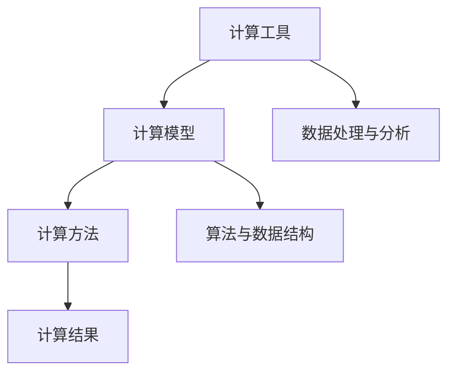

### 1.2 人类计算的历史演变

人类计算的历史可以追溯到古代的计算工具，如算盘和计算尺。随着计算机技术的发展，人类计算经历了从机械计算到电子计算，再到智能计算的演变过程。

#### 核心概念与联系

机械计算：利用机械装置进行计算，如算盘、计算尺等。

电子计算：利用电子元件进行计算，如计算机、处理器等。

智能计算：利用人工智能技术进行计算，如深度学习、神经网络等。

#### Mermaid 流程图

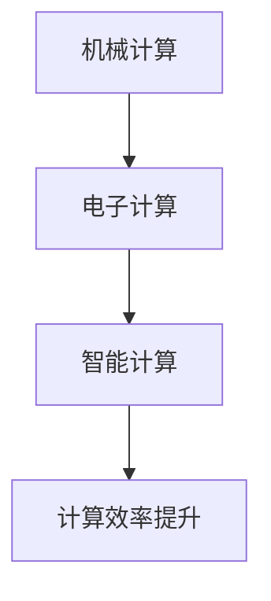

### 1.3 人类计算的核心特征

人类计算具有以下几个核心特征：

1. **计算能力强大**：人类计算可以利用计算机和其他计算工具进行复杂的信息处理和问题解决。
2. **计算方法多样**：人类计算可以采用不同的计算模型、算法和数据结构来解决问题。
3. **计算结果精确**：人类计算可以提供高精度的计算结果，为科学研究、工程设计等提供重要依据。

#### 核心概念与联系

计算能力：指计算工具和计算方法的能力。

计算方法：指解决问题的方法和步骤。

计算结果：指通过计算得到的结果。

#### Mermaid 流程图

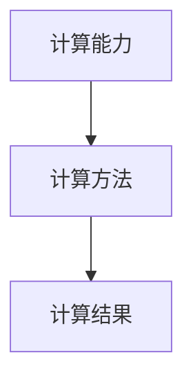

----------------------------------------------------------------

## 第2章：人类计算的伦理困境

### 2.1 伦理原则与道德规范

伦理原则和道德规范是人类行为的基本指导，也是人类计算中必须遵循的准则。常见的伦理原则和道德规范包括：

1. **公正性**：确保计算过程和结果对所有参与者都是公平的。
2. **隐私性**：保护用户的个人隐私，防止数据泄露。
3. **透明性**：计算过程和结果应该是公开透明的，便于监督和审查。

#### 核心概念与联系

公正性：指计算过程和结果不偏袒任何一方，对所有参与者都是公平的。

隐私性：指用户的个人信息和隐私受到保护，不被滥用和泄露。

透明性：指计算过程和结果应该是公开透明的，便于监督和审查。

#### Mermaid 流程图

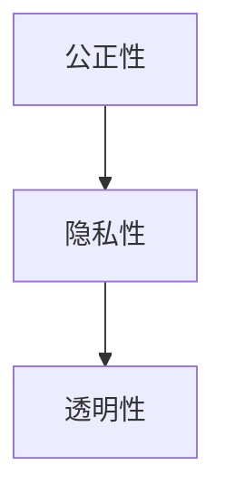

### 2.2 人类计算中的伦理问题

人类计算在带来巨大便利的同时，也引发了一系列伦理问题，包括：

1. **数据隐私**：大规模数据收集和处理可能导致用户隐私泄露。
2. **算法偏见**：算法在训练过程中可能产生偏见，导致不公平的结果。
3. **自动化决策**：自动化决策系统可能缺乏人类的道德判断，导致道德风险。

#### 核心概念与联系

数据隐私：指用户的个人信息和隐私受到保护，不被滥用和泄露。

算法偏见：指算法在训练过程中可能产生偏见，导致不公平的结果。

自动化决策：指利用算法和计算技术进行自动化决策，可能缺乏人类的道德判断。

#### Mermaid 流�试图

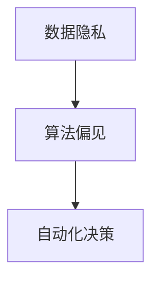

### 2.3 伦理决策框架

为了解决人类计算中的伦理问题，需要建立一套伦理决策框架。这个框架应该包括以下几个关键步骤：

1. **识别伦理问题**：明确人类计算中可能存在的伦理问题。
2. **制定伦理准则**：基于伦理原则和道德规范，制定具体的伦理准则。
3. **评估伦理影响**：对计算过程和结果进行伦理影响评估。
4. **决策与执行**：根据伦理影响评估结果，制定和执行相应的决策。

#### 核心概念与联系

识别伦理问题：指发现人类计算中可能存在的伦理问题。

制定伦理准则：指基于伦理原则和道德规范，制定具体的伦理准则。

评估伦理影响：指对计算过程和结果进行伦理影响评估。

决策与执行：指根据伦理影响评估结果，制定和执行相应的决策。

#### Mermaid 流程图

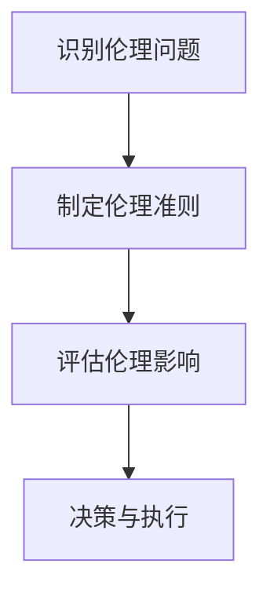

----------------------------------------------------------------

## 第3章：人类计算的社会责任

### 3.1 社会责任的意义与内涵

社会责任是指企业在追求经济利益的同时，对环境、社会和利益相关者承担的责任。对于人类计算领域，社会责任的内涵主要包括：

1. **环境保护**：减少计算过程中的能源消耗和环境污染。
2. **社会公正**：确保计算技术为社会各个阶层提供公平的机会。
3. **员工福祉**：关注员工的权益和职业发展。

#### 核心概念与联系

环境保护：指减少计算过程中的能源消耗和环境污染。

社会公正：指确保计算技术为社会各个阶层提供公平的机会。

员工福祉：指关注员工的权益和职业发展。

#### Mermaid 流程图

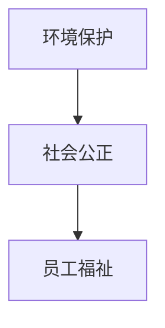

### 3.2 人类计算的社会影响

人类计算对社会产生了深远的影响，包括：

1. **经济影响**：推动经济增长，创造新的就业机会。
2. **社会影响**：改变人们的生活方式和工作方式，影响社会结构和价值观念。
3. **环境影响**：提高能源利用效率，减少环境污染。

#### 核心概念与联系

经济影响：指计算技术对经济增长的推动作用。

社会影响：指计算技术对人们生活方式和工作方式的影响。

环境影响：指计算技术对能源利用和环境污染的影响。

#### Mermaid 流程图

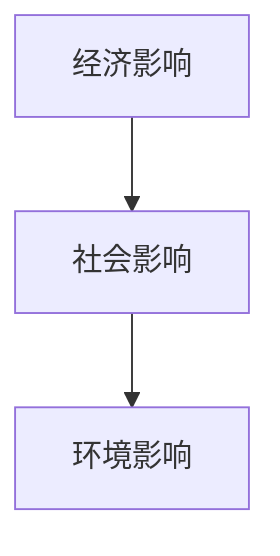

### 3.3 责任伦理在人类计算中的应用

在人类计算领域，责任伦理的应用主要包括：

1. **技术开发**：在技术开发过程中，充分考虑伦理和社会责任问题。
2. **政策制定**：政府和企业应制定相应的政策和规范，确保人类计算的伦理和社会责任得到落实。
3. **教育培训**：加强技术伦理教育，提高从业人员的伦理意识和责任意识。

#### 核心概念与联系

技术开发：指在技术开发过程中，充分考虑伦理和社会责任问题。

政策制定：指政府和企业应制定相应的政策和规范，确保人类计算的伦理和社会责任得到落实。

教育培训：指加强技术伦理教育，提高从业人员的伦理意识和责任意识。

#### Mermaid 流程图

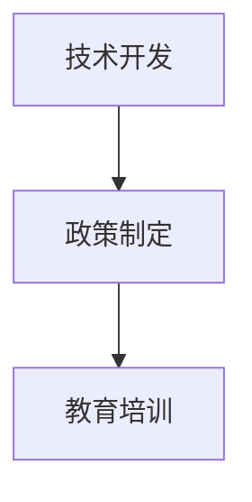

----------------------------------------------------------------

# 第二部分：人类计算的伦理实践

## 第4章：技术伦理教育

### 4.1 技术伦理教育的目标与内容

技术伦理教育的目标主要包括：

1. **培养伦理意识**：使技术人员认识到伦理问题在计算领域的重要性，提高其伦理意识和责任感。
2. **传授伦理知识**：使技术人员掌握基本的伦理原则和道德规范，能够正确处理伦理问题。
3. **培养伦理能力**：使技术人员具备分析和解决伦理问题的能力，能够将伦理原则应用到实际工作中。

#### 核心概念与联系

伦理意识：指技术人员对伦理问题的重要性和责任感的认识。

伦理知识：指技术人员掌握的基本伦理原则和道德规范。

伦理能力：指技术人员分析和解决伦理问题的能力。

#### Mermaid 流程图

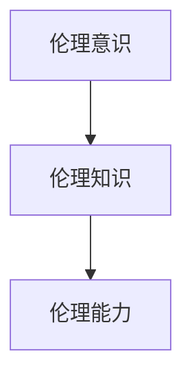

### 4.2 技术伦理教育的方法与策略

技术伦理教育的方法和策略包括：

1. **课程设置**：将技术伦理教育纳入计算机科学、人工智能等相关专业课程，系统讲授伦理知识。
2. **案例分析**：通过真实案例的分析，使技术人员了解伦理问题的复杂性和挑战性。
3. **实践活动**：组织伦理辩论、模拟实验等活动，提高技术人员的实际操作能力和伦理决策能力。

#### 核心概念与联系

课程设置：指将技术伦理教育纳入相关课程，系统讲授伦理知识。

案例分析：指通过真实案例的分析，使技术人员了解伦理问题的复杂性和挑战性。

实践活动：指组织伦理辩论、模拟实验等活动，提高技术人员的实际操作能力和伦理决策能力。

#### Mermaid 流程图

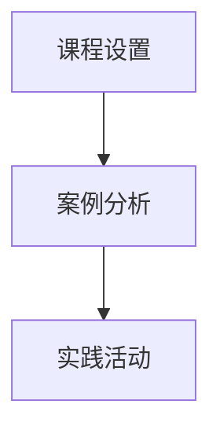

### 4.3 技术伦理教育的案例分析

以下是一个技术伦理教育的案例分析：

#### 核心概念与联系

案例名称：某大学计算机专业技术伦理教育实践

背景：某大学计算机专业为了提高学生的伦理意识和能力，开展了技术伦理教育实践。

措施：

1. **开设伦理课程**：将技术伦理课程纳入本科和研究生培养方案，系统讲授伦理知识。

2. **案例分析**：通过分析真实案例，如算法偏见、数据隐私等，引导学生思考伦理问题。

3. **实践活动**：组织伦理辩论、模拟实验等活动，提高学生的实际操作能力和伦理决策能力。

效果：

1. **学生伦理意识提高**：通过教育实践，学生的伦理意识得到了显著提高。

2. **伦理能力提升**：学生在实践活动中能够正确处理伦理问题，具备一定的伦理决策能力。

3. **课程满意度高**：学生对技术伦理课程的满意度较高，认为课程内容实用、有趣。

#### Mermaid 流程图

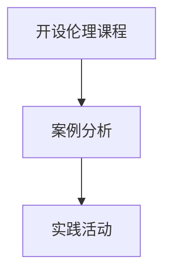

----------------------------------------------------------------

## 第5章：人类计算的伦理决策

### 5.1 伦理决策的过程与模型

伦理决策是指在面对伦理困境时，通过分析和评估，做出符合伦理原则和道德规范的选择。伦理决策的过程通常包括以下几个步骤：

1. **识别伦理问题**：发现并明确计算过程中可能存在的伦理问题。
2. **评估伦理影响**：分析伦理问题可能带来的正面和负面影响。
3. **制定决策方案**：基于伦理原则和道德规范，制定不同的决策方案。
4. **选择最佳方案**：综合考虑各种因素，选择符合伦理要求的最佳方案。

#### 核心概念与联系

识别伦理问题：指发现并明确计算过程中可能存在的伦理问题。

评估伦理影响：指分析伦理问题可能带来的正面和负面影响。

制定决策方案：指基于伦理原则和道德规范，制定不同的决策方案。

选择最佳方案：指综合考虑各种因素，选择符合伦理要求的最佳方案。

#### Mermaid 流程图

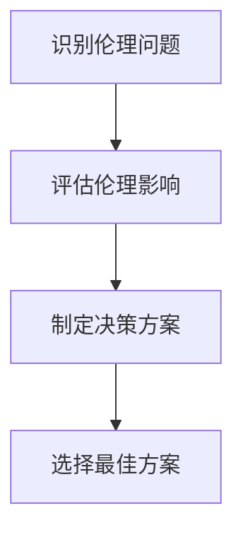

### 5.2 伦理困境的案例分析

以下是一个伦理困境的案例分析：

#### 核心概念与联系

案例名称：某公司自动化招聘系统的伦理困境

背景：某公司采用自动化招聘系统进行人才筛选，但该系统在训练过程中可能存在算法偏见，导致某些群体受到不公平对待。

伦理困境：

1. **算法偏见**：自动化招聘系统在训练过程中可能产生偏见，导致某些群体（如性别、种族等）受到不公平对待。

2. **隐私保护**：招聘过程中需要收集大量求职者的个人信息，如何保护求职者的隐私成为一个重要问题。

3. **透明性**：自动化招聘系统的决策过程不透明，求职者难以了解自己的被拒原因。

解决方案：

1. **数据清洗**：在训练自动化招聘系统时，对训练数据进行清洗，去除可能导致偏见的因素。

2. **算法审计**：定期对自动化招聘系统进行算法审计，确保系统不会产生偏见。

3. **增加透明性**：在招聘过程中，明确告知求职者招聘流程和系统决策过程，增加透明性。

#### Mermaid 流程图

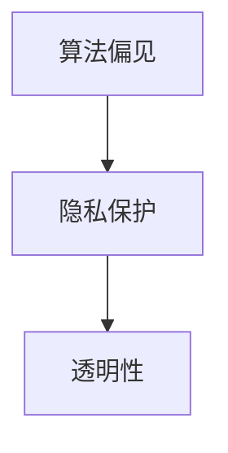

### 5.3 伦理决策的实践指南

为了在实际工作中做出符合伦理要求的决策，可以参考以下实践指南：

1. **加强伦理教育**：提高技术人员的伦理意识和能力，使他们能够更好地识别和处理伦理问题。

2. **建立伦理决策框架**：在项目开发和运营过程中，建立一套伦理决策框架，确保伦理问题得到充分考虑。

3. **开展伦理审查**：对涉及伦理问题的项目进行伦理审查，评估可能带来的伦理影响，并制定相应的决策。

4. **建立伦理委员会**：在组织内部设立伦理委员会，负责处理伦理问题和决策。

#### 核心概念与联系

伦理教育：指提高技术人员的伦理意识和能力。

伦理决策框架：指在项目开发和运营过程中，建立一套伦理决策框架。

伦理审查：指对涉及伦理问题的项目进行审查，评估可能带来的伦理影响。

伦理委员会：指在组织内部设立伦理委员会，负责处理伦理问题和决策。

#### Mermaid 流程图

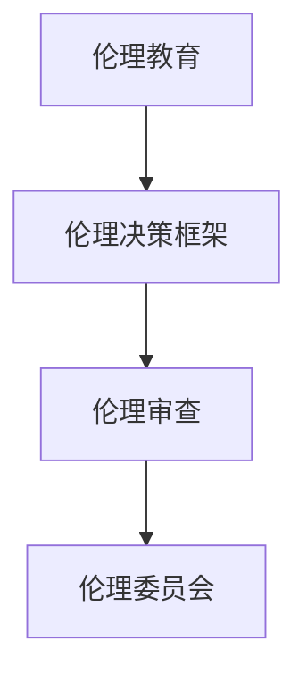

----------------------------------------------------------------

## 第6章：企业中的伦理实践

### 6.1 伦理政策与规范

企业中的伦理政策与规范是指企业在经营和管理过程中，遵循的一系列伦理原则和行为准则。这些政策与规范旨在确保企业的行为符合伦理要求，维护企业的声誉和社会责任。以下是一个典型的伦理政策与规范框架：

1. **尊重员工权利**：确保员工在工作和生活方面的权益得到保障，包括公平就业、健康安全、职业发展等。

2. **环境保护**：在生产和运营过程中，注重环保，减少资源消耗和环境污染。

3. **社会责任**：关注企业对社会的贡献，包括慈善捐赠、社区服务、公益活动等。

4. **公平竞争**：遵守市场竞争规则，不进行不正当竞争，维护市场秩序。

5. **客户权益**：尊重客户的权益，提供高质量的产品和服务，保护客户隐私。

#### 核心概念与联系

尊重员工权利：指保障员工在工作和生活方面的权益。

环境保护：指在生产和运营过程中，注重环保，减少资源消耗和环境污染。

社会责任：指企业对社会的贡献，包括慈善捐赠、社区服务、公益活动等。

公平竞争：指遵守市场竞争规则，不进行不正当竞争，维护市场秩序。

客户权益：指尊重客户的权益，提供高质量的产品和服务，保护客户隐私。

#### Mermaid 流程图

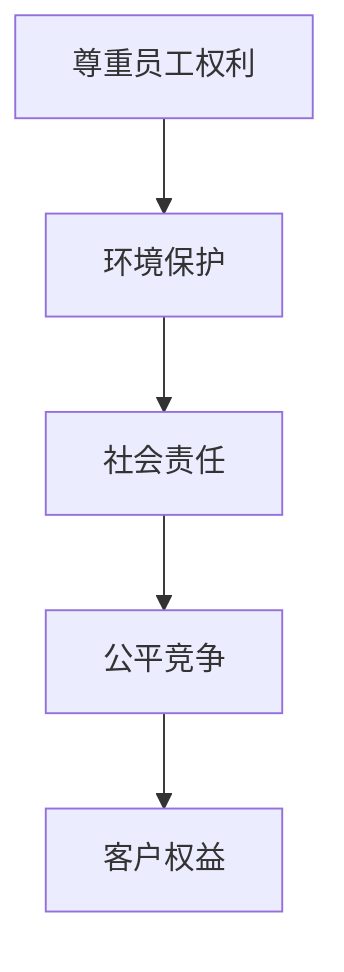

### 6.2 伦理委员会的角色与职责

伦理委员会是企业中负责处理伦理问题的重要机构。其角色和职责主要包括：

1. **审查伦理问题**：对涉及伦理问题的项目或决策进行审查，评估可能带来的伦理影响。

2. **制定伦理准则**：根据企业价值观和伦理原则，制定具体的伦理准则，为企业行为提供指导。

3. **监督执行**：监督企业各部门和员工遵守伦理政策与规范的情况，确保企业行为符合伦理要求。

4. **提供培训**：组织伦理培训，提高员工对伦理问题的认识和应对能力。

5. **处理投诉**：受理员工和客户的伦理投诉，调查处理并反馈结果。

#### 核心概念与联系

审查伦理问题：指对涉及伦理问题的项目或决策进行审查，评估可能带来的伦理影响。

制定伦理准则：指根据企业价值观和伦理原则，制定具体的伦理准则，为企业行为提供指导。

监督执行：指监督企业各部门和员工遵守伦理政策与规范的情况，确保企业行为符合伦理要求。

提供培训：指组织伦理培训，提高员工对伦理问题的认识和应对能力。

处理投诉：指受理员工和客户的伦理投诉，调查处理并反馈结果。

#### Mermaid 流程图

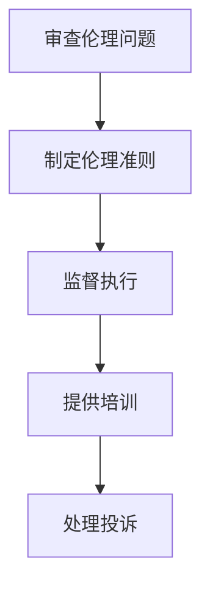

### 6.3 案例分析：企业伦理实践的成功与挑战

以下是一个企业伦理实践的成功与挑战的案例分析：

#### 核心概念与联系

案例名称：某互联网公司伦理实践案例

背景：某互联网公司为了提升企业的伦理实践水平，采取了一系列措施，包括建立伦理委员会、制定伦理准则、开展伦理培训等。

成功经验：

1. **建立伦理委员会**：公司设立了专门的伦理委员会，负责审查伦理问题，制定伦理准则，监督执行。

2. **制定伦理准则**：公司根据自身价值观和行业特点，制定了详细的伦理准则，涵盖了员工权益、环境保护、社会责任等方面。

3. **开展伦理培训**：公司定期组织伦理培训，提高员工的伦理意识和能力，使他们在工作中能够更好地处理伦理问题。

4. **实施伦理监督**：公司通过内部审计和员工反馈，对各部门和员工遵守伦理准则的情况进行监督，确保企业行为符合伦理要求。

挑战：

1. **伦理问题复杂性**：随着公司业务的发展和变化，伦理问题变得日益复杂，需要不断更新和调整伦理准则。

2. **员工认知差异**：不同员工对伦理问题的认知程度不同，需要加强培训和教育，提高员工的伦理意识。

3. **外部压力**：企业需要面对来自客户、投资者、社会等各方面的伦理压力，需要建立有效的应对机制。

解决方案：

1. **持续更新伦理准则**：根据公司业务发展和行业变化，定期更新伦理准则，确保其符合实际情况。

2. **加强培训和教育**：针对不同员工，制定差异化的培训计划，提高员工的伦理意识和能力。

3. **建立应对机制**：针对外部压力，建立相应的应对机制，如制定应急预案、开展伦理风险分析等。

#### Mermaid 流程图

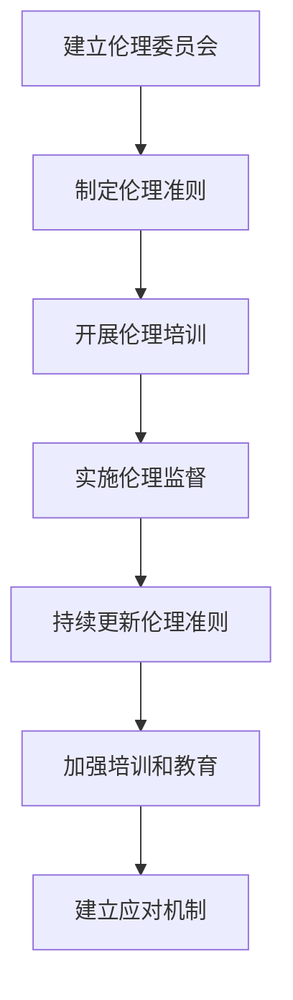

----------------------------------------------------------------

## 第7章：法律与伦理的结合

### 7.1 法律与伦理的关系

法律和伦理是相互联系、相互作用的两个概念。法律是国家制定的具有强制力的规范，旨在维护社会秩序和公共利益。伦理则是社会公认的道德规范和行为准则，旨在引导人们的行为和决策。法律与伦理的关系主要体现在以下几个方面：

1. **法律是伦理的底线**：法律通常规定了人们的行为底线，违反法律就是违反伦理。

2. **伦理是法律的补充**：法律无法涵盖所有的道德问题，伦理可以在法律之外发挥补充作用，引导人们的行为。

3. **法律与伦理相互促进**：良好的法律制度可以为伦理实践提供保障，而良好的伦理实践可以促进法律制度的完善。

#### 核心概念与联系

法律：指国家制定的具有强制力的规范，旨在维护社会秩序和公共利益。

伦理：指社会公认的道德规范和行为准则，旨在引导人们的行为和决策。

#### Mermaid 流程图

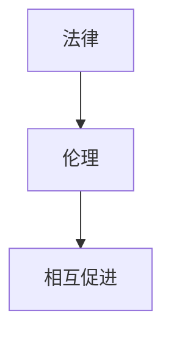

### 7.2 伦理法律框架

伦理法律框架是指将伦理原则和道德规范转化为法律规范，确保计算领域的伦理要求得到法律保障。以下是一个典型的伦理法律框架：

1. **隐私保护法**：保护用户的个人隐私，规范数据的收集、处理和使用。

2. **数据保护法**：确保数据的合法、合理和透明处理，防止数据泄露和滥用。

3. **算法伦理法**：规范算法的设计、训练和应用，防止算法偏见和歧视。

4. **信息透明法**：要求企业提供透明的信息，确保用户知情权和选择权。

#### 核心概念与联系

隐私保护法：指保护用户的个人隐私，规范数据的收集、处理和使用。

数据保护法：指确保数据的合法、合理和透明处理，防止数据泄露和滥用。

算法伦理法：指规范算法的设计、训练和应用，防止算法偏见和歧视。

信息透明法：指要求企业提供透明的信息，确保用户知情权和选择权。

#### Mermaid 流程图

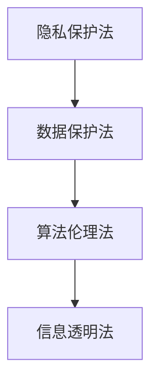

### 7.3 案例分析：法律与伦理的相互作用

以下是一个法律与伦理相互作用的案例分析：

#### 核心概念与联系

案例名称：某公司数据泄露事件

背景：某公司在数据处理过程中发生数据泄露事件，导致大量用户个人信息被泄露。

法律问题：

1. **隐私侵权**：公司未按照隐私保护法的要求，妥善处理用户个人信息，导致隐私侵权。

2. **数据泄露**：公司未按照数据保护法的要求，采取有效的数据保护措施，导致数据泄露。

伦理问题：

1. **用户信任受损**：公司未能履行对用户的信任义务，损害了用户利益。

2. **社会责任缺失**：公司未能履行社会责任，对用户和公共利益造成负面影响。

解决方案：

1. **法律责任**：公司被追究法律责任，承担相应的赔偿和处罚。

2. **伦理责任**：公司进行内部调查，找出问题根源，采取改进措施，提高数据保护意识。

3. **改进措施**：公司加强数据保护培训，完善数据保护制度，确保用户个人信息得到充分保护。

#### Mermaid 流程图

```mermaid
graph TD
    A[法律责任] --> B[伦理责任]
    B --> C[改进措施]
```

----------------------------------------------------------------

## 第8章：未来人类计算的伦理挑战

### 8.1 人工智能与伦理

随着人工智能技术的发展，人类计算面临着一系列伦理挑战。以下是一些主要的伦理问题：

1. **算法偏见**：人工智能系统在训练过程中可能产生偏见，导致不公平的结果。如何消除算法偏见成为了一个重要的伦理问题。

2. **隐私保护**：人工智能系统在处理大量数据时，可能涉及用户隐私。如何保护用户隐私，防止数据泄露成为了一个关键伦理问题。

3. **透明性**：人工智能系统的决策过程通常是不透明的，如何提高人工智能系统的透明性，使其决策过程公开透明成为了一个重要的伦理问题。

#### 核心概念与联系

算法偏见：指人工智能系统在训练过程中可能产生的偏见，导致不公平的结果。

隐私保护：指保护用户隐私，防止数据泄露。

透明性：指提高人工智能系统的透明性，使其决策过程公开透明。

#### Mermaid 流程图

```mermaid
graph TD
    A[算法偏见] --> B[隐私保护]
    B --> C[透明性]
```

### 8.2 大数据和隐私

大数据技术的发展使得人类计算在处理和分析海量数据方面取得了巨大进展。然而，这也带来了新的伦理挑战，特别是在隐私保护方面：

1. **数据收集**：大数据系统在收集数据时，可能涉及用户隐私。如何合理收集和使用数据，保护用户隐私成为了一个重要问题。

2. **数据共享**：大数据系统在处理数据时，可能需要与其他组织共享数据。如何确保数据共享过程中的隐私保护，避免数据滥用成为了一个关键问题。

3. **数据安全**：大数据系统在存储和处理数据时，可能面临数据泄露和安全威胁。如何保障数据安全，防止数据泄露成为了一个重要伦理问题。

#### 核心概念与联系

数据收集：指大数据系统在收集数据时，可能涉及用户隐私。

数据共享：指大数据系统在处理数据时，可能需要与其他组织共享数据。

数据安全：指大数据系统在存储和处理数据时，可能面临数据泄露和安全威胁。

#### Mermaid 流程图

```mermaid
graph TD
    A[数据收集] --> B[数据共享]
    B --> C[数据安全]
```

### 8.3 生物伦理与技术

随着生物技术的不断发展，人类计算在生物领域也面临着一系列伦理挑战。以下是一些主要的伦理问题：

1. **基因编辑**：基因编辑技术如CRISPR-Cas9等，可以改变生物体的基因序列。如何确保基因编辑的伦理性和安全性成为了一个重要问题。

2. **克隆技术**：克隆技术可以复制生物体的完整基因信息。如何合理使用克隆技术，避免滥用成为了一个关键伦理问题。

3. **生物数据隐私**：生物数据涉及到个人隐私，如何在生物数据收集、存储和处理过程中保护个人隐私成为了一个重要问题。

#### 核心概念与联系

基因编辑：指使用基因编辑技术改变生物体的基因序列。

克隆技术：指使用克隆技术复制生物体的完整基因信息。

生物数据隐私：指在生物数据收集、存储和处理过程中保护个人隐私。

#### Mermaid 流程图

```mermaid
graph TD
    A[基因编辑] --> B[克隆技术]
    B --> C[生物数据隐私]
```

----------------------------------------------------------------

## 第9章：伦理视角下的未来人类计算

### 9.1 伦理理念与技术发展

在未来，人类计算将继续快速发展，伦理理念也将对技术发展产生深远影响。以下是一些关键伦理理念：

1. **公正性**：确保计算技术能够公平地服务于所有人，避免算法偏见和不公平结果。

2. **透明性**：提高计算技术的透明性，使决策过程更加公开和可解释。

3. **隐私保护**：加强隐私保护，确保用户数据的安全和隐私。

4. **社会责任**：计算技术的发展应考虑社会责任，确保技术对社会产生积极影响。

#### 核心概念与联系

公正性：指确保计算技术能够公平地服务于所有人。

透明性：指提高计算技术的透明性，使决策过程更加公开和可解释。

隐私保护：指加强隐私保护，确保用户数据的安全和隐私。

社会责任：指计算技术的发展应考虑社会责任，确保技术对社会产生积极影响。

#### Mermaid 流程图

```mermaid
graph TD
    A[公正性] --> B[透明性]
    B --> C[隐私保护]
    C --> D[社会责任]
```

### 9.2 人类计算的未来趋势

未来人类计算将呈现以下趋势：

1. **智能化**：计算技术将更加智能化，具备更高的自主决策能力。

2. **泛在化**：计算技术将更加普及，渗透到各个领域和层面。

3. **融合化**：计算技术将与其他领域（如生物、物理等）深度融合，产生新的技术和应用。

#### 核心概念与联系

智能化：指计算技术将更加智能化，具备更高的自主决策能力。

泛在化：指计算技术将更加普及，渗透到各个领域和层面。

融合化：指计算技术将与其他领域（如生物、物理等）深度融合，产生新的技术和应用。

#### Mermaid 流程图

```mermaid
graph TD
    A[智能化] --> B[泛在化]
    B --> C[融合化]
```

### 9.3 人类计算与可持续发展的结合

人类计算在可持续发展中发挥着重要作用。以下是如何将人类计算与可持续发展相结合的一些思路：

1. **环境保护**：利用计算技术优化能源利用，减少碳排放，推动绿色能源发展。

2. **社会公正**：利用计算技术提高社会公平，消除贫困，促进社会和谐。

3. **资源管理**：利用计算技术优化资源管理，提高资源利用效率，实现可持续发展。

#### 核心概念与联系

环境保护：指利用计算技术优化能源利用，减少碳排放，推动绿色能源发展。

社会公正：指利用计算技术提高社会公平，消除贫困，促进社会和谐。

资源管理：指利用计算技术优化资源管理，提高资源利用效率，实现可持续发展。

#### Mermaid 流程图

```mermaid
graph TD
    A[环境保护] --> B[社会公正]
    B --> C[资源管理]
```

----------------------------------------------------------------

## 第10章：结论与展望

### 10.1 人类计算的伦理价值

人类计算的伦理价值主要体现在以下几个方面：

1. **公平性**：确保计算技术公平地服务于所有人，避免算法偏见和不公平结果。

2. **透明性**：提高计算技术的透明性，使决策过程更加公开和可解释。

3. **隐私保护**：加强隐私保护，确保用户数据的安全和隐私。

4. **社会责任**：计算技术的发展应考虑社会责任，确保技术对社会产生积极影响。

#### 核心概念与联系

公平性：指确保计算技术公平地服务于所有人。

透明性：指提高计算技术的透明性，使决策过程更加公开和可解释。

隐私保护：指加强隐私保护，确保用户数据的安全和隐私。

社会责任：指计算技术的发展应考虑社会责任，确保技术对社会产生积极影响。

#### Mermaid 流程图

```mermaid
graph TD
    A[公平性] --> B[透明性]
    B --> C[隐私保护]
    C --> D[社会责任]
```

### 10.2 人类计算的未来责任

面对未来，人类计算承担着重要的责任：

1. **技术进步**：推动计算技术的不断创新和进步，为社会发展提供强大动力。

2. **伦理引导**：在技术发展中坚守伦理底线，引导技术朝着更加公正、透明和可持续的方向发展。

3. **社会贡献**：通过计算技术为社会发展和人类福祉做出积极贡献，促进社会和谐与进步。

#### 核心概念与联系

技术进步：指推动计算技术的不断创新和进步，为社会发展提供强大动力。

伦理引导：指在技术发展中坚守伦理底线，引导技术朝着更加公正、透明和可持续的方向发展。

社会贡献：指通过计算技术为社会发展和人类福祉做出积极贡献，促进社会和谐与进步。

#### Mermaid 流程图

```mermaid
graph TD
    A[技术进步] --> B[伦理引导]
    B --> C[社会贡献]
```

### 10.3 研究与教育的展望

为了更好地应对人类计算带来的伦理挑战，需要在研究和教育方面做出以下努力：

1. **跨学科研究**：鼓励计算机科学、伦理学、社会学等多学科合作，开展人类计算伦理研究。

2. **伦理教育**：加强技术伦理教育，提高技术人员的伦理意识和能力。

3. **政策制定**：政府和企业应制定相应的政策和规范，确保人类计算的伦理要求得到落实。

#### 核心概念与联系

跨学科研究：指鼓励计算机科学、伦理学、社会学等多学科合作，开展人类计算伦理研究。

伦理教育：指加强技术伦理教育，提高技术人员的伦理意识和能力。

政策制定：指政府和企业应制定相应的政策和规范，确保人类计算的伦理要求得到落实。

#### Mermaid 流程图

```mermaid
graph TD
    A[跨学科研究] --> B[伦理教育]
    B --> C[政策制定]
```

### 总结

人类计算作为现代社会的重要组成部分，其发展带来了巨大的便利和挑战。伦理和社会责任是计算技术发展过程中不可忽视的重要方面。本文从多个角度探讨了人类计算的伦理本质和社会责任，分析了伦理困境和解决方案，展望了未来人类计算的发展方向。通过本文的讨论，我们期望能够提高人们对人类计算伦理价值的认识，推动计算技术朝着更加公正、透明和可持续的方向发展。

### 作者信息

作者：AI天才研究院/AI Genius Institute & 禅与计算机程序设计艺术 /Zen And The Art of Computer Programming

