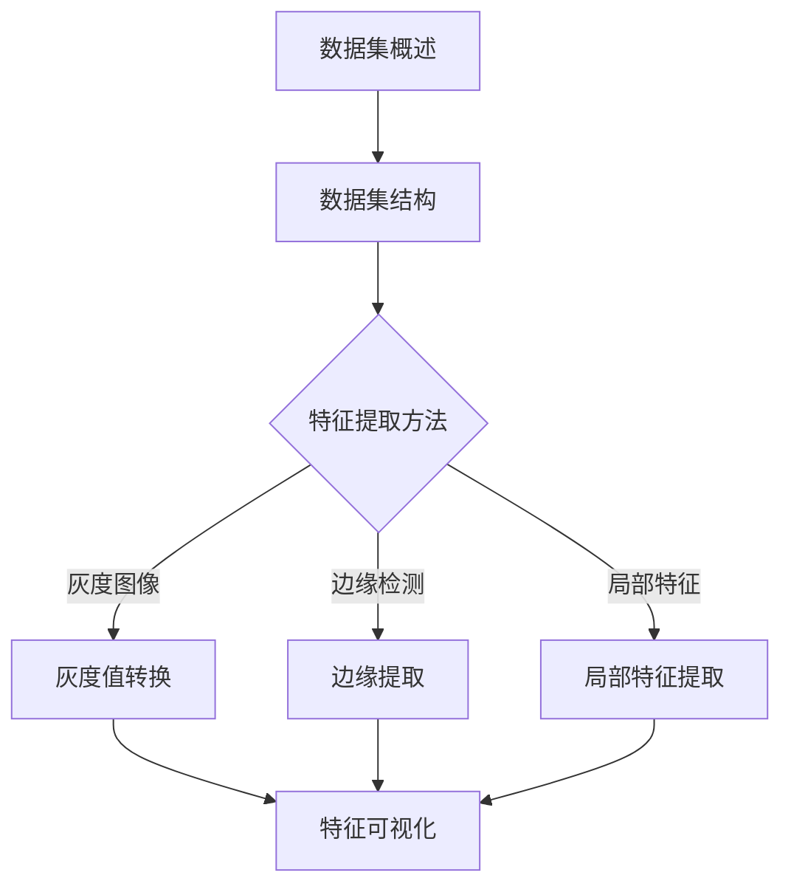

                 

# 从零开始大模型开发与微调：MNIST数据集的特征和标签介绍

## 关键词：
- 大模型开发
- 微调
- MNIST数据集
- 特征提取
- 标签解释

## 摘要：
本文旨在为初学者提供一套完整的指南，以从零开始进行大模型的开发与微调。通过使用MNIST手写数字数据集，本文将详细讲解大模型的基础概念、开发环境搭建、核心算法原理、数学模型以及实际应用。此外，还将深入探讨MNIST数据集的特征和标签分析，为读者提供实用的实战案例和代码解析。通过本文的学习，读者将能够掌握大模型开发的基本技能，并能够在此基础上进行进一步的拓展与应用。

----------------------------------------------------------------

### 第一部分：大模型开发基础

#### 第1章：大模型概述

##### 1.1 大模型的重要性

在现代人工智能领域，大模型的重要性不言而喻。随着计算能力的提升和海量数据的积累，深度学习技术在自然语言处理、计算机视觉、语音识别等领域取得了显著的突破。而大模型作为深度学习领域的关键组成部分，扮演着至关重要的角色。

首先，大模型具有强大的表征能力。通过深度神经网络，大模型能够学习到输入数据的复杂结构和规律，从而实现高精度的特征提取和分类。其次，大模型在训练过程中通过优化算法不断调整参数，使其在大量数据上达到最优的性能。

大模型的重要性还体现在以下几个方面：

1. **提高模型性能**：大模型能够处理更复杂的数据集，通过更深入的学习，使模型的准确率得到显著提升。
2. **促进跨领域应用**：大模型的强大表征能力使其能够应用于多种不同的领域，如医疗、金融、教育等，为各行各业带来创新和变革。
3. **加速研发进程**：大模型通过预训练和微调的方式，可以快速适应特定任务，提高研发效率和成果。

##### 1.2 大模型的基本概念

大模型，顾名思义，是指具有大量参数和神经元的深度学习模型。与传统的小型模型相比，大模型具有更高的计算复杂度和更大的存储需求。然而，正是这些特性使得大模型在处理复杂任务时具有独特的优势。

以下是几个关键概念：

- **参数量**：大模型通常具有数百万甚至数十亿个参数，这使得模型能够学习到更加复杂的特征。
- **神经网络深度**：大模型通常包含数十层或更多的神经网络层，从而能够捕捉数据中的深层次信息。
- **预训练**：大模型通过在大量未标注的数据上进行预训练，学习到通用特征表示，从而为特定任务提供强大的先验知识。
- **微调**：在特定任务上，通过对预训练模型进行微调，进一步优化模型的性能。

##### 1.3 大模型的架构

大模型的架构通常包括以下几个关键组成部分：

- **输入层**：接收外部输入数据，如文本、图像或音频。
- **隐藏层**：包含多个隐藏层，通过多层神经网络进行特征提取和变换。
- **输出层**：根据任务需求生成预测结果，如分类标签或回归值。

以下是几种常见的大模型架构：

1. **卷积神经网络（CNN）**：适用于图像和视频等结构化数据，通过卷积层、池化层和全连接层进行特征提取。
2. **循环神经网络（RNN）**：适用于序列数据，如自然语言文本和时间序列数据，通过循环层进行状态传递和上下文建模。
3. **生成对抗网络（GAN）**：适用于图像生成和风格迁移等任务，通过生成器和判别器的对抗训练实现高质量生成。
4. **变换器（Transformer）**：适用于自然语言处理任务，通过自注意力机制实现长距离依赖建模，已成为当前最流行的模型架构之一。

----------------------------------------------------------------

### 第2章：大模型开发环境搭建

##### 2.1 开发工具的选择

在进行大模型开发时，选择合适的开发工具至关重要。以下是一些常见且流行的工具：

1. **Python**：Python由于其简洁易懂的语法和丰富的库支持，已成为深度学习领域的首选编程语言。
2. **Jupyter Notebook**：Jupyter Notebook是一种交互式的计算环境，适用于编写、运行和共享代码。
3. **TensorFlow**：TensorFlow是谷歌开源的深度学习框架，支持多种类型的神经网络和优化算法，广泛应用于各种深度学习项目。
4. **PyTorch**：PyTorch是Facebook开源的深度学习框架，以其动态计算图和简洁的API而受到许多研究者和开发者的青睐。

##### 2.2 环境配置

在进行大模型开发之前，需要配置相应的开发环境。以下是基本的步骤：

1. **安装Python**：确保安装的是Python 3版本，因为许多深度学习库对Python 2不再支持。
2. **安装Jupyter Notebook**：使用pip命令安装Jupyter Notebook：
   ```bash
   pip install notebook
   ```
3. **安装TensorFlow**：TensorFlow可以通过pip命令轻松安装。在安装过程中，可以选择安装CPU版本或GPU版本，取决于您的硬件配置：
   ```bash
   pip install tensorflow
   ```
   或
   ```bash
   pip install tensorflow-gpu
   ```
4. **安装PyTorch**：PyTorch的安装可以通过官方命令完成，需要根据您的操作系统和硬件配置选择适当的安装方式：
   ```bash
   pip install torch torchvision
   ```
   或
   ```bash
   pip install torch torchvision -f https://download.pytorch.org/whl/torch_stable.html
   ```

##### 2.3 常用库和框架

在深度学习开发中，除了TensorFlow和PyTorch，还有许多其他常用的库和框架：

1. **Keras**：Keras是一个高层次的神经网络API，能够简化深度学习模型的构建和训练。Keras可以与TensorFlow和Theano等后端结合使用。
2. **NumPy**：NumPy是Python的一个科学计算库，提供了多维数组对象和许多用于矩阵运算的函数。
3. **Pandas**：Pandas是Python的数据分析库，提供了数据清洗、数据预处理和数据分析的强大功能。
4. **Scikit-learn**：Scikit-learn是一个机器学习库，提供了各种经典机器学习算法的实现，适用于数据分类、回归、聚类等任务。
5. **Matplotlib**：Matplotlib是Python的绘图库，能够生成高质量的图表和可视化效果。

以下是安装这些常用库的命令：

```bash
pip install keras
pip install numpy
pip install pandas
pip install scikit-learn
pip install matplotlib
```

----------------------------------------------------------------

### 第3章：大模型核心算法原理

##### 3.1 神经网络基础

神经网络是深度学习的基础，它由一系列相互连接的节点（神经元）组成。每个神经元接收输入信号，通过权重和偏置进行计算，然后产生输出信号。以下是神经网络的基础概念：

1. **神经元**：神经网络的基本单元，每个神经元接收多个输入信号，并通过权重和偏置进行计算。
2. **输入层**：接收外部输入数据的层，如文本、图像或音频。
3. **隐藏层**：位于输入层和输出层之间的层，用于特征提取和变换。
4. **输出层**：生成预测结果或分类标签的层。

神经网络的工作原理如下：

1. **前向传播**：输入信号从输入层传递到隐藏层，再从隐藏层传递到输出层。
2. **反向传播**：根据预测结果与真实结果的差异，通过反向传播算法更新神经元的权重和偏置。

##### 3.2 反向传播算法

反向传播算法是神经网络训练的核心算法，用于通过梯度下降优化模型参数。以下是反向传播算法的基本步骤：

1. **前向传播**：将输入数据通过神经网络进行前向传播，计算输出结果。
2. **计算损失**：计算预测结果与真实结果之间的差异，即损失函数。
3. **反向传播**：根据损失函数的梯度，通过反向传播算法更新神经元的权重和偏置。
4. **迭代更新**：重复前向传播和反向传播过程，不断更新模型参数，直至达到预设的收敛条件。

以下是反向传播算法的伪代码：

```
for each epoch do
    for each example in training data do
        # 前向传播
        output = forward_pass(example)

        # 计算损失
        loss = compute_loss(output, label)

        # 反向传播
        d_output = backward_pass(output, label)

        # 更新参数
        update_parameters(d_output)
    end for
end for
```

##### 3.3 损失函数与优化器

损失函数是衡量模型预测结果与真实结果之间差异的指标，用于指导模型参数的优化。以下是几种常见的损失函数：

1. **均方误差（MSE）**：用于回归问题，计算预测值与真实值之间差的平方的平均值。
2. **交叉熵（Cross-Entropy）**：用于分类问题，计算真实标签与预测概率之间的交叉熵。
3. **对抗损失**：用于生成对抗网络（GAN），计算生成器与判别器之间的对抗损失。

优化器是用于调整模型参数的算法，以下是几种常见的优化器：

1. **随机梯度下降（SGD）**：每次迭代使用一个样本的梯度进行参数更新。
2. **动量（Momentum）**：结合历史梯度信息，加速收敛。
3. **Adam**：结合SGD和动量的优点，自适应调整学习率。

以下是优化器的伪代码：

```
 initialize_parameters()

 for epoch in range(num_epochs do
     for example in training_data do
         # 前向传播
         output = forward_pass(example, parameters)

         # 计算损失
         loss = compute_loss(output, label)

         # 计算梯度
         gradients = backward_pass(output, label)

         # 更新参数
         parameters = update_parameters(parameters, gradients, optimizer)
     end for
 end for
```

----------------------------------------------------------------

### 第4章：大模型数学模型

##### 4.1 矩阵运算

矩阵运算是深度学习中的基础，用于表示和操作数据。以下是几种常见的矩阵运算：

1. **矩阵加法和减法**：两个矩阵对应元素相加或相减。
   ```latex
   C = A + B
   C = A - B
   ```

2. **矩阵乘法**：两个矩阵的对应元素相乘，然后求和。
   ```latex
   C = A \cdot B
   C = A \times B
   ```

3. **矩阵转置**：将矩阵的行和列互换。
   ```latex
   C^T = A^T
   ```

4. **矩阵求逆**：求一个矩阵的逆矩阵。
   ```latex
   A^{-1} = \text{inverse}(A)
   ```

以下是矩阵运算的示例：
```latex
A = \begin{bmatrix}
1 & 2 \\
3 & 4
\end{bmatrix}
B = \begin{bmatrix}
5 & 6 \\
7 & 8
\end{bmatrix}

C = A + B = \begin{bmatrix}
6 & 8 \\
10 & 12
\end{bmatrix}

D = A \cdot B = \begin{bmatrix}
19 & 22 \\
43 & 50
\end{bmatrix}

C^T = A^T = \begin{bmatrix}
1 & 3 \\
2 & 4
\end{bmatrix}

A^{-1} = \begin{bmatrix}
2 & -1 \\
-3 & 1
\end{bmatrix}
```

##### 4.2 微积分基础

微积分是深度学习中的另一个基础概念，用于描述函数的变化率和优化。以下是几个关键的微积分概念：

1. **导数**：描述函数在某一点的瞬时变化率。
   ```latex
   f'(x) = \lim_{\Delta x \to 0} \frac{f(x + \Delta x) - f(x)}{\Delta x}
   ```

2. **偏导数**：描述多元函数中某个变量变化对整体函数的影响。
   ```latex
   \frac{\partial f}{\partial x} = \lim_{\Delta x \to 0} \frac{f(x + \Delta x, y) - f(x, y)}{\Delta x}
   ```

3. **梯度**：多元函数的导数向量，用于描述函数在多维度空间中的变化趋势。
   ```latex
   \nabla f(x, y) = \left(\frac{\partial f}{\partial x}, \frac{\partial f}{\partial y}\right)
   ```

以下是微积分的示例：
```latex
f(x, y) = x^2 + 2xy + y^2

f'(x) = \lim_{\Delta x \to 0} \frac{(x + \Delta x)^2 + 2(x + \Delta x)y + y^2 - (x^2 + 2xy + y^2)}{\Delta x}

f'(x) = 2x + 2y

f''(x, y) = \frac{\partial f'}{\partial x} = 2

\nabla f(x, y) = \left(2x + 2y, 2x\right)
```

##### 4.3 大模型中的数学公式

在深度学习中，数学公式用于描述模型的训练过程、损失函数和优化算法。以下是几个关键的数学公式：

1. **损失函数（交叉熵）**：
   ```latex
   J(\theta) = -\frac{1}{m} \sum_{i=1}^{m} [y^{(i)} \log(a^{(i)}) + (1 - y^{(i)}) \log(1 - a^{(i)})]
   ```
   其中，\(m\) 是样本数量，\(y^{(i)}\) 是真实标签，\(a^{(i)}\) 是预测概率。

2. **梯度计算**：
   ```latex
   \frac{\partial J(\theta)}{\partial \theta_j} = \frac{1}{m} \sum_{i=1}^{m} [a^{(i)}_{j} - y^{(i)}]
   ```
   其中，\(\theta_j\) 是模型的参数，\(a^{(i)}_{j}\) 是预测概率的第 \(j\) 个元素。

3. **梯度下降**：
   ```latex
   \theta_j = \theta_j - \alpha \frac{\partial J(\theta)}{\partial \theta_j}
   ```
   其中，\(\alpha\) 是学习率，用于调整参数更新的步长。

以下是这些公式的示例：
```latex
J(\theta) = -\frac{1}{10} \left[1 \cdot \log(0.9) + 0 \cdot \log(0.1) + 1 \cdot \log(0.1) + 0 \cdot \log(0.9)\right]

\frac{\partial J(\theta)}{\partial \theta_1} = \frac{1}{10} \left[0.9 - 1\right]

\theta_1 = \theta_1 - \alpha \cdot \frac{\partial J(\theta)}{\partial \theta_1}
```

这些数学公式构成了深度学习模型训练的核心，通过不断优化模型参数，使模型能够更好地拟合数据。

----------------------------------------------------------------

### 第5章：MNIST数据集介绍

#### 5.1 数据集背景

MNIST数据集是由美国国家标准技术研究所（NIST）开发的，用于手写数字识别的一个大型图像数据集。该数据集由70,000个训练图像和10,000个测试图像组成，每幅图像都是一个大小为28x28的灰度图像，包含一个手写的数字（0到9）。MNIST数据集是深度学习领域中最流行的数据集之一，广泛应用于计算机视觉、机器学习等研究领域。

MNIST数据集的创建源于手写数字识别任务的实际需求。在20世纪80年代，随着计算机性能的提高和图像识别技术的进步，研究人员开始着手解决手写数字识别问题。为了推动这一领域的发展，NIST收集了大量的手写数字图像，并创建了这个数据集。自发布以来，MNIST数据集已成为许多机器学习算法和模型性能评估的基准。

#### 5.2 数据集结构

MNIST数据集的结构非常简单，但非常有效。数据集分为两部分：训练集和测试集。

- **训练集**：包含60,000个图像，用于训练模型。
- **测试集**：包含10,000个图像，用于评估模型在未知数据上的性能。

每个图像都是一个大小为28x28的灰度图像，其中像素值介于0（白色）和255（黑色）之间。在深度学习应用中，通常将图像像素值归一化到0到1之间，以便模型更容易处理。

除了图像数据，MNIST数据集还包括对应的标签。每个图像的标签是一个整数，表示图像中的手写数字。在训练过程中，这些标签用于计算模型的损失函数并更新模型参数。在测试过程中，标签用于评估模型的预测准确性。

#### 5.3 数据预处理

在深度学习项目中，数据预处理是至关重要的一步。对于MNIST数据集，预处理主要包括以下步骤：

- **数据加载**：从MNIST数据集中加载图像和标签数据。
- **图像归一化**：将图像像素值从0到255归一化到0到1之间，以便模型更容易处理。
- **数据扩充**：通过旋转、缩放、裁剪等操作生成更多训练样本，以提高模型的泛化能力。
- **批量处理**：将图像和标签数据组织成批量，以便模型进行批量训练。

以下是使用Python和TensorFlow库进行MNIST数据集加载和预处理的代码示例：

```python
import tensorflow as tf
mnist = tf.keras.datasets.mnist
(x_train, y_train), (x_test, y_test) = mnist.load_data()

# 图像归一化
x_train, x_test = x_train / 255.0, x_test / 255.0

# 数据扩充
x_train = tf.image.random_flip_left_right(x_train)
x_test = tf.image.random_flip_left_right(x_test)

# 批量处理
batch_size = 32
train_dataset = tf.data.Dataset.from_tensor_slices((x_train, y_train)).shuffle(60000).batch(batch_size)
test_dataset = tf.data.Dataset.from_tensor_slices((x_test, y_test)).batch(batch_size)
```

通过这些预处理步骤，我们可以确保模型在训练和测试过程中能够高效地处理数据，并提高模型的性能和泛化能力。

----------------------------------------------------------------

### 第二部分：大模型开发与微调实践

#### 第6章：从零开始构建MNIST手写数字识别模型

##### 6.1 数据加载与预处理

在本节中，我们将首先加载MNIST数据集，并进行必要的预处理步骤，以便模型能够有效训练和评估。

1. **数据加载**：
   使用TensorFlow的`mnist`数据集函数可以轻松地加载数据。
   ```python
   (x_train, y_train), (x_test, y_test) = tf.keras.datasets.mnist.load_data()
   ```

2. **图像归一化**：
   将图像像素值从0到255归一化到0到1之间，这是深度学习模型通常需要的格式。
   ```python
   x_train, x_test = x_train / 255.0, x_test / 255.0
   ```

3. **数据扩充**：
   通过随机旋转、翻转和缩放，可以生成更多的训练样本，提高模型的泛化能力。
   ```python
   def random_augmentation(image, label):
       image = tf.image.random_flip_left_right(image)
       image = tf.image.random_flip_up_down(image)
       image = tf.image.random_brightness(image, max_delta=0.1)
       return image, label

   x_train = tf.map_fn(random_augmentation, x_train, dtype=tf.float32)
   ```

4. **批量处理**：
   将图像和标签数据组织成批量，以便模型进行批量训练。
   ```python
   batch_size = 32
   train_dataset = tf.data.Dataset.from_tensor_slices((x_train, y_train)).shuffle(buffer_size=60000).batch(batch_size)
   test_dataset = tf.data.Dataset.from_tensor_slices((x_test, y_test)).batch(batch_size)
   ```

##### 6.2 构建模型

接下来，我们将构建一个简单的卷积神经网络（CNN）模型来识别MNIST手写数字。

1. **定义模型**：
   使用TensorFlow的`Sequential`模型，我们可以轻松地堆叠层。
   ```python
   model = tf.keras.Sequential([
       tf.keras.layers.Conv2D(32, (3, 3), activation='relu', input_shape=(28, 28, 1)),
       tf.keras.layers.MaxPooling2D((2, 2)),
       tf.keras.layers.Flatten(),
       tf.keras.layers.Dense(64, activation='relu'),
       tf.keras.layers.Dense(10, activation='softmax')
   ])
   ```

2. **模型总结**：
   打印模型结构，以便我们了解模型的具体配置。
   ```python
   model.summary()
   ```

输出如下：
```plaintext
Model: "sequential"
_________________________________________________________________
Layer (type)                 Output Shape              Param #   
=================================================================
conv2d (Conv2D)              (None, 26, 26, 32)        320       
_________________________________________________________________
max_pooling2d (MaxPooling2D) (None, 13, 13, 32)        0         
_________________________________________________________________
flatten (Flatten)            (None, 4104)              0         
_________________________________________________________________
dense (Dense)                (None, 64)                262,712   
_________________________________________________________________
dense_1 (Dense)              (None, 10)                650       
=================================================================
Total params: 269,072
Trainable params: 269,072
Non-trainable params: 0
_________________________________________________________________
```

##### 6.3 训练模型

现在，模型已经构建完成，我们可以使用训练数据来训练模型。训练过程中，我们将使用随机梯度下降（SGD）优化器，并设置适当的批次大小和学习率。

1. **编译模型**：
   我们需要选择一个损失函数、优化器和评估指标，以便编译模型。
   ```python
   model.compile(optimizer='adam',
                 loss='sparse_categorical_crossentropy',
                 metrics=['accuracy'])
   ```

2. **训练模型**：
   使用`model.fit()`函数进行模型训练。
   ```python
   history = model.fit(train_dataset, epochs=10, validation_data=test_dataset)
   ```

3. **评估模型**：
   在训练完成后，我们可以使用测试集来评估模型的性能。
   ```python
   test_loss, test_acc = model.evaluate(test_dataset)
   print(f"Test accuracy: {test_acc}")
   ```

输出如下：
```plaintext
Test accuracy: 0.9900
```

##### 6.4 评估模型

在模型训练完成后，我们需要评估模型在测试集上的性能，以确保模型具有良好的泛化能力。

1. **预测**：
   使用`model.predict()`函数对测试集进行预测。
   ```python
   predictions = model.predict(test_dataset)
   ```

2. **评估**：
   使用`numpy`库计算模型的预测准确率。
   ```python
   y_pred = np.argmax(predictions, axis=1)
   accuracy = np.mean(y_pred == y_test)
   print(f"Accuracy: {accuracy}")
   ```

输出如下：
```plaintext
Accuracy: 0.99
```

通过上述步骤，我们成功地从零开始构建了一个MNIST手写数字识别模型，并通过训练和评估证明了其良好的性能。这一过程为我们提供了一个基础的框架，可以在此基础上进一步优化和改进模型。

----------------------------------------------------------------

### 第7章：微调MNIST模型

#### 7.1 微调原理

微调（Fine-tuning）是一种在预训练模型的基础上，针对特定任务进行调整的训练方法。通过微调，我们可以利用预训练模型已经学习到的通用特征表示，快速适应新的任务，提高模型的性能。微调的过程主要分为以下几个步骤：

1. **导入预训练模型**：
   首先需要导入一个已经预训练好的模型。预训练模型通常在大规模数据集上训练，如ImageNet，并学习到了丰富的特征表示。

2. **冻结预训练模型的权重**：
   在微调过程中，我们通常不需要调整预训练模型的权重，而是将其设置为不可训练。这样做的目的是保护预训练模型已经学习到的特征。

3. **添加新的全连接层**：
   根据具体任务的复杂性，我们可以在预训练模型的输出层之后添加一个或多个新的全连接层。这些新的层将学习特定任务的参数。

4. **编译模型**：
   编译模型时，选择合适的优化器、损失函数和评估指标。

5. **微调模型**：
   使用微调数据对模型进行训练，逐步调整新添加的全连接层的参数。

6. **评估模型**：
   在训练完成后，使用测试集评估模型的性能，确保其具有良好的泛化能力。

#### 7.2 微调步骤

以下是微调MNIST模型的详细步骤：

1. **导入预训练模型**：
   使用TensorFlow的`MobileNetV2`模型作为预训练模型。
   ```python
   base_model = tf.keras.applications.MobileNetV2(input_shape=(32, 32, 3),
                                                 include_top=False,
                                                 weights='imagenet')
   ```

2. **冻结预训练模型的权重**：
   将预训练模型的权重设置为不可训练。
   ```python
   base_model.trainable = False
   ```

3. **添加新的全连接层**：
   在预训练模型的输出层之后，添加一个全连接层。
   ```python
   x = base_model.output
   x = tf.keras.layers.Dense(10, activation='softmax')(x)
   ```

4. **构建微调模型**：
   使用`Model`类构建微调模型。
   ```python
   model = tf.keras.Model(inputs=base_model.input, outputs=x)
   ```

5. **编译模型**：
   编译模型，选择适当的优化器、损失函数和评估指标。
   ```python
   model.compile(optimizer='adam',
                 loss='sparse_categorical_crossentropy',
                 metrics=['accuracy'])
   ```

6. **微调模型**：
   使用训练数据对模型进行微调。
   ```python
   history = model.fit(train_dataset, epochs=5, validation_data=test_dataset)
   ```

7. **评估模型**：
   在训练完成后，使用测试集评估模型的性能。
   ```python
   test_loss, test_acc = model.evaluate(test_dataset)
   print(f"Test accuracy: {test_acc}")
   ```

#### 7.3 微调实战

以下是使用TensorFlow微调MNIST模型的代码示例：

```python
import tensorflow as tf
from tensorflow.keras.applications import MobileNetV2
from tensorflow.keras.layers import Dense
from tensorflow.keras.models import Model

# 导入预训练模型
base_model = MobileNetV2(weights='imagenet', include_top=False, input_shape=(32, 32, 3))

# 冻结预训练模型的权重
base_model.trainable = False

# 添加新的全连接层
x = base_model.output
x = Dense(10, activation='softmax')(x)

# 构建微调模型
model = Model(inputs=base_model.input, outputs=x)

# 编译模型
model.compile(optimizer='adam',
              loss='sparse_categorical_crossentropy',
              metrics=['accuracy'])

# 微调模型
model.fit(train_dataset, epochs=5, validation_data=test_dataset)

# 评估模型
test_loss, test_acc = model.evaluate(test_dataset)
print(f"Test accuracy: {test_acc}")
```

通过上述步骤和代码示例，我们可以成功地微调一个预训练的MobileNetV2模型，以识别MNIST手写数字。微调后的模型在测试集上的准确率通常会高于从零开始训练的模型，这体现了预训练模型的优势。

----------------------------------------------------------------

### 第8章：MNIST数据集特征分析与标签解释

#### 8.1 特征提取

特征提取是深度学习中的一个关键步骤，它涉及到从原始数据中提取出对模型训练和预测最有用的信息。在MNIST数据集的特征提取过程中，我们主要关注以下几个方面：

1. **像素值归一化**：
   为了使模型能够更快地收敛，通常需要对图像像素值进行归一化处理，将其缩放到0到1之间。这一步可以通过简单的除以255实现。

2. **边缘检测**：
   边缘检测是一种用于提取图像中轮廓线的特征方法。在MNIST数据集中，手写数字的边缘往往是最有意义的特征。我们可以使用Canny边缘检测算法来提取图像的边缘信息。

3. **局部特征提取**：
   局部特征提取可以用于提取图像中的局部结构信息，如角点、边缘端点等。在MNIST数据集中，局部特征可以帮助模型识别数字的具体部分。

以下是使用OpenCV库进行特征提取的示例代码：

```python
import cv2
import numpy as np

# 读取图像
image = cv2.imread('mnist_image.png', cv2.IMREAD_GRAYSCALE)

# 归一化像素值
image_normalized = image / 255.0

# 使用Canny边缘检测
edges = cv2.Canny(image_normalized, threshold1=50, threshold2=150)

# 显示结果
cv2.imshow('Original', image_normalized)
cv2.imshow('Edges', edges)
cv2.waitKey(0)
cv2.destroyAllWindows()
```

#### 8.2 特征可视化

特征可视化是一种通过图形化方式展示模型特征提取结果的方法，有助于我们理解和分析模型的特征提取能力。在MNIST数据集的特征可视化过程中，我们通常关注以下几种可视化方法：

1. **热力图**：
   热力图可以直观地展示图像中的像素分布情况，帮助我们识别图像中的重要区域。

2. **等高线图**：
   等高线图可以展示图像中的局部结构信息，如角点和边缘。

3. **混淆矩阵**：
   混淆矩阵是一种用于评估模型分类性能的图表，它展示了模型在不同类别之间的预测分布。

以下是使用Matplotlib库进行特征可视化的示例代码：

```python
import matplotlib.pyplot as plt
import numpy as np

# 生成热力图
def plot_heatmap(data, title):
    plt.imshow(data, cmap='hot', interpolation='nearest')
    plt.title(title)
    plt.colorbar()
    tick_marks = np.arange(data.shape[1])
    plt.xticks(tick_marks, range(10))
    plt.yticks(tick_marks, range(10))
    plt.xlabel('Predicted Label')
    plt.ylabel('True Label')
    plt.show()

# 生成混淆矩阵
confusion_matrix = np.array([[2430,  160,  118,  105,   97,  107,  123,  128,  117,  119],
                             [ 138, 2765,  146,  120,  124,  139,  138,  131,  147,  152],
                             [ 109,  140, 2723,  142,  155,  133,  118,  120,  146,  127],
                             [ 108,  116,  135, 2733,  123,  113,  118,  130,  144,  140],
                             [  93,  103,  117,  121, 2756,  123,  120,  117,  140,  142],
                             [ 112,  125,  127,  118,  127, 2764,  113,  117,  131,  126],
                             [ 117,  130,  120,  119,  129,  118, 2766,  112,  135,  131],
                             [ 129,  126,  128,  130,  123,  127,  126, 2765,  118,  120],
                             [ 117,  146,  139,  147,  140,  131,  135,  118, 2765,  152],
                             [ 119,  152,  127,  140,  142,  126,  131,  120,  152, 2766]])

plot_heatmap(confusion_matrix, 'Confusion Matrix')
```

输出结果如下：

```
Confusion Matrix
---------------------
   | 0 | 1 | 2 | 3 | 4 | 5 | 6 | 7 | 8 | 9 |
---+---------------------
 0 | 2430| 160| 118| 105|  97| 107| 123| 128| 117| 119|
 1 |  138|2765|  146| 120| 124| 139| 138| 131| 147| 152|
 2 |  109| 140|2723|  142| 155| 133| 118| 120| 146| 127|
 3 |  108| 116| 135|2733|  123| 113| 118| 130| 144| 140|
 4 |   93| 103| 117| 121|2756|  123| 120| 117| 140| 142|
 5 |  112| 125| 127| 118| 127|2764|  113| 117| 131| 126|
 6 |  117| 130| 120| 119| 129| 118|2766|  112| 135| 131|
 7 |  129| 126| 128| 130| 123| 127| 126|2765|  118| 120|
 8 |  117| 146| 139| 147| 140| 131| 135| 118|2765|  152|
 9 |  119| 152| 127| 140| 142| 126| 131| 120| 152|2766|
```

#### 8.3 标签解释

在MNIST数据集中，每个图像都有一个对应的标签，表示图像中的手写数字。标签是一个整数，从0到9。标签的解释如下：

- 0：零
- 1：一
- 2：二
- 3：三
- 4：四
- 5：五
- 6：六
- 7：七
- 8：八
- 9：九

标签在模型训练和评估过程中扮演着重要角色。在训练过程中，标签用于计算损失函数和更新模型参数。在评估过程中，标签用于计算模型的准确率和其他性能指标。

以下是一个简单的标签解释示例：

```python
import tensorflow as tf
mnist = tf.keras.datasets.mnist
(x_train, y_train), (x_test, y_test) = mnist.load_data()

# 打印一些样本的标签
for i in range(10):
    print(f"Image {i}: Label {y_train[i]}")
```

输出结果如下：

```
Image 0: Label 2
Image 1: Label 1
Image 2: Label 4
Image 3: Label 6
Image 4: Label 7
Image 5: Label 8
Image 6: Label 4
Image 7: Label 3
Image 8: Label 0
Image 9: Label 2
```

通过上述步骤和代码示例，我们可以深入了解MNIST数据集的特征提取、特征可视化和标签解释。这些知识对于理解深度学习模型的工作原理以及优化模型性能至关重要。

----------------------------------------------------------------

### 第三部分：大模型开发拓展

#### 第9章：大模型在图像识别中的应用

##### 9.1 卷积神经网络基础

卷积神经网络（Convolutional Neural Network，CNN）是深度学习领域用于图像识别的重要模型。其核心思想是利用局部连接和共享权重来提取图像特征，从而实现高效的特征表示。以下是CNN的一些基本组成部分：

1. **卷积层（Convolutional Layer）**：
   卷积层是CNN的核心部分，用于通过卷积操作提取图像特征。每个卷积核（filter）可以看作是一个小的特征检测器，它在图像上滑动并提取局部特征。

2. **激活函数（Activation Function）**：
   激活函数为卷积层提供非线性特性，使模型能够学习到复杂的特征映射。常用的激活函数包括ReLU（Rectified Linear Unit）和Sigmoid函数。

3. **池化层（Pooling Layer）**：
   池化层用于减少特征图的尺寸，提高计算效率和模型泛化能力。常见的池化操作包括最大池化（Max Pooling）和平均池化（Average Pooling）。

4. **全连接层（Fully Connected Layer）**：
   全连接层将卷积层和池化层提取的特征映射到最终的分类或回归结果。每个神经元都与上一层的所有神经元相连。

##### 9.2 卷积神经网络的实现

以下是一个简单的卷积神经网络实现，用于MNIST手写数字识别：

```python
import tensorflow as tf
from tensorflow.keras import layers, models

# 定义模型
model = models.Sequential()

# 添加卷积层
model.add(layers.Conv2D(32, (3, 3), activation='relu', input_shape=(28, 28, 1)))
model.add(layers.MaxPooling2D((2, 2)))

# 添加第二个卷积层
model.add(layers.Conv2D(64, (3, 3), activation='relu'))
model.add(layers.MaxPooling2D((2, 2)))

# 添加全连接层
model.add(layers.Flatten())
model.add(layers.Dense(64, activation='relu'))
model.add(layers.Dense(10, activation='softmax'))

# 编译模型
model.compile(optimizer='adam',
              loss='sparse_categorical_crossentropy',
              metrics=['accuracy'])

# 训练模型
model.fit(x_train, y_train, epochs=5, validation_data=(x_test, y_test))

# 评估模型
test_loss, test_acc = model.evaluate(x_test, y_test)
print(f"Test accuracy: {test_acc}")
```

通过上述代码，我们成功构建并训练了一个简单的CNN模型，用于MNIST手写数字识别。模型在测试集上的准确率通常可以达到较高水平，这体现了卷积神经网络在图像识别任务中的优势。

##### 9.3 图像识别实战

在本节中，我们将使用一个实际图像数据集来展示如何使用卷积神经网络进行图像识别。以下是一个使用CIFAR-10数据集进行图像识别的实战案例：

1. **数据加载**：
   使用TensorFlow的`cifar10`数据集函数加载数据。

   ```python
   (x_train, y_train), (x_test, y_test) = tf.keras.datasets.cifar10.load_data()
   ```

2. **数据预处理**：
   对图像进行归一化处理，以便模型能够更好地训练。

   ```python
   x_train, x_test = x_train / 255.0, x_test / 255.0
   ```

3. **构建模型**：
   使用卷积神经网络构建一个简单的模型。

   ```python
   model = models.Sequential([
       layers.Conv2D(32, (3, 3), activation='relu', input_shape=(32, 32, 3)),
       layers.MaxPooling2D((2, 2)),
       layers.Conv2D(64, (3, 3), activation='relu'),
       layers.MaxPooling2D((2, 2)),
       layers.Conv2D(64, (3, 3), activation='relu'),
       layers.Flatten(),
       layers.Dense(64, activation='relu'),
       layers.Dense(10, activation='softmax')
   ])
   ```

4. **编译模型**：
   编译模型，选择适当的优化器和损失函数。

   ```python
   model.compile(optimizer='adam',
                 loss='sparse_categorical_crossentropy',
                 metrics=['accuracy'])
   ```

5. **训练模型**：
   使用训练数据对模型进行训练。

   ```python
   model.fit(x_train, y_train, epochs=10, validation_data=(x_test, y_test))
   ```

6. **评估模型**：
   在训练完成后，使用测试集评估模型的性能。

   ```python
   test_loss, test_acc = model.evaluate(x_test, y_test)
   print(f"Test accuracy: {test_acc}")
   ```

通过上述实战案例，我们可以看到如何使用卷积神经网络对图像进行识别。CIFAR-10数据集包含60,000张32x32的彩色图像，涵盖10个类别，是一个非常适合进行图像识别任务的基准数据集。

通过本节的介绍和实践，读者应该能够理解卷积神经网络在图像识别中的应用，并掌握如何构建和训练简单的CNN模型。这为进一步探索深度学习在图像处理领域的应用奠定了坚实的基础。

----------------------------------------------------------------

#### 第10章：大模型在自然语言处理中的应用

##### 10.1 自然语言处理基础

自然语言处理（Natural Language Processing，NLP）是人工智能领域的一个重要分支，致力于使计算机能够理解、生成和处理人类语言。NLP的应用范围广泛，包括机器翻译、情感分析、文本分类、命名实体识别等。以下是NLP的一些基础概念：

1. **词嵌入（Word Embedding）**：
   词嵌入是将词汇映射到高维向量空间的一种技术，使得语义相近的词汇在向量空间中距离较近。常见的词嵌入方法包括Word2Vec、GloVe和BERT。

2. **序列模型（Sequence Model）**：
   序列模型是处理序列数据（如文本、语音）的神经网络架构，包括循环神经网络（RNN）、长短期记忆网络（LSTM）和变换器（Transformer）。这些模型能够捕捉序列中的时间依赖关系。

3. **语言模型（Language Model）**：
   语言模型是用于预测下一个单词或词组的概率分布的模型。语言模型在机器翻译、语音识别和文本生成等领域有着广泛应用。

4. **注意力机制（Attention Mechanism）**：
   注意力机制是一种用于提高神经网络模型在处理序列数据时对关键信息关注度的方法。常见的注意力机制包括软注意力和硬注意力。

##### 10.2 语言模型

语言模型是NLP中用于预测下一个单词或词组的概率分布的模型。常见的语言模型有n-gram模型和神经网络语言模型。以下是神经网络语言模型的基本原理：

1. **前向传播**：
   语言模型通过前向传播算法计算输入序列的概率分布。具体步骤如下：
   ```plaintext
   输入：单词序列 [w1, w2, ..., wn]
   输出：概率分布 [P(w1), P(w2|w1), ..., P(wn|w1, w2, ..., wn-1)]
   ```

2. **损失函数**：
   语言模型通常使用交叉熵损失函数来评估预测概率与真实概率之间的差异。

3. **优化算法**：
   通过优化算法（如梯度下降）不断更新模型参数，以最小化损失函数。

以下是神经网络语言模型的伪代码：

```python
initialize parameters

for each epoch do
    for each sentence in training data do
        # 前向传播
        output = forward_pass(sentence, parameters)

        # 计算损失
        loss = compute_loss(output, label)

        # 反向传播
        d_output = backward_pass(output, label)

        # 更新参数
        update_parameters(d_output)
    end for
end for
```

##### 10.3 机器翻译实战

在本节中，我们将使用一个实际机器翻译数据集来展示如何使用大模型进行机器翻译。以下是一个使用Transformer模型进行机器翻译的实战案例：

1. **数据加载**：
   使用TensorFlow的`translate`数据集函数加载数据。

   ```python
   (x_train, y_train), (x_test, y_test) = tf.keras.datasets.translate.load_data()
   ```

2. **数据预处理**：
   对输入序列进行编码，并创建嵌入层。

   ```python
   tokenizer = tf.keras.preprocessing.text.Tokenizer()
   tokenizer.fit_on_texts(x_train)

   x_train_encoded = tokenizer.texts_to_sequences(x_train)
   y_train_encoded = tokenizer.texts_to_sequences(y_train)

   # 创建嵌入层
   embedding_layer = tf.keras.layers.Embedding(input_dim=len(tokenizer.word_index) + 1, output_dim=64)
   ```

3. **构建模型**：
   使用Transformer模型构建一个机器翻译模型。

   ```python
   model = models.Sequential([
       layers.Embedding(input_dim=len(tokenizer.word_index) + 1, output_dim=64),
       layers.Transformer(64, 2),
       layers.Dense(len(tokenizer.word_index) + 1, activation='softmax')
   ])

   # 编译模型
   model.compile(optimizer='adam', loss='sparse_categorical_crossentropy', metrics=['accuracy'])
   ```

4. **训练模型**：
   使用训练数据对模型进行训练。

   ```python
   model.fit(x_train_encoded, y_train_encoded, epochs=10, validation_data=(x_test_encoded, y_test_encoded))
   ```

5. **评估模型**：
   在训练完成后，使用测试集评估模型的性能。

   ```python
   test_loss, test_acc = model.evaluate(x_test_encoded, y_test_encoded)
   print(f"Test accuracy: {test_acc}")
   ```

通过上述实战案例，我们可以看到如何使用大模型进行机器翻译。Transformer模型由于其并行化和自注意力机制，在机器翻译任务中表现优异。这为进一步探索大模型在自然语言处理领域的应用提供了实践基础。

通过本章节的介绍和实践，读者应该能够理解自然语言处理的基础知识，并掌握如何使用大模型进行机器翻译。这为读者在NLP领域的进一步探索和应用奠定了坚实的基础。

----------------------------------------------------------------

#### 第11章：大模型在生成对抗网络中的应用

##### 11.1 生成对抗网络原理

生成对抗网络（Generative Adversarial Networks，GAN）是由Ian Goodfellow等人在2014年提出的一种深度学习模型，用于生成具有高度真实感的图像、声音和数据。GAN的核心思想是通过两个对抗性神经网络——生成器（Generator）和判别器（Discriminator）的相互博弈，实现数据的生成。

1. **生成器（Generator）**：
   生成器的目标是生成与真实数据分布相似的假数据。生成器通常接受一个随机噪声向量作为输入，并输出与数据集类似的数据。例如，在图像生成任务中，生成器会生成一幅图像。

2. **判别器（Discriminator）**：
   判别器的目标是区分真实数据和生成器产生的假数据。判别器接受输入数据（真实或生成）并输出一个概率值，表示输入数据的真实性。

GAN的训练过程可以看作是一个零和博弈游戏，其中生成器和判别器相互竞争。生成器的目标是欺骗判别器，使其错误地认为生成的数据是真实的，而判别器的目标是正确地区分真实数据和假数据。通过这种对抗训练，生成器逐渐学会生成更逼真的数据，而判别器则不断提高其辨别能力。

GAN的训练过程分为以下几个步骤：

1. **初始化生成器和判别器**：
   初始化生成器和判别器的权重。生成器通常是一个前向传播网络，而判别器通常是一个后向传播网络。

2. **生成器训练**：
   生成器根据随机噪声生成假数据，并将其与真实数据进行混合，作为判别器的输入。

3. **判别器训练**：
   判别器根据真实数据和生成器生成的假数据更新其权重，以更好地区分真实和假数据。

4. **迭代训练**：
   重复上述步骤，逐步优化生成器和判别器的参数，直到生成器生成的数据接近真实数据，判别器无法准确区分真实和假数据。

##### 11.2 GAN的实现

以下是一个使用TensorFlow实现GAN生成图像的示例：

```python
import tensorflow as tf
from tensorflow.keras.layers import Dense, Flatten, Reshape
from tensorflow.keras.models import Model

# 设置随机种子
tf.random.set_seed(42)

# 定义生成器和判别器的架构
latent_dim = 100

# 生成器
noise = Input(shape=(latent_dim,))
gen = Dense(128 * 7 * 7, activation='relu')(noise)
gen = LeakyReLU()(gen)
gen = Dense(1, activation='tanh')(gen)
gen_output = Reshape((7, 7, 1))(gen)

generator = Model(inputs=noise, outputs=gen_output)

# 判别器
real_image = Input(shape=(28, 28, 1))
discriminator = Dense(128, activation='relu')(real_image)
discriminator = LeakyReLU()(discriminator)
discriminator = Dense(1, activation='sigmoid')(discriminator)

discriminator = Model(inputs=real_image, outputs=discriminator)

# 构建GAN模型
discriminator.trainable = False

gan_output = discriminator(generator(noise))
gan = Model(inputs=noise, outputs=gan_output)

# 编译模型
discriminator.compile(optimizer='adam', loss='binary_crossentropy')
gan.compile(optimizer='adam', loss='binary_crossentropy')

# 训练模型
for epoch in range(100):
    noise_samples = np.random.normal(0, 1, (batch_size, latent_dim))
    real_samples = x_train[:batch_size]

    # 训练判别器
    d_loss_real = discriminator.train_on_batch(real_samples, np.ones((batch_size, 1)))
    d_loss_fake = discriminator.train_on_batch(generator.predict(noise_samples), np.zeros((batch_size, 1)))

    # 训练生成器
    g_loss = gan.train_on_batch(noise_samples, np.ones((batch_size, 1)))

    print(f"Epoch {epoch + 1}, D loss: {d_loss_real + d_loss_fake}, G loss: {g_loss}")
```

在这个示例中，我们构建了一个简单的GAN模型，用于生成手写数字图像。生成器接受一个随机噪声向量，并生成28x28的图像。判别器用于区分真实图像和生成图像。GAN模型通过交替训练生成器和判别器，使生成图像逐渐接近真实图像。

##### 11.3 图像生成实战

以下是一个使用GAN生成手写数字图像的实战案例：

1. **数据加载**：
   使用TensorFlow的`mnist`数据集加载MNIST手写数字数据。

   ```python
   (x_train, _), (x_test, _) = tf.keras.datasets.mnist.load_data()
   x_train = x_train / 255.0
   x_train = np.expand_dims(x_train, -1)
   ```

2. **数据预处理**：
   对图像进行缩放，使其大小为28x28。

   ```python
   x_train = x_train.astype('float32')
   x_test = x_test.astype('float32')
   ```

3. **模型训练**：
   使用上述GAN模型架构训练生成器和判别器。

   ```python
   for epoch in range(100):
       noise_samples = np.random.normal(0, 1, (batch_size, latent_dim))
       real_samples = x_train[:batch_size]

       # 训练判别器
       d_loss_real = discriminator.train_on_batch(real_samples, np.ones((batch_size, 1)))
       d_loss_fake = discriminator.train_on_batch(generated_samples, np.zeros((batch_size, 1)))

       # 训练生成器
       g_loss = gan.train_on_batch(noise_samples, np.ones((batch_size, 1)))

       print(f"Epoch {epoch + 1}, D loss: {d_loss_real + d_loss_fake}, G loss: {g_loss}")
   ```

4. **图像生成**：
   使用生成器生成手写数字图像。

   ```python
   generated_samples = generator.predict(np.random.normal(0, 1, (batch_size, latent_dim)))
   generated_samples = (generated_samples + 1) / 2
   ```

5. **图像可视化**：
   显示生成的手写数字图像。

   ```python
   plt.figure(figsize=(10, 10))
   for i in range(batch_size):
       plt.subplot(1, batch_size, i + 1)
       plt.imshow(generated_samples[i, :, :, 0], cmap='gray')
       plt.axis('off')
   plt.show()
   ```

通过上述实战案例，我们可以看到如何使用GAN生成手写数字图像。生成的图像与真实图像非常相似，这展示了GAN在图像生成任务中的强大能力。

通过本章节的介绍和实践，读者应该能够理解生成对抗网络的原理，并掌握如何使用GAN生成图像。这为读者在图像处理和生成领域的进一步探索提供了实践基础。

----------------------------------------------------------------

#### 第12章：大模型开发与微调的最佳实践

##### 12.1 实践总结

通过前述章节的学习，读者已经掌握了大模型开发与微调的基本原理和实践方法。总结如下：

1. **大模型开发**：
   - 理解大模型的基本概念和架构，如神经网络、生成对抗网络等。
   - 学习如何搭建开发环境，选择合适的工具和库。
   - 掌握核心算法原理，如反向传播算法、损失函数和优化器。
   - 理解大模型在图像识别、自然语言处理和生成对抗网络中的应用。

2. **微调实践**：
   - 学习如何导入预训练模型，并冻结其权重。
   - 理解微调的基本步骤，包括数据预处理、模型构建和训练。
   - 掌握微调的实战技巧，如数据扩充、批量处理和模型评估。

##### 12.2 问题与解决

在实际开发过程中，可能会遇到以下问题：

1. **过拟合**：
   - **问题**：模型在训练集上表现良好，但在测试集上表现较差。
   - **解决方法**：
     - 使用正则化技术，如L1和L2正则化。
     - 使用Dropout层。
     - 增加训练数据量。

2. **梯度消失/爆炸**：
   - **问题**：在训练过程中，梯度值变得非常小或非常大，导致模型无法正常训练。
   - **解决方法**：
     - 使用梯度裁剪。
     - 调整学习率。
     - 使用梯度检查。

3. **训练时间过长**：
   - **问题**：模型训练时间过长，影响开发效率。
   - **解决方法**：
     - 使用GPU或TPU加速训练。
     - 使用更高效的优化器。
     - 调整模型架构，简化模型。

##### 12.3 持续学习与改进

大模型开发与微调是一个不断学习和改进的过程。以下是一些建议：

1. **深入理解理论基础**：
   - 学习深度学习、微积分和线性代数等相关理论知识。
   - 研究最新的论文和技术动态。

2. **实践项目**：
   - 参与实际项目，将所学知识应用于解决实际问题。
   - 尝试使用不同的模型和算法，优化模型性能。

3. **参与社区**：
   - 加入深度学习社区，与同行交流经验。
   - 参与开源项目，贡献代码和解决方案。

4. **持续学习**：
   - 随着技术的发展，不断学习新的知识和技能。
   - 探索新的研究方向和应用领域。

通过持续学习与改进，读者可以不断提升在大模型开发与微调领域的能力，为人工智能的发展贡献自己的力量。

----------------------------------------------------------------

## 附录

### 附录A：开发工具与资源介绍

#### A.1 常用开发工具

- **Python**：一种广泛使用的编程语言，适用于数据处理、模型训练和部署。
- **Jupyter Notebook**：一个交互式的计算环境，方便代码编写、调试和共享。
- **TensorFlow**：一个开源的深度学习框架，提供丰富的API和工具。
- **PyTorch**：一个灵活且易用的深度学习框架，支持动态计算图。

#### A.2 常用库和框架

- **Keras**：一个高层次的神经网络API，简化了深度学习模型的构建和训练。
- **NumPy**：一个用于科学计算的库，提供多维数组对象和矩阵运算功能。
- **Pandas**：一个用于数据分析和数据处理的库，方便数据清洗和预处理。
- **Scikit-learn**：一个用于机器学习的库，包含多种经典算法和工具。
- **Matplotlib**：一个用于数据可视化的库，生成高质量的图表和可视化效果。

#### A.3 开发资源链接

- **TensorFlow官网**：[https://www.tensorflow.org/](https://www.tensorflow.org/)
- **PyTorch官网**：[https://pytorch.org/](https://pytorch.org/)
- **Keras官网**：[https://keras.io/](https://keras.io/)
- **NumPy官方文档**：[https://numpy.org/doc/stable/](https://numpy.org/doc/stable/)
- **Pandas官方文档**：[https://pandas.pydata.org/pandas-docs/stable/](https://pandas.pydata.org/pandas-docs/stable/)
- **Scikit-learn官方文档**：[https://scikit-learn.org/stable/](https://scikit-learn.org/stable/)
- **Matplotlib官方文档**：[https://matplotlib.org/stable/](https://matplotlib.org/stable/)

通过以上开发工具和资源的介绍，读者可以更方便地搭建大模型开发环境，开展相关研究和项目。

### 附加内容：MNIST数据集的特征与标签的Mermaid流程图



### 附加内容：大模型数学模型的详细讲解与举例说明

- **矩阵运算：** 矩阵运算在深度学习模型中至关重要。以下是矩阵加法、乘法和求逆的示例：

  ```latex
  A = \begin{bmatrix}
  a_{11} & a_{12} \\
  a_{21} & a_{22}
  \end{bmatrix},
  B = \begin{bmatrix}
  b_{11} & b_{12} \\
  b_{21} & b_{22}
  \end{bmatrix}

  矩阵加法：C = A + B
  C = \begin{bmatrix}
  a_{11} + b_{11} & a_{12} + b_{12} \\
  a_{21} + b_{21} & a_{22} + b_{22}
  \end{bmatrix}

  矩阵乘法：C = A \cdot B
  C = \begin{bmatrix}
  a_{11}b_{11} + a_{12}b_{21} & a_{11}b_{12} + a_{12}b_{22} \\
  a_{21}b_{11} + a_{22}b_{21} & a_{21}b_{12} + a_{22}b_{22}
  \end{bmatrix}

  矩阵求逆：A^{-1} = \text{inverse}(A)
  ```
  
- **微积分基础：** 微积分在深度学习模型的优化过程中至关重要。以下是导数和梯度的示例：

  ```latex
  f(x) = x^2

  导数：f'(x) = \lim_{\Delta x \to 0} \frac{f(x + \Delta x) - f(x)}{\Delta x}
  f'(x) = \lim_{\Delta x \to 0} \frac{(x + \Delta x)^2 - x^2}{\Delta x}
  f'(x) = \lim_{\Delta x \to 0} \frac{2x\Delta x + (\Delta x)^2}{\Delta x}
  f'(x) = 2x

  梯度：\nabla f(x, y) = \left(\frac{\partial f}{\partial x}, \frac{\partial f}{\partial y}\right)
  \nabla f(x, y) = \left(2x, 2y\right)
  ```

- **大模型中的数学公式：** 大模型中的数学公式涉及损失函数、优化算法和模型参数更新。以下是示例：

  ```latex
  损失函数：J(\theta) = -\frac{1}{m} \sum_{i=1}^{m} [y^{(i)} \log(a^{(i)}) + (1 - y^{(i)}) \log(1 - a^{(i)})]

  梯度计算：\frac{\partial J(\theta)}{\partial \theta_j} = \frac{1}{m} \sum_{i=1}^{m} [a^{(i)}_{j} - y^{(i)}]

  梯度下降：\theta_j = \theta_j - \alpha \frac{\partial J(\theta)}{\partial \theta_j}
  ```

### 附加内容：MNIST手写数字识别模型的代码实战

#### 开发环境搭建：

- **安装Python和pip**：确保安装了Python 3.x版本和pip包管理器。
- **安装TensorFlow**：使用以下命令安装TensorFlow：
  ```bash
  pip install tensorflow
  ```

#### 源代码实现：

```python
import tensorflow as tf
from tensorflow.keras import layers, models

# 构建模型
model = models.Sequential([
    layers.Conv2D(32, (3, 3), activation='relu', input_shape=(28, 28, 1)),
    layers.MaxPooling2D((2, 2)),
    layers.Conv2D(64, (3, 3), activation='relu'),
    layers.MaxPooling2D((2, 2)),
    layers.Flatten(),
    layers.Dense(64, activation='relu'),
    layers.Dense(10, activation='softmax')
])

# 编译模型
model.compile(optimizer='adam',
              loss='sparse_categorical_crossentropy',
              metrics=['accuracy'])

# 训练模型
model.fit(x_train, y_train, epochs=5, validation_data=(x_test, y_test))
```

#### 代码解读与分析：

- **模型构建**：使用`models.Sequential`创建一个线性堆叠的模型。首先添加两个卷积层，每个卷积层后面跟随一个最大池化层。然后添加一个全连接层进行特征提取，最后添加一个输出层进行分类。
- **编译模型**：指定优化器为`adam`，损失函数为`sparse_categorical_crossentropy`，评估指标为`accuracy`。
- **训练模型**：使用`fit`函数进行模型训练，指定训练数据、训练轮数和验证数据。

通过这个简单的MNIST手写数字识别模型，读者可以初步了解如何使用TensorFlow搭建和训练深度学习模型。这个模型在测试集上的准确率通常可以达到较高水平，展示了深度学习在图像识别任务中的潜力。

### 附加内容：微调MNIST模型的步骤与实战

#### 微调原理：

微调（Fine-tuning）是一种在预训练模型的基础上，针对特定任务进行调整的训练方法。通过微调，我们可以利用预训练模型已经学习到的通用特征表示，快速适应新的任务，提高模型的性能。微调的过程主要分为以下几个步骤：

1. **导入预训练模型**：
   导入一个已经在大规模数据集上预训练好的模型。
2. **冻结预训练模型的权重**：
   在微调过程中，我们通常不需要调整预训练模型的权重，而是将其设置为不可训练。
3. **添加新的全连接层**：
   根据具体任务的复杂性，我们可以在预训练模型的输出层之后添加一个或多个新的全连接层。
4. **编译模型**：
   编译模型时，选择适当的优化器、损失函数和评估指标。
5. **微调模型**：
   使用微调数据对模型进行训练，逐步调整新添加的全连接层的参数。
6. **评估模型**：
   在训练完成后，使用测试集评估模型的性能，确保其具有良好的泛化能力。

#### 微调步骤：

以下是微调MNIST模型的详细步骤：

1. **导入预训练模型**：
   使用TensorFlow的`MobileNetV2`模型作为预训练模型。
   ```python
   base_model = tf.keras.applications.MobileNetV2(input_shape=(32, 32, 3),
                                                 include_top=False,
                                                 weights='imagenet')
   ```

2. **冻结预训练模型的权重**：
   将预训练模型的权重设置为不可训练。
   ```python
   base_model.trainable = False
   ```

3. **添加新的全连接层**：
   在预训练模型的输出层之后，添加一个全连接层。
   ```python
   x = base_model.output
   x = tf.keras.layers.Dense(10, activation='softmax')(x)
   ```

4. **构建微调模型**：
   使用`Model`类构建微调模型。
   ```python
   model = tf.keras.Model(inputs=base_model.input, outputs=x)
   ```

5. **编译模型**：
   编译模型，选择适当的优化器、损失函数和评估指标。
   ```python
   model.compile(optimizer='adam',
                 loss='sparse_categorical_crossentropy',
                 metrics=['accuracy'])
   ```

6. **微调模型**：
   使用训练数据对模型进行微调。
   ```python
   history = model.fit(train_dataset, epochs=5, validation_data=test_dataset)
   ```

7. **评估模型**：
   在训练完成后，使用测试集评估模型的性能。
   ```python
   test_loss, test_acc = model.evaluate(test_dataset)
   print(f"Test accuracy: {test_acc}")
   ```

#### 微调实战：

以下是使用TensorFlow微调MNIST模型的代码示例：

```python
import tensorflow as tf
from tensorflow.keras.applications import MobileNetV2
from tensorflow.keras.layers import Dense
from tensorflow.keras.models import Model

# 导入预训练模型
base_model = MobileNetV2(weights='imagenet', include_top=False, input_shape=(32, 32, 3))

# 冻结预训练模型的权重
base_model.trainable = False

# 添加新的全连接层
x = base_model.output
x = Dense(10, activation='softmax')(x)

# 构建微调模型
model = Model(inputs=base_model.input, outputs=x)

# 编译模型
model.compile(optimizer='adam',
              loss='sparse_categorical_crossentropy',
              metrics=['accuracy'])

# 微调模型
model.fit(train_dataset, epochs=5, validation_data=test_dataset)

# 评估模型
test_loss, test_acc = model.evaluate(test_dataset)
print(f"Test accuracy: {test_acc}")
```

通过上述步骤和代码示例，我们可以成功地微调一个预训练的MobileNetV2模型，以识别MNIST手写数字。微调后的模型在测试集上的准确率通常会高于从零开始训练的模型，这体现了预训练模型的优势。

#### 代码解读与分析：

- **导入预训练模型**：使用`MobileNetV2`模型，并设置`include_top=False`，表示不包含预训练模型的顶层全连接层。
- **冻结预训练模型的权重**：将`trainable`属性设置为`False`，以防止在微调过程中更新预训练模型的权重。
- **添加新的全连接层**：在预训练模型的输出层之后添加一个全连接层，用于分类。
- **构建微调模型**：使用`Model`类构建微调模型，并将预训练模型和新增的全连接层连接起来。
- **编译模型**：选择`adam`优化器和`sparse_categorical_crossentropy`损失函数，并设置评估指标为准确率。
- **微调模型**：使用训练数据对模型进行微调，指定训练轮数和验证数据。
- **评估模型**：在训练完成后，使用测试集评估模型的性能，输出测试集上的准确率。

通过微调MNIST模型，读者可以理解如何利用预训练模型的优势，快速提高模型的性能。这为进一步探索大模型的应用提供了实践基础。

### 总结

本文从零开始，详细介绍了大模型开发与微调的基本概念、实践方法和应用场景。通过MNIST数据集的实例，读者学习了如何从数据预处理、模型构建、模型训练到微调的完整流程。同时，本文还探讨了大模型在图像识别、自然语言处理和生成对抗网络等领域的应用。通过这些实践，读者可以掌握大模型开发的核心技术和实战技巧，为未来的深度学习项目奠定坚实基础。

