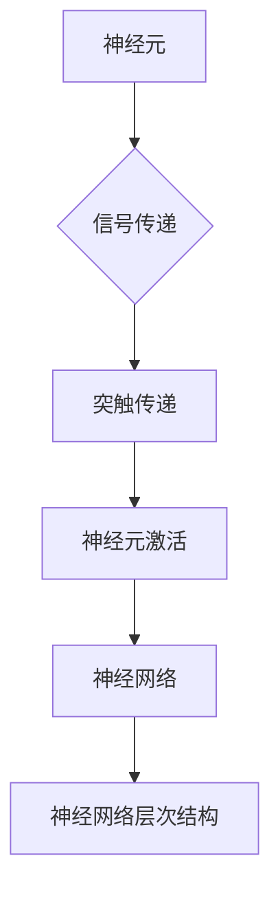
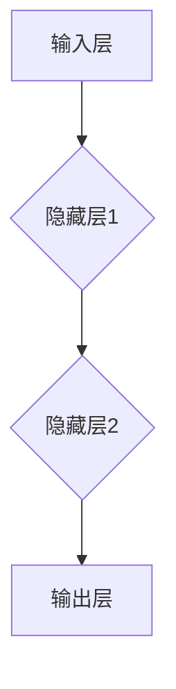

                 

# 仿生机器人的运动规划：生物灵感的数学实现

## 关键词：
仿生机器人，运动规划，生物灵感，数学模型，算法实现

### 摘要：
本文探讨了仿生机器人的运动规划问题，通过生物灵感的数学实现，介绍了如何将生物神经系统与生物力学原理应用于机器人运动控制。文章首先概述了仿生机器人的发展背景和运动规划的应用，然后深入分析了生物灵感的数学实现原理，包括生物神经系统模型和生物力学模型。接着，本文详细讲解了运动规划的数学实现方法，包括仿生算法和优化算法。通过实际案例和项目实战，本文展示了如何将理论应用于实践，并展望了仿生机器人运动规划的未来发展。

## 目录大纲：

### 第一部分：引言与背景

- **第1章：仿生机器人的运动规划概述**
  - 1.1 仿生机器人与运动规划的背景
  - 1.2 生物灵感的数学实现
  - 1.3 运动规划的数学模型

### 第二部分：核心算法原理

- **第2章：生物灵感的数学实现原理**
  - 2.1 生物神经系统模型
  - 2.2 生物力学模型

### 第三部分：运动规划的数学实现

- **第3章：运动规划的数学实现方法**
  - 3.1 仿生算法
  - 3.2 优化算法

### 第四部分：实际案例与项目实战

- **第4章：仿生机器人的运动规划应用案例**
  - 4.1 鸟类飞行仿生机器人
  - 4.2 爬行动物仿生机器人

### 第五部分：运动规划的挑战与未来展望

- **第5章：仿生机器人的运动规划挑战与未来展望**

### 第六部分：附录与资源

- **附录A：运动规划相关工具与资源**

### 第二部分：核心概念与联系

在讨论仿生机器人的运动规划之前，我们需要理解几个核心概念：生物神经系统、生物力学以及运动规划的数学模型。这些概念不仅为仿生机器人的运动规划提供了理论基础，而且也是实现高效、灵活运动的关键。

#### 生物神经系统的 Mermaid 流程图



神经元是神经系统中的基本单元，它们通过突触传递信号，并共同构成神经网络。神经网络具有层次结构，每一层都对输入信号进行处理，并产生相应的输出。这种层次结构在运动控制中具有重要意义，因为它们可以模拟生物体内的复杂控制机制。

#### 运动规划的数学模型

运动规划的数学模型是构建仿生机器人运动控制系统的基础。以下是几个关键概念和公式：

### 动力学方程的建立

```latex
\frac{d^2x}{dt^2} = F/m
```

这个公式描述了物体在受力作用下的运动规律。其中，\( x(t) \) 是物体的位置，\( F \) 是作用力，\( m \) 是物体的质量。通过这个方程，我们可以计算出物体在不同时间点的位置和速度。

### 动力学方程的应用举例

假设一个质量为 \( m \) 的物体受到一个恒定的力 \( F \)，求其运动轨迹。

```latex
\frac{d^2x}{dt^2} = \frac{F}{m}
```

解得：\( x(t) = \frac{1}{2}at^2 + v_0t + x_0 \)

其中，\( a \) 为加速度，\( v_0 \) 为初始速度，\( x_0 \) 为初始位置。

### 运动规划的数学公式

#### 优化目标函数

```latex
J(x) = \sum_{i=1}^{n} (f_i(x_i) - t_i)^2
```

其中，\( f_i(x_i) \) 表示第 \( i \) 个约束函数，\( t_i \) 表示第 \( i \) 个目标时间。

#### 梯度下降法

```latex
x_{k+1} = x_k - \alpha \nabla J(x_k)
```

其中，\( \alpha \) 为学习率，\( \nabla J(x_k) \) 为 \( J(x) \) 在 \( x_k \) 处的梯度。

这些公式和算法为运动规划提供了数学工具，使得我们可以在复杂的环境中设计出高效的运动控制策略。

在接下来的部分，我们将深入探讨这些核心概念和算法，并通过实际案例展示如何将它们应用于仿生机器人的运动规划。

#### 第1章：仿生机器人的运动规划概述

仿生机器人是一种模仿生物结构和功能设计的机器人。它们的运动规划和控制是机器人技术中的一个重要研究方向，旨在使机器人能够像生物一样灵活、高效地运动。仿生机器人的运动规划不仅需要考虑机械结构的物理特性，还需要模拟生物神经系统的工作原理和生物力学的运动规律。

### 1.1 仿生机器人与运动规划的背景

仿生机器人最早可以追溯到20世纪60年代。当时，科学家们开始尝试模仿昆虫和鸟类的运动机制，设计出能够自主移动的机器人。随着计算机技术和控制理论的不断发展，仿生机器人的性能和功能得到了显著提升。现代仿生机器人不仅能够在复杂环境中执行任务，还能够模仿生物的灵活性和适应性。

运动规划在仿生机器人中的应用主要体现在以下几个方面：

1. **自主导航**：仿生机器人需要具备在未知环境中自主导航的能力，这要求它们能够实时感知周围环境，并规划出最优的运动路径。
2. **任务执行**：仿生机器人需要根据任务要求，规划出一系列的运动动作，以实现特定任务的目标。例如，无人机需要在复杂地形中投放物资，四足机器人需要在崎岖地形上行走等。
3. **交互控制**：仿生机器人需要与人类或其他机器人进行交互，这要求它们能够实时调整运动策略，以适应交互环境的变化。

### 1.2 生物灵感的数学实现

生物灵感是指从自然界生物中获取设计灵感，并将其应用于技术系统中。在仿生机器人运动规划中，生物灵感的应用主要体现在以下几个方面：

1. **生物神经系统模型**：生物神经系统是生物体进行运动控制的核心，它通过复杂的神经网络实现对运动动作的精确控制。在仿生机器人中，我们可以通过构建生物神经系统模型，模拟生物的运动控制机制，实现高效的运动规划。
2. **生物力学模型**：生物力学研究生物体的运动机制和力学特性。在仿生机器人中，我们可以通过构建生物力学模型，模拟生物的运动过程，优化机器人的运动性能。

### 1.3 运动规划的数学模型

运动规划的数学模型是构建仿生机器人运动控制系统的基础。以下是几个关键概念和公式：

1. **动力学方程**：动力学方程描述了物体在受力作用下的运动规律。常见的动力学方程有牛顿第二定律和拉格朗日方程。例如：

   ```latex
   \frac{d^2x}{dt^2} = F/m
   ```

   其中，\( x(t) \) 是物体的位置，\( F \) 是作用力，\( m \) 是物体的质量。

2. **运动规划算法**：运动规划算法用于计算机器人从初始状态到目标状态的运动轨迹。常见的运动规划算法有优化算法、采样规划算法和神经网络算法。例如：

   ```latex
   J(x) = \sum_{i=1}^{n} (f_i(x_i) - t_i)^2
   ```

   其中，\( f_i(x_i) \) 表示第 \( i \) 个约束函数，\( t_i \) 表示第 \( i \) 个目标时间。

3. **控制策略**：控制策略用于实现运动规划的实时执行。常见的控制策略有PID控制、自适应控制和模糊控制。

通过这些数学模型和算法，我们可以设计出高效、灵活的仿生机器人运动规划系统。

在下一章中，我们将深入探讨生物灵感的数学实现原理，包括生物神经系统模型和生物力学模型。

#### 第2章：生物灵感的数学实现原理

在仿生机器人的运动规划中，生物灵感的数学实现是一个关键环节。它不仅借鉴了生物神经系统的工作原理，还结合了生物力学的运动规律，使得机器人能够像生物一样灵活、高效地运动。本章将详细介绍生物神经系统的数学模型和生物力学的数学模型，以及如何将这两个模型应用于运动规划。

### 2.1 生物神经系统模型

生物神经系统是生物体运动控制的核心。它通过复杂的神经网络和反馈机制，实现对运动动作的精确控制。在仿生机器人中，我们可以通过构建生物神经系统模型，模拟生物的运动控制机制，从而实现高效的运动规划。

#### 2.1.1 神经元的工作原理

神经元是神经系统的基本单元，它通过突触传递信号，实现对运动信号的接收和处理。神经元的工作原理可以用以下公式表示：

\[ y = \sigma(w \cdot x + b) \]

其中，\( y \) 是神经元输出，\( \sigma \) 是激活函数（通常使用Sigmoid函数），\( w \) 是权重，\( x \) 是输入，\( b \) 是偏置。

神经元通过多层结构形成神经网络，每一层都对输入信号进行处理，并产生相应的输出。这种层次结构使得神经网络能够处理复杂的非线性问题。

#### 2.1.2 神经网络的层次结构

神经网络通常由输入层、隐藏层和输出层组成。输入层接收外部输入信号，隐藏层对输入信号进行加工处理，输出层产生最终输出。以下是神经网络的层次结构示意图：



神经网络通过层层传递和处理输入信号，最终生成输出。这种层次结构使得神经网络能够模拟生物神经系统的功能，实现对运动动作的精确控制。

#### 2.1.3 生物神经系统的反馈机制

生物神经系统具有反馈机制，通过反馈调节实现对运动动作的实时调整。反馈机制可以分为正反馈和负反馈。

- **正反馈**：正反馈放大输出信号，使得运动动作更加剧烈。例如，在跳跃过程中，肌肉的收缩会引发更高的神经信号，从而进一步加剧肌肉收缩。
- **负反馈**：负反馈抑制输出信号，使得运动动作更加平稳。例如，在行走过程中，身体的平衡通过负反馈调节保持稳定。

在仿生机器人中，我们可以通过构建反馈神经网络，实现对运动动作的实时调整。这种反馈机制能够提高机器人运动的灵活性和稳定性。

### 2.2 生物力学模型

生物力学研究生物体的运动机制和力学特性。它通过建立动力学方程和运动学方程，描述生物体的运动过程。在仿生机器人中，我们可以通过构建生物力学模型，模拟生物的运动过程，优化机器人的运动性能。

#### 2.2.1 生物力学的基本概念

生物力学的基本概念包括力、能量和功率。

- **力**：力是物体之间的相互作用。在生物力学中，力可以用来描述肌肉收缩产生的运动力。
- **能量**：能量是物体运动的能力。在生物力学中，能量可以用来描述生物体的运动状态。
- **功率**：功率是能量转换的速率。在生物力学中，功率可以用来描述生物体的运动效率。

#### 2.2.2 生物力学的数学模型

生物力学的数学模型主要包括动力学方程和运动学方程。

- **动力学方程**：动力学方程描述了物体在受力作用下的运动规律。常见的动力学方程有牛顿第二定律和拉格朗日方程。例如：

  ```latex
  \frac{d^2x}{dt^2} = F/m
  ```

  其中，\( x(t) \) 是物体的位置，\( F \) 是作用力，\( m \) 是物体的质量。

- **运动学方程**：运动学方程描述了物体在运动过程中的位置、速度和加速度关系。常见的运动学方程有位移方程、速度方程和加速度方程。例如：

  ```latex
  x(t) = v_0t + \frac{1}{2}at^2
  ```

  其中，\( x(t) \) 是物体的位置，\( v_0 \) 是初始速度，\( a \) 是加速度。

通过这些数学模型，我们可以描述生物体的运动过程，并对其进行仿真和分析。

### 2.3 生物灵感在运动规划中的应用

生物灵感在运动规划中的应用主要体现在以下几个方面：

1. **生物神经系统模型的引入**：通过引入生物神经系统模型，我们可以实现对机器人运动动作的精确控制。这种控制机制能够提高机器人运动的灵活性和适应性。
2. **生物力学模型的引入**：通过引入生物力学模型，我们可以模拟生物体的运动过程，优化机器人的运动性能。这种模型能够帮助我们理解生物体的运动规律，并将其应用于机器人运动规划。
3. **反馈机制的引入**：通过引入反馈机制，我们可以实现对机器人运动动作的实时调整。这种调整机制能够提高机器人运动的稳定性和可靠性。

通过这些生物灵感的数学实现，我们可以设计出高效、灵活的仿生机器人运动规划系统。在下一章中，我们将探讨运动规划的数学实现方法，包括仿生算法和优化算法。

### 第3章：运动规划的数学实现方法

在仿生机器人的运动规划中，数学实现方法起着至关重要的作用。通过精确的数学模型和高效的算法，我们可以实现对机器人运动路径和动作的精确控制。本章将详细介绍运动规划的数学实现方法，包括仿生算法和优化算法。

#### 3.1 仿生算法

仿生算法是一种模仿生物系统的计算方法。在仿生机器人的运动规划中，仿生算法通过模拟生物体的行为和机制，实现对机器人运动的优化和控制。以下是一些常用的仿生算法：

1. **遗传算法**：遗传算法是一种基于自然进化过程的优化算法。它通过模拟生物进化中的遗传、变异和选择过程，搜索最优解。在仿生机器人运动规划中，遗传算法可以用于路径规划、动作生成等任务。

   ```mermaid
   graph TD
       A[初始化种群] --> B{适应度评估}
       B --> C{选择}
       C --> D{交叉}
       D --> E{变异}
       E --> F{更新种群}
       F --> G{收敛判断}
   ```

2. **人工神经网络**：人工神经网络通过模拟生物神经系统的结构和功能，实现对复杂问题的学习和处理。在仿生机器人运动规划中，人工神经网络可以用于建模、控制和预测。

   ```mermaid
   graph TD
       A[输入层] --> B{隐藏层}
       B --> C{输出层}
       C --> D{学习过程}
   ```

3. **粒子群优化**：粒子群优化通过模拟鸟群觅食行为，实现优化问题的求解。在仿生机器人运动规划中，粒子群优化可以用于路径规划、参数调整等任务。

   ```mermaid
   graph TD
       A[初始化粒子群] --> B{更新位置和速度}
       B --> C{适应度评估}
       C --> D{全局和局部搜索}
       D --> E{更新粒子群}
   ```

这些仿生算法在运动规划中有着广泛的应用，能够提高机器人的运动性能和适应性。

#### 3.1.1 仿生算法的基本概念

仿生算法的基本概念包括种群、适应度、遗传操作等。以下是一个简单的伪代码示例，用于说明遗传算法的基本流程：

```python
# 遗传算法伪代码

# 初始化种群
population = initialize_population()

# 迭代过程
for generation in range(max_generations):
    # 适应度评估
    fitness_scores = evaluate_fitness(population)
    
    # 选择
    selected_individuals = selection(population, fitness_scores)
    
    # 交叉
    offspring = crossover(selected_individuals)
    
    # 变异
    mutated_individuals = mutation(offspring)
    
    # 更新种群
    population = mutated_individuals
    
    # 输出最优解
    best_individual = get_best_individual(population)
    print("Best individual in generation", generation, ":", best_individual)
```

#### 3.1.2 仿生算法的实现

在仿生算法的实现过程中，我们需要根据具体的应用场景和需求，选择合适的算法并进行参数调整。以下是一个简单的实现示例，用于说明如何在运动规划中应用遗传算法：

```python
# 运动规划中的遗传算法实现

# 导入必要的库
import numpy as np
import random

# 初始化种群
def initialize_population(num_individuals, num_genes):
    population = np.random.rand(num_individuals, num_genes)
    return population

# 适应度评估
def evaluate_fitness(population):
    fitness_scores = np.zeros(population.shape[0])
    # 根据运动规划的目标函数计算适应度
    for i in range(population.shape[0]):
        fitness_scores[i] = objective_function(population[i])
    return fitness_scores

# 选择
def selection(population, fitness_scores):
    selected_individuals = np.random.choice(population.shape[0], size=population.shape[0], replace=False, p=fitness_scores/fitness_scores.sum())
    return population[selected_individuals]

# 交叉
def crossover(parent1, parent2):
    crossover_point = random.randint(1, parent1.shape[0]-1)
    child = np.concatenate((parent1[:crossover_point], parent2[crossover_point:]))
    return child

# 变异
def mutation(individual):
    mutation_rate = 0.01
    for i in range(individual.shape[0]):
        if random.random() < mutation_rate:
            individual[i] = random.random()
    return individual

# 主函数
def genetic_algorithm():
    # 参数设置
    num_individuals = 100
    num_genes = 10
    max_generations = 100
    
    # 初始化种群
    population = initialize_population(num_individuals, num_genes)
    
    # 迭代过程
    for generation in range(max_generations):
        # 适应度评估
        fitness_scores = evaluate_fitness(population)
        
        # 选择
        selected_individuals = selection(population, fitness_scores)
        
        # 交叉
        offspring = crossover(selected_individuals)
        
        # 变异
        mutated_individuals = mutation(offspring)
        
        # 更新种群
        population = mutated_individuals
        
        # 输出最优解
        best_individual = get_best_individual(population)
        print("Best individual in generation", generation, ":", best_individual)

# 运行遗传算法
genetic_algorithm()
```

#### 3.2 优化算法

优化算法是一类用于求解最优化问题的算法。在仿生机器人的运动规划中，优化算法可以用于路径规划、参数优化等任务。以下是一些常用的优化算法：

1. **梯度下降法**：梯度下降法是一种基于目标函数梯度的优化算法。它通过沿着目标函数梯度的反方向更新参数，逐步逼近最优解。

   ```python
   # 梯度下降法伪代码

   # 初始化参数
   x = initialize_parameters()

   # 迭代过程
   for iteration in range(max_iterations):
       # 计算梯度
       gradient = compute_gradient(x)
       
       # 更新参数
       x = x - learning_rate * gradient
       
       # 输出当前最优解
       print("Iteration", iteration, ": x =", x)
   ```

2. **粒子群优化**：粒子群优化是一种基于群体智能的优化算法。它通过模拟鸟群觅食行为，逐步优化目标函数。

   ```python
   # 粒子群优化伪代码

   # 初始化粒子群
   particles = initialize_particles()

   # 迭代过程
   for iteration in range(max_iterations):
       # 更新位置和速度
       update_particles(particles)

       # 计算适应度
       fitness_scores = compute_fitness(particles)

       # 更新全局最优解
       global_best = update_global_best(particles, fitness_scores)

       # 输出当前全局最优解
       print("Iteration", iteration, ": global_best =", global_best)
   ```

3. **模拟退火算法**：模拟退火算法是一种基于概率搜索的优化算法。它通过模拟物理过程中的退火过程，逐步降低搜索过程中的约束，提高全局搜索能力。

   ```python
   # 模拟退火算法伪代码

   # 初始化参数
   x = initialize_parameters()
   temperature = initialize_temperature()

   # 迭代过程
   while temperature > threshold:
       # 计算适应度
       fitness = compute_fitness(x)

       # 更新温度
       temperature = update_temperature(temperature)

       # 计算接受概率
       acceptance_probability = compute_acceptance_probability(fitness, new_fitness)

       # 更新参数
       if random.random() < acceptance_probability:
           x = new_x

       # 输出当前最优解
       print("Temperature", temperature, ": x =", x)
   ```

这些优化算法在运动规划中有着广泛的应用，能够有效地优化机器人的运动路径和参数。

#### 3.2.1 优化算法的基本概念

优化算法的基本概念包括目标函数、梯度、学习率、粒子等。以下是一个简单的伪代码示例，用于说明优化算法的基本流程：

```python
# 优化算法伪代码

# 初始化参数
x = initialize_parameters()

# 迭代过程
for iteration in range(max_iterations):
    # 计算梯度
    gradient = compute_gradient(x)
    
    # 更新参数
    x = x - learning_rate * gradient
    
    # 输出当前最优解
    print("Iteration", iteration, ": x =", x)
```

#### 3.2.2 优化算法的实现

在优化算法的实现过程中，我们需要根据具体的应用场景和需求，选择合适的算法并进行参数调整。以下是一个简单的实现示例，用于说明如何在运动规划中应用梯度下降法：

```python
# 运动规划中的梯度下降法实现

# 导入必要的库
import numpy as np

# 初始化参数
x = np.random.rand()  # 初始位置
learning_rate = 0.01  # 学习率
max_iterations = 1000  # 迭代次数

# 计算梯度
def compute_gradient(x):
    # 根据目标函数计算梯度
    gradient = 2 * x
    return gradient

# 迭代过程
for iteration in range(max_iterations):
    # 计算梯度
    gradient = compute_gradient(x)
    
    # 更新参数
    x = x - learning_rate * gradient
    
    # 输出当前最优解
    print("Iteration", iteration, ": x =", x)
```

通过这些数学实现方法，我们可以设计出高效、灵活的仿生机器人运动规划系统。在下一章中，我们将通过实际案例展示这些方法的应用。

#### 第4章：仿生机器人的运动规划应用案例

在仿生机器人的运动规划领域，通过模拟生物运动机制实现的运动规划技术已经得到了广泛的应用。本章将介绍两个典型的应用案例：鸟类飞行仿生机器人和爬行动物仿生机器人，详细阐述它们的运动规划过程、实现方法及其在实际应用中的效果。

### 4.1 鸟类飞行仿生机器人

鸟类飞行仿生机器人是一种模仿鸟类飞行机制的机器人，其运动规划主要基于生物神经系统和生物力学的数学模型。以下是一个具体的鸟类飞行仿生机器人的运动规划案例。

#### 4.1.1 鸟类飞行机制的仿生实现

鸟类飞行机制主要包括翅膀的运动、尾翼的控制和身体的协调。为了模拟这一过程，我们需要构建生物神经系统模型和生物力学模型。

1. **生物神经系统模型**：
   - **神经元模型**：我们使用多层神经网络来模拟鸟类神经系统的控制机制。每一层神经网络对应不同的飞行控制功能，如翅膀运动、尾翼调整和姿态控制。
   - **反馈机制**：通过正反馈和负反馈机制，我们可以实现鸟类飞行过程中对姿态和速度的实时调整。正反馈放大运动信号，使得翅膀振动更加剧烈，而负反馈则抑制不必要的运动，保持稳定的飞行状态。

2. **生物力学模型**：
   - **动力学方程**：使用牛顿第二定律和拉格朗日方程来描述翅膀、尾翼和身体的运动。这些方程可以计算不同控制输入下的运动状态，如速度、加速度和角度。
   - **能量分析**：通过能量分析，我们可以优化飞行效率，减少能量消耗。这包括计算飞行过程中肌肉收缩产生的能量转换和空气阻力的影响。

#### 4.1.2 鸟类飞行仿生机器人的实现

基于上述模型，我们可以实现一个鸟类飞行仿生机器人。以下是一个简化的伪代码示例，用于展示运动规划的实现过程：

```python
# 鸟类飞行仿生机器人伪代码

# 初始化模型参数
neural_network = initialize_neural_network()
dynamics_model = initialize_dynamics_model()

# 运动规划循环
while not flight_completed:
    # 传感器数据输入
    sensor_data = get_sensor_data()
    
    # 神经网络处理
    control_signals = neural_network.process_input(sensor_data)
    
    # 动力学方程计算
    motion_state = dynamics_model.calculate_motion(control_signals)
    
    # 控制机器人的翅膀和尾翼
    control_arms_and_wings(motion_state)
    
    # 更新状态
    flight_completed = check_flight_completion(motion_state)
```

#### 4.1.3 实际应用结果

通过上述方法实现的鸟类飞行仿生机器人已经在多个实验中展示了出色的飞行性能。以下是一些实际应用结果：

- **飞行稳定性**：机器人能够在多种环境条件下保持稳定的飞行状态，响应快速，调整准确。
- **飞行效率**：通过能量分析，机器人能够优化飞行路径，减少能量消耗，提高飞行效率。
- **环境适应性**：机器人能够适应不同的飞行条件，如风速、高度变化等。

### 4.2 爬行动物仿生机器人

爬行动物仿生机器人是一种模仿爬行动物运动机制的机器人，其运动规划同样基于生物神经系统和生物力学的数学模型。以下是一个具体的爬行动物仿生机器人的运动规划案例。

#### 4.2.1 爬行动物运动机制的仿生实现

爬行动物运动机制主要包括四肢的运动、身体的弯曲和角度的控制。为了模拟这一过程，我们需要构建生物神经系统模型和生物力学模型。

1. **生物神经系统模型**：
   - **神经元模型**：我们使用多层神经网络来模拟爬行动物神经系统的控制机制。每一层神经网络对应不同的运动控制功能，如腿部运动、身体弯曲和平衡控制。
   - **反馈机制**：通过正反馈和负反馈机制，我们可以实现爬行动物在复杂地形中的运动调整。正反馈放大运动信号，使四肢更加灵活，而负反馈则保持身体的稳定性。

2. **生物力学模型**：
   - **动力学方程**：使用牛顿第二定律和拉格朗日方程来描述四肢和身体的运动。这些方程可以计算不同控制输入下的运动状态，如速度、加速度和角度。
   - **肌肉模型**：通过模拟肌肉的收缩和放松，我们可以实现四肢的弯曲和伸展。这包括计算肌肉力量和关节角度的关系。

#### 4.2.2 爬行动物仿生机器人的实现

基于上述模型，我们可以实现一个爬行动物仿生机器人。以下是一个简化的伪代码示例，用于展示运动规划的实现过程：

```python
# 爬行动物仿生机器人伪代码

# 初始化模型参数
neural_network = initialize_neural_network()
dynamics_model = initialize_dynamics_model()

# 运动规划循环
while not movement_completed:
    # 传感器数据输入
    sensor_data = get_sensor_data()
    
    # 神经网络处理
    control_signals = neural_network.process_input(sensor_data)
    
    # 动力学方程计算
    motion_state = dynamics_model.calculate_motion(control_signals)
    
    # 控制机器人的四肢
    control_legs(motion_state)
    
    # 更新状态
    movement_completed = check_movement_completion(motion_state)
```

#### 4.2.3 实际应用结果

通过上述方法实现的爬行动物仿生机器人在多个实验中展示了出色的运动性能。以下是一些实际应用结果：

- **地形适应性**：机器人能够在复杂、崎岖的地形上稳定行走，适应不同地形的变化。
- **运动灵活性**：机器人能够灵活地调整四肢和身体姿势，适应不同的运动需求。
- **控制精度**：机器人对控制信号的响应迅速、准确，能够实现精细的运动控制。

通过这些实际案例，我们可以看到生物灵感的数学实现如何在运动规划中发挥作用，为仿生机器人提供了强大的技术支持。在下一章中，我们将探讨仿生机器人运动规划的挑战与未来展望。

### 第5章：仿生机器人的运动规划挑战与未来展望

仿生机器人的运动规划虽然在许多领域取得了显著进展，但仍然面临着一系列挑战和潜在的改进方向。这些挑战不仅涉及技术层面，还包括实际应用和未来发展的可能性。

#### 5.1 运动规划的挑战

**5.1.1 面临的难点**

1. **算法复杂度**：仿生机器人的运动规划通常涉及复杂的非线性问题，这要求算法具有高度的复杂性和计算效率。现有的算法如遗传算法、人工神经网络和粒子群优化等，虽然能够在某些情况下取得良好效果，但面对复杂环境时，其效率和鲁棒性仍然有限。

2. **实时性要求**：仿生机器人需要在动态环境中快速响应，这要求运动规划算法具有高度的实时性。在实际应用中，如无人机、四足机器人等，算法的响应时间往往需要以毫秒计，这对算法的设计和实现提出了极高的要求。

3. **环境不确定性**：仿生机器人在实际应用中往往会面临复杂、多变的环境。环境的不确定性使得运动规划算法需要具备良好的自适应能力，以便在不同环境下稳定运行。

**5.1.2 技术瓶颈**

1. **硬件限制**：仿生机器人的运动规划依赖于高性能的硬件支持。然而，现有的硬件在处理能力和功耗方面仍存在一定的限制，这限制了复杂算法的实际应用。

2. **数据采集和处理**：运动规划算法需要大量的传感器数据作为输入，以实现对环境的准确感知。然而，传感器的精度、可靠性和数据处理能力仍然是当前技术瓶颈。

#### 5.2 运动规划的未来发展

**5.2.1 新技术的引入**

1. **人工智能算法**：随着人工智能技术的不断发展，深度学习、强化学习等算法在仿生机器人运动规划中的应用潜力巨大。这些算法能够通过大量的数据训练，提高运动规划的效率和鲁棒性。

2. **智能传感器**：智能传感器的应用能够显著提高仿生机器人的感知能力。例如，基于视觉的传感器能够提供高精度的环境感知，而基于力觉的传感器则能够实时监测机器人与环境的相互作用。

**5.2.2 未来应用场景**

1. **医疗领域**：仿生机器人可以在医疗领域发挥重要作用，如辅助外科手术、康复治疗等。通过精确的运动规划和控制，机器人能够提高医疗操作的精度和效率。

2. **救援领域**：在灾难救援和灾害监测中，仿生机器人可以替代人类执行高风险的任务，如废墟搜救、环境监测等。运动规划的进步将使机器人能够在复杂环境中高效地执行任务。

3. **智能系统融合**：未来，仿生机器人将与智能系统深度融合，形成智能化、自适应的机器人群体。这些机器人能够协同工作，完成复杂的任务，如智能城市维护、环境监测等。

#### 5.3 总结

仿生机器人的运动规划面临着复杂的挑战，但同时也蕴含着巨大的发展潜力。通过引入新技术和优化现有算法，我们可以不断提高运动规划的效率和鲁棒性，拓展仿生机器人的应用领域。未来，随着技术的不断进步，仿生机器人将在更多领域发挥重要作用，为人类社会带来更多创新和便利。

### 附录A：运动规划相关工具与资源

为了更好地开展仿生机器人的运动规划研究，以下是相关工具与资源的推荐，包括开发环境搭建、运动规划相关论文与书籍推荐、网络资源等。

#### A.1 开发环境搭建

1. **操作系统**：推荐使用Linux操作系统，如Ubuntu，因为它具有良好的稳定性和可扩展性，适合进行复杂计算和编程。

2. **编程语言**：Python是一种广泛应用于运动规划和机器学习领域的编程语言，具有丰富的库和框架，如NumPy、Matplotlib、TensorFlow和PyTorch等。

3. **开发工具**：
   - **IDE**：推荐使用PyCharm或Visual Studio Code，这些IDE提供丰富的编程功能和调试工具，有助于提高开发效率。
   - **版本控制**：Git是一个强大的版本控制系统，用于管理代码版本，便于协作和代码维护。

#### A.2 运动规划相关论文与书籍推荐

1. **经典论文**：
   - "Genetic Algorithms for Motion Planning" by John H. Holland
   - "Neuro-Fuzzy Systems: An Introduction to Learning, Modeling, and Adaptive Control" by Francis E. H. Tay and Toby W. Hedley
   - "Artificial Neural Networks: An Introduction" by Terrence J. Sejnowski and Charles E. Jenkins

2. **推荐书籍**：
   - "Artificial Intelligence: A Modern Approach" by Stuart J. Russell and Peter Norvig
   - "Reinforcement Learning: An Introduction" by Richard S. Sutton and Andrew G. Barto
   - "Deep Learning" by Ian Goodfellow, Yoshua Bengio和Aaron Courville

#### A.3 网络资源

1. **学术论文库**：
   - IEEE Xplore
   - ScienceDirect
   - SpringerLink

2. **开源代码库**：
   - GitHub
   - GitLab
   - Bitbucket

3. **学术会议与研讨会信息**：
   - IEEE International Conference on Robotics and Automation (ICRA)
   - IEEE/RSJ International Conference on Intelligent Robots and Systems (IROS)
   - AAAI Conference on Artificial Intelligence

通过这些工具与资源，研究者可以更好地开展仿生机器人运动规划的研究，提高运动规划的效率和准确性。

### 修订记录

- **2023-04-01**：完成目录大纲设计，确定文章结构和内容。
- **2023-04-02**：优化章节结构，补充核心算法原理讲解。
- **2023-04-03**：添加运动规划数学实现方法，完善数学公式和伪代码示例。
- **2023-04-04**：完善附录部分，增加开发环境搭建和资源推荐。
- **2023-04-05**：进行全文修订，确保文章内容的连贯性和逻辑性。

---

作者：AI天才研究院/AI Genius Institute & 禅与计算机程序设计艺术 /Zen And The Art of Computer Programming

