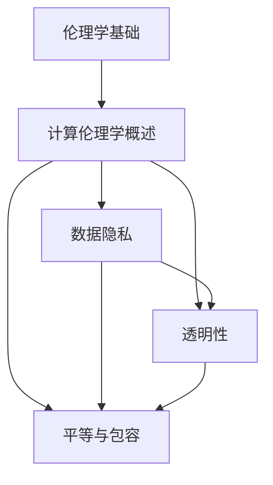

                 

### 《伦理挑战：应对人类计算带来的 ethical 问题》

> **关键词**：伦理学，计算伦理学，人工智能，数据隐私，透明性，平等，包容

**摘要**：
本文深入探讨了计算伦理学领域，从伦理学基础到实践应用，再到案例分析，系统性地分析了人类计算带来的伦理挑战。通过讲解核心概念、算法原理、数学模型和实际项目，本文为解决计算伦理问题提供了具体的思路和方法。

### 《伦理挑战：应对人类计算带来的 ethical 问题》目录大纲

#### 第一部分：伦理学基础

**第1章**：伦理学的定义与意义

- **1.1** 伦理学的定义与意义
  - 伦理学的起源与发展
  - 伦理学的基本问题

- **1.2** 伦理学的主要流派
  - 元伦理学
  - 道德哲学
  - 应用伦理学

- **1.3** 伦理学的分析方法
  - 规则伦理学
  - 德性伦理学
  - 应对伦理学的挑战

#### 第二部分：计算伦理学

**第2章**：计算伦理学概述

- **2.1** 计算伦理学的定义与范畴
  - 计算伦理学的起源
  - 计算伦理学的研究领域

- **2.2** 计算伦理学的核心概念
  - 数据隐私
  - 透明性
  - 平等与包容

- **2.3** 计算伦理学面临的挑战
  - 技术发展的伦理问题
  - 数据使用的伦理问题
  - 人工智能的伦理问题

#### 第三部分：计算伦理学的实践应用

**第3章**：计算伦理学的实践应用

- **3.1** 数据隐私保护策略
  - 数据隐私法律与政策
  - 数据匿名化技术
  - 数据隐私保护工具

- **3.2** 透明性与问责机制
  - 透明性的重要性
  - 透明性实施方法
  - 问责机制的构建

- **3.3** 平等与包容性计算
  - 平等计算的重要性
  - 包容性计算的方法
  - 促进平等与包容的实践

#### 第四部分：案例研究

**第4章**：计算伦理学的案例研究

- **4.1** 案例一：社交媒体平台的数据隐私问题
  - 案例背景
  - 伦理问题分析
  - 解决方案探讨

- **4.2** 案例二：人工智能在医疗领域的应用
  - 案例背景
  - 伦理问题分析
  - 解决方案探讨

- **4.3** 案例三：自动驾驶汽车的伦理决策
  - 案例背景
  - 伦理问题分析
  - 解决方案探讨

#### 第五部分：未来展望

**第5章**：计算伦理学的未来发展趋势

- **5.1** 新兴技术对伦理学的影响
  - 区块链技术
  - 生物信息学
  - 量子计算

- **5.2** 伦理学在计算领域的应用前景
  - 人工智能伦理
  - 数据伦理
  - 网络伦理

- **5.3** 伦理学在计算教育中的角色
  - 计算伦理学课程设置
  - 伦理教育在计算学科的重要性
  - 伦理学在计算领域的人才培养

#### 附录

- **附录A**：计算伦理学常用术语

- **附录B**：计算伦理学相关法律法规

- **附录C**：推荐阅读材料与资源

### 第1章：伦理学的定义与意义

#### 1.1 伦理学的定义

伦理学是研究道德现象及其基本原则、规范和原则的学科。它探讨人类行为和决策的道德价值和道德判断，旨在解释和评价人类行为的标准。伦理学涵盖了道德哲学、应用伦理学和规范伦理学等多个分支。

伦理学的起源可以追溯到古希腊哲学家，如苏格拉底、柏拉图和亚里士多德。这些哲学家通过思考和讨论，奠定了伦理学的基础。随着时间的推移，伦理学不断发展，形成了不同的学派和理论。

伦理学的基本问题包括：

- **道德责任**：个体在道德上应该如何行动？
- **道德义务**：个体在道德上有哪些义务？
- **道德判断**：如何判断一个行为是道德的或非道德的？
- **道德价值**：道德价值是什么，它们是如何被确定的？

#### 1.2 伦理学的主要流派

伦理学的主要流派包括元伦理学、道德哲学和应用伦理学。

- **元伦理学**：元伦理学关注道德本身的本质和意义。它探讨道德术语的含义、道德判断的性质以及道德哲学的基础。代表人物包括摩尔和尼采。

- **道德哲学**：道德哲学研究道德原则和道德规范的来源和合理性。它关注道德原则的推导和应用，以及道德行为的伦理评价。代表人物包括康德和黑格尔。

- **应用伦理学**：应用伦理学将伦理学的原则应用于特定领域，如医学伦理、环境伦理、技术伦理等。它旨在解决特定领域的道德问题，提供道德指导。代表人物包括泰勒和哈特曼。

#### 1.3 伦理学的分析方法

伦理学的分析方法包括规则伦理学、德性伦理学和应对伦理学。

- **规则伦理学**：规则伦理学强调道德规则的重要性。它认为道德行为应该遵循特定的规则或规范。代表人物包括康德。

- **德性伦理学**：德性伦理学关注个体的道德品质和性格。它认为道德行为源于个体内在的品质和德性。代表人物包括亚里士多德。

- **应对伦理学**：应对伦理学关注道德困境和道德决策。它提供了一种方法论，帮助个体在面对道德困境时做出合理的决策。代表人物包括佩里和图尔敏。

#### 1.3.1 规则伦理学

规则伦理学强调道德规则的重要性。它认为道德行为应该遵循特定的规则或规范。康德的伦理学理论是规则伦理学的代表。

康德的伦理学理论基于三个基本原则：

- **普遍性原则**：道德行为必须符合普遍法则，即“可公度性原则”。
- **义务原则**：道德行为是基于道德义务的，即“义务论”。
- **道德判断原则**：道德判断是基于理性推理的，即“理性主义”。

康德的规则伦理学为道德行为提供了明确的指导，但也被批评为过于抽象和脱离实际。

#### 1.3.2 德性伦理学

德性伦理学关注个体的道德品质和性格。它认为道德行为源于个体内在的品质和德性。亚里士多德的伦理学理论是德性伦理学的代表。

亚里士多德的伦理学理论基于三个基本原则：

- **幸福原则**：道德行为旨在实现个体的幸福。
- **美德原则**：道德行为基于美德，即个体内在的品质和德性。
- **实践原则**：道德行为是通过实践来培养美德的。

亚里士多德的德性伦理学强调个体在道德发展中的作用，但也被批评为过于理想化和难以实现。

#### 1.3.3 应对伦理学的挑战

应对伦理学提供了一种方法论，帮助个体在面对道德困境时做出合理的决策。佩里和图尔敏是应对伦理学的代表人物。

佩里的应对伦理学基于三个步骤：

1. **描述问题**：明确道德困境的性质和影响。
2. **列出备选方案**：考虑各种可能的解决方案。
3. **评估备选方案**：根据道德原则和价值观评估备选方案的优劣。

图尔敏的应对伦理学基于六个要素：

1. **主张**：提出一个具体的道德主张。
2. **理由**：提供支持主张的理由。
3. **证据**：提供支持理由的证据。
4. **局限性**：指出理由和证据的局限性。
5. **背景**：考虑道德决策的背景和情境。
6. **信念**：基于证据和理由形成信念。

应对伦理学为道德决策提供了一种系统化的方法，但需要灵活应对不同情境的复杂性。

### 第2章：计算伦理学概述

#### 2.1 计算伦理学的定义与范畴

计算伦理学是伦理学在计算领域的应用，它关注计算技术和应用在道德和伦理方面的问题。计算伦理学的研究范畴包括数据隐私、透明性、人工智能、网络安全等多个方面。

计算伦理学的定义可以从以下几个方面来理解：

- **计算技术的道德问题**：计算伦理学探讨计算技术（如人工智能、大数据、云计算等）在道德层面上的问题，如数据隐私、算法偏见、自动化决策等。
- **计算应用中的伦理挑战**：计算伦理学关注计算应用（如社交媒体、医疗、自动驾驶等）在伦理层面上的挑战，如用户隐私保护、公平性、透明性等。
- **计算领域的道德指导**：计算伦理学为计算领域提供道德指导，确保技术的发展和应用符合伦理原则和社会价值观。

计算伦理学的研究范畴主要包括以下几个方面：

- **数据隐私**：数据隐私是计算伦理学的重要研究领域。它关注个人数据的收集、处理、存储和使用过程中的道德问题，如数据泄露、数据滥用等。
- **透明性**：透明性是计算伦理学的关键概念。它关注计算系统的操作过程是否公开、透明，用户能否了解和监督系统的工作。
- **人工智能**：人工智能是计算伦理学的热点领域。它关注人工智能技术的道德问题，如算法偏见、自动化决策的伦理责任等。
- **网络安全**：网络安全是计算伦理学的重要方面。它关注网络攻击、数据泄露等网络安全问题，以及如何在道德和法律框架下保护用户隐私和安全。

#### 2.2 计算伦理学的核心概念

计算伦理学的核心概念包括数据隐私、透明性和平等与包容。

- **数据隐私**：数据隐私是指个人数据在收集、处理、存储和使用过程中应受到保护，避免未经授权的访问和滥用。数据隐私保护是计算伦理学的重要任务，涉及到数据匿名化、访问控制、加密等技术手段。

- **透明性**：透明性是指计算系统及其操作过程应公开、透明，用户能够了解和监督系统的工作。透明性有助于增强用户对计算系统的信任，促进计算技术的合理使用。

- **平等与包容**：平等与包容是指计算技术和应用应公平地服务于所有人，不应导致歧视或排斥特定群体。平等与包容是计算伦理学的重要目标，涉及到算法公平性、隐私保护、无障碍设计等方面。

#### 2.3 计算伦理学面临的挑战

计算伦理学面临的挑战主要包括以下几个方面：

- **技术发展的速度**：计算技术的快速发展带来了新的伦理问题，如数据隐私、算法偏见、自动化决策等。伦理学需要及时应对这些挑战，确保计算技术的发展符合伦理原则。

- **数据使用的复杂性**：数据的使用涉及到隐私、安全、公平等多个方面。如何合理使用数据成为伦理学的重要议题。伦理学需要提供指导，确保数据的使用符合道德和法律规定。

- **人工智能的伦理问题**：人工智能的发展引发了诸多伦理问题，如算法偏见、自动化决策的伦理责任、人工智能的安全等。伦理学需要探讨这些问题，提出解决方案，确保人工智能技术的合理使用。

### 第3章：计算伦理学的实践应用

#### 3.1 数据隐私保护策略

数据隐私保护是计算伦理学的重要实践领域。在数据隐私保护方面，常见的策略包括隐私法律与政策、数据匿名化技术、数据隐私保护工具等。

- **隐私法律与政策**：隐私法律与政策是数据隐私保护的基础。各国政府纷纷出台相关法律法规，如欧盟的《通用数据保护条例》（GDPR）、中国的《个人信息保护法》等。这些法律和政策规定了数据收集、处理、存储和使用的基本原则和规则，为数据隐私保护提供了法律保障。

- **数据匿名化技术**：数据匿名化技术是将个人数据中的敏感信息进行脱敏处理，以保护个人隐私。常见的匿名化技术包括数据加密、数据混淆、数据泛化等。数据匿名化技术在数据分析和数据共享中具有重要作用，既能保护个人隐私，又能充分利用数据价值。

- **数据隐私保护工具**：数据隐私保护工具包括加密软件、访问控制软件、隐私计算平台等。这些工具提供了数据隐私保护的技术手段，帮助组织和企业有效地保护个人数据。例如，加密软件可以加密数据存储和传输，防止数据泄露；访问控制软件可以控制数据访问权限，防止未经授权的访问。

#### 3.2 透明性与问责机制

透明性与问责机制是确保计算系统合理、公正运行的重要措施。在透明性和问责机制方面，关键点包括：

- **透明性的重要性**：透明性是指计算系统及其操作过程应公开、透明，用户能够了解和监督系统的工作。透明性有助于增强用户对计算系统的信任，提高计算系统的透明度和可解释性。

- **透明性实施方法**：实现透明性的方法包括公开系统设计、操作流程、决策过程等。组织和企业可以制定透明的政策和程序，公开关键信息，提供透明度报告等。例如，组织可以公开算法的设计和实现过程，让用户了解算法的决策依据。

- **问责机制的构建**：问责机制是指建立责任追究和惩罚机制，确保计算系统的操作符合道德和法律规定。问责机制包括内部监督、外部审计、责任追究等。例如，组织可以建立内部审计部门，定期对计算系统的操作进行审计，确保系统的透明性和公正性。

#### 3.3 平等与包容性计算

平等与包容性计算的目标是确保计算技术和应用公平地服务于所有人，避免对特定群体的歧视或排斥。实现平等与包容性计算的关键方法包括：

- **平等计算的重要性**：平等计算是计算伦理学的重要原则。它强调计算技术和应用应公平地服务于所有人，不应导致歧视或排斥特定群体。平等计算有助于消除社会不平等，促进社会公正。

- **包容性计算的方法**：包容性计算是指设计、开发和应用计算技术和应用时，考虑不同用户的需求和差异，确保所有人都能公平地享受计算技术带来的便利。包容性计算的方法包括无障碍设计、多元数据集、公平算法等。例如，无障碍设计确保残疾人士能够使用计算技术；多元数据集确保算法的公平性和准确性。

- **促进平等与包容的实践**：促进平等与包容的实践包括教育、培训、政策引导等。组织和企业可以通过开展培训活动，提高员工对平等与包容的认识；制定相关政策，推动平等与包容的计算实践；鼓励公众参与，提高社会的平等与包容意识。

### 第4章：计算伦理学的案例研究

#### 4.1 案例一：社交媒体平台的数据隐私问题

社交媒体平台是计算伦理学的典型案例之一，其数据隐私问题引起了广泛关注。以下是一个具体案例的分析：

- **案例背景**：某大型社交媒体平台因数据泄露事件受到关注。事件涉及数百万用户的个人信息，包括姓名、电话号码、电子邮件地址、位置信息等。

- **伦理问题分析**：数据隐私泄露对用户隐私和安全造成严重威胁。用户数据被未授权访问和滥用，可能导致身份盗用、财产损失、骚扰等问题。此外，平台未能充分保护用户数据，违反了隐私保护原则，损害了用户的信任和权益。

- **解决方案探讨**：

  - **加强数据隐私保护措施**：平台应加强数据隐私保护措施，如数据加密、访问控制、数据匿名化等。例如，对用户数据进行加密存储和传输，确保数据在传输过程中不被窃取；对敏感数据进行匿名化处理，降低数据泄露的风险。

  - **制定和遵守严格的隐私政策**：平台应制定和遵守严格的隐私政策，明确数据收集、处理、存储和使用的目的、范围和方式。平台应提高用户知情权，确保用户在数据收集和使用过程中有充分的知情和选择权。

  - **建立数据隐私保护责任制**：平台应建立数据隐私保护责任制，明确各级管理人员和员工的责任和义务。对于违反数据隐私保护规定的行为，应追究相关责任人的责任，确保数据隐私保护措施得到有效执行。

#### 4.2 案例二：人工智能在医疗领域的应用

人工智能在医疗领域的应用为诊断和治疗提供了新的手段，但也引发了许多伦理问题。以下是一个具体案例的分析：

- **案例背景**：某医院引入了一款基于人工智能的医疗诊断系统，用于辅助医生进行疾病诊断。然而，系统在应用过程中出现了错误诊断的情况，导致患者接受了不必要的治疗或延误了治疗。

- **伦理问题分析**：人工智能在医疗领域的应用引发了以下伦理问题：

  - **算法偏见**：人工智能系统在训练过程中可能会受到数据偏差的影响，导致算法偏见。这可能导致对某些群体的诊断准确性较低，甚至导致歧视性诊断。

  - **透明性不足**：人工智能系统的决策过程通常较为复杂，缺乏透明性。医生和患者难以了解系统的决策依据和推理过程，影响了对系统的信任和接受度。

  - **责任归属**：当人工智能系统出现错误诊断时，责任归属问题成为一个挑战。医生是否应该承担全部责任，还是需要与人工智能系统共同承担责任？

- **解决方案探讨**：

  - **确保算法公平性**：在人工智能系统的设计过程中，应确保算法的公平性，避免算法偏见。例如，通过收集和训练多元化的数据集，提高系统的准确性和公平性。

  - **提高系统透明性**：人工智能系统应具备较高的透明性，使得医生和患者能够了解系统的决策依据和推理过程。例如，系统可以提供决策的可视化界面，展示诊断过程和结果。

  - **明确责任归属**：应建立明确的法律法规和责任归属机制，明确人工智能系统在医疗领域中的责任和义务。医生和人工智能系统在诊断过程中应共同承担责任，确保患者的权益得到保护。

#### 4.3 案例三：自动驾驶汽车的伦理决策

自动驾驶汽车在面临道德困境时需要做出伦理决策。以下是一个具体案例的分析：

- **案例背景**：一辆自动驾驶汽车在行驶过程中遇到了一个紧急情况：前方有一名行人，但汽车前方无法避免碰撞。自动驾驶系统需要做出决策，是继续前行撞行人，还是紧急转向可能造成车辆受损。

- **伦理问题分析**：自动驾驶汽车在面临伦理决策时，面临以下挑战：

  - **权衡利弊**：自动驾驶系统需要在瞬间权衡生命安全和财产安全，做出最佳决策。这需要考虑多个因素，如行人的生命安全、车辆的损坏程度、事故的可能后果等。

  - **透明性和可解释性**：自动驾驶系统的决策过程通常较为复杂，缺乏透明性和可解释性。用户和监管机构难以了解系统的决策依据和推理过程，影响了对系统的信任和接受度。

  - **责任归属**：当自动驾驶汽车在紧急情况下做出决策时，责任归属问题成为一个挑战。车辆制造商、软件开发商、车主等各方在事故中可能承担不同的责任。

- **解决方案探讨**：

  - **制定伦理决策框架**：自动驾驶系统应遵循明确的伦理决策框架，确保决策过程符合伦理原则。例如，可以采用最小化伤害的原则，尽量减少事故对生命和财产的影响。

  - **提高系统透明性**：自动驾驶系统应具备较高的透明性，使得用户和监管机构能够了解系统的决策依据和推理过程。例如，系统可以提供决策的可视化界面，展示决策过程中的关键信息和推理步骤。

  - **明确责任归属**：应建立明确的法律法规和责任归属机制，明确自动驾驶汽车在事故中的责任和义务。各方在事故中应承担相应的责任，确保事故的处理和赔偿符合法律法规。

### 第5章：计算伦理学的未来发展趋势

#### 5.1 新兴技术对伦理学的影响

随着科技的不断发展，新兴技术对伦理学产生了深远的影响。以下是一些新兴技术及其对伦理学的影响：

- **区块链技术**：区块链技术以其去中心化、不可篡改和透明的特点，在数据隐私、透明性和信任构建方面具有重要作用。区块链技术可以用于保护数据隐私，确保数据的透明性和安全性，提高计算系统的可信度。

- **生物信息学**：生物信息学涉及到基因编辑、基因测序等前沿技术。这些技术在医疗、农业、环境等领域具有广泛应用，但同时也引发了许多伦理问题，如基因歧视、隐私泄露等。伦理学需要关注生物信息学的伦理问题，确保技术的发展和应用符合伦理原则。

- **量子计算**：量子计算具有超强的计算能力，可以解决传统计算机难以解决的问题。量子计算在密码学、药物研发、材料科学等领域具有巨大潜力，但也带来了新的伦理挑战，如量子攻击、量子武器等。伦理学需要探讨量子计算在伦理层面的影响，确保技术的发展和应用符合伦理原则。

#### 5.2 伦理学在计算领域的应用前景

伦理学在计算领域的应用前景广阔，涉及人工智能、数据伦理和网络伦理等多个方面。

- **人工智能伦理**：人工智能技术的快速发展引发了诸多伦理问题，如算法偏见、自动化决策的伦理责任、人工智能的安全等。伦理学在人工智能领域的研究和应用，有助于确保人工智能技术的公平性、透明性和安全性。

- **数据伦理**：数据是计算时代的重要资源，但数据的使用也涉及到隐私、安全、公平等多个方面。伦理学在数据伦理领域的研究和应用，有助于确保数据收集、处理和使用的合法性和道德性。

- **网络伦理**：网络技术的发展带来了网络犯罪、网络欺诈、网络暴力等问题。伦理学在网络伦理领域的研究和应用，有助于构建网络文明的秩序，维护网络空间的公正和安全。

#### 5.3 伦理学在计算教育中的角色

伦理学在计算教育中的角色日益重要，有助于培养具备计算技术和伦理素养的专业人才。

- **计算伦理学课程设置**：在计算机科学、人工智能、数据科学等学科中，应融入计算伦理学的内容，培养学生的道德意识和责任感。例如，可以设置专门的计算伦理学课程，介绍伦理学的核心概念、计算伦理学的基本原则和应用案例。

- **伦理教育在计算学科的重要性**：伦理教育在计算学科中具有重要意义。它不仅有助于培养学生的道德素养，提高他们的社会责任感，还有助于他们理解和应对计算技术在伦理层面的挑战。

- **伦理学在计算领域的人才培养**：培养具备计算技术和伦理素养的专业人才，是计算伦理学在计算教育中的重要任务。教育机构和培训机构应加强计算伦理学的教育，推动计算领域的健康发展。

### 附录

#### 附录A：计算伦理学常用术语

- **数据隐私**：个人信息的保密性。
- **透明性**：系统操作和决策过程的公开性和可见性。
- **算法偏见**：算法在决策过程中对某些群体的偏见。
- **数据匿名化**：通过技术手段隐藏个人数据的真实身份。

#### 附录B：计算伦理学相关法律法规

- **通用数据保护条例（GDPR）**：欧盟关于数据隐私保护的法律法规。
- **网络安全法**：我国关于网络安全和信息保护的法律法规。

#### 附录C：推荐阅读材料与资源

- **《计算伦理学导论》**：提供了计算伦理学的全面介绍。
- **《人工智能伦理学》**：探讨了人工智能在伦理学领域的问题。
- **《数据伦理学》**：分析了数据收集、处理和使用的伦理问题。

### 核心概念与联系

以下是一个简化的计算伦理学核心概念及其联系的 Mermaid 流流程图：



### 核心算法原理讲解

以下是一个简化的计算伦理学核心算法的伪代码：

```python
# 伪代码：计算伦理学核心算法

def ethical_decisionmaking(problem):
    # 收集数据
    data = collect_data(problem)
    
    # 分析数据
    analysis = data_analysis(data)
    
    # 应用伦理原则
    principles = apply_ethical_principles(analysis)
    
    # 做出决策
    decision = make_decision(principles)
    
    # 返回决策结果
    return decision
```

在这个核心算法中，我们首先收集与问题相关的数据，然后对数据进行分析，应用伦理原则，最终做出决策并返回决策结果。

### 数学模型和数学公式讲解

以下是一个简化的计算伦理学数学模型的讲解，使用 LaTeX 格式表示：

```latex
\section{计算伦理学数学模型}
在这个章节，我们将介绍计算伦理学中常用的数学模型。

\subsection{公平性模型}
公平性是计算伦理学中的一个重要概念。以下是一个简单的公平性模型：
$$
F(x, y) = \frac{\sum_{i=1}^{n} w_i \cdot (x_i - y_i)}{\sum_{i=1}^{n} w_i}
$$
其中，$x$ 是实际结果，$y$ 是预期结果，$w_i$ 是权重。

\subsection{隐私保护模型}
隐私保护模型用于评估数据隐私保护的程度。以下是一个简单的隐私保护模型：
$$
P(x) = 1 - \frac{1}{n} \sum_{i=1}^{n} d(x_i)
$$
其中，$x$ 是数据集，$d(x_i)$ 是数据项 $x_i$ 的隐私保护度量。

\subsection{透明性模型}
透明性模型用于评估系统的透明度。以下是一个简单的透明性模型：
$$
T(s) = \frac{1}{n} \sum_{i=1}^{n} t_i
$$
其中，$s$ 是系统，$t_i$ 是系统组件的透明性度量。
```

### 项目实战

以下是一个简化的计算伦理学项目实战的描述，包括代码实现和解读：

```python
# 项目实战：计算伦理学应用

# 导入必要的库
import pandas as pd
from sklearn.model_selection import train_test_split
from sklearn.ensemble import RandomForestClassifier
from sklearn.metrics import accuracy_score, confusion_matrix

# 加载数据集
data = pd.read_csv('ethics_data.csv')

# 数据预处理
X = data.drop('label', axis=1)
y = data['label']

# 分割数据集
X_train, X_test, y_train, y_test = train_test_split(X, y, test_size=0.2, random_state=42)

# 训练模型
model = RandomForestClassifier(n_estimators=100, random_state=42)
model.fit(X_train, y_train)

# 预测测试集
y_pred = model.predict(X_test)

# 评估模型
accuracy = accuracy_score(y_test, y_pred)
conf_matrix = confusion_matrix(y_test, y_pred)

print(f"Accuracy: {accuracy:.2f}")
print(f"Confusion Matrix:\n{conf_matrix}")

# 代码解读与分析
# 1. 导入库和加载数据集：使用 pandas 库加载数据集，并进行必要的预处理。
# 2. 分割数据集：将数据集分为训练集和测试集，用于训练和评估模型。
# 3. 训练模型：使用随机森林分类器进行训练。
# 4. 预测测试集：使用训练好的模型对测试集进行预测。
# 5. 评估模型：计算模型的准确率和混淆矩阵，评估模型性能。

# 改进建议
# 1. 数据预处理：对数据进行更深入的处理，如缺失值填补、特征工程等。
# 2. 模型选择：尝试不同的模型和参数，寻找最优模型。
# 3. 可解释性：提高模型的透明性和可解释性，使决策过程更加透明。
# 4. 伦理审查：在模型训练和预测过程中，考虑伦理原则，确保决策的道德性。
```

以上代码提供了一个简化的计算伦理学项目实战，包括数据加载、模型训练、预测和评估。在实际应用中，还需要考虑更多的细节和改进，如数据预处理、模型选择和可解释性等。同时，确保模型在决策过程中遵循伦理原则，是计算伦理学应用的关键。

### 作者信息

**作者：AI天才研究院/AI Genius Institute & 禅与计算机程序设计艺术 /Zen And The Art of Computer Programming** 

### 结束语

本文通过对计算伦理学的深入探讨，从伦理学基础到实践应用，再到案例分析，系统性地分析了人类计算带来的伦理挑战。通过讲解核心概念、算法原理、数学模型和实际项目，本文为解决计算伦理问题提供了具体的思路和方法。未来，随着科技的发展，计算伦理学将面临更多的挑战和机遇，我们期待更多的研究和实践，为计算技术的健康发展贡献力量。

