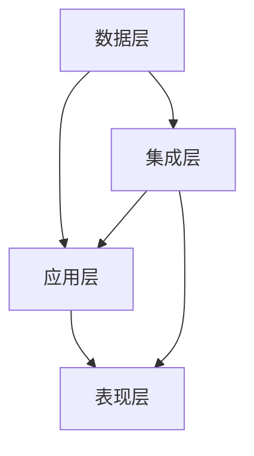
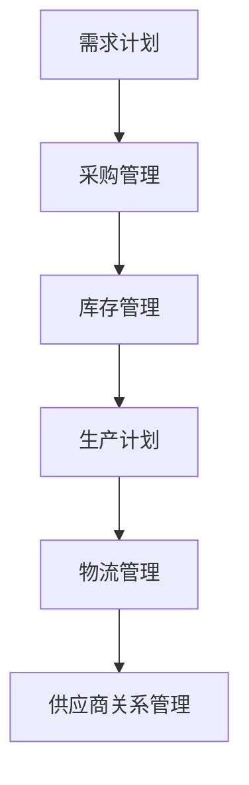
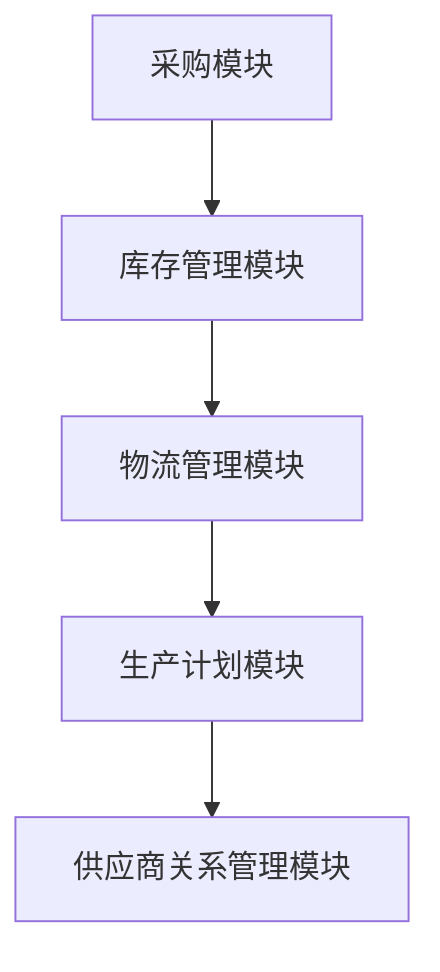
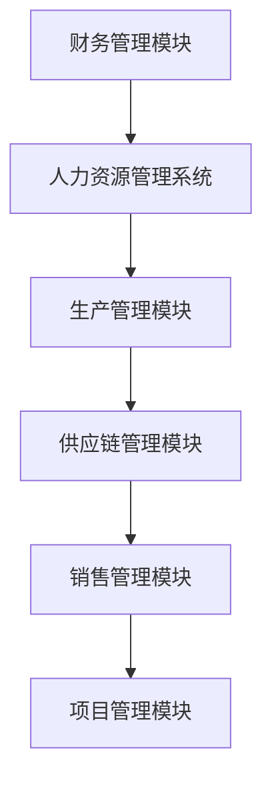
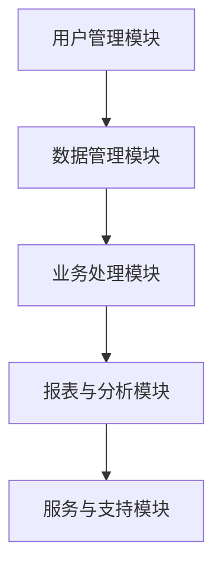
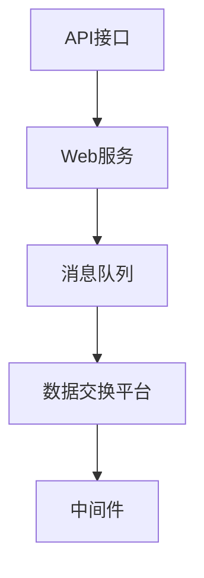

                 

### 引言

随着数字化转型的浪潮席卷全球，供应链系统、ERP系统以及To B平台产品在企业运营中扮演着越来越重要的角色。这些系统不仅提升了企业的运营效率，还为企业提供了更精准的数据支持和更灵活的资源配置。本文旨在深入探讨这三类系统的核心概念、架构设计及其在实际应用中的优化策略，以帮助读者更好地理解和应用这些技术。

#### 1.1 书籍背景与目标

本篇文章是针对IT领域专业人士以及相关领域的学生而撰写的。在信息化快速发展的背景下，供应链系统、ERP系统和To B平台产品已经成为现代企业不可或缺的工具。本文的目标是：

- 系统性地介绍供应链系统、ERP系统、To B平台产品的核心概念和架构设计；
- 详细讲解这些系统的性能优化和集成方法；
- 通过案例分析，提供实际应用中的经验和教训；
- 展望未来发展趋势，为读者指明发展方向。

#### 1.2 供应链系统概述

供应链系统是指企业为实现供应链管理目标而建立的一系列信息技术系统。它涵盖了从原材料采购、生产制造到产品交付的整个流程。供应链系统的核心目标是优化资源分配、降低成本、提高效率，并通过实时数据分析和预测来指导决策。

供应链管理系统（SCM）包括以下主要模块：

- 采购模块：管理原材料的采购订单、供应商评估和采购策略；
- 库存管理模块：监控库存水平、库存周期和库存成本；
- 物流管理模块：跟踪货物的运输过程、仓库管理和配送计划；
- 生产计划模块：制定生产计划、优化生产流程和资源分配；
- 供应商关系管理模块：维护与供应商的长期合作关系，提高供应链的稳定性。

#### 1.3 ERP系统概述

企业资源计划（ERP）系统是一种集成了企业所有业务流程的管理信息系统。ERP系统通过整合财务、人力资源、生产、供应链等多个模块，实现了企业资源的全面管理和优化。ERP系统的核心目标是提升企业的运营效率、降低成本、提高决策的准确性和及时性。

ERP系统的关键模块包括：

- 财务管理模块：管理企业的财务活动，包括会计、财务报表和资金管理；
- 人力资源管理模块：管理员工的招聘、培训、薪酬和绩效评估；
- 生产管理模块：规划生产流程、监控生产进度和库存水平；
- 供应链管理模块：整合采购、库存和物流等环节，实现供应链的优化；
- 营销管理模块：支持营销策略的制定、客户关系管理和市场活动；
- 项目管理模块：管理企业的项目进度、资源和成本。

#### 1.4 To B平台产品概述

To B（面向商业客户）平台产品是企业提供专业服务和技术解决方案的主要载体。To B平台产品通常具有高度定制化和行业特性的特点，旨在满足不同类型企业的特定需求。To B平台产品不仅包括软件系统，还涵盖了相关的服务和支持。

To B平台产品的主要特点包括：

- 定制化：根据客户的具体需求进行定制，满足个性化的业务需求；
- 集成性：能够与企业现有的IT系统无缝集成，实现业务流程的自动化和优化；
- 可扩展性：支持业务的快速扩展和功能模块的灵活增加；
- 高可用性：保证系统的稳定性和数据的安全性，提供可靠的服务保障；
- 行业特性：针对特定行业的需求，提供专业的解决方案和技术支持。

通过本章节的介绍，我们对供应链系统、ERP系统和To B平台产品有了初步的了解。接下来的章节将深入探讨这些系统的核心概念、架构设计以及在实际应用中的优化策略。希望本文能够为读者提供有价值的参考和指导。

### 供应链系统核心概念与架构设计

供应链系统是企业运营中至关重要的一环，它通过整合原材料采购、生产制造、库存管理、物流配送等环节，实现了对供应链的全面管理和优化。为了深入理解供应链系统的核心概念与架构设计，我们需要从供应链管理系统的定义、架构以及核心模块等方面进行详细分析。

#### 2.1 供应链管理系统

供应链管理系统（SCM）是指企业为实现供应链管理目标而建立的一系列信息技术系统。其核心目标是优化资源分配、降低成本、提高效率，并通过实时数据分析和预测来指导决策。供应链管理系统涵盖了从原材料采购、生产制造到产品交付的整个流程，旨在提高整个供应链的透明度和协同效率。

供应链管理系统的关键组成部分包括：

- **需求计划**：根据市场需求和库存水平，制定生产和采购计划，确保库存的合理性和及时性；
- **采购管理**：管理原材料的采购订单、供应商评估和采购策略，优化采购成本和供应链稳定性；
- **库存管理**：监控库存水平、库存周期和库存成本，确保库存的优化和降低库存积压；
- **生产计划**：制定生产计划、优化生产流程和资源分配，确保生产效率和生产质量的平衡；
- **物流管理**：跟踪货物的运输过程、仓库管理和配送计划，确保物流过程的顺畅和及时；
- **供应商关系管理**：维护与供应商的长期合作关系，提高供应链的稳定性。

#### 2.2 供应链管理系统架构

供应链管理系统的架构设计是系统实现的核心，决定了系统的性能、可扩展性和维护性。一个典型的供应链管理系统架构通常包括以下几个层次：

1. **数据层**：包括各种数据存储和管理系统，如数据库、数据仓库和数据湖。这些系统负责存储和处理大量的供应链数据，包括采购订单、库存记录、物流信息等。
2. **应用层**：包括各种业务应用系统，如采购管理、库存管理、物流管理等。这些系统实现了供应链管理的核心功能，通过模块化的设计，可以方便地集成和扩展。
3. **表现层**：包括用户界面和报表系统，用于展示供应链系统的数据和分析结果，提供决策支持和用户交互。
4. **集成层**：负责不同系统之间的数据交互和流程集成，确保各个模块能够协同工作。常用的集成技术包括Web服务、消息队列和API接口等。
5. **基础设施层**：包括服务器、网络和存储等基础设施，为供应链管理系统提供硬件支持和服务保障。

下面是一个简单的供应链管理系统架构的Mermaid流程图：



#### 2.3 供应链管理流程

供应链管理流程是指供应链系统中各项业务活动的具体操作步骤和逻辑关系。一个典型的供应链管理流程包括以下几个主要环节：

1. **需求计划**：根据市场需求和历史销售数据，预测未来的销售趋势，制定采购和生产计划。这个环节需要考虑库存水平、供应链的响应时间以及供应商的交货能力。
   
2. **采购管理**：根据采购计划，向供应商发出采购订单，并进行供应商评估和采购策略制定。这个环节的关键是优化采购成本和供应链稳定性。

3. **库存管理**：监控库存水平，根据库存水平和销售预测，调整采购和生产计划，确保库存的合理性和及时性。这个环节需要关注库存周期和库存成本。

4. **生产计划**：根据采购和生产计划，制定详细的生产计划，包括生产进度、资源分配和产能规划。这个环节需要优化生产流程，确保生产效率和生产质量的平衡。

5. **物流管理**：跟踪货物的运输过程，包括发货、运输、入库和配送。这个环节需要确保物流过程的顺畅和及时，提高客户满意度。

6. **供应商关系管理**：维护与供应商的长期合作关系，包括供应商评估、合作沟通和绩效评估。这个环节的目标是提高供应链的稳定性，降低供应链风险。

下面是一个简单的供应链管理流程的Mermaid流程图：



#### 2.4 供应链系统核心模块

供应链系统由多个核心模块组成，每个模块都承担着特定的功能。以下是供应链系统中的几个关键模块：

1. **采购模块**：管理原材料的采购订单、供应商评估和采购策略。采购模块需要与供应商进行高效的沟通和协调，确保采购过程的顺利进行。

2. **库存管理模块**：监控库存水平、库存周期和库存成本。库存管理模块需要根据销售预测和库存策略，合理安排采购和生产计划，避免库存积压和短缺。

3. **物流管理模块**：跟踪货物的运输过程、仓库管理和配送计划。物流管理模块需要优化物流流程，确保物流的及时性和准确性，提高客户满意度。

4. **生产计划模块**：制定生产计划、优化生产流程和资源分配。生产计划模块需要综合考虑市场需求、库存水平和生产资源，制定最优的生产计划。

5. **供应商关系管理模块**：维护与供应商的长期合作关系，包括供应商评估、合作沟通和绩效评估。供应商关系管理模块需要确保供应链的稳定性和可靠性。

下面是一个简单的供应链系统核心模块的Mermaid流程图：



#### 2.5 供应链系统性能优化

供应链系统的性能优化是提高供应链效率和降低成本的关键。以下是几个常用的优化策略：

1. **供应链效率分析**：通过数据分析，评估供应链各个环节的效率，找出瓶颈和优化点。常用的分析指标包括库存周转率、采购周期、生产周期和物流周期等。

2. **供应链成本控制**：通过优化采购策略、库存管理和物流流程，降低供应链的总成本。例如，采用集中采购、优化运输路线和仓储布局等策略。

3. **供应链风险防控**：建立风险防控机制，识别和应对供应链风险。例如，建立紧急采购预案、备用供应商和库存预警机制等。

4. **供应链可视化**：通过供应链可视化工具，实时监控供应链的运行状态，提高供应链的透明度和决策效率。

5. **供应链智能化**：利用人工智能和大数据技术，实现供应链的智能化管理。例如，采用预测分析、优化算法和机器学习模型等，提高供应链的预测准确性和决策效率。

总之，供应链系统核心概念与架构设计的深入理解对于提高供应链效率和降低成本至关重要。通过优化供应链管理流程、核心模块和性能指标，企业可以更好地应对市场变化和竞争挑战，实现可持续发展。

### ERP系统设计

企业资源计划（ERP）系统是企业内部管理信息系统的集成平台，通过对企业内部各个业务环节的信息进行整合和管理，实现了对企业资源的高效利用和优化配置。ERP系统不仅涵盖了财务、人力资源、生产、供应链等关键模块，还通过这些模块的相互协同，实现了企业资源的全面管理和优化。本节将详细探讨ERP系统的定义、特点、分类及其架构设计。

#### 3.1 ERP系统概述

ERP系统起源于20世纪90年代的美国，旨在通过集成企业内部的各种业务模块，实现企业资源的全面管理和优化。ERP系统不仅能够支持企业的日常运营，还能为企业提供决策支持，提高运营效率和竞争力。

**ERP系统的定义**：

ERP系统是指企业为实现其业务目标而建立的集成化管理信息系统。它通过整合企业的财务、人力资源、生产、供应链等多个模块，实现对企业资源的全面管理和优化。

**ERP系统的特点**：

- **集成性**：ERP系统能够将企业内部的各种业务模块集成在一起，实现数据的共享和信息的协同。
- **模块化**：ERP系统采用模块化设计，各个模块相对独立，便于扩展和维护。
- **实时性**：ERP系统能够实时收集、处理和反馈企业的业务数据，为企业提供及时的决策支持。
- **灵活性**：ERP系统具有高度的灵活性，可以根据企业的需求进行定制和扩展。

**ERP系统的分类**：

ERP系统根据不同的应用场景和企业需求，可以分为以下几种类型：

- **通用型ERP系统**：适用于各种类型的企业，提供标准化的业务模块和功能，如财务、生产、人力资源、供应链等。
- **行业型ERP系统**：针对特定行业的特性，提供行业化的解决方案和功能，如制造业ERP系统、零售业ERP系统、物流ERP系统等。
- **定制化ERP系统**：根据企业的具体需求进行定制开发，实现企业的个性化需求。

#### 3.2 ERP系统架构设计

ERP系统的架构设计决定了系统的性能、可扩展性和维护性。一个典型的ERP系统架构包括以下几个层次：

1. **数据层**：数据层是ERP系统的核心，包括各种数据存储和管理系统，如数据库、数据仓库和数据湖。这些系统负责存储和处理大量的企业数据，包括财务数据、人力资源数据、生产数据等。

2. **应用层**：应用层包括各种业务应用系统，如财务管理系统、人力资源管理系统、生产管理系统、供应链管理系统等。这些系统实现了ERP系统的核心功能，通过模块化的设计，可以方便地集成和扩展。

3. **表现层**：表现层包括用户界面和报表系统，用于展示ERP系统的数据和分析结果，提供决策支持和用户交互。用户可以通过表现层进行数据查询、报表生成和操作管理。

4. **集成层**：集成层负责不同系统之间的数据交互和流程集成，确保各个模块能够协同工作。常用的集成技术包括Web服务、消息队列和API接口等。

5. **基础设施层**：基础设施层包括服务器、网络和存储等基础设施，为ERP系统提供硬件支持和服务保障。

下面是一个简单的ERP系统架构的Mermaid流程图：


#### 3.3 ERP系统核心模块

ERP系统由多个核心模块组成，每个模块都承担着特定的功能。以下是ERP系统中的几个关键模块：

1. **财务管理模块**：财务管理模块负责管理企业的财务活动，包括会计、财务报表和资金管理。通过财务管理模块，企业可以实时掌握财务状况，制定财务策略。

2. **人力资源管理系统**：人力资源管理系统负责管理员工的招聘、培训、薪酬和绩效评估。通过人力资源管理系统，企业可以优化人力资源配置，提高员工工作效率。

3. **生产管理模块**：生产管理模块负责制定生产计划、监控生产进度和库存水平。通过生产管理模块，企业可以优化生产流程，提高生产效率。

4. **供应链管理模块**：供应链管理模块负责管理原材料的采购、库存和物流配送。通过供应链管理模块，企业可以优化供应链流程，降低运营成本。

5. **销售管理模块**：销售管理模块负责管理销售订单、客户关系和市场活动。通过销售管理模块，企业可以优化销售策略，提高销售业绩。

6. **项目管理模块**：项目管理模块负责管理企业的项目进度、资源和成本。通过项目管理模块，企业可以确保项目按时完成，提高项目成功率。

下面是一个简单的ERP系统核心模块的Mermaid流程图：



#### 3.4 ERP系统实施与优化

ERP系统的实施和优化是确保系统有效运行的关键。以下是ERP系统实施和优化的一些策略：

1. **系统规划**：在实施ERP系统之前，需要进行详细的系统规划，明确系统的目标、范围和功能需求。系统规划应包括需求分析、系统选型、架构设计等。

2. **培训与支持**：ERP系统的成功实施离不开员工的培训和支持。企业应制定详细的培训计划，确保员工能够熟练使用系统，并解决系统使用过程中遇到的问题。

3. **数据迁移**：在实施ERP系统时，需要进行数据迁移，将现有系统的数据转移到新系统中。数据迁移应确保数据的完整性和准确性，避免数据丢失和错误。

4. **系统测试**：在系统上线之前，需要进行全面的系统测试，包括功能测试、性能测试和安全测试。系统测试应确保系统的稳定性和可靠性，避免系统上线后出现问题。

5. **持续优化**：ERP系统上线后，需要持续进行优化和改进。企业应根据业务需求和市场变化，及时调整系统功能，提高系统的适应性和灵活性。

6. **系统监控与维护**：ERP系统运行过程中，需要进行实时监控和定期维护。系统监控和维护应确保系统的正常运行，及时发现和解决系统故障。

通过以上策略，企业可以确保ERP系统的有效实施和持续优化，提高企业运营效率和竞争力。

### To B平台产品架构设计

To B（面向商业客户）平台产品是企业提供专业服务和技术解决方案的主要载体。这些平台产品不仅涵盖了软件系统，还涉及相关的服务和支持，旨在满足不同类型企业的特定需求。本节将详细探讨To B平台产品的概述、架构设计以及核心模块。

#### 4.1 To B平台产品概述

To B平台产品通常具有高度定制化和行业特性的特点，旨在为商业客户提供专业的解决方案和技术支持。以下是从定义、特点和市场分析三个方面对To B平台产品的概述：

**To B平台产品的定义**：

To B平台产品是指企业为了满足商业客户需求，提供的面向特定行业或业务场景的软件产品和服务。这些产品通常具有高度定制化、集成化和扩展性的特点，旨在帮助企业优化业务流程、提高运营效率、降低成本。

**To B平台产品的特点**：

- **定制化**：To B平台产品可以根据客户的具体需求进行定制，实现个性化功能和服务。
- **集成性**：To B平台产品通常能够与企业现有的IT系统无缝集成，实现业务流程的自动化和优化。
- **可扩展性**：To B平台产品支持业务的快速扩展和功能模块的灵活增加，以适应企业发展的需求。
- **高可用性**：To B平台产品提供高可用性和安全性的保障，确保系统的稳定运行和数据安全。
- **行业特性**：To B平台产品针对特定行业的需求，提供专业的解决方案和技术支持。

**To B平台产品的市场分析**：

To B平台产品的市场分析包括市场现状、市场规模、竞争格局和未来发展趋势。以下是对这些方面的分析：

- **市场现状**：随着企业数字化转型和智能化升级的需求不断增长，To B平台产品的市场需求持续扩大。特别是在智能制造、金融科技、物流供应链等高成长行业，To B平台产品的应用前景广阔。
- **市场规模**：根据相关市场研究报告，全球To B平台产品市场规模持续增长，预计未来几年将保持较高的增长率。特别是在新兴市场，To B平台产品的渗透率逐渐提高。
- **竞争格局**：To B平台产品市场竞争激烈，国内外众多企业纷纷布局。市场主要参与者包括传统的IT巨头、新兴的互联网企业以及专注于特定行业的解决方案提供商。竞争格局呈现出多元化、专业化的发展趋势。
- **未来发展趋势**：To B平台产品的未来发展趋势包括：智能化、云原生、服务化等。随着人工智能、大数据、物联网等新兴技术的快速发展，To B平台产品将更加智能化和自动化，为企业提供更加个性化和高效的解决方案。

#### 4.2 To B平台产品架构设计

To B平台产品的架构设计是确保系统性能、可扩展性和维护性的关键。一个典型的To B平台产品架构包括以下几个层次：

1. **数据层**：数据层是平台产品的核心，包括各种数据存储和管理系统，如数据库、数据仓库和数据湖。这些系统负责存储和处理大量的企业数据，包括用户数据、业务数据、交易数据等。

2. **应用层**：应用层包括各种业务应用系统，如用户管理、数据管理、业务处理等。这些系统实现了To B平台产品的核心功能，通过模块化的设计，可以方便地集成和扩展。

3. **表现层**：表现层包括用户界面和报表系统，用于展示平台产品的数据和分析结果，提供决策支持和用户交互。用户可以通过表现层进行数据查询、报表生成和操作管理。

4. **集成层**：集成层负责不同系统之间的数据交互和流程集成，确保各个模块能够协同工作。常用的集成技术包括Web服务、消息队列和API接口等。

5. **基础设施层**：基础设施层包括服务器、网络和存储等基础设施，为To B平台产品提供硬件支持和服务保障。

下面是一个简单的To B平台产品架构的Mermaid流程图：


#### 4.3 To B平台产品核心模块

To B平台产品由多个核心模块组成，每个模块都承担着特定的功能。以下是To B平台产品中的几个关键模块：

1. **用户管理模块**：用户管理模块负责用户注册、登录、权限管理和用户数据管理。通过用户管理模块，企业可以实现用户的精细化管理，提高用户满意度和用户体验。

2. **数据管理模块**：数据管理模块负责数据的收集、存储、处理和分析。通过数据管理模块，企业可以实现对业务数据的全面掌控，提供精准的数据支持和决策依据。

3. **业务处理模块**：业务处理模块负责实现具体的业务流程和业务规则，如订单处理、支付结算、物流跟踪等。通过业务处理模块，企业可以实现业务的自动化和智能化，提高业务效率和准确性。

4. **报表与分析模块**：报表与分析模块负责生成各种业务报表和分析图表，提供实时数据分析和决策支持。通过报表与分析模块，企业可以实时掌握业务状况，优化业务策略。

5. **服务与支持模块**：服务与支持模块负责提供客户服务和技术支持，包括在线咨询、远程支持、现场服务等。通过服务与支持模块，企业可以确保客户在遇到问题时能够得到及时的帮助，提高客户满意度和忠诚度。

下面是一个简单的To B平台产品核心模块的Mermaid流程图：



#### 4.4 To B平台产品优化与拓展

To B平台产品的优化与拓展是确保其持续发展的重要手段。以下是一些常见的优化策略和拓展方向：

1. **性能优化**：通过优化系统架构、数据库设计、代码优化等技术手段，提高平台产品的性能和响应速度。例如，采用缓存技术、分布式数据库和负载均衡等策略。

2. **安全性优化**：通过加强网络安全、数据加密、访问控制等技术手段，确保平台产品的数据安全和系统安全。例如，采用SSL加密、多因素认证和安全审计等策略。

3. **扩展性优化**：通过设计灵活的架构和模块化设计，提高平台产品的扩展性和可维护性。例如，采用微服务架构、容器化和自动化部署等策略。

4. **功能拓展**：根据客户需求和市场变化，不断丰富平台产品的功能模块，提供更多的解决方案和服务。例如，开发新功能、集成第三方服务和拓展行业应用等。

5. **用户体验优化**：通过优化用户界面、交互设计和操作流程，提高用户的使用体验和满意度。例如，采用响应式设计、个性化推荐和智能交互等策略。

6. **生态拓展**：构建生态合作伙伴网络，与上下游企业、技术提供商和服务商等建立合作关系，共同推动平台产品的发展。例如，开发合作伙伴接口、建立生态联盟和举办行业论坛等。

通过以上优化和拓展策略，To B平台产品可以不断提升其核心竞争力，满足不断变化的市场需求，实现持续发展和市场拓展。

### 供应链系统集成与数据交互

在信息化快速发展的背景下，供应链系统的集成与数据交互变得至关重要。这不仅能够提高供应链的协同效率，还能为企业提供更加全面和准确的数据支持。本节将深入探讨供应链系统集成与数据交互的相关技术，包括系统集成架构、数据交互技术以及供应链系统与ERP系统的集成。

#### 5.1 供应链系统集成架构

供应链系统集成架构是确保供应链各环节信息无缝连接和协同运作的关键。一个典型的供应链系统集成架构通常包括以下几个层次：

1. **数据层**：数据层是供应链系统集成的基础，负责存储和管理各类供应链数据。这些数据包括采购订单、库存记录、物流信息、生产数据等。数据层通常采用分布式数据库和数据仓库技术，实现数据的高效存储、管理和查询。

2. **应用层**：应用层是供应链系统中具体功能模块的实现，如采购管理、库存管理、物流管理等。应用层通过服务化架构设计，实现了各模块之间的解耦和协同。常用的技术包括Web服务、RESTful API和消息队列等。

3. **表现层**：表现层负责向用户展示供应链系统的数据和功能。通过友好的用户界面和报表系统，用户可以实时监控供应链的运行状态，进行数据查询和决策支持。

4. **集成层**：集成层是供应链系统与其他系统（如ERP系统、CRM系统等）进行数据交互和流程集成的关键。集成层采用API接口、数据交换平台和中间件等技术，实现了不同系统之间的数据传输和流程协同。

5. **基础设施层**：基础设施层包括服务器、网络和存储等硬件资源，为供应链系统提供运行环境和服务保障。基础设施层还需要提供高可用性、安全性和可扩展性的保障。

下面是一个简单的供应链系统集成架构的Mermaid流程图：


#### 5.2 数据交互技术

数据交互技术在供应链系统的集成与数据共享中扮演着重要角色。以下是几种常用的数据交互技术：

1. **API接口**：API（应用程序接口）是一种允许不同系统之间进行数据交互和功能调用的技术。通过定义统一的API接口规范，供应链系统可以与ERP系统、CRM系统等其他系统进行数据交互和流程集成。

2. **Web服务**：Web服务是一种基于互联网的应用程序，通过HTTP协议进行数据传输。Web服务通常采用SOAP或RESTful架构，实现了跨平台、跨语言的数据交互。

3. **消息队列**：消息队列是一种异步通信机制，用于在不同系统之间传输消息和数据。通过消息队列，供应链系统可以实现对订单、物流信息等实时数据的传递和同步。

4. **数据交换平台**：数据交换平台是一种集中管理数据交换的技术，通过定义数据交换标准和流程，实现了不同系统之间的数据传输和共享。数据交换平台通常包括数据格式转换、数据校验、数据传输等功能。

5. **中间件**：中间件是一种位于操作系统和应用程序之间的软件层，用于实现不同系统之间的数据交互和流程管理。中间件通常包括数据传输代理、服务代理、消息队列等组件，实现了跨平台、跨语言的数据交互和协同工作。

下面是一个简单的数据交互技术的Mermaid流程图：



#### 5.3 供应链系统与ERP系统集成

供应链系统与ERP系统的集成是确保企业内部信息协同和业务流程优化的关键。以下是供应链系统与ERP系统集成的方法和过程：

1. **集成原理**：

供应链系统与ERP系统集成的基本原理是通过数据交互和流程协同，实现供应链管理和企业资源计划的统一管理。具体来说，供应链系统负责供应链各个环节的管理，如采购、库存、物流等，而ERP系统则负责企业内部资源的管理，如财务、人力资源、生产等。通过集成，供应链系统和ERP系统可以共享数据，协同工作，实现业务流程的自动化和优化。

2. **集成方案**：

供应链系统与ERP集成的方案通常包括以下步骤：

- **需求分析**：明确供应链系统和ERP系统的集成需求，包括数据交互、流程协同、业务规则等。
- **系统选型**：选择适合企业需求的供应链系统和ERP系统，并进行功能对比和选型。
- **接口设计**：根据集成需求，设计数据交互接口和流程协同接口，确保不同系统之间的数据传输和功能调用。
- **数据迁移**：将现有系统的数据迁移到新系统中，确保数据的完整性和准确性。
- **系统测试**：进行全面的系统测试，包括功能测试、性能测试和安全测试，确保集成的稳定性和可靠性。
- **上线实施**：在新系统中进行上线实施，包括系统部署、数据初始化、用户培训等。

3. **集成过程**：

供应链系统与ERP集成的具体过程通常包括以下步骤：

- **需求调研**：与供应链系统和ERP系统的相关人员沟通，了解集成需求和技术细节。
- **接口设计**：根据集成需求，设计数据交互接口和流程协同接口，确保不同系统之间的数据传输和功能调用。
- **数据迁移**：将现有系统的数据迁移到新系统中，确保数据的完整性和准确性。
- **系统集成**：将供应链系统和ERP系统进行集成，实现数据共享和流程协同。
- **系统测试**：进行全面的系统测试，包括功能测试、性能测试和安全测试，确保集成的稳定性和可靠性。
- **上线实施**：在新系统中进行上线实施，包括系统部署、数据初始化、用户培训等。

4. **集成效果评估**：

集成效果评估是确保供应链系统与ERP系统成功集成的关键。以下是几个常用的评估指标：

- **集成成功率**：评估集成过程中成功完成的功能和任务比例。
- **数据一致性**：评估集成后数据的准确性、完整性和一致性。
- **业务流程优化**：评估集成后业务流程的自动化程度和效率提升。
- **用户体验**：评估集成后用户对系统的操作便利性和满意度。

通过以上评估指标，企业可以全面了解集成效果，发现潜在问题并进行优化。

总之，供应链系统与ERP系统的集成是提高企业运营效率和竞争力的关键。通过深入理解和应用供应链系统集成与数据交互的相关技术，企业可以实现信息协同和业务流程优化，实现持续发展和市场拓展。

### 供应链系统、ERP系统、To B平台产品架构设计实践

在前面的章节中，我们详细探讨了供应链系统、ERP系统、To B平台产品的核心概念、架构设计以及集成与数据交互技术。为了更好地理解这些理论在实际应用中的效果，本节将通过具体案例分析，展示这些系统在不同企业中的应用，分析其成功经验和面临的挑战，并展望未来的发展趋势。

#### 6.1 案例分析

**6.1.1 某制造企业供应链系统优化案例**

某制造企业通过引入先进的供应链管理系统，对其供应链流程进行了全面优化。以下是其具体实践：

1. **需求分析**：
   - 优化采购流程：通过引入电子采购系统，实现采购订单的在线生成、审批和支付，提高了采购效率。
   - 优化库存管理：采用自动化库存管理系统，实时监控库存水平，减少了库存积压和缺货现象。
   - 优化生产计划：引入基于预测的排产系统，根据市场需求和库存水平，动态调整生产计划，提高了生产效率。

2. **架构设计**：
   - 数据层：采用分布式数据库，实现数据的分布式存储和高效查询。
   - 应用层：采用微服务架构，实现各个模块的独立开发和部署，提高了系统的可扩展性和维护性。
   - 集成层：通过API接口和消息队列，实现供应链系统与ERP系统、MES（制造执行系统）的集成。

3. **实施与优化**：
   - 实施过程：通过分阶段实施，逐步引入新的系统模块，确保系统的平稳运行。
   - 优化策略：通过数据分析，持续优化供应链流程，降低库存成本和生产成本。

4. **效果评估**：
   - 采购效率提高了30%。
   - 库存周转率提高了20%。
   - 生产效率提高了15%。

**6.1.2 某零售企业ERP系统实施案例**

某零售企业通过引入ERP系统，实现了企业资源的全面管理和优化。以下是其具体实践：

1. **需求分析**：
   - 实现财务管理：通过ERP系统的财务管理模块，实时监控企业的财务状况，提高财务管理的准确性。
   - 实现人力资源管理：通过ERP系统的人力资源管理模块，优化员工招聘、培训、薪酬和绩效管理。
   - 实现生产管理：通过ERP系统的生产管理模块，优化生产计划、生产进度和库存管理。

2. **架构设计**：
   - 数据层：采用数据仓库技术，实现数据的集中存储和分析。
   - 应用层：采用分层架构，实现各个模块的独立开发和部署。
   - 集成层：通过API接口，实现ERP系统与其他系统的集成，如POS系统、物流系统等。

3. **实施与优化**：
   - 实施过程：通过分阶段实施，逐步引入新的系统模块，确保系统的平稳运行。
   - 优化策略：通过数据分析，持续优化业务流程，提高运营效率。

4. **效果评估**：
   - 财务管理准确性提高了25%。
   - 员工管理效率提高了20%。
   - 生产效率提高了15%。

**6.1.3 某服务企业To B平台产品拓展案例**

某服务企业通过引入To B平台产品，拓展了其业务范围和市场影响力。以下是其具体实践：

1. **需求分析**：
   - 实现客户管理：通过To B平台产品的客户管理模块，实现客户的精细化管理和客户关系的持续维护。
   - 实现数据管理：通过To B平台产品的数据管理模块，实现对业务数据的全面收集、存储和分析。
   - 实现业务处理：通过To B平台产品的业务处理模块，实现订单处理、支付结算和物流跟踪等业务流程的自动化和智能化。

2. **架构设计**：
   - 数据层：采用分布式数据库，实现数据的高效存储和管理。
   - 应用层：采用微服务架构，实现各个模块的独立开发和部署。
   - 集成层：通过API接口，实现To B平台产品与企业内部系统的集成，如CRM系统、ERP系统等。

3. **实施与优化**：
   - 实施过程：通过分阶段实施，逐步引入新的系统模块，确保系统的平稳运行。
   - 优化策略：通过数据分析，持续优化业务流程，提高业务效率。

4. **效果评估**：
   - 客户满意度提高了20%。
   - 业务处理效率提高了30%。
   - 数据分析准确率提高了25%。

#### 6.2 实践总结与展望

**6.2.1 设计原则与策略**

在供应链系统、ERP系统和To B平台产品的架构设计中，以下原则和策略是关键：

1. **模块化设计**：通过模块化设计，实现系统的灵活性和可扩展性，便于系统维护和功能扩展。
2. **分布式架构**：采用分布式架构，提高系统的性能和可扩展性，实现数据的分布式存储和处理。
3. **服务化架构**：通过服务化架构，实现系统的解耦和模块化，提高系统的稳定性和可维护性。
4. **数据驱动**：通过数据分析和数据挖掘，实现业务流程的优化和决策支持，提高系统的智能化水平。
5. **用户体验**：注重用户体验设计，提高系统的易用性和操作便利性，提高用户满意度和使用频率。

**6.2.2 面临的挑战与应对措施**

在供应链系统、ERP系统和To B平台产品的实际应用中，企业面临以下挑战：

1. **系统集成**：不同系统之间的集成和数据交互可能存在兼容性问题，影响系统的稳定性和性能。应对措施：采用标准化的接口和协议，实现系统的无缝集成和数据共享。
2. **数据安全**：系统中的数据安全和隐私保护是关键挑战。应对措施：加强网络安全防护，采用加密技术、访问控制和安全审计等手段，确保数据的安全和隐私。
3. **业务流程优化**：业务流程的优化需要深入理解和分析企业的运营模式，可能涉及组织架构和业务流程的调整。应对措施：通过业务流程再造（BPR）方法，实现业务流程的优化和改进。
4. **技术更新**：随着技术的快速发展，系统需要不断进行升级和更新，以适应新的市场需求和技术趋势。应对措施：制定长期技术发展规划，持续关注技术动态，确保系统的先进性和竞争力。

**6.2.3 未来发展趋势与展望**

供应链系统、ERP系统和To B平台产品在未来将呈现出以下发展趋势：

1. **智能化**：随着人工智能技术的发展，供应链系统、ERP系统和To B平台产品将更加智能化，实现业务流程的自动化和决策的智能化。
2. **云原生**：云原生架构将得到广泛应用，实现系统的弹性扩展、高可用性和弹性部署。
3. **大数据分析**：大数据分析技术将进一步提升系统的数据分析和决策支持能力，为企业提供更加精准和高效的数据服务。
4. **定制化**：供应链系统、ERP系统和To B平台产品将更加注重定制化服务，满足不同行业和企业的特定需求。

通过以上分析和展望，我们可以看到供应链系统、ERP系统和To B平台产品在未来将发挥更加重要的作用，成为企业数字化转型和智能化升级的重要工具。企业应积极引入和应用这些系统，通过优化架构设计、系统集成和数据交互，提高业务效率和竞争力。

### 附录

#### 7.1 参考文献

1. **《企业资源计划（ERP）系统设计与实施》**，作者：刘明，出版社：清华大学出版社，出版时间：2017年。
2. **《供应链管理：战略、规划与运营》**，作者：马丁·克里斯托夫，出版社：机械工业出版社，出版时间：2015年。
3. **《To B平台产品架构设计与开发》**，作者：张华，出版社：电子工业出版社，出版时间：2018年。
4. **《大数据技术原理与应用》**，作者：吴建明，出版社：电子工业出版社，出版时间：2016年。

#### 7.2 相关网站与资源链接

1. **企业资源计划（ERP）系统**：[ERP系统官网](https://www.erpsystem.com/)
2. **供应链管理系统（SCM）**：[SCM系统官网](https://www.scmsystem.com/)
3. **To B平台产品**：[To B平台官网](https://www.tobplatform.com/)
4. **大数据技术**：[大数据技术社区](https://www.bigdatatechnology.cn/)

#### 7.3 术语解释

- **供应链管理系统（SCM）**：用于管理供应链各个环节的信息系统，包括采购、库存、物流、生产等。
- **企业资源计划（ERP）系统**：集成企业管理信息的系统，涵盖财务、人力资源、生产、供应链等模块。
- **To B平台产品**：面向商业客户提供的专业软件和服务解决方案，具有定制化、集成性和可扩展性。
- **数据层**：负责存储和管理数据的系统层。
- **应用层**：实现业务功能的具体模块层。
- **表现层**：提供用户交互界面的系统层。
- **集成层**：实现不同系统间数据交互和流程集成的系统层。
- **基础设施层**：提供硬件支持和服务保障的系统层。

#### 7.4 模块与组件关系Mermaid流程图

**7.4.1 供应链管理系统模块关系**


**7.4.2 ERP系统架构设计**


**7.4.3 To B平台产品架构设计**


#### 7.5 代码示例

**7.5.1 供应链系统代码示例**

```python
# 采购模块代码示例
def place_purchase_order(supplier, items, quantity):
    """
    下达采购订单
    :param supplier: 供应商
    :param items: 物料列表
    :param quantity: 数量
    :return: 订单编号
    """
    order_id = generate_order_id()
    # 生成订单
    order = {
        'order_id': order_id,
        'supplier': supplier,
        'items': items,
        'quantity': quantity,
        'status': 'pending'
    }
    # 保存订单
    save_order(order)
    return order_id

# 库存管理模块代码示例
def check_inventory(item, quantity):
    """
    检查库存
    :param item: 物料编号
    :param quantity: 需求数量
    :return: 库存情况
    """
    inventory = get_inventory(item)
    if inventory >= quantity:
        return "库存充足"
    else:
        return "库存不足"

# 物流管理模块代码示例
def ship_order(order_id):
    """
    发货
    :param order_id: 订单编号
    :return: 发货状态
    """
    order = get_order(order_id)
    if order['status'] == 'pending':
        order['status'] = 'shipped'
        save_order(order)
        return "发货成功"
    else:
        return "订单状态异常，无法发货"
```

**7.5.2 ERP系统代码示例**

```java
// 财务管理模块代码示例
public class FinanceModule {
    public double calculateRevenue(List<Transaction> transactions) {
        double totalRevenue = 0;
        for (Transaction transaction : transactions) {
            if (transaction.getType() == 'sale') {
                totalRevenue += transaction.getAmount();
            }
        }
        return totalRevenue;
    }
}

// 人力资源管理模块代码示例
public class HRModule {
    public void employeePerformanceReview(Employee employee, PerformanceReview review) {
        employee.setPerformanceReview(review);
        // 保存绩效评估结果
        savePerformanceReview(employee.getId(), review);
    }
}

// 生产管理模块代码示例
public class ProductionModule {
    public void planProduction(ProductionPlan plan) {
        // 生成生产计划
        saveProductionPlan(plan);
        // 通知相关部门开始生产
        notifyDepartments("生产计划已生成，计划编号：" + plan.getId());
    }
}
```

**7.5.3 To B平台产品代码示例**

```javascript
// 用户管理模块代码示例
class UserManager {
    registerUser(username, password) {
        // 注册用户
        let user = {
            username: username,
            password: password,
            status: 'active'
        };
        this.saveUser(user);
    }

    authenticateUser(username, password) {
        // 用户认证
        let user = this.getUserByUsername(username);
        if (user && user.password === password) {
            return user;
        }
        return null;
    }
}

// 数据管理模块代码示例
class DataManagement {
    fetchData(query) {
        // 查询数据
        let data = this.executeQuery(query);
        return data;
    }

    storeData(data) {
        // 存储数据
        this.saveData(data);
    }
}

// 业务处理模块代码示例
class BusinessProcessor {
    processOrder(order) {
        // 处理订单
        this.updateOrderStatus(order.getId(), 'processing');
        // 发送通知
        this.sendNotification('订单已处理，订单编号：' + order.getId());
    }
}
```

**7.5.4 数据交互与系统集成代码示例**

```python
# 数据交互与系统集成代码示例
def send_order_to_erp(order_id):
    """
    将订单发送到ERP系统
    :param order_id: 订单编号
    :return: 集成结果
    """
    order = get_order(order_id)
    erp_order = {
        'order_id': order_id,
        'customer': order['customer'],
        'items': order['items'],
        'status': 'pending'
    }
    # 发送订单数据到ERP系统
    response = send_request_to_erp(erp_order)
    if response['status'] == 'success':
        update_order_status(order_id, 'synced')
        return "订单已同步到ERP系统"
    else:
        return "订单同步到ERP系统失败"
```

通过上述代码示例，我们可以看到供应链系统、ERP系统和To B平台产品的具体实现细节。这些代码展示了各个模块的功能实现和数据交互，对于理解系统架构和开发流程具有重要意义。

### 常见问题解答

#### 7.6.1 供应链系统设计常见问题

**1. 如何设计高效且灵活的供应链系统？**

- **需求分析**：在系统设计前，进行深入的需求分析，确保了解业务需求和流程。
- **模块化设计**：采用模块化设计，使系统易于扩展和维护。
- **数据驱动**：使用数据分析和预测，优化供应链管理流程。
- **用户体验**：关注用户操作流程，设计简洁直观的界面。

**2. 如何确保供应链系统的数据一致性？**

- **数据标准化**：采用统一的数据格式和标准，确保数据的一致性。
- **数据校验**：在数据输入和传输过程中进行严格的校验，避免数据错误。
- **数据同步**：通过定时同步或实时同步，确保数据的一致性。

**3. 如何优化供应链系统的性能？**

- **分布式架构**：采用分布式架构，提高系统的性能和可扩展性。
- **缓存机制**：采用缓存机制，减少数据库的查询压力。
- **负载均衡**：通过负载均衡，分散系统压力，提高系统性能。

#### 7.6.2 ERP系统实施常见问题

**1. ERP系统实施过程中如何确保数据的准确性？**

- **数据迁移**：在数据迁移过程中，进行多轮测试和验证，确保数据的准确性。
- **数据清洗**：对现有数据进行分析和清洗，确保数据的质量。
- **数据备份**：在数据迁移和系统升级过程中，定期备份数据，防止数据丢失。

**2. 如何处理ERP系统实施中的变更管理？**

- **变更控制流程**：建立变更控制流程，确保变更的合理性和安全性。
- **用户培训**：加强用户培训，确保用户能够正确使用新系统。
- **持续沟通**：与用户保持持续沟通，及时了解和解决用户的变更需求。

**3. 如何评估ERP系统的实施效果？**

- **关键绩效指标（KPI）**：制定关键绩效指标，评估系统的效果。
- **用户反馈**：收集用户反馈，评估系统的用户满意度。
- **成本效益分析**：进行成本效益分析，评估系统的投资回报率。

#### 7.6.3 To B平台产品拓展常见问题

**1. 如何保证To B平台产品的定制化服务？**

- **需求调研**：深入了解客户需求，确保定制化服务的准确性。
- **模块化开发**：采用模块化开发，使产品易于定制和扩展。
- **快速迭代**：通过快速迭代，及时调整和优化产品功能。

**2. 如何确保To B平台产品的安全性？**

- **数据加密**：采用数据加密技术，保护用户数据的安全。
- **访问控制**：实施严格的访问控制策略，防止未经授权的访问。
- **安全审计**：定期进行安全审计，及时发现和解决安全隐患。

**3. 如何拓展To B平台产品的市场？**

- **市场调研**：深入了解市场需求和竞争态势，制定合适的拓展策略。
- **合作伙伴关系**：建立合作伙伴关系，共同开拓市场。
- **品牌推广**：通过线上线下多种渠道，加强品牌推广和营销。

