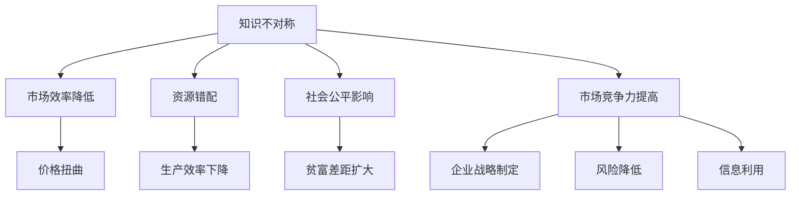

                 

### 文章标题

《信息差：信息不对称与竞争情报》

### 关键词：

- 信息差
- 竞争情报
- 信息不对称
- 市场营销
- 企业战略
- 法律风险
- 数据分析
- 人工智能

### 摘要：

本文深入探讨了信息差的概念、成因及其在经济和社会中的影响。通过分析信息不对称的类型、经济学原理以及竞争情报的应用，我们揭示了信息差在市场竞争中的重要性。文章随后介绍了信息差分析方法、竞争情报系统的构建和运营，并结合实际案例展示了信息差在不同行业中的运用。此外，文章还探讨了信息差相关的法律问题和未来发展趋势，为企业构建信息优势提供了实践指南。

## 第1章：引言

### 1.1 什么是信息差

信息差，亦称信息不对称，指的是不同个体或组织在获取、处理和利用信息上的差异。这种差异可能表现在知识、技能、市场信息、技术掌握等多个方面。信息差是市场经济中的一个重要现象，它既可能为企业带来竞争优势，也可能导致市场失灵。

- **知识不对称**：在某一领域，一方拥有而另一方缺乏的知识或技能。例如，专业医生与普通患者之间的医学知识不对称。

- **信息来源不对称**：不同个体或组织获取信息的渠道和能力不同。例如，企业内部员工与外部供应商之间的信息来源不对称。

- **信息时效不对称**：信息更新速度不同导致的时效性差异。例如，投资者与上市公司之间对财务报告的获取时效不对称。

- **信息透明度不对称**：信息的公开程度不同。例如，上市公司与投资者之间的信息公开程度不对称。

### 1.2 信息差对社会经济的影响

信息差对社会经济有着深远的影响，它既可能促进市场效率的提升，也可能导致市场失灵。

- **经济层面**：信息差可以影响市场效率和资源配置。例如，在信息不对称的情况下，市场机制无法实现资源的最优配置，可能导致价格扭曲、资源错配。

- **社会层面**：信息差会影响社会公平和正义。例如，在医疗领域，信息不对称可能导致贫富差距的扩大。

- **商业层面**：信息差为企业提供了利用信息获取利润的机会。例如，通过掌握市场信息，企业可以制定更为有效的营销策略。

### 1.3 竞争情报的定义与作用

竞争情报是指通过系统化的方法，收集、分析、整合和分发有关竞争对手的信息，以支持企业决策。竞争情报在企业战略规划、市场营销、产品开发等方面具有重要作用。

- **定义**：竞争情报是通过系统化的方法，收集、分析、整合和分发有关竞争对手的信息，以支持企业决策。

- **作用**：竞争情报可以帮助企业制定战略，提高市场竞争力。通过分析竞争对手的动向，企业可以提前预测市场趋势，调整自身策略。此外，竞争情报还可以用于风险分析和决策支持，降低企业的决策风险。

### 核心概念与联系

为了更好地理解信息差的概念及其在社会经济中的重要性，我们可以使用Mermaid流程图来展示信息不对称的类型及其影响。

**Mermaid 流程图：**



在这个流程图中，知识不对称是信息差的核心概念，它通过多种途径影响市场效率、资源配置、社会公平以及市场竞争力。信息差的利用可以为企业带来竞争优势，但同时也会带来一系列挑战，如风险管理和法律合规问题。

### 第2章：信息不对称的理论基础

#### 2.1 信息经济学原理

信息经济学是研究信息在经济活动中的作用和影响的经济学分支。信息经济学的基本原理包括阿罗-德布鲁市场模型、信息成本、信号发送与筛选等。

- **阿罗-德布鲁市场模型**：在完全信息对称的情况下，市场能够实现资源的最优配置。这意味着，所有市场参与者都能够获取全部信息，从而做出最优决策。

- **信息成本**：获取和处理信息需要付出成本。信息成本可能包括时间成本、人力成本、技术成本等。信息成本的上升会降低市场效率。

- **信号发送与筛选**：在信息不对称的情况下，个体通过发送信号来传达自己的真实信息。信号可以是显性的，如产品质量认证；也可以是隐性的，如个人教育背景。信号发送的目的是减少信息不对称，提高市场效率。

#### 2.2 信息不对称的类型

信息不对称可以表现为多种形式，根据不对称的性质，可以分为以下几种类型：

- **知识不对称**：指一方拥有而另一方缺乏的知识或技能。例如，医生与患者之间的医学知识不对称。

- **信息来源不对称**：指不同个体或组织获取信息的渠道和能力不同。例如，企业内部员工与外部供应商之间的信息来源不对称。

- **信息时效不对称**：指信息更新速度不同导致的时效性差异。例如，投资者与上市公司之间对财务报告的获取时效不对称。

- **信息透明度不对称**：指信息的公开程度不同。例如，上市公司与投资者之间的信息公开程度不对称。

#### 2.3 信息不对称的经济学分析

信息不对称的经济学分析主要涉及以下几个模型：

- **逆向选择**：在信息不对称的情况下，市场可能出现劣质产品或服务的现象。例如，二手市场上卖家可能隐瞒产品的真实状况，导致买家购买到质量较差的产品。

- **道德风险**：在信息不对称的情况下，个体或组织可能会采取不利于他人的行为。例如，保险公司可能因为信息不对称而提高保费，导致消费者减少保险购买。

- **市场力量与监管**：为了缓解信息不对称问题，市场力量和政府监管起到了重要作用。市场力量通过竞争机制，促使企业提高信息透明度；政府监管则通过法律手段，确保市场公平。

### 2.3 信息不对称的经济学分析

在经济学中，信息不对称是一个普遍存在的现象，它对市场机制和个体决策产生了深远的影响。以下是对信息不对称的经济学分析的详细探讨：

#### 阿罗-德布鲁市场模型

阿罗-德布鲁市场模型是一个理论框架，用于分析在完全信息对称条件下的市场效率。在这个模型中，所有市场参与者都能获取全部信息，从而做出最优决策。这意味着，资源配置可以实现帕累托最优状态，即没有人能够通过重新分配资源来使自己变得更好，而不使其他人变得更差。

然而，现实世界中，信息不对称普遍存在。个体或组织在获取和处理信息上存在差异，这导致了市场机制无法实现资源的最优配置。例如，在劳动力市场上，雇主和求职者之间的信息不对称可能导致工资偏差和就业效率的降低。

#### 信息成本

信息成本是指获取和处理信息所需的成本。信息成本可能包括时间成本、人力成本和技术成本等。高信息成本会降低市场效率，因为个体或组织在做出决策时需要投入更多的时间和资源来获取和处理信息。

例如，企业为了了解市场需求和竞争对手的动态，可能需要投入大量的人力、物力和财力进行市场调研和数据分析。这些成本的增加可能导致企业的运营成本上升，从而降低了市场竞争力。

#### 信号发送与筛选

在信息不对称的情况下，个体或组织通过发送信号来传达自己的真实信息，以减少信息不对称。信号可以是显性的，如产品认证、教育背景等；也可以是隐性的，如个人信誉、历史行为等。

信号发送的目的是提高市场效率，使信息不对称的情况得到缓解。例如，企业通过获得ISO认证来证明其产品的质量，从而吸引消费者购买。另一方面，市场也存在信号筛选机制，即市场参与者根据信号的可靠性来判断信息的真实性。

#### 逆向选择

逆向选择是信息不对称导致的一种市场失灵现象，指的是市场出现劣质产品或服务的现象。在信息不对称的情况下，卖方可能知道产品的真实质量，而买方则无法得知。这可能导致买方选择价格更低但质量更差的产品，从而降低了整体市场效率。

例如，在二手车市场上，卖家可能隐瞒车辆的维修记录和事故历史，导致买家购买到质量较差的车辆。这种信息不对称导致了逆向选择问题，影响了市场的正常运行。

#### 道德风险

道德风险是另一个由信息不对称导致的市场失灵现象，指的是个体或组织在信息不对称的情况下采取不利于他人的行为。例如，保险公司可能因为信息不对称而提高保费，导致消费者减少保险购买。这种道德风险可能导致市场的崩溃，因为消费者的信任度下降。

为了解决道德风险问题，市场需要建立有效的监管机制，如信息披露制度、信用评级系统等。这些机制可以增加信息透明度，降低道德风险，从而提高市场效率。

#### 市场力量与监管

市场力量和政府监管在缓解信息不对称方面起着重要作用。市场力量通过竞争机制，促使企业提高信息透明度。在竞争激烈的市场中，企业为了获得更多市场份额，可能主动披露更多的信息，以提高消费者的信任度。

政府监管则通过法律手段，确保市场公平。例如，竞争法可以禁止垄断行为，保护消费者权益；消费者保护法可以规范企业信息披露行为，防止虚假宣传和误导消费者。

总之，信息不对称是经济学中的一个重要概念，它影响了市场效率、个体决策和市场运行。通过理解信息不对称的经济学原理，我们可以更好地设计市场机制和政策，以缓解信息不对称带来的负面影响。

### 第3章：信息差分析的方法与技术

#### 3.1 竞争情报的基本方法

竞争情报是指通过系统化的方法，收集、分析、整合和分发有关竞争对手的信息，以支持企业决策。以下是竞争情报的基本方法：

- **数据收集**：通过公开信息、市场调查、网络监测等方式收集相关数据。公开信息包括政府发布的统计数据、行业协会的报告等；市场调查可以通过问卷、访谈等方式获取消费者的意见和反馈；网络监测则利用搜索引擎、爬虫技术等对互联网上的信息进行实时监测。

- **数据分析**：使用统计学、数据挖掘等方法对收集到的数据进行分析。数据分析包括描述性统计、推断性统计、回归分析、聚类分析等。数据挖掘则利用机器学习算法，从大量数据中提取有价值的信息和模式。

- **信息整合**：将分散的信息进行整合，形成有价值的情报。信息整合可以通过数据仓库、数据湖等技术实现，将不同来源的数据进行清洗、转换和存储，以便于后续的分析和使用。

- **情报分发**：将分析结果通过报告、会议等形式传达给决策者。情报分发需要考虑决策者的需求和偏好，确保情报的及时性、准确性和实用性。

#### 3.2 信息监测与收集技术

信息监测与收集技术是竞争情报系统中至关重要的一部分。以下是一些常用的信息监测与收集技术：

- **网络监测**：利用搜索引擎、爬虫技术等对互联网上的信息进行实时监测。网络监测可以帮助企业了解市场趋势、消费者需求、竞争对手动态等。

- **社交媒体监测**：通过分析社交媒体上的信息，了解市场趋势和消费者行为。社交媒体监测可以帮助企业发现潜在的市场机会和风险。

- **新闻监测**：实时监控新闻媒体发布的内容，获取竞争情报。新闻监测可以帮助企业了解政策变化、行业动态等。

- **公开信息收集**：从政府、行业协会、商业数据库等渠道获取公开信息。公开信息包括政策法规、市场报告、行业动态等。

- **调查问卷**：通过问卷形式收集目标群体的意见和反馈。调查问卷可以帮助企业了解消费者需求、市场趋势等。

- **访谈**：通过与专家、行业人士的交流获取深入的信息。访谈可以帮助企业了解行业内部的情况、竞争对手的策略等。

#### 3.3 数据分析与挖掘技术

数据分析和挖掘技术是竞争情报系统的核心。以下是一些常用的数据分析与挖掘技术：

- **统计分析**：通过描述性统计和推断性统计来分析数据。描述性统计用于描述数据的基本特征，如平均值、标准差等；推断性统计用于推断总体特征，如置信区间、假设检验等。

- **数据可视化**：使用图表、地图等方式将数据转换为易于理解的形式。数据可视化可以帮助企业更直观地了解数据的分布、趋势等。

- **机器学习**：利用算法对大量数据进行模式识别和预测。常见的机器学习算法包括决策树、随机森林、支持向量机、神经网络等。

- **聚类分析**：将相似的数据分组，以发现潜在的模式。聚类分析可以帮助企业发现市场细分、消费者群体等。

- **关联规则挖掘**：发现数据之间的关联性。关联规则挖掘可以帮助企业发现产品的组合销售机会、消费者行为模式等。

- **分类与回归分析**：对数据进行分类或预测。分类分析用于判断数据属于哪个类别，如市场细分；回归分析用于预测连续变量，如销售预测。

通过以上方法和技术，企业可以有效地收集、分析和利用竞争情报，从而提高市场竞争力、优化决策过程。

### 第4章：信息差在市场竞争中的应用

#### 4.1 市场营销中的信息差利用

市场营销中的信息差利用是企业在市场竞争中获取优势的重要手段。以下是一些具体的方法：

- **市场定位**：通过分析市场信息，企业可以确定目标市场和目标消费者群体。例如，某电商平台通过大数据分析，发现年轻消费者对高品质生活用品有强烈需求，于是定位为“年轻时尚生活品牌”，从而在市场上占据了一席之地。

- **差异化营销**：利用信息不对称，企业可以提供独特的产品或服务，满足消费者未被满足的需求。例如，某科技公司通过深入市场调研，发现传统家电产品在智能化方面的不足，于是推出了具有智能家居功能的家电产品，受到了消费者的热烈欢迎。

- **信息传递**：通过有效的信息传递策略，企业可以增强消费者对品牌或产品的认知。例如，某品牌通过社交媒体宣传，发布有吸引力的内容和优惠活动，吸引了大量年轻消费者关注和购买。

- **品牌形象**：利用信息不对称，企业可以塑造独特的品牌形象，提高消费者对品牌的信任度和忠诚度。例如，某奢侈品牌通过严格控制产品供应链和制造过程，确保产品质量，树立了高端、高品质的品牌形象，吸引了大量高端消费者。

#### 4.2 产品设计与创新的竞争情报

产品设计与创新中的竞争情报利用是企业在市场竞争中保持领先地位的关键。以下是一些具体的方法：

- **市场需求分析**：通过竞争情报分析，企业可以了解市场需求和消费者偏好，从而设计出符合市场需求的创新产品。例如，某手机制造商通过市场调研发现消费者对手机电池续航时间有强烈需求，于是研发了高能量密度电池，大大提升了手机的使用时间。

- **技术跟踪**：通过监测行业内的技术创新和发展趋势，企业可以及时掌握新技术，将其应用于产品设计中。例如，某电子产品公司通过跟踪5G技术的发展，提前推出了支持5G功能的电子产品，赢得了市场份额。

- **竞争对手分析**：通过分析竞争对手的产品设计、创新策略，企业可以找到自己的创新点。例如，某电子产品公司发现竞争对手的产品在音质上有待提升，于是研发了具有卓越音质的音频产品，取得了良好的市场反响。

- **用户反馈**：通过收集用户反馈，企业可以了解用户对产品的实际使用体验，从而不断改进产品设计和功能。例如，某汽车制造商通过用户反馈，发现用户对汽车的智能互联功能有较高需求，于是增加了智能语音助手和车联网功能，提升了用户体验。

- **专利分析**：通过分析竞争对手的专利申请，企业可以了解竞争对手的技术布局和创新方向，从而制定相应的研发策略。例如，某科技公司通过专利分析，发现竞争对手在AI领域有强大的专利储备，于是加大了在AI技术研发的投入，以保持竞争优势。

#### 4.3 企业战略规划与决策中的信息差利用

企业战略规划与决策中的信息差利用是确保企业长期发展和市场竞争力的关键。以下是一些具体的方法：

- **市场预测**：通过竞争情报分析，企业可以预测市场趋势和消费者需求，从而制定相应的战略规划。例如，某电商平台通过大数据分析，预测到未来线上购物趋势的增长，于是加大了在线业务的投资，提前布局市场。

- **风险分析**：通过分析市场信息和竞争对手动态，企业可以识别潜在的市场风险，制定相应的风险应对策略。例如，某制造企业通过分析竞争对手的营销策略，发现竞争对手可能推出更具竞争力的新产品，于是提前进行了产能调整和市场拓展。

- **投资决策**：通过竞争情报分析，企业可以评估投资项目的潜在风险和收益，从而做出更明智的投资决策。例如，某科技公司通过竞争情报分析，发现某个新兴市场有巨大的增长潜力，于是决定在该市场上进行大规模投资，取得了显著的经济效益。

- **合作伙伴选择**：通过分析潜在合作伙伴的信息和业务模式，企业可以找到合适的合作伙伴，实现资源共享和协同发展。例如，某食品公司通过竞争情报分析，选择了与一家具有强大供应链管理能力的公司合作，共同开发新产品，提高了市场竞争力。

- **竞争优势分析**：通过分析自身和竞争对手的优势和劣势，企业可以制定有针对性的发展战略，提升市场竞争地位。例如，某互联网公司通过竞争情报分析，发现自身在用户活跃度和平台生态方面具有明显优势，于是加大了用户增长和内容建设的投入，巩固了市场地位。

总之，信息差在市场竞争中的应用是企业实现长期发展和竞争优势的关键。通过有效的信息收集、分析和利用，企业可以制定科学的战略规划，抓住市场机遇，应对市场挑战。

### 第5章：国内外信息差案例解析

#### 5.1 案例一：电商平台的价格战

**案例背景：** 电商平台的价格战是互联网经济中常见的现象。近年来，随着电商平台的兴起，价格竞争成为吸引消费者的主要手段之一。在中国，阿里巴巴、京东、拼多多等主要电商平台经常通过价格战来争夺市场份额。

**信息差利用：** 电商平台在价格战中利用信息差主要表现在以下几个方面：

- **价格监控**：电商平台通过技术手段，实时监控竞争对手的价格动态，以便及时调整自己的价格策略。
- **市场信息收集**：通过大数据分析，电商平台了解消费者的购买习惯、价格敏感度等信息，从而制定更有效的价格策略。
- **促销活动**：电商平台利用信息差，通过发布限时优惠、优惠券、满减活动等促销手段，吸引消费者购买。

**效果评估：** 价格战在短期内可以大幅提升电商平台的市场份额，但长期来看，可能会导致利润率下降，电商平台需要通过其他手段来保持竞争优势。

- **市场份额提升**：通过价格战，电商平台能够迅速扩大市场份额，吸引更多消费者。
- **品牌知名度提升**：频繁的价格战增加了电商平台的曝光率，提升了品牌知名度。
- **利润率下降**：价格战导致电商平台在短期内利润率下降，需要通过其他方式（如提高物流效率、降低成本等）来保持盈利。

**结论：** 价格战是电商平台利用信息差获取市场份额的一种有效手段，但需要平衡价格策略和长期盈利能力。

#### 5.2 案例二：高科技企业的技术创新

**案例背景：** 高科技企业在技术创新中往往面临激烈的市场竞争。以苹果、华为、三星等为例，这些企业在智能手机、电脑、平板等消费电子产品领域竞争激烈。

**信息差利用：** 高科技企业在技术创新中利用信息差主要表现在以下几个方面：

- **技术情报收集**：通过竞争情报系统，企业实时监控行业内的技术创新和发展趋势，了解竞争对手的技术动态。
- **研发投入**：企业通过大数据分析，了解市场需求和消费者偏好，从而在研发上投入更多资源。
- **合作与并购**：通过合作和并购，企业可以获取关键技术，加快技术创新。

**效果评估：** 高科技企业的技术创新在提升企业竞争力、市场占有率方面取得了显著效果。

- **产品优势**：技术创新使得企业能够推出更具竞争力的产品，满足消费者的需求。
- **市场占有率提升**：通过技术创新，企业可以在市场上占据更大的份额。
- **品牌价值提升**：技术创新提升了企业的品牌价值，增强了消费者对品牌的信任和忠诚度。

**结论：** 高科技企业通过信息差利用，能够在技术创新中保持领先地位，提升市场竞争力。

#### 5.3 案例三：传统行业的数字化转型

**案例背景：** 随着数字技术的快速发展，传统行业正经历着数字化转型。以制造业、零售业、金融业等为例，这些行业在数字化过程中面临着巨大的挑战和机遇。

**信息差利用：** 传统行业在数字化转型中利用信息差主要表现在以下几个方面：

- **市场调研**：通过大数据分析，企业了解市场需求和消费者行为，制定相应的数字化转型策略。
- **技术引进**：企业通过合作和技术引进，快速掌握数字化技术，提升业务效率。
- **业务流程优化**：企业通过数字化手段，优化业务流程，提高运营效率。

**效果评估：** 传统行业的数字化转型在提升企业竞争力、降低运营成本方面取得了显著效果。

- **运营效率提升**：数字化转型使得业务流程更加高效，运营成本降低。
- **客户体验优化**：通过数字化手段，企业能够提供更优质的客户体验，提升客户满意度。
- **市场竞争力提升**：数字化转型使得企业能够更好地适应市场变化，提升市场竞争力。

**结论：** 传统行业通过信息差利用，能够在数字化转型中实现业务升级，提升市场竞争力。

通过以上案例分析，我们可以看到，信息差在不同行业中具有重要作用。无论是在电商领域、高科技行业，还是传统行业，企业通过有效的信息差利用，都能够提升市场竞争力和实现业务增长。

### 第6章：信息差在竞争中的战略部署

#### 6.1 竞争情报战略规划

竞争情报战略规划是企业利用信息差提升市场竞争力的关键步骤。以下是一个详细的竞争情报战略规划流程：

1. **确定战略目标**：首先，企业需要明确自身的战略目标，如提升市场份额、扩大品牌影响力、实现业务增长等。战略目标应与企业的整体业务规划和愿景保持一致。

2. **情报需求分析**：企业应分析各类业务需求和决策场景，确定哪些情报类型对业务支持最为关键。例如，市场趋势、竞争对手动向、消费者需求等。

3. **情报收集与处理**：建立完善的情报收集与处理体系，确保能够及时、准确地获取和处理各类情报。收集渠道包括公开信息、市场调研、网络监测、合作伙伴等。

4. **情报分析**：利用数据分析、数据挖掘等技术，对收集到的情报进行分析，提取有价值的信息和洞察。分析结果应形成结构化的报告，便于决策者参考。

5. **情报分发与利用**：制定有效的情报分发策略，确保情报能够及时、准确地传递到决策层。同时，培训决策者如何有效利用情报，支持业务决策。

6. **情报反馈与优化**：建立情报反馈机制，收集决策者对情报的反馈，不断优化情报系统。通过持续改进，提升情报的实用性、准确性和及时性。

#### 6.2 信息差优势的构建与保持

构建和保持信息差优势是企业在市场竞争中取得成功的关键。以下是一些具体策略：

1. **技术领先**：企业应加大技术研发投入，保持技术领先优势。通过不断创新，推出具有竞争力的新产品或服务，形成技术壁垒。

2. **数据驱动**：利用大数据分析，深入挖掘消费者需求和行业趋势，为企业决策提供数据支持。数据驱动可以帮助企业更精准地制定市场策略。

3. **人才优势**：吸引和培养具有信息处理能力和专业知识的人才，提升企业的信息收集、分析和利用能力。人才优势是企业构建信息差的关键。

4. **合作与联盟**：通过与高校、科研机构、行业合作伙伴建立合作关系，共同开展技术研发和市场拓展。合作与联盟可以共享资源、互补优势，提升整体竞争力。

5. **信息安全**：加强信息安全防护，防止敏感信息泄露。信息安全是信息差优势的重要保障，企业应制定严格的保密措施，确保信息的安全性和保密性。

6. **持续监控**：建立信息监控系统，实时监测市场环境和竞争对手动向。通过持续监控，企业可以及时调整战略，保持信息差优势。

#### 6.3 竞争情报的失效风险与管理

竞争情报失效风险是指由于信息不对称、情报分析错误、数据质量差等原因，导致情报无法有效支持企业决策的风险。以下是一些失效风险的识别和管理方法：

1. **失效风险识别**：通过定期审计、内部审查等方式，识别情报系统的潜在失效风险。审计内容应包括数据收集、处理、分析、分发的各个环节。

2. **风险管理策略**：制定风险管理策略，确保情报系统的稳定性和可靠性。策略应包括数据质量管理、情报分析流程控制、信息安全保障等。

3. **数据质量管理**：确保数据收集的全面性、准确性和及时性。对收集到的数据进行分析和清洗，去除错误和重复数据，提高数据质量。

4. **情报分析流程控制**：建立严格的情报分析流程，确保分析过程的科学性和准确性。对情报分析结果进行审核和验证，避免分析错误。

5. **信息安全保障**：加强信息安全防护，防止敏感信息泄露。采取加密、访问控制、数据备份等措施，确保信息的安全性和保密性。

6. **员工培训与监督**：加强对情报分析人员的培训，提高其专业能力和责任感。建立监督机制，确保员工在情报分析过程中遵守相关规范和流程。

通过以上措施，企业可以有效地识别和管理竞争情报失效风险，确保情报系统的稳定运行，为企业决策提供可靠的支持。

### 第7章：信息差与法律风险

#### 7.1 信息不对称的法律问题

信息不对称在法律层面引发了诸多问题，这些问题涉及合同法、消费者保护法、知识产权法等多个领域。

- **合同法中的信息不对称**：在合同签订过程中，信息不对称可能导致合同效力降低。例如，卖方隐瞒产品缺陷，买方因信息不对称而无法了解真实情况，导致合同无效或可撤销。此外，信息不对称还可能引发违约责任争议，因为买方可能因卖方的隐瞒而遭受损失。

- **消费者保护法中的信息不对称**：信息不对称对消费者权益保护产生了重大影响。消费者在购买商品或服务时，往往缺乏对产品质量、价格、售后服务等信息的了解。这种信息不对称可能导致消费者受到不公平对待，如购买到劣质产品、支付过高价格等。消费者保护法旨在通过强制披露信息、规定广告标准等方式，减少信息不对称，保护消费者权益。

- **知识产权法中的信息不对称**：知识产权法旨在保护创作者的智力成果，但在信息不对称的情况下，创作者可能面临侵权风险。例如，专利持有者可能因信息不对称而无法及时发现潜在的侵权行为，导致知识产权受到侵害。同时，知识产权法也关注信息不对称带来的滥用问题，如不正当竞争、商业诽谤等。

#### 7.2 竞争法与信息差

竞争法旨在维护市场公平竞争，防止市场垄断和滥用市场优势。信息差在竞争法中具有重要作用，因为信息不对称可能导致市场力量的失衡。

- **反垄断法**：反垄断法通过禁止垄断行为、控制市场力量，防止信息差被滥用。例如，企业通过垄断市场信息，控制市场价格和供应，可能被视为垄断行为，受到法律制裁。

- **反不正当竞争法**：反不正当竞争法关注企业间的公平竞争，防止信息差被用于不正当手段。例如，企业通过非法手段获取竞争对手的商业秘密、客户信息等，可能构成不正当竞争行为，受到法律制裁。

#### 7.3 企业如何规避信息差相关的法律风险

企业在利用信息差时，需要遵循相关法律法规，以规避法律风险。以下是一些建议：

- **合规管理**：企业应建立完善的合规管理体系，确保在信息收集、处理和使用过程中遵守法律法规。合规管理包括制定合规政策、培训员工、设立内部审计机制等。

- **信息保护**：企业应加强信息保护，防止敏感信息泄露。采取加密、访问控制、数据备份等措施，确保信息的保密性和完整性。

- **信息披露**：企业应遵循信息披露原则，主动披露相关信息，减少信息不对称。例如，在签订合同前，企业应充分披露产品信息、价格信息等，确保交易公平。

- **风险管理**：企业应建立风险识别和管理机制，识别和评估信息差带来的法律风险。通过定期审计、风险评估等方式，及时识别潜在风险，并采取相应措施进行应对。

- **员工培训**：加强对员工的法律法规培训，提高其合规意识和责任感。员工应了解信息差相关的法律风险，并在工作中严格遵守相关法律法规。

通过以上措施，企业可以有效地规避信息差相关的法律风险，确保在利用信息差的同时，遵守法律法规，实现合法合规的经营。

### 第8章：构建企业信息差优势的实战策略

#### 8.1 企业信息差优势评估

构建企业信息差优势的第一步是对当前信息差优势进行评估。以下是一个详细的企业信息差优势评估流程：

1. **确定评估目标**：明确评估的目的，如评估企业当前的信息差优势、识别潜在的信息差机会等。

2. **收集相关信息**：通过内部调查、市场调研、竞争对手分析等方式，收集与企业信息差相关的数据和信息。这些信息包括企业内部知识、技术、市场信息、消费者需求等。

3. **数据分析**：利用数据分析工具，对收集到的信息进行整理、清洗和分析。通过数据分析，识别企业当前的信息差优势领域和潜在的信息差机会。

4. **评估信息差优势**：对识别出的信息差优势进行评估，包括优势的稳定性、可持续性、市场竞争力等。评估结果应形成报告，为企业提供决策依据。

5. **制定改进计划**：根据评估结果，制定改进计划，包括加强技术研发、优化市场信息收集、提升员工信息处理能力等。

#### 8.2 信息差优势的培养与提升

培养和提升企业信息差优势是确保企业长期竞争力的关键。以下是一些具体策略：

1. **加强技术研发**：加大技术研发投入，保持技术领先优势。通过不断推出创新产品和服务，形成技术壁垒，提升企业的信息差优势。

2. **数据驱动决策**：利用大数据分析，深入挖掘消费者需求和行业趋势，为企业决策提供数据支持。通过数据驱动，企业可以更精准地制定市场策略，提升信息差优势。

3. **人才培养与引进**：吸引和培养具有信息处理能力和专业知识的人才。通过培训、引进高端人才，提升企业整体的信息收集、分析和利用能力。

4. **合作与联盟**：与高校、科研机构、行业合作伙伴建立合作关系，共同开展技术研发和市场拓展。通过合作与联盟，企业可以共享资源、互补优势，提升整体竞争力。

5. **信息安全保障**：加强信息安全防护，防止敏感信息泄露。采取加密、访问控制、数据备份等措施，确保信息的安全性和保密性。

6. **持续监控与优化**：建立信息监控系统，实时监测市场环境和竞争对手动向。通过持续监控，企业可以及时调整战略，保持信息差优势。

#### 8.3 信息差优势的可持续性管理

信息差优势的可持续性管理是确保企业长期竞争力的关键。以下是一些具体策略：

1. **战略规划**：制定长期战略规划，明确企业的发展目标和方向。通过战略规划，企业可以确保信息差优势的持续发展。

2. **资源分配**：合理分配人力、物力、财力等资源，确保信息差优势的持续建设。通过资源优化配置，企业可以最大化利用信息差优势。

3. **创新能力**：持续创新，保持企业的技术领先和市场竞争力。通过不断推出创新产品和服务，企业可以巩固信息差优势。

4. **风险管理**：建立风险识别和管理机制，识别和评估信息差优势的潜在风险。通过风险管理，企业可以降低信息差优势失效的风险。

5. **合规管理**：遵守相关法律法规，确保信息差优势的合法合规。通过合规管理，企业可以规避法律风险，确保信息差优势的可持续发展。

6. **员工培训**：加强对员工的培训，提高其信息处理能力和责任感。通过员工培训，企业可以确保信息差优势的持续传承和发展。

通过以上策略，企业可以构建、提升和保持信息差优势，确保在激烈的市场竞争中保持领先地位。

### 第9章：竞争情报系统建设与实践

#### 9.1 竞争情报系统的设计与实施

竞争情报系统的设计与实施是企业获取竞争优势的重要工具。以下是一个详细的竞争情报系统设计与实施的流程：

1. **需求分析**：首先，企业应明确竞争情报系统的需求，包括数据来源、分析需求、用户需求等。通过需求分析，确定系统应具备的功能和性能指标。

2. **系统设计**：根据需求分析的结果，设计竞争情报系统的架构和功能模块。系统架构应包括数据收集、数据处理、数据存储、数据分析、信息分发等模块。

3. **技术选型**：选择合适的技术栈和工具，确保系统的稳定性和性能。常用的技术包括大数据处理框架（如Hadoop、Spark）、数据分析工具（如Python、R）、数据库系统（如Hive、MySQL）等。

4. **系统开发**：根据系统设计，进行系统开发。开发过程中，应确保代码的模块化、可维护性和扩展性。

5. **系统集成**：将各个模块集成到一起，确保系统各部分协同工作。系统集成包括数据采集、数据处理、数据分析、信息分发等环节。

6. **测试与部署**：对系统进行全面的测试，确保系统功能正常、性能满足要求。测试内容包括功能测试、性能测试、安全测试等。测试通过后，进行系统部署。

7. **系统培训与运营**：对相关人员进行系统培训，确保他们能够熟练使用系统。系统上线后，进行持续运营和维护，确保系统稳定运行。

#### 9.2 竞争情报系统的运营与优化

竞争情报系统的成功运营与优化是确保其价值的最大化。以下是一些关键步骤：

1. **数据收集与处理**：定期收集市场信息、竞争对手数据、消费者反馈等，进行数据清洗、转换和存储。数据收集和处理应确保数据的全面性、准确性和及时性。

2. **数据分析与报告**：利用数据分析工具，对收集到的数据进行分析，提取有价值的信息和洞察。分析结果应形成结构化的报告，供决策者参考。

3. **信息分发与利用**：制定有效的信息分发策略，确保情报能够及时、准确地传递到决策层。信息分发应考虑决策者的需求和偏好，确保信息的高效利用。

4. **系统监控与维护**：建立系统监控机制，实时监控系统的运行状态和性能。对系统进行定期维护和升级，确保系统的稳定性和安全性。

5. **用户反馈与改进**：收集用户对系统的反馈，不断优化系统功能和用户体验。通过用户反馈，发现系统存在的问题和改进点，持续提升系统的价值。

6. **培训与支持**：定期对用户进行系统培训，提高其使用效率和效果。同时，提供技术支持，解决用户在使用过程中遇到的问题。

#### 9.3 竞争情报系统的应用案例

以下是一个具体的竞争情报系统应用案例：

**案例背景**：某知名电商平台希望通过竞争情报系统，提高市场竞争力，优化决策过程。

**应用场景**：电商平台通过竞争情报系统，对市场信息、竞争对手动向、消费者需求等进行全面分析。

**具体应用**：

1. **市场信息监控**：系统实时监控市场信息，包括行业动态、政策法规、竞争对手活动等。通过监控，电商平台能够及时了解市场变化，调整市场策略。

2. **竞争对手分析**：系统对主要竞争对手的价格策略、产品布局、营销活动等进行深入分析，提取竞争对手的弱点和机会。通过分析，电商平台可以制定针对性的竞争策略。

3. **消费者需求分析**：系统通过大数据分析，了解消费者购买行为、偏好和需求。通过分析，电商平台可以优化产品组合、提升用户体验，提高客户满意度。

4. **决策支持**：系统提供各类分析报告，包括市场趋势、竞争对手动态、消费者需求等。决策者通过报告，可以做出更为科学和有效的决策。

**效果评估**：

1. **市场份额提升**：通过竞争情报系统，电商平台能够及时调整市场策略，提高市场份额。

2. **客户满意度提升**：通过消费者需求分析，电商平台能够提供更符合消费者需求的产品和服务，提升客户满意度。

3. **运营效率提升**：系统优化了市场信息收集和分析流程，提高了运营效率。

4. **决策质量提升**：通过科学的数据分析和决策支持，电商平台决策更加准确和有效，降低了决策风险。

通过以上应用案例，我们可以看到竞争情报系统在提升企业竞争力、优化决策过程方面的显著效果。企业通过建设和使用竞争情报系统，可以更好地应对市场挑战，实现可持续发展。

### 第10章：未来展望与挑战

#### 10.1 信息差与数字经济

数字经济是未来经济发展的重要趋势，而信息差在数字经济中扮演着关键角色。随着信息技术的发展，数据成为新的生产要素，信息差成为企业竞争的重要手段。

- **信息差在资源配置中的作用**：在数字经济中，信息差能够帮助企业更有效地配置资源。例如，企业通过大数据分析，可以更精准地预测市场需求，从而优化库存管理和供应链。

- **信息差与市场效率**：信息差能够提升市场效率。在信息不对称的情况下，企业能够通过信息优势获取更高的利润，从而提高市场效率。然而，过度的信息差可能导致市场失灵，因此需要平衡信息不对称的程度。

- **数字经济中的挑战**：随着数字技术的发展，信息差问题也变得更加复杂。例如，数据隐私保护和信息安全成为数字经济中的关键挑战。企业需要在利用信息差的同时，确保数据安全和隐私保护。

#### 10.2 人工智能与信息差的未来

人工智能（AI）技术的快速发展对信息差产生了深远的影响，未来AI与信息差的关系将更加紧密。

- **AI在信息收集与分析中的作用**：人工智能能够高效地收集和分析大量数据，从而减少信息不对称。通过自然语言处理、图像识别等技术，AI可以自动化处理大量信息，提升企业的信息处理能力。

- **AI与信息差的利用**：人工智能可以增强企业的信息优势。例如，通过机器学习算法，企业可以更好地预测市场趋势和消费者行为，从而制定更为有效的市场策略。

- **未来的挑战**：随着AI技术的发展，信息差问题也可能变得更加复杂。例如，AI算法可能被用于制造假信息，加剧信息不对称。此外，AI技术的不公平性也可能导致新的社会问题，需要引起关注。

#### 10.3 信息差与全球竞争格局的变化

信息差对全球竞争格局产生了重要影响，未来这一影响将进一步加深。

- **全球竞争中的信息差优势**：在全球市场中，信息差成为企业竞争的重要手段。拥有信息优势的企业能够在全球市场上占据有利地位，提升市场竞争力。

- **新兴市场的崛起**：随着信息技术的发展，新兴市场国家的企业也在迅速提升信息处理能力，缩小与发达国家的信息差。这可能导致全球竞争格局的变化，新兴市场国家在全球竞争中的地位逐渐提升。

- **全球合作与竞争**：在全球化背景下，企业需要在全球范围内进行合作与竞争。信息差的存在使得企业在全球合作中面临新的挑战，同时也提供了新的机遇。企业需要建立全球信息共享平台，提升整体竞争力。

### 总结

信息差是数字经济和全球竞争中的重要概念，它影响着企业的市场策略、资源配置和创新能力。未来，随着信息技术和人工智能的发展，信息差将继续对经济和社会产生深远影响。企业需要不断探索信息差的利用策略，同时关注信息差带来的挑战，以保持竞争优势，实现可持续发展。

### 附录

#### 伪代码

以下是一个简单的伪代码示例，用于描述信息收集与数据分析的过程：

```plaintext
// 信息收集
function collectData(source) {
  data = []
  for (each item in source) {
    data.append(processData(item))
  }
  return data
}

// 数据处理
function processData(item) {
  cleanedItem = removeNoise(item)
  transformedItem = transformData(cleanedItem)
  return transformedItem
}

// 数据分析
function analyzeData(data) {
  insights = []
  for (each pair of data) {
    insights.append(findCorrelation(pair))
  }
  return insights
}

// 数据清洗
function removeNoise(item) {
  // 去除无效信息、重复数据等
  return cleanedItem
}

// 数据转换
function transformData(item) {
  // 将数据转换为分析所需的格式
  return transformedItem
}

// 关联规则挖掘
function findCorrelation(pair) {
  // 计算数据之间的关联性
  return correlation
}
```

#### 数学模型与公式

以下是一个简单的线性回归模型的公式示例，用于描述数据之间的关系：

$$
y = \beta_0 + \beta_1x + \epsilon
$$

其中，$y$ 是因变量，$x$ 是自变量，$\beta_0$ 是截距，$\beta_1$ 是斜率，$\epsilon$ 是误差项。

#### 代码实际案例

以下是一个Python代码示例，用于实现线性回归模型的训练与预测：

```python
import numpy as np
from sklearn.linear_model import LinearRegression

# 数据集
X = np.array([[1, 2], [2, 3], [3, 4]])
y = np.array([2, 3, 4])

# 创建线性回归模型
model = LinearRegression()

# 训练模型
model.fit(X, y)

# 预测
y_pred = model.predict([[4, 5]])

print("预测值：", y_pred)
```

#### 代码解读与分析

该代码首先导入了NumPy库，用于数据处理和线性回归模型的实现。接着，创建了一个包含自变量 $X$ 和因变量 $y$ 的数据集。

然后，使用 `LinearRegression` 类创建了一个线性回归模型对象。调用 `fit` 方法对模型进行训练，输入自变量 $X$ 和因变量 $y$，模型会自动计算出最佳参数 $\beta_0$ 和 $\beta_1$。

最后，使用 `predict` 方法对新的自变量数据进行预测，输出预测值。通过上述步骤，我们可以使用线性回归模型进行数据的建模与预测，实现信息差的利用。

### 附录

#### 伪代码

以下是一个简单的伪代码示例，用于描述信息收集与数据分析的过程：

```plaintext
// 信息收集
function collectData(source) {
  data = []
  for (each item in source) {
    data.append(processData(item))
  }
  return data
}

// 数据处理
function processData(item) {
  cleanedItem = removeNoise(item)
  transformedItem = transformData(cleanedItem)
  return transformedItem
}

// 数据分析
function analyzeData(data) {
  insights = []
  for (each pair of data) {
    insights.append(findCorrelation(pair))
  }
  return insights
}

// 数据清洗
function removeNoise(item) {
  // 去除无效信息、重复数据等
  return cleanedItem
}

// 数据转换
function transformData(item) {
  // 将数据转换为分析所需的格式
  return transformedItem
}

// 关联规则挖掘
function findCorrelation(pair) {
  // 计算数据之间的关联性
  return correlation
}
```

#### 数学模型与公式

以下是一个简单的线性回归模型的公式示例，用于描述数据之间的关系：

$$
y = \beta_0 + \beta_1x + \epsilon
$$

其中，$y$ 是因变量，$x$ 是自变量，$\beta_0$ 是截距，$\beta_1$ 是斜率，$\epsilon$ 是误差项。

#### 代码实际案例

以下是一个Python代码示例，用于实现线性回归模型的训练与预测：

```python
import numpy as np
from sklearn.linear_model import LinearRegression

# 数据集
X = np.array([[1, 2], [2, 3], [3, 4]])
y = np.array([2, 3, 4])

# 创建线性回归模型
model = LinearRegression()

# 训练模型
model.fit(X, y)

# 预测
y_pred = model.predict([[4, 5]])

print("预测值：", y_pred)
```

#### 代码解读与分析

该代码首先导入了NumPy库，用于数据处理和线性回归模型的实现。接着，创建了一个包含自变量 $X$ 和因变量 $y$ 的数据集。

然后，使用 `LinearRegression` 类创建了一个线性回归模型对象。调用 `fit` 方法对模型进行训练，输入自变量 $X$ 和因变量 $y$，模型会自动计算出最佳参数 $\beta_0$ 和 $\beta_1$。

最后，使用 `predict` 方法对新的自变量数据进行预测，输出预测值。通过上述步骤，我们可以使用线性回归模型进行数据的建模与预测，实现信息差的利用。

### 作者信息

作者：AI天才研究院/AI Genius Institute & 禅与计算机程序设计艺术 /Zen And The Art of Computer Programming

文章标题：《信息差：信息不对称与竞争情报》

关键词：信息差、竞争情报、信息不对称、市场营销、企业战略、法律风险、数据分析、人工智能

文章摘要：本文深入探讨了信息差的概念、成因及其在经济和社会中的影响。通过分析信息不对称的类型、经济学原理以及竞争情报的应用，我们揭示了信息差在市场竞争中的重要性。文章随后介绍了信息差分析方法、竞争情报系统的构建和运营，并结合实际案例展示了信息差在不同行业中的运用。此外，文章还探讨了信息差相关的法律问题和未来发展趋势，为企业构建信息优势提供了实践指南。

