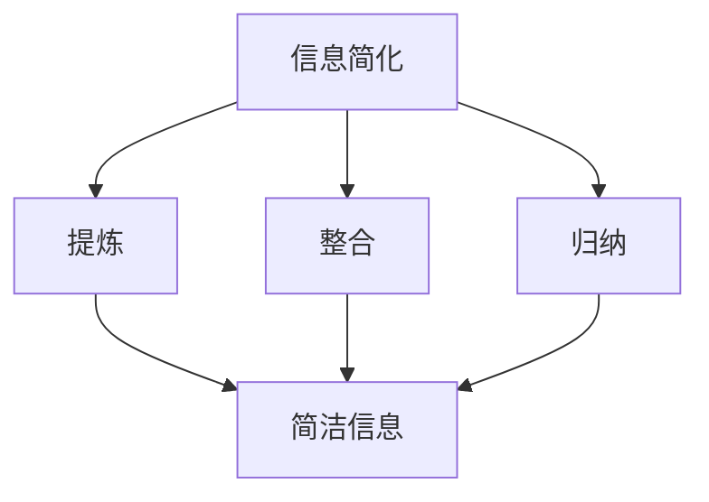

                 

# 《信息简化的好处与技巧：在复杂世界中简化以提高生活质量和效率》

> **关键词：** 信息简化、生活质量、效率提升、技巧与实践、数字化工具

> **摘要：** 在当今这个信息爆炸的时代，信息简化已成为提高生活质量和效率的重要手段。本文将深入探讨信息简化的定义、好处、技巧与实践，以及其在各个领域的应用和案例分析，帮助读者在复杂世界中找到简化的路径，实现高效生活。

## 第一部分：信息简化的理念与好处

### 第1章：信息简化的定义与背景

#### 1.1 信息简化的概念

信息简化是指通过提炼、整合、归纳等方法，将复杂的信息简化为更为简洁、易于理解和处理的形式。它不仅是一种信息处理的技术手段，更是一种思维方式和生活态度。

#### 1.2 信息简化的背景

**1.2.1 复杂世界中的信息爆炸**

随着互联网和移动通信技术的迅猛发展，信息量呈指数级增长。人们每天接触的信息量巨大，使得处理信息成为一项挑战。

**1.2.2 简化在提高生活质量中的作用**

简化信息能够减轻大脑负担，提高工作效率，减少不必要的干扰，从而提升生活质量。

**1.2.3 信息简化的社会价值**

信息简化有助于提高个体和集体的决策能力，促进知识传播，提升社会整体效率。

### 第2章：信息简化的好处

#### 2.1 提高生活效率

**2.1.1 减少信息过载**

简化信息能够帮助人们更好地筛选重要信息，避免信息过载，从而提高生活效率。

**2.1.2 提高任务处理速度**

通过简化信息，人们可以更快地理解和处理任务，提高工作效率。

**2.1.3 增强决策能力**

简化信息有助于人们更准确地分析和判断，提高决策能力。

#### 2.2 提升心理健康

**2.2.1 减轻压力和焦虑**

信息简化能够减少心理负担，减轻压力和焦虑。

**2.2.2 提高专注力**

简化信息有助于人们集中注意力，提高专注力。

**2.2.3 增强幸福感**

通过简化信息，人们可以更好地享受生活，增强幸福感。

#### 2.3 促进个人成长

**2.3.1 增强学习效果**

简化信息能够提高学习效率，增强学习效果。

**2.3.2 提升创造力和创新能力**

简化信息有助于激发创造力和创新能力，促进个人成长。

**2.3.3 塑造高效工作习惯**

通过信息简化，人们可以培养高效的工作习惯，提高工作效率。

## 第二部分：信息简化的技巧与实践

### 第3章：时间管理技巧

#### 3.1 日程安排

**3.1.1 时间块法**

时间块法是一种将时间划分为不同时间块，按照优先级分配任务的方法。

**3.1.2 四象限法则**

四象限法则是一种根据任务的重要性和紧急性对任务进行分类的方法。

**3.1.3 计划与执行**

制定详细的计划，并严格按照计划执行，是提高时间管理效率的关键。

#### 3.2 优先级管理

**3.2.1 艾森豪威尔矩阵**

艾森豪威尔矩阵是一种根据任务的重要性和紧急性对任务进行优先级排定的方法。

**3.2.2 优先级排定**

将任务按照优先级进行排序，优先处理重要且紧急的任务。

**3.2.3 任务分解**

将复杂的任务分解为若干小任务，逐一完成，提高工作效率。

### 第4章：阅读与学习技巧

#### 4.1 高效阅读

**4.1.1 速读法**

速读法是一种提高阅读速度和理解能力的方法。

**4.1.2 精读法**

精读法是一种深入理解和分析文本的方法。

**4.1.3 信息筛选**

通过筛选关键信息，提高阅读效率。

#### 4.2 学习方法

**4.2.1 分散学习法**

分散学习法是一种将学习时间分散到不同时间段的方法。

**4.2.2 主动学习法**

主动学习法是一种通过主动思考和实践来加深对知识理解的方法。

**4.2.3 系统性学习**

系统性学习是一种按照一定的顺序和体系进行学习的方法。

### 第5章：沟通与协作技巧

#### 5.1 信息传递

**5.1.1 清晰表达**

清晰表达是有效沟通的关键。

**5.1.2 倾听技巧**

倾听是有效沟通的重要组成部分。

**5.1.3 非语言沟通**

非语言沟通如肢体语言和表情等，在沟通中发挥着重要作用。

#### 5.2 团队协作

**5.2.1 明确目标**

明确目标是团队协作的基础。

**5.2.2 分工协作**

分工协作能够提高团队工作效率。

**5.2.3 提升沟通效率**

通过有效的沟通，提升团队协作效率。

### 第6章：数字化工具与技巧

#### 6.1 基本工具介绍

**6.1.1 日历与任务管理工具**

日历与任务管理工具可以帮助人们更好地管理日程和任务。

**6.1.2 电子邮件管理工具**

电子邮件管理工具可以提高邮件处理效率。

**6.1.3 云存储与同步工具**

云存储与同步工具可以方便地存储和共享文件。

#### 6.2 进阶技巧

**6.2.1 信息筛选与整理**

通过信息筛选与整理，提高信息处理效率。

**6.2.2 自动化工作流程**

自动化工作流程可以节省时间和精力。

**6.2.3 智能助手应用**

智能助手应用可以提供便捷的服务和提醒。

### 第7章：生活方式与简化实践

#### 7.1 日常生活中的简化

**7.1.1 家居环境的简化**

通过简化家居环境，提高生活质量。

**7.1.2 生活方式的调整**

调整生活方式，实现信息简化。

**7.1.3 精简消费**

通过精简消费，减少不必要的负担。

#### 7.2 长期实践策略

**7.2.1 建立简化习惯**

通过长期实践，建立简化习惯。

**7.2.2 面对挑战的策略**

在面对挑战时，采取有效的策略。

**7.2.3 持续改进的方法**

通过持续改进，不断提高信息简化能力。

## 第三部分：信息简化的应用场景与案例分析

### 第8章：信息简化在职场中的应用

#### 8.1 职场环境中的信息简化

**8.1.1 项目管理中的简化**

通过信息简化，提高项目管理效率。

**8.1.2 企业沟通中的简化**

通过信息简化，提高企业沟通效率。

**8.1.3 创新工作中的简化**

通过信息简化，激发创新工作潜能。

#### 8.2 职场案例分析

**8.2.1 案例一：某公司的信息简化实践**

分析某公司如何通过信息简化提高工作效率。

**8.2.2 案例二：某创业团队的信息简化之路**

探讨某创业团队如何通过信息简化实现快速成长。

**8.2.3 案例三：信息简化在大型企业中的实施**

探讨信息简化在大型企业中的应用和效果。

### 第9章：信息简化在教育中的应用

#### 9.1 教育环境中的信息简化

**9.1.1 课程设计的简化**

通过信息简化，优化课程设计。

**9.1.2 教学方法的简化**

通过信息简化，提高教学效果。

**9.1.3 学生学习习惯的养成**

通过信息简化，帮助学生养成良好的学习习惯。

#### 9.2 教育案例分析

**9.2.1 案例一：某学校的简化教学实践**

分析某学校如何通过信息简化提高教学质量。

**9.2.2 案例二：在线教育中的信息简化**

探讨在线教育如何通过信息简化提升学习体验。

**9.2.3 案例三：教育科技公司的简化策略**

探讨教育科技公司如何通过信息简化推动教育创新。

## 附录

### 附录A：信息简化工具推荐

**A.1 时间管理工具**

- **A.1.1 工具一：Google Calendar**
- **A.1.2 工具二：Trello**
- **A.1.3 工具三：Asana**

**A.2 阅读与学习工具**

- **A.2.1 工具一：Safari Reader**
- **A.2.2 工具二：Evernote**
- **A.2.3 工具三：Quizlet**

**A.3 沟通与协作工具**

- **A.3.1 工具一：Slack**
- **A.3.2 工具二：Microsoft Teams**
- **A.3.3 工具三：Zoom**

### 作者信息

**作者：AI天才研究院/AI Genius Institute & 禅与计算机程序设计艺术 /Zen And The Art of Computer Programming**<|im_end|>## 第一部分：信息简化的理念与好处

### 第1章：信息简化的定义与背景

#### 1.1 信息简化的概念

信息简化是一种通过提炼、整合、归纳等方法，将复杂的信息简化为更为简洁、易于理解和处理的形式的技术手段。它不仅适用于个人生活，也广泛应用于企业管理、教育培训等各个领域。信息简化的核心在于降低信息的复杂度，提高信息的可用性和处理效率。

在技术领域，信息简化通常体现在算法优化、数据压缩和界面设计等方面。例如，在编程中，通过简化代码结构，可以提高代码的可读性和可维护性；在数据科学中，通过简化数据模型，可以提高数据分析的效率和准确性。

在生活中，信息简化同样重要。随着互联网和移动设备的普及，人们每天接触到的信息量呈爆炸性增长，如何有效地筛选和处理这些信息成为了一大挑战。信息简化可以帮助我们更快速地获取关键信息，提高工作效率，减少不必要的干扰，从而提升生活质量。

#### 1.2 信息简化的背景

**1.2.1 复杂世界中的信息爆炸**

在当今这个信息爆炸的时代，人们每天接收到的信息量巨大。根据相关研究，全球每年产生的数据量以指数级增长，而个人的信息接收量也在不断增加。据统计，一个成年人每天大约会接触到数百条信息，这些信息可能来自于社交媒体、电子邮件、新闻媒体等各种渠道。

这种信息过载现象给人们的生活和工作带来了巨大的压力。一方面，人们需要花费大量时间来处理这些信息，导致工作效率降低；另一方面，过多的信息也会导致心理压力和焦虑，影响身心健康。

**1.2.2 简化在提高生活质量中的作用**

信息简化在提高生活质量中发挥着重要作用。首先，它能够帮助人们更快速地获取关键信息，避免被大量无关信息所困扰。通过筛选和整理信息，人们可以专注于重要的事情，提高工作效率。

其次，信息简化能够减轻心理负担。过多的信息会导致大脑疲劳，降低专注力。而通过简化信息，人们可以减少不必要的思考，降低心理压力，提高心理健康水平。

此外，信息简化还有助于培养良好的生活习惯。通过简化日常生活中的信息处理，如管理邮件、整理日程、整理笔记等，人们可以建立高效的生活和工作模式，提高生活质量。

**1.2.3 信息简化的社会价值**

信息简化的社会价值不可忽视。首先，它有助于提高社会整体的效率。在一个信息高度简化的社会中，人们可以更快速地传递和获取信息，减少沟通成本，提高工作效率。

其次，信息简化有助于知识传播和共享。在信息简化的过程中，复杂的信息被转化为简单易懂的形式，使得更多的人能够理解和应用。这有助于知识的普及和传播，提高社会整体的知识水平。

最后，信息简化有助于培养创新思维。在一个信息简化的环境中，人们可以更容易地发现问题和提出解决方案。这有助于激发创造力和创新能力，推动社会进步。

#### 1.3 信息简化的核心概念与联系

为了更好地理解信息简化的概念，我们可以通过一个简单的 Mermaid 流程图来展示其核心概念与联系。

在这个流程图中，信息简化通过提炼、整合、归纳三个步骤，将复杂的信息转化为简洁的信息。这三个步骤相辅相成，共同构成了信息简化的核心概念。

- **提炼**：从大量信息中提取出关键信息和核心内容，去除冗余和无关的信息。
- **整合**：将提取出的关键信息进行整合，形成逻辑清晰、结构紧凑的信息体系。
- **归纳**：对整合后的信息进行归纳总结，提炼出更简洁、更有价值的信息。

通过这个流程，我们可以看到信息简化不仅是一个技术手段，更是一种思维方式和生活态度。

### 第2章：信息简化的好处

#### 2.1 提高生活效率

**2.1.1 减少信息过载**

信息过载是现代社会中一个普遍存在的问题。过多的信息会占据人们大量的时间和精力，导致工作效率降低。通过信息简化，我们可以有效地减少信息过载，提高生活效率。

首先，信息简化可以帮助我们筛选出最重要的信息。在一个信息爆炸的环境中，人们往往会收到大量无关紧要的信息，如垃圾邮件、社交媒体上的无关内容等。通过信息简化，我们可以利用各种工具和技巧，如邮件过滤器、社交媒体过滤器等，自动筛选出对我们最重要的信息，从而减少不必要的干扰。

其次，信息简化还可以帮助我们更好地管理时间和任务。通过简化信息，我们可以将复杂的信息转化为更易于处理的形式，如列表、图表、思维导图等。这样，我们可以更快速地理解和处理任务，提高工作效率。

**2.1.2 提高任务处理速度**

在信息简化的过程中，我们不仅可以减少信息过载，还可以提高任务处理速度。这是因为简化后的信息更加直观、清晰，可以快速被理解和处理。

例如，在项目管理中，通过信息简化，我们可以将复杂的项目计划转化为简单的任务列表和关键路径图。这样，项目成员可以更快速地了解项目进度和任务分工，提高任务处理速度。

在日常生活中，信息简化也可以帮助我们更快地完成任务。例如，通过使用清单和提醒工具，我们可以清晰地了解需要完成的任务，并按照优先级和时间安排进行任务处理。

**2.1.3 增强决策能力**

信息简化不仅可以帮助我们提高生活效率，还可以增强我们的决策能力。在复杂的环境中，过多的信息往往会导致决策困难。而通过信息简化，我们可以更快速地分析和判断信息，提高决策能力。

例如，在商业决策中，通过信息简化，我们可以将复杂的市场数据和分析结果转化为简洁的图表和报告。这样，决策者可以更快速地了解市场状况和潜在风险，做出更明智的决策。

在个人生活中，信息简化也可以帮助我们做出更好的决策。例如，在购物时，通过使用购物清单和比较工具，我们可以快速筛选出最符合需求的产品，避免被大量信息所困扰，做出更明智的购买决策。

#### 2.2 提升心理健康

**2.2.1 减轻压力和焦虑**

信息简化在提升心理健康方面也有着显著的作用。在现代社会中，人们往往面临着巨大的压力和焦虑。而信息简化可以帮助我们减轻这些负担，提高心理健康水平。

首先，信息简化可以帮助我们减少心理负担。过多的信息会导致大脑疲劳，降低专注力和工作效率。而通过信息简化，我们可以将复杂的信息转化为简洁的形式，减少大脑的工作量，从而减轻心理负担。

其次，信息简化可以帮助我们更好地管理时间和任务。在一个信息简化的环境中，我们可以更清晰地了解任务的优先级和时间安排，从而减少焦虑和压力。通过合理安排时间和任务，我们可以更好地控制生活和工作节奏，提高心理健康水平。

**2.2.2 提高专注力**

专注力是心理健康的重要组成部分。在信息爆炸的环境中，过多的信息往往会分散我们的注意力，降低专注力。而信息简化可以帮助我们提高专注力，更好地完成任务。

通过信息简化，我们可以将复杂的信息转化为简洁的形式，减少大脑的负担。这样，我们可以更集中地关注任务，提高专注力。例如，在阅读时，通过使用速读法和信息筛选技巧，我们可以快速获取关键信息，减少无关信息的干扰，提高阅读专注力。

在工作和学习中，信息简化同样可以帮助我们提高专注力。通过使用清单和提醒工具，我们可以清晰地了解任务的优先级和时间安排，避免被无关信息所干扰，提高专注力。

**2.2.3 增强幸福感**

信息简化不仅可以提高生活效率和心理素质，还可以增强幸福感。在一个信息简化的环境中，我们可以更好地享受生活，减少不必要的压力和焦虑。

首先，信息简化可以帮助我们更好地管理时间和任务，从而有更多的时间和精力去享受生活。例如，通过使用日程安排工具，我们可以更好地规划工作和生活，确保每天都有足够的时间进行休闲和娱乐，提高幸福感。

其次，信息简化可以帮助我们减少对信息的依赖，培养独立思考和自主行动的能力。在一个信息简化的环境中，我们可以更多地依赖自己的判断和决策，而不是被大量信息所左右。这样，我们可以更加自信和满足，增强幸福感。

#### 2.3 促进个人成长

**2.3.1 增强学习效果**

信息简化在促进个人成长方面也有着重要作用。在学习和工作中，过多的信息往往会分散我们的注意力，降低学习效果。而通过信息简化，我们可以更高效地学习和工作。

首先，信息简化可以帮助我们更快速地获取关键信息。通过筛选和整理信息，我们可以将复杂的信息转化为简洁的形式，减少大脑的负担。这样，我们可以更快地理解和掌握知识，提高学习效果。

其次，信息简化可以帮助我们更好地管理和组织学习内容。通过使用思维导图、清单等工具，我们可以将复杂的学习内容转化为结构化的形式，提高学习效率。

**2.3.2 提升创造力和创新能力**

信息简化不仅可以帮助我们提高学习效果，还可以提升创造力和创新能力。在一个信息简化的环境中，我们可以更专注于问题的核心，更容易产生创新的思维。

首先，信息简化可以帮助我们更好地识别和解决问题。通过筛选和整理信息，我们可以更清晰地了解问题的本质和关键点，从而更容易找到解决问题的方法。

其次，信息简化可以帮助我们培养创新的思维模式。在一个信息简化的环境中，我们可以更专注于问题的核心，更容易产生创新的思维。例如，通过使用思维导图，我们可以将复杂的问题分解为若干个子问题，从而更容易找到创新的解决方案。

**2.3.3 塑造高效工作习惯**

信息简化在塑造高效工作习惯方面也有着重要作用。通过信息简化，我们可以更高效地处理任务，提高工作效率。

首先，信息简化可以帮助我们更好地管理时间和任务。通过使用日程安排工具、清单等，我们可以更清晰地了解任务的优先级和时间安排，从而更高效地完成任务。

其次，信息简化可以帮助我们避免被大量信息所干扰。在一个信息简化的环境中，我们可以更专注于重要的事情，避免被无关信息所打扰，从而提高工作效率。

最后，信息简化可以帮助我们培养良好的工作习惯。通过长期的信息简化实践，我们可以逐渐形成高效的工作习惯，提高工作质量。

## 第二部分：信息简化的技巧与实践

### 第3章：时间管理技巧

#### 3.1 日程安排

**3.1.1 时间块法**

时间块法是一种将时间划分为不同时间块，按照优先级分配任务的方法。这种方法可以帮助我们更高效地管理时间，确保重要任务得到优先处理。

**时间块法的实施步骤：**

1. **确定任务优先级**：首先，我们需要明确任务的优先级，将任务分为紧急且重要、紧急但不重要、不紧急但重要、不紧急且不重要四个类别。

2. **划分时间块**：根据任务的优先级，将一天的时间划分为若干个时间块。每个时间块对应一个具体的任务或活动。

3. **时间块分配**：将任务分配到不同的时间块中，确保紧急且重要的任务得到优先处理。

4. **调整和优化**：在实际执行过程中，根据任务的进展情况和变化，及时调整时间块的分配。

**时间块法的优势：**

- **提高任务处理速度**：通过时间块法，我们可以更快速地处理任务，提高工作效率。
- **确保重要任务得到优先处理**：时间块法可以帮助我们确保紧急且重要的任务得到及时处理，避免重要任务被延误。
- **减少任务冲突**：通过合理的时间块分配，我们可以减少任务之间的冲突，避免多任务处理导致的效率降低。

**3.1.2 四象限法则**

四象限法则是一种根据任务的重要性和紧急性对任务进行分类的方法。它将任务分为四个象限：紧急且重要、紧急但不重要、不紧急但重要、不紧急且不重要。

**四象限法则的实施步骤：**

1. **评估任务的重要性**：首先，我们需要评估每个任务的重要性，判断它是否对我们的目标、价值观和长期规划有重要影响。

2. **评估任务的紧急性**：其次，我们需要评估每个任务的紧急性，判断它是否需要在短时间内完成。

3. **分类任务**：根据任务的重要性和紧急性，将任务分为四个象限。

4. **优先处理任务**：根据四象限法则，优先处理紧急且重要的任务，然后是紧急但不重要的任务，再然后是不紧急但重要的任务，最后处理不紧急且不重要的任务。

**四象限法则的优势：**

- **提高任务管理效率**：四象限法则可以帮助我们更高效地管理任务，确保紧急且重要的任务得到优先处理。
- **减少拖延**：通过明确任务的重要性和紧急性，我们可以减少拖延，提高任务的完成率。
- **避免过度忙碌**：通过合理安排时间，我们可以避免过度忙碌，确保有足够的时间处理重要但不紧急的任务。

**3.1.3 计划与执行**

制定详细的计划，并严格按照计划执行，是提高时间管理效率的关键。

**计划与执行的实施步骤：**

1. **确定目标**：首先，我们需要明确我们的目标，包括长期目标和短期目标。

2. **分解任务**：将目标分解为具体的任务，明确每个任务的完成时间和责任人。

3. **制定计划**：根据任务的优先级和时间安排，制定详细的计划。

4. **执行计划**：按照计划执行任务，确保每个任务按时完成。

5. **跟踪进度**：定期跟踪任务的进度，确保计划得到有效执行。

6. **调整计划**：在实际执行过程中，根据任务的进展情况和变化，及时调整计划。

**计划与执行的优势：**

- **提高工作效率**：通过详细的计划和严格的执行，我们可以提高工作效率，确保任务按时完成。
- **减少时间浪费**：通过明确的计划和执行，我们可以避免时间浪费，确保每个时间段都得到有效利用。
- **增强团队协作**：通过制定和执行计划，可以增强团队成员之间的协作，提高团队整体的工作效率。

#### 3.2 优先级管理

**3.2.1 艾森豪威尔矩阵**

艾森豪威尔矩阵是一种根据任务的重要性和紧急性对任务进行优先级排定的方法。它将任务分为四个象限：重要且紧急、重要但不紧急、不重要但紧急、不重要且不紧急。

**艾森豪威尔矩阵的实施步骤：**

1. **评估任务的重要性和紧急性**：首先，我们需要评估每个任务的重要性和紧急性，判断它是否对我们的目标、价值观和长期规划有重要影响。

2. **分类任务**：根据任务的重要性和紧急性，将任务分为四个象限。

3. **优先处理任务**：根据艾森豪威尔矩阵，优先处理重要且紧急的任务，然后是重要但不紧急的任务，再然后是不重要但紧急的任务，最后处理不重要且不紧急的任务。

**艾森豪威尔矩阵的优势：**

- **提高任务管理效率**：艾森豪威尔矩阵可以帮助我们更高效地管理任务，确保重要且紧急的任务得到优先处理。
- **减少拖延**：通过明确任务的重要性和紧急性，我们可以减少拖延，提高任务的完成率。
- **避免过度忙碌**：通过合理安排时间，我们可以避免过度忙碌，确保有足够的时间处理重要但不紧急的任务。

**3.2.2 优先级排定**

优先级排定是一种根据任务的重要性和紧急性对任务进行排序的方法。它可以帮助我们更高效地处理任务，确保重要任务得到优先处理。

**优先级排定的实施步骤：**

1. **确定任务优先级**：首先，我们需要明确任务的优先级，将任务分为紧急且重要、紧急但不重要、不紧急但重要、不紧急且不重要四个类别。

2. **评估任务的重要性**：其次，我们需要评估每个任务的重要性，判断它是否对我们的目标、价值观和长期规划有重要影响。

3. **评估任务的紧急性**：再次，我们需要评估每个任务的紧急性，判断它是否需要在短时间内完成。

4. **排序任务**：根据任务的重要性和紧急性，将任务排序。

5. **优先处理任务**：按照任务的优先级排序，优先处理紧急且重要的任务，然后是紧急但不重要的任务，再然后是不紧急但重要的任务，最后处理不紧急且不重要的任务。

**优先级排定的优势：**

- **提高任务管理效率**：通过优先级排定，我们可以更高效地管理任务，确保重要任务得到优先处理。
- **减少拖延**：通过明确任务的重要性和紧急性，我们可以减少拖延，提高任务的完成率。
- **避免过度忙碌**：通过合理安排时间，我们可以避免过度忙碌，确保有足够的时间处理重要但不紧急的任务。

**3.2.3 任务分解**

任务分解是一种将复杂的任务分解为若干小任务，逐一完成的方法。它可以帮助我们更清晰地了解任务的步骤和目标，提高任务完成率。

**任务分解的实施步骤：**

1. **确定任务目标**：首先，我们需要明确任务的目标，确保每个小任务都是为实现这个目标服务的。

2. **分解任务**：将复杂的任务分解为若干小任务，明确每个小任务的具体内容和目标。

3. **分配任务**：将分解后的任务分配给合适的团队成员，确保每个成员都清楚自己的任务和职责。

4. **监控进度**：定期监控任务进度，确保每个小任务都能按时完成。

5. **整合结果**：在小任务完成后，整合结果，确保最终任务的完成。

**任务分解的优势：**

- **提高任务完成率**：通过任务分解，我们可以更清晰地了解任务的步骤和目标，减少任务完成的难度，提高任务完成率。
- **增强团队合作**：通过任务分解，可以明确每个成员的职责和任务，增强团队合作，提高团队整体效率。
- **降低任务风险**：通过任务分解，可以将复杂任务分解为小任务，降低任务风险，确保任务按时完成。

### 第4章：阅读与学习技巧

#### 4.1 高效阅读

**4.1.1 速读法**

速读法是一种提高阅读速度和理解能力的方法。通过速读法，我们可以更快地获取信息，提高阅读效率。

**速读法的实施步骤：**

1. **练习定位阅读**：首先，我们需要练习定位阅读，通过快速浏览文本，找到关键信息和重点内容。

2. **练习跳跃阅读**：其次，我们需要练习跳跃阅读，通过跳过不重要的部分，提高阅读速度。

3. **练习集中注意力**：同时，我们需要练习集中注意力，避免在阅读过程中被其他事物所干扰。

4. **练习快速总结**：最后，我们需要练习快速总结，通过阅读后的总结，加深对文本的理解。

**速读法的优势：**

- **提高阅读速度**：速读法可以帮助我们更快地获取信息，提高阅读速度。
- **增强理解能力**：通过快速总结和定位阅读，我们可以更深入地理解文本内容。
- **节省时间**：速读法可以帮助我们节省大量的阅读时间，提高工作效率。

**4.1.2 精读法**

精读法是一种深入理解和分析文本的方法。通过精读法，我们可以更深入地理解文本内容，提高学习效果。

**精读法的实施步骤：**

1. **分段阅读**：首先，我们需要分段阅读，将文本划分为若干小段，逐一理解和分析。

2. **重点标注**：其次，我们需要在文本中标注重点，标记出关键概念和重要信息。

3. **思考总结**：在阅读过程中，我们需要对文本内容进行思考，总结和归纳，加深对文本的理解。

4. **回顾复习**：最后，我们需要定期回顾复习，巩固所学知识。

**精读法的优势：**

- **提高理解深度**：精读法可以帮助我们更深入地理解文本内容，提高学习效果。
- **增强记忆力**：通过反复阅读和总结，我们可以增强记忆力，巩固所学知识。
- **培养分析能力**：精读法可以培养我们的分析能力和批判性思维。

**4.1.3 信息筛选**

信息筛选是一种通过筛选关键信息，提高阅读效率的方法。通过信息筛选，我们可以更快地获取关键信息，减少无关信息的干扰。

**信息筛选的实施步骤：**

1. **明确阅读目标**：首先，我们需要明确阅读的目标，确定我们需要获取的信息类型。

2. **快速浏览**：在阅读过程中，我们需要快速浏览文本，寻找关键信息和重点内容。

3. **标注重点**：对于关键信息和重点内容，我们需要进行标注，标记出来。

4. **整理信息**：在阅读完成后，我们需要对标注的信息进行整理，形成结构化的知识体系。

**信息筛选的优势：**

- **提高阅读效率**：信息筛选可以帮助我们更快地获取关键信息，提高阅读效率。
- **减少信息过载**：通过筛选关键信息，我们可以减少信息过载，避免被大量无关信息所困扰。
- **增强专注力**：通过集中注意力筛选信息，我们可以提高专注力，减少干扰。

#### 4.2 学习方法

**4.2.1 分散学习法**

分散学习法是一种将学习时间分散到不同时间段的方法。通过分散学习法，我们可以更高效地学习，减少疲劳感。

**分散学习法的实施步骤：**

1. **确定学习目标**：首先，我们需要明确学习的目标，确定我们需要掌握的知识和技能。

2. **划分学习时间**：将学习时间划分为若干个时间段，确保每个时间段都有明确的学习任务。

3. **合理安排学习内容**：根据学习目标和时间安排，合理安排学习内容，确保每个时间段都有具体的学习任务。

4. **定期复习**：在学习完成后，我们需要定期复习，巩固所学知识。

**分散学习法的优势：**

- **提高学习效率**：分散学习法可以帮助我们更高效地学习，减少疲劳感。
- **增强记忆力**：通过分散学习，我们可以增强记忆力，巩固所学知识。
- **减少学习压力**：通过合理安排学习时间，我们可以减少学习压力，提高学习效果。

**4.2.2 主动学习法**

主动学习法是一种通过主动思考和实践来加深对知识理解的方法。通过主动学习法，我们可以更深入地理解和掌握知识。

**主动学习法的实施步骤：**

1. **提出问题**：在学习过程中，我们需要主动提出问题，对知识进行深入思考。

2. **寻找答案**：通过查阅资料、请教他人等方式，寻找问题的答案。

3. **实践应用**：将所学知识应用到实际中，通过实践来加深对知识的理解。

4. **反思总结**：在学习完成后，我们需要反思总结，巩固所学知识。

**主动学习法的优势：**

- **提高理解深度**：主动学习法可以帮助我们更深入地理解和掌握知识，提高学习效果。
- **培养思维能力**：通过主动思考和问题解决，我们可以培养批判性思维和创新能力。
- **增强实践能力**：通过实践应用所学知识，我们可以增强实践能力，提高应用水平。

**4.2.3 系统性学习**

系统性学习是一种按照一定的顺序和体系进行学习的方法。通过系统性学习，我们可以更全面、系统地掌握知识。

**系统性学习的实施步骤：**

1. **确定学习目标**：首先，我们需要明确学习的目标，确定我们需要掌握的知识和技能。

2. **选择学习资源**：根据学习目标，选择合适的教材、课程、讲座等学习资源。

3. **制定学习计划**：根据学习目标和资源，制定详细的学习计划，确保每个学习阶段都有明确的目标和任务。

4. **逐步推进**：按照学习计划，逐步推进学习进度，确保每个阶段的学习任务都能按时完成。

5. **定期复习**：在学习完成后，我们需要定期复习，巩固所学知识。

**系统性学习的优势：**

- **提高学习效率**：系统性学习可以帮助我们更高效地学习，避免知识点的遗漏。
- **增强知识体系**：通过系统性学习，我们可以构建全面、系统的知识体系。
- **提高应用能力**：通过系统性学习，我们可以更全面地掌握知识，提高应用能力。

### 第5章：沟通与协作技巧

#### 5.1 信息传递

**5.1.1 清晰表达**

清晰表达是有效沟通的关键。通过清晰表达，我们可以确保信息准确地传达给对方，避免误解和沟通障碍。

**清晰表达的实施步骤：**

1. **明确目标**：在沟通前，我们需要明确沟通的目标，确保信息传达的准确性。

2. **组织语言**：根据沟通的目标，组织语言，确保表达清晰、有条理。

3. **使用简洁的语言**：使用简洁明了的语言，避免使用复杂的词汇和句子。

4. **避免歧义**：在表达过程中，尽量避免使用可能产生歧义的词汇和表达方式。

5. **验证理解**：在沟通后，我们需要验证对方是否理解了我们的信息，确保信息准确传达。

**清晰表达的优势：**

- **提高沟通效率**：清晰表达可以帮助我们更快速、准确地传达信息，提高沟通效率。
- **减少误解**：通过清晰表达，我们可以减少误解和沟通障碍，确保信息的准确性。
- **增强合作效果**：清晰表达可以增强团队成员之间的合作效果，提高团队整体的工作效率。

**5.1.2 倾听技巧**

倾听是有效沟通的重要组成部分。通过倾听，我们可以更好地理解对方的需求和意见，建立良好的合作关系。

**倾听技巧的实施步骤：**

1. **保持专注**：在倾听过程中，我们需要保持专注，避免被其他事物所干扰。

2. **积极回应**：在倾听过程中，我们需要积极回应，通过肢体语言和口头表达，表明我们对对方的关注和理解。

3. **避免打断**：在倾听过程中，我们需要避免打断对方，让对方有足够的时间表达自己的观点。

4. **提出问题**：在倾听过程中，我们可以适时提出问题，进一步了解对方的观点和需求。

5. **总结确认**：在倾听完成后，我们需要对对方的观点进行总结确认，确保我们理解了对方的需求和意见。

**倾听技巧的优势：**

- **提高沟通效果**：倾听技巧可以帮助我们更好地理解对方的需求和意见，提高沟通效果。
- **建立信任**：通过倾听，我们可以表现出对对方的尊重和关注，建立良好的合作关系和信任。
- **促进合作**：通过倾听，我们可以更好地理解对方的需求和意见，促进团队成员之间的合作。

**5.1.3 非语言沟通**

非语言沟通如肢体语言和表情等，在沟通中发挥着重要作用。通过非语言沟通，我们可以更准确地传达信息和情感，增强沟通效果。

**非语言沟通的实施步骤：**

1. **使用适当的肢体语言**：在沟通过程中，我们可以使用适当的肢体语言，如点头、微笑、手势等，表达我们的态度和情感。

2. **注意面部表情**：面部表情可以传达我们的情感和态度，我们需要注意使用适当的表情，以增强沟通效果。

3. **保持眼神接触**：在沟通过程中，我们需要保持眼神接触，以表明我们的关注和理解。

4. **避免分心**：在沟通过程中，我们需要避免分心，确保我们的注意力集中在对方身上。

5. **注意环境因素**：在沟通过程中，我们需要注意环境因素，如噪音、光线等，确保沟通的环境适宜。

**非语言沟通的优势：**

- **增强沟通效果**：非语言沟通可以帮助我们更准确地传达信息和情感，增强沟通效果。
- **减少误解**：通过非语言沟通，我们可以减少误解和沟通障碍，确保信息的准确性。
- **提高合作效率**：通过非语言沟通，我们可以更好地理解对方的需求和意见，提高合作效率。

#### 5.2 团队协作

**5.2.1 明确目标**

明确目标是团队协作的基础。通过明确目标，团队成员可以更好地理解团队的方向和任务，提高协作效率。

**明确目标的实施步骤：**

1. **确定团队目标**：在团队协作开始前，我们需要确定团队的目标，明确团队需要实现的结果。

2. **分解目标**：将团队目标分解为具体的任务和子目标，确保每个团队成员都清楚自己的任务和责任。

3. **沟通目标**：与团队成员沟通团队目标，确保每个成员都理解团队的目标和意义。

4. **定期回顾**：在团队协作过程中，定期回顾团队目标的进展情况，确保团队目标的实现。

**明确目标的优势：**

- **提高协作效率**：通过明确目标，团队成员可以更好地理解团队的方向和任务，提高协作效率。
- **增强团队凝聚力**：明确目标可以增强团队成员之间的凝聚力，促进团队协作。
- **减少冲突**：通过明确目标，可以减少团队成员之间的冲突和误解，提高团队协作的质量。

**5.2.2 分工协作**

分工协作是团队协作的重要方式。通过分工协作，团队成员可以各自发挥所长，提高团队整体的工作效率。

**分工协作的实施步骤：**

1. **评估个人能力**：在团队协作开始前，我们需要评估每个成员的能力和特长，确定每个成员的任务和职责。

2. **明确分工**：根据成员的能力和特长，明确每个成员的任务和职责，确保每个成员都清楚自己的职责范围。

3. **相互协作**：在团队协作过程中，成员之间需要相互协作，共同完成团队任务。

4. **定期沟通**：在分工协作过程中，定期沟通任务进展情况，确保每个成员都能按时完成任务。

**分工协作的优势：**

- **提高工作效率**：通过分工协作，团队成员可以各自发挥所长，提高团队整体的工作效率。
- **减少重复劳动**：通过明确分工，可以减少团队成员之间的重复劳动，避免资源的浪费。
- **增强团队凝聚力**：通过分工协作，可以增强团队成员之间的信任和依赖，提高团队凝聚力。

**5.2.3 提升沟通效率**

提升沟通效率是团队协作的关键。通过提升沟通效率，团队成员可以更快速地传递信息和意见，提高团队协作的质量。

**提升沟通效率的实施步骤：**

1. **建立沟通渠道**：在团队协作过程中，建立有效的沟通渠道，确保团队成员能够及时传递信息和意见。

2. **明确沟通目标**：每次沟通前，明确沟通的目标和议程，确保沟通内容聚焦，避免无效沟通。

3. **使用清晰的语言**：在沟通过程中，使用清晰、简洁的语言，避免使用复杂的术语和表达方式，确保信息准确传达。

4. **积极倾听和回应**：在沟通过程中，积极倾听对方的意见和反馈，并及时回应，确保沟通的双向性。

5. **定期回顾和反馈**：在沟通完成后，定期回顾沟通的效果，收集反馈，不断改进沟通方式。

**提升沟通效率的优势：**

- **提高协作效率**：通过提升沟通效率，团队成员可以更快速地传递信息和意见，提高团队协作效率。
- **减少误解和冲突**：通过清晰、有效的沟通，可以减少误解和冲突，确保团队协作的顺利进行。
- **增强团队凝聚力**：通过积极的沟通和反馈，可以增强团队成员之间的信任和协作，提高团队凝聚力。

### 第6章：数字化工具与技巧

#### 6.1 基本工具介绍

**6.1.1 日历与任务管理工具**

日历与任务管理工具可以帮助我们更好地管理日程和任务，提高时间利用率。

**常用的日历与任务管理工具：**

- **Google Calendar**：Google Calendar 是一款功能强大的日历工具，支持多平台同步，可以方便地管理日程和任务。
- **Microsoft Outlook**：Microsoft Outlook 是一款专业的邮件和日历管理工具，提供强大的日历功能，可以帮助我们更好地管理日程和任务。
- **Trello**：Trello 是一款基于看板的项目管理工具，可以方便地管理任务和项目进度，适合团队协作使用。

**使用场景：**

- **个人时间管理**：通过使用日历与任务管理工具，我们可以方便地记录日程和任务，合理安排时间，提高个人时间利用率。
- **团队协作**：在团队项目中，可以通过日历与任务管理工具，分配任务和跟踪项目进度，提高团队协作效率。

**6.1.2 电子邮件管理工具**

电子邮件管理工具可以帮助我们高效地处理邮件，减少邮件带来的干扰。

**常用的电子邮件管理工具：**

- **Gmail**：Gmail 是一款功能丰富的电子邮件服务，提供垃圾邮件过滤、邮件分类等功能，可以帮助我们高效地处理邮件。
- **Outlook**：Outlook 是一款专业的电子邮件管理工具，提供邮件搜索、分类、标记等功能，可以提高邮件处理效率。
- **Spark**：Spark 是一款简洁高效的电子邮件客户端，提供多种邮件管理功能，如邮件筛选、日历集成等，可以帮助我们更好地处理邮件。

**使用场景：**

- **日常邮件处理**：通过使用电子邮件管理工具，我们可以方便地管理日常邮件，提高邮件处理效率，减少邮件带来的干扰。
- **团队沟通**：在团队协作中，可以通过电子邮件管理工具，发送和接收重要信息，确保信息的准确传达。

**6.1.3 云存储与同步工具**

云存储与同步工具可以帮助我们方便地存储和共享文件，提高文件管理的效率。

**常用的云存储与同步工具：**

- **Google Drive**：Google Drive 是一款免费的云存储服务，提供大量的存储空间，可以方便地存储和共享文件。
- **Dropbox**：Dropbox 是一款流行的云存储工具，支持跨平台同步，可以方便地共享和协作文件。
- **OneDrive**：OneDrive 是 Microsoft 提供的云存储服务，与 Office 365 紧密集成，方便用户存储和共享文件。

**使用场景：**

- **文件存储**：通过使用云存储与同步工具，我们可以方便地存储文件，避免因设备损坏或丢失而导致的数据丢失。
- **文件共享**：在团队协作中，可以通过云存储与同步工具，方便地共享文件，提高协作效率。
- **远程办公**：在远程办公环境中，云存储与同步工具可以帮助我们实时共享文件，提高工作效率。

#### 6.2 进阶技巧

**6.2.1 信息筛选与整理**

信息筛选与整理是信息处理的重要环节，通过筛选和整理，我们可以更好地管理和利用信息。

**信息筛选与整理的方法：**

1. **使用标签和分类**：通过为文件和邮件添加标签和分类，我们可以方便地管理和查找信息。
2. **使用搜索功能**：利用云存储和电子邮件工具的搜索功能，我们可以快速找到所需信息。
3. **定期整理**：定期整理文件和邮件，清理过期和不需要的信息，保持信息的整洁和有序。

**使用场景：**

- **个人信息管理**：通过信息筛选与整理，我们可以更好地管理个人信息和文件，提高工作效率。
- **团队协作**：在团队协作中，通过信息筛选与整理，可以确保信息的准确传达和有效利用。

**6.2.2 自动化工作流程**

自动化工作流程可以帮助我们节省时间和精力，提高工作效率。

**自动化工作流程的方法：**

1. **使用自动化工具**：如 IFTTT、Zapier 等，可以方便地实现不同应用程序之间的自动化流程。
2. **编写脚本**：通过编写脚本，可以实现复杂的自动化任务。
3. **使用云服务**：利用云服务提供的自动化功能，可以方便地实现自动化工作流程。

**使用场景：**

- **日常办公**：通过自动化工作流程，可以方便地处理日常办公任务，提高工作效率。
- **项目管理**：在项目管理中，通过自动化工作流程，可以方便地跟踪项目进度，提高项目管理效率。

**6.2.3 智能助手应用**

智能助手应用可以帮助我们提高工作效率，管理日程和任务。

**常用的智能助手应用：**

- **Google Assistant**：Google Assistant 是一款智能语音助手，可以帮助我们管理日程、发送信息等。
- **Siri**：Siri 是苹果公司开发的智能语音助手，可以方便地执行各种任务。
- **Alexa**：Alexa 是亚马逊开发的智能语音助手，可以控制智能家居设备，帮助我们完成日常任务。

**使用场景：**

- **日常任务管理**：通过智能助手应用，可以方便地管理日程和任务，提高日常工作效率。
- **智能家居控制**：通过智能助手应用，可以方便地控制智能家居设备，提高生活质量。

### 第7章：生活方式与简化实践

#### 7.1 日常生活中的简化

**7.1.1 家居环境的简化**

家居环境的简化可以帮助我们提高生活质量，减少不必要的干扰。

**家居环境简化的方法：**

1. **减少物品数量**：定期清理家居物品，减少不必要的物品，保持家居整洁。
2. **分类整理**：将物品进行分类整理，明确每个物品的存放位置，方便查找和使用。
3. **利用空间**：合理利用家居空间，提高空间利用率，减少杂乱感。

**使用场景：**

- **家居整理**：通过家居环境简化，可以方便地整理家居物品，保持家居整洁和有序。
- **提高生活质量**：通过家居环境简化，可以减少杂乱感，提高生活舒适度。

**7.1.2 生活方式的调整**

生活方式的调整可以帮助我们更好地适应信息简化的生活，提高生活质量。

**生活方式调整的方法：**

1. **合理安排时间**：制定合理的时间计划，确保工作和生活平衡。
2. **减少社交媒体使用**：合理控制社交媒体使用时间，避免被大量无关信息所干扰。
3. **培养健康习惯**：养成健康的生活习惯，如定期锻炼、保持良好的作息时间等。

**使用场景：**

- **时间管理**：通过合理安排时间，可以更好地平衡工作和生活，提高生活质量。
- **健康生活**：通过培养健康习惯，可以提高生活质量，保持身心健康。

**7.1.3 精简消费**

精简消费可以帮助我们减少不必要的开支，提高生活质量。

**精简消费的方法：**

1. **制定预算**：合理制定每月预算，控制消费支出。
2. **购买必需品**：购买必需品，避免冲动消费。
3. **避免浪费**：避免购买过多的物品，减少浪费。

**使用场景：**

- **财务管理**：通过制定预算，可以更好地控制消费支出，避免财务压力。
- **提高生活质量**：通过精简消费，可以减少不必要的开支，提高生活质量。

#### 7.2 长期实践策略

**7.2.1 建立简化习惯**

建立简化习惯可以帮助我们长期坚持信息简化的生活方式，提高生活质量。

**建立简化习惯的方法：**

1. **制定明确目标**：制定明确的信息简化目标，确保目标具体、可衡量。
2. **逐步实施**：从简单的信息简化方法开始，逐步提高难度，建立习惯。
3. **定期反思**：定期反思信息简化实践的效果，不断调整和优化方法。

**使用场景：**

- **日常生活**：通过建立简化习惯，可以更好地管理时间和任务，提高生活质量。
- **工作学习**：通过建立简化习惯，可以更好地处理信息，提高工作效率。

**7.2.2 面对挑战的策略**

在面对信息简化的挑战时，我们可以采取以下策略：

1. **保持耐心**：信息简化是一个长期的过程，需要保持耐心和毅力。
2. **寻求支持**：与家人、朋友或同事分享信息简化实践，寻求支持和鼓励。
3. **灵活调整**：根据实际情况，灵活调整信息简化方法和策略。

**使用场景：**

- **日常生活**：在面对信息简化的挑战时，可以通过保持耐心、寻求支持和灵活调整，克服困难，实现信息简化目标。
- **工作学习**：在面对信息简化的挑战时，可以通过这些策略，提高信息处理能力，提升工作效率。

**7.2.3 持续改进的方法**

持续改进可以帮助我们不断提升信息简化能力，实现高效生活。

**持续改进的方法：**

1. **学习新方法**：不断学习新的信息简化方法和技巧，提高信息处理能力。
2. **实践反思**：在实践中反思信息简化方法的适用性和效果，不断优化和改进。
3. **分享经验**：与他人分享信息简化经验，学习他人的方法和技巧。

**使用场景：**

- **日常生活**：通过持续改进，可以不断提升信息简化能力，提高生活质量。
- **工作学习**：通过持续改进，可以不断提高信息处理能力，提升工作效率。

### 第8章：信息简化在职场中的应用

#### 8.1 职场环境中的信息简化

在职场环境中，信息简化可以帮助我们更高效地处理工作任务，提高工作效率。

**8.1.1 项目管理中的简化**

在项目管理中，信息简化可以应用于以下几个方面：

1. **任务分解**：将复杂的任务分解为若干小任务，明确每个小任务的负责人和完成时间，提高任务处理的效率。
2. **进度跟踪**：通过信息简化，如使用项目管理工具，实时跟踪项目进度，确保项目按时完成。
3. **沟通协作**：通过信息简化，如使用即时通讯工具，提高团队成员之间的沟通效率，减少误解和冲突。

**案例一：某公司的信息简化实践**

某公司通过信息简化，提高了项目管理的效率。首先，他们使用了项目管理工具，如 Asana 和 Trello，将复杂的任务分解为小任务，明确每个小任务的负责人和完成时间。其次，他们定期召开项目进度会议，通过信息简化，如使用幻灯片和图表，清晰地展示项目进展情况。最后，他们通过即时通讯工具，如 Slack，提高了团队成员之间的沟通效率，减少了误解和冲突。

**8.1.2 企业沟通中的简化**

在企业沟通中，信息简化可以帮助我们更快速地传递信息，提高沟通效率。

1. **邮件简化**：通过使用邮件模板和自动化工具，简化邮件撰写和发送流程，提高邮件处理速度。
2. **会议简化**：通过信息简化，如提前准备会议议程和材料，提高会议效率和效果。
3. **沟通渠道**：选择合适的沟通渠道，如即时通讯工具、邮件、电话等，根据沟通内容和紧急程度进行选择。

**案例二：某创业团队的信息简化之路**

某创业团队通过信息简化，提高了企业沟通效率。首先，他们使用了项目管理工具，如 Trello 和 Notion，将团队任务和项目进度进行整理和展示，确保团队成员都能及时了解项目进展情况。其次，他们使用了即时通讯工具，如 Slack，提高了团队成员之间的沟通效率。最后，他们通过定期召开项目进度会议，使用信息简化工具，如幻灯片和图表，清晰地展示项目进展和问题。

**8.1.3 创新工作中的简化**

在创新工作中，信息简化可以帮助我们更快地产生创意，提高创新效率。

1. **头脑风暴**：通过信息简化，如使用思维导图，快速记录和整理创意，提高头脑风暴效率。
2. **项目评估**：通过信息简化，如使用评分和评估工具，快速评估创意的可行性和潜在价值。
3. **知识管理**：通过信息简化，如使用知识库和文档管理系统，方便团队成员获取和分享知识。

**案例三：信息简化在大型企业中的实施**

某大型企业通过信息简化，提高了创新工作效率。首先，他们使用了头脑风暴工具，如 MindMeister 和 Miro，快速记录和整理创意，提高头脑风暴效率。其次，他们使用了评分和评估工具，如 Excel 和 Google Sheets，快速评估创意的可行性和潜在价值。最后，他们通过知识库和文档管理系统，如 Confluence 和 Sharepoint，方便团队成员获取和分享知识，提高了创新工作效率。

#### 8.2 职场案例分析

**8.2.1 案例一：某公司的信息简化实践**

某公司通过信息简化，提高了项目管理和企业沟通效率。他们使用了项目管理工具，如 Asana 和 Trello，将复杂的任务分解为小任务，明确每个小任务的负责人和完成时间。同时，他们使用了即时通讯工具，如 Slack，提高了团队成员之间的沟通效率。通过这些信息简化实践，他们成功完成了多个重要项目，提高了工作效率。

**8.2.2 案例二：某创业团队的信息简化之路**

某创业团队通过信息简化，实现了快速成长。他们使用了项目管理工具，如 Trello 和 Notion，将团队任务和项目进度进行整理和展示，确保团队成员都能及时了解项目进展情况。同时，他们使用了即时通讯工具，如 Slack，提高了团队成员之间的沟通效率。通过这些信息简化实践，他们成功吸引了更多投资者，实现了业务的快速发展。

**8.2.3 案例三：信息简化在大型企业中的实施**

某大型企业通过信息简化，提高了创新工作效率。他们使用了头脑风暴工具，如 MindMeister 和 Miro，快速记录和整理创意，提高头脑风暴效率。同时，他们使用了评分和评估工具，如 Excel 和 Google Sheets，快速评估创意的可行性和潜在价值。通过这些信息简化实践，他们成功推出了多个创新产品，提高了企业的市场竞争力。

### 第9章：信息简化在教育中的应用

#### 9.1 教育环境中的信息简化

在教育环境中，信息简化可以帮助教师和学生更高效地获取和处理信息，提高教学质量和学习效果。

**9.1.1 课程设计的简化**

课程设计是教育的重要组成部分。通过信息简化，我们可以优化课程设计，提高教学质量。

1. **内容精简**：教师可以通过提炼和整合课程内容，去除冗余和无关的信息，使学生更容易理解和掌握知识。
2. **教学目标明确**：明确教学目标，确保课程内容与教学目标紧密相关，避免信息过载。
3. **教学方法多样**：结合多种教学方法，如讲授、讨论、实验等，使学生更好地理解和应用知识。

**案例一：某学校的简化教学实践**

某学校通过信息简化，提高了教学质量。首先，他们明确了教学目标，确保课程内容与教学目标紧密相关。其次，教师通过提炼和整合课程内容，去除冗余和无关的信息，使学生更容易理解和掌握知识。最后，教师采用了多种教学方法，如讲授、讨论、实验等，提高了学生的学习兴趣和参与度。

**9.1.2 教学方法的简化**

教学方法的简化可以帮助教师更高效地传授知识，提高教学质量。

1. **使用教学工具**：教师可以使用各种教学工具，如PPT、在线课程、视频等，简化教学内容，提高教学效果。
2. **课堂管理**：通过信息简化，教师可以更好地管理课堂，确保教学过程的顺利进行。
3. **个性化教学**：结合学生的特点和需求，采用个性化的教学方法，提高教学效果。

**案例二：在线教育中的信息简化**

某在线教育平台通过信息简化，提高了教学效果。首先，他们使用了各种教学工具，如PPT、在线课程、视频等，简化教学内容，使学生更容易理解和掌握知识。其次，平台提供了丰富的学习资源和互动工具，如问答社区、在线讨论等，提高了学生的学习兴趣和参与度。最后，教师可以根据学生的特点和需求，提供个性化的教学服务，提高了教学效果。

**9.1.3 学生学习习惯的养成**

通过信息简化，我们可以帮助学生养成良好的学习习惯，提高学习效果。

1. **制定学习计划**：学生可以通过信息简化，制定详细的学习计划，明确学习目标和任务。
2. **高效阅读**：学生可以通过高效阅读技巧，快速获取关键信息，提高阅读效率。
3. **复习巩固**：学生可以通过定期复习和巩固所学知识，加深对知识的理解和记忆。

**案例三：教育科技公司的简化策略**

某教育科技公司通过信息简化，帮助学生学习更高效。首先，他们开发了各种学习工具和平台，如学习管理平台、在线课程、学习应用等，帮助学生制定学习计划和高效阅读。其次，他们提供了丰富的学习资源和互动工具，如问答社区、在线讨论等，提高了学生的学习兴趣和参与度。最后，他们通过定期跟踪学生的学习进度和效果，提供个性化的学习服务，帮助学生养成良好的学习习惯。

#### 9.2 教育案例分析

**9.2.1 案例一：某学校的简化教学实践**

某学校通过信息简化，提高了教学质量。首先，他们明确了教学目标，确保课程内容与教学目标紧密相关。其次，教师通过提炼和整合课程内容，去除冗余和无关的信息，使学生更容易理解和掌握知识。最后，教师采用了多种教学方法，如讲授、讨论、实验等，提高了学生的学习兴趣和参与度。

**9.2.2 案例二：在线教育中的信息简化**

某在线教育平台通过信息简化，提高了教学效果。首先，他们使用了各种教学工具，如PPT、在线课程、视频等，简化教学内容，使学生更容易理解和掌握知识。其次，平台提供了丰富的学习资源和互动工具，如问答社区、在线讨论等，提高了学生的学习兴趣和参与度。最后，教师可以根据学生的特点和需求，提供个性化的教学服务，提高了教学效果。

**9.2.3 案例三：教育科技公司的简化策略**

某教育科技公司通过信息简化，帮助学生学习更高效。首先，他们开发了各种学习工具和平台，如学习管理平台、在线课程、学习应用等，帮助学生制定学习计划和高效阅读。其次，他们提供了丰富的学习资源和互动工具，如问答社区、在线讨论等，提高了学生的学习兴趣和参与度。最后，他们通过定期跟踪学生的学习进度和效果，提供个性化的学习服务，帮助学生养成良好的学习习惯。

## 附录

### 附录A：信息简化工具推荐

在信息简化的实践中，选择合适的工具对于提升效率和效果至关重要。以下是一些常用的信息简化工具及其使用方法：

**A.1 时间管理工具**

- **Google Calendar**：一款功能强大的日历工具，支持多平台同步，可以方便地管理日程和任务。

  **使用方法**：
  - **创建日程**：在日历中添加日程和事件，设置提醒和重复模式。
  - **任务管理**：创建任务列表，设置截止日期和优先级。
  - **日历共享**：与同事或家人共享日历，协同管理日程。

- **Trello**：一款基于看板的项目管理工具，适合团队协作和任务管理。

  **使用方法**：
  - **创建看板**：根据项目或任务创建看板，设置列和卡片。
  - **任务分配**：将任务卡片分配给团队成员，设置截止日期和备注。
  - **进度跟踪**：通过看板上的卡片移动，实时跟踪任务进度。

- **Asana**：一款专业的任务管理工具，提供详细的项目管理功能。

  **使用方法**：
  - **创建项目**：创建项目和工作空间，邀请团队成员加入。
  - **任务分配**：将任务分配给团队成员，设置截止日期和依赖关系。
  - **进度报告**：生成项目进度报告，跟踪任务完成情况。

**A.2 阅读与学习工具**

- **Safari Reader**：Safari 浏览器的内置阅读器，可以提供简洁的阅读界面。

  **使用方法**：
  - **打开阅读器**：在 Safari 浏览器中打开文章，点击地址栏右侧的“阅读器”按钮。
  - **全屏阅读**：进入阅读器模式，提供全屏阅读体验，减少干扰。
  - **自定义设置**：调整字体大小、颜色和行距，提高阅读舒适度。

- **Evernote**：一款强大的笔记和组织工具，适合整理阅读笔记和知识管理。

  **使用方法**：
  - **创建笔记**：在 Evernote 中创建笔记，记录阅读心得和重要信息。
  - **标签分类**：使用标签和分类对笔记进行整理，便于查找和管理。
  - **附件上传**：上传相关文档、图片和音频，丰富笔记内容。

- **Quizlet**：一款学习工具，提供多种学习模式和游戏化学习体验。

  **使用方法**：
  - **创建闪卡**：创建自定义的闪卡集，制作单词卡片或概念图。
  - **学习模式**：选择学习模式，如学习、测试、复习等，提高学习效果。
  - **协作学习**：与他人共享闪卡集，协同学习和复习。

**A.3 沟通与协作工具**

- **Slack**：一款即时通讯工具，适合团队沟通和协作。

  **使用方法**：
  - **加入频道**：创建或加入不同的频道，与团队成员进行主题讨论。
  - **发送消息**：发送私聊或频道消息，快速传递信息和通知。
  - **文件共享**：上传和共享文件，方便团队成员协作。

- **Microsoft Teams**：一款集成了聊天、视频会议和文档协作的工具。

  **使用方法**：
  - **发起会议**：创建会议，邀请团队成员加入。
  - **实时协作**：在会议中进行实时文档编辑和讨论。
  - **聊天记录**：保存会议聊天记录，方便后续查看和回顾。

- **Zoom**：一款流行的视频会议工具，适合远程会议和在线培训。

  **使用方法**：
  - **预约会议**：预约会议，设置会议时间和参与者。
  - **视频会议**：进行视频会议，使用白板和共享屏幕功能。
  - **会议录制**：录制会议，方便后续回顾和分享。

通过合理使用这些工具，我们可以更高效地管理时间、阅读和学习、沟通与协作，实现信息简化的目标。在实践过程中，可以根据个人或团队的需求，灵活选择和组合不同的工具，以达到最佳效果。

