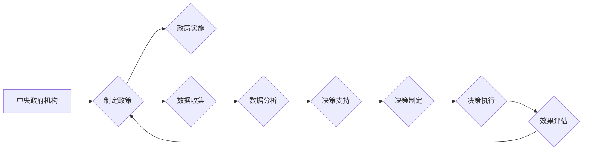
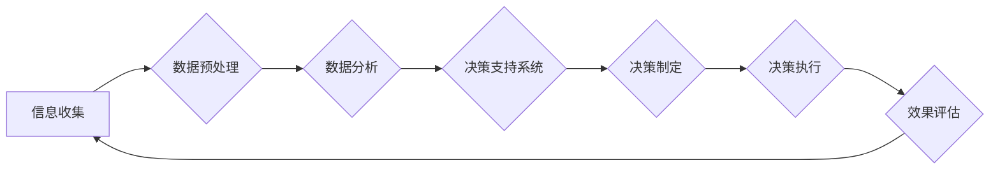

                 

# 《元宇宙中的虚拟政府：全球治理的新模式》

> **关键词：**元宇宙，虚拟政府，全球治理，技术，模式，创新

> **摘要：**随着科技的飞速发展，元宇宙成为了一个充满无限可能的新领域。本文将探讨元宇宙中的虚拟政府这一概念，分析其全球治理的新模式，以及虚拟政府在提升治理效率、推动国际合作等方面的优势。文章将从虚拟政府的概述、核心概念与架构、算法原理、数学模型、建设实施、项目实战以及未来展望等方面进行深入探讨，旨在为读者提供一个全面的技术解读。

---

## 第1章：元宇宙与虚拟政府的概述

### 1.1 元宇宙的兴起与发展

#### 1.1.1 元宇宙的定义与特点

元宇宙（Metaverse）是构建在现实世界之上，通过虚拟现实（VR）、增强现实（AR）、区块链、人工智能（AI）等技术实现的虚拟空间。它不仅是一个虚拟世界，更是一个集社交、工作、娱乐、教育等多种功能于一体的综合平台。元宇宙的特点包括：

- **沉浸式体验**：通过VR和AR技术，用户能够沉浸在元宇宙中，感受到高度真实的虚拟环境。
- **互联互通**：元宇宙中的各个虚拟世界可以通过区块链技术实现互联互通，形成一个全球性的网络。
- **多元化功能**：元宇宙涵盖了社交、经济、文化等多个领域，为用户提供多样化的体验。
- **去中心化**：元宇宙的去中心化特性使其能够在不受传统中心化管理模式限制的情况下，实现更加自由和开放的治理模式。

#### 1.1.2 元宇宙的兴起背景

元宇宙的兴起背景可以从以下几个方面进行阐述：

- **技术进步**：随着5G、云计算、大数据等技术的快速发展，为元宇宙的实现提供了强大的技术支持。
- **市场需求**：人们对于虚拟现实、社交互动等需求日益增长，推动了元宇宙的快速发展。
- **商业模式创新**：元宇宙为商业模式创新提供了新的机会，如虚拟商品交易、虚拟劳动力市场等。

#### 1.1.3 元宇宙的未来趋势

元宇宙的未来趋势可以从以下几个方面进行展望：

- **技术应用深化**：随着技术的进一步发展，元宇宙将实现更加真实、高效的沉浸式体验。
- **生态体系完善**：元宇宙的生态体系将逐渐完善，包括平台、开发者、用户等多方共同参与。
- **全球影响力扩大**：元宇宙将在全球范围内产生深远的影响，改变人们的生活方式、工作方式等。

### 1.2 虚拟政府的概念与构成

#### 1.2.1 虚拟政府的定义与本质

虚拟政府（Virtual Government）是指利用现代信息技术，构建在虚拟空间中的政府机构。它不仅承担传统的行政职能，还具备以下特点：

- **虚拟化**：虚拟政府存在于虚拟空间中，通过计算机和网络进行运作。
- **数字化**：虚拟政府的运作完全依赖于数字技术，如大数据、人工智能、区块链等。
- **智能化**：虚拟政府具备智能决策、智能执行等能力，能够高效地处理政务事项。

#### 1.2.2 虚拟政府的组成部分

虚拟政府的组成部分可以从以下几个方面进行阐述：

- **政府部门**：虚拟政府中的各个部门，如教育部、卫生部、财政部等，负责具体的行政事务。
- **公共服务平台**：为公众提供在线政务服务，如网上办事、在线咨询等。
- **数据管理系统**：负责收集、存储、分析和利用各类政务数据，为决策提供支持。
- **决策支持系统**：利用人工智能、大数据等技术，辅助政府进行科学决策。

#### 1.2.3 虚拟政府的运作模式

虚拟政府的运作模式可以从以下几个方面进行探讨：

- **在线办公**：政府工作人员通过计算机和网络进行远程办公，提高工作效率。
- **在线服务**：公众可以通过虚拟政府平台办理各类政务事项，实现一站式服务。
- **智能决策**：利用大数据、人工智能等技术，政府能够更加科学、精准地做出决策。
- **社会监督**：公众可以通过虚拟政府平台对政府工作进行监督，提高政府透明度。

### 1.3 元宇宙与虚拟政府的联系

#### 1.3.1 虚拟政府与元宇宙的相互作用

虚拟政府与元宇宙之间的相互作用可以从以下几个方面进行阐述：

- **平台依托**：虚拟政府依托元宇宙平台，实现在线办公、在线服务等功能。
- **数据共享**：虚拟政府与元宇宙中的各个虚拟世界进行数据共享，提高治理效率。
- **技术创新**：元宇宙为虚拟政府提供了新的技术支持，如区块链、人工智能等。

#### 1.3.2 虚拟政府在全球治理中的作用

虚拟政府在全球治理中的作用可以从以下几个方面进行探讨：

- **协同治理**：虚拟政府能够与各国政府实现协同治理，共同应对全球性问题。
- **信息共享**：虚拟政府平台为各国政府提供信息共享渠道，提高治理效率。
- **国际合作**：虚拟政府能够促进国际间的合作，共同推动全球治理体系的完善。

#### 1.3.3 虚拟政府在提升治理效率方面的优势

虚拟政府在提升治理效率方面的优势可以从以下几个方面进行阐述：

- **高效决策**：利用大数据、人工智能等技术，虚拟政府能够快速做出科学决策。
- **精准服务**：通过数据分析，虚拟政府能够为公众提供个性化的服务。
- **透明监督**：虚拟政府平台公开政务信息，提高政府工作的透明度和公信力。
- **协同治理**：虚拟政府能够实现跨部门、跨区域的协同治理，提高治理效率。

---

接下来，我们将进一步探讨虚拟政府的核心概念与架构，分析其设计原则和运行机制，以及使用Mermaid流程图展示虚拟政府的治理流程和决策过程。

## 第2章：虚拟政府的核心概念与架构

### 2.1 虚拟政府的核心概念

#### 2.1.1 虚拟政府的理念与原则

虚拟政府的理念是利用现代信息技术，构建一个高效、透明、协同的政府治理体系。其核心原则包括：

- **以人为本**：以公众需求为导向，提供个性化的公共服务。
- **数字化**：利用数字化技术，实现政务事项的在线办理和智能处理。
- **智能化**：利用人工智能等技术，提高决策的科学性和执行的效率。
- **协同治理**：实现跨部门、跨区域的协同治理，共同应对复杂问题。
- **开放共享**：构建开放共享的政府数据平台，促进政府与公众、企业之间的信息共享和协同创新。

#### 2.1.2 虚拟政府的治理目标

虚拟政府的治理目标主要包括以下几个方面：

- **提升政府效能**：通过数字化、智能化技术，提高政府工作效率和服务质量。
- **优化公共服务**：为公众提供便捷、高效、个性化的公共服务。
- **增强政府透明度**：通过数据公开和在线监督，提高政府工作的透明度和公信力。
- **促进社会协同**：实现政府与社会各界的协同治理，共同推动社会进步。
- **保障网络安全**：构建安全可靠的虚拟政府平台，保护公众隐私和信息安全。

#### 2.1.3 虚拟政府的治理理念

虚拟政府的治理理念体现在以下几个方面：

- **服务导向**：以服务公众为核心，关注公众需求，提升政府服务体验。
- **创新驱动**：鼓励技术创新和管理创新，不断优化政府治理模式。
- **合作共赢**：推动政府与社会各界的合作，实现互利共赢。
- **包容性发展**：关注弱势群体，保障公平正义，促进社会和谐。
- **可持续发展**：注重环境保护和资源利用，实现经济、社会和环境的可持续发展。

### 2.2 虚拟政府的架构设计

#### 2.2.1 虚拟政府的组织结构

虚拟政府的组织结构可以从以下几个方面进行设计：

- **中央政府机构**：包括国务院、各部委等，负责制定政策、统筹协调全国工作。
- **地方政府机构**：包括省、市、县等各级政府，负责实施中央政策、管理本地事务。
- **公共服务部门**：包括教育、医疗、社保等公共服务部门，负责为公众提供基本公共服务。
- **决策支持部门**：包括数据分析、政策研究等决策支持部门，负责为政府决策提供数据支持和智力支持。

#### 2.2.2 虚拟政府的运行机制

虚拟政府的运行机制可以从以下几个方面进行设计：

- **在线办公**：政府工作人员通过虚拟办公平台，实现远程办公、协同工作。
- **在线服务**：公众通过虚拟政府平台，实现在线咨询、在线办事、在线监督等。
- **智能决策**：利用大数据、人工智能等技术，政府能够快速、科学地做出决策。
- **社会监督**：公众通过虚拟政府平台，对政府工作进行监督、评价和反馈。

#### 2.2.3 虚拟政府的技术支撑

虚拟政府的技术支撑是确保其高效运行的关键。其主要技术包括：

- **云计算**：提供虚拟化基础设施，实现海量数据的存储、处理和传输。
- **大数据**：通过数据采集、存储、分析和挖掘，为政府决策提供数据支持。
- **人工智能**：利用机器学习、自然语言处理等技术，实现智能决策和智能服务。
- **区块链**：提供去中心化、安全可信的数据存储和交易机制，保障信息安全。
- **物联网**：实现物与物的互联互通，为智慧城市、智能治理提供技术支持。

### 2.3 虚拟政府的Mermaid流程图

为了更直观地展示虚拟政府的治理流程和决策过程，我们可以使用Mermaid流程图进行描述。以下是虚拟政府治理流程的Mermaid表示：



以下是虚拟政府决策过程的Mermaid表示：



通过以上流程图，我们可以清晰地看到虚拟政府的治理流程和决策过程，为读者提供直观的技术解读。

接下来，我们将进一步探讨虚拟政府的核心算法原理，分析决策算法、调度算法和优化算法的基本原理，并使用伪代码进行详细阐述。

## 第3章：虚拟政府的核心算法原理

### 3.1 虚拟政府的决策算法

#### 3.1.1 决策算法的基本原理

决策算法是虚拟政府的核心算法之一，用于辅助政府进行科学决策。其基本原理可以概括为：

- **问题建模**：将决策问题抽象为数学模型，明确决策目标、决策变量和约束条件。
- **目标函数**：根据决策目标，定义目标函数，用于评价决策方案的质量。
- **约束条件**：根据实际情况，定义约束条件，限制决策变量的取值范围。
- **求解方法**：选择合适的求解方法，求解最优决策方案。

#### 3.1.2 常见的决策算法

常见的决策算法包括：

- **线性规划（Linear Programming，LP）**：用于求解线性目标函数在线性约束条件下的最优解。
- **整数规划（Integer Programming，IP）**：用于求解整数目标函数在整数约束条件下的最优解。
- **动态规划（Dynamic Programming，DP）**：用于求解多阶段决策问题的最优解。
- **遗传算法（Genetic Algorithm，GA）**：基于遗传机制进行全局搜索的优化算法。
- **神经网络（Neural Network，NN）**：通过模拟生物神经网络进行学习和预测的算法。

#### 3.1.3 决策算法的伪代码实现

以下是一个简单的线性规划算法的伪代码实现：

```plaintext
输入：目标函数系数 a，约束条件系数 b，决策变量 x 的下界和上界
输出：最优解 x*

初始化：x = [x1, x2, ..., xn]（n 维决策变量）
目标函数：maximize f(x) = a1*x1 + a2*x2 + ... + an*xn
约束条件：g1*x1 + g2*x2 + ... + gn*xn ≤ b

1. while（目标函数 f(x) 未达到最优值）{
2.     更新 x，使得目标函数 f(x) 最大化
3.     检查约束条件是否满足
4.     如果不满足，则调整 x 的取值，使其满足约束条件
5. }

输出：最优解 x*
```

### 3.2 虚拟政府的调度算法

#### 3.2.1 调度算法的基本原理

调度算法用于对虚拟政府中的资源进行分配和调度，以实现最优的运行效率。其基本原理可以概括为：

- **资源需求**：明确各个任务对资源的具体需求，如计算资源、存储资源、网络资源等。
- **资源分配**：根据任务的需求，分配相应的资源，确保任务能够正常运行。
- **调度策略**：根据资源分配策略，对任务进行调度，确保资源得到充分利用。

#### 3.2.2 常见的调度算法

常见的调度算法包括：

- **最短作业优先（Shortest Job First，SJF）**：根据任务执行时间最短的原则进行调度。
- **优先级调度（Priority Scheduling）**：根据任务优先级进行调度，优先级高的任务先执行。
- **轮转调度（Round Robin，RR）**：将时间片分配给各个任务，按照顺序轮流执行。
- **流量调度（Traffic Scheduling）**：根据网络流量进行调度，确保网络资源得到充分利用。
- **负载均衡（Load Balancing）**：将任务分配到各个节点上，确保系统负载均衡。

#### 3.2.3 调度算法的伪代码实现

以下是一个简单的轮转调度算法的伪代码实现：

```plaintext
输入：任务列表 T，时间片 quantum
输出：调度结果 schedule

初始化：schedule = []

1. while（任务列表 T 非空）{
2.     for（每个任务 t ∈ T）{
3.         执行任务 t，时间片 quantum
4.         if（任务 t 完成）{
5.             从任务列表 T 中删除任务 t
6.             添加任务 t 到调度结果 schedule
7.         }
8.     }
9. }

输出：调度结果 schedule
```

### 3.3 虚拟政府的优化算法

#### 3.3.1 优化算法的基本原理

优化算法用于对虚拟政府中的资源分配和任务调度进行优化，以实现最佳的性能和资源利用。其基本原理可以概括为：

- **目标函数**：定义优化目标函数，衡量资源分配和任务调度的性能。
- **约束条件**：定义优化问题的约束条件，如资源限制、任务执行时间等。
- **搜索策略**：选择合适的搜索策略，寻找最优解。

#### 3.3.2 常见的优化算法

常见的优化算法包括：

- **贪心算法（Greedy Algorithm）**：每次选择当前最优解，期望得到全局最优解。
- **遗传算法（Genetic Algorithm，GA）**：基于遗传机制进行全局搜索的优化算法。
- **粒子群优化（Particle Swarm Optimization，PSO）**：基于群体智能的优化算法。
- **模拟退火（Simulated Annealing，SA）**：基于概率搜索的优化算法。
- **蚁群算法（Ant Colony Optimization，ACO）**：基于蚂蚁觅食行为的优化算法。

#### 3.3.3 优化算法的伪代码实现

以下是一个简单的贪心算法的伪代码实现：

```plaintext
输入：任务列表 T，资源限制 R
输出：优化解 solution

初始化：solution = []

1. while（任务列表 T 非空）{
2.     for（每个任务 t ∈ T）{
3.         if（资源限制 R 能够满足任务 t 的需求）{
4.             执行任务 t
5.             添加任务 t 到优化解 solution
6.             更新资源限制 R，减去任务 t 的资源需求
7.         }
8.     }
9. }

输出：优化解 solution
```

通过以上算法的讲解和伪代码实现，我们可以了解到虚拟政府中的决策算法、调度算法和优化算法的基本原理和实现方法，为虚拟政府的构建和运行提供了重要的技术支持。

接下来，我们将探讨虚拟政府的数学模型与数学公式，分析其基本概念、常见模型和应用。

## 第4章：虚拟政府的数学模型与数学公式

### 4.1 虚拟政府的数学模型

#### 4.1.1 数学模型的基本概念

数学模型是利用数学语言描述和模拟现实世界中的问题，通过建立数学模型，可以更好地理解和解决实际问题。在虚拟政府中，数学模型用于描述政府的运作规律、决策过程和优化问题。

- **决策模型**：用于描述政府决策过程，包括决策变量、目标函数和约束条件。
- **优化模型**：用于描述资源分配、任务调度等优化问题，包括目标函数和约束条件。
- **仿真模型**：用于模拟政府运作过程，包括各种变量和参数。

#### 4.1.2 常见的数学模型

常见的数学模型包括：

- **线性规划模型**：用于求解线性目标函数在线性约束条件下的最优解。
- **整数规划模型**：用于求解整数目标函数在整数约束条件下的最优解。
- **动态规划模型**：用于求解多阶段决策问题的最优解。
- **排队论模型**：用于描述和分析排队系统的运行规律。
- **博弈论模型**：用于分析政府与其他利益相关者之间的互动和决策。

#### 4.1.3 数学模型的应用

数学模型在虚拟政府中的应用包括：

- **决策支持**：利用数学模型进行科学决策，提高决策的准确性和效率。
- **资源优化**：利用数学模型进行资源分配和任务调度，提高资源利用效率。
- **仿真分析**：利用数学模型进行仿真分析，评估政府运作的效果和性能。

### 4.2 虚拟政府的数学公式

#### 4.2.1 数学公式的基本概念

数学公式是数学模型的重要组成部分，用于表示数学关系和运算规则。在虚拟政府中，数学公式用于描述各种变量之间的关系和计算过程。

- **目标函数**：用于衡量决策方案的质量和效果，如最大化收益、最小化成本等。
- **约束条件**：用于限制决策变量的取值范围，保证决策方案的可行性。
- **优化公式**：用于求解优化问题的最优解，如线性规划、整数规划等。

#### 4.2.2 常见的数学公式

常见的数学公式包括：

- **线性规划公式**：
  $$ 
  \begin{cases}
  \text{maximize} & c^T x \\
  \text{subject to} & Ax \leq b \\
  \end{cases}
  $$
  其中，$c$ 是目标函数系数向量，$x$ 是决策变量向量，$A$ 是约束条件系数矩阵，$b$ 是约束条件常数向量。

- **整数规划公式**：
  $$ 
  \begin{cases}
  \text{maximize} & c^T x \\
  \text{subject to} & Ax \leq b \\
  x \in \mathbb{Z}^n \\
  \end{cases}
  $$
  其中，$\mathbb{Z}$ 表示整数集。

- **动态规划公式**：
  $$
  V(n) = \min_{x(n)} \{ f(n, x(n), y(n)) + V(n-1) \}
  $$
  其中，$V(n)$ 是第 $n$ 个阶段的最优值函数，$f(n, x(n), y(n))$ 是第 $n$ 个阶段的费用函数，$x(n)$ 和 $y(n)$ 是第 $n$ 个阶段的决策变量。

- **排队论公式**：
  $$
  L = \frac{\lambda}{\mu} + \frac{\lambda^2}{2\mu^2} + \cdots
  $$
  其中，$L$ 是系统平均等待时间，$\lambda$ 是到达率，$\mu$ 是服务率。

#### 4.2.3 数学公式的应用举例

以下是一个线性规划公式的应用举例：

假设虚拟政府需要分配 $100$ 万元资金用于扶贫和基础设施建设，要求扶贫项目的资金占比不低于 $40\%$，基础设施建设的资金占比不低于 $30\%$，其余资金用于其他项目。设扶贫项目的资金占比为 $x$，基础设施建设的资金占比为 $y$，其他项目的资金占比为 $z$。则可以建立以下线性规划模型：

$$
\begin{cases}
\text{maximize} & 0 \\
\text{subject to} & x + y + z = 100 \\
& x \geq 0.4 \times 100 \\
& y \geq 0.3 \times 100 \\
\end{cases}
$$

通过求解上述线性规划模型，可以得到最优的资金分配方案。

通过以上对虚拟政府数学模型和数学公式的介绍，我们可以看到数学在虚拟政府中的应用具有重要意义，为政府的决策和优化提供了有力的工具。接下来，我们将探讨虚拟政府的建设与实施，分析其建设步骤、实施策略和运行维护。

## 第5章：虚拟政府的建设与实施

### 5.1 虚拟政府的建设步骤

#### 5.1.1 建设前的准备工作

虚拟政府建设是一个复杂的系统工程，需要做好充分的准备工作。主要包括以下几个方面：

1. **需求分析**：明确虚拟政府的目标、功能、服务对象和业务流程，为后续建设提供基础。
2. **技术调研**：了解虚拟政府所需技术的现状和发展趋势，选择合适的技术框架和开发工具。
3. **团队组建**：组建专业的虚拟政府建设团队，包括项目经理、开发人员、测试人员等。
4. **资源保障**：确保虚拟政府建设所需的硬件设备、软件工具、人力资源和资金等资源。

#### 5.1.2 虚拟政府的规划设计

规划设计是虚拟政府建设的关键环节，主要包括以下几个方面：

1. **架构设计**：根据虚拟政府的功能和需求，设计合理的系统架构，包括前端架构、后端架构、数据架构等。
2. **模块划分**：将虚拟政府的业务功能划分为多个模块，明确各个模块的职责和接口。
3. **界面设计**：设计虚拟政府的用户界面，确保用户友好、直观、易操作。
4. **数据设计**：设计虚拟政府的数据模型，包括数据结构、数据存储和数据管理。

#### 5.1.3 虚拟政府的建设实施

虚拟政府的建设实施包括以下几个阶段：

1. **开发阶段**：根据规划设计，进行系统的编码和开发，实现各个模块的功能。
2. **测试阶段**：对系统进行功能测试、性能测试和安全测试，确保系统的稳定性和可靠性。
3. **部署阶段**：将系统部署到生产环境，包括硬件部署、软件部署和系统配置等。
4. **上线阶段**：系统上线运行，并进行用户培训和试运行，逐步完善系统功能。

### 5.2 虚拟政府的实施策略

#### 5.2.1 实施策略的基本原则

虚拟政府的实施策略应遵循以下基本原则：

1. **需求导向**：以用户需求为中心，确保系统的功能和服务能够满足用户需求。
2. **循序渐进**：分阶段、分步骤地进行系统建设，逐步完善和优化系统功能。
3. **安全可靠**：确保系统的安全性和可靠性，防止系统故障和数据泄露。
4. **协同合作**：加强政府内部各部门之间的协同合作，共同推动虚拟政府建设。
5. **持续改进**：根据用户反馈和系统运行情况，不断优化系统功能和性能。

#### 5.2.2 实施策略的具体措施

虚拟政府的实施策略包括以下几个方面：

1. **需求管理**：建立需求管理机制，明确用户需求，确保需求能够及时、准确地转化为系统功能。
2. **进度管理**：制定详细的进度计划，明确各阶段的目标和任务，确保项目按计划推进。
3. **质量管理**：建立质量管理机制，对系统开发、测试、部署等各个环节进行质量监控和控制。
4. **风险管理**：识别和分析潜在风险，制定风险管理策略和应对措施，确保项目的顺利进行。
5. **沟通协调**：加强政府内部各部门之间的沟通和协调，确保项目资源的有效配置和协同合作。

#### 5.2.3 实施策略的评估与优化

虚拟政府的实施策略需要定期进行评估和优化，主要包括以下几个方面：

1. **效果评估**：对虚拟政府的建设效果进行评估，包括系统功能、性能、用户满意度等。
2. **问题分析**：分析虚拟政府在建设和运行过程中存在的问题，包括技术问题、管理问题等。
3. **优化方案**：根据评估结果和问题分析，制定优化方案，改进系统功能和性能。
4. **持续改进**：将优化方案应用到后续建设和运行中，持续提升虚拟政府的整体水平。

### 5.3 虚拟政府的运行与维护

#### 5.3.1 虚拟政府的运行机制

虚拟政府的运行机制包括以下几个方面：

1. **在线办公**：政府工作人员通过虚拟政府平台进行远程办公，实现协同工作。
2. **在线服务**：公众通过虚拟政府平台办理各类政务事项，实现一站式服务。
3. **智能决策**：利用大数据、人工智能等技术，实现智能决策和智能服务。
4. **社会监督**：公众通过虚拟政府平台对政府工作进行监督和评价，提高政府透明度。

#### 5.3.2 虚拟政府的维护策略

虚拟政府的维护策略包括以下几个方面：

1. **系统监控**：实时监控系统的运行状态，及时发现和解决系统故障。
2. **数据备份**：定期备份系统数据，确保数据的安全性和完整性。
3. **安全防护**：加强系统的安全防护，防止网络攻击和数据泄露。
4. **用户支持**：提供用户技术支持和咨询服务，确保用户能够顺利使用系统。

#### 5.3.3 虚拟政府的风险评估与管理

虚拟政府的风险评估与管理包括以下几个方面：

1. **风险识别**：识别虚拟政府建设和运行过程中可能出现的风险，包括技术风险、管理风险、安全风险等。
2. **风险评估**：对识别出的风险进行评估，确定风险的重要性和紧急程度。
3. **风险应对**：制定风险应对策略和措施，降低风险的发生概率和影响程度。
4. **持续监控**：对虚拟政府运行过程中的风险进行持续监控，及时调整风险应对措施。

通过以上对虚拟政府建设与实施的详细介绍，我们可以看到虚拟政府建设是一个复杂而系统的过程，需要做好充分的准备工作、进行科学的规划设计、实施有效的策略和进行持续的维护与管理。只有通过全面的建设和实施，才能实现虚拟政府的预期目标，为政府治理提供有力支持。

### 5.4 虚拟政府的技术架构设计

#### 5.4.1 技术架构设计的原则

虚拟政府的技术架构设计应遵循以下原则：

1. **高可用性**：确保系统的高可用性，减少系统故障对政府工作的影响。
2. **高扩展性**：设计具有高扩展性的技术架构，以应对未来业务需求的增长。
3. **高性能**：优化系统性能，提高数据处理和响应速度。
4. **安全性**：确保系统的安全防护，防止数据泄露和网络攻击。
5. **易维护性**：设计易于维护和升级的技术架构，降低运维成本。

#### 5.4.2 技术架构设计的关键要素

虚拟政府的技术架构设计包括以下几个关键要素：

1. **前端架构**：设计用户友好的前端界面，提供良好的用户体验。
2. **后端架构**：设计高效的后端服务，实现业务逻辑的处理和数据存储。
3. **数据架构**：设计合理的数据模型，确保数据的一致性、完整性和安全性。
4. **安全架构**：设计完善的安全架构，包括身份认证、访问控制、数据加密等。
5. **运维架构**：设计高效的运维架构，实现系统的监控、维护和升级。

#### 5.4.3 技术架构的设计方案

虚拟政府的技术架构设计方案如下：

1. **前端架构**：
   - 使用现代化的前端技术，如React、Vue等，实现动态的、响应式的用户界面。
   - 使用Websocket实现实时通信，提升用户体验。

2. **后端架构**：
   - 使用微服务架构，将业务功能划分为多个独立的服务，提高系统的扩展性和可维护性。
   - 使用Spring Boot等框架，实现业务逻辑的处理和数据存储。

3. **数据架构**：
   - 使用关系型数据库和NoSQL数据库相结合的方式，满足不同类型数据的需求。
   - 使用大数据技术，如Hadoop、Spark等，进行海量数据的处理和分析。

4. **安全架构**：
   - 实施身份认证和访问控制，确保系统资源的访问权限。
   - 使用加密技术，保护数据传输和存储的安全性。

5. **运维架构**：
   - 使用容器化技术，如Docker和Kubernetes，实现系统的自动化部署和运维。
   - 使用监控和告警系统，实时监控系统的运行状态和性能。

通过以上技术架构的设计方案，虚拟政府可以实现高效、安全、可靠的运行，为政府治理提供有力的技术支持。

### 5.5 虚拟政府的系统部署与实施

#### 5.5.1 系统部署前的准备

系统部署前需要做好以下准备工作：

1. **硬件准备**：准备足够的硬件设备，包括服务器、存储设备、网络设备等，确保系统运行所需的硬件资源。
2. **软件准备**：安装和配置操作系统、数据库、Web服务器等软件环境，确保系统运行所需的软件支持。
3. **网络准备**：配置网络环境，包括内部网络和外部网络，确保系统与其他系统的互联互通。
4. **安全准备**：制定和实施安全策略，包括防火墙、入侵检测、数据加密等，确保系统的安全性。

#### 5.5.2 系统部署的步骤

系统部署主要包括以下几个步骤：

1. **安装操作系统**：在服务器上安装操作系统，配置网络和基本服务。
2. **安装数据库**：安装和配置数据库系统，如MySQL、Oracle等，创建数据库和用户。
3. **安装Web服务器**：安装和配置Web服务器，如Apache、Nginx等，配置虚拟主机和域名。
4. **安装应用服务**：安装和配置应用服务器，如Tomcat、Jboss等，部署应用程序和Web应用。
5. **配置安全策略**：配置防火墙、入侵检测、数据加密等安全措施，确保系统的安全性。

#### 5.5.3 系统实施的过程

系统实施主要包括以下几个过程：

1. **需求分析**：明确系统的功能需求和性能要求，制定详细的系统设计方案。
2. **开发阶段**：根据设计方案，进行系统的开发和编码，实现各个模块的功能。
3. **测试阶段**：对系统进行功能测试、性能测试和安全测试，确保系统的稳定性和可靠性。
4. **部署阶段**：将系统部署到生产环境，进行系统配置和初始化。
5. **上线阶段**：系统上线运行，进行用户培训和试运行，逐步完善系统功能。

#### 5.5.4 部署与实施过程中可能遇到的问题及解决方案

在部署与实施过程中可能遇到的问题及解决方案如下：

1. **硬件故障**：解决方案：备用硬件设备、定期维护和升级硬件。
2. **软件错误**：解决方案：详细记录和调试软件错误、及时更新和修复软件。
3. **网络问题**：解决方案：检查网络配置、使用网络监控工具检测网络状态、升级网络设备。
4. **安全漏洞**：解决方案：定期进行安全扫描和漏洞检测、及时安装安全补丁和更新安全策略。
5. **性能瓶颈**：解决方案：优化数据库查询、缓存技术、负载均衡和分布式架构。

通过以上对虚拟政府系统部署与实施的详细介绍，我们可以看到虚拟政府的部署与实施是一个复杂而系统的过程，需要充分的准备、科学的部署和有效的实施。只有通过合理的部署与实施，才能确保虚拟政府的高效运行和稳定运行。

### 5.6 虚拟政府的运行维护与持续改进

#### 5.6.1 运行维护的策略

虚拟政府的运行维护策略主要包括以下几个方面：

1. **定期检查**：定期对系统进行全面的检查和维护，确保系统的正常运行。
2. **故障管理**：建立故障响应机制，及时处理系统故障，降低故障对政府工作的影响。
3. **性能优化**：对系统进行性能优化，提高系统的响应速度和处理能力。
4. **安全监控**：实时监控系统的安全状态，防止网络攻击和数据泄露。
5. **用户支持**：提供用户技术支持和咨询服务，确保用户能够顺利使用系统。

#### 5.6.2 持续改进的方法

虚拟政府的持续改进主要包括以下几个方面：

1. **需求收集**：定期收集用户反馈和需求，了解用户的需求变化和系统改进的方向。
2. **功能优化**：根据用户需求和系统运行情况，对系统功能进行优化和改进。
3. **性能提升**：通过技术改进和优化，提升系统的性能和稳定性。
4. **安全加固**：定期进行安全检查和评估，加强系统的安全防护能力。
5. **用户体验**：关注用户的使用体验，优化界面设计和交互流程。

#### 5.6.3 持续改进的案例

以下是一个虚拟政府持续改进的案例：

1. **需求收集**：通过用户调研和反馈，发现用户在使用系统中遇到的问题和需求，如系统响应速度慢、某些功能不够完善等。
2. **功能优化**：针对用户反馈的问题，对系统功能进行优化，如优化数据库查询、增加新的功能模块等。
3. **性能提升**：通过技术改进，提升系统的性能，如使用缓存技术、分布式架构等。
4. **安全加固**：加强系统的安全防护，如增加防火墙规则、定期安全扫描等。
5. **用户体验**：优化界面设计，提高系统的易用性和用户体验，如增加导航栏、改进表单提交等。

通过以上案例，我们可以看到虚拟政府通过持续改进，不断提升系统的功能、性能和用户体验，为政府治理提供了有力支持。

### 5.7 虚拟政府的风险评估与应对措施

#### 5.7.1 风险评估的重要性

虚拟政府作为现代政府治理的重要工具，其稳定运行对政府工作具有重要意义。因此，对虚拟政府进行风险评估至关重要。风险评估可以识别潜在的风险，评估其影响程度和发生的可能性，为制定应对措施提供依据。

#### 5.7.2 常见的风险类型

虚拟政府常见风险类型包括：

1. **技术风险**：包括系统架构不合理、技术更新滞后、系统兼容性问题等。
2. **数据风险**：包括数据泄露、数据完整性问题、数据存储故障等。
3. **安全风险**：包括网络攻击、系统漏洞、用户隐私泄露等。
4. **操作风险**：包括用户操作失误、系统维护不当、业务流程不合理等。
5. **法律风险**：包括政策法规变化、合规性问题、法律纠纷等。

#### 5.7.3 应对措施

针对上述风险类型，虚拟政府应采取以下应对措施：

1. **技术风险**：
   - 定期进行系统升级和优化，确保技术架构的合理性和先进性。
   - 采用模块化开发，提高系统的可维护性和扩展性。
   - 建立技术支持团队，及时解决技术问题和用户反馈。

2. **数据风险**：
   - 实施数据备份和恢复策略，确保数据的安全性和完整性。
   - 使用数据加密技术，保护敏感数据的安全。
   - 定期进行数据安全审计，发现和纠正数据安全风险。

3. **安全风险**：
   - 建立完善的安全防护体系，包括防火墙、入侵检测、安全审计等。
   - 定期进行安全培训和演练，提高员工的安全意识和应对能力。
   - 加强用户身份认证和访问控制，防止未授权访问。

4. **操作风险**：
   - 建立操作规范和流程，确保用户按照规范进行操作。
   - 提供用户操作指南和培训，提高用户对系统的熟悉度。
   - 定期进行操作风险评估和优化，降低操作风险。

5. **法律风险**：
   - 关注政策法规的变化，确保虚拟政府符合相关法律法规的要求。
   - 建立法律顾问团队，提供法律咨询和风险评估。
   - 加强与监管机构的沟通和合作，确保虚拟政府的合规性。

通过以上应对措施，虚拟政府可以降低风险的发生概率和影响程度，确保系统的稳定运行和政府工作的顺利进行。

综上所述，虚拟政府的建设与实施、运行维护与持续改进以及风险评估与应对措施是确保虚拟政府高效运行和稳定运行的关键。只有通过科学的建设、有效的维护和严格的风险管理，虚拟政府才能充分发挥其在政府治理中的作用。

## 第6章：虚拟政府的项目实战

### 6.1 虚拟政府的开发环境搭建

#### 6.1.1 开发环境的搭建步骤

搭建虚拟政府的开发环境是项目实施的第一步，以下是搭建步骤：

1. **硬件环境搭建**：
   - 硬件配置：选择高性能的服务器、存储设备和网络设备。
   - 网络配置：搭建内部网络和外部网络，确保系统与其他系统的互联互通。

2. **软件环境搭建**：
   - 操作系统：选择Linux或Windows服务器操作系统，如CentOS、Ubuntu等。
   - 数据库：安装和配置数据库系统，如MySQL、Oracle等。
   - Web服务器：安装和配置Web服务器，如Apache、Nginx等。
   - 应用服务器：安装和配置应用服务器，如Tomcat、Jboss等。

3. **开发工具**：
   - 集成开发环境（IDE）：选择如Eclipse、IntelliJ IDEA等。
   - 版本控制工具：选择如Git、SVN等。

4. **开发框架**：
   - 前端框架：选择如React、Vue等。
   - 后端框架：选择如Spring Boot、Django等。

#### 6.1.2 开发环境的配置与优化

开发环境的配置与优化是确保项目顺利推进的关键，以下是配置与优化步骤：

1. **系统配置**：
   - 配置防火墙和网络安全组策略，确保系统的安全性。
   - 配置时间同步服务，确保系统时间的一致性。

2. **数据库配置**：
   - 配置数据库连接池，提高数据库访问效率。
   - 配置数据库备份和恢复策略，确保数据的安全性和完整性。

3. **Web服务器配置**：
   - 配置Web服务器性能参数，如连接数、线程数等。
   - 配置负载均衡，提高系统的并发处理能力。

4. **应用服务器配置**：
   - 配置应用服务器内存和线程参数，提高应用性能。
   - 配置应用服务器的日志和监控，便于问题追踪和性能优化。

5. **开发工具优化**：
   - 配置代码自动补全和提示功能，提高开发效率。
   - 配置版本控制工具，实现代码版本管理和协作开发。

#### 6.1.3 开发环境的调试与测试

开发环境的调试与测试是确保系统稳定运行的重要环节，以下是调试与测试步骤：

1. **系统调试**：
   - 使用调试工具（如GDB、Visual Studio Debugger等）定位和解决系统错误。
   - 进行系统性能测试，评估系统的响应速度和稳定性。

2. **数据库调试**：
   - 使用数据库管理工具（如MySQL Workbench、Oracle SQL Developer等）进行数据库操作和调试。
   - 进行数据库性能测试，优化查询语句和索引。

3. **Web服务器调试**：
   - 使用Web服务器日志分析工具（如Apache Log Analyzer、Nginx Access Log等）分析服务器日志。
   - 进行Web服务器性能测试，优化配置和参数。

4. **应用服务器调试**：
   - 使用应用服务器管理工具（如Tomcat Manager、Jboss Management Console等）监控和管理应用服务器。
   - 进行应用服务器性能测试，优化内存和线程配置。

5. **测试环境**：
   - 搭建测试环境，模拟实际运行环境进行系统测试。
   - 进行功能测试、性能测试和安全测试，确保系统的稳定性和可靠性。

通过以上对虚拟政府开发环境搭建、配置与优化、调试与测试的详细介绍，我们可以看到开发环境的搭建和优化是确保项目顺利推进的关键步骤。只有搭建一个稳定、高效、安全的开发环境，才能为虚拟政府的建设提供有力保障。

### 6.2 虚拟政府的源代码实现

#### 6.2.1 源代码的实现思路

虚拟政府的源代码实现是一个复杂的过程，需要明确实现思路和结构。以下是实现思路：

1. **模块化开发**：将系统功能划分为多个模块，每个模块实现特定的功能。
2. **分层架构**：采用分层架构，包括表示层、业务逻辑层、数据访问层等，确保系统的高内聚和低耦合。
3. **前后端分离**：前端实现用户界面和交互，后端实现业务逻辑和数据访问，通过API接口进行数据交互。
4. **代码规范**：遵循代码规范和编程习惯，确保代码的可读性和可维护性。

#### 6.2.2 源代码的结构与模块划分

虚拟政府的源代码结构通常包括以下几个模块：

1. **前端模块**：
   - 页面组件：实现用户界面和交互逻辑。
   - API服务：实现与后端的数据交互。

2. **后端模块**：
   - 业务逻辑层：实现系统的核心业务逻辑。
   - 数据访问层：实现与数据库的交互操作。
   - 服务层：实现系统的公共服务和通用功能。

3. **数据库模块**：
   - 数据库设计：设计数据库表结构和关系。
   - 数据库操作：实现数据库的增删改查操作。

#### 6.2.3 源代码的实现细节与优化

源代码的实现细节和优化是确保系统性能和可维护性的关键。以下是实现细节和优化：

1. **前端实现细节**：
   - 使用响应式设计，确保界面在不同设备和屏幕尺寸上都能良好显示。
   - 使用状态管理库（如Redux、Vuex等），实现复杂的状态管理。
   - 使用前端框架（如React、Vue等）提供的组件化开发，提高代码复用性和可维护性。

2. **后端实现细节**：
   - 使用框架（如Spring Boot、Django等）进行快速开发，提高开发效率。
   - 使用缓存（如Redis、Memcached等）减少数据库访问，提高系统性能。
   - 使用异步处理（如异步IO、消息队列等），提高系统的并发处理能力。

3. **数据库优化**：
   - 使用索引优化查询性能。
   - 使用数据库连接池管理，提高数据库连接的利用率。
   - 使用分布式数据库架构，实现数据的水平扩展。

4. **代码优化**：
   - 避免使用全局变量，减少变量作用域。
   - 优化循环和递归算法，提高代码执行效率。
   - 使用代码注释和文档，提高代码的可读性和可维护性。

#### 6.2.4 代码优化与改进建议

针对虚拟政府的源代码，以下是一些建议：

1. **代码复用**：通过封装和抽象，提高代码的复用性，减少重复代码。
2. **性能优化**：对关键性能瓶颈进行优化，如数据库查询、网络传输等。
3. **安全性增强**：加强输入验证和输出编码，防止常见的安全漏洞（如SQL注入、XSS攻击等）。
4. **测试覆盖**：增加单元测试和集成测试，确保代码的正确性和稳定性。
5. **持续集成**：使用持续集成工具（如Jenkins、GitLab CI等），实现自动化构建和部署。

通过以上对虚拟政府源代码实现的详细介绍，我们可以看到源代码的结构和实现细节对于系统的性能、稳定性和可维护性具有重要意义。只有通过合理的源代码结构和优化，虚拟政府才能实现高效、稳定和可靠地运行。

### 6.3 虚拟政府的代码解读与分析

#### 6.3.1 代码的解读方法

代码解读是理解虚拟政府系统工作原理和功能的关键步骤。以下是代码解读的方法：

1. **阅读文档**：首先阅读项目的文档，包括设计文档、用户手册、技术文档等，了解系统的整体架构和功能模块。
2. **查看代码结构**：分析代码的目录结构、模块划分和类关系，理解代码的组成和层次结构。
3. **阅读注释和文档**：阅读代码中的注释和文档，了解代码的功能、目的和实现方式。
4. **逐步分析**：从主程序开始，逐步分析各个模块和函数的实现过程，理解代码的逻辑和执行流程。
5. **调试和测试**：通过调试工具（如GDB、Visual Studio Debugger等）和测试工具（如JUnit、Mockito等），验证代码的正确性和性能。

#### 6.3.2 代码的运行流程分析

以下是一个虚拟政府系统的运行流程分析：

1. **用户请求**：用户通过前端界面提交请求，如登录、查询信息、办理业务等。
2. **前端处理**：前端代码接收用户请求，进行数据验证和预处理，将请求发送到后端。
3. **后端处理**：后端代码接收请求，进行身份验证、权限检查等安全操作，调用业务逻辑处理函数，处理用户请求。
4. **数据交互**：后端代码与数据库进行交互，查询或更新数据，将处理结果返回给前端。
5. **前端渲染**：前端代码接收到后端返回的数据，进行数据处理和渲染，将结果展示给用户。

#### 6.3.3 代码的优化与改进建议

根据代码解读和运行流程分析，以下是一些建议：

1. **性能优化**：
   - 使用缓存技术（如Redis、Memcached等），减少数据库查询次数。
   - 优化数据库查询语句，使用索引、联合查询等提高查询效率。
   - 使用异步处理和消息队列，提高系统的并发处理能力。

2. **安全性增强**：
   - 加强输入验证和输出编码，防止SQL注入、XSS攻击等常见安全漏洞。
   - 使用安全框架（如Spring Security、Apache Shiro等），实现权限管理和安全控制。

3. **代码复用**：
   - 优化代码结构，减少重复代码，提高代码复用性。
   - 使用设计模式（如单例模式、工厂模式等），提高代码的可维护性和可扩展性。

4. **测试覆盖**：
   - 增加单元测试和集成测试，确保代码的正确性和稳定性。
   - 使用测试工具（如JUnit、Mockito等），实现自动化测试和持续集成。

5. **代码规范**：
   - 遵循代码规范和编程习惯，提高代码的可读性和可维护性。
   - 使用代码格式化工具（如Prettier、StyleCop等），统一代码风格。

通过以上对虚拟政府代码解读与分析和优化建议的详细介绍，我们可以看到代码解读和分析是理解系统工作原理和功能的重要步骤，而代码优化和改进则是提升系统性能和稳定性的关键。只有通过不断解读、分析和优化，虚拟政府系统才能实现高效、稳定和可靠地运行。

## 第7章：虚拟政府的未来展望与发展趋势

### 7.1 虚拟政府的挑战与机遇

#### 7.1.1 虚拟政府面临的挑战

虚拟政府在未来发展中将面临一系列挑战：

1. **技术成熟度**：虚拟政府依赖于新兴技术，如人工智能、区块链等，这些技术的成熟度和稳定性尚需进一步提升。
2. **数据安全**：虚拟政府涉及大量敏感数据的处理和存储，数据安全成为重要挑战，需要确保数据不被泄露和篡改。
3. **隐私保护**：虚拟政府需要平衡公共服务和隐私保护，确保用户隐私不被滥用。
4. **法律和法规**：虚拟政府的发展需要适应新的法律和法规，如数据保护法、网络安全法等。
5. **用户接受度**：虚拟政府需要提高用户的接受度和使用习惯，特别是老年人和其他技术使用不熟练的群体。

#### 7.1.2 虚拟政府面临的机会

虚拟政府同样面临着许多机遇：

1. **技术创新**：随着人工智能、区块链、物联网等技术的不断进步，虚拟政府将能够实现更高效、更智能的治理。
2. **国际合作**：虚拟政府可以促进国际间的合作，共同应对全球性问题，如气候变化、公共卫生等。
3. **社会治理**：虚拟政府有助于提高社会治理水平，实现更精准、更有效的公共管理。
4. **经济发展**：虚拟政府将带动相关产业的发展，如数字经济、虚拟现实产业等，为经济增长提供新动力。
5. **用户体验**：虚拟政府能够提供更加便捷、个性化的公共服务，提升用户体验。

#### 7.1.3 虚拟政府的应对策略

为了应对挑战和把握机遇，虚拟政府可以采取以下策略：

1. **技术创新**：持续关注和投资新技术的研究和应用，提升技术成熟度和稳定性。
2. **数据安全**：加强数据安全防护，采用加密、区块链等技术确保数据安全。
3. **隐私保护**：制定严格的隐私保护政策和措施，确保用户隐私不受侵犯。
4. **法律适应**：及时了解和适应新的法律和法规，确保虚拟政府合法合规。
5. **用户培训**：提高用户的数字素养，提供培训和指导，帮助用户适应虚拟政府的服务。

### 7.2 虚拟政府的发展趋势

#### 7.2.1 技术创新

未来，虚拟政府将在技术创新方面继续取得突破：

1. **人工智能**：人工智能将在虚拟政府中发挥更大作用，如智能决策支持、智能客服等。
2. **区块链**：区块链技术将用于数据存储和交易，提高数据的安全性和透明度。
3. **物联网**：物联网将实现更多设备和系统的互联互通，提升虚拟政府的智能化水平。
4. **5G和云计算**：5G和云计算技术的普及将提升虚拟政府的网络速度和计算能力。

#### 7.2.2 应用拓展

虚拟政府的应用将不断拓展，覆盖更多领域：

1. **公共服务**：虚拟政府将提供更多便捷的在线服务，如电子政务、在线教育、远程医疗等。
2. **社会治理**：虚拟政府将参与更多社会治理任务，如城市管理、环境保护、公共安全等。
3. **经济发展**：虚拟政府将促进数字经济的发展，如虚拟商品交易、虚拟劳动力市场等。
4. **国际合作**：虚拟政府将促进国际间的合作，共同应对全球性问题。

#### 7.2.3 国际合作

虚拟政府的发展将促进国际合作：

1. **技术交流**：各国政府将加强技术交流和合作，共同推进虚拟政府技术的发展。
2. **数据共享**：各国政府将建立数据共享机制，提高全球治理效率。
3. **政策协同**：各国政府将制定协同政策，共同应对全球性问题。
4. **标准制定**：各国政府将参与国际标准的制定，确保虚拟政府的互操作性和兼容性。

### 7.3 虚拟政府的未来展望

#### 7.3.1 发展目标

虚拟政府的未来目标包括：

1. **高效治理**：通过数字化、智能化技术，实现高效、精准的政府治理。
2. **公共服务**：提供便捷、个性化、高质量的公共服务。
3. **数据驱动**：以数据为驱动，实现科学决策和精细化管理。
4. **国际合作**：推动全球虚拟政府的合作与发展，共同应对全球挑战。

#### 7.3.2 未来愿景

虚拟政府的未来愿景是一个全球范围内的数字化、智能化治理体系：

1. **数字社会**：一个基于虚拟政府的数字化社会，实现人与人、人与物、物与物的全面连接。
2. **智慧治理**：一个以人工智能和大数据为核心的智慧治理体系，实现科学决策和高效管理。
3. **公平公正**：一个保障公平、公正、透明的治理体系，消除数字鸿沟，促进社会和谐。
4. **可持续发展**：一个注重环境保护和可持续发展的治理体系，实现经济、社会和环境的协调发展。

#### 7.3.3 虚拟政府对社会的影响

虚拟政府将对社会产生深远影响：

1. **生活方式**：虚拟政府将改变人们的生活方式，实现远程办公、在线教育、远程医疗等。
2. **工作方式**：虚拟政府将改变工作方式，促进数字化、智能化的办公模式。
3. **社会治理**：虚拟政府将提升社会治理水平，实现更高效、更精准的公共管理。
4. **经济发展**：虚拟政府将促进数字经济的发展，推动产业升级和经济增长。
5. **国际合作**：虚拟政府将加强国际合作，共同应对全球挑战，促进全球治理体系的完善。

通过以上对虚拟政府未来展望和发展趋势的探讨，我们可以看到虚拟政府将在技术创新、应用拓展、国际合作等方面取得重要突破，成为全球治理的新模式。虚拟政府的发展不仅将为政府治理带来新的机遇和挑战，也将深刻改变社会生活方式、工作方式和经济发展模式。

## 附录

### 附录 A：虚拟政府开发工具与资源

#### A.1 主流虚拟政府开发框架对比

在虚拟政府的开发过程中，选择合适的开发框架至关重要。以下是几种主流虚拟政府开发框架的对比：

1. **Spring Boot**：
   - **优点**：快速开发、内嵌Tomcat、简化配置。
   - **缺点**：对于大型项目来说，配置较为复杂。
   - **适用场景**：中小型虚拟政府项目。

2. **Django**：
   - **优点**：快速开发、内置ORM、易于维护。
   - **缺点**：性能相对较低，扩展性有限。
   - **适用场景**：中小型虚拟政府项目。

3. **Flask**：
   - **优点**：轻量级、易于扩展、灵活。
   - **缺点**：性能和安全性相对较低。
   - **适用场景**：轻量级虚拟政府项目。

4. **Ruby on Rails**：
   - **优点**：快速开发、代码简洁、社区支持强大。
   - **缺点**：性能和扩展性相对较低。
   - **适用场景**：中小型虚拟政府项目。

5. **Spring Cloud**：
   - **优点**：微服务架构、高扩展性、高可用性。
   - **缺点**：配置复杂、开发难度大。
   - **适用场景**：大型虚拟政府项目。

#### A.2 虚拟政府开发工具简介

以下是虚拟政府开发过程中常用的工具简介：

1. **Visual Studio Code**：
   - **功能**：代码编辑器，支持多种编程语言。
   - **优点**：轻量级、插件丰富、界面友好。
   - **适用场景**：前端和后端开发。

2. **IntelliJ IDEA**：
   - **功能**：集成开发环境，支持多种编程语言。
   - **优点**：功能强大、性能优异、插件丰富。
   - **适用场景**：后端开发。

3. **Git**：
   - **功能**：版本控制系统，支持分布式开发。
   - **优点**：方便协同工作、版本管理和分支管理。
   - **适用场景**：代码管理和协作开发。

4. **Maven**：
   - **功能**：项目构建工具，用于项目依赖管理和构建。
   - **优点**：易于配置、支持多种构建脚本。
   - **适用场景**：Java项目构建。

5. **Docker**：
   - **功能**：容器化技术，用于应用程序打包和部署。
   - **优点**：轻量级、可移植、易于管理。
   - **适用场景**：分布式部署和应用隔离。

#### A.3 虚拟政府开发资源推荐

以下是虚拟政府开发过程中推荐的资源：

1. **官方文档**：
   - **Spring Boot**：[Spring Boot 官方文档](https://docs.spring.io/spring-boot/docs/current/reference/html/)
   - **Django**：[Django 官方文档](https://docs.djangoproject.com/en/3.2/)
   - **Flask**：[Flask 官方文档](https://flask.palletsprojects.com/en/2.0.x/)
   - **Ruby on Rails**：[Ruby on Rails 官方文档](https://guides.rubyonrails.org/)

2. **开源社区**：
   - **GitHub**：[GitHub 开源项目](https://github.com/)
   - **Stack Overflow**：[Stack Overflow 社区问答](https://stackoverflow.com/)
   - **CSDN**：[CSDN 开源社区](https://www.csdn.net/)

3. **技术博客**：
   - **Baeldung**：[Baeldung 技术博客](https://www.baeldung.com/)
   - **Medium**：[Medium 技术博客](https://medium.com/)
   - **Java Code Geeks**：[Java Code Geeks 技术博客](https://www.javacodegeeks.com/)

4. **在线课程**：
   - **Udemy**：[Udemy 在线课程](https://www.udemy.com/)
   - **Coursera**：[Coursera 在线课程](https://www.coursera.org/)
   - **edX**：[edX 在线课程](https://www.edx.org/)

通过以上附录的内容，我们可以了解到虚拟政府开发所涉及的工具、资源和最佳实践，为虚拟政府的开发提供有益的参考。

### 附录 B：虚拟政府项目案例精选

#### B.1 项目一：虚拟政府决策支持系统

**项目背景**：某市政府为提升决策效率，决定开发一个虚拟政府决策支持系统，通过大数据和人工智能技术辅助政府决策。

**项目成果**：
1. **数据采集**：系统从各部门收集大量数据，包括经济、社会、环境等多方面数据。
2. **数据分析**：利用大数据技术和人工智能算法，对数据进行处理和分析，为决策提供数据支持。
3. **智能报告**：系统自动生成智能报告，包括决策建议、风险预警等，供政府领导参考。

**项目效果**：
- 提高了决策效率，减少了人工分析和报告编制的时间。
- 数据分析和报告质量得到了显著提升，为政府决策提供了有力支持。

#### B.2 项目二：虚拟政府公共服务平台

**项目背景**：某省政府为提升公共服务水平，决定建设一个虚拟政府公共服务平台，为公众提供一站式在线服务。

**项目成果**：
1. **在线办事**：平台提供在线办理各类政务事项的功能，如社保查询、税务申报等。
2. **在线咨询**：平台提供在线咨询服务，用户可以通过平台实时咨询政府工作人员。
3. **信息共享**：平台实现各部门数据的共享，提高信息透明度和公众满意度。

**项目效果**：
- 提升了公共服务水平，方便了公众办事。
- 提高了政府工作效率，减少了纸质文件的处理流程。
- 增强了政府与公众的互动，提升了政府公信力。

#### B.3 项目三：虚拟政府安全监管系统

**项目背景**：某市政府为提升城市安全管理水平，决定开发一个虚拟政府安全监管系统，通过物联网和大数据技术实现城市安全的智能监控。

**项目成果**：
1. **监控设备接入**：系统接入各类监控设备，包括摄像头、传感器等，实现城市安全的全方位监控。
2. **数据采集和分析**：系统实时采集监控数据，通过大数据和人工智能技术进行分析，发现潜在的安全隐患。
3. **智能报警和联动**：系统实现智能报警和联动功能，发现安全隐患时，自动触发应急预案。

**项目效果**：
- 提升了城市安全管理水平，实现了安全预警和快速响应。
- 提高了城市安全的信息化和智能化程度。
- 减少了安全事故的发生，保障了市民的生命财产安全。

通过以上三个项目案例，我们可以看到虚拟政府在不同领域的应用，不仅提升了政府治理的效率和质量，也为公众提供了更加便捷、高效的服务。随着虚拟政府技术的不断发展和成熟，未来将有更多优秀的项目涌现，为政府治理和社会发展做出更大贡献。

## 结语

本文以《元宇宙中的虚拟政府：全球治理的新模式》为标题，深入探讨了虚拟政府这一前沿概念。通过逐一分析虚拟政府的定义与概述、核心概念与架构、算法原理、数学模型、建设与实施、项目实战以及未来展望，我们系统地了解了虚拟政府在全球治理中的重要作用和广阔前景。

虚拟政府作为元宇宙的重要组成部分，不仅带来了技术创新的机遇，也为全球治理提供了新模式。它依托现代信息技术，实现高效、透明、智能化的治理，有助于解决传统治理模式面临的挑战，如信息不对称、资源分配不均、治理效率低下等。

在未来的发展中，虚拟政府将面临技术成熟度、数据安全、隐私保护等挑战，但同时也拥有技术创新、国际合作、社会治理和经济发展等机遇。通过持续的技术创新、完善的法律法规、加强的用户培训和国际合作，虚拟政府有望成为全球治理的重要力量。

最后，感谢读者对本文的阅读，希望本文能为读者提供对虚拟政府的深入理解和启示。在虚拟政府的发展道路上，我们期待与您共同见证和参与这一激动人心的变革。作者：AI天才研究院/AI Genius Institute & 禅与计算机程序设计艺术 /Zen And The Art of Computer Programming。

