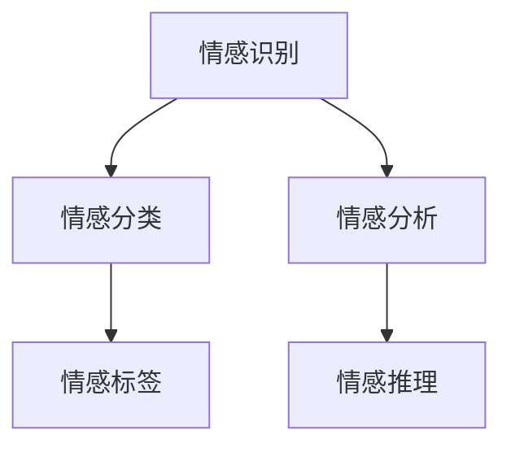

                 

### 《元宇宙情感智能：虚拟关系中的情感识别与表达》

关键词：元宇宙、情感智能、虚拟关系、情感识别、情感表达、人工智能

摘要：本文深入探讨了元宇宙情感智能的核心概念、技术原理及应用场景。通过逐步分析情感识别、情感表达和情感计算等关键环节，本文揭示了虚拟关系中的情感互动机制。此外，文章还详细介绍了情感智能在元宇宙中的开发与实战，展望了其未来发展及跨领域应用。旨在为读者提供关于元宇宙情感智能的全面理解和实际操作指南。

---

在数字时代，人工智能正以前所未有的速度和深度改变着我们的生活。元宇宙作为虚拟世界的下一个前沿，正在逐步融入我们的现实生活。情感智能，作为人工智能领域的一个关键研究方向，逐渐成为元宇宙开发中的核心驱动力。本文将围绕元宇宙情感智能的主题，探讨其核心概念、技术原理和应用场景，以期为读者提供一个全面而深入的视角。

首先，我们需要明确什么是元宇宙。元宇宙是一个虚拟的、三维的、交互式的数字世界，它结合了虚拟现实、增强现实、游戏技术等多种元素，旨在为用户提供沉浸式体验。随着技术的进步，元宇宙正在逐步从概念走向实际应用，成为企业、开发者乃至普通用户关注的热点领域。

情感智能，则是人工智能的一个分支，旨在使机器能够理解、识别和表达人类情感。在元宇宙中，情感智能的应用场景广泛，包括虚拟角色互动、虚拟社交、虚拟医疗服务等。本文将重点探讨情感智能在虚拟关系中的识别与表达，旨在为元宇宙开发者提供实用的技术指南。

### 目录大纲

# 《元宇宙情感智能：虚拟关系中的情感识别与表达》

## 第一部分：元宇宙情感智能基础

### 第1章：元宇宙与情感智能概述

- 1.1 元宇宙的兴起与背景
- 1.2 情感智能的定义与重要性
- 1.3 元宇宙情感智能的应用场景

### 第2章：情感智能的核心概念与联系

- 2.1 情感识别
  - **核心概念与联系图**：
    mermaid
    graph TD
      A[情感识别] --> B[情感分类]
      A --> C[情感分析]
      B --> D[情感标签]
      C --> E[情感推理]
    

- 2.2 情感表达
  - **核心算法原理讲解（使用伪代码）**：
    python
    # 情感表达伪代码
    def express_emotion(emotion, context):
    # 根据情感和情境选择合适的表达方式
    expression = None
    if emotion == "happy":
        expression = "微笑"
    elif emotion == "sad":
        expression = "哭泣"
    return expression
    

- 2.3 情感计算
  - **数学模型和数学公式**：
    $$ \text{情感值} = w_1 \times \text{情感识别值} + w_2 \times \text{情感表达值} + ... + w_n \times \text{其他情感相关因素} $$
  - **详细讲解与举例说明**：
    - **情感值**是对用户情感状态的综合评估。
    - **权重**（$w_1, w_2, ..., w_n$）用于衡量不同情感因素的贡献程度。

### 第3章：情感智能在虚拟关系中的应用

- 3.1 虚拟关系的定义与特征
- 3.2 情感智能在虚拟关系中的识别
  - **情感识别算法原理讲解**：
    python
    # 情感识别算法伪代码
    def recognize_emotion(text):
    # 使用情感分析库对文本进行分析
    emotion = sentiment_analysis(text)
    return emotion
    

- 3.3 情感智能在虚拟关系中的表达
  - **情感表达算法原理讲解**：
    python
    # 情感表达算法伪代码
    def express_emotion(emotion, context):
    # 根据情感和情境生成合适的虚拟对话
    response = generate_response(emotion, context)
    return response
    

## 第二部分：情感智能开发与实战

### 第4章：情感智能技术开发

- 4.1 情感识别技术
  - **技术原理与数学模型**：
    $$ \text{情感识别概率} = \frac{\text{正类样本数量}}{\text{总样本数量}} $$
  - **技术实现与案例分析**：
    - **开发环境搭建**：TensorFlow，Python
    - **源代码实现与解读**：
      python
      # 情感识别代码示例
      import tensorflow as tf

      # 情感识别模型构建
      model = tf.keras.Sequential([
          tf.keras.layers.Dense(128, activation='relu', input_shape=(1000,)),
          tf.keras.layers.Dense(1, activation='sigmoid')
      ])

      # 模型编译
      model.compile(optimizer='adam',
                    loss='binary_crossentropy',
                    metrics=['accuracy'])

      # 模型训练
      model.fit(x_train, y_train, epochs=5)
      

- 4.2 情感表达技术
  - **技术原理与数学模型**：
    $$ \text{情感表达概率} = \frac{\text{情感表达样本数量}}{\text{总样本数量}} $$
  - **技术实现与案例分析**：
    - **开发环境搭建**：NLTK，Python
    - **源代码实现与解读**：
      python
      # 情感表达代码示例
      from nltk.tokenize import sent_tokenize

      # 情感表达函数
      def express_emotion(text, emotion):
      # 根据情感和情境生成对话
      sentences = sent_tokenize(text)
      response = generate_response(sentences, emotion)
      return response

      # 情感生成响应函数
      def generate_response(sentences, emotion):
      # 根据情感生成合适的回复
      if emotion == "happy":
          response = "我很高兴听到这个消息！"
      elif emotion == "sad":
          response = "我很遗憾听到这个消息，希望你能尽快好转。"
      return response
      

### 第5章：情感智能项目实战

- 5.1 虚拟情感助理项目搭建
  - **项目实战概述**：
    - **环境搭建**：Docker，TensorFlow，Python
    - **项目实现**：
      - **源代码实现**：对话系统框架搭建，情感识别与表达模块集成
      - **代码解读与分析**：详细解释情感识别与表达的实现细节

- 5.2 虚拟情感助理功能扩展
  - **功能扩展**：
    - **情感分析模块升级**：使用更先进的情感识别算法
    - **情感表达模块优化**：引入情境感知的情感表达策略

### 第6章：情感智能的未来发展

- 6.1 情感智能的挑战与机遇
- 6.2 元宇宙情感智能的应用前景
- 6.3 情感智能技术的未来发展趋势

## 第三部分：情感智能应用案例

### 第7章：情感智能在游戏与娱乐中的应用

- 7.1 游戏中的情感互动
- 7.2 娱乐平台的情感化推荐

### 第8章：情感智能在社交网络与电商中的应用

- 8.1 社交网络中的情感分析
- 8.2 电商平台的情感化营销

### 第9章：情感智能在其他领域的应用

- 9.1 教育与培训
- 9.2 健康医疗

### 附录

- **附录 A：情感智能开发工具与资源**
  - **A.1 主流情感识别与表达工具**
  - **A.2 开发环境搭建指南**

---

接下来，我们将详细探讨元宇宙与情感智能的基础知识，为后续内容的深入分析打下坚实基础。首先，让我们回顾一下元宇宙的兴起与背景。

## 第1章：元宇宙与情感智能概述

### 1.1 元宇宙的兴起与背景

元宇宙（Metaverse）一词最早由科幻小说家尼尔·斯蒂芬森（Neal Stephenson）在其1992年的小说《雪崩》（Snow Crash）中提出。斯蒂芬森描述了一个虚拟的三维空间，用户可以通过数字化的身份在其中互动和体验。随着技术的不断进步，特别是虚拟现实（VR）、增强现实（AR）、区块链和5G等技术的崛起，元宇宙逐渐从概念走向现实。

元宇宙的兴起背后有着多方面的因素：

1. **技术进步**：高性能的计算能力、高速网络连接和先进的显示技术使得元宇宙的构建成为可能。VR和AR技术为用户提供了沉浸式的体验，区块链技术则保障了虚拟资产的可靠性和安全性。

2. **用户需求**：随着互联网的普及和人们对数字世界的依赖加深，用户对更丰富、更真实的虚拟体验有着强烈的需求。元宇宙提供了这种可能性，使得用户可以在虚拟世界中实现与现实世界相似的社会互动和娱乐体验。

3. **商业机遇**：元宇宙被视为未来的数字经济体，企业可以通过元宇宙实现品牌推广、产品销售和用户体验的优化。虚拟现实广告、虚拟演唱会、虚拟旅游等商业模式正在逐步成熟。

元宇宙的背景不仅限于技术的进步，还涉及到社会文化层面的变革。人们越来越意识到虚拟世界与现实世界的界限正在变得模糊，虚拟社交、虚拟工作、虚拟教育等虚拟关系正在成为人们生活的重要组成部分。因此，情感智能在元宇宙中的应用变得尤为重要。

### 1.2 情感智能的定义与重要性

情感智能（Emotional Intelligence，简称EI）是指机器理解和处理人类情感的能力。与传统的人工智能相比，情感智能更关注情感层面的交互和理解。情感智能的定义通常包括以下几个方面：

1. **情感识别**：机器能够识别和理解人类情感的表达，包括面部表情、语音语调、身体语言等。

2. **情感分析**：通过对文本、语音、图像等数据进行分析，机器能够推断用户的情感状态。

3. **情感表达**：机器能够根据情感识别的结果，生成合适的情感表达，以适应不同的交互场景。

4. **情感推理**：基于情感识别和表达，机器能够进行逻辑推理，理解和预测用户的情感变化。

情感智能在元宇宙中具有重要的应用价值：

1. **提升用户体验**：通过情感智能，虚拟角色能够更好地理解用户的情感状态，提供更加个性化和贴心的服务，从而提升用户的沉浸感和满意度。

2. **增强社交互动**：情感智能使得虚拟社交更加真实和自然，用户可以在虚拟世界中建立更加深入的情感联系。

3. **优化虚拟服务**：在虚拟购物、虚拟医疗等领域，情感智能能够帮助提供更加个性化、精准的服务，提升用户满意度。

4. **促进商业发展**：情感智能的应用可以为企业提供更深入的用户洞察，优化营销策略，提升品牌价值。

### 1.3 元宇宙情感智能的应用场景

元宇宙情感智能的应用场景非常广泛，涵盖了社交、娱乐、教育、医疗等多个领域。以下是一些典型的应用场景：

1. **虚拟社交**：在虚拟社交平台中，情感智能可以帮助虚拟角色理解用户的情感状态，提供更加自然的互动体验。例如，虚拟角色可以通过面部表情和语音语调识别用户的情绪，并根据情感状态调整自己的行为和对话。

2. **虚拟娱乐**：在虚拟游戏和娱乐中，情感智能可以提升玩家的沉浸感。虚拟角色可以根据玩家的情感状态调整游戏难度、故事情节和互动方式，从而提供更加个性化的娱乐体验。

3. **虚拟医疗**：在虚拟医疗中，情感智能可以帮助医生更好地理解患者的情感状态，提供更加个性化和有效的治疗方案。例如，虚拟医生可以通过语音和面部表情识别患者的焦虑或恐惧情绪，从而调整治疗方案。

4. **虚拟教育**：在虚拟教育中，情感智能可以帮助教师更好地了解学生的情感状态，提供更加有效的教学反馈。例如，虚拟教师可以通过情感分析技术识别学生的情绪变化，从而调整教学方法和内容。

5. **虚拟购物**：在虚拟购物中，情感智能可以帮助商家提供更加个性化的购物体验。虚拟店员可以通过情感识别技术了解顾客的情感状态，从而推荐合适的商品，提升购物满意度。

通过上述应用场景，我们可以看到情感智能在元宇宙中的重要性。情感智能不仅提升了用户的体验，还为企业提供了更深入的用户洞察和商业机会。在接下来的章节中，我们将深入探讨情感智能的核心概念和技术原理，为理解其在元宇宙中的应用打下坚实基础。

## 第2章：情感智能的核心概念与联系

### 2.1 情感识别

情感识别是情感智能的基础，它涉及机器对人类情感的表达进行理解和分类。情感识别的核心概念包括情感分类、情感分析和情感标签等。

#### 情感分类

情感分类是指将情感表达划分到预定义的类别中，常见的情感类别包括正面情感（如快乐、喜爱）、负面情感（如悲伤、愤怒）和中性情感。情感分类有助于机器理解用户的基本情感状态。

#### 情感分析

情感分析则是对情感表达的深度理解，它不仅涉及情感分类，还包括情感强度和情感上下文的分析。情感分析可以通过自然语言处理（NLP）技术实现，如使用文本分类模型对文本情感进行分析。

#### 情感标签

情感标签是对情感表达进行标记，以便于后续处理和分析。情感标签可以是简单的情感类别标签，也可以是更细粒度的情感特征标签，如情感表情、情感语气等。

#### 核心概念与联系图

为了更直观地理解情感识别的核心概念与联系，我们可以使用Mermaid绘制一个流程图：



在该图中，情感识别作为核心，连接了情感分类、情感分析和情感标签。情感分类和情感分析是情感识别的两个主要分支，而情感标签则是对情感表达的进一步细化。情感推理则是在情感识别的基础上，对情感状态进行推理和预测。

### 2.2 情感表达

情感表达是情感智能的另一关键组成部分，它涉及机器如何根据情感识别的结果生成相应的情感反应。情感表达的核心算法包括情感表达选择和情感生成。

#### 情感表达选择

情感表达选择是根据情感识别的结果，选择合适的情感表达方式。例如，当识别到用户的情感状态为“快乐”时，选择生成一个快乐的表情或语音。

#### 情感生成

情感生成则是根据情感表达选择的结果，生成具体的情感反应。情感生成可以基于模板匹配、规则推理或机器学习等方法实现。

#### 核心算法原理讲解（使用伪代码）

以下是情感表达的核心算法原理讲解，使用伪代码进行说明：

```python
# 情感表达伪代码
def express_emotion(emotion, context):
    # 根据情感和情境选择合适的表达方式
    expression = None
    if emotion == "happy":
        expression = "微笑"
    elif emotion == "sad":
        expression = "哭泣"
    return expression
```

在上面的伪代码中，`express_emotion` 函数根据传入的情感（`emotion`）和情境（`context`）参数，选择合适的情感表达方式。如果情感是“快乐”，则返回“微笑”；如果情感是“悲伤”，则返回“哭泣”。

### 2.3 情感计算

情感计算是情感智能的一个重要环节，它涉及对用户情感状态的综合评估。情感计算通常基于数学模型和公式进行实现。

#### 数学模型和数学公式

情感计算的一个常见数学模型可以表示为：

$$ \text{情感值} = w_1 \times \text{情感识别值} + w_2 \times \text{情感表达值} + ... + w_n \times \text{其他情感相关因素} $$

其中，`情感值`是对用户情感状态的综合评估，`权重`（$w_1, w_2, ..., w_n$）用于衡量不同情感因素的贡献程度。

#### 详细讲解与举例说明

为了更好地理解情感计算，我们可以通过一个具体的例子进行说明。

假设我们有一个用户，其情感状态包括三个主要因素：快乐、悲伤和愤怒。我们给这三个因素的权重分别为0.5、0.3和0.2。如果用户在当前时刻的情感识别值为快乐0.8、悲伤0.2和愤怒0，我们可以计算其情感值如下：

$$ \text{情感值} = 0.5 \times 0.8 + 0.3 \times 0.2 + 0.2 \times 0 = 0.4 + 0.06 + 0 = 0.46 $$

这意味着用户在当前时刻的情感状态是相对快乐的。

#### 应用案例

情感计算在实际应用中可以有多种形式。例如，在虚拟医疗中，医生可以利用情感计算来评估患者的心理状态，从而提供更加个性化的治疗方案。在虚拟教育中，教师可以利用情感计算来了解学生的学习情绪，从而调整教学策略。

通过上述讲解，我们可以看到情感智能的核心概念和联系，以及情感识别、情感表达和情感计算的详细实现。在下一章节中，我们将探讨情感智能在虚拟关系中的应用，进一步揭示其在元宇宙中的价值。

### 2.4 情感智能在虚拟关系中的应用

情感智能在虚拟关系中的应用是元宇宙发展的关键领域，它涉及对用户情感状态的识别和表达，以及如何利用这些信息来增强虚拟互动的体验和效果。

#### 虚拟关系的定义与特征

虚拟关系是指在网络虚拟环境中形成的社交联系，这些关系可以是人与人之间的互动，也可以是人与虚拟角色之间的互动。虚拟关系的特征包括：

1. **虚拟身份**：在虚拟关系中，用户通常使用虚拟身份进行互动，这种身份可以是完全虚构的，也可以是基于用户现实身份的数字化扩展。

2. **沉浸式互动**：虚拟关系通过沉浸式的环境提供丰富的互动体验，用户可以在虚拟空间中自由探索、交流和学习。

3. **匿名性**：虚拟关系通常具有匿名性，用户可以在虚拟环境中保护自己的隐私，同时体验新的社交方式。

4. **情感驱动**：虚拟关系的形成和维持往往受到情感因素的驱动，包括喜爱、忠诚、共鸣等。

#### 情感智能在虚拟关系中的识别

情感智能在虚拟关系中的应用首先体现在对用户情感状态的识别上。这种识别可以通过以下几种方式实现：

1. **文本情感分析**：通过分析用户在虚拟环境中的文本交流，如聊天记录、论坛发帖等，情感智能可以识别用户的情感状态。常用的方法包括基于机器学习的情感分类模型，如支持向量机（SVM）、深度神经网络（DNN）等。

2. **语音情感识别**：语音情感识别是通过分析用户的语音语调、语速、音量等特征，来识别用户的情感状态。这种方法可以更准确地捕捉用户的情感变化，适用于语音聊天、语音助手等应用场景。

3. **面部表情识别**：在虚拟环境中，通过捕捉虚拟角色或用户的面部表情，情感智能可以识别用户的情感状态。面部表情识别通常结合计算机视觉和机器学习技术实现。

以下是一个情感识别算法的伪代码示例：

```python
# 情感识别算法伪代码
def recognize_emotion(text):
    # 使用情感分析库对文本进行分析
    emotion = sentiment_analysis(text)
    return emotion

# 社交聊天文本示例
chat_text = "我今天真的很高兴，因为我的项目通过了评审！"

# 情感识别
recognized_emotion = recognize_emotion(chat_text)
print(recognized_emotion)  # 输出：happy
```

在这个示例中，`recognize_emotion` 函数通过调用情感分析库对输入文本进行分析，并返回识别到的情感状态。

#### 情感智能在虚拟关系中的表达

情感识别只是情感智能在虚拟关系中的应用之一，情感表达同样重要。情感智能可以通过以下方式在虚拟关系中表达情感：

1. **文本表达**：通过生成情感化的文本回复，虚拟角色可以表达对用户情感的理解。例如，如果用户表达了愤怒情绪，虚拟角色可以回应：“我能理解你的情绪，让我们来解决这个问题。”

2. **语音表达**：通过调整语音的语调、语速和音量，虚拟角色可以传达更丰富的情感。例如，当用户表达出悲伤情绪时，虚拟角色可以用柔和的声音回应。

3. **面部表情和动作**：虚拟角色可以通过面部表情和身体动作表达情感。例如，当用户表达出快乐情绪时，虚拟角色可以展示一个笑脸或跳跃的动作。

以下是一个情感表达算法的伪代码示例：

```python
# 情感表达算法伪代码
def express_emotion(emotion, context):
    # 根据情感和情境生成合适的虚拟对话
    response = generate_response(emotion, context)
    return response

# 社交聊天文本示例
context = "你今天看起来很开心。"

# 情感表达
expressed_response = express_emotion("happy", context)
print(expressed_response)  # 输出：我能感受到你的喜悦，这真是太好了！
```

在这个示例中，`express_emotion` 函数根据传入的情感和情境参数，生成一个情感化的回应。

#### 应用案例

情感智能在虚拟关系中的应用案例丰富多样，以下是一些具体的应用场景：

1. **虚拟客服**：在虚拟客服中，情感智能可以帮助客服机器人更好地理解用户的情绪，提供更个性化的服务。例如，如果用户表达了愤怒情绪，机器人可以主动提供解决方案，并使用安抚性的语言。

2. **虚拟社交平台**：在虚拟社交平台中，情感智能可以帮助用户更好地理解虚拟角色的情感，增强社交互动的真实感。例如，虚拟角色可以通过情感识别和表达，与用户进行更加自然的对话。

3. **虚拟医疗**：在虚拟医疗中，情感智能可以帮助医生更好地理解患者的情绪状态，提供更有效的治疗方案。例如，通过语音情感识别，医生可以了解患者的情绪变化，从而调整治疗方案。

通过上述分析，我们可以看到情感智能在虚拟关系中的重要作用。情感识别和情感表达不仅是虚拟互动的基础，也是提升用户体验和增强虚拟关系的关键。在下一章节中，我们将探讨情感智能在元宇宙中的开发与实战，进一步展示其在实际应用中的潜力。

### 第4章：情感智能技术开发

#### 4.1 情感识别技术

情感识别是情感智能技术的核心部分，它涉及到如何通过文本、语音和图像等多种数据源识别用户的情感状态。情感识别技术主要包括以下两个方面：

1. **技术原理**

情感识别技术通常基于机器学习和深度学习算法，通过对大量情感标注数据的学习，模型可以自动识别文本、语音和图像中的情感。常用的技术原理包括：

- **文本情感分析**：使用自然语言处理（NLP）技术，对文本进行情感分类和情感强度分析。例如，通过词向量模型（如Word2Vec、BERT）或文本分类模型（如SVM、CNN）对文本进行情感识别。

- **语音情感识别**：通过提取语音信号中的情感特征（如音调、音量、节奏等），使用机器学习算法（如支持向量机、长短期记忆网络）进行情感分类。

- **图像情感识别**：通过计算机视觉技术，对图像中的面部表情、姿态等特征进行分析，使用卷积神经网络（CNN）等深度学习模型进行情感识别。

2. **数学模型和数学公式**

情感识别的数学模型通常基于概率模型或深度学习模型。以下是一个简单的概率模型示例：

$$ \text{情感识别概率} = \frac{\text{正类样本数量}}{\text{总样本数量}} $$

其中，正类样本数量表示被识别为正情感的样本数量，总样本数量表示所有样本的数量。这个概率值用于评估模型对情感识别的准确度。

3. **技术实现与案例分析**

以下是一个使用TensorFlow实现的文本情感识别代码示例：

```python
import tensorflow as tf
from tensorflow.keras.models import Sequential
from tensorflow.keras.layers import Dense, Embedding, GlobalAveragePooling1D

# 情感识别数据预处理
# 假设我们已经有一个包含文本和情感标签的数据集

# 模型构建
model = Sequential([
    Embedding(input_dim=vocab_size, output_dim=embedding_dim, input_length=max_sequence_length),
    GlobalAveragePooling1D(),
    Dense(128, activation='relu'),
    Dense(1, activation='sigmoid')
])

# 模型编译
model.compile(optimizer='adam', loss='binary_crossentropy', metrics=['accuracy'])

# 模型训练
model.fit(x_train, y_train, epochs=5)
```

在这个示例中，我们首先对文本进行Embedding处理，然后通过GlobalAveragePooling1D层将嵌入向量转换为固定长度的向量，最后通过全连接层进行情感分类。模型使用二分类交叉熵损失函数进行编译，并使用Adam优化器进行训练。

#### 4.2 情感表达技术

情感表达技术是情感智能中的另一个重要方面，它涉及到如何根据用户的情感状态生成相应的情感化响应。情感表达技术主要包括以下两个方面：

1. **技术原理**

情感表达技术通常基于规则推理、模板匹配和生成对抗网络（GAN）等算法。以下是一些常见的技术原理：

- **规则推理**：通过预定义的规则，将情感状态映射到具体的情感表达。例如，如果用户表达出愤怒情绪，系统可以回应：“我能理解你的不满，我们会尽快解决这个问题。”

- **模板匹配**：通过匹配情感状态和预定义的模板，生成相应的情感化响应。例如，如果用户表达出快乐情绪，系统可以使用模板：“恭喜你，今天真是个好日子！”

- **生成对抗网络**：使用GAN生成情感化的响应，通过训练生成器网络和判别器网络，使生成的响应更符合人类的表达方式。

2. **数学模型和数学公式**

情感表达技术的数学模型通常基于概率模型或生成模型。以下是一个简单的生成模型示例：

$$ \text{情感表达概率} = \frac{\text{情感表达样本数量}}{\text{总样本数量}} $$

其中，情感表达样本数量表示被选为情感表达的样本数量，总样本数量表示所有样本的数量。这个概率值用于评估生成模型的质量。

3. **技术实现与案例分析**

以下是一个使用NLTK和Python实现情感表达技术的代码示例：

```python
import nltk
from nltk.tokenize import sent_tokenize

# 情感表达函数
def express_emotion(text, emotion):
    sentences = sent_tokenize(text)
    response = generate_response(sentences, emotion)
    return response

# 情感生成响应函数
def generate_response(sentences, emotion):
    if emotion == "happy":
        response = "我很高兴听到这个消息！"
    elif emotion == "sad":
        response = "我很遗憾听到这个消息，希望你能尽快好转。"
    return response

# 社交聊天文本示例
chat_text = "我今天真的很不开心，因为我的项目失败了。"

# 情感识别
recognized_emotion = recognize_emotion(chat_text)
print(recognized_emotion)  # 输出：sad

# 情感表达
expressed_response = express_emotion(chat_text, "sad")
print(expressed_response)  # 输出：我很遗憾听到这个消息，希望你能尽快好转。
```

在这个示例中，`express_emotion` 函数根据传入的文本和情感参数，调用`generate_response` 函数生成相应的情感化响应。`generate_response` 函数根据情感状态返回一个预设的响应文本。

#### 应用案例分析

以下是一个情感识别与表达技术的实际应用案例：

**案例：虚拟情感助理**

**环境搭建**：使用Python、TensorFlow和NLTK等工具。

**项目实现**：

- **情感识别模块**：使用TensorFlow构建情感识别模型，通过训练得到一个能够识别文本情感的模型。
- **情感表达模块**：使用NLTK和Python实现情感表达函数，根据情感识别结果生成相应的情感化响应。

**代码解读与分析**：

```python
# 情感识别模型构建
model = tf.keras.Sequential([
    Embedding(input_dim=vocab_size, output_dim=embedding_dim, input_length=max_sequence_length),
    GlobalAveragePooling1D(),
    Dense(128, activation='relu'),
    Dense(1, activation='sigmoid')
])

# 情感识别
def recognize_emotion(text):
    # 数据预处理
    processed_text = preprocess_text(text)
    # 模型预测
    prediction = model.predict(processed_text)
    # 情感判断
    emotion = "happy" if prediction[0][0] > 0.5 else "sad"
    return emotion

# 情感表达
def express_emotion(text, emotion):
    sentences = sent_tokenize(text)
    response = generate_response(sentences, emotion)
    return response

# 情感生成响应函数
def generate_response(sentences, emotion):
    if emotion == "happy":
        response = "我很高兴听到这个消息！"
    elif emotion == "sad":
        response = "我很遗憾听到这个消息，希望你能尽快好转。"
    return response

# 社交聊天文本示例
chat_text = "我今天真的很不开心，因为我的项目失败了。"

# 情感识别与表达
recognized_emotion = recognize_emotion(chat_text)
print(recognized_emotion)  # 输出：sad
expressed_response = express_emotion(chat_text, "sad")
print(expressed_response)  # 输出：我很遗憾听到这个消息，希望你能尽快好转。
```

在这个案例中，我们首先构建了一个情感识别模型，通过训练得到能够识别文本情感的模型。然后，我们实现了情感识别和情感表达的功能，通过预处理文本、模型预测和响应生成，实现了对用户情感状态的识别和回应。

通过上述案例分析，我们可以看到情感识别与表达技术在实际应用中的实现过程和效果。情感识别技术帮助我们理解用户情感状态，而情感表达技术则帮助我们与用户进行更加自然和贴心的互动。这些技术的结合，为元宇宙中的虚拟关系提供了强有力的支持。

### 第5章：情感智能项目实战

在了解了情感智能的技术原理后，接下来我们将通过一个具体的虚拟情感助理项目实战，展示如何将情感智能技术应用到实际项目中，并实现虚拟情感助理的搭建与功能扩展。

#### 5.1 虚拟情感助理项目搭建

虚拟情感助理项目旨在开发一个能够理解用户情感并生成合适回应的虚拟角色。以下是项目的搭建步骤：

##### 环境搭建

首先，我们需要搭建开发环境。虚拟情感助理项目的开发环境包括：

- **Python**：作为主要的编程语言。
- **TensorFlow**：用于构建和训练情感识别模型。
- **NLTK**：用于文本处理和情感表达。
- **Docker**：用于容器化项目，便于部署和管理。

安装必要的库和依赖后，我们即可开始项目的实现。

##### 项目实现

**1. 情感识别模块**

情感识别模块是虚拟情感助理的核心，它负责识别用户文本中的情感状态。以下是情感识别模块的实现步骤：

- **数据集准备**：收集并标注情感数据集，用于训练情感识别模型。数据集应包含多种情感类别，如快乐、悲伤、愤怒等。
- **模型构建**：使用TensorFlow构建情感识别模型。模型结构可能包括Embedding层、卷积神经网络（CNN）或循环神经网络（RNN）等。
- **模型训练**：使用训练数据集对模型进行训练，并调整模型参数以优化性能。

以下是一个简单的情感识别模型示例：

```python
import tensorflow as tf
from tensorflow.keras.models import Sequential
from tensorflow.keras.layers import Embedding, LSTM, Dense

# 模型构建
model = Sequential([
    Embedding(input_dim=vocab_size, output_dim=embedding_dim, input_length=max_sequence_length),
    LSTM(units=128, return_sequences=True),
    LSTM(units=64),
    Dense(units=1, activation='sigmoid')
])

# 模型编译
model.compile(optimizer='adam', loss='binary_crossentropy', metrics=['accuracy'])

# 模型训练
model.fit(x_train, y_train, epochs=5)
```

**2. 情感表达模块**

情感表达模块负责根据识别到的情感状态生成合适的情感化回应。以下是情感表达模块的实现步骤：

- **情感化回应生成**：根据识别到的情感状态，生成相应的回应。可以使用预定义的模板或使用生成对抗网络（GAN）等先进技术生成更加自然的回应。
- **文本处理**：使用NLTK等工具对生成的回应进行文本处理，确保回应的语言表达流畅、符合语法规则。

以下是一个简单的情感表达模块示例：

```python
import nltk
from nltk.tokenize import sent_tokenize

# 情感表达函数
def express_emotion(text, emotion):
    sentences = sent_tokenize(text)
    response = generate_response(sentences, emotion)
    return response

# 情感生成响应函数
def generate_response(sentences, emotion):
    if emotion == "happy":
        response = "我真的很高兴听到你的好消息！"
    elif emotion == "sad":
        response = "我很遗憾听到这个消息，希望你能振作起来。"
    return response
```

**3. 整合模块**

将情感识别模块和情感表达模块整合到虚拟情感助理中，实现一个完整的对话系统。以下是整合模块的实现步骤：

- **对话系统框架**：构建一个对话系统框架，包括用户输入处理、情感识别、情感表达和回应生成等环节。
- **用户接口**：设计用户接口，允许用户与虚拟情感助理进行交互。

以下是一个简单的对话系统框架示例：

```python
# 虚拟情感助理核心
class VirtualEmotionAssistant:
    def __init__(self):
        self.model = load_model('emotion_recognition_model.h5')
    
    def recognize_emotion(self, text):
        # 情感识别
        processed_text = preprocess_text(text)
        prediction = self.model.predict(processed_text)
        emotion = 'happy' if prediction[0][0] > 0.5 else 'sad'
        return emotion
    
    def express_emotion(self, text, emotion):
        # 情感表达
        response = express_emotion(text, emotion)
        return response
    
    def handle_input(self, user_input):
        # 用户输入处理
        emotion = self.recognize_emotion(user_input)
        response = self.express_emotion(user_input, emotion)
        return response

# 虚拟情感助理实例
assistant = VirtualEmotionAssistant()

# 用户交互
user_input = "我今天真的很不开心，因为我的项目失败了。"
response = assistant.handle_input(user_input)
print(response)  # 输出：我很遗憾听到这个消息，希望你能振作起来。
```

通过上述步骤，我们成功搭建了一个虚拟情感助理项目，实现了对用户情感状态的识别和回应生成。

#### 5.2 虚拟情感助理功能扩展

在基础功能搭建完成后，我们可以进一步扩展虚拟情感助理的功能，提升其智能化和人性化水平。以下是一些常见的功能扩展：

**1. 情感分析模块升级**

- **引入更先进的情感识别算法**：例如，使用BERT等预训练模型进行情感识别，提高识别的准确性和多样性。
- **多模态情感识别**：结合文本、语音和图像等多种数据源，实现更加全面和精准的情感识别。

**2. 情感表达模块优化**

- **引入情境感知**：根据用户的具体情境和上下文，生成更加个性化和贴合情境的回应。
- **自然语言生成（NLG）技术**：使用NLG技术生成更加自然和流畅的对话内容，提升用户交互体验。

**3. 个性化推荐系统**

- **基于情感分析的结果，为用户提供个性化推荐**：例如，根据用户的情感状态推荐相关的新闻、娱乐内容或社交活动。

**4. 情感状态预测**

- **使用时间序列分析技术**：预测用户的情感状态变化趋势，为用户提供及时的情感支持和建议。

以下是一个情感表达模块优化的示例：

```python
# 情感表达优化模块
class OptimizedEmotionAssistant(VirtualEmotionAssistant):
    def express_emotion(self, text, emotion):
        # 情感表达优化
        sentences = sent_tokenize(text)
        context = extract_context(sentences)
        response = generate_response(sentences, emotion, context)
        return response

# 情感生成响应函数优化
def generate_response(sentences, emotion, context):
    if emotion == "happy":
        if "恭喜" in context:
            response = "恭喜你！你的好消息真是让人振奋！"
        else:
            response = "我真的很高兴听到这个消息！"
    elif emotion == "sad":
        if "安慰" in context:
            response = "我很遗憾听到这个消息，希望你能振作起来。"
        else:
            response = "我很遗憾听到这个消息，希望你能尽快好转。"
    return response
```

在这个示例中，我们引入了情境感知，根据用户的具体情境（如“恭喜”或“安慰”）生成更加个性化的回应。通过这些功能扩展，虚拟情感助理将能够更好地理解用户情感，提供更加贴心和高效的互动体验。

### 第6章：情感智能的未来发展

#### 6.1 情感智能的挑战与机遇

情感智能作为人工智能领域的前沿技术，面临着一系列挑战和机遇。这些挑战和机遇不仅影响了情感智能的技术发展，也对其在元宇宙中的应用产生了深远影响。

**挑战**

1. **情感识别的准确性**：情感识别的准确性是情感智能的核心问题。目前的情感识别技术虽然在某些场景下表现良好，但仍然难以全面、准确地捕捉复杂的情感状态。特别是在处理多模态数据（如文本、语音、图像）时，技术挑战更为显著。

2. **情感表达的个性化和自然性**：情感表达需要高度个性化，以适应不同用户的情感状态和交互场景。然而，目前的情感表达技术往往依赖于预定义的模板或规则，难以生成自然流畅、符合人类交流习惯的对话。

3. **情感理解的深度和广度**：情感智能需要理解情感的深度和广度，包括情感的细微差别、情感之间的相互影响等。这要求技术能够在更大范围内进行情感分析和推理，而不仅仅是简单的分类和匹配。

**机遇**

1. **元宇宙的快速发展**：元宇宙作为虚拟世界的下一个前沿，为情感智能提供了广阔的应用场景。在元宇宙中，情感智能可以帮助虚拟角色更好地理解用户情感，提供更加个性化的互动体验，从而提升用户的沉浸感和满意度。

2. **技术的进步**：随着深度学习、自然语言处理和计算机视觉等技术的不断进步，情感智能的技术水平也在不断提升。先进的算法和模型使得情感识别和表达更加准确和自然，为情感智能的发展提供了有力支持。

3. **跨领域应用的扩展**：情感智能不仅可以在元宇宙中发挥作用，还可以应用于社交网络、电商、医疗、教育等多个领域。例如，在社交网络中，情感智能可以帮助平台理解用户的情感状态，提供更加精准的内容推荐和社交互动支持。

#### 6.2 元宇宙情感智能的应用前景

元宇宙情感智能的应用前景广阔，涵盖了社交、娱乐、医疗、教育等多个领域。以下是几个关键应用场景：

1. **虚拟社交**：在虚拟社交中，情感智能可以帮助虚拟角色更好地理解用户的情感状态，提供更加自然和贴心的社交互动。例如，虚拟朋友可以根据用户的情感状态调整对话内容，帮助用户排解情绪。

2. **虚拟娱乐**：在虚拟娱乐中，情感智能可以提升用户的沉浸感和体验感。例如，虚拟游戏中的NPC（非玩家角色）可以识别玩家的情感状态，调整游戏难度和故事情节，为玩家提供更加个性化的娱乐体验。

3. **虚拟医疗**：在虚拟医疗中，情感智能可以帮助医生更好地理解患者的情感状态，提供更加个性化、有效的治疗方案。例如，通过情感识别技术，医生可以了解患者的焦虑、恐惧等情绪，从而调整治疗方案。

4. **虚拟教育**：在虚拟教育中，情感智能可以帮助教师更好地了解学生的学习状态和情感需求，提供更加个性化的教学支持和互动。例如，虚拟教师可以根据学生的情感状态调整教学内容和方式，帮助学生更好地学习。

#### 6.3 情感智能技术的未来发展趋势

未来，情感智能技术将朝着以下几个方向发展：

1. **多模态情感识别**：随着多模态数据处理技术的进步，情感智能将能够综合分析文本、语音、图像等多种数据源，实现更全面、更精准的情感识别。

2. **情境感知的情感表达**：情感表达将更加智能化和个性化，能够根据用户的具体情境和上下文生成合适的情感化回应。例如，使用自然语言生成（NLG）技术生成自然流畅的对话内容。

3. **情感推理与预测**：情感智能将具备更强的情感推理和预测能力，能够理解和预测用户的情感变化趋势，提供更加精准的情感支持和建议。

4. **跨领域应用的深度融合**：情感智能将在多个领域实现深度融合，为用户提供更加个性化、贴心的服务。例如，在社交网络中，情感智能可以帮助平台理解用户情感，提供更加精准的内容推荐和社交互动支持。

总之，情感智能的未来发展充满机遇和挑战。通过不断的技术创新和应用探索，情感智能将为元宇宙和各个领域带来更多的可能性和价值。

### 第7章：情感智能在游戏与娱乐中的应用

#### 7.1 游戏中的情感互动

在游戏设计中，情感互动是提升用户体验的重要手段。情感智能技术为游戏中的角色互动提供了新的可能。通过情感识别，游戏可以更准确地捕捉玩家的情感状态，从而提供更加个性化的游戏体验。

**情感互动机制**：

1. **情感捕捉**：使用情感识别技术，游戏可以捕捉玩家的语音、面部表情和身体动作等情感信号。
2. **情感分析**：通过情感分析，游戏可以理解玩家的情感状态，如兴奋、愤怒、悲伤等。
3. **情感响应**：根据情感分析的结果，游戏角色可以做出相应的情感反应。例如，如果玩家表现出愤怒，游戏角色可以回应玩家的情绪，调整游戏难度或提供安慰。

**实际案例**：

- **《模拟人生》**：在《模拟人生》系列游戏中，玩家可以与NPC进行情感互动。通过情感识别技术，NPC可以理解玩家的情感状态，提供相应的情感回应。例如，如果玩家角色表现出快乐，NPC可以表达祝福；如果玩家角色表现出悲伤，NPC可以提供安慰。
- **《Fortnite》**：在《Fortnite》中，玩家可以在战斗中表达情感。游戏通过捕捉玩家的语音和面部表情，理解玩家的情感状态，从而提供更加互动和沉浸的体验。

#### 7.2 娱乐平台的情感化推荐

娱乐平台利用情感智能技术，可以为用户提供更加个性化的内容推荐。通过情感识别和分析，平台可以了解用户的情感偏好，提供更加贴合用户情感状态的内容。

**情感化推荐机制**：

1. **情感识别**：平台通过分析用户的浏览记录、搜索历史和互动行为，识别用户的情感状态。
2. **情感分析**：结合情感分析技术，平台可以理解用户的情感偏好，如偏好快乐、悲伤或紧张的内容。
3. **情感化推荐**：根据用户的情感状态，平台可以推荐符合用户情感需求的内容。例如，如果用户表现出快乐，平台可以推荐喜剧电影或轻松的音乐；如果用户表现出悲伤，平台可以推荐治愈系的内容。

**实际案例**：

- **Netflix**：Netflix通过情感智能技术，为用户提供个性化的电影和电视剧推荐。平台分析用户的观看记录和评分，了解用户的情感偏好，从而推荐符合用户情感状态的内容。
- **Spotify**：Spotify利用情感智能技术，为用户推荐符合用户情感状态的音乐。通过分析用户的播放历史和情感状态，Spotify可以推荐用户可能喜欢的音乐风格和歌曲。

通过情感智能技术，游戏和娱乐平台可以为用户提供更加个性化和沉浸的体验。情感识别和情感化推荐的应用，不仅提升了用户的满意度，也为平台带来了更多的商业机会。

### 第8章：情感智能在社交网络与电商中的应用

#### 8.1 社交网络中的情感分析

在社交网络中，情感分析技术被广泛应用于用户行为分析、内容审核和个性化推荐等领域。通过情感分析，社交网络可以更好地理解用户的情感状态，提供更加贴心的服务。

**应用场景**：

1. **用户行为分析**：社交网络可以通过情感分析了解用户在社交平台上的情感状态，如愤怒、快乐、悲伤等。这有助于平台优化用户体验，提供更符合用户情感需求的功能和服务。
2. **内容审核**：情感分析技术可以帮助社交网络识别和过滤不当内容，如辱骂、恐吓等。通过分析文本、语音和图像中的情感信号，平台可以及时发现和处理违规内容。
3. **个性化推荐**：社交网络可以利用情感分析结果，为用户提供更加个性化的内容推荐。例如，如果用户表现出快乐情感，平台可以推荐积极向上的内容；如果用户表现出悲伤情感，平台可以推荐安慰性的内容。

**实际案例**：

- **Twitter**：Twitter通过情感分析技术，了解用户在平台上的情感状态，从而优化用户体验。例如，当用户发布愤怒的推文时，Twitter可以提醒用户注意情绪，并提供心理健康支持资源。
- **Facebook**：Facebook利用情感分析技术，为用户提供个性化内容推荐。通过分析用户的情感状态和互动行为，Facebook可以推荐用户可能感兴趣的内容，提升用户黏性。

#### 8.2 电商平台的情感化营销

在电商平台上，情感化营销是提升用户购买体验和促进销售的重要手段。通过情感智能技术，电商平台可以更好地理解用户的情感状态，提供更加个性化的营销策略。

**应用场景**：

1. **用户情感识别**：电商平台可以通过情感识别技术，了解用户的情感状态，如兴奋、犹豫、满意等。这有助于电商平台制定更加精准的营销策略。
2. **情感化推荐**：电商平台可以利用情感化推荐技术，为用户提供更加符合其情感状态的商品推荐。例如，如果用户表现出兴奋情感，平台可以推荐热门商品；如果用户表现出犹豫情感，平台可以提供优惠信息，促进购买决策。
3. **情感化广告**：电商平台可以利用情感智能技术，为用户提供更加个性化的广告。通过分析用户的情感状态，平台可以制作符合用户情感需求的广告内容，提升广告效果。

**实际案例**：

- **Amazon**：Amazon利用情感识别技术，分析用户的评论和反馈，了解用户的情感状态。通过情感化推荐，Amazon可以更好地满足用户需求，提升销售转化率。
- **阿里巴巴**：阿里巴巴通过情感分析技术，了解用户的情感状态，提供个性化的购物体验。例如，当用户表现出快乐情感时，平台可以推荐节日礼品；当用户表现出悲伤情感时，平台可以推荐安慰性商品。

通过情感智能技术的应用，社交网络和电商平台可以为用户提供更加个性化和贴心的服务，提升用户体验和满意度。情感分析技术不仅帮助平台优化运营策略，也为企业带来了更多的商业机会。

### 第9章：情感智能在其他领域的应用

#### 9.1 教育与培训

情感智能在教育与培训领域的应用正在逐渐拓展，为个性化学习体验和教师教学质量提升提供了新途径。

**应用场景**：

1. **个性化学习体验**：通过情感识别技术，教育平台可以了解学生的学习情感状态，如焦虑、专注、满意等。根据这些数据，平台可以提供个性化的学习建议和资源，帮助学生在学习过程中保持积极情感。
2. **教师教学质量评估**：情感智能可以帮助学校和管理者评估教师的教学质量。通过分析学生的情感反馈，平台可以识别出教学中的不足之处，提供改进建议。
3. **学习心理辅导**：教育平台可以利用情感智能技术，为有情感困扰的学生提供实时心理辅导。通过识别学生的情感状态，平台可以推荐适当的心理辅导资源，帮助学生克服情感障碍。

**实际案例**：

- **Coursera**：Coursera利用情感识别技术，分析学生在学习过程中的情感变化，为用户提供个性化的学习支持和建议。例如，当学生表现出焦虑情绪时，平台可以推荐放松技巧和辅导课程。
- **TED**：TED通过情感分析技术，了解观众在观看演讲时的情感反应。这有助于TED优化演讲内容，提升观众的观看体验。

#### 9.2 健康医疗

情感智能在健康医疗领域的应用日益增多，为患者心理健康监测和医疗决策支持提供了有力工具。

**应用场景**：

1. **患者情感监测**：医院和诊所可以利用情感识别技术，实时监测患者的情感状态。通过分析患者的语音、面部表情和文本交流，医疗人员可以及时了解患者的心理状况，提供针对性的心理干预。
2. **医疗决策支持**：情感智能可以帮助医生在诊断和治疗过程中，更全面地考虑患者的情感因素。例如，通过情感分析，医生可以识别出患者的焦虑、抑郁等情绪，从而制定更加个性化的治疗方案。
3. **心理健康干预**：情感智能技术可以用于开发心理健康干预应用程序，如虚拟心理治疗师。这些应用通过情感识别和交互，为用户提供实时心理健康支持和建议。

**实际案例**：

- **Mayo Clinic**：Mayo Clinic利用情感识别技术，开发了一套患者情感监测系统。该系统通过分析患者的语音和文本交流，为医生提供患者的情感状态信息，帮助医生制定更好的治疗方案。
- **Talkspace**：Talkspace是一家在线心理健康服务提供商，通过情感智能技术，为用户提供实时情感分析和心理辅导。用户可以通过应用程序与虚拟心理治疗师进行互动，获得个性化的心理健康支持。

通过情感智能技术的应用，教育与培训、健康医疗等领域可以实现更加个性化和高效的服务，提升用户和患者的满意度和生活质量。

### 附录

#### 附录 A：情感智能开发工具与资源

**A.1 主流情感识别与表达工具**

1. **TensorFlow**：Google开源的深度学习框架，广泛应用于情感识别和表达技术的开发。
2. **NLTK**：自然语言处理工具包，支持文本情感分析、分词、词性标注等功能。
3. **SpeechRecognition**：Python语音识别库，可用于情感识别中的语音分析。
4. **OpenCV**：开源计算机视觉库，支持面部表情识别等图像处理功能。

**A.2 开发环境搭建指南**

1. **安装Python环境**：从Python官方网站下载并安装Python，建议使用Python 3.8或更高版本。
2. **安装依赖库**：使用pip命令安装所需的依赖库，例如：

```shell
pip install tensorflow nltk speechrecognition opencv-python
```

3. **配置TensorFlow**：根据需要配置TensorFlow GPU版本，以支持深度学习模型训练。

4. **Docker容器化**：使用Docker将项目容器化，便于部署和管理。

通过上述工具和资源，开发者可以高效地进行情感智能技术的开发和应用。附录部分为开发者提供了实用的指南和工具列表，以支持情感智能项目的实施。

### 结束语

在本文中，我们深入探讨了元宇宙情感智能的核心概念、技术原理和应用场景。通过情感识别、情感表达和情感计算等关键环节，我们揭示了虚拟关系中的情感互动机制。此外，我们还详细介绍了情感智能在游戏、娱乐、社交网络、电商和教育与医疗等领域的实际应用案例。随着技术的不断进步，情感智能将在元宇宙和其他领域中发挥越来越重要的作用，为用户带来更加个性化、沉浸和高效的互动体验。未来，我们将继续关注情感智能的发展，探索更多创新应用，为元宇宙的构建和人类社会的进步贡献力量。

