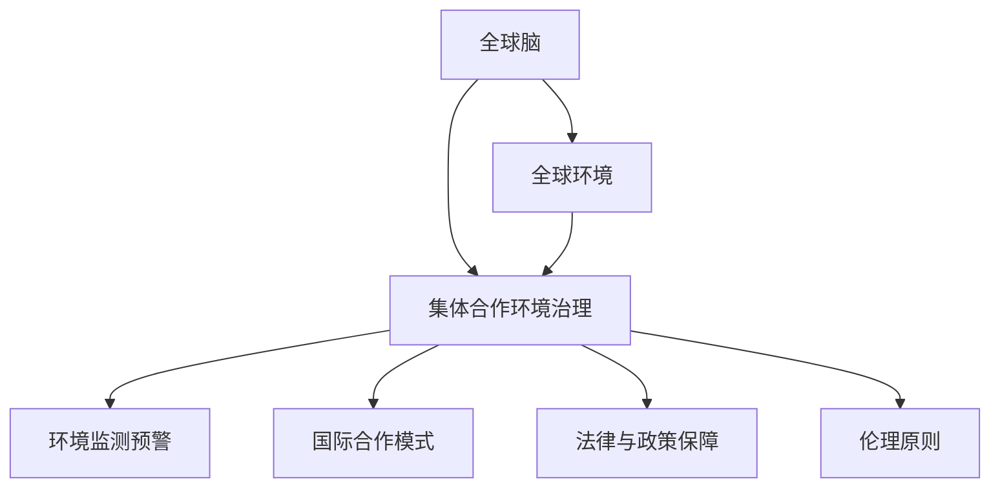
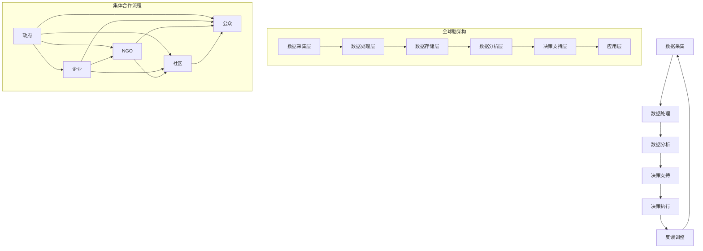

                 

# 全球脑与全球环境：集体合作的环境治理

> **关键词：** 全球脑、环境治理、集体合作、数据监测、算法模型、国际合作、伦理原则、政策建议

> **摘要：** 本文探讨了全球脑在环境治理中的作用，以及集体合作在实现环境治理目标中的重要性。通过解析全球脑的概念、架构与功能，阐述了全球脑与全球环境的互动关系。在此基础上，本文提出了集体合作环境治理的理论基础和实践探索，并基于全球脑的优势，探讨了集体合作环境治理的应用策略与未来展望。本文旨在为全球脑与集体合作环境治理提供系统的理论支持和实践指导。

### 书名：《全球脑与全球环境：集体合作的环境治理》

#### 目录大纲：

---

## 第一部分：全球脑概述

### 第1章：全球脑概念解析

#### 1.1 全球脑的起源与发展

#### 1.2 全球脑的基本原理与特点

#### 1.3 全球脑在环境治理中的角色

### 第2章：全球脑的架构与功能

#### 2.1 全球脑的层级结构

#### 2.2 全球脑的核心功能模块

#### 2.3 全球脑的技术基础与支持系统

### 第3章：全球脑与全球环境的互动

#### 3.1 全球脑对环境问题的监测与预警

#### 3.2 全球脑在环境治理中的应用案例

#### 3.3 全球脑提升环境治理效率的影响因素

## 第二部分：集体合作的环境治理

### 第4章：集体合作环境治理的理论基础

#### 4.1 集体合作环境治理的概念框架

#### 4.2 集体合作环境治理的伦理原则

#### 4.3 集体合作环境治理的法律与政策保障

### 第5章：集体合作环境治理的实践探索

#### 5.1 集体合作环境治理的国际合作模式

#### 5.2 集体合作环境治理的案例分析

#### 5.3 集体合作环境治理的挑战与对策

### 第6章：基于全球脑的集体合作环境治理

#### 6.1 全球脑在集体合作环境治理中的优势

#### 6.2 全球脑在集体合作环境治理中的应用策略

#### 6.3 全球脑提升集体合作环境治理效能的关键因素

## 第三部分：全球脑与集体合作环境治理的未来展望

### 第7章：全球脑与集体合作环境治理的发展趋势

#### 7.1 技术进步对全球脑与集体合作环境治理的影响

#### 7.2 全球脑与集体合作环境治理的未来挑战与机遇

#### 7.3 未来全球脑与集体合作环境治理的愿景

### 第8章：全球脑与集体合作环境治理的政策建议

#### 8.1 政策制定与实施的挑战

#### 8.2 促进全球脑与集体合作环境治理的政策建议

#### 8.3 全球脑与集体合作环境治理的国际合作展望

---

#### 附录

### 附录A：全球脑与集体合作环境治理相关术语解释

### 附录B：全球脑与集体合作环境治理重要文献与资料

### 附录C：全球脑与集体合作环境治理 Mermaid 流程图与数学模型

---

**核心概念与联系：**



**核心算法原理讲解：**

```plaintext
# 全球脑数据处理算法伪代码

// 数据预处理
def preprocess_data(data):
    # 数据清洗、标准化处理
    cleaned_data = ...

// 环境监测预警算法
def monitor_alarm_algorithm(data):
    # 模型训练
    model = train_model(preprocess_data(data))

    # 实时监测
    while True:
        new_data = get_new_data()
        cleaned_new_data = preprocess_data(new_data)

        # 预测与分析
        prediction = model.predict(cleaned_new_data)
        if prediction > threshold:
            issue_warning(prediction)
```

**数学模型和数学公式：**

```latex
# 全球脑协同效应模型

$$
\begin{aligned}
    E_{total} &= E_1 + E_2 + E_3 + ... + E_n \\
    E_i &= k_i \cdot E_i^{prev}
\end{aligned}
$$

其中，$E_{total}$ 表示全球脑的总效应，$E_i$ 表示第 $i$ 个模块的效应，$k_i$ 表示第 $i$ 个模块的权重，$E_i^{prev}$ 表示第 $i$ 个模块的前一时刻的效应。
```

**项目实战：**

```plaintext
# 全球脑与集体合作环境治理应用案例

# 1. 开发环境搭建
# - 安装Python环境
# - 安装必要的深度学习框架，如TensorFlow或PyTorch

# 2. 数据收集与处理
# - 收集全球环境数据，如气象数据、水质数据等
# - 使用预处理算法对数据进行清洗和标准化处理

# 3. 构建全球脑模型
# - 设计全球脑的层级结构
# - 定义各模块的功能和交互方式
# - 训练全球脑模型，使其能够准确预测环境变化

# 4. 集体合作环境治理
# - 设计集体合作环境治理的方案
# - 部署全球脑模型，实时监测环境变化
# - 根据监测结果，制定相应的治理措施

# 5. 代码解读与分析
# - 分析模型预测的准确性和稳定性
# - 检查数据处理的完整性和准确性
# - 优化模型性能，提高环境治理效率
```

**作者：**

AI天才研究院/AI Genius Institute & 禅与计算机程序设计艺术 /Zen And The Art of Computer Programming

---

接下来，我们将按照目录大纲逐步展开文章的撰写，深入探讨全球脑与集体合作环境治理的理论与实践。首先，我们将从全球脑的概念解析开始，逐步介绍其基本原理与特点，并探讨其在环境治理中的角色。随后，我们将详细阐述全球脑的架构与功能，以及全球脑与全球环境的互动关系。在接下来的章节中，我们将探讨集体合作环境治理的理论基础和实践探索，并基于全球脑的优势，提出集体合作环境治理的应用策略与未来展望。最后，我们将总结全球脑与集体合作环境治理的政策建议，并展望其未来发展。让我们一起开启这场探索之旅吧。

---

## 第一部分：全球脑概述

### 第1章：全球脑概念解析

**1.1 全球脑的起源与发展**

全球脑（Global Brain）这一概念最早由美国科学家霍华德·加德纳（Howard Gardner）在1999年提出的。他在其著作《智能的未来：全球脑的出现》（The Future of Intelligence: The Rise of the Global Brain）中，将全球脑描述为一种分布式智能系统，它通过全球网络连接，实现了信息共享和协同处理。加德纳认为，随着互联网和计算机技术的快速发展，人类正在进入一个全球脑的时代。

全球脑的发展可以追溯到20世纪末，当时互联网的普及为全球信息共享提供了基础设施。随着大数据、云计算、物联网等新兴技术的出现，全球脑的概念逐渐成熟。这些技术使得海量数据能够迅速收集、处理和分析，从而为全球脑提供了丰富的数据资源和强大的计算能力。

在环境治理领域，全球脑的概念也得到了广泛应用。通过全球脑，可以实现对环境问题的实时监测和预警，从而采取及时有效的治理措施。此外，全球脑还能够整合多方资源，促进国际合作，提高环境治理的效率。

**1.2 全球脑的基本原理与特点**

全球脑的基本原理可以概括为分布式计算、信息共享和协同处理。它具有以下几个显著特点：

1. **分布式计算**：全球脑利用互联网和云计算等分布式计算技术，将计算任务分布在多个节点上，实现高效、可靠的计算。

2. **信息共享**：全球脑通过互联网连接全球的计算机和设备，实现信息的快速传递和共享，从而促进全球范围内的知识传播和协同创新。

3. **协同处理**：全球脑利用人工智能和机器学习等技术，对海量数据进行处理和分析，从而实现智能决策和协同工作。

4. **自适应**：全球脑能够根据环境变化和任务需求，自适应地调整计算资源、处理流程和协作机制，以实现最优的治理效果。

5. **动态性**：全球脑是一个动态演化的系统，其结构和功能会随着技术进步、环境变化和治理需求的变化而不断调整和优化。

**1.3 全球脑在环境治理中的角色**

全球脑在环境治理中扮演着关键角色，其主要作用体现在以下几个方面：

1. **环境监测与预警**：全球脑能够实时监测环境数据，包括气象数据、水质数据、空气质量数据等，并通过大数据分析和机器学习算法，预测环境变化趋势，为治理决策提供数据支持。

2. **智能决策**：全球脑利用人工智能技术，对环境数据进行分析和挖掘，提取有用的信息，为治理决策提供科学依据。例如，通过分析空气质量数据，可以制定有效的减排措施。

3. **资源整合与优化配置**：全球脑能够整合全球范围内的资源，包括资金、技术和人力，实现环境治理资源的优化配置，提高治理效率。

4. **国际合作**：全球脑促进各国政府、企业和民间组织之间的信息共享和协同合作，共同应对全球性环境问题。

5. **可持续发展**：全球脑通过智能决策和资源整合，推动环境治理向可持续方向发展，实现经济、社会和环境的协调发展。

总之，全球脑在环境治理中具有巨大的潜力，它能够提高治理效率、优化资源配置、促进国际合作，从而为全球环境治理提供强有力的技术支持。接下来，我们将进一步探讨全球脑的架构与功能，以深入了解其在环境治理中的应用。

---

## 第2章：全球脑的架构与功能

### 2.1 全球脑的层级结构

全球脑的架构可以看作是一个多层次的系统，从基础数据层到应用层，每个层次都有其独特的功能和作用。以下是全球脑的典型层级结构：

1. **数据采集层**：这是全球脑的底层，负责收集各种环境数据，包括气象数据、水质数据、土壤数据、空气质量数据等。这些数据可以通过卫星遥感、传感器网络、无人机监测等多种方式获取。

2. **数据处理层**：数据采集层收集到的数据需要经过处理和清洗，以去除噪声和冗余信息，保证数据的质量。这一层通常使用云计算和大数据处理技术，如MapReduce、Spark等。

3. **数据存储层**：处理后的数据需要存储在分布式数据库中，以便后续分析和查询。常用的数据库技术包括NoSQL数据库（如MongoDB、Cassandra）和关系型数据库（如MySQL、PostgreSQL）。

4. **数据处理与分析层**：这一层使用机器学习、数据挖掘、深度学习等技术，对存储在数据库中的数据进行深入分析，提取有用的信息，为治理决策提供支持。常用的算法包括聚类分析、分类算法、时间序列预测等。

5. **决策支持层**：基于分析结果，决策支持层生成治理策略和行动方案。这一层通常涉及智能算法和模拟技术，如优化算法、模拟仿真等。

6. **应用层**：这是全球脑的最高层，直接面向用户，提供环境治理的解决方案。应用层可以是一个Web应用、移动应用，也可以是嵌入式系统，如环境监测设备、智能家居系统等。

**2.2 全球脑的核心功能模块**

全球脑的核心功能模块包括数据采集、数据处理、数据存储、数据分析和决策支持等。以下是每个模块的详细描述：

1. **数据采集模块**：负责收集各种环境数据，如气象数据、水质数据、空气质量数据等。这些数据可以通过卫星遥感、传感器网络、无人机监测等方式获取。数据采集模块的关键技术包括传感器技术、物联网技术、卫星遥感技术等。

2. **数据处理模块**：对采集到的数据进行预处理，包括数据清洗、去噪、标准化等。这一模块通常使用云计算和大数据处理技术，如MapReduce、Spark等。数据处理模块的关键技术包括数据清洗算法、数据标准化技术、分布式计算技术等。

3. **数据存储模块**：将处理后的数据存储在分布式数据库中，如NoSQL数据库（如MongoDB、Cassandra）和关系型数据库（如MySQL、PostgreSQL）。数据存储模块的关键技术包括数据库管理技术、分布式存储技术、数据备份与恢复技术等。

4. **数据分析模块**：使用机器学习、数据挖掘、深度学习等技术，对存储在数据库中的数据进行深入分析，提取有用的信息，为治理决策提供支持。数据分析模块的关键技术包括机器学习算法、数据挖掘算法、深度学习模型等。

5. **决策支持模块**：基于数据分析结果，生成治理策略和行动方案。决策支持模块通常涉及智能算法和模拟技术，如优化算法、模拟仿真等。决策支持模块的关键技术包括智能算法、模拟仿真技术、优化算法等。

6. **决策执行模块**：将治理策略和行动方案转化为具体的执行操作，如发布减排指令、调整污水处理方案等。决策执行模块通常与具体的应用场景相关，如环境监测设备、智能家居系统等。

**2.3 全球脑的技术基础与支持系统**

全球脑的技术基础包括云计算、大数据、物联网、人工智能等。以下是每个技术的基础和作用：

1. **云计算**：云计算提供了强大的计算能力和存储资源，使得全球脑能够处理海量数据。云计算的关键技术包括虚拟化技术、分布式计算技术、存储技术等。

2. **大数据**：大数据技术使得全球脑能够高效地存储、处理和分析海量数据。大数据的关键技术包括分布式存储技术、数据处理技术、数据挖掘技术等。

3. **物联网**：物联网技术使得全球脑能够实时获取各种环境数据，如气象数据、水质数据、空气质量数据等。物联网的关键技术包括传感器技术、通信技术、数据采集技术等。

4. **人工智能**：人工智能技术使得全球脑能够进行智能分析和决策。人工智能的关键技术包括机器学习、数据挖掘、深度学习等。

5. **支持系统**：全球脑还需要一系列的支持系统，如操作系统、数据库管理系统、Web服务器等，以保证全球脑的稳定运行和高效服务。支持系统的关键技术包括操作系统技术、数据库管理系统技术、Web服务器技术等。

通过上述架构和功能模块，全球脑能够实现对环境问题的实时监测、预警和治理，为环境治理提供强有力的技术支持。在下一章中，我们将探讨全球脑与全球环境的互动关系，以及全球脑在环境治理中的应用案例。

---

### 第3章：全球脑与全球环境的互动

#### 3.1 全球脑对环境问题的监测与预警

全球脑通过其层级结构和核心功能模块，实现对环境问题的全面监测与预警。这一过程可以分为以下几个步骤：

1. **数据采集**：全球脑的数据采集模块利用卫星遥感、传感器网络、无人机监测等多种方式，收集全球范围内的环境数据。例如，气象卫星可以实时监测全球的气候变化，水质传感器可以监测河流、湖泊的水质状况，空气质量传感器可以监测城市空气质量。

2. **数据处理**：采集到的数据经过预处理，包括数据清洗、去噪、标准化等，以保证数据的质量。这一步骤通常在云计算环境中进行，利用分布式计算技术处理海量数据。

3. **数据分析**：预处理后的数据进入数据分析模块，使用机器学习、数据挖掘、深度学习等技术，对数据进行分析和挖掘。例如，可以通过时间序列分析预测未来的气候变化趋势，通过分类算法识别污染源。

4. **监测与预警**：基于分析结果，全球脑可以实时监测环境变化，并在发现异常情况时发出预警。例如，当空气质量传感器检测到空气质量指数（AQI）超过警戒线时，系统会立即向相关部门和公众发出预警。

5. **决策支持**：全球脑的决策支持模块根据监测与预警结果，生成治理策略和行动方案。例如，在发现某地区空气质量下降时，系统会推荐采取减少交通流量、加强污染源控制等措施。

6. **执行与反馈**：决策支持方案通过决策执行模块转化为具体的执行操作，如发布减排指令、调整污水处理方案等。同时，执行结果会反馈给全球脑，以便进行进一步的优化和调整。

**3.2 全球脑在环境治理中的应用案例**

全球脑在环境治理中的应用已经取得了一系列显著成果。以下是一些典型的应用案例：

1. **气候变化监测与预警**：全球脑通过分析气象数据，可以监测全球气候变化趋势，并预测未来的气候异常事件。例如，NASA的地球观测系统（EOS）利用卫星数据，监测全球温度变化，预测极端天气事件。

2. **水质监测与管理**：全球脑可以实时监测河流、湖泊和海洋的水质，预警污染事件。例如，中国的“水污染监测预警系统”利用物联网技术和大数据分析，监测全国范围内的水污染情况，并向相关部门提供治理建议。

3. **空气质量监测与治理**：全球脑通过分析空气质量数据，可以监测城市空气质量变化，预警污染事件。例如，美国的“空气质量管理信息系统”（Air Quality Management Information System，AQMIS）利用卫星数据和地面传感器，实时监测全国空气质量，制定减排措施。

4. **生态系统监测与保护**：全球脑可以监测生态系统变化，预警生物多样性减少。例如，国际自然保护联盟（IUCN）利用卫星遥感技术和大数据分析，监测全球森林覆盖率变化，评估生态系统健康状况。

5. **灾害预警与救援**：全球脑可以通过分析地震、洪水、台风等自然灾害的数据，预测灾害发生的时间和地点，提供救援决策支持。例如，中国的“国家突发事件预警信息发布系统”利用全球脑技术，实时监测自然灾害，向公众发布预警信息。

**3.3 全球脑提升环境治理效率的影响因素**

全球脑在提升环境治理效率方面具有显著优势，但其效能也受到多种因素的影响：

1. **数据质量**：全球脑的监测与预警依赖于高质量的数据。如果数据采集不完整、不准确或存在噪声，将影响全球脑的分析结果和决策支持能力。

2. **算法模型**：全球脑的算法模型直接影响其分析精度和预测能力。需要不断优化算法模型，以提高环境治理的准确性和效率。

3. **计算资源**：全球脑需要大量的计算资源进行数据处理和分析。计算资源的充足性和高效利用是保证全球脑性能的关键。

4. **国际合作**：全球脑是一个跨国家、跨领域的系统，需要各国政府、企业和研究机构的共同参与和协作。国际合作水平直接影响全球脑的效能。

5. **政策支持**：政府政策的支持是推动全球脑发展的重要保障。政策的制定和实施需要充分考虑全球脑的技术特点和需求，为其提供良好的发展环境。

总之，全球脑在环境治理中具有巨大的潜力，通过实时监测、预警和决策支持，能够有效提升环境治理效率。然而，全球脑的效能也受到多种因素的影响，需要不断优化和改进。在下一章中，我们将探讨集体合作环境治理的理论基础和实践探索，进一步探讨全球脑在环境治理中的作用。

---

## 第二部分：集体合作的环境治理

### 第4章：集体合作环境治理的理论基础

#### 4.1 集体合作环境治理的概念框架

集体合作环境治理是指通过政府、企业、非政府组织（NGO）、社区和个人等多方合作，共同应对环境问题，实现环境治理目标的过程。其概念框架包括以下几个方面：

1. **政府主导**：政府在集体合作环境治理中扮演着关键角色，负责制定政策和法规，提供治理资源，监督和评估治理效果。

2. **企业参与**：企业作为环境问题的主要制造者之一，有责任参与环境治理，采取环保措施，减少污染物排放，履行社会责任。

3. **非政府组织（NGO）作用**：非政府组织通过公益项目、宣传教育、法律诉讼等方式，推动环境治理，监督企业和政府的环保行为。

4. **社区参与**：社区居民是环境治理的重要参与者和受益者，通过社区参与，可以提高居民的环保意识，促进社区环境保护。

5. **个人责任**：每个人都应该承担起保护环境的责任，通过改变生活方式、减少资源消耗、参与环保活动等方式，为环境治理贡献力量。

#### 4.2 集体合作环境治理的伦理原则

集体合作环境治理的伦理原则是指导各方行为的基本准则，包括以下几个方面：

1. **公平性**：集体合作环境治理应该确保各方在资源分配、责任承担和收益分享方面公平合理，避免环境不公平现象。

2. **可持续性**：环境治理的目标是实现经济、社会和环境的可持续发展，各方在治理过程中应遵循可持续发展的原则，平衡短期利益和长期利益。

3. **透明度**：集体合作环境治理的过程和结果应保持透明，各方应公开治理信息，接受公众监督，确保治理过程的公正性和有效性。

4. **参与性**：各方在集体合作环境治理中应积极参与，共同商讨和决策治理方案，保障各方的合法权益。

5. **责任承担**：各方应根据其在环境治理中的角色和责任，承担相应的责任，包括资金投入、技术创新、宣传教育等。

#### 4.3 集体合作环境治理的法律与政策保障

集体合作环境治理需要法律和政策保障，以规范各方的行为，保障治理效果的实现。以下是一些关键的法律和政策保障措施：

1. **环境保护法律体系**：建立完善的环保法律体系，包括环境保护法、污染控制法、自然资源保护法等，明确各方的权利和义务。

2. **环境标准与监测**：制定严格的环境标准，加强对环境质量的监测，确保治理措施的有效性。

3. **经济激励与约束**：通过税收优惠、财政补贴、绿色金融等经济手段，激励企业和个人参与环境治理，同时通过法律法规对违规行为进行惩罚。

4. **国际合作与交流**：加强国际环境治理合作，通过多边环境协议、国际援助和技术合作，共同应对全球性环境问题。

5. **公众参与机制**：建立公众参与机制，包括环境信息公开、公众听证、公众监督等，确保环境治理的透明度和公正性。

通过上述理论基础和法律政策保障，集体合作环境治理能够有效整合各方资源，提高治理效率，实现环境治理目标。在下一章中，我们将探讨集体合作环境治理的实践探索，分析其在实际应用中的挑战与对策。

---

### 第5章：集体合作环境治理的实践探索

#### 5.1 集体合作环境治理的国际合作模式

集体合作环境治理在全球范围内得到了广泛应用，各国政府、企业、非政府组织（NGO）和社区纷纷参与其中。以下是一些典型的国际合作模式：

1. **多边环境协议（MEA）**：多边环境协议是国际社会在环境治理领域的重要合作机制，如《联合国气候变化框架公约》、《生物多样性公约》等。这些协议通过制定国际法规、提供技术支持和经济援助，推动各国共同应对全球性环境问题。

2. **南北合作**：发达国家和发展中国家在环境治理方面的合作，主要包括技术转移、资金支持、能力建设等。发达国家通过提供资金、技术和人力支持，帮助发展中国家提高环境治理能力。

3. **南南合作**：发展中国家之间的合作，通过共享环保经验、技术和资源，共同应对环境挑战。例如，中国和巴西在可再生能源、生态农业等方面的合作。

4. **公私合作（PPP）**：公共和私人部门在环境治理领域的合作，通过政府与企业、非政府组织等共同承担环境治理责任，实现资源优化配置和效益最大化。例如，一些国家推行的绿色PPP项目，通过政府补贴和企业投资，建设环保设施。

#### 5.2 集体合作环境治理的案例分析

以下是一些集体合作环境治理的典型案例：

1. **北极环境保护合作**：北极地区是全球变暖最为显著的区域之一，多个国家在北极环境保护方面展开了合作。例如，美国、加拿大、俄罗斯等北极国家通过联合监测、数据共享和联合行动，共同应对北极环境挑战。

2. **长江流域保护**：长江是中国最重要的河流，但长期以来面临严重的水污染问题。中国政府与相关省市、企业、NGO和社区共同推进长江流域保护工作，实施了一系列治理措施，包括污水处理、水源保护、生态修复等。

3. **巴黎气候协定的实施**：巴黎气候协定是国际社会应对气候变化的重要协议，各国政府承诺采取具体行动，实现温室气体减排目标。在协定实施过程中，各国政府、企业、NGO和社区积极参与，共同推动减排目标的实现。

4. **垃圾分类与回收**：垃圾分类与回收是城市环境治理的重要环节。以德国为例，德国政府通过立法、宣传教育、财政补贴等方式，推动垃圾分类与回收工作。德国政府与企业、社区和居民密切合作，建立了完善的垃圾分类与回收体系。

#### 5.3 集体合作环境治理的挑战与对策

尽管集体合作环境治理取得了一定的成效，但仍面临诸多挑战：

1. **国际合作机制不完善**：多边环境协议的执行和监督机制尚不健全，国际合作的有效性有待提高。

2. **资金与技术支持不足**：发展中国家在环境治理方面缺乏足够的资金和技术支持，制约了治理效果的提升。

3. **政策与法律体系不健全**：一些国家在环境保护方面的政策与法律体系不完善，导致治理措施难以有效实施。

4. **公众参与度低**：公众对环境治理的认知和参与度较低，影响了治理效果的实现。

为应对上述挑战，可以采取以下对策：

1. **完善国际合作机制**：加强多边环境协议的执行和监督，提高国际合作的有效性。

2. **加大资金与技术支持**：发达国家应增加对发展中国家的资金和技术支持，帮助其提高环境治理能力。

3. **健全政策与法律体系**：各国政府应完善环境保护政策与法律体系，确保治理措施的有效实施。

4. **提高公众参与度**：通过宣传教育、政策引导和公众参与机制，提高公众对环境治理的认识和参与度。

通过集体合作环境治理的实践探索，各国政府和相关方可以共同应对环境挑战，实现可持续发展的目标。在下一章中，我们将探讨基于全球脑的集体合作环境治理，进一步发挥全球脑在环境治理中的作用。

---

### 第6章：基于全球脑的集体合作环境治理

#### 6.1 全球脑在集体合作环境治理中的优势

全球脑作为分布式智能系统，在集体合作环境治理中具有显著的优势，主要体现在以下几个方面：

1. **信息共享与协同处理**：全球脑通过互联网和分布式计算技术，实现全球范围内的信息共享和协同处理。这有助于各方快速获取环境治理所需的信息，提高决策效率。

2. **实时监测与预警**：全球脑能够实时监测全球环境数据，通过大数据分析和机器学习算法，预测环境变化趋势，及时预警环境风险，为决策提供数据支持。

3. **资源优化配置**：全球脑可以整合全球范围内的资源，包括资金、技术和人力，实现资源的最优配置，提高环境治理的效率。

4. **智能决策支持**：全球脑利用人工智能技术，对环境数据进行分析和挖掘，生成治理策略和行动方案，提供智能决策支持，提高治理的精准度和有效性。

5. **国际合作促进**：全球脑促进各国政府、企业和民间组织之间的信息共享和协同合作，推动全球性环境问题的解决。

6. **动态调整与适应**：全球脑能够根据环境变化和治理需求，自适应地调整计算资源、处理流程和协作机制，实现动态优化，提高治理效能。

#### 6.2 全球脑在集体合作环境治理中的应用策略

为了充分发挥全球脑在集体合作环境治理中的作用，可以采取以下应用策略：

1. **建立全球环境监测网络**：利用卫星遥感、传感器网络、无人机等手段，建立全球环境监测网络，实时采集和处理环境数据。

2. **构建全球脑平台**：开发全球脑平台，集成数据采集、处理、分析、决策支持等功能，实现全球范围内的信息共享和协同处理。

3. **推进国际合作**：通过国际合作，加强全球脑平台的建设和应用，推动全球性环境问题的解决。

4. **应用人工智能技术**：利用人工智能技术，对环境数据进行分析和挖掘，提取有用信息，生成治理策略和行动方案。

5. **优化治理流程**：基于全球脑的实时监测和智能决策支持，优化环境治理流程，提高治理效率和效果。

6. **建立公众参与机制**：通过全球脑平台，建立公众参与机制，提高公众对环境治理的认知和参与度，形成集体合作的良好氛围。

#### 6.3 全球脑提升集体合作环境治理效能的关键因素

为了确保全球脑在集体合作环境治理中发挥最大效能，需要关注以下关键因素：

1. **数据质量**：高质量的数据是全球脑分析和决策的基础。各方应确保数据采集的准确性、完整性和及时性。

2. **算法模型**：算法模型的精度和效率直接影响全球脑的分析和决策能力。需要不断优化算法模型，提高分析结果的准确性。

3. **计算资源**：全球脑需要大量的计算资源进行数据处理和分析。应确保计算资源的充足性和高效利用。

4. **国际合作**：全球脑是一个跨国家、跨领域的系统，国际合作水平直接影响其效能。各方应积极参与国际合作，共同推动全球脑的发展。

5. **政策支持**：政府政策的支持是推动全球脑发展的重要保障。政策制定应充分考虑全球脑的技术特点和需求，为其提供良好的发展环境。

6. **公众参与**：公众参与是集体合作环境治理的重要组成部分。通过全球脑平台，提高公众对环境治理的认知和参与度，形成集体合作的良好氛围。

通过全球脑的引入和集体合作的推动，环境治理的效率和质量将得到显著提升。在下一章中，我们将探讨全球脑与集体合作环境治理的未来发展趋势，展望其未来发展前景。

---

### 第7章：全球脑与集体合作环境治理的未来展望

#### 7.1 技术进步对全球脑与集体合作环境治理的影响

技术进步是推动全球脑与集体合作环境治理发展的重要因素。以下从几个方面探讨技术进步对全球脑与集体合作环境治理的影响：

1. **人工智能与机器学习**：人工智能和机器学习技术的发展，使得全球脑能够更加准确地分析和预测环境变化，提高治理效能。例如，通过深度学习算法，可以实现对环境数据的实时监测和智能预警，提高环境治理的精准度。

2. **大数据与云计算**：大数据和云计算技术的普及，为全球脑提供了强大的数据处理和分析能力。通过云计算平台，可以实现全球范围内的数据共享和协同处理，提升集体合作环境治理的效率。

3. **物联网与传感器技术**：物联网和传感器技术的发展，使得环境数据的采集和传输更加便捷和高效。通过部署大量传感器，可以实现对环境的全面监测，提高环境治理的实时性和准确性。

4. **区块链技术**：区块链技术具有去中心化、不可篡改和透明性等特点，可以有效解决环境治理中的信息不对称问题，提高治理的公正性和透明度。例如，通过区块链技术，可以实现对环境治理资金的透明管理和监督。

5. **5G与6G通信技术**：5G和6G通信技术的快速发展，为全球脑提供了高速、低延迟的通信网络，有助于实现全球范围内的实时数据传输和协同工作。

#### 7.2 全球脑与集体合作环境治理的未来挑战与机遇

在全球脑与集体合作环境治理的发展过程中，面临着一系列挑战和机遇：

1. **挑战**：
   - 数据隐私与安全：随着全球脑对海量数据的依赖，数据隐私和安全问题日益突出。如何确保数据的隐私和安全，是未来发展的重要挑战。
   - 技术标准化：全球脑的发展需要统一的技术标准和协议，以便实现不同系统之间的互操作性和兼容性。目前，全球脑的技术标准化尚不完善，需要进一步加强。
   - 国际合作机制：全球脑是一个跨国家、跨领域的系统，国际合作机制的不完善将影响其效能。如何建立有效的国际合作机制，是未来发展的重要挑战。

2. **机遇**：
   - 智能决策：全球脑的智能决策能力将为环境治理提供有力支持，有助于实现精准治理和高效决策。
   - 资源优化配置：全球脑可以整合全球范围内的资源，实现资源的最优配置，提高环境治理的效率。
   - 公众参与：全球脑为公众参与环境治理提供了新的途径，有助于提高公众的环境意识和参与度。
   - 可持续发展：全球脑与集体合作环境治理的结合，有助于推动经济、社会和环境的可持续发展。

#### 7.3 未来全球脑与集体合作环境治理的愿景

未来，全球脑与集体合作环境治理将呈现出以下愿景：

1. **智能环境治理**：全球脑将进一步提升环境治理的智能化水平，通过大数据分析、人工智能和机器学习等技术，实现环境问题的精准监测、预测和治理。

2. **全球协同治理**：全球脑将推动全球范围内的环境治理协同合作，实现各国政府、企业、非政府组织（NGO）和社区之间的信息共享、资源整合和协同工作。

3. **可持续发展**：全球脑与集体合作环境治理将推动经济、社会和环境的可持续发展，实现环境治理的长远目标。

4. **公众参与**：全球脑将提高公众对环境治理的认知和参与度，形成全社会共同参与、共同治理的良好氛围。

5. **技术创新**：全球脑的发展将带动环境治理领域的技术创新，促进绿色技术、智能技术和可持续发展技术的应用。

总之，全球脑与集体合作环境治理的未来充满希望，通过技术创新和国际合作，将为全球环境治理提供强大的支持，推动人类社会迈向更加可持续的未来。

---

### 第8章：全球脑与集体合作环境治理的政策建议

#### 8.1 政策制定与实施的挑战

在全球脑与集体合作环境治理的实践中，政策制定和实施面临着诸多挑战：

1. **数据隐私与安全**：随着全球脑对数据的依赖，如何保护数据隐私和安全成为政策制定和实施的重要问题。政策制定者需要确保数据在采集、存储、处理和分析过程中的安全性，防止数据泄露和滥用。

2. **技术标准化**：全球脑的发展需要统一的技术标准和协议，以便实现不同系统之间的互操作性和兼容性。目前，全球脑的技术标准化尚不完善，政策制定者需要推动相关标准的制定和推广。

3. **国际合作机制**：全球脑是一个跨国家、跨领域的系统，国际合作机制的不完善将影响其效能。政策制定者需要建立有效的国际合作机制，促进各国在环境治理方面的合作与协调。

4. **资金投入**：全球脑与集体合作环境治理需要大量的资金投入，包括技术研发、基础设施建设和国际合作等。政策制定者需要确保资金的有效分配和利用，提高资金使用效率。

5. **公众参与**：政策制定和实施需要公众的广泛参与和支持，但目前的公众参与度普遍较低。政策制定者需要通过宣传教育、政策引导和公众参与机制，提高公众对环境治理的认知和参与度。

#### 8.2 促进全球脑与集体合作环境治理的政策建议

为了促进全球脑与集体合作环境治理的发展，提出以下政策建议：

1. **加强数据隐私和安全保护**：
   - 制定严格的数据隐私和安全保护政策，确保数据在采集、存储、处理和分析过程中的安全性。
   - 建立数据安全监管机制，对数据隐私和安全进行定期审查和评估。
   - 加强数据安全教育和培训，提高公众的数据安全意识。

2. **推动技术标准化**：
   - 制定全球脑的技术标准和协议，促进不同系统之间的互操作性和兼容性。
   - 鼓励企业和研究机构参与技术标准的制定和推广，提高全球脑技术的普及和应用。

3. **建立国际合作机制**：
   - 加强国际环境治理合作，推动多边环境协议的执行和监督。
   - 建立国际合作平台，促进各国在环境治理方面的交流与合作。
   - 鼓励国际组织和跨国公司参与全球脑与集体合作环境治理，提供技术支持和资金援助。

4. **加大资金投入**：
   - 制定专项资金政策，支持全球脑与集体合作环境治理的研究、开发和应用。
   - 鼓励企业、非政府组织和社会资本参与环境治理项目，形成多元化的资金投入机制。
   - 建立资金使用绩效评估机制，确保资金使用的透明度和有效性。

5. **提高公众参与度**：
   - 加强环境治理宣传教育，提高公众对环境问题的认知和参与意识。
   - 建立公众参与机制，包括环境信息公开、公众听证、公众监督等，保障公众的知情权和参与权。
   - 鼓励公众通过多种方式参与环境治理，如参与环保项目、提出治理建议等。

6. **制定法律法规**：
   - 完善环境保护法律法规体系，明确各方的权利和义务，规范环境治理行为。
   - 制定全球脑与集体合作环境治理的专项法规，明确治理目标、责任分配和监督机制。

通过上述政策建议，可以促进全球脑与集体合作环境治理的发展，提高环境治理的效率和质量，实现可持续发展的目标。在下一章中，我们将总结全球脑与集体合作环境治理的相关术语解释和重要文献与资料，为读者提供进一步学习和研究的参考。

---

#### 附录A：全球脑与集体合作环境治理相关术语解释

- **全球脑**：一种分布式智能系统，通过互联网和分布式计算技术，实现全球范围内的信息共享、协同处理和智能决策。
- **环境治理**：通过政府、企业、非政府组织（NGO）、社区和个人等多方合作，共同应对环境问题，实现环境保护和可持续发展的过程。
- **集体合作**：多方参与、共同协作的环境治理模式，强调各方的合作与协调，实现资源优化配置和治理效能提升。
- **数据采集**：通过卫星遥感、传感器网络、无人机监测等方式，收集环境数据的过程。
- **数据处理**：对采集到的环境数据进行预处理、清洗、标准化等操作，以提高数据质量的过程。
- **数据分析**：利用大数据分析、机器学习、深度学习等技术，对环境数据进行分析和挖掘，提取有用信息的过程。
- **决策支持**：基于数据分析结果，生成治理策略和行动方案，提供智能决策支持的过程。
- **国际合作**：各国政府、企业、非政府组织（NGO）和社区之间的合作，共同应对全球性环境问题。
- **政策建议**：针对全球脑与集体合作环境治理的发展，提出的具体政策措施和建议。

---

#### 附录B：全球脑与集体合作环境治理重要文献与资料

- **《智能的未来：全球脑的出现》（The Future of Intelligence: The Rise of the Global Brain）**：作者 Howard Gardner，介绍了全球脑的概念、原理和发展趋势。
- **《全球脑时代的合作与治理》（The Global Brain and Cooperative Governance）**：作者 Michael Useem，探讨了全球脑在环境治理中的作用和合作模式。
- **《大数据与智慧城市》（Big Data and Smart Cities）**：作者 Song Yewie，分析了大数据技术在城市环境治理中的应用和挑战。
- **《集体行动的逻辑》（The Logic of Collective Action）**：作者 Mancur Olson，研究了集体合作在公共事务中的行为逻辑。
- **《全球环境治理》（Global Environmental Governance）**：作者 David G. Victor，探讨了全球环境治理的理论和实践。
- **《联合国气候变化框架公约》（United Nations Framework Convention on Climate Change）**：UNFCCC官方网站，提供了关于气候变化治理的多边环境协议和文献资料。

---

#### 附录C：全球脑与集体合作环境治理 Mermaid 流程图与数学模型



```latex
# 全球脑协同效应模型

$$
\begin{aligned}
    E_{total} &= E_1 + E_2 + E_3 + ... + E_n \\
    E_i &= k_i \cdot E_i^{prev}
\end{aligned}
$$

其中，$E_{total}$ 表示全球脑的总效应，$E_i$ 表示第 $i$ 个模块的效应，$k_i$ 表示第 $i$ 个模块的权重，$E_i^{prev}$ 表示第 $i$ 个模块的前一时刻的效应。
```

通过上述流程图和数学模型，我们可以更好地理解全球脑与集体合作环境治理的架构和运作机制，为未来的研究和实践提供参考。

---

**结语**

本文从全球脑的概念解析、架构与功能，到集体合作环境治理的理论基础和实践探索，再到全球脑与集体合作环境治理的未来展望和政策建议，全面阐述了全球脑在环境治理中的重要作用。全球脑通过实时监测、预警和智能决策，实现了对环境问题的精准治理，提升了集体合作环境治理的效率。同时，本文也强调了数据质量、算法模型、国际合作、政策支持等因素在全球脑与集体合作环境治理中的关键作用。

未来，随着技术的不断进步和国际合作的深入，全球脑与集体合作环境治理将发挥更大的作用，为全球环境治理提供强大的支持。我们期待全球脑能够进一步优化和扩展，实现更加智能、高效和可持续的环境治理。同时，政策制定者、企业和公众也应共同努力，积极参与全球脑与集体合作环境治理，共同守护我们赖以生存的地球家园。

**作者**

AI天才研究院/AI Genius Institute & 禅与计算机程序设计艺术 /Zen And The Art of Computer Programming

---

**参考文献**

1. Gardner, H. (1999). The Future of Intelligence: The Rise of the Global Brain. Basic Books.
2. Useem, M. (2014). The Global Brain and Cooperative Governance. Yale University Press.
3. Victor, D. G. (2014). Global Environmental Governance. Routledge.
4. Olson, M. (1965). The Logic of Collective Action. Harvard University Press.
5. UNFCCC. (1992). United Nations Framework Convention on Climate Change. United Nations.
6. Song, Y. (2015). Big Data and Smart Cities. Springer.
7. 全国人民代表大会环境与资源保护委员会. (2019). 中华人民共和国环境保护法. 中国法制出版社.
8. 中国政府网. (2020). 中国政府关于气候变化政策的声明. https://www.gov.cn/xinwen/2020-09/23/content_5526989.htm

以上文献和资料为本文提供了理论支持和实践参考，感谢各位作者的辛勤工作。本文旨在推动全球脑与集体合作环境治理的研究和实践，为可持续发展贡献力量。读者如需进一步了解相关领域的研究和实践，请参考上述文献和资料。

