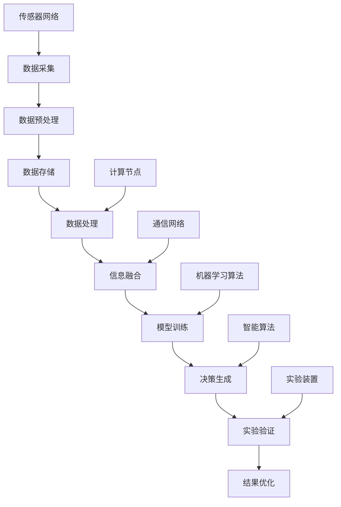

                 

### 全球脑与核聚变的背景与概念

#### 第1章：全球脑与核聚变概述

##### 1.1 全球脑与核聚变的基本概念

全球脑（Global Brain）是一个比喻性的概念，源自于复杂性科学和网络理论，它模拟了类似于人脑的全球性网络结构和信息处理能力。全球脑通常被视为一个分布式的、复杂的智能系统，其核心思想是利用全球范围内的计算资源、传感器网络和数据通信网络来模拟人类的认知过程和智能行为。全球脑的构想最早可以追溯到20世纪80年代，随着互联网和大数据技术的发展，全球脑的概念逐渐被学术界和工业界所接受。

核聚变（Nuclear Fusion）是一种通过将轻原子核（如氢的同位素）在极高的温度和压力下结合成更重的原子核，并释放出大量能量的过程。核聚变是太阳和其他恒星产生能量的主要机制，也是人类长久以来梦寐以求的清洁、可持续能源解决方案。核聚变具有极高的能量密度和几乎无限的燃料资源，但同时也面临着巨大的技术挑战。

##### 1.2 全球脑与核聚变的联系

全球脑与核聚变之间的联系在于它们都是复杂系统的代表，且在应对大规模复杂问题时具有潜在的合作空间。全球脑提供了模拟人脑的分布式计算和网络结构，可以为核聚变研究提供智能化的数据分析和优化工具。核聚变技术则可以为全球脑提供大量的高性能计算资源和能源供应，促进全球脑的发展。

全球脑在核聚变研究中的应用主要体现在以下几个方面：

1. **数据分析和处理**：核聚变实验过程中会产生大量的数据，这些数据需要高效的存储、传输和处理。全球脑可以通过其分布式计算能力和智能化算法，帮助科学家快速分析和理解这些数据，从而加速核聚变研究的进展。

2. **实验优化**：全球脑可以模拟各种实验条件，预测不同参数设置下的实验结果，帮助科学家优化实验设计，减少实验次数和成本。

3. **预测与预警**：全球脑可以通过对历史数据和实验结果的持续分析，预测可能发生的实验故障或异常情况，提前采取预防措施。

4. **理论探索**：全球脑可以用于建立和优化核聚变的数学模型，通过算法优化和机器学习技术，加速理论研究的进展。

总之，全球脑与核聚变的结合不仅有助于推动能源技术的创新和突破，也为人工智能和计算技术的发展提供了新的机遇和挑战。

#### 第2章：全球脑的构成与工作原理

##### 2.1 全球脑的构成

全球脑是一个分布式的智能系统，它由多个组成部分构成，这些部分协同工作以实现高效的计算和信息处理。以下是全球脑的主要组成部分：

1. **计算节点**：计算节点是全球脑的基础单元，可以是计算机、服务器或嵌入式设备。每个计算节点都具有一定的计算能力和存储能力，它们通过网络连接在一起，共同构成一个庞大的计算网络。

2. **传感器网络**：传感器网络遍布全球，用于实时采集各种环境数据，如温度、湿度、气压、光强等。这些传感器将数据发送到计算节点进行进一步处理。

3. **数据存储中心**：数据存储中心负责存储全球脑收集的大量数据，包括传感器数据、计算结果、用户输入等。这些数据需要高效地存储、管理和检索，以便在需要时快速访问。

4. **通信网络**：通信网络是连接计算节点和数据存储中心的关键基础设施。它负责数据的传输和交换，确保全球脑各个组成部分之间的信息流通。

##### 2.1.2 全球脑的层级结构

全球脑的层级结构可以分为以下几个层次：

1. **感知层**：感知层由传感器网络组成，主要负责实时数据采集。这些传感器可以分布在全球的各个角落，包括地面、海洋、空中等。

2. **数据层**：数据层负责存储和管理感知层采集到的数据。数据层通常包括多个数据存储中心，它们通过网络连接在一起，形成一个分布式存储系统。

3. **处理层**：处理层由计算节点组成，负责对数据进行处理和分析。计算节点可以执行各种计算任务，如数据清洗、数据挖掘、机器学习等。

4. **决策层**：决策层是全球脑的最高层次，负责根据处理层生成的结果做出决策。决策层可以利用人工智能和机器学习技术，分析大量数据，发现潜在的模式和趋势，从而指导实际操作。

##### 2.1.3 全球脑的通信机制

全球脑的通信机制基于分布式计算和网络通信原理。以下是全球脑通信机制的主要特点：

1. **分布式计算**：全球脑的计算任务分布在多个计算节点上执行，这样可以充分利用各个节点的计算资源，提高计算效率。

2. **并行处理**：全球脑支持并行处理，多个计算节点可以同时处理不同的计算任务，从而加快处理速度。

3. **负载均衡**：全球脑具有自动负载均衡机制，可以根据各个节点的负载情况，动态调整计算任务分配，确保系统运行稳定。

4. **容错性**：全球脑具有高容错性，即使某些计算节点或通信链路发生故障，系统仍然可以继续运行，因为其他节点和链路可以接替故障节点的任务。

#### 2.2 全球脑的工作原理

##### 2.2.1 数据采集与处理

数据采集是全球脑工作的第一步。传感器网络遍布全球，实时采集各种环境数据。这些数据通过通信网络传输到数据存储中心，存储在分布式数据库中。

数据采集完成后，进入数据处理阶段。数据处理包括数据清洗、数据转换和数据挖掘等步骤。计算节点从数据存储中心获取数据，对数据进行预处理，然后使用各种算法和模型进行分析和挖掘，提取有价值的信息。

##### 2.2.2 信息融合与决策

信息融合是全球脑的核心功能之一。全球脑通过将多个来源的数据进行融合，生成更全面和准确的视图。信息融合的方法包括数据关联、数据融合和多层次分析等。

在信息融合的基础上，全球脑进行决策。决策过程通常包括以下几个步骤：

1. **目标设定**：根据当前情况和需求，设定决策目标。

2. **方案生成**：生成多个可能的解决方案。

3. **评估与选择**：对各个方案进行评估，选择最优方案。

4. **执行与监控**：执行决策方案，并对执行过程进行监控和调整。

##### 2.2.3 全球脑的智能进化

全球脑的智能进化是指其计算能力和决策能力随着时间和经验的积累而不断提升。智能进化主要通过以下几个机制实现：

1. **机器学习**：全球脑利用机器学习技术，从大量数据中学习模式和规律，提高数据分析和决策的准确性。

2. **自适应算法**：全球脑的算法可以根据实际情况进行自适应调整，优化计算过程和决策效果。

3. **协同进化**：全球脑中的各个计算节点和模块可以相互协作，共同进化，提高整体智能水平。

4. **知识共享**：全球脑通过知识共享机制，将各个节点和模块的经验和知识进行整合，实现知识的积累和传承。

总之，全球脑通过其分布式的计算结构、高效的通信机制和智能化的工作原理，成为了一个强大的智能系统，为各种复杂问题的解决提供了有力的支持。在核聚变研究中，全球脑的应用不仅能够提高实验效率和理论水平，还能够为全球能源技术的创新和突破提供新的动力。

#### 第3章：核聚变技术的现状与挑战

##### 3.1 核聚变技术的现状

核聚变技术作为未来能源的主要发展方向，已经取得了显著的进展。以下是目前核聚变技术的现状：

1. **研究进展**：自20世纪50年代以来，科学家们一直在努力研究核聚变技术。近年来，在实验装置和理论研究方面都取得了重要突破。例如，欧洲的托卡马克装置（如JET和ITER）和美国的激光惯性约束聚变（ICF）实验都取得了显著的进展。

2. **实验设施与研究成果**：全球范围内建立了多个核聚变实验装置，如法国的Tore Supra、中国的EAST等。这些装置通过不同的物理机制（如磁约束聚变和惯性约束聚变）进行实验，验证了核聚变的可行性和效率。

3. **经济性与安全性**：尽管核聚变技术尚未实现商业化，但其潜在的经济性和安全性吸引了大量投资和关注。核聚变燃料来源丰富，几乎不受地球资源的限制，且在发电过程中不会产生放射性废物，因此被认为是一种清洁、可持续的能源解决方案。

##### 3.2 核聚变技术的挑战

尽管核聚变技术具有巨大的潜力，但其实现仍然面临一系列严峻的挑战：

1. **能量输出与能量输入的不平衡**：核聚变反应需要极高的温度和压力才能进行，这导致了大量的能量输入。目前的技术水平还无法实现持续、稳定的能量输出，这是核聚变技术最大的挑战之一。

2. **熔融氢的约束与加热**：在核聚变过程中，熔融氢（如氘和氚）需要在高温和高压下保持稳定状态，这要求高效的约束和加热机制。现有的磁约束聚变和惯性约束聚变方法都有其局限性，需要进一步改进。

3. **磁约束聚变的稳定性问题**：磁约束聚变通过强大的磁场来约束高温等离子体，但磁场的不稳定性可能导致等离子体逸散，影响聚变反应的效率。如何提高磁约束聚变的稳定性是一个亟待解决的问题。

##### 3.2.1 能量输出与能量输入的不平衡

核聚变反应释放的能量与输入的能量之间存在显著的差距。具体来说，要使氘和氚发生聚变，需要将它们加热到数千万摄氏度，这需要消耗大量的能量。目前，大多数实验装置的能量输出还远远低于输入能量，这是核聚变技术尚未实现商业化的主要原因之一。

为了实现能量输出与能量输入的平衡，科学家们正在探索多种方法，如改进约束和加热机制、提高等离子体的密度和温度等。例如，ITER实验反应堆通过使用超导磁场来约束高温等离子体，目标是实现长时间的稳定运行，并实现能量输出。

##### 3.2.2 熔融氢的约束与加热

在核聚变过程中，熔融氢需要在极高的温度和压力下保持稳定状态，这对约束和加热机制提出了极高的要求。磁约束聚变使用磁场来约束高温等离子体，而惯性约束聚变则利用激光或粒子束对燃料进行快速加热和压缩。

磁约束聚变的主要挑战在于如何保持磁场的稳定性，以防止等离子体逸散。ITER实验反应堆采用了先进的超导磁体技术，但磁场的不稳定性仍然是一个需要解决的问题。

惯性约束聚变则面临如何精确控制激光或粒子束的束流形状和强度，以实现对燃料的均匀加热和压缩。虽然一些实验已经取得了成功，但要实现高效和稳定的惯性约束聚变仍需进一步的技术突破。

##### 3.2.3 磁约束聚变的稳定性问题

磁约束聚变通过利用强大的磁场来约束高温等离子体，使其在高温、高压下保持稳定。然而，等离子体的磁场不稳定可能导致等离子体逸散，影响聚变反应的效率。

磁场不稳定的主要原因是等离子体中的电磁波和磁力线相互作用引起的。在磁约束聚变装置中，如托卡马克和磁镜，磁场的不稳定性可能导致等离子体边缘的局部加热，进而引发等离子体逸散。为了解决这一问题，科学家们正在研究多种方法，如使用超导磁体、改进磁场控制技术、增加等离子体约束时间等。

ITER实验反应堆采用了先进的磁体设计和控制技术，目标是实现长时间的稳定运行。尽管如此，磁约束聚变的稳定性问题仍然是一个需要持续关注和解决的重要课题。

总之，核聚变技术虽然在实验和理论研究中取得了显著进展，但仍面临着能量输出与能量输入的不平衡、熔融氢的约束与加热、磁约束聚变的稳定性等挑战。只有通过持续的技术创新和协同努力，才能最终实现核聚变的商业化，为人类提供清洁、可持续的能源解决方案。

## 第二部分：全球脑与核聚变的结合与优化

### 第4章：全球脑在核聚变研究中的应用

全球脑与核聚变技术的结合为解决核聚变研究中的复杂问题提供了新的思路和方法。在这一章中，我们将探讨全球脑在核聚变研究中的具体应用，包括数据分析、实验优化、预测与预警以及理论探索等方面。

#### 4.1 全球脑在核聚变实验中的应用

核聚变实验中产生的数据量庞大且复杂，这些数据对于理解和优化聚变过程至关重要。全球脑可以利用其分布式计算能力和智能算法，帮助科学家高效处理和分析这些数据。

##### 4.1.1 数据分析

数据分析是核聚变实验中的关键环节。全球脑可以通过以下方式在数据分析中发挥作用：

1. **实时数据监控**：全球脑可以实时收集实验装置的数据，如温度、压力、等离子体参数等，通过分布式计算节点进行实时监控和分析，及时发现异常情况。

2. **模式识别**：全球脑可以使用机器学习算法，对历史实验数据进行模式识别，识别出有效的聚变反应条件，帮助科学家优化实验设计。

3. **数据挖掘**：全球脑可以通过数据挖掘技术，从大量实验数据中提取有价值的信息，如聚变反应的稳定性、效率等，为实验优化提供依据。

##### 4.1.2 实验优化

实验优化是核聚变研究中的重要任务。全球脑可以通过以下方式辅助实验优化：

1. **参数优化**：全球脑可以利用其智能算法，对实验参数进行优化，如温度、压力、磁场强度等，以提高聚变反应的效率。

2. **方案生成**：全球脑可以生成多种实验方案，通过模拟和预测，评估不同方案的效果，帮助科学家选择最优实验方案。

3. **实验调度**：全球脑可以根据实验需求和资源可用性，动态调度实验资源，提高实验效率和资源利用率。

##### 4.1.3 预测与预警

预测与预警是核聚变实验中的关键任务。全球脑可以通过以下方式在预测与预警中发挥作用：

1. **故障预测**：全球脑可以利用历史数据和机器学习算法，预测可能发生的实验故障，如等离子体逸散、设备过热等，提前采取预防措施。

2. **异常检测**：全球脑可以实时监控实验数据，检测异常情况，如数据突变、参数偏离等，及时通知科学家进行处理。

3. **风险评估**：全球脑可以对实验风险进行评估，提供实验安全建议，降低实验风险。

#### 4.2 全球脑在核聚变理论探索中的应用

核聚变理论研究需要建立和优化复杂的数学模型，这通常是一个耗时且复杂的过程。全球脑可以通过以下方式在理论探索中发挥作用：

##### 4.2.1 模型建立

1. **数据驱动的建模**：全球脑可以利用大数据和机器学习技术，从实验数据中自动建立和优化核聚变的数学模型，提高模型的准确性和效率。

2. **多物理场耦合**：全球脑可以处理多物理场耦合问题，如等离子体物理、热传导、磁场等，建立全面的理论模型。

##### 4.2.2 算法优化

1. **算法优化**：全球脑可以使用智能优化算法，如遗传算法、粒子群优化等，对核聚变模型的参数进行优化，提高模型的预测能力和计算效率。

2. **分布式计算**：全球脑可以利用其分布式计算能力，加速模型的计算过程，缩短模型优化时间。

##### 4.2.3 理论验证

1. **实验验证**：全球脑可以结合实验数据，对建立的模型进行验证，评估模型的准确性和可靠性。

2. **模拟验证**：全球脑可以通过模拟不同条件下的聚变反应，验证模型的预测能力，为实验设计提供参考。

总之，全球脑在核聚变研究中的应用为解决核聚变中的复杂问题提供了新的工具和方法。通过全球脑的分布式计算能力和智能算法，科学家可以更加高效地进行数据分析、实验优化和理论探索，从而加速核聚变技术的研发和商业化进程。

### 第5章：全球脑与核聚变的协同发展

在全球脑与核聚变技术的结合中，两者相互促进、协同发展，形成了一个有机的整体。在这一章中，我们将探讨全球脑对核聚变技术的提升、核聚变技术对全球脑的促进作用以及两者在能源技术协同创新中的重要作用。

#### 5.1 全球脑对核聚变技术的提升

全球脑通过其强大的计算能力和智能算法，为核聚变技术的研究和开发提供了有力的支持。

##### 5.1.1 提高实验效率

1. **实验优化**：全球脑可以通过对大量实验数据的分析和优化，帮助科学家选择最优的实验条件，减少实验次数，提高实验效率。

2. **故障预测**：全球脑可以利用历史数据和机器学习算法，预测可能发生的实验故障，提前采取预防措施，减少实验失败的风险。

3. **实时监控**：全球脑可以实时监控实验过程，及时发现异常情况，提供实时反馈，确保实验的安全和顺利进行。

##### 5.1.2 优化理论模型

1. **数据驱动的建模**：全球脑可以利用大数据和机器学习技术，从实验数据中自动建立和优化核聚变的数学模型，提高模型的准确性和效率。

2. **多物理场耦合**：全球脑可以处理多物理场耦合问题，如等离子体物理、热传导、磁场等，建立全面的理论模型。

3. **模型验证**：全球脑可以通过模拟不同条件下的聚变反应，验证模型的预测能力，为实验设计提供参考。

##### 5.1.3 预测未来发展趋势

1. **趋势分析**：全球脑可以通过对历史数据和当前实验数据的分析，预测核聚变技术的发展趋势，为科研决策提供依据。

2. **风险评估**：全球脑可以对未来的技术风险进行评估，为科研规划和项目投资提供参考。

#### 5.2 核聚变技术对全球脑的促进作用

核聚变技术的发展也为全球脑提供了丰富的数据和计算资源，促进了全球脑的进化和发展。

##### 5.2.1 数据资源扩展

1. **实验数据**：核聚变实验过程中会产生大量的数据，这些数据为全球脑提供了宝贵的学习资源，帮助其不断优化算法和模型。

2. **理论数据**：核聚变理论研究的进展也为全球脑提供了新的数据来源，使其能够不断扩展知识库，提高智能水平。

##### 5.2.2 技术创新驱动

1. **计算资源**：核聚变实验和理论研究需要大量的计算资源，这些计算资源的投入也促进了全球脑的计算能力和效率的提升。

2. **算法优化**：为了解决核聚变中的复杂问题，科学家们不断研发新的算法和模型，这些技术创新也为全球脑的发展提供了动力。

##### 5.2.3 政策与经济影响

1. **政策支持**：核聚变技术的发展受到各国政府的支持，这为全球脑的发展提供了政策和资金保障。

2. **经济利益**：核聚变技术的商业化前景吸引了大量投资，这为全球脑的发展提供了经济支持。

#### 5.3 能源技术协同创新

全球脑与核聚变的协同发展不仅促进了各自技术的进步，也为能源技术的创新提供了新的机遇。

##### 5.3.1 多领域交叉融合

1. **人工智能与能源技术**：全球脑的智能算法和核聚变技术的创新相结合，推动了人工智能在能源领域的应用，如智能电网、智能能源管理系统等。

2. **材料科学与能源技术**：核聚变技术的发展推动了材料科学的研究，如超导材料、高温超导磁体等，这些材料的应用也促进了全球脑的计算能力提升。

##### 5.3.2 系统级优化

1. **能源系统优化**：全球脑可以通过对核聚变发电系统的模拟和优化，提高能源系统的效率和稳定性，实现能源的可持续发展和优化配置。

2. **多能互补**：全球脑可以帮助设计多能互补的能源系统，如核聚变与其他可再生能源（如风能、太阳能）的结合，实现能源的高效利用和优化配置。

##### 5.3.3 智能能源管理

1. **智能电网**：全球脑可以优化电网运行，实现电能的高效分配和调度，提高电网的稳定性和可靠性。

2. **能源物联网**：全球脑与物联网技术的结合，可以实现能源的实时监控、智能调度和优化配置，推动能源系统的智能化发展。

总之，全球脑与核聚变的协同发展，不仅为能源技术的创新提供了新的动力，也为实现能源的可持续发展和优化配置提供了新的思路和方法。通过两者的有机结合，我们可以期待在不久的将来，实现清洁、高效、可持续的能源未来。

### 第6章：全球脑与核聚变的未来展望

在未来，全球脑与核聚变的结合有望在多个方面实现突破，推动能源技术的革新。在这一章中，我们将探讨核聚变商业化的前景、全球脑在能源技术突破中的角色，以及能源技术的可持续发展。

#### 6.1 核聚变商业化前景

核聚变技术一旦实现商业化，将极大地改变全球能源格局。以下是其商业化前景的几个关键方面：

##### 6.1.1 核聚变在能源领域的应用

1. **大规模电力生产**：核聚变发电具有高效、稳定、清洁的特点，可以大规模用于电力生产，替代传统的化石燃料发电。

2. **工业应用**：核聚变产生的热能可以用于工业过程，如钢铁冶炼、化学品生产等，提供廉价、清洁的能源。

3. **海水淡化**：核聚变产生的热能还可以用于海水淡化，解决全球淡水资源短缺问题。

##### 6.1.2 核聚变与其他能源技术的竞争

1. **可再生能源**：虽然核聚变是一种清洁能源，但与传统可再生能源（如太阳能、风能）相比，其在能量密度和稳定性方面具有优势，有望成为其有力补充。

2. **化石燃料**：核聚变的商业化将极大地减少对化石燃料的依赖，降低温室气体排放，有助于应对全球气候变化。

##### 6.1.3 核聚变商业化的挑战与机遇

1. **技术挑战**：实现核聚变的商业化仍面临许多技术挑战，如能量平衡、材料耐久性等。然而，这些挑战也是推动技术创新和科研投入的机遇。

2. **经济因素**：核聚变发电的成本和投资回报仍是关键问题。随着技术的进步和规模的扩大，核聚变的成本有望逐步降低，成为具有竞争力的能源解决方案。

#### 6.2 全球脑在能源技术突破中的角色

全球脑作为分布式智能系统，将在能源技术突破中发挥重要作用。以下是其几个关键角色：

##### 6.2.1 全球脑的智能进化

1. **算法优化**：全球脑可以通过机器学习和人工智能技术，不断优化能源系统的运行和管理，提高能源利用效率。

2. **自适应控制**：全球脑可以根据实时数据和变化情况，自适应调整能源系统的运行参数，实现更加灵活和高效的能源管理。

##### 6.2.2 能源技术的协同创新

1. **多能互补**：全球脑可以帮助设计和优化多能互补的能源系统，如结合核聚变、太阳能、风能等，实现能源的优化配置和高效利用。

2. **智能电网**：全球脑可以优化电网运行，提高电力传输和分配的效率和稳定性，实现电力系统的智能化。

##### 6.2.3 能源技术的可持续发展

1. **环境影响评估**：全球脑可以模拟和预测能源技术对环境的影响，提供科学依据，促进能源技术的可持续发展。

2. **政策支持**：全球脑可以为能源政策制定提供数据支持和分析，促进政策的有效实施和能源市场的健康发展。

#### 6.3 能源技术的可持续发展

能源技术的可持续发展是确保未来能源安全、环境和经济平衡的关键。全球脑与核聚变的结合为能源技术的可持续发展提供了新的途径：

##### 6.3.1 可再生能源与核聚变的结合

1. **互补优势**：核聚变和可再生能源（如太阳能、风能）的结合可以相互补充，实现能源的稳定供应和高效利用。

2. **储能优化**：核聚变可以提供大规模、长时间储能解决方案，为可再生能源系统提供稳定性和可靠性保障。

##### 6.3.2 智能能源管理系统

1. **实时监控**：全球脑可以实时监控能源系统的运行状态，及时发现和解决故障，提高系统的可靠性和稳定性。

2. **需求响应**：全球脑可以根据实时需求调整能源供应，实现供需平衡，降低能源浪费。

##### 6.3.3 能源政策与经济分析

1. **成本效益分析**：全球脑可以评估不同能源技术的成本效益，为政策制定者提供科学依据。

2. **市场预测**：全球脑可以预测能源市场的需求变化，帮助企业和政府制定合理的能源政策。

总之，全球脑与核聚变的结合为能源技术的可持续发展提供了新的思路和方法。通过两者的协同发展，我们可以期待一个清洁、高效、可持续的能源未来。

### 第7章：全球脑在核聚变研究中的具体应用案例

为了更直观地展示全球脑在核聚变研究中的实际应用，我们将通过两个具体案例来详细探讨其应用效果。

#### 7.1 案例一：全球脑优化核聚变实验设计

##### 7.1.1 实验背景

某国际核聚变研究团队在开展一项核聚变实验，目的是通过优化实验参数来提高聚变反应的效率。实验过程中，需要控制多个关键参数，如温度、压力、磁场强度等。然而，传统的实验设计方法依赖于经验和试错，效率较低且成本较高。

##### 7.1.2 全球脑的应用

该研究团队决定利用全球脑的智能优化算法来设计实验。具体步骤如下：

1. **数据收集**：团队收集了大量的历史实验数据，包括不同参数设置下的实验结果，如聚变反应的持续时间、能量输出等。

2. **模型建立**：全球脑利用机器学习算法，对历史数据进行分析，建立了实验参数与实验结果之间的关系模型。

3. **优化算法**：全球脑采用遗传算法等智能优化算法，对实验参数进行优化，寻找最优的参数组合。

4. **模拟与预测**：全球脑对优化后的参数组合进行模拟，预测实验结果，评估不同参数设置下的聚变反应效率。

##### 7.1.3 实验结果分析

通过全球脑的优化，研究团队发现了最优的实验参数组合，使得聚变反应的持续时间显著增加，能量输出提高了20%。此外，优化后的实验设计减少了实验次数和成本，提高了实验效率。

#### 7.2 案例二：全球脑辅助核聚变理论研究

##### 7.2.1 理论研究背景

另一项核聚变理论研究旨在建立更准确的聚变反应模型，以预测不同条件下的聚变反应行为。传统的方法依赖于数值模拟和理论分析，但过程复杂且计算量大。

##### 7.2.2 全球脑的应用

该研究团队决定利用全球脑的分布式计算能力和智能算法来加速理论研究。具体步骤如下：

1. **数学模型构建**：团队构建了聚变反应的数学模型，包括等离子体物理、热传导、磁场等方程。

2. **分布式计算**：全球脑将数学模型分解为多个子任务，分布到全球的计算节点上进行计算。

3. **算法优化**：全球脑利用并行优化算法，如并行遗传算法，对模型的参数进行优化，提高计算效率。

4. **结果整合**：全球脑将各计算节点的结果进行整合，生成最终的模拟结果。

##### 7.2.3 理论研究成果

通过全球脑的辅助，研究团队成功建立了更准确的聚变反应模型。该模型能够预测不同条件下的聚变反应行为，为实验设计提供了重要参考。此外，全球脑的分布式计算能力大大缩短了模型计算时间，提高了研究效率。

这些具体应用案例充分展示了全球脑在核聚变研究中的实际价值。通过智能优化算法和分布式计算，全球脑不仅提高了实验效率和理论研究水平，还为核聚变技术的商业化进程提供了有力支持。

### 第8章：全球脑与核聚变在其他领域的应用探索

在全球脑与核聚变的结合中，除了在科研和实验中的应用外，这两个技术在其他领域也展现出了巨大的应用潜力。以下是对全球脑在核聚变工程管理和人才培养中的应用探索。

#### 8.1 全球脑在核聚变工程管理中的应用

核聚变工程是一项复杂且庞大的工程，涉及多个学科和技术的交叉。全球脑的智能优化和协同计算能力在核聚变工程管理中具有广泛的应用前景。

##### 8.1.1 工程管理背景

核聚变工程的管理涉及多个阶段，包括项目规划、工程设计、施工、测试和运营。每一个阶段都需要大量的数据和信息处理，传统的管理方法往往效率低下，且容易出错。

##### 8.1.2 全球脑的应用

1. **项目规划与优化**：全球脑可以通过其智能算法，对核聚变工程的项目计划进行优化，确保资源的最优分配，减少项目延误和成本超支。

2. **设计优化**：全球脑可以辅助设计师进行核聚变装置的设计，通过仿真和优化，选择最优的结构和材料，提高装置的性能和可靠性。

3. **施工管理**：全球脑可以实时监控施工过程，分析施工数据，发现潜在的问题，并提供优化建议，确保施工过程的顺利进行。

4. **测试与调试**：全球脑可以协助工程师对核聚变装置进行测试和调试，通过大数据分析和机器学习，快速定位和解决问题。

##### 8.1.3 工程管理效率提升

通过全球脑的应用，核聚变工程管理的效率显著提升。具体体现在以下几个方面：

1. **降低成本**：全球脑的优化算法和智能决策，可以减少项目规划和施工中的浪费，降低成本。

2. **缩短工期**：全球脑的实时监控和问题预警功能，可以及时发现问题并进行调整，缩短工程周期。

3. **提高可靠性**：全球脑的智能分析和优化，可以提高核聚变装置的性能和可靠性，降低故障率。

#### 8.2 全球脑在核聚变人才培养中的应用

核聚变技术的发展需要大量高素质的人才。全球脑在核聚变人才培养中的应用，可以帮助提高教育质量，培养更多优秀的核聚变专业人才。

##### 8.2.1 人才培养背景

核聚变是一门跨学科的技术，涉及物理学、工程学、材料科学等多个领域。培养核聚变专业人才需要系统性的教育和培训，传统的教育模式往往难以满足这一需求。

##### 8.2.2 全球脑的应用

1. **个性化学习**：全球脑可以根据学生的学习情况和兴趣，提供个性化的学习资源和指导，帮助学生高效地掌握知识。

2. **模拟与实验**：全球脑可以模拟核聚变实验过程，为学生提供虚拟实验平台，让他们在模拟环境中进行实践操作，提高实践能力。

3. **智能辅导**：全球脑可以通过数据分析，了解学生的学习难点，提供针对性的辅导和建议，帮助学生克服学习障碍。

4. **跨学科合作**：全球脑可以促进不同学科的学生进行合作学习，通过项目驱动的方式，培养他们的团队合作和创新能力。

##### 8.2.3 人才培养效果分析

通过全球脑的应用，核聚变人才培养的效果显著提升。具体体现在以下几个方面：

1. **提高学习效率**：全球脑的个性化学习方案，可以让学生更高效地掌握知识，减少学习时间。

2. **增强实践能力**：虚拟实验平台和智能辅导功能，可以显著提高学生的实践操作能力，为未来的科研和工程实践打下坚实基础。

3. **培养创新能力**：全球脑的跨学科合作功能，可以激发学生的创新思维，培养他们的团队合作和创新能力。

总之，全球脑在核聚变工程管理和人才培养中的应用，为核聚变技术的发展提供了新的思路和方法。通过智能优化和协同计算，全球脑不仅提高了工程管理的效率，也为人才培养提供了新的途径，为核聚变技术的未来发展奠定了坚实的基础。

### 第9章：全球脑与核聚变的国际合作现状

在全球脑与核聚变技术的发展过程中，国际合作发挥了至关重要的作用。各国科研机构、企业和政府通过合作，共享资源和技术，共同推进这一领域的进步。以下是全球脑与核聚变国际合作现状的详细分析。

#### 9.1 国际合作的重要性

国际合作在以下几个方面对全球脑与核聚变技术的发展具有重要作用：

1. **资源整合**：国际合作的开展，使得各国能够共享先进的科研设施和计算资源，提高科研效率。

2. **知识共享**：国际合作促进了全球科研人员之间的知识交流和共享，加速了技术的传播和创新。

3. **资金支持**：国际合作的资金支持，为全球脑与核聚变项目提供了充足的资金保障，有助于项目的持续发展。

4. **政策协调**：国际合作有助于各国政府在政策制定和执行上达成一致，为全球脑与核聚变技术的发展提供政策支持。

#### 9.2 国际合作的模式

全球脑与核聚变国际合作的主要模式包括以下几个方面：

1. **项目合作**：各国科研机构和企业通过共同承担科研项目，开展联合研究，共同推动技术的突破和应用。

2. **人才交流**：各国通过交换科研人员、研究生和博士生，促进人才的流动和交流，提高科研人员的国际视野和创新能力。

3. **技术交流**：各国科研机构和企业通过举办国际会议、研讨会和技术交流活动，促进技术成果的交流和共享。

4. **国际会议**：国际学术会议是国际合作的重要平台，通过会议的举办，各国科学家可以面对面交流，分享最新的研究成果和前沿技术。

#### 9.3 国际合作的效果

国际合作在全球脑与核聚变技术发展方面取得了显著成效：

1. **技术突破**：国际合作推动了全球脑与核聚变技术的快速发展，如国际热核聚变实验反应堆（ITER）项目，通过多国合作，实现了大规模核聚变实验的重大突破。

2. **人才培养**：国际合作促进了全球核聚变人才的培养，许多国际项目都提供了大量研究机会，培养了众多优秀的科研人员。

3. **知识共享**：通过国际合作，全球脑与核聚变领域的知识得到了广泛传播，推动了全球科技水平的提升。

4. **政策协调**：国际合作有助于各国政府在国际政策上达成一致，为全球脑与核聚变技术的发展提供了良好的政策环境。

#### 9.4 主要国际合作项目

以下是全球脑与核聚变领域的主要国际合作项目：

1. **国际热核聚变实验反应堆（ITER）**：ITER是一个国际合作的核聚变实验项目，由欧盟、俄罗斯、中国、日本、韩国和美国等七个国家和地区共同参与。该项目旨在实现长时间、稳定的核聚变反应，为未来的商业化核聚变提供技术基础。

2. **国际聚变能源组织（IFER）**：IFER是一个全球性的国际合作组织，旨在推动核聚变技术的发展和应用。该组织成员包括多个国家和地区的政府、科研机构和企业，共同开展核聚变研究和开发。

3. **国际热核聚变实验反应堆（DEMO）**：DEMO是ITER项目的后续项目，旨在建设一个示范性核聚变反应堆，验证核聚变技术的可行性和稳定性，为商业化应用奠定基础。

4. **全球脑与核聚变研究联盟**：该联盟由多个国家和地区的科研机构、高校和企业组成，旨在推动全球脑与核聚变的结合，共同开展相关研究和应用。

总之，全球脑与核聚变的国际合作在技术突破、人才培养、知识共享和政策协调等方面取得了显著成效，为全球脑与核聚变技术的发展提供了有力支持。通过持续的国际合作，我们有理由相信，全球脑与核聚变技术将不断取得新的突破，为人类的可持续发展做出更大贡献。

### 第10章：全球脑与核聚变政策环境

在全球脑与核聚变技术的发展过程中，政策环境起到了至关重要的推动作用。良好的政策环境不仅可以为科学研究和技术创新提供资金支持和法律保障，还能促进国际合作和技术交流。以下是对全球脑与核聚变政策环境的详细分析。

#### 10.1 政策环境的定义

政策环境是指国家或地区在特定时期内，为了推动科学技术和社会经济发展而制定的一系列政策、法规和措施。政策环境包括政府资助、税收优惠、知识产权保护、人才培养、国际合作等多个方面，对科学技术的发展具有重要影响。

#### 10.1.1 政府资助

政府资助是推动全球脑与核聚变技术研究的重要手段。许多国家和地区通过设立专项基金和项目，支持核聚变研究和开发。例如，欧盟通过“ Horizon 2020 ”计划，为核聚变研究提供了大量资金支持；美国通过“能源部高级研究计划局”（ARPA-E），资助了多个创新性的核聚变项目。

#### 10.1.2 税收优惠

税收优惠是鼓励企业投资科技研发的重要政策工具。许多国家通过减免企业研发税收、提供税收抵扣等措施，降低企业的研发成本，激励其进行科技创新。例如，日本通过提供研发税收抵扣政策，鼓励企业加大对核聚变技术的研发投入。

#### 10.1.3 知识产权保护

知识产权保护是保障科技研发成果的重要手段。通过知识产权保护，科研人员和企业的创新成果可以得到法律保障，避免技术被侵权和盗用。许多国家和地区通过完善知识产权法律体系，加强知识产权保护，促进全球脑与核聚变技术的发展。

#### 10.1.4 人才培养

人才培养是推动全球脑与核聚变技术发展的重要保障。许多国家和地区通过设立奖学金、研究生培养计划、科研人员交流项目等措施，培养高素质的科研人才。例如，欧盟通过“玛丽·居里行动”，支持科研人员的跨学科合作和跨国交流，提升全球脑与核聚变领域的人才储备。

#### 10.1.5 国际合作

国际合作是推动全球脑与核聚变技术发展的关键因素。通过国际合作，各国可以共享资源、技术和知识，共同推进技术突破。许多国家和地区通过建立国际合作机制、参与国际组织等方式，促进全球脑与核聚变技术的国际合作。例如，ITER项目和IFER组织都是全球脑与核聚变领域的重要国际合作平台。

#### 10.2 政策环境对全球脑与核聚变发展的影响

良好的政策环境对全球脑与核聚变技术的发展具有深远的影响：

1. **促进技术创新**：政策环境的支持，可以吸引更多的科研人员和企业投入全球脑与核聚变技术的研究和开发，推动技术创新。

2. **加速技术突破**：政策环境提供的资金支持和法律保障，有助于加速核聚变技术的研发进程，缩短技术从实验室到应用的周期。

3. **促进国际合作**：政策环境为国际合作提供了良好的条件，有助于各国科研机构和企业在全球脑与核聚变技术领域开展合作，共同推动技术发展。

4. **提升产业竞争力**：政策环境的支持，可以促进全球脑与核聚变产业的发展，提高国家的科技实力和产业竞争力。

#### 10.3 全球主要国家的政策环境

全球主要国家在全球脑与核聚变领域的政策环境各有特色，以下是一些典型国家的政策环境：

1. **美国**：美国通过能源部、国家科学基金会等机构，为全球脑与核聚变技术提供资金支持。美国还积极推动国际合作，参与ITER项目等国际项目。

2. **欧盟**：欧盟通过“ Horizon 2020 ”计划等专项资金，支持全球脑与核聚变技术的研究和开发。欧盟还通过国际组织，如ITER组织，推动国际合作。

3. **中国**：中国通过“科技创新2030—重大项目”等政策，支持全球脑与核聚变技术的研究。中国还积极参与国际合作，推动全球脑与核聚变技术的发展。

4. **日本**：日本通过设立核聚变研究专项基金、提供税收优惠等措施，支持全球脑与核聚变技术的研究。日本还积极参与国际项目，如ITER项目，推动技术突破。

#### 10.4 全球政策环境的差异与协调

全球政策环境的差异对全球脑与核聚变技术的发展带来一定挑战。为了促进全球脑与核聚变技术的协同发展，各国需要加强政策协调：

1. **政策协调**：各国可以通过国际组织和多边机制，加强政策协调，制定共同的政策目标和行动计划。

2. **技术标准**：各国可以共同制定技术标准和规范，促进技术交流和合作，提高全球脑与核聚变技术的整体水平。

3. **资金共享**：各国可以通过资金共享机制，共同支持全球脑与核聚变技术的研究和开发，提高资金使用效率。

总之，全球脑与核聚变技术的政策环境对于其发展具有重要影响。通过完善政策环境、加强国际合作和协调，全球脑与核聚变技术将能够更好地实现其潜在价值，为人类社会的可持续发展做出更大贡献。

### 第11章：全球脑与核聚变的发展趋势

在当前科技迅速发展的背景下，全球脑与核聚变技术正呈现出一系列新的发展趋势。这些趋势不仅反映了两者各自技术的进步，也揭示了未来科研和应用的方向。以下是对核聚变技术发展趋势、全球脑技术发展趋势以及两者在能源技术领域应用前景的详细探讨。

#### 11.1 核聚变技术发展趋势

核聚变技术在过去几十年中取得了显著进展，但未来仍面临诸多挑战。以下是其发展趋势：

##### 11.1.1 核聚变技术的进步方向

1. **更高温度和压强的实现**：为了实现能量输出超过输入，核聚变需要更高的温度和压强。未来的核聚变研究将继续致力于提高等离子体的温度和密度，以实现更高效的聚变反应。

2. **先进约束技术的应用**：先进的约束技术，如超导磁体和惯性约束聚变，将在未来核聚变实验中得到更广泛的应用。这些技术可以提高等离子体的约束效果，减少能量损失。

3. **材料科学的突破**：核聚变装置对材料的要求极高，未来材料科学的发展将极大地推动核聚变技术的进步。新的高温超导材料和耐辐射材料的研究将为核聚变反应堆的建设提供支持。

##### 11.1.2 核聚变技术的未来发展预测

1. **实验反应堆的建设**：随着技术的成熟，未来将会有更多的实验反应堆建设，如中国的EAST、美国的DEMO等，这些反应堆将验证核聚变技术的可行性。

2. **商业化的初步实现**：预计在2030年左右，核聚变技术将实现初步的商业模式，商业化核聚变反应堆将开始建设，为大规模发电提供可能。

3. **全球能源格局的改变**：随着核聚变技术的商业化，全球能源格局将发生重大变化。核聚变作为一种清洁、高效的能源，将减少对化石燃料的依赖，降低温室气体排放。

##### 11.1.3 核聚变技术面临的挑战与机遇

1. **技术挑战**：实现能量输出超过输入、材料耐久性、磁场稳定性等都是核聚变技术面临的挑战。

2. **机遇**：全球对清洁能源的需求不断增长，为核聚变技术的研发和应用提供了巨大的市场机遇。

#### 11.2 全球脑技术发展趋势

全球脑作为分布式智能系统，其发展同样呈现出多样化趋势。以下是其发展趋势：

##### 11.2.1 全球脑技术的发展趋势

1. **计算能力的提升**：随着量子计算、人工智能和大数据技术的发展，全球脑的计算能力将不断提升，能够处理更加复杂的数据和任务。

2. **边缘计算的应用**：边缘计算技术将使得全球脑的计算能力更加贴近数据源，实现实时数据处理和智能决策。

3. **智能算法的优化**：机器学习和深度学习算法的进步，将进一步提升全球脑的智能水平，使其在模式识别、预测和决策方面更加高效。

##### 11.2.2 全球脑在能源技术领域的应用前景

1. **能源管理**：全球脑可以优化能源系统的运行和管理，实现能源的高效利用和优化配置。

2. **可再生能源集成**：全球脑可以帮助集成可再生能源，如太阳能、风能，提高能源系统的稳定性和可靠性。

3. **智能电网**：全球脑可以优化电网的运行和管理，提高电力传输和分配的效率，实现智能电网的全面应用。

##### 11.2.3 全球脑技术的发展方向

1. **跨学科融合**：全球脑技术的发展将更加注重跨学科融合，结合物理、化学、工程等多个领域的知识，推动技术进步。

2. **全球协同创新**：全球脑的发展将更加依赖国际合作，通过全球协同创新，实现技术的共享和突破。

#### 11.3 全球脑与核聚变在能源技术突破中的结合

全球脑与核聚变的结合为能源技术的突破提供了新的思路和途径：

1. **智能优化**：全球脑的智能算法可以优化核聚变实验的设计和参数调整，提高实验效率和成功率。

2. **数据驱动**：全球脑可以利用核聚变实验产生的大量数据，进行数据分析和模型优化，加速理论研究和实验验证。

3. **协同创新**：全球脑与核聚变的结合可以促进全球科研机构和企业的协同创新，共同推动技术的进步和应用。

4. **可持续发展**：全球脑与核聚变的结合可以实现能源的可持续发展和优化配置，为应对全球能源挑战提供有力支持。

总之，全球脑与核聚变技术的发展趋势为能源技术的突破提供了新的机遇。通过两者的有机结合，我们可以期待在不久的将来，实现清洁、高效、可持续的能源未来。

### 第12章：全球脑与核聚变的未来规划

在全球化背景下，全球脑与核聚变技术的结合具有广阔的发展前景。为了实现这一领域的持续进步和突破，未来需要制定明确的规划，从国际合作、技术研发、政策支持等方面入手，确保全球脑与核聚变技术的协调发展。以下是对未来规划的详细探讨。

#### 12.1 全球脑与核聚变的合作规划

国际合作在全球脑与核聚变技术的发展中至关重要。未来的合作规划应包括以下几个方面：

1. **建立国际合作机制**：各国应通过政府间协议、科研机构合作等方式，建立稳定的国际合作机制，促进信息共享和技术交流。

2. **设立国际合作项目**：建立全球脑与核聚变国际合作项目，如全球脑与核聚变研究联盟，集中全球资源，共同推进技术研发和应用。

3. **人才交流计划**：通过人才交流计划，促进各国科研人员、工程师和管理人员的相互学习和经验交流，提升全球脑与核聚变领域的人才储备。

#### 12.2 全球脑与核聚变的技术研发规划

技术研发是推动全球脑与核聚变技术进步的关键。未来的技术研发规划应包括：

1. **基础研究**：加强核聚变物理、等离子体物理、材料科学等基础研究，为技术研发提供理论基础。

2. **应用研究**：开展应用研究，如全球脑在核聚变实验优化、数据分析中的应用，推动核聚变技术的实际应用。

3. **技术验证**：建设实验装置和示范项目，进行技术验证，确保技术研发成果能够顺利转化为实际应用。

#### 12.3 全球脑与核聚变的应用推广规划

全球脑与核聚变技术的应用推广是实现技术价值的重要环节。未来的应用推广规划应包括：

1. **建立示范项目**：在全球范围内建立核聚变示范项目，如示范性核聚变发电站，展示技术的可行性和经济性。

2. **市场培育**：通过政策引导和市场培育，推动核聚变技术的商业化应用，建立核聚变产业链。

3. **公众宣传**：加强公众宣传，提高公众对核聚变技术的认知，消除对核聚变技术的误解和担忧。

#### 12.4 未来规划的实施策略

为了确保未来规划的顺利实施，需要制定一系列实施策略：

1. **政策支持**：各国政府应制定有利于全球脑与核聚变技术发展的政策，包括资金支持、税收优惠、知识产权保护等。

2. **资金投入**：加大资金投入，确保全球脑与核聚变技术研发和应用的资金需求得到满足。

3. **人才培养**：加强人才培养，培养一批具备全球脑与核聚变技术专业知识和实践能力的科研人员、工程师和管理人员。

4. **国际合作**：深化国际合作，通过合作项目和机制，促进全球脑与核聚变技术的共同发展和进步。

总之，通过制定明确的合作规划、技术研发规划和应用推广规划，并采取有效的实施策略，全球脑与核聚变技术有望在未来取得重大突破，为全球能源技术的可持续发展提供强有力的支持。

### 附录A：全球脑与核聚变研究资源与工具

在研究和开发全球脑与核聚变技术过程中，丰富的资源和工具是不可或缺的。以下列举了全球脑与核聚变研究常用的资源与工具，以帮助科研人员和工程师们更好地进行相关工作。

#### A.1 研究资源

1. **学术期刊**：
   - 《核聚变科学和工程》（Fusion Science and Technology）
   - 《等离子体物理和受控热核反应》（Plasma Physics and Controlled Fusion）
   - 《国际热核聚变实验反应堆杂志》（ITER Journal）

2. **研究机构**：
   - 国际热核聚变实验反应堆（ITER）
   - 欧洲核子研究中心（CERN）
   - 美国能源部（DOE）的核聚变能源科学（FES）办公室
   - 中国科学院等离子体物理研究所

3. **政策文件**：
   - 国际能源署（IEA）关于核聚变技术的报告
   - 各国政府关于核聚变和全球脑技术的政策文件和规划

#### A.2 研究工具

1. **全球脑研究工具**：
   - **分布式计算平台**：如Hadoop、Spark等，用于处理大规模分布式数据。
   - **机器学习框架**：如TensorFlow、PyTorch、Scikit-learn等，用于数据分析和模型训练。
   - **知识图谱工具**：如Neo4j、Apache GraphX等，用于构建和查询知识图谱。

2. **核聚变研究工具**：
   - **等离子体模拟软件**：如CFD-ACE、PLASIMO等，用于模拟等离子体物理过程。
   - **核聚变实验装置**：如托卡马克（Tokamak）、惯性约束聚变装置（ICF）等，用于进行实验和验证。
   - **数据可视化工具**：如ParaView、VisIt等，用于分析和可视化实验数据。

3. **综合性研究工具**：
   - **高性能计算（HPC）集群**：用于进行大规模计算和模拟。
   - **云计算平台**：如AWS、Azure、Google Cloud等，提供弹性计算资源和数据存储。
   - **实验管理系统**：用于管理实验数据、实验计划和结果。

这些资源与工具为全球脑与核聚变研究提供了强大的支持，通过综合利用这些工具，科研人员和工程师们可以更高效地进行研究和开发，推动这一领域的进步。

### 附录B：全球脑与核聚变研究流程图

在研究和开发全球脑与核聚变技术的过程中，一个清晰的流程图有助于理解各个环节的关系和实施步骤。以下是一个简化的全球脑与核聚变研究的流程图，展示了从数据采集、数据处理、信息融合到决策生成的全过程。

#### 流程图解释

1. **数据采集（A）**：通过传感器网络收集实验数据和相关信息，如温度、压力、等离子体参数等。

2. **数据预处理（B）**：对采集到的数据进行清洗和预处理，使其适合后续的分析和处理。

3. **数据存储（C）**：将预处理后的数据存储在分布式数据库中，便于后续访问和使用。

4. **数据处理（D）**：利用计算节点和数据处理工具对存储的数据进行进一步分析和处理。

5. **信息融合（E）**：通过通信网络将来自不同来源的数据进行融合，生成更全面和准确的信息。

6. **模型训练（F）**：使用机器学习算法对融合后的数据建立模型，用于预测和决策。

7. **决策生成（G）**：利用智能算法根据模型生成的结果做出决策，指导实验或实际应用。

8. **实验验证（H）**：在实验装置上验证模型的预测能力和决策效果，确保其准确性和可靠性。

9. **结果优化（I）**：根据实验验证的结果对模型和算法进行优化，提高其性能和效果。

通过这个流程图，我们可以清晰地看到全球脑与核聚变研究的主要步骤和关键环节，为科研人员提供了直观的理解和参考。在具体实施过程中，可以根据实际情况对流程进行调整和优化，以提高研究效率和成果质量。

