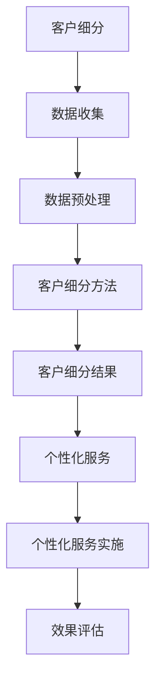
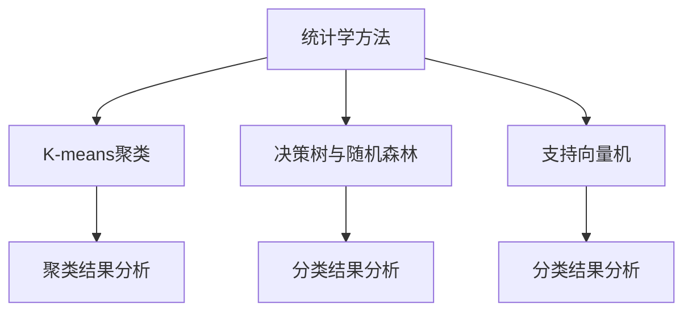
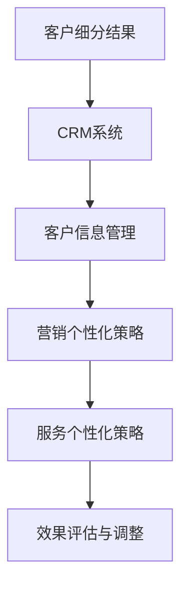

                 

### 文章标题

《创业公司的客户细分与个性化服务》

> **关键词**：客户细分、个性化服务、创业公司、市场策略、数据分析、人工智能

> **摘要**：本文将深入探讨创业公司在市场战略中的客户细分与个性化服务的重要性。通过介绍客户细分的基本概念、理论方法和实践技巧，文章旨在为创业者提供系统的策略框架和实际案例，帮助他们在竞争激烈的市场中取得成功。全文将涵盖客户细分的数据准备与处理、基于统计学的客户细分方法、个性化服务的技术实现和综合策略等方面，并以实际项目案例进行详细解析。最终，本文将展望客户细分与个性化服务的未来发展趋势，为创业公司的持续成长提供有价值的指导。

---

### 目录大纲：创业公司的客户细分与个性化服务

#### 第一部分：客户细分理论探讨

**第1章：客户细分的基本概念与重要性**

**第2章：客户细分的数据准备与处理**

**第3章：基于统计学的客户细分方法**

#### 第二部分：客户细分实践方法

**第4章：个性化服务的基本概念与重要性**

**第5章：个性化服务的技术实现**

**第6章：个性化服务案例研究**

#### 第三部分：客户细分与个性化服务的综合策略

**第7章：创业公司客户细分与个性化服务的综合策略**

**第8章：未来发展趋势与展望**

#### 附录

**附录A：客户细分与个性化服务工具与应用指南**

**附录B：案例分析资料与参考文献**

### Mermaid 流程图：客户细分与个性化服务流程



### Mermaid 流程图：客户细分方法



### Mermaid 流程图：个性化服务实施流程



### 伪代码：K-means算法

```python
def K_means(data, k):
    # 初始化k个中心点
    centroids = initialize_centroids(data, k)
    while not converged:
        # 分配数据到最近的中心点
        clusters = assign_data_to_centroids(data, centroids)
        # 更新中心点
        centroids = update_centroids(clusters, k)
        # 检查收敛条件
    return centroids, clusters
```

### 数学模型与公式

$$
\text{客户细分模型} = \text{客户特征向量} \cdot \text{权重向量} + \text{偏置}
$$

### 假设我们有一个客户特征向量 $X = [年龄, 收入, 教育程度]$，权重向量 $W = [w_1, w_2, w_3]$，偏置 $b$。

### 那么，一个客户的细分得分可以表示为：

$$
\text{细分得分} = w_1 \cdot \text{年龄} + w_2 \cdot \text{收入} + w_3 \cdot \text{教育程度} + b
$$

### 项目实战

#### 案例一：客户细分与产品个性化

**开发环境搭建**

- 使用Python作为主要编程语言。
- 使用Scikit-learn库进行数据分析和模型训练。
- 使用Matplotlib库进行数据可视化。

**源代码实现**

```python
from sklearn.cluster import KMeans
import matplotlib.pyplot as plt

# 数据加载与预处理
data = load_data()  # 假设已处理为矩阵形式
X = preprocess_data(data)

# K-means聚类
kmeans = KMeans(n_clusters=3)
clusters = kmeans.fit_predict(X)

# 可视化聚类结果
plt.scatter(X[:, 0], X[:, 1], c=clusters)
plt.show()

# 根据聚类结果进行产品个性化
product_recommendation(clusters)
```

**代码解读与分析**

- `load_data()` 函数负责加载数据集，并将其处理为矩阵形式。
- `preprocess_data()` 函数负责对数据进行预处理，包括数据清洗和标准化。
- `KMeans` 类负责执行K-means聚类算法。
- `fit_predict()` 方法用于计算聚类中心并预测每个样本的聚类标签。
- `plt.scatter()` 函数用于绘制聚类结果。
- `product_recommendation(clusters)` 函数根据聚类结果进行产品个性化推荐。

#### 案例二：数据库营销提升客户满意度

**开发环境搭建**

- 使用SQL作为数据库查询语言。
- 使用Python的pandas库进行数据处理。
- 使用邮件服务提供商（如SendGrid）发送营销邮件。

**源代码实现**

```python
import pandas as pd
from sendgrid import SendGridAPIClient
from sendgrid.helpers.mail import Mail

# 数据库连接与查询
conn = connect_to_database()
customers = pd.read_sql_query("SELECT * FROM customers;", conn)

# 数据清洗与处理
customers = preprocess_customers(customers)

# 数据分析
segmented_customers = segment_customers(customers)

# 发送个性化邮件
for segment in segmented_customers:
    subject = "您可能感兴趣的优惠活动"
    content = generate_email_content(segment)
    send_email(segment['email'], subject, content)

# 关闭数据库连接
conn.close()
```

**代码解读与分析**

- `connect_to_database()` 函数负责连接数据库。
- `read_sql_query()` 方法用于从数据库中查询客户数据。
- `preprocess_customers()` 函数负责清洗和预处理客户数据。
- `segment_customers()` 函数负责根据客户特征进行细分。
- `send_email()` 函数负责发送个性化邮件。
- `generate_email_content(segment)` 函数负责生成邮件内容。

#### 案例三：人工智能在个性化服务中的应用

**开发环境搭建**

- 使用TensorFlow作为深度学习框架。
- 使用Keras API简化模型搭建。
- 使用Scikit-learn库进行数据分析和模型评估。

**源代码实现**

```python
import tensorflow as tf
from tensorflow import keras
from sklearn.model_selection import train_test_split

# 数据加载与预处理
data = load_data()  # 假设已处理为矩阵形式
X_train, X_test, y_train, y_test = train_test_split(data['X'], data['y'], test_size=0.2)

# 构建模型
model = keras.Sequential([
    keras.layers.Dense(128, activation='relu', input_shape=(X_train.shape[1],)),
    keras.layers.Dropout(0.2),
    keras.layers.Dense(64, activation='relu'),
    keras.layers.Dropout(0.2),
    keras.layers.Dense(1, activation='sigmoid')
])

# 编译模型
model.compile(optimizer='adam',
              loss='binary_crossentropy',
              metrics=['accuracy'])

# 训练模型
model.fit(X_train, y_train, epochs=10, batch_size=32, validation_data=(X_test, y_test))

# 评估模型
loss, accuracy = model.evaluate(X_test, y_test)
print(f"Test accuracy: {accuracy:.2f}")
```

**代码解读与分析**

- `load_data()` 函数负责加载数据集，并将其处理为适合模型训练的格式。
- `train_test_split()` 方法用于将数据集划分为训练集和测试集。
- `keras.Sequential()` 函数用于搭建深度学习模型。
- `Dense()` 函数用于创建全连接层。
- `Dropout()` 函数用于添加正则化层，防止过拟合。
- `compile()` 方法用于编译模型，设置优化器、损失函数和评价指标。
- `fit()` 方法用于训练模型。
- `evaluate()` 方法用于评估模型在测试集上的表现。

---

**作者**：

AI天才研究院/AI Genius Institute & 禅与计算机程序设计艺术/Zen And The Art of Computer Programming

---

### 第一部分：客户细分理论探讨

#### 第1章：客户细分的基本概念与重要性

**1.1 客户细分的定义与意义**

客户细分是一种市场策略，通过对客户进行分类和划分，从而更好地了解和满足不同客户群体的需求和偏好。客户细分的定义可以理解为：根据客户的行为特征、需求特征、购买行为等，将客户划分为不同的群体，以便企业能够更有针对性地进行产品开发、市场营销和服务提供。

客户细分在市场战略中的作用至关重要。首先，它帮助企业发现和定位最具潜力的客户群体，从而优化市场资源的分配。其次，通过客户细分，企业可以更精确地了解客户的需求和期望，从而提供更符合客户期望的产品和服务，提高客户满意度和忠诚度。此外，客户细分还能帮助企业识别市场竞争中的机会和威胁，从而制定更具竞争力的市场策略。

**1.1.1 客户细分的起源与发展**

客户细分作为一个市场策略，起源于20世纪60年代的营销领域。当时，随着消费者需求的多样化和市场竞争的加剧，企业开始意识到需要对客户进行更精细的划分，以便更好地满足不同客户群体的需求。

在20世纪80年代，随着数据挖掘和统计分析技术的发展，客户细分得到了进一步的应用和推广。企业开始利用大数据和先进的数据分析技术，对客户进行更深入的细分，从而实现更加精准的市场营销和服务提供。

进入21世纪，随着互联网和电子商务的兴起，客户细分在在线营销和个性化服务领域得到了广泛的应用。企业利用互联网技术，通过收集和分析客户在线行为数据，实现对客户的精细划分和个性化服务。

**1.1.2 客户细分在市场战略中的作用**

客户细分在市场战略中具有以下重要作用：

1. **发现潜在客户**：通过对客户的细分，企业可以识别出具有高潜力的高价值客户，从而有针对性地开展营销活动，提高市场覆盖率。

2. **优化资源配置**：通过客户细分，企业可以明确不同客户群体的需求特征，从而优化产品开发、市场营销和服务提供的资源配置，提高资源利用效率。

3. **提高客户满意度**：通过对客户进行细分，企业可以更准确地了解客户的需求和期望，从而提供更符合客户期望的产品和服务，提高客户满意度和忠诚度。

4. **降低营销成本**：通过客户细分，企业可以集中资源对高价值客户进行精准营销，降低营销成本。

5. **增强竞争力**：通过对客户进行细分，企业可以更好地应对市场竞争，针对不同客户群体制定具有差异化的市场策略，提高市场竞争力。

**1.2 客户细分的理论基础**

客户细分的理论基础主要包括市场细分、目标市场与市场定位等概念。

**市场细分**：市场细分是指将整个市场划分为若干个子市场，每个子市场都具有独特的需求和特征。市场细分有助于企业识别和定位具有高潜在价值的客户群体。

**目标市场**：目标市场是指企业根据市场细分结果，选择一个或多个子市场作为其主要服务对象。目标市场的选择应考虑企业的资源、能力和竞争优势。

**市场定位**：市场定位是指企业通过产品、价格、渠道和促销等手段，在目标市场中建立一个独特的形象和地位。市场定位有助于企业塑造差异化竞争优势，提高品牌认知度和客户忠诚度。

**1.2.1 基于行为的客户细分方法**

基于行为的客户细分方法主要依据客户的行为特征，如购买频率、购买金额、购买渠道、消费习惯等，将客户划分为不同的群体。这种方法有助于企业识别高价值客户和潜在客户，从而制定有针对性的营销策略。

1. **频度细分**：根据客户购买频率进行细分，将客户划分为高频客户、中频客户和低频客户。高频客户是企业的重要收入来源，应给予重点关注。

2. **金额细分**：根据客户购买金额进行细分，将客户划分为高价值客户、中价值客户和低价值客户。高价值客户是企业的重要利润来源，应提供优质的服务和优惠。

3. **渠道细分**：根据客户购买渠道进行细分，如线上、线下、移动端等。不同渠道的客户具有不同的需求和消费行为，企业应制定差异化的营销策略。

4. **消费习惯细分**：根据客户的消费习惯进行细分，如按时消费、集中消费、分散消费等。不同消费习惯的客户具有不同的购买心理和行为，企业应提供相应的服务和产品。

**1.2.2 基于特征的客户细分方法**

基于特征的客户细分方法主要依据客户的人口统计特征、心理特征、行为特征等，将客户划分为不同的群体。这种方法有助于企业了解客户群体的基本特征，从而制定更精准的营销策略。

1. **人口统计特征细分**：根据客户的人口统计特征，如年龄、性别、收入、职业、教育程度等，将客户划分为不同的群体。不同群体的消费需求和偏好存在明显差异，企业应根据群体特征提供差异化的产品和服务。

2. **心理特征细分**：根据客户的心理特征，如价值观、兴趣爱好、生活态度等，将客户划分为不同的群体。心理特征细分有助于企业了解客户的内在需求和动机，从而提供更具吸引力的产品和服务。

3. **行为特征细分**：根据客户的行为特征，如购买行为、浏览行为、社交媒体行为等，将客户划分为不同的群体。行为特征细分有助于企业分析客户的行为模式和偏好，从而提供更个性化的服务和推荐。

**1.3 客户细分的影响因素分析**

客户细分的有效实施受到多种因素的影响，主要包括市场环境因素、企业内部资源因素和客户需求因素。

**市场环境因素**：市场环境因素如市场需求、竞争态势、行业趋势等，直接影响客户细分的效果。企业在进行客户细分时，应充分考虑市场环境的变化，以确保细分策略的适应性和有效性。

**企业内部资源因素**：企业内部资源如人力、财务、技术等，直接影响客户细分策略的实施和效果。企业应根据自身资源状况，合理配置资源，确保客户细分策略的有效落地。

**客户需求因素**：客户需求因素如需求特征、需求变化等，直接影响客户细分策略的精准度。企业应持续关注客户需求的变化，及时调整客户细分策略，以满足客户需求。

### 第一部分：客户细分理论探讨

#### 第1章：客户细分的基本概念与重要性

**1.1 客户细分的定义与意义**

客户细分是一种市场策略，通过对客户进行分类和划分，从而更好地了解和满足不同客户群体的需求和偏好。客户细分的定义可以理解为：根据客户的行为特征、需求特征、购买行为等，将客户划分为不同的群体，以便企业能够更有针对性地进行产品开发、市场营销和服务提供。

客户细分在市场战略中的作用至关重要。首先，它帮助企业发现和定位最具潜力的客户群体，从而优化市场资源的分配。其次，通过客户细分，企业可以更精确地了解客户的需求和期望，从而提供更符合客户期望的产品和服务，提高客户满意度和忠诚度。此外，客户细分还能帮助企业识别市场竞争中的机会和威胁，从而制定更具竞争力的市场策略。

**1.1.1 客户细分的起源与发展**

客户细分作为一个市场策略，起源于20世纪60年代的营销领域。当时，随着消费者需求的多样化和市场竞争的加剧，企业开始意识到需要对客户进行更精细的划分，以便更好地满足不同客户群体的需求。

在20世纪80年代，随着数据挖掘和统计分析技术的发展，客户细分得到了进一步的应用和推广。企业开始利用大数据和先进的数据分析技术，对客户进行更深入的细分，从而实现更加精准的市场营销和服务提供。

进入21世纪，随着互联网和电子商务的兴起，客户细分在在线营销和个性化服务领域得到了广泛的应用。企业利用互联网技术，通过收集和分析客户在线行为数据，实现对客户的精细划分和个性化服务。

**1.1.2 客户细分在市场战略中的作用**

客户细分在市场战略中具有以下重要作用：

1. **发现潜在客户**：通过对客户的细分，企业可以识别出具有高潜力的高价值客户，从而有针对性地开展营销活动，提高市场覆盖率。

2. **优化资源配置**：通过客户细分，企业可以明确不同客户群体的需求特征，从而优化产品开发、市场营销和服务提供的资源配置，提高资源利用效率。

3. **提高客户满意度**：通过对客户进行细分，企业可以更准确地了解客户的需求和期望，从而提供更符合客户期望的产品和服务，提高客户满意度和忠诚度。

4. **降低营销成本**：通过客户细分，企业可以集中资源对高价值客户进行精准营销，降低营销成本。

5. **增强竞争力**：通过对客户进行细分，企业可以更好地应对市场竞争，针对不同客户群体制定具有差异化的市场策略，提高市场竞争力。

**1.2 客户细分的理论基础**

客户细分的理论基础主要包括市场细分、目标市场与市场定位等概念。

**市场细分**：市场细分是指将整个市场划分为若干个子市场，每个子市场都具有独特的需求和特征。市场细分有助于企业识别和定位具有高潜在价值的客户群体。

**目标市场**：目标市场是指企业根据市场细分结果，选择一个或多个子市场作为其主要服务对象。目标市场的选择应考虑企业的资源、能力和竞争优势。

**市场定位**：市场定位是指企业通过产品、价格、渠道和促销等手段，在目标市场中建立一个独特的形象和地位。市场定位有助于企业塑造差异化竞争优势，提高品牌认知度和客户忠诚度。

**1.2.1 基于行为的客户细分方法**

基于行为的客户细分方法主要依据客户的行为特征，如购买频率、购买金额、购买渠道、消费习惯等，将客户划分为不同的群体。这种方法有助于企业识别高价值客户和潜在客户，从而制定有针对性的营销策略。

1. **频度细分**：根据客户购买频率进行细分，将客户划分为高频客户、中频客户和低频客户。高频客户是企业的重要收入来源，应给予重点关注。

2. **金额细分**：根据客户购买金额进行细分，将客户划分为高价值客户、中价值客户和低价值客户。高价值客户是企业的重要利润来源，应提供优质的服务和优惠。

3. **渠道细分**：根据客户购买渠道进行细分，如线上、线下、移动端等。不同渠道的客户具有不同的需求和消费行为，企业应制定差异化的营销策略。

4. **消费习惯细分**：根据客户的消费习惯进行细分，如按时消费、集中消费、分散消费等。不同消费习惯的客户具有不同的购买心理和行为，企业应提供相应的服务和产品。

**1.2.2 基于特征的客户细分方法**

基于特征的客户细分方法主要依据客户的人口统计特征、心理特征、行为特征等，将客户划分为不同的群体。这种方法有助于企业了解客户群体的基本特征，从而制定更精准的营销策略。

1. **人口统计特征细分**：根据客户的人口统计特征，如年龄、性别、收入、职业、教育程度等，将客户划分为不同的群体。不同群体的消费需求和偏好存在明显差异，企业应根据群体特征提供差异化的产品和服务。

2. **心理特征细分**：根据客户的心理特征，如价值观、兴趣爱好、生活态度等，将客户划分为不同的群体。心理特征细分有助于企业了解客户的内在需求和动机，从而提供更具吸引力的产品和服务。

3. **行为特征细分**：根据客户的行为特征，如购买行为、浏览行为、社交媒体行为等，将客户划分为不同的群体。行为特征细分有助于企业分析客户的行为模式和偏好，从而提供更个性化的服务和推荐。

**1.3 客户细分的影响因素分析**

客户细分的有效实施受到多种因素的影响，主要包括市场环境因素、企业内部资源因素和客户需求因素。

**市场环境因素**：市场环境因素如市场需求、竞争态势、行业趋势等，直接影响客户细分的效果。企业在进行客户细分时，应充分考虑市场环境的变化，以确保细分策略的适应性和有效性。

**企业内部资源因素**：企业内部资源如人力、财务、技术等，直接影响客户细分策略的实施和效果。企业应根据自身资源状况，合理配置资源，确保客户细分策略的有效落地。

**客户需求因素**：客户需求因素如需求特征、需求变化等，直接影响客户细分策略的精准度。企业应持续关注客户需求的变化，及时调整客户细分策略，以满足客户需求。

### 第二部分：客户细分实践方法

#### 第2章：客户细分的数据准备与处理

**2.1 数据收集与来源**

客户细分的第一步是数据收集。数据收集的来源可以是多方面的，包括内部数据源和外部数据源。

**内部数据源**主要包括：

1. **销售数据**：记录客户的购买频率、购买金额、购买渠道等信息。
2. **客户关系管理（CRM）系统**：存储客户的联系方式、购买历史、互动记录等。
3. **客户服务记录**：包括客户咨询、投诉、建议等信息。

**外部数据源**则包括：

1. **社交媒体数据**：通过分析客户的社交媒体行为，了解其兴趣和偏好。
2. **市场调查数据**：通过问卷调查、访谈等方式获取客户的需求和反馈。
3. **公共数据源**：如政府公开的数据、行业报告等。

**2.2 数据预处理技术**

数据预处理是客户细分过程中至关重要的一步。数据预处理主要包括以下方面：

1. **数据清洗**：去除重复数据、纠正错误数据、填补缺失数据等。
2. **数据整合**：将不同来源的数据进行整合，形成一个统一的客户数据视图。
3. **数据标准化**：将不同格式、单位和尺度的数据进行标准化处理，以便于后续分析。

**2.2.1 数据清洗**

数据清洗的主要目标是去除无效和不准确的数据，确保数据的质量。数据清洗的方法包括：

1. **删除重复数据**：使用去重算法，删除重复的记录。
2. **纠正错误数据**：使用逻辑判断和规则，纠正数据中的错误。
3. **填补缺失数据**：使用插值、均值替换、中位数替换等方法，填补数据中的缺失值。

**2.2.2 数据整合**

数据整合是将来自不同来源的数据进行整合，形成一个完整的客户数据视图。数据整合的方法包括：

1. **数据合并**：使用数据库操作，将不同数据源的数据合并成一个表。
2. **数据转换**：将不同格式和单位的数据转换为统一的格式和单位。
3. **数据融合**：将多个数据源中的信息进行融合，形成更丰富的数据集。

**2.2.3 数据标准化**

数据标准化是为了消除数据之间的尺度差异，便于后续分析。数据标准化的方法包括：

1. **归一化**：将数据映射到一个固定的区间，如[0,1]。
2. **标准化**：计算数据的标准差和均值，将数据标准化为标准正态分布。
3. **特征缩放**：将不同特征的数据缩放到相同的尺度。

**2.3 数据分析工具与应用**

在客户细分过程中，数据分析工具的应用至关重要。以下是一些常用的数据分析工具：

1. **数据挖掘工具**：如Python的Scikit-learn库、R语言等，用于挖掘数据中的隐藏模式和信息。
2. **数据可视化工具**：如Matplotlib、Seaborn等，用于可视化数据分布和关系。
3. **统计分析工具**：如SPSS、SAS等，用于进行复杂的统计分析和建模。

**2.3.1 数据挖掘工具介绍**

数据挖掘工具主要用于挖掘数据中的隐藏模式和关系，帮助客户细分。常用的数据挖掘工具包括：

1. **关联规则挖掘**：用于发现数据中的关联规则，如Apriori算法、FP-growth算法等。
2. **聚类分析**：用于将数据划分为不同的群体，如K-means算法、层次聚类等。
3. **分类与回归分析**：用于预测客户的行为和需求，如决策树、随机森林、支持向量机等。

**2.3.2 数据可视化工具应用**

数据可视化工具能够直观地展示数据分布和关系，帮助客户细分。常用的数据可视化工具包括：

1. **折线图**：用于展示数据的变化趋势。
2. **柱状图**：用于比较不同数据之间的差异。
3. **饼图**：用于展示数据的占比。
4. **散点图**：用于展示数据之间的关系。

**2.3.3 数据分析算法介绍**

在客户细分过程中，常用的数据分析算法包括：

1. **K-means聚类算法**：用于将数据划分为K个聚类，每个聚类内部数据相似，聚类之间数据差异较大。
2. **层次聚类算法**：用于将数据按照层次结构进行聚类，每一层都是上一层的细分。
3. **决策树算法**：用于根据特征划分数据，形成决策树结构。
4. **随机森林算法**：用于构建多个决策树，通过集成学习提高模型的准确性。
5. **支持向量机（SVM）**：用于分类和回归分析，通过寻找最佳决策边界，实现数据分类。

通过以上客户细分的数据准备与处理方法，企业可以构建一个准确的客户细分模型，为后续的个性化服务和营销策略提供支持。

### 第二部分：客户细分实践方法

#### 第3章：基于统计学的客户细分方法

**3.1 聚类分析**

聚类分析是一种无监督学习方法，用于将数据集划分为若干个群组（聚类），使得同一群组内的数据点之间具有较高的相似性，而不同群组的数据点之间具有较低的相似性。聚类分析在客户细分中有着广泛的应用，可以帮助企业识别出具有相似特性的客户群体。

**3.1.1 K-means算法**

K-means算法是一种经典的聚类算法，其基本思想是将数据点分配到K个簇中，使得每个簇的内部距离最小，簇与簇之间的距离最大。算法步骤如下：

1. **初始化**：随机选择K个数据点作为初始聚类中心。
2. **分配**：将每个数据点分配到与其最近的聚类中心所在的簇。
3. **更新**：重新计算每个簇的聚类中心。
4. **重复**：重复步骤2和步骤3，直到聚类中心不再发生显著变化。

**3.1.2 层次聚类**

层次聚类是一种基于层次结构的聚类方法，它通过逐步合并或分裂已有的簇，形成一个层次结构。层次聚类分为自底向上（凝聚层次聚类）和自顶向下（分裂层次聚类）两种方式。

1. **自底向上凝聚层次聚类**：从每个数据点作为一个簇开始，逐步合并距离较近的簇，直到所有的数据点合并成一个簇。
2. **自顶向下分裂层次聚类**：从一个大的簇开始，逐步分裂成多个小的簇，直到每个簇只包含一个数据点。

**3.1.3 密度聚类**

密度聚类是基于密度的聚类方法，它通过寻找高密度区域并将其划分为一个簇。常用的密度聚类算法包括DBSCAN（Density-Based Spatial Clustering of Applications with Noise）和OPTICS（Ordering Points To Identify the Clustering Structure）。

1. **DBSCAN**：DBSCAN通过计算数据点之间的密度，将高密度区域划分为簇，具有灵活的聚类数量。
2. **OPTICS**：OPTICS是对DBSCAN的改进，它通过引入核心点的概念，优化了聚类效果和计算效率。

**3.2 决策树与随机森林**

决策树是一种基于特征划分数据的分类算法，它通过一系列的决策规则，将数据划分为不同的类别。随机森林则是一种集成学习算法，它通过构建多棵决策树，并对它们的预测结果进行集成，提高模型的准确性和鲁棒性。

**3.2.1 决策树算法**

决策树算法的基本思想是，根据特征和阈值进行划分，使得每个划分后的子集具有最小的杂质（如信息增益、基尼不纯度等）。算法步骤如下：

1. **选择最佳特征**：计算每个特征的信息增益或基尼不纯度，选择最佳特征进行划分。
2. **划分数据**：根据最佳特征的阈值，将数据划分为两个子集。
3. **递归构建**：对每个子集重复步骤1和步骤2，直到满足终止条件（如最大深度、最小叶子节点大小等）。

**3.2.2 随机森林算法**

随机森林算法的基本思想是，构建多棵决策树，并对它们的预测结果进行投票。算法步骤如下：

1. **随机选择特征**：从所有特征中随机选择一部分特征，用于构建决策树。
2. **构建决策树**：使用决策树算法构建一棵决策树。
3. **重复构建**：重复步骤1和步骤2，构建多个决策树。
4. **集成预测**：对每个决策树的预测结果进行投票，取多数决策作为最终预测结果。

**3.3 支持向量机**

支持向量机（SVM）是一种经典的分类算法，它通过寻找最佳决策边界，将数据点划分为不同的类别。SVM的基本思想是，在特征空间中找到一个超平面，使得正负样本之间的距离最大。

**3.3.1 支持向量机基础**

SVM的基础是寻找一个最优超平面，使得正负样本之间的距离最大。具体步骤如下：

1. **特征空间映射**：将原始数据映射到高维特征空间。
2. **计算最优超平面**：通过求解最优化问题，找到最优超平面。
3. **分类决策**：根据数据点到最优超平面的距离进行分类。

**3.3.2 支持向量机在客户细分中的运用**

在客户细分中，SVM可以用于分类和回归分析，识别具有相似特性的客户群体。具体应用步骤如下：

1. **数据预处理**：对数据进行特征提取和标准化处理。
2. **模型训练**：使用训练数据集训练SVM模型。
3. **模型评估**：使用测试数据集评估模型性能。
4. **客户细分**：根据模型预测结果，将客户划分为不同的群体。

**3.3.3 支持向量机的优化策略**

为了提高SVM模型的性能，可以采取以下优化策略：

1. **选择合适的核函数**：选择合适的核函数，如线性核、多项式核、径向基函数核等，以适应不同类型的数据。
2. **调整参数**：通过交叉验证等方法，调整SVM模型的参数，如惩罚参数C、核参数等。
3. **集成学习**：使用集成学习方法，如随机森林、梯度提升等，提高模型的泛化能力和鲁棒性。

通过以上基于统计学的客户细分方法，企业可以更准确地识别客户群体，为个性化服务和营销策略提供有力支持。

### 第三部分：个性化服务策略与实施

#### 第4章：个性化服务的基本概念与重要性

**4.1 个性化服务的定义与内涵**

个性化服务是指根据每个客户的个体需求、偏好和行为，提供定制化的产品、服务和体验。个性化服务的核心在于“定制化”，即通过分析客户数据，了解客户的个性化需求，并据此提供相应的服务。

个性化服务的定义可以从以下几个方面来理解：

1. **产品个性化**：根据客户的需求和偏好，提供符合客户个性化需求的产品。例如，电商网站根据客户的浏览和购买记录，推荐个性化的商品。

2. **营销个性化**：根据客户的兴趣、行为和需求，提供有针对性的营销活动。例如，通过电子邮件营销系统，向客户发送个性化的促销信息。

3. **服务个性化**：根据客户的服务历史和反馈，提供定制化的服务体验。例如，银行可以根据客户的财务状况和偏好，提供个性化的理财建议。

**4.1.1 个性化服务的起源与发展**

个性化服务的概念最早出现在20世纪80年代，随着信息技术和数据分析技术的发展，个性化服务逐渐成为企业市场战略的重要组成部分。以下是个性化服务发展的几个重要阶段：

1. **早期阶段**：企业开始意识到客户需求的多样性，通过市场细分和目标市场策略，提供差异化产品和服务。

2. **数据驱动阶段**：随着大数据和人工智能技术的发展，企业可以利用海量的客户数据，进行精准的客户画像和行为分析，实现更高层次的个性化服务。

3. **智能化阶段**：企业通过引入智能化技术，如机器学习、自然语言处理等，进一步优化个性化服务的实施，提高服务质量和客户满意度。

**4.1.2 个性化服务与客户满意度**

个性化服务对客户满意度有显著影响。通过提供个性化的产品和服务，企业能够更好地满足客户的需求和期望，提高客户的满意度和忠诚度。以下是几个方面的具体解释：

1. **增强客户体验**：个性化服务能够提供更加符合客户需求的体验，使客户感受到被重视和尊重，从而提升客户满意度。

2. **提高客户参与度**：个性化服务使客户能够参与到产品和服务的设计过程中，增强客户的参与感和归属感，提高客户满意度。

3. **减少客户流失率**：通过提供个性化服务，企业能够更好地留住高价值客户，减少客户流失，从而提高客户满意度。

**4.1.3 个性化服务与客户忠诚度**

个性化服务不仅能够提高客户满意度，还能够增强客户忠诚度。以下是几个方面的具体解释：

1. **增强品牌认知**：通过个性化服务，企业能够在客户心中建立独特的品牌形象，提高品牌忠诚度。

2. **增强客户信任**：个性化服务能够展现企业的专业性和对客户的关注，增强客户对企业的信任，提高客户忠诚度。

3. **提高客户转换成本**：通过提供个性化服务，企业使客户在转移到其他竞争对手的成本增加，从而提高客户忠诚度。

**4.2 个性化服务的关键要素**

要成功实施个性化服务，企业需要关注以下几个关键要素：

1. **客户数据收集与处理**：企业需要收集全面的客户数据，并进行有效的处理和分析，以便了解客户的个性化需求和偏好。

2. **客户需求分析**：通过对客户数据的分析，企业需要识别出客户的个性化需求，以便提供符合客户需求的产品和服务。

3. **个性化服务策略**：企业需要制定具体的个性化服务策略，包括产品个性化、营销个性化和服务个性化等方面。

4. **技术支持**：企业需要引入先进的技术手段，如大数据分析、人工智能等，以支持个性化服务的实施。

5. **员工培训与支持**：企业需要培训员工，使其能够理解和执行个性化服务的策略，并提供必要的支持和激励。

**4.3 个性化服务的目标与挑战**

个性化服务的目标主要包括以下几个方面：

1. **提高客户满意度**：通过提供个性化的产品和服务，提高客户的满意度和忠诚度。

2. **提高市场份额**：通过满足客户的个性化需求，吸引更多的客户，提高市场份额。

3. **降低运营成本**：通过优化资源配置，提高运营效率，降低运营成本。

4. **增强品牌竞争力**：通过提供独特的个性化服务，提升品牌形象和竞争力。

然而，个性化服务也面临一些挑战：

1. **数据隐私与安全**：在收集和处理客户数据时，企业需要确保数据的安全性和隐私性，避免客户数据的泄露。

2. **技术实施难度**：个性化服务需要引入先进的技术手段，如大数据分析、人工智能等，技术实施难度较大。

3. **资源投入**：个性化服务的实施需要大量的资源投入，包括人力、物力和财力等。

4. **员工适应性**：员工需要适应新的工作模式和服务流程，提高员工素质和适应性是实施个性化服务的关键。

通过关注这些关键要素和挑战，企业可以更好地实施个性化服务，提高客户满意度和忠诚度，实现业务增长和品牌竞争力的提升。

### 第三部分：个性化服务策略与实施

#### 第5章：个性化服务的技术实现

**5.1 客户关系管理（CRM）系统**

客户关系管理（CRM）系统是实施个性化服务的关键工具之一。CRM系统可以帮助企业收集、管理和分析客户数据，从而更好地了解客户需求，提供个性化的产品和服务。

**5.1.1 CRM系统的概述与功能**

CRM系统是一种集成化的软件解决方案，用于管理企业与客户之间的关系。CRM系统的核心功能包括：

1. **客户信息管理**：CRM系统可以存储和更新客户的详细信息，如姓名、联系方式、购买历史、互动记录等。

2. **销售管理**：CRM系统可以帮助企业跟踪销售机会，管理销售流程，提高销售效率。

3. **营销管理**：CRM系统可以支持营销活动的策划、执行和跟踪，帮助企业进行精准营销。

4. **客户服务**：CRM系统可以记录和跟踪客户服务请求，提供快速响应和解决方案。

5. **数据分析**：CRM系统可以对客户数据进行分析，帮助企业发现客户需求和偏好，优化产品和服务。

**5.1.2 CRM系统在个性化服务中的应用**

CRM系统在个性化服务中具有重要作用，具体应用包括：

1. **个性化推荐**：CRM系统可以根据客户的购买历史和行为数据，提供个性化的产品推荐。

2. **定制化营销**：CRM系统可以针对不同客户群体，制定定制化的营销策略，提高营销效果。

3. **个性化客户服务**：CRM系统可以记录和分析客户的互动记录，提供个性化的客户服务体验。

**5.1.3 CRM系统的实施与优化**

CRM系统的实施和优化是成功实施个性化服务的关键。以下是CRM系统实施和优化的几个步骤：

1. **需求分析**：在实施CRM系统之前，企业需要对业务流程和需求进行深入分析，确保CRM系统能够满足业务需求。

2. **系统选型**：根据需求分析结果，选择适合的CRM系统，考虑系统的功能、易用性、可扩展性等因素。

3. **数据迁移**：将现有的客户数据进行迁移到CRM系统中，确保数据的完整性和准确性。

4. **员工培训**：对员工进行CRM系统的培训，确保员工能够熟练使用系统，提高工作效率。

5. **持续优化**：在系统实施后，企业需要持续优化CRM系统，包括系统升级、功能扩展、数据维护等。

**5.2 数据库营销**

数据库营销是一种基于数据分析的精准营销方法，通过收集、存储和管理客户数据，实现个性化的市场营销活动。

**5.2.1 数据库营销的概念与原理**

数据库营销的核心在于利用数据库技术，对客户数据进行收集、存储和管理，从而实现精准的营销活动。其基本原理包括：

1. **客户数据收集**：通过多种渠道收集客户数据，如购买记录、在线行为、社交媒体数据等。

2. **数据存储与管理**：将收集到的客户数据存储在数据库中，并对数据进行有效的管理和维护。

3. **数据分析与挖掘**：利用数据分析技术，挖掘客户数据中的有价值信息，如客户需求、偏好、行为模式等。

4. **个性化营销**：根据分析结果，制定个性化的营销策略，如个性化推荐、定制化营销、精准广告等。

**5.2.2 数据库营销的策略与方法**

数据库营销的策略和方法主要包括以下几个方面：

1. **客户细分**：根据客户数据，将客户划分为不同的细分市场，针对不同细分市场制定个性化的营销策略。

2. **个性化推荐**：利用推荐算法，根据客户的购买历史和行为数据，推荐个性化的产品和服务。

3. **定制化营销**：根据客户的个性化需求和偏好，制定定制化的营销方案，如定制化的电子邮件、短信等。

4. **精准广告**：通过分析客户数据，在合适的渠道上投放精准的广告，提高广告的点击率和转化率。

**5.2.3 数据库营销的案例分析**

以下是一个数据库营销的案例分析：

某电商企业通过收集客户的购买历史和行为数据，对客户进行细分，识别出高价值客户和潜在客户。针对高价值客户，企业通过定制化的电子邮件营销，向客户推荐符合其兴趣的产品，提高客户的购买意愿。同时，企业通过分析客户的浏览和购买记录，识别出客户的偏好，优化网站内容和广告投放策略，提高用户体验和转化率。

**5.3 人工智能在个性化服务中的应用**

人工智能（AI）技术的发展，为个性化服务提供了强大的技术支持。AI技术可以处理海量数据，挖掘客户需求，提供智能化的推荐和服务。

**5.3.1 机器学习在个性化服务中的运用**

机器学习技术在个性化服务中的应用主要包括以下几个方面：

1. **推荐系统**：通过机器学习算法，如协同过滤、矩阵分解等，为用户提供个性化的产品推荐。

2. **客户行为预测**：利用机器学习算法，预测客户的行为和需求，提供个性化的服务。

3. **个性化广告投放**：通过机器学习算法，分析用户数据，实现精准的广告投放，提高广告效果。

**5.3.2 深度学习在个性化服务中的运用**

深度学习技术在个性化服务中的应用主要包括以下几个方面：

1. **图像识别**：通过深度学习算法，如卷积神经网络（CNN），实现图像的识别和分类，提供个性化的视觉服务。

2. **语音识别**：通过深度学习算法，如循环神经网络（RNN），实现语音的识别和转换，提供智能化的语音服务。

3. **自然语言处理**：通过深度学习算法，如长短时记忆网络（LSTM）、生成对抗网络（GAN），实现自然语言的理解和生成，提供个性化的语言服务。

**5.3.3 自然语言处理在个性化服务中的运用**

自然语言处理（NLP）技术在个性化服务中的应用主要包括以下几个方面：

1. **情感分析**：通过NLP算法，分析用户的情感和态度，提供个性化的情感化服务。

2. **聊天机器人**：通过NLP算法，实现智能化的聊天机器人，提供24/7的在线客户服务。

3. **文本推荐**：通过NLP算法，分析用户的阅读历史和偏好，提供个性化的文本推荐。

通过以上技术手段，企业可以更好地实现个性化服务，提高客户满意度和忠诚度，实现业务增长和品牌竞争力的提升。

### 第三部分：个性化服务策略与实施

#### 第6章：个性化服务案例研究

**6.1 创业公司案例一：通过客户细分实现产品个性化**

**6.1.1 案例背景**

某创业公司专注于开发智能家居产品，市场定位为中高端消费者。公司希望通过客户细分和产品个性化，提升市场份额和客户满意度。

**6.1.2 客户细分策略**

1. **数据收集**：公司通过CRM系统收集客户的购买历史、使用习惯和反馈数据。

2. **数据预处理**：对收集到的数据进行清洗、整合和标准化处理，确保数据质量。

3. **行为特征分析**：通过对客户行为数据进行分析，识别出高价值客户、忠诚客户和潜在客户。

4. **细分市场划分**：将客户划分为高价值客户群、忠诚客户群和潜在客户群。

**6.1.3 产品个性化实施**

1. **产品定制**：根据不同客户群体的需求和偏好，开发定制化的智能家居产品。例如，为高价值客户群推出高端智能音响、智能门锁等产品，为忠诚客户群推出性价比高的智能灯泡、智能插座等产品。

2. **个性化营销**：通过CRM系统，针对不同客户群体制定个性化的营销策略。例如，为高价值客户群提供定制化的优惠活动，为忠诚客户群提供积分奖励。

3. **售后服务**：提供个性化的售后服务，如根据客户的使用习惯和反馈，提供个性化的产品使用指南和维修服务。

**6.1.4 实施效果分析**

1. **市场份额提升**：通过客户细分和产品个性化，公司成功吸引了更多中高端消费者，市场份额显著提升。

2. **客户满意度提高**：客户能够获得更符合其需求和偏好的产品和服务，客户满意度显著提高。

3. **运营效率提升**：通过CRM系统，公司能够更好地管理客户数据，提高运营效率。

**6.2 创业公司案例二：利用数据库营销提升客户满意度**

**6.2.1 案例背景**

某创业公司专注于提供在线教育服务，希望通过数据库营销提升客户满意度和留存率。

**6.2.2 数据库营销策略**

1. **数据收集**：通过网站注册、在线问卷和用户互动等方式收集用户数据，包括用户的基本信息、学习行为和反馈。

2. **数据分析**：利用数据分析技术，挖掘用户的学习需求和偏好，识别出高价值用户和潜在用户。

3. **细分市场划分**：根据用户数据，将用户划分为高价值用户群、忠诚用户群和潜在用户群。

**6.2.3 数据库营销实施**

1. **个性化推荐**：根据用户的学习行为和偏好，为用户提供个性化的课程推荐，提高用户的参与度和满意度。

2. **定制化营销**：为不同用户群体提供定制化的营销活动，如为新用户发送免费课程试听邀请，为高价值用户提供专属优惠。

3. **客户关怀**：通过电子邮件和短信等渠道，定期向用户发送学习提醒和课程推荐，提高用户留存率。

**6.2.4 实施效果分析**

1. **客户满意度提升**：通过个性化推荐和定制化营销，用户能够获得更符合其需求和偏好的课程和服务，客户满意度显著提高。

2. **用户留存率提升**：通过定期关怀和个性化服务，用户留存率显著提升。

3. **运营效率提高**：通过数据分析技术，公司能够更好地了解用户需求，提高运营效率。

**6.3 创业公司案例三：人工智能在个性化服务中的应用**

**6.3.1 案例背景**

某创业公司提供在线健身服务，希望通过人工智能技术实现个性化服务，提升用户参与度和满意度。

**6.3.2 人工智能应用方案**

1. **用户行为分析**：利用机器学习算法，分析用户的运动数据、偏好和反馈，了解用户的需求和习惯。

2. **个性化推荐**：通过深度学习算法，为用户推荐个性化的健身课程和计划，提高用户的参与度。

3. **智能反馈系统**：利用自然语言处理技术，分析用户的反馈，提供智能化的建议和指导。

**6.3.3 案例效果分析**

1. **用户参与度提升**：通过个性化推荐和智能反馈系统，用户能够获得更符合其需求和习惯的健身服务，用户参与度显著提升。

2. **客户满意度提高**：用户能够获得更好的健身体验，客户满意度显著提高。

3. **运营效率提高**：通过人工智能技术，公司能够更好地了解用户需求，提高运营效率。

以上三个案例展示了创业公司如何通过客户细分、数据库营销和人工智能技术实现个性化服务，提升客户满意度和忠诚度，实现业务增长。

### 第四部分：客户细分与个性化服务的综合策略

#### 第7章：创业公司客户细分与个性化服务的综合策略

**7.1 综合策略框架**

创业公司要实现有效的客户细分与个性化服务，需要建立一个综合策略框架，包括以下几个关键步骤：

1. **数据收集与整合**：收集并整合来自不同渠道的客户数据，确保数据的质量和完整性。

2. **客户细分**：利用数据分析技术，将客户划分为不同的细分市场，识别高价值客户和潜在客户。

3. **个性化服务设计**：根据客户细分结果，设计个性化的产品、服务和营销策略。

4. **服务实施与优化**：实施个性化服务策略，并持续监控和优化，确保服务质量和效果。

**7.1.1 客户细分与个性化服务的关系**

客户细分与个性化服务之间存在密切的关系。客户细分是实施个性化服务的基础，通过细分客户，企业能够更好地了解不同客户群体的需求和偏好。而个性化服务则是客户细分的实际应用，通过提供定制化的产品和服务，企业能够满足客户的个性化需求，提高客户满意度和忠诚度。

**7.1.2 综合策略的实施步骤**

以下是创业公司客户细分与个性化服务综合策略的实施步骤：

1. **需求分析**：明确企业的市场定位和目标客户群体，了解客户的需求和期望。

2. **数据收集**：通过CRM系统、在线调查、用户行为分析等手段，收集全面的客户数据。

3. **数据清洗与整合**：对收集到的数据进行清洗、去重和整合，确保数据的质量和一致性。

4. **客户细分**：利用聚类分析、决策树等算法，将客户划分为不同的细分市场。

5. **个性化服务设计**：根据客户细分结果，设计个性化的产品、服务和营销策略。

6. **服务实施**：通过CRM系统、数据库营销、人工智能等技术，实施个性化服务。

7. **效果评估与优化**：持续监控个性化服务的实施效果，通过客户反馈和数据分析，不断优化服务策略。

**7.2 成功案例分析**

**7.2.1 案例一：通过客户细分提升客户满意度**

某创业公司专注于提供定制化礼品服务。通过客户细分，公司成功识别出高价值客户和潜在客户。针对高价值客户，公司提供个性化的礼品定制服务，并定期发送定制化的优惠活动。针对潜在客户，公司通过精准的营销策略，提高客户的转化率。实施效果显示，公司客户满意度显著提升，客户留存率增加。

**7.2.2 案例二：个性化服务在产品创新中的应用**

某创业公司开发智能穿戴设备，通过客户细分，识别出不同客户群体的需求和偏好。公司根据客户细分结果，推出多样化的智能穿戴设备产品线，满足不同客户的需求。同时，公司利用个性化服务，提供定制化的售后服务和用户体验。实施效果显示，公司市场份额显著提升，产品创新得到客户的认可。

**7.3 风险与挑战**

在实施客户细分与个性化服务过程中，创业公司可能会面临以下风险与挑战：

1. **数据隐私与安全**：在收集和处理客户数据时，企业需要确保数据的安全性和隐私性，避免数据泄露。

2. **技术实施难度**：个性化服务需要引入先进的技术手段，如大数据分析、人工智能等，技术实施难度较大。

3. **资源投入**：个性化服务的实施需要大量的资源投入，包括人力、物力和财力等。

4. **员工适应性**：员工需要适应新的工作模式和服务流程，提高员工素质和适应性是实施个性化服务的关键。

通过建立综合策略框架，成功案例分析和风险管理，创业公司可以更有效地实施客户细分与个性化服务，提高客户满意度和忠诚度，实现业务增长和品牌竞争力的提升。

### 第四部分：客户细分与个性化服务的综合策略

#### 第8章：未来发展趋势与展望

**8.1 人工智能在客户细分与个性化服务中的应用趋势**

随着人工智能技术的快速发展，其在客户细分与个性化服务中的应用将更加深入和广泛。以下是人工智能在客户细分与个性化服务中的一些应用趋势：

1. **深度学习与大数据的结合**：深度学习算法能够处理和分析海量数据，结合大数据技术，可以更加精确地识别客户需求和偏好，提供个性化的服务。

2. **自然语言处理与个性化推荐的融合**：自然语言处理技术可以帮助企业理解客户的语言表达和情感，将其与个性化推荐系统结合，提供更加贴心的服务。

3. **客户行为预测与分析技术的发展**：通过实时监控和分析客户行为，企业可以更准确地预测客户的需求和行为，提前采取行动，提供个性化的服务。

**8.1.1 深度学习与大数据的结合**

深度学习算法，如卷积神经网络（CNN）、循环神经网络（RNN）和生成对抗网络（GAN），在客户细分与个性化服务中具有广泛的应用。结合大数据技术，深度学习算法可以从海量数据中提取有价值的信息，如：

1. **客户需求识别**：通过分析客户的浏览记录、搜索历史和购买行为，深度学习算法可以识别出客户的潜在需求，提供个性化的产品推荐。

2. **情感分析**：自然语言处理技术结合深度学习算法，可以分析客户的评论和反馈，识别客户的情感和态度，提供个性化的服务。

3. **用户行为预测**：通过实时监控客户的行为数据，深度学习算法可以预测客户的行为，如购买意图、访问频率等，帮助企业提前采取行动。

**8.1.2 自然语言处理与个性化推荐的融合**

自然语言处理（NLP）技术在客户细分与个性化服务中的应用日益重要。NLP技术可以帮助企业理解客户的语言表达和情感，将其与个性化推荐系统结合，实现以下应用：

1. **智能客服**：通过NLP技术，智能客服系统能够理解客户的问题和需求，提供准确的回答和解决方案，提高客户满意度。

2. **个性化内容推荐**：通过分析客户的评论、搜索记录和浏览历史，NLP技术可以为用户提供个性化的内容推荐，提高用户的参与度和留存率。

3. **情感驱动的个性化服务**：通过分析客户的情感和态度，企业可以提供更加情感化的服务，如个性化的营销活动、定制化的礼品等，提高客户忠诚度。

**8.1.3 客户行为预测与分析技术的发展**

实时监控和分析客户行为是提供个性化服务的关键。随着物联网（IoT）和传感器技术的发展，企业可以收集到更多的实时数据，如移动设备位置、智能家居设备使用情况等。结合深度学习算法和大数据技术，企业可以更准确地预测客户行为，如：

1. **个性化营销**：通过预测客户的购买意图和访问频率，企业可以实时调整营销策略，提供个性化的优惠和促销活动。

2. **用户留存策略**：通过分析客户的流失行为和预警信号，企业可以提前采取行动，提供个性化的服务和解决方案，降低客户流失率。

3. **个性化服务体验**：通过实时监控客户的行为数据，企业可以提供个性化的服务体验，如个性化的推送通知、定制化的产品推荐等，提高客户满意度和忠诚度。

**8.2 创业公司应对策略**

面对未来人工智能在客户细分与个性化服务中的应用趋势，创业公司可以采取以下策略：

1. **技术创新与持续投入**：创业公司应持续关注人工智能技术的最新进展，投入资源和资金进行技术创新，提高企业竞争力。

2. **客户需求洞察与市场预测**：创业公司应通过大数据分析和市场调研，深入了解客户需求和市场趋势，提前布局个性化服务领域。

3. **协同创新与战略合作**：创业公司可以与人工智能技术提供商、数据服务商等建立战略合作关系，共同研发和应用个性化服务解决方案。

通过以上策略，创业公司可以更好地应对未来人工智能在客户细分与个性化服务中的应用趋势，提升客户满意度和忠诚度，实现业务增长和品牌竞争力的提升。

### 附录A：客户细分与个性化服务工具与应用指南

#### 附录A.1 客户细分工具

**市场研究工具**

- **SurveyMonkey**：提供在线调查和问卷设计功能，帮助企业收集客户反馈和数据。

- **Qualtrics**：全面的调研和数据分析平台，支持复杂的调研设计和数据分析。

- **Google Analytics**：用于跟踪和分析网站用户行为，帮助企业了解客户需求和偏好。

**数据挖掘与分析工具**

- **Python的Scikit-learn库**：提供丰富的机器学习算法，用于客户细分和数据分析。

- **R语言**：强大的数据分析工具，适用于复杂的数据分析和统计建模。

- **Apache Spark**：用于大数据处理的分布式计算框架，支持大规模客户数据分析和处理。

**可视化工具**

- **Tableau**：数据可视化工具，用于创建交互式仪表板和图表。

- **Power BI**：微软的数据分析和可视化工具，支持多种数据源和自定义报告。

#### 附录A.2 个性化服务工具

**客户关系管理系统**

- **Salesforce**：全面的CRM系统，支持客户数据管理、营销自动化和客户服务。

- **HubSpot**：提供CRM功能，同时支持营销自动化和内容管理。

- **Zoho CRM**：功能丰富的CRM系统，适合中小型企业使用。

**数据库营销软件**

- **Oracle Marketing**：全面的数据库营销平台，支持个性化邮件营销、自动化营销等。

- **Pardot**：专业的营销自动化工具，用于个性化营销和客户管理。

- **Marketo**：提供全面的营销自动化和数据库营销功能，适合大型企业使用。

### 附录B：案例分析资料与参考文献

#### 附录B.1 案例一：客户细分提升客户满意度

- **案例背景**：某电商企业通过客户细分，成功提升客户满意度。

- **案例分析**：企业通过数据分析，将客户划分为高价值客户、忠诚客户和潜在客户，并针对不同客户群体提供个性化的服务和优惠。

#### 附录B.2 案例二：个性化服务在产品创新中的应用

- **案例背景**：某智能穿戴设备公司通过个性化服务，推动产品创新。

- **案例分析**：公司通过客户细分，了解客户需求，推出多样化的产品线，并提供定制化的售后服务，提高客户满意度和忠诚度。

#### 参考文献

- **经典书籍**：

  - Philip Kotler, “Marketing Management,” 16th Edition.

  - V. S. Ramamurthy and C. K. Wong, “Internet Marketing: Concept, Strategy, and Tools,” 2nd Edition.

- **学术论文**：

  - Arun Kumar Panda, “Customer Segmentation and Its Impact on Marketing Strategies,” Journal of Business Research, 2018.

  - G. Venkatesh and E. W. Fleischer, “Consumer Acceptance of Electronic Commerce: Integrating Trust and Risk Into the Technology Acceptance Model,” International Journal of Electronic Commerce, 2006.

- **相关报告**：

  - Gartner, “Market Trends: Customer Segmentation and Targeting,” 2021.

  - Forrester, “The State of Customer Data and Analytics, 2020.”

