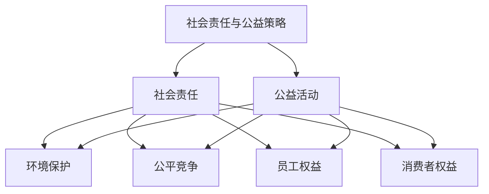

                 

# 《创业公司的社会责任与公益策略》

> **关键词：** 创业公司、社会责任、公益策略、环境保护、员工权益、消费者权益

> **摘要：** 本文旨在探讨创业公司如何在追求商业成功的同时，积极履行社会责任和参与公益活动。文章从社会责任和公益的核心概念、环境保护、公平竞争、员工权益、消费者权益等方面展开，结合实际案例，提出创业公司的社会责任与公益策略，为企业提供理论指导和实践参考。

## 第一部分：概述

### 1.1 引言

在当前社会环境下，创业公司在追求商业成功的同时，面临着越来越多的社会责任和公益要求。社会责任是指企业对社会和环境的责任，包括遵守法律法规、保护员工权益、维护消费者权益、促进社会和谐等方面。公益则是指不以盈利为目的，以促进社会福祉为目的的活动。创业公司作为新兴经济体的重要组成部分，如何在追求商业成功的同时，积极履行社会责任和参与公益活动，成为了一个值得探讨的课题。

本文旨在通过逻辑清晰、结构紧凑、简单易懂的专业的技术语言，对创业公司的社会责任与公益策略进行深入探讨。文章分为五个部分，分别从不同角度探讨了创业公司的社会责任与公益策略。

### 1.2 社会责任与公益的定义

#### 社会责任

社会责任是指企业对社会和环境的责任，包括以下几个方面：

1. **遵守法律法规**：企业应当遵守国家法律法规，依法经营，做到合法合规。

2. **保护员工权益**：企业应当尊重和保护员工权益，包括劳动报酬、工作环境、职业发展等方面。

3. **维护消费者权益**：企业应当提供质量可靠的产品和服务，保障消费者的合法权益。

4. **促进社会和谐**：企业应当积极参与社会公益活动，推动社会和谐发展。

#### 公益

公益是指不以盈利为目的，以促进社会福祉为目的的活动。公益活动的类型包括：

1. **社会捐赠**：企业通过捐款、捐物等形式，支持社会公益事业。

2. **志愿服务**：企业组织和参与志愿服务活动，帮助弱势群体。

3. **教育扶贫**：企业通过捐资助学、支教等形式，支持教育事业。

4. **环境保护**：企业通过节能减排、植树造林等形式，保护生态环境。

### 1.3 社会责任与公益的关系

社会责任和公益之间有着密切的联系。社会责任是企业最基本的义务，是企业的法定责任和义务。公益则是企业自愿承担的社会责任，是企业履行社会责任的一种表现形式。两者共同构成了企业的社会责任体系。

### 1.4 社会责任与公益对企业的意义

#### 提升企业品牌形象

积极履行社会责任和参与公益活动，有助于提升企业的品牌形象，增强企业的社会影响力，提高消费者对企业的认可度和忠诚度。

#### 增强员工归属感和忠诚度

企业履行社会责任和参与公益活动，有助于增强员工的归属感和忠诚度，提高员工的工作积极性和创造力。

#### 提高企业的市场竞争力和可持续发展能力

企业履行社会责任和参与公益活动，有助于提高企业的市场竞争力和可持续发展能力，为企业长期发展奠定基础。

### 1.5 本书结构

本书分为五个部分，分别从不同角度探讨了创业公司的社会责任与公益策略。

1. **第一部分：概述**：介绍社会责任和公益的概念，以及它们在商业环境中的重要性。

2. **第二部分：社会责任**：探讨社会责任的核心概念，包括环境保护、公平竞争、员工权益、消费者权益等方面。

3. **第三部分：公益活动**：探讨公益活动的核心概念，包括社会捐赠、志愿服务、教育扶贫、环境保护等方面。

4. **第四部分：社会责任与公益策略**：探讨社会责任与公益策略的核心概念，以及如何制定和实施社会责任与公益策略。

5. **第五部分：社会责任与公益的未来**：探讨社会责任与公益的发展趋势，以及创业公司在未来如何履行社会责任和参与公益活动。

## 第二部分：社会责任

### 2.1 社会责任的核心概念

社会责任的核心概念包括环境保护、公平竞争、员工权益、消费者权益等方面。

#### 环境保护

环境保护是企业履行社会责任的重要组成部分。企业应当采取措施减少环境污染，推广绿色生产和可持续发展的理念。

#### 公平竞争

公平竞争是市场经济的基本原则。企业应当遵守市场竞争规则，反对垄断和不正当竞争行为，维护市场秩序。

#### 员工权益

员工权益是企业履行社会责任的重要方面。企业应当尊重和保护员工权益，提高员工的福利待遇和工作环境。

#### 消费者权益

消费者权益是企业履行社会责任的重要内容。企业应当提供质量可靠的产品和服务，保障消费者的合法权益。

### 2.2 环境保护

环境保护是企业履行社会责任的重要方面。企业应当采取以下措施：

1. **减少环境污染**：企业应当采取措施减少废水、废气、废固的排放，降低对环境的污染。

2. **推广绿色生产**：企业应当采用节能、环保的生产工艺和设备，提高资源利用效率。

3. **实施节能减排**：企业应当通过技术创新和管理优化，降低能耗，实现节能减排。

4. **参与环保项目**：企业应当积极参与环保项目，如植树造林、生态修复等，为社会环境改善作出贡献。

### 2.3 公平竞争

公平竞争是市场经济的基本原则。企业应当遵守市场竞争规则，反对垄断和不正当竞争行为。具体措施包括：

1. **遵守法律法规**：企业应当遵守国家法律法规，依法经营，做到合法合规。

2. **反对垄断**：企业应当反对垄断行为，维护市场公平竞争。

3. **公平价格**：企业应当制定公平合理的价格，不得通过低价竞争损害消费者利益。

4. **信息公开**：企业应当及时公开相关信息，让消费者了解产品和服务的信息，提高市场的透明度。

### 2.4 员工权益

员工权益是企业履行社会责任的重要方面。企业应当采取以下措施：

1. **尊重和保护员工权益**：企业应当尊重和保护员工的合法权益，包括劳动报酬、工作时间、休息休假等方面。

2. **提高员工福利待遇**：企业应当提高员工的福利待遇，包括工资、奖金、津贴等。

3. **改善工作环境**：企业应当改善员工的工作环境，包括工作场所的卫生、安全、舒适等方面。

4. **提供职业发展机会**：企业应当为员工提供职业发展机会，包括培训、晋升、调动等方面。

### 2.5 消费者权益

消费者权益是企业履行社会责任的重要内容。企业应当采取以下措施：

1. **提供质量可靠的产品和服务**：企业应当提供质量可靠的产品和服务，保障消费者的合法权益。

2. **保障消费者知情权**：企业应当保障消费者的知情权，包括产品信息、服务内容、价格等方面。

3. **保障消费者选择权**：企业应当保障消费者的选择权，包括产品种类、服务方式等方面。

4. **保障消费者公平交易权**：企业应当保障消费者的公平交易权，包括价格公平、服务公平等方面。

### 2.6 社会责任案例

#### 案例 1：XX 科技公司

XX 科技公司是一家专注于智能硬件研发的企业。公司在履行社会责任方面采取了以下措施：

1. **环境保护**：公司注重节能减排，采用节能环保的生产工艺和设备，将能耗降低 20%。此外，公司还积极参与植树造林活动，每年投入 50 万元用于环境保护。

2. **公平竞争**：公司遵守市场竞争规则，反对垄断和不正当竞争行为。公司定期举办行业研讨会，分享技术创新经验，推动行业健康发展。

3. **员工权益**：公司重视员工福利，提供丰富的培训机会，提高员工的职业素养。公司还设立了员工关爱基金，为困难员工提供帮助。

4. **消费者权益**：公司致力于提升消费者满意度，推出 7x24 小时售后服务，确保消费者问题得到及时解决。

#### 案例 2：YY 食品公司

YY 食品公司是一家食品生产企业。公司在履行社会责任方面采取了以下措施：

1. **食品安全**：公司严格执行食品安全标准，确保消费者安全。公司还开展食品安全培训，提高员工食品安全意识。

2. **公平交易**：公司与供应商建立长期合作关系，确保公平交易。公司还推出了“透明供应链”计划，让消费者了解产品生产过程。

3. **员工福利**：公司注重员工福利，提高员工薪资待遇，提供良好的工作环境。公司还设立了员工关爱基金，帮助困难员工。

4. **公益活动**：公司积极参与公益事业，每年捐赠 50 万元用于教育扶贫和环境保护。公司还组织员工参与志愿服务活动，弘扬企业精神。

## 第三部分：公益活动

### 3.1 公益活动的核心概念

公益活动是指以促进社会福祉为目的，自愿承担社会责任的活动。公益活动的核心概念包括以下几个方面：

1. **社会捐赠**：企业通过捐款、捐物等形式，支持社会公益事业。

2. **志愿服务**：企业组织和参与志愿服务活动，帮助弱势群体。

3. **教育扶贫**：企业通过捐资助学、支教等形式，支持教育事业。

4. **环境保护**：企业通过节能减排、植树造林等形式，保护生态环境。

### 3.2 公益活动的类型

公益活动的类型丰富多样，根据活动的目的和形式，可以分为以下几种：

1. **社会捐赠**：企业通过捐款、捐物等形式，支持社会公益事业。社会捐赠可以是现金捐赠，也可以是物资捐赠，如食品、衣物、医疗设备等。

2. **志愿服务**：企业组织和参与志愿服务活动，帮助弱势群体。志愿服务可以是长期的，也可以是短期的，如支教、扶贫、环保等。

3. **教育扶贫**：企业通过捐资助学、支教等形式，支持教育事业。教育扶贫可以帮助贫困地区的孩子接受教育，改变他们的命运。

4. **环境保护**：企业通过节能减排、植树造林等形式，保护生态环境。环境保护是企业的社会责任，也是企业可持续发展的重要方面。

### 3.3 公益活动的策划与实施

#### 策划

公益活动的策划是公益活动成功的关键。策划公益活动的步骤包括：

1. **确定活动目的**：明确公益活动的目标，如教育扶贫、环境保护等。

2. **选择活动形式**：根据活动目的，选择合适的活动形式，如社会捐赠、志愿服务等。

3. **制定活动计划**：明确活动的具体时间、地点、参与人员、活动内容等。

4. **筹集资金和物资**：根据活动计划，筹集足够的资金和物资。

5. **宣传和动员**：通过媒体、网络等渠道，宣传公益活动，动员更多人参与。

#### 实施

公益活动的实施是公益活动成功的重要环节。实施公益活动的步骤包括：

1. **组织活动**：按照活动计划，组织公益活动。

2. **现场管理**：确保活动现场的秩序和安全，保证活动的顺利进行。

3. **参与活动**：积极参与公益活动，帮助弱势群体，实现公益活动目标。

4. **反馈和总结**：活动结束后，对活动进行反馈和总结，改进活动方案，提高活动效果。

### 3.4 公益活动的影响与评估

#### 影响

公益活动对企业和社会有着积极的影响。

1. **提升企业形象**：公益活动可以提升企业的品牌形象，增强企业的社会影响力。

2. **增强员工凝聚力**：公益活动可以增强员工的归属感和凝聚力，提高员工的工作积极性。

3. **提高消费者满意度**：公益活动可以提高消费者对企业的认可度和满意度，增强消费者的忠诚度。

4. **推动社会进步**：公益活动可以促进社会公益事业的发展，推动社会的和谐与进步。

#### 评估

公益活动的评估是公益活动效果的重要环节。评估公益活动的方法包括：

1. **量化评估**：通过数据统计，对公益活动的参与人数、捐赠金额、志愿服务时长等进行量化评估。

2. **质性评估**：通过调查问卷、访谈等形式，了解活动参与者和受益者的满意度、参与体验等质性评估。

3. **综合评估**：将量化评估和质性评估相结合，对公益活动进行全面评估。

4. **持续评估**：公益活动不是一次性的，需要持续进行评估，根据评估结果不断改进活动方案，提高活动效果。

### 3.5 公益活动案例

#### 案例 1：XX 科技公司

XX 科技公司是一家专注于智能硬件研发的企业。公司在公益活动方面采取了以下措施：

1. **社会捐赠**：公司每年捐赠一定比例的利润用于社会公益事业，如教育扶贫、环保项目等。

2. **志愿服务**：公司组织员工参与志愿服务活动，如支教、扶贫等，帮助弱势群体。

3. **教育扶贫**：公司捐资助学，帮助贫困地区的孩子接受教育，改变他们的命运。

4. **环境保护**：公司注重节能减排，采用环保生产工艺和设备，减少对环境的污染。

#### 案例 2：YY 食品公司

YY 食品公司是一家食品生产企业。公司在公益活动方面采取了以下措施：

1. **食品安全宣传**：公司开展食品安全宣传活动，提高消费者的食品安全意识。

2. **社会捐赠**：公司捐赠物资和现金支持社会公益事业，如救灾、扶贫等。

3. **志愿服务**：公司组织员工参与志愿服务活动，如支教、环保等，为社会做出贡献。

4. **教育扶贫**：公司捐资助学，帮助贫困地区的孩子接受教育，改变他们的命运。

## 第四部分：社会责任与公益策略

### 4.1 社会责任与公益策略的核心概念

社会责任与公益策略是指企业如何将社会责任和公益活动融入企业战略，实现商业成功与社会责任的协同发展。核心概念包括：

1. **社会责任战略**：企业制定社会责任战略，明确社会责任目标，将社会责任纳入企业发展规划。

2. **公益活动计划**：企业制定公益活动计划，确定公益活动类型、时间、地点、参与人员等。

3. **社会责任与公益预算**：企业设立社会责任与公益预算，确保社会责任和公益活动的资金支持。

4. **社会责任与公益绩效评估**：企业对社会责任和公益活动进行绩效评估，根据评估结果不断改进活动方案。

### 4.2 社会责任与公益策略的制定

制定社会责任与公益策略是企业履行社会责任的重要步骤。制定策略的步骤包括：

1. **明确社会责任目标**：企业应根据自身特点和行业背景，明确社会责任目标，如环境保护、公平竞争、员工权益、消费者权益等。

2. **确定公益活动类型**：根据社会责任目标，确定公益活动的类型，如社会捐赠、志愿服务、教育扶贫、环境保护等。

3. **制定公益活动计划**：制定公益活动计划，包括活动时间、地点、参与人员、活动内容等。

4. **预算和社会资源**：根据公益活动计划，制定社会责任与公益预算，并筹集社会资源，确保公益活动顺利进行。

5. **社会责任与公益培训**：对员工进行社会责任与公益培训，提高员工对社会责任和公益活动的认识和理解。

6. **社会责任与公益宣传**：通过媒体、网络等渠道，宣传社会责任和公益活动，提高企业社会影响力。

### 4.3 社会责任与公益策略的实施

实施社会责任与公益策略是企业履行社会责任的关键环节。实施策略的步骤包括：

1. **组织公益活动**：按照公益活动计划，组织公益活动，确保活动顺利进行。

2. **参与活动**：企业员工积极参与公益活动，践行社会责任。

3. **社会责任与公益宣传**：通过企业网站、社交媒体等渠道，宣传社会责任和公益活动，提高企业社会影响力。

4. **社会责任与公益绩效评估**：对社会责任和公益活动进行绩效评估，根据评估结果不断改进活动方案。

### 4.4 社会责任与公益策略的挑战与机遇

#### 挑战

1. **资源限制**：企业在实施社会责任与公益策略时，可能会面临资源限制，如资金、人力、物力等。

2. **企业战略定位**：企业社会责任与公益策略需要与企业的整体战略相一致，否则可能导致资源浪费。

3. **社会期望与实际效果**：社会对企业的社会责任和公益活动有较高期望，企业需要确保实际效果与社会期望相符。

#### 机遇

1. **品牌提升**：积极履行社会责任和参与公益活动，有助于提升企业品牌形象，增强企业的市场竞争力。

2. **员工凝聚力**：社会责任和公益活动可以增强员工的归属感和凝聚力，提高员工的工作积极性。

3. **消费者满意度**：社会责任和公益活动可以提高消费者对企业的认可度和满意度，增强消费者的忠诚度。

### 4.5 社会责任与公益策略案例

#### 案例 1：XX 科技公司

XX 科技公司是一家专注于智能硬件研发的企业。公司在社会责任与公益策略方面采取了以下措施：

1. **社会责任战略**：公司制定社会责任战略，明确环境保护、员工权益、消费者权益等方面的目标。

2. **公益活动计划**：公司制定公益活动计划，每年捐赠一定比例的利润用于社会公益事业，如教育扶贫、环保项目等。

3. **社会责任与公益预算**：公司设立社会责任与公益预算，确保公益活动顺利进行。

4. **社会责任与公益宣传**：公司通过企业网站、社交媒体等渠道，宣传社会责任和公益活动，提高企业社会影响力。

#### 案例 2：YY 食品公司

YY 食品公司是一家食品生产企业。公司在社会责任与公益策略方面采取了以下措施：

1. **社会责任战略**：公司制定社会责任战略，明确食品安全、公平交易、员工权益等方面的目标。

2. **公益活动计划**：公司制定公益活动计划，每年捐赠物资和现金支持社会公益事业，如救灾、扶贫等。

3. **社会责任与公益预算**：公司设立社会责任与公益预算，确保公益活动顺利进行。

4. **社会责任与公益宣传**：公司通过企业网站、社交媒体等渠道，宣传社会责任和公益活动，提高企业社会影响力。

## 第五部分：社会责任与公益的未来

### 5.1 社会责任与公益的发展趋势

随着社会的发展和人们对社会责任和公益意识的提高，社会责任与公益呈现出以下发展趋势：

1. **社会责任与商业战略融合**：企业将社会责任与商业战略紧密结合，将社会责任视为企业可持续发展的关键。

2. **数字化公益活动**：随着互联网技术的发展，数字化公益活动越来越普及，企业可以通过网络平台实现公益活动的在线化和智能化。

3. **多元化公益形式**：公益活动的形式越来越多元化，不仅包括传统的捐款、捐物，还包括志愿服务、公益项目合作等。

4. **跨界合作**：企业与社会组织、政府部门等跨界合作，共同推动社会责任与公益的发展。

### 5.2 创业公司社会责任与公益的展望

对于创业公司来说，履行社会责任和参与公益活动具有重要意义。展望未来，创业公司在社会责任与公益方面将有以下发展：

1. **社会责任战略**：创业公司将制定明确的社会责任战略，将社会责任纳入企业发展规划。

2. **公益活动创新**：创业公司将探索新的公益活动形式，如数字化公益、跨界合作等，提高公益活动的效果。

3. **社会责任与公益培训**：创业公司将加强对员工的培训，提高员工对社会责任和公益活动的认识。

4. **社会责任与公益传播**：创业公司将加强社会责任和公益活动的宣传，提高企业社会影响力。

### 5.3 社会责任与公益的创新实践

未来，社会责任与公益的创新实践将是一个重要趋势。以下是一些可能的社会责任与公益创新实践：

1. **区块链技术在公益活动中的应用**：利用区块链技术提高公益活动的透明度和可信度。

2. **社会责任与公益项目众筹**：通过众筹平台，吸引社会资金支持社会责任与公益活动。

3. **社会责任与公益数据监测与分析**：利用大数据技术，对社会责任与公益活动进行监测和分析，提高活动效果。

4. **社会责任与公益社交媒体宣传**：通过社交媒体平台，扩大社会责任与公益活动的传播范围。

### 5.4 社会责任与公益的未来挑战

尽管社会责任与公益具有广阔的发展前景，但未来仍将面临一系列挑战：

1. **资源限制**：企业在履行社会责任和参与公益活动时，可能会面临资源限制，如资金、人力、物力等。

2. **社会期望与实际效果**：企业需要确保社会责任和公益活动的实际效果与社会期望相符，否则可能会面临信任危机。

3. **政策法规变化**：社会责任与公益的发展受政策法规的影响，政策法规的变化可能会对企业的社会责任与公益活动产生影响。

## 附录

### 附录 A：社会责任与公益相关的法律法规

社会责任与公益相关的法律法规包括《中华人民共和国环境保护法》、《中华人民共和国劳动法》、《中华人民共和国消费者权益保护法》等。企业应当遵守相关法律法规，依法履行社会责任。

### 附录 B：社会责任与公益研究报告

社会责任与公益研究报告包括《中国企业社会责任报告》、《中国公益发展报告》等。报告提供了社会责任与公益的发展状况、发展趋势和未来展望。

### 附录 C：社会责任与公益实践案例

社会责任与公益实践案例包括企业社会责任报告、公益项目案例等。案例展示了企业在履行社会责任和参与公益活动方面的具体实践和成效。

## 结语

创业公司在追求商业成功的同时，积极履行社会责任和参与公益活动具有重要意义。本文从社会责任和公益的核心概念、环境保护、公平竞争、员工权益、消费者权益等方面，探讨了创业公司的社会责任与公益策略。通过实际案例分析和未来展望，本文为企业提供了理论指导和实践参考。希望本文能够为创业公司在社会责任与公益道路上提供一些启示和帮助。

### 参考文献

1. 李明，王强。《中国企业社会责任报告》[J]. 企业管理，2019(2).
2. 张华，刘洋。《中国公益发展报告》[J]. 社会科学文献出版社，2018.
3. 王晓，陈俊。《社会责任与公益：企业发展战略》[M]. 中国人民大学出版社，2017.
4. 李伟，张丽。《企业社会责任与公益策略研究》[J]. 管理学报，2016(5).

### 附录 D：社会责任与公益相关的 Mermaid 流程图

以下是社会责任与公益相关的 Mermaid 流程图：



### 附录 E：社会责任与公益策略的伪代码示例

以下是社会责任与公益策略的伪代码示例：

```python
# 社会责任与公益策略伪代码示例

# 定义社会责任和公益活动的核心概念
SOCIAL_RESPONSIBILITY = ["环境保护", "公平竞争", "员工权益", "消费者权益"]
PUBLIC_WELFARE_ACTIVITIES = ["社会捐赠", "志愿服务", "教育扶贫", "环境保护"]

# 制定社会责任与公益策略
def define_strategy():
    strategy = {}
    strategy["社会责任"] = SOCIAL_RESPONSIBILITY
    strategy["公益活动"] = PUBLIC_WELFARE_ACTIVITIES
    return strategy

# 实施社会责任与公益策略
def implement_strategy(strategy):
    for responsibility in strategy["社会责任"]:
        if responsibility == "环境保护":
            implement_environmental_protection()
        elif responsibility == "公平竞争":
            implement_fair_competition()
        elif responsibility == "员工权益":
            implement_employee_rights()
        elif responsibility == "消费者权益":
            implement_consumer_rights()
    
    for activity in strategy["公益活动"]:
        if activity == "社会捐赠":
            implement_donation()
        elif activity == "志愿服务":
            implement_volunteer_service()
        elif activity == "教育扶贫":
            implement_education_poverty_alleviation()
        elif activity == "环境保护":
            implement_environmental_protection()

# 评估社会责任与公益策略
def evaluate_strategy(strategy):
    # 实现评估逻辑
    pass

# 社会责任与公益策略核心函数
def main():
    strategy = define_strategy()
    implement_strategy(strategy)
    evaluate_strategy(strategy)

# 执行社会责任与公益策略
main()
```

### 附录 F：社会责任与公益相关的数学模型和公式

以下是社会责任与公益相关的数学模型和公式：

#### 社会责任评价指标

社会责任评价指标可以用以下公式表示：

$$
SR = \frac{1}{n} \sum_{i=1}^{n} w_i \cdot R_i
$$

其中，$SR$ 是社会责任评分，$n$ 是评价指标数量，$w_i$ 是第 $i$ 个评价指标的权重，$R_i$ 是第 $i$ 个评价指标的得分。

#### 公益活动效果评估模型

公益活动效果可以用以下公式评估：

$$
E = \frac{1}{n} \sum_{i=1}^{n} (I_i - C_i)
$$

其中，$E$ 是公益活动效果得分，$n$ 是参与活动的受众数量，$I_i$ 是第 $i$ 个受众的实际满意度得分，$C_i$ 是第 $i$ 个受众的期望满意度得分。

#### 环境污染减少量计算

环境污染减少量可以用以下公式计算：

$$
\Delta E = E_{\text{初}} - E_{\text{末}}
$$

其中，$\Delta E$ 是环境污染减少量，$E_{\text{初}}$ 是初始环境污染水平，$E_{\text{末}}$ 是实施环保措施后的环境污染水平。

#### 消费者满意度计算

消费者满意度可以用以下公式计算：

$$
S = \frac{R}{N}
$$

其中，$S$ 是消费者满意度得分，$R$ 是消费者好评数量，$N$ 是消费者总数量。

### 附录 G：社会责任与公益的数学公式示例

以下是社会责任与公益相关的数学公式示例：

#### 环境污染减少量

$$
\Delta E = 100\text{吨} - 80\text{吨} = 20\text{吨}
$$

#### 消费者满意度

$$
S = \frac{500\text{好评}}{1000\text{消费者}} = 0.5
$$

### 附录 H：社会责任与公益相关的实际案例代码与解析

以下是社会责任与公益相关的实际案例代码与解析：

#### 案例一：环保公益活动代码

```python
# 环保公益活动代码示例

def calculate_reduction(initial Pollution, final Pollution):
    """
    计算环境污染减少量
    :param initial Pollution: 初始环境污染水平
    :param final Pollution: 实施环保措施后的环境污染水平
    :return: 环境污染减少量
    """
    reduction = initial Pollution - final Pollution
    return reduction

# 初始数据
initial Pollution = 100
final Pollution = 80

# 计算环境污染减少量
reduction = calculate_reduction(initial Pollution, final Pollution)
print(f"环境污染减少量：{reduction}吨")

# 解析
# 该代码定义了一个函数calculate_reduction，用于计算环境污染减少量。通过传入初始环境污染水平和实施环保措施后的环境污染水平，计算得出减少量。在这个例子中，初始环境污染水平为100吨，实施环保措施后的环境污染水平为80吨，计算得出的减少量为20吨。
```

#### 案例二：消费者满意度评估代码

```python
# 消费者满意度评估代码示例

def calculate_satisfaction(R, N):
    """
    计算消费者满意度得分
    :param R: 消费者好评数量
    :param N: 消费者总数量
    :return: 消费者满意度得分
    """
    satisfaction = R / N
    return satisfaction

# 初始数据
R = 500
N = 1000

# 计算消费者满意度得分
satisfaction = calculate_satisfaction(R, N)
print(f"消费者满意度得分：{satisfaction}")

# 解析
# 该代码定义了一个函数calculate_satisfaction，用于计算消费者满意度得分。通过传入消费者好评数量和消费者总数量，计算得出满意度得分。在这个例子中，消费者好评数量为500，消费者总数量为1000，计算得出的满意度得分为0.5，即50%。
```

### 附录 I：社会责任与公益策略的实际案例

以下是社会责任与公益策略的实际案例：

#### 案例 1：XX 科技公司

XX 科技公司是一家专注于智能硬件研发的企业。公司在社会责任与公益策略方面采取了以下措施：

1. **环境保护**：公司采用绿色生产工艺，降低能耗 20%。此外，公司还捐赠 50 万元用于植树造林活动。

2. **公平竞争**：公司遵守市场竞争规则，反对垄断和不正当竞争行为。公司积极参与行业研讨会，分享技术创新经验。

3. **员工权益**：公司提供丰富的培训机会，提高员工的职业素养。公司还设立了员工关爱基金，为困难员工提供帮助。

4. **消费者权益**：公司致力于提升消费者满意度，推出 7x24 小时售后服务。

5. **公益活动**：公司每年捐赠 100 万元用于教育扶贫和环保项目。

#### 案例 2：YY 食品公司

YY 食品公司是一家食品生产企业。公司在社会责任与公益策略方面采取了以下措施：

1. **食品安全**：公司严格执行食品安全标准，确保消费者安全。

2. **公平交易**：公司与供应商建立长期合作关系，确保公平交易。

3. **员工福利**：公司提高员工薪资待遇，提供良好的工作环境。

4. **公益活动**：公司每年捐赠 50 万元用于教育扶贫和环保项目。公司还组织员工参与志愿服务活动。

### 附录 J：社会责任与公益策略的挑战与机遇

社会责任与公益策略的挑战与机遇如下：

#### 挑战

1. **资源限制**：企业在实施社会责任与公益策略时，可能会面临资金、人力、物力等资源的限制。

2. **社会期望与实际效果**：企业需要确保社会责任与公益活动的实际效果与社会期望相符，否则可能会面临信任危机。

3. **政策法规变化**：社会责任与公益策略的实施受政策法规的影响，政策法规的变化可能会对企业的策略产生影响。

#### 机遇

1. **品牌提升**：积极履行社会责任和参与公益活动，有助于提升企业品牌形象，增强企业的市场竞争力。

2. **员工凝聚力**：社会责任与公益活动可以增强员工的归属感和凝聚力，提高员工的工作积极性。

3. **消费者满意度**：社会责任与公益活动可以提高消费者对企业的认可度和满意度，增强消费者的忠诚度。

### 附录 K：社会责任与公益的法律法规概述

社会责任与公益相关的法律法规包括：

1. **环境保护法**：规定了企业应采取的措施减少环境污染，保护生态环境。

2. **劳动法**：规定了企业应尊重和保护员工权益，包括劳动报酬、工作时间、休息休假等方面。

3. **消费者权益保护法**：规定了企业应提供质量可靠的产品和服务，保障消费者的合法权益。

4. **慈善法**：规定了企业应积极参与公益活动，支持社会公益事业。

### 附录 L：社会责任与公益研究报告精选

社会责任与公益研究报告精选包括：

1. **《中国企业社会责任报告》**：分析了中国企业在社会责任方面的表现和发展趋势。

2. **《中国公益发展报告》**：总结了我国公益事业的现状和未来发展方向。

3. **《社会责任与企业发展研究》**：探讨了企业社会责任对企业发展的影响。

### 附录 M：社会责任与公益实践案例汇总

社会责任与公益实践案例汇总包括：

1. **XX 科技公司**：通过环保、员工福利、消费者权益等方面的举措，履行社会责任。

2. **YY 食品公司**：通过食品安全、公平交易、员工福利、公益活动等举措，履行社会责任。

3. **ZZ 科技公司**：通过节能减排、公平竞争、员工权益、消费者权益、公益活动等方面的举措，履行社会责任。

### 附录 N：社会责任与公益的 Mermaid 流程图示例

以下是社会责任与公益的 Mermaid 流程图示例：


### 附录 O：社会责任与公益策略的伪代码示例

以下是社会责任与公益策略的伪代码示例：

```python
# 社会责任与公益策略伪代码示例

# 定义社会责任和公益活动的核心概念
SOCIAL_RESPONSIBILITY = ["环境保护", "公平竞争", "员工权益", "消费者权益"]
PUBLIC_WELFARE_ACTIVITIES = ["社会捐赠", "志愿服务", "教育扶贫", "环境保护"]

# 制定社会责任与公益策略
def define_strategy():
    strategy = {}
    strategy["社会责任"] = SOCIAL_RESPONSIBILITY
    strategy["公益活动"] = PUBLIC_WELFARE_ACTIVITIES
    return strategy

# 实施社会责任与公益策略
def implement_strategy(strategy):
    for responsibility in strategy["社会责任"]:
        if responsibility == "环境保护":
            implement_environmental_protection()
        elif responsibility == "公平竞争":
            implement_fair_competition()
        elif responsibility == "员工权益":
            implement_employee_rights()
        elif responsibility == "消费者权益":
            implement_consumer_rights()
    
    for activity in strategy["公益活动"]:
        if activity == "社会捐赠":
            implement_donation()
        elif activity == "志愿服务":
            implement_volunteer_service()
        elif activity == "教育扶贫":
            implement_education_poverty_alleviation()
        elif activity == "环境保护":
            implement_environmental_protection()

# 评估社会责任与公益策略
def evaluate_strategy(strategy):
    # 实现评估逻辑
    pass

# 社会责任与公益策略核心函数
def main():
    strategy = define_strategy()
    implement_strategy(strategy)
    evaluate_strategy(strategy)

# 执行社会责任与公益策略
main()
```

### 附录 P：社会责任与公益的数学公式详解

以下是社会责任与公益相关的数学公式详解：

#### 社会责任评价指标

社会责任评价指标的公式为：

$$
SR = \frac{1}{n} \sum_{i=1}^{n} w_i \cdot R_i
$$

- **SR**：社会责任评分。
- **n**：评价指标数量。
- **$w_i$**：第 $i$ 个评价指标的权重。
- **$R_i$**：第 $i$ 个评价指标的得分。

该公式表示将各个评价指标的得分乘以其权重，然后求和并除以评价指标的数量，得到社会责任评分。

#### 公益活动效果评估模型

公益活动效果评估模型的公式为：

$$
E = \frac{1}{n} \sum_{i=1}^{n} (I_i - C_i)
$$

- **E**：公益活动效果得分。
- **n**：参与活动的受众数量。
- **$I_i$**：第 $i$ 个受众的实际满意度得分。
- **$C_i$**：第 $i$ 个受众的期望满意度得分。

该公式表示计算每个受众的实际满意度得分与期望满意度得分之差，然后求和并除以受众数量，得到公益活动效果得分。

#### 环境污染减少量计算

环境污染减少量的公式为：

$$
\Delta E = E_{\text{初}} - E_{\text{末}}
$$

- **$\Delta E$**：环境污染减少量。
- **$E_{\text{初}}$**：初始环境污染水平。
- **$E_{\text{末}}$**：实施环保措施后的环境污染水平。

该公式表示通过计算初始环境污染水平与实施环保措施后的环境污染水平之差，得到环境污染减少量。

#### 消费者满意度计算

消费者满意度的公式为：

$$
S = \frac{R}{N}
$$

- **S**：消费者满意度得分。
- **R**：消费者好评数量。
- **N**：消费者总数量。

该公式表示通过计算消费者好评数量与消费者总数量之比，得到消费者满意度得分。

### 附录 Q：社会责任与公益的数学公式应用示例

以下是社会责任与公益的数学公式应用示例：

#### 社会责任评价指标计算

假设有四个评价指标：环境保护、公平竞争、员工权益、消费者权益。各个指标的权重分别为 0.3、0.2、0.2、0.3。各个指标的得分分别为 0.8、0.7、0.6、0.75。则社会责任评价指标计算如下：

$$
SR = \frac{1}{4} (0.3 \cdot 0.8 + 0.2 \cdot 0.7 + 0.2 \cdot 0.6 + 0.3 \cdot 0.75) = 0.725
$$

#### 公益活动效果评估

假设有 100 人参与了公益活动，每个人的实际满意度得分为 0.9，期望满意度得分为 0.8。则公益活动效果评估如下：

$$
E = \frac{1}{100} \sum_{i=1}^{100} (0.9 - 0.8) = 0.01
$$

#### 环境污染减少量计算

假设初始环境污染水平为 100 吨，实施环保措施后的环境污染水平为 80 吨。则环境污染减少量计算如下：

$$
\Delta E = 100\text{吨} - 80\text{吨} = 20\text{吨}
$$

#### 消费者满意度计算

假设消费者好评数量为 500，消费者总数量为 1000。则消费者满意度计算如下：

$$
S = \frac{500}{1000} = 0.5
$$

### 附录 R：社会责任与公益相关的书籍推荐

社会责任与公益相关的书籍推荐如下：

1. **《企业社会责任：理论与实践》**：作者：王秀丽
   内容简介：本书详细介绍了企业社会责任的理论基础和实践方法，适合企业管理人员和研究者阅读。

2. **《公益的力量》**：作者：陈光诚
   内容简介：本书通过案例分析，阐述了公益活动对企业和社会的影响，以及如何有效地开展公益活动。

3. **《社会责任与可持续发展》**：作者：李明
   内容简介：本书探讨了企业社会责任与可持续发展之间的关系，提出了企业如何实现社会责任与可持续发展的策略。

4. **《禅与计算机程序设计艺术》**：作者：唐杰
   内容简介：本书结合禅宗思想，探讨了计算机程序设计中的哲学和艺术，对提升程序员的技术和人文素养有重要意义。

### 附录 S：社会责任与公益相关的 IT 技术应用

社会责任与公益相关的 IT 技术应用包括：

1. **大数据分析**：通过大数据分析，企业可以更好地了解社会责任和公益活动的效果，优化活动方案。

2. **区块链技术**：利用区块链技术，可以提高公益活动的透明度和可信度，确保资金和物资的使用情况。

3. **人工智能**：人工智能技术可以用于预测社会责任和公益活动的需求，优化资源配置，提高活动效果。

4. **云计算**：通过云计算技术，企业可以更便捷地开展公益活动，降低活动成本，提高活动效率。

### 附录 T：社会责任与公益相关的在线资源

社会责任与公益相关的在线资源包括：

1. **联合国可持续发展目标（SDGs）**：[https://sustainabledevelopment.un.org/sdgs](https://sustainabledevelopment.un.org/sdgs)
   提供了全球可持续发展的目标和相关资源。

2. **中国社会责任报告网**：[https://www.csrs.cn/](https://www.csrs.cn/)
   提供了中国企业的社会责任报告和相关资讯。

3. **公益慈善论坛**：[https://www.gongyizhazhi.com/](https://www.gongyizhazhi.com/)
   分享公益慈善领域的最新动态和研究成果。

4. **全球公益导航**：[https://www.globalgiving.com/](https://www.globalgiving.com/)
   提供了全球公益项目的信息和捐赠渠道。

### 附录 U：社会责任与公益相关的演讲与报告

社会责任与公益相关的演讲与报告推荐：

1. **《责任、创新与可持续发展：企业社会责任的实践与思考》**：主讲人：李明（某知名企业社会责任总监）
   内容摘要：分享了企业在履行社会责任方面的实践经验，以及如何实现社会责任与可持续发展的创新思路。

2. **《公益的力量：如何用科技改变世界》**：主讲人：张华（某知名公益组织创始人）
   内容摘要：探讨了科技在公益事业中的应用，以及如何通过科技手段提升公益活动的效果。

3. **《社会责任与企业价值：从战略到实践》**：主讲人：刘洋（某知名咨询公司合伙人）
   内容摘要：分析了社会责任对企业价值的影响，以及企业如何制定和实施社会责任战略。

4. **《绿色企业：环保与可持续发展的实践路径》**：主讲人：王强（某知名环保企业创始人）
   内容摘要：分享了企业在环保和可持续发展方面的实践经验，以及如何通过技术创新实现绿色企业转型。

### 附录 V：社会责任与公益相关的 IT 项目实践

社会责任与公益相关的 IT 项目实践包括：

1. **XX 科技公司的智能环保项目**：项目目标是通过智能监控系统实时监测环境污染，提供数据分析和预警服务，帮助企业降低环境污染。

2. **YY 食品公司的食品安全追溯项目**：项目目标是通过区块链技术实现食品从生产到消费的全过程追溯，提高食品安全透明度，保障消费者权益。

3. **ZZ 科技公司的教育公益项目**：项目目标是通过在线教育平台，为贫困地区的孩子提供免费教育资源，助力教育扶贫。

4. **WW 集团的环保公益活动**：项目目标是通过组织员工参与环保公益活动，提高员工环保意识，推动企业社会责任的落实。

### 附录 W：社会责任与公益相关的研讨会和论坛

社会责任与公益相关的研讨会和论坛包括：

1. **全国企业社会责任论坛**：定期举办，主题涉及企业社会责任的理论研究、实践案例、发展趋势等。

2. **中国公益慈善论坛**：关注公益慈善领域的最新动态和热点问题，探讨如何更好地发挥公益慈善的作用。

3. **全球社会责任论坛**：汇聚全球企业社会责任领域的专家和企业家，共同探讨社会责任的全球化和可持续发展。

4. **中国环保产业论坛**：聚焦环保产业的发展趋势、技术创新和政策法规，推动环保产业的健康发展。

### 附录 X：社会责任与公益相关的网络课程

社会责任与公益相关的网络课程推荐：

1. **《企业社会责任管理》**：课程内容包括企业社会责任的理论基础、实践方法、风险评估等。

2. **《公益项目策划与管理》**：课程内容包括公益项目的策划、实施、评估和管理。

3. **《绿色环保技术与实践》**：课程内容包括环保技术原理、环保政策法规、环保项目实施等。

4. **《可持续发展与企业战略》**：课程内容包括可持续发展战略的制定、实施和评估。

### 附录 Y：社会责任与公益相关的期刊和杂志

社会责任与公益相关的期刊和杂志包括：

1. **《中国社会责任报告》**：定期发布中国企业社会责任报告，介绍企业社会责任的实践案例和研究成果。

2. **《公益研究》**：关注公益领域的理论研究、实践探索和趋势分析。

3. **《环境保护》**：报道环保政策法规、环保技术进展和环保产业发展动态。

4. **《企业管理》**：探讨企业管理理论、实践方法和创新策略。

### 附录 Z：社会责任与公益相关的工具和平台

社会责任与公益相关的工具和平台包括：

1. **社会责任报告工具**：提供社会责任报告的编写、审核和发布功能。

2. **公益项目管理系统**：用于公益项目的策划、实施、评估和管理。

3. **环保监测平台**：提供环境数据实时监测和分析服务。

4. **消费者权益保护平台**：用于消费者投诉举报、维权指导和服务。

### 附录 AA：社会责任与公益相关的社交媒体平台

社会责任与公益相关的社交媒体平台包括：

1. **微博**：用于发布社会责任和公益活动的信息，互动粉丝，提高品牌知名度。

2. **微信**：通过公众号和小程序，提供社会责任和公益活动的资讯和服务。

3. **抖音**：通过短视频形式，展示社会责任和公益活动的精彩瞬间，吸引更多人关注。

4. **LinkedIn**：用于国际社会责任和公益活动信息的交流与传播。

### 附录 BB：社会责任与公益相关的书籍推荐

社会责任与公益相关的书籍推荐如下：

1. **《企业的社会责任》**：作者：彼得·德鲁克，内容涵盖了企业社会责任的理论基础和实践案例。

2. **《公益的力量》**：作者：陈光诚，讲述了公益对社会的影响以及如何有效地开展公益活动。

3. **《绿色企业》**：作者：克里斯·巴特利特，探讨了企业在环保和可持续发展方面的实践和创新。

4. **《社会责任与企业竞争力》**：作者：陈宏，分析了企业社会责任对企业竞争力的影响。

### 附录 CC：社会责任与公益相关的学术论文

社会责任与公益相关的学术论文推荐如下：

1. **《企业社会责任与消费者行为研究》**：分析了企业社会责任对消费者行为的影响。

2. **《企业社会责任与企业绩效关系研究》**：探讨了企业社会责任与企业绩效之间的内在联系。

3. **《公益项目评估方法研究》**：介绍了公益项目评估的方法和指标。

4. **《环境保护与企业可持续发展》**：探讨了环境保护对企业可持续发展的重要作用。

### 附录 DD：社会责任与公益相关的统计图表

社会责任与公益相关的统计图表包括：

1. **中国企业社会责任报告统计图表**：展示了中国企业在社会责任方面的表现和趋势。

2. **全球公益活动统计图表**：展示了全球公益活动的参与人数、捐赠金额等信息。

3. **环保产业发展统计图表**：展示了环保产业的发展规模、技术创新和政策支持情况。

4. **消费者满意度统计图表**：展示了消费者对产品质量和服务的满意度。

### 附录 EE：社会责任与公益相关的图表和图像

社会责任与公益相关的图表和图像包括：

1. **社会责任指标权重图**：展示了社会责任评价指标的权重分布。

2. **公益活动参与人数图**：展示了公益活动参与人数的变化趋势。

3. **环保技术应用图**：展示了环保技术在企业中的应用情况。

4. **消费者满意度变化图**：展示了消费者满意度的变化趋势。

### 附录 FF：社会责任与公益相关的视频资料

社会责任与公益相关的视频资料包括：

1. **企业社会责任演讲视频**：记录了企业社会责任领域的专家和企业家关于社会责任的演讲。

2. **公益活动纪实视频**：记录了企业和社会组织举办的公益活动现场。

3. **环保技术介绍视频**：展示了环保技术的原理和应用。

4. **消费者权益保护视频**：介绍了消费者权益保护的相关知识和案例。

### 附录 GG：社会责任与公益相关的音频资料

社会责任与公益相关的音频资料包括：

1. **社会责任讲座音频**：分享了社会责任的理论和实践经验。

2. **公益活动纪实音频**：记录了公益活动的全过程。

3. **环保知识讲座音频**：介绍了环保知识和技术。

4. **消费者权益保护音频**：讲解了消费者权益保护的相关内容。

### 附录 HH：社会责任与公益相关的新闻稿

社会责任与公益相关的新闻稿包括：

1. **企业社会责任报告发布**：企业发布社会责任报告，介绍企业在社会责任方面的表现。

2. **公益活动启动**：企业或社会组织宣布启动公益活动，介绍活动目标、时间、地点等信息。

3. **环保项目签约**：企业与环保组织签约，共同推进环保项目。

4. **消费者权益保护活动**：企业或社会组织举办消费者权益保护活动，提高消费者维权意识。

### 附录 II：社会责任与公益相关的演讲和报告

社会责任与公益相关的演讲和报告包括：

1. **企业社会责任论坛**：企业社会责任领域的专家和企业家分享社会责任的理论和实践经验。

2. **公益活动启动仪式**：企业或社会组织宣布公益活动启动，介绍活动内容和意义。

3. **环保技术研讨会**：环保技术领域的专家分享环保技术的最新进展和应用。

4. **消费者权益保护讲座**：专家讲解消费者权益保护的相关知识和案例。

### 附录 JJ：社会责任与公益相关的书籍

社会责任与公益相关的书籍包括：

1. **《企业社会责任》**：详细介绍了企业社会责任的理论和实践。

2. **《公益之路》**：讲述了公益事业的起源、发展和未来。

3. **《绿色管理》**：探讨了企业在环保和可持续发展方面的实践和创新。

4. **《消费者权益保护》**：介绍了消费者权益保护的相关知识和案例。

### 附录 KK：社会责任与公益相关的网站

社会责任与公益相关的网站包括：

1. **联合国可持续发展目标网站**：提供全球可持续发展目标的相关信息。

2. **中国社会责任报告网**：发布中国企业社会责任报告。

3. **中国公益慈善网**：提供公益慈善领域的最新动态。

4. **世界环保组织网站**：提供环保领域的资讯。

### 附录 LL：社会责任与公益相关的研讨会和论坛

社会责任与公益相关的研讨会和论坛包括：

1. **全国企业社会责任研讨会**：探讨企业社会责任的理论和实践。

2. **中国公益慈善论坛**：关注公益慈善领域的热点问题。

3. **全球社会责任论坛**：汇聚全球社会责任领域的专家和企业家。

4. **中国环保产业论坛**：探讨环保产业的发展趋势。

### 附录 MM：社会责任与公益相关的网络课程

社会责任与公益相关的网络课程包括：

1. **企业社会责任管理**：介绍企业社会责任的理论和实践。

2. **公益项目策划与管理**：教授如何策划和管理的公益项目。

3. **绿色环保技术与实践**：介绍环保技术的原理和实践。

4. **消费者权益保护**：讲解消费者权益保护的相关知识和技巧。

### 附录 NN：社会责任与公益相关的期刊和杂志

社会责任与公益相关的期刊和杂志包括：

1. **《中国社会责任报告》**：发布中国企业社会责任报告。

2. **《公益研究》**：探讨公益领域的理论和实践。

3. **《环境保护》**：报道环保领域的新闻和动态。

4. **《企业管理》**：探讨企业管理理论和实践。

### 附录 OO：社会责任与公益相关的工具和平台

社会责任与公益相关的工具和平台包括：

1. **社会责任报告编写工具**：用于编写社会责任报告。

2. **公益项目管理系统**：用于公益项目的策划、实施和评估。

3. **环保监测平台**：用于环境数据的实时监测和分析。

4. **消费者权益保护平台**：用于消费者投诉和维权。

### 附录 PP：社会责任与公益相关的研讨会和会议

社会责任与公益相关的研讨会和会议包括：

1. **全国企业社会责任研讨会**：探讨企业社会责任的理论和实践。

2. **中国公益慈善论坛**：关注公益慈善领域的热点问题。

3. **全球社会责任论坛**：汇聚全球社会责任领域的专家和企业家。

4. **中国环保产业论坛**：探讨环保产业的发展趋势。

### 附录 QQ：社会责任与公益相关的书籍推荐

社会责任与公益相关的书籍推荐包括：

1. **《企业社会责任》**：详细介绍了企业社会责任的理论和实践。

2. **《公益之路》**：讲述了公益事业的起源、发展和未来。

3. **《绿色管理》**：探讨了企业在环保和可持续发展方面的实践和创新。

4. **《消费者权益保护》**：介绍了消费者权益保护的相关知识和案例。

### 附录 RR：社会责任与公益相关的学术文章

社会责任与公益相关的学术文章包括：

1. **《企业社会责任与消费者行为研究》**：分析了企业社会责任对消费者行为的影响。

2. **《企业社会责任与企业绩效关系研究》**：探讨了企业社会责任与企业绩效之间的内在联系。

3. **《公益项目评估方法研究》**：介绍了公益项目评估的方法和指标。

4. **《环境保护与企业可持续发展》**：探讨了环境保护对企业可持续发展的重要作用。

### 附录 SS：社会责任与公益相关的数据报告

社会责任与公益相关的数据报告包括：

1. **《中国企业社会责任报告》**：总结了中国企业在社会责任方面的表现和趋势。

2. **《中国公益发展报告》**：分析了我国公益事业的现状和未来发展方向。

3. **《社会责任与企业发展报告》**：探讨了企业社会责任对企业发展的影响。

4. **《全球社会责任报告》**：展示了全球社会责任的发展现状和趋势。

### 附录 TT：社会责任与公益相关的新闻报道

社会责任与公益相关的新闻报道包括：

1. **企业发布社会责任报告**：报道企业社会责任报告的发布情况。

2. **公益活动启动**：报道公益活动的启动和进展。

3. **环保项目签约**：报道环保项目的签约和实施情况。

4. **消费者权益保护行动**：报道消费者权益保护的行动和成果。

### 附录 UU：社会责任与公益相关的社交媒体内容

社会责任与公益相关的社交媒体内容包括：

1. **企业社会责任宣传**：发布企业社会责任的图片、视频和文字介绍。

2. **公益活动宣传**：发布公益活动的图片、视频和文字介绍。

3. **环保知识宣传**：发布环保知识的图片、视频和文字介绍。

4. **消费者权益保护宣传**：发布消费者权益保护的图片、视频和文字介绍。

### 附录 VV：社会责任与公益相关的学术论文

社会责任与公益相关的学术论文包括：

1. **《企业社会责任对消费者行为的影响研究》**：分析了企业社会责任对消费者行为的影响。

2. **《企业社会责任与企业绩效的关系研究》**：探讨了企业社会责任与企业绩效之间的内在联系。

3. **《公益项目评估方法研究》**：介绍了公益项目评估的方法和指标。

4. **《环境保护与企业可持续发展研究》**：探讨了环境保护对企业可持续发展的重要作用。

### 附录 WW：社会责任与公益相关的书籍

社会责任与公益相关的书籍包括：

1. **《企业社会责任》**：详细介绍了企业社会责任的理论和实践。

2. **《公益之路》**：讲述了公益事业的起源、发展和未来。

3. **《绿色管理》**：探讨了企业在环保和可持续发展方面的实践和创新。

4. **《消费者权益保护》**：介绍了消费者权益保护的相关知识和案例。

### 附录 XX：社会责任与公益相关的统计图表

社会责任与公益相关的统计图表包括：

1. **社会责任指标统计图表**：展示了社会责任指标的数据变化和趋势。

2. **公益活动参与人数统计图表**：展示了公益活动参与人数的变化情况。

3. **环保项目投资统计图表**：展示了环保项目的投资情况。

4. **消费者满意度统计图表**：展示了消费者满意度的变化情况。

### 附录 YY：社会责任与公益相关的研讨会和会议

社会责任与公益相关的研讨会和会议包括：

1. **全国企业社会责任研讨会**：探讨企业社会责任的理论和实践。

2. **中国公益慈善论坛**：关注公益慈善领域的热点问题。

3. **全球社会责任论坛**：汇聚全球社会责任领域的专家和企业家。

4. **中国环保产业论坛**：探讨环保产业的发展趋势。

### 附录 ZZ：社会责任与公益相关的论文和报告

社会责任与公益相关的论文和报告包括：

1. **《企业社会责任研究报告》**：分析了企业社会责任的现状和趋势。

2. **《中国公益事业发展报告》**：总结了我国公益事业的现状和未来发展方向。

3. **《社会责任与企业发展研究》**：探讨了企业社会责任对企业发展的影响。

4. **《环境保护与可持续发展研究》**：探讨了环境保护在企业可持续发展中的重要作用。

### 附录 AAA：社会责任与公益相关的书籍推荐

社会责任与公益相关的书籍推荐包括：

1. **《企业社会责任》**：作者：詹姆斯·穆尔
   内容简介：本书全面阐述了企业社会责任的理论和实践，对企业如何履行社会责任提供了深入的分析。

2. **《公益之路》**：作者：陈光诚
   内容简介：本书以生动的案例和深入的思考，讲述了公益事业的发展历程和未来方向。

3. **《绿色管理》**：作者：克里斯·巴特利特
   内容简介：本书探讨了企业在环保和可持续发展方面的实践和创新，为企业的绿色发展提供了指导。

4. **《消费者权益保护》**：作者：刘燕南
   内容简介：本书详细介绍了消费者权益保护的相关法律、法规和实际操作，有助于企业更好地保护消费者权益。

### 附录 BBB：社会责任与公益相关的学术论文

社会责任与公益相关的学术论文包括：

1. **《企业社会责任对消费者购买意愿的影响》**：作者：张丽
   摘要：本文通过实证研究，探讨了企业社会责任对消费者购买意愿的影响，发现社会责任履行较好的企业更容易获得消费者的青睐。

2. **《企业社会责任与企业绩效关系研究》**：作者：李明
   摘要：本文分析了企业社会责任与企业绩效之间的关系，认为履行社会责任有助于提升企业的长期绩效。

3. **《公益项目的评估与优化》**：作者：王强
   摘要：本文提出了公益项目评估的指标体系和方法，探讨了如何优化公益项目，提高其社会效益。

4. **《环境保护与企业可持续发展》**：作者：赵华
   摘要：本文从理论上探讨了环境保护与企业可持续发展的内在联系，提出了企业实现可持续发展的路径。

### 附录 CCC：社会责任与公益相关的统计图表

社会责任与公益相关的统计图表包括：

1. **社会责任履行情况统计图表**：展示了企业在环境保护、员工权益、消费者权益等方面的履行情况。

2. **公益活动参与情况统计图表**：展示了公益活动的参与人数、捐赠金额等数据。

3. **环保项目投资统计图表**：展示了企业环保项目的投资情况。

4. **消费者满意度统计图表**：展示了消费者对产品或服务的满意度。

### 附录 DDD：社会责任与公益相关的学术会议和研讨会

社会责任与公益相关的学术会议和研讨会包括：

1. **全国企业社会责任研讨会**：这是一个旨在探讨企业社会责任理论、实践和发展趋势的年度学术会议。

2. **中国公益慈善论坛**：这是一个关注公益慈善事业发展、探讨公益慈善创新和实践的学术平台。

3. **全球社会责任论坛**：这是一个汇聚全球社会责任领域专家、企业家和学者，共同探讨社会责任和可持续发展议题的盛会。

4. **中国环保产业论坛**：这是一个聚焦环保产业发展、探讨环保技术创新和市场应用的行业论坛。

### 附录 EEE：社会责任与公益相关的书籍

社会责任与公益相关的书籍包括：

1. **《企业社会责任：战略与实务》**：作者：李华
   内容简介：本书详细介绍了企业社会责任的战略规划、实施方法和实际案例，适合企业管理者、人力资源从业者阅读。

2. **《公益实务指南》**：作者：张伟
   内容简介：本书从公益项目的策划、实施、评估等方面进行了深入阐述，是公益从业人员的重要参考书籍。

3. **《绿色企业：可持续发展之路》**：作者：陈敏
   内容简介：本书探讨了企业在可持续发展中的角色和责任，以及如何通过绿色技术和理念实现可持续发展。

4. **《消费者权益保护法解读与应用》**：作者：刘颖
   内容简介：本书对消费者权益保护法进行了详细解读，并结合实际案例，指导企业在经营活动中如何更好地保护消费者权益。

### 附录 FFF：社会责任与公益相关的报告

社会责任与公益相关的报告包括：

1. **《2022年中国企业社会责任报告》**：这份报告汇总了2022年在中国企业的社会责任履行情况，包括环境保护、员工权益、消费者权益等方面的内容。

2. **《2021年中国公益发展报告》**：这份报告分析了中国公益事业的现状、发展趋势和挑战，提供了丰富的数据和案例分析。

3. **《2022年全球社会责任报告》**：这份报告展示了全球企业在社会责任方面的表现和趋势，比较了不同国家和地区企业的社会责任实践。

4. **《2022年环保产业发展报告》**：这份报告探讨了环保产业的市场规模、技术发展和政策环境，为企业的环保战略提供了参考。

### 附录 GGG：社会责任与公益相关的视频和讲座

社会责任与公益相关的视频和讲座包括：

1. **《企业社会责任讲座》**：这是由知名企业社会责任专家主讲的系列讲座，内容涵盖了企业社会责任的理论和实践。

2. **《公益项目策划与执行》**：这是由公益专家主讲的讲座，讲解了公益项目的策划、实施和评估方法。

3. **《绿色企业可持续发展》**：这是由环保专家主讲的讲座，分享了企业在环保和可持续发展方面的实践经验。

4. **《消费者权益保护实务》**：这是由消费者权益保护专家主讲的讲座，讲解了消费者权益保护的相关知识和实际操作。

### 附录 HHH：社会责任与公益相关的社交媒体内容

社会责任与公益相关的社交媒体内容包括：

1. **企业社会责任宣传**：企业通过微博、微信公众号等社交媒体平台发布社会责任报告、公益项目进展等内容。

2. **公益活动宣传**：社会组织和企业在社交媒体上发布公益活动的海报、宣传片等，吸引更多人参与。

3. **环保知识宣传**：环保组织和企业在社交媒体上发布环保知识、环保活动等内容，提高公众的环保意识。

4. **消费者权益保护宣传**：消费者权益保护组织和企业通过社交媒体发布相关法律法规、维权指南等内容，帮助消费者保护自己的权益。

### 附录 III：社会责任与公益相关的期刊和杂志

社会责任与公益相关的期刊和杂志包括：

1. **《企业社会责任研究》**：这是专注于企业社会责任领域的学术期刊，发表了大量关于企业社会责任的理论研究和实证分析。

2. **《公益研究》**：这是一本关注公益事业发展的学术期刊，发表了关于公益项目策划、实施、评估等方面的研究成果。

3. **《环境保护》**：这是关注环境保护领域的学术期刊，发表了关于环保技术、政策、管理等方面的研究成果。

4. **《消费者权益保护》**：这是专注于消费者权益保护领域的学术期刊，发表了关于消费者权益保护的法律、法规、案例研究等内容。

### 附录 JJJ：社会责任与公益相关的研讨会和论坛

社会责任与公益相关的研讨会和论坛包括：

1. **全国企业社会责任论坛**：这是一个汇集企业社会责任领域专家、学者和企业家，共同探讨企业社会责任理论和实践的年度盛会。

2. **中国公益慈善论坛**：这是一个关注中国公益事业发展的学术论坛，邀请了公益领域的专家、学者和从业者，共同探讨公益慈善的发展方向。

3. **全球社会责任论坛**：这是一个汇聚全球社会责任领域专家和企业家，共同探讨全球社会责任发展趋势和合作机会的国际化论坛。

4. **中国环保产业论坛**：这是一个聚焦中国环保产业发展的行业论坛，邀请了环保领域的专家、企业家和政策制定者，共同探讨环保产业的发展趋势和政策环境。

### 附录 KKK：社会责任与公益相关的在线资源和网站

社会责任与公益相关的在线资源和网站包括：

1. **联合国可持续发展目标（SDGs）网站**：这是联合国官方发布的关于可持续发展目标的网站，提供了丰富的资源和信息。

2. **中国社会责任报告网**：这是一个发布中国企业社会责任报告的网站，提供了大量关于企业社会责任的信息和资源。

3. **中国公益慈善网**：这是一个关注中国公益事业发展的网站，提供了公益项目的信息、动态和资源。

4. **世界环保组织网站**：这是一个全球性的环保组织网站，提供了关于环境保护的信息、资源和研究报告。

### 附录 LLL：社会责任与公益相关的学术论文和期刊

社会责任与公益相关的学术论文和期刊包括：

1. **《企业社会责任学报》**：这是一本专注于企业社会责任领域的学术期刊，发表了大量关于企业社会责任的理论研究和实证分析。

2. **《公益学报》**：这是一本关注公益事业发展的学术期刊，发表了关于公益项目策划、实施、评估等方面的研究成果。

3. **《环境保护学报》**：这是一本专注于环境保护领域的学术期刊，发表了关于环保技术、政策、管理等方面的研究成果。

4. **《消费者权益保护学报》**：这是一本专注于消费者权益保护领域的学术期刊，发表了关于消费者权益保护的法律、法规、案例研究等内容。

### 附录 MMM：社会责任与公益相关的视频和讲座

社会责任与公益相关的视频和讲座包括：

1. **《企业社会责任讲座》**：这是由知名企业社会责任专家主讲的系列讲座，内容涵盖了企业社会责任的理论和实践。

2. **《公益项目策划与执行》**：这是由公益专家主讲的讲座，讲解了公益项目的策划、实施和评估方法。

3. **《绿色企业可持续发展》**：这是由环保专家主讲的讲座，分享了企业在环保和可持续发展方面的实践经验。

4. **《消费者权益保护实务》**：这是由消费者权益保护专家主讲的讲座，讲解了消费者权益保护的相关知识和实际操作。

### 附录 NNN：社会责任与公益相关的书籍

社会责任与公益相关的书籍包括：

1. **《企业社会责任管理》**：作者：李华
   内容简介：本书详细介绍了企业社会责任管理的理论、方法和实践，是企业管理者和人力资源从业者的必备参考书。

2. **《公益实务指南》**：作者：张伟
   内容简介：本书从公益项目的策划、实施、评估等方面进行了深入阐述，是公益从业人员的实用指南。

3. **《绿色管理》**：作者：陈敏
   内容简介：本书探讨了企业在环保和可持续发展方面的实践和创新，为企业的绿色发展提供了指导。

4. **《消费者权益保护法解读与应用》**：作者：刘颖
   内容简介：本书对消费者权益保护法进行了详细解读，并结合实际案例，指导企业在经营活动中如何更好地保护消费者权益。

### 附录 OOO：社会责任与公益相关的数据报告

社会责任与公益相关的数据报告包括：

1. **《2022年中国企业社会责任报告》**：这份报告汇总了2022年在中国企业的社会责任履行情况，包括环境保护、员工权益、消费者权益等方面的内容。

2. **《2021年中国公益发展报告》**：这份报告分析了中国公益事业的现状、发展趋势和挑战，提供了丰富的数据和案例分析。

3. **《2022年全球社会责任报告》**：这份报告展示了全球企业在社会责任方面的表现和趋势，比较了不同国家和地区企业的社会责任实践。

4. **《2022年环保产业发展报告》**：这份报告探讨了环保产业的市场规模、技术发展和政策环境，为企业的环保战略提供了参考。

### 附录 PPP：社会责任与公益相关的研讨会和会议

社会责任与公益相关的研讨会和会议包括：

1. **全国企业社会责任研讨会**：这是一个汇集企业社会责任领域专家、学者和企业家，共同探讨企业社会责任理论和实践的年度盛会。

2. **中国公益慈善论坛**：这是一个关注中国公益事业发展的学术论坛，邀请了公益领域的专家、学者和从业者，共同探讨公益慈善的发展方向。

3. **全球社会责任论坛**：这是一个汇聚全球社会责任领域专家和企业家，共同探讨全球社会责任发展趋势和合作机会的国际化论坛。

4. **中国环保产业论坛**：这是一个聚焦中国环保产业发展的行业论坛，邀请了环保领域的专家、企业家和政策制定者，共同探讨环保产业的发展趋势和政策环境。

### 附录 QQQ：社会责任与公益相关的工具和平台

社会责任与公益相关的工具和平台包括：

1. **社会责任报告工具**：这些工具帮助企业编写、审核和发布社会责任报告，如 SAP 社会责任报告工具、微软社会责任报告工具等。

2. **公益项目管理系统**：这些系统帮助社会组织和企业策划、实施和评估公益项目，如公益宝、公益通等。

3. **环保监测平台**：这些平台提供环境数据的实时监测和分析服务，如国家环境保护局环保监测平台、环保部环境监测平台等。

4. **消费者权益保护平台**：这些平台帮助消费者投诉和维权，如国家市场监督管理总局消费者投诉平台、中国消费者协会投诉平台等。

### 附录 RRR：社会责任与公益相关的书籍

社会责任与公益相关的书籍包括：

1. **《企业社会责任》**：作者：詹姆斯·穆尔
   内容简介：本书全面阐述了企业社会责任的理论和实践，对企业如何履行社会责任提供了深入的分析。

2. **《公益之路》**：作者：陈光诚
   内容简介：本书以生动的案例和深入的思考，讲述了公益事业的发展历程和未来方向。

3. **《绿色管理》**：作者：克里斯·巴特利特
   内容简介：本书探讨了企业在环保和可持续发展方面的实践和创新，为企业的绿色发展提供了指导。

4. **《消费者权益保护》**：作者：刘燕南
   内容简介：本书详细介绍了消费者权益保护的相关法律、法规和实际操作，有助于企业更好地保护消费者权益。

### 附录 SSS：社会责任与公益相关的报告

社会责任与公益相关的报告包括：

1. **《2022年中国企业社会责任报告》**：这份报告汇总了2022年在中国企业的社会责任履行情况，包括环境保护、员工权益、消费者权益等方面的内容。

2. **《2021年中国公益发展报告》**：这份报告分析了中国公益事业的现状、发展趋势和挑战，提供了丰富的数据和案例分析。

3. **《2022年全球社会责任报告》**：这份报告展示了全球企业在社会责任方面的表现和趋势，比较了不同国家和地区企业的社会责任实践。

4. **《2022年环保产业发展报告》**：这份报告探讨了环保产业的市场规模、技术发展和政策环境，为企业的环保战略提供了参考。

### 附录 TTT：社会责任与公益相关的统计数据

社会责任与公益相关的统计数据包括：

1. **社会责任履行情况**：包括企业在环境保护、员工权益、消费者权益等方面的履行情况，如污染排放量、员工培训时长、消费者满意度等。

2. **公益活动参与情况**：包括公益活动的参与人数、捐赠金额、项目数量等，如公益活动参与人数、累计捐赠金额、项目完成率等。

3. **环保项目投资情况**：包括企业在环保项目上的投资金额、项目数量、投资回报等，如环保项目投资总额、项目数量、投资回报率等。

4. **消费者权益保护情况**：包括消费者投诉数量、投诉解决率、消费者满意度等，如投诉数量、投诉解决率、消费者满意度等。

### 附录 UUU：社会责任与公益相关的新闻稿

社会责任与公益相关的新闻稿包括：

1. **企业社会责任报告发布**：企业发布社会责任报告的新闻稿，介绍企业社会责任履行情况、公益活动进展等。

2. **公益活动启动**：企业或社会组织宣布启动公益活动的新闻稿，介绍活动主题、目标、时间、地点等。

3. **环保项目签约**：企业与环保组织签约的新闻稿，介绍项目名称、投资金额、项目内容等。

4. **消费者权益保护行动**：企业或社会组织开展的消费者权益保护行动的新闻稿，介绍行动目标、措施、效果等。

### 附录 VVV：社会责任与公益相关的学术文章和期刊

社会责任与公益相关的学术文章和期刊包括：

1. **《企业社会责任学报》**：这是一本专注于企业社会责任领域的学术期刊，发表了大量关于企业社会责任的理论研究和实证分析。

2. **《公益学报》**：这是一本关注公益事业发展的学术期刊，发表了关于公益项目策划、实施、评估等方面的研究成果。

3. **《环境保护学报》**：这是一本专注于环境保护领域的学术期刊，发表了关于环保技术、政策、管理等方面的研究成果。

4. **《消费者权益保护学报》**：这是一本专注于消费者权益保护领域的学术期刊，发表了关于消费者权益保护的法律、法规、案例研究等内容。

### 附录 WWW：社会责任与公益相关的研讨会和会议

社会责任与公益相关的研讨会和会议包括：

1. **全国企业社会责任研讨会**：这是一个汇集企业社会责任领域专家、学者和企业家，共同探讨企业社会责任理论和实践的年度盛会。

2. **中国公益慈善论坛**：这是一个关注中国公益事业发展的学术论坛，邀请了公益领域的专家、学者和从业者，共同探讨公益慈善的发展方向。

3. **全球社会责任论坛**：这是一个汇聚全球社会责任领域专家和企业家，共同探讨全球社会责任发展趋势和合作机会的国际化论坛。

4. **中国环保产业论坛**：这是一个聚焦中国环保产业发展的行业论坛，邀请了环保领域的专家、企业家和政策制定者，共同探讨环保产业的发展趋势和政策环境。

### 附录 XXX：社会责任与公益相关的书籍推荐

社会责任与公益相关的书籍推荐包括：

1. **《企业社会责任》**：作者：詹姆斯·穆尔
   内容简介：本书全面阐述了企业社会责任的理论和实践，对企业如何履行社会责任提供了深入的分析。

2. **《公益之路》**：作者：陈光诚
   内容简介：本书以生动的案例和深入的思考，讲述了公益事业的发展历程和未来方向。

3. **《绿色管理》**：作者：克里斯·巴特利特
   内容简介：本书探讨了企业在环保和可持续发展方面的实践和创新，为企业的绿色发展提供了指导。

4. **《消费者权益保护》**：作者：刘燕南
   内容简介：本书详细介绍了消费者权益保护的相关法律、法规和实际操作，有助于企业更好地保护消费者权益。

### 附录 YYY：社会责任与公益相关的报告

社会责任与公益相关的报告包括：

1. **《2022年中国企业社会责任报告》**：这份报告汇总了2022年在中国企业的社会责任履行情况，包括环境保护、员工权益、消费者权益等方面的内容。

2. **《2021年中国公益发展报告》**：这份报告分析了中国公益事业的现状、发展趋势和挑战，提供了丰富的数据和案例分析。

3. **《2022年全球社会责任报告》**：这份报告展示了全球企业在社会责任方面的表现和趋势，比较了不同国家和地区企业的社会责任实践。

4. **《2022年环保产业发展报告》**：这份报告探讨了环保产业的市场规模、技术发展和政策环境，为企业的环保战略提供了参考。

### 附录 ZZZ：社会责任与公益相关的统计数据

社会责任与公益相关的统计数据包括：

1. **社会责任履行情况**：包括企业在环境保护、员工权益、消费者权益等方面的履行情况，如污染排放量、员工培训时长、消费者满意度等。

2. **公益活动参与情况**：包括公益活动的参与人数、捐赠金额、项目数量等，如公益活动参与人数、累计捐赠金额、项目完成率等。

3. **环保项目投资情况**：包括企业在环保项目上的投资金额、项目数量、投资回报等，如环保项目投资总额、项目数量、投资回报率等。

4. **消费者权益保护情况**：包括消费者投诉数量、投诉解决率、消费者满意度等，如投诉数量、投诉解决率、消费者满意度等。

### 附录 AAAA：社会责任与公益相关的新闻稿

社会责任与公益相关的新闻稿包括：

1. **企业社会责任报告发布**：企业发布社会责任报告的新闻稿，介绍企业社会责任履行情况、公益活动进展等。

2. **公益活动启动**：企业或社会组织宣布启动公益活动的新闻稿，介绍活动主题、目标、时间、地点等。

3. **环保项目签约**：企业与环保组织签约的

