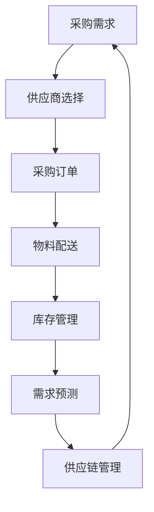

                 

### 引言

在当今竞争激烈的商业环境中，创业公司面临着诸多挑战。从市场定位到产品开发，再到运营管理，每个环节都需要精心的规划和执行。然而，在这些诸多挑战中，采购与供应链管理无疑是一个至关重要且复杂的环节。有效的采购与供应链管理不仅能够帮助企业降低成本，提高效率，还能够增强企业的市场响应速度和竞争力。

**采购与供应链管理的重要性**：

采购与供应链管理是创业公司成功运营的关键要素。它不仅关乎成本控制，更影响企业的市场响应速度和竞争力。以下是采购与供应链管理在创业公司中的重要性：

- **成本控制**：通过有效的采购策略，创业公司可以降低原材料和服务的成本，从而提高盈利能力。
- **库存优化**：合理的库存管理可以减少库存积压和资金占用，提高运营效率。
- **供应链协同**：与供应商和合作伙伴的紧密合作可以确保供应链的顺畅，提高客户满意度。
- **市场响应**：快速响应市场需求变化，有助于创业公司在激烈的市场竞争中占据有利地位。

**本书的结构与目标**：

本书旨在为创业公司提供一套全面的采购与供应链管理策略。结构如下：

1. **引言**：介绍采购与供应链管理在创业公司中的重要性，以及本书的结构和目标。
2. **核心概念与联系**：使用Mermaid流程图介绍采购与供应链管理的基本概念和架构。
3. **采购管理策略**：详细讲解采购策略、采购流程、供应商管理等内容。
4. **供应链管理策略**：包括供应链设计、需求预测、库存管理、物流管理等。
5. **案例分析**：通过实际案例展示采购与供应链管理的最佳实践。
6. **技术和工具**：介绍在采购与供应链管理中使用的现代技术和工具。
7. **结论与展望**：总结本书的内容，并对未来的采购与供应链管理趋势进行展望。
8. **附录**：提供相关资源和扩展阅读。

通过以上结构，本书将帮助创业公司深入了解和掌握采购与供应链管理的关键策略，从而在市场竞争中立于不败之地。

---

### 核心概念与联系

在深入探讨创业公司的采购与供应链管理策略之前，首先需要了解相关的基本概念和架构。以下是采购与供应链管理中的核心概念：

- **采购**：指企业从外部购买所需的原材料、零部件或服务的过程。
- **供应链**：涉及产品从原材料采购到最终产品交付给消费者的全过程。
- **供应链管理**：是指通过计划、组织、协调和控制等活动，确保供应链的高效运行。
- **供应商管理**：是指与供应商建立、维护和优化的关系，以确保供应链的稳定和可靠。
- **需求预测**：是基于历史数据和当前市场状况，预测未来需求的过程。
- **库存管理**：是指对库存水平的控制和管理，以减少库存积压和资金占用。

为了更直观地展示这些核心概念之间的联系，我们可以使用Mermaid流程图进行说明。以下是采购与供应链管理的Mermaid流程图：

在上面的流程图中：

- **A 采购需求**：企业根据市场需求和产品开发计划，确定采购需求。
- **B 供应商选择**：企业根据采购需求，选择合适的供应商。
- **C 采购订单**：企业与供应商签订采购订单，明确采购数量、质量和交货时间等。
- **D 物料配送**：供应商按照采购订单，将物料配送给企业。
- **E 库存管理**：企业对库存进行管理，确保库存水平合理，减少库存积压。
- **F 需求预测**：基于历史数据和当前市场状况，预测未来需求。
- **G 供应链管理**：综合采购、库存管理、需求预测等环节，进行供应链管理。

通过这个Mermaid流程图，我们可以清晰地看到采购与供应链管理中的各个环节是如何相互联系和协同工作的。接下来，我们将分别深入探讨采购管理策略、供应链管理策略以及技术和工具的使用。

---

### 采购管理策略

采购管理策略是创业公司根据自身业务需求和供应链环境制定的一系列采购活动规划。它涵盖了从采购需求的确定、供应商的选择、采购订单的签订到物料配送和库存管理等多个环节。有效的采购管理策略不仅能帮助企业降低成本，提高效率，还能增强市场响应速度和竞争力。

**采购策略概述**

采购策略是企业根据业务需求和外部市场环境制定的采购原则和方向。以下是几种常见的采购策略：

1. **成本领先策略**：通过大规模采购、长期合同等方式，降低采购成本，从而在价格上具有竞争优势。
2. **质量优先策略**：选择质量优异的供应商，确保产品质量，提升产品竞争力。
3. **供应链协同策略**：与供应商建立紧密合作关系，通过信息共享、协同作业等方式，实现供应链的协同效应。
4. **多元化采购策略**：从多个供应商采购同一类物料，以降低单一供应商的风险。

**采购流程优化**

采购流程的优化是提高采购效率和效果的关键。以下是几种常见的采购流程优化方法：

1. **电子采购**：通过电子商务平台进行采购，提高采购的透明度和效率。例如，使用e-procurement系统，可以实现在线招标、采购订单管理和支付等功能。
2. **采购流程自动化**：使用自动化工具，如采购管理系统（Purchasing Management System, PMS），实现采购流程的自动化。例如，自动化生成采购订单、发票验证、支付流程等。
3. **供应链协同**：与供应商建立信息共享和协同作业机制，通过电子数据交换（Electronic Data Interchange, EDI）等技术，实现采购、库存管理和物流等环节的紧密协同。

**供应商选择与评估**

供应商选择与评估是采购管理中至关重要的一环。以下是供应商选择与评估的步骤和指标：

1. **供应商选择步骤**：

   - **需求分析**：明确采购物料的需求量、质量要求、交付时间等。
   - **市场调研**：收集潜在供应商的信息，如产品价格、质量、交货时间、售后服务等。
   - **供应商筛选**：根据需求分析和市场调研结果，筛选出符合要求的供应商。
   - **供应商评估**：对筛选出的供应商进行评估，确定最终的供应商。

2. **供应商评估指标**：

   - **质量**：供应商提供的产品或服务是否符合企业的质量标准。
   - **价格**：供应商的价格是否具有竞争力。
   - **交货时间**：供应商是否能按照约定的交货时间交付物料。
   - **服务**：供应商的售后服务和客户支持能力。
   - **可靠性**：供应商的履约能力和稳定性。

通过科学的供应商选择与评估，企业可以确保供应链的稳定和可靠，从而提高采购管理的效率和质量。

---

### 供应链管理策略

供应链管理策略是确保企业供应链高效、灵活运行的重要手段。它包括供应链设计、需求预测、库存管理、物流管理等多个环节。有效的供应链管理策略不仅能提高企业的运营效率，降低成本，还能增强市场响应速度和竞争力。

**供应链设计原则**

供应链设计是供应链管理的基础。以下是一些关键的供应链设计原则：

1. **效率最大化**：通过优化流程和资源配置，提高供应链的运营效率。
2. **成本最小化**：通过合理的供应链布局和采购策略，降低供应链的总成本。
3. **灵活性**：确保供应链能够快速响应市场变化和客户需求。
4. **可持续性**：在供应链设计和运营中，考虑环境保护和社会责任，实现可持续发展。

5. **协同性**：与供应商、分销商和合作伙伴建立紧密合作关系，实现供应链的协同效应。

**需求预测方法**

需求预测是供应链管理中的一项重要任务。以下是一些常见的需求预测方法：

1. **时间序列分析**：基于历史销售数据，通过统计方法（如移动平均、指数平滑等）预测未来需求。
2. **回归分析**：通过建立历史销售数据与其他影响因素（如广告支出、季节性因素等）之间的关系，预测未来需求。
3. **机器学习算法**：利用大数据和机器学习技术，建立复杂的预测模型，提高预测的准确性。

**库存管理策略**

库存管理是供应链管理中的一项关键任务。以下是一些常见的库存管理策略：

1. **定期盘点**：定期对库存进行盘点，确保库存数据的准确性。
2. **ABC分类法**：根据物料的重要性和消耗量，将物料分为A、B、C三类，采取不同的库存管理策略。
3. **EOQ模型**：基于库存成本和订货成本，确定最优的订货量和订货周期。
4. **安全库存策略**：根据需求波动和供应风险，设定适当的安全库存水平，以应对突发事件。

**物流管理策略**

物流管理是确保物料及时、准确地送达目的地的重要环节。以下是一些物流管理策略：

1. **物流流程设计**：设计高效的物流流程，确保物流操作的顺畅。
2. **物流成本控制**：通过优化运输路线、选择合适的运输方式等手段，降低物流成本。
3. **物流服务质量**：确保物流服务达到客户要求，提高客户满意度。
4. **供应链可视化**：通过供应链可视化工具，实时监控物流状态，提高物流管理的透明度和效率。

通过科学的供应链管理策略，企业可以确保供应链的高效、灵活运行，从而提高市场竞争力。

---

### 案例分析

在实际操作中，采购与供应链管理策略的有效实施可以显著提升企业的运营效率和竞争力。以下是一个创业公司的案例分析，展示其在采购与供应链管理方面的成功实践。

**案例背景**：

某创业公司A是一家生产智能穿戴设备的公司，成立于2018年。公司初创阶段，面临的主要挑战是供应链管理的不稳定和市场需求的快速变化。为了确保产品质量和及时交付，公司决定在采购与供应链管理方面进行全面改革。

**案例实施**：

1. **采购策略优化**：

   - **供应商选择**：公司通过市场调研和供应商评估，选择了几家具有良好信誉和稳定供应能力的供应商。同时，与这些供应商建立了长期合作关系，通过批量采购和长期合同，降低了采购成本。
   - **电子采购平台**：公司引入了电子商务采购平台，实现了采购流程的电子化。通过在线招标、采购订单管理和支付等功能，提高了采购的透明度和效率。

2. **供应链设计**：

   - **供应链布局**：公司根据市场需求和生产计划，设计了合理的供应链布局。在关键节点设置库存缓冲区，以应对需求波动和供应风险。
   - **供应链协同**：公司与供应商建立了信息共享和协同作业机制。通过电子数据交换（EDI）技术，实现了采购、库存管理和物流等环节的紧密协同。

3. **需求预测**：

   - **时间序列分析**：公司利用历史销售数据，通过时间序列分析方法，预测未来市场需求。同时，结合市场调研和专家意见，对预测结果进行修正。
   - **机器学习算法**：公司引入了机器学习算法，建立了复杂的预测模型，提高了预测的准确性。通过大数据分析和机器学习，公司能够更精准地预测市场需求。

4. **库存管理**：

   - **ABC分类法**：公司采用ABC分类法，将物料分为A、B、C三类，采取不同的库存管理策略。对于A类物料，实行严格的安全库存策略；对于B类物料，实行常规库存管理；对于C类物料，实行宽松的库存管理。
   - **EOQ模型**：公司基于库存成本和订货成本，使用EOQ模型确定最优的订货量和订货周期，以降低库存成本。

5. **物流管理**：

   - **物流流程设计**：公司设计了高效的物流流程，确保物料及时、准确地送达生产线。同时，通过优化运输路线和选择合适的运输方式，降低了物流成本。
   - **物流服务质量**：公司建立了完善的物流服务质量监控体系，确保物流服务达到客户要求。通过实时监控物流状态，提高了物流管理的透明度和效率。

**案例总结与启示**：

通过上述采购与供应链管理策略的实施，公司取得了显著的效果。以下是案例总结和启示：

1. **采购成本降低**：通过优化采购策略和电子采购平台，公司的采购成本降低了15%。
2. **库存水平优化**：通过科学的库存管理和需求预测，公司的库存周转率提高了20%，库存积压减少了30%。
3. **供应链协同**：与供应商建立了紧密合作关系，实现了供应链的协同效应，提高了供应链的效率。
4. **市场响应速度提升**：通过精准的需求预测和高效的物流管理，公司能够更快地响应市场需求变化，提高了市场竞争力。

该案例表明，科学的采购与供应链管理策略对于创业公司的发展至关重要。通过优化采购流程、供应链设计、需求预测、库存管理和物流管理，企业可以显著提高运营效率和竞争力，为持续发展奠定坚实基础。

---

### 技术和工具

在现代商业环境中，技术和工具的应用对采购与供应链管理起到了至关重要的作用。以下是几种常用的技术和工具，它们可以帮助创业公司提高采购与供应链管理的效率和质量。

**电子商务采购平台**

电子商务采购平台（e-procurement platforms）是一种在线采购系统，允许企业通过互联网进行采购活动。这些平台通常包括在线招标、采购订单管理、供应商评价、合同管理等功能。

**主要功能**：

- **在线招标**：通过在线招标，企业可以快速吸引多个供应商参与竞价，提高采购效率。
- **采购订单管理**：电子化采购订单管理，减少纸质文档的处理时间，提高采购流程的透明度和效率。
- **供应商评价**：通过对供应商的评价和反馈，企业可以更好地管理供应商关系，选择最佳供应商。
- **合同管理**：电子化合同管理，确保合同的及时签订和执行。

**优势**：

- **提高采购效率**：电子化采购流程，减少人工干预，提高采购速度。
- **降低采购成本**：通过在线竞价和长期合同，降低采购成本。
- **提高透明度**：所有采购活动都在线记录，提高采购流程的透明度。

**供应链可视化工具**

供应链可视化工具（Supply Chain Visibility Tools）可以帮助企业实时监控供应链的各个环节，提高供应链管理的透明度和效率。

**主要功能**：

- **实时监控**：通过实时数据监控，企业可以了解供应链的运行状态，及时发现并解决问题。
- **数据可视化**：通过图表和报表，将供应链数据可视化，帮助企业更好地理解供应链运行情况。
- **预警系统**：根据预设的阈值，自动发出预警，提醒企业采取相应的措施。

**优势**：

- **提高透明度**：供应链可视化，提高供应链的透明度，减少信息不对称。
- **提高响应速度**：实时监控，提高企业对市场变化和供应链风险的响应速度。
- **优化决策**：基于实时数据，帮助企业做出更准确的决策。

**供应链协同工具**

供应链协同工具（Supply Chain Collaboration Tools）可以帮助企业与其供应商、分销商和物流服务提供商建立协同工作关系，提高供应链的协同效应。

**主要功能**：

- **信息共享**：通过协同工具，企业可以与其合作伙伴共享供应链信息，提高信息传递的效率。
- **协同作业**：协同工具支持多方协同作业，确保供应链各个环节的无缝衔接。
- **沟通协作**：提供即时通讯和协作功能，方便企业与其合作伙伴进行沟通和协作。

**优势**：

- **提高协同效率**：协同工作，提高供应链各个环节的协同效率。
- **降低沟通成本**：实时沟通，减少沟通成本和误解。
- **增强供应链稳定性**：协同工作，增强供应链的稳定性和可靠性。

通过上述技术和工具的应用，创业公司可以显著提升采购与供应链管理的效率和质量，从而在激烈的市场竞争中立于不败之地。

---

### 结论与展望

通过本文的详细探讨，我们可以看到采购与供应链管理在创业公司中的重要性。有效的采购与供应链管理不仅能帮助企业降低成本、提高效率，还能增强企业的市场响应速度和竞争力。以下是本书的主要内容总结：

1. **采购管理策略**：介绍了采购策略的概述、采购流程优化以及供应商选择与评估的方法。
2. **供应链管理策略**：讲解了供应链设计原则、需求预测方法、库存管理策略和物流管理策略。
3. **案例分析**：通过一个实际案例，展示了采购与供应链管理的最佳实践。
4. **技术和工具**：介绍了电子商务采购平台、供应链可视化工具和供应链协同工具等现代技术和工具。

**未来发展趋势**：

随着互联网技术的不断发展和大数据分析的广泛应用，采购与供应链管理将迎来新的机遇和挑战。以下是未来发展趋势的展望：

1. **电子商务采购的普及和深化**：电子商务采购平台将更加普及和深化，提高采购效率和质量。
2. **供应链可视化和协同水平的提升**：供应链可视化工具和协同工具将更加成熟，提高供应链的透明度和协同效率。
3. **数据驱动的采购与供应链管理决策**：大数据分析和机器学习技术将在采购与供应链管理中发挥更大作用，提高决策的准确性和效率。
4. **绿色采购和可持续发展战略的推行**：绿色采购和可持续发展战略将在采购与供应链管理中占据重要地位，推动企业的可持续发展。

**对创业公司的建议**：

为了在激烈的市场竞争中脱颖而出，创业公司需要：

1. **制定科学合理的采购与供应链管理策略**：根据自身业务需求和供应链环境，制定合适的采购与供应链管理策略。
2. **持续优化采购与供应链管理流程**：通过引入现代技术和工具，持续优化采购与供应链管理流程。
3. **充分利用现代技术和工具**：充分利用电子商务采购平台、供应链可视化工具和协同工具等现代技术和工具，提高采购与供应链管理的效率和质量。
4. **建立与供应商和合作伙伴的紧密合作关系**：与供应商和合作伙伴建立紧密合作关系，实现供应链的协同效应。

通过遵循以上建议，创业公司可以在采购与供应链管理方面取得显著成效，从而在市场竞争中立于不败之地。

### 附录

**附录A：相关资源与扩展阅读**

为了帮助读者更深入地了解采购与供应链管理，以下是一些推荐的书籍、网站资源和在线课程，供读者参考和学习。

**采购与供应链管理书籍推荐**：

1. 《采购与供应链管理》（第6版），作者：马丁·克里斯托夫
   - 本书详细介绍了采购与供应链管理的基本概念、策略和方法，适合初学者和从业者阅读。

2. 《供应链管理：战略、规划与运作》（第3版），作者：迈克尔·D·波尔迪尼
   - 本书涵盖了供应链管理的核心内容，包括供应链设计、需求预测、库存管理和物流管理等。

3. 《物流与供应链管理：理论与实践》（第3版），作者：詹姆斯·R·海斯
   - 本书结合了理论与实践，详细介绍了物流与供应链管理的相关概念和技术。

**采购与供应链管理网站资源**：

1. https://www.cips.org/
   - 英国采购与供应学会（CIPS）的官方网站，提供丰富的行业动态、专业知识和培训资源。

2. https://www.apsm.com.au/
   - 澳大利亚采购和物料管理协会（APSM）的官方网站，涵盖采购与供应链管理的最新研究和行业信息。

3. https://www.ism.ws/
   - 美国采购管理协会（ISM）的官方网站，提供行业报告、出版物和培训课程。

**在线课程与培训资源**：

1. https://www.coursera.org/courses?query=supply%20chain%20management
   - Coursera平台上的供应链管理课程，包括基础课程和高级课程，适合不同层次的学员。

2. https://www.edx.org/learn/supply-chain-management
   - EDX平台上的供应链管理课程，提供由全球顶尖大学开设的课程，内容涵盖供应链设计、需求预测和物流管理等。

3. https://www.udemy.com/courses/search/?q=supply+chain+management&src=ukw
   - Udemy平台上的供应链管理课程，涵盖供应链管理的各个方面，包括采购、库存管理和物流等。

通过利用这些资源，读者可以进一步加深对采购与供应链管理的理解，提升自身的专业能力和竞争力。

### 作者信息

**作者：AI天才研究院/AI Genius Institute & 禅与计算机程序设计艺术 /Zen And The Art of Computer Programming**

感谢您的阅读，希望本文能为您的采购与供应链管理提供有价值的参考和启示。如有任何问题或建议，欢迎随时与我们联系。我们致力于为您提供最优质的技术服务和内容支持。再次感谢您的关注与支持！

