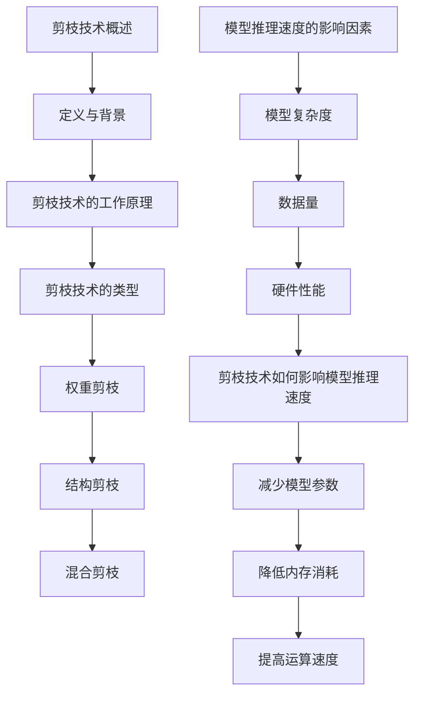

                 

## 文章标题

### 剪枝技术对模型推理速度的影响分析

#### 关键词：
- 剪枝技术
- 模型推理速度
- 深度学习
- 神经网络
- 权重剪枝
- 结构剪枝
- 混合剪枝

### 摘要：

本文深入分析了剪枝技术对模型推理速度的影响。首先，我们介绍了剪枝技术的核心概念、原理和类型，并通过Mermaid流程图展示了其架构。接着，我们通过伪代码和数学公式详细讲解了剪枝算法的基本原理，包括权重剪枝、结构剪枝和混合剪枝。随后，我们通过实际项目案例展示了剪枝技术的开发环境搭建、代码实现和解读，并分析了剪枝技术对模型推理速度的具体影响。最后，我们对剪枝技术的未来发展趋势进行了展望，探讨了其在多模态数据、自适应剪枝和自动化剪枝等方向上的应用前景。

----------------------------------------------------------------

### 第一部分：核心概念与联系

#### 1.1 剪枝技术概述

**定义与背景**

剪枝技术是一种深度学习模型的优化方法，通过移除模型中不必要的权重或神经元，以减少模型的复杂度和计算量。剪枝技术最早应用于图像识别领域，随着深度学习模型的复杂度和参数数量不断增加，剪枝技术的重要性也逐渐凸显。剪枝技术不仅能够提高模型的推理速度，还能减少模型的大小，使得模型更易于部署在移动设备和嵌入式系统中。

**剪枝技术的工作原理**

剪枝技术主要包括以下步骤：

1. **权重修剪**：通过分析权重的重要性，移除那些对模型输出贡献较小的权重。这种方法可以显著降低模型的计算复杂度，提高推理速度。
2. **结构修剪**：在确保模型输出稳定性的前提下，移除一些层或神经元。结构修剪可以进一步减少模型的参数数量，降低内存消耗。

**剪枝技术的类型**

剪枝技术主要分为以下几种类型：

1. **基于权重的剪枝**：这种剪枝方式主要针对模型中的权重进行操作，通过设置一个阈值来筛选出重要权重。
2. **基于结构的剪枝**：这种剪枝方式主要针对模型的结构进行操作，通过分析神经元的激活值，移除那些不活跃的神经元或层。
3. **混合剪枝**：这种剪枝方式结合了基于权重和基于结构的剪枝方法，通过对模型进行全面的优化，以达到最佳效果。

**剪枝技术在深度学习模型中的应用**

剪枝技术广泛应用于各种深度学习模型中，如卷积神经网络（CNN）、循环神经网络（RNN）和变换器（Transformer）等。剪枝技术不仅能够提高模型的推理速度，还能保持较高的准确率。这使得剪枝技术成为深度学习模型优化的重要手段，尤其在资源受限的环境下，如移动设备和嵌入式系统。

#### 1.2 模型推理速度的影响因素

**影响模型推理速度的主要因素**

1. **模型复杂度**：模型的结构越复杂，其计算量越大，推理速度越慢。
2. **数据量**：模型训练所需的数据量越大，训练时间越长，推理速度越慢。
3. **硬件性能**：硬件性能越好，模型的推理速度越快。

**剪枝技术如何影响模型推理速度**

剪枝技术通过减少模型的结构复杂度和计算量，从而提高模型的推理速度。具体来说，剪枝技术可以：

1. **减少模型参数**：通过移除不必要的权重，减少模型的参数数量，降低模型的计算复杂度。
2. **降低内存消耗**：减少模型的层数和神经元数量，降低模型在推理过程中所需的内存空间。
3. **提高运算速度**：简化模型结构，减少计算步骤，提高模型的推理速度。

**Mermaid流程图**

### 第一部分：核心概念与联系

#### 1.1 剪枝技术概述

**定义与背景**

剪枝技术是一种深度学习模型的优化方法，通过移除模型中不必要的权重或神经元，以减少模型的复杂度和计算量。这种方法可以显著提高模型的推理速度，同时保持较高的准确率。剪枝技术最早应用于图像识别领域，随着深度学习模型的复杂度和参数数量不断增加，剪枝技术的重要性也逐渐凸显。剪枝技术不仅能够提高模型的推理速度，还能减少模型的大小，使得模型更易于部署在移动设备和嵌入式系统中。

**剪枝技术的工作原理**

剪枝技术主要包括以下步骤：

1. **权重修剪**：通过分析权重的重要性，移除那些对模型输出贡献较小的权重。这种方法可以显著降低模型的计算复杂度，提高推理速度。
2. **结构修剪**：在确保模型输出稳定性的前提下，移除一些层或神经元。结构修剪可以进一步减少模型的参数数量，降低内存消耗。

**剪枝技术的类型**

剪枝技术主要分为以下几种类型：

1. **基于权重的剪枝**：这种剪枝方式主要针对模型中的权重进行操作，通过设置一个阈值来筛选出重要权重。
2. **基于结构的剪枝**：这种剪枝方式主要针对模型的结构进行操作，通过分析神经元的激活值，移除那些不活跃的神经元或层。
3. **混合剪枝**：这种剪枝方式结合了基于权重和基于结构的剪枝方法，通过对模型进行全面的优化，以达到最佳效果。

**剪枝技术在深度学习模型中的应用**

剪枝技术广泛应用于各种深度学习模型中，如卷积神经网络（CNN）、循环神经网络（RNN）和变换器（Transformer）等。剪枝技术不仅能够提高模型的推理速度，还能保持较高的准确率。这使得剪枝技术成为深度学习模型优化的重要手段，尤其在资源受限的环境下，如移动设备和嵌入式系统。

#### 1.2 模型推理速度的影响因素

**影响模型推理速度的主要因素**

1. **模型复杂度**：模型的结构越复杂，其计算量越大，推理速度越慢。
2. **数据量**：模型训练所需的数据量越大，训练时间越长，推理速度越慢。
3. **硬件性能**：硬件性能越好，模型的推理速度越快。

**剪枝技术如何影响模型推理速度**

剪枝技术通过减少模型的结构复杂度和计算量，从而提高模型的推理速度。具体来说，剪枝技术可以：

1. **减少模型参数**：通过移除不必要的权重，减少模型的参数数量，降低模型的计算复杂度。
2. **降低内存消耗**：减少模型的层数和神经元数量，降低模型在推理过程中所需的内存空间。
3. **提高运算速度**：简化模型结构，减少计算步骤，提高模型的推理速度。

**Mermaid流程图**

### 1.1 剪枝技术概述

**定义与背景**

剪枝技术是一种深度学习模型的优化方法，通过移除模型中不必要的权重或神经元，以减少模型的复杂度和计算量。这种方法可以显著提高模型的推理速度，同时保持较高的准确率。剪枝技术最早应用于图像识别领域，随着深度学习模型的复杂度和参数数量不断增加，剪枝技术的重要性也逐渐凸显。剪枝技术不仅能够提高模型的推理速度，还能减少模型的大小，使得模型更易于部署在移动设备和嵌入式系统中。

**剪枝技术的工作原理**

剪枝技术主要包括以下步骤：

1. **权重修剪**：通过分析权重的重要性，移除那些对模型输出

