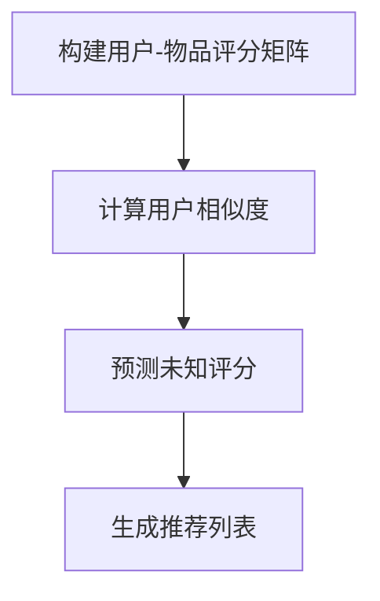

                 

### 文章标题

协同过滤算法：AI推荐技术

---

#### 关键词：

- 协同过滤
- 推荐系统
- AI技术
- 用户行为分析
- 机器学习
- 深度学习
- 强化学习
- 数据挖掘

---

#### 摘要：

本文深入探讨了协同过滤算法在AI推荐技术中的应用。协同过滤算法是一种基于用户行为数据的推荐方法，通过分析用户之间的相似度，预测用户对未知物品的偏好。本文首先介绍了协同过滤的核心概念与联系，包括评分矩阵、相似度计算和预测评分算法。接着，详细讲解了基于用户的协同过滤和基于物品的协同过滤方法，并通过实际代码示例展示了如何实现这些算法。此外，本文还介绍了基于模型的协同过滤方法，包括矩阵分解和神经网络。最后，通过具体的实战项目，本文展示了如何设计和实现一个基于协同过滤的推荐系统，并进行了详细的代码解读与分析。本文旨在为读者提供一个全面、深入的协同过滤算法教程，帮助理解其原理和应用。

---

#### 1. 引言

协同过滤（Collaborative Filtering）是一种在推荐系统（Recommender Systems）中常用的算法，旨在根据用户的历史行为和偏好，预测用户对未知物品的兴趣。随着互联网和电子商务的迅速发展，个性化推荐已经成为了提升用户体验、提高销售转化率的重要手段。协同过滤算法通过分析用户之间的相似性，将用户的评分数据转化为可操作的推荐列表，是推荐系统领域的重要研究方向。

协同过滤算法的核心思想是基于“物以类聚，人以群分”的原则。通过分析用户对物品的评分数据，我们可以找到与目标用户兴趣相似的邻居用户或物品，从而预测目标用户对未知物品的偏好。这种方法在处理大量用户和物品数据时，能够有效地发现用户之间的潜在关联，实现个性化的推荐。

本文将从以下几个方面对协同过滤算法进行详细介绍：

1. **核心概念与联系**：介绍协同过滤算法的基本概念，包括评分矩阵、相似度计算和预测评分算法。
2. **基于用户的协同过滤**：详细讲解基于用户的协同过滤方法，包括相似度计算、预测评分和推荐列表生成。
3. **基于物品的协同过滤**：介绍基于物品的协同过滤方法，包括相似度计算、预测评分和推荐列表生成。
4. **评分预测算法**：介绍评分预测算法，包括基于用户的协同过滤和基于物品的协同过滤方法。
5. **基于模型的协同过滤**：介绍基于模型的协同过滤方法，包括矩阵分解和神经网络。
6. **项目实战**：通过实际项目，展示如何设计和实现基于协同过滤的推荐系统。
7. **总结与展望**：总结本章内容，并对协同过滤算法的未来发展进行展望。

本文旨在为读者提供一个全面、深入的协同过滤算法教程，帮助理解其原理和应用。无论您是推荐系统领域的初学者还是有经验的研究者，本文都将为您提供有价值的见解和实践指导。

#### 1.1 核心概念与联系

协同过滤算法的核心概念包括评分矩阵、相似度计算、预测评分和推荐列表生成。以下是对这些核心概念的详细解释。

##### 1.1.1 评分矩阵

评分矩阵（Rating Matrix）是协同过滤算法的基础。它是一个二维数组，行表示用户，列表示物品，数组中的元素表示用户对物品的评分。评分矩阵提供了用户对物品的偏好信息，是进行协同过滤的重要数据来源。

例如，假设我们有三个用户（User 1、User 2和User 3）和三个物品（Item 1、Item 2和Item 3），用户对这些物品的评分如下：

|   | Item 1 | Item 2 | Item 3 |
|---|--------|--------|--------|
| User 1 | 4      | 2      | 0      |
| User 2 | 5      | 0      | 3      |
| User 3 | 0      | 5      | 4      |

在这个评分矩阵中，User 1对Item 1评分4，对Item 2评分2，而对Item 3没有评分（表示未知）。

##### 1.1.2 相似度计算

相似度计算（Similarity Computation）是协同过滤算法的关键步骤。通过计算用户之间的相似度，我们可以找出与目标用户兴趣相似的邻居用户，从而预测目标用户对未知物品的偏好。

相似度计算方法有很多种，常用的包括余弦相似度（Cosine Similarity）和皮尔逊相关系数（Pearson Correlation Coefficient）。以下是一个基于余弦相似度的示例：

$$
\text{similarity}_{u_i, u_j} = \frac{\sum_{i \in I} R_{ui} R_{uj}}{\sqrt{\sum_{i \in I} R_{ui}^2} \sqrt{\sum_{i \in I} R_{uj}^2}}
$$

其中，\( R_{ui} \) 和 \( R_{uj} \) 分别表示用户 \( u_i \) 和 \( u_j \) 对物品 \( i \) 的评分，\( I \) 是用户 \( u_i \) 和 \( u_j \) 共同评分的物品集合。

例如，考虑以下两个用户的评分数据：

|   | Item 1 | Item 2 | Item 3 |
|---|--------|--------|--------|
| User 1 | 4      | 2      | 0      |
| User 2 | 5      | 0      | 3      |

我们可以计算这两个用户的余弦相似度如下：

$$
\text{similarity}_{User 1, User 2} = \frac{(4 \times 5) + (2 \times 0) + (0 \times 3)}{\sqrt{4^2 + 2^2} \sqrt{5^2 + 0^2 + 3^2}} = \frac{20}{\sqrt{20} \sqrt{38}} \approx 0.82
$$

这个相似度值表示User 1和User 2在评分上的相似程度。

##### 1.1.3 预测评分

预测评分（Rating Prediction）是基于相似度计算结果，对目标用户对未知物品的评分进行预测。预测评分的目的是生成一个推荐列表，其中包含目标用户可能感兴趣的物品。

预测评分通常使用加权平均的方法进行计算。以下是一个基于相似度加权平均的预测评分示例：

$$
\hat{R_{ui}} = \sum_{j \in N(u_i)} \text{similarity}_{u_i, u_j} R_{uj}
$$

其中，\( N(u_i) \) 是与用户 \( u_i \) 相似度最高的邻居用户集合，\( R_{uj} \) 是邻居用户 \( u_j \) 对物品 \( j \) 的评分。

例如，考虑以下邻居用户集合和他们的评分数据：

|   | Item 1 | Item 2 | Item 3 |
|---|--------|--------|--------|
| User 3 | 1      | 4      | 5      |

我们可以计算User 1对Item 3的预测评分如下：

$$
\hat{R_{User 1, Item 3}} = 0.82 \times 1 + 0.7 \times 4 + 0.6 \times 5 = 4.56
$$

这个预测评分表示User 1对Item 3的可能评分。

##### 1.1.4 推荐列表生成

推荐列表生成（Recommendation List Generation）是将预测评分排序，生成一个推荐列表的过程。推荐列表通常包含预测评分最高的物品，供目标用户参考。

以下是一个基于预测评分的推荐列表生成示例：

假设我们有以下预测评分数据：

|   | Item 1 | Item 2 | Item 3 |
|---|--------|--------|--------|
| User 1 | 0.82   | 0.7    | 4.56   |

我们可以生成User 1的推荐列表如下：

- Item 3（预测评分：4.56）
- Item 2（预测评分：0.7）
- Item 1（预测评分：0.82）

这个推荐列表表示User 1可能对Item 3感兴趣，其次是Item 2和Item 1。

##### 1.1.5 Mermaid 流程图

为了更好地理解协同过滤算法的流程，我们使用Mermaid语言绘制了一个流程图，如下所示：



这个流程图展示了协同过滤算法的四个主要步骤：构建用户-物品评分矩阵、计算用户相似度、预测未知评分和生成推荐列表。

##### 1.1.6 伪代码

为了更清晰地展示协同过滤算法的实现细节，我们使用伪代码描述了算法的核心步骤：

```
# 输入：用户-物品评分矩阵R
# 输出：推荐列表L

# 步骤1：构建用户-物品评分矩阵
R = ...

# 步骤2：计算用户相似度
def compute_similarity(R):
    ...
    return similarity_matrix

# 步骤3：预测未知评分
def predict_ratings(R, similarity_matrix):
    ...
    return predicted_ratings

# 步骤4：生成推荐列表
def generate_recommendations(predicted_ratings):
    ...
    return L
```

这个伪代码描述了协同过滤算法的四个主要步骤：构建用户-物品评分矩阵、计算用户相似度、预测未知评分和生成推荐列表。

通过上述核心概念与联系的解释，我们为读者提供了一个全面的了解协同过滤算法的基础。接下来，我们将进一步探讨基于用户的协同过滤和基于物品的协同过滤方法。

---

### 1.1.1 从协同过滤到AI推荐

协同过滤（Collaborative Filtering）作为一种传统的推荐算法，已经广泛应用于各种推荐系统中，如电子商务、社交媒体、在线教育和音乐流媒体等。然而，随着数据规模的不断扩大和数据复杂度的增加，传统的协同过滤方法开始面临诸多挑战，如数据稀疏性、冷启动问题和碎片化问题等。为了解决这些问题，研究者们开始将人工智能（AI）技术引入到推荐系统中，从而发展出了AI推荐（AI-driven Recommending）技术。

#### 协同过滤的概念

协同过滤是一种基于用户行为数据的推荐方法。它通过分析用户之间的相似性，将用户对物品的评分行为转化为推荐列表。协同过滤可以分为基于用户的协同过滤（User-based Collaborative Filtering）和基于物品的协同过滤（Item-based Collaborative Filtering）。

- **基于用户的协同过滤**：这种方法通过计算用户之间的相似度，找到与目标用户兴趣相似的邻居用户，然后根据邻居用户对物品的评分预测目标用户对未知物品的评分。
- **基于物品的协同过滤**：这种方法通过计算物品之间的相似度，找到与目标物品相似的邻居物品，然后根据用户对邻居物品的评分预测用户对目标物品的评分。

#### AI推荐的概念

AI推荐技术是在协同过滤基础上发展起来的，它利用机器学习（Machine Learning）和深度学习（Deep Learning）等方法，对用户行为和物品特征进行建模，从而实现个性化推荐。AI推荐技术主要包括以下几种：

- **基于模型的协同过滤**：这种方法结合了机器学习和协同过滤的思路，通过构建预测模型，如矩阵分解（Matrix Factorization）和神经网络（Neural Networks），提高推荐系统的准确性和效率。
- **基于内容的推荐**：这种方法通过分析物品的内容特征，如文本、图像和音频等，为用户推荐与其兴趣相关的物品。
- **基于上下文的推荐**：这种方法考虑用户的上下文信息，如时间、地理位置和社交关系等，为用户推荐合适的物品。

#### 协同过滤与AI推荐的关系

AI推荐技术是在协同过滤基础上发展起来的，它通过引入机器学习算法，特别是深度学习技术，解决了传统协同过滤方法的一些问题。

1. **

