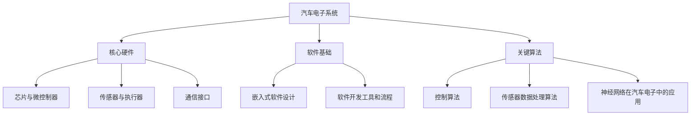

                 

### 第一部分：汽车电子系统基础知识

汽车电子系统是现代汽车技术中的核心组成部分，它涉及从简单的车身控制到复杂的自动驾驶系统。在这个部分，我们将深入探讨汽车电子系统的基本知识，包括其发展历程、核心硬件和软件基础，以及关键算法。理解这些基础知识对于准备博世2025社招汽车电子系统工程师面试至关重要。

#### 第1章：汽车电子系统概述

##### 1.1 汽车电子系统的发展历程

汽车电子技术的发展可以追溯到20世纪60年代，当时，电子控制系统开始用于燃油喷射和点火系统。随着时间的推移，汽车电子系统的应用范围不断扩大，从最初的简单控制功能发展到今天的高度复杂系统。以下是汽车电子系统发展历程的几个关键阶段：

1. **初代电子系统（1960s-1970s）**：这一阶段的电子系统主要集中在燃料供应和点火系统的控制上。典型的例子是电子燃油喷射系统和电子点火系统。
   
2. **第二代电子系统（1980s-1990s）**：随着微处理器技术的发展，电子系统开始集成到更多的汽车功能中，如防抱死制动系统（ABS）、电子稳定控制系统（ESC）等。

3. **第三代电子系统（2000s）**：汽车电子系统变得更加网络化和智能化，引入了高级驾驶辅助系统（ADAS），包括自适应巡航控制（ACC）、自动紧急制动（AEB）和车道保持辅助（LKA）。

4. **第四代电子系统（2010s-至今）**：随着物联网（IoT）和人工智能（AI）技术的兴起，汽车电子系统变得更加智能化和互联化。自动驾驶技术、车联网（V2X）和电动车辆是这一阶段的重要发展方向。

##### 1.2 汽车电子系统的主要组件

汽车电子系统由多个关键组件组成，这些组件协同工作以实现各种功能。以下是主要组件的简要介绍：

1. **芯片与微控制器**：芯片和微控制器是汽车电子系统的核心，它们负责处理和执行各种控制任务。

2. **传感器与执行器**：传感器用于检测汽车的环境和状态，如速度传感器、加速度传感器和温度传感器等。执行器则根据传感器提供的信息执行相应的操作，如电机和阀门。

3. **通信接口**：通信接口用于不同组件之间的数据传输，如CAN总线、LIN总线、MOST总线等。

4. **电源管理系统**：电源管理系统负责为电子系统提供稳定和高效的电源，包括电池管理、电压调节等功能。

5. **软件系统**：软件系统包括嵌入式软件、应用程序和操作系统，它们控制和管理汽车电子系统的各个方面。

#### 第2章：汽车电子系统的核心硬件

##### 2.1 芯片与微控制器

芯片和微控制器是汽车电子系统的“大脑”，它们负责处理来自传感器的大量数据，并控制执行器的动作。以下是芯片与微控制器的一些关键特性：

1. **高性能**：现代汽车电子系统要求芯片和微控制器具有高性能，能够快速处理大量数据。

2. **稳定性**：由于汽车环境复杂且恶劣，芯片和微控制器需要具备高稳定性，能够在各种条件下正常工作。

3. **安全性和可靠性**：汽车电子系统对安全性和可靠性要求极高，芯片和微控制器必须经过严格的测试和验证。

4. **多功能性**：现代汽车电子系统集成了多种功能，芯片和微控制器需要支持多种协议和接口，以适应不同的应用需求。

##### 2.2 传感器与执行器

传感器和执行器是汽车电子系统的“感觉器官”和“行动器官”，它们共同实现汽车的各种功能。以下是传感器与执行器的一些关键特性：

1. **精确性**：传感器需要具有高精度，以确保系统的控制准确。

2. **环境适应性**：传感器需要能够在各种环境条件下正常工作，如高温、低温、高湿度等。

3. **响应速度**：执行器需要具有快速响应能力，以确保系统能够及时响应传感器提供的信息。

4. **可靠性**：传感器和执行器需要具有高可靠性，以确保系统长期稳定运行。

##### 2.3 通信接口

通信接口是汽车电子系统中的数据传输桥梁，不同组件之间的数据交换主要通过通信接口实现。以下是通信接口的一些关键特性：

1. **带宽**：通信接口的带宽决定了数据传输的速度和效率。

2. **实时性**：对于一些关键系统，如ABS和ESC，通信接口需要具有高实时性，以确保系统能够快速响应。

3. **可靠性**：通信接口需要具备高可靠性，以避免数据传输错误。

4. **兼容性**：通信接口需要支持多种协议和标准，以适应不同的应用需求。

#### 第3章：汽车电子系统的软件基础

##### 3.1 汽车嵌入式软件设计

汽车嵌入式软件是汽车电子系统的核心，它负责管理各种硬件组件，并提供用户界面和功能。以下是汽车嵌入式软件设计的一些关键要素：

1. **实时性**：汽车嵌入式软件需要具有高实时性，以确保系统能够在规定的时间内响应。

2. **可靠性**：由于汽车电子系统对安全性和可靠性要求极高，嵌入式软件需要经过严格的测试和验证。

3. **可维护性**：嵌入式软件需要具有高可维护性，以便在软件升级和维护过程中减少停机时间。

4. **安全性**：汽车嵌入式软件需要具备安全性，以防止未经授权的访问和攻击。

##### 3.2 软件开发工具和流程

汽车嵌入式软件的开发需要使用专门的工具和流程，以下是常用的开发工具和流程：

1. **集成开发环境（IDE）**：如Eclipse、Keil等，用于编写、编译和调试嵌入式软件。

2. **版本控制系统**：如Git，用于管理代码版本和协作开发。

3. **编译器和调试器**：编译器用于将高级语言代码转换为机器代码，调试器用于调试和测试嵌入式软件。

4. **开发流程**：包括需求分析、设计、编码、测试和部署等阶段，每个阶段都有严格的标准和流程。

##### 3.3 软件开发工具和流程

汽车嵌入式软件的开发需要使用专门的工具和流程，以下是常用的开发工具和流程：

1. **集成开发环境（IDE）**：如Eclipse、Keil等，用于编写、编译和调试嵌入式软件。

2. **版本控制系统**：如Git，用于管理代码版本和协作开发。

3. **编译器和调试器**：编译器用于将高级语言代码转换为机器代码，调试器用于调试和测试嵌入式软件。

4. **开发流程**：包括需求分析、设计、编码、测试和部署等阶段，每个阶段都有严格的标准和流程。

### 第4章：汽车电子系统中的关键算法

##### 4.1 控制算法

控制算法是汽车电子系统的核心，它用于调节和优化系统的性能。以下是几种常见的控制算法：

1. **PID控制算法**：比例-积分-微分（PID）控制算法是最常用的控制算法之一，它通过调整比例、积分和微分系数来优化系统的响应。

2. **模糊控制算法**：模糊控制算法通过模拟人类思维过程来实现对系统的控制，适用于非线性、复杂系统。

3. **自适应控制算法**：自适应控制算法能够根据系统的变化自动调整控制参数，提高系统的适应性和鲁棒性。

##### 4.2 传感器数据处理算法

传感器数据处理算法用于提取传感器数据中的有效信息，以下是几种常用的数据处理算法：

1. **滤波算法**：如卡尔曼滤波、中值滤波、低通滤波等，用于去除传感器数据中的噪声。

2. **特征提取算法**：如主成分分析（PCA）、线性判别分析（LDA）等，用于提取传感器数据中的关键特征。

3. **聚类算法**：如K-means、DBSCAN等，用于对传感器数据进行聚类分析，发现数据中的规律和模式。

##### 4.3 神经网络在汽车电子中的应用

神经网络是人工智能的重要组成部分，在汽车电子系统中有着广泛的应用。以下是神经网络在汽车电子系统中的几个应用方向：

1. **自动驾驶**：神经网络可以用于自动驾驶系统中的目标检测、轨迹规划等任务。

2. **故障诊断**：神经网络可以用于汽车电子系统的故障诊断，通过学习正常工作和故障状态的数据，实现自动检测和诊断。

3. **性能优化**：神经网络可以用于优化汽车电子系统的性能，如优化控制策略、优化能量消耗等。

通过本章的探讨，我们了解了汽车电子系统的基本知识，包括其发展历程、核心硬件和软件基础，以及关键算法。这些知识将为我们在接下来的面试准备和职业发展中提供坚实的基础。

## 第二部分：面试准备与实战

在准备应聘博世2025社招汽车电子系统工程师岗位时，面试准备是一个关键环节。本部分将提供详细的面试准备策略，包括如何了解博世及汽车电子行业、梳理个人简历和项目经验，以及掌握面试常见问题和应对技巧。此外，我们还将深入探讨技术面试和项目面试的实战技巧，帮助您在面试中脱颖而出。

### 第5章：面试准备策略

##### 5.1 了解博世及汽车电子行业

了解目标公司和所在行业是面试准备的第一步。以下是关于博世及汽车电子行业的一些重要信息：

1. **博世公司简介**：
   - 博世是德国一家全球领先的科技和工程公司，成立于1886年。
   - 博世在全球范围内拥有数十个研发中心和生产基地，业务涵盖汽车技术、工业技术、消费品和建筑技术等领域。
   - 在汽车电子领域，博世是全球最大的汽车零部件供应商之一，提供包括传感器、执行器、控制器等在内的多种产品。

2. **汽车电子行业现状**：
   - 随着新能源汽车的兴起和自动驾驶技术的发展，汽车电子行业正处于快速发展阶段。
   - 汽车电子系统的复杂度和功能多样性不断增加，对工程师的技术能力和创新能力提出了更高要求。
   - 行业趋势包括智能化、网络化和电动化，这对汽车电子系统的设计、开发和生产提出了新的挑战。

3. **汽车电子行业挑战**：
   - 随着自动驾驶技术的发展，汽车电子系统需要应对更高的实时性和可靠性要求。
   - 数据安全和隐私保护成为行业关注的焦点，如何在保证系统安全的同时保护用户数据成为一大挑战。
   - 随着汽车电子系统复杂度的增加，系统的开发和维护成本也在上升，需要寻找有效的成本控制方法。

##### 5.2 梳理个人简历和项目经验

在准备面试时，梳理个人简历和项目经验是非常重要的一步。以下是一些关键步骤：

1. **更新简历**：
   - 确保简历内容完整、准确，包括个人信息、教育背景、工作经历、项目经验和技能特长等。
   - 突出自己的技术能力和成就，特别是与汽车电子相关的项目经验。
   - 使用量化指标来展示项目的成功，如提升系统性能的百分比、降低成本的具体金额等。

2. **准备项目经验**：
   - 详细准备与汽车电子相关的项目，包括项目背景、目标、技术难点和解决方案。
   - 准备项目的详细实现过程，包括代码、工具和环境搭建。
   - 思考并准备好如何描述项目中遇到的问题以及解决方案，以展示自己的问题解决能力。

3. **项目展示**：
   - 准备项目演示，如果可能的话，制作一个演示视频，展示项目的主要功能和技术亮点。
   - 在面试中，清晰地介绍项目，并能够回答面试官可能提出的问题。

##### 5.3 面试常见问题及应对技巧

面试中，面试官可能会问及各种问题，了解常见的面试问题和相应的应对技巧是成功的关键。以下是一些常见的面试问题及建议：

1. **自我介绍**：
   - 准备一段简洁、有逻辑的自我介绍，包括姓名、教育背景、工作经历和技能特长。
   - 强调与应聘岗位相关的经验和技能。

2. **为什么选择博世？**
   - 表达对博世公司的兴趣，强调博世在汽车电子领域的领导地位和公司的创新文化。
   - 阐述自己如何适应公司的价值观和发展方向。

3. **你的技术优势和弱点是什么？**
   - 强调自己的技术优势和成就，如对某种编程语言的熟练掌握、在特定项目中的技术贡献等。
   - 对于弱点，可以提到正在努力改进，并提供具体的学习和实践经历。

4. **请描述一个你遇到的技术难题及解决方案。**
   - 选择一个与汽车电子相关的技术难题，详细描述问题、解决方案和最终结果。
   - 展示自己的问题解决能力和技术深度。

5. **你如何处理团队冲突？**
   - 提供具体的例子，描述在团队中如何沟通和解决问题，强调团队合作的重要性。
   - 强调自己的沟通能力和协作精神。

6. **你对自动驾驶技术的看法是什么？**
   - 分析自动驾驶技术的发展趋势、面临的挑战和潜在影响。
   - 阐述自己对自动驾驶技术的理解和应用场景。

通过了解博世及汽车电子行业、梳理个人简历和项目经验，以及掌握面试常见问题和应对技巧，您将更好地准备博世2025社招汽车电子系统工程师面试。接下来，我们将深入探讨技术面试和项目面试的实战技巧，帮助您在面试中展示自己的技术能力和解决问题的能力。

### 第6章：技术面试实战

在技术面试中，面试官通常会通过一系列的问题来评估应聘者的技术能力和解决问题的能力。以下是几个常见的技术面试题目和解答思路。

#### 6.1 数据结构和算法面试题

数据结构和算法是计算机科学的核心内容，面试官可能会通过以下题目来考察您的算法能力：

1. **排序算法**

   **问题**：请实现一种排序算法，如快速排序或归并排序。

   **解答思路**：
   - **快速排序**：
     ```c
     void quickSort(int arr[], int low, int high) {
         if (low < high) {
             int pivot = partition(arr, low, high);
             quickSort(arr, low, pivot - 1);
             quickSort(arr, pivot + 1, high);
         }
     }

     int partition(int arr[], int low, int high) {
         int pivot = arr[high];
         int i = (low - 1);
         for (int j = low; j <= high - 1; j++) {
             if (arr[j] < pivot) {
                 i++;
                 swap(&arr[i], &arr[j]);
             }
         }
         swap(&arr[i + 1], &arr[high]);
         return (i + 1);
     }
     ```
   - **归并排序**：
     ```c
     void mergeSort(int arr[], int l, int r) {
         if (l < r) {
             int m = l + (r - l) / 2;
             mergeSort(arr, l, m);
             mergeSort(arr, m + 1, r);
             merge(arr, l, m, r);
         }
     }

     void merge(int arr[], int l, int m, int r) {
         int i, j, k;
         int n1 = m - l + 1;
         int n2 = r - m;

         int L[n1], R[n2];

         for (i = 0; i < n1; i++)
             L[i] = arr[l + i];
         for (j = 0; j < n2; j++)
             R[j] = arr[m + 1 + j];

         i = 0; 
         j = 0; 
         k = l;  
         while (i < n1 && j < n2) {
             if (L[i] <= R[j]) {
                 arr[k] = L[i];
                 i++;
             } else {
                 arr[k] = R[j];
                 j++;
             }
             k++;
         }

         while (i < n1) {
             arr[k] = L[i];
             i++;
             k++;
         }

         while (j < n2) {
             arr[k] = R[j];
             j++;
             k++;
         }
     }
     ```

2. **查找算法**

   **问题**：请实现一个二分查找算法。

   **解答思路**：
   ```c
   int binarySearch(int arr[], int l, int r, int x) {
       while (l <= r) {
           int m = l + (r - l) / 2;
   
           if (arr[m] == x)
               return m;
   
           if (arr[m] < x)
               l = m + 1;
           else
               r = m - 1;
       }
       return -1;
   }
   ```

3. **动态规划**

   **问题**：请实现一个动态规划算法，解决斐波那契数列问题。

   **解答思路**：
   ```c
   int fibonacci(int n) {
       int f[1000];
       f[0] = 0;
       f[1] = 1;
       for (int i = 2; i <= n; i++)
           f[i] = f[i - 1] + f[i - 2];
       return f[n];
   }
   ```

#### 6.2 嵌入式系统面试题

嵌入式系统是汽车电子系统的核心，面试官可能会通过以下题目来考察您的嵌入式系统知识：

1. **嵌入式系统的特点是什么？**
   - **资源受限**：嵌入式系统通常具有有限的内存、处理能力和能源。
   - **实时性**：嵌入式系统需要能够在规定的时间内响应。
   - **稳定性**：嵌入式系统需要在高可靠性环境下稳定运行。

2. **请解释嵌入式系统的四种基本组件。**
   - **中央处理器（CPU）**：执行程序的指令。
   - **存储器**：包括ROM、RAM和Flash，用于存储程序和数据。
   - **输入/输出接口**：用于与外部设备进行数据交换。
   - **时钟电路**：提供系统时钟信号，控制系统运行速度。

3. **请描述嵌入式系统的开发流程。**
   - **需求分析**：确定系统的功能和性能要求。
   - **硬件设计**：设计嵌入式系统的硬件架构。
   - **软件开发**：编写、编译和调试嵌入式软件。
   - **测试与验证**：测试嵌入式系统的功能、性能和可靠性。
   - **部署**：将嵌入式系统部署到实际硬件上。

4. **什么是Bootloader？请简要描述其作用和工作原理。**
   - **Bootloader**：是一种固件程序，负责在系统启动时初始化硬件，加载操作系统或其他软件到内存中。
   - **作用**：确保系统正确启动，提供必要的中断处理和内存管理功能。
   - **工作原理**：在系统加电或复位时，Bootloader首先执行，通过引导加载器协议（如U-Boot）加载操作系统或固件到内存中。

5. **请解释嵌入式系统中的中断处理机制。**
   - **中断处理机制**：允许嵌入式系统在特定事件发生时暂停当前任务，处理中断请求。
   - **作用**：提高系统的响应速度和效率，处理外部事件。
   - **工作原理**：当外部事件发生时，硬件产生中断信号，操作系统暂停当前任务，转而处理中断请求，完成后继续执行原任务。

#### 6.3 通信协议面试题

通信协议是汽车电子系统中数据传输的关键，以下是一些通信协议相关的面试题：

1. **什么是CAN总线？请简要描述其工作原理和特点。**
   - **工作原理**：CAN总线是一种多主总线，支持多个设备通过同一总线进行通信。
   - **特点**：具有高可靠性、实时性和抗干扰性，支持多节点通信。

2. **请解释LIN总线的工作原理和用途。**
   - **工作原理**：LIN总线是一种低成本、低带宽的串行通信协议，用于在汽车内部进行分布式通信。
   - **用途**：常用于车身控制单元之间的通信，实现信号传输和状态监控。

3. **什么是Ethernet in the car（车内以太网）？请简要描述其应用和优势。**
   - **应用**：用于连接车内网络，实现车内设备之间的高速数据传输。
   - **优势**：高带宽、低延迟，支持多种协议和标准，适用于高级驾驶辅助系统（ADAS）和数据传输需求。

4. **请解释SPI（串行外围设备接口）的工作原理和应用。**
   - **工作原理**：SPI是一种同步串行通信协议，具有主从设备结构。
   - **应用**：常用于连接微控制器和传感器、执行器等外部设备，实现数据传输和控制。

通过上述技术面试题的实战，您将能够更好地准备博世2025社招汽车电子系统工程师面试。接下来，我们将继续探讨项目面试的实战技巧，帮助您在面试中展示实际项目经验和解决问题的能力。

### 第7章：项目面试实战

项目面试是评估应聘者实际项目经验和技术能力的重要环节。在这一部分，我们将详细讨论项目面试的各个环节，包括项目介绍与需求分析、项目实现与优化，以及项目遇到的问题及解决方案。

#### 7.1 项目介绍与需求分析

在项目面试中，面试官通常会要求您介绍一个您曾经参与过的项目，并详细分析项目的需求和目标。以下是一个项目介绍与需求分析的示例：

**项目名称**：智能交通信号控制系统

**项目背景**：随着城市化进程的加快，城市交通拥堵问题日益严重，传统的交通信号控制系统已经难以满足需求。本项目旨在开发一个智能交通信号控制系统，通过优化信号灯控制和车辆流量管理，提高交通效率，减少拥堵。

**项目目标**：
- 提高交通流量，减少拥堵时间。
- 降低交通事故发生率。
- 提高公共交通的运营效率。

**需求分析**：
- **功能需求**：
  - 实时监测交通流量和车速。
  - 根据交通状况自动调整信号灯周期和时间。
  - 提供数据分析和预测功能，为交通管理部门提供决策支持。
- **性能需求**：
  - 系统需要支持实时数据处理和信号灯控制。
  - 系统需具有高可靠性和抗干扰能力。
  - 系统需具备可扩展性，以适应未来交通需求的变化。

#### 7.2 项目实现与优化

在介绍项目实现与优化时，您需要详细说明项目的开发过程、技术难点和优化措施。以下是一个项目实现与优化的示例：

**项目实现**：
- **硬件选择**：选择了高性能的微控制器和多个传感器，包括摄像头、雷达和地磁传感器。
- **软件开发**：开发了基于嵌入式Linux的操作平台，实现了信号灯控制、数据采集和处理功能。
- **系统集成**：将各个硬件组件和软件模块整合到一个系统中，确保系统的稳定运行。

**技术难点**：
- **实时数据处理**：交通信号控制需要实时处理大量传感器数据，确保信号灯能够及时调整。我们采用多线程处理技术，提高了数据处理效率。
- **信号灯控制算法**：需要根据交通流量和车速数据，动态调整信号灯的周期和时间。我们采用了基于神经网络的信号灯控制算法，实现了自适应控制。
- **系统可靠性**：为了提高系统的可靠性，我们采用了冗余设计，确保在传感器或硬件故障时系统能够自动切换到备用设备。

**优化措施**：
- **优化算法**：通过不断优化信号灯控制算法，提高了交通流量的响应速度和精度。
- **提高硬件性能**：升级了微控制器和传感器，提高了系统的处理能力和数据采集精度。
- **用户界面优化**：开发了直观、易用的用户界面，提高了系统的可操作性和用户体验。

#### 7.3 项目遇到的问题及解决方案

在项目实施过程中，您会遇到各种问题和挑战。以下是一个项目遇到的问题及解决方案的示例：

**问题1：传感器数据不稳定**  
**问题描述**：在采集交通流量数据时，部分传感器数据存在噪声和异常值，影响了信号灯控制的准确性。

**解决方案**：我们采用了卡尔曼滤波算法，对传感器数据进行预处理，去除了噪声和异常值。同时，增加了数据校验机制，确保数据的准确性和稳定性。

**问题2：系统响应速度慢**  
**问题描述**：在高峰时段，系统响应速度较慢，导致信号灯控制不及时。

**解决方案**：我们优化了数据处理算法，提高了多线程处理效率。同时，增加了缓存机制，减少了数据传输和处理的时间。

**问题3：系统可靠性问题**  
**问题描述**：在长时间运行过程中，系统出现了一些硬件故障，导致部分功能无法正常使用。

**解决方案**：我们进行了冗余设计，确保在硬件故障时系统能够自动切换到备用设备。同时，增加了硬件监控和故障预警机制，提前发现和解决潜在问题。

通过以上项目面试实战的讨论，您将能够更好地准备博世2025社招汽车电子系统工程师面试，展示您的实际项目经验和解决问题的能力。在接下来的部分，我们将继续探讨汽车电子系统工程师的职业发展与职业技能提升。

### 第8章：行为面试与团队合作

在汽车电子系统工程师的面试过程中，除了技术面试和项目面试，行为面试也是评估应聘者的重要环节。行为面试主要考察应聘者在实际工作场景中的表现，如解决问题的能力、团队合作和沟通技巧。以下是行为面试中常见的几种问题及应对策略。

#### 8.1 行为面试常见问题

1. **请描述一次你在项目中遇到的问题以及你如何解决它。**
   - **回答策略**：选择一个与汽车电子相关的实际项目，详细描述问题、解决方案和最终结果。强调你的分析能力、团队合作和技术深度。

2. **请给出一个例子，说明你是如何在一个团队中发挥领导作用的。**
   - **回答策略**：选择一个团队项目，描述你在项目中扮演的角色，如何协调团队成员的工作，以及如何解决团队内部的冲突。

3. **请描述一次你如何与同事或上级沟通，以解决工作中的问题。**
   - **回答策略**：提供一个具体的例子，说明你在沟通中使用的技巧，如倾听、提问、反馈等，以及最终达到的结果。

4. **请给出一个例子，说明你如何应对工作中的压力。**
   - **回答策略**：选择一个具体的工作场景，描述你在压力下的反应，如如何合理安排时间、调整心态等，以及如何保持高效率和高质量的工作。

5. **请描述一次你如何处理一个不满意的客户。**
   - **回答策略**：提供一个客户投诉的例子，描述你如何与客户沟通、解决问题，以及如何确保客户满意。

#### 8.2 团队合作与沟通能力

在汽车电子系统工程师的工作中，团队合作和沟通能力至关重要。以下是一些建议，帮助您在团队合作和沟通方面脱颖而出：

1. **倾听和尊重**：在团队讨论中，积极倾听他人的观点，并尊重不同的意见。这有助于建立良好的团队合作氛围。

2. **有效沟通**：清晰、简洁地表达自己的观点和需求，避免使用模糊或含糊的语言。同时，注意倾听他人的意见，确保沟通的双向性。

3. **主动沟通**：在项目中，主动与团队成员沟通进度、问题和需求，确保信息的透明和及时更新。

4. **建立信任**：通过积极的团队合作和良好的沟通，建立团队成员之间的信任关系。信任是团队合作的基础。

5. **解决冲突**：在团队中，难免会出现意见不合或冲突。学会通过合理的沟通和妥协来解决问题，避免冲突升级。

6. **积极反馈**：在项目完成后，及时给予团队成员积极的反馈，认可他们的贡献和努力，同时指出改进之处。

通过上述策略，您将能够更好地在行为面试中展示自己的团队合作和沟通能力，从而在博世2025社招汽车电子系统工程师面试中取得成功。

### 第9章：职业规划与成长路径

成为一名优秀的汽车电子系统工程师不仅需要扎实的专业知识和技能，还需要清晰的职业规划和发展路径。在本节中，我们将探讨博世汽车电子系统工程师的职业发展，以及行业趋势和就业前景。

#### 9.1 博世汽车电子系统工程师的职业发展

博世作为全球领先的汽车技术供应商，为汽车电子系统工程师提供了广阔的职业发展空间。以下是博世汽车电子系统工程师的职业发展路径：

1. **初级工程师**：在加入博斯后，初级工程师通常负责参与项目开发，负责系统设计和调试。在这一阶段，工程师需要掌握汽车电子系统的基础知识和技能，如嵌入式软件开发、传感器数据处理和控制算法。

2. **中级工程师**：随着工作经验的积累，工程师可以晋升为中级工程师，承担更复杂的项目和任务。中级工程师需要具备较强的技术能力和项目管理能力，能够独立负责一个模块或子系统的开发。

3. **高级工程师**：高级工程师通常负责整体项目的技术指导和团队管理。在这一阶段，工程师需要具备丰富的项目经验、较强的技术领导力和沟通协调能力，能够在项目中发挥核心作用。

4. **技术专家**：对于表现优异的工程师，有晋升为技术专家的机会。技术专家负责解决项目中复杂的技术问题，为团队提供技术支持和指导，同时参与新技术的研发和推广。

5. **管理层**：有管理能力和领导潜力的工程师可以晋升为项目经理或部门主管，负责团队管理和项目运营。

#### 9.2 行业趋势与就业前景

随着汽车电子技术的快速发展，汽车电子系统工程师的就业前景非常广阔。以下是几个行业趋势和就业前景的关键点：

1. **新能源汽车的兴起**：新能源汽车（如电动汽车和混合动力汽车）的普及推动了汽车电子系统需求的增长。随着全球对环保要求的提高，新能源汽车市场将持续扩大，为汽车电子系统工程师提供了更多的就业机会。

2. **自动驾驶技术的发展**：自动驾驶技术是汽车电子系统的重要发展方向。自动驾驶系统依赖于高性能的传感器、控制器和人工智能算法，对汽车电子系统工程师提出了更高的技术要求。随着自动驾驶技术的逐步商业化，相关工程师的需求将不断增加。

3. **智能网联汽车的普及**：智能网联汽车通过车联网（V2X）实现车辆与基础设施、车辆与车辆之间的通信，提升了驾驶体验和安全性。随着车联网技术的成熟，智能网联汽车将成为未来汽车的发展方向，对汽车电子系统工程师的需求也将持续增加。

4. **就业前景**：汽车电子系统工程师在多个领域都有广泛的应用，包括汽车制造、电子设备制造、汽车服务与维修等。随着汽车电子技术的快速发展，行业对高水平人才的需求将持续增加，为汽车电子系统工程师提供了广阔的就业前景。

通过清晰的职业规划和发展路径，以及了解行业趋势和就业前景，汽车电子系统工程师可以在职业生涯中不断进步，实现个人和职业目标。

### 第10章：职业技能提升与认证

在汽车电子系统的快速发展背景下，提升职业技能和获得相关认证是提高个人竞争力的重要途径。本节将介绍汽车电子系统工程师可以通过哪些途径提升技能，以及常见的认证考试及其备考建议。

#### 10.1 技能提升途径

1. **在线课程与培训**：参加在线课程和培训是提升技能的便捷方式。许多知名的在线教育平台如Coursera、Udacity和edX提供了与汽车电子系统相关的课程，涵盖嵌入式软件开发、传感器技术、控制算法等多个方面。通过这些课程，工程师可以系统地学习新知识，提升专业水平。

2. **实践项目**：实际项目经验是提升技能的关键。工程师可以通过参与公司内部项目或开源项目，将理论知识应用到实际中，积累经验。例如，参加自动驾驶系统、智能交通信号控制系统等项目的开发，可以深入了解汽车电子系统的设计、开发和测试过程。

3. **技术研讨会和会议**：参加技术研讨会和会议是了解最新技术趋势和行业动态的好方法。这些活动通常由专业协会、研究机构和科技公司组织，包括技术演讲、圆桌讨论和产品展示等环节。通过参加这些活动，工程师可以拓宽视野，结识同行，交流经验。

4. **技术书籍和文献**：阅读技术书籍和文献是深入学习专业知识的有效途径。推荐阅读《嵌入式系统设计》、《汽车电子技术基础》和《自动驾驶技术导论》等经典著作，这些书籍提供了丰富的理论知识和技术细节。

5. **学术论文和研究**：关注学术论文和研究是了解前沿技术的途径。通过阅读顶级学术期刊上的论文，工程师可以了解到最新的研究成果和技术进展，为实际工作提供理论支持。

#### 10.2 常见认证介绍与备考建议

1. **嵌入式系统工程师认证（ESC）**：
   - **介绍**：ESC认证由嵌入式系统协会（EiTB）提供，涵盖了嵌入式系统的设计、开发、测试和部署。
   - **备考建议**：系统学习嵌入式系统的基础知识，掌握C语言编程、微控制器编程、实时操作系统和通信协议等技能。参加ESC认证考试前，建议进行充分的模拟测试和复习。

2. **物联网工程师认证（IoTCE）**：
   - **介绍**：IoTCE认证由物联网认证委员会（IoTCC）提供，专注于物联网系统的架构、安全、数据分析和设备管理。
   - **备考建议**：掌握物联网的基本概念、通信协议（如MQTT、CoAP）和传感器技术。建议结合实际项目经验进行学习，提高实践能力。

3. **自动驾驶工程师认证（ADASCE）**：
   - **介绍**：ADASCE认证由自动驾驶认证委员会（ADASCC）提供，专注于自动驾驶系统的设计、开发和测试。
   - **备考建议**：深入学习自动驾驶技术的基础知识，包括传感器融合、决策算法、控制策略和车辆动力学。实际项目经验是备考的关键，建议结合具体项目进行学习。

4. **汽车电子系统工程师认证（ASECE）**：
   - **介绍**：ASECE认证由汽车电子认证委员会（ASECC）提供，涵盖了汽车电子系统的设计、开发、测试和部署。
   - **备考建议**：掌握汽车电子系统的基础知识，包括微控制器编程、传感器技术、通信协议和嵌入式软件设计。实际项目经验和相关课程学习有助于备考。

通过以上技能提升途径和认证考试介绍，汽车电子系统工程师可以不断提升自己的专业水平，为职业生涯的发展奠定坚实的基础。

### 第11章：总结与展望

通过本书的详细探讨，我们系统地学习了汽车电子系统的基本知识，包括发展历程、核心硬件和软件基础，以及关键算法。此外，我们还深入分析了面试准备策略、技术面试和项目面试的实战技巧，并探讨了汽车电子系统工程师的职业发展路径和职业技能提升方法。以下是本书的核心内容的总结和展望。

#### 面试攻略总结

1. **基础知识**：掌握汽车电子系统的基本概念、发展历程和主要组件，如芯片与微控制器、传感器与执行器、通信接口等。

2. **面试准备**：了解博世及汽车电子行业，梳理个人简历和项目经验，准备应对技术面试和项目面试。

3. **技术面试**：熟悉常见的数据结构和算法面试题、嵌入式系统面试题和通信协议面试题，掌握解题思路和技巧。

4. **项目面试**：详细准备项目介绍与需求分析、项目实现与优化，以及项目遇到的问题及解决方案。

5. **行为面试**：展示团队合作和沟通能力，通过具体例子展示解决问题和应对压力的能力。

#### 职业发展建议

1. **职业规划**：制定清晰的职业规划，从初级工程师到高级工程师，再到技术专家和管理层，逐步实现职业目标。

2. **持续学习**：通过在线课程、实践项目、技术研讨会和阅读书籍等途径，不断提升专业技能和知识储备。

3. **获得认证**：参加嵌入式系统工程师、物联网工程师、自动驾驶工程师和汽车电子系统工程师等认证考试，提高个人竞争力。

4. **积累经验**：积极参与实际项目，积累丰富的项目经验，提高实际解决问题的能力。

#### 展望

随着新能源汽车、自动驾驶技术和智能网联汽车的快速发展，汽车电子系统工程师在未来的职业生涯中具有广阔的发展前景。通过不断学习和实践，提升自己的专业水平，汽车电子系统工程师可以在这一新兴领域中实现个人和职业目标。希望本书能成为您在应聘和职业发展过程中的一把利剑，助力您在汽车电子系统领域取得卓越成就。

### 附录

#### 附录A：面试题库与答案解析

- **数据结构与算法面试题**
  - 排序算法（快速排序、归并排序）
  - 查找算法（二分查找）
  - 动态规划（斐波那契数列）

- **嵌入式系统面试题**
  - 嵌入式系统的特点与组成
  - Bootloader的作用与工作原理
  - 中断处理机制

- **通信协议面试题**
  - CAN总线的工作原理与特点
  - LIN总线的工作原理与应用
  - Ethernet in the car（车内以太网）的应用与优势

#### 附录B：嵌入式开发工具与环境搭建指南

- **集成开发环境（IDE）**：如Eclipse、Keil的使用教程
- **编译器和调试器**：如GCC、OpenOCD的使用方法
- **版本控制系统**：如Git的基本操作和协作开发流程

#### 附录C：汽车电子系统相关资源与推荐阅读

- **技术书籍**：
  - 《嵌入式系统设计》
  - 《汽车电子技术基础》
  - 《自动驾驶技术导论》

- **在线课程**：
  - Coursera上的《嵌入式系统设计与开发》
  - Udacity的《物联网基础》

- **学术论文**：
  - 查找相关领域顶级期刊（如IEEE Transactions on Vehicular Technology）的最新论文

通过附录部分提供的面试题库、开发工具和环境搭建指南，以及推荐阅读资源，读者可以进一步巩固所学知识，为面试和实际项目开发做好充分准备。

### Mermaid 流程图

以下是汽车电子系统的基础架构的Mermaid流程图：



### 控制算法伪代码

以下是PID控制算法的伪代码：

```plaintext
算法：PID控制算法

输入：目标位置、当前位置、系统误差、比例系数Kp、积分系数Ki、微分系数Kd

输出：控制量u

初始化：积分误差为0，微分误差为0

while 当前位置 ≠ 目标位置 do
    误差e = 目标位置 - 当前位置
    积分误差 = 积分误差 + 误差
    微分误差 = 误差 - 上一时刻误差
    
    u = Kp * 误差 + Ki * 积分误差 + Kd * 微分误差
    
    输出控制量u
    上一时刻误差 = 误差
end while
```

### 数学模型与公式

以下是用于描述神经元激活函数和PID控制公式的数学模型：

1. **神经元激活函数**

   $$
   f(x) = \frac{1}{1 + e^{-x}}
   $$

2. **PID控制公式**

   $$
   u(t) = K_p e(t) + K_i \int_{0}^{t} e(t) dt + K_d \frac{de(t)}{dt}
   $$

### 项目实战

#### 代码实现：传感器数据处理

以下是使用STM32微控制器的传感器数据处理代码示例：

```c
// 假设使用STM32微控制器，传感器为加速度计

#include "stm32f10x.h"

// 初始化加速度计
void init_accelerometer() {
    // 设置加速度计工作模式、采样率等
}

// 读取加速度计数据
int16_t read_accelerometer() {
    // 读取加速度计的X、Y、Z轴数据
    int16_t ax, ay, az;
    // 读取数据的代码实现
    return az; // 返回Z轴加速度值
}

// 数据处理函数
void process_accelerometer_data(int16_t ax, int16_t ay, int16_t az) {
    // 根据加速度计数据进行预处理，如滤波、去噪等
    // 例如：使用中值滤波
    int16_t filtered_ax = median_filter(ax);
    int16_t filtered_ay = median_filter(ay);
    int16_t filtered_az = median_filter(az);
    
    // 根据处理后的数据计算倾角
    float pitch = atan2(filtered_ay, filtered_ax);
    float roll = atan2(filtered_az, sqrt(filtered_ax * filtered_ax + filtered_ay * filtered_ay));
    
    // 输出倾角数据
    printf("Pitch: %f, Roll: %f\n", pitch, roll);
}

int main() {
    init_accelerometer();
    
    while (1) {
        int16_t ax, ay, az;
        ax = read_accelerometer();
        ay = read_accelerometer();
        az = read_accelerometer();
        
        process_accelerometer_data(ax, ay, az);
        // 其他代码，如控制电机、发送数据等
    }
}
```

#### 代码解读与分析

1. **初始化加速度计**：`init_accelerometer` 函数用于设置加速度计的工作模式、采样率等初始参数。

2. **读取加速度计数据**：`read_accelerometer` 函数通过I2C或其他通信接口读取加速度计的X、Y、Z轴数据，并返回Z轴加速度值。

3. **数据处理函数**：`process_accelerometer_data` 函数使用中值滤波对加速度计数据进行预处理，以消除噪声。然后，根据处理后的数据计算倾角和滚转角，并输出结果。

4. **主函数**：在主循环中，不断读取加速度计数据，调用数据处理函数，并根据处理结果执行其他操作，如控制电机、发送数据等。

通过上述代码实现，我们可以实现加速度计数据的读取和倾角计算，为汽车电子系统的进一步应用提供数据支持。

### 总结与展望

本书旨在帮助准备应聘博世2025社招汽车电子系统工程师岗位的读者，全面了解汽车电子系统的知识，掌握面试技巧，并准备好职业发展。通过本书的学习，读者将能够：

- 掌握汽车电子系统的基本概念、发展历程和主要组件。
- 熟悉嵌入式软件开发和关键算法。
- 准备应对技术面试和项目面试。
- 制定个人职业规划和提升技能。

随着汽车电子技术的快速发展，掌握这些知识和技能将为读者在职业生涯中提供广阔的发展前景。希望本书能成为读者在应聘和职业发展过程中的一把利剑，助力您在汽车电子系统领域取得卓越成就。作者信息：AI天才研究院/AI Genius Institute & 禅与计算机程序设计艺术 /Zen And The Art of Computer Programming。希望读者在未来的职业生涯中不断进步，为汽车电子系统的发展做出贡献。作者在此期待与您共同探讨和分享更多的技术经验。再次感谢您的阅读和支持！

