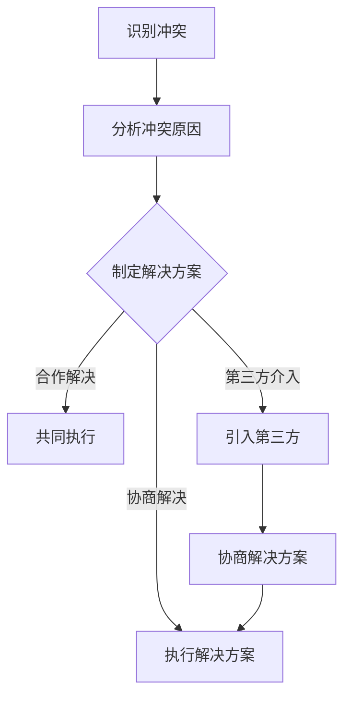
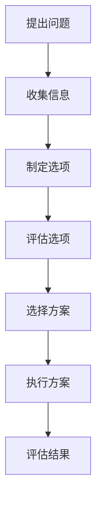
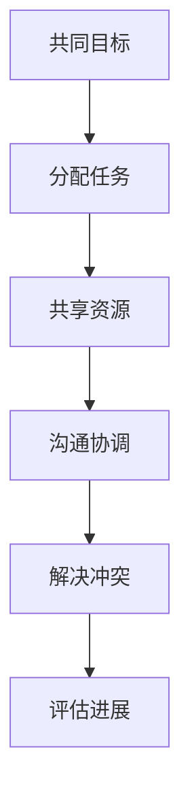
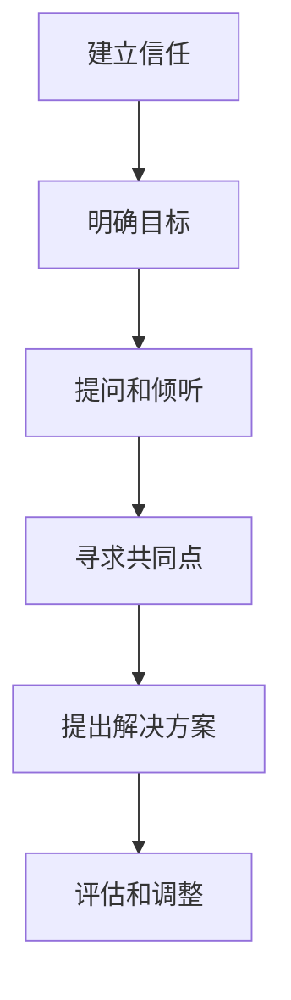

                 

# 《团队冲突管理：从对抗到建设性对话》

> **关键词**：团队冲突、冲突管理、建设性对话、沟通技巧、领导角色

> **摘要**：本文从冲突管理的理论基础入手，详细探讨了团队冲突的定义、类型、影响以及冲突管理的意义与原则。随后，文章分析了个人心理与社会因素对团队冲突的影响，介绍了冲突管理的模型与理论。在实战部分，文章提出了冲突管理的实施步骤，并通过案例分析总结了常见问题和解决方案。最后，文章讨论了冲突管理中的沟通技巧和领导角色，为读者提供了全面而实用的团队冲突管理指南。

## 目录大纲

## 第一部分：冲突管理理论基础

### 第1章：团队冲突管理概述

#### 1.1 团队冲突的定义与类型

#### 1.2 团队冲突的影响

#### 1.3 冲突管理的意义与原则

### 第2章：团队冲突的心理与社会因素

#### 2.1 个人心理因素对冲突的影响

#### 2.2 社会因素对冲突的影响

#### 2.3 团队文化对冲突管理的制约与促进

### 第3章：冲突管理模型与理论

#### 3.1 传统的冲突管理理论

#### 3.2 现代冲突管理理论

#### 3.3 冲突管理模型的应用

## 第二部分：冲突管理方法与技巧

### 第4章：沟通技巧在冲突管理中的应用

#### 4.1 沟通的基础原则

#### 4.2 建立有效的沟通渠道

#### 4.3 处理沟通中的冲突

### 第5章：建设性对话与解决冲突

#### 5.1 建设性对话的原则

#### 5.2 建设性对话的技巧

#### 5.3 建设性对话的实践案例

### 第6章：冲突解决策略与技巧

#### 6.1 协商解决冲突

#### 6.2 协作解决冲突

#### 6.3 第三方介入解决冲突

### 第7章：冲突管理中的领导角色

#### 7.1 领导者在冲突管理中的角色

#### 7.2 领导者的冲突管理策略

#### 7.3 领导者在建设性对话中的技巧

## 第三部分：冲突管理实战

### 第8章：团队冲突管理的实施步骤

#### 8.1 制定冲突管理计划

#### 8.2 识别冲突

#### 8.3 分析冲突原因

#### 8.4 选择冲突管理策略

### 第9章：案例分析

#### 9.1 案例一：团队内部的冲突管理

#### 9.2 案例二：跨部门冲突管理

#### 9.3 案例三：企业文化建设中的冲突管理

### 第10章：冲突管理中的常见问题与解决方案

#### 10.1 处理冲突时的常见误区

#### 10.2 避免冲突升级的策略

#### 10.3 提高团队冲突管理能力的措施

## 附录

### 附录A：常用冲突管理工具与资源

#### A.1 冲突管理软件介绍

#### A.2 冲突管理相关书籍推荐

#### A.3 冲突管理在线课程推荐

### 附录B：冲突管理模型与流程图

#### B.1 矛盾解决流程图

#### B.2 协商流程图

#### B.3 协作流程图

#### B.4 建设性对话流程图

---

**目录大纲已经列出，接下来我们将按照大纲逐章撰写内容。**

---

## 第一部分：冲突管理理论基础

### 第1章：团队冲突管理概述

在现代化的团队环境中，冲突管理是确保团队高效运作和可持续发展的关键因素。有效的冲突管理不仅可以降低冲突带来的负面影响，还能将冲突转化为团队进步的动力。

#### 1.1 团队冲突的定义与类型

**团队冲突的定义**：

团队冲突是指团队成员在共同工作过程中，由于观点、目标、利益等方面的不一致，而产生的争执、矛盾和对抗。这些冲突可以表现为言语、行为或心理上的对立，严重时甚至会破坏团队的凝聚力和工作效率。

**团队冲突的类型**：

团队冲突主要分为以下两种类型：

- **功能性冲突（Functional Conflict）**：功能性冲突是指有助于团队进步和创新的有益冲突。这种冲突能够激发团队成员的思考，促进问题的解决和团队决策的优化。例如，在项目开发过程中，团队成员对技术方案的讨论和争论，可能会催生出更优的解决方案。

- **破坏性冲突（Destructive Conflict）**：破坏性冲突是指对团队协作产生负面影响的有害冲突。这种冲突往往由于个人偏见、误解或沟通不畅而引发，会导致团队成员间的紧张关系，降低团队效率，甚至损害团队的整体绩效。

#### 1.2 团队冲突的影响

**团队冲突的正面影响**：

- **促进创新和问题解决**：冲突能够激发团队成员的思考，促使他们从不同角度分析问题，寻找解决方案。
- **提升团队成员的参与度和责任感**：在冲突中，团队成员需要积极参与讨论，表达自己的观点，这有助于提高他们的参与感和责任感。

**团队冲突的负面影响**：

- **降低团队效率**：冲突会分散团队成员的注意力，降低团队的整体效率。
- **影响团队合作和士气**：长期的冲突会导致团队成员之间的不信任和疏远，损害团队合作氛围，降低团队士气。

#### 1.3 冲突管理的意义与原则

**冲突管理的意义**：

冲突管理对于组织的健康发展至关重要。其意义主要体现在以下几个方面：

- **提升团队合作效率**：通过有效的冲突管理，可以减少团队内部的矛盾和争执，提高团队协作效率。
- **促进组织创新与发展**：冲突管理有助于激发团队成员的创造力和创新思维，推动组织的持续发展。
- **增强团队凝聚力**：通过解决冲突，团队成员之间的关系得到改善，团队的凝聚力得到增强。

**冲突管理的原则**：

- **及时识别和干预**：冲突管理首先要做到及时识别和干预，防止冲突升级。
- **公正公平**：在处理冲突时，要确保公正和公平，避免偏袒和歧视。
- **尊重和包容**：尊重团队成员的不同观点和个性，包容彼此的差异，有助于冲突的和平解决。
- **解决问题而非惩罚个人**：冲突管理的目标是解决冲突，而非惩罚个人，要着眼于问题的根本解决。

### 总结

团队冲突管理是一个复杂而重要的话题。通过理解和掌握团队冲突的定义、类型、影响以及冲突管理的意义和原则，我们可以更好地应对团队中的冲突，将其转化为团队进步的动力。在后续章节中，我们将深入探讨团队冲突管理的心理与社会因素、冲突管理模型与理论，以及具体的冲突管理方法和技巧。

---

### 第2章：团队冲突的心理与社会因素

团队冲突的产生不仅仅是表面上的观点和利益差异，其背后往往隐藏着复杂而深刻的心理与社会因素。理解这些因素对于有效管理团队冲突至关重要。

#### 2.1 个人心理因素对冲突的影响

个人心理因素是团队冲突的重要驱动力之一。以下是一些关键的个人心理因素及其对冲突的影响：

- **价值观和信念的差异**：个人的价值观和信念是行为和决策的内在驱动力。当团队成员的价值观和信念存在显著差异时，容易在决策和行动上产生冲突。例如，一个重视效率和执行力的成员可能会对另一个重视平衡和综合考量的成员产生不满。

- **自尊心和保护个人利益的欲望**：在团队中，个体往往会有强烈的自尊心，希望得到认可和尊重。当个人感受到自己的利益受到威胁时，容易产生抵触情绪，从而引发冲突。例如，当一个团队成员认为自己的贡献被忽视时，可能会对团队产生负面情绪。

- **情绪不稳定**：情绪不稳定的人更容易因为小事而激动或沮丧，这可能导致他们在团队中产生冲突。例如，一个情绪化的成员可能会因为意见不合而情绪失控，从而引发争执。

#### 2.2 社会因素对冲突的影响

社会因素也是团队冲突产生的重要因素。以下是一些关键的社会因素及其对冲突的影响：

- **组织文化和氛围**：组织文化和氛围对团队冲突有着深远的影响。在一个强调竞争和绩效的文化中，团队成员可能会更加关注个人利益，导致冲突的增多。相反，在一个鼓励合作和分享的文化中，团队成员之间的关系更加和谐，冲突较少。

- **职权结构和管理风格**：职权结构和管理风格也会影响团队冲突的产生。在一个高度集中的职权结构中，决策权集中在少数人手中，容易导致下属成员的不满和冲突。而在一个分权化的结构中，成员有更多的自主权，冲突可能会减少。

- **外部环境的变化**：外部环境的变化，如市场波动、政策调整等，也会对团队冲突产生影响。例如，在经济不景气时，团队成员可能会为了有限资源而争斗，导致冲突的加剧。

#### 2.3 团队文化对冲突管理的制约与促进

团队文化在冲突管理中起着至关重要的作用。一个积极健康的团队文化可以促进冲突的和平解决，而消极的团队文化则可能导致冲突的加剧。

- **积极团队文化的促进**：积极健康的团队文化通常具有以下特征：

  - **相互尊重**：团队成员之间相互尊重，能够包容彼此的差异，这有助于减少冲突。
  - **开放沟通**：团队成员能够开放地表达自己的观点，并通过建设性的对话解决分歧。
  - **共同目标**：团队成员有共同的目标和愿景，这有助于他们在面对冲突时保持团结和合作。

- **消极团队文化的制约**：消极的团队文化可能具有以下特征：

  - **权力斗争**：团队成员之间存在权力斗争，容易引发冲突。
  - **封闭沟通**：团队成员不愿意分享信息，导致误解和冲突。
  - **个人利益至上**：团队成员过分关注个人利益，忽视团队整体利益，这可能导致冲突的增多。

#### 总结

个人心理因素和社会因素共同影响着团队冲突的产生。理解这些因素有助于我们更好地识别和应对团队冲突。同时，团队文化在冲突管理中起着重要的促进作用。一个积极健康的团队文化可以促进冲突的和平解决，而一个消极的团队文化则可能导致冲突的加剧。在后续章节中，我们将继续探讨冲突管理的模型与理论，以及具体的冲突管理方法和技巧。

---

### 第3章：冲突管理模型与理论

冲突管理模型与理论为我们提供了解决团队冲突的系统方法和框架。理解这些模型与理论有助于我们更好地应对团队冲突，促进团队协作和持续发展。

#### 3.1 传统的冲突管理理论

传统的冲突管理理论主要关注冲突的解决，其核心思想是通过调解、妥协和压制等方法来缓解冲突。以下是一些常见的传统冲突管理理论：

- **调解（Mediation）**：调解是一种通过第三方的介入来帮助冲突双方达成共识的方法。调解者通常扮演中立的调解角色，帮助双方进行沟通，寻找共同点，达成解决方案。

- **妥协（Compromise）**：妥协是指双方在冲突中各自做出一定的让步，以达成某种程度的共识。这种方法适用于双方都有一定合理性的情况下，但可能导致双方的满意度降低。

- **压制（Suppression）**：压制是指通过权力和强制手段来压制冲突，避免其爆发。这种方法虽然能够在短期内平息冲突，但可能导致不满情绪的积累，最终加剧冲突。

#### 3.2 现代冲突管理理论

随着对团队冲突研究的深入，现代冲突管理理论逐渐兴起，更加注重冲突的建设性和团队协作。以下是一些现代冲突管理理论：

- **建设性对话（Constructive Dialogue）**：建设性对话是一种通过开放、真诚和尊重的沟通来解决冲突的方法。该方法强调共同目标的建立、尊重差异和寻求共同解决方案，旨在将冲突转化为团队进步的动力。

- **协商（Negotiation）**：协商是指双方通过平等和理性的沟通来解决问题，寻找双方都能接受的解决方案。协商过程强调互利共赢，通过讨价还价和妥协达成共识。

- **合作（Collaboration）**：合作是指团队成员共同合作，共同解决问题。合作强调团队合作、共享资源和共同承担责任，有助于提高团队的协作效率和创新能力。

#### 3.3 冲突管理模型的应用

在具体实践中，不同的冲突管理模型具有不同的应用场景和效果。以下是一些常见的冲突管理模型及其应用：

- **冲突三角模型（Conflict Triangle Model）**：冲突三角模型认为，冲突由三个要素组成：个人、情境和冲突。通过分析这三个要素，可以帮助我们更好地理解冲突的根源，并采取相应的管理措施。

  - **个人因素**：包括个人的价值观、信念和情绪等。
  - **情境因素**：包括工作环境、组织文化等。
  - **冲突因素**：包括冲突的根源、类型和程度等。

- **交互影响模型（Interpersonal Influence Model）**：交互影响模型认为，冲突管理的关键在于理解和运用人际影响力的策略。该模型提出了五种基本的人际影响力策略：说服、合作、竞争、回避和妥协。

  - **说服**：通过提供理性和事实来影响他人。
  - **合作**：寻求共同目标和解决方案。
  - **竞争**：追求个人利益，忽视他人利益。
  - **回避**：避免冲突，但可能导致问题积累。
  - **妥协**：通过让步和妥协来解决问题。

- **赢-赢模型（Win-Win Model）**：赢-赢模型是一种旨在实现双方共赢的冲突管理方法。该方法强调通过开放和真诚的沟通，寻求双方都能接受的解决方案，实现冲突的双赢。

  - **共同目标**：建立共同的目标和愿景。
  - **尊重差异**：尊重彼此的观点和利益。
  - **开放沟通**：通过真诚和开放的沟通解决分歧。
  - **共同解决方案**：寻找双方都能接受的解决方案。

#### 总结

传统的冲突管理理论主要关注冲突的解决，而现代冲突管理理论更加注重冲突的建设性和团队协作。通过理解不同的冲突管理模型和理论，我们可以更好地应对团队冲突，促进团队的协作和持续发展。在后续章节中，我们将探讨具体的冲突管理方法和技巧，以及如何在实践中应用这些理论和方法。

---

## 第二部分：冲突管理方法与技巧

### 第4章：沟通技巧在冲突管理中的应用

有效的沟通是解决冲突的关键。良好的沟通技巧可以帮助团队成员理解彼此的观点和需求，从而找到解决问题的方法。

#### 4.1 沟通的基础原则

在进行沟通时，以下基础原则是确保有效沟通的关键：

- **真诚和透明**：在沟通中，真诚和透明是建立信任的基础。团队成员应该坦诚地表达自己的观点和感受，避免隐藏或掩饰。

- **尊重和理解**：尊重他人的观点和感受，是解决冲突的前提。通过倾听和理解，可以更好地了解对方的立场和需求。

- **积极倾听**：积极倾听不仅仅是听对方说什么，更重要的是理解对方的情感和需求。通过提问和反馈，确保自己正确理解对方的意图。

- **明确表达**：在表达自己的观点时，要清晰、具体和明确。避免使用模糊的语言，以免产生误解。

#### 4.2 建立有效的沟通渠道

建立有效的沟通渠道，有助于团队成员之间的信息交流和意见表达。以下是一些建立有效沟通渠道的方法：

- **定期会议**：定期举行团队会议，可以让团队成员分享信息、讨论问题和规划工作。会议应该有明确的议程和目标，确保会议的高效和有序。

- **线上交流工具**：利用线上交流工具，如即时通讯软件、邮件和论坛，可以方便团队成员随时进行沟通。这些工具应该易于使用，并支持文件共享和协作。

- **反馈机制**：建立反馈机制，让团队成员能够及时表达意见和建议。反馈可以是正面的，也可以是改进建议，关键是提供一个开放和安全的平台。

#### 4.3 处理沟通中的冲突

在沟通过程中，冲突是不可避免的。处理沟通中的冲突需要以下技巧：

- **及时识别和回应**：一旦发现沟通中的冲突，应该及时识别并采取行动。避免让冲突积累，影响团队的合作和氛围。

- **保持冷静和专业**：在处理冲突时，要保持冷静和专业，避免情绪化。通过理性分析问题，找到解决方案。

- **寻求第三方帮助**：在复杂或难以解决的冲突中，可以寻求第三方帮助，如专业的调解员或心理咨询师。第三方可以提供中立的观点和专业的建议，有助于冲突的解决。

#### 案例研究

假设在一个软件开发团队中，开发人员A和测试人员B在项目进度上产生了冲突。A认为测试阶段的时间过长，影响了开发进度；而B则认为测试阶段是确保项目质量的关键，时间不足会导致质量问题。

**解决过程**：

1. **识别冲突**：项目经理及时识别到了A和B之间的冲突。

2. **积极倾听**：项目经理分别与A和B进行了沟通，让他们表达了自己的观点和感受。

3. **分析原因**：项目经理分析了冲突的根源，发现是由于双方对项目质量和进度有不同的期望。

4. **建立共识**：项目经理与A和B一起讨论，找到了一个双方都能接受的解决方案：缩短测试阶段，但增加测试频次，确保项目质量。

5. **跟进执行**：项目经理跟进解决方案的执行，并定期与A和B沟通，确保问题的解决。

通过这个案例，我们可以看到，有效的沟通技巧和及时的处理冲突，是解决团队冲突的关键。

#### 总结

有效的沟通技巧在冲突管理中起着至关重要的作用。通过真诚和透明的沟通，尊重和理解彼此的观点，及时识别和回应冲突，我们可以更好地解决团队中的冲突，促进团队的协作和进步。在后续章节中，我们将继续探讨建设性对话和解决冲突的策略。

---

### 第5章：建设性对话与解决冲突

建设性对话是一种通过开放、真诚和尊重的沟通来解决冲突的方法。它强调共同目标的建立、尊重差异和寻求共同解决方案，旨在将冲突转化为团队进步的动力。

#### 5.1 建设性对话的原则

建设性对话遵循以下原则：

- **共同目标**：建设性对话始于共同目标的建立。团队成员应该明确共同的目标和愿景，这有助于他们在面对冲突时保持团结和合作。

- **尊重差异**：在建设性对话中，尊重差异是关键。每个成员都有独特的观点和经验，尊重差异能够促进创新和问题解决。

- **开放心态**：开放心态是建设性对话的核心。团队成员应该保持开放的心态，愿意接受不同的观点和建议，这有助于找到更全面的解决方案。

- **建设性反馈**：在建设性对话中，成员应该提供积极的反馈，鼓励彼此的成长和改进。建设性反馈应该具体、明确，并指出改进的方向。

#### 5.2 建设性对话的技巧

以下是一些进行建设性对话的技巧：

- **提问和倾听**：提问和倾听是建设性对话的关键。通过提问，可以引导对话深入，了解对方的观点和需求；通过倾听，可以更好地理解对方的情感和意图。

- **避免指责和攻击**：在建设性对话中，要避免使用指责和攻击的语言。指责和攻击会破坏对话的氛围，阻碍问题的解决。

- **寻求共同点**：在建设性对话中，寻求共同点是找到解决方案的重要步骤。通过识别共同点，可以缩小分歧，找到双方都能接受的解决方案。

- **提出解决方案**：建设性对话的最终目标是提出解决方案。在对话中，成员应该共同努力，提出切实可行的解决方案，并讨论其优缺点。

#### 5.3 建设性对话的实践案例

以下是一个实际案例，展示了如何通过建设性对话解决团队冲突：

**案例背景**：

在一个软件开发团队中，项目经理A和开发人员B在项目进度和时间安排上产生了分歧。A认为B的工作效率低下，导致项目进度延迟；而B则认为A给的时间太紧，难以完成任务。

**解决过程**：

1. **建立共同目标**：项目经理和开发人员首先明确了共同目标：确保项目按时完成，并保证软件质量。

2. **尊重差异**：项目经理和开发人员尊重彼此的观点，认识到项目进度和时间安排是双方关注的重点。

3. **开放心态**：双方都保持开放的心态，愿意倾听对方的观点和建议。

4. **提问和倾听**：项目经理通过提问，了解了B的具体困难和挑战；B也通过倾听，理解了A对项目进度的担忧。

5. **寻求共同点**：双方找到了共同点：都希望项目能够按时完成，并保证质量。

6. **提出解决方案**：项目经理和开发人员一起讨论，提出了以下解决方案：

   - 调整项目计划，为开发人员提供更多的缓冲时间。
   - 增加团队沟通，确保每个人都能了解项目的最新进展和需求。
   - 定期评估项目进度，及时调整策略。

7. **实施和跟进**：解决方案得到实施，项目经理和开发人员定期跟进项目进展，确保问题的解决。

通过这个案例，我们可以看到，建设性对话在解决冲突中的重要作用。通过尊重差异、开放心态和共同努力，团队成员可以找到双方都能接受的解决方案，促进团队的合作和进步。

#### 总结

建设性对话是一种有效的解决冲突的方法，它强调共同目标、尊重差异和寻求共同解决方案。通过提问和倾听、避免指责和攻击、寻求共同点和提出解决方案等技巧，团队成员可以更好地解决冲突，促进团队的合作和进步。在后续章节中，我们将继续探讨冲突解决策略与技巧，以及领导者在冲突管理中的角色和技巧。

---

### 第6章：冲突解决策略与技巧

在团队冲突管理中，选择合适的解决策略和技巧至关重要。以下我们将探讨几种常见的冲突解决策略和技巧，包括协商解决冲突、合作解决冲突以及第三方介入解决冲突。

#### 6.1 协商解决冲突

协商解决冲突是一种通过平等和理性的沟通来寻找双方都能接受的解决方案的方法。以下是协商解决冲突的几个关键步骤：

1. **了解对方立场**：在协商过程中，首先要了解对方的立场和需求。通过提问和倾听，了解对方的观点和动机，这有助于找到共同点。

2. **寻求共同利益**：协商的目标是找到双方都能接受的解决方案，这需要识别并强调共同利益。通过寻求共同利益，可以缩小分歧，找到共识。

3. **制订妥协方案**：在协商过程中，双方可能需要做出一定的妥协。制订妥协方案，确保双方的权益都得到尊重，这有助于达成共识。

4. **明确协议**：在协商达成一致后，要明确协议的内容和执行细节。通过书面协议，确保各方都能遵守承诺，避免误解和纠纷。

**案例分析**：

在一个软件项目团队中，开发人员A和测试人员B在项目进度上产生了分歧。A认为测试阶段的时间过长，影响了开发进度；而B则认为测试阶段是确保项目质量的关键，时间不足会导致质量问题。

**解决过程**：

1. **了解对方立场**：项目经理分别与A和B进行了沟通，了解了他们的观点和需求。

2. **寻求共同利益**：项目经理指出，项目质量和进度是团队共同的目标，双方都需要为这个目标努力。

3. **制订妥协方案**：项目经理与A和B一起讨论，提出了以下妥协方案：

   - 缩短测试阶段，但增加测试频次，确保项目质量。
   - 增加团队沟通，确保每个人都能了解项目的最新进展和需求。

4. **明确协议**：项目经理与A和B一起制定了详细的协议，包括测试阶段的调整、沟通频次和时间安排等。

通过协商解决冲突，团队找到了双方都能接受的解决方案，避免了冲突的进一步升级。

#### 6.2 合作解决冲突

合作解决冲突强调团队成员共同合作，共同解决问题。以下是合作解决冲突的几个关键步骤：

1. **分享信息和资源**：在合作过程中，团队成员应该分享信息和资源，确保每个人都能了解项目的进展和需求。

2. **建立信任**：信任是合作的基础。通过开放沟通和诚实表达，建立团队成员之间的信任，这有助于减少冲突。

3. **共同解决问题**：在合作解决冲突时，团队成员应该共同努力，寻找解决问题的方法。通过集思广益，可以找到更全面的解决方案。

4. **评估和调整**：在合作过程中，要不断评估和调整解决方案。通过持续反馈和改进，确保问题的解决。

**案例分析**：

在一个产品开发团队中，设计师C和市场人员D在产品设计方向上产生了分歧。C认为产品应该更注重用户体验，而D则认为市场趋势更重要。

**解决过程**：

1. **分享信息和资源**：项目经理组织了团队会议，让C和D分享他们的观点和需求。

2. **建立信任**：项目经理鼓励团队成员开放沟通，诚实表达自己的观点，建立了团队之间的信任。

3. **共同解决问题**：项目经理与C和D一起讨论，提出了以下解决方案：

   - 结合用户体验和市场趋势，制定一个符合市场需求的产品设计。
   - 增加市场调研，确保产品的市场定位准确。

4. **评估和调整**：项目经理定期评估产品的市场表现，根据市场反馈调整产品设计，确保产品的竞争力。

通过合作解决冲突，团队找到了一个兼顾用户体验和市场趋势的解决方案，提高了产品的市场竞争力。

#### 6.3 第三方介入解决冲突

在复杂或难以解决的冲突中，第三方介入可以帮助团队找到解决方案。以下是第三方介入解决冲突的几个关键步骤：

1. **中立和客观**：第三方介入者应该是中立和客观的，不偏袒任何一方，确保冲突的公正解决。

2. **提供专业建议**：第三方介入者可以提供专业的建议和观点，帮助团队找到解决问题的方法。

3. **促进对话和协商**：第三方介入者可以促进团队成员之间的对话和协商，帮助各方找到共同点。

4. **制定解决方案**：在第三方介入者的协助下，团队可以制定一个公正、合理的解决方案。

**案例分析**：

在一个跨部门合作项目中，研发部门E和市场部门F在项目资源分配上产生了冲突。E认为市场部门占用过多资源，影响了研发进度；而F则认为研发部门不重视市场需求。

**解决过程**：

1. **中立和客观**：项目经理邀请了一位外部咨询专家作为第三方介入者。

2. **提供专业建议**：第三方介入者提供了专业的资源分配建议，帮助团队理解资源分配的原则和最佳实践。

3. **促进对话和协商**：第三方介入者组织了团队会议，让E和F进行对话和协商。

4. **制定解决方案**：在第三方介入者的协助下，团队制定了以下解决方案：

   - 根据项目优先级和市场需求，合理分配资源。
   - 增加跨部门沟通，确保各方都能了解项目的最新进展和需求。

通过第三方介入解决冲突，团队找到了一个公正、合理的解决方案，避免了冲突的进一步升级。

#### 总结

协商解决冲突、合作解决冲突和第三方介入解决冲突是常见的冲突解决策略和技巧。通过理解这些策略和技巧，团队可以更好地应对冲突，找到解决问题的方法，促进团队的协作和进步。在后续章节中，我们将探讨冲突管理中的领导角色，以及如何提高团队冲突管理能力。

---

### 第7章：冲突管理中的领导角色

在团队冲突管理中，领导者的角色至关重要。领导者不仅需要识别和应对冲突，还需要通过有效的策略和技巧来促进团队的合作和进步。

#### 7.1 领导者在冲突管理中的角色

领导者在冲突管理中的角色可以概括为以下几个方面：

1. **及时识别冲突**：领导者需要敏锐地识别团队中的潜在冲突，特别是在项目初期和关键节点。通过及时识别冲突，可以防止冲突的进一步升级。

2. **维护团队和谐**：领导者需要维护团队的和谐氛围，确保团队成员之间的沟通和协作。在冲突发生时，领导者要起到缓冲作用，避免冲突对团队造成负面影响。

3. **促进建设性对话**：领导者要积极促进团队内的建设性对话，鼓励成员开放地表达观点和意见。通过建设性对话，可以帮助团队成员理解彼此的立场和需求，找到解决问题的方法。

4. **提供支持和资源**：领导者需要为团队提供必要的支持和资源，帮助团队成员解决冲突。这可能包括时间、人力、技术等方面的支持。

#### 7.2 领导者的冲突管理策略

领导者可以通过以下策略来管理团队冲突：

1. **公正和透明**：领导者要确保冲突管理过程公正和透明，避免偏袒和歧视。通过公正和透明的处理冲突，可以增强团队成员对领导的信任。

2. **鼓励开放沟通**：领导者要鼓励团队成员开放地沟通和表达自己的观点。开放沟通可以帮助团队成员理解彼此的想法和需求，减少误解和冲突。

3. **提供培训和支持**：领导者可以组织冲突管理培训，帮助团队成员掌握有效的沟通技巧和解决冲突的方法。此外，领导者要为团队成员提供必要的支持和资源，帮助他们应对冲突。

4. **调整团队结构**：在特定情况下，领导者可能需要调整团队结构，以减少冲突的发生。这可能包括重新分配工作职责、增加沟通渠道等。

#### 7.3 领导者在建设性对话中的技巧

在建设性对话中，领导者需要掌握以下技巧：

1. **倾听和理解**：领导者要耐心倾听团队成员的观点和意见，理解他们的感受和需求。通过倾听和理解，可以建立信任，促进对话的深入。

2. **促进共同目标**：领导者要引导团队成员建立共同的目标和愿景。共同目标可以减少冲突，促进团队的协作和进步。

3. **提供解决方案**：领导者要积极参与解决方案的制定，提供有建设性的建议。通过提供解决方案，可以帮助团队成员找到解决问题的方法。

4. **引导团队讨论**：领导者要引导团队成员进行有效的讨论，确保每个人都能够表达自己的观点。通过引导讨论，可以找到更全面的解决方案。

**案例分析**：

在一个软件开发团队中，项目经理G和开发人员H在项目进度和时间安排上产生了冲突。G认为H的工作效率低下，影响了项目进度；而H则认为G给的时间太紧，难以完成任务。

**解决过程**：

1. **及时识别冲突**：项目经理G及时识别到了冲突，并在项目初期进行了干预。

2. **维护团队和谐**：项目经理G通过定期沟通和团队建设活动，维护了团队的和谐氛围。

3. **促进建设性对话**：项目经理G组织了团队会议，让G和H进行建设性对话。

4. **提供支持和资源**：项目经理G为团队提供了额外的培训和资源，帮助团队成员提高工作效率。

5. **提供解决方案**：项目经理G和团队一起制定了以下解决方案：

   - 调整项目计划，为开发人员提供更多的缓冲时间。
   - 增加团队沟通，确保每个人都能了解项目的最新进展和需求。

通过领导者的积极干预和有效的建设性对话，团队找到了解决问题的方法，避免了冲突的进一步升级。

#### 总结

领导者在冲突管理中扮演着关键角色。通过及时识别冲突、维护团队和谐、促进建设性对话和提供解决方案等策略和技巧，领导者可以有效地管理团队冲突，促进团队的协作和进步。在后续章节中，我们将探讨团队冲突管理的实施步骤，以及如何通过案例分析提高团队冲突管理能力。

---

### 第8章：团队冲突管理的实施步骤

有效的团队冲突管理需要系统的实施步骤，以确保冲突能够得到及时和合理的解决。以下是我们推荐的团队冲突管理实施步骤：

#### 8.1 制定冲突管理计划

制定冲突管理计划是冲突管理的第一步。冲突管理计划应包括以下内容：

- **目标**：明确冲突管理的目标，如提高团队协作效率、减少冲突负面影响等。
- **策略**：根据团队的特点和冲突的类型，选择合适的冲突管理策略，如建设性对话、协商等。
- **责任分配**：明确冲突管理过程中的责任分配，确保每个团队成员都清楚自己的角色和责任。
- **时间表**：制定冲突管理的时间表，确保冲突能够在合理的时间内得到解决。

#### 8.2 识别冲突

识别冲突是冲突管理的关键。以下是一些识别冲突的方法：

- **观察和倾听**：通过观察团队成员的行为和沟通，以及倾听他们的意见和建议，可以及时发现潜在的冲突。
- **调查和访谈**：通过问卷调查、面对面访谈等方式，收集团队成员对冲突的反馈，了解冲突的具体情况和影响。
- **数据分析**：通过分析项目进度、团队绩效等数据，可以发现冲突的迹象和趋势。

#### 8.3 分析冲突原因

分析冲突原因是制定解决方案的前提。以下是一些分析冲突原因的方法：

- **识别个人和团队因素**：分析冲突产生的个人和团队因素，如价值观、沟通方式、团队文化等。
- **分析冲突类型和程度**：根据冲突的性质和影响程度，分类分析冲突的类型和程度。
- **探索解决方案的可行性**：评估各种解决方案的可行性，选择最合适的解决方案。

#### 8.4 选择冲突管理策略

选择冲突管理策略是根据冲突原因和情境制定的具体行动方案。以下是一些常见的冲突管理策略：

- **协商解决冲突**：通过平等和理性的沟通，寻找双方都能接受的解决方案。
- **合作解决冲突**：强调团队合作，共同解决问题。
- **第三方介入解决冲突**：在复杂或难以解决的冲突中，引入第三方中立者进行调解。

#### 案例分析

**案例一：团队内部的冲突管理**

在一个软件开发团队中，开发人员I和测试人员J在项目进度上产生了冲突。I认为测试阶段的时间过长，影响了开发进度；而J则认为测试阶段是确保项目质量的关键，时间不足会导致质量问题。

**解决过程**：

1. **识别冲突**：项目经理K通过观察和倾听，发现了I和J之间的冲突。
2. **分析冲突原因**：项目经理K分析了冲突的原因，发现是由于双方对项目质量和进度有不同的期望。
3. **选择冲突管理策略**：项目经理K选择了协商解决冲突的策略，通过平等和理性的沟通，寻找双方都能接受的解决方案。
4. **实施策略**：项目经理K组织了I和J的协商会议，让他们表达自己的观点和需求，最终找到了一个双方都能接受的解决方案：缩短测试阶段，但增加测试频次，确保项目质量。

**案例二：跨部门冲突管理**

在一个大型企业中，研发部门L和市场部门M在项目资源分配上产生了冲突。L认为市场部门占用过多资源，影响了研发进度；而M则认为研发部门不重视市场需求。

**解决过程**：

1. **识别冲突**：企业高管N通过数据分析，发现了L和M之间的冲突。
2. **分析冲突原因**：企业高管N分析了冲突的原因，发现是由于双方对资源分配的原则有不同的理解。
3. **选择冲突管理策略**：企业高管N选择了第三方介入解决冲突的策略，邀请外部咨询专家进行调解。
4. **实施策略**：第三方咨询专家组织了L和M的调解会议，通过中立和客观的调解，找到了一个双方都能接受的解决方案：根据项目优先级和市场需求，合理分配资源。

**案例三：企业文化建设中的冲突管理**

在一个初创企业中，团队成员O和P在企业文化建设上产生了冲突。O认为企业应该更加注重技术创新；而P则认为企业应该更加注重客户服务。

**解决过程**：

1. **识别冲突**：企业创始人Q通过观察和倾听，发现了O和P之间的冲突。
2. **分析冲突原因**：企业创始人Q分析了冲突的原因，发现是由于双方对企业的核心价值观有不同的理解。
3. **选择冲突管理策略**：企业创始人Q选择了建设性对话的策略，通过开放和真诚的沟通，寻找双方都能接受的解决方案。
4. **实施策略**：企业创始人Q组织了O和P的建设性对话会议，让他们表达自己的观点和需求，最终找到了一个双方都能接受的解决方案：在技术创新和客户服务之间找到平衡点，制定一个兼顾两者的发展战略。

#### 总结

通过制定冲突管理计划、识别冲突、分析冲突原因和选择冲突管理策略，团队可以有效地应对冲突，促进团队的协作和进步。在实际操作中，团队应根据具体情况灵活调整冲突管理策略，确保冲突能够得到及时和合理的解决。

---

### 第9章：案例分析

#### 9.1 案例一：团队内部的冲突管理

**案例背景**：

在一个软件开发团队中，团队成员之间由于工作方法、技术观点和优先级安排等问题，产生了频繁的冲突。这种冲突不仅影响了项目进度，还降低了团队成员的士气和工作效率。

**解决过程**：

1. **识别冲突**：项目经理A通过日常沟通和团队成员的反馈，识别到了团队内部的冲突。

2. **分析冲突原因**：项目经理A分析了冲突的原因，发现是由于团队成员之间的沟通不畅、工作方法不一致以及对项目优先级的理解不同。

3. **制定解决方案**：
   - **建立沟通渠道**：项目经理A建立了定期的团队会议，鼓励团队成员开放地表达自己的观点和问题。
   - **统一工作方法**：项目经理A组织了技术分享会，帮助团队成员统一工作方法和流程。
   - **明确项目优先级**：项目经理A与团队成员一起制定了项目的优先级，确保每个人都清楚项目的重点和目标。

4. **实施和评估**：项目经理A持续跟进解决方案的执行情况，定期评估团队的工作效率和士气的改善情况。

**结果**：

通过以上措施，团队内部的冲突得到了显著缓解，项目进度和团队成员的士气都有了明显提升。

#### 9.2 案例二：跨部门冲突管理

**案例背景**：

在一个大型企业中，研发部门B和销售部门C之间因为项目交付和资源分配的问题产生了冲突。研发部门B认为销售部门C的需求变化频繁，影响了项目的稳定性；而销售部门C则认为研发部门B的交付速度太慢，无法满足市场要求。

**解决过程**：

1. **识别冲突**：企业高管D通过部门反馈和项目进度报告，识别到了B和C之间的冲突。

2. **分析冲突原因**：企业高管D分析了冲突的原因，发现是由于部门之间的沟通不足、资源分配不合理以及对项目成功标准的不同理解。

3. **制定解决方案**：
   - **建立沟通机制**：企业高管D制定了跨部门的沟通计划，定期召开联合会议，讨论项目的进展和问题。
   - **优化资源分配**：企业高管D调整了资源分配策略，确保各部门在关键阶段得到足够的支持。
   - **统一项目成功标准**：企业高管D与各部门共同制定了统一的项目成功标准，明确了项目的关键目标和交付要求。

4. **实施和评估**：企业高管D持续跟踪冲突解决的进展，通过定期的评估会议，确保解决方案的有效性。

**结果**：

通过跨部门的合作和沟通，研发部门B和销售部门C之间的冲突得到了有效缓解，项目交付的稳定性和市场响应速度都有所提升。

#### 9.3 案例三：企业文化建设中的冲突管理

**案例背景**：

在一个初创企业中，企业文化建设过程中出现了不同的观点和做法。一部分员工认为企业应该更加注重技术创新，另一部分员工则认为应该更加注重客户服务。

**解决过程**：

1. **识别冲突**：企业创始人E通过团队讨论和员工反馈，识别到了企业文化冲突的问题。

2. **分析冲突原因**：企业创始人E分析了冲突的原因，发现是由于团队成员对企业的核心价值观有不同的理解。

3. **制定解决方案**：
   - **开展文化讨论**：企业创始人E组织了多次文化讨论会，让员工表达自己的观点和期望。
   - **制定共同目标**：企业创始人E与团队成员一起制定了共同的企业目标，确保每个人都认同企业的核心价值观。
   - **实施文化培训**：企业创始人E安排了文化培训课程，帮助员工更好地理解企业的文化理念和价值观。

4. **实施和评估**：企业创始人E持续跟踪文化建设的进展，通过定期的员工满意度调查，评估文化建设的成效。

**结果**：

通过以上措施，企业内部的文化冲突得到了有效解决，团队成员对企业文化的认同感和归属感显著提升，企业的整体发展也得到了积极推动。

#### 总结

通过以上案例，我们可以看到，团队冲突管理在实际操作中需要结合具体情况，采取合适的策略和方法。有效的冲突管理不仅能够缓解冲突，还能提升团队协作效率和整体绩效。在后续章节中，我们将继续探讨冲突管理中的常见问题与解决方案。

---

### 第10章：冲突管理中的常见问题与解决方案

在团队冲突管理的过程中，可能会遇到各种常见的问题。了解这些问题及其解决方案，有助于我们更有效地应对冲突，提高团队的整体效能。

#### 10.1 处理冲突时的常见误区

1. **忽视冲突**：许多团队成员和管理者倾向于忽视冲突，认为冲突会影响团队氛围，但实际上，忽视冲突可能导致问题积聚，最终导致更严重的后果。

   **解决方案**：及时识别和应对冲突，避免问题积累。

2. **片面指责**：在处理冲突时，过分指责某一方的行为或观点，可能导致对方产生抵触情绪，不利于问题的解决。

   **解决方案**：保持客观和公正，避免片面指责，鼓励开放和建设性的对话。

3. **情绪化处理**：在冲突管理中，情绪化的处理方式往往会导致冲突升级，影响团队关系。

   **解决方案**：保持冷静和专业，以理性的态度处理冲突。

4. **过度妥协**：为了避免冲突，过度妥协可能导致个人和团队利益的损失。

   **解决方案**：在寻求共识时，平衡各方利益，避免过度妥协。

#### 10.2 避免冲突升级的策略

1. **建立共识**：在项目初期，明确团队目标和规则，建立共识，有助于避免冲突的发生。

   **解决方案**：通过团队建设活动和共同制定的工作计划，建立明确的共识。

2. **加强沟通**：定期进行团队沟通，分享信息和进展，有助于减少误解和冲突。

   **解决方案**：设立定期会议和反馈机制，鼓励团队成员积极参与沟通。

3. **明确角色和责任**：明确团队成员的角色和责任，减少因职责不明导致的冲突。

   **解决方案**：制定详细的岗位职责说明书，确保每个人了解自己的职责和期望。

4. **提供培训**：为团队成员提供冲突管理和沟通技巧的培训，提高他们的应对能力。

   **解决方案**：组织冲突管理和沟通技巧的培训课程，帮助团队成员提升技能。

#### 10.3 提高团队冲突管理能力的措施

1. **领导力培养**：领导者应在冲突管理方面进行自我提升，树立榜样，引导团队正确应对冲突。

   **解决方案**：参加领导力培训，学习先进的冲突管理理念和方法。

2. **团队建设活动**：通过团队建设活动，增强团队成员之间的信任和合作，提高团队整体的冲突管理能力。

   **解决方案**：定期组织团队建设活动，如团建游戏、户外拓展等。

3. **建立冲突管理机制**：建立完善的冲突管理机制，确保冲突能够得到及时和有效的解决。

   **解决方案**：制定冲突管理政策，设立专门的冲突管理团队或角色。

4. **文化塑造**：塑造积极健康的团队文化，鼓励团队成员相互尊重、开放沟通和合作解决问题。

   **解决方案**：通过文化活动、价值观宣传等方式，营造积极的团队氛围。

#### 总结

在团队冲突管理中，识别和处理冲突的常见误区、避免冲突升级的策略以及提高团队冲突管理能力的方法都是关键因素。通过这些措施，团队可以更有效地管理冲突，促进协作和持续发展。在后续章节中，我们将提供一些常用的冲突管理工具与资源，以供参考。

---

### 附录A：常用冲突管理工具与资源

#### A.1 冲突管理软件介绍

1. **Conflict Mapper**：一款可视化的冲突管理软件，帮助团队识别和分析冲突的根源。

2. **Teamleader**：一款基于云计算的团队协作工具，提供实时沟通、任务分配和进度跟踪功能。

3. **Conflkt**：一款专门针对团队冲突管理的软件，提供冲突预警、冲突分析和解决建议。

#### A.2 冲突管理相关书籍推荐

1. **《冲突管理：理论与实践》**：作者詹姆斯·K·费斯勒，详细介绍了冲突管理的理论和实践方法。

2. **《团队冲突管理》**：作者唐纳德·T.伯恩斯，探讨了团队冲突的类型、原因和解决策略。

3. **《冲突的智慧》**：作者马丁·林斯特龙，通过案例研究，阐述了冲突管理的艺术和技巧。

#### A.3 冲突管理在线课程推荐

1. **Coursera上的《冲突管理》**：由宾夕法尼亚大学提供，涵盖了冲突管理的理论基础和实践技巧。

2. **Udemy上的《团队冲突管理》**：提供了系统的冲突管理课程，包括沟通技巧、解决策略等。

3. **edX上的《冲突解决》**：由哈佛大学提供，专注于冲突解决的理论和实践，适用于各类团队环境。

---

### 附录B：冲突管理模型与流程图

为了更好地理解冲突管理的方法和流程，以下是几个常用的冲突管理模型及其流程图：

#### B.1 矛盾解决流程图

#### B.2 协商流程图

#### B.3 协作流程图

#### B.4 建设性对话流程图

通过这些流程图，我们可以更直观地理解冲突管理的不同模型和步骤，有助于在实际操作中应用和优化冲突管理策略。

---

### 总结

在本文中，我们系统地介绍了团队冲突管理的理论基础、方法与技巧，并通过案例分析展示了冲突管理在实际操作中的应用。团队冲突管理不仅涉及到冲突的类型、影响和管理原则，还包括心理与社会因素、冲突管理模型与理论、沟通技巧、建设性对话以及领导者的角色。

通过学习本文，读者可以：

- 理解团队冲突的定义、类型和影响，认识到冲突管理的重要性。
- 掌握冲突管理的理论基础，包括个人心理因素和社会因素。
- 了解冲突管理模型与理论，如传统冲突管理理论、现代冲突管理理论。
- 学会使用沟通技巧和建设性对话来有效地解决冲突。
- 熟悉冲突解决策略与技巧，如协商、合作和第三方介入。
- 提高领导者的冲突管理能力，促进团队的协作和进步。

在未来的团队工作中，有效管理冲突是确保团队高效运作和持续发展的关键。希望本文能为读者提供实用的指导，帮助他们在实际工作中更好地应对冲突，推动团队的进步。

---

### 作者信息

**作者：AI天才研究院/AI Genius Institute & 禅与计算机程序设计艺术 /Zen And The Art of Computer Programming**

AI天才研究院致力于探索人工智能领域的最新技术和理论，推动人工智能在各行各业的创新应用。同时，作者还著有《禅与计算机程序设计艺术》，该书以深入浅出的方式介绍了计算机编程的哲学和艺术，深受读者喜爱。

通过本文，我们希望能够为读者提供一套全面、实用的团队冲突管理指南，帮助他们在团队协作中更好地应对冲突，推动团队的持续发展。如果您有任何关于团队冲突管理的问题或建议，欢迎随时与我们交流。AI天才研究院期待与您一起探索人工智能的未来，共创美好世界。

