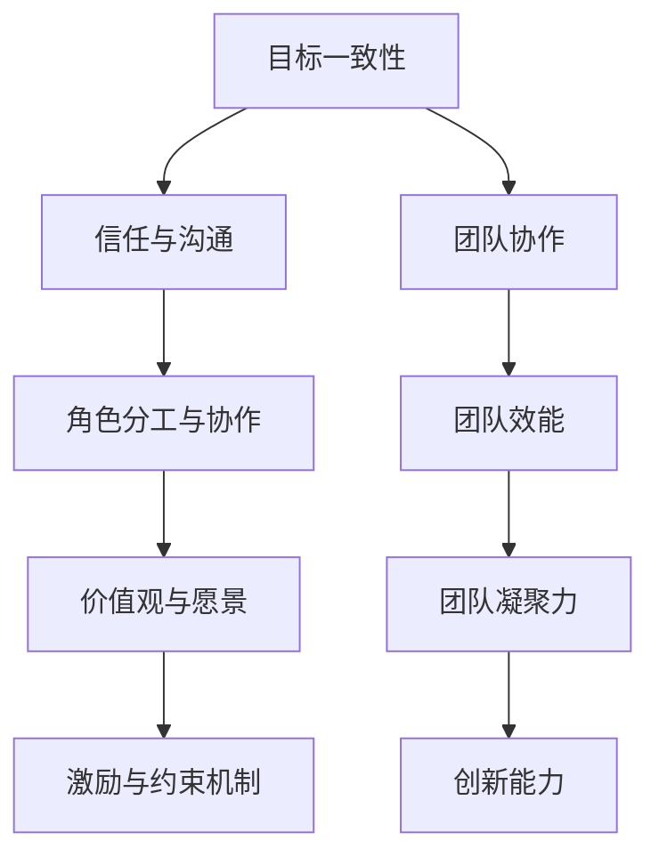
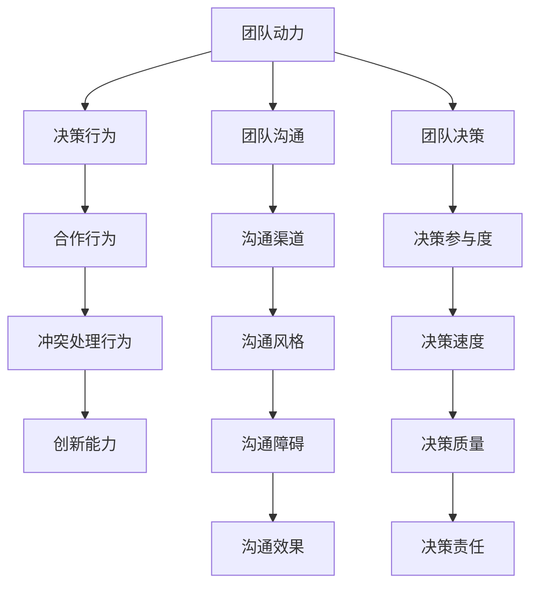
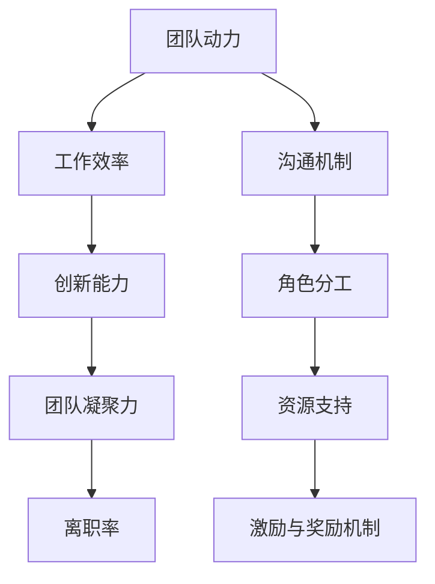
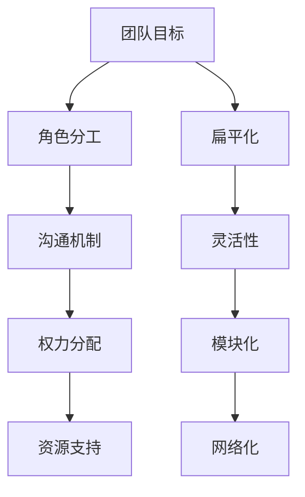
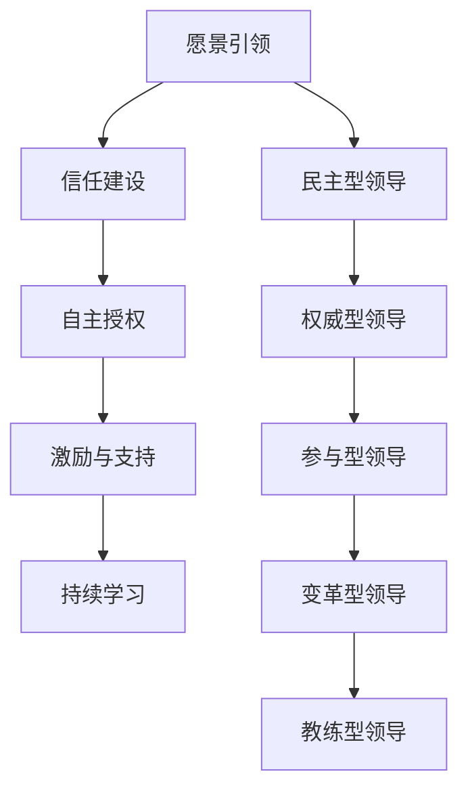
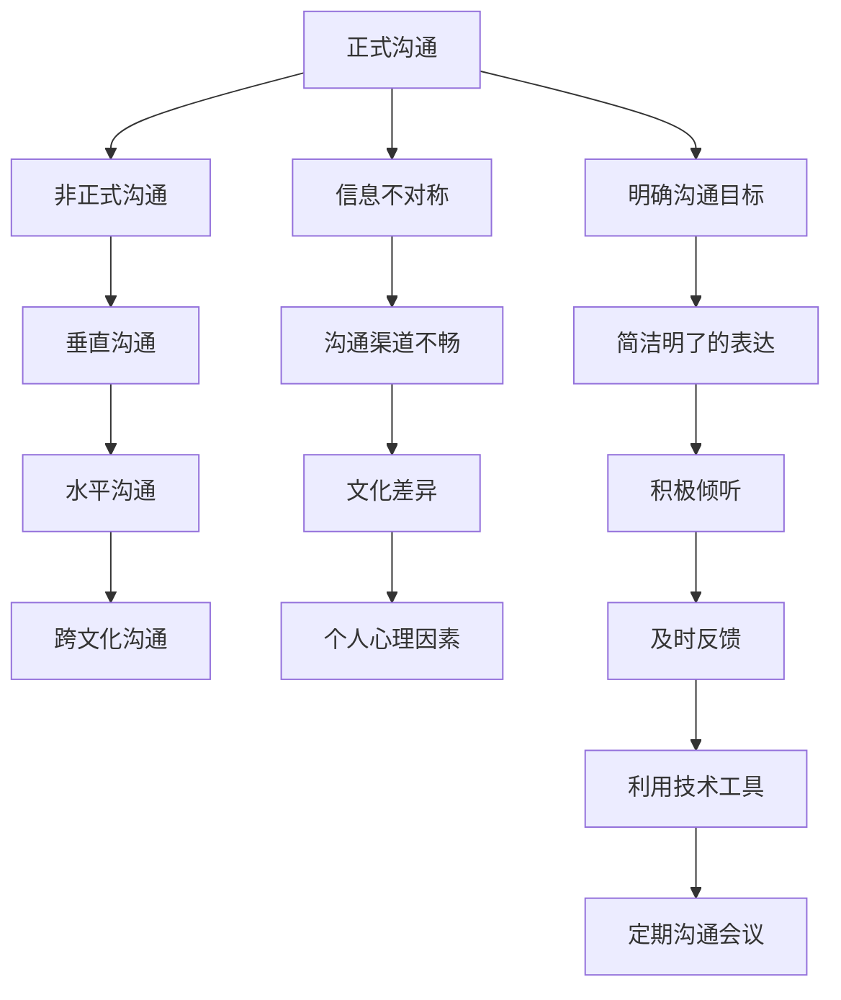
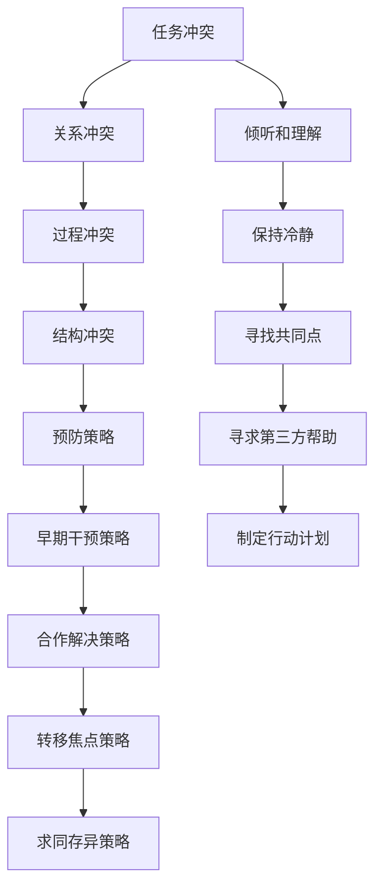
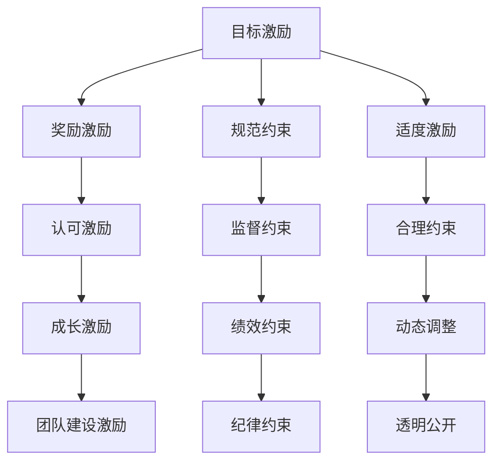
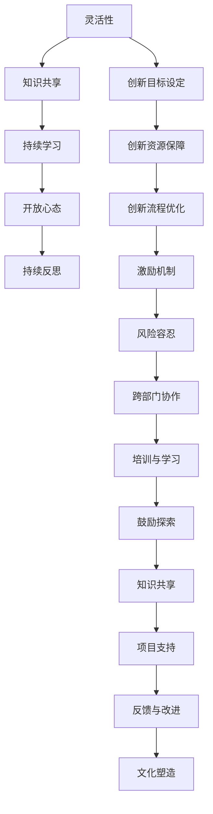

                 

# 《团队动力学：解析高效团队的内在机制》

## 摘要

本文旨在探讨团队动力学的核心概念、理论框架及其实际应用。团队动力学是指研究团队内部动力因素如何影响团队行为、效能及成员互动的学科。高效团队的内在机制是其成功的关键，包括组织结构、领导力、沟通机制、冲突管理、激励机制和创新能力等方面。本文通过详细分析这些内在机制，提供了一系列实用的策略和方法，以帮助团队实现高效运作。此外，还将探讨团队动力学在组织变革、项目管理、团队培训与领导力发展等领域的应用，并对未来发展趋势进行展望。

## 目录大纲

### 第一部分：团队动力学基础理论

#### 第1章：团队动力的概念与作用
- 1.1 团队动力的定义
- 1.2 团队动力的组成要素
- 1.3 团队动力的作用

#### 第2章：团队动力的模型与理论
- 2.1 团队动力学的基本模型
- 2.2 系统动力学的应用
- 2.3 团队动力学的理论发展

#### 第3章：团队动力与团队行为
- 3.1 团队动力对团队行为的影响
- 3.2 团队动力与团队沟通
- 3.3 团队动力与团队决策

#### 第4章：团队动力与团队效能
- 4.1 团队动力对团队效能的影响
- 4.2 团队动力的评估方法
- 4.3 提高团队效能的团队动力策略

#### 第5章：团队动力的研究方法
- 5.1 团队动力研究的主要方法
- 5.2 团队动力研究的案例分析
- 5.3 团队动力研究的挑战与展望

### 第二部分：高效团队的内在机制解析

#### 第6章：高效团队的组织结构
- 6.1 高效团队的组织结构特征
- 6.2 高效团队的组织结构设计
- 6.3 高效团队的变革与调整

#### 第7章：高效团队的领导力
- 7.1 高效团队的领导力特征
- 7.2 高效团队的领导风格
- 7.3 高效团队的领导力培养

#### 第8章：高效团队的沟通机制
- 8.1 高效团队的沟通模式
- 8.2 高效团队的沟通障碍与解决策略
- 8.3 高效团队的沟通效率提升

#### 第9章：高效团队的冲突管理
- 9.1 高效团队的冲突类型
- 9.2 高效团队的冲突管理策略
- 9.3 高效团队的冲突处理技巧

#### 第10章：高效团队的激励与约束
- 10.1 高效团队的激励机制
- 10.2 高效团队的约束机制
- 10.3 高效团队的激励机制与约束机制的平衡

#### 第11章：高效团队的创新能力
- 11.1 高效团队的创新能力特点
- 11.2 高效团队的创新机制
- 11.3 高效团队的创新能力培养

### 第三部分：团队动力学实践应用

#### 第12章：团队动力学的组织变革实践
- 12.1 团队动力学在组织变革中的应用
- 12.2 团队动力学与组织文化的融合
- 12.3 团队动力学在组织变革中的案例分析

#### 第13章：团队动力学在项目管理中的应用
- 13.1 团队动力学在项目管理中的价值
- 13.2 团队动力学在项目管理中的实施策略
- 13.3 团队动力学在项目管理中的案例研究

#### 第14章：团队动力学在团队培训与领导力发展中的应用
- 14.1 团队动力学在团队培训中的应用
- 14.2 团队动力学在领导力发展中的应用
- 14.3 团队动力学在团队培训与领导力发展中的案例研究

#### 第15章：团队动力学的未来发展趋势
- 15.1 团队动力学的发展现状
- 15.2 团队动力学的发展趋势
- 15.3 团队动力学的未来研究方向

### 附录

#### 附录A：团队动力学研究工具与资源
- A.1 团队动力学研究的主要工具
- A.2 团队动力学研究的资源库
- A.3 团队动力学研究的方法论

---

### 关键词

- 团队动力学
- 高效团队
- 组织结构
- 领导力
- 沟通机制
- 冲突管理
- 激励机制
- 创新能力

### 引言

在当今快速变化的商业环境中，团队的有效运作成为企业成功的关键因素。随着全球化、技术进步和市场竞争的加剧，企业需要更加灵活、敏捷和适应性的团队来应对复杂多变的外部环境。团队动力学作为研究团队内部动力机制的学科，为理解和管理高效团队提供了重要的理论基础和实践指导。

团队动力学关注的是团队内部的各种动力因素，如组织结构、领导力、沟通机制、冲突管理和激励机制等，这些因素如何相互作用并影响团队的行为、效能和成员互动。高效团队的内在机制是其成功的关键，这些机制的有效运作能够显著提升团队的协作效率、创新能力和整体绩效。

本文旨在深入探讨团队动力学的核心概念、理论框架和实践应用，通过解析高效团队的内在机制，提供一系列实用的策略和方法，帮助团队实现高效运作。文章将分为三个部分进行阐述：第一部分介绍团队动力学的基础理论，包括团队动力的概念与作用、团队动力的模型与理论、团队动力与团队行为、团队动力与团队效能以及团队动力的研究方法；第二部分解析高效团队的内在机制，包括组织结构、领导力、沟通机制、冲突管理、激励与约束机制以及创新能力；第三部分探讨团队动力学的实践应用，涵盖组织变革、项目管理、团队培训与领导力发展以及未来发展趋势。通过本文的探讨，期望能够为读者提供有价值的启示和指导，助力团队在复杂环境中取得成功。

### 第一部分：团队动力学基础理论

#### 第1章：团队动力的概念与作用

### 1.1 团队动力的定义

团队动力是指团队内部各个成员之间相互影响和互动的力量，这种力量不仅包括物理上的相互作用，还涵盖了情感、认知和行为层面的交互。具体而言，团队动力可以理解为团队中各个成员在目标、价值观、行为和情感上的相互影响和相互作用，它涉及团队成员之间的信任、合作、沟通和共同愿景等方面。

团队动力是团队运作的核心要素，其重要性在于它能够直接影响团队的效能和成员的工作表现。有效的团队动力能够促进团队成员之间的协作和沟通，增强团队的凝聚力，提高团队的整体绩效。反之，如果团队动力不足，可能会导致团队成员之间的冲突和隔阂，影响团队目标的实现。

### 1.2 团队动力的组成要素

团队动力由多个相互关联的要素组成，主要包括以下几个方面：

- **目标一致性**：团队动力的基础是团队成员对共同目标的认同和追求。明确的目标能够为团队提供方向和动力，使团队成员齐心协力，共同奋斗。

- **信任与沟通**：信任是团队动力的关键要素，团队成员之间的信任能够减少误解和冲突，增强合作意愿。而有效的沟通则是信任的桥梁，通过开放、透明和及时的沟通，团队成员能够更好地理解彼此的需求和期望，从而提高团队效能。

- **角色分工与协作**：团队动力的有效运作依赖于明确的角色分工和良好的协作。每个团队成员都清楚自己的职责和任务，并在协作中发挥各自的优势，共同完成团队目标。

- **价值观与愿景**：共同的价值观和愿景是团队动力的精神支柱。当团队成员在共同的价值观和愿景下工作，他们能够更加坚定地支持团队的目标，并为之付出努力。

- **激励与约束机制**：合理的激励和约束机制能够激发团队成员的积极性和创造力，同时确保团队成员的行为符合团队目标和价值观。

### 1.3 团队动力的作用

团队动力在团队运作中发挥着至关重要的作用，主要表现在以下几个方面：

- **促进团队协作**：有效的团队动力能够增强团队成员之间的协作意愿，促进知识共享和资源整合，提高团队的协同作战能力。

- **提高团队效能**：团队动力通过提升团队成员的积极性、创造力和工作满意度，从而提高团队的整体效能和绩效。

- **增强团队凝聚力**：团队动力能够增强团队成员之间的信任和归属感，提升团队的凝聚力，使团队成员在共同目标下团结一致，克服困难。

- **激发创新能力**：团队动力能够激发团队成员的创新思维和创造力，促进团队在产品研发、问题解决和业务拓展等方面的创新。

- **优化团队文化**：团队动力有助于形成积极向上的团队文化，促进团队成员之间的互助合作和共同成长。

总之，团队动力是团队运作的内在动力，它直接影响团队的行为、效能和成员满意度。通过理解团队动力的概念和作用，企业可以采取有效的措施来提升团队动力，从而实现团队的高效运作和持续发展。

#### 第2章：团队动力的模型与理论

### 2.1 团队动力学的基本模型

团队动力学的基本模型是理解团队内部动力机制的重要工具。这一模型通常包括以下几个核心要素：

- **团队成员**：团队成员是团队动力学模型的基础，每个成员都有其独特的个性、技能和职责。团队成员之间的相互作用和互动构成了团队动力。

- **目标与愿景**：目标是团队动力的核心驱动力，明确了团队需要达成的具体成果和期望。愿景则为团队提供了长远的方向和意义，使团队成员能够为实现共同目标而努力。

- **沟通机制**：沟通是团队动力的重要桥梁，团队成员通过有效沟通来共享信息、协调行动和解决冲突。良好的沟通机制能够增强团队动力。

- **领导力**：领导力在团队动力学中起到关键作用，领导者通过设定方向、提供支持和激励团队成员，来推动团队目标的实现。

- **激励与约束机制**：激励和约束机制是团队动力的保障，通过奖励和惩罚来激发团队成员的积极性和创造力，同时确保团队成员的行为符合团队目标和价值观。

### 2.2 系统动力学的应用

系统动力学是研究复杂系统内部各要素及其相互作用和反馈机制的学科，它在团队动力学中的应用主要体现在以下几个方面：

- **动态模拟**：系统动力学通过构建数学模型和计算机模拟，可以模拟团队在不同情境下的行为和表现，帮助团队理解其动态变化和潜在问题。

- **反馈循环**：系统动力学关注系统内部的反馈循环，如团队成员的反馈、领导者的调整和环境的反馈，这些反馈循环对团队动力的影响至关重要。

- **适应性**：系统动力学强调系统的适应性和灵活性，团队需要根据外部环境的变化进行动态调整，以保持团队动力的稳定和持续。

### 2.3 团队动力学的理论发展

团队动力学的理论发展经历了多个阶段，主要代表理论包括：

- **Tuckman模型**：Tuckman模型提出了团队发展的五阶段理论，即形成期、冲突期、规范期、执行期和休整期。这一模型揭示了团队从组建到成熟的过程和关键问题。

- **领导力理论**：领导力理论关注领导者如何影响团队动力，包括行为领导理论、变革领导理论和情境领导理论等。这些理论提供了不同领导风格和策略，以适应不同的团队情境。

- **社会心理学理论**：社会心理学理论从个体心理和行为的角度研究团队动力，如群体动力学、信任理论和沟通理论等。这些理论揭示了团队成员在互动中的心理和行为机制。

- **组织行为学理论**：组织行为学理论结合了心理学和社会学的研究方法，研究团队动力的组织行为表现，如团队效能、团队冲突和团队创新等。

### 2.4 团队动力学的核心概念与联系

为了更好地理解团队动力学，以下是一个核心概念与联系的 Mermaid 流程图：



通过这个流程图，我们可以看到团队动力各要素之间的相互关系和影响。目标一致性是团队动力的基础，信任与沟通、角色分工与协作、价值观与愿景以及激励与约束机制共同作用于团队协作、团队效能、团队凝聚力以及创新能力。

### 2.5 核心算法原理讲解

团队动力学的核心算法原理通常涉及以下方面：

- **决策算法**：团队在面临复杂问题时，需要通过决策算法来确定最佳行动方案。常见的决策算法包括线性规划、启发式算法和模拟退火等。

- **沟通算法**：为了确保团队成员之间的有效沟通，可以采用多种沟通算法，如异步沟通算法、同步沟通算法和混合沟通算法。

- **冲突管理算法**：当团队内部出现冲突时，需要采用冲突管理算法来化解冲突，常见的算法包括合作算法、竞争算法和协商算法。

以下是一个简单的伪代码示例，用于展示团队决策算法的基本原理：

```plaintext
函数 TeamDecision(团队成员，问题，目标)
    初始化最佳方案为空
    对每个可能的行动方案进行评估
        计算方案的目标达成度
        如果目标达成度高于当前最佳方案
            更新最佳方案
    返回最佳方案
```

### 2.6 数学模型和公式详解

在团队动力学中，数学模型和公式用于描述和预测团队行为和效能。以下是一个典型的团队效能评估模型：

$$
E = f(T, C, I, M)
$$

其中，$E$代表团队效能，$T$代表团队成员的能力，$C$代表沟通效率，$I$代表创新能力，$M$代表激励机制。

该模型通过综合评估团队成员的能力、沟通效率、创新能力和激励机制，来预测团队的整体效能。

### 2.7 项目实战

以下是一个简单的项目实战示例，用于展示团队动力学的应用：

#### 项目背景

一家科技公司需要开发一款新产品，该项目涉及多个部门，包括研发部、市场部和运营部。团队动力学的应用有助于确保项目顺利推进和高效完成。

#### 开发环境搭建

1. 确定项目目标和愿景，明确团队成员的角色和职责。
2. 建立高效的沟通机制，确保各部门之间的信息共享和协同工作。
3. 设定激励机制，激励团队成员的积极性和创造力。

#### 源代码实现

以下是一个简化的伪代码示例，用于描述团队动力学的应用：

```plaintext
函数 TeamProject(团队成员，问题，目标)
    初始化项目进度为0
    对每个团队成员分配任务
        让团队成员执行任务
        监控任务进度和质量
        如果任务进度符合要求
            记录任务完成情况
        否则
            提供反馈和支持
    根据任务完成情况更新项目进度
    当项目进度达到100%时
        完成项目
```

#### 代码解读与分析

- **任务分配**：确保每个团队成员都有明确的任务和职责，有助于提高团队协作效率。
- **任务执行与监控**：通过实时监控任务进度和质量，确保项目按计划进行。
- **反馈与支持**：当任务出现问题时，及时提供反馈和支持，帮助团队成员克服困难。

通过团队动力学的方法，该项目能够实现高效运作，确保产品按时交付并满足质量要求。

### 第3章：团队动力与团队行为

#### 3.1 团队动力对团队行为的影响

团队动力对团队行为有着深远的影响，这种影响主要体现在以下几个方面：

- **决策行为**：团队动力能够显著影响团队的决策行为。在一个具有高信任和有效沟通的团队中，成员更愿意分享意见和反馈，从而形成更加全面和创新的决策。相反，如果团队动力不足，成员之间的隔阂和冲突可能导致决策过程的拖延和低效。

- **合作行为**：团队动力是促进团队成员合作的关键因素。高团队动力的团队通常具有明确的角色分工和协作机制，使成员能够更好地协同工作，共同实现团队目标。

- **冲突处理行为**：团队动力对冲突处理行为也有重要影响。在团队动力强的团队中，成员更倾向于通过建设性的方式解决冲突，而不是回避或激化问题。有效的沟通和信任机制有助于降低冲突频率和严重性。

- **创新能力**：团队动力能够激发成员的创新思维和创造力。在一个支持性和鼓励创新的团队环境中，成员更愿意提出新的想法和解决方案，从而推动团队在产品研发和业务拓展方面的进步。

#### 3.2 团队动力与团队沟通

团队沟通是团队动力的重要组成部分，有效的团队沟通能够增强团队动力，提升团队效能。以下从几个方面探讨团队动力与团队沟通的关系：

- **沟通渠道**：团队动力强的团队通常具有多样化的沟通渠道，包括正式的会议和报告，以及非正式的交流和协作工具。这种多元化的沟通渠道有助于信息的及时传递和共享，增强团队的凝聚力。

- **沟通风格**：团队动力的强弱也影响沟通风格。高团队动力的团队倾向于采用开放、坦诚和积极的沟通风格，这有助于建立信任和促进合作。相反，低团队动力的团队可能更倾向于封闭、保守和消极的沟通风格，这可能导致误解和隔阂。

- **沟通障碍**：团队动力不足可能导致沟通障碍，如信息不对称、沟通不及时和沟通不畅等。这些障碍会削弱团队效能，影响团队目标的实现。

- **沟通效果**：团队动力对沟通效果有显著影响。在一个高团队动力的团队中，成员能够更加有效地传递和接收信息，减少误解和冲突。有效的沟通还能促进知识的共享和资源的整合，提升团队的整体绩效。

#### 3.3 团队动力与团队决策

团队决策是团队行为的重要组成部分，团队动力对其有着关键影响。以下从几个方面分析团队动力与团队决策的关系：

- **决策参与度**：团队动力强的团队通常鼓励成员参与决策过程，使决策更加全面和民主。这种参与度不仅能够提高决策的质量，还能增强团队成员的认同感和责任感。

- **决策速度**：团队动力对决策速度也有显著影响。在一个高团队动力的团队中，成员之间的信任和协作使得决策过程更加高效，能够快速达成共识并采取行动。相反，低团队动力的团队可能由于沟通不畅和意见分歧，导致决策过程缓慢。

- **决策质量**：团队动力不仅影响决策速度，还影响决策质量。高团队动力的团队能够通过有效的沟通和合作，产生创新和全面的决策方案。这种决策质量有助于团队更好地应对复杂问题和挑战。

- **决策责任**：团队动力还影响团队成员对决策结果的承担程度。在一个高团队动力的团队中，成员更愿意对决策结果承担责任，这有助于增强团队的凝聚力和合作精神。

#### 3.4 核心概念与联系

为了更好地理解团队动力与团队行为的关系，以下是一个核心概念与联系的 Mermaid 流程图：



通过这个流程图，我们可以看到团队动力如何通过影响沟通和决策行为，最终影响团队效能。

### 3.5 核心算法原理讲解

团队动力与团队行为的关系可以通过多种算法进行模拟和优化，以下是一个简化的伪代码示例，用于展示如何通过算法分析团队动力对行为的影响：

```plaintext
函数 AnalyzeTeamBehavior(团队动力，团队行为数据)
    初始化行为分析模型
    对团队动力各要素进行评分
    根据评分计算团队动力指数
    将团队动力指数与团队行为数据进行关联分析
    输出团队动力对团队行为的影响结果
```

这个算法通过定量分析团队动力与行为数据，可以得出具体的结论和建议，帮助团队改进行为和提升效能。

### 3.6 数学模型和公式详解

在团队动力学中，数学模型和公式用于描述团队行为和效能的关系。以下是一个简化的团队行为评估模型：

$$
B = f(D, C, I)
$$

其中，$B$代表团队行为，$D$代表团队动力，$C$代表沟通效率，$I$代表创新能力。

该模型通过综合评估团队动力、沟通效率和创新能力，来预测团队的行为表现。

### 3.7 项目实战

以下是一个项目实战案例，用于展示团队动力如何影响团队行为：

#### 项目背景

某科技公司需要开发一款新软件，项目涉及多个团队，包括前端开发团队、后端开发团队和测试团队。项目开始时，团队动力较低，导致项目进展缓慢，团队行为问题突出。

#### 项目实施

1. **建立明确的团队目标和愿景**：确保每个团队成员都清楚项目的目标和期望。

2. **提升团队动力**：通过团队建设活动和培训，增强团队成员的信任和沟通能力。

3. **优化沟通渠道**：建立定期的项目会议和非正式的沟通渠道，确保信息畅通。

4. **激励团队成员**：通过奖励机制，激励团队成员的积极性和创造力。

#### 项目结果

通过提升团队动力和改善团队行为，项目进展显著加快，团队成员之间的合作更加顺畅，项目最终按时完成，并达到了预期的质量标准。

### 第4章：团队动力与团队效能

#### 4.1 团队动力对团队效能的影响

团队动力是影响团队效能的关键因素之一，其作用主要体现在以下几个方面：

- **提高工作效率**：团队动力强的团队通常具有高效率和高效的工作流程。团队成员之间良好的沟通和协作能够迅速解决问题，减少重复劳动，从而提高整体工作效率。

- **增强创新能力**：团队动力能够激发团队成员的创新思维和创造力。在一个支持性和鼓励创新的团队环境中，成员更愿意提出新的想法和解决方案，从而推动团队在产品研发和业务拓展方面的进步。

- **提升团队凝聚力**：团队动力有助于增强团队成员之间的信任和归属感，提升团队的凝聚力。这种凝聚力能够使团队成员在面对困难和挑战时更加团结一致，共同克服障碍。

- **降低离职率**：团队动力强的团队通常具有积极向上的工作氛围和良好的团队文化。这能够提高员工的工作满意度和忠诚度，从而降低离职率。

#### 4.2 团队动力的评估方法

为了有效评估团队动力对团队效能的影响，可以采用以下几种评估方法：

- **问卷调查法**：通过设计问卷，收集团队成员对团队动力和团队效能的主观评价。问卷可以包括团队沟通、信任度、角色分工、工作满意度等多个维度。

- **关键事件法**：通过记录和分析团队在项目实施过程中的关键事件，评估团队动力对团队效能的影响。这种方法可以帮助识别团队在哪些方面表现优异，哪些方面需要改进。

- **行为观察法**：通过直接观察团队成员的行为和工作表现，评估团队动力的状况。这种方法可以提供第一手的观察数据，但需要注意观察者的主观偏见。

- **绩效指标法**：通过分析团队的绩效指标，如项目完成时间、质量、成本控制等，评估团队动力的实际效果。这种方法具有客观性，但需要注意绩效指标的准确性和全面性。

#### 4.3 提高团队效能的团队动力策略

为了提高团队效能，可以采取以下策略来增强团队动力：

- **明确目标和愿景**：确保每个团队成员都明确团队的目标和愿景，这有助于增强团队的方向感和凝聚力。

- **建立信任和沟通机制**：通过定期的团队建设活动和沟通培训，增强团队成员之间的信任和沟通能力。建立开放的沟通渠道，鼓励成员分享意见和反馈。

- **优化角色分工和协作**：确保团队成员的角色和职责明确，避免角色重叠和职责不清。鼓励团队成员在协作中发挥各自的优势，共同完成任务。

- **提供支持和资源**：确保团队有足够的资源和支持，如培训、工具和设备，以帮助团队成员更好地完成工作。

- **激励和奖励机制**：建立合理的激励和奖励机制，激励团队成员的积极性和创造力。奖励可以是金钱的，也可以是其他形式的，如荣誉称号、晋升机会等。

- **关注团队成员的身心健康**：确保团队成员有良好的工作和生活平衡，关注其身心健康，提供必要的心理支持和辅导。

#### 4.4 核心概念与联系

为了更好地理解团队动力对团队效能的影响，以下是一个核心概念与联系的 Mermaid 流程图：



通过这个流程图，我们可以看到团队动力如何通过不同的途径影响团队效能。

### 4.5 核心算法原理讲解

团队动力的评估和优化可以通过算法进行，以下是一个简化的伪代码示例，用于展示如何通过算法分析团队动力对效能的影响：

```plaintext
函数 AssessTeamEffectiveness(团队动力数据，效能数据)
    初始化效能评估模型
    对团队动力数据进行分析
        计算沟通效率得分
        计算角色分工合理性得分
        计算激励与奖励机制有效性得分
    对效能数据进行分析
        计算工作效率得分
        计算创新能力得分
        计算团队凝聚力得分
    综合评估团队效能
    返回效能评估结果
```

### 4.6 数学模型和公式详解

团队效能可以通过以下数学模型进行评估：

$$
E = f(D, C, I, R)
$$

其中，$E$代表团队效能，$D$代表团队动力，$C$代表沟通效率，$I$代表创新能力，$R$代表激励与奖励机制。

### 4.7 项目实战

以下是一个项目实战案例，用于展示如何通过团队动力策略提高团队效能：

#### 项目背景

某公司的研发团队在开发一款新产品时，面临时间紧、任务重的挑战。团队动力不足，导致项目进展缓慢，效能低下。

#### 项目实施

1. **明确目标和愿景**：确保团队成员对项目的目标和愿景有清晰的认识。

2. **提升团队动力**：通过团队建设活动和沟通培训，增强团队成员的信任和沟通能力。

3. **优化角色分工和协作**：明确团队成员的角色和职责，避免职责重叠，提高工作效率。

4. **激励与奖励机制**：设立项目奖励，鼓励团队成员的积极性和创造力。

#### 项目结果

通过上述策略，团队动力显著提升，项目进展加快，最终按时完成，并达到了预期的质量标准。

### 第5章：团队动力的研究方法

#### 5.1 团队动力研究的主要方法

团队动力的研究方法多种多样，主要方法包括问卷调查法、关键事件法、行为观察法和绩效指标法等。

- **问卷调查法**：通过设计问卷，收集团队成员对团队动力和效能的主观评价。这种方法适用于大规模的跨团队研究，但需要注意问卷设计的科学性和有效性。

- **关键事件法**：通过记录和分析团队在项目实施过程中的关键事件，评估团队动力对团队效能的影响。这种方法可以提供详细的数据和案例，但需要大量的时间和精力。

- **行为观察法**：通过直接观察团队成员的行为和工作表现，评估团队动力的状况。这种方法可以提供第一手的观察数据，但需要注意观察者的主观偏见。

- **绩效指标法**：通过分析团队的绩效指标，如项目完成时间、质量、成本控制等，评估团队动力的实际效果。这种方法具有客观性，但需要注意绩效指标的准确性和全面性。

#### 5.2 团队动力研究的案例分析

以下是一个团队动力研究的案例分析：

**案例背景**：某跨国公司的一个研发团队在开发一款新型电子产品时，遇到了团队动力不足和沟通不畅的问题。管理层决定进行一项团队动力研究，以找出问题并提出解决方案。

**研究方法**：研究团队采用了问卷调查法、关键事件法和行为观察法。

1. **问卷调查**：设计了一份详细的问卷，包括团队成员对团队动力、沟通、角色分工、工作满意度等方面的评价。问卷通过在线平台进行分发，得到了广泛的反馈。

2. **关键事件记录**：研究团队记录了项目实施过程中的关键事件，包括项目进度延误、沟通失败和冲突爆发等。通过分析这些事件，研究团队找到了团队动力不足的主要原因。

3. **行为观察**：研究团队对团队成员的工作行为进行了观察，包括会议沟通、任务分配和冲突处理等。观察数据提供了团队成员实际工作状况的详细信息。

**研究结果**：通过综合分析问卷调查、关键事件记录和行为观察结果，研究团队发现团队动力不足的主要原因是沟通不畅和角色分工不清。此外，工作压力和缺乏激励也影响了团队成员的积极性和创造力。

**解决方案**：基于研究结果，管理层采取了一系列措施来提升团队动力：

1. **沟通培训**：组织了沟通技巧培训，提高团队成员的沟通能力，确保信息的及时传递和共享。

2. **角色分工优化**：重新分配了团队成员的职责，确保每个成员都有明确的任务和职责，避免职责重叠。

3. **激励机制**：建立了项目奖励机制，对完成任务的团队成员进行奖励，激励他们的积极性和创造力。

4. **团队建设活动**：组织了团队建设活动，增强团队成员之间的信任和合作意识。

**效果评估**：经过一年的实施，团队动力显著提升，项目进展顺利，最终按时完成了任务，并达到了预期的质量标准。团队成员的工作满意度也有所提高，离职率降低。

#### 5.3 团队动力研究的挑战与展望

团队动力研究面临以下挑战：

- **主观性**：团队动力研究依赖于团队成员的主观评价，这些评价可能受到个人偏见和情绪的影响，导致研究结果不准确。

- **复杂性**：团队动力的形成和作用是一个复杂的系统，涉及多个变量和动态变化。研究团队需要综合考虑各种因素，进行复杂的分析和建模。

- **数据收集**：团队动力研究需要收集大量的数据，包括问卷调查、关键事件记录和行为观察等。数据收集过程可能面临困难和挑战，如数据不完整、数据质量差等。

团队动力研究的未来发展趋势包括：

- **多方法综合**：结合多种研究方法，如问卷调查、关键事件记录、行为观察和绩效指标等，提高研究结果的准确性和全面性。

- **大数据分析**：利用大数据分析技术，对大量团队成员的行为和绩效数据进行分析，挖掘团队动力的规律和模式。

- **人工智能应用**：运用人工智能技术，如机器学习和深度学习，对团队动力进行预测和优化，提供更加智能化的解决方案。

- **跨学科研究**：结合心理学、社会学、管理学等多学科知识，深入探讨团队动力的本质和作用，为团队管理和组织变革提供科学依据。

### 第6章：高效团队的组织结构

#### 6.1 高效团队的组织结构特征

高效团队的组织结构具有以下特征：

- **扁平化**：扁平化的组织结构能够减少管理层次，提高决策速度和灵活性。团队成员之间的沟通更加直接，减少了信息传递的中间环节。

- **灵活性**：高效团队的组织结构通常具有高度的灵活性，能够根据项目需求和市场变化快速调整团队成员的职责和任务。

- **模块化**：模块化的组织结构将团队划分为若干个功能模块，每个模块负责特定的工作任务。这种结构有助于提高专业化水平和协作效率。

- **网络化**：高效团队的组织结构呈现出网络化的特点，团队成员之间以及团队与外部合作伙伴之间通过多种渠道进行沟通和协作，形成紧密的联系网络。

#### 6.2 高效团队的组织结构设计

设计高效团队的组织结构需要考虑以下几个方面：

- **团队目标**：明确团队的目标和愿景，确保组织结构的设计能够支持团队目标的实现。

- **角色分工**：根据团队目标和任务，明确每个团队成员的角色和职责，确保职责分工清晰，避免重叠和冲突。

- **沟通机制**：建立有效的沟通机制，确保团队成员之间的信息共享和协作。沟通渠道应多样化，包括正式的会议、报告和非正式的交流。

- **权力分配**：合理分配权力，确保团队成员能够自主决策和承担相应的责任。避免权力过于集中，导致决策缓慢和缺乏灵活性。

- **资源支持**：确保团队有足够的资源支持，包括资金、技术和人力资源，以支持团队任务的顺利完成。

#### 6.3 高效团队的变革与调整

高效团队的变革与调整是组织结构设计的重要组成部分，以下是一些关键步骤：

- **评估现状**：对当前团队的组织结构进行评估，识别存在的问题和不足。这可以通过问卷调查、访谈和绩效分析等方法进行。

- **制定方案**：根据评估结果，制定具体的变革方案。方案应包括组织结构调整、角色分工优化、沟通机制改进等内容。

- **沟通与培训**：与团队成员进行充分的沟通，解释变革的必要性和方案的具体内容。同时，提供必要的培训，帮助团队成员适应新的组织结构。

- **实施变革**：按照方案逐步实施变革，确保团队成员能够适应新的组织结构。在变革过程中，及时反馈问题和调整方案。

- **评估效果**：变革实施后，对团队的组织结构进行评估，评估变革的效果。根据评估结果，进一步优化组织结构，确保团队的高效运作。

#### 核心概念与联系

为了更好地理解高效团队的组织结构特征，以下是一个核心概念与联系的 Mermaid 流程图：



通过这个流程图，我们可以看到团队目标如何通过不同的途径影响团队组织结构的设计和变革。

### 第7章：高效团队的领导力

#### 7.1 高效团队的领导力特征

高效团队的领导力具有以下特征：

- **愿景引领**：高效团队的领导者能够清晰地描述团队的愿景和目标，并激励团队成员为之努力。

- **信任建设**：领导者通过建立信任关系，促进团队成员之间的合作和沟通，增强团队的凝聚力。

- **自主授权**：高效领导者鼓励团队成员自主决策，赋予他们必要的权力和资源，以激发团队的创造力和创新精神。

- **激励与支持**：领导者关注团队成员的个人发展和工作满意度，提供必要的激励和支持，帮助他们克服困难，实现目标。

- **持续学习**：高效领导者倡导持续学习和改进，鼓励团队成员不断更新知识和技能，以适应快速变化的环境。

#### 7.2 高效团队的领导风格

高效团队的领导风格通常包括以下几种：

- **民主型领导**：民主型领导者鼓励团队成员参与决策过程，重视成员的意见和反馈。这种领导风格能够增强团队成员的参与感和责任感。

- **权威型领导**：权威型领导者具有明确的决策权和指导性，能够迅速做出决策并确保执行。这种领导风格适用于紧急情况和需要快速行动的项目。

- **参与型领导**：参与型领导者注重团队成员的参与和合作，通过开放和互动的方式，促进团队成员之间的沟通和协作。

- **变革型领导**：变革型领导者具有远见和创新能力，能够激励团队成员超越自我，迎接变革和挑战。这种领导风格有助于推动团队的创新和进步。

- **教练型领导**：教练型领导者关注团队成员的个人成长和发展，提供指导和支持，帮助他们提升技能和实现潜力。

#### 7.3 高效团队的领导力培养

为了培养高效团队的领导力，可以采取以下策略：

- **领导力培训**：为团队成员提供领导力培训，帮助他们了解不同领导风格和技巧，提高领导能力和团队管理能力。

- **角色扮演**：通过角色扮演和模拟场景，让团队成员体验不同领导角色的挑战和责任，提升领导力和解决问题的能力。

- **导师制度**：建立导师制度，让经验丰富的领导者指导新晋领导者，分享领导经验和心得，帮助他们快速成长。

- **实践与反思**：鼓励团队成员在团队管理实践中不断尝试和反思，从经验中学习，持续提升领导力。

- **持续学习**：倡导团队成员持续学习，关注最新的领导理论和实践，不断提升自身的领导力和团队管理能力。

#### 核心概念与联系

为了更好地理解高效团队的领导力特征和培养策略，以下是一个核心概念与联系的 Mermaid 流程图：



通过这个流程图，我们可以看到不同领导力特征和培养策略之间的相互关系。

### 第8章：高效团队的沟通机制

#### 8.1 高效团队的沟通模式

高效团队的沟通模式通常包括以下几种：

- **正式沟通**：正式沟通通过会议、报告、邮件等正式渠道进行。这种沟通方式适用于传达重要信息、发布决策和安排任务。

- **非正式沟通**：非正式沟通通过聊天、社交媒体、即时通讯工具等非正式渠道进行。这种沟通方式有助于团队成员之间的情感交流和日常沟通。

- **垂直沟通**：垂直沟通是指团队内部不同层级之间的沟通，如团队成员与领导之间的沟通。这种沟通方式有助于信息的上传下达和决策的执行。

- **水平沟通**：水平沟通是指团队内部同一层级之间的沟通，如不同部门或团队之间的沟通。这种沟通方式有助于促进协作和知识共享。

- **跨文化沟通**：跨文化沟通涉及来自不同文化背景的团队成员之间的沟通。这种沟通方式需要考虑文化差异和沟通习惯，以确保信息准确传达。

#### 8.2 高效团队的沟通障碍与解决策略

高效团队的沟通障碍主要包括以下几种：

- **信息不对称**：团队成员之间缺乏充分的信息共享，导致信息不对称。解决策略包括建立透明的信息共享平台，确保信息及时传达。

- **沟通渠道不畅**：沟通渠道不畅可能导致信息传递延误和误解。解决策略包括优化沟通渠道，确保信息传递的及时性和有效性。

- **文化差异**：文化差异可能导致团队成员之间的沟通障碍。解决策略包括加强跨文化沟通培训，提高团队成员的文化敏感度和沟通能力。

- **个人心理因素**：个人心理因素，如恐惧、压力和抵触情绪，也可能影响团队沟通。解决策略包括提供心理支持和辅导，帮助团队成员缓解压力，建立积极的沟通氛围。

#### 8.3 高效团队的沟通效率提升

提升团队沟通效率的关键策略包括：

- **明确沟通目标**：在沟通前明确沟通的目标和内容，确保沟通有明确的方向和目的。

- **简洁明了的表达**：使用简洁明了的语言进行沟通，避免使用复杂的术语和冗长的句子，确保信息易于理解和传达。

- **积极倾听**：在沟通过程中积极倾听对方的意见和反馈，确保理解对方的观点，并给予及时的回应。

- **及时的反馈**：在沟通后及时给予反馈，确认信息的理解和执行情况，确保沟通效果。

- **利用技术工具**：利用各种沟通技术工具，如视频会议、即时通讯工具和项目管理软件等，提高沟通的效率和便利性。

- **定期沟通会议**：定期组织沟通会议，确保团队成员之间的信息共享和协作，及时解决团队面临的挑战和问题。

#### 核心概念与联系

为了更好地理解高效团队的沟通机制、沟通障碍及其解决策略，以下是一个核心概念与联系的 Mermaid 流程图：



通过这个流程图，我们可以看到不同沟通模式、障碍及其解决策略之间的相互关系。

### 第9章：高效团队的冲突管理

#### 9.1 高效团队的冲突类型

高效团队中的冲突可以分为以下几种类型：

- **任务冲突**：任务冲突是由于团队成员在任务分配、工作优先级和任务执行方面的差异而产生的冲突。这种冲突通常与具体的工作内容和目标相关。

- **关系冲突**：关系冲突是由于团队成员之间的个人关系、价值观或情感差异而产生的冲突。这种冲突通常与人际关系和团队氛围相关。

- **过程冲突**：过程冲突是由于团队成员在决策过程、沟通方式和工作流程方面的差异而产生的冲突。这种冲突通常与团队的工作方法和协作模式相关。

- **结构冲突**：结构冲突是由于团队的正式结构和角色分工导致的冲突，如权力分配不均、职责不清或组织结构不合理。

#### 9.2 高效团队的冲突管理策略

高效团队在处理冲突时可以采用以下策略：

- **预防策略**：通过建立明确的团队规则和沟通机制，提前预防冲突的发生。例如，通过角色分工明确、任务目标清晰和沟通渠道畅通来减少冲突。

- **早期干预策略**：在冲突初期采取干预措施，防止冲突升级。例如，通过调解、协调和沟通来解决问题。

- **合作解决策略**：鼓励团队成员通过合作和协商解决冲突，寻求双赢的解决方案。例如，通过开放对话、相互理解和寻求共同利益来达成共识。

- **转移焦点策略**：将冲突的焦点从具体的问题转移到解决方法上，避免情绪化的对立。例如，通过引导团队成员关注问题的本质和解决方案，而不是争论谁对谁错。

- **求同存异策略**：在无法达成一致时，尊重团队成员的不同观点，寻找共存的方式。例如，通过妥协、灵活调整和建立共识来处理冲突。

#### 9.3 高效团队的冲突处理技巧

以下是一些高效的冲突处理技巧：

- **倾听和理解**：在处理冲突时，首先要倾听对方的意见和理解其立场。通过有效的倾听，可以减少误解和误判，建立信任和合作的基础。

- **保持冷静**：在冲突中保持冷静和理性，避免情绪化的回应。冷静的态度有助于降低冲突的激烈程度，为解决问题创造条件。

- **寻找共同点**：在冲突双方中寻找共同点，这有助于找到解决问题的共同基础。通过强调共同目标和价值，可以缓解紧张情绪，促进合作。

- **寻求第三方帮助**：在冲突难以自行解决时，可以寻求第三方的帮助，如团队领导者、调解人或外部顾问。第三方的中立性和专业建议有助于解决冲突。

- **制定行动计划**：在冲突解决后，制定明确的行动计划，确保问题得到解决并防止冲突再次发生。行动计划应包括具体的行动步骤、责任人和时间表。

#### 核心概念与联系

为了更好地理解高效团队的冲突类型、管理策略和冲突处理技巧，以下是一个核心概念与联系的 Mermaid 流程图：



通过这个流程图，我们可以看到不同类型的冲突、管理策略和冲突处理技巧之间的相互关系。

### 第10章：高效团队的激励与约束

#### 10.1 高效团队的激励机制

激励机制是激发团队成员积极性和创造力的重要手段，高效团队通常会采用以下激励机制：

- **目标激励**：设定明确、可实现的个人和团队目标，激发团队成员的成就感和动力。目标应具有挑战性，同时保持可实现性。

- **奖励激励**：通过物质奖励和精神奖励来激励团队成员。物质奖励包括奖金、晋升机会和福利等，精神奖励包括荣誉称号、表彰和认可等。

- **认可激励**：及时对团队成员的成就和贡献给予认可和赞扬，增强其自信心和归属感。认可可以通过公开表扬、团队会议和内部邮件等形式进行。

- **成长激励**：提供职业发展机会和培训，帮助团队成员提升技能和知识，实现个人成长和职业发展。成长激励有助于提高团队成员的长期忠诚度和满意度。

- **团队建设激励**：通过团队建设活动，增强团队成员之间的信任和合作，提高团队的凝聚力和向心力。

#### 10.2 高效团队的约束机制

约束机制是确保团队成员行为符合团队目标和价值观的重要保障，高效团队通常会采用以下约束机制：

- **规范约束**：制定明确的团队规范和行为准则，规范团队成员的行为。规范应包括工作态度、沟通方式、工作流程等方面的要求。

- **监督约束**：通过定期监督和检查，确保团队成员遵守团队规范和完成工作任务。监督可以通过项目经理、团队领导或同事之间的相互监督进行。

- **绩效约束**：通过绩效评估和考核，对团队成员的工作表现进行评价和反馈。绩效约束有助于激励团队成员提高工作质量和效率。

- **纪律约束**：对违反团队规范和纪律的成员采取必要的纪律措施，如警告、停职或解雇等。纪律约束有助于维护团队的秩序和团队文化的稳定性。

#### 10.3 高效团队的激励机制与约束机制的平衡

激励机制和约束机制在高效团队中相辅相成，需要保持适当的平衡：

- **适度激励**：激励机制应适度，避免过度激励导致团队成员的依赖和懈怠。激励机制应与团队目标和价值观相一致，促进团队成员的长期发展。

- **合理约束**：约束机制应合理，避免过度约束导致团队成员的压力和不满。约束机制应与激励机制相协调，确保团队成员能够在激励和约束的双重作用下实现个人和团队目标。

- **动态调整**：激励机制和约束机制应根据团队和环境的变化进行动态调整。例如，在项目进展顺利时，可以适当降低约束机制，增加激励机制，以激励团队成员的创造力；在面临挑战和压力时，可以适当加强约束机制，确保任务的顺利完成。

- **透明公开**：激励机制和约束机制应透明公开，团队成员应明确了解激励和约束的具体标准和方式。透明公开有助于增强团队成员的信任感和公平感，提高团队的整体效能。

#### 核心概念与联系

为了更好地理解高效团队的激励机制、约束机制及其平衡，以下是一个核心概念与联系的 Mermaid 流�程图：



通过这个流程图，我们可以看到激励机制、约束机制及其平衡策略之间的相互关系。

### 第11章：高效团队的创新能力

#### 11.1 高效团队的创新能力特点

高效团队的创新能力具有以下特点：

- **灵活性强**：高效团队在面对变化和挑战时能够迅速调整策略和方案，灵活应对各种情况。

- **知识共享**：团队成员之间具备高度的知识共享和协作精神，共同探讨和解决问题，提高创新效率。

- **持续学习**：团队成员注重持续学习和技能提升，不断更新知识和方法，以适应快速变化的环境。

- **开放心态**：团队成员具有开放心态，愿意接受新观点和不同意见，鼓励创新思维和创意。

- **持续反思**：高效团队在创新过程中不断进行反思和总结，从经验和教训中学习，持续改进和创新。

#### 11.2 高效团队的创新机制

高效团队的创新机制包括以下几个方面：

- **创新目标设定**：团队应明确创新目标和愿景，为创新活动提供方向和动力。

- **创新资源保障**：确保团队有足够的资源支持创新，包括人力、资金、技术和信息等。

- **创新流程优化**：建立有效的创新流程，确保创新活动有序进行，从创意生成到实施落地。

- **激励机制**：建立激励机制，鼓励团队成员参与创新活动，激发创新动力和创造力。

- **风险容忍**：创造一个宽容失败、鼓励尝试的氛围，降低团队成员的恐惧和风险，提高创新积极性。

- **跨部门协作**：促进跨部门协作，整合不同部门的知识和资源，形成创新合力。

#### 11.3 高效团队的创新能力培养

为了培养高效团队的创新能力，可以采取以下策略：

- **培训与学习**：为团队成员提供创新培训和学习机会，提升其创新思维和方法。

- **鼓励探索**：鼓励团队成员尝试新的想法和方法，支持他们进行创新实验。

- **知识共享**：建立知识共享平台，促进团队成员之间的知识交流和协作。

- **项目支持**：为创新项目提供必要的支持，包括资源、技术和人力等。

- **反馈与改进**：建立反馈机制，及时收集团队成员的反馈和意见，不断改进创新过程。

- **文化塑造**：塑造支持创新和包容失败的文化，鼓励团队成员敢于尝试和持续改进。

#### 核心概念与联系

为了更好地理解高效团队的创新能力特点、创新机制和培养策略，以下是一个核心概念与联系的 Mermaid 流程图：



通过这个流程图，我们可以看到不同创新能力特点、创新机制和培养策略之间的相互关系。

### 第12章：团队动力学的组织变革实践

#### 12.1 团队动力学在组织变革中的应用

在组织变革中，团队动力学扮演着至关重要的角色，其应用主要体现在以下几个方面：

- **目标设定与愿景**：在组织变革过程中，团队动力学帮助明确变革的目标和愿景，确保团队成员对变革方向有共同的理解和认同。

- **角色重构与职责分配**：通过团队动力学分析，重新定义团队成员的角色和职责，确保变革过程中职责的清晰和协作的高效。

- **沟通与协作**：团队动力学提供有效的沟通机制，促进团队成员之间的协作和知识共享，确保变革过程的顺利进行。

- **激励与支持**：团队动力学通过激励机制和支持体系，激励团队成员积极参与变革，提高变革的接受度和执行力。

- **冲突管理**：团队动力学帮助识别和化解变革过程中的冲突，确保团队成员之间的和谐与合作。

#### 12.2 团队动力学与组织文化的融合

团队动力学与组织文化的融合是组织变革成功的关键，以下策略有助于实现这一融合：

- **文化诊断**：通过团队动力学的方法，对现有组织文化进行诊断，识别文化中的优势和劣势，为变革提供依据。

- **文化宣传**：通过内部宣传和教育活动，强化组织文化的核心价值观和变革理念，提高员工的文化认同感。

- **文化适应**：在变革过程中，充分考虑组织文化的特点，确保变革措施与组织文化相融合，减少文化冲突。

- **文化创新**：鼓励团队成员在变革过程中提出创新的文化理念和实践，推动组织文化的持续发展和优化。

#### 12.3 团队动力学在组织变革中的案例分析

以下是一个团队动力学在组织变革中的成功案例：

**案例背景**：某大型科技公司面临激烈的市场竞争，决定进行一次全面的组织变革，以提高竞争力和创新能力。

**变革过程**：

1. **目标设定与愿景**：公司明确了变革的目标，即提高产品质量、缩短产品上市时间和增强客户满意度。同时，提出了“创新驱动、以客户为中心”的愿景。

2. **团队动力学应用**：

   - **角色重构与职责分配**：通过团队动力学分析，重新定义了各部门和团队的角色和职责，确保团队成员在变革过程中的清晰定位和高效协作。

   - **沟通与协作**：建立了一个高效的沟通机制，包括定期的跨部门会议和知识共享平台，确保团队成员之间的信息畅通和知识共享。

   - **激励与支持**：通过设立创新奖励机制和提供培训机会，激励团队成员积极参与变革，提高变革的接受度和执行力。

   - **冲突管理**：通过团队动力学的方法，及时发现和解决变革过程中的冲突，确保团队成员之间的和谐与合作。

3. **文化融合**：

   - **文化诊断**：对公司现有的组织文化进行了诊断，识别了文化中的优势和劣势，为变革提供了依据。

   - **文化宣传**：通过内部宣传和教育活动，强化了公司核心价值观和变革理念，提高了员工的文化认同感。

   - **文化适应**：在变革过程中，充分考虑了公司文化的特点，确保变革措施与组织文化相融合，减少文化冲突。

   - **文化创新**：鼓励团队成员在变革过程中提出创新的文化理念和实践，推动了组织文化的持续发展和优化。

**变革效果**：

通过团队动力学的有效应用和文化融合，公司的组织变革取得了显著成效：

- **产品质量提高**：通过团队协作和知识共享，产品质量显著提高，客户满意度大幅提升。

- **产品上市时间缩短**：团队成员之间的高效协作和创新能力的提升，使产品从设计到上市的时间缩短了约30%。

- **创新能力增强**：公司内部形成了浓厚的创新氛围，创新能力显著提高，新产品研发速度加快。

- **团队凝聚力提升**：团队成员之间的信任和合作意识增强，团队凝聚力显著提升。

**总结**：通过这个案例，我们可以看到团队动力学在组织变革中的应用和文化融合的重要性。有效的团队动力分析和文化融合策略，能够帮助组织成功应对变革，实现长期发展和竞争优势。

### 第13章：团队动力学在项目管理中的应用

#### 13.1 团队动力学在项目管理中的价值

团队动力学在项目管理中具有极高的价值，其核心作用主要体现在以下几个方面：

- **提升团队协作**：团队动力学通过分析团队内部的互动和动力，促进团队成员之间的协作和合作，从而提高项目执行的效率。

- **优化决策过程**：团队动力学帮助项目经理理解团队内部的动态，从而在决策过程中更准确地评估各种因素的影响，做出更为明智的决策。

- **管理冲突**：团队动力学提供了有效的冲突管理策略，帮助项目经理预防和解决团队内部的冲突，确保项目顺利进行。

- **提高创新能力**：通过激发团队动力，团队动力学有助于提高团队成员的创新意识和创新能力，从而在项目管理中引入新的思路和方法。

- **增强团队凝聚力**：团队动力学通过建立信任和促进沟通，增强团队成员之间的凝聚力，为项目成功提供坚实的保障。

#### 13.2 团队动力学在项目管理中的实施策略

为了在项目管理中充分利用团队动力学的优势，可以采取以下实施策略：

- **建立清晰的团队目标和愿景**：明确的项目目标和愿景是团队协作的基础。项目经理应与团队成员共同制定清晰的目标和愿景，确保每个成员都明确项目的方向和期望。

- **促进有效的沟通**：沟通是团队动力的重要组成部分。项目经理应建立多种沟通渠道，如定期会议、即时通讯工具和项目管理软件等，确保团队成员之间的信息畅通。

- **实施角色分工和责任明确**：通过团队动力学分析，项目经理应确保每个团队成员的角色和职责清晰，避免职责重叠和责任模糊，提高团队协作效率。

- **建立信任和增强团队凝聚力**：项目经理应通过团队建设活动、共同庆祝成就等方式，增强团队成员之间的信任和团队凝聚力，为项目成功奠定基础。

- **定期评估和调整团队动力**：项目经理应定期评估团队动力状况，根据项目进展和团队反馈，及时调整团队结构和动力策略，确保团队始终保持高效运作。

- **鼓励创新和持续改进**：项目经理应创造一个支持创新和持续改进的氛围，鼓励团队成员提出新的想法和方法，通过实践和反馈不断优化项目管理过程。

#### 13.3 团队动力学在项目管理中的案例研究

以下是一个团队动力学在项目管理中的成功案例：

**案例背景**：某互联网公司正在开发一款新的社交应用程序，项目涉及多个团队，包括前端开发、后端开发、UI设计和市场推广等。为了确保项目顺利推进，项目经理决定采用团队动力学的方法进行管理。

**实施过程**：

1. **建立团队目标和愿景**：项目经理与各团队负责人共同制定了清晰的项目目标和愿景，确保每个团队成员都明确项目的方向和目标。

2. **促进沟通和协作**：

   - **设立定期会议**：项目经理每周组织一次跨团队会议，讨论项目进展和存在的问题，确保信息畅通和协调。
   - **使用项目管理软件**：项目经理引入了项目管理软件，如Trello和Slack，帮助团队成员随时了解项目进展和任务分配。

3. **实施角色分工和责任明确**：

   - **角色分析**：项目经理通过团队动力学分析，明确了每个团队成员的角色和职责，确保各团队之间的协作高效。
   - **任务分配**：根据团队成员的技能和特长，项目经理合理分配任务，确保每个成员都能在项目中发挥最佳作用。

4. **建立信任和团队凝聚力**：

   - **团队建设活动**：项目经理组织了团队建设活动，如团队拓展培训和团队晚宴，增强团队成员之间的信任和凝聚力。
   - **表彰和奖励**：项目经理定期对表现优秀的团队成员进行表彰和奖励，激发团队成员的积极性和创造力。

5. **定期评估和调整团队动力**：

   - **反馈机制**：项目经理建立了反馈机制，定期收集团队成员的意见和建议，及时调整团队动力策略。
   - **动态调整**：根据项目进展和团队反馈，项目经理及时调整团队结构和任务分配，确保项目始终保持高效运作。

**项目结果**：

通过团队动力学的有效应用，项目取得了以下显著成果：

- **进度控制**：项目按时完成，比原计划提前了两周。
- **质量提升**：团队成员之间的协作和沟通显著提升，产品质量得到了客户的高度认可。
- **创新能力**：团队成员在项目中提出了多个创新点子，部分点子已被采纳并成功实施。
- **团队凝聚力**：团队成员之间的信任和合作意识增强，团队凝聚力显著提升。

**总结**：通过这个案例，我们可以看到团队动力学在项目管理中的巨大价值。通过科学的团队动力分析和有效的管理策略，项目经理能够更好地协调团队协作、管理冲突和提升创新能力，从而实现项目目标。

### 第14章：团队动力学在团队培训与领导力发展中的应用

#### 14.1 团队动力学在团队培训中的应用

团队动力学在团队培训中扮演着重要角色，其应用主要体现在以下几个方面：

- **提升沟通能力**：团队动力学通过分析和提升团队成员的沟通能力，确保团队内部的沟通畅通，减少误解和冲突。

- **增强团队协作**：团队动力学帮助团队成员理解团队动力，提高协作意愿和协作效率，从而提升团队整体表现。

- **培养领导力**：团队动力学在培训中强调领导力培养，帮助团队成员掌握有效的领导方法和技巧，提升领导能力。

- **优化团队氛围**：团队动力学通过分析团队动力，识别团队中的问题和不足，采取针对性的措施优化团队氛围，提高团队的工作满意度。

- **提高创新能力**：团队动力学鼓励团队成员参与创新活动，提升创新思维和创造力，推动团队在产品研发和业务拓展方面的进步。

#### 14.2 团队动力学在领导力发展中的应用

团队动力学在领导力发展中的应用主要体现在以下几个方面：

- **领导力模型构建**：通过团队动力学分析，构建适合团队特点和目标的领导力模型，帮助领导者更好地理解和应对团队动态。

- **领导风格识别**：团队动力学帮助领导者识别自身的领导风格，了解不同领导风格对团队动力和效能的影响，从而调整和优化领导方式。

- **领导力培训**：团队动力学为领导力培训提供理论基础和实践指导，帮助领导者掌握有效的沟通技巧、团队管理和冲突解决方法。

- **领导力评估**：团队动力学通过评估领导力对团队动力和效能的影响，帮助领导者了解自己的领导效能，及时调整和改进领导行为。

- **领导力发展计划**：团队动力学为领导力发展提供个性化的发展计划，帮助领导者不断提升自身的领导能力和团队管理能力。

#### 14.3 团队动力学在团队培训与领导力发展中的案例研究

以下是一个团队动力学在团队培训与领导力发展中的成功案例：

**案例背景**：某大型跨国公司的全球研发中心，面对快速变化的市场和技术挑战，意识到需要提升团队协作和领导力水平，以保持竞争优势。

**实施过程**：

1. **团队培训**：

   - **沟通能力培训**：公司组织了一系列沟通能力培训，包括沟通技巧、有效倾听和冲突解决策略，帮助团队成员提升沟通能力，减少误解和冲突。
   - **协作能力培训**：公司开展了协作能力培训，通过角色扮演、团队游戏和案例分析，提高团队成员的协作意愿和协作效率。

2. **领导力发展**：

   - **领导力模型构建**：公司通过团队动力学分析，构建了适合研发中心的领导力模型，强调领导者在团队目标设定、沟通与协作、冲突管理和创新推动方面的作用。
   - **领导力培训**：公司为领导者提供了定期的领导力培训，包括领导风格识别、团队管理和变革领导等课程，帮助领导者提升领导能力和团队管理技能。

3. **个性化发展计划**：

   - **领导力评估**：公司通过360度反馈和领导力评估工具，对领导者的领导力进行评估，发现其优势和不足，制定个性化的领导力发展计划。
   - **领导力发展计划实施**：公司根据评估结果，为领导者提供了定制化的培训和发展机会，包括领导力工作坊、导师指导和领导力教练等。

**项目结果**：

通过团队动力学在团队培训与领导力发展中的有效应用，公司取得了以下显著成果：

- **团队协作提升**：团队成员之间的沟通更加顺畅，协作效率显著提高，项目进展顺利。
- **领导力水平提升**：领导者的领导能力和团队管理技能得到提升，领导风格更加符合团队需求，团队氛围更加积极向上。
- **创新能力增强**：团队成员的创新意识和创造力得到激发，公司推出了一系列创新产品，市场竞争力得到提升。

**总结**：通过这个案例，我们可以看到团队动力学在团队培训与领导力发展中的巨大价值。通过科学的团队动力分析和针对性的培训与发展策略，公司成功提升了团队协作和领导力水平，为公司的持续发展和竞争优势提供了坚实保障。

### 第15章：团队动力学的未来发展趋势

#### 15.1 团队动力学的发展现状

当前，团队动力学在学术界和实务界都取得了显著的进展，主要表现在以下几个方面：

- **理论研究深入**：团队动力学的基本理论框架已逐渐完善，研究者们从心理学、社会学和管理学等多个学科视角对团队动力学进行了深入探讨，形成了丰富的理论体系。

- **应用领域广泛**：团队动力学不仅在传统的企业管理领域得到广泛应用，还在项目管理、科技创新、跨文化管理和远程工作等方面展现出强大的应用潜力。

- **技术手段丰富**：随着大数据、人工智能和虚拟现实等技术的发展，团队动力学的研究手段和工具得到了极大丰富，数据驱动的分析方法和智能化的团队管理工具逐渐成为趋势。

#### 15.2 团队动力学的发展趋势

团队动力学在未来发展中将呈现以下趋势：

- **多学科融合**：团队动力学将与其他学科如认知科学、神经科学和经济学等进一步融合，形成更加综合和系统的理论体系。

- **数据驱动的分析**：随着大数据技术的发展，团队动力学将更加依赖于数据驱动的分析，通过收集和分析大量团队行为数据，揭示团队动力学的规律和模式。

- **人工智能的应用**：人工智能技术将逐步应用于团队动力学的分析和预测，如通过机器学习算法预测团队效能和成员满意度，为团队管理提供智能化的决策支持。

- **虚拟现实与增强现实**：虚拟现实和增强现实技术的应用将使团队动力学研究更加直观和互动，通过虚拟团队环境和模拟场景，深入探讨团队动力的动态变化。

- **跨文化管理**：随着全球化的加深，跨文化团队的管理将成为团队动力学研究的重要方向，如何在不同文化背景下构建高效的团队动力机制，将是未来研究的热点问题。

#### 15.3 团队动力学的未来研究方向

未来团队动力学的研究将集中在以下几个方面：

- **团队动力与个体心理的关系**：深入探讨团队动力如何影响个体心理状态和行为，以及个体心理如何反作用于团队动力。

- **团队动力与领导力互动**：研究领导力在团队动力学中的作用机制，探索如何通过领导力提升团队动力和效能。

- **团队动力与组织变革**：研究团队动力在组织变革中的影响机制，探讨如何通过团队动力管理实现组织变革的成功。

- **团队动力与远程工作**：随着远程工作的普及，研究如何通过团队动力管理提升远程团队的效能和协作。

- **团队动力与跨文化团队**：研究不同文化背景下团队动力的影响因素和作用机制，探索构建跨文化高效团队的动力机制。

### 结论

团队动力学作为研究团队内部动力机制的重要学科，在企业管理、项目管理和团队培训等领域发挥着重要作用。通过深入探讨团队动力学的核心概念、理论框架和应用实践，本文旨在为读者提供全面的理解和实用的指导。未来，随着多学科融合和新技术的发展，团队动力学将继续在理论和应用上取得新的突破，为团队管理和组织效能的提升提供有力支持。

### 附录A：团队动力学研究工具与资源

#### A.1 团队动力学研究的主要工具

- **问卷调查工具**：如 SurveyMonkey、Google Forms 和 Qualtrics 等，用于收集团队成员的主观评价和行为数据。

- **行为观察工具**：如 Ethnography 和观察日志，用于记录团队成员的实际行为和工作表现。

- **绩效分析工具**：如 Tableau 和 Power BI，用于分析和可视化团队绩效数据。

- **沟通分析工具**：如 Slack Analytics 和 Microsoft Teams Analytics，用于分析团队沟通模式和效率。

#### A.2 团队动力学研究的资源库

- **学术期刊**：如《组织行为学期刊》（Journal of Organizational Behavior）和《团队心理学期刊》（Group & Organization Management）等，提供丰富的团队动力学研究论文和研究成果。

- **在线课程**：如 Coursera、edX 和 Udemy 上的团队动力学和相关领域课程，帮助研究者提升理论水平和实践技能。

- **案例研究库**：如 Harvard Business Review 和 MIT Sloan School of Management 的案例库，提供丰富的团队动力学实践案例。

- **研究报告**：如麦肯锡、贝恩和波士顿咨询集团等知名咨询公司发布的关于团队动力学的研究报告。

#### A.3 团队动力学研究的方法论

- **定量研究方法**：包括统计分析、回归分析和结构方程建模等，用于定量分析团队动力与效能之间的关系。

- **定性研究方法**：包括访谈、焦点小组和内容分析等，用于深入探讨团队成员的主观体验和互动过程。

- **混合研究方法**：结合定量和定性方法，综合分析团队动力学的多维度影响因素。

- **实验研究方法**：通过实验室实验和现场实验，验证团队动力学理论的有效性和适用性。

### 作者信息

作者：AI天才研究院/AI Genius Institute & 禅与计算机程序设计艺术 /Zen And The Art of Computer Programming

