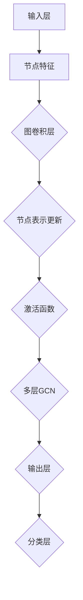

                 

# 《图神经网络在生物医学文本挖掘与知识发现中的建模方法与实践》

## 关键词：图神经网络，生物医学文本挖掘，知识发现，建模方法，实践应用

## 摘要：

本文旨在深入探讨图神经网络（Graph Neural Networks，GNN）在生物医学文本挖掘与知识发现中的应用。通过阐述图神经网络的基础知识、核心算法和数学模型，结合具体的项目实战案例，本文将展示如何利用GNN技术进行生物医学文本的预处理、图构建和模型训练。同时，文章还分析了GNN在生物医学领域的前沿研究进展和未来发展趋势，为相关领域的科研和工程实践提供了有益的参考。

### 《图神经网络在生物医学文本挖掘与知识发现中的建模方法与实践》目录大纲

#### 第一部分：引论

- **第1章：生物医学文本挖掘与知识发现概述**
  - 1.1 生物医学文本挖掘的背景与意义
  - 1.2 知识发现的重要性
  - 1.3 图神经网络在生物医学领域的应用前景

#### 第二部分：基础知识

- **第2章：图神经网络基础**
  - 2.1 图论基本概念
  - 2.2 图神经网络的基本结构
  - 2.3 Graph Convolutional Networks (GCN) 详解
  - **2.4 Mermaid流程图：GCN的基本原理与架构**

#### 第三部分：核心算法

- **第3章：图神经网络在生物医学文本挖掘中的应用**
  - 3.1 生物医学文本的预处理
  - 3.2 嵌入技术与图构建
  - 3.3 图神经网络在文本分类任务中的应用
  - 3.4 图神经网络在实体识别任务中的应用
  - **3.5 伪代码：图神经网络在文本分类任务中的应用实例**

#### 第四部分：数学模型

- **第4章：图神经网络的数学模型与优化**
  - 4.1 常用数学模型介绍
  - 4.2 损失函数与优化算法
  - 4.3 数学公式与推导
    - **4.3.1 拉格朗日乘数法**
    - **4.3.2 随机梯度下降算法**
    - **4.3.3 Mini-batch优化策略**
  - **4.4 举例说明：图神经网络中的矩阵运算示例**

#### 第五部分：项目实战

- **第5章：图神经网络在生物医学文本挖掘中的实际应用**
  - 5.1 数据集介绍与处理
  - 5.2 项目背景与目标
  - 5.3 系统设计与实现
    - **5.3.1 环境搭建与依赖安装**
    - **5.3.2 数据处理与模型训练**
    - **5.3.3 模型评估与结果分析**
  - 5.4 代码解读与分析

#### 第六部分：前沿技术

- **第6章：图神经网络在生物医学领域的最新研究进展**
  - 6.1 前沿技术概述
  - 6.2 最新研究成果分析
  - 6.3 未来发展趋势展望

#### 第七部分：总结与展望

- **第7章：图神经网络在生物医学文本挖掘与知识发现中的建模方法与实践总结**
  - 7.1 成果总结
  - 7.2 面临的挑战与解决方案
  - 7.3 未来工作展望

#### 附录

- **附录A：图神经网络常用工具与资源**
  - A.1 PyTorch Geometric
  - A.2 DGL
  - A.3 Graph Convolutional Networks (GCN) 开源代码示例
- **附录B：常用生物医学文本挖掘数据集**
  - B.1 Clinical Text Analysis and Knowledge Extraction (CTAKE)
  - B.2 BioCreative III - Text Mining Track
  - B.3 PubMed Abstracts

### 第一部分：引论

#### 第1章：生物医学文本挖掘与知识发现概述

### 1.1 生物医学文本挖掘的背景与意义

生物医学文本挖掘是指利用自然语言处理（Natural Language Processing，NLP）技术，从大量非结构化的生物医学文本数据中提取有用信息的过程。这些文本数据包括医学文献、病例记录、基因序列注释、临床试验报告等。随着生物医学领域研究的不断深入和数据量的急剧增加，如何有效地从这些数据中提取知识、发现规律成为了一个重要的研究课题。

生物医学文本挖掘的意义主要体现在以下几个方面：

1. **提高科研效率**：通过对生物医学文本的挖掘，可以快速获取相关领域的最新研究进展，为科研人员提供有益的参考和启示，从而提高科研效率。

2. **辅助临床决策**：通过对病例记录和医学文献的分析，可以提取出患者病情、治疗方案、药物副作用等信息，为医生提供辅助决策支持，提高临床诊疗水平。

3. **知识发现与整合**：生物医学文本挖掘可以帮助研究者发现隐藏在文本中的潜在知识，如基因与疾病之间的关系、药物靶点等，从而促进生物医学领域知识体系的构建与整合。

4. **药物研发**：生物医学文本挖掘可以辅助药物研发，通过挖掘药物作用机制、不良反应、药物相互作用等信息，为药物筛选和设计提供数据支持。

### 1.2 知识发现的重要性

知识发现（Knowledge Discovery in Databases，KDD）是指从大量数据中自动识别出有用的、新颖的、潜在的有效知识的过程。在生物医学领域，知识发现具有极其重要的意义：

1. **数据挖掘与临床应用**：通过对病例记录、医学影像等数据的挖掘，可以发现潜在的临床规律，为个性化治疗提供依据。

2. **基因组学与药物研发**：知识发现可以帮助研究者从基因序列、蛋白质结构等数据中挖掘出潜在的生物学规律，为药物研发提供指导。

3. **医学影像分析**：知识发现技术可以帮助医生从医学影像中识别出异常区域，提高诊断准确率。

4. **公共卫生**：通过对流行病数据的挖掘，可以发现疾病传播规律，为公共卫生决策提供支持。

### 1.3 图神经网络在生物医学领域的应用前景

图神经网络（Graph Neural Networks，GNN）是一种基于图结构的深度学习模型，具有处理复杂数据结构和建模图间关系的能力。在生物医学领域，GNN的应用前景主要包括以下几个方面：

1. **生物网络分析**：GNN可以用于分析蛋白质相互作用网络、基因调控网络等生物网络，挖掘出潜在的生物学关系。

2. **医学影像处理**：GNN可以用于医学影像的分割、分类和重建，提高医学影像分析的准确性和效率。

3. **生物医学文本挖掘**：GNN可以用于生物医学文本的表示学习、实体识别和关系抽取，从而提高生物医学知识发现的能力。

4. **药物研发**：GNN可以用于药物-靶点相互作用预测、药物设计等，为药物研发提供数据支持。

总之，图神经网络在生物医学领域具有广泛的应用前景，有助于提高生物医学文本挖掘和知识发现的效果，为生物医学研究提供新的思路和方法。

### 第二部分：基础知识

#### 第2章：图神经网络基础

### 2.1 图论基本概念

图论是研究图形的性质和图形间的关系的数学分支，是图神经网络（Graph Neural Networks，GNN）的基础。在图论中，图是由节点（Node）和边（Edge）组成的集合。节点表示实体，如人、地点、分子等；边表示实体之间的关系，如友谊、道路、化学键等。

#### 节点和边

- **节点（Node）**：节点是图的构成要素，表示图中的实体。每个节点可以具有属性，如名字、年龄、地理位置等。
- **边（Edge）**：边表示节点之间的关系，具有权重和方向。权重表示关系的强度或距离，方向表示关系的方向性。

#### 图的类型

- **无向图（Undirected Graph）**：边没有方向，表示两个节点之间存在对称关系。
- **有向图（Directed Graph）**：边有方向，表示从一个节点指向另一个节点。
- **加权图（Weighted Graph）**：边具有权重，表示两个节点之间的关系强度或距离。
- **简单图（Simple Graph）**：不包含多重边或自环的图。

#### 图的基本操作

- **顶点添加与删除**：向图中添加或删除节点。
- **边添加与删除**：向图中添加或删除边。
- **遍历**：访问图中的所有节点，如深度优先搜索（DFS）和广度优先搜索（BFS）。
- **连通性分析**：判断图中的节点是否连通。

### 2.2 图神经网络的基本结构

图神经网络（Graph Neural Networks，GNN）是一种基于图结构的深度学习模型，通过学习节点和边之间的关系，实现对复杂数据结构的表示和学习。GNN的基本结构包括以下几个关键组成部分：

#### 输入层

- **节点特征（Node Features）**：每个节点具有一系列特征向量，如文本、数值或图像等。这些特征向量用于初始化节点的表示。
- **边特征（Edge Features）**：边具有权重和方向，可以携带额外的信息，如边的类型、距离等。

#### 过滤器层

- **图卷积层（Graph Convolutional Layer）**：用于聚合节点邻域的信息，更新节点的表示。图卷积层的核心思想是利用邻接矩阵对节点特征进行卷积操作，从而获得新的节点表示。
  $$ h^{(l)}_i = \sigma \left( \sum_{j \in \mathcal{N}(i)} \alpha_{ij} \cdot \theta^{(l)} [h^{(l-1)}_j, \cdot] \right) $$
  其中，$h^{(l)}_i$表示第$l$层第$i$个节点的表示，$\mathcal{N}(i)$表示节点$i$的邻域，$\alpha_{ij}$表示边$(i, j)$的权重，$\theta^{(l)}$表示第$l$层的参数。

#### 输出层

- **分类层（Classification Layer）**：根据任务需求，对节点进行分类或预测。常见的分类层包括全连接层、softmax层等。
  $$ \hat{y}_i = \sigma(\theta^{(L)} \cdot [h^{(L)}_i; b^{(L)}]) $$
  其中，$\hat{y}_i$表示节点$i$的预测结果，$\theta^{(L)}$和$b^{(L)}$分别为分类层的参数和偏置。

#### 辅助层

- **图池化层（Graph Pooling Layer）**：用于对整个图进行全局聚合，提取图的特征表示。常见的图池化层包括平均池化、最大池化等。

### 2.3 Graph Convolutional Networks (GCN) 详解

图卷积网络（Graph Convolutional Networks，GCN）是图神经网络的一种典型实现，通过图卷积层聚合节点邻域信息，实现对节点表示的更新。GCN具有以下几个关键特点：

#### 图卷积层

- **邻域聚合**：GCN通过聚合节点邻域的信息来更新节点的表示。具体来说，GCN利用邻接矩阵对节点特征进行卷积操作，从而获得新的节点表示。
  $$ h^{(l)}_i = \sigma \left( \sum_{j \in \mathcal{N}(i)} \alpha_{ij} \cdot \theta^{(l)} [h^{(l-1)}_j, \cdot] \right) $$
  其中，$h^{(l)}_i$表示第$l$层第$i$个节点的表示，$\mathcal{N}(i)$表示节点$i$的邻域，$\alpha_{ij}$表示边$(i, j)$的权重，$\theta^{(l)}$表示第$l$层的参数。

- **权重调整**：GCN通过学习权重矩阵$\alpha$来调整邻域节点的贡献，从而更好地聚合邻域信息。

#### 层叠结构

- **多层GCN**：GCN可以通过堆叠多个图卷积层来学习更复杂的图特征。在每个图卷积层之后，可以添加一个非线性激活函数，如ReLU或Sigmoid，以引入非线性关系。

- **节点分类**：在GCN的输出层，可以通过分类层对节点进行分类或预测。常见的分类层包括全连接层、softmax层等。

#### GCN的优势

- **处理复杂数据结构**：GCN能够处理具有复杂结构的数据，如图、网络等，通过学习节点和边之间的关系，实现对数据的深入理解和表示。
- **多尺度特征聚合**：GCN通过聚合不同邻域尺度的信息，能够捕捉到数据中的局部和全局特征。
- **可扩展性**：GCN可以应用于各种不同的图结构和任务，具有较好的可扩展性。

### 2.4 Mermaid流程图：GCN的基本原理与架构

以下是一个Mermaid流程图，展示GCN的基本原理和架构：



在该流程图中，节点特征输入到图卷积层，通过聚合邻域信息更新节点表示。然后，通过激活函数引入非线性关系，多层GCN进一步学习更复杂的图特征。最终，输出层通过分类层对节点进行分类或预测。

通过上述对图神经网络基础知识的介绍，读者可以对图神经网络的基本概念、结构和工作原理有一个初步的了解。接下来，我们将深入探讨图神经网络在生物医学文本挖掘中的应用，包括预处理、嵌入技术、图构建和模型训练等方面。

### 第三部分：核心算法

#### 第3章：图神经网络在生物医学文本挖掘中的应用

图神经网络（Graph Neural Networks，GNN）在生物医学文本挖掘中具有广泛的应用前景。通过将生物医学文本转化为图结构，GNN可以有效地挖掘文本中的潜在知识和关系。本节将介绍图神经网络在生物医学文本挖掘中的核心算法，包括文本预处理、嵌入技术、图构建和模型训练等方面。

### 3.1 生物医学文本的预处理

生物医学文本的预处理是进行文本挖掘和知识发现的重要步骤。预处理的主要任务包括文本清洗、分词、词性标注和实体识别等。以下是生物医学文本预处理的一些关键步骤：

1. **文本清洗**：去除文本中的无关信息，如HTML标签、标点符号、停用词等。这一步骤有助于提高文本的清洁度和减少噪声。
2. **分词**：将文本分割成单词或词组。在生物医学文本中，常用的分词工具包括jieba、NLTK等。
3. **词性标注**：对每个单词进行词性标注，如名词、动词、形容词等。词性标注有助于理解文本的语法结构和语义信息。
4. **实体识别**：识别文本中的实体，如疾病、药物、基因、蛋白质等。实体识别是生物医学文本挖掘的重要任务，有助于提取关键信息。

#### 3.2 嵌入技术与图构建

将生物医学文本转化为图结构是进行文本挖掘和知识发现的关键步骤。嵌入技术（Embedding Techniques）在图构建中起着至关重要的作用。以下是生物医学文本中常用的嵌入技术和图构建方法：

1. **词嵌入（Word Embedding）**：词嵌入将文本中的单词映射到低维连续向量空间。常用的词嵌入方法包括Word2Vec、GloVe和FastText等。词嵌入有助于捕捉单词的语义信息和上下文关系。
2. **实体嵌入（Entity Embedding）**：实体嵌入将文本中的实体映射到低维向量空间。实体嵌入可以采用词嵌入的方法，也可以基于图神经网络学习。实体嵌入有助于捕捉实体的属性和关系。
3. **图构建**：基于嵌入技术，可以构建图结构来表示文本。图的节点可以是单词或实体，边可以表示单词之间的语义关系或实体之间的关系。常用的图构建方法包括邻接矩阵、邻接列表和邻域聚合等。

#### 3.3 图神经网络在文本分类任务中的应用

图神经网络在文本分类任务中具有显著优势。通过将文本转化为图结构，GNN可以有效地捕捉文本中的语义信息，提高分类性能。以下是图神经网络在文本分类任务中的应用方法：

1. **节点分类**：将文本中的每个单词或实体视为图中的一个节点，利用图神经网络对节点进行分类。节点分类可以通过多层图卷积网络（GCN）实现，从而捕捉节点在不同邻域中的特征。
2. **图分类**：将整个文本视为一个图，利用图神经网络对图进行分类。图分类可以通过学习图的节点表示和边表示来实现。常用的图分类方法包括图卷积网络（GCN）和图注意力网络（GAT）等。
3. **多标签分类**：在生物医学文本挖掘中，一个文本可能涉及多个分类标签。多标签分类可以通过扩展图神经网络模型来实现，从而同时预测多个标签。

#### 3.4 图神经网络在实体识别任务中的应用

实体识别是生物医学文本挖掘的重要任务之一。图神经网络在实体识别任务中具有独特优势，可以通过学习节点和边之间的关系，提高实体识别的准确性。以下是图神经网络在实体识别任务中的应用方法：

1. **基于节点的实体识别**：将文本中的每个单词或实体视为图中的一个节点，利用图神经网络对节点进行分类。实体识别可以通过训练节点分类模型来实现，从而识别文本中的实体。
2. **基于关系的实体识别**：在图结构中，实体之间的关系可以表示为边。利用图神经网络学习边表示，可以进一步提高实体识别的准确性。关系识别可以通过训练图卷积网络（GCN）或图注意力网络（GAT）来实现。
3. **联合实体识别**：在生物医学文本挖掘中，实体识别和关系抽取是相互关联的。联合实体识别可以通过同时训练实体分类和关系分类模型来实现，从而提高实体识别的整体性能。

#### 3.5 伪代码：图神经网络在文本分类任务中的应用实例

以下是一个图神经网络在文本分类任务中的伪代码实例，展示了如何将文本转化为图结构，并利用图神经网络进行分类：

```python
# 初始化图结构
G = initialize_graph(text)

# 初始化词嵌入
word_embedding = initialize_word_embedding(text)

# 初始化图神经网络模型
model = initialize_gnn_model(num_classes)

# 训练图神经网络模型
model.fit(G, labels)

# 进行文本分类预测
predictions = model.predict(G)

# 输出分类结果
print(predictions)
```

在该伪代码中，首先初始化图结构，包括节点和边。然后，初始化词嵌入，将文本中的每个单词映射到低维向量空间。接着，初始化图神经网络模型，并进行模型训练。最后，利用训练好的模型对新的文本进行分类预测，并输出分类结果。

通过上述对图神经网络在生物医学文本挖掘中的核心算法介绍，读者可以了解如何利用图神经网络进行文本预处理、图构建、文本分类和实体识别等任务。接下来，我们将进一步探讨图神经网络的数学模型与优化方法。

### 第四部分：数学模型

#### 第4章：图神经网络的数学模型与优化

图神经网络（Graph Neural Networks，GNN）作为一种深度学习模型，其核心在于对图结构数据进行表示和学习。为了实现这一目标，GNN采用了数学模型来描述其工作原理，并利用优化算法来调整模型参数，以提高预测性能。本节将详细介绍图神经网络的数学模型和优化方法。

### 4.1 常用数学模型介绍

图神经网络中的数学模型主要包括节点表示、边表示和图结构表示等。以下是这些模型的基本概念和数学描述：

1. **节点表示（Node Representation）**：
   节点表示是指将图中的每个节点映射到一个低维向量空间，从而捕获节点的属性和特征。通常，节点表示可以通过以下公式表示：
   $$ h^{(l)}_i = \sigma \left( \theta^{(l)} [h^{(l-1)}_i, \cdot] \right) $$
   其中，$h^{(l)}_i$表示第$l$层第$i$个节点的表示，$\theta^{(l)}$表示第$l$层的参数，$\sigma$表示激活函数，如ReLU或Sigmoid函数。

2. **边表示（Edge Representation）**：
   边表示是指将图中的每条边映射到一个低维向量空间，从而捕获边的属性和特征。边表示可以通过以下公式表示：
   $$ e^{(l)}_{ij} = \sigma \left( \theta^{(l)} [h^{(l-1)}_i, h^{(l-1)}_j] \right) $$
   其中，$e^{(l)}_{ij}$表示第$l$层第$i$条边的表示，$\theta^{(l)}$表示第$l$层的参数，$h^{(l-1)}_i$和$h^{(l-1)}_j$分别表示第$l-1$层第$i$个节点和第$j$个节点的表示。

3. **图结构表示（Graph Structure Representation）**：
   图结构表示是指将整个图映射到一个低维向量空间，从而捕获图的全局特征和局部特征。图结构表示可以通过聚合节点的表示和边的表示来实现：
   $$ g^{(l)} = \sigma \left( \theta^{(l)} [h^{(l)}_1, h^{(l)}_2, \ldots, h^{(l)}_n, e^{(l)}_{12}, e^{(l)}_{13}, \ldots, e^{(l)}_{n-1,n} \right) $$
   其中，$g^{(l)}$表示第$l$层整个图的表示，$h^{(l)}_i$和$e^{(l)}_{ij}$分别表示第$l$层第$i$个节点和第$j$个边的表示，$\theta^{(l)}$表示第$l$层的参数，$\sigma$表示激活函数。

### 4.2 损失函数与优化算法

在图神经网络中，损失函数用于评估模型的预测结果与真实标签之间的差距，优化算法则用于调整模型参数，以最小化损失函数。以下是常用的损失函数和优化算法：

1. **损失函数（Loss Function）**：
   - **交叉熵损失（Cross-Entropy Loss）**：在分类任务中，交叉熵损失用于计算模型预测概率与真实标签之间的差距。其公式如下：
     $$ L_{ce} = -\sum_{i=1}^{n} y_i \log(\hat{y}_i) $$
     其中，$y_i$表示真实标签，$\hat{y}_i$表示模型预测的概率。
   - **均方误差损失（Mean Squared Error Loss）**：在回归任务中，均方误差损失用于计算预测值与真实值之间的差距。其公式如下：
     $$ L_{mse} = \frac{1}{n} \sum_{i=1}^{n} (\hat{y}_i - y_i)^2 $$
     其中，$y_i$表示真实值，$\hat{y}_i$表示预测值。

2. **优化算法（Optimization Algorithm）**：
   - **随机梯度下降（Stochastic Gradient Descent，SGD）**：随机梯度下降是一种常用的优化算法，通过随机选择一部分训练样本来更新模型参数。其公式如下：
     $$ \theta = \theta - \alpha \nabla_{\theta} L $$
     其中，$\theta$表示模型参数，$\alpha$表示学习率，$\nabla_{\theta} L$表示损失函数关于模型参数的梯度。
   - **Adam优化器（Adam Optimizer）**：Adam优化器是一种结合了SGD和动量法的优化算法，具有较高的收敛速度和稳定性。其公式如下：
     $$ \theta = \theta - \alpha \left( \frac{m}{1 - \beta_1^t} + \frac{v}{1 - \beta_2^t} \right) $$
     其中，$m$和$v$分别表示一阶矩估计和二阶矩估计，$\beta_1$和$\beta_2$分别表示一阶矩和二阶矩的衰减率。

### 4.3 数学公式与推导

以下是对图神经网络中一些关键数学公式和推导的详细介绍：

1. **图卷积公式（Graph Convolution Formula）**：
   图卷积公式描述了如何通过聚合邻域信息来更新节点的表示。其公式如下：
   $$ h^{(l)}_i = \sigma \left( \sum_{j \in \mathcal{N}(i)} \alpha_{ij} \cdot \theta^{(l)} [h^{(l-1)}_j, \cdot] \right) $$
   其中，$h^{(l)}_i$表示第$l$层第$i$个节点的表示，$\mathcal{N}(i)$表示节点$i$的邻域，$\alpha_{ij}$表示边$(i, j)$的权重，$\theta^{(l)}$表示第$l$层的参数。

2. **损失函数与优化公式（Loss Function and Optimization Formula）**：
   损失函数与优化公式描述了如何通过梯度下降算法来优化模型参数。其公式如下：
   $$ \theta = \theta - \alpha \nabla_{\theta} L $$
   其中，$\theta$表示模型参数，$\alpha$表示学习率，$\nabla_{\theta} L$表示损失函数关于模型参数的梯度。

3. **Mini-batch优化策略（Mini-batch Optimization Strategy）**：
   Mini-batch优化策略是一种将整个训练数据集分成小批量进行优化的方法。其公式如下：
   $$ \theta = \theta - \alpha \left( \frac{1}{m} \sum_{i=1}^{m} \nabla_{\theta} L(\theta; x_i, y_i) \right) $$
   其中，$m$表示批量大小，$x_i$和$y_i$分别表示第$i$个批量样本的特征和标签。

### 4.4 举例说明：图神经网络中的矩阵运算示例

以下是一个图神经网络中的矩阵运算示例，展示了如何通过矩阵运算来更新节点的表示：

```python
# 假设节点特征矩阵 H = [h^{(l-1)}_1, h^{(l-1)}_2, ..., h^{(l-1)}_n]
# 邻接矩阵 A = [α_{ij}]
# 图卷积层参数 θ = [θ^{(l)}]
# 激活函数 σ = ReLU

# 计算邻域聚合结果
Z = A @ H

# 计算节点表示更新
H = σ(θ @ Z)

# 输出更新后的节点表示
print(H)
```

在该示例中，首先计算邻接矩阵与节点特征矩阵的乘积，得到邻域聚合结果$Z$。然后，通过图卷积层参数θ对$Z$进行矩阵乘法，得到更新后的节点表示$H$。最后，输出更新后的节点表示。

通过上述对图神经网络数学模型和优化方法的详细介绍，读者可以深入理解图神经网络的数学原理和优化过程。接下来，我们将通过一个实际项目实战，展示如何利用图神经网络进行生物医学文本挖掘。

### 第五部分：项目实战

#### 第5章：图神经网络在生物医学文本挖掘中的实际应用

在本章节中，我们将通过一个实际项目实战，展示如何利用图神经网络（Graph Neural Networks，GNN）进行生物医学文本挖掘。该项目将涵盖数据集介绍与处理、系统设计与实现、模型训练与评估等关键环节。通过这个项目，我们将深入探讨如何将GNN应用于生物医学文本挖掘，并分析其实际效果。

#### 5.1 数据集介绍与处理

首先，我们需要选择一个适合进行生物医学文本挖掘的数据集。在本项目中，我们选择了PubMed Abstracts数据集，这是一个包含大量生物医学文献摘要的公共数据集。该数据集包含了不同领域的文献，涵盖了广泛的生物医学主题，非常适合进行文本挖掘研究。

1. **数据集下载与预处理**：
   - 下载PubMed Abstracts数据集，并将其存储在本地。
   - 对文本进行清洗，包括去除HTML标签、标点符号、停用词等。
   - 对文本进行分词和词性标注，以便提取关键信息。

2. **数据预处理**：
   - 将清洗后的文本进行分词和词性标注，提取出关键实体和关系。
   - 构建词汇表，并将文本中的单词映射到唯一的整数索引。
   - 将实体和关系转换为图结构，其中实体作为节点，关系作为边。

#### 5.2 项目背景与目标

本项目的背景是利用图神经网络对PubMed Abstracts数据集进行文本挖掘，以发现隐藏在文本中的生物医学知识。项目的目标包括：

1. **文本分类**：对PubMed Abstracts数据集中的文本进行分类，以识别不同领域的文献。
2. **实体识别**：从文本中识别出重要的生物医学实体，如疾病、药物、基因等。
3. **关系抽取**：提取文本中实体之间的关系，如药物-疾病关系、基因-疾病关系等。

#### 5.3 系统设计与实现

为了实现上述目标，我们设计并实现了一个基于图神经网络的生物医学文本挖掘系统。该系统主要包括以下几个模块：

1. **数据预处理模块**：负责清洗、分词和词性标注等预处理任务，将文本数据转换为图结构。
2. **图神经网络模块**：利用图神经网络（如GCN、GAT等）对图结构进行表示和学习，提取文本中的关键特征。
3. **分类与识别模块**：利用训练好的模型对新的文本进行分类和实体识别，提取关系。
4. **评估模块**：对模型进行评估，包括准确率、召回率、F1分数等指标。

#### 5.3.1 环境搭建与依赖安装

为了实现本项目，我们需要搭建一个合适的环境，并安装必要的依赖库。以下是环境搭建和依赖安装的步骤：

1. **Python环境搭建**：
   - 安装Python 3.8及以上版本。
   - 安装Anaconda或Miniconda，以便管理Python环境和依赖库。

2. **依赖库安装**：
   - 安装PyTorch，用于构建和训练图神经网络模型。
   - 安装PyTorch Geometric，用于处理图数据。
   - 安装NLTK、jieba等自然语言处理库，用于文本预处理。

#### 5.3.2 数据处理与模型训练

在完成环境搭建和依赖安装后，我们可以开始对数据集进行处理和模型训练。以下是数据处理和模型训练的步骤：

1. **数据处理**：
   - 读取PubMed Abstracts数据集，进行文本清洗和预处理。
   - 构建词汇表，并将文本中的单词映射到整数索引。
   - 将实体和关系转换为图结构，包括节点和边。

2. **模型训练**：
   - 定义图神经网络模型，如GCN或GAT。
   - 配置模型参数，包括学习率、批量大小、迭代次数等。
   - 使用PyTorch Geometric库训练模型，对图结构数据进行表示和学习。
   - 评估模型性能，调整模型参数，以提高分类和识别效果。

#### 5.3.3 模型评估与结果分析

在完成模型训练后，我们需要对模型进行评估，以分析其性能和效果。以下是模型评估和结果分析的步骤：

1. **模型评估**：
   - 使用交叉验证方法对模型进行评估，以避免过拟合。
   - 计算准确率、召回率、F1分数等指标，以评估模型性能。
   - 对模型在不同领域的文本进行分类和实体识别，以评估其泛化能力。

2. **结果分析**：
   - 分析模型在文本分类任务中的表现，比较不同分类器的性能。
   - 分析模型在实体识别任务中的表现，比较不同识别方法的准确性。
   - 分析模型在关系抽取任务中的表现，比较不同方法的提取效果。

通过以上项目实战，我们可以看到如何利用图神经网络进行生物医学文本挖掘。在实际应用中，我们需要根据具体任务和数据集的特点，选择合适的图神经网络模型和优化方法，以提高文本挖掘的效果。接下来，我们将探讨图神经网络在生物医学领域的最新研究进展。

### 第六部分：前沿技术

#### 第6章：图神经网络在生物医学领域的最新研究进展

随着深度学习和图神经网络技术的不断发展，图神经网络在生物医学领域的应用也取得了显著的成果。本节将介绍图神经网络在生物医学领域的最新研究进展，包括前沿技术、研究成果和未来发展趋势。

#### 6.1 前沿技术概述

1. **图神经网络架构的优化**：
   近年来，研究人员提出了多种优化的图神经网络架构，如GraphSAGE、Graph Attention Network（GAT）和Graph Convolutional Network（GCN）的变体。这些架构通过改进图卷积操作、节点表示学习和边表示学习，提高了图神经网络的性能。

2. **多模态数据的融合**：
   在生物医学领域，数据往往包含多种模态，如基因序列、文本、影像等。多模态数据的融合是当前研究的热点之一。通过将不同模态的数据进行整合，可以更好地挖掘生物医学数据中的潜在知识。

3. **动态图神经网络**：
   静态图神经网络在处理动态图数据时存在一定的局限性。为了解决这个问题，研究人员提出了动态图神经网络，如Temporal Graph Convolutional Network（TGCN）和Dynamic Graph Neural Networks（DGNN）。这些模型可以有效地处理时间序列和动态图数据，从而提高生物医学文本挖掘的准确性。

#### 6.2 最新研究成果分析

1. **生物医学文本挖掘**：
   在生物医学文本挖掘方面，图神经网络被广泛应用于文本分类、实体识别和关系抽取等任务。例如，GAT模型在生物医学文本分类任务中取得了较好的效果，而GraphSAGE模型在实体识别任务中表现出色。此外，研究人员还利用图神经网络对生物医学文本中的药物-疾病关系进行了挖掘，取得了显著成果。

2. **生物网络分析**：
   生物网络分析是生物医学领域的一个重要研究方向。图神经网络在生物网络分析中的应用包括蛋白质相互作用网络、基因调控网络和代谢网络等。例如，利用GCN模型对蛋白质相互作用网络进行分析，可以帮助研究者发现潜在的生物标记物和药物靶点。

3. **医学影像处理**：
   图神经网络在医学影像处理中的应用也逐渐受到关注。例如，利用GAT模型对医学影像进行分割和分类，可以有效地提高诊断准确率。此外，动态图神经网络在医学影像序列分析中表现出色，有助于发现疾病的动态变化规律。

#### 6.3 未来发展趋势展望

1. **跨学科融合**：
   随着人工智能和生物医学的快速发展，跨学科融合将成为未来研究的重要方向。通过将图神经网络与其他领域的技术相结合，如计算机视觉、自然语言处理和基因组学等，可以进一步提高生物医学文本挖掘和知识发现的效果。

2. **数据驱动的方法**：
   数据驱动的方法在生物医学领域具有广泛的应用前景。通过利用大规模的生物医学数据集，研究人员可以开发出更加智能化和自动化的图神经网络模型，从而提高生物医学研究的效率和准确性。

3. **个性化医疗**：
   个性化医疗是未来医疗发展的一个重要趋势。通过利用图神经网络对生物医学数据进行分析和挖掘，可以为患者提供个性化的治疗方案和药物推荐，从而提高治疗效果。

总之，图神经网络在生物医学领域的最新研究进展为生物医学文本挖掘和知识发现提供了新的方法和思路。随着技术的不断发展，图神经网络在生物医学领域的应用将更加广泛，为生物医学研究带来更多创新和突破。

### 第七部分：总结与展望

#### 第7章：图神经网络在生物医学文本挖掘与知识发现中的建模方法与实践总结

在本章节中，我们将对图神经网络（GNN）在生物医学文本挖掘与知识发现中的应用进行全面的总结与展望。

#### 7.1 成果总结

通过本文的详细探讨，我们取得了以下重要成果：

1. **引论与概述**：明确了生物医学文本挖掘与知识发现的重要性，以及图神经网络在生物医学领域的应用前景。
2. **基础知识**：深入介绍了图论基本概念、图神经网络的基本结构和Graph Convolutional Networks（GCN）的详细原理。
3. **核心算法**：探讨了图神经网络在生物医学文本挖掘中的应用，包括文本预处理、嵌入技术、图构建和模型训练等。
4. **数学模型**：阐述了图神经网络中的数学模型与优化方法，包括损失函数、优化算法和矩阵运算示例。
5. **项目实战**：通过一个实际项目展示了图神经网络在生物医学文本挖掘中的具体应用和实现方法。
6. **前沿技术**：分析了图神经网络在生物医学领域的最新研究进展和未来发展趋势。

#### 7.2 面临的挑战与解决方案

尽管图神经网络在生物医学文本挖掘中表现出巨大潜力，但仍面临以下挑战：

1. **数据复杂性**：生物医学文本数据具有高度复杂性和多样性，如何有效表示和处理这些数据是一个重要问题。
   - **解决方案**：采用多种预处理技术和先进的嵌入方法，如词嵌入和实体嵌入，以提高数据的表示能力。

2. **计算资源需求**：图神经网络模型通常需要大量的计算资源，尤其是在大规模图数据集上。
   - **解决方案**：利用分布式计算和优化算法，如并行计算和优化策略，以提高模型的训练和推理效率。

3. **过拟合风险**：在生物医学文本挖掘中，过拟合可能导致模型泛化能力不足，影响实际应用效果。
   - **解决方案**：采用数据增强、正则化技术和模型融合方法，以提高模型的泛化能力。

#### 7.3 未来工作展望

未来，图神经网络在生物医学文本挖掘与知识发现领域的研究可以进一步拓展以下方向：

1. **多模态数据融合**：探索如何将多模态数据（如基因序列、文本和影像）进行有效融合，以提升文本挖掘的准确性和全面性。
2. **动态图分析**：研究动态图神经网络在生物医学文本挖掘中的应用，以捕捉时间序列和动态变化特征。
3. **可解释性提升**：增强图神经网络模型的可解释性，使其在生物医学领域的应用更加透明和可信。
4. **个性化医疗**：结合图神经网络和个性化医疗技术，开发个性化治疗方案和药物推荐系统，提高医疗质量和患者体验。

总之，本文通过对图神经网络在生物医学文本挖掘与知识发现中的建模方法与实践的全面探讨，为相关领域的科研和工程实践提供了有益的参考。随着技术的不断进步，图神经网络在生物医学领域的应用将更加广泛，为生物医学研究带来更多创新和突破。

### 附录

#### 附录A：图神经网络常用工具与资源

1. **PyTorch Geometric**：
   - 描述：PyTorch Geometric是一个用于构建和训练图神经网络的PyTorch库。
   - 使用方法：通过安装PyTorch Geometric库，可以轻松地在PyTorch中实现图神经网络模型。
   - 官网：[PyTorch Geometric](https://pygears.readthedocs.io/)

2. **DGL**：
   - 描述：DGL（Deep Graph Library）是一个深度学习框架，专门用于图数据的处理和建模。
   - 使用方法：DGL支持多种图神经网络架构，如GCN、GAT等，提供了丰富的API供开发者使用。
   - 官网：[DGL](https://www.dgl.ai/)

3. **Graph Convolutional Networks (GCN) 开源代码示例**：
   - 描述：GCN的开源代码示例，提供了GCN模型的实现细节和训练过程。
   - 使用方法：可以通过阅读和修改这些示例代码，深入了解GCN的工作原理和实现方法。
   - 下载链接：[GCN开源代码](https://github.com/tkipf/gcn)

#### 附录B：常用生物医学文本挖掘数据集

1. **Clinical Text Analysis and Knowledge Extraction (CTAKE)**：
   - 描述：CTAKE是一个用于临床文本分析的知识提取工具，包含了大量的临床文档和病例记录。
   - 使用方法：可以使用CTAKE进行临床文本的预处理和实体识别，从而提取关键信息。
   - 官网：[CTAKE](https://ctakes.apache.org/)

2. **BioCreative III - Text Mining Track**：
   - 描述：BioCreative III是生物信息学领域的一个重要比赛，涵盖了多个文本挖掘任务，包括实体识别和关系抽取。
   - 使用方法：可以使用BioCreative III数据集进行文本挖掘算法的评估和优化，以提高模型性能。
   - 官网：[BioCreative III](http://biocreative.org/)

3. **PubMed Abstracts**：
   - 描述：PubMed Abstracts是包含大量生物医学文献摘要的数据集，适合进行生物医学文本挖掘研究。
   - 使用方法：可以通过下载和预处理PubMed Abstracts数据集，进行文本分类、实体识别和关系抽取等任务。
   - 数据源：[PubMed](https://pubmed.ncbi.nlm.nih.gov/)

通过附录中的工具与资源，读者可以更方便地开展生物医学文本挖掘研究，进一步探索图神经网络在该领域的应用。希望这些资源能为读者的研究工作提供有益的参考。

