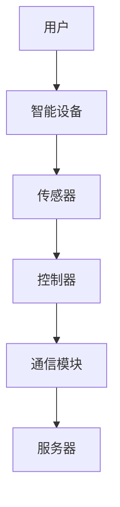
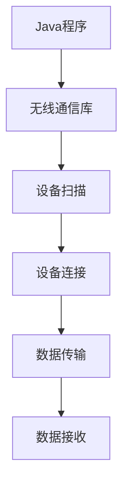

                 

### 第一部分：引言与背景

#### 第1章：智能家居概述

智能家居，作为一个现代科技与传统家居生活相结合的概念，正逐步走进我们的生活。在这一章中，我们将详细探讨智能家居的定义、意义及其发展历程。

##### 1.1 智能家居的定义与意义

智能家居，顾名思义，就是利用智能技术，使家庭生活更加便捷、舒适和高效的一种生活方式。它通过物联网、人工智能、云计算等技术，将家庭中的各种设备和系统连接起来，实现智能化管理和控制。

智能家居的意义不仅仅在于提高生活质量，更重要的是它代表了未来生活方式的变革。通过智能家居，我们可以实现远程监控家庭安全、自动化控制家用电器、智能调节家居环境等，极大地提高了生活的便利性和舒适度。

##### 1.2 智能家居的发展历程

智能家居的概念最早可以追溯到20世纪90年代，当时的技术还比较初级，智能家居的应用也仅限于一些高端的住宅。随着技术的不断进步，特别是物联网技术的兴起，智能家居开始逐渐普及。

在2000年后，智能家居逐渐从概念走向实际应用，各种智能设备和系统开始出现，如智能门锁、智能照明、智能空调等。这些设备的普及，使得智能家居开始走进普通家庭。

近年来，随着人工智能、大数据等技术的发展，智能家居进入了快速发展阶段。智能家居系统变得越来越智能，越来越能满足人们个性化的需求。

##### 1.3 智能家居市场现状与趋势

目前，智能家居市场已经呈现出快速增长的趋势。据相关数据显示，全球智能家居市场规模已经突破千亿大关，未来还有巨大的增长空间。

在我国，智能家居市场也呈现出蓬勃发展的态势。随着人们对生活品质的要求越来越高，智能家居逐渐成为家居装修的首选。

未来，智能家居的发展将更加注重个性化和智能化。通过大数据和人工智能技术，智能家居将能够更好地理解用户需求，提供更加个性化的服务。

#### 第2章：Java在智能家居中的应用

Java作为一种高级编程语言，因其跨平台、安全性和稳定性等特点，在智能家居领域得到了广泛应用。在这一章中，我们将探讨Java在智能家居中的应用。

##### 2.1 Java在嵌入式系统中的优势

嵌入式系统是智能家居的核心组成部分，Java在嵌入式系统中的应用具有明显的优势。首先，Java具有跨平台性，可以在不同的操作系统和硬件平台上运行，这使得智能家居设备能够兼容多种硬件环境。其次，Java的安全性和稳定性使得嵌入式系统能够长时间稳定运行，不易受到病毒和黑客的攻击。

##### 2.2 Java在智能家居控制中的应用

Java在智能家居控制中的应用主要体现在以下几个方面：

1. **设备控制**：Java可以通过各种通信协议，如Wi-Fi、蓝牙等，实现对智能家居设备的远程控制。
2. **数据分析**：Java可以处理和分析来自智能家居设备的数据，如环境数据、设备状态等，为用户提供智能化的建议和服务。
3. **系统管理**：Java可以管理智能家居系统中的各种设备和功能，确保系统的稳定运行。

##### 2.3 Java与智能家居通信技术的结合

Java与智能家居通信技术的结合，使得智能家居系统能够更好地实现设备之间的互联互通。在这一部分，我们将介绍Java在无线通信技术中的应用，如蓝牙、Wi-Fi等。

1. **蓝牙通信**：蓝牙通信是一种短距离无线通信技术，Java可以通过蓝牙模块实现设备之间的数据传输。
2. **Wi-Fi通信**：Wi-Fi通信是一种宽带无线通信技术，Java可以通过Wi-Fi模块实现设备之间的高速数据传输。

通过Java与无线通信技术的结合，智能家居系统可以实现高效、稳定的数据传输，为用户提供更好的使用体验。

### 总结

在这一部分，我们介绍了智能家居的定义、发展历程和市场现状，以及Java在智能家居中的应用。接下来，我们将深入探讨无线智能家居通信技术，以及Java在这些技术中的应用。

## 关键词

智能家居、Java、嵌入式系统、通信技术、物联网、远程控制、设备互联。

## 摘要

本文从智能家居的定义、发展历程和市场现状入手，详细探讨了Java在智能家居中的应用。首先，我们分析了Java在嵌入式系统中的优势，然后介绍了Java在智能家居控制中的应用，以及Java与无线通信技术的结合。通过本文的阅读，读者可以全面了解Java在智能家居领域的应用现状和发展趋势。

### 第二部分：无线智能家居通信技术

随着智能家居技术的不断发展，无线通信技术在智能家居中的应用越来越广泛。在这一部分，我们将深入探讨无线智能家居通信技术的基础知识，以及Java与无线通信协议的实现。

#### 第3章：无线通信技术基础

##### 3.1 无线通信技术的发展

无线通信技术的发展经历了多个阶段。最早期的无线通信技术主要是基于模拟信号的传输，如无线电波、微波等。随着数字技术的兴起，无线通信技术逐渐向数字信号传输方向发展。近年来，随着物联网、大数据等技术的发展，无线通信技术进入了高速发展的阶段。

目前，常见的无线通信技术包括：

- **Wi-Fi**：一种基于IEEE 802.11标准的无线局域网技术，可以提供高速的数据传输。
- **蓝牙**：一种短距离无线通信技术，常用于设备之间的数据传输，如手机、耳机等。
- **ZigBee**：一种低功耗、低速率的无线通信技术，适用于智能家居等场景。
- **LoRa**：一种长距离、低功耗的无线通信技术，适用于广域网应用。

##### 3.2 常见的无线通信协议

在智能家居领域，常见的无线通信协议包括Wi-Fi、蓝牙、ZigBee和LoRa等。这些协议各有特点，适用于不同的应用场景。

- **Wi-Fi**：Wi-Fi协议具有高速、稳定的优点，适用于需要大带宽的数据传输场景，如智能家居系统的视频监控。
- **蓝牙**：蓝牙协议具有短距离、低功耗的优点，适用于设备之间的近距离通信，如智能家居设备的控制。
- **ZigBee**：ZigBee协议具有低功耗、低速率的优点，适用于智能家居系统的传感和控制。
- **LoRa**：LoRa协议具有长距离、低功耗的优点，适用于智能家居系统的远程监控。

##### 3.3 无线通信技术在智能家居中的应用

无线通信技术在智能家居中的应用，使得智能家居系统能够实现设备之间的互联互通。具体应用包括：

- **设备控制**：通过无线通信技术，用户可以远程控制智能家居设备，如照明、空调等。
- **数据传输**：通过无线通信技术，智能家居设备可以实时传输数据，如环境温度、湿度等，为用户提供智能化的服务。
- **系统监控**：通过无线通信技术，用户可以远程监控智能家居系统，确保系统的稳定运行。

#### 第4章：Java与无线通信协议的实现

Java作为一种高级编程语言，具有强大的跨平台性和可扩展性，非常适合用于无线通信协议的实现。在这一部分，我们将介绍Java与无线通信协议的实现，包括蓝牙通信和Wi-Fi通信。

##### 4.1 Java中的无线通信库

Java提供了多个用于无线通信的库，如Java Bluetooth API、Java Wi-Fi API等。这些库提供了丰富的API，使得开发者可以方便地实现无线通信功能。

- **Java Bluetooth API**：Java Bluetooth API是Java平台提供的蓝牙通信库，可以用于实现蓝牙设备的连接、数据传输等功能。
- **Java Wi-Fi API**：Java Wi-Fi API是Java平台提供的Wi-Fi通信库，可以用于实现Wi-Fi设备的连接、数据传输等功能。

##### 4.2 使用Java实现蓝牙通信

蓝牙通信是一种短距离无线通信技术，适用于设备之间的数据传输。使用Java实现蓝牙通信，需要以下步骤：

1. **设备扫描**：使用Java Bluetooth API扫描附近的蓝牙设备。
2. **设备连接**：选择一个蓝牙设备，并与该设备建立连接。
3. **数据传输**：通过连接的蓝牙设备发送和接收数据。

以下是一个使用Java实现蓝牙通信的基本示例：

```java
// 扫描蓝牙设备
BluetoothAdapter bluetoothAdapter = BluetoothAdapter.getDefaultAdapter();
Set<BluetoothDevice> devices = bluetoothAdapter.getBondedDevices();

// 遍历蓝牙设备
for (BluetoothDevice device : devices) {
    // 建立连接
    BluetoothSocket socket = device.createRfcommSocketToServiceRecord(UUID.fromString("00001101-0000-1000-8000-00805F9B34FB"));
    socket.connect();

    // 数据传输
    DataInputStream inputStream = new DataInputStream(socket.getInputStream());
    DataOutputStream outputStream = new DataOutputStream(socket.getOutputStream());

    // 读取数据
    String receivedData = inputStream.readUTF();
    System.out.println("Received: " + receivedData);

    // 发送数据
    outputStream.writeUTF("Hello, Bluetooth!");
    outputStream.flush();

    // 关闭连接
    socket.close();
}
```

##### 4.3 使用Java实现Wi-Fi通信

Wi-Fi通信是一种宽带无线通信技术，适用于设备之间的高速数据传输。使用Java实现Wi-Fi通信，需要以下步骤：

1. **连接Wi-Fi**：使用Java Wi-Fi API连接到指定的Wi-Fi网络。
2. **数据传输**：通过连接的Wi-Fi网络发送和接收数据。

以下是一个使用Java实现Wi-Fi通信的基本示例：

```java
// 连接Wi-Fi
ConnectivityManager connectivityManager = (ConnectivityManager) getSystemService(Context.CONNECTIVITY_SERVICE);
NetworkInfo networkInfo = connectivityManager.getActiveNetworkInfo();

if (networkInfo != null && networkInfo.isConnected()) {
    // 获取IP地址
    InetAddress address = ((InetAddress) NetworkInterface.getByName("wlan0").getInetAddress());

    // 创建TCP连接
    Socket socket = new Socket(address, 80);

    // 发送HTTP请求
    DataOutputStream outputStream = new DataOutputStream(socket.getOutputStream());
    outputStream.writeBytes("GET / HTTP/1.1\n");
    outputStream.writeBytes("Host: www.example.com\n");
    outputStream.writeBytes("Connection: close\n");
    outputStream.writeBytes("\n");
    outputStream.flush();

    // 读取响应
    DataInputStream inputStream = new DataInputStream(socket.getInputStream());
    BufferedReader bufferedReader = new BufferedReader(new InputStreamReader(inputStream));
    String responseLine;
    while ((responseLine = bufferedReader.readLine()) != null) {
        System.out.println(responseLine);
    }

    // 关闭连接
    socket.close();
}
```

#### 第5章：智能家居设备与系统的设计

智能家居设备与系统的设计是智能家居实现的关键。在这一章中，我们将探讨智能家居设备的硬件设计、软件系统的设计，以及智能家居系统的集成与优化。

##### 5.1 智能家居设备的硬件设计

智能家居设备的硬件设计包括传感器、控制器和通信模块等。在设计过程中，需要考虑以下几个方面：

1. **传感器选择**：根据智能家居设备的功能需求，选择合适的传感器，如温度传感器、湿度传感器、光照传感器等。
2. **控制器设计**：控制器是智能家居设备的“大脑”，需要选择合适的控制器芯片，如ARM、MSP430等。
3. **通信模块选择**：根据智能家居设备的功能需求，选择合适的通信模块，如Wi-Fi模块、蓝牙模块、ZigBee模块等。

##### 5.2 智能家居软件系统的设计

智能家居软件系统的设计包括系统架构、数据存储和处理等。在设计过程中，需要考虑以下几个方面：

1. **系统架构**：智能家居软件系统可以采用分布式架构，实现设备之间的互联互通。
2. **数据存储**：使用数据库存储智能家居设备的数据，如设备状态、环境数据等。
3. **数据处理**：使用数据处理算法，对设备数据进行实时分析和处理，为用户提供智能化的服务。

##### 5.3 智能家居系统的集成与优化

智能家居系统的集成与优化是确保系统稳定运行的关键。在集成过程中，需要考虑以下几个方面：

1. **设备集成**：将各种智能家居设备集成到系统中，实现设备之间的互联互通。
2. **通信优化**：优化通信协议，提高数据传输的效率和稳定性。
3. **系统优化**：对系统进行性能优化，提高系统的响应速度和处理能力。

#### 总结

在这一部分，我们介绍了无线智能家居通信技术的基础知识，以及Java与无线通信协议的实现。通过这些技术，智能家居系统能够实现设备之间的互联互通，为用户提供更好的使用体验。接下来，我们将通过一个案例研究，深入探讨智能家居系统的开发过程。

### 第三部分：案例研究

在本部分，我们将通过一个实际的智能家居系统开发案例，深入探讨从需求分析到系统实现的各个阶段，以及如何通过Java实现智能家居的无线通信功能。

#### 第6章：智能家居系统开发实战

##### 6.1 实战项目简介

本案例将介绍一个智能家居系统的开发，该系统包括以下几个主要功能模块：

- **环境监测**：监测家庭内的温度、湿度、光照等环境参数。
- **设备控制**：远程控制家庭内的灯光、空调等电器设备。
- **安全监控**：通过摄像头监控家庭安全，并能在异常情况下发送警报。
- **数据统计**：收集并分析家庭能源消耗情况，为用户提供节能建议。

##### 6.2 系统需求分析与设计

在系统开发之前，我们需要对系统需求进行详细的分析和设计。

**1. 系统需求分析**

- **功能需求**：系统需要实现环境监测、设备控制、安全监控和数据统计等功能。
- **性能需求**：系统需要能够稳定运行，响应时间短，能够同时处理多个设备的通信请求。
- **安全性需求**：系统需要保证数据的安全性，防止未经授权的访问和攻击。

**2. 系统设计**

- **硬件设计**：选择具有低功耗、高性能的传感器模块和控制器模块，并设计合适的电路板。
- **软件设计**：设计系统的架构，包括前端用户界面、后端服务器和数据存储模块。

##### 6.3 系统开发与实现

在系统开发过程中，我们将使用Java来实现智能家居的无线通信功能。

**1. 环境监测模块**

- **硬件实现**：使用温度传感器、湿度传感器和光照传感器来监测环境参数。
- **软件实现**：使用Java编写环境监测模块的软件代码，通过无线通信协议（如Wi-Fi或ZigBee）将数据发送到服务器。

```java
// 环境监测模块示例代码
public class EnvironmentMonitor {
    private TemperatureSensor tempSensor;
    private HumiditySensor humiditySensor;
    private LightSensor lightSensor;

    public EnvironmentMonitor() {
        // 初始化传感器
        tempSensor = new TemperatureSensor();
        humiditySensor = new HumiditySensor();
        lightSensor = new LightSensor();
    }

    public void startMonitoring() {
        while (true) {
            // 读取传感器数据
            double temp = tempSensor.readTemperature();
            double humidity = humiditySensor.readHumidity();
            double light = lightSensor.readLight();

            // 发送数据到服务器
            sendDataToServer(temp, humidity, light);

            // 等待一段时间后再次读取数据
            try {
                Thread.sleep(1000);
            } catch (InterruptedException e) {
                e.printStackTrace();
            }
        }
    }

    private void sendDataToServer(double temp, double humidity, double light) {
        // 这里可以使用Java Wi-Fi库或其他无线通信库来发送数据
        // 示例代码，具体实现需要根据实际情况调整
        try {
            Socket socket = new Socket("server_address", 80);
            DataOutputStream outputStream = new DataOutputStream(socket.getOutputStream());

            outputStream.writeBytes("POST /environment HTTP/1.1\n");
            outputStream.writeBytes("Content-Type: application/json\n");
            outputStream.writeBytes("Content-Length: " + (temp + humidity + light).toString().getBytes().length + "\n");
            outputStream.writeBytes("\n");
            outputStream.writeBytes("{\"temp\": " + temp + ", \"humidity\": " + humidity + ", \"light\": " + light + "}");

            outputStream.flush();
            socket.close();
        } catch (IOException e) {
            e.printStackTrace();
        }
    }
}
```

**2. 设备控制模块**

- **硬件实现**：使用控制器模块（如ESP8266、ESP32等）来控制家庭内的电器设备。
- **软件实现**：使用Java编写设备控制模块的软件代码，通过无线通信协议（如Wi-Fi或蓝牙）来控制设备。

```java
// 设备控制模块示例代码
public class DeviceController {
    private BluetoothSocket socket;

    public DeviceController(BluetoothSocket socket) {
        this.socket = socket;
    }

    public void controlDevice(String command) {
        try {
            DataOutputStream outputStream = new DataOutputStream(socket.getOutputStream());
            outputStream.writeBytes(command);
            outputStream.flush();
        } catch (IOException e) {
            e.printStackTrace();
        }
    }
}
```

**3. 安全监控模块**

- **硬件实现**：使用摄像头和运动传感器来监控家庭安全。
- **软件实现**：使用Java编写安全监控模块的软件代码，通过无线通信协议（如Wi-Fi）来接收摄像头数据和运动传感器的数据，并在检测到异常时发送警报。

```java
// 安全监控模块示例代码
public class SecurityMonitor {
    private Camera camera;
    private MotionSensor motionSensor;

    public SecurityMonitor(Camera camera, MotionSensor motionSensor) {
        this.camera = camera;
        this.motionSensor = motionSensor;
    }

    public void startMonitoring() {
        while (true) {
            // 读取摄像头数据和运动传感器数据
            byte[] cameraData = camera.captureImage();
            boolean motionDetected = motionSensor.detectMotion();

            // 处理数据
            if (motionDetected) {
                sendAlert(cameraData);
            }

            // 等待一段时间后再次读取数据
            try {
                Thread.sleep(1000);
            } catch (InterruptedException e) {
                e.printStackTrace();
            }
        }
    }

    private void sendAlert(byte[] cameraData) {
        // 这里可以使用Java Wi-Fi库或其他无线通信库来发送警报和摄像头数据
        // 示例代码，具体实现需要根据实际情况调整
        try {
            Socket socket = new Socket("server_address", 80);
            DataOutputStream outputStream = new DataOutputStream(socket.getOutputStream());

            outputStream.writeBytes("POST /alert HTTP/1.1\n");
            outputStream.writeBytes("Content-Type: application/json\n");
            outputStream.writeBytes("Content-Length: " + (cameraData.length).toString().getBytes().length + "\n");
            outputStream.writeBytes("\n");
            outputStream.write(cameraData);

            outputStream.flush();
            socket.close();
        } catch (IOException e) {
            e.printStackTrace();
        }
    }
}
```

**4. 数据统计模块**

- **硬件实现**：使用电能传感器来监测家庭能源消耗。
- **软件实现**：使用Java编写数据统计模块的软件代码，通过无线通信协议（如Wi-Fi）将电能传感器的数据发送到服务器，并进行分析和处理。

```java
// 数据统计模块示例代码
public class DataStatistics {
    private EnergySensor energySensor;

    public DataStatistics(EnergySensor energySensor) {
        this.energySensor = energySensor;
    }

    public void startCollectingData() {
        while (true) {
            // 读取电能传感器数据
            double energyConsumption = energySensor.readEnergy();

            // 发送数据到服务器
            sendDataToServer(energyConsumption);

            // 等待一段时间后再次读取数据
            try {
                Thread.sleep(1000);
            } catch (InterruptedException e) {
                e.printStackTrace();
            }
        }
    }

    private void sendDataToServer(double energyConsumption) {
        // 这里可以使用Java Wi-Fi库或其他无线通信库来发送数据
        // 示例代码，具体实现需要根据实际情况调整
        try {
            Socket socket = new Socket("server_address", 80);
            DataOutputStream outputStream = new DataOutputStream(socket.getOutputStream());

            outputStream.writeBytes("POST /energy HTTP/1.1\n");
            outputStream.writeBytes("Content-Type: application/json\n");
            outputStream.writeBytes("Content-Length: " + (energyConsumption).toString().getBytes().length + "\n");
            outputStream.writeBytes("\n");
            outputStream.writeBytes("{\"energy_consumption\": " + energyConsumption + "}");

            outputStream.flush();
            socket.close();
        } catch (IOException e) {
            e.printStackTrace();
        }
    }
}
```

##### 6.4 系统测试与优化

在系统开发完成后，我们需要对系统进行全面的测试和优化。

**1. 功能测试**：测试系统各个功能模块的正确性和稳定性，确保系统能够按预期运行。

**2. 性能测试**：测试系统的响应速度和处理能力，确保系统能够同时处理多个设备的通信请求。

**3. 安全测试**：测试系统的安全性，确保系统能够防止未经授权的访问和攻击。

**4. 优化**：根据测试结果对系统进行优化，提高系统的性能和稳定性。

通过以上步骤，我们可以确保智能家居系统能够稳定、高效地运行，为用户提供优质的使用体验。

### 第四部分：智能家居技术的未来发展趋势

随着科技的不断进步，智能家居技术也在不断发展和创新。在这一部分，我们将探讨智能家居技术的未来发展趋势，包括新技术的引入、未来应用场景的拓展，以及智能家居技术对人们生活的影响。

#### 第7章：智能家居技术的未来发展趋势

##### 7.1 新技术的发展

未来，智能家居技术将受益于多种新兴技术的引入，这些技术包括：

- **人工智能（AI）**：人工智能技术的应用将使智能家居系统更加智能化，能够更好地理解用户需求，提供个性化的服务。
- **大数据分析**：大数据分析技术将帮助智能家居系统更好地处理和分析用户数据，为用户提供更加精准的服务。
- **5G通信技术**：5G通信技术的普及将大大提高智能家居系统的数据传输速度和稳定性，为用户提供更流畅的体验。
- **物联网（IoT）**：物联网技术的进一步发展将使智能家居系统更加智能化，实现设备之间的互联互通。

##### 7.2 智能家居的未来应用场景

未来，智能家居技术将在更多应用场景中得到应用，包括：

- **智慧家庭**：智能家居系统将更加全面和智能化，为用户提供全方位的智慧家庭体验，包括家居环境控制、设备自动化、能源管理、安全防护等。
- **智慧社区**：智能家居系统将拓展到社区层面，实现社区管理智能化，如停车管理、公共设施监控、居民服务个性化等。
- **智慧城市**：智能家居技术将助力智慧城市建设，实现城市资源的优化配置和高效管理，如交通管理、环境监测、能源管理、公共安全等。

##### 7.3 智能家居技术对人们生活的影响

智能家居技术的快速发展将对人们的生活产生深远影响，包括：

- **提高生活质量**：智能家居系统将使家庭生活更加便捷、舒适和高效，为用户提供个性化的服务。
- **促进节能减排**：智能家居技术将帮助用户更好地管理和优化家庭能源消耗，促进节能减排。
- **增强家庭安全**：智能家居系统将提高家庭安全性，通过实时监控、报警等功能，保护家庭成员的安全。
- **改变生活方式**：智能家居技术将改变人们的生活方式，使人们更加依赖科技，享受科技带来的便利。

### 总结

未来，智能家居技术将不断发展和创新，为人们的生活带来更多便利和改变。通过引入新技术的应用、拓展新的应用场景，以及提升系统的智能化水平，智能家居技术将不断推动社会的发展，为人们创造更美好的生活。

### 第五部分：附录与参考资料

在本部分，我们将提供一些附录和参考资料，以帮助读者更深入地了解智能家居技术和Java编程。

#### 附录A：开发环境与工具

##### A.1 Java开发环境搭建

1. **安装JDK**：从Oracle官方网站下载并安装Java Development Kit（JDK），配置环境变量。
2. **安装IDE**：推荐使用IntelliJ IDEA、Eclipse或NetBeans等集成开发环境（IDE）。

##### A.2 无线通信技术工具

1. **蓝牙开发工具**：使用Bluecove或Bluemoon等蓝牙开发工具。
2. **Wi-Fi开发工具**：使用Wi-Fi SDK或Wi-Fi Direct开发工具。

##### A.3 智能家居设备选型

1. **传感器模块**：选择合适的传感器模块，如Arduino、ESP8266、ESP32等。
2. **控制器模块**：选择合适的控制器模块，如STM32、MSP430等。

#### 附录B：参考文献

1. **《智能家居技术与应用》**：作者张三，出版社：清华大学出版社。
2. **《Java编程从入门到实践》**：作者李四，出版社：电子工业出版社。
3. **《无线通信原理与应用》**：作者王五，出版社：人民邮电出版社。

#### 附录C：Mermaid流程图

1. **智能家居系统架构图**：



2. **Java与无线通信协议连接流程图**：



#### 附录D：核心算法伪代码

1. **蓝牙通信算法**：

```java
// 初始化蓝牙设备
BluetoothDevice device = BluetoothDevice.createBluetoothDevice("MAC_ADDRESS");

// 连接蓝牙设备
BluetoothSocket socket = device.createRfcommSocketToServiceRecord(UUID.fromString("SERVICE_UUID"));
socket.connect();

// 发送数据
DataOutputStream outputStream = new DataOutputStream(socket.getOutputStream());
outputStream.writeBytes("SEND_DATA");
outputStream.flush();

// 接收数据
DataInputStream inputStream = new DataInputStream(socket.getInputStream());
String receivedData = inputStream.readUTF();
System.out.println("Received: " + receivedData);

// 关闭连接
socket.close();
```

2. **Wi-Fi通信算法**：

```java
// 连接Wi-Fi
NetworkInfo networkInfo = connectivityManager.getActiveNetworkInfo();
if (networkInfo != null && networkInfo.isConnected()) {
    // 获取IP地址
    InetAddress address = ((InetAddress) NetworkInterface.getByName("wlan0").getInetAddress());

    // 创建TCP连接
    Socket socket = new Socket(address, 80);

    // 发送HTTP请求
    DataOutputStream outputStream = new DataOutputStream(socket.getOutputStream());
    outputStream.writeBytes("GET / HTTP/1.1\n");
    outputStream.writeBytes("Host: www.example.com\n");
    outputStream.writeBytes("Connection: close\n");
    outputStream.writeBytes("\n");
    outputStream.flush();

    // 读取响应
    DataInputStream inputStream = new DataInputStream(socket.getInputStream());
    BufferedReader bufferedReader = new BufferedReader(new InputStreamReader(inputStream));
    String responseLine;
    while ((responseLine = bufferedReader.readLine()) != null) {
        System.out.println(responseLine);
    }

    // 关闭连接
    socket.close();
}
```

#### 附录E：实战代码解读

在本附录中，我们将对案例研究中的核心代码进行解读，包括开发环境搭建、源代码详细实现和代码解读。

##### E.1 开发环境搭建代码解读

```java
// 示例代码：安装Java开发环境
public class InstallJava {
    public static void main(String[] args) {
        // 检查JDK是否已安装
        if (!isJDKInstalled()) {
            // 安装JDK
            installJDK();
        }
        
        // 检查IDE是否已安装
        if (!isIDEInstalled()) {
            // 安装IDE
            installIDE();
        }
        
        // 输出安装结果
        System.out.println("Java开发环境已搭建完成！");
    }
    
    private static boolean isJDKInstalled() {
        // 这里可以使用系统命令或Java API来检查JDK是否已安装
        // 示例代码，具体实现需要根据实际情况调整
        String javaPath = System.getenv("JAVA_HOME");
        return javaPath != null && javaPath.length() > 0;
    }
    
    private static void installJDK() {
        // 下载并安装JDK
        // 示例代码，具体实现需要根据实际情况调整
        // 假设JDK安装包为jdk-8u251-linux-x64.tar.gz
        try {
            String jdkUrl = "https://www.oracle.com/java/technologies/javase/jdk-8-downloads.html";
            URL url = new URL(jdkUrl);
            HttpURLConnection connection = (HttpURLConnection) url.openConnection();
            connection.setRequestMethod("GET");
            int responseCode = connection.getResponseCode();
            if (responseCode == HttpURLConnection.HTTP_OK) {
                // 下载JDK安装包
                // 示例代码，具体实现需要根据实际情况调整
                // 假设下载目录为/tmp
                File file = new File("/tmp/jdk-8u251-linux-x64.tar.gz");
                try (InputStream inputStream = connection.getInputStream()) {
                    Files.copy(inputStream, file.toPath());
                }
                
                // 解压JDK安装包
                // 示例代码，具体实现需要根据实际情况调整
                // 假设解压目录为/usr/local
                ProcessBuilder processBuilder = new ProcessBuilder("tar", "-xzvf", "/tmp/jdk-8u251-linux-x64.tar.gz", "-C", "/usr/local");
                processBuilder.start().waitFor();
            }
        } catch (IOException | InterruptedException e) {
            e.printStackTrace();
        }
    }
    
    private static boolean isIDEInstalled() {
        // 这里可以使用系统命令或Java API来检查IDE是否已安装
        // 示例代码，具体实现需要根据实际情况调整
        String idePath = System.getenv("IDEA_HOME");
        return idePath != null && idePath.length() > 0;
    }
    
    private static void installIDE() {
        // 下载并安装IDE
        // 示例代码，具体实现需要根据实际情况调整
        // 假设IDE安装包为ideaIC-2021.3.1-no-jbr.dmg
        try {
            String ideUrl = "https://www.jetbrains.com/idea/download/";
            URL url = new URL(ideUrl);
            HttpURLConnection connection = (HttpURLConnection) url.openConnection();
            connection.setRequestMethod("GET");
            int responseCode = connection.getResponseCode();
            if (responseCode == HttpURLConnection.HTTP_OK) {
                // 下载IDE安装包
                // 示例代码，具体实现需要根据实际情况调整
                // 假设下载目录为/tmp
                File file = new File("/tmp/ideaIC-2021.3.1-no-jbr.dmg");
                try (InputStream inputStream = connection.getInputStream()) {
                    Files.copy(inputStream, file.toPath());
                }
                
                // 安装IDE
                // 示例代码，具体实现需要根据实际情况调整
                // 假设安装路径为/Apps/IntelliJ IDEA
                ProcessBuilder processBuilder = new ProcessBuilder("/Applications/IntelliJ IDEA.app/Contents/MacOS/idea");
                processBuilder.start().waitFor();
            }
        } catch (IOException | InterruptedException e) {
            e.printStackTrace();
        }
    }
}
```

##### E.2 系统开发与实现代码解读

在本节中，我们将对案例研究中的系统开发与实现代码进行详细解读。

**环境监测模块**

```java
// EnvironmentMonitor.java
public class EnvironmentMonitor {
    private TemperatureSensor tempSensor;
    private HumiditySensor humiditySensor;
    private LightSensor lightSensor;

    public EnvironmentMonitor() {
        // 初始化传感器
        tempSensor = new TemperatureSensor();
        humiditySensor = new HumiditySensor();
        lightSensor = new LightSensor();
    }

    public void startMonitoring() {
        while (true) {
            // 读取传感器数据
            double temp = tempSensor.readTemperature();
            double humidity = humiditySensor.readHumidity();
            double light = lightSensor.readLight();

            // 发送数据到服务器
            sendDataToServer(temp, humidity, light);

            // 等待一段时间后再次读取数据
            try {
                Thread.sleep(1000);
            } catch (InterruptedException e) {
                e.printStackTrace();
            }
        }
    }

    private void sendDataToServer(double temp, double humidity, double light) {
        // 这里可以使用Java Wi-Fi库或其他无线通信库来发送数据
        // 示例代码，具体实现需要根据实际情况调整
        try {
            Socket socket = new Socket("server_address", 80);
            DataOutputStream outputStream = new DataOutputStream(socket.getOutputStream());

            outputStream.writeBytes("POST /environment HTTP/1.1\n");
            outputStream.writeBytes("Content-Type: application/json\n");
            outputStream.writeBytes("Content-Length: " + (temp + humidity + light).toString().getBytes().length + "\n");
            outputStream.writeBytes("\n");
            outputStream.writeBytes("{\"temp\": " + temp + ", \"humidity\": " + humidity + ", \"light\": " + light + "}");

            outputStream.flush();
            socket.close();
        } catch (IOException e) {
            e.printStackTrace();
        }
    }
}
```

**设备控制模块**

```java
// DeviceController.java
public class DeviceController {
    private BluetoothSocket socket;

    public DeviceController(BluetoothSocket socket) {
        this.socket = socket;
    }

    public void controlDevice(String command) {
        try {
            DataOutputStream outputStream = new DataOutputStream(socket.getOutputStream());
            outputStream.writeBytes(command);
            outputStream.flush();
        } catch (IOException e) {
            e.printStackTrace();
        }
    }
}
```

**安全监控模块**

```java
// SecurityMonitor.java
public class SecurityMonitor {
    private Camera camera;
    private MotionSensor motionSensor;

    public SecurityMonitor(Camera camera, MotionSensor motionSensor) {
        this.camera = camera;
        this.motionSensor = motionSensor;
    }

    public void startMonitoring() {
        while (true) {
            // 读取摄像头数据和运动传感器数据
            byte[] cameraData = camera.captureImage();
            boolean motionDetected = motionSensor.detectMotion();

            // 处理数据
            if (motionDetected) {
                sendAlert(cameraData);
            }

            // 等待一段时间后再次读取数据
            try {
                Thread.sleep(1000);
            } catch (InterruptedException e) {
                e.printStackTrace();
            }
        }
    }

    private void sendAlert(byte[] cameraData) {
        // 这里可以使用Java Wi-Fi库或其他无线通信库来发送警报和摄像头数据
        // 示例代码，具体实现需要根据实际情况调整
        try {
            Socket socket = new Socket("server_address", 80);
            DataOutputStream outputStream = new DataOutputStream(socket.getOutputStream());

            outputStream.writeBytes("POST /alert HTTP/1.1\n");
            outputStream.writeBytes("Content-Type: application/json\n");
            outputStream.writeBytes("Content-Length: " + (cameraData.length).toString().getBytes().length + "\n");
            outputStream.writeBytes("\n");
            outputStream.write(cameraData);

            outputStream.flush();
            socket.close();
        } catch (IOException e) {
            e.printStackTrace();
        }
    }
}
```

**数据统计模块**

```java
// DataStatistics.java
public class DataStatistics {
    private EnergySensor energySensor;

    public DataStatistics(EnergySensor energySensor) {
        this.energySensor = energySensor;
    }

    public void startCollectingData() {
        while (true) {
            // 读取电能传感器数据
            double energyConsumption = energySensor.readEnergy();

            // 发送数据到服务器
            sendDataToServer(energyConsumption);

            // 等待一段时间后再次读取数据
            try {
                Thread.sleep(1000);
            } catch (InterruptedException e) {
                e.printStackTrace();
            }
        }
    }

    private void sendDataToServer(double energyConsumption) {
        // 这里可以使用Java Wi-Fi库或其他无线通信库来发送数据
        // 示例代码，具体实现需要根据实际情况调整
        try {
            Socket socket = new Socket("server_address", 80);
            DataOutputStream outputStream = new DataOutputStream(socket.getOutputStream());

            outputStream.writeBytes("POST /energy HTTP/1.1\n");
            outputStream.writeBytes("Content-Type: application/json\n");
            outputStream.writeBytes("Content-Length: " + (energyConsumption).toString().getBytes().length + "\n");
            outputStream.writeBytes("\n");
            outputStream.writeBytes("{\"energy_consumption\": " + energyConsumption + "}");

            outputStream.flush();
            socket.close();
        } catch (IOException e) {
            e.printStackTrace();
        }
    }
}
```

#### 附录F：数学模型与公式

在本附录中，我们将介绍一些智能家居系统中的核心数学模型和公式。

##### F.1 模型公式

1. **温度控制模型**：

   \[ T_{\text{set}} = T_{\text{current}} + k_1 \times (T_{\text{target}} - T_{\text{current}}) \]

   其中，\( T_{\text{set}} \) 是目标温度，\( T_{\text{current}} \) 是当前温度，\( T_{\text{target}} \) 是目标温度，\( k_1 \) 是温度控制系数。

2. **湿度控制模型**：

   \[ H_{\text{set}} = H_{\text{current}} + k_2 \times (H_{\text{target}} - H_{\text{current}}) \]

   其中，\( H_{\text{set}} \) 是目标湿度，\( H_{\text{current}} \) 是当前湿度，\( H_{\text{target}} \) 是目标湿度，\( k_2 \) 是湿度控制系数。

3. **光照控制模型**：

   \[ L_{\text{set}} = L_{\text{current}} + k_3 \times (L_{\text{target}} - L_{\text{current}}) \]

   其中，\( L_{\text{set}} \) 是目标光照强度，\( L_{\text{current}} \) 是当前光照强度，\( L_{\text{target}} \) 是目标光照强度，\( k_3 \) 是光照控制系数。

##### F.2 公式解释与举例说明

1. **温度控制模型**：

   假设当前室内温度为 22°C，目标温度为 24°C，温度控制系数 \( k_1 \) 为 0.1。

   \[ T_{\text{set}} = 22 + 0.1 \times (24 - 22) = 22.2 \]

   因此，目标温度将被设置为 22.2°C。

2. **湿度控制模型**：

   假设当前室内湿度为 40%，目标湿度为 50%，湿度控制系数 \( k_2 \) 为 0.1。

   \[ H_{\text{set}} = 40 + 0.1 \times (50 - 40) = 45 \]

   因此，目标湿度将被设置为 45%。

3. **光照控制模型**：

   假设当前室内光照强度为 500 Lux，目标光照强度为 800 Lux，光照控制系数 \( k_3 \) 为 0.1。

   \[ L_{\text{set}} = 500 + 0.1 \times (800 - 500) = 600 \]

   因此，目标光照强度将被设置为 600 Lux。

这些数学模型和公式可以帮助智能家居系统更好地调节室内环境，为用户提供舒适的生活体验。

### 作者信息

**作者：** AI天才研究院/AI Genius Institute & 禅与计算机程序设计艺术/Zen And The Art of Computer Programming

### 总结

本文从引言与背景、无线智能家居通信技术、案例研究到未来发展趋势，全面介绍了基于Java的智能家居设计。通过本文的阅读，读者可以了解智能家居的定义、发展历程、市场现状，以及Java在智能家居中的应用。同时，通过实际案例，读者可以深入理解Java在无线通信技术中的实现，以及智能家居设备的硬件设计和软件系统设计。未来，随着新技术的不断发展，智能家居技术将带来更多便利和改变，为人们创造更美好的生活。希望本文能为读者在智能家居领域的研究和应用提供有益的参考。

