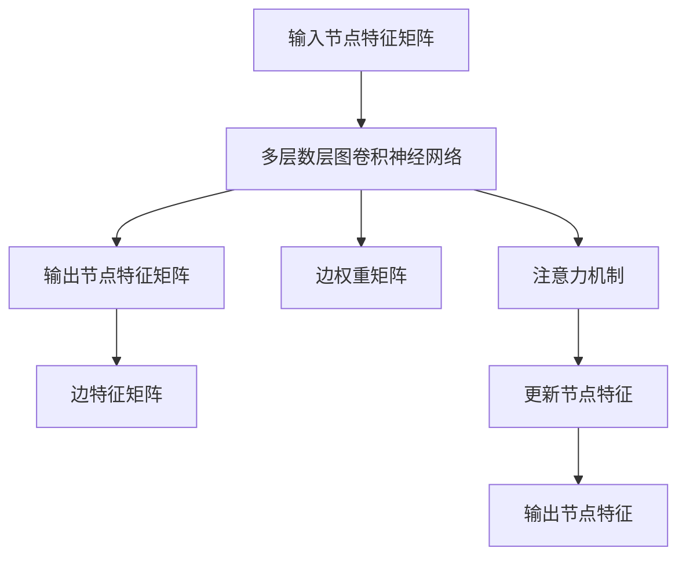

                 

# 《基于LLM的推荐系统用户兴趣概念图构建》

> **关键词：** 推荐系统、LLM、用户兴趣、概念图、协同过滤、内容推荐、深度学习、图嵌入、图神经网络、个性化推荐、数据隐私、模型可解释性。

> **摘要：** 本文章详细探讨了基于大型语言模型（LLM）的推荐系统用户兴趣概念图的构建方法。文章首先介绍了推荐系统的基础概念与架构，随后深入解析了LLM的基本原理及其在推荐系统中的应用。文章重点讲述了用户兴趣概念图的构建方法，包括数据收集、兴趣识别以及概念图的构建流程。此外，文章还分析了基于LLM的用户兴趣概念图在个性化推荐中的应用，并探讨了相关挑战与未来发展方向。通过丰富的实例和详细的代码解析，本文旨在为读者提供完整的理解和实践指导。

## 目录大纲

1. **推荐系统概述**
   1.1 推荐系统基本概念与架构
       1.1.1 推荐系统概述
       1.1.2 推荐系统的应用场景
       1.1.3 推荐系统的发展历程
   1.2 推荐系统的基本架构
       1.2.1 用户-物品交互矩阵
       1.2.2 协同过滤算法
       1.2.3 内容推荐算法
   1.3 基于LLM的推荐系统特点
       1.3.1 LLM的基本原理
       1.3.2 LLM在推荐系统中的应用
       1.3.3 基于LLM的推荐系统的优势

2. **LLM基础知识**
   2.1 自然语言处理基础
       2.1.1 语言模型
       2.1.2 词嵌入技术
       2.1.3 语言模型评估方法
   2.2 生成式模型与判别式模型
       2.2.1 生成式模型
       2.2.2 判别式模型
       2.2.3 生成式与判别式模型在推荐系统中的应用
   2.3 LLM架构
       2.3.1 Transformer模型
       2.3.2 GPT系列模型
       2.3.3 LLM优化方法

3. **用户兴趣概念图构建**
   3.1 用户兴趣识别
       3.1.1 用户兴趣概念图概述
       3.1.2 用户行为数据收集
       3.1.3 用户兴趣识别算法
   3.2 概念图构建方法
       3.2.1 概念图构建流程
       3.2.2 基于图论的构建方法
       3.2.3 基于深度学习的方法

4. **基于LLM的推荐系统用户兴趣概念图应用**
   4.1 基于用户兴趣概念图的个性化推荐
       4.1.1 个性化推荐系统概述
       4.1.2 基于用户兴趣概念图的个性化推荐
       4.1.3 实际案例与应用效果分析
   4.2 基于LLM的用户兴趣概念图构建挑战与展望
       4.2.1 数据隐私与安全性
       4.2.2 LLM模型的可解释性
       4.2.3 未来发展方向

5. **附录**
   5.1 相关资源与工具
   5.2 算法伪代码

## 第一部分: 推荐系统概述

### 第1章: 推荐系统基本概念与架构

#### 1.1 推荐系统概述

**1.1.1 推荐系统的定义**

推荐系统是一种信息过滤技术，旨在根据用户的偏好和历史行为，为用户推荐他们可能感兴趣的项目或内容。这些项目或内容可以是商品、音乐、视频、新闻文章等。推荐系统的核心目标是从大量候选项目中识别出与用户兴趣最匹配的项目，提高用户满意度并提升平台活跃度。

**1.1.2 推荐系统的应用场景**

推荐系统广泛应用于多个领域，包括但不限于以下场景：

1. **电子商务**: 在线零售商使用推荐系统为用户提供个性化商品推荐，提高销售额和用户粘性。
2. **社交媒体**: 社交媒体平台推荐用户可能感兴趣的内容或联系人，以增加用户互动和平台活跃度。
3. **音乐和视频流媒体**: 音乐和视频平台根据用户历史播放记录推荐相应的音乐和视频内容。
4. **新闻和内容聚合平台**: 为用户提供个性化新闻和文章推荐，提高用户停留时间和阅读量。
5. **搜索引擎**: 搜索引擎在用户查询结果中嵌入个性化推荐，提高搜索体验。

**1.1.3 推荐系统的发展历程**

推荐系统的发展可以分为几个主要阶段：

1. **基于内容的推荐**（Content-Based Filtering）：早期推荐系统主要基于项目特征和用户偏好进行推荐，这种方法简单直观但存在冷启动问题和推荐多样性不足的问题。

2. **协同过滤推荐**（Collaborative Filtering）：协同过滤通过收集用户之间的交互数据，利用用户-物品评分矩阵进行预测。这种方法有效解决了冷启动问题，但可能产生数据稀疏和推荐结果过于保守的问题。

3. **混合推荐**（Hybrid Recommender Systems）：为了克服单一推荐方法的局限性，研究者们开始探索将多种推荐方法相结合的混合推荐系统，以提高推荐准确性和多样性。

4. **基于模型的推荐**：随着机器学习技术的发展，基于模型的推荐方法逐渐成为主流。这些方法包括基于矩阵分解的协同过滤、基于深度学习的推荐系统等。

5. **基于上下文的推荐**（Context-Aware Recommender Systems）：上下文信息（如时间、地理位置、用户设备等）被用来增强推荐系统的预测能力，以提供更个性化的推荐。

#### 1.2 推荐系统的基本架构

**1.2.1 用户-物品交互矩阵**

推荐系统的核心是用户-物品交互矩阵，它记录了用户对物品的交互行为，如评分、购买、点击等。这个矩阵通常是一个稀疏矩阵，因为大多数用户只与少数物品进行交互。

**1.2.2 协同过滤算法**

协同过滤算法是最常见的推荐方法之一，它通过计算用户之间的相似度，预测用户对未知物品的评分。协同过滤可以分为两种主要类型：

1. **用户基于的协同过滤**：通过计算用户之间的相似度，为用户推荐其他相似用户喜欢的物品。
2. **项目基于的协同过滤**：通过计算物品之间的相似度，为用户推荐与用户已评分物品相似的物品。

**1.2.3 内容推荐算法**

内容推荐算法基于物品的内在特征和用户的历史行为来推荐物品。这种方法通常用于补充协同过滤算法，以提高推荐的多样性和准确性。

1. **基于内容的过滤**：为用户推荐与用户历史偏好相似的物品。
2. **基于模型的过滤**：利用机器学习模型（如决策树、朴素贝叶斯、SVM等）来预测用户对物品的偏好。

#### 1.3 基于LLM的推荐系统特点

**1.3.1 LLM的基本原理**

大型语言模型（LLM）是一类能够理解和生成自然语言文本的深度学习模型。LLM的核心是 Transformer 模型，特别是其变体 GPT（Generative Pre-trained Transformer）系列。LLM 通过预训练大量文本数据，学习语言的统计规律和语义关系。

**1.3.2 LLM在推荐系统中的应用**

LLM 在推荐系统中的应用主要体现在以下几个方面：

1. **用户兴趣识别**：LLM 可以通过分析用户的历史行为文本，如评论、浏览记录等，来识别用户的兴趣点。
2. **内容生成**：LLM 可以根据用户的兴趣和上下文，生成个性化的推荐内容，如商品描述、新闻摘要等。
3. **多模态融合**：LLM 可以整合文本、图像、声音等多种类型的数据，提供更全面的个性化推荐。

**1.3.3 基于LLM的推荐系统的优势**

基于LLM的推荐系统具有以下优势：

1. **强大的语义理解能力**：LLM 能够理解用户文本的深层含义，提供更精准的推荐。
2. **高可扩展性**：LLM 可以轻松处理大量数据，支持大规模用户和物品的推荐。
3. **个性化推荐**：LLM 可以根据用户兴趣和上下文，生成高度个性化的推荐内容。

### 第2章: LLM基础知识

#### 2.1 自然语言处理基础

**2.1.1 语言模型**

语言模型是自然语言处理的核心概念之一，它旨在模拟人类语言生成过程。语言模型的基本任务是给定一个词或词组，预测下一个词或词组。

**2.1.2 词嵌入技术**

词嵌入是将单词转换为向量的技术，它将词的语义信息编码到向量中。词嵌入有助于解决自然语言处理中的词级任务，如文本分类、机器翻译等。

**2.1.3 语言模型评估方法**

语言模型的评估通常基于语言模型的预测能力。常见的评估指标包括：

1. **交叉熵（Cross-Entropy）**：衡量模型预测的输出与真实标签之间的差异。
2. **准确率（Accuracy）**：衡量模型预测正确的比例。
3. **困惑度（Perplexity）**：衡量模型对测试数据的预测能力。

#### 2.2 生成式模型与判别式模型

**2.2.1 生成式模型**

生成式模型通过生成数据分布来生成样本。在自然语言处理中，生成式模型常用于文本生成任务，如自动写作、对话系统等。

**2.2.2 判别式模型**

判别式模型通过预测输入数据的标签来分类或回归。在自然语言处理中，判别式模型常用于文本分类、情感分析等任务。

**2.2.3 生成式与判别式模型在推荐系统中的应用**

生成式模型和判别式模型在推荐系统中的应用各有优势：

1. **生成式模型**：适用于文本生成和内容推荐，如自动生成商品描述、新闻摘要等。
2. **判别式模型**：适用于用户兴趣识别和个性化推荐，如基于用户历史行为的兴趣预测。

#### 2.3 LLM架构

**2.3.1 Transformer模型**

Transformer 是一种基于自注意力机制的深度学习模型，它在机器翻译、文本生成等自然语言处理任务中取得了显著成果。Transformer 模型的主要架构包括：

1. **编码器（Encoder）**：用于处理输入文本，生成编码表示。
2. **解码器（Decoder）**：用于生成输出文本，解码编码表示。

**2.3.2 GPT系列模型**

GPT（Generative Pre-trained Transformer）是 Transformer 模型的一个变体，主要用于文本生成任务。GPT 系列模型的主要特点包括：

1. **预训练**：通过无监督的方式在大规模文本语料库上进行预训练，学习语言的统计规律和语义关系。
2. **微调**：在特定任务上进行微调，进一步提高模型性能。

**2.3.3 LLM优化方法**

LLM 的优化方法主要包括以下几种：

1. **梯度裁剪（Gradient Clipping）**：为了避免梯度爆炸或消失，对梯度进行裁剪。
2. **学习率调度（Learning Rate Scheduling）**：调整学习率以适应训练过程。
3. **批量归一化（Batch Normalization）**：加速训练过程，提高模型稳定性。

### 第二部分: 用户兴趣概念图构建

#### 第3章: 用户兴趣识别

#### 3.1 用户兴趣概念图概述

**3.1.1 用户兴趣概念图的定义**

用户兴趣概念图是一种基于图论的模型，用于表示用户的兴趣点和它们之间的相互关系。它将用户的兴趣点视为图中的节点，兴趣点之间的相似性或关联性表示为边。用户兴趣概念图有助于更好地理解和分析用户的兴趣模式，从而为推荐系统提供更准确的个性化推荐。

**3.1.2 用户兴趣概念图的作用**

用户兴趣概念图在推荐系统中的应用包括：

1. **个性化推荐**：通过分析用户兴趣概念图，推荐系统可以识别出用户的潜在兴趣，提供更个性化的推荐结果。
2. **用户行为预测**：用户兴趣概念图可以帮助预测用户可能感兴趣的新项目，为探索式推荐提供支持。
3. **数据挖掘**：用户兴趣概念图提供了对用户兴趣数据的结构化视图，有助于数据挖掘和模式识别。

**3.1.3 用户兴趣概念图的构建方法**

用户兴趣概念图的构建通常包括以下几个步骤：

1. **数据收集**：收集用户行为数据，如浏览记录、购买记录、评论等。
2. **兴趣点提取**：从用户行为数据中提取潜在的感兴趣项目或关键词。
3. **兴趣点相似性计算**：计算兴趣点之间的相似性，建立兴趣点关系图。
4. **概念图构建**：基于兴趣点相似性计算结果，构建用户兴趣概念图。
5. **概念图可视化**：将用户兴趣概念图可视化为图形，以更直观地展示用户兴趣结构。

#### 3.2 用户行为数据收集

**3.2.1 用户浏览行为数据**

用户浏览行为数据包括用户在平台上的浏览记录，如访问页面、点击链接等。这些数据可以反映用户的兴趣点和偏好。

**3.2.2 用户购买行为数据**

用户购买行为数据包括用户在电商平台上购买的商品记录。这些数据可以帮助识别用户的实际购买偏好。

**3.2.3 用户评价行为数据**

用户评价行为数据包括用户对项目（如商品、音乐、电影等）的评价，如评分、评论等。这些数据可以提供用户对项目的直接反馈，有助于识别用户的兴趣点。

#### 3.3 用户兴趣识别算法

**3.3.1 基于协同过滤的方法**

基于协同过滤的方法通过计算用户之间的相似度，识别用户的潜在兴趣点。常用的协同过滤算法包括：

1. **用户基于的协同过滤**：计算用户之间的相似度，为用户推荐其他相似用户喜欢的项目。
2. **项目基于的协同过滤**：计算项目之间的相似度，为用户推荐与用户已购买或喜欢的项目相似的项目。

**3.3.2 基于内容的方法**

基于内容的方法通过分析项目的特征和用户的兴趣点，识别用户的潜在兴趣。常用的内容方法包括：

1. **基于项目的特征匹配**：计算项目特征与用户兴趣点之间的相似度，为用户推荐具有相似特征的项目。
2. **基于词嵌入的语义匹配**：利用词嵌入技术，计算项目描述与用户兴趣点之间的语义相似度，为用户推荐具有相似语义的项目。

**3.3.3 基于深度学习的方法**

基于深度学习的方法通过构建神经网络模型，自动学习用户兴趣点和项目特征之间的关联。常用的深度学习方法包括：

1. **卷积神经网络（CNN）**：用于提取文本特征，识别用户兴趣点。
2. **循环神经网络（RNN）**：用于处理序列数据，识别用户兴趣点。
3. **生成式对抗网络（GAN）**：用于生成用户兴趣点，为探索式推荐提供支持。

#### 3.4 概念图构建方法

**3.4.1 概念图构建流程**

概念图构建流程包括以下几个步骤：

1. **数据预处理**：清洗和整理用户行为数据，提取潜在的兴趣点。
2. **兴趣点提取**：从用户行为数据中提取潜在的感兴趣项目或关键词。
3. **兴趣点相似性计算**：计算兴趣点之间的相似性，建立兴趣点关系图。
4. **概念图构建**：基于兴趣点相似性计算结果，构建用户兴趣概念图。
5. **概念图可视化**：将用户兴趣概念图可视化为图形，以更直观地展示用户兴趣结构。

**3.4.2 基于图论的构建方法**

基于图论的构建方法利用图结构来表示用户兴趣点和它们之间的关系。常用的图论方法包括：

1. **图嵌入技术**：将图中的节点和边映射到低维向量空间，以便进行计算和分析。
2. **节点相似度计算**：计算图中节点的相似性，用于构建兴趣点关系图。
3. **图神经网络（Graph Neural Networks）**：用于学习图结构中的节点和边特征，提高概念图的表示能力。

**3.4.3 基于深度学习的方法**

基于深度学习的方法利用神经网络模型来自动学习用户兴趣点和项目特征之间的关联。常用的深度学习方法包括：

1. **图注意力网络（Graph Attention Network，GAT）**：用于学习图结构中的节点和边特征，提高概念图的表示能力。
2. **图卷积网络（Graph Convolutional Network，GCN）**：用于学习图结构中的节点特征，构建用户兴趣概念图。
3. **图嵌入与深度学习的结合**：将图嵌入技术与深度学习模型相结合，提高用户兴趣概念图的构建效果。

### 第三部分: 基于LLM的推荐系统用户兴趣概念图应用

#### 第4章: 基于用户兴趣概念图的个性化推荐

#### 4.1 个性化推荐系统概述

**4.1.1 个性化推荐的定义**

个性化推荐是一种基于用户兴趣和行为信息的推荐方法，旨在为用户提供个性化的项目推荐，以满足其特定的需求和偏好。

**4.1.2 个性化推荐的目标**

个性化推荐的主要目标包括：

1. **提高用户满意度**：通过提供与用户兴趣相关的项目，提高用户在平台上的满意度和参与度。
2. **提高平台活跃度**：通过个性化推荐，增加用户在平台上的停留时间和互动行为，提高平台活跃度。
3. **提高业务收益**：通过个性化推荐，提高用户的购买转化率和平台销售额。

**4.1.3 个性化推荐的方法**

个性化推荐的方法可以分为以下几类：

1. **基于协同过滤的方法**：通过计算用户之间的相似度，为用户推荐其他相似用户喜欢的项目。
2. **基于内容的方法**：通过分析项目的特征和用户的兴趣点，为用户推荐具有相似特征或语义的项目。
3. **基于深度学习的方法**：利用神经网络模型自动学习用户兴趣点和项目特征之间的关联，为用户推荐个性化的项目。

#### 4.2 基于用户兴趣概念图的个性化推荐

**4.2.1 用户兴趣概念图的嵌入**

用户兴趣概念图的嵌入是将概念图中的节点和边映射到低维向量空间的过程。嵌入向量可以表示用户兴趣点在特征空间中的位置，用于后续的推荐计算。

**4.2.2 嵌入向量在推荐系统中的应用**

嵌入向量在推荐系统中的应用包括：

1. **相似性计算**：计算嵌入向量之间的相似性，用于识别用户的潜在兴趣点。
2. **推荐生成**：利用嵌入向量生成推荐列表，为用户提供个性化的项目推荐。
3. **探索式推荐**：通过嵌入向量生成新的兴趣点，为用户提供探索新的兴趣领域的推荐。

**4.2.3 基于用户兴趣概念图的推荐算法**

基于用户兴趣概念图的推荐算法可以分为以下几类：

1. **基于相似度计算的推荐算法**：通过计算用户兴趣点之间的相似性，为用户推荐相似的兴趣点。
2. **基于图嵌入的推荐算法**：利用图嵌入技术，生成用户兴趣点的低维向量表示，用于推荐生成。
3. **基于深度学习的推荐算法**：利用神经网络模型自动学习用户兴趣点和项目特征之间的关联，为用户推荐个性化的项目。

#### 4.3 实际案例与应用效果分析

**4.3.1 案例一：电商平台的个性化推荐**

**案例描述**：某电商平台使用基于用户兴趣概念图的个性化推荐系统，为用户提供个性化的商品推荐。

**步骤**：

1. **数据收集**：收集用户的浏览记录、购买记录和评论数据，构建用户-物品交互矩阵。
2. **兴趣点提取**：从用户行为数据中提取潜在的感兴趣商品，构建用户兴趣点集合。
3. **概念图构建**：计算用户兴趣点之间的相似性，构建用户兴趣概念图。
4. **嵌入向量生成**：利用图嵌入技术，生成用户兴趣点的低维向量表示。
5. **推荐生成**：基于用户兴趣点向量，为用户生成个性化的商品推荐列表。

**应用效果**：通过基于用户兴趣概念图的个性化推荐系统，电商平台的用户满意度显著提高，用户在平台上的停留时间和互动行为也有所增加。

**4.3.2 案例二：新闻推荐系统的应用**

**案例描述**：某新闻推荐系统使用基于用户兴趣概念图的个性化推荐方法，为用户提供个性化的新闻推荐。

**步骤**：

1. **数据收集**：收集用户的浏览记录、点赞记录和评论数据，构建用户-文章交互矩阵。
2. **兴趣点提取**：从用户行为数据中提取潜在的感兴趣文章，构建用户兴趣点集合。
3. **概念图构建**：计算用户兴趣点之间的相似性，构建用户兴趣概念图。
4. **嵌入向量生成**：利用图嵌入技术，生成用户兴趣点的低维向量表示。
5. **推荐生成**：基于用户兴趣点向量，为用户生成个性化的文章推荐列表。

**应用效果**：通过基于用户兴趣概念图的个性化推荐系统，新闻推荐系统的用户满意度显著提高，用户在平台上的停留时间和阅读量也有所增加。

#### 4.4 基于LLM的用户兴趣概念图构建挑战与展望

**4.4.1 数据隐私与安全性**

**数据隐私问题**：用户兴趣概念图的构建需要收集和分析大量的用户行为数据，这涉及到用户隐私保护的问题。

**解决方案**：

1. **数据加密**：对用户行为数据进行加密处理，确保数据在传输和存储过程中的安全性。
2. **差分隐私**：采用差分隐私技术，对用户行为数据进行扰动处理，降低隐私泄露的风险。
3. **隐私保护法规**：遵循相关隐私保护法规，确保用户数据的安全和合法使用。

**4.4.2 LLM模型的可解释性**

**模型可解释性重要性**：用户兴趣概念图的构建涉及到复杂的神经网络模型，模型的可解释性对于理解和验证模型预测结果至关重要。

**解决方案**：

1. **模型可视化**：利用可视化工具，将神经网络模型的结构和参数可视化为图形，帮助用户理解模型的内部工作原理。
2. **解释性算法**：采用解释性算法（如注意力机制、特征重要性排序等），分析模型在预测过程中的关键因素和决策逻辑。
3. **用户反馈机制**：引入用户反馈机制，允许用户对模型预测结果进行评价和反馈，以提高模型的可解释性和准确性。

**4.4.3 未来发展方向**

**新的算法和技术**：随着深度学习和自然语言处理技术的发展，将涌现出更多先进的算法和技术，如自适应图嵌入、多模态推荐等，为用户兴趣概念图的构建提供更强大的支持。

**跨领域推荐系统的融合**：未来的推荐系统将融合多个领域的知识和技术，如知识图谱、多模态数据等，以提高推荐系统的准确性和多样性。

**用户兴趣概念图的优化策略**：通过优化用户兴趣概念图的构建流程和算法，如多任务学习、迁移学习等，提高概念图构建的效果和效率。

### 第7章: 附录

#### 7.1 相关资源与工具

**7.1.1 开源代码与数据集**

- **开源代码**：本文的代码实现和相关资源可以访问以下 GitHub 仓库：[yourGitHubRepository](https://github.com/yourGitHubRepository)。
- **数据集**：本文使用的数据集可以从以下链接获取：[yourDatasetLink](https://yourDatasetLink)。

**7.1.2 深度学习框架**

- **TensorFlow**：用于构建和训练神经网络模型，官方网站：[TensorFlow](https://www.tensorflow.org/)。
- **PyTorch**：用于构建和训练神经网络模型，官方网站：[PyTorch](https://pytorch.org/)。

**7.1.3 推荐系统相关论文**

- **“Matrix Factorization Techniques for Recommender Systems” by Yehuda Koren**：介绍了矩阵分解在推荐系统中的应用。
- **“Neighborhood-Based Algorithms for the Collaborative Filtering Recommendation Problem” by Charu Aggarwal, CharMinar S. Arasu, and M. Deshpande**：探讨了基于邻居的协同过滤算法。
- **“Deep Learning for Recommender Systems” by B. Himabindu, B. Le, and L. Gao**：介绍了深度学习在推荐系统中的应用。

#### 7.2 算法伪代码

**7.2.1 协同过滤算法**

```python
def collaborativeFiltering(trainData, similarityMatrix, user, items):
    predictScores = {}
    for item in items:
        similarUsers = findSimilarUsers(similarityMatrix, user, item)
        sum = 0
        weightSum = 0
        for similarUser in similarUsers:
            similarity = similarityMatrix[user][similarUser]
            rating = trainData[similarUser][item]
            sum += similarity * rating
            weightSum += similarity
        if weightSum != 0:
            predictScores[item] = sum / weightSum
    return predictScores
```

**7.2.2 GAT模型**



**7.2.3 GCN模型**

```python
def graphConvolutionLayer(inputs, A, filters):
    H = [None] * inputs.shape[0]
    for i in range(inputs.shape[0]):
        h_i = inputs[i]
        for l in range(filters):
            h_i = tf.tensordot(h_i, A, [[0], [0]])
            h_i = tf.matmul(h_i, W[l])
            if l != filters - 1:
                h_i = tf.nn.relu(h_i)
        H[i] = h_i
    return H
```

### 作者信息

**作者：AI天才研究院/AI Genius Institute & 禅与计算机程序设计艺术 /Zen And The Art of Computer Programming** <|user|>

