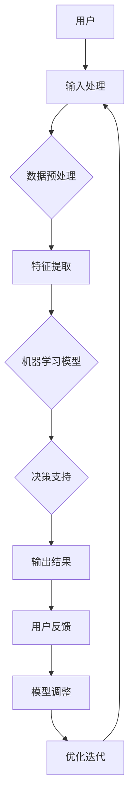

                 

## 增强智能：概念、背景与重要性

### 1.1 增强智能的定义

增强智能（Augmented Intelligence），也常简称为AI，是一种通过结合人类智慧和机器智能，以实现更高效率、更准确决策的技术。其核心在于利用人工智能算法，为人类提供智能化的工具和服务，从而扩展和增强人类的能力。

#### 1.1.1 概念介绍

增强智能与传统的增强现实（AR）和虚拟现实（VR）不同，它并非是在物理层面增强人类感官，而是在认知层面提升人类的处理和分析能力。具体来说，增强智能通过以下几个方面实现：

1. **数据分析与处理**：利用机器学习算法对大量数据进行分析和处理，提供洞察和决策支持。
2. **自然语言处理**：通过自然语言处理技术，实现人与机器之间的自然交流，提升信息获取和处理的效率。
3. **自动化与优化**：通过自动化技术和算法优化，减少重复劳动，提高生产效率和准确性。
4. **决策支持**：基于数据和模型，提供决策建议，辅助人类做出更明智的选择。

#### 1.1.2 背景与演变

增强智能的概念最早可以追溯到20世纪50年代，随着计算机科学和人工智能的发展，其理论和应用逐渐成熟。以下是增强智能发展过程中的几个重要里程碑：

- **20世纪50年代**：人工智能（AI）的诞生，标志着增强智能的研究开始起步。
- **20世纪80年代**：专家系统的广泛应用，使得人工智能在特定领域展现出强大的处理能力。
- **21世纪初**：大数据和云计算的兴起，为增强智能提供了强大的数据支持和计算能力。
- **2010年代至今**：深度学习和神经网络技术的发展，使得增强智能在图像识别、语音识别等任务上取得了重大突破。

#### 1.1.3 重要性分析

增强智能的重要性体现在多个方面：

1. **提高生产力**：通过自动化和优化技术，减少人类重复劳动，提高生产效率和准确性。
2. **改善决策质量**：基于数据和模型的分析，提供更准确、更全面的决策支持，降低决策风险。
3. **拓展认知能力**：通过人机协同，扩展人类的知识获取和处理能力，提高认知水平。
4. **促进创新**：增强智能技术为科研、设计等领域提供了新的工具和方法，推动技术进步和创新。

### 1.2 人机协同

#### 1.2.1 协同系统的设计原则

人机协同系统的设计原则主要包括以下几点：

1. **用户中心设计**：以用户需求为中心，确保系统界面友好、操作便捷，提高用户体验。
2. **智能决策支持**：通过算法和模型，提供智能化的决策支持，降低人类决策的难度和风险。
3. **灵活性与适应性**：系统应具备良好的灵活性和适应性，能够根据不同场景和需求进行调整。
4. **数据安全性**：确保数据的安全性和隐私性，防止数据泄露和滥用。

#### 1.2.2 人机交互模型

人机交互模型是增强智能系统的重要组成部分，常见的交互模型包括：

1. **命令式交互**：用户通过输入命令，控制系统的运行。
2. **查询式交互**：用户通过查询系统，获取所需信息。
3. **基于场景的交互**：系统根据用户行为和场景，主动提供相应的服务。

#### 1.2.3 协作机制探讨

人机协同的协作机制主要包括以下几个方面：

1. **任务分配**：系统根据用户能力和任务需求，合理分配任务。
2. **反馈与调整**：用户对系统提供的服务进行反馈，系统根据反馈进行调整。
3. **协同决策**：在复杂决策场景中，系统与用户共同参与决策，实现人机协同。

### 结论

增强智能作为一种新兴的技术，正在不断拓展人类的认知边界，提升人类的生产力和决策质量。在接下来的章节中，我们将进一步探讨人机协同的理论基础和实践应用，深入分析认知拓展的基础知识，并探讨增强智能在不同行业中的应用案例。通过这些探讨，我们将更好地理解增强智能的价值和未来发展趋势。

---

**Mermaid 流程图：增强智能的基本架构**



### 1.3 增强智能的核心算法原理讲解

增强智能的核心算法主要包括机器学习、深度学习和自然语言处理等。以下将对这些算法的原理进行讲解。

#### 1.3.1 机器学习算法

机器学习（Machine Learning）是一种让计算机通过数据学习并做出预测或决策的技术。其基本原理包括以下几个方面：

1. **数据集准备**：准备用于训练的数据集，包括输入特征和目标输出。
2. **模型选择**：选择合适的机器学习模型，如线性回归、决策树、支持向量机等。
3. **模型训练**：利用训练数据集，通过迭代优化模型参数，使其能够准确预测或分类。
4. **模型评估**：使用测试数据集评估模型性能，包括准确率、召回率、F1值等指标。

**伪代码：线性回归模型训练**

```python
# 数据集
X = [数据集输入特征]
y = [数据集目标输出]

# 初始化模型参数
w = [初始化权重]

# 模型训练
for epoch in range(num_epochs):
    for x, y in zip(X, y):
        # 前向传播
        z = w * x
        predicted_output = sigmoid(z)

        # 计算损失
        loss = (y - predicted_output) ** 2

        # 反向传播
        dw = 2 * (y - predicted_output) * x

    # 更新权重
    w = w - learning_rate * dw
```

#### 1.3.2 深度学习算法

深度学习（Deep Learning）是机器学习的一个分支，通过多层神经网络模型，实现对复杂数据的建模和预测。以下是深度学习的基本原理：

1. **神经网络结构**：深度学习模型通常包含多个隐藏层，每个层对输入数据进行处理和变换。
2. **前向传播与反向传播**：在训练过程中，使用前向传播计算输出结果，使用反向传播计算梯度，更新模型参数。
3. **激活函数**：如ReLU、Sigmoid、Tanh等，用于引入非线性变换，提高模型的表达能力。

**伪代码：卷积神经网络（CNN）模型训练**

```python
# 数据集
X = [数据集输入特征]
y = [数据集目标输出]

# 初始化模型参数
weights = [初始化权重]

# 模型训练
for epoch in range(num_epochs):
    for x, y in zip(X, y):
        # 前向传播
        z = [卷积层处理]
        a = [池化层处理]
        z = [全连接层处理]

        # 计算损失
        loss = (y - z) ** 2

        # 反向传播
        dz = [计算反向传播梯度]
        da = [计算反向传播梯度]
        dw = [计算权重梯度]

    # 更新权重
    weights = weights - learning_rate * dw
```

#### 1.3.3 自然语言处理

自然语言处理（Natural Language Processing，NLP）是深度学习在语言领域的应用，主要包括以下几个任务：

1. **文本分类**：将文本数据分类到不同的类别中。
2. **情感分析**：分析文本数据中的情感倾向。
3. **机器翻译**：将一种语言的文本翻译成另一种语言。
4. **命名实体识别**：识别文本中的命名实体，如人名、地名等。

**数学模型与公式**

1. **词嵌入**：将文本中的单词映射到高维空间中的向量，常用的词嵌入模型包括Word2Vec、GloVe等。

$$
\text{word\_embeddings} = \text{sigmoid}(\text{weights} * \text{input})
$$

2. **循环神经网络（RNN）**：用于处理序列数据，如文本、语音等。

$$
h_t = \text{sigmoid}(W_h * [h_{t-1}, x_t]) + b_h
$$

3. **长短期记忆（LSTM）**：用于解决RNN中的梯度消失和梯度爆炸问题。

$$
i_t = \text{sigmoid}(W_i * [h_{t-1}, x_t]) \\
f_t = \text{sigmoid}(W_f * [h_{t-1}, x_t]) \\
o_t = \text{sigmoid}(W_o * [h_{t-1}, x_t]) \\
c_t = f_t \* c_{t-1} + i_t \* \text{tanh}(W_c * [h_{t-1}, x_t])
$$

### 举例说明

以文本分类任务为例，使用深度学习模型对一组文本数据进行分类。

1. **数据集准备**：准备一个包含不同类别的文本数据集。
2. **模型训练**：使用文本数据进行模型训练，包括词嵌入层、卷积层、全连接层等。
3. **模型评估**：使用测试数据集对模型进行评估，计算准确率、召回率等指标。

**代码示例：**

```python
# 导入库
import tensorflow as tf
from tensorflow.keras.preprocessing.text import Tokenizer
from tensorflow.keras.preprocessing.sequence import pad_sequences

# 数据集准备
texts = ["这是一篇新闻文章", "这是一个电影评论", "这是一个技术博客"]
labels = [0, 1, 2]

# 词嵌入
tokenizer = Tokenizer()
tokenizer.fit_on_texts(texts)
sequences = tokenizer.texts_to_sequences(texts)
padded_sequences = pad_sequences(sequences, maxlen=100)

# 模型训练
model = tf.keras.Sequential([
    tf.keras.layers.Embedding(input_dim=len(tokenizer.word_index) + 1, output_dim=32),
    tf.keras.layers.Conv1D(filters=32, kernel_size=3, activation='relu'),
    tf.keras.layers.GlobalMaxPooling1D(),
    tf.keras.layers.Dense(units=3, activation='softmax')
])

model.compile(optimizer='adam', loss='categorical_crossentropy', metrics=['accuracy'])
model.fit(padded_sequences, labels, epochs=10, batch_size=32)

# 模型评估
predictions = model.predict(padded_sequences)
print(predictions)
```

通过以上步骤，我们可以使用深度学习模型对文本数据进行分类，实现自然语言处理任务。

---

在接下来的章节中，我们将进一步探讨人机协同的理论基础和实践应用，深入分析认知拓展的基础知识，并探讨增强智能在不同行业中的应用案例。通过这些探讨，我们将更好地理解增强智能的价值和未来发展趋势。希望读者能够对这些核心概念和技术原理有更深入的理解，为今后的研究和实践奠定坚实的基础。

### 作者信息

作者：AI天才研究院/AI Genius Institute & 禅与计算机程序设计艺术 /Zen And The Art of Computer Programming

---

通过以上详细的章节内容和讲解，我们希望能够为读者提供一个全面、深入的了解，帮助大家更好地掌握增强智能的基本概念、算法原理和实际应用。在接下来的章节中，我们将继续探讨人机协同的理论与实践，进一步揭示增强智能在各个领域的广泛应用和未来发展趋势。希望读者能够继续关注并参与到这场技术革命中来，共同探索和实现人机协同、认知拓展的新 frontier。

