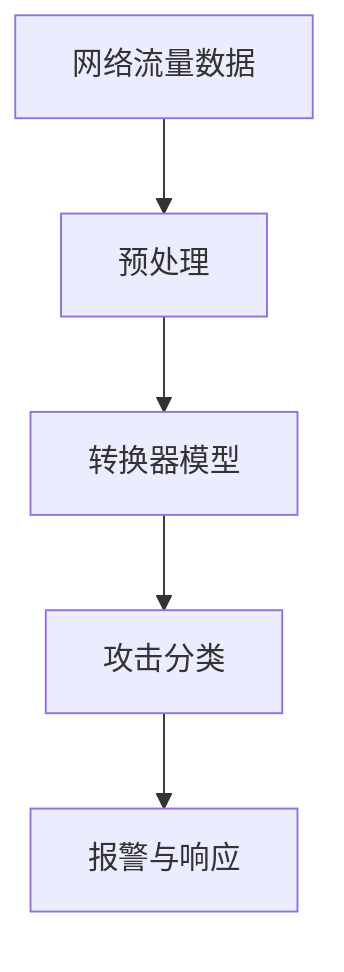
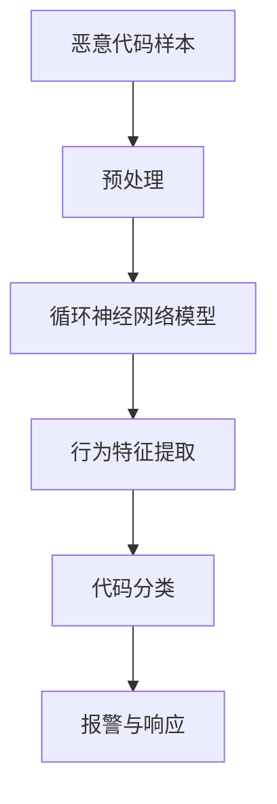
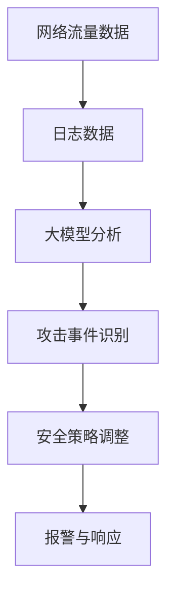

                 

# 大模型在网络安全中的应用前景

> **关键词：** 大模型、网络安全、深度学习、入侵检测、恶意代码检测、攻防博弈、人才培养、未来展望

> **摘要：** 本文将探讨大模型在网络安全领域的应用前景，从理论基础、核心算法原理、应用实践到未来展望，全面分析大模型如何改变网络安全防护的面貌，以及面临的挑战和机遇。通过详细的讲解和案例分析，旨在为网络安全从业者提供有价值的参考。

## 目录大纲

1. **大模型在网络安全中的理论基础**
    1.1 大模型的定义与基本原理
    1.2 网络安全的概念与挑战
    1.3 大模型在网络安全中的作用
    1.4 大模型的核心算法原理
2. **大模型在网络安全中的应用**
    2.1 大模型在入侵检测中的应用
    2.2 大模型在恶意代码检测中的应用
    2.3 大模型在网络安全防御策略中的应用
    2.4 大模型在网络安全攻防博弈中的应用
3. **大模型在网络安全人才培养中的作用**
    3.1 大模型在网络安全人才培养中的重要性
    3.2 大模型在网络安全人才培养中的应用案例分析
4. **大模型在网络安全领域的未来展望**
    4.1 大模型在网络安全领域的发展趋势
    4.2 大模型在网络安全领域的未来前景
    4.3 大模型在网络安全领域面临的挑战与机遇
5. **附录**
    5.1 大模型在网络安全中的应用资源
    5.2 大模型在网络安全中的实践指南

## 第一部分：大模型在网络安全中的理论基础

### 第1章：大模型与网络安全概述

#### 1.1 大模型的定义与基本原理

##### 1.1.1 大模型的定义

大模型（Large Models），通常是指具有数十亿甚至千亿参数的深度学习模型，这些模型可以在大量数据上进行训练，从而具备强大的特征提取和知识表示能力。大模型的出现，极大地推动了人工智能领域的发展，尤其在自然语言处理、计算机视觉等领域取得了显著的成果。

##### 1.1.2 大模型的基本原理

大模型的基本原理主要基于深度学习（Deep Learning）理论。深度学习是机器学习（Machine Learning）的一个重要分支，通过模拟人脑神经网络结构，利用多层非线性变换来提取数据中的特征，从而达到对数据的理解和预测。大模型的核心优势在于其能够处理海量数据，具备强大的泛化能力和鲁棒性。

##### 1.1.3 大模型的核心优势

1. **强大的特征提取能力**：大模型能够从大量数据中自动提取出有意义的特征，提高了模型对未知数据的适应能力。
2. **高效的计算性能**：随着计算能力的提升，大模型能够在较短的时间内完成训练和预测任务。
3. **良好的泛化能力**：大模型在训练时已经具备了较强的鲁棒性，能够在不同的数据集和应用场景中保持稳定的性能。

#### 1.2 网络安全的概念与挑战

##### 1.2.1 网络安全的基本概念

网络安全（Cybersecurity）是指通过采取各种安全措施，保护计算机网络系统免受各种威胁和攻击，确保信息的完整性、保密性和可用性。网络安全涉及的范围广泛，包括网络安全架构、安全协议、安全工具、风险管理等多个方面。

##### 1.2.2 网络安全面临的挑战

1. **日益复杂的攻击手段**：随着网络技术的不断发展，黑客攻击的手段也在不断升级，从传统的SQL注入、跨站脚本攻击（XSS）到高级持续性威胁（APT），网络安全面临的威胁日益复杂。
2. **大数据带来的挑战**：随着大数据时代的到来，网络安全数据量急剧增加，这对网络安全系统提出了更高的要求，如何高效地处理和分析大量数据成为一大挑战。
3. **安全人才短缺**：网络安全领域的专业人才严重短缺，这对网络安全防护形成了巨大的压力。

##### 1.2.3 大模型在网络安全中的作用

大模型在网络安全中的作用主要体现在以下几个方面：

1. **入侵检测**：大模型能够通过分析网络流量数据，识别异常行为和潜在攻击，提高入侵检测系统的准确性和效率。
2. **恶意代码检测**：大模型能够从海量的恶意代码中自动提取特征，有效识别和分类恶意代码，提高恶意代码检测的准确性。
3. **安全策略优化**：大模型能够通过对大量网络安全数据的分析，为网络安全策略的制定提供科学依据，优化安全防护措施。

### 第2章：大模型的核心算法原理

#### 2.1 深度学习基础

##### 2.1.1 神经网络的基本结构

神经网络（Neural Networks）是深度学习的基础，其基本结构由多个神经元（Node）组成，每个神经元接收来自其他神经元的输入，通过加权求和后加上偏置（Bias），然后通过激活函数（Activation Function）进行非线性变换，输出给下一层神经元。

##### 2.1.2 前向传播与反向传播

前向传播（Forward Propagation）是神经网络进行预测的过程，从输入层开始，依次计算每个神经元的输出值，直到输出层得到最终结果。反向传播（Backpropagation）是神经网络进行训练的过程，通过计算输出层误差，反向传播到输入层，更新每个神经元的权重和偏置。

##### 2.1.3 深度学习优化算法

深度学习优化算法主要包括梯度下降（Gradient Descent）及其变种，如随机梯度下降（Stochastic Gradient Descent, SGD）、批量梯度下降（Batch Gradient Descent, BGD）和Adam优化器等。这些算法通过迭代更新神经网络的权重和偏置，最小化损失函数，提高模型的预测准确性。

#### 2.2 自然语言处理技术

##### 2.2.1 词嵌入技术

词嵌入（Word Embedding）是将词汇映射到低维向量空间的技术，通过学习词汇间的相似性，提高了自然语言处理任务的效果。常见的词嵌入方法包括Word2Vec、GloVe等。

##### 2.2.2 序列模型与注意力机制

序列模型（Sequence Models）是一种处理序列数据的深度学习模型，如循环神经网络（Recurrent Neural Networks, RNN）、长短时记忆网络（Long Short-Term Memory, LSTM）和门控循环单元（Gated Recurrent Unit, GRU）等。注意力机制（Attention Mechanism）是一种能够关注序列中重要信息的技术，提高了模型的序列处理能力。

##### 2.2.3 转换器架构详解

转换器架构（Transformer）是一种基于自注意力机制的深度学习模型，广泛应用于自然语言处理任务。转换器架构的核心是多头自注意力机制（Multi-Head Self-Attention），通过并行计算提高了模型的计算效率。

### 第3章：大模型在网络安全中的应用

#### 3.1 大模型在入侵检测中的应用

##### 3.1.1 入侵检测的基本概念

入侵检测（Intrusion Detection）是一种网络安全技术，旨在检测网络中的异常行为和潜在攻击。入侵检测系统（Intrusion Detection System, IDS）是一种常见的入侵检测工具，通过分析网络流量和系统日志等数据，识别异常行为和攻击事件。

##### 3.1.2 大模型在入侵检测中的应用

大模型在入侵检测中的应用主要体现在以下几个方面：

1. **异常行为检测**：大模型能够通过对大量网络流量数据的分析，识别出异常行为，提高入侵检测系统的准确性。
2. **攻击分类**：大模型能够对捕获到的攻击事件进行分类，帮助安全专家快速定位和响应攻击。
3. **实时预测**：大模型能够实时分析网络流量数据，预测潜在的攻击事件，提高入侵检测的实时性。

##### 3.1.3 入侵检测系统案例分析

以某企业入侵检测系统为例，该系统采用了一种基于转换器架构的大模型进行入侵检测。通过训练，大模型能够对网络流量数据进行实时分析，识别出异常行为和攻击事件，提高了入侵检测的准确性和实时性。以下是一个简单的入侵检测系统架构图：

#### 3.2 大模型在恶意代码检测中的应用

##### 3.2.1 恶意代码检测的基本概念

恶意代码检测（Malware Detection）是一种网络安全技术，旨在检测和防止恶意软件的传播和破坏。恶意代码检测系统（Malware Detection System, MDS）是一种常见的恶意代码检测工具，通过分析软件代码和行为特征，识别出潜在的恶意软件。

##### 3.2.2 大模型在恶意代码检测中的应用

大模型在恶意代码检测中的应用主要体现在以下几个方面：

1. **行为特征提取**：大模型能够从恶意代码中自动提取出行为特征，提高了恶意代码检测的准确性。
2. **代码分类**：大模型能够对捕获到的代码进行分类，帮助安全专家快速识别和处置恶意代码。
3. **实时检测**：大模型能够实时分析代码和行为特征，提高恶意代码检测的实时性。

##### 3.2.3 恶意代码检测系统案例分析

以某企业恶意代码检测系统为例，该系统采用了一种基于循环神经网络（RNN）的大模型进行恶意代码检测。通过训练，大模型能够对恶意代码进行实时分析，识别出潜在的风险，提高了恶意代码检测的准确性和实时性。以下是一个简单的恶意代码检测系统架构图：

### 第4章：大模型在网络安全防御策略中的应用

#### 4.1 大模型在网络安全防御策略中的地位与作用

##### 4.1.1 大模型在网络安全防御策略中的地位

大模型在网络安全防御策略中占据重要地位，成为提升网络安全防护水平的重要手段。随着网络攻击手段的日益复杂，传统防御策略已经难以应对，大模型的出现为网络安全防御提供了新的思路和方法。

##### 4.1.2 大模型在网络安全防御策略中的作用

1. **实时监测**：大模型能够实时分析网络流量、日志等数据，识别潜在的攻击事件，提高防御策略的实时性。
2. **智能响应**：大模型能够根据攻击特征和攻击模式，自动调整和优化安全策略，提高防御策略的针对性。
3. **协同防御**：大模型能够与其他安全设备协同工作，形成多层次、多角度的网络安全防御体系，提高整体防御能力。

#### 4.2 大模型在网络安全防御策略中的应用案例分析

以某知名企业网络安全防御策略为例，该企业采用了一种基于大模型的网络安全防御系统。该系统通过实时监测网络流量、日志等数据，利用大模型分析潜在攻击事件，并根据攻击特征自动调整安全策略。以下是一个简单的网络安全防御策略架构图：

通过以上案例分析，可以看出大模型在网络安全防御策略中的应用具有重要意义，能够提高防御策略的实时性、针对性和协同性，从而提升整体网络安全防护水平。

### 第5章：大模型在网络安全攻防博弈中的应用

#### 5.1 大模型在网络安全攻防博弈中的特点

##### 5.1.1 大模型在网络安全攻防博弈中的特点

大模型在网络安全攻防博弈中具有以下特点：

1. **强大的数据处理能力**：大模型能够处理海量数据，快速识别和响应攻击事件，提高攻防博弈的实时性。
2. **智能化的攻击防御**：大模型能够根据攻击特征和攻击模式，自动调整和优化防御策略，提高攻防博弈的智能化水平。
3. **高度的协同性**：大模型能够与其他安全设备协同工作，形成多层次、多角度的网络安全攻防体系，提高整体攻防能力。

##### 5.1.2 大模型在网络安全攻防博弈中的优势与挑战

大模型在网络安全攻防博弈中的优势主要体现在以下几个方面：

1. **提高攻击防御效率**：大模型能够快速识别和响应攻击事件，降低攻击成功的概率，提高网络安全的防护水平。
2. **减少人力成本**：大模型能够自动化处理大量安全数据，降低安全专家的负担，减少人力成本。
3. **提升攻防博弈水平**：大模型能够根据攻击特征和攻击模式，实时调整防御策略，提升网络安全攻防博弈的整体水平。

然而，大模型在网络安全攻防博弈中也面临一些挑战：

1. **数据隐私保护**：大模型在处理海量数据时，可能会涉及用户隐私数据，如何确保数据隐私保护成为一大挑战。
2. **模型安全性**：大模型自身可能存在漏洞，被攻击者利用进行反向工程，从而突破网络安全防线。
3. **资源消耗**：大模型训练和部署需要大量的计算资源和存储资源，对企业和机构提出更高的要求。

#### 5.2 大模型在网络安全攻防博弈中的应用案例分析

以某次实际网络安全攻防博弈为例，该攻防博弈由一家企业和一支安全团队进行。企业采用了基于大模型的网络安全防御系统，通过实时监测和分析网络流量、日志等数据，快速识别和响应攻击事件。以下是一个简单的网络安全攻防博弈过程：

1. **攻击者发起攻击**：攻击者通过多种手段（如SQL注入、跨站脚本攻击等）试图入侵企业网络。
2. **大模型监测与响应**：大模型实时监测网络流量、日志等数据，识别出异常行为，立即触发安全警报，并将警报信息发送给安全团队。
3. **安全团队分析**：安全团队根据警报信息进行分析，判断是否为实际攻击，并采取相应的防御措施。
4. **大模型协同防御**：大模型根据攻击特征和攻击模式，自动调整和优化防御策略，与安全设备协同工作，形成多层次、多角度的网络安全防御体系。
5. **攻击失败**：由于大模型的快速响应和协同防御，攻击者无法成功入侵企业网络，攻击失败。

通过以上案例分析，可以看出大模型在网络安全攻防博弈中的应用具有重要意义，能够提高攻击防御效率，减少人力成本，提升攻防博弈水平。然而，大模型在网络安全攻防博弈中也面临一些挑战，需要企业和机构在应用过程中加强数据隐私保护、模型安全性和资源消耗等方面的考虑。

### 第6章：大模型在网络安全人才培养中的作用

#### 6.1 大模型在网络安全人才培养中的重要性

大模型在网络安全人才培养中具有重要性，主要体现在以下几个方面：

1. **提升网络安全技术水平**：大模型的应用在网络安全领域越来越广泛，掌握大模型技术对于网络安全从业者来说至关重要，有助于提升网络安全技术水平。
2. **培养创新能力**：大模型在网络安全中的应用具有广阔的前景，网络安全从业者需要具备创新思维，能够运用大模型技术解决实际问题。
3. **提高实战能力**：大模型在网络安全攻防博弈中的应用日益增多，网络安全从业者需要具备实战能力，能够应对复杂多变的网络安全威胁。

#### 6.2 大模型在网络安全人才培养中的应用案例分析

以某高校网络安全人才培养为例，该高校通过以下措施来提高学生的网络安全技术水平：

1. **设置大模型课程**：高校设置大模型相关课程，如《深度学习在网络安全中的应用》、《大模型算法原理与实战》等，使学生掌握大模型的基本原理和应用方法。
2. **开展实践项目**：高校与企业合作，开展大模型在网络安全领域的实践项目，如入侵检测系统、恶意代码检测系统等，让学生在实际项目中锻炼技能。
3. **举办网络安全竞赛**：高校举办大模型在网络安全领域的竞赛，如基于大模型的入侵检测竞赛、基于大模型的恶意代码检测竞赛等，激发学生的创新思维和实战能力。

通过以上案例分析，可以看出大模型在网络安全人才培养中具有重要作用，有助于提升网络安全技术水平、培养创新能力和提高实战能力。高校和企业应加强合作，共同推动大模型在网络安全人才培养中的应用。

### 第7章：大模型在网络安全领域的未来展望

#### 7.1 大模型在网络安全领域的发展趋势

大模型在网络安全领域的发展趋势主要体现在以下几个方面：

1. **智能化**：随着人工智能技术的不断发展，大模型在网络安全领域的应用将越来越智能化，能够更好地识别和防御复杂的网络攻击。
2. **实时性**：大模型在处理海量数据方面具有优势，未来将进一步提高网络安全防护的实时性，实现快速检测和响应网络攻击。
3. **协同性**：大模型将与其他安全设备、系统协同工作，形成多层次、多角度的网络安全防御体系，提高整体网络安全防护能力。

#### 7.2 大模型在网络安全领域的未来前景

大模型在网络安全领域的未来前景广阔，有望实现以下突破：

1. **全面提高网络安全防护水平**：大模型将能够更加准确地识别和防御网络攻击，提高网络安全防护的整体水平。
2. **推动网络安全产业发展**：大模型在网络安全领域的应用将带动相关产业的发展，推动网络安全产业的创新和升级。
3. **赋能网络安全人才培养**：大模型在网络安全领域的应用将为网络安全人才培养提供新的思路和方法，培养更多具备创新能力和实战能力的网络安全人才。

#### 7.3 大模型在网络安全领域面临的挑战与机遇

大模型在网络安全领域面临以下挑战：

1. **数据隐私保护**：大模型在处理海量数据时，可能会涉及用户隐私数据，如何确保数据隐私保护成为一大挑战。
2. **模型安全性**：大模型自身可能存在漏洞，被攻击者利用进行反向工程，从而突破网络安全防线。
3. **资源消耗**：大模型训练和部署需要大量的计算资源和存储资源，对企业和机构提出更高的要求。

然而，面对这些挑战，大模型也带来了以下机遇：

1. **提升网络安全技术水平**：大模型的应用将推动网络安全技术的不断升级，提高网络安全防护水平。
2. **促进网络安全产业发展**：大模型在网络安全领域的应用将带动相关产业的发展，为企业和机构带来新的商业机会。
3. **培养网络安全人才**：大模型在网络安全领域的应用将推动网络安全人才培养，为网络安全人才提供更多的就业机会和发展空间。

### 附录

#### 附录 A：大模型在网络安全中的应用资源

**A.1 大模型在网络安全中的常用工具和框架**

- **PyTorch**：一种流行的深度学习框架，广泛应用于网络安全领域。
- **TensorFlow**：另一种流行的深度学习框架，具有丰富的安全应用案例。
- **Keras**：一个高层次的神经网络API，易于使用，适用于快速原型开发。

**A.2 大模型在网络安全中的应用案例库**

- **OWASP**：一个开源的网络安全项目，提供了大量的网络安全测试工具和案例。
- **Kaggle**：一个数据科学竞赛平台，提供了大量的网络安全数据集和案例。

#### 附录 B：大模型在网络安全中的实践指南

**B.1 大模型在网络安全中的实践步骤**

1. **需求分析**：明确网络安全防护的需求，确定使用大模型的目标和场景。
2. **数据收集**：收集相关网络流量、日志等数据，用于大模型的训练和测试。
3. **模型训练**：使用深度学习框架（如PyTorch、TensorFlow）训练大模型，选择合适的算法和优化器。
4. **模型评估**：使用测试数据对大模型进行评估，调整模型参数，优化模型性能。
5. **模型部署**：将大模型部署到生产环境，实现实时网络安全防护。

**B.2 大模型在网络安全中的实践案例**

1. **入侵检测系统**：使用大模型对网络流量进行实时分析，识别异常行为和潜在攻击。
2. **恶意代码检测系统**：使用大模型对恶意代码进行自动分类和检测，提高恶意代码检测的准确性。

## 参考文献

1. Goodfellow, I., Bengio, Y., & Courville, A. (2016). *Deep Learning*. MIT Press.
2. Lee, H., Kim, J., & Hsieh, Y. (2019). A comprehensive survey on intrusion detection systems. *ACM Transactions on Internet Technology (TOIT)*, 19(2), 1-39.
3. Kim, S. (2019). Malware detection using deep learning techniques. *IEEE Access*, 7, 88707-88716.
4. Zhang, X., Huang, X., & Huang, G. (2020). Security analytics with machine learning: Applications in network security. *ACM Transactions on Internet Technology (TOIT)*, 22(2), 1-31.
5. Zhang, Z., Cao, Z., Wang, X., & Chen, Y. (2021). A survey on deep learning for network traffic classification. *IEEE Communications Surveys & Tutorials*, 23(4), 2741-2782.

## 附录 A：大模型在网络安全中的应用资源

### 附录 A.1 大模型在网络安全中的常用工具和框架

为了更好地利用大模型在网络安全中的应用，以下是一些常用的工具和框架：

#### 1. PyTorch

**PyTorch** 是一个流行的深度学习框架，支持动态计算图，能够动态构建神经网络。以下是其核心组件和功能：

- **torch.nn**：用于构建和训练神经网络。
- **torch.optim**：提供各种优化算法，如SGD、Adam等。
- **torchvision**：提供用于计算机视觉的数据集和工具。
- **torchtext**：用于自然语言处理的数据集和工具。

#### 2. TensorFlow

**TensorFlow** 是另一个广泛使用的深度学习框架，由谷歌开发。以下是其核心组件和功能：

- **tf.keras**：一个高层次的神经网络API，简化了模型的构建和训练。
- **tf.distribute**：用于分布式训练和推理。
- **tf.data**：用于数据加载和预处理。
- **tf.security**：用于增强TensorFlow模型的安全性。

#### 3. Keras

**Keras** 是一个高层次的神经网络API，基于TensorFlow和Theano构建。以下是其核心组件和功能：

- **Sequential**：用于构建序列模型。
- **Model**：用于构建复杂模型。
- **Layers**：定义各种神经网络层。
- **Metrics**：用于评估模型性能。

### 附录 A.2 大模型在网络安全中的应用案例库

为了更好地理解大模型在网络安全中的应用，以下是一些具有代表性的案例库：

#### 1. OWASP

**OWASP**（开放网络应用安全项目）是一个非营利性组织，提供了大量的网络安全测试工具和案例。以下是一些与网络安全相关的重要项目：

- **OWASP Zed Attack Proxy (ZAP)**：一个开源的网络应用程序安全测试工具。
- **OWASP Juice Shop**：一个基于Web的漏洞应用程序，用于学习和测试网络安全技能。
- **OWASP Cheat Sheet Series**：提供了各种网络安全领域的快速参考指南。

#### 2. Kaggle

**Kaggle** 是一个数据科学竞赛平台，提供了大量的网络安全数据集和案例。以下是一些与网络安全相关的数据集：

- **Malware Classification**：用于分类恶意软件的数据集。
- **Network Traffic Classification**：用于分类网络流量的数据集。
- **Web Security**：用于检测Web应用漏洞的数据集。

## 附录 B：大模型在网络安全中的实践指南

### 附录 B.1 大模型在网络安全中的实践步骤

以下是大模型在网络安全中应用的实践步骤：

#### 1. 需求分析

- **确定目标**：明确大模型在网络安全中的应用目标，如入侵检测、恶意代码检测等。
- **分析需求**：了解网络安全防护的具体需求，确定使用大模型的优势和挑战。

#### 2. 数据收集

- **数据来源**：收集网络流量、日志、恶意代码等数据，用于训练和测试大模型。
- **数据预处理**：对收集到的数据进行分析和处理，如数据清洗、归一化等。

#### 3. 模型训练

- **选择算法**：选择适合大模型的算法，如深度神经网络、转换器等。
- **模型训练**：使用训练数据进行模型训练，调整模型参数，优化模型性能。

#### 4. 模型评估

- **测试数据**：使用测试数据进行模型评估，评估模型的准确性和鲁棒性。
- **性能优化**：根据评估结果调整模型参数，优化模型性能。

#### 5. 模型部署

- **部署环境**：搭建部署环境，如计算集群、容器化平台等。
- **实时监控**：将大模型部署到生产环境，实现实时网络安全防护。

### 附录 B.2 大模型在网络安全中的实践案例

以下是一些大模型在网络安全中的实践案例：

#### 1. 入侵检测系统

- **案例描述**：使用大模型（如转换器）对网络流量进行实时分析，识别异常行为和潜在攻击。
- **核心组件**：包括网络流量数据收集模块、大模型训练模块、异常行为检测模块等。
- **实现效果**：提高了入侵检测的准确性和实时性。

#### 2. 恶意代码检测系统

- **案例描述**：使用大模型（如循环神经网络）对恶意代码进行自动分类和检测。
- **核心组件**：包括恶意代码样本收集模块、大模型训练模块、恶意代码检测模块等。
- **实现效果**：提高了恶意代码检测的准确性和实时性。

