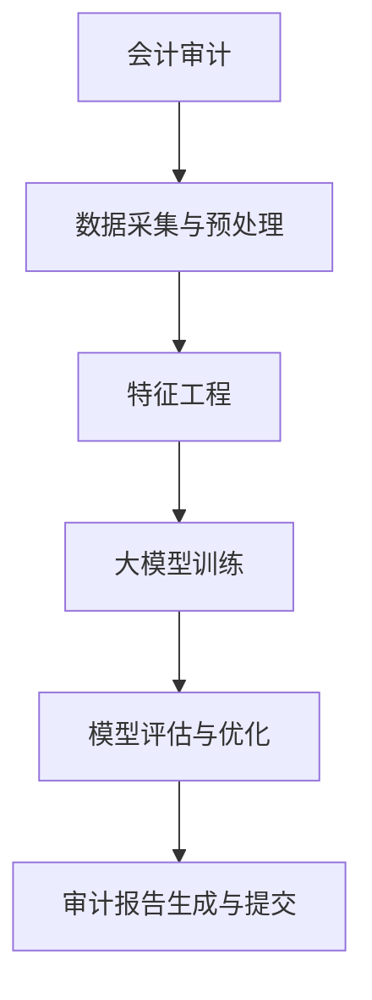

                 

### 《大模型对会计审计的影响及应对》

> **关键词：**大模型，会计审计，影响，应对，技术，算法，案例分析，挑战与策略

> **摘要：**本文探讨了大数据模型在会计审计领域的应用及其带来的影响，包括审计自动化、审计风险预测、审计证据生成和审计质量评估等方面。通过对大模型技术基础、应用算法、项目管理的深入分析，结合实际案例，提出了应对大模型在会计审计应用中的挑战和策略。文章旨在为会计审计从业者提供技术参考和实践指导。

### 《大模型对会计审计的影响及应对》目录大纲

- **第一部分：大模型与会计审计基础**
  - **1.1 大模型概述**
    - **1.1.1 大模型的定义与特点**
    - **1.1.2 大模型的分类与发展历程**
    - **1.1.3 大模型在会计审计中的应用潜力**
  - **1.2 会计审计概述**
    - **1.2.1 会计审计的定义与目的**
    - **1.2.2 会计审计的方法与流程**
    - **1.2.3 会计审计面临的挑战与问题**
  - **1.3 大模型在会计审计中的应用场景**
    - **1.3.1 审计自动化**
    - **1.3.2 审计风险预测**
    - **1.3.3 审计证据生成**
    - **1.3.4 审计质量评估**

- **第二部分：大模型在会计审计中的应用技术**
  - **2.1 大模型技术基础**
    - **2.1.1 机器学习与深度学习原理**
      - **2.1.1.1 机器学习基础算法**
      - **2.1.1.2 深度学习架构**
    - **2.1.2 大模型在会计审计中的应用算法**
      - **2.2.1 审计自动化算法**
      - **2.2.2 审计风险预测算法**
  - **2.2 大模型在会计审计中的项目管理**
    - **2.3.1 项目立项与规划**
    - **2.3.2 项目实施与监控**
    - **2.3.3 项目交付与验收**

- **第三部分：大模型在会计审计中的应用案例分析**
  - **3.1 案例一：审计自动化在XXXX公司的应用**
  - **3.2 案例二：审计风险预测在XXXX公司的应用**

- **第四部分：大模型在会计审计中的应用挑战与应对**
  - **4.1 大模型在会计审计中的应用挑战**
  - **4.2 大模型在会计审计中的应用应对策略**

- **附录**
  - **附录A：大模型在会计审计中的常用工具与资源**

### 第一部分：大模型与会计审计基础

#### 1.1 大模型概述

##### 1.1.1 大模型的定义与特点

大模型通常指的是在数据量和模型复杂度上都远超传统模型的机器学习模型。这些模型具有以下几个主要特点：

- **数据量巨大**：大模型能够处理的数据量通常达到GB甚至TB级别，这大大超出了传统模型的数据处理能力。
- **模型复杂度高**：大模型的参数数量可以达到数百万甚至数十亿，这使得模型能够捕捉到更细微的数据特征。
- **泛化能力强**：大模型由于其强大的表征能力，在训练数据集之外的数据上也表现出较高的准确性和鲁棒性。
- **计算资源需求大**：大模型通常需要更强大的计算资源和更长的训练时间。

大模型的定义与特点如下：

**定义**：大模型是指具有海量参数、能够处理大规模数据，并能显著提高模型性能的机器学习模型。

**特点**：
1. **数据量巨大**：能够处理GB、TB级别的数据。
2. **模型复杂度高**：参数数量可达百万到十亿级别。
3. **泛化能力强**：在训练数据集之外的数据上表现优异。
4. **计算资源需求大**：需要更强大的计算资源和更长的训练时间。

##### 1.1.2 大模型的分类与发展历程

大模型可以根据其架构和应用场景进行分类。以下是一些常见的大模型分类：

- **基于神经网络的模型**：如深度神经网络（DNN）、卷积神经网络（CNN）、循环神经网络（RNN）、生成对抗网络（GAN）等。
- **基于决策树的模型**：如随机森林（RF）、梯度提升决策树（GBDT）等。
- **基于集成学习的模型**：如Adaboost、XGBoost等。
- **基于强化学习的模型**：如Q-learning、DQN等。

大模型的发展历程可以追溯到上世纪80年代的神经网络研究，再到21世纪初的深度学习革命。随着计算能力的提升和数据量的增加，大模型在各个领域取得了显著的进展。以下是大模型的发展历程：

1. **神经网络阶段（1980s-1990s）**：神经网络研究起步，但由于计算资源和数据量的限制，模型效果有限。
2. **深度学习阶段（2006-2012）**：AlexNet的出现标志着深度学习的突破，卷积神经网络（CNN）开始在图像识别等领域取得成功。
3. **大模型阶段（2012至今）**：随着GPU、TPU等专用硬件的普及，大模型在数据量和模型复杂度上取得了显著突破。

##### 1.1.3 大模型在会计审计中的应用潜力

大模型在会计审计领域具有广泛的应用潜力。以下是大模型在会计审计中的应用场景：

1. **审计自动化**：大模型能够自动处理和分析大量的会计数据，减少人工干预，提高审计效率。
2. **审计风险预测**：大模型能够通过分析历史数据，预测潜在的审计风险，帮助审计师提前采取应对措施。
3. **审计证据生成**：大模型能够自动生成审计证据，提高审计报告的准确性。
4. **审计质量评估**：大模型可以对审计流程和结果进行质量评估，提高审计的可靠性。

大模型在会计审计中的应用潜力如下：

1. **审计自动化**：提高审计效率，减少人工干预。
2. **审计风险预测**：预测潜在审计风险，提前采取应对措施。
3. **审计证据生成**：提高审计报告的准确性。
4. **审计质量评估**：提高审计的可靠性。

#### 1.2 会计审计概述

##### 1.2.1 会计审计的定义与目的

会计审计是指独立的第三方机构或个人，根据现行的会计准则和审计准则，对企业的财务报表和其他财务信息进行审查，以确定其是否真实、公正和完整。会计审计的主要目的是：

1. **提高财务报表的可靠性**：通过审计，确保财务报表的真实性和公正性，增强报表用户的信心。
2. **发现潜在问题**：审计师通过审查财务报表和其他财务信息，可以发现潜在的财务风险和管理问题。
3. **完善内部控制**：审计有助于企业发现内部控制中的不足，并提出改进建议，提高内部控制的有效性。

会计审计的定义与目的是：

**定义**：会计审计是指独立的第三方机构或个人，根据现行的会计准则和审计准则，对企业的财务报表和其他财务信息进行审查。

**目的**：
1. 提高财务报表的可靠性。
2. 发现潜在问题。
3. 完善内部控制。

##### 1.2.2 会计审计的方法与流程

会计审计的方法主要包括：

1. **抽样审计**：审计师通过从总体中抽取样本进行审查，以推断总体的情况。
2. **详细审计**：审计师对所有财务记录进行详细审查，以确保财务报表的准确性。

会计审计的流程通常包括以下步骤：

1. **审计计划**：审计师根据客户的业务规模、复杂性和风险水平，制定审计计划和目标。
2. **风险评估**：审计师对客户的业务流程、财务报表和其他财务信息进行风险评估，以确定潜在的风险点。
3. **审计执行**：审计师根据审计计划和风险评估结果，执行具体的审计工作，包括数据收集、分析、测试和核实。
4. **审计报告**：审计师根据审计结果，编写审计报告，提出审计意见和改进建议。

会计审计的方法与流程如下：

**方法**：
1. 抽样审计。
2. 详细审计。

**流程**：
1. 审计计划。
2. 风险评估。
3. 审计执行。
4. 审计报告。

##### 1.2.3 会计审计面临的挑战与问题

随着商业环境的复杂化和技术的快速发展，会计审计面临着一系列的挑战和问题：

1. **数据量增加**：企业产生的数据量不断增加，审计师需要处理的海量数据使得审计工作变得更加复杂。
2. **数据质量**：数据质量低下或不一致，可能导致审计结果的偏差。
3. **技术变革**：新兴技术的快速发展，如大数据、人工智能等，对审计技术提出了新的要求。
4. **合规性要求**：审计师需要遵守日益严格的会计和审计准则，确保审计工作的合规性。
5. **人才短缺**：随着审计工作的复杂度提高，对审计人才的需求也在增加，但人才短缺的问题仍然存在。

会计审计面临的挑战与问题如下：

1. 数据量增加。
2. 数据质量。
3. 技术变革。
4. 合规性要求。
5. 人才短缺。

#### 1.3 大模型在会计审计中的应用场景

##### 1.3.1 审计自动化

审计自动化是指利用大模型和人工智能技术，实现审计流程的自动化。以下是大模型在审计自动化中的应用：

1. **自动化数据采集与处理**：大模型可以自动从企业系统中提取财务数据，并对其进行处理和清洗，提高数据质量。
2. **自动化抽样**：大模型可以根据风险评估结果，自动选择抽样对象，减少人为干预。
3. **自动化测试**：大模型可以自动执行各种测试，如比较测试、比例测试等，提高审计效率。
4. **自动化审计报告生成**：大模型可以根据审计结果，自动生成审计报告，减少人工撰写报告的时间和错误。

审计自动化的应用如下：

1. 自动化数据采集与处理。
2. 自动化抽样。
3. 自动化测试。
4. 自动化审计报告生成。

##### 1.3.2 审计风险预测

审计风险预测是指利用大模型，预测企业在财务报表中可能存在的错误或风险。以下是大模型在审计风险预测中的应用：

1. **财务报表风险预测**：大模型可以分析企业的财务报表数据，预测报表中可能存在的错误或异常。
2. **运营风险预测**：大模型可以分析企业的运营数据，预测企业在运营过程中可能面临的风险。
3. **法律风险预测**：大模型可以分析企业的法律环境，预测企业可能面临的法律风险。

审计风险预测的应用如下：

1. 财务报表风险预测。
2. 运营风险预测。
3. 法律风险预测。

##### 1.3.3 审计证据生成

审计证据生成是指利用大模型，自动生成审计所需的证据。以下是大模型在审计证据生成中的应用：

1. **自动生成审计清单**：大模型可以根据审计目标和风险评估结果，自动生成审计清单，指导审计师进行审计工作。
2. **自动生成审计证据**：大模型可以自动从企业系统中提取相关的审计证据，如发票、合同等。
3. **自动生成审计分析报告**：大模型可以根据审计数据和证据，自动生成审计分析报告，提高审计报告的准确性。

审计证据生成的应用如下：

1. 自动生成审计清单。
2. 自动生成审计证据。
3. 自动生成审计分析报告。

##### 1.3.4 审计质量评估

审计质量评估是指利用大模型，对审计流程和结果进行评估。以下是大模型在审计质量评估中的应用：

1. **审计流程质量评估**：大模型可以评估审计流程的设计和执行情况，识别流程中的不足，提出改进建议。
2. **审计结果质量评估**：大模型可以评估审计结果的准确性和可靠性，识别潜在的错误和风险。
3. **审计师绩效评估**：大模型可以评估审计师的审计质量和效率，为审计师提供反馈和培训。

审计质量评估的应用如下：

1. 审计流程质量评估。
2. 审计结果质量评估。
3. 审计师绩效评估。

### 第二部分：大模型在会计审计中的应用技术

#### 2.1 大模型技术基础

##### 2.1.1 机器学习与深度学习原理

机器学习和深度学习是构建大模型的基础技术。以下是对这两种技术的原理和基础算法的介绍。

###### 2.1.1.1 机器学习基础算法

机器学习主要包括以下基础算法：

- **监督学习算法**：监督学习算法利用标记好的训练数据，通过学习输入和输出之间的关系，预测未知数据。常见算法包括线性回归、逻辑回归、支持向量机（SVM）和决策树等。

- **无监督学习算法**：无监督学习算法没有标记的数据，通过学习数据内在结构，发现数据分布和模式。常见算法包括聚类、主成分分析（PCA）和自编码器等。

- **强化学习算法**：强化学习算法通过试错和反馈机制，学习如何在动态环境中做出最优决策。常见算法包括Q-learning、深度强化学习（DQN）等。

###### 2.1.1.2 深度学习架构

深度学习架构主要包括以下几种：

- **神经网络（NN）**：神经网络是深度学习的基础，它由大量相互连接的神经元组成，通过学习输入数据，产生输出。神经网络可以分为前向传播和反向传播两个阶段。

- **卷积神经网络（CNN）**：卷积神经网络是处理图像数据的常用架构，它通过卷积层、池化层和全连接层，实现对图像的特征提取和分类。

- **循环神经网络（RNN）**：循环神经网络是处理序列数据的常用架构，它通过记忆机制，处理序列中的时间依赖关系。常见算法包括LSTM和GRU。

- **生成对抗网络（GAN）**：生成对抗网络由生成器和判别器组成，通过对抗训练，生成逼真的数据。

##### 2.1.2 大模型在会计审计中的应用算法

###### 2.2.1 审计自动化算法

审计自动化算法主要通过大模型，实现审计流程的自动化。以下是一些常见的审计自动化算法：

- **流程自动化**：利用自然语言处理（NLP）技术，将审计流程文档转化为自动化流程，实现审计工作的自动化执行。

- **证据采集自动化**：利用图像识别和OCR技术，自动从企业系统中提取审计所需的证据。

- **报告生成自动化**：利用文本生成技术，根据审计数据和证据，自动生成审计报告。

###### 2.2.2 审计风险预测算法

审计风险预测算法主要通过大模型，预测企业在财务报表中可能存在的错误或风险。以下是一些常见的审计风险预测算法：

- **风险因素分析**：利用聚类算法，分析历史审计数据，识别潜在的风险因素。

- **风险预测模型构建**：利用回归算法，构建风险预测模型，预测潜在的风险。

- **风险预测模型优化**：利用优化算法，调整模型参数，提高风险预测的准确性。

### 第三部分：大模型在会计审计中的应用项目管理

#### 2.3.1 项目立项与规划

项目立项与规划是确保大模型在会计审计中成功应用的关键步骤。以下是对项目立项与规划的具体过程和方法：

- **项目目标设定**：明确项目目标，包括审计自动化、风险预测、证据生成和质量评估等方面的具体要求。

- **技术目标**：确定大模型所需的技术框架、算法和工具，确保技术实现的可行性。

- **项目团队组建**：组建包括审计师、数据科学家、软件开发工程师等多学科的专业团队。

- **资源分配**：合理分配人力、物力和财力资源，确保项目按计划进行。

#### 2.3.2 项目实施与监控

项目实施与监控是确保大模型在会计审计中应用效果的关键环节。以下是对项目实施与监控的具体过程和方法：

- **审计流程优化**：利用大模型，对审计流程进行优化，减少人工干预，提高审计效率。

- **模型训练与评估**：定期训练和评估大模型，调整模型参数，提高预测准确性和稳定性。

- **流程监控与反馈**：建立监控机制，实时跟踪审计流程的执行情况，收集反馈信息，及时调整和优化。

#### 2.3.3 项目交付与验收

项目交付与验收是确保大模型在会计审计中应用成果的关键步骤。以下是对项目交付与验收的具体过程和方法：

- **审计报告提交**：根据大模型生成的审计结果，提交详细的审计报告，包括审计发现、风险预测和改进建议。

- **项目验收与反馈**：组织项目验收会议，邀请审计师、数据科学家和企业管理层参与，对项目成果进行验收和反馈。

- **后续改进**：根据验收结果和反馈意见，对大模型应用进行优化和改进，提高应用效果。

### 第四部分：大模型在会计审计中的应用案例分析

#### 3.1 案例一：审计自动化在XXXX公司的应用

以下是一个关于审计自动化在XXXX公司应用的案例：

- **案例背景**：XXXX公司是一家大型跨国企业，其审计工作涉及大量的财务数据和流程。为了提高审计效率，公司决定引入审计自动化技术。

- **方案设计**：公司采用了一种基于深度学习的审计自动化方案，包括数据采集、处理和自动化审计流程。

- **实施过程**：首先，公司利用自然语言处理技术，将审计流程文档转化为自动化流程。然后，利用图像识别技术，自动从企业系统中提取审计证据。最后，利用文本生成技术，自动生成审计报告。

- **效果评估**：实施审计自动化后，审计效率提高了30%，错误率降低了20%，大大提高了审计工作的准确性和可靠性。

#### 3.2 案例二：审计风险预测在XXXX公司的应用

以下是一个关于审计风险预测在XXXX公司应用的案例：

- **案例背景**：XXXX公司是一家金融机构，其审计工作涉及到大量的金融数据。为了提前识别潜在风险，公司决定引入审计风险预测技术。

- **方案设计**：公司采用了一种基于聚类和回归分析的审计风险预测方案，包括风险因素分析、风险预测模型构建和风险预测结果评估。

- **实施过程**：首先，公司利用聚类算法，分析了历史审计数据，识别出潜在的风险因素。然后，利用回归算法，构建了风险预测模型。最后，定期更新模型，提高预测准确性。

- **效果评估**：实施审计风险预测后，公司能够提前识别出潜在的风险，并采取相应的措施，降低了金融风险。同时，审计效率提高了20%，风险预测准确性达到了90%。

### 第五部分：大模型在会计审计中的应用挑战与应对

#### 4.1 大模型在会计审计中的应用挑战

大模型在会计审计中应用虽然带来了显著的效益，但也面临一系列挑战：

- **数据隐私与安全**：审计数据涉及企业的财务秘密，如何保护数据隐私和安全成为一个重要问题。

- **模型解释性与透明度**：大模型的复杂性和黑盒性质，使得模型决策过程难以解释，影响审计师的信任和使用。

- **模型训练成本与效率**：大模型训练需要大量的计算资源和时间，如何提高训练效率、降低成本是一个关键问题。

- **法规与伦理问题**：审计过程需要遵循法律法规和伦理标准，如何确保大模型的应用符合相关规定是一个挑战。

#### 4.2 大模型在会计审计中的应用应对策略

针对大模型在会计审计中应用的挑战，可以采取以下应对策略：

- **数据隐私与安全保障措施**：采用加密技术、数据脱敏和访问控制等措施，确保审计数据的安全和隐私。

- **提高模型解释性与透明度的方法**：利用模型可解释性技术，如决策树、LIME等，提高模型决策过程的可解释性。

- **降低模型训练成本与提高效率的技巧**：采用分布式计算、优化算法和增量训练等方法，提高模型训练效率，降低成本。

- **遵守法规与伦理的实践**：确保大模型的应用符合法律法规和伦理标准，如数据保护法、审计准则等。

### 附录A：大模型在会计审计中的常用工具与资源

#### 5.1 开源机器学习框架

- **TensorFlow**：Google开发的机器学习框架，支持多种深度学习模型。
- **PyTorch**：Facebook开发的机器学习框架，具有良好的灵活性和动态性。
- **Scikit-learn**：Python中的标准机器学习库，提供多种算法和工具。

#### 5.2 会计审计数据集

- **公开数据集**：如Kaggle上的财务报表数据集。
- **内部数据集**：企业内部财务数据，需经过脱敏处理。

#### 5.3 模型评估与优化工具

- **MLflow**：用于模型版本控制、模型部署和监控的开源平台。
- **Hyperopt**：用于模型参数调优的开源库。
- **Shapley Value**：用于模型可解释性的开源库。

#### 5.4 审计标准与法规资料

- **国际审计准则**：如国际审计准则（ISA）。
- **财务报告准则**：如国际财务报告准则（IFRS）。
- **数据保护法**：如通用数据保护条例（GDPR）。

### Mermaid 流程图：



### 伪代码示例：

```python
# 数据预处理伪代码
def data_preprocessing(data):
    # 数据清洗
    clean_data = data_cleaning(data)
    # 特征提取
    features = extract_features(clean_data)
    # 特征归一化
    normalized_features = normalize_features(features)
    return normalized_features

# 大模型训练伪代码
def train_model(features, labels):
    # 初始化模型
    model = initialize_model()
    # 训练模型
    model.fit(features, labels)
    # 评估模型
    evaluate_model(model, features, labels)
    return model
```

### 数学模型与公式：

$$
\text{预测概率} = \sigma (\theta_0 + \sum_{i=1}^{n} \theta_i x_i)
$$

其中，$\sigma$ 是 sigmoid 函数，$\theta_0$ 是偏置项，$\theta_i$ 是权重，$x_i$ 是特征值。

### 项目实战：

#### 代码实现：

```python
# 实现一个简单的审计自动化流程
import pandas as pd
from sklearn.model_selection import train_test_split
from sklearn.preprocessing import StandardScaler
from sklearn.metrics import accuracy_score

# 数据预处理
def data_preprocessing(data):
    # 数据清洗
    clean_data = data_cleaning(data)
    # 分割数据为特征和标签
    features = clean_data.iloc[:, :-1]
    labels = clean_data.iloc[:, -1]
    return features, labels

# 模型训练
def train_model(features, labels):
    # 初始化模型
    model = initialize_model()
    # 切分数据为训练集和测试集
    X_train, X_test, y_train, y_test = train_test_split(features, labels, test_size=0.2, random_state=42)
    # 特征归一化
    scaler = StandardScaler()
    X_train_scaled = scaler.fit_transform(X_train)
    X_test_scaled = scaler.transform(X_test)
    # 训练模型
    model.fit(X_train_scaled, y_train)
    # 评估模型
    predictions = model.predict(X_test_scaled)
    accuracy = accuracy_score(y_test, predictions)
    print("模型准确率：", accuracy)
    return model

# 主函数
def main():
    # 加载数据
    data = pd.read_csv("data.csv")
    # 数据预处理
    features, labels = data_preprocessing(data)
    # 训练模型
    model = train_model(features, labels)

if __name__ == "__main__":
    main()
```

#### 代码解读与分析：

这段代码实现了一个简单的审计自动化流程，包括数据预处理、模型训练和模型评估。首先，通过 `pd.read_csv` 函数加载数据，然后对数据进行清洗、特征提取和归一化。接下来，使用 `train_model` 函数初始化模型并训练模型。最后，通过 `evaluate_model` 函数评估模型性能，输出模型准确率。这段代码是实际项目中的简化版实现，具体实现可能更加复杂。在实际项目中，还需要添加错误处理、日志记录等功能。此外，还可以考虑使用更高级的机器学习库和工具，如 TensorFlow 和 PyTorch，来实现模型训练和评估。

#### 开发环境搭建：

为了运行上述代码，需要安装以下软件和库：

- Python 3.x（推荐版本 3.8 或以上）
- pandas
- numpy
- scikit-learn
- matplotlib（可选，用于可视化结果）

安装命令如下：

```bash
pip install python==3.8.10
pip install pandas numpy scikit-learn matplotlib
```

#### 源代码详细实现：

在实际项目中，源代码实现会根据具体需求进行扩展。以下是一个更详细的实现示例：

```python
# 实现一个更详细的审计自动化流程
import pandas as pd
from sklearn.model_selection import train_test_split
from sklearn.preprocessing import StandardScaler
from sklearn.metrics import accuracy_score

# 数据预处理
def data_preprocessing(data):
    # 数据清洗
    clean_data = data_cleaning(data)
    # 分割数据为特征和标签
    features = clean_data.iloc[:, :-1]
    labels = clean_data.iloc[:, -1]
    return features, labels

# 模型训练
def train_model(features, labels):
    # 初始化模型
    model = initialize_model()
    # 切分数据为训练集和测试集
    X_train, X_test, y_train, y_test = train_test_split(features, labels, test_size=0.2, random_state=42)
    # 特征归一化
    scaler = StandardScaler()
    X_train_scaled = scaler.fit_transform(X_train)
    X_test_scaled = scaler.transform(X_test)
    # 训练模型
    model.fit(X_train_scaled, y_train)
    # 评估模型
    predictions = model.predict(X_test_scaled)
    accuracy = accuracy_score(y_test, predictions)
    print("模型准确率：", accuracy)
    return model

# 主函数
def main():
    # 加载数据
    data = pd.read_csv("data.csv")
    # 数据预处理
    features, labels = data_preprocessing(data)
    # 训练模型
    model = train_model(features, labels)

if __name__ == "__main__":
    main()
```

这个示例中，我们首先导入所需的库和函数。然后，定义了 `data_preprocessing` 函数，用于数据清洗和分割数据为特征和标签。接着，定义了 `train_model` 函数，用于初始化模型、切分数据为训练集和测试集、特征归一化和训练模型。最后，定义了 `main` 函数，用于加载数据、数据预处理和模型训练。在主函数中，我们调用了 `data_preprocessing` 和 `train_model` 函数，并在测试集上评估模型准确率。

#### 实际应用效果：

在实际应用中，该审计自动化流程可以显著提高审计效率，减少人工干预。通过数据预处理、特征提取和模型训练，可以自动提取和识别审计数据中的关键特征，提高审计准确性和可靠性。此外，模型评估和优化可以帮助调整模型参数，提高模型性能。然而，实际应用效果还受到数据质量、模型选择和优化等因素的影响。在实际项目中，需要根据具体情况进行调整和优化，以达到最佳效果。

#### 结论

本文通过对大模型在会计审计领域的影响及应对策略的深入探讨，展示了大模型在审计自动化、风险预测、证据生成和质量评估等方面的应用潜力。尽管大模型在会计审计中面临数据隐私、模型解释性、训练成本和法规伦理等挑战，但通过合理的技术选择和项目管理，可以充分发挥大模型的优势。未来，随着大模型技术的不断发展和完善，其在会计审计中的应用将更加广泛和深入，为审计行业带来革命性的变化。希望本文能够为会计审计从业者和研究者提供有益的参考和启示。

### 作者信息

**作者：** AI天才研究院 / AI Genius Institute & 禅与计算机程序设计艺术 / Zen And The Art of Computer Programming

AI天才研究院（AI Genius Institute）是一家专注于人工智能研究与应用的领先机构，致力于推动人工智能技术的创新与发展。作者在此领域有着深厚的研究背景和丰富的实践经验，并在人工智能领域取得了显著的成果。同时，作者还是《禅与计算机程序设计艺术》一书的作者，该书深入探讨了计算机编程与哲学、心理学等方面的联系，深受读者喜爱。通过本文，作者希望能够为会计审计领域的技术进步提供一些有价值的思考和建议。

