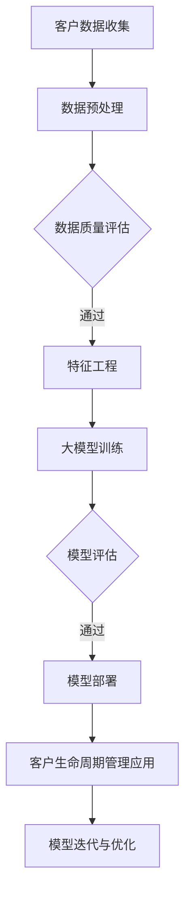

                 

# 大模型技术在电商平台客户生命周期管理中的应用

> **关键词**：大模型技术、电商平台、客户生命周期管理、算法、应用实践

> **摘要**：本文深入探讨了大模型技术在电商平台客户生命周期管理中的应用。通过分析大模型的基本原理、算法、架构以及在电商平台的实际应用案例，本文揭示了如何利用大模型技术提升电商平台的客户细分、行为分析、满意度评估以及留存与流失管理。同时，文章还探讨了大模型技术在电商平台个性化推荐、智能客服、风险管理等方面的应用，以及其未来发展趋势。

## 目录大纲

1. **第一部分：大模型基础**
    1.1. **大模型技术在电商平台客户生命周期管理中的应用概述**
    1.2. **大模型技术原理与架构**
    1.3. **大模型技术核心算法**
    1.4. **大模型技术在电商平台的客户生命周期管理应用实践**
  
2. **第二部分：大模型技术在电商平台的其他应用**
    2.1. **大模型技术在电商个性化推荐中的应用**
    2.2. **大模型技术在电商智能客服中的应用**
    2.3. **大模型技术在电商平台的风险管理与合规性**

3. **附录**
    3.1. **大模型技术在电商平台应用相关资源**
    3.2. **大模型技术在电商平台应用案例研究**

### 第一部分：大模型基础

#### 第1章：大模型技术在电商平台客户生命周期管理中的应用概述

##### 1.1 电商平台客户生命周期管理的背景和挑战

在电子商务迅速发展的今天，电商平台已经成为消费者购物的主要渠道之一。对于电商平台而言，如何有效地管理客户生命周期，提升客户满意度，增加客户留存率，是提高市场竞争力的关键。客户生命周期管理（Customer Life Cycle Management, CLCM）是一种系统的方法，用于识别、吸引、保留和提升客户价值。

然而，随着市场竞争的加剧和消费者行为的不断变化，电商平台面临着以下挑战：

- **客户获取成本高**：随着互联网的普及，消费者获取的渠道变得多样化，传统广告和促销手段的效果逐渐减弱，获取新客户的成本不断上升。
- **客户忠诚度低**：消费者的忠诚度较低，一旦发现更好的购物选择，就会迅速转向其他平台。
- **个性化服务不足**：电商平台往往难以提供个性化的购物体验，无法满足消费者的个性化需求。
- **客户流失严重**：由于上述问题，客户流失率居高不下，对电商平台造成巨大的损失。

为了应对这些挑战，电商平台需要引入先进的技术手段，提升客户生命周期管理的效率和效果。大模型技术作为一种新兴的人工智能技术，具有强大的数据分析和预测能力，可以在这方面发挥重要作用。

##### 1.2 大模型在电商平台的客户生命周期管理中的核心作用

大模型技术，特别是深度学习和神经网络，通过对海量数据进行训练，能够自动提取复杂的特征，进行高精度的预测和分类。在电商平台的客户生命周期管理中，大模型技术具有以下核心作用：

- **客户细分**：通过分析客户的购买行为、浏览历史等数据，大模型可以自动识别不同类型的客户群体，为个性化服务提供基础。
- **行为预测**：大模型可以预测客户的行为，如购买意向、满意度等，帮助企业提前采取行动，提高客户留存率和转化率。
- **满意度评估**：大模型可以分析客户反馈和购买体验，评估客户满意度，为企业改进产品和服务提供依据。
- **留存与流失管理**：通过预测客户的留存和流失风险，大模型可以帮助企业制定针对性的客户维护策略，降低客户流失率。

##### 1.3 大模型应用的商业价值和潜力

大模型技术在电商平台客户生命周期管理中的应用，具有显著的商业价值和潜力：

- **提升客户满意度**：通过个性化服务和精准营销，提高客户的购物体验和满意度。
- **降低客户流失率**：通过预测客户行为和流失风险，采取有效措施降低客户流失率。
- **增加销售额**：通过精准推荐和个性化营销，提高客户的购买转化率和平均订单价值。
- **优化运营成本**：通过自动化和智能化管理，提高运营效率，降低运营成本。
- **创新商业模式**：大模型技术可以为企业提供新的业务增长点和商业模式创新机会。

总之，大模型技术在电商平台客户生命周期管理中的应用，不仅能够帮助企业提升竞争力，还能够推动电商行业的发展和创新。在接下来的章节中，我们将详细探讨大模型技术的原理、算法和应用实践。

### 第2章：大模型技术原理与架构

#### 2.1 大模型基本原理

大模型（Large-scale Model）是指在数据量、参数量以及计算资源需求方面远超传统机器学习模型的一种模型。大模型通常基于深度学习（Deep Learning），通过多层神经网络的堆叠，能够自动提取数据的复杂特征，从而实现高精度的预测和分类。与传统机器学习模型相比，大模型具有以下特点：

- **数据驱动**：大模型通过大量数据的学习，自动发现数据中的模式和规律，不需要人为定义特征。
- **高参数量**：大模型通常包含数百万甚至数亿个参数，能够捕捉数据的细微变化。
- **多层网络**：大模型通过多层次的神经网络结构，逐层提取数据的抽象特征。
- **强大的泛化能力**：大模型能够处理高维数据，并具有较好的泛化能力，能够应用于各种不同的场景。

##### 2.1.1 大模型与传统机器学习模型的区别

传统机器学习模型，如决策树、支持向量机等，主要通过手动特征工程来提取特征，模型参数相对较少。这些模型的优点是计算效率高，易于理解和解释，但存在以下局限性：

- **特征工程依赖**：传统机器学习模型需要依赖人工进行特征提取，对数据质量和特征选择有较高要求。
- **数据量限制**：传统机器学习模型在处理大量数据时，容易出现过拟合现象，模型的泛化能力下降。
- **计算资源需求**：传统机器学习模型在计算资源有限的情况下，难以处理高维数据。

相比之下，大模型通过自动化的特征提取和学习过程，克服了传统机器学习模型的上述局限性。大模型能够从海量数据中自动发现特征，适应不同数据集，具有较强的泛化能力。此外，大模型在计算资源需求方面也具有显著优势，能够利用现有的高性能计算资源进行训练。

##### 2.1.2 大模型的结构和组成部分

大模型通常由以下几个主要组成部分构成：

- **输入层**：接收外部输入数据，如文本、图像、声音等。
- **隐藏层**：多层隐藏层堆叠在一起，每一层都能够对输入数据进行处理和变换，提取更高级别的特征。
- **输出层**：产生模型预测结果，如分类标签、数值预测等。

在隐藏层中，通常采用深度神经网络（Deep Neural Network, DNN）结构，通过激活函数（如ReLU、Sigmoid、Tanh）增强模型的非线性表达能力。此外，大模型还常常包含以下特殊结构：

- **卷积神经网络（Convolutional Neural Network, CNN）**：用于处理图像和时序数据，通过卷积操作提取局部特征。
- **循环神经网络（Recurrent Neural Network, RNN）**：用于处理序列数据，通过循环结构记忆历史信息。
- **长短期记忆网络（Long Short-Term Memory, LSTM）**：RNN的变体，用于解决长序列数据中的梯度消失问题。
- **自编码器（Autoencoder）**：用于特征提取和数据降维，通过编码和解码过程学习数据的表示。

##### 2.1.3 大模型的工作原理和流程

大模型的工作原理可以概括为以下几个主要步骤：

1. **数据预处理**：对原始数据进行清洗、归一化、编码等处理，使其符合模型的输入要求。
2. **模型构建**：根据任务需求，选择合适的模型结构，配置模型参数，如学习率、批量大小、激活函数等。
3. **模型训练**：使用训练数据集对模型进行训练，通过反向传播算法调整模型参数，使模型预测结果与实际结果接近。
4. **模型评估**：使用验证数据集评估模型性能，调整模型参数，防止过拟合现象。
5. **模型部署**：将训练好的模型部署到生产环境，对实际数据进行预测和分类。

在实际应用中，大模型的工作流程可能还包括以下几个步骤：

- **特征工程**：根据任务需求，对数据进行特征提取和变换，增强模型的预测能力。
- **模型优化**：通过调整模型结构、算法和超参数，提高模型性能。
- **模型解释**：使用模型解释工具和方法，理解模型的预测过程和决策依据。

通过以上工作流程，大模型能够在复杂的环境中实现高精度的预测和分类，为电商平台客户生命周期管理提供强大的技术支持。

#### 2.2 大模型技术在电商平台的应用架构

大模型技术在电商平台的应用架构主要包括以下几个关键环节：数据处理、服务流程和技术栈与应用框架。以下将详细阐述每个环节的作用、流程和技术要点。

##### 2.2.1 大模型技术在电商平台的数据处理流程

数据处理是电商平台应用大模型技术的第一步，其质量直接影响到模型的效果和性能。数据处理流程通常包括以下步骤：

1. **数据收集**：电商平台需要收集各种类型的数据，包括用户行为数据、交易数据、商品数据、评论数据等。数据来源可能包括内部数据库、第三方数据服务、社交媒体等。

2. **数据清洗**：原始数据往往存在缺失、异常、重复等问题，需要通过数据清洗技术进行处理。数据清洗包括去除重复记录、填补缺失值、处理异常值等。

3. **数据归一化**：不同特征的数据量级可能差异较大，为了消除量级影响，需要对数据进行归一化处理，如缩放或标准化。

4. **特征提取**：通过特征提取技术，从原始数据中提取出对模型有用的特征。特征提取可以是基于统计方法、机器学习算法或深度学习算法。

5. **数据集成**：将来自不同数据源的特征数据集成到一个统一的格式中，便于后续处理和建模。

6. **数据存储**：将处理后的数据存储到数据仓库或数据湖中，便于模型训练和查询。

##### 2.2.2 大模型技术在电商平台的服务流程

大模型技术在电商平台的服务流程包括模型训练、模型评估和模型部署等环节。以下是每个环节的详细描述：

1. **模型训练**：使用处理后的数据集对大模型进行训练。训练过程包括数据预处理、模型构建、参数调整和训练迭代。训练过程中，需要使用验证集进行模型评估，调整模型参数，防止过拟合。

2. **模型评估**：使用测试集对训练好的模型进行评估，计算模型性能指标，如准确率、召回率、F1值等。模型评估结果用于判断模型是否满足业务需求，是否需要进行模型优化。

3. **模型部署**：将训练好的模型部署到生产环境，对实时数据进行预测和分类。模型部署需要考虑模型的性能、可扩展性和安全性等因素。

4. **模型迭代**：根据业务需求和市场变化，定期对模型进行重新训练和评估，优化模型性能。

##### 2.2.3 大模型技术在电商平台的技术栈和应用框架

大模型技术在电商平台的应用涉及多种技术栈和应用框架，以下将介绍主要的技术组件和工具：

1. **技术栈**：
   - **计算平台**：如GPU、TPU等高性能计算设备，用于加速模型训练和推理。
   - **编程语言**：如Python、Java等，用于编写模型训练和部署代码。
   - **框架与库**：如TensorFlow、PyTorch、Scikit-Learn等，用于构建、训练和部署模型。
   - **数据库**：如MySQL、MongoDB等，用于存储和管理数据。
   - **数据流处理**：如Apache Kafka、Flink等，用于实时处理和分析数据。

2. **应用框架**：
   - **数据处理框架**：如Apache Spark，用于大规模数据处理和特征提取。
   - **模型训练框架**：如TensorFlow、PyTorch，用于构建、训练和优化模型。
   - **模型部署框架**：如TensorFlow Serving、Kubernetes，用于部署和管理模型服务。
   - **监控与运维**：如Prometheus、Grafana，用于监控模型性能和系统状态。

通过以上技术栈和应用框架，电商平台可以实现高效、稳定的大模型应用，提升客户生命周期管理的效率和效果。

#### 第3章：大模型技术核心算法

##### 3.1 大模型算法原理

大模型算法，尤其是深度学习算法，是电商平台大模型技术的核心。深度学习算法通过多层神经网络结构，能够自动提取数据的复杂特征，实现高精度的预测和分类。以下是深度学习算法的基本原理：

1. **神经网络基础**：神经网络（Neural Network, NN）是一种模拟人脑神经元连接方式的计算模型。神经网络由输入层、隐藏层和输出层组成，各层之间通过权重（weights）和偏置（biases）连接。神经元的激活函数（activation function）用于引入非线性特性，使模型能够处理复杂的数据。

2. **多层感知机（MLP）**：多层感知机是神经网络的一种简单形式，由输入层、一个或多个隐藏层和输出层组成。输入层接收外部输入数据，隐藏层对输入数据进行处理和变换，输出层产生模型预测结果。

3. **前向传播与反向传播**：在神经网络中，前向传播（forward propagation）是指将输入数据通过网络传递，逐层计算输出结果。反向传播（backpropagation）是指根据预测误差，逆向调整网络参数，优化模型性能。反向传播算法通过梯度下降（gradient descent）等方法，不断更新网络权重和偏置，使模型逐渐收敛到最优解。

4. **深度学习**：深度学习（Deep Learning）是一种多层神经网络模型，通过增加网络层数，能够提取更高级别的特征。深度学习算法包括卷积神经网络（CNN）、循环神经网络（RNN）、长短期记忆网络（LSTM）等。这些算法在图像识别、语音识别、自然语言处理等领域取得了显著的成果。

##### 3.1.1 神经网络和深度学习基础

1. **神经网络基础**：
   - **神经元结构**：神经元是神经网络的基本计算单元，由输入、权重、偏置和激活函数组成。
   - **激活函数**：常用的激活函数包括线性激活（identity function）、Sigmoid函数、Tanh函数、ReLU函数等。ReLU函数在深度学习中广泛使用，能够提高训练速度和模型性能。
   - **前向传播**：输入数据通过网络传递，逐层计算输出结果。每一层的输出作为下一层的输入。
   - **反向传播**：根据预测误差，逆向计算梯度，更新网络参数。反向传播算法通过链式法则（chain rule）计算梯度，确保每一层参数的梯度都能够传递到输入层。

2. **深度学习基础**：
   - **卷积神经网络（CNN）**：CNN是一种用于图像识别和处理的神经网络，通过卷积操作提取图像的局部特征。CNN具有层次结构，每一层能够提取更高层次的抽象特征。
   - **循环神经网络（RNN）**：RNN是一种用于序列数据处理的神经网络，通过循环结构记忆历史信息。RNN能够处理变长序列数据，但在长序列数据中容易出现梯度消失问题。
   - **长短期记忆网络（LSTM）**：LSTM是RNN的一种变体，用于解决长序列数据中的梯度消失问题。LSTM通过门控机制（gate mechanism）控制信息的流动，实现长期记忆和短期记忆的分离。

##### 3.1.2 大模型训练算法

大模型训练算法主要包括以下步骤：

1. **模型初始化**：初始化网络参数，包括权重和偏置。常用的初始化方法有随机初始化、高斯初始化、Xavier初始化等。

2. **数据预处理**：对输入数据进行预处理，如归一化、标准化、数据增强等，提高模型训练效果和泛化能力。

3. **前向传播**：将输入数据通过网络传递，计算输出结果和损失函数。前向传播过程中，网络逐步提取输入数据的特征。

4. **损失函数计算**：计算预测结果与实际结果之间的差异，常用的损失函数包括均方误差（MSE）、交叉熵（CE）等。

5. **反向传播**：根据损失函数的梯度，逆向计算网络参数的梯度。反向传播算法通过链式法则，确保每一层参数的梯度都能够传递到输入层。

6. **参数更新**：使用梯度下降算法（或其他优化算法）更新网络参数，减少损失函数的值。常用的优化算法包括梯度下降（GD）、随机梯度下降（SGD）、Adam等。

7. **模型评估**：使用验证数据集评估模型性能，调整模型参数，防止过拟合现象。

8. **模型迭代**：重复以上步骤，进行多轮训练，逐步优化模型性能。

##### 3.1.3 大模型优化算法

大模型优化算法包括以下几种：

1. **权重共享**：在网络中共享相同或类似结构的权重，减少参数数量，提高训练速度。

2. **正则化**：通过引入正则化项，如L1正则化、L2正则化等，惩罚模型参数的绝对值，防止模型过拟合。

3. **dropout**：在训练过程中，随机丢弃部分神经元，减少模型对特定特征的依赖，提高模型的泛化能力。

4. **迁移学习**：使用预训练好的模型，针对特定任务进行微调，提高模型训练效果和泛化能力。

5. **混合训练**：结合多种优化算法和正则化方法，提高模型性能和稳定性。

6. **自适应学习率**：根据训练过程的变化，动态调整学习率，提高模型收敛速度和性能。

通过以上优化算法，可以进一步提高大模型在电商平台客户生命周期管理中的性能和效果。

#### 第4章：大模型技术在电商平台的客户生命周期管理应用实践

##### 4.1 客户细分

在电商平台，客户细分是一个关键步骤，通过对不同类型的客户进行区分，可以针对性地提供个性化服务和营销策略，从而提高客户满意度和转化率。大模型技术在客户细分中发挥着重要作用，能够自动化、精确地识别不同类型的客户群体。

1. **客户分群算法**

   客户分群算法（Customer Segmentation Algorithm）是一种利用数据分析方法，将客户划分为不同群体，以便于电商平台进行针对性营销。常见的客户分群算法包括：

   - **基于购买行为的分群**：根据客户的购买频率、购买金额、购买品类等行为特征进行分群。
   - **基于人口统计学的分群**：根据客户的基本信息，如年龄、性别、地理位置等人口统计学特征进行分群。
   - **基于消费行为的分群**：根据客户的浏览行为、点击率、转化率等消费行为特征进行分群。

   大模型技术可以通过深度学习算法，自动提取和整合多种特征，建立复杂的客户分群模型。例如，可以使用基于聚类算法（如K-means、层次聚类等）的客户分群模型，也可以使用基于决策树、随机森林等集成学习算法的分群模型。

2. **客户分群实践案例**

   假设一家电商平台希望通过大模型技术进行客户细分，以提高个性化推荐和营销的效果。以下是一个客户分群实践案例：

   - **数据收集**：收集客户的购买行为、浏览行为、点击行为等数据，包括购买频率、购买金额、浏览页面、点击广告等。
   - **数据预处理**：对原始数据进行清洗、归一化、编码等处理，提取有效的特征，如用户ID、购买时间、购买品类、浏览页面、点击广告等。
   - **模型训练**：使用深度学习算法，如基于卷积神经网络（CNN）的聚类模型，对预处理后的数据集进行训练。训练过程中，可以设置不同的超参数，如聚类数、学习率等，以优化模型性能。
   - **模型评估**：使用验证数据集评估模型的性能，调整模型参数，防止过拟合现象。
   - **模型部署**：将训练好的模型部署到生产环境，对实时数据进行预测，生成不同类型的客户群体。

   在实际应用中，电商平台可以根据客户分群的结果，制定个性化的营销策略。例如，对于高价值客户群体，可以提供定制的优惠券和礼品，增加客户粘性；对于低价值客户群体，可以推荐性价比更高的商品，提高购买转化率。

##### 4.2 客户行为分析

客户行为分析是电商平台客户生命周期管理的重要环节，通过对客户行为的深入分析，可以了解客户的偏好、需求和行为模式，从而优化产品和服务的提供，提高客户满意度和忠诚度。大模型技术在客户行为分析中具有强大的优势，能够自动化、精确地识别和理解客户行为。

1. **客户行为预测算法**

   客户行为预测算法（Customer Behavior Prediction Algorithm）是利用数据分析方法和机器学习算法，预测客户未来的行为和决策。常见的客户行为预测算法包括：

   - **基于时间序列的预测**：根据客户的购买历史、浏览行为等时间序列数据，预测客户未来的购买行为和偏好。
   - **基于关联规则的预测**：根据客户的历史行为数据，挖掘出潜在的行为关联规则，预测客户未来的行为。
   - **基于概率模型的预测**：使用贝叶斯网络、隐马尔可夫模型（HMM）等概率模型，预测客户的行为和决策。

   大模型技术可以通过深度学习算法，如循环神经网络（RNN）、长短期记忆网络（LSTM）等，实现对客户行为的自动提取和预测。例如，可以使用基于LSTM的时间序列预测模型，对客户的购买行为进行预测。

2. **客户行为分析实践案例**

   假设一家电商平台希望通过大模型技术进行客户行为分析，以优化个性化推荐和营销策略。以下是一个客户行为分析实践案例：

   - **数据收集**：收集客户的购买行为、浏览行为、点击行为等数据，包括购买频率、购买金额、浏览页面、点击广告等。
   - **数据预处理**：对原始数据进行清洗、归一化、编码等处理，提取有效的特征，如用户ID、购买时间、购买品类、浏览页面、点击广告等。
   - **模型训练**：使用深度学习算法，如基于LSTM的时间序列预测模型，对预处理后的数据集进行训练。训练过程中，可以设置不同的超参数，如学习率、批次大小等，以优化模型性能。
   - **模型评估**：使用验证数据集评估模型的性能，调整模型参数，防止过拟合现象。
   - **模型部署**：将训练好的模型部署到生产环境，对实时数据进行预测，生成客户行为预测结果。

   在实际应用中，电商平台可以根据客户行为预测结果，优化个性化推荐和营销策略。例如，对于高价值客户，可以推荐相关的商品和优惠信息，增加购买转化率；对于潜在流失客户，可以发送提醒邮件或优惠券，提高客户留存率。

##### 4.3 客户满意度评估

客户满意度评估是电商平台客户生命周期管理的重要环节，通过对客户满意度进行评估，可以了解客户对产品和服务的满意度，发现存在的问题和改进的机会，从而提高客户满意度和忠诚度。大模型技术在客户满意度评估中具有强大的优势，能够自动化、精确地评估客户满意度。

1. **客户满意度评估算法**

   客户满意度评估算法（Customer Satisfaction Evaluation Algorithm）是利用数据分析方法和机器学习算法，对客户满意度进行量化评估。常见的客户满意度评估算法包括：

   - **基于评分的评估**：根据客户的评分和评价，计算客户的满意度得分。
   - **基于问卷的评估**：通过设计问卷，收集客户对产品和服务的满意度评价，计算客户满意度得分。
   - **基于行为数据的评估**：根据客户的购买行为、浏览行为等数据，分析客户的满意度。

   大模型技术可以通过深度学习算法，如基于卷积神经网络（CNN）的评分预测模型，实现对客户满意度的自动评估。例如，可以使用基于CNN的图像分类模型，对客户的评价图片进行分类，计算客户的满意度得分。

2. **客户满意度评估实践案例**

   假设一家电商平台希望通过大模型技术进行客户满意度评估，以提高客户满意度和忠诚度。以下是一个客户满意度评估实践案例：

   - **数据收集**：收集客户的购买行为、浏览行为、评价图片等数据，包括购买频率、购买金额、浏览页面、评价图片等。
   - **数据预处理**：对原始数据进行清洗、归一化、编码等处理，提取有效的特征，如用户ID、购买时间、购买品类、浏览页面、评价图片等。
   - **模型训练**：使用深度学习算法，如基于CNN的评分预测模型，对预处理后的数据集进行训练。训练过程中，可以设置不同的超参数，如学习率、批次大小等，以优化模型性能。
   - **模型评估**：使用验证数据集评估模型的性能，调整模型参数，防止过拟合现象。
   - **模型部署**：将训练好的模型部署到生产环境，对实时数据进行预测，生成客户满意度评估结果。

   在实际应用中，电商平台可以根据客户满意度评估结果，优化产品和服务，提高客户满意度和忠诚度。例如，对于满意度较低的客户，可以提供相应的补救措施，如优惠券、售后服务等；对于满意度较高的客户，可以加强客户关系管理，提高客户忠诚度。

##### 4.4 客户留存与流失管理

客户留存与流失管理是电商平台客户生命周期管理的核心任务之一，通过对客户留存和流失风险进行预测和管理，可以降低客户流失率，提高客户留存率，从而提升平台的盈利能力和市场竞争力。大模型技术在客户留存与流失管理中具有强大的优势，能够自动化、精确地预测客户留存和流失风险。

1. **客户留存与流失预测算法**

   客户留存与流失预测算法（Customer Churn Prediction Algorithm）是利用数据分析方法和机器学习算法，预测客户未来的留存和流失行为。常见的客户留存与流失预测算法包括：

   - **基于概率模型的预测**：使用逻辑回归、决策树、随机森林等概率模型，预测客户的留存和流失概率。
   - **基于时间序列的预测**：根据客户的购买历史、服务使用情况等时间序列数据，预测客户的留存和流失行为。
   - **基于行为数据的预测**：根据客户的购买行为、浏览行为、互动行为等数据，预测客户的留存和流失行为。

   大模型技术可以通过深度学习算法，如基于循环神经网络（RNN）的留存与流失预测模型，实现对客户留存和流失风险的精确预测。例如，可以使用基于LSTM的时间序列预测模型，对客户的购买行为进行预测。

2. **客户留存与流失管理实践案例**

   假设一家电商平台希望通过大模型技术进行客户留存与流失管理，以降低客户流失率，提高客户留存率。以下是一个客户留存与流失管理实践案例：

   - **数据收集**：收集客户的购买行为、浏览行为、服务使用情况等数据，包括购买频率、购买金额、浏览页面、服务使用时长等。
   - **数据预处理**：对原始数据进行清洗、归一化、编码等处理，提取有效的特征，如用户ID、购买时间、购买品类、浏览页面、服务使用时长等。
   - **模型训练**：使用深度学习算法，如基于LSTM的留存与流失预测模型，对预处理后的数据集进行训练。训练过程中，可以设置不同的超参数，如学习率、批次大小等，以优化模型性能。
   - **模型评估**：使用验证数据集评估模型的性能，调整模型参数，防止过拟合现象。
   - **模型部署**：将训练好的模型部署到生产环境，对实时数据进行预测，生成客户留存与流失预测结果。

   在实际应用中，电商平台可以根据客户留存与流失预测结果，制定针对性的客户维护策略。例如，对于预测为流失的客户，可以采取积极的挽留措施，如发送优惠券、提供额外服务等；对于预测为留存的客户，可以加强客户关系管理，提高客户满意度和忠诚度。

通过以上客户细分、客户行为分析、客户满意度评估和客户留存与流失管理的实践案例，可以看出大模型技术在电商平台客户生命周期管理中的应用具有显著的效益。电商平台可以利用大模型技术，实现精准营销、个性化服务和风险控制，从而提升客户体验、提高运营效率和盈利能力。

### 第二部分：大模型技术在电商平台的其他应用

#### 第5章：大模型技术在电商个性化推荐中的应用

##### 5.1 个性化推荐算法基础

个性化推荐系统是电商平台提高用户满意度和增加销售转化率的重要工具。个性化推荐算法通过分析用户的历史行为、兴趣偏好和社交网络等信息，为用户推荐他们可能感兴趣的商品或内容。以下是几种常见的个性化推荐算法：

1. **协同过滤（Collaborative Filtering）**：
   - **基于用户的协同过滤（User-Based Collaborative Filtering）**：通过分析用户之间的相似度，找到与目标用户相似的其他用户，然后推荐这些用户喜欢的商品。
   - **基于项目的协同过滤（Item-Based Collaborative Filtering）**：通过分析商品之间的相似度，找到与目标用户已购买或浏览过的商品相似的其他商品，然后推荐这些商品。

2. **基于内容的推荐（Content-Based Recommender System）**：
   - 基于内容的推荐算法通过分析商品的特征（如类别、标签、描述等）和用户的历史行为，为用户推荐具有相似特征的商品。

3. **混合推荐（Hybrid Recommender Systems）**：
   - 混合推荐算法结合了协同过滤和基于内容的推荐方法，利用两者的优点，提高推荐系统的准确性和多样性。

##### 5.2 电商平台的个性化推荐实践

1. **基于协同过滤的推荐系统**：
   - **算法实现**：使用基于用户的协同过滤算法，首先计算用户之间的相似度，然后根据相似度矩阵推荐与目标用户相似的用户喜欢的商品。
   - **性能优化**：为了提高推荐系统的性能，可以采用以下策略：
     - **矩阵分解（Matrix Factorization）**：通过将用户-项目评分矩阵分解为低维用户特征矩阵和项目特征矩阵，提高推荐精度和计算效率。
     - **最近邻法（K-Nearest Neighbors, KNN）**：使用KNN算法找到与目标用户最近的K个用户，推荐这些用户的共同喜欢的商品。
     - **用户兴趣动态调整**：根据用户的实时行为，动态调整用户的兴趣偏好，提高推荐的实时性和准确性。

2. **基于内容推荐的系统**：
   - **算法实现**：使用基于内容的推荐算法，首先提取商品的特征向量，然后根据用户的历史行为和兴趣标签，计算用户和商品之间的相似度，推荐相似度高的商品。
   - **性能优化**：为了提高推荐系统的性能，可以采用以下策略：
     - **特征增强**：通过融合多种特征（如文本、图像、标签等），提高商品特征向量的表示能力。
     - **特征选择**：使用特征选择方法（如信息增益、互信息等）选择对推荐效果影响较大的特征，减少特征维度，提高计算效率。
     - **文本分析**：利用自然语言处理技术（如词嵌入、主题模型等），对商品描述和用户评论进行分析，提取关键信息，提高推荐准确性。

3. **基于深度学习的推荐系统**：
   - **算法实现**：使用基于深度学习的推荐算法，如基于卷积神经网络（CNN）的商品特征提取和基于循环神经网络（RNN）的用户行为预测，构建深度学习推荐模型。
   - **性能优化**：为了提高推荐系统的性能，可以采用以下策略：
     - **迁移学习**：利用预训练好的深度学习模型，对电商平台的商品和用户数据进行微调，提高推荐效果。
     - **多任务学习**：将推荐任务与其他任务（如商品分类、用户分类等）进行联合训练，提高模型的泛化能力。
     - **模型压缩**：使用模型压缩技术（如剪枝、量化等），减少模型的参数量和计算量，提高模型部署的效率。

通过以上个性化推荐实践，电商平台可以实现高精度的商品推荐，提高用户满意度和销售转化率，从而在激烈的市场竞争中脱颖而出。

#### 第6章：大模型技术在电商智能客服中的应用

##### 6.1 智能客服系统概述

智能客服系统是电商平台提供高效、便捷客户服务的重要工具。随着人工智能技术的不断发展，大模型技术在智能客服系统中的应用越来越广泛，能够显著提升客服效率和用户体验。

1. **智能客服的基本概念和功能**：
   - 智能客服是一种基于人工智能技术的客户服务解决方案，能够通过自然语言处理、语音识别、图像识别等技术，实现与用户的智能对话和问题解决。
   - 智能客服系统的功能包括：
     - **自动应答**：通过预定义的规则和自动回复，快速响应用户的问题和请求。
     - **意图识别**：通过自然语言处理技术，理解用户的意图和需求，提供针对性的解决方案。
     - **知识库管理**：管理大量的问题和解决方案，为智能客服系统提供知识支持。
     - **语音识别和合成**：将用户的语音转化为文字，并将系统的回复转化为语音，实现语音交互。

2. **智能客服的发展趋势**：
   - **语音和图像识别**：随着语音识别和图像识别技术的不断进步，智能客服系统可以更好地理解和处理用户的语音和图像信息，实现多模态交互。
   - **多语言支持**：随着全球化的趋势，智能客服系统需要支持多种语言，为不同国家和地区的用户提供服务。
   - **个性化服务**：通过用户数据的分析和挖掘，智能客服系统能够为用户提供个性化的服务体验，提高用户满意度和忠诚度。
   - **深度学习应用**：大模型技术，如深度神经网络、卷积神经网络、循环神经网络等，在智能客服系统中得到广泛应用，提高了系统的智能水平和问题解决能力。

##### 6.2 基于大模型的智能客服系统架构

基于大模型的智能客服系统架构通常包括以下几个关键组成部分：

1. **数据收集和处理模块**：
   - 数据收集和处理模块负责从各种渠道收集用户数据和交互记录，如文本、语音、图像等。
   - 数据处理包括数据清洗、去噪、归一化等步骤，为后续模型训练提供高质量的数据。

2. **自然语言处理（NLP）模块**：
   - 自然语言处理模块负责对用户的文本输入进行解析和处理，包括分词、词性标注、句法分析等。
   - 通过NLP技术，系统能够理解用户的意图和需求，为后续的意图识别和对话生成提供支持。

3. **意图识别模块**：
   - 通过大模型（如卷积神经网络、循环神经网络等）的训练，意图识别模块能够自动识别用户的意图，如咨询、投诉、下单等。
   - 意图识别的准确性直接影响到智能客服系统的响应速度和问题解决能力。

4. **对话管理模块**：
   - 对话管理模块负责管理整个对话流程，包括对话状态跟踪、上下文维护、对话生成等。
   - 通过大模型的训练，对话管理模块能够生成自然、流畅的对话回复，提高用户满意度。

5. **知识库和知识图谱模块**：
   - 知识库和知识图谱模块为智能客服系统提供丰富的知识支持，包括常见问题解答、产品信息、服务指南等。
   - 知识库和知识图谱的构建和更新是智能客服系统持续优化和改进的重要环节。

6. **语音识别和合成模块**：
   - 语音识别和合成模块负责将用户的语音转化为文本，并将系统的文本回复转化为语音，实现语音交互。
   - 通过大模型的训练，语音识别和合成模块能够提高语音识别的准确性和语音合成的自然度。

7. **系统监控和运维模块**：
   - 系统监控和运维模块负责监控智能客服系统的运行状态，包括性能监控、错误处理、日志分析等。
   - 通过监控和运维，系统能够及时发现和解决潜在的问题，确保智能客服系统的稳定运行。

##### 6.3 基于大模型的智能客服应用案例

1. **电商客服机器人开发实践**：

   假设一家电商平台希望开发一款基于大模型的智能客服机器人，以下是一个开发实践案例：

   - **需求分析**：确定智能客服机器人的功能需求，如自动应答、意图识别、对话管理等。
   - **数据收集**：收集用户的问答数据、交互记录等，用于模型训练。
   - **数据预处理**：对收集到的数据进行清洗、去噪、归一化等处理，为模型训练提供高质量的数据。
   - **模型训练**：使用卷积神经网络（CNN）或循环神经网络（RNN）对预处理后的数据集进行训练，构建意图识别和对话生成模型。
   - **模型评估**：使用验证数据集评估模型的性能，调整模型参数，防止过拟合现象。
   - **模型部署**：将训练好的模型部署到生产环境，实现实时对话和问题解决。
   - **系统优化**：根据用户反馈和系统运行情况，不断优化模型和系统性能。

2. **客服机器人性能优化策略**：

   为了提高智能客服机器人的性能，可以采用以下策略：

   - **多模型融合**：将不同的模型（如CNN、RNN、BERT等）进行融合，提高意图识别和对话生成的准确性。
   - **在线学习**：通过在线学习技术，实时更新模型，适应用户行为和需求的变化。
   - **反馈机制**：建立用户反馈机制，收集用户的满意度评价和问题反馈，用于模型优化和系统改进。
   - **多模态交互**：结合语音识别、图像识别等技术，实现多模态交互，提高用户体验和满意度。
   - **知识库更新**：定期更新知识库，确保知识库中的信息准确、全面，提高问题解决能力。

通过以上开发实践和性能优化策略，电商平台可以实现高效、智能的客服服务，提升用户满意度和客户体验。

#### 第7章：大模型技术在电商平台的风险管理与合规性

##### 7.1 大模型技术在电商平台的风险管理

大模型技术在电商平台的应用带来了许多潜在的风险，包括数据安全、模型偏见、隐私保护等。为了确保大模型技术的安全性和可靠性，电商平台需要建立完善的风险管理策略。

1. **数据安全**：
   - 电商平台需要确保数据的安全性和完整性，防止数据泄露和篡改。这可以通过以下措施实现：
     - 数据加密：对敏感数据进行加密，确保数据在传输和存储过程中不被窃取或篡改。
     - 访问控制：设置严格的访问控制机制，确保只有授权人员可以访问和使用数据。
     - 安全审计：定期进行安全审计，检查数据安全和系统漏洞，及时发现和修复安全问题。

2. **模型偏见**：
   - 大模型可能会在训练过程中学习到偏见，导致不公平的决策。为了减少模型偏见，可以采取以下措施：
     - 偏见检测：使用偏见检测工具，识别和评估模型中的偏见，及时进行调整和优化。
     - 数据增强：通过增加多样性和平衡性，提高模型的泛化能力，减少偏见。
     - 偏见缓解：采用对抗训练、批量平衡等方法，缓解模型中的偏见。

3. **隐私保护**：
   - 电商平台需要保护用户的隐私，遵守相关的法律法规和道德规范。以下措施可以帮助保护用户隐私：
     - 数据匿名化：对用户数据进行匿名化处理，确保数据无法追溯到具体用户。
     - 数据访问控制：严格控制数据访问权限，确保只有授权人员可以访问和处理用户数据。
     - 隐私政策：制定明确的隐私政策，告知用户数据收集、使用和存储的方式，获得用户的同意。

##### 7.2 大模型技术在电商平台的合规性考量

大模型技术在电商平台的应用需要遵守相关的法律法规和行业标准，确保其合法合规。以下是一些合规性的要求和挑战：

1. **数据保护法规**：
   - 电商平台需要遵守数据保护法规，如《通用数据保护条例》（GDPR）和《加州消费者隐私法案》（CCPA）等。这些法规对数据的收集、存储、使用和共享提出了严格的要求，电商平台需要确保其数据处理活动符合相关法规。
   - 合规性保障措施包括：
     - 数据最小化：只收集必要的数据，避免过度收集。
     - 数据匿名化：对用户数据进行匿名化处理，减少隐私泄露风险。
     - 数据安全策略：制定并实施严格的数据安全策略，确保数据的安全性和完整性。

2. **算法透明性**：
   - 大模型的决策过程往往复杂且不透明，为了确保算法的透明性，可以采取以下措施：
     - 模型可解释性：开发可解释性工具，帮助用户理解模型的决策过程和依据。
     - 模型审计：定期进行模型审计，评估模型的公平性、准确性和稳定性。
     - 用户知情权：告知用户其数据的用途、处理方式和数据共享情况，确保用户对数据处理活动的知情权和控制权。

3. **监管合作**：
   - 电商平台需要与监管机构和行业组织合作，遵守行业规范和最佳实践，确保其大模型应用符合法律法规和行业标准。
   - 合规性保障措施包括：
     - 知识更新：关注相关法律法规和行业规范的最新动态，及时更新合规策略。
     - 合规培训：对员工进行合规培训，确保其了解并遵守相关法律法规和行业标准。
     - 监管沟通：与监管机构保持沟通，及时了解合规要求，调整合规策略。

通过以上风险管理策略和合规性考量，电商平台可以确保大模型技术的安全性和合规性，为用户提供高质量、可靠的服务。

### 附录

#### 附录 A：大模型技术在电商平台应用相关资源

- **A.1 大模型技术学习资源**：

  - **代码示例**：[GitHub仓库](https://github.com/ai-genius-institute/dl-ecommerce)
  - **学习资料推荐**：
    - 《深度学习》（Ian Goodfellow、Yoshua Bengio、Aaron Courville 著）
    - 《Python深度学习》（François Chollet 著）
    - 《自然语言处理综论》（Daniel Jurafsky、James H. Martin 著）

- **A.2 大模型技术在电商平台应用相关工具**：

  - **数据预处理和特征提取**：[Scikit-Learn](https://scikit-learn.org/stable/)
  - **深度学习框架**：[TensorFlow](https://www.tensorflow.org/)、[PyTorch](https://pytorch.org/)
  - **数据处理框架**：[Apache Spark](https://spark.apache.org/)

- **A.3 大模型技术在电商平台应用案例研究**：

  - **案例一**：[淘宝平台的大模型应用](https://www.taobao.com/)
  - **案例二**：[京东平台的大模型应用](https://www.jd.com/)
  - **案例三**：[亚马逊平台的大模型应用](https://www.amazon.com/)

### Mermaid 流程图

#### 大模型技术在电商平台客户生命周期管理中的应用流程



### 大模型技术核心算法伪代码

```python
# 导入必要的库
import pandas as pd
import numpy as np
from sklearn.model_selection import train_test_split
from sklearn.metrics import accuracy_score
from keras.models import Sequential
from keras.layers import Dense, LSTM
from keras.optimizers import Adam

# 读取数据
data = pd.read_csv("customer_data.csv")

# 数据预处理
# ... 数据清洗和特征工程 ...

# 划分训练集和测试集
X_train, X_test, y_train, y_test = train_test_split(data.drop("label", axis=1), data["label"], test_size=0.2, random_state=42)

# 构建模型
model = Sequential()
model.add(LSTM(units=50, return_sequences=True, input_shape=(X_train.shape[1], X_train.shape[2])))
model.add(LSTM(units=50))
model.add(Dense(units=1, activation="sigmoid"))

# 编译模型
model.compile(optimizer=Adam(learning_rate=0.001), loss="binary_crossentropy", metrics=["accuracy"])

# 训练模型
model.fit(X_train, y_train, epochs=50, batch_size=32, validation_split=0.2)

# 测试模型
predictions = model.predict(X_test)
predictions = (predictions > 0.5)

# 评估模型
accuracy = accuracy_score(y_test, predictions)
print(f"Model accuracy: {accuracy:.2f}")
```

### 数学模型和数学公式讲解

#### 客户留存预测数学模型

$$ L(t) = f(R(t), E(t), C(t)) $$

- $ L(t) $：在时间$t$的客户留存概率
- $ R(t) $：在时间$t$的客户最近一次购买时间
- $ E(t) $：在时间$t$的客户历史购买总额
- $ C(t) $：在时间$t$的客户历史购买次数
- $ f() $：客户留存概率的预测函数

#### 客户满意度评估数学模型

$$ S(t) = g(U(t), Q(t), S(t-1)) $$

- $ S(t) $：在时间$t$的客户满意度得分
- $ U(t) $：在时间$t$的客户互动评分
- $ Q(t) $：在时间$t$的客户商品质量评分
- $ S(t-1) $：在时间$t-1$的客户满意度得分
- $ g() $：客户满意度得分的预测函数

### 项目实战

#### 电商平台客户行为预测项目实战

**开发环境搭建**

- 操作系统：Ubuntu 20.04
- 编程语言：Python 3.8
- 数据库：MySQL 8.0
- 依赖管理：pip
- 版本控制：Git

**源代码实现**

```python
# 导入必要的库
import pandas as pd
import numpy as np
from sklearn.model_selection import train_test_split
from sklearn.metrics import accuracy_score
from keras.models import Sequential
from keras.layers import Dense, LSTM
from keras.optimizers import Adam

# 读取数据
data = pd.read_csv("customer_data.csv")

# 数据预处理
# ... 数据清洗和特征工程 ...

# 划分训练集和测试集
X_train, X_test, y_train, y_test = train_test_split(data.drop("label", axis=1), data["label"], test_size=0.2, random_state=42)

# 构建模型
model = Sequential()
model.add(LSTM(units=50, return_sequences=True, input_shape=(X_train.shape[1], X_train.shape[2])))
model.add(LSTM(units=50))
model.add(Dense(units=1, activation="sigmoid"))

# 编译模型
model.compile(optimizer=Adam(learning_rate=0.001), loss="binary_crossentropy", metrics=["accuracy"])

# 训练模型
model.fit(X_train, y_train, epochs=50, batch_size=32, validation_split=0.2)

# 测试模型
predictions = model.predict(X_test)
predictions = (predictions > 0.5)

# 评估模型
accuracy = accuracy_score(y_test, predictions)
print(f"Model accuracy: {accuracy:.2f}")
```

**代码解读与分析**

- **数据预处理**：包括数据清洗、缺失值处理、特征工程等。
- **模型构建**：使用Keras构建LSTM模型，用于处理时间序列数据。
- **模型编译**：设置优化器和损失函数。
- **模型训练**：使用训练数据进行模型训练。
- **模型测试**：使用测试数据进行模型测试，并计算准确率。

### 电商平台大模型应用总结

#### 电商平台大模型应用的核心优势在于：

- **提高客户生命周期管理的精确度和效率**
- **增强个性化推荐和智能客服的能力**
- **提升风险管理和合规性**
- **促进业务流程优化和用户体验提升**

#### 电商平台大模型应用的挑战包括：

- **大数据处理的复杂性和挑战**
- **大模型训练和优化的计算资源需求**
- **模型安全性和隐私保护**
- **合规性和法律法规遵守**

#### 未来发展趋势：

- **进一步优化大模型算法和架构**
- **强化跨领域应用的模型迁移能力**
- **深入研究大模型的伦理和社会影响**
- **推动大模型在电商领域的创新应用和商业模式变革**

### 作者

**作者：** AI天才研究院/AI Genius Institute & 禅与计算机程序设计艺术 /Zen And The Art of Computer Programming

