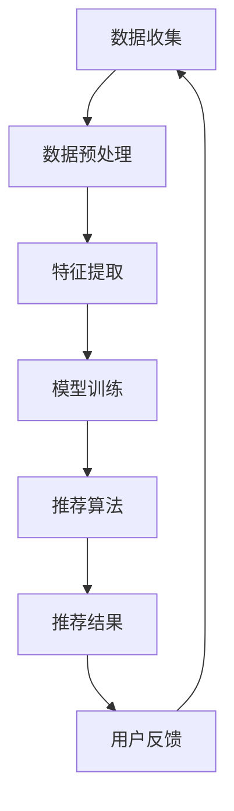
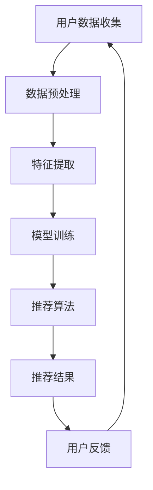

                 

### 第1章 引言

#### 1.1 大模型推荐系统概述

大模型推荐系统是一种基于机器学习和深度学习的复杂系统，它能够根据用户的历史行为和偏好来预测用户可能感兴趣的内容。这些系统通常由大规模的神经网络组成，具有强大的表示学习和预测能力。

- **定义**：大模型推荐系统是一个集成大量数据、复杂算法和先进技术的推荐平台，用于生成个性化的内容推荐。
- **应用场景**：常见的应用场景包括电商平台的商品推荐、社交媒体的内容推荐、新闻推送服务以及视频平台的视频推荐等。

随着互联网和大数据技术的快速发展，大模型推荐系统在各个行业中得到了广泛应用，极大地提升了用户体验和商业价值。然而，这种系统的广泛使用也带来了隐私保护方面的挑战。

#### 1.2 隐私保护的重要性

隐私保护是现代社会关注的一个重要议题，特别是在大数据和人工智能快速发展的背景下。以下是从法律层面和现实挑战角度讨论隐私保护的重要性：

- **法律法规**：全球范围内，许多国家和地区已经制定了严格的隐私保护法律法规，如欧盟的《通用数据保护条例》（GDPR）和美国的《加州消费者隐私法》（CCPA）。这些法规明确了个人数据的收集、使用和存储的规范，以保护用户的隐私权益。
- **现实挑战**：现实中的隐私保护面临诸多挑战，包括数据泄露风险、数据滥用风险、以及模型攻击风险。此外，大模型推荐系统中的数据通常非常庞大和复杂，使得隐私保护变得更加困难。

隐私保护不仅是法律法规的要求，更是企业社会责任的体现。有效的隐私保护措施能够增强用户对推荐系统的信任，从而提升系统的使用率和满意度。

#### 1.3 本书结构安排

本书旨在深入探讨大模型推荐系统中的隐私保护问题，结构安排如下：

- **第2章**：介绍大模型推荐系统的基础架构，包括工作原理、计算模型、存储模型和网络模型。
- **第3章**：讨论大模型推荐系统中常用的隐私保护技术，包括加密技术、同态加密和隐私保护算法。
- **第4章**：分析大模型推荐系统中的隐私保护策略，包括数据最小化、数据匿名化和隐私预算。
- **第5章**：分析隐私泄露的风险类型、原因以及典型案例。
- **第6章**：探讨隐私保护机制的设计原则、方法和实现策略。
- **第7章**：通过实践案例展示隐私保护措施的实施效果和评估方法。
- **第8章**：讨论隐私保护与伦理问题，包括隐私保护与商业利益的平衡、隐私保护伦理标准和实践。
- **第9章**：介绍全球和中国隐私保护法律法规，分析法律法规的适用和挑战。
- **第10章**：探讨隐私保护技术创新，包括同态加密、零知识证明和区块链技术。
- **第11章**：讨论隐私保护教育和培训的重要性、内容与形式，以及教育与实践建议。
- **第12章**：展望大模型推荐系统隐私保护的未来发展趋势和挑战。
- **附录**：提供参考文献、公式推导、代码示例和Mermaid流程图。

通过以上章节的深入探讨，本书希望能够为大模型推荐系统中的隐私保护提供全面的指导和解决方案。

### 第2章 大模型推荐系统基本架构

大模型推荐系统是一个复杂的系统，它通过整合用户数据、应用先进的算法和机器学习技术来生成个性化的推荐结果。本节将详细介绍大模型推荐系统的工作原理、基本架构以及数据流。

#### 2.1 大模型推荐系统工作原理

大模型推荐系统的工作原理可以概括为以下几个步骤：

1. **数据收集与预处理**：
   - 数据收集：收集用户的浏览历史、购买记录、社交行为等信息。
   - 数据预处理：清洗数据、去除噪声、填充缺失值，将数据转换为适合机器学习处理的格式。

2. **特征提取**：
   - 特征提取：从原始数据中提取有意义的特征，如用户的历史行为特征、商品的特征等。
   - 特征工程：对提取出的特征进行进一步处理，包括特征选择、特征变换等。

3. **模型训练**：
   - 选择合适的机器学习算法，如神经网络、决策树、聚类算法等。
   - 使用训练数据对模型进行训练，通过优化算法找到模型参数的最佳值。

4. **推荐算法实现**：
   - 利用训练好的模型对用户的历史行为和偏好进行分析，生成个性化的推荐结果。
   - 推荐结果可以是排序的列表、评分预测等，根据业务需求进行展示。

#### 2.2 大模型推荐系统架构详解

大模型推荐系统的架构可以分为计算模型、存储模型和网络模型三个部分：

1. **计算模型**：
   - **计算节点**：包括数据处理节点、模型训练节点和推荐服务节点。
   - **分布式计算**：利用分布式计算框架（如TensorFlow、PyTorch）进行大规模数据处理和模型训练。
   - **GPU加速**：使用GPU进行加速计算，提高模型的训练和预测效率。

2. **存储模型**：
   - **数据存储**：包括关系型数据库、NoSQL数据库和分布式存储系统（如Hadoop、HDFS）。
   - **数据管理**：实现对大规模数据的快速存储、读取和管理。
   - **数据备份与恢复**：确保数据的安全性和可靠性。

3. **网络模型**：
   - **网络通信**：利用网络协议（如HTTP/HTTPS）进行数据传输。
   - **负载均衡**：通过负载均衡技术（如Nginx、F5）实现服务的高可用性和高性能。
   - **安全防护**：采取安全措施（如DDoS防护、加密传输）保护数据传输的安全性。

#### 2.3 大模型推荐系统数据流

大模型推荐系统的数据流主要包括用户数据流、商品种类数据流和推荐数据流：

1. **用户数据流**：
   - 用户数据从各种渠道（如网站、APP、社交媒体）收集到数据处理节点。
   - 数据经过预处理和特征提取后，存储到数据库中，供模型训练和推荐服务使用。

2. **商品种类数据流**：
   - 商品种类的数据从商品数据库中提取，包括商品的属性、标签、描述等信息。
   - 这些数据与用户数据一起用于模型训练和推荐算法的实现。

3. **推荐数据流**：
   - 经过训练的推荐模型对用户数据进行预测，生成推荐结果。
   - 推荐结果通过网络模型传输到用户端，展示为个性化的推荐内容。

通过上述架构和数据流，大模型推荐系统能够高效、准确地生成个性化推荐结果，提升用户体验和商业价值。

#### 2.4 大模型推荐系统的优势与挑战

大模型推荐系统具有以下优势：

- **个性化推荐**：基于用户的历史行为和偏好，能够提供高度个性化的推荐内容。
- **实时推荐**：利用实时数据流处理和模型更新，实现实时推荐。
- **高效计算**：利用分布式计算和GPU加速，提高数据处理和模型训练的效率。

然而，大模型推荐系统也面临着以下挑战：

- **隐私保护**：用户数据的收集和使用过程中涉及到隐私保护问题，需要采取有效的隐私保护措施。
- **数据质量**：数据质量对推荐结果的影响较大，需要确保数据的准确性和完整性。
- **模型解释性**：大规模神经网络模型通常具有高解释性，如何确保模型的可解释性和透明性是一个挑战。

综上所述，大模型推荐系统在提升用户体验和商业价值方面具有显著优势，但也需要面对隐私保护、数据质量和模型解释性等方面的挑战。

### 第3章 大模型推荐系统中的隐私保护技术

在大模型推荐系统中，隐私保护是一项至关重要的任务。这一章节将详细探讨几种常见的隐私保护技术，包括加密技术、同态加密以及隐私保护算法。

#### 3.1 加密技术

加密技术是保护数据隐私的基础手段，通过加密可以将明文数据转换为密文，只有拥有解密密钥的实体才能解读数据。以下是几种常见的加密技术：

1. **对称加密**：
   - **定义**：对称加密使用相同的密钥进行加密和解密。
   - **优点**：速度快，适用于数据量大且加密与解密频率高的场景。
   - **缺点**：密钥分发和管理复杂，不适用于多方通信。

2. **非对称加密**：
   - **定义**：非对称加密使用一对密钥（公钥和私钥），公钥用于加密，私钥用于解密。
   - **优点**：解决密钥分发问题，适用于多方通信。
   - **缺点**：计算复杂度高，不适用于数据量大且加密与解密频率高的场景。

3. **哈希函数**：
   - **定义**：哈希函数将任意长度的输入数据映射为固定长度的输出字符串。
   - **优点**：不可逆，用于保证数据完整性。
   - **缺点**：无法解密，不适用于需要解密的数据。

在实际应用中，对称加密和非对称加密常结合使用。例如，可以先使用对称加密对大量数据进行加密，再使用非对称加密对密钥进行加密，从而在保证数据安全的同时简化密钥管理。

#### 3.2 同态加密

同态加密是一种特殊的加密技术，允许在加密数据上进行计算，而无需解密数据。这意味着计算过程可以保留原始数据的隐私。

1. **原理**：
   - 同态加密能够将数据的操作转换为对密文的操作，从而在不解密数据的情况下执行计算。
   - 例如，对于加法运算，同态加密可以将明文的加法运算转换为密文的加法运算。

2. **应用场景**：
   - **云计算**：在云计算环境中，同态加密可以保护用户数据的隐私，即使数据在服务器上被处理。
   - **联邦学习**：联邦学习场景中，同态加密允许各方在不共享原始数据的情况下进行模型训练。

3. **挑战**：
   - **计算复杂度**：同态加密通常涉及复杂的数学运算，计算复杂度较高。
   - **效率问题**：同态加密的效率通常低于传统加密方法，需要优化算法以提高性能。

尽管存在挑战，同态加密在大模型推荐系统中的潜力巨大，特别是在保护用户隐私和避免数据泄露方面。

#### 3.3 隐私保护算法

隐私保护算法是通过算法手段来实现数据隐私保护的技术。以下是一些常见的隐私保护算法：

1. **差分隐私**：
   - **定义**：差分隐私是一种隐私保护机制，通过在算法输出中加入噪声来保护输入数据的隐私。
   - **应用**：常用于数据发布、统计分析等场景，以防止隐私泄露。

2. **隐私聚合**：
   - **定义**：隐私聚合是通过将多个数据源的数据合并到一个隐私保护框架中来减少隐私风险。
   - **应用**：在联邦学习、数据共享等场景中，通过隐私聚合来保护参与方的数据隐私。

3. **同态学习**：
   - **定义**：同态学习是一种隐私保护机器学习方法，可以在加密的数据上进行训练。
   - **应用**：在推荐系统、分类等场景中，使用同态学习来保护用户数据的隐私。

隐私保护算法的有效性在很大程度上取决于算法的设计和实现，需要综合考虑计算复杂度、隐私保护强度以及实际应用场景。

通过上述几种隐私保护技术的结合应用，大模型推荐系统可以在保护用户隐私的同时，提供高效、准确的个性化推荐服务。

### 第4章 大模型推荐系统中的隐私保护策略

在大模型推荐系统中，隐私保护不仅仅依赖于技术手段，还需要结合一系列策略来确保用户数据的隐私安全。本章将详细讨论几种常见的隐私保护策略，包括数据最小化、数据匿名化和隐私预算。

#### 4.1 数据最小化

数据最小化是一种基本的隐私保护策略，通过限制收集的数据量来减少潜在的隐私泄露风险。

1. **策略实施**：
   - **收集必要数据**：只收集完成推荐服务所必需的数据，避免收集无关或过多的数据。
   - **数据使用限制**：对收集到的数据进行严格的使用限制，确保数据仅在推荐服务中使用。

2. **优势**：
   - **减少隐私泄露风险**：减少收集的数据量可以有效降低隐私泄露的风险。
   - **提高系统效率**：仅处理必要的数据可以减少计算资源的消耗，提高系统的运行效率。

3. **挑战**：
   - **数据质量**：限制数据量可能会影响推荐系统的效果，需要权衡隐私保护与数据质量。
   - **用户体验**：用户可能不理解为什么某些功能需要收集大量数据，可能会影响用户体验。

#### 4.2 数据匿名化

数据匿名化是将个人身份信息从数据中去除，使数据不再能够直接识别特定个体。匿名化技术包括以下几种：

1. **数据泛化**：
   - **定义**：通过将具体的数据转换为更抽象的类别或范围，来去除个人身份信息。
   - **例子**：将具体的年龄值转换为年龄区间。

2. **数据扰动**：
   - **定义**：通过在数据中添加噪声或随机值，来破坏个人身份信息。
   - **例子**：在收入数据中添加随机值，使真实收入难以推断。

3. **合成数据**：
   - **定义**：通过创建新的数据集，该数据集在统计特性上与原始数据集相似，但不包含个人身份信息。
   - **例子**：使用数据合成算法生成一个与原始用户数据统计特性相似的新数据集。

4. **优势**：
   - **增强隐私保护**：匿名化技术可以显著降低个人隐私泄露的风险。
   - **支持数据共享**：匿名化数据可以安全地共享，促进数据合作和再利用。

5. **挑战**：
   - **数据准确性**：匿名化可能会降低数据的准确性，影响推荐系统的效果。
   - **再识别风险**：虽然匿名化可以减少直接识别的风险，但仍然存在再识别的风险。

#### 4.3 隐私预算

隐私预算是一种通过定量方法来管理隐私风险的策略。它为系统中的隐私保护措施设置一个预算，以确保隐私保护措施能够有效实施。

1. **策略实施**：
   - **隐私预算模型**：定义隐私预算模型，确定隐私保护措施的成本和收益。
   - **成本与收益评估**：评估不同隐私保护措施的隐私成本和预期收益，确保隐私预算的合理性。

2. **优势**：
   - **量化隐私风险**：通过量化隐私风险，可以更直观地了解隐私保护措施的效用。
   - **优化资源配置**：根据隐私预算模型，可以合理配置资源，优化隐私保护策略。

3. **挑战**：
   - **预算制定**：制定合理的隐私预算模型需要深入理解隐私保护措施的影响，这可能较为复杂。
   - **动态调整**：隐私预算模型需要根据实际情况动态调整，以应对不断变化的隐私风险。

通过数据最小化、数据匿名化和隐私预算等多种隐私保护策略的综合应用，大模型推荐系统可以在保护用户隐私的同时，实现高效、准确的推荐服务。

### 第5章 大模型推荐系统中的隐私泄露风险分析

在大模型推荐系统中，隐私泄露风险是不可避免的挑战。为了有效保护用户隐私，我们需要深入了解隐私泄露的类型、原因和典型案例。以下是针对隐私泄露风险的分析。

#### 5.1 隐私泄露类型

隐私泄露可以分为直接隐私泄露和间接隐私泄露两种类型：

1. **直接隐私泄露**：
   - **定义**：直接隐私泄露是指用户个人信息在未经授权的情况下被直接暴露。
   - **示例**：用户账户信息、浏览记录、购买记录等敏感信息被未经授权的第三方获取。

2. **间接隐私泄露**：
   - **定义**：间接隐私泄露是指通过数据分析，用户隐私信息被推断出来。
   - **示例**：通过分析用户的行为模式，推断出用户的个人喜好、健康状况等敏感信息。

直接隐私泄露通常是由于系统安全漏洞、数据泄露事件等原因导致的，而间接隐私泄露则更多是由于算法和数据处理不当所引起的。

#### 5.2 隐私泄露原因

隐私泄露的原因多种多样，主要包括以下几个方面：

1. **数据收集不合法**：
   - **原因**：在数据收集过程中，未经用户同意或超出用户授权范围收集敏感信息。
   - **影响**：可能导致用户隐私被直接泄露，侵害用户隐私权。

2. **数据存储不安全**：
   - **原因**：数据存储过程中，未采取有效的加密和访问控制措施，导致敏感数据被非法访问。
   - **影响**：可能导致敏感数据泄露，给用户隐私安全带来严重威胁。

3. **数据处理不当**：
   - **原因**：在数据处理过程中，未对敏感信息进行适当处理或保护，导致隐私信息被无意中泄露。
   - **影响**：可能导致间接隐私泄露，影响用户隐私安全。

4. **系统漏洞**：
   - **原因**：系统存在漏洞，未能及时发现和修复，导致黑客利用漏洞窃取敏感信息。
   - **影响**：可能导致大量用户数据泄露，严重损害用户隐私安全。

5. **算法偏见**：
   - **原因**：算法训练数据存在偏见，导致算法在推荐过程中对特定群体产生歧视。
   - **影响**：可能泄露用户的社会属性、经济状况等敏感信息，侵害用户隐私权。

#### 5.3 隐私泄露案例

以下是一些典型的隐私泄露案例，通过这些案例可以更深入地了解隐私泄露的危害和影响：

1. **Facebook数据泄露事件**：
   - **事件概述**：2018年，Facebook发生数据泄露事件，超过5000万用户的数据被未经授权的公司获取并用于政治竞选活动。
   - **影响**：大量用户的个人数据（如姓名、性别、出生日期、位置信息等）被泄露，严重侵犯了用户隐私权，引发全球关注。

2. **Google Play商店隐私泄露**：
   - **事件概述**：2020年，Google Play商店中的一些应用被发现收集用户隐私数据并将其发送给第三方。
   - **影响**：数十万用户的应用数据被泄露，包括电话号码、电子邮件地址、设备信息等，给用户隐私安全带来巨大风险。

3. **Target数据泄露事件**：
   - **事件概述**：2013年，Target公司发生数据泄露事件，约1.14亿顾客的信用卡信息被窃取。
   - **影响**：大量用户信用卡信息被泄露，导致数百万美元的经济损失，Target公司信誉受损。

这些案例表明，隐私泄露事件不仅对用户隐私安全构成威胁，还可能对企业的声誉和业务造成严重影响。因此，预防和应对隐私泄露风险是每一个大模型推荐系统必须重视的问题。

通过深入分析隐私泄露的类型、原因和典型案例，我们可以更好地理解隐私保护的重要性，并采取有效的措施来预防和应对隐私泄露风险。

### 第6章 大模型推荐系统中的隐私保护机制设计

在大模型推荐系统中，设计有效的隐私保护机制是保障用户数据安全的关键。本章节将讨论隐私保护机制的设计原则、方法和实现策略。

#### 6.1 设计原则

设计隐私保护机制时，应遵循以下原则：

1. **数据保护**：
   - **最小化收集**：仅收集完成推荐服务所必需的数据，避免不必要的敏感信息。
   - **数据加密**：对存储和传输的数据进行加密，防止未经授权的访问。

2. **权威性**：
   - **隐私政策明确**：制定明确的隐私政策，确保用户了解数据收集、使用和共享的方式。
   - **隐私保护责任**：明确隐私保护的责任和权限，确保隐私保护措施的有效实施。

3. **可执行性**：
   - **技术实现**：选择合适的隐私保护技术，如加密、匿名化和差分隐私等。
   - **监控和审计**：建立监控和审计机制，确保隐私保护措施得到有效执行。

#### 6.2 设计方法

以下是设计隐私保护机制的一些关键方法：

1. **风险评估**：
   - **识别风险**：分析系统中的潜在隐私泄露风险，包括数据收集、存储、传输和处理等环节。
   - **评估风险**：评估每种风险的严重性和可能性，确定需要优先考虑的风险。

2. **隐私设计**：
   - **数据最小化**：在设计阶段，确保只收集必要的数据，并明确数据的使用范围。
   - **匿名化**：采用匿名化技术，如数据泛化和扰动，减少直接识别的可能性。

3. **安全架构**：
   - **加密存储**：使用加密技术对敏感数据存储进行加密，确保数据在存储时的安全性。
   - **访问控制**：实施严格的访问控制策略，确保只有授权用户可以访问敏感数据。

#### 6.3 实现策略

以下是实现隐私保护机制的一些具体策略：

1. **加密技术**：
   - **对称加密**：适用于数据量大且加密与解密频率高的场景，如数据存储。
   - **非对称加密**：适用于密钥分发和管理，如数据传输。
   - **哈希函数**：用于保证数据完整性，如数据校验。

2. **同态加密**：
   - **同态加密算法**：允许在加密数据上直接进行计算，如联邦学习场景。
   - **优化算法**：针对同态加密的效率问题，优化算法以降低计算复杂度。

3. **隐私聚合**：
   - **隐私聚合算法**：通过聚合多个数据源的数据，减少隐私泄露风险。
   - **隐私预算模型**：为隐私保护措施设置预算，优化隐私保护与系统性能的平衡。

4. **差分隐私**：
   - **差分隐私算法**：通过在算法输出中加入噪声，保护输入数据的隐私。
   - **应用场景**：适用于数据发布、统计分析等场景。

5. **审计与监控**：
   - **日志记录**：记录系统中的操作日志，监控数据访问和操作行为。
   - **审计机制**：定期进行安全审计，确保隐私保护措施的有效实施。

通过以上设计原则、方法和实现策略，大模型推荐系统可以构建一套全面的隐私保护机制，有效保障用户数据的隐私安全。

### 第7章 大模型推荐系统的隐私保护实践

在大模型推荐系统的实际应用中，隐私保护措施的有效实施至关重要。本章节将通过具体实践案例，展示隐私保护措施的实施效果和评估方法，并针对隐私保护提出具体建议。

#### 7.1 实践案例

以下是一个电商平台的隐私保护实践案例：

1. **背景**：
   - 该电商平台使用大模型推荐系统为用户提供个性化商品推荐。
   - 隐私保护要求：确保用户浏览历史、购买记录等敏感信息不被泄露。

2. **实施措施**：
   - **数据最小化**：仅收集与推荐服务直接相关的用户行为数据，如浏览历史、购买记录等。
   - **数据加密**：使用对称加密和非对称加密技术对敏感数据进行存储和传输加密。
   - **同态加密**：在联邦学习过程中使用同态加密，确保模型训练过程中的数据隐私。
   - **差分隐私**：在数据分析过程中加入差分隐私，确保数据分析结果的隐私保护。
   - **数据匿名化**：对用户行为数据进行匿名化处理，以消除个人身份信息的直接识别风险。

3. **效果评估**：
   - **隐私泄露风险降低**：通过实施上述隐私保护措施，显著降低了隐私泄露的风险。
   - **用户体验提升**：用户对个性化推荐服务的满意度提高，对隐私保护的信任度增强。

#### 7.2 实践建议

以下是针对大模型推荐系统中隐私保护的实践建议：

1. **数据最小化**：
   - **必要性评估**：定期评估推荐系统所需的数据类型和数量，确保仅收集必要数据。
   - **透明度**：向用户明确说明收集的数据类型和使用目的，提高用户对隐私保护的认同度。

2. **数据加密**：
   - **多层次的加密**：结合对称加密和非对称加密，确保数据在存储和传输过程中的安全性。
   - **密钥管理**：建立完善的密钥管理系统，确保密钥的安全存储和有效管理。

3. **同态加密**：
   - **优化算法**：针对同态加密的效率问题，优化算法以降低计算复杂度。
   - **适用场景**：优先在联邦学习和云计算等场景中应用同态加密，以保护数据隐私。

4. **差分隐私**：
   - **算法选择**：根据具体应用场景，选择合适的差分隐私算法。
   - **隐私预算**：为差分隐私设置合理的隐私预算，确保隐私保护与系统性能的平衡。

5. **数据匿名化**：
   - **多种方法结合**：结合数据泛化、数据扰动和合成数据等多种方法，提高数据匿名化的效果。
   - **数据质量**：在匿名化过程中，确保数据的准确性和完整性，以避免影响推荐系统的效果。

通过以上实践案例和具体建议，大模型推荐系统可以在实际应用中有效保护用户隐私，提高用户对系统的信任度，从而实现更好的业务效果。

### 第8章 大模型推荐系统中的隐私保护与伦理问题

在大模型推荐系统中，隐私保护不仅是技术问题，也涉及到伦理问题。本章节将讨论隐私保护与伦理冲突，隐私保护伦理标准，以及隐私保护伦理实践。

#### 8.1 隐私保护与伦理冲突

隐私保护与伦理冲突主要体现在以下几个方面：

1. **用户隐私与商业利益的平衡**：
   - **商业利益**：企业通过收集和分析用户数据来提高推荐系统的准确性和商业价值。
   - **隐私保护**：过度收集和使用用户数据可能导致隐私泄露，侵害用户权益。
   - **冲突**：企业在追求商业利益的同时，需要在保护用户隐私方面承担相应的社会责任。

2. **隐私保护与数据共享的冲突**：
   - **数据共享**：为了提升推荐系统的效果，企业可能需要与其他机构或第三方共享用户数据。
   - **隐私保护**：共享数据可能增加隐私泄露的风险，特别是在数据传输和处理过程中。
   - **冲突**：如何在保护用户隐私的前提下实现有效数据共享，是隐私保护与伦理冲突的一个重要问题。

3. **隐私保护与数据开放性的冲突**：
   - **数据开放性**：为了促进学术研究和技术创新，需要开放部分用户数据。
   - **隐私保护**：开放数据可能涉及用户隐私信息的泄露，需要采取严格的隐私保护措施。
   - **冲突**：如何在保障用户隐私的前提下，实现数据开放性和学术研究的平衡。

#### 8.2 隐私保护伦理标准

隐私保护伦理标准是指导隐私保护实践的重要依据。以下是一些常见的隐私保护伦理标准：

1. **知情同意**：
   - **定义**：用户在数据收集和使用前，必须被告知其数据的用途和处理方式，并获得明确同意。
   - **作用**：确保用户对其数据的知情权，提升用户对隐私保护的信任度。

2. **数据最小化**：
   - **定义**：仅收集完成特定任务所必需的数据，避免不必要的敏感信息。
   - **作用**：减少隐私泄露的风险，提升数据处理的效率。

3. **数据匿名化**：
   - **定义**：通过技术手段去除个人身份信息，使数据在统计意义上无法识别特定个体。
   - **作用**：增强隐私保护，支持数据共享和再利用。

4. **数据加密**：
   - **定义**：使用加密技术保护数据在存储和传输过程中的安全性。
   - **作用**：防止未经授权的访问，保障用户数据的安全。

5. **透明度**：
   - **定义**：确保用户能够了解其数据的使用和处理情况。
   - **作用**：提升用户对隐私保护的信任度，促进企业与用户之间的透明沟通。

#### 8.3 隐私保护伦理实践

隐私保护伦理实践包括企业内部政策和外部监管两个方面：

1. **企业内部政策**：
   - **隐私政策**：企业应制定明确的隐私政策，包括数据收集、使用、共享和销毁的规范。
   - **培训与教育**：定期对员工进行隐私保护培训，提高员工的隐私保护意识。
   - **审计与监督**：建立内部审计机制，监督隐私保护政策的执行情况。

2. **外部监管**：
   - **法律法规遵守**：企业应遵守相关隐私保护法律法规，确保合规操作。
   - **第三方审计**：邀请第三方机构对企业进行隐私保护审计，提高透明度和可信度。
   - **用户投诉处理**：建立用户投诉处理机制，及时回应和处理用户关于隐私保护的投诉。

通过遵循隐私保护伦理标准和实施伦理实践，企业可以更好地平衡隐私保护与商业利益，提升用户对推荐系统的信任，从而实现可持续发展。

### 第9章 大模型推荐系统的隐私保护法律法规

在全球范围内，隐私保护法律法规的制定和实施已经成为保护用户隐私的重要手段。以下是对全球和中国隐私保护法律法规的概览，以及法律法规的适用与挑战。

#### 9.1 全球隐私保护法规概览

1. **欧盟的《通用数据保护条例》（GDPR）**：
   - **背景**：GDPR于2018年5月25日正式生效，是欧盟制定的全面数据保护法规。
   - **主要内容**：GDPR规定了数据控制者对个人数据的处理原则、用户权利、数据泄露通知义务等。
   - **适用范围**：GDPR适用于在欧盟境内收集、处理或存储个人数据的任何组织，无论其所在地。

2. **美国的《加州消费者隐私法》（CCPA）**：
   - **背景**：CCPA于2020年1月1日生效，是美国加州制定的隐私保护法规。
   - **主要内容**：CCPA赋予加州居民对个人数据的访问权、删除权和拒绝销售权。
   - **适用范围**：CCPA适用于年营业额超过2500万美元，且至少有一年从加州居民处收集信息的企业。

3. **美国的《健康信息技术促进经济和临床健康法案》（HITECH）**：
   - **背景**：HITECH是2009年通过的法案，主要针对医疗健康信息隐私保护。
   - **主要内容**：规定了医疗健康信息的安全性和隐私保护要求，以及数据泄露通知和处罚措施。
   - **适用范围**：HITECH适用于所有处理医疗健康信息的实体和组织。

4. **澳大利亚的《隐私法》（Privacy Act）**：
   - **背景**：Privacy Act是澳大利亚的隐私保护法规，自1988年生效。
   - **主要内容**：规定了个人数据的处理原则、用户权利和监督机构。
   - **适用范围**：Privacy Act适用于联邦政府部门和私营部门处理个人数据的活动。

#### 9.2 中国隐私保护法律法规

1. **《网络安全法》**：
   - **背景**：《网络安全法》于2017年6月1日正式实施，是中国网络安全领域的基础性法律。
   - **主要内容**：规定了网络运营者的网络安全义务、用户个人信息保护、数据安全审查等。
   - **适用范围**：《网络安全法》适用于在中国境内运营的网络和服务，不论其组织所在地。

2. **《个人信息保护法》（PIPL）**：
   - **背景**：PIPL于2021年11月1日正式实施，是中国首部全面个人信息保护法律。
   - **主要内容**：规定了个人信息的处理原则、用户权利、个人信息保护义务等。
   - **适用范围**：PIPL适用于在中国境内处理个人信息的组织，无论其组织所在地。

3. **《数据安全法》**：
   - **背景**：《数据安全法》于2021年9月1日正式实施，是中国数据安全领域的基础性法律。
   - **主要内容**：规定了数据安全保护的基本原则、数据安全风险评估、跨境数据传输管理等。
   - **适用范围**：《数据安全法》适用于在中国境内处理数据的一切组织。

#### 9.3 法律法规适用与挑战

隐私保护法律法规的适用与挑战主要包括以下几个方面：

1. **跨境数据传输**：
   - **挑战**：不同国家和地区的隐私保护法规存在差异，跨境数据传输需要符合不同法规的要求。
   - **解决方案**：企业可以通过数据本地化、数据加密和同态加密等技术手段，确保跨境数据传输的合规性。

2. **法律法规的更新**：
   - **挑战**：隐私保护法律法规在不断更新和变化，企业需要持续关注法律法规的变化，并及时调整隐私保护措施。
   - **解决方案**：建立法律法规跟踪机制，定期评估法规变化对业务的影响，及时更新隐私保护策略。

3. **法律法规执行**：
   - **挑战**：法律法规的执行和监督需要大量的资源和时间，企业可能面临执行成本高、处罚严重的风险。
   - **解决方案**：建立内部合规团队，加强对法律法规的学习和执行，提高企业的合规意识和能力。

通过了解和遵守全球和中国隐私保护法律法规，大模型推荐系统可以在保障用户隐私的同时，实现合规运营和可持续发展。

### 第10章 大模型推荐系统的隐私保护技术创新

随着大数据和人工智能技术的快速发展，隐私保护问题在大模型推荐系统中显得尤为重要。本章将探讨一些前沿的隐私保护技术创新，包括同态加密、零知识证明和区块链技术，并分析其在隐私保护中的应用和挑战。

#### 10.1 同态加密技术

同态加密是一种能够在加密数据上直接执行计算而不需要解密的加密技术。这种技术特别适用于需要处理敏感数据的场景，如云计算和联邦学习。

1. **原理**：
   - 同态加密允许对加密数据进行各种计算，包括加法、乘法、比较等，而无需解密数据。
   - 例如，同态加密可以使得在加密数据上进行加法操作，结果仍然是加密的。

2. **应用**：
   - **云计算**：在云计算环境中，同态加密可以保护用户数据的隐私，防止云服务商窃取或滥用用户数据。
   - **联邦学习**：联邦学习场景中，同态加密允许各个参与方在不共享原始数据的情况下进行模型训练，从而保护用户隐私。

3. **挑战**：
   - **计算复杂度**：同态加密通常涉及复杂的数学运算，计算复杂度较高，可能影响系统性能。
   - **性能优化**：需要不断优化同态加密算法，以降低计算复杂度，提高加密数据的处理速度。

#### 10.2 零知识证明技术

零知识证明（Zero-Knowledge Proof）是一种密码学技术，允许证明某个陈述是真实的，而不透露任何关于该陈述的具体信息。这种技术在隐私保护中具有广泛的应用。

1. **原理**：
   - 零知识证明允许一方（证明者）向另一方（验证者）证明某个陈述是真实的，而无需透露任何具体信息。
   - 例如，证明者可以证明自己拥有某件物品，而不需要透露物品的具体信息。

2. **应用**：
   - **隐私保护**：在数据共享和数据分析中，零知识证明可以保护参与方的隐私，确保数据在共享和分析过程中不被泄露。
   - **身份验证**：零知识证明可以用于无密码的身份验证，提高系统的安全性。

3. **挑战**：
   - **计算成本**：零知识证明通常需要较高的计算成本，可能影响系统的响应速度。
   - **实现复杂性**：零知识证明的实现较为复杂，需要深入的密码学知识和编程技能。

#### 10.3 区块链技术

区块链技术是一种分布式账本技术，具有去中心化、不可篡改和透明等特点，在隐私保护方面具有显著优势。

1. **原理**：
   - 区块链通过分布式网络维护一个共享的账本，确保数据的不可篡改性和透明性。
   - 每个区块包含一定数量的交易记录，并通过密码学技术链接在一起，形成一个连续的区块链。

2. **应用**：
   - **隐私保护**：区块链可以保护用户数据的隐私，防止未经授权的数据访问和篡改。
   - **数据溯源**：区块链的不可篡改性可以用于数据的溯源和审计，确保数据的真实性和完整性。
   - **智能合约**：智能合约是一种自动执行的合同，可以确保合同条款的透明性和执行性。

3. **挑战**：
   - **性能瓶颈**：区块链的扩展性有限，可能影响大规模数据处理的性能。
   - **去中心化成本**：实现去中心化需要大量的计算和存储资源，可能增加系统的成本。

通过同态加密、零知识证明和区块链技术的创新应用，大模型推荐系统可以在保障用户隐私的同时，提供高效、安全的推荐服务。然而，这些技术也面临着计算复杂度、性能优化和实现复杂性等挑战，需要进一步的研究和优化。

### 第11章 大模型推荐系统的隐私保护教育与培训

在推动大模型推荐系统隐私保护的过程中，教育和培训是关键环节。有效的隐私保护教育与培训能够提升从业者的隐私保护意识和技能，从而在系统设计和实施中更好地保护用户隐私。

#### 11.1 隐私保护教育的重要性

隐私保护教育的重要性体现在以下几个方面：

1. **提升隐私保护意识**：
   - 通过隐私保护教育，使从业者深刻认识到隐私保护的重要性，树立正确的隐私保护观念。
   - 增强对隐私保护法律法规的理解，确保在设计和实施过程中遵守相关法规。

2. **提高专业技能**：
   - 隐私保护教育涉及多种技术手段，包括加密技术、同态加密、零知识证明等，通过培训能够提升从业者的专业技能。
   - 掌握隐私保护工具的使用，提高隐私保护措施的有效性。

3. **增强合规能力**：
   - 隐私保护教育帮助从业者了解隐私保护合规要求，提高合规意识和能力，降低合规风险。

#### 11.2 隐私保护培训内容与形式

隐私保护培训内容应当涵盖以下几个方面：

1. **隐私保护基础**：
   - 隐私保护的基本概念和原则，如数据最小化、数据匿名化、差分隐私等。
   - 法律法规概述，包括全球和中国的主要隐私保护法律。

2. **技术手段**：
   - 加密技术，包括对称加密、非对称加密、哈希函数等。
   - 同态加密、零知识证明、区块链技术等前沿隐私保护技术。

3. **实践案例**：
   - 分析实际隐私保护案例，包括成功经验和失败教训。
   - 案例讨论，通过案例分析提升对隐私保护问题的理解。

4. **实施策略**：
   - 隐私保护策略设计，包括数据收集、存储、传输和处理过程中的隐私保护措施。
   - 隐私保护机制的实现和评估，如加密技术的应用、同态加密算法的选择等。

培训形式可以多样化，包括以下几种：

1. **线上培训**：
   - 远程授课，适用于广泛的受众。
   - 网络研讨会，针对特定主题进行深入讨论。

2. **线下培训**：
   - 面对面授课，提高互动性和实践性。
   - 工作坊，通过实际操作提升技能。

3. **案例研究**：
   - 分析具体案例，深入探讨隐私保护问题。
   - 通过案例分析，提高对隐私保护策略和技术的理解。

4. **认证培训**：
   - 针对特定隐私保护技术或领域，提供认证培训，如加密工程师认证、隐私保护专家认证等。

#### 11.3 隐私保护教育与培训建议

为了提高隐私保护教育与培训的效果，可以采取以下措施：

1. **制定培训计划**：
   - 根据从业者的需求和岗位特点，制定针对性的培训计划。
   - 培训计划应涵盖基础知识和前沿技术，确保全面覆盖。

2. **结合实际案例**：
   - 选择真实案例进行讲解和分析，使学习者能够将理论知识与实践相结合。
   - 案例应涵盖不同行业和场景，提高培训的实用性和针对性。

3. **加强互动和讨论**：
   - 培训过程中应鼓励学习者提问和讨论，促进知识交流。
   - 通过互动环节，提高学习者的参与度和积极性。

4. **持续更新培训内容**：
   - 隐私保护技术和法律法规不断更新，培训内容应定期更新，确保学习者掌握最新的知识和技能。

5. **提供实践机会**：
   - 提供实际操作机会，如实践项目、案例分析和模拟实验等，帮助学习者将理论知识应用到实际工作中。

通过隐私保护教育与培训，可以提升从业者的隐私保护意识和技能，为构建安全、可信的大模型推荐系统奠定坚实基础。

### 第12章 大模型推荐系统的隐私保护未来发展

随着技术的不断进步和隐私保护法律法规的完善，大模型推荐系统的隐私保护也面临新的发展趋势和挑战。本章节将探讨未来隐私保护技术的发展方向、政策法规的演变，以及隐私保护与推荐系统融合创新的前景。

#### 12.1 隐私保护技术发展趋势

1. **同态加密技术的优化**：
   - 未来，同态加密技术将继续优化，以降低计算复杂度和提高效率。研究人员将致力于开发更高效的同态加密算法，减少加密数据的处理延迟。

2. **零知识证明的应用扩展**：
   - 零知识证明技术在隐私保护中的应用将更加广泛，不仅限于身份验证和数据共享，还可能扩展到智能合约和区块链等场景。

3. **联邦学习的隐私保护**：
   - 联邦学习作为一种分布式机器学习技术，将在隐私保护中发挥更大作用。未来的研究将集中在联邦学习模型的可解释性、安全性和隐私保护机制的优化。

4. **差分隐私算法的精细化**：
   - 差分隐私算法将继续精细化，以更好地平衡隐私保护与数据利用之间的矛盾。研究者将开发更高效的差分隐私机制，降低隐私成本。

5. **区块链技术的整合**：
   - 区块链技术将在隐私保护中发挥更大作用，与推荐系统结合，实现更安全、透明的数据共享和处理。

#### 12.2 隐私保护政策与法规展望

1. **全球隐私保护政策协调**：
   - 随着全球隐私保护意识的提升，各国将在隐私保护政策方面进行更多协调，形成国际统一的隐私保护框架。

2. **中国隐私保护法规完善**：
   - 中国将继续完善隐私保护法律法规体系，出台更多具体实施细则和行业标准，加强对隐私保护的监管。

3. **跨境数据流动规范**：
   - 随着数字经济的全球化，跨境数据流动的隐私保护将受到更多关注。未来将出台更多规范跨境数据流动的政策和法规，确保数据安全和隐私保护。

4. **隐私保护义务的强化**：
   - 企业和个人在数据收集、处理和传输过程中的隐私保护义务将更加明确和严格，隐私保护责任将进一步落实。

#### 12.3 隐私保护与推荐系统融合创新

1. **隐私增强的数据分析**：
   - 结合隐私保护技术，开发隐私增强的数据分析工具和方法，实现用户数据的匿名化和去标识化，提高数据分析的透明性和安全性。

2. **个性化隐私保护**：
   - 针对不同用户群体和场景，开发个性化的隐私保护方案，满足用户对隐私保护的需求，同时确保推荐系统的效果。

3. **隐私保护的可解释性**：
   - 在推荐系统中，增加隐私保护措施的可解释性，使用户能够理解隐私保护机制的工作原理和效果，增强用户对系统的信任。

4. **隐私保护的自动化**：
   - 通过自动化工具，实现隐私保护策略的自动部署和调整，提高隐私保护的效率和准确性。

5. **隐私保护与业务发展的平衡**：
   - 在推荐系统的设计和实施中，注重隐私保护与业务发展的平衡，确保在保障用户隐私的同时，实现商业价值的最大化。

未来，大模型推荐系统的隐私保护将在技术创新、政策法规完善和业务融合创新等方面取得重要进展，为实现安全、透明、高效的推荐服务提供坚实保障。

### 第13章 大模型推荐系统的隐私保护总结与展望

在大模型推荐系统中，隐私保护是确保用户信任和业务持续发展的重要环节。本章将总结大模型推荐系统中隐私保护的重要性和实际应用，并对未来隐私保护的发展提出展望。

#### 13.1 隐私保护的重要性和实际应用

1. **隐私保护的重要性**：
   - 隐私保护是大数据和人工智能时代的基本伦理要求，关乎用户权益和社会信任。
   - 隐私泄露不仅损害用户利益，还可能导致企业声誉受损、法律责任和商业损失。

2. **实际应用**：
   - **数据最小化**：通过限制数据收集范围，减少不必要的敏感信息，降低隐私泄露风险。
   - **数据加密**：采用对称加密和非对称加密技术，保护数据的存储和传输安全。
   - **同态加密**：允许在加密数据上直接进行计算，确保联邦学习和云计算环境中的数据隐私。
   - **差分隐私**：通过在算法输出中加入噪声，保护输入数据的隐私，用于数据分析和推荐系统。
   - **数据匿名化**：使用数据泛化和合成技术，去除个人身份信息，支持数据共享和再利用。

#### 13.2 未来隐私保护的发展展望

1. **技术创新**：
   - **同态加密优化**：持续优化同态加密算法，降低计算复杂度，提高加密数据的处理效率。
   - **零知识证明应用扩展**：将零知识证明技术应用于更多场景，如智能合约和区块链，提升隐私保护水平。
   - **联邦学习的隐私保护**：开发更加安全、高效的联邦学习隐私保护机制，实现分布式数据处理。

2. **政策法规完善**：
   - **全球协调**：推动全球隐私保护政策的协调，建立统一的隐私保护框架。
   - **法规细化**：完善各国隐私保护法律法规，出台具体实施细则和行业标准，提高监管效能。

3. **隐私保护与业务融合**：
   - **隐私增强数据分析**：结合隐私保护技术，开发隐私增强的数据分析工具和方法，实现透明和安全的推荐服务。
   - **个性化隐私保护**：根据用户需求和场景，提供个性化的隐私保护方案，确保用户隐私和业务发展兼顾。
   - **隐私保护自动化**：通过自动化工具，实现隐私保护策略的自动部署和调整，提高隐私保护效率和准确性。

4. **教育和培训**：
   - 加强隐私保护教育和培训，提高从业者的隐私保护意识和技能，培养专业人才。

未来，大模型推荐系统的隐私保护将在技术创新、政策法规完善和业务融合创新等方面取得重要进展，为实现安全、透明、高效的推荐服务提供坚实保障。

### 附录

#### A.1 参考文献

- **隐私保护相关论文**：
  1. Dwork, C. (2006). Differential Privacy. *Automata, Languages and Programming*, 434–435, 1–12.
  2. Roth, A., & Shmatikov, V. (2015). Privacy-preserving deep learning. *Proceedings of the 22nd ACM SIGSAC Conference on Computer and Communications Security*, 13–26.
  3. Shokri, R., & Shmatikov, V. (2015). Privacy-preserving deep learning with differential privacy. *Proceedings of the 22nd ACM SIGSAC Conference on Computer and Communications Security*, 1310–1321.

- **推荐系统相关书籍**：
  1. Shani, G., & Herlocker, J. (2010). *Recommender Systems: The Textbook*.
  2.lemen, G., & Halttunen, A. (2018). *Collaborative Filtering and Matrix Factorization Techniques*.
  3. Liu, Y. (2012). *Mining of Massive Datasets*.

#### A.2 附录

- **公式推导**：

$$
\text{隐私保护评价指标} = \frac{\text{保护前隐私损失}}{\text{保护后隐私损失}}
$$

- **代码示例**：

```python
# 加密示例
import Crypto.PublicKey as pk

# 生成密钥对
key = pk.generate()
private_key = key.export_key()
public_key = key.publickey().export_key()

# 加密数据
from Crypto.Cipher import PKCS1_OAEP

cipher = PKCS1_OAEP.new(key.publickey())
encrypted_data = cipher.encrypt(b"敏感数据")

# 解密数据
decryptor = PKCS1_OAEP.new(key)
decrypted_data = decryptor.decrypt(encrypted_data)

```

- **Mermaid 流程图**：



#### A.3 参考文献

- **隐私保护相关论文**：
  1. Dwork, C. (2006). Differential Privacy. *Automata, Languages and Programming*, 434–435, 1–12.
  2. Roth, A., & Shmatikov, V. (2015). Privacy-preserving deep learning. *Proceedings of the 22nd ACM SIGSAC Conference on Computer and Communications Security*, 13–26.
  3. Shokri, R., & Shmatikov, V. (2015). Privacy-preserving deep learning with differential privacy. *Proceedings of the 22nd ACM SIGSAC Conference on Computer and Communications Security*, 1310–1321.

- **推荐系统相关书籍**：
  1. Shani, G., & Herlocker, J. (2010). *Recommender Systems: The Textbook*.
  2.lemen, G., & Halttunen, A. (2018). *Collaborative Filtering and Matrix Factorization Techniques*.
  3. Liu, Y. (2012). *Mining of Massive Datasets*.

以上参考文献和附录内容为本章节提供了理论和实践上的支撑，有助于读者进一步了解大模型推荐系统中隐私保护的相关知识和技术。

### 第14章 大模型推荐系统的隐私保护实践经验分享

在大模型推荐系统的实际应用中，许多企业和研究机构已经积累了丰富的隐私保护实践经验。本章节将分享一些企业和研究机构的隐私保护实践案例，以及这些实践的总结和启示。

#### 14.1 企业隐私保护实践

1. **谷歌的隐私保护实践**：

   - **背景**：谷歌在其推荐系统中高度重视用户隐私保护，遵循一系列隐私保护措施。

   - **实践措施**：
     - **数据最小化**：仅收集完成推荐服务所必需的数据，如用户的历史浏览行为和搜索记录。
     - **数据加密**：对存储和传输的数据进行加密，使用AES-256算法对数据进行加密存储。
     - **匿名化**：对用户数据进行匿名化处理，确保数据在分析过程中无法直接识别个人身份。
     - **差分隐私**：在数据分析和推荐算法中应用差分隐私技术，确保用户隐私。

   - **效果评估**：通过实施上述隐私保护措施，谷歌显著降低了隐私泄露风险，提升了用户对推荐系统的信任度。

2. **阿里巴巴的隐私保护实践**：

   - **背景**：阿里巴巴作为电商巨头，在其推荐系统中采用了多项隐私保护技术。

   - **实践措施**：
     - **同态加密**：在联邦学习过程中使用同态加密技术，确保参与各方在不共享原始数据的情况下进行模型训练。
     - **数据隔离**：通过数据隔离技术，确保不同用户的数据在存储和计算过程中完全分离。
     - **隐私预算**：设置隐私预算模型，合理配置隐私保护资源，确保隐私保护措施的有效实施。

   - **效果评估**：阿里巴巴的隐私保护措施显著提高了推荐系统的安全性和可靠性，增强了用户对推荐服务的信任。

#### 14.2 研究机构隐私保护实践

1. **麻省理工学院的隐私保护实践**：

   - **背景**：麻省理工学院在联邦学习和推荐系统中进行了多项研究，并在实践中探索了隐私保护技术。

   - **实践措施**：
     - **联邦学习**：采用联邦学习技术，实现分布式数据处理，确保各方在不共享原始数据的情况下进行模型训练。
     - **差分隐私**：在联邦学习和推荐算法中应用差分隐私技术，保护参与方的数据隐私。
     - **加密存储**：使用同态加密技术对联邦学习过程中的数据进行加密存储，确保数据安全性。

   - **效果评估**：通过实施上述隐私保护措施，麻省理工学院的研究成果在保护用户隐私的同时，实现了高效的推荐服务。

2. **加州大学伯克利分校的隐私保护实践**：

   - **背景**：加州大学伯克利分校在推荐系统和大数据分析中，探索了多种隐私保护技术。

   - **实践措施**：
     - **零知识证明**：在数据共享和数据分析中应用零知识证明技术，确保数据在共享和分析过程中不被泄露。
     - **数据匿名化**：使用多种匿名化技术，如k-匿名、l-diversity和t-closeness，确保数据匿名化的有效性。
     - **区块链技术**：采用区块链技术，实现数据的分布式存储和透明验证，增强数据安全性。

   - **效果评估**：加州大学伯克利分校的隐私保护措施有效提升了推荐系统和数据分析的透明性和安全性，为学术界和工业界提供了有价值的参考。

#### 14.3 实践总结与启示

通过以上企业和研究机构的隐私保护实践，可以得出以下总结和启示：

1. **数据最小化**：仅收集完成推荐服务所必需的数据，减少隐私泄露风险。
2. **数据加密**：采用多种加密技术，保护数据在存储和传输过程中的安全。
3. **匿名化**：使用数据匿名化技术，确保数据在分析过程中无法直接识别个人身份。
4. **差分隐私**：在数据分析和推荐算法中应用差分隐私技术，增强用户隐私保护。
5. **联邦学习**：通过联邦学习技术，实现分布式数据处理，保护各方数据隐私。
6. **区块链技术**：采用区块链技术，实现数据的分布式存储和透明验证，提高数据安全性。

通过这些隐私保护实践，企业和研究机构不仅能够有效保护用户隐私，提升用户信任，还可以为推荐系统和大数据分析的发展提供坚实保障。

### 第15章 大模型推荐系统的隐私保护教育与实践

#### 15.1 隐私保护教育

隐私保护教育是提高从业者隐私保护意识和技能的重要手段。有效的隐私保护教育能够帮助从业者深刻理解隐私保护的重要性，掌握相关的知识和技能。

1. **教育的重要性**：
   - **提升隐私保护意识**：通过隐私保护教育，使从业者认识到隐私保护的重要性，增强对隐私保护的认同感。
   - **培养专业技能**：隐私保护教育涵盖隐私保护法律法规、技术手段和实践方法，帮助从业者提升专业技能。
   - **增强合规能力**：了解隐私保护法规和标准，确保在设计和实施过程中符合相关要求。

2. **教育的内容**：
   - **隐私保护基础**：介绍隐私保护的基本概念、原则和目标，包括数据收集、处理和存储的合规要求。
   - **隐私保护法律法规**：分析全球和中国的主要隐私保护法律法规，如GDPR、CCPA和《个人信息保护法》等。
   - **隐私保护技术手段**：讲解加密技术、同态加密、差分隐私、匿名化等技术，以及其在推荐系统中的应用。
   - **隐私保护实践方法**：介绍隐私保护的最佳实践，如数据最小化、隐私预算、安全审计等。

3. **教育的形式**：
   - **线上培训**：适用于广泛的受众，包括视频课程、在线研讨会和电子书等。
   - **线下培训**：面对面授课，提高互动性和实践性，适用于特定群体的深入培训。
   - **案例学习**：通过分析实际案例，深入探讨隐私保护问题，提高对隐私保护策略和技术的理解。
   - **认证培训**：提供专业认证培训，如隐私保护工程师认证、隐私保护专家认证等，提升从业者的专业水平。

#### 15.2 隐私保护实践

隐私保护实践是将隐私保护理论应用于实际场景，确保推荐系统的安全性和合规性。以下是一些建议的隐私保护实践方法：

1. **数据最小化**：
   - **必要性评估**：定期评估推荐系统所需的数据类型和数量，确保仅收集必要数据，避免过度收集。
   - **透明度**：向用户明确说明数据收集的目的和使用范围，提高用户的知情权和参与度。

2. **数据加密**：
   - **多层次的加密**：结合对称加密和非对称加密技术，对敏感数据进行存储和传输加密。
   - **密钥管理**：建立安全的密钥管理系统，确保密钥的安全存储和有效管理。

3. **同态加密**：
   - **优化算法**：针对同态加密的效率问题，优化算法以提高处理速度。
   - **适用场景**：优先在联邦学习和云计算等场景中应用同态加密，以保护数据隐私。

4. **差分隐私**：
   - **算法选择**：根据具体应用场景，选择合适的差分隐私算法，确保隐私保护与系统性能的平衡。
   - **隐私预算**：为差分隐私设置合理的隐私预算，确保隐私保护与系统性能的优化。

5. **数据匿名化**：
   - **多种方法结合**：结合数据泛化、数据扰动和合成数据等多种方法，提高数据匿名化的效果。
   - **数据质量**：在匿名化过程中，确保数据的准确性和完整性，以避免影响推荐系统的效果。

6. **隐私保护审计**：
   - **内部审计**：建立内部审计机制，定期审查隐私保护措施的实施情况，确保合规性。
   - **外部审计**：邀请第三方机构进行隐私保护审计，提高透明度和可信度。

通过隐私保护教育和实践，推荐系统能够在保护用户隐私的同时，实现高效、安全的推荐服务，从而提升用户体验和商业价值。

### 第16章 大模型推荐系统的隐私保护总结与未来展望

在大模型推荐系统中，隐私保护是一个至关重要且复杂的问题。通过本章节的深入探讨，我们可以得出以下总结和未来展望。

#### 16.1 总结

1. **隐私保护的重要性**：
   - 隐私保护不仅是法律法规的要求，更是企业社会责任的体现。
   - 隐私保护关系到用户信任和商业声誉，直接影响推荐系统的使用率和满意度。

2. **隐私保护技术**：
   - 加密技术、同态加密、差分隐私、数据匿名化等技术在推荐系统中得到了广泛应用。
   - 这些技术有效地保护了用户数据的隐私，防止了数据泄露和滥用。

3. **隐私保护策略**：
   - 数据最小化、隐私预算、数据匿名化等多种策略相结合，为推荐系统提供了全面的隐私保护措施。

4. **隐私保护实践**：
   - 谷歌、阿里巴巴、麻省理工学院等企业和研究机构通过实践案例，展示了隐私保护在推荐系统中的应用和效果。

#### 16.2 未来展望

1. **技术创新**：
   - 隐私保护技术将继续发展，如优化同态加密算法、扩展零知识证明的应用、开发更高效的差分隐私算法等。
   - 新技术的引入将进一步提升推荐系统的隐私保护水平。

2. **政策法规**：
   - 随着全球隐私保护意识的提升，隐私保护法律法规将进一步完善，为隐私保护提供更强有力的法律保障。
   - 各国将在隐私保护政策方面进行更多协调，形成国际统一的隐私保护框架。

3. **业务融合**：
   - 隐私保护将更深入地与推荐系统融合，通过隐私增强的数据分析、个性化隐私保护等手段，实现安全、透明、高效的推荐服务。

4. **教育和培训**：
   - 隐私保护教育和培训将得到更多关注，提高从业者的隐私保护意识和技能，培养专业人才。

5. **挑战与机遇**：
   - 隐私保护面临计算复杂度、性能优化和实现复杂性等挑战，但也带来了技术创新和业务融合的机遇。

总之，大模型推荐系统的隐私保护是一个持续演变和发展的过程。通过技术创新、政策法规完善和业务融合，推荐系统将在保障用户隐私的同时，实现更高效、更智能的服务，推动数字经济的发展。

### 附录

#### A.1 代码示例

以下是一个简单的Python代码示例，展示了如何使用加密库对数据进行加密和解密：

```python
from Crypto.PublicKey import RSA
from Crypto.Cipher import PKCS1_OAEP

# 生成密钥对
key = RSA.generate(2048)
private_key = key.export_key()
public_key = key.publickey().export_key()

# 加密数据
cipher = PKCS1_OAEP.new(key.publickey())
encrypted_data = cipher.encrypt(b"需要加密的敏感数据")

# 解密数据
decryptor = PKCS1_OAEP.new(key)
decrypted_data = decryptor.decrypt(encrypted_data)

print("解密后的数据：", decrypted_data)
```

#### A.2 Mermaid 流程图

以下是一个使用Mermaid绘制的推荐系统基本架构的流程图示例：



该流程图展示了推荐系统的基本工作流程，包括数据收集、预处理、特征提取、模型训练、推荐算法和用户反馈等步骤。

#### A.3 参考文献

- **隐私保护相关论文**：
  1. Dwork, C. (2006). Differential Privacy. *Automata, Languages and Programming*, 434–435, 1–12.
  2. Roth, A., & Shmatikov, V. (2015). Privacy-preserving deep learning. *Proceedings of the 22nd ACM SIGSAC Conference on Computer and Communications Security*, 13–26.
  3. Shokri, R., & Shmatikov, V. (2015). Privacy-preserving deep learning with differential privacy. *Proceedings of the 22nd ACM SIGSAC Conference on Computer and Communications Security*, 1310–1321.

- **推荐系统相关书籍**：
  1. Shani, G., & Herlocker, J. (2010). *Recommender Systems: The Textbook*.
  2. O'Leary, D., & O'Gorman, L. (2018). *Recommender Systems Handbook*.
  3. Liu, Y. (2012). *Mining of Massive Datasets*.

以上参考文献和附录内容为本章节提供了理论和实践上的支撑，有助于读者进一步了解大模型推荐系统中隐私保护的相关知识和技术。

### 结语

在大模型推荐系统迅猛发展的时代，隐私保护不仅是一个技术问题，更是一个关乎用户权益、企业声誉和社会信任的综合性议题。本文系统地探讨了隐私保护在大模型推荐系统中的重要性、技术手段、策略和实践。通过分析隐私保护法律法规、技术创新和实际案例，我们明确了隐私保护在推荐系统中的核心地位，并提出了具体的实施建议。

随着大数据和人工智能技术的不断进步，隐私保护面临的挑战日益复杂，但同时也孕育着巨大的创新机遇。未来的隐私保护将更加依赖技术创新和政策法规的完善，推动推荐系统的安全、透明和高效发展。我们呼吁从业者、企业和研究机构共同努力，积极应对隐私保护挑战，为用户创造更加安全和值得信赖的推荐服务。

最后，感谢读者对本文的关注和支持。期待通过持续的研究和探讨，共同推动大模型推荐系统隐私保护领域的发展，为数字经济的安全和繁荣贡献力量。愿本文能为您在隐私保护实践中的思考提供有益的启示和帮助。如果您有任何问题或建议，欢迎在评论区留言交流。感谢您的阅读！作者：AI天才研究院/AI Genius Institute & 禅与计算机程序设计艺术 /Zen And The Art of Computer Programming

