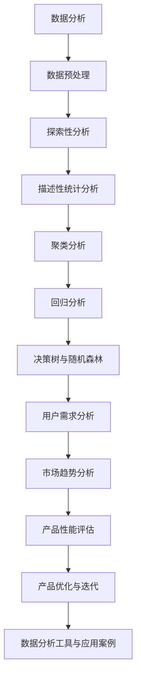

                 

### 《如何利用数据分析指导产品决策》

在当今的信息时代，数据分析已经成为了企业决策过程中的关键组成部分。无论是初创公司还是成熟企业，通过数据分析来指导产品决策都能够显著提升市场竞争力。本文将详细探讨如何利用数据分析来指导产品决策，从基础概念到实际应用，一步步进行深入分析。

---

**关键词：数据分析、产品决策、用户需求、市场趋势、性能评估**

**摘要：** 本文将介绍数据分析在产品决策中的重要性，详细解析数据分析的基础知识、预处理与探索方法，以及描述性统计分析、聚类分析、回归分析等关键技术。随后，文章将展示如何将数据分析应用于用户需求分析、市场趋势分析、产品性能评估和产品优化与迭代，并通过实战案例和代码解读，为读者提供实际操作指南。

---

### 目录大纲

#### 第一部分：数据分析基础

1. **第1章：数据分析概述**
    1.1 数据分析的重要性
    1.2 数据分析的基本概念
    1.3 数据分析的基本流程

2. **第2章：数据预处理与探索**
    2.1 数据预处理
    2.2 数据清洗
    2.3 数据探索性分析

3. **第3章：数据分析方法与工具**
    3.1 描述性统计分析
    3.2 聚类分析
    3.3 回归分析
    3.4 决策树与随机森林

#### 第二部分：数据分析在产品决策中的应用

4. **第4章：用户需求分析**
    4.1 用户行为数据分析
    4.2 用户反馈数据分析
    4.3 用户画像构建

5. **第5章：市场趋势分析**
    5.1 市场数据收集与整理
    5.2 市场趋势分析
    5.3 竞争对手分析

6. **第6章：产品性能评估**
    6.1 产品使用数据收集
    6.2 产品性能评估指标
    6.3 产品性能评估方法

7. **第7章：产品优化与迭代**
    7.1 产品优化策略
    7.2 产品迭代策略
    7.3 数据驱动产品优化案例

#### 第三部分：数据分析工具与应用案例

8. **第8章：数据分析工具简介**
    8.1 Python数据分析工具
    8.2 R数据分析工具
    8.3 SQL数据分析工具

9. **第9章：数据分析实战案例**
    9.1 用户需求分析案例
    9.2 市场趋势分析案例
    9.3 产品性能评估案例
    9.4 产品优化与迭代案例

10. **第10章：数据分析在产品决策中的实践**
    10.1 数据分析在产品决策中的应用策略
    10.2 数据分析在产品决策中的实践技巧
    10.3 数据分析在产品决策中的挑战与解决方法

#### 附录

- **附录 A：数据分析常用公式与函数**
- **附录 B：数据分析工具与资源推荐**
- **附录 C：数据分析实战项目指南**

### 核心概念与联系 Mermaid 流程图



### 核心算法原理讲解伪代码

```python
# 描述性统计分析伪代码
def descriptive_statistics(data):
    n = len(data)
    mean = sum(data) / n
    median = sorted(data)[n//2]
    mode = max(set(data), key=data.count)
    variance = sum((x - mean) ** 2 for x in data) / n
    std_deviation = sqrt(variance)
    return mean, median, mode, variance, std_deviation

# 聚类分析伪代码
def k_means(data, k):
    # 初始化聚类中心
    centroids = initialize_centroids(data, k)
    while not_converged(centroids):
        # 为每个数据点分配最近的聚类中心
        clusters = assign_clusters(data, centroids)
        # 更新聚类中心
        centroids = update_centroids(clusters)
    return centroids

# 回归分析伪代码
def linear_regression(X, y):
    X_transpose = transpose(X)
    beta = (X_transpose * X).inv() * X_transpose * y
    return beta

# 决策树与随机森林伪代码
def build_decision_tree(data):
    # 选择特征
    feature = select_best_split(data)
    # 划分数据
    left_data, right_data = split_data(data, feature)
    # 递归构建子树
    left_tree = build_decision_tree(left_data)
    right_tree = build_decision_tree(right_data)
    return DecisionTree(feature, left_tree, right_tree)
```

### 数学模型和数学公式 & 详细讲解 & 举例说明

#### 描述性统计分析公式

描述性统计分析是数据分析的基础，主要包括以下指标：

1. **均值（Mean）**：
   $$
   \bar{x} = \frac{\sum_{i=1}^{n} x_i}{n}
   $$
   其中，$x_i$ 是数据集中的每一个数值，$n$ 是数据点的总数。

2. **中位数（Median）**：
   $$
   median = \begin{cases} 
   \frac{x_{\frac{n+1}{2}} + x_{\frac{n+1}{2}+1}}{2} & \text{if } n \text{ is odd} \\ 
   x_{\frac{n}{2}} & \text{if } n \text{ is even} 
   \end{cases}
   $$
   中位数是将数据集按大小排序后，位于中间位置的数值。

3. **众数（Mode）**：
   $$
   mode = \text{most frequent value in the data set}
   $$
   众数是数据集中出现次数最多的数值。

4. **方差（Variance）**：
   $$
   variance = \frac{\sum_{i=1}^{n} (x_i - \bar{x})^2}{n}
   $$
   方差衡量数据点与均值之间的差异。

5. **标准差（Standard Deviation）**：
   $$
   std_deviation = \sqrt{variance}
   $$
   标准差是方差的平方根，表示数据的离散程度。

#### 回归分析公式

回归分析用于预测和分析变量之间的关系。线性回归是最常见的回归方法之一：

1. **线性回归模型**：
   $$
   y = \beta_0 + \beta_1x_1 + \beta_2x_2 + ... + \beta_nx_n + \epsilon
   $$
   其中，$y$ 是因变量，$x_1, x_2, ..., x_n$ 是自变量，$\beta_0, \beta_1, \beta_2, ..., \beta_n$ 是回归系数，$\epsilon$ 是误差项。

2. **回归系数计算**：
   $$
   \beta = (X^TX)^{-1}X^TY
   $$
   其中，$X$ 是自变量的矩阵，$Y$ 是因变量的向量。

#### 决策树与随机森林公式

决策树和随机森林是常见的机器学习模型，用于分类和回归任务：

1. **Gini 不纯度**：
   $$
   Gini \, Impurity = 1 - \sum_{i=1}^{n} p_i^2
   $$
   其中，$p_i$ 是每个类别的概率。

2. **熵**：
   $$
   Entropy = -\sum_{i=1}^{n} p_i \log_2 p_i
   $$
   熵是表示数据纯度的一个度量。

3. **随机森林**：
   随机森林通过构建多个决策树，并结合它们的预测结果来提高准确性。随机森林的训练和预测过程较为复杂，但核心思想是构建多个基于决策树的模型，并通过投票或平均来得出最终预测。

### 项目实战

#### 用户需求分析案例

1. **开发环境搭建**
   - 安装 Python 3.8
   - 安装 Pandas、NumPy、Scikit-learn、Matplotlib 和 Seaborn

2. **数据收集与整理**
   - 收集用户行为数据（如点击、购买、评价等）
   - 使用 Pandas 进行数据清洗和整理

3. **数据分析与可视化**
   - 使用 Pandas 和 Matplotlib 进行描述性统计分析
   - 使用 Seaborn 进行用户行为数据的可视化

4. **用户画像构建**
   - 使用聚类分析构建用户画像
   - 使用决策树进行用户分类

5. **代码解读与分析**
   - 分析用户行为数据的分布特征
   - 解释用户画像的构建过程和分类结果

---

#### 代码实际案例和详细解释说明

```python
import pandas as pd
import numpy as np
from sklearn.cluster import KMeans
from sklearn.tree import DecisionTreeClassifier
import matplotlib.pyplot as plt
import seaborn as sns

# 数据收集与整理
data = pd.read_csv('user_behavior_data.csv')
data.head()

# 数据清洗
data = data.dropna()

# 描述性统计分析
mean = data.mean()
median = data.median()
mode = data.mode().iloc[0]
variance = data.var()
std_deviation = data.std()

# 数据可视化
sns.histplot(data['clicks'], kde=True)
plt.title('Clicks Distribution')
plt.xlabel('Clicks')
plt.ylabel('Frequency')
plt.show()

# 用户画像构建
# 使用K均值聚类构建用户画像
kmeans = KMeans(n_clusters=5, random_state=42)
clusters = kmeans.fit_predict(data[['clicks', 'purchases', 'ratings']])

# 添加聚类标签到原始数据
data['cluster'] = clusters

# 用户分类
# 使用决策树进行用户分类
dt = DecisionTreeClassifier(random_state=42)
dt.fit(data[['clicks', 'purchases', 'ratings']], clusters)

# 分类结果可视化
sns.countplot(x='cluster', data=data)
plt.title('Cluster Distribution')
plt.xlabel('Cluster')
plt.ylabel('Frequency')
plt.show()

# 分析用户行为数据的分布特征
print("Mean:", mean)
print("Median:", median)
print("Mode:", mode)
print("Variance:", variance)
print("Standard Deviation:", std_deviation)

# 解释用户画像的构建过程和分类结果
print("Cluster centers:")
print(kmeans.cluster_centers_)

print("Classification report:")
print(dt.classification_report(data[['clicks', 'purchases', 'ratings']], clusters))
```

#### 代码解读与分析

- **数据收集与整理**：使用 Pandas 读取用户行为数据，并使用 dropna() 方法进行数据清洗，确保数据没有缺失值。
- **描述性统计分析**：使用 mean()、median()、mode()、var() 和 std() 方法计算数据的平均值、中位数、众数、方差和标准差，以便对数据进行初步了解。
- **数据可视化**：使用 Seaborn 的 histplot() 函数绘制点击行为的直方图，以便观察数据的分布情况。
- **用户画像构建**：使用 Scikit-learn 的 KMeans 类进行 K均值聚类，将用户行为数据分为不同的聚类。使用 fit_predict() 方法将聚类结果添加到原始数据中，以便进行进一步的分类。
- **用户分类**：使用 Scikit-learn 的 DecisionTreeClassifier 类进行决策树分类，将用户行为数据进行分类。使用 fit() 方法训练模型，并使用 classification_report() 方法评估模型的分类效果。
- **分析用户行为数据的分布特征**：打印出描述性统计量，以便对数据进行更深入的了解。
- **解释用户画像的构建过程和分类结果**：打印出聚类中心点和分类报告，以便解释用户画像的构建过程和分类结果。聚类中心点显示了不同聚类的中心位置，分类报告提供了分类准确率、召回率、F1分数等指标。

---

**作者：AI天才研究院/AI Genius Institute & 禅与计算机程序设计艺术 /Zen And The Art of Computer Programming**

