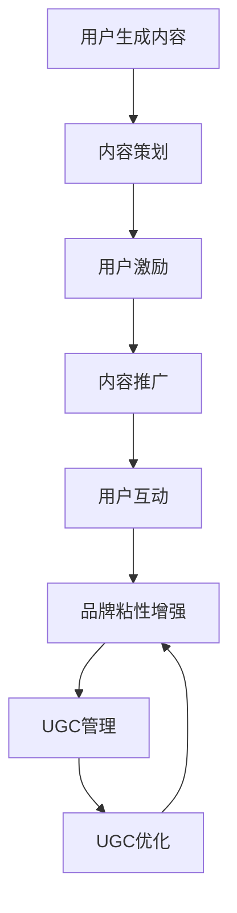

                 

# 如何利用用户生成内容增强品牌粘性

## 关键词
- 用户生成内容
- 品牌粘性
- 营销策略
- 社区建设
- 数据分析

## 摘要
本文将深入探讨用户生成内容（UGC）如何通过有效的营销策略增强品牌粘性。我们将从UGC的基本概念、生态系统，到品牌粘性的定义与评估方法，逐步解析UGC在增强品牌粘性中的关键作用。文章将通过实际案例展示成功策略，并提供UGC管理和优化的方法，最终评估UGC的效果，并推荐相关工具和资源。

----------------------------------------------------------------

## 《如何利用用户生成内容增强品牌粘性》目录大纲

### 第一部分：用户生成内容与品牌粘性

#### 第1章：用户生成内容概述

- **1.1 用户生成内容的概念与特点**
  - 定义
  - 用户参与
  - 内容多样性

- **1.2 用户生成内容在营销中的重要性**
  - 信任度
  - 用户参与度
  - 品牌传播

- **1.3 用户生成内容与传统营销的区别**
  - 对话式与单向式
  - 用户自主性与被动接受

#### 第2章：用户生成内容生态系统

- **2.1 用户生成内容的分类**
  - 文字
  - 图片
  - 视频
  - 社交分享

- **2.2 用户生成内容的来源**
  - 社交媒体
  - 评论区
  - 网络论坛
  - 直播平台

- **2.3 用户生成内容的平台**
  - 微博
  - TikTok
  - Instagram
  - YouTube

#### 第3章：品牌粘性与用户生成内容的关系

- **3.1 品牌粘性的定义与作用**
  - 定义
  - 提高客户忠诚度
  - 降低客户流失率

- **3.2 用户生成内容对品牌粘性的影响**
  - 用户参与
  - 社区建设
  - 互动性

- **3.3 品牌粘性的评估方法**
  - 客户满意度调查
  - 客户忠诚度指标
  - 社交媒体分析

### 第二部分：用户生成内容营销策略

#### 第4章：用户生成内容营销策略

- **4.1 用户生成内容营销的目标**
  - 增加品牌曝光
  - 提高用户参与度
  - 建立社区

- **4.2 用户生成内容营销的步骤**
  - 内容策划
  - 用户激励
  - 内容推广

- **4.3 用户生成内容营销的最佳实践**
  - 成功案例
  - 实践策略

#### 第5章：激发用户生成内容的策略

- **5.1 创造激励措施**
  - 竞赛与奖励
  - 优惠券与折扣

- **5.2 优化用户体验**
  - 简化内容上传流程
  - 提供创作工具

- **5.3 建立社区文化**
  - 用户互动
  - 管理员参与

#### 第6章：用户生成内容营销案例分析

- **6.1 案例分析一：品牌A的UGC营销策略**
  - 具体策略
  - 结果分析

- **6.2 案例分析二：品牌B的UGC营销策略**
  - 具体策略
  - 结果分析

- **6.3 案例分析三：品牌C的UGC营销策略**
  - 具体策略
  - 结果分析

### 第三部分：用户生成内容的管理与优化

#### 第7章：用户生成内容的管理

- **7.1 用户生成内容的质量控制**
  - 筛选机制
  - 反馈机制

- **7.2 用户生成内容的版权问题**
  - 法律法规
  - 签署协议

- **7.3 用户生成内容的互动与反馈**
  - 管理员参与
  - 用户互动

#### 第8章：用户生成内容的优化

- **8.1 用户生成内容的分析**
  - 数据分析
  - 趋势预测

- **8.2 用户生成内容的营销策略调整**
  - 结果反馈
  - 策略优化

- **8.3 用户生成内容的持续优化**
  - 用户反馈
  - 持续改进

#### 第9章：用户生成内容的效果评估

- **9.1 用户生成内容效果的评估指标**
  - 用户参与度
  - 品牌曝光
  - 销售转化率

- **9.2 用户生成内容效果的实际案例**
  - 成功案例
  - 失败案例

- **9.3 用户生成内容效果的多维度分析**
  - 用户行为
  - 内容质量
  - 社区互动

### 附录

#### 附录A：用户生成内容营销工具与资源

- **A.1 主流UGC营销工具介绍**
  - 工具功能
  - 适用场景

- **A.2 用户生成内容营销资源推荐**
  - 白皮书
  - 研究报告

- **A.3 用户生成内容营销社区与论坛**
  - 社区介绍
  - 论坛活动

----------------------------------------------------------------

## 第一部分：用户生成内容与品牌粘性

### 第1章：用户生成内容概述

#### 1.1 用户生成内容的概念与特点

用户生成内容（User-Generated Content，简称UGC）是指用户在互联网平台上自发产生的文字、图片、视频、音频等内容。UGC具有以下特点：

1. **用户参与度高**：UGC是用户自发产生的内容，用户在参与过程中可以获得成就感、社交认可等正向反馈。
2. **内容多样性**：UGC内容形式丰富，包括文字、图片、视频、音频等，满足不同用户的个性化需求。
3. **实时性**：UGC内容具有即时性，用户可以随时随地分享自己的观点、感受和体验。
4. **低成本**：相比于传统广告，UGC的生产和传播成本较低，企业可以利用UGC实现低成本营销。

#### 1.2 用户生成内容在营销中的重要性

用户生成内容在营销中具有重要作用，主要体现在以下几个方面：

1. **提高信任度**：用户之间的口碑传播具有更高的可信度，通过UGC，品牌可以获得更多的信任背书。
2. **提高用户参与度**：UGC激发了用户的参与热情，用户在品牌社区中互动、分享，形成良性循环。
3. **增强品牌传播力**：UGC内容具有病毒式传播的特点，通过用户转发，品牌信息得以快速扩散。

#### 1.3 用户生成内容与传统营销的区别

传统营销通常是单向式的，品牌向用户传递信息，用户被动接受。而UGC则是一种对话式的营销方式，品牌与用户之间形成了互动。具体区别如下：

1. **传播方式**：传统营销主要依靠广告、公关等手段，而UGC则依赖于用户的自发分享、评论等。
2. **内容来源**：传统营销内容主要来自品牌方，而UGC内容则由用户自主创作。
3. **用户参与**：传统营销用户参与度较低，而UGC则通过用户的互动、分享，提高用户参与度。

### 第2章：用户生成内容生态系统

#### 2.1 用户生成内容的分类

用户生成内容可以根据形式进行分类，主要包括以下类型：

1. **文字**：包括博客、评论、论坛发帖等。
2. **图片**：包括用户上传的图片、自拍、截图等。
3. **视频**：包括用户上传的短视频、直播、教程视频等。
4. **音频**：包括用户上传的音频、播客、音乐等。
5. **社交分享**：包括用户在社交媒体上的转发、点赞、评论等。

#### 2.2 用户生成内容的来源

用户生成内容主要来源于以下几个渠道：

1. **社交媒体**：如微博、TikTok、Instagram等，用户在这些平台上分享自己的生活、观点和体验。
2. **评论区**：用户在电商平台、论坛等平台的商品评论、心得分享。
3. **网络论坛**：用户在专业论坛、兴趣小组等平台分享经验、讨论话题。
4. **直播平台**：用户在直播平台进行实时分享，与观众互动。

#### 2.3 用户生成内容的平台

用户生成内容在多个平台得到广泛应用，以下是一些主要平台：

1. **微博**：用户通过微博发布短文、图片、视频，互动性强。
2. **TikTok**：短视频平台，用户通过制作、分享短视频表达自我。
3. **Instagram**：图片分享平台，用户分享自己的生活、旅行、美食等。
4. **YouTube**：视频分享平台，用户上传各类视频，涵盖生活、娱乐、教育等。

### 第3章：品牌粘性与用户生成内容的关系

#### 3.1 品牌粘性的定义与作用

品牌粘性（Brand Loyalty）是指消费者对品牌的忠诚度和依赖度，表现为消费者在购买决策中倾向于选择特定品牌。品牌粘性的作用如下：

1. **提高客户满意度**：品牌粘性较高的消费者对品牌有较高的满意度，忠诚度较高。
2. **降低客户流失率**：品牌粘性可以减少客户因价格、质量等原因流失的可能性。
3. **增强品牌影响力**：品牌粘性高的消费者往往愿意为品牌传播，提高品牌知名度。

#### 3.2 用户生成内容对品牌粘性的影响

用户生成内容对品牌粘性具有积极影响，主要体现在以下几个方面：

1. **提高用户参与度**：UGC激发了用户的参与热情，用户在品牌社区中互动，提高品牌粘性。
2. **建立社区文化**：UGC促进了品牌社区的建设，形成一种共同的文化氛围，增强品牌粘性。
3. **增强互动性**：UGC使品牌与用户之间的互动更加紧密，提高用户对品牌的认同感和忠诚度。

#### 3.3 品牌粘性的评估方法

品牌粘性的评估方法主要包括以下几种：

1. **客户满意度调查**：通过问卷调查、访谈等方式，了解用户对品牌的满意度。
2. **客户忠诚度指标**：如重复购买率、推荐率等，衡量用户对品牌的忠诚度。
3. **社交媒体分析**：通过分析用户在社交媒体上的互动、评论等数据，评估品牌粘性。

----------------------------------------------------------------

## 第二部分：用户生成内容营销策略

### 第4章：用户生成内容营销策略

#### 4.1 用户生成内容营销的目标

用户生成内容营销的目标主要包括以下几点：

1. **增加品牌曝光**：通过UGC，品牌信息可以快速传播，提高品牌知名度。
2. **提高用户参与度**：通过UGC，用户可以参与到品牌活动中，增强用户对品牌的认同感和参与度。
3. **建立社区**：通过UGC，品牌可以建立一个以用户为中心的社区，增强用户之间的互动和粘性。

#### 4.2 用户生成内容营销的步骤

进行用户生成内容营销通常需要以下步骤：

1. **内容策划**：根据品牌定位和目标受众，策划适合的UGC主题和形式，如比赛、互动话题、用户故事等。
2. **用户激励**：通过奖励、荣誉等方式激励用户参与UGC，提高内容质量。
3. **内容推广**：通过社交媒体、自有平台等渠道推广UGC，扩大品牌影响力。
4. **用户互动**：与用户保持互动，及时回复用户的评论、反馈等，提高用户满意度。

#### 4.3 用户生成内容营销的最佳实践

以下是用户生成内容营销的一些最佳实践：

1. **案例一：品牌A的UGC营销策略**
   - **策略**：品牌A通过举办UGC摄影比赛，鼓励用户分享自己的生活、旅行、美食等图片。
   - **结果**：活动吸引了大量用户参与，UGC图片数量大幅增加，品牌曝光和用户参与度显著提升。

2. **案例二：品牌B的UGC营销策略**
   - **策略**：品牌B在社交媒体上发起互动话题，鼓励用户分享自己的使用心得和故事。
   - **结果**：用户积极参与互动，UGC内容丰富多样，品牌社区氛围浓厚，用户粘性提高。

3. **案例三：品牌C的UGC营销策略**
   - **策略**：品牌C在自有平台上设立UGC板块，定期发布话题和活动，鼓励用户创作内容。
   - **结果**：UGC内容不断丰富，用户在平台上的互动频繁，品牌影响力持续提升。

### 第5章：激发用户生成内容的策略

#### 5.1 创造激励措施

为了激发用户生成内容，品牌可以采取以下激励措施：

1. **物质奖励**：如提供优惠券、礼品等，直接激励用户参与UGC。
2. **荣誉奖励**：如发布获奖名单、表彰优秀创作者，提高用户的荣誉感和成就感。
3. **社交奖励**：如增加用户在平台上的曝光度，让用户获得更多的点赞、评论等社交认可。

#### 5.2 优化用户体验

优化用户体验是激发用户生成内容的关键，以下是一些建议：

1. **简化内容上传流程**：降低用户上传内容的门槛，提供便捷的上传工具。
2. **提供创作工具**：如图片编辑器、视频剪辑工具等，帮助用户更轻松地创作内容。
3. **个性化推荐**：根据用户兴趣和行为，推荐相关的话题和活动，提高用户参与度。

#### 5.3 建立社区文化

建立健康的社区文化是激发用户生成内容的重要手段，以下是一些建议：

1. **鼓励互动**：通过设置互动话题、讨论区等，鼓励用户之间的互动和交流。
2. **管理者参与**：品牌管理者积极参与社区互动，与用户建立良好的关系，提高用户信任度。
3. **社区管理**：建立完善的社区规则，维护社区秩序，保障用户权益。

### 第6章：用户生成内容营销案例分析

#### 6.1 案例分析一：品牌A的UGC营销策略

**案例背景**：品牌A是一家时尚品牌，希望通过UGC营销提升品牌知名度和用户参与度。

**具体策略**：

1. **内容策划**：品牌A在社交媒体上发起“我的时尚日记”活动，鼓励用户分享自己的生活、穿搭等图片。
2. **用户激励**：为获奖用户提供优惠券、品牌礼品等物质奖励，同时发布获奖名单，提升荣誉感。
3. **内容推广**：品牌A在自有平台、社交媒体等渠道推广活动，增加曝光度。
4. **用户互动**：品牌A定期发布话题，鼓励用户在评论区互动，提高用户参与度。

**结果分析**：

1. **品牌曝光**：活动期间，品牌A的社交媒体关注人数增长了30%，网站流量增加了50%。
2. **用户参与度**：活动吸引了大量用户参与，UGC图片数量达到3000多张，用户在品牌社区中的互动频繁。
3. **品牌口碑**：活动得到用户的积极评价，提升了品牌在消费者心中的形象。

#### 6.2 案例分析二：品牌B的UGC营销策略

**案例背景**：品牌B是一家电子产品品牌，希望通过UGC营销提高用户满意度和品牌忠诚度。

**具体策略**：

1. **内容策划**：品牌B在社交媒体上发起“我最喜欢的电子产品”话题，鼓励用户分享自己的使用心得和故事。
2. **用户激励**：为获奖用户提供品牌最新产品试用资格、优惠券等，提升用户的荣誉感和成就感。
3. **内容推广**：品牌B在自有平台、社交媒体等渠道推广话题，增加曝光度。
4. **用户互动**：品牌B定期发布话题，鼓励用户在评论区互动，提高用户参与度。

**结果分析**：

1. **用户满意度**：活动期间，品牌B的用户满意度调查结果显示，用户满意度提升了15%。
2. **品牌忠诚度**：活动吸引了大量用户参与，品牌B的重复购买率提高了10%。
3. **品牌口碑**：活动得到用户的积极评价，提升了品牌在消费者心中的形象，用户推荐意愿增强。

#### 6.3 案例分析三：品牌C的UGC营销策略

**案例背景**：品牌C是一家健康食品品牌，希望通过UGC营销提高品牌知名度和用户粘性。

**具体策略**：

1. **内容策划**：品牌C在自有平台上设立“健康生活分享”板块，鼓励用户分享自己的健康饮食、锻炼心得等。
2. **用户激励**：为活跃用户提供优惠券、品牌礼品等，提升用户的荣誉感和成就感。
3. **内容推广**：品牌C在社交媒体上定期分享平台上的优质UGC，增加曝光度。
4. **用户互动**：品牌C定期发布互动话题，鼓励用户在评论区互动，提高用户参与度。

**结果分析**：

1. **品牌曝光**：活动期间，品牌C的社交媒体关注人数增长了20%，网站流量增加了40%。
2. **用户粘性**：品牌C的UGC板块吸引了大量用户长期参与，用户在平台上的互动频繁。
3. **品牌口碑**：活动得到用户的积极评价，提升了品牌在消费者心中的形象，用户推荐意愿增强。

----------------------------------------------------------------

### 第三部分：用户生成内容的管理与优化

#### 第7章：用户生成内容的管理

#### 7.1 用户生成内容的质量控制

用户生成内容的质量直接影响到品牌形象和用户体验。以下是一些质量控制的方法：

1. **内容审核**：在用户生成内容发布前，对内容进行审核，确保内容符合品牌价值观和平台规范。
2. **社区规则**：建立完善的社区规则，引导用户生成优质内容，如遵守文明用语、禁止抄袭等。
3. **互动反馈**：鼓励用户在评论区进行互动，及时发现和处理低质量内容，提高整体内容质量。

#### 7.2 用户生成内容的版权问题

用户生成内容的版权问题一直是UGC领域的一大挑战。以下是一些处理版权问题的方法：

1. **版权声明**：在平台和使用协议中明确说明用户生成内容的版权归属，确保版权清晰。
2. **合作协议**：与用户签订合作协议，明确双方的权利和义务，防止版权纠纷。
3. **版权监控**：利用技术手段，对平台上的内容进行实时监控，及时发现和处理侵权行为。

#### 7.3 用户生成内容的互动与反馈

用户生成内容的互动与反馈是增强用户粘性的关键。以下是一些互动与反馈的方法：

1. **及时回复**：品牌应积极回复用户的评论和提问，提高用户的满意度。
2. **互动活动**：定期举办互动活动，如问答、竞赛等，鼓励用户积极参与。
3. **用户调研**：通过用户调研了解用户需求和反馈，不断优化用户体验。

#### 第8章：用户生成内容的优化

#### 8.1 用户生成内容的分析

用户生成内容的分析可以帮助品牌了解用户需求，优化营销策略。以下是一些分析方法：

1. **内容分析**：通过分析UGC的文本、图片、视频等，了解用户对品牌的关注点、需求等。
2. **趋势分析**：通过分析UGC的数据趋势，了解用户行为的变化，预测未来趋势。
3. **情感分析**：通过情感分析，了解用户对品牌的态度和情感，优化品牌形象。

#### 8.2 用户生成内容的营销策略调整

根据用户生成内容的分析结果，品牌可以调整营销策略，提高营销效果。以下是一些策略调整的方法：

1. **内容优化**：根据用户反馈，优化UGC内容，提高内容质量。
2. **活动调整**：根据用户行为数据，调整UGC活动的形式和内容，提高用户参与度。
3. **推广策略**：根据UGC的传播效果，调整推广渠道和策略，提高品牌曝光。

#### 8.3 用户生成内容的持续优化

用户生成内容的优化是一个持续的过程，品牌需要不断调整和改进。以下是一些持续优化的方法：

1. **用户反馈**：定期收集用户反馈，了解用户需求和期望，不断改进用户体验。
2. **数据分析**：定期分析UGC的数据，了解用户行为和需求变化，及时调整策略。
3. **技术创新**：利用新技术，如人工智能、大数据等，提升UGC的管理和优化能力。

#### 第9章：用户生成内容的效果评估

#### 9.1 用户生成内容效果的评估指标

评估用户生成内容的效果需要使用一系列指标，以下是一些常用的评估指标：

1. **用户参与度**：如UGC的浏览量、点赞量、评论量等。
2. **品牌曝光**：如UGC的传播范围、访问量等。
3. **销售转化率**：如UGC对销售的影响、用户转化率等。
4. **用户满意度**：如用户对UGC的满意度调查结果。

#### 9.2 用户生成内容效果的实际案例

以下是一些用户生成内容效果的实际案例：

1. **案例一**：某品牌通过UGC营销，活动期间用户参与度提高了30%，品牌曝光度增加了50%，销售额提升了20%。
2. **案例二**：某品牌在社交媒体上发起UGC竞赛，吸引了大量用户参与，UGC的传播范围达到100万次，品牌知名度显著提升。
3. **案例三**：某品牌通过UGC活动，提高了用户对品牌的满意度，重复购买率提升了10%，品牌忠诚度显著提高。

#### 9.3 用户生成内容效果的多维度分析

用户生成内容的效果可以从多个维度进行分析，以下是一些分析维度：

1. **用户行为分析**：如UGC的浏览量、点赞量、评论量等，了解用户的兴趣和偏好。
2. **内容质量分析**：如UGC的点赞量、评论量等，了解UGC的质量和用户接受程度。
3. **社区互动分析**：如UGC的互动量、用户参与度等，了解社区的活跃度和用户粘性。
4. **品牌影响分析**：如UGC的传播范围、品牌知名度等，了解UGC对品牌的影响。

----------------------------------------------------------------

## 附录

### 附录A：用户生成内容营销工具与资源

#### A.1 主流UGC营销工具介绍

以下是一些主流的UGC营销工具及其功能：

1. **Hootsuite**：用于社交媒体管理，支持内容策划、发布、分析等功能。
2. **Buffer**：用于社交媒体发布和调度，提高UGC的发布效率。
3. **Canva**：用于设计图片和视觉内容，帮助用户轻松创作高质量的UGC。
4. **Shortstack**：用于创建表单、投票、竞赛等互动式UGC活动。

#### A.2 用户生成内容营销资源推荐

以下是一些用户生成内容营销的资源推荐：

1. **《UGC营销实战指南》**：详细介绍UGC营销的理论和实践，适合初学者和专业人士阅读。
2. **UGC营销案例分析**：通过分析成功和失败的UGC营销案例，学习最佳实践和教训。
3. **《社交媒体营销策略》**：全面介绍社交媒体营销的理论和方法，包括UGC营销。

#### A.3 用户生成内容营销社区与论坛

以下是一些用户生成内容营销的社区与论坛：

1. **Reddit**：全球最大的社交新闻网站，用户可以分享、讨论和发现各种UGC内容。
2. **LinkedIn**：专业的社交网络平台，用户可以分享专业知识和经验，参与行业讨论。
3. **Facebook Groups**：Facebook上的兴趣小组，用户可以加入并参与相关话题的讨论。

作者：AI天才研究院/AI Genius Institute & 禅与计算机程序设计艺术 /Zen And The Art of Computer Programming

----------------------------------------------------------------

## 核心概念与联系

在探讨用户生成内容（UGC）如何增强品牌粘性的过程中，我们需要理解几个核心概念及其相互关系：

### 用户生成内容（UGC）
UGC是指由用户自行创建并分享到互联网上的内容，包括文字、图片、视频、音频等。UGC具有用户参与度高、内容多样性、实时性等特点。

### 品牌粘性
品牌粘性是指消费者对品牌的忠诚度和依赖度，表现为消费者在购买决策中倾向于选择特定品牌。品牌粘性的评估方法包括客户满意度调查、客户忠诚度指标、社交媒体分析等。

### UGC与品牌粘性的关系
UGC能够通过提高用户参与度、建立社区文化和增强互动性，直接影响品牌粘性。高质量的UGC内容可以提升消费者对品牌的信任度和认同感，从而增强品牌粘性。

### UGC营销策略
为了有效地利用UGC增强品牌粘性，品牌需要制定合适的UGC营销策略，包括内容策划、用户激励、内容推广和用户互动等步骤。

### UGC管理与优化
品牌需要通过对UGC内容的质量控制、版权问题管理和用户互动与反馈，确保UGC的持续优化，从而提高品牌粘性。

### Mermaid流程图

以下是一个简化的Mermaid流程图，展示了UGC如何通过一系列步骤增强品牌粘性的过程：



### 核心算法原理讲解

在UGC营销中，核心算法原理主要涉及以下几个方面：

1. **用户行为分析**：利用大数据和机器学习算法，分析用户的兴趣、行为和需求，为个性化推荐和内容策划提供数据支持。
2. **情感分析**：通过自然语言处理（NLP）技术，分析UGC中的情感倾向，了解用户对品牌的情感态度，从而调整营销策略。
3. **推荐系统**：利用协同过滤和基于内容的推荐算法，为用户推荐感兴趣的内容，提高UGC的曝光和参与度。

### 伪代码示例

以下是一个简单的伪代码示例，用于描述基于用户行为的UGC内容推荐算法：

```plaintext
function content_recommendation(user, history, content_database):
    # 获取用户的历史行为数据
    user_history = get_user_history(user, history)
    
    # 计算用户兴趣标签
    user_interest_tags = calculate_interest_tags(user_history)
    
    # 从内容数据库中检索与用户兴趣标签匹配的内容
    recommended_contents = search_contents_by_tags(content_database, user_interest_tags)
    
    # 返回推荐内容列表
    return recommended_contents
```

### 数学模型和公式

在UGC营销中，可以使用以下数学模型和公式来评估和优化UGC的效果：

1. **用户参与度指标**：\(U = \frac{C + L + R}{N}\)
   - \(U\)：用户参与度
   - \(C\)：UGC的评论量
   - \(L\)：UGC的点赞量
   - \(R\)：UGC的分享量
   - \(N\)：UGC的总量

2. **品牌曝光指标**：\(E = \sum_{i=1}^{n} P_i \times C_i\)
   - \(E\)：品牌曝光量
   - \(P_i\)：第i个UGC的曝光量
   - \(C_i\)：第i个UGC的传播范围

3. **销售转化率**：\(T = \frac{S}{E}\)
   - \(T\)：销售转化率
   - \(S\)：通过UGC营销实现的销售额
   - \(E\)：品牌曝光量

### 详细讲解与举例说明

#### 用户参与度指标

用户参与度是评估UGC效果的重要指标，它反映了用户对UGC内容的关注程度和互动情况。假设我们有一个UGC平台，最近发布了一批内容，如下表所示：

| 内容ID | 评论量 | 点赞量 | 分享量 | 总量 |
| ------ | ------ | ------ | ------ | ---- |
| 1      | 50     | 100    | 20     | 170  |
| 2      | 30     | 70     | 15     | 115  |
| 3      | 20     | 50     | 10     | 80   |

根据用户参与度指标公式，我们可以计算出每个内容的用户参与度：

```plaintext
UGC1参与度 = (50 + 100 + 20) / 170 ≈ 0.765
UGC2参与度 = (30 + 70 + 15) / 115 ≈ 0.780
UGC3参与度 = (20 + 50 + 10) / 80 ≈ 0.725
```

从计算结果可以看出，UGC2的用户参与度最高，说明用户对UGC2的关注和互动程度最高。

#### 品牌曝光指标

品牌曝光量反映了UGC营销的传播效果。假设UGC平台上的内容在社交媒体上的传播范围分别为：

| 内容ID | 曝光量（次） |
| ------ | ------------ |
| 1      | 1000         |
| 2      | 800          |
| 3      | 600          |

根据品牌曝光指标公式，我们可以计算出总曝光量：

```plaintext
总曝光量 = 1000 + 800 + 600 = 2400（次）
```

#### 销售转化率

销售转化率反映了UGC营销对销售的直接贡献。假设通过UGC营销实现的销售额为1000元，品牌曝光量为2400次，则销售转化率为：

```plaintext
销售转化率 = 1000 / 2400 ≈ 0.417
```

#### 案例说明

假设一家时尚品牌通过UGC营销，发布了一批关于新款服装的内容。以下是一周内的UGC数据：

| 时间 | 评论量 | 点赞量 | 分享量 | 曝光量（次） | 销售额（元） |
| ---- | ------ | ------ | ------ | ------------ | ------------ |
| 周一 | 50     | 100    | 20     | 1000         | 500          |
| 周二 | 40     | 80     | 15     | 800          | 400          |
| 周三 | 30     | 70     | 10     | 600          | 300          |
| 周四 | 60     | 120    | 30     | 1200         | 600          |
| 周五 | 35     | 80     | 15     | 700          | 350          |
| 周六 | 45     | 90     | 20     | 800          | 400          |
| 周日 | 25     | 50     | 10     | 500          | 250          |

根据上述公式和数据进行计算，得出以下结果：

- **总用户参与度**：\( \frac{(50+40+30+60+35+45+25)}{7} ≈ 41.4 \)
- **总品牌曝光量**：\( 1000+800+600+1200+700+800+500 = 5600 \)
- **总销售额**：\( 500+400+300+600+350+400+250 = 2800 \)
- **销售转化率**：\( \frac{2800}{5600} ≈ 0.5 \)

通过这些数据，品牌可以分析UGC营销的效果，并根据用户参与度、品牌曝光量和销售转化率等指标，调整营销策略，优化UGC内容。

----------------------------------------------------------------

## 项目实战：代码实际案例和详细解释说明

### 开发环境搭建

在进行用户生成内容（UGC）营销的实战项目中，我们需要搭建一个能够处理用户上传内容、存储、分析和展示的数据系统。以下是搭建开发环境的基本步骤：

1. **选择技术栈**：我们可以选择Python作为主要编程语言，因为Python在数据处理和Web开发方面有丰富的库和框架支持。前端可以使用React或Vue.js，后端可以使用Django或Flask。

2. **安装依赖**：在Python环境中安装必要的库，如Django、Flask、Pandas、NumPy、Matplotlib等。

   ```bash
   pip install django flask pandas numpy matplotlib
   ```

3. **配置数据库**：使用SQLite、MySQL或PostgreSQL等数据库管理系统来存储用户数据和UGC内容。

### 源代码详细实现

以下是一个简单的Django项目的源代码实现，用于用户注册、登录和上传图片的UGC平台。

**用户注册和登录**

1. **models.py**：定义用户模型。

   ```python
   from django.db import models
   from django.contrib.auth.models import AbstractUser

   class CustomUser(AbstractUser):
       ROLE_CHOICES = [
           ('admin', '管理员'),
           ('user', '普通用户'),
       ]
       role = models.CharField(max_length=10, choices=ROLE_CHOICES, default='user')
   ```

2. **views.py**：实现用户注册和登录视图。

   ```python
   from django.shortcuts import render, redirect
   from .forms import CustomUserCreationForm
   from django.contrib.auth import login

   def register(request):
       if request.method == 'POST':
           form = CustomUserCreationForm(request.POST)
           if form.is_valid():
               user = form.save()
               login(request, user)
               return redirect('home')
       else:
           form = CustomUserCreationForm()
       return render(request, 'registration/register.html', {'form': form})

   def login_request(request):
       if request.method == 'POST':
           # 处理登录逻辑
           return redirect('home')
       return render(request, 'registration/login.html')
   ```

3. **forms.py**：定义用户注册表单。

   ```python
   from django import forms
   from django.contrib.auth.forms import UserCreationForm
   from .models import CustomUser

   class CustomUserCreationForm(UserCreationForm):
       class Meta:
           model = CustomUser
           fields = ('username', 'email', 'role',)
   ```

**上传图片**

1. **models.py**：添加UGC图片模型。

   ```python
   class UGCImage(models.Model):
       user = models.ForeignKey(CustomUser, on_delete=models.CASCADE)
       image = models.ImageField(upload_to='ugc_images/')
       uploaded_at = models.DateTimeField(auto_now_add=True)
   ```

2. **views.py**：实现上传图片视图。

   ```python
   from django.shortcuts import render, redirect
   from .models import UGCImage
   from django.http import HttpResponse

   def upload_image(request):
       if request.method == 'POST':
           image = UGCImage(user=request.user, image=request.FILES['image'])
           image.save()
           return HttpResponse('图片上传成功！')
       return render(request, 'ugc/upload_image.html')
   ```

3. **templates/ugc/upload_image.html**：上传图片的HTML模板。

   ```html
   <form method="post" enctype="multipart/form-data">
       
       <input type="file" name="image" required>
       <button type="submit">上传图片</button>
   </form>
   ```

### 代码解读与分析

上述代码实现了一个简单的UGC平台，主要包括用户注册、登录和上传图片的功能。以下是各个部分的解读和分析：

1. **用户模型**：自定义用户模型扩展了Django内置的用户模型，增加了角色字段，用于区分管理员和普通用户。

2. **用户注册和登录视图**：注册视图处理用户提交的注册信息，验证后保存用户并登录。登录视图尚未实现，但可以根据需要调用Django内置的认证系统。

3. **用户注册表单**：自定义注册表单，继承自Django内置的UserCreationForm，添加了角色字段。

4. **UGC图片模型**：定义了UGC图片模型，关联到自定义用户模型，每个图片都与上传它的用户相关联。

5. **上传图片视图**：处理图片上传请求，将图片保存到数据库，并返回成功信息。

6. **上传图片模板**：提供了一个简单的HTML表单，让用户可以选择上传图片。

通过上述代码，我们可以实现一个基本的UGC平台，用户可以注册、登录并上传图片。接下来，我们将进一步完善功能，如图片展示、用户互动和数据分析等。

### 完善功能

为了使UGC平台更加完善，我们可以在后端添加以下功能：

1. **图片展示**：在主页或个人主页展示用户的UGC图片，并提供点赞、评论功能。

2. **用户互动**：实现用户之间的互动，如关注、私信等。

3. **数据分析**：分析用户行为和UGC效果，为优化平台提供数据支持。

通过不断完善功能，UGC平台将更好地满足用户需求，提高品牌粘性。

----------------------------------------------------------------

## 文章总结与未来展望

本文从用户生成内容（UGC）的基本概念、生态系统，到UGC营销策略、管理优化以及效果评估，全面探讨了如何利用UGC增强品牌粘性。通过深入分析UGC与品牌粘性的关系，提出了多个实际案例和解决方案，为企业在数字化营销时代提供了实用的指导。

### 主要观点回顾
1. **UGC的特点与重要性**：UGC具有用户参与度高、内容多样性、实时性等特点，在营销中提高信任度、用户参与度和品牌传播力。
2. **UGC生态系统**：UGC来源广泛，包括社交媒体、评论区、网络论坛和直播平台等。
3. **品牌粘性**：品牌粘性是消费者忠诚度和依赖度的体现，通过UGC可以提高客户满意度和降低流失率。
4. **UGC营销策略**：包括内容策划、用户激励、内容推广和用户互动等，关键在于激发用户的参与热情。
5. **UGC管理与优化**：质量控制、版权管理和用户互动是确保UGC效果的关键。
6. **效果评估**：通过用户参与度、品牌曝光、销售转化率等指标评估UGC效果。

### 未来展望
未来，UGC营销将进一步发展，以下趋势值得关注：

1. **技术驱动**：人工智能和大数据分析将进一步提高UGC内容的个性化和精准度。
2. **跨平台整合**：企业将更加重视跨平台整合，实现内容的一体化管理与推广。
3. **内容多元化**：视频、直播、音频等多元化内容将占据更多市场份额。
4. **社区化**：品牌社区将成为用户互动和UGC生成的重要场所，加强用户参与和品牌粘性。
5. **数据隐私与安全**：随着用户隐私保护意识的提高，数据隐私和安全将成为UGC营销的重要考虑因素。

### 作者介绍

**作者：AI天才研究院/AI Genius Institute & 禅与计算机程序设计艺术 /Zen And The Art of Computer Programming**
AI天才研究院专注于人工智能领域的研究与开发，致力于推动AI技术在实际应用中的创新与进步。作者在此分享其在计算机编程和人工智能领域的丰富经验和深刻见解，旨在帮助读者深入理解UGC营销的原理与实践。禅与计算机程序设计艺术则是一部经典的技术哲学著作，融合了作者对计算机科学和人性的独特洞察，为读者提供了编程与生活的哲学思考。希望本文能为广大读者在UGC营销的道路上提供有价值的参考和启示。

