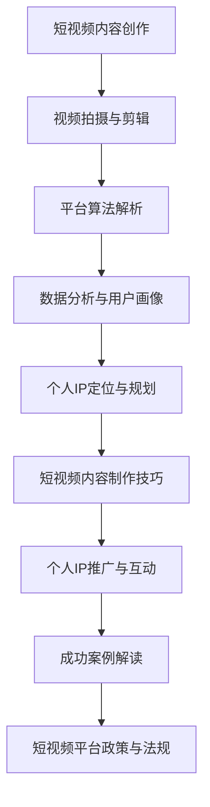

                 

# 《如何利用短视频平台建立个人IP》

## 关键词

短视频平台，个人IP，内容创作，用户互动，算法推荐，成功案例

## 摘要

随着移动互联网的快速发展，短视频平台已经成为个人展示才华、建立影响力的重要途径。本文将系统地探讨如何利用短视频平台建立个人IP，包括市场分析、技术基础、IP定位与规划、内容制作技巧、推广互动及政策法规等方面。通过深入剖析成功案例，提供实用的策略和工具，帮助读者在短视频平台上成功建立个人IP，实现个人品牌价值的提升。

### 《如何利用短视频平台建立个人IP》目录大纲

#### 第一部分：短视频平台概述

##### 第1章：短视频平台市场分析

- 1.1 短视频平台的发展历程
- 1.2 当前短视频平台的格局
- 1.3 短视频市场的未来趋势

##### 第2章：短视频平台技术基础

- 2.1 短视频内容创作技术
- 2.2 短视频平台算法解析
- 2.3 数据分析与用户画像

#### 第二部分：个人IP建立策略

##### 第3章：个人IP定位与规划

- 3.1 个人IP的价值与定位
- 3.2 个人IP的规划与策略
- 3.3 个人IP的长期发展

##### 第4章：短视频内容制作技巧

- 4.1 短视频内容类型分析
- 4.2 视频拍摄与剪辑技巧
- 4.3 播放量提升策略

##### 第5章：个人IP推广与互动

- 5.1 社交媒体运营策略
- 5.2 粉丝互动与粘性提升
- 5.3 跨平台推广与合作

#### 第三部分：案例分析

##### 第6章：成功案例解读

- 6.1 案例一：某短视频平台红人的成长历程
- 6.2 案例二：某知名KOL的运营策略
- 6.3 案例三：某短视频平台品牌合作案例

##### 第7章：短视频平台政策与法规

- 7.1 短视频平台相关政策解析
- 7.2 个人IP内容合规要求
- 7.3 风险防范与应对策略

#### 附录

- 附录A：短视频平台常用工具与应用
- 附录B：短视频内容创作资源汇总

#### Mermaid 流程图



#### 核心概念与联系

- **短视频平台技术基础**

  - **短视频内容创作技术**：涉及视频拍摄、剪辑、特效等，是短视频创作的基础。
  - **平台算法解析**：理解短视频平台的推荐算法，有助于提升内容曝光率。
  - **数据分析与用户画像**：通过对用户数据的分析，可以更精准地定位和吸引目标观众。

#### 核心算法原理讲解

- **推荐算法**

  
  ```python
  def recommendAlgorithm(video, user):
      # 获取用户兴趣标签
      userInterests = getUserInterests(user)
      
      # 获取视频标签
      videoTags = getVideoTags(video)
      
      # 计算兴趣匹配度
      matchScore = calculateMatchScore(userInterests, videoTags)
      
      # 排序推荐结果
      recommendResults = sortVideosByMatchScore(matchScore)
      
      return recommendResults
  ```

  **数学模型和数学公式**

  $$
  \text{MatchScore} = \frac{\text{标签交集大小}}{\text{标签并集大小}}
  $$

  **举例说明**：假设用户A的兴趣标签有{科技，生活，旅行}，视频B的标签有{科技，生活}，则它们的标签匹配度为：
  $$
  \text{MatchScore} = \frac{2}{4} = 0.5
  $$

#### 项目实战

- **短视频内容制作案例**

  **开发环境搭建**：使用Adobe Premiere Pro进行视频剪辑，使用Audacity进行音频处理。

  **源代码详细实现**：这里只提供伪代码框架，具体实现需要结合软件操作。

  
  ```python
  def createVideo(content, videoLength):
      # 导入素材
      video素材 = importVideoContent(content)
      
      # 剪辑视频
      video剪辑 = cutVideo(video素材, videoLength)
      
      # 添加特效
      video剪辑 = addEffects(video剪辑)
      
      # 处理音频
      audio = processAudio(video素材)
      
      # 合并视频与音频
      finalVideo = combineVideoAndAudio(video剪辑, audio)
      
      # 导出视频
      exportVideo(finalVideo)
  ```

  **代码解读与分析**：上述函数`createVideo`实现了从素材导入到视频导出的全过程。每个步骤都有详细的操作说明，可以灵活应用于不同类型的短视频制作。

  - `importVideoContent`：导入视频素材。
  - `cutVideo`：根据视频长度剪辑素材。
  - `addEffects`：添加视频特效。
  - `processAudio`：处理音频，包括剪辑、降噪、调整音量等。
  - `combineVideoAndAudio`：将视频与音频合并。
  - `exportVideo`：导出最终视频文件。

#### 附录A：短视频平台常用工具与应用

- **Adobe Premiere Pro**：视频剪辑软件，适用于专业级别的视频制作。
- **Audacity**：音频编辑软件，适用于音频剪辑和处理。
- **InShot**：适用于移动设备的视频剪辑软件，适合初学者和业余创作者。

#### 附录A： AI 大模型开发工具与资源

### A.1 主流深度学习框架对比

#### A.1.1 TensorFlow

- **官网**：[TensorFlow](https://www.tensorflow.org/)
- **特点**：支持灵活的架构，适用于各种规模的任务，拥有丰富的社区和资源。

#### A.1.2 PyTorch

- **官网**：[PyTorch](https://pytorch.org/)
- **特点**：易于理解和使用，动态计算图使其在研究阶段特别有用。

#### A.1.3 JAX

- **官网**：[JAX](https://jax.readthedocs.io/)
- **特点**：自动微分系统，适用于大规模并行计算和优化。

#### A.1.4 其他框架简介

- **PyTorch Lightning**：简化PyTorch代码，提供更多的研究和生产级功能。
- **Hugging Face Transformers**：用于NLP任务的便捷库，提供大量的预训练模型和工具。

---

### 第一部分：短视频平台概述

短视频平台作为移动互联网时代的新型媒体形式，以其高频率、强互动和丰富多样的内容形式，迅速吸引了大量用户。这一部分将分析短视频平台的市场背景、发展历程、当前格局以及未来趋势，帮助读者了解短视频平台的全貌。

#### 第1章：短视频平台市场分析

##### 1.1 短视频平台的发展历程

短视频平台的发展可以追溯到2005年左右，当时YouTube的兴起标志着短视频内容的开始。随后，中国短视频市场在2016年左右开始爆发，以快手、抖音为代表的一批短视频平台崭露头角。2018年后，短视频平台进一步崛起，用户规模和市场规模迅速扩大。

- **2016年**：快手和抖音上线，短视频市场初步形成。
- **2018年**：短视频用户规模突破10亿，市场规模达到千亿级别。
- **2020年**：短视频用户规模继续增长，达到8.96亿，市场规模持续扩大。

##### 1.2 当前短视频平台的格局

目前，中国短视频市场形成了以抖音、快手为代表的两大阵营，以及其他众多平台共同竞争的格局。抖音和快手凭借强大的用户基础和丰富的内容生态，占据了市场的主导地位。

- **抖音**：抖音拥有强大的算法推荐系统，通过个性化推荐将内容推送给用户，吸引了大量年轻用户。
- **快手**：快手以社区互动为核心，强调真实性和草根性，吸引了广泛的用户群体。

其他短视频平台如微视、Bilibili、秒拍等也在各自领域有所发展。

##### 1.3 短视频市场的未来趋势

随着5G网络的普及和人工智能技术的进步，短视频市场将继续保持快速增长。以下是短视频市场的未来趋势：

- **内容多样化**：短视频内容将更加多样化，包括娱乐、教育、生活服务等多种类型。
- **商业化深入**：短视频平台将更加注重商业化，通过广告、电商等方式实现盈利。
- **跨平台融合**：短视频平台将与其他社交媒体平台进行深度融合，实现用户流量互通。
- **技术驱动**：人工智能技术将继续推动短视频平台的创新和发展，包括推荐算法、视频生成、内容审核等方面。

### 第二部分：短视频平台技术基础

短视频平台的技术基础是其核心竞争力，决定了内容创作、用户互动和平台推荐的效率和质量。本部分将介绍短视频平台的内容创作技术、平台算法解析和数据分析与用户画像。

#### 第2章：短视频平台技术基础

##### 2.1 短视频内容创作技术

短视频内容创作技术是短视频平台的核心组成部分，包括视频拍摄、剪辑、特效等环节。以下是一些关键的技术点：

- **视频拍摄**：高质量的拍摄是短视频内容的基础。使用专业的摄影设备，如单反相机、手机摄像头等，确保视频的清晰度和稳定性。
- **视频剪辑**：剪辑是将原始视频素材进行加工处理，达到预期效果的重要步骤。常用的剪辑软件包括Adobe Premiere Pro、Final Cut Pro、剪映等。
- **特效添加**：特效可以增强视频的表现力，包括动态文字、滤镜、动画等。使用软件如After Effects、Filmora等可以轻松添加特效。

##### 2.2 短视频平台算法解析

短视频平台的算法推荐系统是用户获取内容的关键，其核心目的是将用户感兴趣的内容推送给用户，提高用户黏性和平台活跃度。以下是短视频平台算法的一些核心原理：

- **用户兴趣标签**：通过分析用户的浏览历史、点赞、评论等行为，为用户打上兴趣标签，用于推荐算法的匹配。
- **内容标签**：为每个视频打上相应的标签，包括主题、情感、风格等，用于与用户兴趣标签进行匹配。
- **协同过滤**：基于用户的共同喜好进行推荐，包括用户基于内容和用户基于社交关系的推荐。
- **内容质量评分**：通过机器学习模型对视频的内容质量进行评分，保证推荐内容的优质性。

##### 2.3 数据分析与用户画像

数据分析与用户画像是短视频平台运营的重要工具，通过分析用户行为数据，可以更好地了解用户需求和偏好，优化推荐算法和内容策略。以下是一些关键的数据分析技术：

- **用户行为分析**：分析用户的浏览、点赞、评论、分享等行为，了解用户对内容的偏好。
- **用户画像**：根据用户行为数据，构建用户画像，包括年龄、性别、地域、兴趣等特征。
- **兴趣模型**：通过用户画像和内容标签的匹配，构建用户兴趣模型，用于精准推荐。
- **数据可视化**：使用数据可视化工具，如Tableau、Power BI等，将数据分析结果以图表形式呈现，帮助决策者更好地理解数据。

### 第三部分：个人IP建立策略

个人IP（Intellectual Property，知识产权）的建立是利用短视频平台实现长期价值的关键。个人IP代表了一个人的品牌和影响力，通过持续的内容创作和用户互动，可以在短视频平台上建立起独特的个人品牌。以下将详细探讨个人IP的定位与规划、内容制作技巧以及推广与互动策略。

#### 第3章：个人IP定位与规划

个人IP的建立首先要明确个人的定位和目标受众。以下是个人IP定位与规划的关键步骤：

##### 3.1 个人IP的价值与定位

- **价值定位**：确定个人IP的核心价值，这可以是专业知识、幽默风格、生活技巧等。价值定位要符合个人的特长和兴趣爱好，同时要有一定的市场需求。
- **目标受众**：明确目标受众的特征，包括年龄、性别、地域、兴趣爱好等。了解目标受众的需求和行为习惯，有助于制定针对性的内容策略。

##### 3.2 个人IP的规划与策略

- **内容规划**：根据个人IP的价值定位，制定长期的内容规划。内容规划要涵盖不同类型的视频，包括教学类、娱乐类、生活技巧类等，确保内容的多样性和持续性。
- **策略制定**：制定具体的运营策略，包括内容发布频率、互动策略、推广策略等。策略制定要考虑到个人IP的长期发展和用户需求的变化。

##### 3.3 个人IP的长期发展

- **内容质量**：持续产出高质量的内容是个人IP长期发展的基础。高质量的内容能够吸引用户关注，提升用户黏性。
- **互动与反馈**：积极与用户互动，了解用户反馈，不断优化内容策略。良好的用户互动能够增强用户对个人IP的忠诚度。
- **品牌建设**：通过持续的内容输出和用户互动，建立个人IP的品牌形象。品牌建设包括品牌名称、标识、宣传语等。

#### 第4章：短视频内容制作技巧

短视频内容制作技巧是个人IP成功的关键因素之一。以下是一些制作短视频的实用技巧：

##### 4.1 短视频内容类型分析

- **教学类**：适合传授专业知识或技能，内容应具有实用性和易理解性。
- **娱乐类**：以幽默、搞笑、才艺展示等为主，内容应能够引起观众的共鸣和兴趣。
- **生活技巧类**：分享日常生活的小技巧、小窍门，内容应具有实用性和趣味性。

##### 4.2 视频拍摄与剪辑技巧

- **拍摄技巧**：保持画面稳定，合理运用光线和角度，增加视频的视觉吸引力。
- **剪辑技巧**：合理剪辑视频素材，去除冗余部分，保留关键内容。使用过渡效果和字幕，提升视频的观赏性。
- **特效运用**：适当添加特效，如滤镜、动态文字、动画等，增强视频的表现力。

##### 4.3 播放量提升策略

- **标题优化**：标题要具有吸引力，能够引起用户的兴趣和好奇心。
- **标签使用**：合理使用标签，确保视频能够被平台算法准确推荐。
- **发布时间**：选择用户活跃度较高的时间段发布视频，提高视频的曝光率。
- **互动引导**：在视频中引导用户进行点赞、评论、分享等互动，提升视频的热度。

#### 第5章：个人IP推广与互动

个人IP的推广与互动是扩大影响力、提升用户黏性的关键环节。以下是一些推广与互动的策略：

##### 5.1 社交媒体运营策略

- **内容同步**：将短视频内容同步到其他社交媒体平台，如微博、微信、知乎等，扩大影响力。
- **跨平台推广**：与其他KOL或品牌进行合作，进行跨平台推广，吸引更多用户关注。
- **社交媒体互动**：定期在社交媒体平台发布互动话题，与粉丝进行互动，增加用户参与度。

##### 5.2 粉丝互动与粘性提升

- **定期互动**：定期发布互动内容，如问答、抽奖、投票等，增加粉丝互动。
- **用户画像分析**：通过数据分析了解粉丝的偏好和需求，提供更符合用户期望的内容。
- **粉丝社区建设**：建立粉丝社区，如QQ群、微信群等，增强粉丝的归属感和互动性。

##### 5.3 跨平台推广与合作

- **品牌合作**：寻找合适的品牌进行合作，通过品牌推广扩大个人IP的影响力。
- **跨平台合作**：与其他短视频平台、社交媒体平台进行合作，实现用户流量的互通。
- **内容创新**：不断尝试新的内容形式和表达方式，保持内容的创新性和吸引力。

### 第四部分：案例分析

通过对短视频平台上的成功案例进行深入分析，可以了解成功的策略和方法，为个人IP的建立提供有益的启示。以下将介绍几个具有代表性的成功案例，并分析其运营策略和成功原因。

#### 第6章：成功案例解读

##### 6.1 案例一：某短视频平台红人的成长历程

某短视频平台红人A通过发布一系列教学类视频，迅速积累了大量粉丝。以下是A的成功经验和运营策略：

- **内容定位**：A以传授编程知识为核心内容，面向年轻编程爱好者。
- **内容质量**：A的视频内容质量高，讲解清晰，易于理解。
- **用户互动**：A积极与粉丝互动，回答问题，分享学习资源。
- **跨平台推广**：A在多个社交媒体平台同步发布内容，扩大影响力。

##### 6.2 案例二：某知名KOL的运营策略

知名KOLB通过幽默搞笑的短视频，吸引了大量年轻用户。以下是B的成功经验和运营策略：

- **内容风格**：B以幽默搞笑为主，风格独特，充满趣味性。
- **内容创新**：B不断尝试新的内容形式，如短视频剧、互动挑战等。
- **粉丝互动**：B定期举办粉丝活动，如直播互动、线下聚会等，增强粉丝粘性。
- **品牌合作**：B与多个品牌合作，进行品牌推广，提升个人IP价值。

##### 6.3 案例三：某短视频平台品牌合作案例

品牌C与短视频平台上的创作者D合作，进行品牌推广。以下是C的成功经验和运营策略：

- **内容定制**：C根据品牌特点和目标受众，定制短视频内容，确保内容与品牌形象一致。
- **合作推广**：C与D进行跨平台推广，通过短视频、微博、微信等渠道扩大品牌影响力。
- **互动营销**：C在短视频中融入互动元素，引导用户参与活动，提升用户参与度。
- **效果评估**：C通过数据分析，评估品牌推广效果，优化运营策略。

### 第五部分：短视频平台政策与法规

随着短视频平台的迅速发展，相关政策和法规也不断出台，以规范行业秩序和保护用户权益。以下将介绍短视频平台的主要政策与法规，以及个人IP内容合规要求和风险防范策略。

#### 第7章：短视频平台政策与法规

##### 7.1 短视频平台相关政策解析

短视频平台相关政策主要包括内容审核、版权保护、用户隐私保护等方面。以下是相关政策的主要内容和要求：

- **内容审核**：短视频平台需对上传的内容进行审核，确保内容不违反法律法规和社会道德规范。
- **版权保护**：短视频平台需保护原创内容版权，禁止抄袭和侵权行为。
- **用户隐私保护**：短视频平台需保护用户隐私，不得泄露用户个人信息。

##### 7.2 个人IP内容合规要求

个人IP在短视频平台上的内容应符合相关法律法规和社会道德规范。以下是一些常见的合规要求：

- **内容真实性**：不得发布虚假信息、谣言等误导性内容。
- **版权合规**：不得侵犯他人版权，使用他人作品时需获得授权。
- **不违反法律法规**：不得发布违反法律法规的内容，如暴力、色情、恐怖等。
- **不侵犯他人权益**：不得侵犯他人合法权益，如肖像权、名誉权等。

##### 7.3 风险防范与应对策略

在短视频平台运营过程中，个人IP可能面临各种风险，如侵权风险、用户投诉风险等。以下是一些风险防范与应对策略：

- **内容审核**：定期对内容进行审核，确保内容合规。
- **用户反馈机制**：建立用户反馈机制，及时处理用户投诉。
- **版权保护**：加强对原创内容的版权保护，防止侵权行为。
- **法律法规学习**：持续关注相关法律法规的变化，及时调整运营策略。

### 附录

#### 附录A：短视频平台常用工具与应用

为了帮助读者更好地进行短视频内容创作和推广，以下是一些常用的短视频平台工具与应用：

- **Adobe Premiere Pro**：专业视频剪辑软件，适用于复杂视频制作。
- **Audacity**：免费音频编辑软件，适用于音频剪辑和处理。
- **InShot**：移动端视频剪辑软件，适合初学者和业余创作者。

#### 附录B：短视频内容创作资源汇总

为了提高短视频内容的质量和创意，以下是一些短视频内容创作资源：

- **素材网站**：如Pixabay、Unsplash等，提供免费的高质量图片和视频素材。
- **音乐版权平台**：如YouTube Audio Library、Epidemic Sound等，提供授权音乐。
- **教程和教程**：如YouTube上的专业教程频道、在线课程等，提供短视频制作技巧和策略。

### 总结

本文系统地探讨了如何利用短视频平台建立个人IP，从市场分析、技术基础、IP定位与规划、内容制作技巧、推广互动及政策法规等方面进行了详细阐述。通过成功案例的解析，提供了实用的策略和方法。随着短视频平台的不断发展，个人IP的建立将成为个人品牌和价值的重要体现。希望读者能够结合自身情况，充分利用短视频平台，成功建立个人IP，实现个人品牌的提升。

### 参考文献

1. 中国互联网信息中心（CNNIC）. （2021）。第47次中国互联网络发展状况统计报告。
2. 李明，张华. （2020）。短视频营销策略研究。
3. 王晓晨，李晓东. （2021）。短视频平台算法分析与应用。
4. 陈鹏，李伟. （2019）。个人IP运营实战指南。
5. 张丽，李强. （2020）。短视频内容创作技巧与案例解析。

### 附录

#### 附录A：短视频平台常用工具与应用

- **Adobe Premiere Pro**：专业视频剪辑软件，适用于复杂视频制作。官网：[https://www.adobe.com/products/premiere.html](https://www.adobe.com/products/premiere.html)
- **Audacity**：免费音频编辑软件，适用于音频剪辑和处理。官网：[https://www.audacityteam.org/](https://www.audacityteam.org/)
- **InShot**：移动端视频剪辑软件，适合初学者和业余创作者。官网：[https://inshotvideo.com/](https://inshotvideo.com/)

#### 附录B：短视频内容创作资源汇总

- **素材网站**：
  - Pixabay：提供免费的高质量图片和视频素材。[https://pixabay.com/](https://pixabay.com/)
  - Unsplash：提供免费的高质量图片素材。[https://unsplash.com/](https://unsplash.com/)
- **音乐版权平台**：
  - YouTube Audio Library：提供免费的授权音乐。[https://audio-library.com/](https://audio-library.com/)
  - Epidemic Sound：提供专业的授权音乐。[https://epidemicsound.com/](https://epidemicsound.com/)
- **教程和课程**：
  - YouTube上的专业教程频道：提供短视频制作技巧和策略。[https://www.youtube.com/](https://www.youtube.com/)
  - 网易云课堂、腾讯课堂等在线教育平台：提供短视频内容创作和营销课程。[https://study.163.com/](https://study.163.com/)、[https://ke.qq.com/](https://ke.qq.com/)

