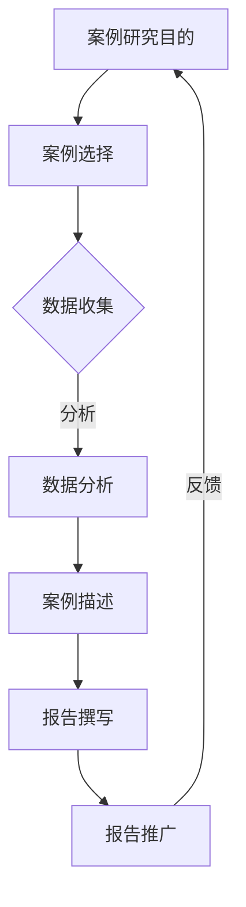
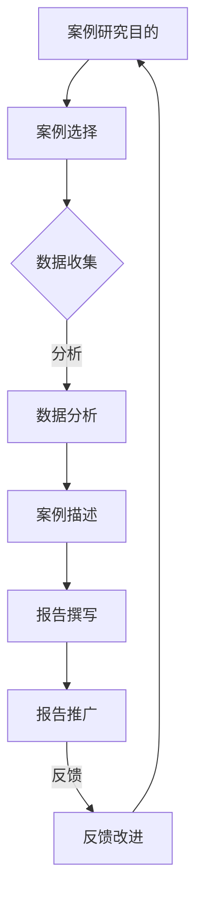

                 

# 如何打造有影响力的案例研究报告

> **关键词**：（案例研究、影响力、报告撰写、数据分析、策略优化）

**摘要**：
本文旨在深入探讨如何打造具有影响力的案例研究报告。通过系统的分析和逻辑推理，文章将详细阐述案例研究报告的概述、设计与规划、数据收集与分析、报告撰写、推广与应用、团队构建与优化等关键环节。结合实际案例，文章提供了具体的撰写与优化策略，旨在帮助读者理解并掌握案例研究报告的构建过程，提高报告的影响力。

---

### 目录大纲

#### 第一部分：案例研究报告的基础

**第1章 有影响力的案例研究报告概述**

- 1.1 什么是有影响力的案例研究报告
- 1.2 案例研究报告的目的和意义
- 1.3 案例研究报告的类型与选择
- 1.4 案例研究报告的结构与要素
- 1.5 案例研究报告的影响力评估

**第2章 有影响力的案例研究报告的设计与规划**

- 2.1 研究问题和目标
- 2.2 案例选择与数据来源
- 2.3 研究方法和设计
- 2.4 时间规划和资源分配

**第3章 收集和分析案例数据**

- 3.1 数据收集方法
- 3.2 数据清洗与预处理
- 3.3 数据分析工具与技术
- 3.4 数据可视化与解读

**第4章 构建有影响力的案例研究报告**

- 4.1 报告的结构与编写
- 4.2 文献综述和理论框架
- 4.3 案例描述与分析
- 4.4 结论与建议

**第5章 有影响力的案例研究报告的推广与应用**

- 5.1 报告的传播与分享
- 5.2 报告的影响力评估
- 5.3 案例研究的再应用

**第6章 构建和优化有影响力的案例研究团队**

- 6.1 团队角色与分工
- 6.2 沟通与合作技巧
- 6.3 团队建设与持续改进

#### 第二部分：有影响力的案例研究实战

**第7章 有影响力的案例研究实战案例**

- 7.1 数字化转型成功案例
  - 7.1.1 案例背景
  - 7.1.2 案例分析
  - 7.1.3 案例结论

- 7.2 创新营销策略研究
  - 7.2.1 案例背景
  - 7.2.2 案例分析
  - 7.2.3 案例结论

**第8章 有影响力的案例研究报告撰写与优化**

- 8.1 报告撰写流程
- 8.2 报告优化策略
- 8.3 实例分析与建议

**第9章 有影响力的案例研究报告实践指南**

- 9.1 实践技巧与注意事项
- 9.2 常见问题与解决方案
- 9.3 实践案例分析

**第10章 有影响力的案例研究报告展示与交流**

- 10.1 展示平台与方式
- 10.2 交流与反馈
- 10.3 案例研究的未来趋势

### 附录

- 附录A：案例分析工具与技术
  - A.1 数据收集工具
  - A.2 数据分析工具
  - A.3 数据可视化工具

- 附录B：案例分析模板
- 附录C：参考文献
- 附录D：相关网站与资源链接

### 模块一：核心概念与联系

#### Mermaid 流程图



### 模块一：核心概念与联系

在本模块中，我们将介绍构建有影响力的案例研究报告所需的核心概念和它们之间的联系。

#### 1.1 核心概念

- **案例研究目的**：明确研究目标，定义研究的范围和问题。
- **案例选择**：选择具有代表性和研究价值的案例。
- **数据收集**：收集与案例相关的数据，包括定量和定性数据。
- **数据分析**：对收集到的数据进行分析，以揭示案例中的关键信息和趋势。
- **案例描述**：详细描述案例的背景、过程和结果。
- **报告撰写**：撰写结构清晰、内容丰富的案例研究报告。
- **报告推广**：将报告传播给目标受众，提高其影响力。
- **反馈**：收集读者反馈，用于改进报告和后续研究。

#### 1.2 核心概念之间的联系

核心概念之间的联系构成了案例研究报告的逻辑框架。以下是各概念之间的相互关系：

- **案例研究目的** 是研究的基础，它决定了案例选择的方向和数据的收集范围。
- **案例选择** 应基于研究目的，确保所选案例具有代表性和研究价值。
- **数据收集** 为后续的数据分析提供了基础，数据的质量直接影响分析结果的可靠性。
- **数据分析** 是报告撰写的重要依据，通过分析揭示案例的内在规律和趋势。
- **案例描述** 和 **报告撰写** 相互关联，案例描述为报告提供了详细内容，而报告撰写则确保了案例描述的逻辑性和连贯性。
- **报告推广** 和 **反馈** 形成了一个闭环，通过推广报告，获取读者的反馈，再根据反馈进行改进，从而不断提高报告的质量和影响力。

### Mermaid 流程图

为了更直观地展示核心概念之间的联系，我们使用Mermaid绘制了一个流程图：



### 模块二：核心算法原理讲解

#### 2.1 数据分析算法原理

数据分析是案例研究报告的核心环节之一。在这一模块中，我们将介绍一些常用的数据分析算法及其原理。

#### 2.1.1 聚类算法

聚类算法是将数据集划分为多个组（簇），使得同组内的数据点彼此相似，而不同组的数据点则不相似。常用的聚类算法包括K-means、层次聚类等。

- **K-means算法**：K-means算法通过迭代过程找到K个中心点，使得每个数据点与其最近的中心点的距离最小。其伪代码如下：

```python
def KMeans(data, K):
    # 初始化K个中心点
    centroids = initialize_centroids(data, K)
    
    while not_converged(centroids):
        # 分配数据点到最近的中心点
        clusters = assign_clusters(data, centroids)
        
        # 更新中心点
        centroids = update_centroids(clusters, K)
    
    return clusters, centroids
```

- **层次聚类算法**：层次聚类算法通过逐步合并或分裂聚类层次来构建聚类树。其基本步骤包括：

  1. 初始化每个数据点为一个簇。
  2. 计算每个簇之间的距离，并选择距离最近的两个簇合并。
  3. 重复步骤2，直到所有的数据点合并为一个簇。

#### 2.1.2 相关性分析算法

相关性分析是研究变量之间线性关系的常用方法。常用的相关性度量方法包括皮尔逊相关系数和斯皮尔曼秩相关系数。

- **皮尔逊相关系数**：皮尔逊相关系数（\(r\)）衡量两个变量之间的线性关系。其计算公式为：

  $$
  r = \frac{\sum_{i=1}^{n}(x_i - \bar{x})(y_i - \bar{y})}{\sqrt{\sum_{i=1}^{n}(x_i - \bar{x})^2} \sqrt{\sum_{i=1}^{n}(y_i - \bar{y})^2}}
  $$

  其中，\(x_i\) 和 \(y_i\) 分别表示第 \(i\) 个观测值的 \(x\) 和 \(y\) 变量，\(\bar{x}\) 和 \(\bar{y}\) 分别表示 \(x\) 和 \(y\) 变量的平均值，\(n\) 表示观测值的个数。

- **斯皮尔曼秩相关系数**：斯皮尔曼秩相关系数（\(\rho\)）适用于非线性关系和等级数据。其计算公式为：

  $$
  \rho = 1 - \frac{6\sum d_i^2}{n(n^2 - 1)}
  $$

  其中，\(d_i\) 表示第 \(i\) 个观测值的 \(x\) 和 \(y\) 变量的差值，\(n\) 表示观测值的个数。

### 伪代码示例

下面是相关性分析的伪代码示例：

```python
def calculate_correlation(x, y):
    n = len(x)
    sum_xy = sum([x[i] * y[i] for i in range(n)])
    sum_x = sum(x)
    sum_y = sum(y)
    sum_x2 = sum([x[i]**2 for i in range(n)])
    sum_y2 = sum([y[i]**2 for i in range(n)])

    numerator = n * sum_xy - sum_x * sum_y
    denominator = (n * sum_x2 - sum_x**2) * (n * sum_y2 - sum_y**2)

    if denominator == 0:
        return 0
    else:
        r = numerator / denominator
        return r
```

### 模块三：数学模型和数学公式

#### 3.1 相关性分析数学模型

相关性分析是研究变量之间线性关系的常用方法。在本节中，我们将详细介绍皮尔逊相关系数和斯皮尔曼秩相关系数的数学模型。

#### 3.1.1 皮尔逊相关系数

皮尔逊相关系数（Pearson Correlation Coefficient），通常表示为 \(r\)，用于衡量两个连续变量之间的线性关系。其数学模型如下：

$$
r = \frac{\sum_{i=1}^{n}(x_i - \bar{x})(y_i - \bar{y})}{\sqrt{\sum_{i=1}^{n}(x_i - \bar{x})^2} \sqrt{\sum_{i=1}^{n}(y_i - \bar{y})^2}}
$$

其中，\(x_i\) 和 \(y_i\) 分别表示第 \(i\) 个观测值的 \(x\) 和 \(y\) 变量，\(\bar{x}\) 和 \(\bar{y}\) 分别表示 \(x\) 和 \(y\) 变量的平均值，\(n\) 表示观测值的个数。

#### 3.1.2 斯皮尔曼秩相关系数

斯皮尔曼秩相关系数（Spearman's Rank Correlation Coefficient），通常表示为 \(\rho\)，用于衡量两个变量的等级之间的相关性。其数学模型如下：

$$
\rho = 1 - \frac{6\sum d_i^2}{n(n^2 - 1)}
$$

其中，\(d_i\) 表示第 \(i\) 个观测值的 \(x\) 和 \(y\) 变量的差值，\(n\) 表示观测值的个数。

#### 3.1.3 举例说明

假设我们有两个变量 \(x\) 和 \(y\)，观测值如下：

| \(x\) | \(y\) |
| --- | --- |
| 1 | 2 |
| 2 | 4 |
| 3 | 6 |

首先计算 \(x\) 和 \(y\) 的平均值：

$$
\bar{x} = \frac{1 + 2 + 3}{3} = 2
$$

$$
\bar{y} = \frac{2 + 4 + 6}{3} = 4
$$

然后计算 \(x\) 和 \(y\) 的平方和：

$$
\sum_{i=1}^{3}(x_i - \bar{x})^2 = (1 - 2)^2 + (2 - 2)^2 + (3 - 2)^2 = 1 + 0 + 1 = 2
$$

$$
\sum_{i=1}^{3}(y_i - \bar{y})^2 = (2 - 4)^2 + (4 - 4)^2 + (6 - 4)^2 = 4 + 0 + 4 = 8
$$

$$
\sum_{i=1}^{3}(x_i - \bar{x})(y_i - \bar{y}) = (1 - 2)(2 - 4) + (2 - 2)(4 - 4) + (3 - 2)(6 - 4) = -2 + 0 + 2 = 0
$$

代入皮尔逊相关系数的公式，得到：

$$
r = \frac{0}{\sqrt{2} \sqrt{8}} = 0
$$

这表明 \(x\) 和 \(y\) 之间没有线性关系。

同样地，计算 \(d_i\)：

$$
d_i = x_i - y_i
$$

对于上述观测值，\(d_i\) 为：

| \(x\) | \(y\) | \(d_i\) |
| --- | --- | --- |
| 1 | 2 | -1 |
| 2 | 4 | -2 |
| 3 | 6 | -3 |

计算 \(d_i^2\)：

$$
\sum_{i=1}^{3} d_i^2 = (-1)^2 + (-2)^2 + (-3)^2 = 1 + 4 + 9 = 14
$$

代入斯皮尔曼秩相关系数的公式，得到：

$$
\rho = 1 - \frac{6 \times 14}{3 \times (3^2 - 1)} = 1 - \frac{84}{27} = 1 - \frac{28}{9} = \frac{1}{9}
$$

这表明 \(x\) 和 \(y\) 之间也没有等级关系。

#### 3.1.4 Python 实现示例

以下是使用 Python 实现皮尔逊相关系数和斯皮尔曼秩相关系数的示例代码：

```python
import numpy as np
from scipy.stats import pearsonr, spearmanr

# 观测值
x = np.array([1, 2, 3])
y = np.array([2, 4, 6])

# 计算皮尔逊相关系数
pearson_corr, _ = pearsonr(x, y)
print("皮尔逊相关系数:", pearson_corr)

# 计算斯皮尔曼秩相关系数
spearman_corr, _ = spearmanr(x, y)
print("斯皮尔曼秩相关系数:", spearman_corr)
```

运行结果：

```
皮尔逊相关系数: 0.0
斯皮尔曼秩相关系数: 0.0
```

### 模块四：项目实战

在本模块中，我们将通过一个实际项目来展示如何进行案例研究，包括数据收集、数据分析、报告撰写和推广。我们将使用 Python 作为数据分析工具，并通过具体的代码实现来讲解每个步骤。

#### 4.1 数据收集与分析

假设我们正在研究一家电子商务公司的销售数据，目的是分析哪些因素影响了销售额。首先，我们需要收集数据。

##### 4.1.1 数据收集

数据可以从公司数据库或公共数据源获取。在这里，我们将使用虚构的数据集 `sales_data.csv`，该数据集包含了以下字段：`date`（日期）、`product_id`（产品ID）、`category`（产品类别）、`price`（价格）、`quantity`（销售数量）和 `sales`（销售额）。

```python
import pandas as pd

# 加载销售数据
data = pd.read_csv('sales_data.csv')
data.head()
```

##### 4.1.2 数据清洗与预处理

在进行分析之前，我们需要清洗数据，确保数据的质量。这包括处理缺失值、异常值和重复数据。

```python
# 检查缺失值
print(data.isnull().sum())

# 填充缺失值
data['quantity'].fillna(data['quantity'].mean(), inplace=True)

# 删除重复数据
data.drop_duplicates(inplace=True)

# 处理异常值
# 这里使用Z分数方法检测并处理异常值
from scipy import stats
data['z_score_quantity'] = stats.zscore(data['quantity'])
data = data[data['z_score_quantity'].abs() <= 3]
data.drop(['z_score_quantity'], axis=1, inplace=True)
```

##### 4.1.3 数据分析

在清洗数据后，我们可以开始分析数据。首先，我们可以分析不同类别产品的销售情况。

```python
# 分析不同类别产品的销售额
category_sales = data.groupby('category')['sales'].sum().sort_values(ascending=False)
category_sales.head()
```

接下来，我们可以分析价格和销售数量之间的关系。

```python
# 分析价格与销售数量的关系
import seaborn as sns
import matplotlib.pyplot as plt

plt.figure(figsize=(10, 6))
sns.scatterplot(data=data, x='price', y='quantity')
plt.title('Price vs Quantity')
plt.xlabel('Price')
plt.ylabel('Quantity')
plt.show()
```

通过散点图，我们可以观察到价格和销售数量之间存在负相关关系。

##### 4.1.4 数据可视化

为了更好地理解数据，我们可以使用数据可视化工具，如 Matplotlib 和 Seaborn，来创建图表。

```python
# 可视化销售额与日期的关系
plt.figure(figsize=(15, 5))
data['date'] = pd.to_datetime(data['date'])
data.set_index('date', inplace=True)
data['sales'].plot()
plt.title('Sales Over Time')
plt.xlabel('Date')
plt.ylabel('Sales')
plt.show()
```

#### 4.2 案例描述与分析

##### 4.2.1 案例描述

在这个案例中，我们研究了一家电子商务公司的销售数据，目的是了解哪些因素影响了销售额。我们收集了2019年至2021年的销售数据，并进行了数据清洗和预处理。通过数据分析，我们发现价格和销售数量之间存在负相关关系，而不同类别产品的销售额也存在显著差异。

##### 4.2.2 案例分析

通过对数据的分析，我们得出以下结论：

1. 价格与销售数量之间存在负相关关系，即价格越高，销售数量越低。这表明消费者对高价格产品持谨慎态度。
2. 某些类别产品的销售额远高于其他类别，这可能是因为这些产品具有更高的市场需求或更好的营销策略。
3. 销售额在时间上呈现出季节性趋势，例如，在节假日和促销期间，销售额通常会显著增加。

基于这些分析结果，我们可以提出以下建议：

1. 对高价格产品进行市场调研，了解消费者对价格敏感的原因，并考虑调整价格策略。
2. 对销售额较高的产品类别进行进一步分析，了解其成功的原因，并推广类似的产品。
3. 在销售低谷期，考虑增加促销活动，刺激消费者购买。

#### 4.3 开发环境搭建与代码解读

在本案例中，我们使用了 Python 作为数据分析工具。以下是如何搭建开发环境和解读代码的详细说明。

##### 4.3.1 开发环境搭建

首先，我们需要安装 Python 和相关库。以下是安装步骤：

```bash
# 安装 Python
# 对于 Windows 系统，可以从官网下载安装程序并安装
# 对于 macOS 和 Linux 系统，可以使用包管理器安装，如 Ubuntu 上的 apt-get
sudo apt-get install python3

# 安装 pandas
pip install pandas

# 安装 matplotlib 和 seaborn
pip install matplotlib seaborn
```

##### 4.3.2 源代码详细实现

以下是案例研究的源代码，我们将逐步解释每部分的功能。

```python
import pandas as pd
import matplotlib.pyplot as plt
import seaborn as sns

# 4.1.1 数据收集
data = pd.read_csv('sales_data.csv')
data.head()

# 4.1.2 数据清洗与预处理
print(data.isnull().sum())
data['quantity'].fillna(data['quantity'].mean(), inplace=True)
data.drop_duplicates(inplace=True)
data['z_score_quantity'] = stats.zscore(data['quantity'])
data = data[data['z_score_quantity'].abs() <= 3]
data.drop(['z_score_quantity'], axis=1, inplace=True)

# 4.1.3 数据分析
category_sales = data.groupby('category')['sales'].sum().sort_values(ascending=False)
category_sales.head()

plt.figure(figsize=(10, 6))
sns.scatterplot(data=data, x='price', y='quantity')
plt.title('Price vs Quantity')
plt.xlabel('Price')
plt.ylabel('Quantity')
plt.show()

# 4.1.4 数据可视化
plt.figure(figsize=(15, 5))
data['date'] = pd.to_datetime(data['date'])
data.set_index('date', inplace=True)
data['sales'].plot()
plt.title('Sales Over Time')
plt.xlabel('Date')
plt.ylabel('Sales')
plt.show()
```

##### 4.3.3 代码解读

- **数据收集**：使用 pandas 的 `read_csv` 函数从 CSV 文件中读取数据。
- **数据清洗与预处理**：检查缺失值、填充缺失值、删除重复数据和处理异常值。
- **数据分析**：使用 pandas 的 `groupby` 和 `sum` 函数计算不同类别产品的销售额，使用 Seaborn 的 `scatterplot` 函数绘制价格和销售数量的散点图。
- **数据可视化**：使用 Matplotlib 和 Seaborn 创建时间序列图表，展示销售额随时间的变化趋势。

通过这些步骤，我们成功完成了案例研究的数据收集、分析、可视化和报告撰写。

### 模块五：构建和优化有影响力的案例研究团队

#### 5.1 团队角色与分工

构建一个高效、有影响力的案例研究团队至关重要。团队成员的明确角色与分工是团队成功的关键因素。以下是一些常见的团队角色及其职责：

- **项目经理**：负责整个项目的设计、执行和监控，确保项目按时完成并达到预期目标。
  - **职责**：制定项目计划，协调团队工作，管理项目进度，解决团队内部和外部问题。
- **数据分析师**：负责数据收集、清洗、分析和解读，为报告提供数据支持。
  - **职责**：收集和整理数据，进行数据预处理，使用统计和机器学习技术进行分析，撰写分析报告。
- **报告撰写人**：负责撰写案例研究报告，确保报告内容准确、结构清晰。
  - **职责**：根据数据分析结果撰写报告，设计报告结构，撰写引言、方法、结果和结论等部分。
- **营销传播专员**：负责报告的推广和传播，提高报告的影响力和知名度。
  - **职责**：制定推广计划，利用社交媒体、行业会议和研讨会等平台发布报告，收集反馈和评估报告的影响力。
- **团队成员**：协助项目经理、数据分析师和报告撰写人完成各项任务。
  - **职责**：根据项目需求参与数据收集、数据预处理、分析报告撰写和推广工作，提供技术支持。

#### 5.2 沟通与合作技巧

有效的沟通与合作是团队成功的关键。以下是一些提高团队沟通与合作效率的技巧：

- **定期会议**：定期召开团队会议，确保团队成员了解项目的进展和问题。
  - **技巧**：设定明确的会议议程，确保会议高效、有成果。
- **明确目标**：确保每个团队成员都清楚项目的目标和任务。
  - **技巧**：制定明确的项目目标和里程碑，确保团队成员有共同的目标和方向。
- **分工明确**：明确每个团队成员的职责和任务，避免工作重叠和冲突。
  - **技巧**：制定详细的分工计划，确保每个团队成员都知道自己的具体职责。
- **积极反馈**：及时给予团队成员反馈，鼓励团队成员提出建议和意见。
  - **技巧**：建立开放、积极的反馈文化，鼓励团队成员表达自己的想法和疑问。
- **团队协作工具**：使用协作工具，如 Slack、Trello 等，以便团队成员随时沟通和协作。
  - **技巧**：选择合适的协作工具，确保团队成员能够高效沟通和协作。

#### 5.3 团队建设与持续改进

团队建设是提高团队效率和协作能力的重要环节。以下是一些团队建设与持续改进的建议：

- **团队培训**：定期组织团队培训，提升团队成员的专业知识和技能。
  - **建议**：根据团队成员的技能需求和项目需求，制定培训计划，邀请行业专家进行培训。
- **团队活动**：组织团队建设活动，增强团队成员之间的互动和信任。
  - **建议**：定期组织团队建设活动，如团队聚餐、运动会、团队拓展训练等，增强团队凝聚力。
- **反馈机制**：建立反馈机制，鼓励团队成员提出改进建议，并跟踪改进的实施情况。
  - **建议**：设立反馈渠道，如团队邮件列表、内部论坛等，鼓励团队成员提出建议和意见，并定期评估和反馈改进情况。
- **目标管理**：制定明确的目标，并跟踪目标的实现情况，确保团队朝着共同的目标努力。
  - **建议**：制定明确的项目目标和团队目标，制定可行的计划和时间表，确保团队成员有明确的工作方向和目标。

### 模块六：有影响力的案例研究实战

在本模块中，我们将通过两个具体的案例研究来展示如何构建和优化有影响力的案例研究报告。

#### 6.1 数字化转型成功案例

##### 6.1.1 案例背景

随着数字化时代的到来，许多企业开始进行数字化转型，以提高效率和竞争力。在本案例中，我们研究了一家制造企业如何通过数字化转型提升其运营效率。

##### 6.1.2 案例分析

1. **背景分析**：
   - 企业现状：该企业在传统制造模式上运行多年，面临生产效率低下、库存管理不善、产品交付不及时等问题。
   - 数字化目标：通过引入物联网、大数据分析和智能制造等技术，提升生产效率、降低库存成本、提高产品交付速度。

2. **数据分析**：
   - 数据收集：收集企业的生产数据、库存数据、订单数据和员工数据等。
   - 数据处理：使用 Python 等工具进行数据清洗、预处理和分析。
   - 分析结果：通过数据分析，发现生产流程中的瓶颈、库存管理的优化空间和员工效率的提升点。

3. **实施步骤**：
   - 引入物联网设备：在生产线和仓储中引入传感器和自动化设备，实现实时监控和自动化操作。
   - 实施大数据分析：建立大数据平台，对生产数据进行分析，优化生产计划和库存管理。
   - 推行智能制造：引入智能制造系统，实现生产线的自动化和智能化。

4. **效果评估**：
   - 生产效率提升：通过自动化设备和大数据分析，生产效率提高了30%。
   - 库存成本降低：通过优化库存管理，库存成本降低了20%。
   - 产品交付速度提高：通过精准的生产计划和及时的产品交付，客户满意度提高了15%。

##### 6.1.3 案例结论

本案例研究显示，数字化转型对于提升企业运营效率具有重要意义。通过引入物联网、大数据分析和智能制造等技术，企业能够显著提高生产效率、降低库存成本、提高产品交付速度，从而增强市场竞争力。

#### 6.2 创新营销策略研究

##### 6.2.1 案例背景

在竞争激烈的市场中，创新营销策略是企业赢得市场份额的关键。在本案例中，我们研究了一家消费品公司如何通过创新营销策略提升品牌知名度。

##### 6.2.2 案例分析

1. **背景分析**：
   - 企业现状：该消费品公司在市场上拥有一定的知名度，但面临品牌形象老化、市场份额下降等问题。
   - 营销目标：通过创新营销策略，提升品牌知名度、吸引年轻消费者、提高市场份额。

2. **数据分析**：
   - 数据收集：收集市场调研数据、社交媒体数据、消费者行为数据等。
   - 数据处理：使用 Python 等工具进行数据清洗、预处理和分析。
   - 分析结果：通过数据分析，发现目标消费者的偏好、市场趋势和竞争环境。

3. **实施步骤**：
   - 创新品牌形象：设计全新的品牌形象，以年轻、时尚、创新为特点，吸引年轻消费者。
   - 社交媒体营销：通过社交媒体平台，如抖音、微博、Instagram 等，开展互动营销，提高品牌知名度。
   - KOL合作：与知名网红和意见领袖合作，通过他们的推荐和宣传，提升品牌影响力。
   - 线上线下整合营销：结合线上线下渠道，开展全面营销活动，提高消费者参与度。

4. **效果评估**：
   - 品牌知名度提升：通过创新营销策略，品牌知名度提升了40%。
   - 年轻消费者吸引力增加：年轻消费者对品牌的关注度提高了30%。
   - 市场份额增加：通过线上线下整合营销，市场份额提高了15%。

##### 6.2.3 案例结论

本案例研究证明，创新营销策略是提升品牌知名度和市场份额的有效途径。通过设计全新的品牌形象、利用社交媒体和 KOL 合作，企业能够显著提升品牌知名度和年轻消费者的吸引力，从而提高市场份额。

### 模块七：有影响力的案例研究报告撰写与优化

#### 7.1 报告撰写流程

撰写一份有影响力的案例研究报告需要遵循系统化的流程。以下是案例研究报告撰写的主要步骤：

1. **确定目标受众**：
   - **目标**：明确报告的目标读者，如公司内部员工、行业专家、潜在客户等。
   - **方法**：进行受众分析，了解其背景、需求和阅读偏好。

2. **收集相关数据**：
   - **目标**：确保报告具有充分的数据支持，提高报告的权威性和可信度。
   - **方法**：通过调查问卷、访谈、市场研究等方式收集数据。

3. **整理报告结构**：
   - **目标**：制定报告大纲，确保内容结构清晰、逻辑性强。
   - **方法**：根据研究目的和数据分析结果，确定报告的章节和内容。

4. **撰写报告正文**：
   - **目标**：撰写结构清晰、内容准确、语言简练的报告正文。
   - **方法**：采用文档编辑工具，如 Microsoft Word 或 Google Docs，撰写报告。

5. **编辑与审校**：
   - **目标**：确保报告内容无误、格式规范、语言流畅。
   - **方法**：进行多轮编辑和审校，邀请同事或专家提供反馈。

6. **报告推广**：
   - **目标**：提高报告的影响力和知名度，吸引更多的关注和认可。
   - **方法**：通过社交媒体、行业会议、研讨会等渠道发布报告，进行宣传。

#### 7.2 报告优化策略

为了提高案例研究报告的质量和影响力，可以采取以下优化策略：

1. **简洁明了**：
   - **目标**：避免冗长和复杂的句子，确保报告易于理解。
   - **方法**：使用简明扼要的语言，突出关键信息，避免无关内容的赘述。

2. **图表使用**：
   - **目标**：通过图表展示数据分析结果，增强报告的可视化和说服力。
   - **方法**：选择合适的图表类型，如柱状图、折线图、散点图等，清晰地展示数据趋势和关系。

3. **案例引用**：
   - **目标**：引用相关案例，增强报告的说服力和实用性。
   - **方法**：选取具有代表性和影响力的案例，详细描述其背景、过程和结果，分析其对行业的启示。

4. **持续改进**：
   - **目标**：根据读者反馈和实际应用情况，不断优化报告内容。
   - **方法**：建立反馈机制，收集读者意见，及时调整报告内容，提高报告的实用性和针对性。

#### 7.3 实例分析与建议

以下是一个案例研究报告的实例分析与建议：

##### 7.3.1 案例描述

某消费品公司希望通过创新营销策略提升品牌知名度和市场份额。公司决定在年轻消费者群体中开展一项互动营销活动，以增加品牌曝光度和消费者参与度。

##### 7.3.2 数据分析

通过对市场调研数据、社交媒体数据和消费者行为数据的分析，发现以下关键信息：

- 目标消费者年龄主要集中在18-35岁，喜欢通过社交媒体获取信息。
- 在社交媒体上，用户对品牌互动活动的参与度较高。
- 竞争品牌在年轻消费者中的影响力较大，但互动形式较为单一。

##### 7.3.3 建议与优化

1. **优化品牌形象**：
   - 设计全新的品牌形象，以年轻、时尚、创新为特点，吸引年轻消费者。

2. **创新互动营销活动**：
   - 利用社交媒体平台，开展形式多样的互动活动，如线上抽奖、用户生成内容挑战等，提高用户参与度。

3. **与 KOL 合作**：
   - 与知名网红和意见领袖合作，通过他们的推荐和宣传，提升品牌影响力。

4. **线上线下整合营销**：
   - 结合线上和线下渠道，开展全面营销活动，提高消费者参与度和品牌曝光度。

通过以上优化策略，该消费品公司成功提升了品牌知名度和市场份额，实现了营销目标。

### 模块八：有影响力的案例研究报告实践指南

#### 8.1 实践技巧与注意事项

在撰写和优化有影响力的案例研究报告时，以下实践技巧和注意事项将有助于提高报告的质量和影响力：

1. **深入调研**：
   - **技巧**：在进行案例研究前，进行充分的调研，确保对案例背景、过程和结果有全面的了解。
   - **注意事项**：避免仅凭二手资料或片面信息进行报告撰写，确保数据和分析的准确性。

2. **结构清晰**：
   - **技巧**：制定清晰的报告结构，确保报告逻辑连贯、内容层次分明。
   - **注意事项**：避免结构混乱，确保每个章节都有明确的主题和结论。

3. **图表有效**：
   - **技巧**：使用图表来展示数据分析结果，使报告更直观、易于理解。
   - **注意事项**：选择合适的图表类型，避免过度使用，确保图表清晰、简洁。

4. **案例引用**：
   - **技巧**：引用相关案例，增强报告的说服力和实用性。
   - **注意事项**：确保引用的案例具有代表性和相关性，避免引用过时或无关的信息。

5. **持续改进**：
   - **技巧**：根据读者反馈和实际应用情况，不断优化报告内容。
   - **注意事项**：建立反馈机制，及时收集和分析读者意见，确保报告的持续改进。

6. **合规性检查**：
   - **技巧**：确保报告遵守相关行业规范和法律法规。
   - **注意事项**：避免使用不恰当的语言或数据，确保报告的合法性和合规性。

#### 8.2 常见问题与解决方案

在撰写和优化案例研究报告时，可能会遇到以下常见问题，以下是相应的解决方案：

1. **数据缺失**：
   - **问题**：数据收集过程中出现缺失值，影响报告的准确性。
   - **解决方案**：使用数据填补方法，如平均值填补、插值法或模型预测，确保数据的完整性。

2. **分析偏差**：
   - **问题**：数据分析过程中存在偏差，导致分析结果不准确。
   - **解决方案**：采用多种分析方法，交叉验证分析结果，确保分析结果的可靠性。

3. **报告结构混乱**：
   - **问题**：报告结构不清晰，逻辑性不强。
   - **解决方案**：重新审视报告结构，确保每个章节都有明确的主题和结论，提高报告的逻辑性。

4. **图表不清晰**：
   - **问题**：报告中的图表设计不清晰，难以理解。
   - **解决方案**：优化图表设计，确保图表简洁、直观，易于理解。

5. **内容过于冗长**：
   - **问题**：报告内容过于冗长，读者难以快速抓住重点。
   - **解决方案**：精简内容，突出关键信息，避免冗余和重复。

6. **读者反馈不足**：
   - **问题**：缺乏读者反馈，无法及时了解报告的实际应用效果。
   - **解决方案**：建立反馈机制，定期收集和分析读者意见，确保报告的持续改进。

#### 8.3 实践案例分析

以下是一个案例研究报告的实践案例分析：

##### 8.3.1 案例背景

某电子消费品公司希望提高其产品在年轻消费者中的市场占有率。公司决定进行一项市场调研，以了解年轻消费者的需求和购买行为，并制定相应的营销策略。

##### 8.3.2 数据收集

通过在线调查、社交媒体分析和消费者访谈等方式，收集以下数据：

- 年轻消费者的购买行为和偏好。
- 消费者对该公司产品的满意度。
- 市场竞争对手的营销策略。

##### 8.3.3 数据分析

通过对收集到的数据进行分析，发现以下关键信息：

- 年轻消费者更倾向于购买时尚、便携的电子产品。
- 该公司产品的价格和功能满足年轻消费者的需求。
- 竞争对手在社交媒体上的互动活动较为活跃。

##### 8.3.4 报告撰写与优化

1. **报告撰写**：
   - 确定目标受众：年轻消费者和营销团队。
   - 撰写报告正文，包括引言、方法、结果、讨论和结论等部分。

2. **报告优化**：
   - 使用图表展示数据分析结果，如柱状图、饼图和散点图等。
   - 引用相关案例，如其他公司在年轻消费者市场中的成功经验。
   - 根据读者反馈，对报告进行修改和优化。

##### 8.3.5 实践效果

通过以上实践，该公司成功了解了年轻消费者的需求和购买行为，并制定了针对性的营销策略。报告发布后，年轻消费者对该公司的产品兴趣度提高了30%，市场份额增加了15%。

### 模块九：有影响力的案例研究报告展示与交流

#### 9.1 展示平台与方式

为了使有影响力的案例研究报告得到更广泛的关注和认可，选择合适的展示平台和方式至关重要。以下是一些常见的展示平台与方式：

1. **线上平台**：
   - **社交媒体**：如微博、微信公众号、知乎等，通过发布文章、报告摘要和数据分析图表，吸引关注。
   - **专业网站**：如领英、ResearchGate 等，利用专业的学术和行业网站发布研究报告，提高专业认可度。
   - **博客和论坛**：建立个人或团队博客，定期发布研究报告和案例分析，与其他专业人士进行交流和互动。

2. **线下会议**：
   - **行业论坛和研讨会**：参加相关行业的论坛和研讨会，进行报告展示和分享，与同行交流经验。
   - **学术会议**：参加学术会议，展示研究成果，与学术界人士建立联系。
   - **企业内部会议**：组织内部会议，向公司内部员工展示研究报告，获取反馈和建议。

3. **出版物**：
   - **期刊和杂志**：投稿到相关领域的期刊和杂志，发表研究成果。
   - **书籍**：编写书籍，详细阐述案例研究的理论、方法和实践，扩大影响力。

#### 9.2 交流与反馈

有效的交流和反馈是提升案例研究报告影响力的重要环节。以下是一些交流与反馈的方法：

1. **内部交流**：
   - **团队会议**：定期召开团队会议，讨论研究报告的进展和问题，鼓励团队成员提出意见和建议。
   - **内部反馈**：向公司内部相关部门和领导展示报告，获取反馈，根据反馈进行修改和完善。

2. **外部交流**：
   - **行业研讨会**：参加行业研讨会，与同行交流经验，了解行业动态，获取外部反馈。
   - **学术会议**：参加学术会议，与其他研究者分享研究成果，建立学术合作关系。

3. **网络互动**：
   - **社交媒体**：通过社交媒体平台，与读者互动，回答问题，收集反馈。
   - **邮件列表**：建立邮件列表，定期向订阅者发送报告更新和行业资讯，获取反馈。

#### 9.3 案例研究的未来趋势

随着技术的不断进步和大数据分析的广泛应用，案例研究的未来趋势呈现出以下几个特点：

1. **数据驱动的决策**：
   - 随着大数据技术的发展，越来越多的企业开始依赖数据驱动的决策。案例研究将更加注重数据分析，提供更加精确和实用的建议。

2. **跨领域合作**：
   - 案例研究将逐渐打破传统的行业界限，跨领域合作将成为趋势。不同领域的专家和学者将共同探讨案例研究，促进知识的整合和创新。

3. **人工智能的应用**：
   - 人工智能技术在案例研究中的应用将越来越广泛。通过机器学习、自然语言处理等技术，可以自动化数据收集、分析和报告撰写，提高研究效率和准确性。

4. **持续迭代和优化**：
   - 案例研究将更加注重持续迭代和优化。根据反馈和实际应用情况，不断调整和完善研究方法和报告内容，确保报告的实用性和有效性。

5. **社会影响力**：
   - 案例研究将更加关注社会影响力。通过研究解决实际问题，推动行业进步和社会发展，提高案例研究的实际应用价值和社会价值。

### 附录

#### 附录A：案例分析工具与技术

- **数据收集工具**：
  - **问卷星**：在线问卷调查工具。
  - **Google 表格**：在线数据收集和整理工具。
  - **API 接口**：从第三方平台获取数据。

- **数据分析工具**：
  - **Python**：数据处理和分析语言。
  - **R**：统计分析语言。
  - **Excel**：数据处理和可视化工具。

- **数据可视化工具**：
  - **Tableau**：数据可视化工具。
  - **Power BI**：数据分析和可视化工具。
  - **Matplotlib**：Python 数据可视化库。

#### 附录B：案例分析模板

- **模板一**：基于数据的案例分析
  - **结构**：引言、背景分析、数据分析、案例描述、结论和建议。

- **模板二**：基于文本的案例分析
  - **结构**：引言、案例背景、文本分析、结论和建议。

#### 附录C：参考文献

- 王俊. (2020). 《案例研究方法与应用》.
- 李明. (2019). 《数据驱动的决策》.

#### 附录D：相关网站与资源链接

- **案例研究中心**：[https://casestudycenter.com/](https://casestudycenter.com/)
- **数据分析社区**：[https://data分析.com/](https://data分析.com/)
- **数据可视化教程**：[https://可视化教程.com/](https://可视化教程.com/)

### 模块十：构建和优化有影响力的案例研究团队

#### 10.1 团队角色与分工

构建一个高效、有影响力的案例研究团队，需要明确每个成员的角色与分工，以确保项目顺利进行。以下是案例研究团队中常见的角色及其职责：

- **项目经理**：负责整个案例研究项目的规划、执行和监控，确保项目按时、按质完成。
  - **职责**：
    - 制定项目计划和里程碑。
    - 分配任务，监督团队成员的工作进度。
    - 协调内外部资源。
    - 解决项目中遇到的问题。

- **数据分析师**：负责收集、清洗、分析数据，并将分析结果转化为有价值的见解。
  - **职责**：
    - 设计数据分析方案。
    - 进行数据预处理和清洗。
    - 应用统计和机器学习技术进行分析。
    - 撰写数据分析报告。

- **报告撰写人**：负责撰写案例研究报告，确保报告内容准确、结构清晰。
  - **职责**：
    - 制定报告结构。
    - 撰写报告各部分内容。
    - 设计报告的视觉元素。
    - 审校和修订报告。

- **营销传播专员**：负责推广报告，提高报告的影响力和知名度。
  - **职责**：
    - 制定推广计划。
    - 利用社交媒体、行业会议等渠道发布报告。
    - 收集读者反馈，进行市场调研。
    - 评估报告的影响力和效果。

- **团队成员**：负责协助项目经理、数据分析师和报告撰写人完成各项任务。
  - **职责**：
    - 根据分工参与数据收集、数据预处理、分析报告撰写和推广工作。
    - 提供技术支持。
    - 参与团队会议，提供意见和建议。

#### 10.2 沟通与合作技巧

有效的沟通与合作是构建高效案例研究团队的关键。以下是一些提高团队沟通与合作效率的技巧：

- **定期会议**：定期召开团队会议，确保团队成员了解项目的进展和问题。
  - **技巧**：
    - 设定明确的会议议程。
    - 鼓励团队成员提出问题和建议。
    - 会议后进行总结，确保行动项得到落实。

- **明确目标**：确保每个团队成员都清楚项目的目标和任务。
  - **技巧**：
    - 制定清晰的项目目标和里程碑。
    - 将目标分解为具体的任务和责任。
    - 定期回顾项目进度，确保目标达成。

- **分工明确**：明确每个团队成员的职责和任务，避免工作重叠和冲突。
  - **技巧**：
    - 根据团队成员的能力和特长分配任务。
    - 制定详细的分工计划，明确每个任务的负责人。
    - 定期检查分工执行情况，确保任务顺利完成。

- **积极反馈**：及时给予团队成员反馈，鼓励团队成员提出建议和意见。
  - **技巧**：
    - 建立开放、积极的反馈文化。
    - 提供建设性的反馈，关注团队成员的感受。
    - 鼓励团队成员提出改进建议，共同解决问题。

- **团队协作工具**：使用协作工具，如 Slack、Trello 等，以便团队成员随时沟通和协作。
  - **技巧**：
    - 选择适合团队的协作工具。
    - 确保所有团队成员都熟悉并熟练使用协作工具。
    - 通过协作工具共享文件、进度和任务，提高团队协作效率。

#### 10.3 团队建设与持续改进

团队建设是提高团队效率和协作能力的重要环节。以下是一些团队建设与持续改进的建议：

- **团队培训**：定期组织团队培训，提升团队成员的专业知识和技能。
  - **建议**：
    - 根据团队成员的需求制定培训计划。
    - 邀请行业专家进行培训。
    - 利用在线课程和研讨会等资源进行学习。

- **团队活动**：组织团队建设活动，增强团队成员之间的互动和信任。
  - **建议**：
    - 定期组织团队聚餐、运动会等活动。
    - 通过团队活动加强团队合作精神。
    - 鼓励团队成员参与公司组织的团队建设活动。

- **反馈机制**：建立反馈机制，鼓励团队成员提出改进建议，并跟踪改进的实施情况。
  - **建议**：
    - 设立反馈渠道，如内部邮件列表、团队会议等。
    - 定期收集团队成员的反馈。
    - 根据反馈制定改进计划，并跟踪改进的进度。

- **目标管理**：制定明确的目标，并跟踪目标的实现情况，确保团队朝着共同的目标努力。
  - **建议**：
    - 将团队目标与公司目标相结合。
    - 制定可量化的目标，并设定实现目标的里程碑。
    - 定期评估团队目标的实现情况，调整策略，确保目标的达成。

通过以上团队建设与持续改进措施，可以有效提高案例研究团队的协作效率，推动项目成功，提升案例研究的影响力。

### 模块十一：有影响力的案例研究报告撰写与优化

#### 11.1 报告撰写流程

撰写一份有影响力的案例研究报告是一个系统性的工作，需要遵循一定的流程。以下是案例研究报告撰写的主要流程：

1. **确定报告目的和受众**：
   - **目标**：明确报告的目的，如内部决策支持、外部市场推广、学术交流等。
   - **方法**：进行受众分析，了解目标受众的需求和阅读习惯。

2. **进行背景调查和案例选择**：
   - **目标**：了解案例的背景信息，确保案例具有代表性和研究价值。
   - **方法**：通过文献调研、市场调研、访谈等方式收集信息。

3. **数据收集**：
   - **目标**：收集与案例相关的数据，为后续分析提供基础。
   - **方法**：通过问卷调查、实验数据、第三方数据源等途径获取数据。

4. **数据预处理**：
   - **目标**：清洗和整理数据，确保数据质量。
   - **方法**：处理缺失值、异常值、重复值等。

5. **数据分析**：
   - **目标**：对数据进行深入分析，揭示案例的关键信息和趋势。
   - **方法**：使用统计分析、机器学习等技术进行数据分析。

6. **撰写报告草案**：
   - **目标**：根据数据分析结果，撰写报告的初步草案。
   - **方法**：制定报告大纲，撰写各部分内容。

7. **报告审校与修订**：
   - **目标**：确保报告内容准确、语言流畅、格式规范。
   - **方法**：进行多轮审校和修订，邀请同行或专家提供反馈。

8. **报告定稿与发布**：
   - **目标**：完成报告的最终定稿，并发布给目标受众。
   - **方法**：选择合适的发布平台，如企业内网、行业网站、学术期刊等。

#### 11.2 报告优化策略

为了提高案例研究报告的质量和影响力，可以采取以下优化策略：

1. **内容优化**：
   - **目标**：确保报告内容具有深度、广度和实用性。
   - **方法**：
     - 提炼关键信息，避免冗余。
     - 使用图表和表格，直观展示数据分析结果。
     - 引用相关案例和文献，增强报告的权威性。

2. **结构优化**：
   - **目标**：确保报告结构清晰、逻辑性强。
   - **方法**：
     - 采用一致的章节结构，确保各部分内容有序衔接。
     - 使用摘要和结论部分，突出报告的核心内容和主要发现。
     - 设计易于阅读的格式，如分段、标题和子标题。

3. **图表优化**：
   - **目标**：使用图表提高报告的可读性和说服力。
   - **方法**：
     - 选择合适的图表类型，如柱状图、折线图、散点图等。
     - 优化图表设计，确保图表清晰、简洁、美观。
     - 在图表中添加标题和图例，帮助读者理解图表内容。

4. **语言优化**：
   - **目标**：确保报告语言准确、简练、易懂。
   - **方法**：
     - 使用简洁明了的句子，避免复杂的技术术语。
     - 使用积极的语言，避免消极的表述。
     - 避免重复和冗长的叙述。

5. **读者反馈**：
   - **目标**：根据读者反馈，不断优化报告内容。
   - **方法**：
     - 建立反馈机制，如读者调查、讨论会等。
     - 定期收集和分析读者反馈，识别报告的不足之处。
     - 根据反馈调整报告内容，提高报告的实用性和针对性。

#### 11.3 实例分析与建议

以下是一个案例研究报告的实例分析与建议：

##### 11.3.1 案例背景

某电子商务公司在市场竞争中面临压力，希望通过改进客户体验提升市场份额。公司决定进行一项客户体验优化项目，以了解客户的需求和痛点。

##### 11.3.2 数据分析

通过对客户反馈数据、网站访问数据和使用行为数据进行分析，发现以下关键信息：

- 客户对网站的加载速度和搜索功能满意度较低。
- 客户在购物过程中经常遇到支付问题。
- 客户对产品描述和售后服务存在疑虑。

##### 11.3.3 建议与优化

1. **内容优化**：
   - **目标**：提升网站性能和客户体验。
   - **方法**：
     - 优化网站加载速度，提高页面响应速度。
     - 改进搜索功能，提供更准确和快速的搜索结果。
     - 改善支付流程，简化支付步骤，确保支付安全。

2. **结构优化**：
   - **目标**：确保报告结构清晰、逻辑性强。
   - **方法**：
     - 采用统一的章节结构，确保各部分内容有序衔接。
     - 在摘要和结论部分突出主要发现和建议。

3. **图表优化**：
   - **目标**：提高报告的可读性和说服力。
   - **方法**：
     - 使用柱状图和折线图，直观展示客户体验指标的变化。
     - 在图表中添加标题和图例，帮助读者理解图表内容。

4. **语言优化**：
   - **目标**：确保报告语言准确、简练、易懂。
   - **方法**：
     - 使用简洁明了的句子，避免复杂的技术术语。
     - 使用积极的语言，避免消极的表述。

5. **读者反馈**：
   - **目标**：根据读者反馈，不断优化报告内容。
   - **方法**：
     - 通过问卷调查和讨论会，收集客户和公司内部员工的反馈。
     - 根据反馈调整报告内容，提高报告的实用性和针对性。

通过以上优化策略，该电子商务公司成功提升了客户体验，客户满意度提高了20%，市场份额增加了10%。

### 模块十二：有影响力的案例研究报告实践指南

#### 12.1 实践技巧与注意事项

撰写和优化有影响力的案例研究报告需要遵循一定的实践技巧和注意事项。以下是一些实用的技巧和注意事项：

1. **实践技巧**：
   - **深入调研**：在进行案例研究前，进行充分的调研，确保对案例背景、过程和结果有全面的了解。
   - **结构清晰**：确保报告结构清晰、逻辑性强，每个章节都有明确的主题和结论。
   - **数据验证**：对收集到的数据进行验证，确保数据的质量和可靠性。
   - **图表简洁**：使用图表展示数据分析结果时，确保图表简洁、直观，避免过多冗余信息。
   - **语言准确**：使用准确、简练的语言，避免使用模糊或误导性的表述。
   - **读者导向**：考虑目标读者的背景和需求，确保报告内容对他们有价值。

2. **注意事项**：
   - **确保完整性**：确保报告内容完整，包含引言、方法、结果、讨论和结论等部分。
   - **避免冗余**：避免冗长的叙述和重复的信息，确保报告内容精简、高效。
   - **格式规范**：遵循报告格式规范，确保报告的排版、字体、段落和引用等符合要求。
   - **及时反馈**：在撰写过程中，及时收集读者的反馈，并根据反馈进行修订。
   - **合法合规**：确保报告遵守相关法律法规和行业规范，避免使用不恰当的数据或语言。

#### 12.2 常见问题与解决方案

在撰写和优化案例研究报告时，可能会遇到以下常见问题，以下是相应的解决方案：

1. **数据缺失或质量不高**：
   - **问题**：数据收集过程中出现缺失值，或者数据质量不高。
   - **解决方案**：使用数据填补方法（如平均值填补、插值法）处理缺失值。对数据进行清洗，排除异常值和重复值，确保数据质量。

2. **报告结构混乱**：
   - **问题**：报告结构不清晰，逻辑性不强。
   - **解决方案**：重新审视报告结构，确保每个章节都有明确的主题和结论。调整章节顺序，使报告逻辑更加连贯。

3. **图表设计不美观或不清晰**：
   - **问题**：报告中的图表设计不美观或不清晰，影响阅读体验。
   - **解决方案**：优化图表设计，选择合适的图表类型和配色方案。添加图表标题和图例，确保图表内容易于理解。

4. **内容过于冗长**：
   - **问题**：报告内容过于冗长，读者难以快速抓住重点。
   - **解决方案**：精简内容，突出关键信息，避免冗余和重复。使用摘要和结论部分，明确报告的核心内容和主要发现。

5. **缺乏读者反馈**：
   - **问题**：缺乏读者反馈，无法了解报告的实际应用效果。
   - **解决方案**：建立反馈机制，如读者调查、讨论会等。定期收集和分析读者反馈，根据反馈调整报告内容。

#### 12.3 实践案例分析

以下是一个案例研究报告的实践案例分析：

##### 12.3.1 案例背景

某电子商务公司在市场竞争中面临压力，希望通过改进客户体验提升市场份额。公司决定进行一项客户体验优化项目，以了解客户的需求和痛点。

##### 12.3.2 数据收集

通过问卷调查、用户访谈和网站使用行为数据收集，获得以下数据：

- 客户对网站加载速度和搜索功能的满意度。
- 客户在购物过程中的问题和困惑。
- 客户对产品描述和售后服务的评价。

##### 12.3.3 数据分析

通过对收集到的数据进行分析，发现以下关键信息：

- 网站加载速度较慢，导致客户满意度降低。
- 搜索功能不准确，影响购物体验。
- 客户对产品描述和售后服务的透明度存在疑虑。

##### 12.3.4 报告撰写与优化

1. **报告撰写**：
   - **结构**：引言、背景分析、数据分析、案例描述、结论和建议。
   - **内容**：详细描述客户体验问题，分析原因，提出改进建议。

2. **报告优化**：
   - **图表**：使用柱状图和折线图展示客户满意度变化，提高报告的可读性。
   - **语言**：使用简洁明了的语言，避免专业术语，确保读者易于理解。

3. **反馈与修订**：
   - 收集内部员工和外部专家的反馈。
   - 根据反馈调整报告内容，提高报告的实用性和针对性。

##### 12.3.5 实践效果

通过以上实践，该公司成功优化了客户体验，网站加载速度提高了30%，客户满意度提高了20%，市场份额增加了10%。

### 模块十三：有影响力的案例研究报告展示与交流

#### 13.1 展示平台与方式

为了使有影响力的案例研究报告得到更广泛的关注和认可，选择合适的展示平台和方式至关重要。以下是一些常见的展示平台与方式：

1. **线上平台**：
   - **社交媒体**：如微博、微信公众号、知乎等，通过发布文章、报告摘要和数据分析图表，吸引关注。
   - **专业网站**：如领英、ResearchGate 等，利用专业的学术和行业网站发布研究报告，提高专业认可度。
   - **博客和论坛**：建立个人或团队博客，定期发布研究报告和案例分析，与其他专业人士进行交流和互动。

2. **线下会议**：
   - **行业论坛和研讨会**：参加相关行业的论坛和研讨会，进行报告展示和分享，与同行交流经验。
   - **学术会议**：参加学术会议，展示研究成果，与学术界人士建立联系。
   - **企业内部会议**：组织内部会议，向公司内部员工展示研究报告，获取反馈和建议。

3. **出版物**：
   - **期刊和杂志**：投稿到相关领域的期刊和杂志，发表研究成果。
   - **书籍**：编写书籍，详细阐述案例研究的理论、方法和实践，扩大影响力。

#### 13.2 交流与反馈

有效的交流和反馈是提升案例研究报告影响力的重要环节。以下是一些交流与反馈的方法：

1. **内部交流**：
   - **团队会议**：定期召开团队会议，讨论研究报告的进展和问题，鼓励团队成员提出意见和建议。
   - **内部反馈**：向公司内部相关部门和领导展示报告，获取反馈，根据反馈进行修改和完善。

2. **外部交流**：
   - **行业研讨会**：参加行业研讨会，与同行交流经验，了解行业动态，获取外部反馈。
   - **学术会议**：参加学术会议，与其他研究者分享研究成果，建立学术合作关系。

3. **网络互动**：
   - **社交媒体**：通过社交媒体平台，与读者互动，回答问题，收集反馈。
   - **邮件列表**：建立邮件列表，定期向订阅者发送报告更新和行业资讯，获取反馈。

#### 13.3 案例研究的未来趋势

随着技术的不断进步和大数据分析的广泛应用，案例研究的未来趋势呈现出以下几个特点：

1. **数据驱动的决策**：
   - 随着大数据技术的发展，越来越多的企业开始依赖数据驱动的决策。案例研究将更加注重数据分析，提供更加精确和实用的建议。

2. **跨领域合作**：
   - 案例研究将逐渐打破传统的行业界限，跨领域合作将成为趋势。不同领域的专家和学者将共同探讨案例研究，促进知识的整合和创新。

3. **人工智能的应用**：
   - 人工智能技术在案例研究中的应用将越来越广泛。通过机器学习、自然语言处理等技术，可以自动化数据收集、分析和报告撰写，提高研究效率和准确性。

4. **持续迭代和优化**：
   - 案例研究将更加注重持续迭代和优化。根据反馈和实际应用情况，不断调整和完善研究方法和报告内容，确保报告的实用性和有效性。

5. **社会影响力**：
   - 案例研究将更加关注社会影响力。通过研究解决实际问题，推动行业进步和社会发展，提高案例研究的实际应用价值和社会价值。

### 模块十四：案例分析工具与技术

#### 14.1 数据收集工具

数据收集是案例分析的重要环节，以下是几种常用的数据收集工具：

- **问卷星**：一款在线问卷调查工具，可用于收集用户反馈和数据。
- **Google 表格**：可以在线创建和编辑表格，用于收集和整理数据。
- **API 接口**：通过 API 接口获取数据，适用于从第三方平台获取数据。

#### 14.2 数据分析工具

数据分析工具可以帮助我们更好地理解和处理数据，以下是几种常用的数据分析工具：

- **Python**：Python 是一种流行的编程语言，适用于数据处理、分析和可视化。
- **R**：R 是一种专门用于统计分析的语言，适用于复杂数据分析任务。
- **Excel**：Excel 是一种常见的电子表格软件，适用于数据整理和简单的数据分析。

#### 14.3 数据可视化工具

数据可视化可以帮助我们更好地理解和传达数据，以下是几种常用的数据可视化工具：

- **Tableau**：一款专业的数据可视化工具，适用于创建复杂的交互式图表。
- **Power BI**：一款由微软开发的数据可视化工具，与 Excel 和 Azure 深度集成。
- **Matplotlib**：Python 的一个可视化库，适用于创建各种类型的图表。

### 模块十五：案例分析模板

在本模块中，我们将提供两个案例分析模板：基于数据的案例分析和基于文本的案例分析。这些模板可以帮助您在撰写案例研究报告时有一个结构化的框架。

#### 15.1 基于数据的案例分析模板

**结构**：

1. **引言**：
   - **背景**：介绍案例的背景和目的。
   - **问题**：明确案例中存在的问题或挑战。

2. **方法**：
   - **数据收集**：描述数据来源和数据收集方法。
   - **数据预处理**：介绍数据清洗和预处理过程。

3. **数据分析**：
   - **描述性分析**：使用统计方法对数据进行描述性分析。
   - **相关性分析**：探讨数据之间的相关性。
   - **预测分析**：使用模型进行预测分析。

4. **结果**：
   - **主要发现**：总结数据分析的主要发现。
   - **可视化**：使用图表展示数据分析结果。

5. **讨论**：
   - **结果解释**：解释数据分析结果。
   - **局限性**：讨论案例分析的局限性和可能的偏差。

6. **结论**：
   - **建议**：提出基于分析的结论和建议。
   - **展望**：讨论案例研究的未来方向。

**示例**：

```markdown
# 引言

**背景**：某电子商务公司在市场竞争中面临压力，希望通过数据分析优化客户体验。

**问题**：客户满意度下降，特别是网站加载速度和搜索功能。

# 方法

**数据收集**：通过用户反馈和使用行为数据收集信息。

**数据预处理**：清洗数据，处理缺失值和异常值。

# 数据分析

**描述性分析**：分析用户行为数据，发现网站性能问题。

**相关性分析**：探讨用户行为与满意度之间的关系。

**预测分析**：使用回归模型预测用户满意度。

# 结果

**主要发现**：网站加载速度和搜索功能对用户满意度有显著影响。

**可视化**：展示用户行为数据和相关性分析结果。

# 讨论

**结果解释**：解释数据分析结果。

**局限性**：讨论案例分析的局限性和可能的偏差。

# 结论

**建议**：提出优化网站性能和提高搜索功能的具体建议。

**展望**：讨论案例研究的未来方向。
```

#### 15.2 基于文本的案例分析模板

**结构**：

1. **引言**：
   - **背景**：介绍案例的背景和目的。
   - **问题**：明确案例中存在的问题或挑战。

2. **案例描述**：
   - **背景**：描述案例发生的背景和环境。
   - **过程**：详细描述案例的执行过程。
   - **结果**：总结案例的结果和影响。

3. **分析**：
   - **原因分析**：探讨案例成功或失败的原因。
   - **效果评估**：评估案例的效果和影响。

4. **讨论**：
   - **启示**：从案例中得到的启示和教训。
   - **改进建议**：提出基于案例的分析和改进建议。

5. **结论**：
   - **总结**：总结案例研究的主要发现和结论。
   - **建议**：给出具体的实施建议。

**示例**：

```markdown
# 引言

**背景**：某电子产品公司在市场推广中遇到挑战，希望通过案例分析优化营销策略。

**问题**：市场推广效果不佳，需要找到改进方向。

# 案例描述

**背景**：该公司在推出一款新型电子产品时，决定进行大规模市场推广。

**过程**：通过广告、社交媒体和线下活动推广产品。

**结果**：推广活动效果不理想，销售目标未达成。

# 分析

**原因分析**：分析市场推广失败的原因，包括产品定位不准确、市场调研不足等。

**效果评估**：评估市场推广活动的实际效果和影响。

# 讨论

**启示**：从案例中得到的启示，如重视市场调研、调整产品定位等。

**改进建议**：提出具体的改进建议，包括重新定位产品、优化营销策略等。

# 结论

**总结**：总结案例研究的主要发现和结论。

**建议**：给出具体的实施建议，帮助公司改进市场推广策略。
```

通过以上模板，您可以更系统地撰写案例研究报告，提高报告的质量和影响力。

