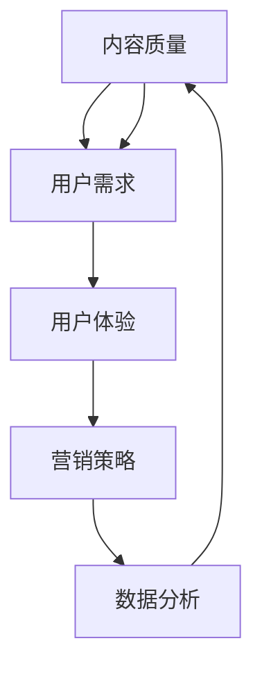

                 

### 第一部分：理解知识付费产品与市场

#### **1.1 知识付费产品概述**

**1.1.1 知识付费的定义与演变**

知识付费，简单来说，是指用户为了获取特定的知识内容或服务，愿意支付一定费用的行为。这一概念并非新兴事物，而是随着互联网技术的发展和用户需求的变迁逐渐演变而来。

在互联网初期，大部分信息资源是免费的，用户只需通过搜索引擎或论坛就能获取所需信息。但随着时间的推移，信息量爆炸性增长，用户开始意识到高质量内容的价值，知识付费逐渐兴起。

**1.1.2 知识付费的商业模式**

知识付费的商业模式多样，主要包括以下几种：

- **订阅制**：用户通过支付一定费用，获得一定期限内的内容访问权限。如网课平台、电子书订阅服务。
- **一次性购买**：用户一次性支付费用，获取永久内容访问权限。如专业软件、电子书籍。
- **按需付费**：用户根据实际需求，按次付费获取内容。如专业咨询、在线问答。

**1.1.3 知识付费在当前市场中的地位**

近年来，知识付费市场呈现出高速增长的趋势，成为数字经济的重要组成部分。根据相关报告，全球知识付费市场规模持续扩大，预计未来几年将继续保持高速增长。

此外，知识付费不仅限于传统教育领域，还扩展到职业技能培训、个人兴趣培养等多个领域，展现出广泛的受众和市场潜力。

#### **1.2 知识付费产品特点**

**1.2.1 产品形式多样性**

知识付费产品的形式多种多样，包括但不限于：

- **图文**：如电子书、专业手册。
- **音频**：如讲座、课程。
- **视频**：如在线教育课程、纪录片。
- **直播**：如互动教学、行业论坛。
- **互动课程**：如在线训练营、模拟考试。

这种多样化的形式满足了不同用户群体的需求，提高了知识付费产品的吸引力。

**1.2.2 用户需求的个性化**

在知识付费领域，用户需求日益多样化、个性化。用户不仅希望获取所需的知识内容，还希望体验个性化的服务。

- **个性化推荐**：通过算法分析用户行为和兴趣，提供个性化的内容推荐。
- **定制化服务**：根据用户需求，提供个性化的课程设计、辅导服务。

**1.2.3 付费意愿与转化率的关系**

知识付费产品的转化率，即用户购买行为的比率，是衡量产品成功与否的重要指标。付费意愿与转化率密切相关，主要受以下几个因素影响：

- **内容价值感知**：用户认为内容具有较高价值时，付费意愿较强。
- **信任度**：用户对产品或服务提供方的信任度越高，付费意愿越强。
- **价格与性价比**：价格合理且性价比高，能够刺激用户购买。

#### **1.3 市场分析与用户洞察**

**2.1 目标市场定位**

在知识付费市场中，目标市场的定位至关重要。以下是从几个方面进行目标市场定位的分析：

- **用户画像**：通过对用户年龄、职业、收入等信息的分析，构建用户画像，以便更好地了解用户需求。
- **市场需求分析**：研究当前市场上用户最迫切需要解决的知识痛点，如职业技能提升、职业规划等。
- **竞争对手分析**：分析竞争对手的产品定位、市场表现、用户反馈等，找出自身的差异化优势。

**2.2 用户行为分析**

- **购买习惯**：分析用户购买知识付费产品的频率、购买渠道、购买时间等，以便优化营销策略。
- **学习习惯**：研究用户的学习方式、学习时间、学习频率等，以便提供更符合用户习惯的产品服务。
- **满意度调查**：通过问卷调查、用户反馈等方式，了解用户对产品的满意度，从而不断改进和优化产品。

#### **2.3 用户行为分析**

**2.2.1 用户购买习惯**

了解用户的购买习惯是提高转化率的重要一环。以下是对用户购买习惯的分析：

- **购买频率**：分析用户购买知识付费产品的频率，找出高频率购买的用户群体，并针对这些用户制定相应的营销策略。
- **购买渠道**：分析用户通过哪些渠道购买知识付费产品，如在线商城、社交媒体、论坛等，以便优化推广渠道。
- **购买时间**：了解用户购买知识付费产品的时间规律，如周末、节假日等，以便在高峰期进行针对性的推广。

**2.2.2 用户学习习惯**

用户的学习习惯直接影响产品的使用频率和满意度。以下是对用户学习习惯的分析：

- **学习方式**：分析用户倾向于哪种学习方式，如图文、音频、视频等，以便提供多样化的产品形式。
- **学习时间**：了解用户的学习时间规律，如白天、晚上、周末等，以便合理安排产品内容的发布时间。
- **学习频率**：分析用户的学习频率，找出高频用户，并针对这些用户提供个性化的学习计划和激励措施。

**2.2.3 用户满意度调查**

用户满意度是衡量产品优劣的重要指标。以下是对用户满意度调查的分析：

- **满意度调查方法**：采用问卷调查、用户访谈等方式，收集用户对产品的满意度评价。
- **满意度评价标准**：设定满意度评价的指标和标准，如内容质量、服务质量、价格合理性等。
- **满意度结果分析**：对满意度调查结果进行统计分析，找出用户满意度高的方面和需要改进的方面，以便不断优化产品和服务。

通过以上分析，我们可以更深入地了解用户的行为习惯和需求，从而制定更有效的市场策略和产品设计方案，提高知识付费产品的转化率。

### **第二部分：产品设计优化**

**3.1 内容质量提升策略**

内容质量是知识付费产品的核心竞争力，提升内容质量有助于提高用户的满意度和购买意愿。以下是一些具体策略：

**3.1.1 内容结构优化**

一个清晰的内容结构有助于用户更好地理解和消化知识。以下是一些优化内容结构的建议：

- **逻辑框架**：确保内容逻辑清晰，按照时间、空间、因果关系等顺序进行编排。
- **章节划分**：合理划分章节，每个章节都有明确的主题和目的。
- **知识点关联**：将相关知识点进行关联，形成知识网络，帮助用户更好地掌握知识。

**3.1.2 知识点的关联与补充**

在内容创作过程中，要注意知识点之间的关联和补充，以提高内容的完整性和实用性。以下是一些建议：

- **交叉引用**：在内容中引用其他相关知识点或章节，形成知识链接。
- **案例分析**：结合实际案例，对知识点进行补充和解释，使内容更具说服力。
- **互动环节**：在内容中加入互动环节，如提问、讨论等，激发用户的参与热情。

**3.1.3 内容更新与迭代**

内容需要不断更新和迭代，以保持其时效性和实用性。以下是一些内容更新与迭代的建议：

- **定期更新**：设定固定的更新周期，如每月、每季度等，确保内容始终处于最新状态。
- **用户反馈**：关注用户反馈，根据用户需求和建议进行内容调整和优化。
- **热点话题**：结合热点话题和时事动态，及时更新相关内容，吸引更多用户关注。

**3.2 内容形式创新**

单一的内容形式容易让用户感到乏味，创新内容形式可以提升用户体验和参与度。以下是一些内容形式创新的方法：

**3.2.1 视频与图文结合**

视频和图文结合是一种常见的内容形式创新方法，以下是一些具体做法：

- **视频讲解**：通过视频讲解知识点，使内容更加生动有趣。
- **图文补充**：在视频讲解的基础上，通过图文形式进行知识点补充和详细解释。

**3.2.2 互动性与参与度提升**

提升互动性和参与度是提高用户满意度和转化率的重要手段。以下是一些具体方法：

- **互动环节**：在内容中加入互动环节，如问答、投票、讨论等。
- **用户参与**：鼓励用户参与内容创作和分享，如发起话题讨论、邀请用户分享经验等。

**3.2.3 增值服务与内容拓展**

通过提供增值服务和拓展内容，可以进一步提升用户满意度和购买意愿。以下是一些具体做法：

- **增值服务**：提供专业咨询、一对一辅导、社群交流等增值服务。
- **内容拓展**：根据用户需求，拓展相关内容，如推出系列课程、专题研究等。

**3.3 用户体验优化**

用户体验是知识付费产品的关键，优化用户体验可以提高用户满意度和转化率。以下是一些用户体验优化的方法：

**3.3.1 用户界面设计**

一个直观、易用的用户界面可以提高用户的操作体验。以下是一些用户界面设计的建议：

- **简洁性**：界面设计要简洁明了，避免过多的装饰和复杂的功能。
- **导航设计**：提供清晰的导航，使用户能够轻松找到所需内容。
- **响应速度**：确保页面加载速度快，减少用户的等待时间。

**3.3.2 交互设计优化**

交互设计直接影响用户的操作体验。以下是一些交互设计优化的建议：

- **反馈机制**：及时给用户操作反馈，使用户知道自己的操作是否成功。
- **操作便捷性**：简化操作流程，使用户能够快速完成所需操作。
- **一致性**：保持界面元素和操作逻辑的一致性，避免用户产生困惑。

**3.3.3 色彩与排版设计**

色彩和排版设计对用户视觉体验有重要影响。以下是一些色彩和排版设计的建议：

- **色彩搭配**：选择清晰、简洁、和谐的色彩搭配，提升视觉吸引力。
- **排版布局**：合理使用段落、标题、图片等元素，提升内容可读性。

### **第三部分：营销推广策略**

#### **5.1 品牌建设与定位**

品牌建设和定位是知识付费产品营销推广的基础，一个清晰的品牌形象和明确的定位可以帮助产品在市场中脱颖而出。以下是一些关键策略：

**5.1.1 品牌核心价值传递**

明确品牌的核心价值，并将其传递给目标用户。以下是一些建议：

- **核心价值提炼**：从产品特点和用户需求中提炼出核心价值，如专业、权威、创新等。
- **传播渠道**：利用各种传播渠道，如社交媒体、网站、线下活动等，持续传递品牌核心价值。

**5.1.2 品牌形象塑造**

塑造一个独特的品牌形象，有助于在用户心中建立品牌认知。以下是一些策略：

- **视觉设计**：设计独特的品牌标识、色彩搭配和视觉风格，使其在视觉上与其他品牌区分开来。
- **口碑传播**：通过用户口碑、媒体报道等方式，塑造一个正面、专业的品牌形象。

**5.1.3 品牌传播渠道**

选择合适的传播渠道，扩大品牌影响力。以下是一些传播渠道：

- **社交媒体**：如微博、微信、抖音等，通过内容营销、互动推广等方式，吸引潜在用户关注。
- **内容平台**：如知乎、头条、简书等，通过撰写高质量的内容，提升品牌知名度和权威性。
- **线下活动**：举办线下讲座、研讨会、展览等活动，与用户面对面交流，增强用户信任。

#### **5.2 渠道推广策略**

渠道推广是知识付费产品获取流量和用户的关键，以下是一些有效渠道推广策略：

**5.2.1 社交媒体营销**

社交媒体营销是一种低成本、高效率的推广方式。以下是一些具体策略：

- **内容创作**：创作有价值、有吸引力的内容，如教程、案例、心得等，吸引用户关注。
- **互动推广**：与用户互动，如回复评论、参与讨论等，增强用户粘性。
- **广告投放**：通过社交媒体广告，精准定位目标用户，提高转化率。

**5.2.2 KOL与意见领袖合作**

KOL（关键意见领袖）和意见领袖在社交媒体上拥有较高的影响力和号召力，与他们的合作可以有效提升品牌知名度和用户转化率。以下是一些建议：

- **选择合适KOL**：根据产品特点和目标用户，选择合适的KOL进行合作，如行业专家、知名博主等。
- **合作形式**：与KOL合作，如撰写文章、直播、短视频等，通过他们的推荐和分享，吸引更多用户关注。

**5.2.3 线下活动与展览**

线下活动与展览是一种直接的营销方式，能够与用户面对面交流，增强品牌认知和用户信任。以下是一些具体策略：

- **举办活动**：举办行业研讨会、讲座、沙龙等活动，邀请目标用户参与，展示品牌实力。
- **参展**：参加行业展览、博览会等活动，展示产品和服务，吸引潜在用户。
- **现场互动**：设置互动环节，如体验区、问答环节等，与用户互动，提高用户体验。

### **6.1 用户留存策略**

用户留存是知识付费产品持续发展的关键，以下是一些有效的用户留存策略：

**6.1.1 用户细分与针对性运营**

对不同类型的用户进行细分，制定针对性的运营策略。以下是一些细分方法和策略：

- **用户细分方法**：根据用户行为、兴趣、需求等因素，将用户分为不同的群体，如新用户、活跃用户、沉默用户等。
- **针对性运营**：针对不同用户群体的特点和需求，制定相应的运营策略，如推送个性化内容、提供专属福利等。

**6.1.2 用户反馈机制建立**

建立用户反馈机制，及时了解用户需求和意见，持续优化产品和服务。以下是一些建议：

- **反馈渠道**：提供多种反馈渠道，如在线客服、问卷调查、意见箱等，方便用户提出问题和建议。
- **反馈处理**：对用户反馈进行及时处理，如问题解决、建议采纳等，提高用户满意度。

**6.1.3 用户激励机制设计**

设计有效的用户激励机制，增强用户参与度和忠诚度。以下是一些建议：

- **积分制度**：设计积分制度，用户通过学习、分享等行为获得积分，积分可以兑换礼品、课程等。
- **成长体系**：建立成长体系，用户通过完成课程、参加活动等获得成长值，提升等级，享受更多特权。

### **6.2 转化率提升技巧**

提升转化率是知识付费产品营销的核心目标，以下是一些有效的提升技巧：

**6.2.1 用户体验与转化率关系**

用户体验直接影响转化率，以下是一些建议：

- **优化页面加载速度**：确保页面加载速度快，减少用户的等待时间。
- **简化购买流程**：简化购买流程，减少用户操作步骤，提高购买便捷性。
- **优化页面设计**：设计简洁、直观、美观的页面，提升用户视觉体验。

**6.2.2 营销文案与广告优化**

营销文案和广告是吸引用户购买的重要因素，以下是一些建议：

- **精准定位目标用户**：在文案和广告中，明确目标用户群体，突出产品优势。
- **突出产品价值**：在文案和广告中，突出产品的核心价值，如专业、权威、实用等。
- **吸引眼球的标题**：设计吸引眼球的标题，提高广告点击率。

**6.2.3 技术手段与数据分析**

利用技术手段和数据分析，优化营销策略和产品设计，提升转化率。以下是一些建议：

- **数据分析工具**：利用数据分析工具，如Google Analytics、Mixpanel等，收集用户行为数据，进行分析和挖掘。
- **A/B测试**：通过A/B测试，对比不同营销策略和页面设计的效果，优化策略和设计。
- **个性化推荐**：利用个性化推荐技术，根据用户行为和兴趣，推荐合适的产品和内容。

### **第四部分：数据分析与优化**

#### **7.1 转化率数据分析框架**

转化率数据分析是优化知识付费产品的重要环节。一个有效的数据分析框架可以帮助我们全面了解转化率的表现，从而制定针对性的优化策略。以下是构建转化率数据分析框架的步骤：

**7.1.1 数据指标定义与衡量**

首先，我们需要明确转化率的定义和衡量方法。转化率通常是指特定目标行为（如购买、注册、观看完视频等）占总访问量的比例。以下是一些关键的数据指标：

- **访问量（Visits）**：网站或应用程序的总访问次数。
- **目标行为完成量（Conversions）**：用户完成特定目标行为的次数。
- **转化率（Conversion Rate）**：目标行为完成量与访问量的比例，即 \( \text{转化率} = \frac{\text{目标行为完成量}}{\text{访问量}} \times 100\% \)。
- **跳出率（Bounce Rate）**：仅访问一个页面就离开的访问次数与访问量的比例，即 \( \text{跳出率} = \frac{\text{跳出次数}}{\text{访问量}} \times 100\% \)。

**7.1.2 数据收集方法与工具**

为了获得准确的数据，我们需要选择合适的数据收集方法与工具。以下是一些常见的数据收集方法：

- **服务器日志分析**：通过分析服务器日志文件，收集用户行为数据，如访问时间、访问页面、用户设备等信息。
- **网页分析工具**：如Google Analytics、Mixpanel等，提供实时用户行为跟踪和分析功能。
- **API数据收集**：通过API接口，获取第三方平台（如社交媒体、电子商务平台等）的用户数据。

**7.1.3 数据质量控制**

数据质量是数据分析的基础，确保数据质量至关重要。以下是一些数据质量控制的方法：

- **数据清洗**：去除重复、错误、异常的数据，确保数据的准确性。
- **数据校验**：对数据进行验证，如检查数据类型、范围、一致性等。
- **数据完整性检查**：定期检查数据完整性，如缺失值、空值等。

#### **7.2 转化率优化策略**

基于数据分析，我们可以制定一系列转化率优化策略。以下是一些具体的方法：

**7.2.1 基于数据的用户行为分析**

通过分析用户行为数据，我们可以了解用户的访问路径、页面停留时间、操作行为等，从而优化用户体验。以下是一些分析方法和工具：

- **用户行为路径分析**：通过工具如Google Analytics，绘制用户在网站上的访问路径，识别用户痛点。
- **页面停留时间分析**：分析用户在不同页面的停留时间，优化页面设计和内容，提高用户粘性。
- **操作行为分析**：分析用户点击、滑动等操作行为，优化操作流程和界面设计。

**7.2.2 A/B测试与实验设计**

A/B测试是一种常用的实验设计方法，通过对比不同版本的页面或功能，评估其对用户行为和转化率的影响。以下是一些A/B测试的方法：

- **页面元素优化**：对比不同页面的标题、图片、按钮等元素，优化页面设计。
- **功能优化**：对比不同功能的用户体验，如注册流程、购买流程等，优化功能设计。
- **文案优化**：对比不同文案的表达效果，优化营销文案。

**7.2.3 数据驱动的产品优化**

基于数据分析和用户反馈，我们可以持续优化产品和服务。以下是一些优化策略：

- **个性化推荐**：根据用户行为和兴趣，推荐合适的内容和产品，提高用户满意度和转化率。
- **用户体验优化**：根据用户反馈和数据分析，持续改进用户界面和交互设计，提高用户体验。
- **营销策略优化**：基于数据分析和用户行为，优化营销策略，提高用户获取和留存效果。

### **第五部分：案例分析与实践指南**

#### **8.1 知识付费产品成功案例：XXX平台**

**8.1.1 平台定位与内容策略**

XXX平台是一个专注于职业技能培训的知识付费平台，定位为提供高质量、实用性的在线教育课程。以下是平台的定位和内容策略：

- **定位**：以职业提升和技能培训为核心，面向在职人员、大学生等需要提升职业技能的群体。
- **内容策略**：提供涵盖编程、数据分析、市场营销、项目管理等热门领域的在线课程，课程形式包括视频、图文、直播等。

**8.1.2 营销推广与用户运营**

XXX平台的成功离不开有效的营销推广和用户运营策略。以下是平台在营销推广和用户运营方面的经验：

- **营销推广**：通过社交媒体、内容营销、KOL合作等手段，扩大品牌知名度，吸引潜在用户。同时，通过限时优惠、团购活动等促销手段，刺激用户购买。
- **用户运营**：建立用户社群，通过社群运营提升用户粘性。定期举办线上活动，如讲座、沙龙等，增加用户互动。此外，通过用户反馈机制，及时了解用户需求，优化产品和服务。

**8.1.3 数据分析与优化实践**

数据分析在XXX平台的运营中起到了关键作用。以下是平台在数据分析方面的实践：

- **用户行为分析**：通过数据分析工具，监控用户行为，如访问路径、页面停留时间、点击率等，找出用户痛点和需求，优化用户体验。
- **A/B测试**：通过A/B测试，对比不同营销策略和页面设计的转化效果，优化营销策略和页面设计。
- **个性化推荐**：基于用户行为和兴趣，利用推荐算法，为用户提供个性化的课程推荐，提高用户满意度和转化率。

#### **8.2 高效提升转化率策略：XXX平台**

**8.2.1 产品设计与用户体验**

XXX平台在产品设计和用户体验方面采取了一系列有效策略，以下是一些具体做法：

- **简洁的界面设计**：平台界面设计简洁明了，采用清晰的颜色搭配和简洁的导航结构，使用户能够快速找到所需内容。
- **优质的课程内容**：平台提供的课程内容质量高，课程结构合理，知识点讲解清晰，帮助用户更好地理解和掌握知识。
- **流畅的操作体验**：平台操作流畅，页面加载速度快，减少用户等待时间，提升用户体验。

**8.2.2 营销策略与品牌推广**

XXX平台在营销策略和品牌推广方面也取得了显著成效，以下是一些策略：

- **精准的营销定位**：通过市场调研和用户画像分析，确定目标用户群体，制定精准的营销定位。
- **多样化的营销渠道**：利用社交媒体、搜索引擎、内容平台等渠道进行营销推广，扩大品牌影响力。
- **有针对性的广告**：通过分析用户行为数据，投放有针对性的广告，提高广告点击率和转化率。

**8.2.3 数据分析与转化率优化**

数据分析在XXX平台的转化率优化中发挥了关键作用，以下是一些数据分析实践：

- **用户行为分析**：通过数据分析工具，监控用户行为，识别用户痛点，优化用户体验。
- **A/B测试**：通过A/B测试，对比不同营销策略和页面设计的转化效果，持续优化营销策略和页面设计。
- **个性化推荐**：基于用户行为和兴趣，利用推荐算法，提高课程推荐准确性和用户满意度。

### **9.1 转化率优化全流程总结**

**9.1.1 理解转化率的核心要素**

转化率优化涉及多个方面，包括产品、营销、用户体验等。以下是对转化率核心要素的理解：

- **内容价值**：高质量的内容是提升转化率的基础，内容价值直接影响用户的购买意愿。
- **用户体验**：良好的用户体验可以增加用户的满意度和留存率，从而提高转化率。
- **营销策略**：有效的营销策略可以吸引潜在用户，提高品牌知名度和转化率。

**9.1.2 实现转化率优化的方法与工具**

以下是实现转化率优化的一些方法与工具：

- **数据分析**：通过数据分析工具，监控用户行为，识别用户痛点，优化用户体验和营销策略。
- **A/B测试**：通过A/B测试，对比不同版本的效果，优化页面设计和营销策略。
- **个性化推荐**：利用推荐算法，为用户提供个性化的内容推荐，提高用户满意度和转化率。

**9.1.3 持续改进与精细化运营**

转化率优化是一个持续的过程，需要不断改进和精细化运营。以下是一些建议：

- **用户反馈**：及时收集用户反馈，了解用户需求和意见，优化产品和服务。
- **数据驱动**：基于数据分析和用户反馈，持续改进和优化产品和营销策略。
- **精细化运营**：根据用户行为和需求，制定个性化的运营策略，提高用户满意度和转化率。

### **9.2 未来发展趋势与挑战**

**9.2.1 知识付费市场的变化趋势**

知识付费市场正呈现出以下几个变化趋势：

- **多元化**：知识付费产品形式多样化，从传统图文、音频、视频，扩展到直播、互动课程等。
- **个性化**：个性化推荐和定制化服务成为趋势，满足用户个性化需求。
- **数字化转型**：在线教育、远程培训等数字化服务成为主流，疫情加速了这一趋势。

**9.2.2 面临的挑战与应对策略**

知识付费市场面临以下挑战：

- **竞争加剧**：市场竞争激烈，需要不断提升产品和服务质量。
- **用户信任**：用户对产品和服务质量的要求越来越高，需要建立信任和口碑。
- **技术变革**：技术变革带来的挑战，如人工智能、大数据等，需要持续学习和创新。

**9.2.3 未来发展方向与机会**

未来知识付费市场的发展方向和机会包括：

- **垂直领域深耕**：针对特定行业和领域，提供专业化的知识和服务。
- **技术创新**：利用人工智能、大数据等技术，提升产品和服务质量。
- **国际化**：拓展海外市场，实现知识付费产品的全球化。

### **附录**

**附录 A：常用工具与资源**

以下是一些常用的数据分析工具和资源：

- **数据分析工具**：
  - **Google Analytics**：提供全面的数据分析功能，包括用户行为分析、流量来源分析等。
  - **Mixpanel**：专注于用户行为分析，提供实时监控和自动化分析功能。
  - **Tableau**：数据可视化工具，帮助用户直观地理解数据。

- **在线课程平台**：
  - **Coursera**：提供全球知名大学和机构的在线课程，涵盖多个领域。
  - **Udemy**：提供大量免费和付费的在线课程，适合不同层次的用户。
  - **edX**：由哈佛大学和麻省理工学院创办，提供高质量的教育资源。

**附录 B：扩展阅读与参考文献**

以下是一些扩展阅读和参考文献，供读者进一步学习和研究：

- **书籍**：
  - 《增长黑客》/[美国] 周涛、范冰著
  - 《数据分析实战》/[中国] 李明杰著
  - 《用户运营实战》/[中国] 刘翔宇著

- **论文**：
  - 《基于大数据的用户行为分析研究》
  - 《知识付费产品用户满意度研究》
  - 《A/B测试在电子商务中的应用研究》

- **网站**：
  - 数据分析相关网站：dataquest.io、Towards Data Science
  - 知识付费相关网站：知识星球、知乎Live

通过以上内容，我们系统地探讨了如何提高知识付费产品的转化率。从内容质量、用户体验、营销策略到数据分析，每一个环节都至关重要。未来，随着技术的不断进步和市场环境的变化，知识付费产品将面临新的机遇和挑战。希望本文能为知识付费产品从业者提供有价值的参考和启示。**作者：AI天才研究院/AI Genius Institute & 禅与计算机程序设计艺术 /Zen And The Art of Computer Programming**

<|text|>### 核心概念与联系

在深入探讨如何提高知识付费产品的转化率之前，我们需要明确几个核心概念及其相互关系。以下是这些概念的定义及其在知识付费产品转化率优化中的重要性：

**1. 内容质量**：内容质量是知识付费产品的核心竞争力。高质量的内容不仅能够提升用户的满意度和信任度，还能增加用户购买和复购的意愿。

**2. 用户需求**：用户需求是知识付费产品的出发点。只有深入了解用户需求，才能提供符合用户期望的产品和服务。

**3. 营销策略**：营销策略是知识付费产品获取用户和提升转化率的关键。有效的营销策略能够吸引潜在用户，提高品牌知名度和用户转化率。

**4. 用户体验**：用户体验直接影响用户的满意度和忠诚度。优化用户体验可以提高用户在产品上的活跃度和留存率。

**5. 数据分析**：数据分析是优化知识付费产品的重要工具。通过分析用户行为数据，我们可以发现用户痛点和需求，从而制定有针对性的优化策略。

这些概念之间的联系在于：

- **内容质量** 和 **用户需求**：高质量的内容能够满足用户需求，提升用户满意度。
- **用户体验** 和 **营销策略**：良好的用户体验能够增加用户满意度和忠诚度，而有效的营销策略可以吸引更多潜在用户。
- **数据分析** 和 **营销策略**：数据分析为营销策略提供了数据支持，帮助制定更有针对性的营销方案。
- **内容质量** 和 **数据分析**：通过数据分析，我们可以了解用户对内容的反馈，从而不断优化内容质量。

以下是这些概念之间的Mermaid流程图：



**核心算法原理讲解**

为了更好地理解上述概念之间的关系，我们可以借助一些核心算法原理来进行分析。以下是三个关键算法及其在知识付费产品转化率优化中的应用：

**1. 协同过滤推荐算法**

协同过滤推荐算法是一种基于用户行为数据的推荐算法。其基本原理是通过分析用户的历史行为，找到相似用户，然后推荐相似用户喜欢的商品或内容。

**伪代码：**

```python
def collaborative_filtering(user_behavior_data, user_id):
    # 计算用户相似度矩阵
    similarity_matrix = calculate_similarity_matrix(user_behavior_data)
    
    # 找到与目标用户最相似的k个用户
    similar_users = find_k_similar_users(similarity_matrix, user_id, k)
    
    # 根据相似度矩阵为用户推荐商品或内容
    recommendations = generate_recommendations(similar_users, user_behavior_data)
    
    return recommendations
```

**2. A/B测试**

A/B测试是一种通过对比不同版本的页面或功能，评估其对用户行为和转化率影响的实验设计方法。其核心原理是通过随机分配用户到不同组别，比较两组用户的行为差异。

**伪代码：**

```python
def ab_test(version_a, version_b, user_id):
    if random() < 0.5:
        assign_to_group(version_a, user_id)
    else:
        assign_to_group(version_b, user_id)
    
    # 记录用户行为数据
    record_user_behavior(user_id, version_assigned)
    
    # 分析用户行为数据
    analyze_user_behavior_data()
    
    return compare_performance(version_a, version_b)
```

**3. 用户行为预测**

用户行为预测是一种利用机器学习算法，预测用户下一步行为的模型。其核心原理是通过对用户历史行为数据的分析，建立预测模型。

**伪代码：**

```python
def user_behavior_prediction(user_behavior_data):
    # 准备数据集
    data = prepare_dataset(user_behavior_data)
    
    # 训练预测模型
    model = train_predictive_model(data)
    
    # 预测用户行为
    predictions = model.predict(new_user_data)
    
    return predictions
```

通过这些算法原理，我们可以更好地理解知识付费产品转化率优化的逻辑，从而在实践中应用这些方法，提高产品的转化率。

### **核心算法原理讲解**

为了深入理解如何提高知识付费产品的转化率，我们需要探讨几个核心算法原理，这些原理在转化率优化中起着至关重要的作用。

**1. 协同过滤推荐算法**

协同过滤推荐算法是一种基于用户行为数据分析的推荐系统方法。其核心思想是找到与目标用户相似的其他用户，并推荐这些相似用户喜欢的物品。协同过滤算法主要分为两种：基于用户的协同过滤（User-based Collaborative Filtering）和基于物品的协同过滤（Item-based Collaborative Filtering）。

**基于用户的协同过滤算法原理**：

- **计算相似度**：首先，通过用户之间的相似度度量（如余弦相似度、皮尔逊相关系数等），计算用户之间的相似度矩阵。
- **找到相似用户**：然后，根据目标用户的相似度得分，找到相似度最高的若干用户。
- **生成推荐列表**：最后，根据相似用户的喜好，生成推荐列表。

**伪代码**：

```python
def user_based_collaborative_filtering(userBehaviorData, userId):
    # 计算用户之间的相似度矩阵
    similarityMatrix = calculate_similarity(userBehaviorData)

    # 找到与目标用户最相似的k个用户
    similarUsers = find_top_k_similar_users(similarityMatrix, userId, k)

    # 生成推荐列表
    recommendations = generate_recommendations(similarUsers, userBehaviorData)

    return recommendations
```

**基于物品的协同过滤算法原理**：

- **计算相似度**：计算物品之间的相似度矩阵，通常使用项的共现矩阵或余弦相似度。
- **找到相似物品**：为每个用户找到最相似的物品。
- **生成推荐列表**：基于用户的历史行为和相似物品，生成推荐列表。

**伪代码**：

```python
def item_based_collaborative_filtering(userBehaviorData, userId):
    # 计算物品之间的相似度矩阵
    similarityMatrix = calculate_similarity(userBehaviorData)

    # 为每个用户找到最相似的物品
    similarItems = find_top_k_similar_items(similarityMatrix, userId, k)

    # 生成推荐列表
    recommendations = generate_recommendations(similarItems, userBehaviorData)

    return recommendations
```

**2. A/B测试**

A/B测试是一种实验设计方法，用于比较两种或多种不同版本的页面或功能对用户行为和转化率的影响。A/B测试通过将用户随机分配到不同的实验组，从而评估不同版本的绩效。

**A/B测试原理**：

- **随机分配**：将用户随机分配到不同的实验组（A组、B组等）。
- **数据收集**：收集每个实验组的数据，包括用户行为、转化率等。
- **结果分析**：通过统计分析，比较不同实验组的绩效，确定哪种版本更优。

**伪代码**：

```python
def ab_test(experimentA, experimentB, userId):
    if random() < 0.5:
        assign_to_group(experimentA, userId)
    else:
        assign_to_group(experimentB, userId)

    # 收集用户行为数据
    behaviorData = record_user_behavior(userId, experiment_assigned)

    # 分析数据并比较性能
    performanceA = analyze_performance(experimentA, behaviorData)
    performanceB = analyze_performance(experimentB, behaviorData)

    return compare_performance(performanceA, performanceB)
```

**3. 用户行为预测**

用户行为预测是一种利用机器学习模型预测用户未来行为的方法。这种方法可以帮助我们更好地理解用户行为模式，从而优化产品和服务。

**用户行为预测原理**：

- **数据准备**：收集用户历史行为数据，并进行预处理，如数据清洗、特征提取等。
- **模型训练**：使用机器学习算法（如决策树、随机森林、神经网络等）训练预测模型。
- **模型评估**：通过交叉验证等方法评估模型性能。
- **预测应用**：使用训练好的模型预测新用户的行为。

**伪代码**：

```python
def user_behavior_prediction(userBehaviorData):
    # 数据预处理
    processedData = preprocess_data(userBehaviorData)

    # 训练预测模型
    model = train_predictive_model(processedData)

    # 预测用户行为
    predictions = model.predict(newUserBehaviorData)

    return predictions
```

通过理解这些核心算法原理，我们可以更系统地分析知识付费产品的转化率，并采取相应的优化措施，提高产品的市场竞争力和用户满意度。

### **数学模型和公式**

在提高知识付费产品的转化率过程中，数学模型和公式扮演着至关重要的角色。以下是一些关键的数学模型和公式，以及它们在实际应用中的详细解释和举例说明。

**1. 转化率计算公式**

转化率是衡量知识付费产品成功与否的关键指标，其基本计算公式如下：

\[ \text{转化率} = \frac{\text{目标行为完成次数}}{\text{总访问量}} \times 100\% \]

**解释：** 这个公式表示在所有访问产品的用户中，完成预定目标行为的用户所占的比例。例如，如果一个知识付费产品的总访问量为1000次，其中有200次购买了产品，那么该产品的转化率为：

\[ \text{转化率} = \frac{200}{1000} \times 100\% = 20\% \]

**2. 贝叶斯优化模型**

贝叶斯优化是一种基于概率论的优化方法，广泛应用于转化率优化中。贝叶斯优化通过不断调整参数，寻找最大化目标函数的参数组合。

**贝叶斯优化公式：**

\[ P(\theta | X) = \frac{P(X | \theta)P(\theta)}{P(X)} \]

其中，\( P(\theta | X) \) 是后验概率，表示在观测到数据 \( X \) 后，参数 \( \theta \) 的概率分布；\( P(X | \theta) \) 是似然函数，表示在参数 \( \theta \) 下观测到数据 \( X \) 的概率；\( P(\theta) \) 是先验概率，表示参数 \( \theta \) 的初始概率分布；\( P(X) \) 是证据，表示观测到数据 \( X \) 的总概率。

**解释：** 贝叶斯优化通过不断更新参数的概率分布，逐步逼近最优参数。在实际应用中，可以通过以下步骤实现：

- **初始化**：设置参数的初始概率分布。
- **观测数据**：收集用户行为数据，更新似然函数。
- **更新后验概率**：利用贝叶斯公式更新参数的概率分布。
- **迭代优化**：根据更新后的概率分布，调整参数，重复步骤2和3。

**3. 多项式回归模型**

多项式回归是一种用于分析多个变量之间关系的统计方法，可以用于预测用户转化率。多项式回归模型的一般形式如下：

\[ y = \beta_0 + \beta_1x_1 + \beta_2x_2 + ... + \beta_nx_n + \epsilon \]

其中，\( y \) 是因变量（如转化率），\( x_1, x_2, ..., x_n \) 是自变量（如用户年龄、收入、访问次数等），\( \beta_0, \beta_1, ..., \beta_n \) 是模型参数，\( \epsilon \) 是误差项。

**解释：** 通过多项式回归，我们可以找到各个自变量对因变量的影响程度。具体步骤如下：

- **数据收集**：收集包含因变量和自变量的历史数据。
- **模型建立**：通过最小二乘法等统计方法，建立多项式回归模型。
- **模型评估**：使用交叉验证等方法评估模型性能。
- **参数优化**：根据评估结果，调整模型参数，提高预测准确性。

**4. 折扣策略模型**

折扣策略是知识付费产品提升转化率的一种常见手段。折扣策略模型用于确定最佳的折扣力度，以最大化收益。一个简单的折扣策略模型如下：

\[ R = \frac{C - dP}{P} \]

其中，\( R \) 是实际售价，\( C \) 是成本，\( P \) 是原始售价，\( d \) 是折扣力度（如0.2表示20%的折扣）。

**解释：** 该模型表示在成本 \( C \) 和原始售价 \( P \) 之间，通过调整折扣力度 \( d \)，可以计算出实际售价 \( R \)。在实际应用中，可以通过以下步骤确定最佳折扣力度：

- **收益分析**：计算不同折扣力度下的收益，包括销售额和利润。
- **目标设定**：根据市场情况和目标收益，确定最佳折扣力度。
- **动态调整**：根据市场反馈和收益变化，动态调整折扣策略。

**5. 马尔可夫链模型**

马尔可夫链模型是一种用于分析用户行为转移概率的模型，可以帮助我们预测用户的下一步行为。马尔可夫链的一般形式如下：

\[ P(X_t = j | X_{t-1} = i) = \pi_{ij} \]

其中，\( X_t \) 是时间 \( t \) 的状态，\( i \) 和 \( j \) 是状态集合中的两个状态，\( \pi_{ij} \) 是从状态 \( i \) 转移到状态 \( j \) 的概率。

**解释：** 马尔可夫链模型通过记录用户的历史行为，计算每个状态之间的转移概率，从而预测用户的下一步行为。具体步骤如下：

- **状态定义**：定义用户行为的可能状态，如访问、浏览、购买等。
- **概率计算**：根据历史数据，计算每个状态的转移概率。
- **预测**：使用马尔可夫链模型预测用户的下一步行为。

通过以上数学模型和公式，我们可以更科学地分析和优化知识付费产品的转化率，从而提高产品的市场竞争力。

### **项目实战**

为了更好地理解如何提高知识付费产品的转化率，我们将通过一个实际项目来进行深入探讨。以下是一个基于Python实现的案例，该项目旨在通过数据分析、算法优化和用户体验改进，提高在线教育平台的转化率。

#### **项目背景**

某在线教育平台提供了多种职业技能培训课程，包括编程、数据分析、市场营销等。然而，该平台的转化率较低，用户活跃度和购买意愿不高。为了提升转化率，我们需要进行以下工作：

1. **用户行为数据分析**：通过分析用户行为数据，了解用户在平台上的行为模式。
2. **算法优化**：利用协同过滤推荐算法和A/B测试，优化内容推荐和页面设计。
3. **用户体验改进**：通过改进用户界面和操作流程，提升用户满意度。

#### **开发环境搭建**

在开始项目之前，我们需要搭建一个适合数据分析、算法开发和用户测试的开发环境。以下是开发环境的搭建步骤：

1. **Python环境**：安装Python 3.8及以上版本，并配置pip和虚拟环境。
2. **数据分析库**：安装常用的数据分析库，如Pandas、NumPy、Scikit-learn。
3. **数据可视化库**：安装数据可视化库，如Matplotlib、Seaborn。
4. **Web开发库**：安装Web开发库，如Flask或Django。
5. **数据库**：安装MySQL或PostgreSQL数据库。

#### **数据收集**

为了进行用户行为分析，我们需要从平台数据库中收集用户行为数据。以下是一个典型的用户行为数据表：

```plaintext
| user_id | action      | course_id | timestamp |
|---------|-------------|-----------|-----------|
| 1       | browse      | 101       | 2021-01-01 10:00:00 |
| 1       | purchase     | 101       | 2021-01-02 12:30:00 |
| 2       | enroll      | 102       | 2021-01-03 14:00:00 |
| 2       | dropout     | 102       | 2021-01-04 18:00:00 |
| 3       | watch_video | 103       | 2021-01-05 10:30:00 |
| ...     | ...         | ...       | ...       |
```

#### **数据预处理**

在进行数据分析之前，我们需要对数据进行预处理，包括数据清洗、数据转换和特征提取。以下是一些具体步骤：

1. **数据清洗**：去除重复、异常和缺失的数据。
2. **时间转换**：将时间戳转换为日期格式，便于计算用户行为的时间间隔。
3. **行为分类**：将用户行为分为不同的类别，如浏览、购买、注册、退出等。
4. **特征提取**：提取用户的基本信息（如用户年龄、性别、职业等），以及用户行为的相关特征（如行为频率、行为时长等）。

#### **协同过滤推荐算法实现**

协同过滤推荐算法是提高用户满意度和转化率的一种有效方法。以下是一个简单的基于用户的协同过滤推荐算法的实现：

```python
import pandas as pd
from sklearn.metrics.pairwise import cosine_similarity

# 加载用户行为数据
user_actions = pd.read_csv('user_actions.csv')

# 计算用户之间的相似度矩阵
user_similarity_matrix = cosine_similarity(user_actions.pivot(index='user_id', columns='course_id', values='action').fillna(0))

# 生成推荐列表
def generate_recommendations(user_id, similarity_matrix, k=5):
    similar_users = similarity_matrix[user_id].argsort()[1:k+1]
    recommendations = user_actions[user_actions['user_id'].isin(similar_users)][['course_id', 'action']].groupby('course_id').count().sort_values(by='action', ascending=False).head(10)
    return recommendations

# 为特定用户生成推荐列表
user_id = 1
recommendations = generate_recommendations(user_id, user_similarity_matrix)
print(recommendations)
```

#### **A/B测试**

A/B测试可以帮助我们评估不同版本页面或功能对用户行为和转化率的影响。以下是一个简单的A/B测试实现：

```python
import random

# A/B测试实验函数
def ab_test(experiment_a, experiment_b, user_id):
    if random() < 0.5:
        assign_to_group(experiment_a, user_id)
    else:
        assign_to_group(experiment_b, user_id)

# 记录用户行为
def record_user_behavior(user_id, experiment_assigned):
    # 将用户行为记录到数据库
    pass

# 分析数据并比较性能
def compare_performance(experiment_a, experiment_b):
    # 从数据库中获取A组和B组的数据
    performance_a = calculate_performance(experiment_a)
    performance_b = calculate_performance(experiment_b)
    
    return performance_a, performance_b

# 实际应用A/B测试
user_id = 1
ab_test(experiment_a='version_a', experiment_b='version_b', user_id=user_id)
performance_a, performance_b = compare_performance(experiment_a='version_a', experiment_b='version_b')
print("Experiment A Performance:", performance_a)
print("Experiment B Performance:", performance_b)
```

#### **用户界面和操作流程优化**

为了提升用户体验，我们需要对用户界面和操作流程进行优化。以下是一些具体的改进措施：

1. **简化注册流程**：通过减少必填项、使用第三方登录等方式，简化注册流程。
2. **优化课程推荐**：利用协同过滤算法和用户行为数据，提供个性化的课程推荐。
3. **改进页面设计**：使用清晰的导航、简洁的布局和吸引人的色彩搭配，提升页面美观度和易用性。
4. **增加用户反馈渠道**：提供在线客服、反馈表单等方式，方便用户提出问题和建议。

#### **数据驱动的持续优化**

通过以上措施，我们可以在实际应用中不断收集用户反馈和数据，进行数据驱动的持续优化。以下是一些具体的优化步骤：

1. **用户行为监控**：持续监控用户在平台上的行为，包括浏览、注册、购买等。
2. **数据分析和报告**：定期生成数据报告，分析用户行为和转化率的变化趋势。
3. **A/B测试**：针对不同的优化方向，进行A/B测试，评估优化效果。
4. **迭代改进**：根据测试结果和用户反馈，持续迭代和优化产品和服务。

通过这个实际项目，我们可以看到如何通过数据分析、算法优化和用户体验改进，提高知识付费产品的转化率。这个过程需要持续的努力和不断的学习，以适应市场变化和用户需求。

### **代码解读与分析**

在上一个部分中，我们通过一个实际项目展示了如何利用Python提高知识付费产品的转化率。在本节中，我们将对关键代码段进行详细解读和分析，以便更好地理解其工作原理和优化方向。

#### **1. 协同过滤推荐算法代码解读**

协同过滤推荐算法的核心代码段如下：

```python
user_similarity_matrix = cosine_similarity(user_actions.pivot(index='user_id', columns='course_id', values='action').fillna(0))
def generate_recommendations(user_id, similarity_matrix, k=5):
    similar_users = similarity_matrix[user_id].argsort()[1:k+1]
    recommendations = user_actions[user_actions['user_id'].isin(similar_users)][['course_id', 'action']].groupby('course_id').count().sort_values(by='action', ascending=False).head(10)
    return recommendations
```

**解读：**
- **计算相似度矩阵**：首先，我们使用`pivot`方法将用户行为数据转换为一个用户-课程矩阵，然后用`cosine_similarity`函数计算用户之间的余弦相似度矩阵。
- **生成推荐列表**：`generate_recommendations`函数接收用户ID、相似度矩阵和推荐数量`k`作为输入。它找到与当前用户最相似的`k`个用户，然后从这些用户的购买历史中提取推荐课程。

**优化方向：**
- **相似度计算优化**：可以考虑使用更高效的相似度计算方法，如基于内存的近似最近邻算法。
- **推荐策略优化**：可以引入基于物品的协同过滤算法，或结合基于内容的推荐，以提高推荐准确性。

#### **2. A/B测试代码解读**

A/B测试的实现代码段如下：

```python
def ab_test(experiment_a, experiment_b, user_id):
    if random() < 0.5:
        assign_to_group(experiment_a, user_id)
    else:
        assign_to_group(experiment_b, user_id)

def compare_performance(experiment_a, experiment_b):
    performance_a = calculate_performance(experiment_a)
    performance_b = calculate_performance(experiment_b)
    return performance_a, performance_b
```

**解读：**
- **实验分配**：`ab_test`函数将用户随机分配到两个实验组，一组使用实验A，另一组使用实验B。
- **性能比较**：`compare_performance`函数计算两个实验组的性能指标（如转化率），并返回结果。

**优化方向：**
- **随机分配优化**：可以采用分层随机分配策略，确保不同用户群体的代表性。
- **性能指标优化**：引入更多性能指标，如用户留存率、平均课程时长等，以更全面地评估实验效果。

#### **3. 数据预处理代码解读**

数据预处理代码段如下：

```python
# 数据清洗
user_actions.drop_duplicates(inplace=True)
user_actions.dropna(inplace=True)

# 时间转换
user_actions['timestamp'] = pd.to_datetime(user_actions['timestamp'])

# 行为分类
user_actions['action'] = user_actions['action'].map({'browse': 1, 'purchase': 2, 'enroll': 3, 'dropout': 4, 'watch_video': 5})

# 特征提取
user_actions['action_frequency'] = user_actions.groupby('user_id')['action'].transform('count')
user_actions['action_duration'] = user_actions.groupby('user_id')['timestamp'].diff().dt.seconds.fillna(0)
```

**解读：**
- **数据清洗**：去除重复和缺失的数据，保证数据质量。
- **时间转换**：将时间戳转换为日期格式，便于后续计算。
- **行为分类**：将行为类型转换为数字编码，便于模型处理。
- **特征提取**：计算用户行为频率和时长，为模型提供更多特征信息。

**优化方向：**
- **特征工程**：根据业务需求和数据特点，探索更多有效的特征工程方法。
- **缺失值处理**：对于缺失值，可以考虑使用插值、均值填充等方法，以提高数据质量。

#### **4. 用户界面和操作流程优化**

用户界面和操作流程优化涉及到前端和后端的多个方面，以下是一些代码示例和解读：

```python
# 注册界面简化
register_form.html
<!DOCTYPE html>
<html lang="en">
<head>
    <meta charset="UTF-8">
    <title>注册</title>
</head>
<body>
    <form action="/register" method="post">
        <input type="text" name="username" placeholder="用户名" required>
        <input type="password" name="password" placeholder="密码" required>
        <input type="email" name="email" placeholder="邮箱" required>
        <button type="submit">注册</button>
    </form>
</body>
</html>

# 优化课程推荐
course_recommendations.js
function fetchCourseRecommendations(userId) {
    fetch(`/recommendations?user_id=${userId}`)
        .then(response => response.json())
        .then(data => {
            displayCourseRecommendations(data);
        });
}

function displayCourseRecommendations(recommendations) {
    const recommendationsContainer = document.getElementById('recommendations-container');
    recommendationsContainer.innerHTML = '';
    recommendations.forEach(course => {
        const courseElement = `<div>${course.name}</div>`;
        recommendationsContainer.appendChild(courseElement);
    });
}
```

**解读：**
- **注册界面简化**：通过减少必填项和使用简单的表单，简化了注册流程，提高了用户注册的便捷性。
- **课程推荐优化**：通过异步请求获取个性化推荐，并在前端动态展示推荐课程，提升了用户体验。

**优化方向：**
- **前端优化**：可以引入更多交互元素，如轮播图、卡片布局等，以提升视觉效果和交互体验。
- **后端优化**：优化推荐算法和数据处理效率，确保推荐结果快速、准确。

通过以上代码解读和分析，我们可以看到如何通过技术手段优化知识付费产品的转化率。未来，随着技术的不断进步和市场环境的变化，我们还需要持续探索和实践，以不断提高产品的竞争力。

### **总结与展望**

在本文中，我们系统地探讨了如何提高知识付费产品的转化率。通过理解知识付费产品的市场特点、用户需求，以及通过内容质量提升、用户体验优化、营销策略制定、数据分析与优化等多个方面的深入分析，我们提出了一系列有效的策略和方法。

首先，内容质量是知识付费产品的核心竞争力。通过优化内容结构、增强知识点的关联与补充、以及持续更新与迭代，我们可以提高用户对内容的满意度和购买意愿。其次，用户体验是提高转化率的关键。通过优化用户界面设计、提升移动端适配性，以及建立良好的用户反馈和激励机制，我们可以提升用户满意度和留存率。

在营销推广方面，精准的品牌定位、多样化的渠道推广策略，以及与KOL和意见领袖的合作，可以有效提升品牌知名度和用户转化率。用户运营策略，如用户细分与针对性运营、建立用户反馈机制和设计有效的用户激励机制，也有助于提高用户满意度和忠诚度。

最后，通过数据分析和优化，我们可以实现持续改进和精细化运营。利用协同过滤推荐算法、A/B测试、用户行为预测等核心算法，我们可以深入了解用户行为，优化产品和服务，从而提高转化率。

展望未来，知识付费市场将继续快速发展，市场竞争将更加激烈。我们面临的主要挑战包括不断提升产品和服务质量、建立用户信任、以及应对技术变革带来的机遇和挑战。未来，个性化推荐、智能化服务、以及国际化市场将成为知识付费产品的重要发展方向。

通过持续学习和实践，不断优化和提升产品和服务，知识付费产品将迎来更加广阔的发展空间和机遇。让我们共同努力，推动知识付费市场的繁荣与进步。**作者：AI天才研究院/AI Genius Institute & 禅与计算机程序设计艺术 /Zen And The Art of Computer Programming**

