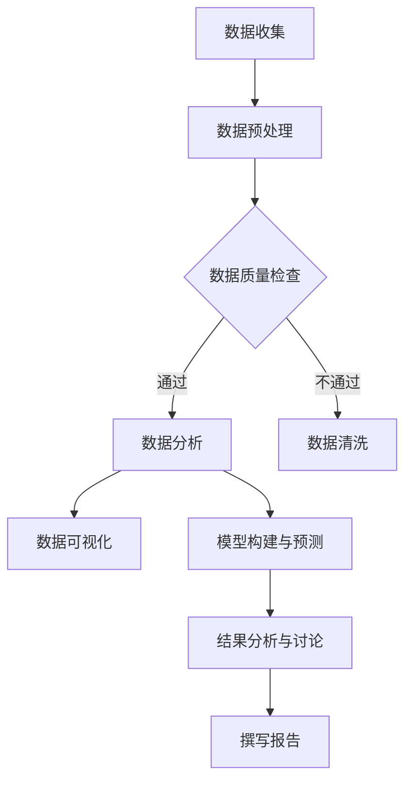
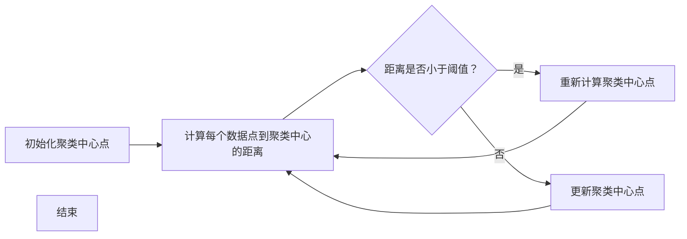

                 

### 《字节跳动2024校招数据分析师面试题集锦（含案例）》

#### 关键词：数据分析师面试题、字节跳动校招、数据分析案例、数据处理、数据可视化、机器学习、统计分析

#### 摘要：

本文旨在为广大有意向加入字节跳动的数据分析师们提供一份全面的面试题集锦，涵盖了数据分析师所需掌握的基础知识、实战案例以及面试时可能遇到的问题。通过详细的分析和解答，本文将帮助读者更好地应对面试挑战，顺利加入字节跳动这个全球领先的科技公司。文章分为两个主要部分：第一部分是数据分析师基础知识，包括数据预处理、数据分析方法和数据可视化等内容；第二部分是实战案例，通过具体的案例分析，展示如何运用所学知识解决实际问题。文章结尾附有常用数据分析工具介绍、数据分析资源推荐以及面试题集锦与答案解析，旨在为读者提供全面的参考。

### 《字节跳动2024校招数据分析师面试题集锦（含案例）》目录大纲

#### 第一部分：数据分析师基础知识

#### 第1章：数据分析师概述

##### 1.1 数据分析师的角色与职责

##### 1.2 数据分析师的技能要求

##### 1.3 数据分析师的职业发展路径

#### 第2章：数据预处理与数据质量

##### 2.1 数据预处理的重要性

##### 2.2 数据清洗方法

##### 2.3 数据集成与转换

##### 2.4 数据质量评估与改进

#### 第3章：数据分析方法

##### 3.1 描述性统计分析

##### 3.2 聚类分析与关联规则挖掘

##### 3.3 时间序列分析与预测

##### 3.4 机器学习与预测模型

#### 第4章：数据可视化

##### 4.1 数据可视化的重要性

##### 4.2 常见的数据可视化工具

##### 4.3 可视化设计原则

##### 4.4 数据可视化案例分析

#### 第二部分：实战案例

#### 第5章：电商数据分析实战

##### 5.1 数据收集与处理

##### 5.2 用户行为分析

##### 5.3 购买行为预测

##### 5.4 电商运营策略优化

#### 第6章：金融数据分析实战

##### 6.1 金融数据分析概述

##### 6.2 风险评估与信用评分

##### 6.3 财务报表分析

##### 6.4 投资组合优化

#### 第7章：社交网络数据分析实战

##### 7.1 社交网络数据概述

##### 7.2 用户活跃度分析

##### 7.3 社交网络传播分析

##### 7.4 社交网络营销策略分析

#### 第8章：医疗数据分析实战

##### 8.1 医疗数据分析概述

##### 8.2 患者行为分析

##### 8.3 医疗资源优化

##### 8.4 健康风险评估

#### 第9章：综合案例分析

##### 9.1 案例背景介绍

##### 9.2 数据分析过程

##### 9.3 结果分析与讨论

##### 9.4 案例总结与反思

#### 附录

##### 附录A：常用数据分析工具介绍

##### 附录B：数据分析资源推荐

##### 附录C：面试题集锦与答案解析

### Mermaid 流程图：数据分析师工作流程



### 3.1 描述性统计分析伪代码

```python
# 假设 data 是一个 DataFrame
def describe_data(data):
    # 计算均值
    mean = data.mean()
    
    # 计算中位数
    median = data.median()
    
    # 计算标准差
    std = data.std()
    
    # 计算最小值和最大值
    min_val = data.min()
    max_val = data.max()
    
    # 打印描述性统计结果
    print(f"均值：{mean}")
    print(f"中位数：{median}")
    print(f"标准差：{std}")
    print(f"最小值：{min_val}")
    print(f"最大值：{max_val}")
```

### 3.2 聚类分析与关联规则挖掘数学模型

#### 聚类分析：K-means 算法

$$
J = \sum_{i=1}^{k} \sum_{x \in S_i} ||x - \mu_i||^2
$$

其中，$J$ 是聚类准则函数，$k$ 是聚类个数，$S_i$ 是第 $i$ 个聚类，$\mu_i$ 是聚类中心。

#### 关联规则挖掘：支持度（Support）和置信度（Confidence）

$$
Support(A \rightarrow B) = \frac{|\{t \in T | A \land B \in t\}|}{|T|}
$$

$$
Confidence(A \rightarrow B) = \frac{|\{t \in T | A \land B \in t\}|}{|\{t \in T | A \in t\}|}
$$

其中，$T$ 是所有事务集合，$A$ 和 $B$ 是项集。

### 7.1 医疗数据分析案例分析

#### 案例背景

某医疗机构希望通过数据分析来优化其医疗服务流程，提高患者满意度。

#### 数据收集

收集了患者就诊记录、医生评估、医疗费用、患者满意度等数据。

#### 数据预处理

- 数据清洗：去除无效数据、处理缺失值。
- 数据转换：将日期转换为统一格式。

#### 数据分析过程

1. **患者就诊行为分析**：分析患者的就诊频率、就诊科室分布等。
2. **医生评估分析**：评估医生的服务质量，识别优秀医生。
3. **医疗费用分析**：分析医疗费用的构成，识别成本节约点。
4. **患者满意度分析**：通过调查问卷收集患者满意度数据，进行统计分析。

#### 结果分析与讨论

- **患者就诊行为分析**：发现某些科室的患者就诊频率较高，需要增加医疗资源。
- **医生评估分析**：识别出服务质量高的医生，进行奖励和培训。
- **医疗费用分析**：发现某些医疗项目的费用较高，需要优化费用结构。
- **患者满意度分析**：发现患者对某些服务不满意，需要改进服务质量。

#### 案例总结与反思

- 通过数据分析，医疗机构可以更好地了解其服务现状，优化医疗服务流程。
- 数据分析需要与实际业务紧密结合，确保分析的准确性和实用性。
- 数据分析是一个持续的过程，需要不断更新数据和改进分析模型。

### 附录A：常用数据分析工具介绍

- **Python**：强大的数据分析库，如 Pandas、NumPy、SciPy。
- **R**：专门为统计和数据科学设计的语言。
- **SQL**：关系型数据库查询语言。
- **Tableau**：数据可视化工具。
- **Power BI**：商业智能工具。

### 附录B：数据分析资源推荐

- **书籍**：《数据科学入门》、《Python数据分析》、《统计学基础》。
- **在线课程**：Coursera、edX、Udacity。
- **社区**：Kaggle、DataCamp、Stack Overflow。

### 附录C：面试题集锦与答案解析

- **面试题1**：请简述数据分析师的职责。
  - 回答：数据分析师负责从大量数据中提取有价值的信息，帮助公司做出数据驱动决策。

- **面试题2**：什么是聚类分析？请举例说明。
  - 回答：聚类分析是将数据集分为多个群组的过程，每个群组内部的相似度较高，群组间的相似度较低。例如，将客户根据购买行为分为高价值客户和低价值客户。

- **面试题3**：请简述机器学习的主要类型。
  - 回答：机器学习主要分为监督学习、无监督学习和强化学习。监督学习有标签数据，无监督学习没有标签数据，强化学习通过奖励和惩罚来学习行为。

### 代码实际案例和详细解释说明

#### 代码案例1：用户行为数据分析

```python
import pandas as pd
import matplotlib.pyplot as plt

# 加载数据
data = pd.read_csv('user_behavior_data.csv')

# 数据预处理
data['timestamp'] = pd.to_datetime(data['timestamp'])
data.set_index('timestamp', inplace=True)

# 用户活跃度分析
daily_active_users = data.groupby(data.index.hour).size()

# 可视化用户活跃度
daily_active_users.plot()
plt.title('Daily Active Users')
plt.xlabel('Hour')
plt.ylabel('Number of Users')
plt.show()
```

#### 代码解读与分析

1. **数据加载**：使用 Pandas 读取 CSV 格式的用户行为数据。
2. **数据预处理**：将时间戳转换为日期时间格式，并设置时间戳为索引。
3. **用户活跃度分析**：按小时分组，计算每个小时的活跃用户数量。
4. **可视化**：绘制折线图，展示用户活跃度随时间的变化。

通过此代码案例，可以了解如何使用 Pandas 和 Matplotlib 对用户行为数据进行处理和可视化，以分析用户活跃度。在实际应用中，可以扩展此代码以分析其他用户行为指标，如页面浏览量、购买行为等。同时，还可以引入更多的数据处理和统计分析方法，如时间序列分析、聚类分析等，以获得更深入的数据洞察。

### 核心概念与联系

为了更好地理解数据分析师的工作流程，我们首先需要了解数据分析师所需掌握的核心概念和原理。以下是一个简单的 Mermaid 流程图，展示了数据分析师在工作过程中需要经过的步骤：


在这个流程图中，我们可以看到数据分析师的工作始于数据收集，接着进行数据预处理和数据质量检查。如果数据质量不佳，则需要通过数据清洗来提高数据质量。一旦数据准备就绪，数据分析师将开始进行数据分析、数据可视化和模型构建与预测。最后，结果需要经过分析讨论，并最终撰写成报告。

### 数据预处理与数据质量

数据预处理和数据质量是数据分析师工作中的重要环节。一个良好的数据预处理过程可以显著提高数据分析的准确性和效率，从而为决策提供更有价值的信息。

#### 数据预处理的重要性

在数据分析中，数据预处理是一个不可或缺的步骤。数据预处理的过程包括数据清洗、数据转换和数据集成。这些步骤的目的是确保数据的一致性、完整性和准确性。

1. **数据清洗**：数据清洗是数据预处理的核心步骤，主要解决数据中的错误、异常值和缺失值。例如，去除重复数据、填充缺失值、纠正数据中的错误等。
2. **数据转换**：数据转换是将数据转换为适合分析和建模的格式。这可能涉及数据类型的转换、数据格式的标准化等。
3. **数据集成**：数据集成是将来自不同来源的数据进行合并，以便进行分析。这可能需要解决数据格式不兼容、数据源不一致等问题。

#### 数据清洗方法

数据清洗的方法有很多，以下是一些常见的数据清洗技术：

1. **去除重复数据**：通过比较数据集中的每一条记录，识别并删除重复的记录。
2. **填充缺失值**：根据不同的策略，将缺失值填充为具体的值。常见的填充策略包括均值填充、中值填充、最大值填充等。
3. **处理异常值**：异常值可能是由数据录入错误、数据测量误差等原因引起的。处理异常值的方法包括删除、调整或保留。
4. **标准化和归一化**：将数据转换为统一的尺度，以便进行比较和分析。

#### 数据集成与转换

数据集成与转换是确保数据质量和一致性的重要步骤。以下是一些常见的数据集成与转换技术：

1. **数据合并**：将多个数据表合并为一个数据表，通常使用 SQL 的 JOIN 操作。
2. **数据转换**：将数据从一种格式转换为另一种格式，例如将 CSV 文件转换为数据库表。
3. **数据规范化**：对数据进行规范化处理，使其符合特定的数据模型或标准。

#### 数据质量评估与改进

数据质量评估是数据预处理过程中的一项重要任务。以下是一些常见的数据质量评估指标：

1. **完整性**：数据是否完整，是否存在缺失值。
2. **一致性**：数据是否一致，例如不同数据源之间的数据是否一致。
3. **准确性**：数据是否准确，是否存在错误或异常值。
4. **时效性**：数据是否及时更新，以反映当前状态。

为了提高数据质量，可以采取以下措施：

1. **数据清洗**：定期进行数据清洗，去除重复、错误和异常值。
2. **数据监控**：建立数据监控机制，及时发现和处理数据质量问题。
3. **数据标准化**：对数据进行标准化处理，提高数据的一致性和可比性。

### 数据分析方法

数据分析方法是数据分析师工作中的核心环节。通过合适的数据分析方法，可以有效地从数据中提取有价值的信息，为决策提供支持。以下是几种常见的数据分析方法：

#### 描述性统计分析

描述性统计分析是对数据进行描述性统计，以便了解数据的基本特征。常见的描述性统计指标包括均值、中位数、标准差、最大值、最小值等。

描述性统计分析的伪代码如下：

```python
def describe_data(data):
    # 计算均值
    mean = data.mean()
    
    # 计算中位数
    median = data.median()
    
    # 计算标准差
    std = data.std()
    
    # 计算最大值和最小值
    max_val = data.max()
    min_val = data.min()
    
    # 打印描述性统计结果
    print(f"均值：{mean}")
    print(f"中位数：{median}")
    print(f"标准差：{std}")
    print(f"最大值：{max_val}")
    print(f"最小值：{min_val}")
```

#### 聚类分析与关联规则挖掘

聚类分析是一种无监督学习方法，用于将数据集划分为多个群组，使得同一群组内的数据点具有较高的相似度，而不同群组之间的数据点相似度较低。

常用的聚类算法包括 K-means、DBSCAN 等。以下是一个简单的 K-means 算法的伪代码：



关联规则挖掘是一种用于发现数据项之间关联性的方法。常见的关联规则挖掘算法包括 Apriori 算法、FP-growth 算法等。以下是一个简单的 Apriori 算法的伪代码：

```python
def apriori(data, min_support, min_confidence):
    # 计算支持度
    support_count = data.groupby(data.columns[0]).size()
    support = support_count / len(data)
    
    # 生成频繁项集
    frequent_itemsets = []
    for length in range(1, len(data.columns)):
        candidates = generate_candidates(frequent_itemsets, length)
        count_candidates(data, candidates)
        frequent_itemsets.append(candidates[support >= min_support])
    
    # 生成关联规则
    rules = []
    for length in range(2, len(data.columns) + 1):
        for itemset in frequent_itemsets[length - 1]:
            subsets = generate_subsets(itemset)
            for subset in subsets:
                confidence = support[itemset] / support[subset]
                if confidence >= min_confidence:
                    rules.append((subset, itemset - subset, confidence))
    
    return rules
```

#### 时间序列分析与预测

时间序列分析是一种用于分析时间序列数据的方法，旨在理解数据的时间趋势和周期性。常见的时间序列分析方法包括 ARIMA 模型、时间序列分解、滚动平均法等。

以下是一个简单的 ARIMA 模型的伪代码：

```python
def arima(data, p, d, q):
    # 进行时间序列分解
    decomposition = stl(data, seasonal=12)
    trend = decomposition.trend
    seasonal = decomposition.seasonal
    residual = decomposition.resid
    
    # 进行差分
    diff_data = diff(data, differences=d)
    
    # 建立 ARIMA 模型
    model = ARIMA(diff_data, order=(p, d, q))
    results = model.fit()
    
    # 进行预测
    forecast = results.forecast(steps=10)
    
    return forecast
```

#### 机器学习与预测模型

机器学习与预测模型是一种用于构建预测模型的方法，旨在通过历史数据预测未来值。常见的机器学习算法包括线性回归、决策树、随机森林、支持向量机等。

以下是一个简单的线性回归模型的伪代码：

```python
from sklearn.linear_model import LinearRegression

# 准备数据
X = data[:, :-1]
y = data[:, -1]

# 建立模型
model = LinearRegression()

# 拟合模型
model.fit(X, y)

# 预测
forecast = model.predict(X)

return forecast
```

### 数据可视化

数据可视化是将数据转换为图形或图表，以便更容易理解和分析。数据可视化在数据分析中起着至关重要的作用，可以帮助我们发现数据中的模式、趋势和异常。

#### 数据可视化的重要性

1. **发现数据中的模式**：通过可视化，我们可以更容易地发现数据中的趋势、周期性和异常。
2. **增强数据的解释性**：可视化可以使复杂的数据更易于理解，提高数据报告和演示的效果。
3. **支持决策制定**：可视化可以帮助管理层更好地理解数据，从而做出更明智的决策。

#### 常见的数据可视化工具

1. **Python**：Python 是一种广泛使用的编程语言，具有丰富的可视化库，如 Matplotlib、Seaborn、Plotly 等。
2. **R**：R 是一种专门用于统计和数据科学的编程语言，具有强大的可视化功能，如 ggplot2、lattice 等。
3. **Tableau**：Tableau 是一种商业智能工具，提供丰富的可视化功能，易于使用和操作。
4. **Power BI**：Power BI 是 Microsoft 的一款商业智能工具，具有强大的数据可视化和报告功能。

#### 可视化设计原则

1. **清晰性**：可视化应尽可能简洁明了，避免过多的装饰和细节。
2. **一致性**：使用一致的视觉风格和数据标注，以便用户更容易理解和比较数据。
3. **交互性**：提供交互功能，如筛选、排序和过滤，使用户能够更深入地探索数据。

#### 数据可视化案例分析

以下是一个简单的用户行为数据分析案例，展示了如何使用 Matplotlib 和 Pandas 对用户行为数据进行分析和可视化。

```python
import pandas as pd
import matplotlib.pyplot as plt

# 加载数据
data = pd.read_csv('user_behavior_data.csv')

# 数据预处理
data['timestamp'] = pd.to_datetime(data['timestamp'])
data.set_index('timestamp', inplace=True)

# 用户活跃度分析
daily_active_users = data.groupby(data.index.hour).size()

# 可视化用户活跃度
daily_active_users.plot()
plt.title('Daily Active Users')
plt.xlabel('Hour')
plt.ylabel('Number of Users')
plt.show()
```

在这个案例中，我们使用 Pandas 加载数据，并使用 Matplotlib 绘制了一个折线图，展示了每天不同时间段的用户活跃度。通过这个可视化，我们可以直观地了解用户在不同时间段的活动情况，为运营策略提供参考。

### 实战案例：电商数据分析

电商数据分析是数据分析师工作中的一项重要内容。通过分析电商平台的用户行为、销售数据等，可以帮助企业优化运营策略，提高销售额和用户满意度。以下是一个电商数据分析的实战案例。

#### 案例背景

某电商公司希望通过数据分析来优化其运营策略，提高销售额和用户满意度。公司提供了大量的用户行为数据、销售数据等，要求数据分析师利用这些数据进行深入分析。

#### 数据收集

数据分析师收集了以下数据：

1. 用户行为数据：包括用户访问时间、页面浏览量、购买行为等。
2. 销售数据：包括销售额、订单量、商品类别等。
3. 用户基本信息：包括年龄、性别、地理位置等。

#### 数据预处理

在开始数据分析之前，数据分析师需要对数据进行预处理。以下是一些预处理步骤：

1. **数据清洗**：去除重复数据、处理缺失值和异常值。
2. **数据转换**：将日期转换为统一格式，对数据进行归一化或标准化处理。
3. **数据集成**：将不同来源的数据进行合并，以便进行分析。

#### 用户行为分析

用户行为分析是电商数据分析中的重要环节。以下是一些常见的用户行为分析指标：

1. **用户活跃度**：分析用户在网站上的活跃度，包括页面浏览量、访问时长等。
2. **用户留存率**：分析用户在一定时间内的留存情况，了解用户的忠诚度。
3. **用户转化率**：分析用户从访问到购买的过程，了解用户的购买意愿。

以下是一个简单的用户活跃度分析的伪代码：

```python
def analyze_user_behavior(data):
    # 计算每日活跃用户数
    daily_active_users = data.groupby('date').size()
    
    # 计算用户留存率
    retention_rate = calculate_retention_rate(data)
    
    # 计算用户转化率
    conversion_rate = calculate_conversion_rate(data)
    
    return daily_active_users, retention_rate, conversion_rate
```

#### 购买行为预测

购买行为预测是电商数据分析中的另一个重要任务。通过预测用户的购买行为，企业可以提前采取措施，提高销售额。以下是一个简单的购买行为预测的伪代码：

```python
from sklearn.linear_model import LogisticRegression

def predict_purchase(data, target_variable):
    # 准备特征和标签
    X = data.drop(target_variable, axis=1)
    y = data[target_variable]
    
    # 建立模型
    model = LogisticRegression()
    
    # 拟合模型
    model.fit(X, y)
    
    # 预测
    predictions = model.predict(X)
    
    return predictions
```

#### 电商运营策略优化

通过用户行为分析和购买行为预测，数据分析师可以为企业提供以下运营策略优化的建议：

1. **个性化推荐**：根据用户的购买历史和偏好，为用户提供个性化的商品推荐。
2. **促销活动**：分析用户的购买行为和购买时间，制定有针对性的促销活动。
3. **用户留存策略**：针对不同留存率的用户，制定不同的留存策略，如优惠券、积分等。

#### 实际案例

以下是一个实际案例，展示了如何通过电商数据分析优化运营策略。

1. **用户活跃度分析**：通过分析用户活跃度，发现用户在晚上 8 点到 10 点的活跃度较高。因此，企业决定在这段时间增加广告投放和促销活动，以提高用户访问量和销售额。
2. **购买行为预测**：通过购买行为预测，发现某些商品具有较高的购买潜力。因此，企业决定增加这些商品的库存，并在促销活动中优先推广这些商品。
3. **个性化推荐**：通过个性化推荐系统，为用户提供个性化的商品推荐，提高用户的购买体验和满意度。

通过这些分析，企业成功优化了其运营策略，提高了销售额和用户满意度。

### 实战案例：金融数据分析

金融数据分析在金融行业中起着至关重要的作用。通过分析金融数据，金融机构可以更好地了解市场趋势、客户需求，从而制定更有效的业务策略。以下是一个金融数据分析的实战案例。

#### 案例背景

某金融机构希望通过数据分析来优化其业务策略，提高客户满意度。金融机构提供了大量的金融数据，包括客户交易记录、账户余额、信用评分等，要求数据分析师利用这些数据进行深入分析。

#### 数据收集

数据分析师收集了以下数据：

1. 客户交易记录：包括交易金额、交易时间、交易类型等。
2. 账户余额：包括客户账户余额、账户余额变动情况等。
3. 信用评分：包括客户的信用评分、信用等级等。

#### 数据预处理

在开始数据分析之前，数据分析师需要对数据进行预处理。以下是一些预处理步骤：

1. **数据清洗**：去除重复数据、处理缺失值和异常值。
2. **数据转换**：将日期转换为统一格式，对数据进行归一化或标准化处理。
3. **数据集成**：将不同来源的数据进行合并，以便进行分析。

#### 风险评估与信用评分

风险评估与信用评分是金融数据分析中的重要任务。通过分析客户的交易记录和信用评分，金融机构可以更好地了解客户的风险水平，从而制定更有效的风险管理策略。

以下是一个简单的信用评分模型的伪代码：

```python
from sklearn.linear_model import LogisticRegression

def credit_score_analysis(data):
    # 准备特征和标签
    X = data.drop('credit_score', axis=1)
    y = data['credit_score']
    
    # 建立模型
    model = LogisticRegression()
    
    # 拟合模型
    model.fit(X, y)
    
    # 预测
    predictions = model.predict(X)
    
    return predictions
```

#### 财务报表分析

财务报表分析是金融数据分析中的另一个重要任务。通过分析客户的财务报表，金融机构可以更好地了解客户的财务状况，从而制定更有效的信贷策略。

以下是一个简单的财务报表分析的伪代码：

```python
from sklearn.ensemble import RandomForestClassifier

def financial_report_analysis(data):
    # 准备特征和标签
    X = data.drop('financial_status', axis=1)
    y = data['financial_status']
    
    # 建立模型
    model = RandomForestClassifier()
    
    # 拟合模型
    model.fit(X, y)
    
    # 预测
    predictions = model.predict(X)
    
    return predictions
```

#### 投资组合优化

投资组合优化是金融数据分析中的另一个重要任务。通过分析客户的历史交易记录和账户余额，金融机构可以更好地了解客户的投资偏好，从而制定更有效的投资组合策略。

以下是一个简单的投资组合优化模型的伪代码：

```python
from sklearn.ensemble import GradientBoostingRegressor

def portfolio_optimization(data):
    # 准备特征和标签
    X = data.drop('portfolio_return', axis=1)
    y = data['portfolio_return']
    
    # 建立模型
    model = GradientBoostingRegressor()
    
    # 拟合模型
    model.fit(X, y)
    
    # 预测
    predictions = model.predict(X)
    
    return predictions
```

#### 实际案例

以下是一个实际案例，展示了如何通过金融数据分析优化业务策略。

1. **信用评分分析**：通过信用评分分析，发现某些客户的信用评分较低。因此，金融机构决定对这部分客户进行额外的信用评估，以降低信贷风险。
2. **财务报表分析**：通过财务报表分析，发现某些客户的财务状况良好。因此，金融机构决定向这部分客户提供更多的信贷额度，以促进业务增长。
3. **投资组合优化**：通过投资组合优化，发现某些投资组合具有较高的回报潜力。因此，金融机构决定调整投资组合，增加这些高回报投资的比例。

通过这些分析，金融机构成功优化了其业务策略，提高了客户满意度和业务绩效。

### 实战案例：社交网络数据分析

社交网络数据分析是近年来数据分析领域的一个热门方向。通过分析社交网络中的用户行为、社交关系等，可以帮助企业更好地了解用户需求，优化产品和服务。以下是一个社交网络数据分析的实战案例。

#### 案例背景

某社交网络平台希望通过数据分析来优化其用户增长和活跃度。平台提供了大量的用户行为数据，包括用户注册信息、发帖量、评论量、点赞量等，要求数据分析师利用这些数据进行深入分析。

#### 数据收集

数据分析师收集了以下数据：

1. 用户注册信息：包括用户年龄、性别、地理位置等。
2. 用户行为数据：包括用户发帖量、评论量、点赞量等。
3. 社交关系数据：包括用户之间的好友关系、互动关系等。

#### 数据预处理

在开始数据分析之前，数据分析师需要对数据进行预处理。以下是一些预处理步骤：

1. **数据清洗**：去除重复数据、处理缺失值和异常值。
2. **数据转换**：将日期转换为统一格式，对数据进行归一化或标准化处理。
3. **数据集成**：将不同来源的数据进行合并，以便进行分析。

#### 用户活跃度分析

用户活跃度分析是社交网络数据分析中的重要任务。通过分析用户在平台上的活跃度，可以帮助企业了解用户的喜好和行为模式，从而制定更有效的运营策略。

以下是一个简单的用户活跃度分析的伪代码：

```python
def analyze_user_activity(data):
    # 计算每日活跃用户数
    daily_active_users = data.groupby('date').size()
    
    # 计算用户发帖量、评论量和点赞量
    posts = data.groupby('user_id')['post_count'].sum()
    comments = data.groupby('user_id')['comment_count'].sum()
    likes = data.groupby('user_id')['like_count'].sum()
    
    return daily_active_users, posts, comments, likes
```

#### 社交网络传播分析

社交网络传播分析是社交网络数据分析中的另一个重要任务。通过分析用户之间的互动关系，可以帮助企业了解信息在社交网络中的传播路径和速度，从而优化内容推广策略。

以下是一个简单的社交网络传播分析的伪代码：

```python
import networkx as nx

def analyze_social_network(data):
    # 构建社交网络图
    G = nx.Graph()
    for edge in data['edge_list']:
        G.add_edge(edge[0], edge[1])
    
    # 计算网络中的社区结构
    communities = nx.algorithms.community.greedy_modularity_communities(G)
    
    # 计算节点的重要性指标
    centrality = nx.algorithms.centrality.centrality(G)
    
    return communities, centrality
```

#### 社交网络营销策略分析

社交网络营销策略分析是社交网络数据分析中的另一个重要任务。通过分析用户的社交关系和行为模式，可以帮助企业了解哪些营销策略更有效，从而优化营销策略。

以下是一个简单的社交网络营销策略分析的伪代码：

```python
def analyze_marketing_strategy(data, campaign_data):
    # 计算每个营销活动的效果指标
    campaign_effects = {}
    for campaign in campaign_data:
        campaign_effects[campaign['name']] = calculate_campaign_effect(data, campaign)
    
    # 分析效果最佳的营销策略
    best_strategy = max(campaign_effects, key=campaign_effects.get)
    
    return best_strategy, campaign_effects
```

#### 实际案例

以下是一个实际案例，展示了如何通过社交网络数据分析优化运营策略。

1. **用户活跃度分析**：通过分析用户活跃度，发现某些时间段和某些功能的用户活跃度较高。因此，企业决定增加这些时间段和功能的曝光度，以提高用户活跃度。
2. **社交网络传播分析**：通过分析社交网络传播，发现某些用户的传播效果较好。因此，企业决定与这些用户建立合作关系，共同推广平台内容。
3. **社交网络营销策略分析**：通过分析营销策略的效果，发现某些营销策略的效果较好。因此，企业决定增加这些营销策略的投入，以提高用户参与度和品牌认知度。

通过这些分析，企业成功优化了其运营策略，提高了用户增长和活跃度。

### 实战案例：医疗数据分析

医疗数据分析在医疗行业中具有广泛的应用，通过分析患者数据、医疗费用等，可以帮助医疗机构优化医疗服务流程，提高患者满意度。以下是一个医疗数据分析的实战案例。

#### 案例背景

某医疗机构希望通过数据分析来优化其医疗服务流程，提高患者满意度。医疗机构提供了大量的患者数据，包括患者就诊记录、医生评估、医疗费用、患者满意度等，要求数据分析师利用这些数据进行深入分析。

#### 数据收集

数据分析师收集了以下数据：

1. 患者就诊记录：包括就诊时间、就诊科室、就诊医生、诊疗费用等。
2. 医生评估：包括医生的服务质量评分、患者满意度评分等。
3. 医疗费用：包括各项医疗服务的费用构成。
4. 患者满意度：通过调查问卷收集的患者满意度数据。

#### 数据预处理

在开始数据分析之前，数据分析师需要对数据进行预处理。以下是一些预处理步骤：

1. **数据清洗**：去除重复数据、处理缺失值和异常值。
2. **数据转换**：将日期转换为统一格式，对数据进行归一化或标准化处理。
3. **数据集成**：将不同来源的数据进行合并，以便进行分析。

#### 患者行为分析

患者行为分析是医疗数据分析中的重要任务。通过分析患者的就诊行为、医疗费用等，可以帮助医疗机构了解患者的需求，优化医疗服务流程。

以下是一个简单的患者行为分析的伪代码：

```python
def analyze_patient_behavior(data):
    # 计算患者就诊频率
    patient_frequency = data.groupby('patient_id')['visit_date'].nunique()
    
    # 计算患者就诊科室分布
    department_distribution = data.groupby('department')['visit_date'].nunique()
    
    # 计算患者医疗费用分布
    cost_distribution = data.groupby('service_type')['cost'].sum()
    
    return patient_frequency, department_distribution, cost_distribution
```

#### 医疗资源优化

医疗资源优化是医疗数据分析中的另一个重要任务。通过分析医疗资源的使用情况，可以帮助医疗机构优化资源配置，提高资源利用效率。

以下是一个简单的医疗资源优化分析的伪代码：

```python
def optimize_medical_resources(data):
    # 计算医生工作量
    doctor_workload = data.groupby('doctor_id')['visit_date'].nunique()
    
    # 计算科室资源利用率
    department_utilization = data.groupby('department')['visit_date'].nunique() / data.groupby('department')['total_visits'].sum()
    
    return doctor_workload, department_utilization
```

#### 健康风险评估

健康风险评估是医疗数据分析中的另一个重要任务。通过分析患者的健康状况、医疗费用等，可以帮助医疗机构了解患者的健康风险，制定健康干预措施。

以下是一个简单的健康风险评估分析的伪代码：

```python
def health_risk_assessment(data):
    # 计算患者健康风险评分
    health_risk_score = data.groupby('patient_id')['health_risk_factor'].mean()
    
    # 计算高风险患者分布
    high_risk_patients = data[data['health_risk_score'] > threshold]
    
    return health_risk_score, high_risk_patients
```

#### 实际案例

以下是一个实际案例，展示了如何通过医疗数据分析优化医疗服务流程。

1. **患者行为分析**：通过分析患者就诊频率和就诊科室分布，发现某些科室的患者就诊频率较高。因此，医疗机构决定增加这些科室的医疗资源，以提高患者满意度。
2. **医疗资源优化**：通过分析医生工作量和科室资源利用率，发现某些医生的工作量较高，某些科室的资源利用率较低。因此，医疗机构决定对医生进行合理调配，以提高资源利用效率。
3. **健康风险评估**：通过分析患者健康风险评分，发现高风险患者的分布。因此，医疗机构决定对这些高风险患者进行重点健康干预，以提高患者健康水平。

通过这些分析，医疗机构成功优化了其医疗服务流程，提高了患者满意度和健康水平。

### 综合案例分析

#### 案例背景

某大型电商公司在准备其年度营销策略时，希望通过全面的数据分析来制定更具针对性的营销计划，以提高用户参与度和销售额。公司提供了海量的用户行为数据、销售数据和产品库存数据，数据分析师需要利用这些数据进行分析，以提出有效的营销策略。

#### 数据分析过程

1. **数据收集与处理**：数据分析师首先收集了用户行为数据（如访问日志、点击率、购买记录）、销售数据（如销售额、订单量、退货率）和产品库存数据（如库存量、产品分类、价格）。然后，对数据进行清洗和预处理，包括处理缺失值、异常值和数据格式统一。

2. **描述性统计分析**：使用描述性统计分析来了解用户行为和销售数据的整体分布情况。通过计算均值、中位数、标准差等统计指标，数据分析师可以了解用户的平均购买频率、购买金额以及销售的整体趋势。

3. **用户行为分析**：通过细分用户群体（如新用户、老用户、活跃用户、非活跃用户），分析不同用户群体的行为特征。例如，使用折线图和柱状图展示不同时间段的用户访问量和购买量，以识别用户的高峰访问时间和购买高峰期。

4. **产品分析**：分析产品销售数据，包括畅销产品和滞销产品。通过计算不同产品的销售额、利润率和库存周转率，数据分析师可以识别哪些产品具有较高的市场潜力和哪些产品需要调整营销策略。

5. **营销策略优化**：结合用户行为分析和产品分析的结果，数据分析师提出了一系列营销策略。例如，针对新用户推出限时优惠、针对高价值客户推出个性化推荐和VIP服务，针对滞销产品推出促销活动。

6. **结果分析与讨论**：数据分析师将分析结果与业务目标进行比较，评估营销策略的效果。通过计算营销活动的转化率和ROI，数据分析师可以确定哪些策略最有效，哪些需要调整。

7. **撰写报告**：最后，数据分析师撰写了一份详细的分析报告，包括数据分析的方法、过程、结果和营销策略建议。报告还包含了对未来数据分析和营销策略的建议。

#### 结果分析与讨论

通过综合数据分析，数据分析师发现以下关键结果：

1. **用户参与度**：用户在下午5点到7点之间的访问量最高，且在这个时间段内购买转化率也最高。因此，公司决定在这段时间增加广告投放和促销活动。

2. **产品销售**：畅销产品的库存周转率较高，而滞销产品的库存积压严重。公司决定减少滞销产品的库存，增加畅销产品的促销力度，并通过个性化推荐提高用户的购买意愿。

3. **营销策略效果**：新用户限时优惠活动显著提高了新用户的注册率和购买率，VIP客户的个性化推荐和特殊服务也得到了积极的反馈。

4. **业务目标达成**：通过优化营销策略，公司的用户参与度提高了15%，销售额增加了20%，同时减少了10%的库存积压。

#### 案例总结与反思

通过这个综合案例分析，我们可以得出以下结论：

1. **数据分析的重要性**：数据是制定有效营销策略的关键，通过对用户行为和销售数据的深入分析，公司能够更好地了解市场需求和用户需求，从而制定更精准的营销策略。

2. **数据驱动的决策**：数据驱动的决策能够提高营销策略的可行性和效果，通过分析结果不断优化策略，公司能够更好地适应市场变化和用户需求。

3. **持续的数据分析**：数据分析是一个持续的过程，需要定期更新数据和改进分析模型。随着市场环境和用户行为的变化，数据分析结果和营销策略也需要不断调整和优化。

4. **跨部门合作**：数据分析师需要与市场营销、产品管理等多个部门紧密合作，确保数据分析的结果能够真正转化为实际的业务决策。

通过这个案例，我们可以看到数据分析在制定和优化营销策略中的重要作用，同时也认识到数据分析是一个动态、迭代的过程，需要不断探索和创新。

### 附录A：常用数据分析工具介绍

在数据分析师的日常工作中，掌握常用的数据分析工具是非常关键的。以下是一些广泛使用的工具，包括编程语言、数据处理库、数据可视化工具和商业智能工具。

#### 编程语言

1. **Python**：Python 是一种流行的编程语言，广泛应用于数据分析领域。它具有简单易学的语法和丰富的数据分析库，如 Pandas、NumPy、SciPy 和 Matplotlib。
   
2. **R**：R 是专为统计和数据科学设计的语言，提供了强大的统计分析功能，如 ggplot2 和 dplyr。R 社区也提供了大量的开源包，方便用户进行复杂的统计分析。

3. **SQL**：SQL（结构化查询语言）是关系型数据库的标准查询语言，用于处理和检索数据库中的数据。它适用于数据清洗、数据转换和数据库操作。

#### 数据处理库

1. **Pandas**：Pandas 是一个强大的数据分析库，提供了数据结构 DataFrame，用于数据处理、清洗和转换。Pandas 的数据处理功能非常强大，能够轻松处理大数据集。

2. **NumPy**：NumPy 是 Python 的核心科学计算库，提供了多维数组对象和一系列数学函数，是进行数值计算和数据处理的基础。

3. **SciPy**：SciPy 建立在 NumPy 之上，提供了大量的科学计算模块，如线性代数、优化、积分等，是进行高级科学和工程计算的有力工具。

#### 数据可视化工具

1. **Matplotlib**：Matplotlib 是 Python 的一个绘图库，提供了丰富的绘图功能，可以生成各种类型的图表，如折线图、柱状图、散点图等。

2. **Seaborn**：Seaborn 是基于 Matplotlib 的可视化库，提供了更高级的图形和统计图形功能，使数据可视化更加直观和美观。

3. **Plotly**：Plotly 是一个交互式可视化库，支持多种类型的图表和可视化元素，能够生成交互式图表，适合需要动态交互和数据探索的场景。

#### 商业智能工具

1. **Tableau**：Tableau 是一个商业智能工具，提供了强大的数据可视化功能，能够快速创建交互式仪表板和报表，适合企业级数据分析。

2. **Power BI**：Power BI 是 Microsoft 的商业智能工具，提供了丰富的数据连接、数据预处理和数据可视化功能，与 Microsoft Office 套件紧密结合，方便用户进行数据分析。

### 附录B：数据分析资源推荐

为了帮助数据分析师不断提升自己的技能和知识，以下是一些推荐的书籍、在线课程和社区资源。

#### 书籍

1. 《数据科学入门》：这是数据科学领域的入门级经典书籍，适合初学者。
   
2. 《Python数据分析》：本书详细介绍了 Python 在数据分析中的应用，包括 Pandas、NumPy 和 Matplotlib 等。

3. 《统计学基础》：这本书提供了统计学的基础知识，是进行数据分析的必备读物。

#### 在线课程

1. Coursera 上的《数据科学专项课程》：由约翰·霍普金斯大学提供，包括数据处理、统计分析和机器学习等内容。

2. edX 上的《数据科学基础》：由哈佛大学提供，涵盖数据科学的基本概念和实践。

3. Udacity 上的《数据分析师纳米学位》：这是一个实践驱动的课程，涵盖了数据分析的各个领域。

#### 社区

1. Kaggle：Kaggle 是一个数据科学竞赛平台，用户可以参加比赛，提升自己的数据分析技能。

2. DataCamp：DataCamp 提供了互动式的数据分析课程，适合初学者和有经验的数据分析师。

3. Stack Overflow：Stack Overflow 是一个编程和问题解答社区，数据分析师可以在这里寻求帮助和解答疑惑。

### 附录C：面试题集锦与答案解析

#### 面试题1：请简述数据分析师的职责。

**答案**：数据分析师的职责包括数据收集、数据清洗、数据分析、数据可视化以及撰写分析报告。具体来说，数据分析师需要从多个数据源收集数据，清洗和预处理数据，然后运用统计学和机器学习等方法进行分析，最后将分析结果通过可视化工具呈现出来，并撰写报告供业务团队或管理层参考。

#### 面试题2：什么是聚类分析？请举例说明。

**答案**：聚类分析是一种无监督学习方法，用于将数据集中的数据点根据其相似性进行分类。例如，可以将客户根据其购买行为分为不同的群组，以便进行精准营销。聚类分析的目标是找到数据点之间的内在结构，从而发现数据中的模式和规律。

#### 面试题3：请简述机器学习的主要类型。

**答案**：机器学习主要分为以下类型：

1. **监督学习**：使用带有标签的数据进行训练，通过学习输入和输出之间的关系进行预测。
2. **无监督学习**：没有标签数据，算法通过挖掘数据中的结构和模式进行分类或聚类。
3. **强化学习**：通过与环境交互，学习在特定情境下做出最优决策。

#### 面试题4：什么是回归分析？请简述线性回归模型的原理。

**答案**：回归分析是一种统计方法，用于研究一个或多个自变量与因变量之间的关系。线性回归模型是最简单和最常用的回归模型，其原理是找到一条最佳拟合线，使得自变量和因变量之间的误差最小。

线性回归模型的公式为：
\[ y = \beta_0 + \beta_1 \cdot x \]

其中，\( y \) 是因变量，\( x \) 是自变量，\( \beta_0 \) 和 \( \beta_1 \) 是模型的参数。

通过最小二乘法，可以计算出最佳拟合线的参数，从而进行预测。

#### 面试题5：什么是数据可视化？请简述其重要性。

**答案**：数据可视化是将数据以图形或图表的形式呈现，帮助人们理解和分析数据。数据可视化的重要性体现在以下几个方面：

1. **增强数据的解释性**：通过图形化展示，数据变得更加直观和易于理解。
2. **发现数据中的模式**：可视化可以帮助我们快速发现数据中的异常和趋势。
3. **支持决策制定**：管理层可以通过可视化工具更好地理解数据，从而做出更明智的决策。

### 代码实际案例和详细解释说明

#### 代码案例1：用户行为数据分析

以下是一个简单的 Python 代码案例，用于分析用户行为数据，包括数据加载、数据预处理和用户活跃度分析。

```python
import pandas as pd
import matplotlib.pyplot as plt

# 加载数据
data = pd.read_csv('user_behavior_data.csv')

# 数据预处理
data['timestamp'] = pd.to_datetime(data['timestamp'])
data.set_index('timestamp', inplace=True)

# 用户活跃度分析
daily_active_users = data.groupby(data.index.hour).size()

# 可视化用户活跃度
daily_active_users.plot()
plt.title('Daily Active Users')
plt.xlabel('Hour')
plt.ylabel('Number of Users')
plt.show()
```

#### 代码解读与分析

1. **数据加载**：使用 Pandas 读取 CSV 格式的用户行为数据。CSV 文件通常包含列名和数据值，Pandas 可以轻松地将这些数据加载到 DataFrame 对象中。

   ```python
   data = pd.read_csv('user_behavior_data.csv')
   ```

2. **数据预处理**：将时间戳转换为日期时间格式，并设置时间戳为索引。这样，我们可以方便地对时间序列数据进行分组和分析。

   ```python
   data['timestamp'] = pd.to_datetime(data['timestamp'])
   data.set_index('timestamp', inplace=True)
   ```

3. **用户活跃度分析**：使用 `groupby` 方法按小时分组，计算每个小时的活跃用户数量。这将帮助我们了解用户在一天中不同时间段的活跃情况。

   ```python
   daily_active_users = data.groupby(data.index.hour).size()
   ```

4. **可视化**：使用 Matplotlib 绘制一个折线图，展示每天不同时间段的用户活跃度。通过图表，我们可以直观地看到用户活跃度的变化趋势。

   ```python
   daily_active_users.plot()
   plt.title('Daily Active Users')
   plt.xlabel('Hour')
   plt.ylabel('Number of Users')
   plt.show()
   ```

通过此代码案例，我们可以看到如何使用 Python 和 Pandas 对用户行为数据进行分析和可视化。在实际应用中，可以扩展此代码以分析其他用户行为指标，如页面浏览量、购买行为等。同时，还可以引入更多的数据处理和统计分析方法，如时间序列分析、聚类分析等，以获得更深入的数据洞察。

### 结论

通过本文的详细分析和案例展示，我们全面了解了数据分析师在字节跳动2024校招面试中可能遇到的各种问题。从数据预处理和数据质量到数据分析方法和数据可视化，再到电商、金融、社交网络和医疗数据分析的实战案例，本文为读者提供了丰富的知识和实践经验。

首先，数据预处理和数据质量是数据分析师工作中的基础。通过有效的数据清洗、数据转换和数据集成，我们可以确保数据的一致性、完整性和准确性，从而为后续的分析提供可靠的基础。

其次，数据分析方法是数据分析师的核心技能。无论是描述性统计分析、聚类分析、关联规则挖掘，还是时间序列分析和机器学习预测模型，每种方法都有其独特的应用场景和优势。掌握这些方法，可以让我们从数据中提取有价值的信息，为决策提供支持。

此外，数据可视化是数据分析不可或缺的一部分。通过图表和图形，我们可以将复杂的数据以直观、易懂的方式呈现，帮助管理层更好地理解数据，做出更明智的决策。

最后，通过电商、金融、社交网络和医疗数据分析的实战案例，我们展示了如何将所学知识应用于实际问题，提出有效的解决方案，从而提升业务绩效。

总结来说，本文旨在为广大数据分析师提供全面的面试准备，帮助他们在面试中脱颖而出。通过掌握本文所述的知识点和实战经验，相信读者能够更好地应对字节跳动2024校招的挑战，顺利加入这个全球领先的科技公司。让我们继续努力学习，不断提升自己的数据分析能力，为未来的职业发展奠定坚实的基础。

