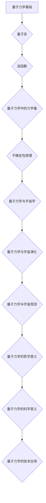

                 

### 1.1.1 量子力学的诞生

量子力学的诞生可以说是20世纪物理学最伟大的革命之一。它的诞生源于对经典物理学理论的挑战，以及对微观世界更深入探索的需求。量子力学的诞生可以追溯到1900年，当时德国物理学家马克斯·普朗克（Max Planck）提出了一项颠覆性的假设：能量不是连续的，而是由一系列不连续的量子所组成。这一假设是为了解释黑体辐射现象，而黑体辐射是经典物理学无法解释的一个问题。

普朗克的这一假设在当时引起了巨大的争议，但后来得到了实验的验证，并逐渐被物理学界接受。普朗克的这一发现标志着量子力学的诞生，他也被誉为量子力学的奠基人之一。

紧随普朗克之后，爱因斯坦在1905年提出了光量子假说，认为光也是由一系列量子组成的，这些量子被称为光子。爱因斯坦的这一理论为量子力学的发展奠定了基础，也为后来的量子电动力学（QED）打下了基础。

1913年，丹麦物理学家尼尔斯·玻尔（Niels Bohr）提出了玻尔模型，用来解释氢原子的光谱。玻尔模型中，电子只能在某些特定的轨道上运动，这些轨道对应着特定的能量。玻尔的这一理论不仅成功地解释了氢原子的光谱，也展示了量子化在原子结构中的重要性。

接下来的几年里，量子力学的发展取得了巨大的进步。1924年，法国物理学家路易·德布罗意（Louis de Broglie）提出了物质波假说，认为所有的物质都具有一定的波动性。德布罗意的这一理论为后来的电子显微镜和量子电子学奠定了基础。

1925年，奥地利物理学家埃尔温·薛定谔（Erwin Schrödinger）提出了薛定谔方程，用来描述微观粒子的波动性。薛定谔方程是量子力学的核心方程之一，它将量子力学推向了一个新的高度。

同年，德国物理学家沃尔夫冈·泡利（Wolfgang Pauli）提出了不相容原理，即没有两个费米子可以处于完全相同的状态。泡利的这一原理对理解原子和分子的结构至关重要。

1926年，海森堡提出了不确定性原理，这一原理表明，我们无法同时精确地知道一个粒子的位置和动量。不确定性原理是量子力学的基本特性之一，它挑战了经典物理学的确定性观念。

这些理论和原理的提出，标志着量子力学的诞生和快速发展。量子力学的诞生不仅改变了我们对微观世界的理解，也为我们开启了一个全新的科学领域。量子力学的发展，也为后来的量子电子学、量子光学、量子计算等领域的发展奠定了基础。

在量子力学的诞生过程中，有几位物理学家做出了巨大的贡献。除了普朗克、爱因斯坦、玻尔、德布罗意、薛定谔和泡利之外，还包括维尔纳·海森堡（Werner Heisenberg）和保罗·狄拉克（Paul Dirac）等人。海森堡提出了矩阵力学，狄拉克则提出了相对论性量子力学，他们的工作使量子力学理论更加完善。

总的来说，量子力学的诞生是物理学史上的一个重要里程碑，它不仅揭示了微观世界的奥秘，也为我们打开了一个全新的科学领域。量子力学的诞生，标志着人类对自然界认识的又一次飞跃，它的影响将深远而持久。

### 1.1.2 量子力学的基本概念

量子力学的基本概念是理解量子世界的关键。以下是量子力学中一些重要的基本概念：

#### 量子态

量子态是描述微观粒子（如电子、光子等）状态的数学函数。在量子力学中，粒子的状态不是经典的确定位置和速度，而是一种概率分布。量子态可以用波函数（wave function）来描述，波函数通常表示为复数形式的函数，其模平方给出了粒子在空间中某一点出现的概率。

波函数通常用符号ψ（psi）表示，其数学表达可以写作：
$$
\psi(x,t) = \int dp \ \frac{1}{\sqrt{2\pi\hbar}} e^{ipx/\hbar} |p\rangle
$$
这里的积分表示对所有可能的动量p进行积分，$|p\rangle$是动量态的基态，$\hbar$是约化普朗克常数。

#### 波函数的性质

波函数具有以下重要性质：

1. **平方可积性**：波函数必须满足归一化条件，即：
$$
\int |\psi(x,t)|^2 dx = 1
$$
这意味着波函数的模平方在整个空间上的积分必须等于1，表示粒子存在于整个空间。

2. **连续性**：波函数通常在空间中是连续的，但它在某些点可能不连续，如量子力学中的量子跃迁。

3. **叠加性**：波函数可以叠加，即多个波函数的线性组合仍然是一个有效的波函数。这种叠加性反映了量子系统的概率性。

#### 量子态的叠加

量子态的叠加是量子力学中一个核心概念。根据叠加原理，一个量子系统的状态可以同时是多个状态的组合。例如，一个电子可以同时处于多个轨道上，而这些轨道是传统物理学中不可能同时存在的。

这种叠加态可以用以下数学表达来表示：
$$
|\psi\rangle = c_1|\psi_1\rangle + c_2|\psi_2\rangle + \cdots
$$
其中，$c_1, c_2, \cdots$是复数系数，$|\psi_1\rangle, |\psi_2\rangle, \cdots$是不同的量子态。

#### 测量与坍缩

在量子力学中，测量会导致量子系统的波函数发生坍缩。这意味着，当我们对一个量子系统进行测量时，系统的状态会从叠加态坍缩到一个确定的态。坍缩后的态是测量结果的概率分布。

例如，如果我们测量一个电子的位置，波函数会坍缩为一个特定的位置态；如果我们测量电子的动量，波函数会坍缩为一个特定的动量态。

这种坍缩过程可以用薛定谔方程来描述，薛定谔方程是一个微分方程，描述了波函数随时间的变化。在测量后，波函数会根据测量结果更新，并继续随时间演化。

#### 力学量与算符

在量子力学中，力学量（如位置、动量、能量等）用算符（operator）来表示。算符是线性算子，可以将波函数映射到另一个波函数。例如，位置算符$\hat{x}$和动量算符$\hat{p}$分别表示粒子的位置和动量。

算符的作用可以通过以下数学表达来表示：
$$
\hat{A}|\psi\rangle = a|\psi'\rangle
$$
这里的$\hat{A}$是算符，$|\psi\rangle$是初始波函数，$a$是算符作用后的波函数的系数。

#### 不确定性原理

量子力学中的不确定性原理由海森堡提出，它表明我们无法同时精确地知道一个粒子的位置和动量。不确定性原理可以用以下数学关系来表示：
$$
\Delta x \Delta p \geq \frac{\hbar}{2}
$$
其中，$\Delta x$和$\Delta p$分别是位置和动量的不确定性，$\hbar$是约化普朗克常数。

不确定性原理揭示了量子世界中固有的随机性和不确定性，这是与经典物理学的确定性观念相矛盾的。

#### 粒子与波函数的关系

量子力学中，粒子与波函数之间的关系是一个重要的概念。根据德布罗意的物质波假说，粒子也具有波动性。粒子的行为可以用波函数来描述，波函数的平方表示粒子在空间中某一点出现的概率。

这种关系可以用以下数学表达来表示：
$$
|\psi(x,t)|^2 = P(x,t)
$$
其中，$P(x,t)$是粒子在时间t时在位置x出现的概率。

总之，量子力学的基本概念包括量子态、波函数、叠加态、测量与坍缩、力学量与算符、不确定性原理以及粒子与波函数的关系。这些概念构成了量子力学的基础，并帮助我们理解微观世界的奇特性质。

### 1.1.3 海森堡不确定性原理

海森堡不确定性原理是量子力学中的一个核心概念，它揭示了微观粒子的固有不确定性。这个原理由德国物理学家维尔纳·海森堡在1927年提出，是量子力学中最重要的原理之一。

#### 不确定性原理的基本内容

海森堡不确定性原理指出，我们无法同时精确地知道一个粒子的位置和动量。更具体地说，粒子的位置和动量的测量之间存在一个固有的不确定性关系，即：
$$
\Delta x \Delta p \geq \frac{\hbar}{2}
$$
这里的$\Delta x$和$\Delta p$分别表示位置和动量的不确定性，$\hbar$是约化普朗克常数。

这个不等式表明，位置的不确定性越大，动量的不确定性就越小；反之，位置的不确定性越小，动量的不确定性就越大。这个不确定性是固有的，无法通过更先进的测量技术来消除。

#### 不确定性原理的物理解释

不确定性原理的物理解释源于量子力学的波动性。在量子力学中，粒子如电子和光子既具有粒子性，也具有波动性。这种波动性表现为粒子的波函数，波函数的平方给出了粒子在空间中某一点出现的概率。

当我们试图测量粒子的位置时，例如通过光的散射或电子的双缝实验，我们实际上是在对粒子进行相互作用。这种相互作用会导致粒子的波函数发生变化，从而改变了粒子的动量。因此，我们无法同时精确地知道粒子的位置和动量。

这种解释可以从数学上得到验证。在量子力学中，位置算符和动量算符不满足经典的对易关系。这意味着我们不能同时定义一个粒子的位置和动量。具体来说，位置算符$\hat{x}$和动量算符$\hat{p}$不满足对易关系：
$$
[\hat{x}, \hat{p}] = i\hbar
$$
这里的方括号表示对易子，$i$是虚数单位。这个关系揭示了位置和动量的基本量子限制。

#### 不确定性原理的哲学意义

不确定性原理不仅具有物理意义，也具有哲学意义。它挑战了经典物理学中的决定论观念，即宇宙中的一切都是可以精确预测的。不确定性原理表明，宇宙中的某些基本过程是随机和不可预测的。

这种随机性引发了对量子世界本质的深入思考。一些物理学家和哲学家提出了多种解释，如量子纠缠、量子跃迁等。这些解释试图解释不确定性原理背后的物理机制，并探讨它们对宇宙和人类认识的影响。

总的来说，海森堡不确定性原理是量子力学的一个核心概念，它揭示了微观粒子的固有不确定性。这个原理不仅具有物理意义，也对我们的哲学观念产生了深远影响。通过理解不确定性原理，我们能够更好地理解量子世界的本质和量子力学的基本原理。

### 1.2 量子态与波函数

量子态和波函数是量子力学中最重要的概念之一。量子态描述了微观粒子的状态，而波函数则是量子态的数学描述。在量子力学中，波函数不仅具有物理意义，还通过数学形式揭示了量子系统的性质和行为。

#### 量子态的描述

量子态是描述微观粒子状态的一种数学函数，通常用波函数（wave function）表示。波函数提供了粒子在空间中某一点出现的概率分布。量子态可以用波函数的复数形式来描述，例如：
$$
\psi(x,t) = \int dp \ \frac{1}{\sqrt{2\pi\hbar}} e^{ipx/\hbar} |p\rangle
$$
这里的积分表示对所有可能的动量p进行积分，$|p\rangle$是动量态的基态，$\hbar$是约化普朗克常数。

波函数的模平方$|\psi(x,t)|^2$给出了粒子在时间t时在位置x出现的概率。这意味着，通过测量波函数的模平方，我们可以获得粒子在空间中的概率分布。

#### 波函数的性质与解释

波函数具有以下重要性质：

1. **归一化条件**：波函数必须满足归一化条件，即在整个空间上的积分必须等于1：
$$
\int |\psi(x,t)|^2 dx = 1
$$
这个条件保证了波函数所描述的量子态是合理的。

2. **连续性**：波函数通常在空间中是连续的，但在某些点可能不连续，如量子跃迁或量子干涉现象。

3. **叠加性**：波函数可以叠加。这意味着，多个波函数的线性组合仍然是一个有效的波函数。例如：
$$
|\psi\rangle = c_1|\psi_1\rangle + c_2|\psi_2\rangle + \cdots
$$
这里的$c_1, c_2, \cdots$是复数系数，$|\psi_1\rangle, |\psi_2\rangle, \cdots$是不同的量子态。

4. **概率性**：波函数是概率波函数，它的模平方给出了粒子在空间中某一点出现的概率。这是量子力学与经典物理学的根本区别。

波函数的这些性质可以通过实验验证，如电子的双缝实验、量子干涉实验等。这些实验不仅验证了波函数的数学形式，也揭示了量子态的奇特性质。

#### 波函数的数学表达

波函数的数学表达通常通过薛定谔方程（Schrödinger equation）来描述。薛定谔方程是一个非相对论性的波动方程，用于描述量子系统的行为。薛定谔方程可以写作：
$$
i\hbar \frac{\partial \psi(x,t)}{\partial t} = \hat{H} \psi(x,t)
$$
这里的$i$是虚数单位，$\hbar$是约化普朗克常数，$\hat{H}$是哈密顿算符，它表示系统的总能量。

这个方程描述了波函数随时间的演化，也揭示了量子态的时间依赖性。通过解薛定谔方程，我们可以得到量子系统的波函数，从而了解系统的状态和行为。

波函数的解通常包含时间和空间的依赖项，例如：
$$
\psi(x,t) = \psi(x_0, t_0) e^{-i E t / \hbar}
$$
这里的$\psi(x_0, t_0)$是初始波函数，$E$是系统的能量，$t$是时间。

这种解表明，量子系统的波函数不仅与初始状态有关，还与时间有关，展示了量子态的时间演化特性。

总之，量子态和波函数是量子力学中的核心概念。波函数不仅描述了量子系统的状态，还通过数学形式揭示了量子系统的性质和行为。通过理解量子态和波函数，我们能够更好地理解量子世界的奥秘，也为量子计算、量子通信等应用提供了理论基础。

### 1.3 量子力学中的力学量

在量子力学中，力学量（如位置、动量、能量等）是描述微观粒子行为的基本物理量。与经典力学不同，量子力学中的力学量是通过算符来表示的，这些算符将波函数映射到另一个波函数，从而实现对力学量的测量。

#### 力学量的量子化

量子化是量子力学中的一个核心概念，它揭示了经典物理学中连续的物理量在量子尺度上呈现出不连续的性质。量子化指的是物理量只能取某些特定的离散值，而不能取任意值。

例如，在量子力学中，粒子的能量是量子化的。一个电子在原子中的能量只能取某些特定的能级，而不能取任意值。这些能级被称为量子能级，它们是离散的。这种现象可以通过玻尔模型来解释，玻尔模型表明，电子只能在特定的轨道上运动，每个轨道对应一个特定的能量。

同样，动量也是量子化的。粒子的动量只能取某些特定的离散值，这些值与动量的算符有关。例如，动量算符$\hat{p}$的作用可以写作：
$$
\hat{p}|\psi\rangle = p|\psi'\rangle
$$
这里的$p$是动量的可能值，$|\psi\rangle$是初始波函数，$|\psi'\rangle$是动量算符作用后的波函数。

#### 力学量的算符表示

在量子力学中，力学量是通过算符来表示的。算符是线性算子，可以将一个波函数映射到另一个波函数。常见的力学量算符包括位置算符$\hat{x}$、动量算符$\hat{p}$、能量算符$\hat{H}$等。

1. **位置算符**：位置算符$\hat{x}$表示粒子的位置。它的作用是将波函数映射到粒子在空间中某一点的概率分布。位置算符通常表示为：
$$
\hat{x}|\psi\rangle = x|\psi'\rangle
$$
这里的$x$是位置的可能值，$|\psi\rangle$是初始波函数，$|\psi'\rangle$是位置算符作用后的波函数。

2. **动量算符**：动量算符$\hat{p}$表示粒子的动量。它的作用是将波函数映射到粒子在空间中某一点的概率分布。动量算符通常表示为：
$$
\hat{p}|\psi\rangle = p|\psi'\rangle
$$
这里的$p$是动量的可能值，$|\psi\rangle$是初始波函数，$|\psi'\rangle$是动量算符作用后的波函数。

3. **能量算符**：能量算符$\hat{H}$表示粒子的能量。它的作用是将波函数映射到粒子的能量状态。能量算符通常表示为：
$$
\hat{H}|\psi\rangle = E|\psi'\rangle
$$
这里的$E$是能量的可能值，$|\psi\rangle$是初始波函数，$|\psi'\rangle$是能量算符作用后的波函数。

#### 力学量的测量

在量子力学中，测量力学量会导致波函数的坍缩。这意味着，当我们对一个量子系统进行测量时，系统的波函数会从叠加态坍缩到一个确定的态。坍缩后的态是测量结果的概率分布。

例如，当我们测量一个电子的位置时，波函数会坍缩为一个特定的位置态；如果我们测量电子的动量，波函数会坍缩为一个特定的动量态。

这种测量过程可以通过薛定谔方程来描述。薛定谔方程是一个微分方程，描述了波函数随时间的变化。在测量后，波函数会根据测量结果更新，并继续随时间演化。

总之，量子力学中的力学量是通过算符来表示的，这些算符将波函数映射到另一个波函数，从而实现对力学量的测量。量子化揭示了物理量在量子尺度上的不连续性质，而测量过程则导致了波函数的坍缩。通过理解力学量的量子化表示和测量过程，我们能够更好地理解量子世界的性质和行为。

### 1.3.3 力学量的测量

在量子力学中，力学量的测量是一个复杂而有趣的过程。与经典物理学中的确定性测量不同，量子力学中的测量往往涉及波函数的坍缩和叠加态的消相干。以下将详细探讨量子力学中的力学量测量过程，并分析其特点。

#### 测量与波函数坍缩

在量子力学中，测量一个力学量（如位置、动量、能量等）会导致波函数发生坍缩。波函数的坍缩意味着量子系统的状态从一种叠加态转变为一个确定的单一态。这种坍缩是量子力学中一个重要的非经典现象，它与经典物理学的测量理论有本质区别。

例如，假设我们有一个量子系统，其波函数为叠加态：
$$
|\psi\rangle = \frac{1}{\sqrt{2}} (|\psi_1\rangle + |\psi_2\rangle)
$$
这里，$|\psi_1\rangle$和$|\psi_2\rangle$是两个不同的量子态。如果我们对系统进行位置测量，根据量子力学的概率解释，系统将坍缩到一个确定的位置态，例如$|\psi_1\rangle$或$|\psi_2\rangle$，且坍缩的概率分别为$\frac{1}{2}$。

这种坍缩可以通过薛定谔方程来描述。在测量后，系统的波函数会更新为测量结果的概率分布。例如，如果测量结果为$|\psi_1\rangle$，波函数将变为：
$$
\psi(x,t) = \frac{1}{\sqrt{2}} (|\psi_1\rangle + |\psi_2\rangle) \rightarrow \psi(x,t) = \frac{1}{\sqrt{2}} (|\psi_1\rangle)
$$
这种更新将继续随时间演化，直到下一次测量。

#### 测量的不确定性

量子力学中的测量过程存在一个固有的不确定性，即我们不能同时精确地知道一个量子系统的多个力学量。这种不确定性由海森堡不确定性原理（Heisenberg Uncertainty Principle）描述，即：
$$
\Delta x \Delta p \geq \frac{\hbar}{2}
$$
其中，$\Delta x$和$\Delta p$分别表示位置和动量的不确定性，$\hbar$是约化普朗克常数。

这个原理表明，当我们对位置进行精确测量时，动量的不确定性会变得很大；反之，当我们对动量进行精确测量时，位置的不确定性会变得很大。这种不确定性是固有的，无法通过改进测量技术来消除。

#### 测量过程的物理机制

量子力学中的测量过程可以通过量子态的相互作用和消相干来解释。具体来说，当量子系统与测量设备发生相互作用时，系统的波函数会与测量设备的波函数发生叠加。这种叠加会导致系统的波函数发生坍缩，从而实现测量。

例如，在一个电子的双缝实验中，电子同时通过两个缝隙并发生干涉。如果我们对电子的位置进行测量，电子的波函数将坍缩为通过某个缝隙的状态。如果我们对电子的动量进行测量，波函数将坍缩为具有特定动量的状态。

这种测量过程可以通过以下数学模型来描述：

1. **初始波函数**：假设电子的初始波函数为：
$$
|\psi\rangle = \frac{1}{\sqrt{2}} (|\text{左缝}\rangle + |\text{右缝}\rangle)
$$
2. **测量过程**：当我们对电子的位置进行测量时，波函数将坍缩为：
$$
|\psi'\rangle = \frac{1}{\sqrt{2}} (|\text{左缝}\rangle + |\text{右缝}\rangle) \rightarrow |\psi'\rangle = |\text{左缝}\rangle \text{ 或 } |\text{右缝}\rangle
$$
3. **测量结果**：测量后，我们得到的结果是电子通过左缝或右缝，且概率均为$\frac{1}{2}$。

#### 测量结果的概率解释

量子力学中的测量结果具有概率性，即测量得到的值不是确定的，而是有一定的概率分布。这与经典物理学的确定性测量有本质区别。

例如，在一个量子态为叠加态的系统中进行测量时，每个可能的测量结果都有一个对应的概率。这个概率由波函数的模平方给出。例如，对于上述电子双缝实验，如果测量结果为电子通过左缝，其概率为$\frac{1}{2}$。

这种概率解释可以通过量子态的叠加和消相干来理解。在叠加态中，每个可能的测量结果都有一定的概率，而波函数的坍缩则反映了测量结果的概率分布。

总之，量子力学中的力学量测量是一个复杂而有趣的过程，涉及波函数的坍缩和叠加态的消相干。测量结果具有概率性，与经典物理学的确定性测量有本质区别。通过理解量子力学中的测量过程，我们能够更好地理解量子世界的性质和行为。

### 2.1 量子力学与宇宙学

量子力学与宇宙学之间的联系是当代物理学中一个令人兴奋且具有挑战性的研究领域。量子力学描述了微观世界的奇异现象，而宇宙学则探索了宇宙的起源、演化和结构。这两者在理论上和观测上都存在着深刻的交汇点。

#### 量子引力理论

量子引力理论是尝试将量子力学与广义相对论统一的理论框架。广义相对论是描述宏观引力现象的经典理论，而量子力学是描述微观粒子行为的理论。由于两者在处理物理现象时的局限性，科学家们一直在寻找一个能够同时描述宏观和微观现象的理论。

目前，最著名的量子引力理论是弦理论和环量子引力理论。弦理论通过引入一维的“弦”来描述基本粒子，并试图在量子尺度上统一所有基本力。而环量子引力理论则提出了时空的量子化结构，试图通过离散的时空结构来描述引力。

量子引力理论的目标是解决以下问题：

1. **黑洞信息悖论**：根据广义相对论，黑洞会吞噬一切信息，导致信息丢失。但量子力学中的信息守恒定律表明，信息不能消失。量子引力理论试图解决这一悖论，确保信息在黑洞事件视界内保持完整。

2. **宇宙起源**：量子引力理论可以解释宇宙的初始状态，如大爆炸前的时间及其可能的量子态。

3. **宇宙暗物质和暗能量**：量子引力理论可以帮助我们更好地理解宇宙中的暗物质和暗能量，这两种神秘物质占据了宇宙的大部分，但它们的本质和性质仍然未知。

#### 宇宙背景辐射

宇宙背景辐射（Cosmic Microwave Background, CMB）是宇宙学中一个关键观测数据，它提供了宇宙早期状态的重要信息。宇宙背景辐射是宇宙大爆炸后留下的残余热辐射，它的温度约为2.7开尔文。CMB的观测数据与量子力学有直接关系，因为它们揭示了宇宙早期的量子涨落。

这些量子涨落是宇宙背景辐射中的温度不均匀性，它们是宇宙早期结构形成的基础。量子涨落的产生可以通过量子力学中的量子涨落假说（Quantum Fluctuation Hypothesis）来解释。根据这一假说，宇宙在大爆炸后瞬间从高度量子化的状态演化而来，量子涨落导致宇宙中的物质和能量分布变得不均匀。

这些不均匀性在宇宙膨胀过程中逐渐放大，最终形成了我们今天观察到的星系和宇宙结构。量子力学中的不确定性原理（Uncertainty Principle）也在这过程中发挥了重要作用，它保证了量子涨落的存在，并导致宇宙中的结构形成。

#### 黑洞与奇点

在量子力学和宇宙学中，黑洞和奇点是两个重要但尚未完全理解的概念。黑洞是宇宙中的一种极端天体，它的引力极强，连光也无法逃逸。黑洞的存在可以通过广义相对论得到解释，但它在量子力学中的性质仍是一个开放问题。

一个关键问题是，根据广义相对论，黑洞中的物质和信息会集中在奇点，一个无穷小、无限密集的点。这与量子力学中的信息守恒定律相矛盾，因为信息不能消失。量子引力理论试图解决这一矛盾，确保黑洞和奇点的物理性质能够同时满足量子力学和广义相对论的要求。

此外，黑洞与宇宙学的关系也值得探讨。黑洞可能在宇宙演化过程中发挥重要作用，例如，通过吞噬物质和辐射能量来影响宇宙的密度和结构。量子力学中的黑洞辐射现象（Hawking Radiation）也提供了关于黑洞性质的量子描述，这为理解黑洞与宇宙学的关系提供了新的视角。

总之，量子力学与宇宙学之间的联系在理论和观测上都具有重要意义。量子引力理论、宇宙背景辐射、黑洞和奇点等概念是这一领域的关键研究内容。通过进一步探索这些概念，我们有望更好地理解宇宙的本质和量子力学的深远影响。

### 2.2 量子力学与宇宙演化

量子力学在宇宙演化中扮演了关键角色，特别是在解释宇宙的早期状态和演化过程方面。量子力学的一些基本原理，如量子涨落、不确定性原理和量子场论，为我们提供了理解宇宙早期演化和结构形成的重要工具。

#### 大爆炸理论

大爆炸理论（Big Bang Theory）是目前宇宙学中广泛接受的理论，它描述了宇宙从一个极度热密的状态开始膨胀的过程。根据这一理论，宇宙在大约138亿年前开始膨胀，从一个非常小、非常热的状态迅速膨胀到今天我们所见的宇宙。

量子力学在大爆炸理论中的应用主要体现在对宇宙早期状态的描述。量子涨落假说（Quantum Fluctuation Hypothesis）是理解宇宙早期状态的关键。根据这一假说，宇宙在大爆炸后瞬间从高度量子化的状态演化而来，这种量子态具有不确定性，导致宇宙中的物质和能量分布变得不均匀。

这些不均匀性在宇宙膨胀过程中逐渐放大，形成了今天我们观察到的星系和宇宙结构。量子涨落的存在可以通过量子力学中的不确定性原理来解释，它保证了在宇宙早期状态中存在微小的能量和物质波动。

#### 宇宙的膨胀

宇宙的膨胀是宇宙演化中的另一个重要现象。根据宇宙背景辐射的观测，宇宙正在加速膨胀。这一现象可以通过量子力学中的量子场论（Quantum Field Theory, QFT）来解释。

量子场论提供了一个统一的框架，用于描述基本粒子和力的相互作用。在量子场论中，宇宙被视为一个量子场，这个量子场在时间和空间中演化。通过量子场论，我们可以理解宇宙加速膨胀的原因，这可能与宇宙中的暗能量有关。

暗能量是一种神秘的物质，它具有负压强，导致宇宙加速膨胀。量子场论为我们提供了一个可能的解释，即宇宙中的量子场可能自发地产生能量，这些能量在宇宙中均匀分布，并导致宇宙加速膨胀。这种能量被称为宇宙常数，它在量子场论中可以通过真空能量来描述。

#### 宇宙的组成

宇宙的组成也是量子力学研究的重要领域。根据目前的宇宙学观测，宇宙主要由普通物质、暗物质和暗能量组成。普通物质包括恒星、星系和所有的可见物质，暗物质是一种看不见的神秘物质，它通过引力作用影响宇宙的结构和演化。暗能量则是导致宇宙加速膨胀的神秘力量。

量子力学为理解暗物质和暗能量的性质提供了新的视角。量子场论可以描述暗物质和暗能量的量子状态，这有助于我们理解它们的物理本质和相互作用。例如，暗物质可能是由某种未发现的粒子组成，这些粒子通过量子场论中的相互作用影响宇宙的结构和演化。

总之，量子力学在宇宙演化中发挥了关键作用。通过量子涨落、不确定性原理和量子场论，我们能够更好地理解宇宙的早期状态、膨胀过程和组成成分。量子力学与宇宙学之间的联系为我们提供了一种全新的视角，使我们能够深入探讨宇宙的本质和演化机制。

### 2.3 量子力学与宇宙观测

量子力学不仅对宇宙的演化有深远影响，也在宇宙观测中发挥着重要作用。宇宙观测为我们提供了宇宙的宏观图像，而量子力学则为解释这些观测结果提供了理论基础。以下将探讨量子力学在宇宙观测中的应用，包括宇宙微波背景辐射观测、宇宙加速膨胀观测和宇宙大尺度结构观测。

#### 宇宙微波背景辐射观测

宇宙微波背景辐射（Cosmic Microwave Background, CMB）是宇宙早期状态的残余热辐射，其温度约为2.7开尔文。CMB的观测对于理解宇宙的起源和演化至关重要。量子力学中的量子涨落假说（Quantum Fluctuation Hypothesis）解释了CMB中观测到的微小温度不均匀性。

这些不均匀性是宇宙早期量子态的波动，在宇宙膨胀过程中逐渐放大，形成了今天我们观察到的星系和宇宙结构。量子涨落的存在可以通过不确定性原理来解释，它保证了在宇宙早期状态中存在能量和物质波动。

CMB的观测依赖于对宇宙微波背景辐射的精确测量。例如，NASA的WMAP（ Wilkinson Microwave Anisotropy Probe）和Planck卫星等探测器通过对CMB的观测，获得了宇宙早期状态的重要信息。这些观测数据与量子涨落假说相一致，为理解宇宙的起源和演化提供了坚实的证据。

#### 宇宙加速膨胀观测

宇宙加速膨胀是宇宙学中的另一个重要现象。根据观测，宇宙的膨胀速度在过去的某个时刻开始加速，这可以通过宇宙背景辐射的观测数据得到验证。量子力学为解释这一现象提供了新的视角。

宇宙加速膨胀可能与暗能量有关，暗能量是一种神秘的物质，具有负压强，导致宇宙加速膨胀。量子场论（Quantum Field Theory, QFT）提供了一个可能的解释，即宇宙中的量子场可能自发地产生能量，这些能量在宇宙中均匀分布，导致宇宙加速膨胀。

例如，量子场论中的真空能量可以解释为宇宙加速膨胀的来源。真空能量是指量子场在真空状态下的能量，它在量子场论中可以通过量子涨落来描述。通过观测宇宙加速膨胀，我们可以验证量子场论中的这些理论预测。

#### 宇宙大尺度结构观测

宇宙的大尺度结构是宇宙学研究的另一个重要领域。通过观测星系、星系团和超星系团，我们能够了解宇宙的演化和结构。量子力学在解释这些观测结果方面也发挥了重要作用。

量子力学中的量子场论可以描述宇宙中基本粒子和力的相互作用。这些相互作用决定了宇宙中物质和能量的分布，从而影响宇宙的结构和演化。例如，量子场论中的相互作用可以解释星系的形成和演化，以及宇宙中暗物质和暗能量的分布。

此外，量子力学中的量子涨落假说也可以解释宇宙大尺度结构的形成。根据这一假说，宇宙早期状态的量子波动导致了物质和能量的分布不均匀，这种不均匀性在宇宙膨胀过程中逐渐放大，形成了我们今天观察到的宇宙大尺度结构。

总之，量子力学在宇宙观测中发挥着关键作用。通过量子涨落、不确定性原理和量子场论，我们能够更好地理解宇宙的早期状态、膨胀过程和结构形成。量子力学与宇宙观测的结合为我们提供了一种全新的视角，使我们能够深入探讨宇宙的本质和演化机制。

### 3.1 量子力学的哲学意义

量子力学的哲学意义深远且复杂，它不仅挑战了传统的物理学观念，也对哲学、科学和人类认识论产生了重要影响。以下将探讨量子力学与决定论、实在论以及宇宙观念之间的关系。

#### 量子力学与决定论

决定论是一种哲学观念，认为宇宙中的所有事件都是因果律的结果，即每一个事件都有一个明确的、必然的因果关系。经典物理学在很大程度上是决定论的，因为它基于确定性方程，如牛顿的运动定律，能够精确预测物体的行为。

然而，量子力学的出现彻底颠覆了决定论的观念。量子力学揭示了微观粒子的行为具有概率性和不确定性。例如，根据海森堡不确定性原理，我们无法同时精确地知道一个粒子的位置和动量。这意味着在量子尺度上，事件的发生并不是由因果律严格决定的，而是具有一定的概率性。

量子力学的这种不确定性挑战了决定论的基本前提。它表明，宇宙中的某些基本过程是随机和不可预测的，这与经典物理学的确定性观念形成了鲜明对比。这一发现对哲学和科学产生了深远影响，促使科学家和哲学家重新思考宇宙的本质和人类认识的可能性。

#### 量子力学与实在论

实在论是一种哲学观念，认为客观世界存在独立于我们感知和意识的实体和规律。在经典物理学中，物体被认为具有确定的性质和位置，这些性质独立于观察者的感知。

量子力学对实在论提出了新的挑战。量子力学中的波函数描述了微观粒子的概率分布，而不是一个固定的、具体的实体。这意味着在量子尺度上，粒子的性质和位置并不是固定的，而是以概率的形式存在。

量子力学的这种概率性引发了关于实在论问题的深刻讨论。例如，波函数的坍缩意味着粒子的状态在测量时才确定，这引发了对“实在”和“观察”之间关系的思考。一些哲学家和物理学家认为，波函数的坍缩表明了观察者在决定物理现象中的作用，这可能意味着物理现实的一部分取决于观察者的存在。

这种对实在论的挑战促使科学家和哲学家重新思考物理现实的基本特性，并探讨观察者在理解宇宙中的角色。

#### 量子力学与宇宙观念

量子力学的哲学意义还体现在对宇宙观念的重新审视上。在量子力学中，宇宙不再是经典物理学描述的确定性系统，而是一个充满不确定性和概率性的复杂网络。

量子纠缠现象是量子力学中最引人注目的特性之一。纠缠是指两个或多个粒子之间存在的一种特殊的量子关联，即使这些粒子相隔很远，它们的状态也会以一种奇异的方式相互影响。这种现象挑战了传统的空间和时间观念，表明在量子尺度上，空间和时间的概念可能需要重新定义。

此外，量子力学中的多世界解释（Many-Worlds Interpretation, MWI）提供了一种全新的宇宙观念。根据这一解释，每一个量子事件都会导致宇宙分裂成多个可能的结果，每个结果都存在于不同的世界中。这意味着宇宙中存在无数个平行的现实，每个现实都有其可能的结果。

这种多世界观念对传统的宇宙观念产生了深刻影响。它挑战了我们对现实和存在的理解，促使我们重新思考宇宙的多样性和复杂性。

总之，量子力学的哲学意义深远而复杂。它挑战了传统的决定论和实在论观念，并重新审视了宇宙的本质和人类认识的可能性。通过量子力学，我们能够更深入地理解宇宙的奇妙和不确定性，这为我们提供了对宇宙和生命的全新视角。

### 3.2 量子力学的科学意义

量子力学在科学领域具有深远的影响，其核心原理和技术不仅推动了物理学的发展，也为其他科学领域提供了新的工具和方法。以下将探讨量子力学的科学意义，包括量子计算、量子通信和量子模拟等方面的应用。

#### 量子计算

量子计算是量子力学在计算机科学中的一个重要应用。传统计算机使用二进制位（bit）进行信息处理，每个二进制位只能处于0或1的状态。而量子计算使用量子位（qubit），qubit不仅可以处于0和1的状态，还可以处于这两个状态的叠加。这种叠加性使得量子计算机能够在一次运算中处理大量的数据，从而显著提高计算速度。

量子计算的基本原理包括量子叠加、量子纠缠和量子门。量子叠加允许一个qubit同时处于多个状态，而量子纠缠则使得多个qubit之间可以相互影响。量子门是量子计算中的基本操作单元，类似于传统计算机中的逻辑门，但量子门可以实现更复杂的量子操作。

量子计算在解决某些特定问题上具有显著优势。例如，量子计算可以高效地解决一些经典计算机难以处理的因数分解问题。此外，量子计算在优化问题、材料科学和药物设计等领域也展现出巨大的潜力。通过量子计算，科学家和工程师能够解决更多复杂的科学问题，推动科学技术的进步。

#### 量子通信

量子通信利用量子力学中的量子纠缠和量子态的不可克隆性来实现安全通信。量子通信的核心技术包括量子密钥分发（Quantum Key Distribution, QKD）和量子隐形传态（Quantum Teleportation）。

量子密钥分发是一种基于量子力学原理的加密技术。在QKD过程中，通信双方使用量子态来生成共享密钥，由于量子态的不可克隆性，任何第三方的干扰都会导致通信双方的量子态发生变化，从而被发现。这使得量子密钥分发成为一种理论上无法被破解的通信方式。

量子隐形传态则是一种将一个量子态从一个位置传送到另一个位置的技术。这种技术利用量子纠缠，将一个量子系统的状态传送到另一个远程的量子系统中，而不需要通过中间介质。量子隐形传态在量子通信中具有重要的应用，例如，可以实现量子互联网中的量子信息传输，从而实现高速、安全的通信。

总之，量子通信为安全通信提供了一种全新的解决方案，有望在未来实现全球范围的安全通信网络。

#### 量子模拟

量子模拟是量子力学在实验科学中的一个重要应用。量子模拟器可以模拟量子系统在不同条件下的行为，从而帮助科学家理解复杂量子现象。

量子模拟器利用量子位和量子纠缠来实现对量子系统的模拟。例如，科学家可以使用量子模拟器研究量子相变、量子纠缠和量子计算等问题。量子模拟器的一个关键优势是它能够在实验中直接观测到量子现象，从而为理论研究提供实证支持。

量子模拟在材料科学、量子化学和凝聚态物理等领域具有重要的应用。通过量子模拟，科学家可以预测新材料的特性，设计新型量子器件，并探索量子系统的潜在应用。

总之，量子力学在科学领域具有深远的意义。通过量子计算、量子通信和量子模拟等技术，我们能够解决更多复杂的科学问题，推动科学技术的进步。量子力学的科学意义不仅体现在对量子世界的理解上，也体现在对现实世界的影响上，它为我们打开了一个全新的科学领域，为未来的科技创新提供了无限的可能性。

### 3.3 量子力学的技术应用

量子力学不仅在基础科学领域产生了深远影响，也在实际应用中展现出巨大的潜力。以下将探讨量子力学在几个关键技术领域的应用，包括量子密钥分发、量子隐形传态和量子传感器。

#### 量子密钥分发

量子密钥分发（Quantum Key Distribution, QKD）是量子通信的一个重要应用，它利用量子力学原理来实现安全通信。在QKD过程中，通信双方使用量子态来生成共享密钥，并通过量子纠缠或量子态的不可克隆性来确保密钥的安全。

QKD的基本原理包括量子态的不可克隆性和测量导致的坍缩。根据量子力学的不可克隆性原理，任何尝试复制一个量子态的行为都会导致量子态的坍缩，从而被通信双方检测到。此外，测量导致的坍缩也确保了量子态在传输过程中不会被第三者窃取。

QKD技术已经在实际中得到了应用。例如，中国的“墨子号”量子通信卫星成功实现了地外量子密钥分发，为量子通信技术的研究和应用提供了重要支持。通过QKD，我们可以实现理论上无法被破解的通信，从而为网络安全和数据保护提供了新的解决方案。

#### 量子隐形传态

量子隐形传态（Quantum Teleportation）是量子通信的另一个重要应用。量子隐形传态利用量子纠缠和量子态的坍缩来实现量子信息的远程传输，而不需要通过中间介质。

在量子隐形传态过程中，通信双方首先共享一个量子纠缠对。然后，通过量子态的测量和经典通信，信息发送方可以将其量子态的信息传输到信息接收方。由于量子纠缠的存在，信息接收方可以精确地复制信息发送方的量子态，从而实现量子信息的远程传输。

量子隐形传态在量子通信和量子计算等领域具有重要的应用。例如，它可以在量子互联网中实现量子信息的传输，从而实现高效、安全的量子通信。此外，量子隐形传态也为量子计算中的量子态传输提供了新的方法。

#### 量子传感器

量子传感器是量子力学在测量技术中的一个重要应用。量子传感器利用量子系统的特性，如量子纠缠和量子叠加，来实现高精度的测量。

量子传感器的一个典型例子是量子干涉仪，它利用量子纠缠和量子叠加来实现高精度的长度、质量和速度测量。量子干涉仪通过测量干涉条纹的变化，可以获得极高的测量精度，这在传统传感器难以达到。

此外，量子传感器还可以应用于量子态测量、量子频率测量等领域。例如，利用量子纠缠可以实现高精度的量子态测量，从而为量子计算和量子通信提供高精度的量子态信息。

总之，量子力学在量子密钥分发、量子隐形传态和量子传感器等领域的应用，展示了量子力学在实际技术中的巨大潜力。这些应用不仅为信息安全、高精度测量等领域提供了新的解决方案，也为未来的科技创新提供了新的动力。

### 附录 A：量子力学公式与原理

在量子力学的研究和应用中，掌握一些关键的公式和原理是至关重要的。以下将介绍一些重要的量子力学公式和原理，包括算符表示、波函数的数学表达以及相应的物理意义。

#### 算符表示

量子力学中的力学量（如位置、动量、能量等）是通过算符（operator）来表示的。算符是线性算子，可以将波函数映射到另一个波函数。以下是一些常见的量子力学算符及其表示：

1. **位置算符**：
$$
\hat{x}|\psi\rangle = x|\psi'\rangle
$$
这里，$\hat{x}$是位置算符，$|\psi\rangle$是初始波函数，$x$是位置的可能值，$|\psi'\rangle$是位置算符作用后的波函数。

2. **动量算符**：
$$
\hat{p}|\psi\rangle = p|\psi'\rangle
$$
这里，$\hat{p}$是动量算符，$|\psi\rangle$是初始波函数，$p$是动量的可能值，$|\psi'\rangle$是动量算符作用后的波函数。

3. **能量算符**：
$$
\hat{H}|\psi\rangle = E|\psi'\rangle
$$
这里，$\hat{H}$是能量算符，$|\psi\rangle$是初始波函数，$E$是能量的可能值，$|\psi'\rangle$是能量算符作用后的波函数。

这些算符的作用是将波函数映射到具有特定力学量的新波函数，从而实现对力学量的测量。

#### 波函数的数学表达

量子态是通过波函数（wave function）来描述的。波函数是一个复数形式的函数，它提供了粒子在空间中的概率分布。以下是一些重要的波函数数学表达：

1. **波函数的一般形式**：
$$
\psi(x,t) = \int dp \ \frac{1}{\sqrt{2\pi\hbar}} e^{ipx/\hbar} |p\rangle
$$
这里，$\psi(x,t)$是波函数，$p$是动量的可能值，$\hbar$是约化普朗克常数，$|p\rangle$是动量态的基态。

2. **定态波函数**：
$$
\psi(x,t) = \frac{1}{\sqrt{V}} e^{-i E t / \hbar}
$$
这里，$\psi(x,t)$是波函数，$E$是能量，$V$是系统的体积。

3. **叠加态波函数**：
$$
|\psi\rangle = \sum_n c_n |n\rangle
$$
这里，$|\psi\rangle$是波函数，$c_n$是复数系数，$|n\rangle$是不同的量子态。

这些波函数表达式提供了量子态在不同情况下的描述，如自由粒子、势阱中的粒子等。

#### 物理意义

1. **算符表示**：算符表示了量子态的变换和测量。通过算符作用，我们可以得到具有特定力学量的新波函数。

2. **波函数的数学表达**：波函数提供了粒子在空间中的概率分布，其模平方给出了粒子在某一位置出现的概率。

3. **不确定性原理**：不确定性原理表明，我们无法同时精确地知道粒子的位置和动量。这意味着，波函数描述的是粒子的概率分布，而不是一个确定的位置。

总之，量子力学中的公式和原理是理解和应用量子力学的基础。通过掌握这些公式和原理，我们能够更好地理解量子态、量子力学中的力学量和测量过程。

### 附录 B：量子力学开发工具

量子力学的实际应用离不开各种开发工具和软件，这些工具为科学家和工程师提供了强大的计算和实验平台。以下介绍几种常见的量子力学开发工具，包括量子计算框架、量子通信工具和量子模拟器。

#### 量子计算框架

量子计算框架是构建和运行量子算法的核心工具，以下是一些流行的量子计算框架：

1. **Qiskit**：Qiskit是由IBM开发的开源量子计算软件平台，它提供了丰富的功能，包括量子电路设计、算法实现、量子模拟和量子编程。Qiskit支持多种编程语言，如Python，并且与多种量子硬件和模拟器兼容。

   - **安装与配置**：
     ```bash
     pip install qiskit
     ```
     安装完成后，可以使用Qiskit提供的示例进行量子计算实验。

2. **Cirq**：Cirq是Google开发的针对量子计算的高性能库，它专注于量子电路设计和优化。Cirq提供了丰富的量子门和算法实现，并支持与Google的量子计算机QCSIM和Sycamore等硬件兼容。

   - **安装与配置**：
     ```bash
     pip install cirq
     ```

3. **Terra**：Terra是微软开发的量子计算框架，它提供了量子算法的设计和实现工具，并支持与Azure量子服务集成。Terra使用C#和.NET语言，便于开发者集成到现有的软件开发环境中。

   - **安装与配置**：
     ```bash
     dotnet install --id Microsoft.Quantum.Terra
     ```

#### 量子通信工具

量子通信工具用于实现量子密钥分发、量子隐形传态等量子通信任务，以下介绍几种常用的量子通信工具：

1. **Quantum Cryptography Toolkit (QCTK)**：QCTK是一个开源的量子密钥分发工具，它提供了实现量子密钥分发协议的示例和框架，支持量子密钥分发系统的设计和实现。

   - **安装与配置**：
     ```bash
     pip install qctk
     ```

2. **Quantum Network Simulator (QNS)**：QNS是一个用于模拟量子网络的工具，它提供了量子密钥分发、量子隐形传态等量子通信实验的模拟平台。QNS支持多种量子通信协议的模拟，便于研究者进行算法和系统设计。

   - **安装与配置**：
     ```bash
     pip install qns
     ```

#### 量子模拟器

量子模拟器是研究量子现象和算法的重要工具，以下介绍几种常用的量子模拟器：

1. **ProjectQ**：ProjectQ是一个开源的量子模拟器，它提供了量子电路模拟、量子算法设计和量子计算过程分析的功能。ProjectQ支持多种编程语言，如Python，并且可以与Qiskit等量子计算框架集成。

   - **安装与配置**：
     ```bash
     pip install projectq[pyqvm]
     ```

2. **OpenFermion**：OpenFermion是用于量子化学和材料科学的开源量子模拟器，它提供了高效的量子电子结构计算功能。OpenFermion支持多种量子算法，如量子傅里叶变换和量子蒙塔卡洛方法。

   - **安装与配置**：
     ```bash
     pip install openfermion
     ```

3. **PyQuil**：PyQuil是Rigetti Computing开发的用于量子电路设计和执行的Python库，它支持与Rigetti的量子计算机集成。PyQuil提供了丰富的量子电路操作和量子算法实现工具。

   - **安装与配置**：
     ```bash
     pip install pyquil
     ```

总之，量子力学开发工具为科学家和工程师提供了强大的计算和实验平台，这些工具的支持使得量子力学的研究和实际应用变得更加可行和高效。

### 附录 C：推荐阅读

为了深入理解量子力学及其在宇宙中的应用，以下推荐几本经典和专业书籍，这些书籍涵盖了量子力学的基本原理、宇宙学背景以及最新的研究进展。

1. **《量子力学：概念与应用》**：
   - **作者**：David J. Griffiths
   - **简介**：本书是量子力学领域的经典教材，详细介绍了量子力学的基本概念和原理，包括波函数、量子态、不确定性原理等。适合初学者和有一定物理基础的人阅读。

2. **《量子宇宙：从不确定性到宇宙大爆炸》**：
   - **作者**：Chad Orzel
   - **简介**：本书以通俗易懂的方式介绍了量子力学和宇宙学的基础知识，并探讨了量子力学对宇宙演化的影响。适合对物理学和宇宙学感兴趣的读者。

3. **《量子计算与量子信息》**：
   - **作者**：Michael A. Nielsen & Isaac L. Chuang
   - **简介**：本书是量子计算和量子信息领域的权威教材，全面介绍了量子计算的基本原理、算法和应用。对希望了解量子计算技术的读者非常有用。

4. **《量子引力量子场论》**：
   - **作者**：Harold W. Twiss
   - **简介**：本书详细介绍了量子引力理论和量子场论的基本概念，探讨了量子力学与广义相对论如何统一。适合对高能物理和宇宙学感兴趣的读者。

5. **《黑洞与时间弯曲》**：
   - **作者**：Kip S. Thorne
   - **简介**：本书是著名物理学家Kip Thorne关于黑洞和广义相对论的科普读物，深入浅出地介绍了黑洞的物理特性和宇宙学意义。适合对天文学和广义相对论感兴趣的读者。

通过阅读这些书籍，读者可以系统地了解量子力学的基本原理、宇宙学中的量子效应以及量子力学在科学研究和技术应用中的最新进展。这些资源为深入探索量子力学及其在宇宙中的应用提供了丰富的理论基础和实践指导。

### Mermaid 流程图

以下是一个简单的Mermaid流程图，用于展示量子力学的基本概念和理论发展过程：



这个流程图展示了量子力学从基础概念到宇宙应用的完整路径，有助于读者了解量子力学在不同领域的重要性和应用场景。

