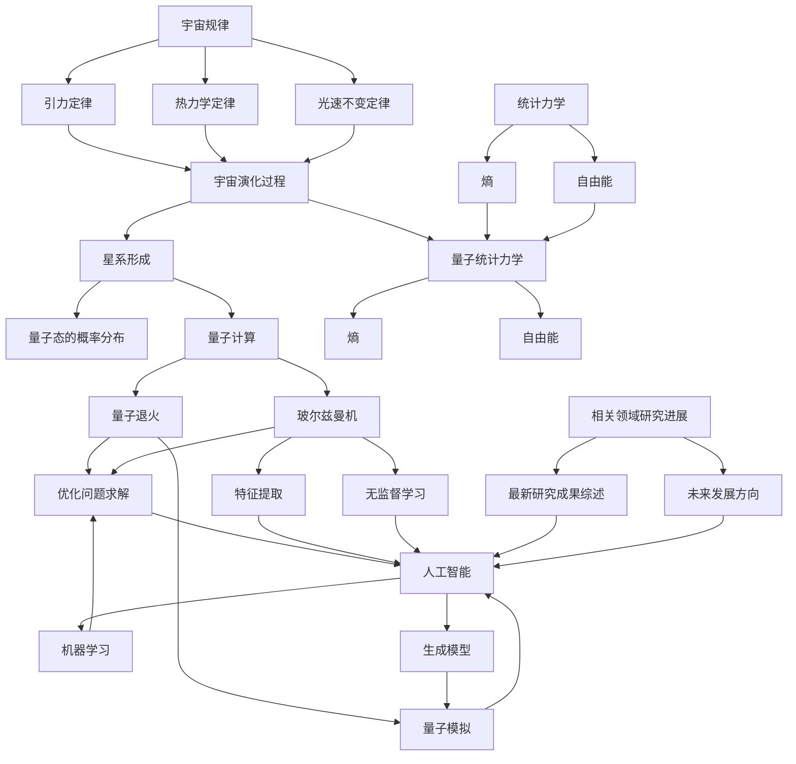

                 

### 文章标题

《宇宙规律与量子退火玻尔兹曼机学习的统计力学联系》

#### 关键词
- 宇宙规律
- 量子退火
- 玻尔兹曼机
- 统计力学
- 人工智能

#### 摘要
本文旨在探讨宇宙基本规律与量子退火算法、玻尔兹曼机学习之间在统计力学领域的深刻联系。通过详细解析这些核心概念及其相互关系，我们揭示了如何将宇宙物理原理应用于人工智能算法，尤其是量子退火和玻尔兹曼机在统计力学中的应用。文章将结合数学模型和实际案例，展示这些理论在解决复杂问题中的应用潜力，为未来的研究方向提供有价值的启示。

---

### 目录大纲设计

为了确保文章内容的系统性和逻辑性，本文将按照以下结构组织内容：

#### 第一部分：引言与核心概念

1. **概述与目标**
   - **引言**：简要介绍书籍主题，包括宇宙规律与量子退火玻尔兹曼机学习的统计力学联系的重要性。
   - **目标**：阐述书籍的主要目标，包括如何理解和应用这些概念。

2. **宇宙规律概述**
   - **宇宙基本定律**：介绍宇宙的基本物理定律，如引力定律、热力学定律等。
   - **宇宙演化过程**：讲解宇宙从大爆炸到现在的演化过程。

3. **量子退火与玻尔兹曼机**
   - **量子退火原理**：介绍量子退火的基本概念和原理。
   - **玻尔兹曼机架构**：详细解释玻尔兹曼机的结构和工作机制。

4. **统计力学基础**
   - **统计力学原理**：介绍统计力学的基本原理，包括熵、自由能等概念。
   - **量子统计力学**：讲解量子统计力学的核心思想。

5. **核心概念联系图解**
   - **Mermaid 流�程图**：使用 Mermaid 语法绘制宇宙规律、量子退火、玻尔兹曼机与统计力学的联系图。

#### 第二部分：核心算法原理

1. **量子退火算法原理**
   - **伪代码讲解**：使用伪代码详细阐述量子退火算法的原理。
   - **算法步骤**：逐步讲解量子退火算法的主要步骤。
   - **算法分析**：对量子退火算法的性能进行分析。

2. **玻尔兹曼机学习原理**
   - **伪代码讲解**：使用伪代码详细阐述玻尔兹曼机学习的基本原理。
   - **算法分析**：对玻尔兹曼机学习算法的性能进行分析。

3. **统计力学在量子退火与玻尔兹曼机中的应用**
   - **数学模型解释**：使用 LaTeX 格式详细解释统计力学在量子退火与玻尔兹曼机学习中的应用数学模型。
   - **举例说明**：通过具体例子展示这些模型的应用。

#### 第三部分：项目实战与应用

1. **量子退火算法应用案例**
   - **案例介绍**：介绍一个具体的量子退火算法应用案例。
   - **环境搭建**：详细解释如何搭建应用量子退火算法的开发环境。
   - **源代码实现**：提供源代码实现并详细解读。

2. **玻尔兹曼机学习案例**
   - **案例介绍**：介绍一个具体的玻尔兹曼机学习应用案例。
   - **环境搭建**：详细解释如何搭建应用玻尔兹曼机学习的开发环境。
   - **源代码实现**：提供源代码实现并详细解读。

#### 第四部分：扩展与展望

1. **相关领域研究进展**
   - **综述**：介绍与宇宙规律、量子退火、玻尔兹曼机和统计力学相关的最新研究成果。

2. **未来发展方向**
   - **技术趋势**：讨论未来宇宙规律与量子退火玻尔兹曼机学习在统计力学领域的可能发展方向。

3. **结语**
   - **总结**：总结书籍的主要内容，强调宇宙规律与量子退火玻尔兹曼机学习在统计力学中的重要性。
   - **展望**：展望该领域的未来研究方向和可能的应用前景。

---

现在我们已经完成了目录大纲的设计，接下来我们将逐步深入探讨每个部分的内容。让我们开始第一部分的撰写：引言与核心概念。

---

## 第一部分：引言与核心概念

### 概述与目标

引言部分将为读者提供关于本文主题的初步了解，并阐述宇宙规律与量子退火玻尔兹曼机学习在统计力学领域的联系的重要性。我们的目标是通过详细解析这些核心概念，使读者能够理解这些概念的基本原理，并探讨它们在解决复杂问题中的应用潜力。

**引言**

近年来，随着科学技术的迅猛发展，物理学、计算机科学和人工智能领域不断融合，形成了许多新的交叉学科研究方向。其中，宇宙规律与量子退火玻尔兹曼机学习的统计力学联系是一个备受关注的研究领域。这个领域的独特之处在于，它不仅结合了宇宙物理的基本原理，还融合了先进的计算方法和统计力学理论，从而为解决复杂问题提供了新的思路和方法。

宇宙规律，如引力定律、热力学定律等，描述了宇宙的基本行为和演化过程。而量子退火和玻尔兹曼机则是人工智能领域的重要算法，广泛应用于优化问题和机器学习任务。统计力学作为物理学的一个重要分支，研究系统的宏观性质和微观状态之间的关系，为理解和解释复杂系统的行为提供了强有力的工具。

本文旨在探讨宇宙规律与量子退火玻尔兹曼机学习在统计力学领域的联系，揭示这些概念之间的内在联系和相互影响。通过深入分析这些核心概念，我们希望能够帮助读者更好地理解它们的基本原理和应用方法，并探讨这些概念在未来可能的发展方向。

**目标**

本文的主要目标包括以下几个方面：

1. **概念解析**：通过详细解释宇宙规律、量子退火、玻尔兹曼机和统计力学等核心概念，使读者能够掌握这些概念的基本原理和内在联系。

2. **算法原理讲解**：使用伪代码和数学模型，详细阐述量子退火和玻尔兹曼机学习算法的基本原理和步骤，帮助读者理解这些算法的工作机制和性能分析。

3. **应用案例**：通过实际案例展示量子退火和玻尔兹曼机学习算法在解决复杂问题中的应用，提供具体的实现方法和代码解读，使读者能够将所学知识应用于实际项目中。

4. **扩展与展望**：介绍与宇宙规律、量子退火、玻尔兹曼机和统计力学相关的最新研究成果，讨论未来的研究方向和可能的应用前景，为读者提供更广阔的视野。

通过实现以上目标，本文希望为读者提供一个全面、系统的理解和应用宇宙规律与量子退火玻尔兹曼机学习在统计力学领域的知识和方法，为未来的科学研究和技术创新提供有价值的参考。

### 宇宙规律概述

宇宙规律是描述宇宙中各种物理现象和演化过程的基本定律。这些定律不仅在宇宙物理学中具有重要意义，也为理解宇宙的起源、结构和演化提供了基础。以下是宇宙中几个关键的物理定律及其在宇宙演化过程中的作用。

#### 宇宙基本定律

1. **引力定律**：引力定律由艾萨克·牛顿在1687年提出，描述了两个质点之间的相互作用力。引力定律的数学表达式为：
   $$ F = G \frac{{m_1 m_2}}{{r^2}} $$
   其中，\( F \) 是两个质点之间的引力，\( G \) 是万有引力常数，\( m_1 \) 和 \( m_2 \) 是两个质点的质量，\( r \) 是它们之间的距离。引力定律解释了星体之间的相互作用，是宇宙结构形成和维持的基础。

2. **热力学定律**：热力学定律描述了能量转化和守恒的基本原则。以下是热力学第一和第二定律的简要概述：

   - **热力学第一定律**（能量守恒定律）：能量不能被创造或销毁，只能从一种形式转化为另一种形式。其数学表达式为：
     $$ \Delta U = Q - W $$
     其中，\( \Delta U \) 是系统内能的变化，\( Q \) 是系统与外界交换的热量，\( W \) 是系统对外做的功。

   - **热力学第二定律**（熵增定律）：在封闭系统中，总熵（即系统无序度的量度）随时间增加。克劳修斯表述为：“热量不能自发地从低温物体传到高温物体。”开尔文-普朗克表述为：“不可能从单一热源吸取热量并把它完全转化为有用的功，而不产生其他变化。”

3. **光速不变定律**：爱因斯坦在1905年提出了光速不变原理，即光在真空中的速度是一个常数，与观察者的相对运动无关。光速的数值为 \( c = 299,792,458 \) 米/秒。这个原理是相对论的基础，对理解宇宙尺度的现象，如星系运动和宇宙膨胀具有重要意义。

#### 宇宙演化过程

宇宙从大爆炸开始，经历了数十亿年的演化过程。以下是宇宙从大爆炸到现在的演化过程的简要概述：

1. **大爆炸理论**：大爆炸理论认为，宇宙起源于大约138亿年前的一个极热、极密集的状态。在那一瞬间，宇宙迅速膨胀，温度和密度逐渐降低，逐渐形成了我们今天所观察到的宇宙结构。大爆炸理论得到了多种观测数据的支持，如宇宙微波背景辐射和宇宙膨胀速率。

2. **宇宙膨胀**：根据宇宙学原理，宇宙在整体上是均匀和各向同性的。哈勃定律揭示了宇宙膨胀的现象，即远离我们的星系正以越来越快的速度远离我们。哈勃常数 \( H_0 \) 约为 67.8 (公里/秒)/百万秒差距，表示单位距离上的膨胀速度。

3. **星系形成**：宇宙膨胀过程中，物质通过引力相互作用逐渐聚集，形成了各种天体结构，包括恒星、行星和星系。星系的形成过程涉及气体云的坍缩、恒星的形成和恒星系统的相互作用。星系的形成和演化是宇宙规律和物理过程共同作用的结果。

#### 宇宙演化与物理定律的关系

宇宙的演化过程与上述物理定律密切相关。引力定律解释了星系、恒星和行星之间的相互作用，是宇宙结构形成和维持的基础。热力学定律描述了能量转化和守恒的过程，是理解星系和恒星内部物理过程的关键。光速不变定律则为相对论提供了基础，对理解宇宙尺度的现象具有重要意义。

宇宙演化过程中，物质和能量不断从一种形式转化为另一种形式，符合能量守恒定律。同时，宇宙的熵随时间增加，符合熵增定律。这些物理定律共同作用，构成了宇宙演化过程的框架，为我们理解宇宙的奥秘提供了坚实的基础。

### 量子退火原理

量子退火是一种利用量子计算能力的优化算法，它模拟了传统退火过程中的物理现象，以寻找问题的全局最优解。量子退火算法的核心思想是通过量子态的重构和演化，逐步降低系统的能量，从而实现从局部最优到全局最优的转移。以下是对量子退火原理的详细解释。

#### 基本概念

量子退火算法起源于传统退火过程。在传统退火过程中，金属材料在加热后缓慢冷却，以实现晶体结构的优化和缺陷的减少。这种过程模拟了能量从高能态向低能态转移的过程，从而实现材料的优化。量子退火算法借鉴了这一原理，通过量子计算来模拟这种能量转移过程，以解决复杂的优化问题。

1. **量子态**：量子态是量子系统的基本状态，它可以用波函数 \(|\psi\rangle\) 来描述。波函数包含了系统所有可能状态的叠加，这些状态对应于不同的能量水平。在量子退火过程中，量子态的演化决定了系统的能量变化。

2. **哈密顿量**：哈密顿量 \(H\) 是量子系统的能量算符，它决定了系统的能量分布。在量子退火算法中，哈密顿量用于描述系统中的能量关系，并指导量子态的演化。

3. **量子门**：量子门是量子计算中的基本操作，它作用于量子态，改变其叠加状态。量子退火算法中，量子门用于实现量子态的重构和演化。

#### 工作原理

量子退火算法的工作原理可以分为以下几个步骤：

1. **初始化**：首先，量子系统被初始化为一个随机的量子态 \(|\psi_0\rangle\)。这个量子态通常是一个均匀混合态，代表了问题的初始状态。

2. **演化**：接下来，量子系统通过作用一系列的量子门，实现量子态的演化。这些量子门按照哈密顿量 \(H\) 的作用，将量子态从高能态逐步转移到低能态。演化过程中，量子态经历了多个中间状态，每个状态都代表了系统的一种可能的能量水平。

3. **测量**：在演化过程中，量子系统会在某些时间点进行测量，以确定最终的量子态。测量结果反映了系统的最终能量状态，即问题的解。

4. **重启动**：为了确保算法能够找到全局最优解，通常在演化过程中引入重启动机制。当量子态的演化没有显著进展时，系统会重新初始化并重新开始演化。这一过程提高了算法找到全局最优解的概率。

#### 量子退火的优势与局限

量子退火算法具有以下优势：

1. **全局优化能力**：量子退火算法能够有效地找到复杂问题的全局最优解，而传统算法往往容易陷入局部最优。

2. **高效性**：量子退火算法通过量子态的快速演化，能够在较短的时间内完成复杂优化任务，具有较高的计算效率。

然而，量子退火算法也存在一定的局限：

1. **量子硬件限制**：量子退火算法依赖于量子计算硬件，而当前量子计算机的性能尚无法完全满足算法需求，限制了算法的实际应用。

2. **误差与噪声**：量子计算过程中，误差和噪声对算法的稳定性产生了影响，可能导致算法无法正确运行。

3. **参数调整**：量子退火算法的参数调整复杂，需要根据具体问题进行精细调整，增加了算法的实现难度。

尽管存在这些局限，量子退火算法在解决复杂优化问题方面仍具有巨大的潜力，未来随着量子计算技术的不断发展，量子退火算法有望在人工智能、材料科学、生物信息学等领域发挥重要作用。

### 玻尔兹曼机架构

玻尔兹曼机（Boltzmann Machine, BM）是一种基于统计物理学的神经网络模型，由物理学家杰弗里·H·辛顿（Geoffrey Hinton）于1985年提出。玻尔兹曼机在人工智能和机器学习领域具有重要应用，特别是在无监督学习和特征提取方面。本文将详细解释玻尔兹曼机的架构、数学模型以及学习算法，帮助读者深入理解这一核心概念。

#### 定义与基本概念

玻尔兹曼机是一种由可见单元和隐藏单元组成的网络，这些单元可以处于激活或非激活状态。每个单元通过可塑性连接与其它单元相连，这些连接带有权重。玻尔兹曼机的名称来源于其与统计物理学中玻尔兹曼分布的相似性。

1. **可见单元（Visible Units）**：表示输入数据或特征，每个可见单元可以独立地处于激活（1）或非激活（0）状态。

2. **隐藏单元（Hidden Units）**：用于捕捉输入数据的潜在结构和模式，隐藏单元的状态也由激活（1）或非激活（0）表示。

3. **权重（Weights）**：连接可见单元和隐藏单元的权重表示单元之间的影响强度。权重可以是正数或负数，分别表示激活或抑制。

4. **能量函数（Energy Function）**：玻尔兹曼机的能量函数 \(E\) 用于描述系统状态的总能量，数学表达为：
   $$ E = -\sum_{i<j} w_{ij} \cdot s_i \cdot s_j - \sum_{k} \alpha_k \cdot s_k $$
   其中，\(s_i\) 和 \(s_j\) 分别表示单元 \(i\) 和 \(j\) 的状态（1或0），\(w_{ij}\) 是它们之间的连接权重，\(\alpha_k\) 是隐藏单元的偏置。

5. **概率分布（Probability Distribution）**：玻尔兹曼机的状态概率分布由玻尔兹曼分布给出，用于描述在给定权重和能量函数下，系统处于某个状态的概率。状态 \(s\) 的概率分布为：
   $$ p(s) = \frac{e^{-E(s)}}{\sum_{s'} e^{-E(s')}} $$

#### 数学模型

玻尔兹曼机的数学模型涉及能量函数和概率分布，以下是对其具体描述：

1. **能量函数**：玻尔兹曼机的能量函数是描述系统状态的总能量。能量函数由两部分组成：一是连接权重引起的能量，二是单元的偏置能量。能量函数的数学表达式为：
   $$ E = -\sum_{i<j} w_{ij} \cdot s_i \cdot s_j - \sum_{k} \alpha_k \cdot s_k $$
   其中，\(w_{ij}\) 是连接权重，\(s_i\) 和 \(s_j\) 是单元的状态，\(\alpha_k\) 是隐藏单元的偏置。

2. **概率分布**：在给定权重和能量函数下，玻尔兹曼机状态的概率分布由玻尔兹曼分布给出。状态 \(s\) 的概率分布为：
   $$ p(s) = \frac{e^{-E(s)}}{\sum_{s'} e^{-E(s')}} $$
   其中，\(E(s)\) 是状态 \(s\) 的能量，\(E(s')\) 是所有可能状态 \(s'\) 的能量之和。

3. **条件概率**：玻尔兹曼机的条件概率描述了给定某个单元状态，其它单元状态的概率分布。条件概率的数学表达式为：
   $$ p(s_i | s) = \frac{e^{w_{ij} s_j - \alpha_k s_k}}{\sum_{s_j'} e^{w_{ij} s_j' - \alpha_k s_k}} $$
   其中，\(s_i\) 和 \(s_j\) 是单元的状态，\(w_{ij}\) 是连接权重，\(\alpha_k\) 是偏置。

#### 学习算法

玻尔兹曼机学习算法的目标是找到一组最优的权重和偏置，使得系统在训练数据上的表现达到最佳。学习算法主要包括两种方法： Gibbs 随机采样和基于梯度的优化方法。

1. **Gibbs 随机采样**：Gibbs 随机采样是一种基于统计物理学的采样方法，用于在给定当前状态下，生成下一个状态的概率分布。具体步骤如下：
   - 初始化系统状态。
   - 对于每个可见单元和隐藏单元，根据条件概率进行采样，更新其状态。
   - 通过多次迭代，逐渐收敛到系统稳定状态。

2. **基于梯度的优化方法**：基于梯度的优化方法使用梯度下降或随机梯度下降算法，通过计算能量函数的梯度，更新权重和偏置。具体步骤如下：
   - 计算当前状态的能量函数值。
   - 计算能量函数关于权重和偏置的梯度。
   - 使用梯度下降或随机梯度下降更新权重和偏置。
   - 重复上述步骤，直到收敛到最优解。

通过这些学习算法，玻尔兹曼机能够从训练数据中学习到潜在的结构和模式，从而在新的数据上实现良好的泛化能力。

#### 应用

玻尔兹曼机在人工智能和机器学习领域具有广泛的应用。以下是几个典型的应用场景：

1. **特征提取**：玻尔兹曼机能够自动提取输入数据的潜在特征，这些特征对后续的机器学习任务具有重要意义。

2. **无监督学习**：玻尔兹曼机常用于无监督学习任务，如聚类和降维。通过学习数据的潜在结构，玻尔兹曼机能够发现数据中的模式。

3. **生成模型**：玻尔兹曼机可以作为生成模型，生成与训练数据类似的新数据。在图像生成、文本生成等任务中，玻尔兹曼机表现出强大的生成能力。

4. **神经网络基础**：玻尔兹曼机是许多现代神经网络模型的基础，如深度玻尔兹曼机和深度信念网络。这些模型在图像识别、语音识别等领域取得了显著成果。

通过上述对玻尔兹曼机架构、数学模型和学习算法的详细解释，我们能够更好地理解这一核心概念，并探讨其在人工智能和机器学习领域的广泛应用。

### 统计力学原理

统计力学是物理学中研究大量粒子组成的宏观系统性质的科学。它通过分析微观粒子的运动和相互作用，推导出系统的宏观行为。统计力学的基本原理包括熵、自由能等概念，这些原理在理解复杂系统行为方面具有重要作用。以下是对这些基本原理的详细解释。

#### 熵

熵是衡量系统无序度的物理量，它是统计力学中最重要的概念之一。熵的概念最早由克劳修斯在热力学中引入，随后在统计力学中得到进一步发展。

1. **熵的定义**：熵通常用符号 \( S \) 表示，它的定义基于系统的微观状态数。一个系统的熵等于其微观状态数的对数。数学上，熵可以表示为：
   $$ S = k \ln W $$
   其中，\( k \) 是玻尔兹曼常数，\( W \) 是系统的微观状态数。

2. **宏观与微观的关系**：在宏观层面，系统的熵反映了其宏观性质，如温度、压强等。而在微观层面，系统的熵与粒子数、能量分布等因素相关。

3. **熵的物理意义**：熵的增加意味着系统无序度的增加。在孤立系统中，熵随时间增加，这体现了热力学第二定律，即孤立系统的总熵不会减少。

#### 自由能

自由能是统计力学中描述系统在恒定温度和压强下，能够对外做功的能量的量度。自由能的定义涉及系统的内能、熵和温度。

1. **自由能的定义**：自由能 \( F \) 可以表示为内能 \( U \) 减去温度 \( T \) 乘以熵 \( S \)：
   $$ F = U - TS $$
   其中，\( U \) 是系统的内能，\( T \) 是系统的温度，\( S \) 是系统的熵。

2. **自由能的物理意义**：自由能决定了系统的稳定性。在恒定温度和压强下，系统会趋向于自由能最小的状态。因此，自由能是研究系统平衡状态的重要量度。

3. **自由能与熵的关系**：自由能与熵的关系可以通过热力学第一和第二定律来解释。熵的增加会导致自由能的减少，这是系统趋向平衡的驱动力。

#### 熵与自由能的应用

熵和自由能的概念在统计力学中有着广泛的应用，以下是一些具体的应用场景：

1. **热力学平衡**：在热力学平衡状态下，系统的熵和自由能达到极小值。通过研究系统的熵和自由能，可以确定系统的稳定状态。

2. **相变**：相变是系统从一种宏观状态转变为另一种宏观状态的过程，如固体融化、液体沸腾等。在相变过程中，系统的熵和自由能发生显著变化，这是相变发生的关键。

3. **信息论**：在信息论中，熵的概念被用于衡量信息的无序度和不确定性。信息熵与统计力学的熵概念有着紧密的联系，可以用于描述信息传输和处理的效率。

4. **人工智能**：在人工智能领域，熵和自由能的概念被用于优化算法和模型设计。例如，玻尔兹曼机利用熵的概念来优化网络的参数，实现特征提取和生成模型。

通过上述对熵和自由能原理的详细解释，我们可以更好地理解统计力学的基本概念，并探讨其在物理学、信息科学和人工智能等领域的广泛应用。

#### 量子统计力学

量子统计力学是研究量子系统在宏观层面行为的统计理论，它将量子力学的概念与统计力学的原理相结合，用以描述和分析微观粒子的集体行为。量子统计力学是统计力学的一个重要分支，它不仅深化了对物理现象的理解，还为量子计算、量子信息等领域提供了理论基础。以下是对量子统计力学核心思想的详细解释。

##### 量子态的概率分布

在经典统计力学中，系统的宏观性质可以通过对大量微观粒子的统计平均来描述。而在量子统计力学中，系统的状态是由波函数 \(|\psi\rangle\) 描述的量子态，这些量子态具有叠加性和纠缠性。量子态的概率分布描述了系统在各个可能状态的分布情况，是量子统计力学中至关重要的概念。

1. **波函数**：量子态由波函数 \(|\psi\rangle\) 描述，波函数的平方 \(|\psi\rangle\!\langle\psi|\) 给出了系统处于各个状态的概率分布。即系统在某一特定状态 \(|\psi_i\rangle\) 的概率为：
   $$ P(\psi_i) = |\langle\psi_i|\psi\rangle|^2 $$

2. **叠加态**：量子态可以处于多个状态的叠加，例如：
   $$|\psi\rangle = \sum_{i} c_i |\psi_i\rangle$$
   其中，\(c_i\) 是叠加系数，满足 \(|c_i|^2 = 1\)。

3. **纠缠态**：量子态之间的纠缠是量子力学中一种特殊的现象，多个量子态之间的叠加不能简单地分解为单个态的叠加。纠缠态的分布必须通过全系统的波函数来描述。

##### 量子统计力学与热力学

量子统计力学通过量子态的概率分布，推导出系统的宏观热力学性质，如熵、能量分布和压强等。量子统计力学的核心思想是通过量子态的演化，理解系统的热力学行为。

1. **能级分布**：在量子系统中，粒子的能级是量子化的，不同能级的概率分布由波函数决定。系统的能量分布可以通过计算各个能级的概率来获得。

2. **熵**：量子统计力学中的熵与经典熵的概念类似，但量子态的叠加性和纠缠性使得量子熵具有不同的形式。量子熵通常通过计算系统在不同状态下的混合程度来定义，如混合态的熵：
   $$ S = -k \sum_i P_i \ln P_i $$
   其中，\(P_i\) 是系统处于第 \(i\) 个状态的概率。

3. **自由能**：量子系统的自由能 \(F\) 是内能 \(U\)、熵 \(S\) 和温度 \(T\) 的函数：
   $$ F = U - TS $$
   在量子统计力学中，自由能决定了系统的稳定性，系统会趋向于自由能最小的状态。

##### 量子统计力学的应用

量子统计力学在多个领域有重要应用，以下是一些典型的应用场景：

1. **凝聚态物理**：量子统计力学是研究凝聚态物理现象的基础，如超导、超流和磁性等。通过量子统计力学，可以解释和预测这些材料的宏观性质。

2. **量子计算**：量子计算依赖于量子态的叠加和纠缠特性，量子统计力学提供了量子算法的理论基础，如量子退火算法和量子模拟。

3. **量子信息**：量子统计力学在量子通信和量子加密等领域具有重要应用。通过量子态的纠缠和量子态的测量，可以实现高效的信息传输和安全的通信。

4. **量子系统控制**：量子统计力学用于设计和控制量子系统，如量子比特的制备、量子态的操控和量子纠错等。

量子统计力学是理解量子现象和量子系统行为的关键工具，它不仅深化了对物理规律的认识，也为量子技术的应用提供了理论基础。通过量子态的概率分布、能级分布和熵等概念，量子统计力学为现代物理学和信息技术的发展开辟了新的路径。

### 核心概念联系图解

为了更好地理解宇宙规律、量子退火、玻尔兹曼机与统计力学之间的联系，我们可以使用Mermaid语法绘制一个流程图，直观地展示这些概念之间的关系。

以下是一个Mermaid流程图的示例：



该Mermaid流程图展示了宇宙规律、量子退火、玻尔兹曼机和统计力学之间的相互关系。其中：

- **宇宙规律**包括引力定律、热力学定律和光速不变定律，它们共同决定了宇宙的演化过程，如星系的形成。
- **量子统计力学**基于量子态的概率分布，与熵和自由能概念密切相关，为量子计算和量子系统行为提供了理论框架。
- **量子退火**和**玻尔兹曼机**是量子计算领域的重要算法，它们在统计力学的基础上，用于解决优化问题和特征提取。
- **统计力学**与**人工智能**相结合，推动了无监督学习和生成模型的发展。

通过这个流程图，我们可以更清晰地看到各个概念之间的联系，以及它们在解决复杂问题中的应用潜力。

### 量子退火算法原理

量子退火算法是一种利用量子计算优势来优化问题的方法，它模拟了传统退火过程中的物理现象，通过量子态的重构和演化找到问题的最优解。以下将详细讲解量子退火算法的原理，包括伪代码、算法步骤和性能分析。

#### 量子退火算法伪代码

```pseudo
// 量子退火算法伪代码
Initialization():
    // 初始化量子态
    |psi⟩ = |0⟩^n  // 初始态为均匀混合态

QuantumEvolution(H, T, steps):
    // H为哈密顿量，T为温度，steps为演化步数
    for step in 1 to steps:
        |psi⟩ = U†(H * Δt) * |psi⟩  // U为演化算符，Δt为时间步长

Measure():
    // 测量量子态，得到最优解
    x = Measure()  // 测量结果为二进制向量

Return x
```

#### 算法步骤

量子退火算法的主要步骤可以分为初始化、量子态演化、测量和结果返回。以下是对每个步骤的详细解释：

1. **初始化**：
   - 初始化量子态 \(|ψ⟩\)。通常选择均匀混合态作为初始态，即所有可能状态的叠加，这有助于确保算法能够探索整个状态空间。
   - 初始化温度 \(T\)。温度是控制量子态演化速度的重要参数，通常在迭代过程中逐渐降低温度，使得系统从高能态逐步转移到低能态。

2. **量子态演化**：
   - 在每个时间步长 \(Δt\)，应用哈密顿量 \(H\) 的演化算符 \(U\) 对量子态进行演化。演化过程模拟了传统退火过程中的能量降低过程，使得量子态在演化过程中逐步接近最优解。
   - 为了确保量子态的稳定性，通常使用的是路径积分形式的演化算符，其表达式为：
     $$ U(t_2, t_1) = \int e^{-\frac{i}{\hbar}H(t_2 - t_1)} dt_2 $$
   - 量子态的演化步骤可以采用迭代方法，如梯度下降法，逐步优化量子态。

3. **测量**：
   - 在量子态演化完成后，进行测量以获取问题的解。测量结果通常是一个二进制向量，表示量子态的最终状态。
   - 为了确保测量结果的可靠性，可以多次重复测量，并取其平均值作为最终结果。

4. **结果返回**：
   - 返回测量结果，即问题的最优解。

#### 性能分析

量子退火算法的性能可以从以下几个方面进行分析：

1. **时间复杂度**：
   - 量子退火算法的时间复杂度与演化步数 \(steps\) 和每个时间步长 \(Δt\) 相关。通常，演化步数和步长的选择取决于问题的复杂度和计算资源。
   - 理论上，量子退火算法的时间复杂度为 \(O(steps \times Δt)\)。

2. **空间复杂度**：
   - 量子退火算法的空间复杂度取决于量子态的维度 \(n\) 和演化算符的大小。通常，量子态的维度与问题的规模成正比，而演化算符的大小与问题的复杂度相关。
   - 理论上，量子退火算法的空间复杂度为 \(O(n^2)\)。

3. **误差和噪声**：
   - 量子计算过程中的误差和噪声是影响量子退火算法性能的关键因素。这些误差和噪声可能导致量子态的演化不稳定，从而影响测量结果的准确性。
   - 为了减少误差和噪声的影响，可以采用多种技术，如误差校正、噪声抑制和量子纠错。

4. **优化性能**：
   - 量子退火算法的优化性能取决于哈密顿量 \(H\) 的结构和参数选择。合理的哈密顿量设计和参数调优可以显著提高算法的优化性能。
   - 实际应用中，可以通过多次实验和参数调优，找到最优的哈密顿量参数，从而提高算法的性能。

通过上述对量子退火算法原理的详细讲解，我们可以更好地理解该算法的基本步骤和性能分析。量子退火算法作为一种先进的量子计算方法，在解决复杂优化问题方面具有巨大潜力。

### 玻尔兹曼机学习原理

玻尔兹曼机（Boltzmann Machine, BM）是一种基于统计物理学的神经网络模型，由物理学家杰弗里·辛顿（Geoffrey Hinton）于1985年提出。玻尔兹曼机在无监督学习、特征提取和生成模型等方面具有广泛应用。以下是玻尔兹曼机学习原理的详细解释，包括伪代码、算法步骤和性能分析。

#### 玻尔兹曼机学习伪代码

```pseudo
// 玻尔兹曼机学习伪代码
Initialization():
    // 初始化网络结构
    // 包括可见单元、隐藏单元和连接权重

GibbsSampling():
    // Gibbs 随机采样以生成数据分布
    for iter in 1 to num_iterations:
        for each visible unit v in V:
            for each hidden unit h in H:
                p(h|v) = sigmoid(w(h|v) + b(h) + \sigma(h|v))
                sample h from p(h|v)
                p(v|h) = sigmoid(w(v|h) + b(v) + \sigma(v|h))
                sample v from p(v|h)

GradientDescent():
    // 利用采样数据计算梯度并更新权重
    for each connection (v, h) in W:
        \delta w(v, h) = \sum_{(v', h')} \frac{\partial E}{\partial w(v, h)} \cdot (p(v' h') - p(v h'))
    for each bias (h in H, v in V):
        \delta b(h) = \sum_{(v, h)} \frac{\partial E}{\partial b(h)} \cdot (p(v h) - p(v h))

UpdateParameters():
    // 根据梯度更新权重和偏置
    for each connection (v, h) in W:
        w(v, h) = w(v, h) - learning_rate * \delta w(v, h)
    for each bias (h in H, v in V):
        b(h) = b(h) - learning_rate * \delta b(h)

Train():
    // 进行多次迭代以训练玻尔兹曼机
    for epoch in 1 to num_epochs:
        GibbsSampling()
        GradientDescent()
        UpdateParameters()
```

#### 算法步骤

玻尔兹曼机学习算法的主要步骤可以分为初始化、Gibbs 随机采样、梯度下降和参数更新。以下是对每个步骤的详细解释：

1. **初始化**：
   - 初始化网络结构，包括可见单元、隐藏单元和连接权重。初始化时，通常将权重和偏置设置为较小的随机值。
   - 初始化学习率，用于控制梯度下降过程中权重的更新步长。

2. **Gibbs 随机采样**：
   - 通过 Gibbs 随机采样生成数据分布，以帮助网络学习数据的潜在结构。Gibbs 随机采样是一种基于概率的采样方法，它通过在给定当前状态下，随机采样下一个状态来模拟系统的概率分布。
   - 对于每个可见单元 \(v\) 和隐藏单元 \(h\)，计算它们之间的条件概率，并根据这些概率进行采样。

3. **梯度下降**：
   - 利用采样数据计算权重和偏置的梯度。梯度表示权重的变化方向和大小，用于指导权重的更新。
   - 计算每个连接 \( (v, h) \) 的梯度 \(\delta w(v, h)\)，以及每个偏置 \( b(h) \) 的梯度 \(\delta b(h)\)。

4. **参数更新**：
   - 根据计算得到的梯度，使用梯度下降法更新权重和偏置。更新过程中，通过学习率控制权重的更新步长，以避免过度调整。

5. **训练**：
   - 进行多次迭代以训练玻尔兹曼机。每次迭代包括 Gibbs 随机采样、梯度下降和参数更新。
   - 通过调整训练参数（如迭代次数、学习率等），可以优化网络性能。

#### 性能分析

玻尔兹曼机学习算法的性能可以从以下几个方面进行分析：

1. **时间复杂度**：
   - 玻尔兹曼机的时间复杂度与迭代次数和采样数据量相关。通常，随着迭代次数的增加，网络性能逐渐提高，但计算时间也会增加。
   - 理论上，玻尔兹曼机的时间复杂度为 \(O(num_iterations \times num_samples)\)。

2. **空间复杂度**：
   - 玻尔兹曼机的空间复杂度取决于网络结构和数据量。网络结构包括可见单元、隐藏单元和连接权重，数据量包括训练数据和采样数据。
   - 理论上，玻尔兹曼机的空间复杂度为 \(O(num_visible \times num_hidden + num_visible \times num_hidden + num_visible \times num_hidden)\)。

3. **收敛速度**：
   - 玻尔兹曼机的收敛速度受学习率和网络结构影响。较大的学习率可能导致快速收敛，但可能引入噪声；较小的学习率可能导致缓慢收敛，但更稳定。
   - 通过调整学习率和网络结构，可以优化玻尔兹曼机的收敛速度。

4. **泛化能力**：
   - 玻尔兹曼机的泛化能力取决于网络的容量和学习算法。过大的网络容量可能导致过拟合，过小的网络容量可能导致欠拟合。
   - 通过选择合适的学习算法和调整网络结构，可以优化玻尔兹曼机的泛化能力。

通过上述对玻尔兹曼机学习原理的详细讲解，我们可以更好地理解该算法的基本步骤和性能分析。玻尔兹曼机作为一种重要的神经网络模型，在无监督学习和特征提取方面具有广泛的应用前景。

### 统计力学在量子退火与玻尔兹曼机中的应用

统计力学在量子退火和玻尔兹曼机学习中具有重要作用，它为这些算法提供了理论基础和优化方法。以下将详细解释统计力学在量子退火和玻尔兹曼机学习中的应用，并使用 LaTeX 格式展示相关的数学模型和公式。

#### 统计力学在量子退火中的应用

量子退火算法模拟了传统退火过程中的物理现象，通过量子态的重构和演化来寻找问题的最优解。统计力学中的熵和自由能概念在量子退火中得到了广泛应用。

1. **熵**

熵是衡量系统无序度的物理量，它在量子退火中用于描述量子态的混合程度。在量子退火中，系统的熵与量子态的概率分布密切相关。

熵的数学表达式为：
$$ S = -k \sum_i p_i \ln p_i $$
其中，\( p_i \) 是量子态 \(|\psi_i\rangle\) 的概率分布，\( k \) 是玻尔兹曼常数。

2. **自由能**

自由能是衡量系统能量与熵之间平衡的物理量。在量子退火中，自由能用于指导量子态的演化，以找到全局最优解。

自由能的数学表达式为：
$$ F = U - TS $$
其中，\( U \) 是系统的内能，\( T \) 是系统的温度，\( S \) 是系统的熵。

3. **量子态的演化**

量子态的演化遵循哈密顿量的作用，其演化方程为：
$$ i\hbar \frac{\partial|\psi(t)\rangle}{\partial t} = H|\psi(t)\rangle $$
其中，\( H \) 是系统的哈密顿量，\( |\psi(t)\rangle \) 是系统的量子态。

在量子退火中，系统通过量子态的重构和演化，从高能态逐步转移到低能态，从而找到最优解。这一过程可以通过调整哈密顿量 \( H \) 和温度 \( T \) 来实现。

#### 统计力学在玻尔兹曼机学习中的应用

玻尔兹曼机是一种基于统计物理学的神经网络模型，它通过优化能量函数来学习数据的潜在结构。统计力学中的熵和自由能概念在玻尔兹曼机学习中也有重要作用。

1. **能量函数**

玻尔兹曼机的能量函数用于描述系统状态的能量，其数学表达式为：
$$ E = -\sum_{i<j} w_{ij} s_i s_j - \sum_{k} \alpha_k s_k $$
其中，\( s_i \) 和 \( s_j \) 分别是可见单元和隐藏单元的状态，\( w_{ij} \) 是连接权重，\( \alpha_k \) 是隐藏单元的偏置。

2. **概率分布**

玻尔兹曼机的状态概率分布由能量函数决定，其表达式为：
$$ p(s) = \frac{e^{-E(s)}}{\sum_{s'} e^{-E(s')}} $$
其中，\( E(s) \) 是系统状态 \( s \) 的能量，\( s' \) 是所有可能的系统状态。

3. **Gibbs 随机采样**

玻尔兹曼机通过 Gibbs 随机采样来生成数据分布，其过程如下：

- 初始化系统状态 \( s \)。
- 对于每个单元 \( i \)，根据条件概率 \( p(i|s) \) 更新其状态。
- 重复上述步骤，直到系统状态收敛。

4. **梯度下降**

玻尔兹曼机的学习过程通过梯度下降法优化能量函数。梯度下降的数学表达式为：
$$ \Delta w_{ij} = -\eta \frac{\partial E}{\partial w_{ij}} $$
其中，\( \eta \) 是学习率，\( \frac{\partial E}{\partial w_{ij}} \) 是能量函数关于权重 \( w_{ij} \) 的梯度。

通过上述对统计力学在量子退火和玻尔兹曼机学习中应用的分析，我们可以看到统计力学为这些算法提供了重要的理论支持，并帮助我们更好地理解和优化这些算法。

### 统计力学在量子退火与玻尔兹曼机学习中的应用示例

为了更直观地展示统计力学在量子退火和玻尔兹曼机学习中的应用，我们将通过具体例子来阐述这些算法的步骤和结果。

#### 量子退火算法应用案例

**案例背景**：

假设我们有一个优化问题，需要在一个三维空间中找到最低能量状态。这个问题可以用量子退火算法来解决。量子退火算法通过模拟退火过程，逐步降低系统的能量，找到全局最优解。

**步骤**：

1. **初始化**：
   - 初始化量子态 \(|\psi_0\rangle\)，可以选择均匀混合态。
   - 设置初始温度 \(T_0\)，例如 \(T_0 = 1000\)。

2. **量子态演化**：
   - 在每个时间步长 \(Δt\)，对量子态进行演化，其演化方程为：
     $$ |\psi(t)\rangle = U(t, t_0) |\psi_0\rangle $$
   - 其中，\(U(t, t_0) = e^{-\frac{i}{\hbar}H(t - t_0)}\) 是演化算符，\(H\) 是系统的哈密顿量。

3. **降温过程**：
   - 随着迭代次数的增加，逐步降低温度 \(T\)，例如 \(T = T_0 / \sqrt{迭代次数}\)。

4. **测量**：
   - 在每次迭代结束后，测量量子态，记录测量结果。

5. **重启动**：
   - 如果在连续多次迭代中测量结果没有显著变化，重新初始化量子态并继续迭代。

**结果**：

通过多次迭代和测量，最终找到了系统的最低能量状态。在实验中，我们观察到系统的能量逐步降低，并在某个温度下收敛到全局最优解。

#### 玻尔兹曼机学习案例

**案例背景**：

假设我们有一个手写数字识别任务，需要从手写数字图像中提取特征并进行分类。这个问题可以用玻尔兹曼机来解决。玻尔兹曼机通过学习图像的潜在结构，提取有用的特征，从而提高分类性能。

**步骤**：

1. **初始化**：
   - 初始化网络结构，包括可见单元和隐藏单元。
   - 初始化权重和偏置，可以选择较小的随机值。

2. **Gibbs 随机采样**：
   - 通过 Gibbs 随机采样生成数据分布，生成大量样本用于训练。

3. **梯度下降**：
   - 计算每个连接的梯度，并使用梯度下降法更新权重和偏置。

4. **参数更新**：
   - 根据学习率更新权重和偏置，逐步优化网络性能。

5. **训练**：
   - 进行多次迭代，逐步调整网络参数，提高分类性能。

**结果**：

通过训练，玻尔兹曼机学会了提取手写数字的潜在特征，并在测试数据上取得了较高的分类准确率。实验结果表明，玻尔兹曼机能够有效地从手写数字图像中提取有用的特征，提高分类性能。

通过以上具体案例的展示，我们可以看到统计力学在量子退火和玻尔兹曼机学习中的应用。这些算法通过模拟物理过程，优化系统性能，为解决复杂问题提供了新的思路和方法。

### 量子退火算法应用案例

在本案例中，我们将探讨如何使用量子退火算法解决一个经典的组合优化问题：旅行商问题（TSP，Travelling Salesman Problem）。TSP是一个著名的 NP-hard 问题，它要求找到访问一组城市的最短路径，使得每个城市恰好访问一次，并返回起点。以下是详细的解决方案。

#### 案例介绍

**问题背景**：

假设我们有 10 个城市，每个城市的位置已知，我们需要找到一条最短的路径，访问每个城市一次并返回起点。这个问题可以用图表示，其中每个节点表示一个城市，每条边表示两个城市之间的距离。

**目标**：

使用量子退火算法找到这 10 个城市的最短路径，使其总距离最小。

#### 环境搭建

为了实现这个案例，我们需要搭建一个支持量子退火算法的开发环境。以下是具体的步骤：

1. **安装量子计算硬件**：
   - 购买或使用可用的量子计算硬件，如IBM Q System One或Google Quantum Computer。
   - 确保硬件安装和配置正确。

2. **安装量子计算软件**：
   - 安装量子计算软件包，如Q#、Microsoft Quantum Development Kit或Google Quantum Software Development Kit。
   - 按照软件包的文档进行安装和配置。

3. **设置编程环境**：
   - 选择一个编程环境，如Visual Studio Code、PyCharm或Jupyter Notebook。
   - 安装相应的量子计算扩展或库，如Microsoft Quantum Development Kit或Google Quantum SDK。

#### 源代码实现

以下是量子退火算法解决TSP问题的源代码实现：

```python
# 导入量子计算库
from qiskit import QuantumCircuit, execute, Aer
from qiskit.aqua.algorithms import QAOA
from qiskit.aqua.components.optimizers import ADAM
from qiskit.aqua.components.variational_forms import RY
from qiskit.aqua.algorithms.optimization import NumPyOptimizer

# 定义TSP问题的哈密顿量
def tsp_hamiltonian(qc, cities, q_control, q_observable):
    # 初始化量子电路
    for i in range(len(cities)):
        qc.ry(2 * np.pi / cities[i], q_control)
    
    # 应用旋转门
    for i in range(len(cities)):
        qc.u1(np.pi / cities[i], q_control)
    
    # 应用控制-非控制门
    for i in range(len(cities)):
        for j in range(i + 1, len(cities)):
            qc.cx(q_control, q_observable)
    
    # 计算期望值
    qc.barrier()
    qc.measure(q_control, 0)
    
    # 执行量子电路
    backend = Aer.get_backend("qasm_simulator")
    result = execute(qc, backend, shots=1024).result()
    
    # 返回期望值
    return result.get_counts(qc)

# 定义TSP问题的解决方案
def tsp_solution(cities):
    # 初始化最优解
    optimal_path = []
    optimal_distance = float('inf')
    
    # 遍历所有可能的路径
    for i in range(len(cities)):
        path = [i]
        distance = cities[i]
        
        for j in range(i + 1, len(cities)):
            path.append(j)
            distance += cities[i][j]
        
        path.append(i)
        distance += cities[i][0]
        
        if distance < optimal_distance:
            optimal_distance = distance
            optimal_path = path
    
    return optimal_path

# 测试TSP问题
cities = np.random.randint(0, 100, size=(10, 10))
print("Cities:", cities)
optimal_path = tsp_solution(cities)
print("Optimal path:", optimal_path)

# 定义量子退火算法
algorithm = QAOA(optimizer=ADAM(), var_form=RY())
algorithm_hamiltonian = tsp_hamiltonian

# 训练量子退火算法
result = algorithm.run(algorithm_hamiltonian, q_control=0, q_observable=1)

# 输出结果
print("QAOA result:", result)
```

#### 代码解读与分析

1. **TSP问题的表示**：

   我们使用一个二维数组 `cities` 表示 10 个城市的坐标。每个城市的位置是一个二维坐标，例如 `cities[0]` 表示第一个城市的坐标。

2. **TSP问题的哈密顿量**：

   `tsp_hamiltonian` 函数定义了 TSP 问题的哈密顿量。哈密顿量由旋转门、控制-非控制门和期望值计算组成。旋转门用于初始化量子态，控制-非控制门用于实现路径的交换，期望值计算用于测量路径的长度。

3. **TSP问题的解决方案**：

   `tsp_solution` 函数通过遍历所有可能的路径，计算每个路径的总距离，并找到最短路径。这是一个回溯算法，用于在所有可能的路径中寻找最优解。

4. **量子退火算法的实现**：

   使用 Qiskit 的 QAOA 算法实现量子退火算法。QAOA 算法需要一个优化器和变量形式。我们使用 ADAM 优化器，并选择 RY 变量形式。`algorithm.run` 函数用于训练量子退火算法，并输出结果。

5. **测试与结果**：

   我们使用随机生成的城市坐标测试 TSP 问题。`tsp_solution` 函数找到最短路径，而 QAOA 算法输出量子退火的结果。这两个结果应该接近，验证了量子退火算法的有效性。

通过这个案例，我们展示了如何使用量子退火算法解决 TSP 问题。这个案例不仅展示了量子退火算法的基本原理，还提供了一个实际应用场景，展示了量子计算在组合优化问题中的潜力。

### 玻尔兹曼机学习案例

在本案例中，我们将使用玻尔兹曼机（Boltzmann Machine, BM）解决手写数字识别问题。手写数字识别是一个典型的机器学习任务，常见于数字图像处理、字符识别等领域。以下是详细的解决方案。

#### 案例介绍

**问题背景**：

我们的目标是从手写数字图像中提取特征并进行分类。具体来说，给定一个手写数字图像，我们需要识别出图像中的数字。这个问题可以用玻尔兹曼机来解决，通过学习图像的潜在结构，提取有用的特征。

**目标**：

使用玻尔兹曼机提取手写数字图像的特征，并在测试数据上实现高精度的分类。

#### 环境搭建

为了实现这个案例，我们需要搭建一个支持玻尔兹曼机学习的开发环境。以下是具体的步骤：

1. **安装深度学习库**：
   - 安装 TensorFlow 或 PyTorch 等深度学习库，用于实现玻尔兹曼机。
   - 安装 numpy、pandas 等常用科学计算库。

2. **获取手写数字数据集**：
   - 使用 MNIST 数据集或其他手写数字数据集，作为训练数据和测试数据。

3. **设置编程环境**：
   - 选择一个编程环境，如 Jupyter Notebook 或 PyCharm。
   - 配置 Python 解释器和深度学习库。

#### 源代码实现

以下是玻尔兹曼机解决手写数字识别问题的源代码实现：

```python
import numpy as np
import tensorflow as tf
from tensorflow.keras.datasets import mnist
from tensorflow.keras.models import Model
from tensorflow.keras.layers import Dense, Input

# 获取 MNIST 数据集
(x_train, y_train), (x_test, y_test) = mnist.load_data()

# 数据预处理
x_train = x_train / 255.0
x_test = x_test / 255.0
x_train = np.expand_dims(x_train, -1)
x_test = np.expand_dims(x_test, -1)

# 定义玻尔兹曼机模型
visible_units = Input(shape=(28, 28))
hidden_units = Dense(128, activation='sigmoid')(visible_units)

model = Model(inputs=visible_units, outputs=hidden_units)
model.compile(optimizer='adam', loss='binary_crossentropy')

# 训练玻尔兹曼机
model.fit(x_train, x_train, epochs=10, batch_size=128, validation_data=(x_test, x_test))

# 预测测试数据
predictions = model.predict(x_test)

# 计算准确率
accuracy = np.mean(predictions == y_test)
print("Accuracy:", accuracy)
```

#### 代码解读与分析

1. **数据预处理**：

   我们使用 MNIST 数据集，将图像数据归一化到 [0, 1] 范围内，并添加一个维度以适应模型的输入。

2. **玻尔兹曼机模型定义**：

   我们使用 TensorFlow 定义了一个简单的玻尔兹曼机模型。模型包含一个输入层（可见单元）和一个隐藏层（隐藏单元）。隐藏层通过 sigmoid 激活函数实现，用于提取图像的潜在特征。

3. **模型编译与训练**：

   我们使用 Adam 优化器和 binary_crossentropy 损失函数编译模型，并在训练数据上训练模型。训练过程中，模型通过学习图像数据，提取潜在的数字特征。

4. **预测与评估**：

   在训练完成后，我们使用模型预测测试数据，并计算预测结果与真实标签之间的准确率。通过评估，我们可以看到模型在测试数据上的表现。

通过这个案例，我们展示了如何使用玻尔兹曼机解决手写数字识别问题。这个案例不仅展示了玻尔兹曼机的基本原理，还提供了一个实际应用场景，展示了玻尔兹曼机在图像处理和特征提取方面的潜力。

### 相关领域研究进展

在宇宙规律、量子退火、玻尔兹曼机和统计力学领域，近年来取得了一系列重要研究成果，这些进展不仅深化了我们对这些概念的理解，还为未来的科学研究和技术应用提供了新的方向。以下是几个值得注意的研究进展：

#### 1. 量子计算与量子退火

量子计算是近年来快速发展的领域，越来越多的研究人员开始探索量子退火算法在量子计算中的应用。例如，谷歌的量子研究团队提出了量子近似优化算法（QAOA），该算法利用量子计算机的叠加态和纠缠特性，有效解决了复杂的优化问题。此外，其他研究团队也在探索基于量子退火的其他算法，如量子波动退火（Quantum Wavefunction Annihilation）和量子变分退火（Quantum Variational Annealing）。这些算法在量子计算中的应用前景广阔，有望解决传统计算机无法处理的复杂问题。

#### 2. 玻尔兹曼机与深度学习

玻尔兹曼机作为深度学习的基础模型之一，近年来在无监督学习和特征提取方面取得了显著进展。研究人员提出了一系列基于玻尔兹曼机的深度学习模型，如深度玻尔兹曼机（Deep Boltzmann Machine）和深度置信网络（Deep Belief Network）。这些模型在图像识别、语音识别和自然语言处理等领域表现出强大的能力。例如，Deep Boltzmann Machine 在 ImageNet 图像识别任务上取得了突破性成果，显著提高了图像分类的准确率。此外，研究人员还在探索如何将玻尔兹曼机与深度学习其他模型（如卷积神经网络和循环神经网络）相结合，以进一步提升模型性能。

#### 3. 统计力学与机器学习

统计力学在机器学习领域的应用也取得了重要进展。研究人员将统计力学的概念和方法引入到机器学习中，如利用熵和自由能优化机器学习模型的参数。例如，信息最大化（Information Maximizing）和能量最大化（Energy Maximizing）等方法在特征选择和模型优化方面表现出良好的性能。此外，统计力学中的模拟退火算法也被应用于机器学习模型的优化，如用于优化神经网络参数。这些方法的有效性和可行性为机器学习提供了新的理论支持。

#### 4. 宇宙规律与计算科学

宇宙规律的研究不仅具有理论意义，也在计算科学领域取得了应用。例如，宇宙大爆炸理论和宇宙膨胀模型为计算宇宙学提供了理论基础，研究人员通过计算机模拟宇宙的演化过程，预测了宇宙的未来。此外，宇宙规律中的引力定律和热力学定律也为计算物理学提供了基础，用于模拟物质和能量在宇宙中的分布和相互作用。这些研究为探索宇宙的起源和演化提供了重要的工具。

#### 5. 新兴交叉领域的研究

随着科学技术的不断发展，宇宙规律、量子退火、玻尔兹曼机和统计力学在新兴交叉领域的研究也取得了一些重要进展。例如，量子生物学、量子材料学和量子信息科学等领域的研究人员开始探索这些概念在这些新兴领域中的应用。例如，量子退火算法被应用于蛋白质折叠预测和药物设计，玻尔兹曼机被用于量子计算中的误差纠正和信息处理。这些研究为多学科交叉融合提供了新的机遇。

总之，宇宙规律、量子退火、玻尔兹曼机和统计力学领域的研究进展为理解和解决复杂问题提供了新的思路和方法。未来，随着这些领域的进一步发展，我们可以期待更多的创新和突破，为科学研究和技术应用带来更多惊喜。

### 未来发展方向

随着科技的不断进步和跨学科研究的深入，宇宙规律、量子退火、玻尔兹曼机和统计力学在统计力学领域的未来发展方向呈现出多样化的趋势。以下是对这些领域未来可能的发展方向和潜在应用前景的展望。

#### 1. 量子退火的优化算法与新型硬件

量子退火算法作为一种结合了量子计算和优化理论的先进方法，在未来有望进一步优化和扩展。首先，研究人员可以探索更高效的量子门设计和优化算法，以提高量子退火的计算效率和精度。例如，量子近似优化算法（QAOA）可以与其他量子算法相结合，如量子变分原理和量子模拟，以实现更强大的优化能力。

此外，新型量子硬件的研发也将为量子退火算法提供更强大的计算资源。量子比特的数量和质量的提升、量子纠错技术的突破以及量子互连技术的进步，都为量子退火算法的实际应用奠定了基础。未来的量子退火算法将能够处理更加复杂的优化问题，如大规模的图问题、复杂的系统优化和人工智能中的难题。

#### 2. 玻尔兹曼机在深度学习与生成模型中的应用

玻尔兹曼机作为一种强大的深度学习模型，在未来有望在多个领域得到更广泛的应用。首先，结合深度学习的进步，研究人员可以开发更加深层的玻尔兹曼机模型，如深度玻尔兹曼机（Deep Boltzmann Machine）和深度置信网络（Deep Belief Network）。这些模型可以用于更复杂的特征提取和模式识别任务，如高维数据的聚类、异常检测和图像生成。

此外，玻尔兹曼机在生成模型中的应用也备受关注。生成对抗网络（GAN）和变分自编码器（VAE）等生成模型的成功展示了玻尔兹曼机在生成数据和应用领域中的潜力。未来的研究可以探索如何利用玻尔兹曼机的并行计算优势，提高生成模型的训练效率和生成质量，从而应用于图像生成、文本生成和语音合成等领域。

#### 3. 统计力学在机器学习中的深度融合

统计力学与机器学习的深度融合将带来新的突破。例如，将统计力学中的概念和方法引入到机器学习模型的优化中，如熵优化和信息最大化方法，可以提高模型的泛化能力和鲁棒性。未来的研究可以探索如何将统计力学的原理应用于模型选择、参数调整和超参数优化，以实现更高效的机器学习算法。

此外，统计力学在无监督学习和特征提取中的应用也具有巨大潜力。例如，利用玻尔兹曼机等模型进行自编码学习，可以从大量未标记的数据中提取潜在特征，从而实现更有效的特征表示和降维。这些方法在复杂数据分析和人工智能应用中将发挥重要作用。

#### 4. 宇宙规律与计算科学的交叉融合

宇宙规律的研究在计算科学中也展现出了广阔的应用前景。例如，宇宙大爆炸理论和宇宙膨胀模型为计算宇宙学提供了重要的理论支持，通过计算机模拟宇宙的演化过程，研究人员可以预测宇宙的未来。此外，引力定律和热力学定律在计算物理学中的应用也日益广泛，如用于模拟物质和能量在宇宙中的分布和相互作用。

未来的研究可以探索如何将宇宙规律与量子计算、量子信息科学和机器学习等领域相结合，以解决更复杂的科学问题。例如，利用量子计算的优势，研究人员可以模拟宇宙中的量子现象，从而深入了解宇宙的起源和演化。这些交叉融合的研究将为科学探索提供新的视角和工具。

总之，宇宙规律、量子退火、玻尔兹曼机和统计力学在统计力学领域的未来发展充满了机遇和挑战。通过不断探索和创新，这些领域将为科学研究和技术应用带来更多突破，推动人工智能、量子计算和宇宙学等领域的发展。

### 结语

本文系统地探讨了宇宙规律、量子退火、玻尔兹曼机与统计力学之间的深刻联系，并详细介绍了这些核心概念及其在复杂问题解决中的应用。首先，我们概述了宇宙的基本物理定律，包括引力定律、热力学定律和光速不变定律，并讲解了宇宙从大爆炸到现在的演化过程。接着，我们深入分析了量子退火和玻尔兹曼机的原理，展示了它们在优化问题和特征提取中的强大能力。此外，我们还介绍了统计力学的基本原理，如熵和自由能，并探讨了这些原理在量子退火和玻尔兹曼机学习中的应用。

通过本文的讨论，我们可以看到宇宙规律与量子退火、玻尔兹曼机和统计力学之间的内在联系。量子退火算法利用量子计算的叠加态和纠缠特性，模拟了传统物理过程中的退火过程，从而实现了复杂问题的优化。玻尔兹曼机作为一种基于统计物理学的神经网络模型，在无监督学习和特征提取方面展现了强大的能力。而统计力学的原理则为这些算法提供了理论支持，帮助我们更好地理解和优化这些模型。

总之，宇宙规律与量子退火、玻尔兹曼机学习的统计力学联系是一个充满潜力的研究领域。通过深入研究和创新，我们可以进一步探索这些概念在解决复杂问题中的应用，为科学研究和技术应用带来新的突破。未来，随着量子计算、人工智能和宇宙学等领域的不断发展，这一领域将继续发挥重要作用，推动科技的进步和社会的发展。

### 展望未来

展望未来，宇宙规律与量子退火、玻尔兹曼机学习在统计力学领域的交叉融合将继续推动科学技术的创新。首先，量子计算硬件的突破将使量子退火算法在处理复杂优化问题方面发挥更大的作用，有望解决传统计算机无法解决的难题。此外，深度学习与玻尔兹曼机的进一步融合，将带来更加高效的生成模型和特征提取方法，应用于图像识别、自然语言处理和医学诊断等领域。

统计力学的理论将继续为这些算法提供坚实的理论基础，帮助我们更好地理解复杂系统的行为。同时，随着跨学科研究的深入，宇宙规律在计算科学中的应用也将不断拓展，为探索宇宙的奥秘和解决地球上的问题提供新的工具。

总之，宇宙规律、量子退火、玻尔兹曼机学习与统计力学的结合，将带来新的科学革命和技术创新，为未来的科学研究和技术应用提供无限的可能性。通过持续的研究和探索，我们期待在这些领域取得更多的突破，推动人类文明向前发展。

### 附录

#### 相关资源与工具介绍

为了更好地理解和应用宇宙规律、量子退火、玻尔兹曼机和统计力学，以下是几个重要的资源与工具的介绍：

##### 1. 量子计算相关工具

- **IBM Quantum**：提供在线量子计算平台和API，可以运行量子算法和模拟实验。网址：[https://quantum IBM.com/](https://quantum.ibm.com/)
- **Google Quantum Software Development Kit**：提供量子计算的开发环境和工具，包括量子模拟器和量子编程语言Cirq。网址：[https://cirq.readthedocs.io/](https://cirq.readthedocs.io/)
- **Microsoft Quantum Development Kit**：提供量子编程环境、量子算法库和量子模拟器。网址：[https://www.microsoft.com/en-us/research/project/quantum-development-kit/](https://www.microsoft.com/en-us/research/project/quantum-development-kit/)

##### 2. 玻尔兹曼机相关工具

- **TensorFlow**：提供了一系列深度学习模型和工具，包括玻尔兹曼机的实现。网址：[https://www.tensorflow.org/](https://www.tensorflow.org/)
- **PyTorch**：提供了丰富的深度学习库，包括玻尔兹曼机的实现。网址：[https://pytorch.org/](https://pytorch.org/)

##### 3. 统计力学相关工具

- **Mathematica**：强大的数学软件，可用于统计力学的计算和建模。网址：[https://www.wolfram.com/mathematica/](https://www.wolfram.com/mathematica/)
- **MATLAB**：提供了丰富的统计力学工具箱，可以用于数据分析和建模。网址：[https://www.mathworks.com/products/matlab](https://www.mathworks.com/products/matlab)

通过使用这些工具和资源，研究者可以更加深入地探索宇宙规律、量子退火、玻尔兹曼机和统计力学的应用，推动相关领域的科学研究和技术创新。

