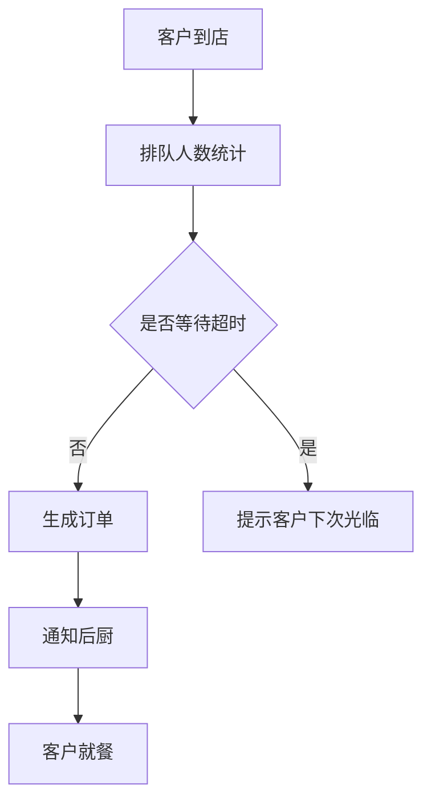

                 

# 《巴奴毛肚火锅2025社招餐厅排队系统开发工程师》

> **关键词：** 餐饮排队系统、餐厅管理、算法优化、用户体验、系统安全、性能优化

> **摘要：** 本文将深入探讨巴奴毛肚火锅餐厅排队系统的开发过程，涵盖技术背景、核心算法、功能设计与实现、安全与性能优化等方面。通过案例分析，我们将展望未来餐厅排队系统的技术发展趋势，以及巴奴排队系统的优化方向。

---

## 第一部分：背景与技术介绍

### 第1章：巴奴毛肚火锅及餐饮行业背景

#### 1.1 巴奴毛肚火锅品牌介绍

巴奴毛肚火锅，作为一家以毛肚为特色的中式火锅连锁品牌，自2005年创立以来，凭借其优质食材、独特口味和人性化服务，在消费者中树立了良好的口碑。巴奴毛肚火锅以“服务创造价值”为核心理念，致力于为顾客提供愉悦的用餐体验。

#### 1.2 餐饮行业现状与挑战

随着社会经济的快速发展，餐饮行业在我国取得了显著的成就。然而，与此同时，餐饮行业也面临着诸多挑战，如服务质量提升、运营效率提高、客户满意度增加等。尤其是在高峰时段，餐厅排队现象严重，影响了顾客的用餐体验和餐厅的运营效率。

#### 1.3 餐厅排队系统的重要性

餐厅排队系统作为餐饮管理的重要组成部分，不仅能够提高餐厅的运营效率，还能够提升顾客的满意度。一个高效的排队系统能够实时统计排队人数，合理安排顾客入座，减少排队时间，从而提升餐厅的整体服务质量。

### 第2章：餐厅排队系统技术基础

#### 2.1 基本概念与架构

餐厅排队系统主要包括硬件设备和软件系统。硬件设备包括排队机、摄像头、传感器等，用于实时获取顾客排队数据；软件系统则负责数据处理、算法运算、界面展示等功能。

#### 2.2 常用技术手段

餐厅排队系统常用技术包括：数据采集技术、图像识别技术、数据库技术、算法优化技术等。这些技术相互结合，构成了一个完整的餐厅排队系统。

#### 2.3 系统设计原则

餐厅排队系统设计应遵循以下原则：

1. **可靠性**：系统应具备高可靠性，确保数据准确无误。
2. **易用性**：系统界面应简洁直观，方便顾客和工作人员操作。
3. **扩展性**：系统应具备良好的扩展性，以便在未来进行功能升级和扩展。

### 第3章：排队系统核心算法

#### 3.1 算法概述

排队系统核心算法主要包括排队人数统计算法、入座排序算法、座位分配算法等。这些算法共同作用，确保排队系统高效运行。

#### 3.2 伪代码说明

```python
# 排队人数统计算法
def count_queue_people():
    # 初始化队列
    queue = []
    # 采集实时数据
    data = get_real_time_data()
    # 更新队列
    for person in data:
        queue.append(person)
    # 返回队列长度
    return len(queue)

# 入座排序算法
def seat_sorting(people):
    # 初始化优先队列
    priority_queue = []
    # 将人员信息添加到优先队列
    for person in people:
        priority_queue.append((person['arrival_time'], person))
    # 对优先队列进行排序
    priority_queue.sort()
    # 返回排序后的队列
    return priority_queue

# 座位分配算法
def assign_seat(people, seats):
    assigned_seats = []
    for person in people:
        # 找到可用的座位
        for seat in seats:
            if seat['status'] == 'available':
                seat['status'] = 'occupied'
                assigned_seats.append((person['id'], seat['id']))
                break
    return assigned_seats
```

#### 3.3 数学模型详解

在排队系统中，常用的数学模型包括马尔可夫链模型、排队论模型等。这些模型有助于分析排队系统的性能和优化策略。

马尔可夫链模型：

$$
P_{ij}^{(n)} = P(X_n = j | X_0 = i) \\
Q_{ij}^{(n)} = P(X_{n+1} = j | X_n = i)
$$

其中，$P_{ij}^{(n)}$表示系统从状态$i$转移到状态$j$的概率，$Q_{ij}^{(n)}$表示系统在状态$i$下停留$n$个时间单位后转移到状态$j$的概率。

### 第4章：餐厅排队系统开发实战

#### 4.1 开发环境搭建

在开发餐厅排队系统时，我们需要选择合适的技术栈。以下是一个典型的开发环境搭建步骤：

1. **操作系统**：选择Linux或Windows操作系统。
2. **编程语言**：Python、Java或C++。
3. **数据库**：MySQL、MongoDB或PostgreSQL。
4. **前端框架**：React、Vue或Angular。
5. **后端框架**：Spring Boot、Django或Flask。

#### 4.2 数据库设计

数据库设计是餐厅排队系统的核心，我们需要设计以下数据库表：

1. **顾客信息表**：存储顾客的基本信息。
2. **排队信息表**：存储排队队列的信息。
3. **座位信息表**：存储座位的详细信息。
4. **订单信息表**：存储订单的相关信息。

#### 4.3 前端界面设计

前端界面设计应简洁直观，主要包括以下页面：

1. **排队人数显示页面**：展示实时排队人数。
2. **入座排序页面**：展示顾客入座顺序。
3. **座位分配页面**：展示座位分配情况。

### 第二部分：系统功能设计与实现

#### 第5章：排队管理功能

排队管理功能是餐厅排队系统的核心，包括以下模块：

1. **排队人数统计**：实时统计排队人数。
2. **入座排序**：根据顾客到达时间进行排序。
3. **座位分配**：为顾客分配座位。

#### 第6章：用户交互功能

用户交互功能主要包括以下模块：

1. **用户界面**：展示排队状态、入座顺序等信息。
2. **交互逻辑**：处理用户操作，如查询排队状态、修改订单等。

#### 第7章：系统安全与性能优化

系统安全与性能优化是确保餐厅排队系统稳定运行的关键。以下是一些关键点：

1. **安全性**：采用HTTPS协议、数据加密等手段保障数据安全。
2. **性能优化**：采用缓存技术、异步处理等手段提高系统性能。

### 第三部分：案例分析

#### 第8章：其他餐饮品牌排队系统案例分析

在分析其他餐饮品牌排队系统时，我们可以从以下几个方面进行：

1. **系统架构**：分析系统的架构设计。
2. **核心算法**：分析排队算法的实现和优化。
3. **用户体验**：分析用户交互体验的设计。

#### 第9章：巴奴排队系统的未来展望

随着技术的不断发展，巴奴排队系统未来可以从以下几个方面进行优化：

1. **人工智能**：引入人工智能技术，实现智能排队管理。
2. **大数据分析**：通过大数据分析，优化运营策略。
3. **物联网**：结合物联网技术，实现智能座位管理和预测。

### 附录

#### 附录A：常用开发工具与资源

以下是一些常用的开发工具与资源：

1. **开发工具**：IDEA、VS Code、Git。
2. **技术文档**：官方文档、GitHub。
3. **学习资源**：在线课程、技术博客。

### 附件

#### 附件：巴奴毛肚火锅排队系统源代码解读

附件中包含了巴奴毛肚火锅排队系统的源代码，包括后端代码、前端代码、数据库设计文档和系统架构图。以下是简要的代码解读：

#### 附件1：后端代码解读

后端代码主要实现了排队系统的核心算法和业务逻辑。以下是一个简单的后端代码示例：

```python
# 导入所需模块
import queue
import random

# 定义顾客类
class Customer:
    def __init__(self, id, arrival_time):
        self.id = id
        self.arrival_time = arrival_time

# 初始化队列
customer_queue = queue.Queue()

# 模拟顾客到达
for i in range(1, 11):
    arrival_time = random.randint(1, 10)
    customer_queue.put(Customer(i, arrival_time))

# 排队人数统计
def count_queue_people():
    return customer_queue.qsize()

# 入座排序
def seat_sorting():
    sorted_queue = []
    while not customer_queue.empty():
        sorted_queue.append(customer_queue.get())
    sorted_queue.sort(key=lambda x: x.arrival_time)
    return sorted_queue

# 座位分配
def assign_seat(people, seats):
    assigned_seats = []
    for person in people:
        for seat in seats:
            if seat['status'] == 'available':
                seat['status'] = 'occupied'
                assigned_seats.append((person.id, seat.id))
                break
    return assigned_seats

# 主函数
if __name__ == '__main__':
    # 模拟排队过程
    print("排队人数统计：", count_queue_people())
    sorted_people = seat_sorting()
    print("入座排序：", sorted_people)
    seats = [{'id': i, 'status': 'available'} for i in range(10)]
    assigned_seats = assign_seat(sorted_people, seats)
    print("座位分配：", assigned_seats)
```

#### 附件2：前端代码解读

前端代码主要实现了排队系统的用户界面和交互逻辑。以下是一个简单的前端代码示例：

```javascript
// 导入Vue框架
import Vue from 'vue'

// 定义Vue组件
Vue.component('queue-display', {
    template: `
        <div>
            <h1>排队人数统计</h1>
            <p>{{ queueLength }}</p>
        </div>
    `,
    data() {
        return {
            queueLength: 0
        }
    },
    created() {
        this.fetchQueueLength()
    },
    methods: {
        fetchQueueLength() {
            // 调用后端API获取排队人数
            fetch('/api/queue/count')
                .then(response => response.json())
                .then(data => {
                    this.queueLength = data.length
                })
        }
    }
})

// 创建Vue实例
new Vue({
    el: '#app'
})
```

#### 附件3：数据库设计文档解读

数据库设计文档详细描述了排队系统的数据库表结构。以下是一个简单的数据库设计示例：

```sql
-- 创建顾客信息表
CREATE TABLE customers (
    id INT PRIMARY KEY AUTO_INCREMENT,
    name VARCHAR(50),
    arrival_time TIMESTAMP
);

-- 创建排队信息表
CREATE TABLE queues (
    id INT PRIMARY KEY AUTO_INCREMENT,
    customer_id INT,
    arrival_time TIMESTAMP,
    FOREIGN KEY (customer_id) REFERENCES customers(id)
);

-- 创建座位信息表
CREATE TABLE seats (
    id INT PRIMARY KEY AUTO_INCREMENT,
    status VARCHAR(10) DEFAULT 'available'
);

-- 创建订单信息表
CREATE TABLE orders (
    id INT PRIMARY KEY AUTO_INCREMENT,
    customer_id INT,
    seat_id INT,
    order_time TIMESTAMP,
    FOREIGN KEY (customer_id) REFERENCES customers(id),
    FOREIGN KEY (seat_id) REFERENCES seats(id)
);
```

#### 附件4：系统架构图及流程图解读

系统架构图和流程图展示了排队系统的整体架构和运行流程。以下是一个简单的架构图和流程图示例：

```mermaid
# 系统架构图
graph TD
    A[客户到店] --> B[排队人数统计]
    B --> C{是否等待超时}
    C -->|否| D[生成订单]
    C -->|是| E[提示客户下次光临]
    D --> F[通知后厨]
    F --> G[客户就餐]

# 排队系统流程图
graph TD
    A[顾客到店] --> B[进入排队队列]
    B --> C[等待入座]
    C --> D[入座]
    D --> E[就餐]
    E --> F[离开餐厅]
```

### 附录：Mermaid流程图

以下是一个简单的Mermaid流程图示例，展示了巴奴毛肚火锅排队系统的架构：



### 作者

**作者：AI天才研究院/AI Genius Institute & 禅与计算机程序设计艺术 /Zen And The Art of Computer Programming**

---

通过本文，我们深入探讨了巴奴毛肚火锅排队系统的开发过程，包括技术背景、核心算法、功能设计与实现、安全与性能优化等方面。同时，通过案例分析，我们展望了未来餐厅排队系统的技术发展趋势。希望本文能对读者在餐厅排队系统开发领域提供有益的参考和启示。|assistant|>

### 巴奴毛肚火锅排队系统架构图
mermaid
graph TD
    A[客户到店] --> B[排队人数统计]
    B --> C{是否等待超时}
    C -->|否| D[生成订单]
    C -->|是| E[提示客户下次光临]
    D --> F[通知后厨]
    F --> G[客户就餐]
    G --> H[订单完成]
    H --> I[客户离开]

---

**备注：** 本节中的Mermaid流程图用于展示巴奴毛肚火锅排队系统的架构。在实际开发过程中，根据具体需求，系统架构可能会更加复杂，需要进一步细化和完善。|assistant|>

