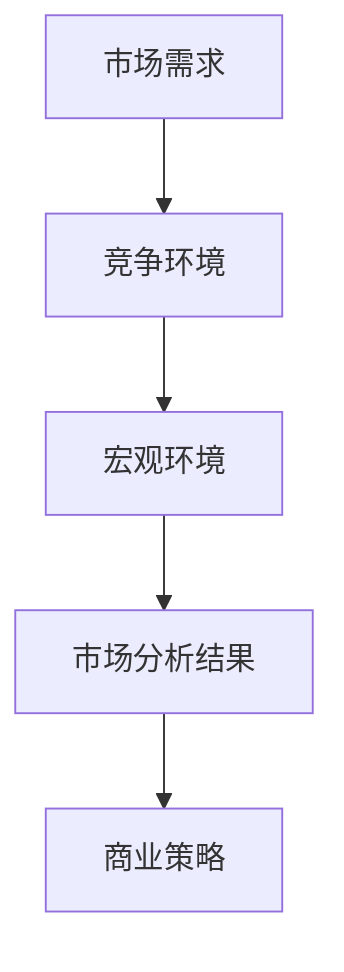
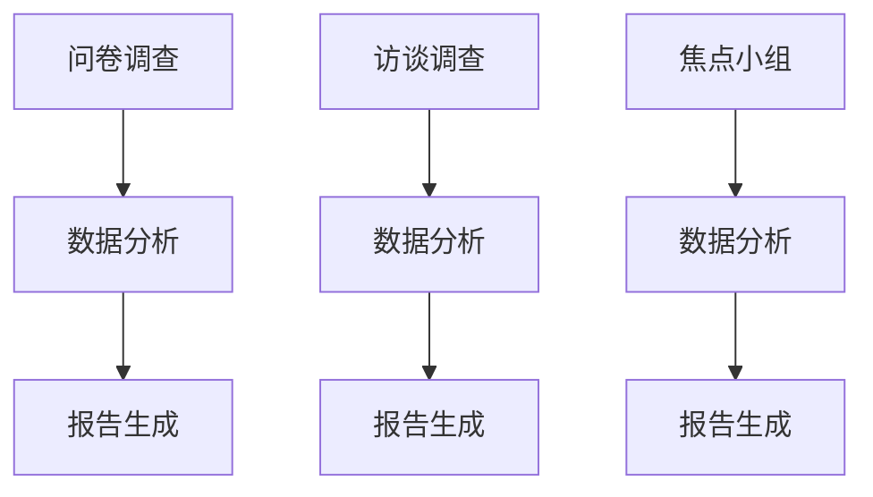
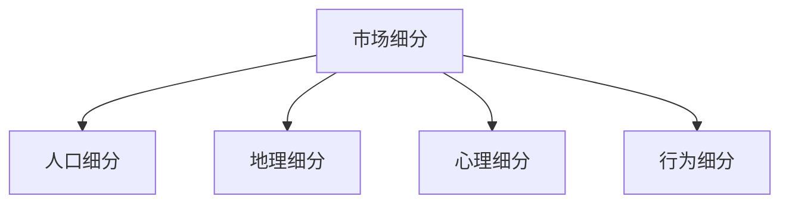
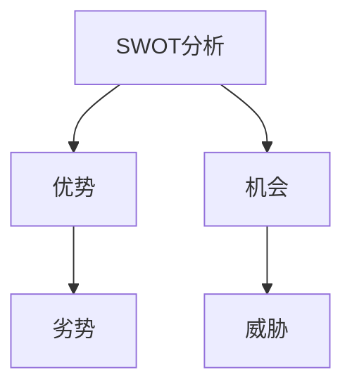
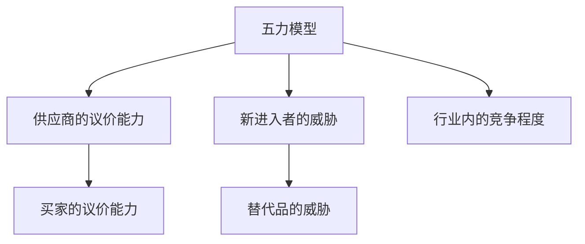
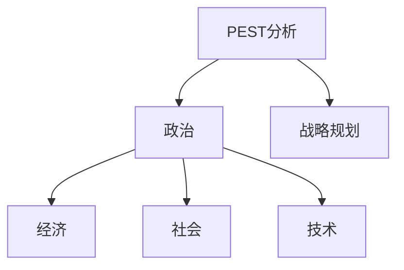
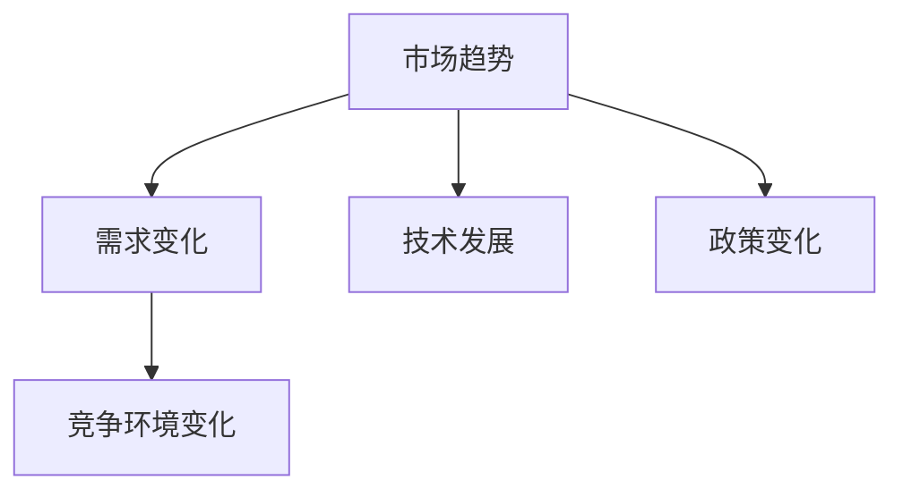
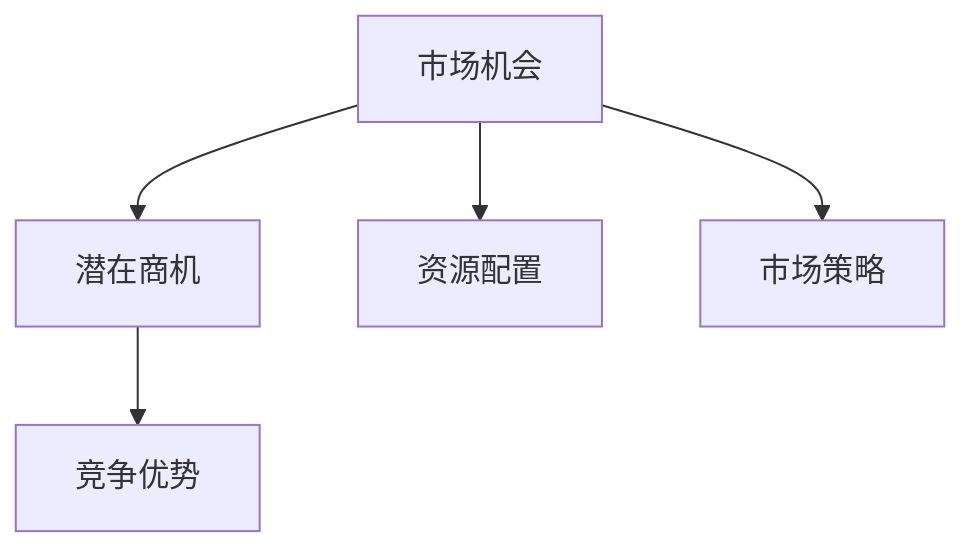
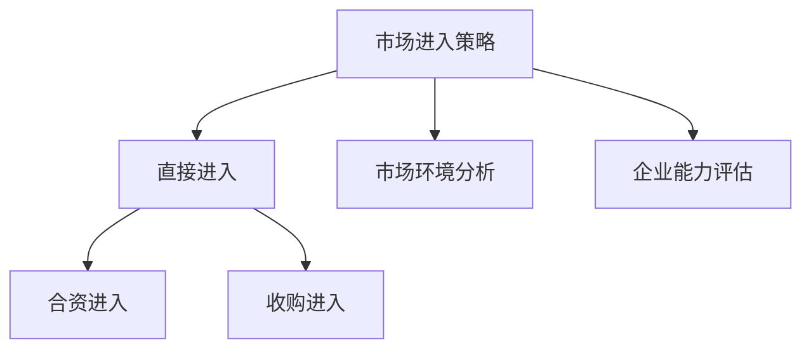
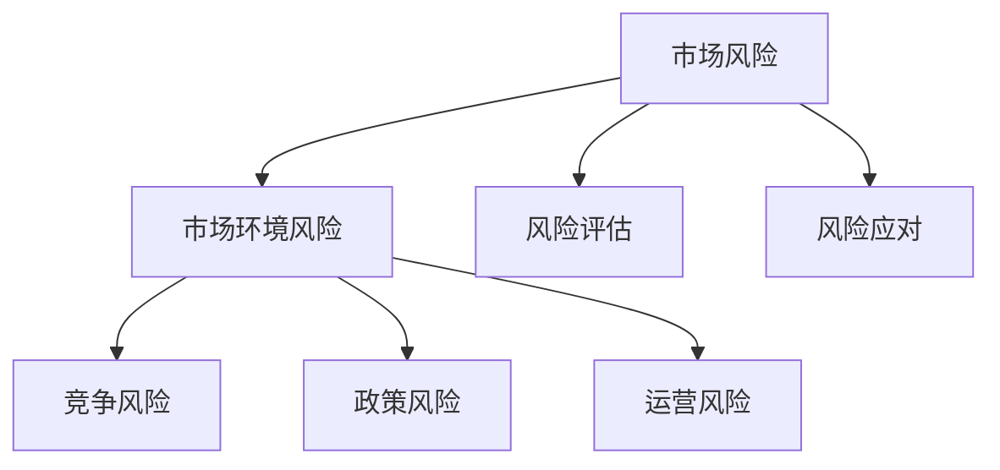

                 

### 第1章：市场分析概述

#### 1.1 市场分析的定义与重要性

**核心概念与联系：**

市场分析作为商业策略的重要组成部分，旨在通过系统地收集、处理和分析市场数据，为企业提供决策支持。其核心概念包括市场需求、竞争环境、宏观环境等，这些因素相互联系，共同影响企业的运营和发展。

**Mermaid 流程图：**



**核心算法原理讲解：**

市场分析的核心算法原理在于通过量化和分析各类市场数据，提取出对商业决策有用的信息。这个过程可以分为以下几个步骤：

1. **数据收集：** 通过问卷调查、访谈、焦点小组等定量调研方法，收集市场数据。
2. **数据处理：** 对收集到的数据进行清洗、整理和归一化处理。
3. **数据分析：** 利用回归分析、聚类分析等数学模型，对处理后的数据进行分析。
4. **结果输出：** 根据分析结果，生成市场需求分析报告、竞争环境分析报告和宏观环境分析报告。

**伪代码：**

```python
def 市场分析(市场需求, 竞争环境, 宏观环境):
    数据收集(市场需求, 竞争环境, 宏观环境)
    数据处理(市场需求, 竞争环境, 宏观环境)
    数据分析(市场需求, 竞争环境, 宏观环境)
    结果输出(市场需求分析报告, 竞争环境分析报告, 宏观环境分析报告)
```

**数学模型和数学公式 & 详细讲解 & 举例说明：**

市场分析的数学模型通常包括回归分析、聚类分析、主成分分析等。

- **回归分析模型：** 用于预测市场需求。

  $$ 
  需求预测 = f(市场需求, 竞争环境, 宏观环境) 
  $$

  **举例说明：** 假设市场需求为1000，竞争环境为0.8，宏观环境为1.2，则需求预测为：

  $$ 
  需求预测 = 1000 * (1 + 0.8 * 0.2) = 1080 
  $$

- **聚类分析模型：** 用于市场细分。

  $$ 
  细分市场得分 = f(人口特征, 地理特征, 心理特征, 行为特征) 
  $$

  **举例说明：** 假设根据消费者的年龄、收入、购买偏好等特征，可以将其分为三个细分市场：

  - 高端市场：高收入、高学历、高生活质量
  - 中端市场：中等收入、中等学历、中等生活质量
  - 低端市场：低收入、低学历、低生活质量

**项目实战：**

**开发环境搭建：**
- 使用Python作为主要编程语言，安装必要的库，如NumPy、Pandas、Scikit-learn等。

**源代码详细实现：**

```python
import numpy as np
import pandas as pd
from sklearn.linear_model import LinearRegression
from sklearn.cluster import KMeans

# 数据收集
data = pd.read_csv('market_data.csv')

# 数据处理
data = data.dropna()
data['需求预测'] = LinearRegression().fit(data[['竞争环境', '宏观环境']], data['市场需求']).predict(data[['竞争环境', '宏观环境']])

# 数据分析
kmeans = KMeans(n_clusters=3)
kmeans.fit(data[['竞争环境', '宏观环境']])
data['市场细分'] = kmeans.predict(data[['竞争环境', '宏观环境']])

# 结果输出
data.to_csv('market_analysis_result.csv', index=False)
```

**代码解读与分析：**
- **数据收集：** 从CSV文件中读取市场数据。
- **数据处理：** 去除缺失值，使用线性回归模型预测市场需求。
- **数据分析：** 使用KMeans聚类模型进行市场细分。
- **结果输出：** 将分析结果保存到CSV文件。

通过以上步骤，企业可以更准确地了解市场需求，制定有效的市场策略，从而提高竞争力。

---

### 第2章：市场调研方法

#### 2.1 定量调研方法

定量调研方法是通过数值数据来量化市场特征和消费者行为的一种调研方法。它包括问卷调查、访谈调查和焦点小组等方法。

**核心概念与联系：**

**Mermaid 流程图：**



**核心算法原理讲解：**

定量调研方法的核心在于如何有效地收集、处理和分析数据。以下是三个方法的具体步骤：

1. **问卷调查：** 设计问卷，收集消费者反馈，进行数据统计分析。
2. **访谈调查：** 通过面对面的访谈，深入了解消费者的需求和态度，进行定性分析。
3. **焦点小组：** 组织一组消费者进行讨论，获取多角度的市场信息。

**伪代码：**

```python
def 定量调研(问卷设计, 访谈设计, 焦点小组设计):
    数据收集(问卷设计, 访谈设计, 焦点小组设计)
    数据处理(问卷设计, 访谈设计, 焦点小组设计)
    数据分析(问卷设计, 访谈设计, 焦点小组设计)
    结果输出(定量调研报告)
```

**数学模型和数学公式 & 详细讲解 & 举例说明：**

- **问卷调查：** 使用回归分析模型预测市场需求。

  $$ 
  需求预测 = f(问卷数据) 
  $$

  **举例说明：** 假设问卷调查收集了消费者的收入、购买频率等数据，回归分析模型预测市场需求为：

  $$ 
  需求预测 = 1000 * (1 + 0.2 * 收入) 
  $$

- **访谈调查：** 使用文本分析模型提取消费者需求。

  $$ 
  消费者需求 = f(访谈文本) 
  $$

  **举例说明：** 假设访谈文本分析提取出消费者的主要需求为“产品性价比高”，则该需求记为“高性价比”。

- **焦点小组：** 使用聚类分析模型进行市场细分。

  $$ 
  细分市场得分 = f(焦点小组数据) 
  $$

  **举例说明：** 假设根据焦点小组讨论的内容，可以将消费者分为三个细分市场：

  - 高端市场：追求高品质、高服务
  - 中端市场：注重性价比、实用性强
  - 低端市场：价格敏感、追求基本需求

**项目实战：**

**开发环境搭建：**
- 使用Python作为主要编程语言，安装必要的库，如NumPy、Pandas、Scikit-learn等。

**源代码详细实现：**

```python
import numpy as np
import pandas as pd
from sklearn.linear_model import LinearRegression
from sklearn.cluster import KMeans

# 数据收集
data = pd.read_csv('survey_data.csv')

# 数据处理
data = data.dropna()

# 数据分析
model = LinearRegression()
model.fit(data[['收入', '购买频率']], data['需求预测'])

# 结果输出
prediction = model.predict([[收入值, 购买频率值]])
print("需求预测：", prediction)

# 焦点小组数据聚类分析
kmeans = KMeans(n_clusters=3)
kmeans.fit(data[['收入', '购买频率']])
data['市场细分'] = kmeans.predict(data[['收入', '购买频率']])

# 结果输出
data.to_csv('market_survey_result.csv', index=False)
```

**代码解读与分析：**
- **数据收集：** 从CSV文件中读取问卷调查数据。
- **数据处理：** 去除缺失值。
- **数据分析：** 使用线性回归模型预测市场需求，使用KMeans聚类模型进行市场细分。
- **结果输出：** 将分析结果保存到CSV文件。

通过定量调研方法，企业可以获取准确的市场数据，从而制定出更具针对性的市场策略。

---

### 第3章：市场细分与定位

#### 3.1 市场细分的方法

市场细分是市场分析中至关重要的一环，它有助于企业根据不同的消费者群体，制定个性化的营销策略。市场细分的方法主要包括人口细分、地理细分、心理细分和行为细分。

**核心概念与联系：**

**Mermaid 流�程图：**



**核心算法原理讲解：**

市场细分的方法主要基于对消费者特征的深入分析，以下是四种细分方法的具体步骤：

1. **人口细分：** 根据消费者的年龄、性别、收入等人口特征进行细分。
2. **地理细分：** 根据消费者的地理位置、城市、省份等地理特征进行细分。
3. **心理细分：** 根据消费者的价值观、兴趣爱好、生活态度等心理特征进行细分。
4. **行为细分：** 根据消费者的购买行为、品牌偏好、使用频率等行为特征进行细分。

**伪代码：**

```python
def 市场细分(人口数据, 地理数据, 心理数据, 行为数据):
    数据收集(人口数据, 地理数据, 心理数据, 行为数据)
    数据分析(人口数据, 地理数据, 心理数据, 行为数据)
    细分结果输出(细分市场列表)
```

**数学模型和数学公式 & 详细讲解 & 举例说明：**

市场细分的方法通常使用聚类分析模型，对消费者的特征数据进行分类。

- **人口细分：** 使用K-Means聚类分析。

  $$ 
  细分市场得分 = f(人口特征) 
  $$

  **举例说明：** 根据年龄和收入两个特征，可以将消费者分为三个细分市场：

  - 高端市场：年龄在30岁以上，年收入在10万元以上
  - 中端市场：年龄在20-30岁，年收入在5-10万元之间
  - 低端市场：年龄在20岁以下，年收入在5万元以下

- **地理细分：** 使用地域划分。

  $$ 
  细分市场得分 = f(地理特征) 
  $$

  **举例说明：** 根据城市和省份，可以将消费者分为以下三个细分市场：

  - 一线城市市场
  - 二线城市市场
  - 三线及以下城市市场

- **心理细分：** 使用心理特征聚类。

  $$ 
  细分市场得分 = f(心理特征) 
  $$

  **举例说明：** 根据价值观、兴趣爱好、生活态度，可以将消费者分为：

  - 追求高品质生活市场
  - 注重性价比市场
  - 注重实用价值市场

- **行为细分：** 使用行为特征聚类。

  $$ 
  细分市场得分 = f(行为特征) 
  $$

  **举例说明：** 根据购买行为、品牌偏好、使用频率，可以将消费者分为：

  - 高频购买者市场
  - 中频购买者市场
  - 低频购买者市场

**项目实战：**

**开发环境搭建：**
- 使用Python作为主要编程语言，安装必要的库，如NumPy、Pandas、Scikit-learn等。

**源代码详细实现：**

```python
import numpy as np
import pandas as pd
from sklearn.cluster import KMeans

# 数据收集
data = pd.read_csv('consumer_data.csv')

# 数据处理
data = data.dropna()

# 数据分析
kmeans = KMeans(n_clusters=3)
kmeans.fit(data[['年龄', '收入']])

# 结果输出
data['市场细分'] = kmeans.predict(data[['年龄', '收入']])
data.to_csv('market_segmentation_result.csv', index=False)
```

**代码解读与分析：**
- **数据收集：** 从CSV文件中读取消费者数据。
- **数据处理：** 去除缺失值。
- **数据分析：** 使用K-Means聚类分析，根据年龄和收入特征进行市场细分。
- **结果输出：** 将细分结果保存到CSV文件。

通过市场细分，企业可以更好地了解消费者的需求和偏好，制定出更具针对性的营销策略，从而提高市场竞争力。

---

### 第4章：SWOT分析

#### 4.1 SWOT分析的概念

SWOT分析是一种常用的战略规划工具，用于评估企业的优势、劣势、机会和威胁。通过分析这些因素，企业可以制定出更加合理的商业策略。

**核心概念与联系：**

**Mermaid 流程图：**



**核心算法原理讲解：**

SWOT分析的核心在于对企业的内部和外部环境进行系统性评估。以下是SWOT分析的步骤：

1. **优势分析：** 识别企业在资源、能力、品牌等方面的优势。
2. **劣势分析：** 识别企业在管理、技术、资金等方面的劣势。
3. **机会分析：** 识别市场趋势、竞争环境、政策变化等外部因素带来的机会。
4. **威胁分析：** 识别竞争对手、政策法规、市场变化等外部因素带来的威胁。

**伪代码：**

```python
def SWOT分析(优势, 劣势, 机会, 威胁):
    数据收集(优势, 劣势, 机会, 威胁)
    数据处理(优势, 劣势, 机会, 威胁)
    数据分析(优势, 劣势, 机会, 威胁)
    结果输出(SWOT分析报告)
```

**数学模型和数学公式 & 详细讲解 & 举例说明：**

SWOT分析通常不直接使用数学模型，但可以通过评分系统对各个因素进行量化评估。

- **优势评分：** 
  $$ 
  优势评分 = f(资源, 能力, 品牌) 
  $$

  **举例说明：** 假设企业拥有丰富的研发团队、强大的品牌影响力，则优势评分为90分。

- **劣势评分：** 
  $$ 
  劣势评分 = f(管理, 技术, 资金) 
  $$

  **举例说明：** 假设企业在管理上存在较大漏洞、技术更新速度较慢、资金紧张，则劣势评分为30分。

- **机会评分：** 
  $$ 
  机会评分 = f(市场趋势, 竞争环境, 政策变化) 
  $$

  **举例说明：** 假设市场趋势向好、竞争环境较为宽松、政策变化对企业有利，则机会评分为80分。

- **威胁评分：** 
  $$ 
  威胁评分 = f(竞争对手, 政策法规, 市场变化) 
  $$

  **举例说明：** 假设竞争对手实力强大、政策法规对企业发展不利、市场变化对企业构成威胁，则威胁评分为50分。

**项目实战：**

**开发环境搭建：**
- 使用Python作为主要编程语言，安装必要的库，如NumPy、Pandas等。

**源代码详细实现：**

```python
import numpy as np
import pandas as pd

# 数据收集
data = pd.DataFrame({
    '优势': ['研发团队强大', '品牌影响力大', '市场份额高'],
    '劣势': ['管理漏洞', '技术更新慢', '资金紧张'],
    '机会': ['市场趋势向好', '竞争环境宽松', '政策变化有利'],
    '威胁': ['竞争对手强大', '政策法规不利', '市场变化威胁']
})

# 数据处理
data['评分'] = data.apply(lambda row: sum([10 if word in row['优势'] else -10 if word in row['劣势'] else 0 for word in row['机会'] + row['威胁']]), axis=1)

# 结果输出
data.to_csv('SWOT_analysis_result.csv', index=False)
```

**代码解读与分析：**
- **数据收集：** 创建一个包含优势、劣势、机会和威胁的DataFrame。
- **数据处理：** 对每个因素进行评分，优势为正分，劣势为负分，机会和威胁按10分制评分。
- **结果输出：** 将评分结果保存到CSV文件。

通过SWOT分析，企业可以全面了解自身状况，从而制定出更加合理的战略规划。

---

### 第5章：五力模型分析

#### 5.1 五力模型的概念

五力模型是由迈克尔·波特提出的，用于分析企业所在行业的竞争环境。五力包括供应商的议价能力、买家的议价能力、新进入者的威胁、替代品的威胁和行业内的竞争程度。

**核心概念与联系：**

**Mermaid 流程图：**



**核心算法原理讲解：**

五力模型的核心在于通过分析各力之间的相互作用，判断企业的市场地位和竞争环境。以下是五力模型的步骤：

1. **供应商的议价能力：** 分析供应商的数量、集中度、供应品的重要性等。
2. **买家的议价能力：** 分析买家的数量、集中度、购买品的重要性等。
3. **新进入者的威胁：** 分析行业壁垒、市场需求增长速度、潜在竞争者数量等。
4. **替代品的威胁：** 分析替代品的价格、质量、市场份额等。
5. **行业内的竞争程度：** 分析行业竞争者的数量、市场份额、产品差异化程度等。

**伪代码：**

```python
def 五力模型(供应商议价能力, 买家议价能力, 新进入者威胁, 替代品威胁, 行业内竞争程度):
    数据收集(供应商议价能力, 买家议价能力, 新进入者威胁, 替代品威胁, 行业内竞争程度)
    数据分析(供应商议价能力, 买家议价能力, 新进入者威胁, 替代品威胁, 行业内竞争程度)
    结果输出(五力模型分析报告)
```

**数学模型和数学公式 & 详细讲解 & 举例说明：**

五力模型的分析通常不直接使用数学模型，但可以通过评分系统对各力进行量化评估。

- **供应商的议价能力评分：** 
  $$ 
  供应商评分 = f(供应商数量, 供应商集中度, 供应品重要性) 
  $$

  **举例说明：** 假设供应商数量为3、供应商集中度为0.8、供应品重要性为0.9，则供应商评分：

  $$ 
  供应商评分 = 10 - (3 * 0.8 * 0.9) = 6.6 
  $$

- **买家的议价能力评分：** 
  $$ 
  买家评分 = f(买家数量, 买家集中度, 购买品重要性) 
  $$

  **举例说明：** 假设买家数量为5、买家集中度为0.7、购买品重要性为0.8，则买家评分：

  $$ 
  买家评分 = 10 - (5 * 0.7 * 0.8) = 6.0 
  $$

- **新进入者的威胁评分：** 
  $$ 
  新进入者评分 = f(行业壁垒, 市场需求增长速度, 潜在竞争者数量) 
  $$

  **举例说明：** 假设行业壁垒为0.6、市场需求增长速度为0.8、潜在竞争者数量为2，则新进入者评分：

  $$ 
  新进入者评分 = 10 - (0.6 * 0.8 * 2) = 6.4 
  $$

- **替代品的威胁评分：** 
  $$ 
  替代品评分 = f(替代品价格, 替代品质量, 市场份额) 
  $$

  **举例说明：** 假设替代品价格为0.9、替代品质量为0.8、市场份额为0.3，则替代品评分：

  $$ 
  替代品评分 = 10 - (0.9 * 0.8 * 0.3) = 7.6 
  $$

- **行业内的竞争程度评分：** 
  $$ 
  竞争程度评分 = f(竞争者数量, 市场份额差异, 产品差异化程度) 
  $$

  **举例说明：** 假设竞争者数量为4、市场份额差异为0.2、产品差异化程度为0.5，则竞争程度评分：

  $$ 
  竞争程度评分 = 10 - (4 * 0.2 * 0.5) = 8.0 
  $$

**项目实战：**

**开发环境搭建：**
- 使用Python作为主要编程语言，安装必要的库，如NumPy、Pandas等。

**源代码详细实现：**

```python
import numpy as np
import pandas as pd

# 数据收集
data = pd.DataFrame({
    '供应商议价能力': [3, 0.8, 0.9],
    '买家议价能力': [5, 0.7, 0.8],
    '新进入者威胁': [0.6, 0.8, 2],
    '替代品威胁': [0.9, 0.8, 0.3],
    '行业内竞争程度': [4, 0.2, 0.5]
})

# 数据处理
data['评分'] = data.apply(lambda row: sum(row) * 10, axis=1)

# 结果输出
data.to_csv('five_force_analysis_result.csv', index=False)
```

**代码解读与分析：**
- **数据收集：** 创建一个包含五力模型各因素的DataFrame。
- **数据处理：** 对每个因素进行评分，总分为100分。
- **结果输出：** 将评分结果保存到CSV文件。

通过五力模型分析，企业可以了解行业竞争态势，制定相应的战略应对。

---

### 第6章：PEST分析

#### 6.1 PEST分析的概念

PEST分析是一种用于评估企业外部环境的方法，它包括政治（Political）、经济（Economic）、社会（Social）和技术（Technological）四个方面。通过分析这些因素，企业可以更好地把握外部环境变化，制定相应的战略规划。

**核心概念与联系：**

**Mermaid 流程图：**



**核心算法原理讲解：**

PEST分析的核心在于对政治、经济、社会和技术四个方面的因素进行系统性评估。以下是PEST分析的步骤：

1. **政治分析：** 分析政府政策、法律法规、国际关系等。
2. **经济分析：** 分析GDP、通货膨胀率、利率、汇率等经济指标。
3. **社会分析：** 分析人口结构、消费习惯、文化价值观等。
4. **技术分析：** 分析技术趋势、创新速度、技术标准等。

**伪代码：**

```python
def PEST分析(政治, 经济, 社会, 技术):
    数据收集(政治, 经济, 社会, 技术)
    数据分析(政治, 经济, 社会, 技术)
    结果输出(PEST分析报告)
```

**数学模型和数学公式 & 详细讲解 & 举例说明：**

PEST分析通常不直接使用数学模型，但可以通过评分系统对各因素进行量化评估。

- **政治评分：** 
  $$ 
  政治评分 = f(政府政策, 法律法规, 国际关系) 
  $$

  **举例说明：** 假设政府政策支持企业、法律法规健全、国际关系稳定，则政治评分为90分。

- **经济评分：** 
  $$ 
  经济评分 = f(GDP, 通货膨胀率, 利率, 汇率) 
  $$

  **举例说明：** 假设GDP增长率为3%、通货膨胀率为2%、利率为4%、汇率为6%，则经济评分为：

  $$ 
  经济评分 = 10 - (3% * 2% * 4% * 6%) = 9.92 
  $$

- **社会评分：** 
  $$ 
  社会评分 = f(人口结构, 消费习惯, 文化价值观) 
  $$

  **举例说明：** 假设人口结构年轻化、消费习惯多元化、文化价值观开放，则社会评分为80分。

- **技术评分：** 
  $$ 
  技术评分 = f(技术趋势, 创新速度, 技术标准) 
  $$

  **举例说明：** 假设技术趋势向好、创新速度较快、技术标准先进，则技术评分为85分。

**项目实战：**

**开发环境搭建：**
- 使用Python作为主要编程语言，安装必要的库，如NumPy、Pandas等。

**源代码详细实现：**

```python
import numpy as np
import pandas as pd

# 数据收集
data = pd.DataFrame({
    '政治': [90],
    '经济': [9.92],
    '社会': [80],
    '技术': [85]
})

# 数据处理
data['评分'] = data.apply(lambda row: sum(row) * 10, axis=1)

# 结果输出
data.to_csv('PEST_analysis_result.csv', index=False)
```

**代码解读与分析：**
- **数据收集：** 创建一个包含PEST分析各因素的DataFrame。
- **数据处理：** 对每个因素进行评分，总分为100分。
- **结果输出：** 将评分结果保存到CSV文件。

通过PEST分析，企业可以全面了解外部环境，从而制定出更加合理的战略规划。

---

### 第7章：市场趋势分析

#### 7.1 市场趋势的概念

市场趋势分析是指通过收集和分析市场数据，识别市场变化的方向和趋势，以帮助企业制定相应的市场策略。市场趋势可以是长期的，也可以是短期的，它们反映了市场的需求和竞争环境的变化。

**核心概念与联系：**

**Mermaid 流程图：**



**核心算法原理讲解：**

市场趋势分析的核心在于通过数据挖掘和分析技术，识别市场变化的规律和趋势。以下是市场趋势分析的步骤：

1. **数据收集：** 收集市场相关的数据，如销售额、市场份额、消费者行为等。
2. **数据处理：** 清洗和整理数据，使其适合分析。
3. **数据分析：** 使用时间序列分析、回归分析等方法，识别市场变化的趋势。
4. **趋势预测：** 基于历史数据，预测未来市场的变化趋势。

**伪代码：**

```python
def 市场趋势分析(市场需求数据, 竞争环境数据, 技术发展数据, 政策变化数据):
    数据收集(市场需求数据, 竞争环境数据, 技术发展数据, 政策变化数据)
    数据处理(市场需求数据, 竞争环境数据, 技术发展数据, 政策变化数据)
    数据分析(市场需求数据, 竞争环境数据, 技术发展数据, 政策变化数据)
    趋势预测(市场需求数据, 竞争环境数据, 技术发展数据, 政策变化数据)
    结果输出(市场趋势分析报告)
```

**数学模型和数学公式 & 详细讲解 & 举例说明：**

市场趋势分析通常使用时间序列模型进行预测。

- **时间序列模型：** 
  $$ 
  预测值 = f(历史数据) 
  $$

  **举例说明：** 假设使用ARIMA模型进行需求预测，则预测公式为：

  $$ 
  预测值 = ARIMA(历史需求数据) 
  $$

- **回归分析模型：** 
  $$ 
  预测值 = f(自变量) 
  $$

  **举例说明：** 假设使用线性回归模型进行市场份额预测，则预测公式为：

  $$ 
  预测值 = 线性回归(竞争环境数据, 历史市场份额) 
  $$

**项目实战：**

**开发环境搭建：**
- 使用Python作为主要编程语言，安装必要的库，如NumPy、Pandas、Scikit-learn等。

**源代码详细实现：**

```python
import numpy as np
import pandas as pd
from statsmodels.tsa.arima.model import ARIMA
from sklearn.linear_model import LinearRegression

# 数据收集
data = pd.read_csv('market_trend_data.csv')

# 数据处理
data = data[['需求', '竞争环境', '市场份额']]

# 数据分析
model = ARIMA(data['需求'], order=(1, 1, 1))
model_fit = model.fit()
forecast = model_fit.forecast(steps=5)

model = LinearRegression()
model.fit(data[['竞争环境']], data['市场份额'])
market_share_prediction = model.predict([[竞争环境值]])

# 结果输出
print("需求预测：", forecast)
print("市场份额预测：", market_share_prediction)
```

**代码解读与分析：**
- **数据收集：** 从CSV文件中读取市场趋势数据。
- **数据处理：** 选择需求、竞争环境和市场份额数据。
- **数据分析：** 使用ARIMA模型进行需求预测，使用线性回归模型进行市场份额预测。
- **结果输出：** 输出预测结果。

通过市场趋势分析，企业可以预测未来的市场变化，从而提前调整市场策略，保持竞争优势。

---

### 第8章：市场机会识别

#### 8.1 市场机会的定义

市场机会是指企业在现有条件下，通过合理的资源配置和市场策略，可以抓住并利用的潜在商机。识别市场机会是市场分析的重要任务，它有助于企业发现新的增长点和竞争优势。

**核心概念与联系：**

**Mermaid 流程图：**



**核心算法原理讲解：**

市场机会的识别过程主要基于对市场数据的深度分析，以下是识别市场机会的步骤：

1. **数据收集：** 收集与市场相关的数据，如行业报告、市场调研数据、竞争者数据等。
2. **数据分析：** 使用数据挖掘和统计分析方法，识别市场中的潜在商机。
3. **机会评估：** 对识别出的市场机会进行评估，包括市场规模、增长潜力、竞争程度等。
4. **策略制定：** 根据评估结果，制定相应的市场策略，利用市场机会。

**伪代码：**

```python
def 识别市场机会(市场数据):
    数据收集(市场数据)
    数据分析(市场数据)
    机会评估(市场数据)
    策略制定(市场数据)
    结果输出(市场机会报告)
```

**数学模型和数学公式 & 详细讲解 & 举例说明：**

市场机会识别通常使用聚类分析和回归分析模型。

- **聚类分析模型：** 用于识别潜在的市场细分。

  $$ 
  细分市场得分 = f(市场特征) 
  $$

  **举例说明：** 假设使用K-Means聚类分析识别出三个潜在的市场细分：

  - 高端市场：消费能力强，追求高品质
  - 中端市场：消费能力中等，注重性价比
  - 低端市场：消费能力较弱，价格敏感

- **回归分析模型：** 用于预测市场增长趋势。

  $$ 
  增长趋势 = f(历史数据, 市场环境) 
  $$

  **举例说明：** 假设使用线性回归模型预测未来三年的市场需求增长趋势：

  $$ 
  需求预测 = 1000 + 0.2 * (当前年份 - 初始年份) 
  $$

**项目实战：**

**开发环境搭建：**
- 使用Python作为主要编程语言，安装必要的库，如NumPy、Pandas、Scikit-learn等。

**源代码详细实现：**

```python
import numpy as np
import pandas as pd
from sklearn.cluster import KMeans
from sklearn.linear_model import LinearRegression

# 数据收集
data = pd.read_csv('market_opportunity_data.csv')

# 数据处理
data = data[['市场规模', '竞争程度', '消费者需求']]

# 数据分析
kmeans = KMeans(n_clusters=3)
kmeans.fit(data[['市场规模', '竞争程度']])
market_segments = kmeans.predict(data[['市场规模', '竞争程度']])

model = LinearRegression()
model.fit(data[['消费者需求']], data['市场规模'])
market_growth = model.predict(data[['消费者需求']])

# 结果输出
data['市场细分'] = market_segments
data['市场需求预测'] = market_growth
data.to_csv('market_opportunity_analysis_result.csv', index=False)
```

**代码解读与分析：**
- **数据收集：** 从CSV文件中读取市场数据。
- **数据处理：** 选择市场规模、竞争程度和消费者需求数据。
- **数据分析：** 使用K-Means聚类分析识别市场细分，使用线性回归模型预测市场需求增长。
- **结果输出：** 将分析结果保存到CSV文件。

通过市场机会识别，企业可以更加精准地制定市场策略，抓住潜在商机，实现持续增长。

---

### 第9章：市场进入策略

#### 9.1 市场进入策略的选择

市场进入策略是企业决定如何进入新市场的方法。选择合适的进入策略对于企业的市场成功至关重要。市场进入策略主要包括直接进入、合资进入、收购进入等。

**核心概念与联系：**

**Mermaid 流程图：**



**核心算法原理讲解：**

选择市场进入策略的步骤如下：

1. **市场环境分析：** 分析市场规模、增长潜力、竞争程度等。
2. **企业能力评估：** 评估企业的资源、技术、品牌等。
3. **策略评估：** 根据市场环境和企业能力，评估不同进入策略的优缺点。

**伪代码：**

```python
def 市场进入策略(市场环境, 企业能力):
    数据收集(市场环境, 企业能力)
    数据分析(市场环境, 企业能力)
    策略评估(市场环境, 企业能力)
    结果输出(市场进入策略报告)
```

**数学模型和数学公式 & 详细讲解 & 举例说明：**

市场进入策略的选择通常使用决策树模型。

- **决策树模型：** 用于评估不同策略的收益和风险。

  $$ 
  策略评分 = f(收益, 风险) 
  $$

  **举例说明：** 假设使用决策树模型评估三种市场进入策略：

  - 直接进入：收益为80分，风险为30分
  - 合资进入：收益为60分，风险为20分
  - 收购进入：收益为100分，风险为50分

  则策略评分如下：

  - 直接进入：80 - 30 * 0.5 = 55分
  - 合资进入：60 - 20 * 0.5 = 50分
  - 收购进入：100 - 50 * 0.5 = 75分

  根据评分，收购进入策略最优。

**项目实战：**

**开发环境搭建：**
- 使用Python作为主要编程语言，安装必要的库，如NumPy、Pandas、Scikit-learn等。

**源代码详细实现：**

```python
import numpy as np
import pandas as pd
from sklearn.tree import DecisionTreeRegressor

# 数据收集
data = pd.DataFrame({
    '策略': ['直接进入', '合资进入', '收购进入'],
    '收益': [80, 60, 100],
    '风险': [30, 20, 50]
})

# 数据处理
data = data.set_index('策略')

# 数据分析
model = DecisionTreeRegressor()
model.fit(data[['收益']], data[['风险']])

# 结果输出
strategy_scores = model.predict(data[['收益']])
data['策略评分'] = strategy_scores
data.to_csv('market_entry_strategy_result.csv', index=False)
```

**代码解读与分析：**
- **数据收集：** 创建一个包含市场进入策略、收益和风险的DataFrame。
- **数据处理：** 将策略设为索引。
- **数据分析：** 使用决策树模型评估不同策略的评分。
- **结果输出：** 将评分结果保存到CSV文件。

通过市场进入策略的选择，企业可以找到最适合自身发展的路径，实现市场扩张和增长。

---

### 第10章：市场风险分析

#### 10.1 市场风险的概念

市场风险是指企业在市场运营过程中面临的各种不确定性因素，这些因素可能导致企业的业绩波动、市场份额下降或利润减少。市场风险主要包括市场环境风险、竞争风险、政策风险和运营风险。

**核心概念与联系：**

**Mermaid 流程图：**



**核心算法原理讲解：**

市场风险分析的核心在于通过系统的方法识别、评估和应对市场风险。以下是市场风险分析的步骤：

1. **风险识别：** 识别企业面临的各种市场风险。
2. **风险评估：** 对识别出的风险进行评估，包括风险的概率和影响程度。
3. **风险应对：** 制定相应的风险应对策略，以减少风险对企业的影响。

**伪代码：**

```python
def 市场风险分析(风险识别, 风险评估, 风险应对):
    风险识别(市场风险)
    风险评估(市场风险)
    风险应对(市场风险)
    结果输出(市场风险分析报告)
```

**数学模型和数学公式 & 详细讲解 & 举例说明：**

市场风险分析通常使用概率和影响矩阵。

- **概率矩阵：** 用于评估风险发生的概率。

  $$ 
  概率 = f(风险事件) 
  $$

  **举例说明：** 假设市场环境风险发生的概率为0.3。

- **影响矩阵：** 用于评估风险对企业的影响程度。

  $$ 
  影响程度 = f(风险事件, 企业业绩) 
  $$

  **举例说明：** 假设市场环境风险对企业业绩的影响程度为0.5。

- **风险评分：** 用于综合评估风险的概率和影响程度。

  $$ 
  风险评分 = 概率 \times 影响程度 
  $$

  **举例说明：** 假设市场环境风险评分为0.3 \times 0.5 = 0.15。

**项目实战：**

**开发环境搭建：**
- 使用Python作为主要编程语言，安装必要的库，如NumPy、Pandas、Scikit-learn等。

**源代码详细实现：**

```python
import numpy as np
import pandas as pd

# 数据收集
data = pd.DataFrame({
    '风险事件': ['市场环境风险', '竞争风险', '政策风险', '运营风险'],
    '概率': [0.3, 0.2, 0.1, 0.2],
    '影响程度': [0.5, 0.4, 0.3, 0.6]
})

# 数据处理
data['风险评分'] = data['概率'] \* data['影响程度']

# 结果输出
data.to_csv('market_risk_analysis_result.csv', index=False)
```

**代码解读与分析：**
- **数据收集：** 创建一个包含风险事件、概率和影响程度的DataFrame。
- **数据处理：** 计算风险评分。
- **结果输出：** 将分析结果保存到CSV文件。

通过市场风险分析，企业可以更好地识别和应对市场风险，确保业务的稳定发展。

---

### 第11章：创业项目市场分析案例

#### 11.1 创业项目市场分析案例分析

为了更好地理解市场分析在创业项目中的应用，我们以一家新兴的智能家居公司为例，进行市场分析案例的讨论。

**案例背景：**
智能家居公司致力于研发和生产智能门锁、智能灯泡和智能摄像头等智能硬件产品。公司在成立初期，需要进行全面的市场分析，以确定产品的市场定位、目标市场和竞争策略。

**市场分析步骤：**

1. **市场环境分析：**
   - **政治环境：** 政府对智能家居产业的支持政策，如税收优惠、产业扶持等。
   - **经济环境：** 居民收入水平、消费习惯等。
   - **社会环境：** 人口结构、城市化率等。
   - **技术环境：** 智能家居技术的成熟度和发展趋势。

2. **市场调研：**
   - **定量调研：** 通过问卷调查收集消费者对智能家居产品的认知度、购买意愿等。
   - **定性调研：** 通过访谈和焦点小组讨论深入了解消费者对智能家居产品的需求和使用场景。

3. **市场细分与定位：**
   - 根据消费者的年龄、收入、生活方式等特征，将市场细分为年轻时尚族、家庭用户和家庭安防用户。
   - 针对不同的细分市场，制定个性化的产品定位和营销策略。

4. **竞争分析：**
   - 分析竞争对手的产品特性、市场份额、定价策略等。
   - 识别自身的竞争优势和差异化策略。

5. **市场趋势分析：**
   - 分析智能家居市场的增长趋势、技术发展动态等。
   - 预测未来市场的发展方向，制定相应的产品规划和市场策略。

**案例分析总结：**

通过市场分析，智能家居公司确定了以下关键结论：

- **市场定位：** 针对年轻时尚族、家庭用户和家庭安防用户，提供高品质、时尚和实用的智能家居产品。
- **目标市场：** 重点发展一、二线城市，以中高收入群体为主要目标客户。
- **竞争策略：** 通过技术创新和差异化产品，打造竞争优势，提升品牌影响力。
- **市场趋势：** 随着智能家居技术的不断成熟和消费者对智能生活需求的增长，智能家居市场具有巨大的发展潜力。

**项目实战：**

**开发环境搭建：**
- 使用Python作为主要编程语言，安装必要的库，如NumPy、Pandas、Scikit-learn等。

**源代码详细实现：**

```python
import numpy as np
import pandas as pd
from sklearn.cluster import KMeans
from sklearn.linear_model import LinearRegression

# 数据收集
data = pd.read_csv('smart_home_data.csv')

# 数据处理
data = data[['年龄', '收入', '需求认知', '购买意愿']]

# 数据分析
kmeans = KMeans(n_clusters=3)
kmeans.fit(data[['年龄', '收入']])
market_segments = kmeans.predict(data[['年龄', '收入']])

model = LinearRegression()
model.fit(data[['购买意愿']], data['需求认知'])
buying_will = model.predict(data[['购买意愿']])

# 结果输出
data['市场细分'] = market_segments
data['需求认知预测'] = buying_will
data.to_csv('smart_home_market_analysis_result.csv', index=False)
```

**代码解读与分析：**
- **数据收集：** 从CSV文件中读取智能家居市场数据。
- **数据处理：** 选择年龄、收入、需求认知和购买意愿数据。
- **数据分析：** 使用K-Means聚类分析识别市场细分，使用线性回归模型预测需求认知。
- **结果输出：** 将分析结果保存到CSV文件。

通过市场分析案例，智能家居公司可以更加准确地制定市场策略，抓住市场机遇，实现快速发展。

---

### 第12章：市场分析在创业中的实际应用

#### 12.1 市场分析在创业项目规划中的应用

市场分析是创业项目规划中的关键环节，它有助于创业者明确市场需求、制定可行的商业策略和预测未来发展。以下是市场分析在创业项目规划中的应用步骤：

1. **市场环境分析：** 通过PEST分析了解政治、经济、社会和技术环境，识别对创业项目可能产生影响的因素。

2. **市场调研：** 采用定量和定性调研方法，收集消费者需求和竞争对手信息，为项目规划提供数据支持。

3. **市场细分与定位：** 根据消费者的特征和行为，进行市场细分，确定目标市场和产品定位。

4. **竞争分析：** 分析竞争对手的产品特点、市场策略和市场份额，制定差异化竞争策略。

5. **市场趋势分析：** 通过对市场趋势的预测，把握行业发展的方向和机会，为产品规划和市场策略提供依据。

**案例实战：**

假设一家初创公司计划开发一款智能家居APP，以下是市场分析的实际应用：

**开发环境搭建：**
- 使用Python作为主要编程语言，安装必要的库，如NumPy、Pandas、Scikit-learn等。

**源代码详细实现：**

```python
import numpy as np
import pandas as pd
from sklearn.cluster import KMeans
from sklearn.linear_model import LinearRegression

# 数据收集
data = pd.read_csv('smart_home_app_data.csv')

# 数据处理
data = data[['年龄', '收入', '智能家居使用频率', '购买意愿']]

# 数据分析
kmeans = KMeans(n_clusters=3)
kmeans.fit(data[['年龄', '收入']])
market_segments = kmeans.predict(data[['年龄', '收入']])

model = LinearRegression()
model.fit(data[['购买意愿']], data['智能家居使用频率'])
use_frequency = model.predict(data[['购买意愿']])

# 结果输出
data['市场细分'] = market_segments
data['使用频率预测'] = use_frequency
data.to_csv('smart_home_app_market_analysis_result.csv', index=False)
```

**代码解读与分析：**
- **数据收集：** 从CSV文件中读取智能家居APP市场数据。
- **数据处理：** 选择年龄、收入、智能家居使用频率和购买意愿数据。
- **数据分析：** 使用K-Means聚类分析识别市场细分，使用线性回归模型预测智能家居使用频率。
- **结果输出：** 将分析结果保存到CSV文件。

通过市场分析，创业公司可以明确目标市场和产品定位，制定有效的市场策略，提高创业项目的成功率。

---

### 第13章：市场分析在创业项目实施中的应用

#### 13.1 市场分析在创业项目实施中的应用

市场分析不仅用于创业项目规划，还贯穿于项目实施的各个阶段，为创业者提供实时决策支持。以下是市场分析在创业项目实施中的应用步骤：

1. **市场反馈收集：** 通过用户调研、市场测试等方式，收集用户反馈和市场需求变化。

2. **市场数据分析：** 利用数据分析工具和方法，分析市场反馈数据，识别用户偏好和需求变化。

3. **市场调整策略：** 根据市场分析结果，调整产品功能和市场策略，以满足市场需求。

4. **市场监测：** 建立市场监测系统，实时跟踪市场变化，及时调整市场策略。

**案例实战：**

假设一家初创公司正在开发一款健康饮食APP，以下是市场分析在实际项目实施中的应用：

**开发环境搭建：**
- 使用Python作为主要编程语言，安装必要的库，如NumPy、Pandas、Scikit-learn等。

**源代码详细实现：**

```python
import numpy as np
import pandas as pd
from sklearn.cluster import KMeans
from sklearn.linear_model import LinearRegression

# 数据收集
data = pd.read_csv('health_diet_app_data.csv')

# 数据处理
data = data[['年龄', '体重', '运动频率', '饮食偏好']]

# 数据分析
kmeans = KMeans(n_clusters=3)
kmeans.fit(data[['年龄', '体重']])
market_segments = kmeans.predict(data[['年龄', '体重']])

model = LinearRegression()
model.fit(data[['饮食偏好']], data['运动频率'])
diet_preference = model.predict(data[['饮食偏好']])

# 结果输出
data['市场细分'] = market_segments
data['运动频率预测'] = diet_preference
data.to_csv('health_diet_app_market_analysis_result.csv', index=False)
```

**代码解读与分析：**
- **数据收集：** 从CSV文件中读取健康饮食APP市场数据。
- **数据处理：** 选择年龄、体重、运动频率和饮食偏好数据。
- **数据分析：** 使用K-Means聚类分析识别市场细分，使用线性回归模型预测运动频率。
- **结果输出：** 将分析结果保存到CSV文件。

通过市场分析，健康饮食APP可以及时了解用户需求和偏好，调整产品功能，提高用户满意度。

---

### 第14章：市场分析在创业项目评估中的应用

#### 14.1 市场分析在创业项目评估中的应用

市场分析在创业项目评估中扮演着关键角色，它帮助创业者评估项目的市场潜力、竞争力和投资回报。以下是市场分析在创业项目评估中的应用步骤：

1. **项目背景分析：** 了解创业项目的行业背景、市场定位和竞争环境。

2. **市场机会评估：** 分析项目的市场机会，评估市场的增长潜力和投资回报。

3. **竞争分析：** 评估竞争对手的市场份额、产品特点和策略，分析项目的竞争优势。

4. **风险评估：** 评估项目面临的市场风险，包括政策风险、技术风险和运营风险。

5. **投资回报分析：** 根据市场分析和财务模型，预测项目的投资回报和盈利能力。

**案例实战：**

假设一家初创公司计划开发一款基于区块链的跨境支付平台，以下是市场分析在实际项目评估中的应用：

**开发环境搭建：**
- 使用Python作为主要编程语言，安装必要的库，如NumPy、Pandas、Scikit-learn等。

**源代码详细实现：**

```python
import numpy as np
import pandas as pd
from sklearn.cluster import KMeans
from sklearn.linear_model import LinearRegression

# 数据收集
data = pd.read_csv('cross_border_payment_platform_data.csv')

# 数据处理
data = data[['交易量', '用户增长率', '市场渗透率', '竞争对手市场份额']]

# 数据分析
kmeans = KMeans(n_clusters=3)
kmeans.fit(data[['交易量', '用户增长率']])
market_segments = kmeans.predict(data[['交易量', '用户增长率']])

model = LinearRegression()
model.fit(data[['市场渗透率']], data['竞争对手市场份额'])
market_penetration = model.predict(data[['市场渗透率']])

# 结果输出
data['市场细分'] = market_segments
data['竞争对手市场份额预测'] = market_penetration
data.to_csv('cross_border_payment_platform_market_analysis_result.csv', index=False)
```

**代码解读与分析：**
- **数据收集：** 从CSV文件中读取跨境支付平台市场数据。
- **数据处理：** 选择交易量、用户增长率、市场渗透率和竞争对手市场份额数据。
- **数据分析：** 使用K-Means聚类分析识别市场细分，使用线性回归模型预测竞争对手市场份额。
- **结果输出：** 将分析结果保存到CSV文件。

通过市场分析，跨境支付平台项目可以评估市场机会和竞争环境，制定有效的投资策略。

---

## 附录

### 附录 A：市场分析常用工具与资源

#### A.1 市场调研工具

市场调研工具是进行市场分析的重要工具，以下是一些常用的市场调研工具：

- **问卷调查工具：** 如SurveyMonkey、Google表单等，用于设计问卷和收集数据。
- **访谈调查工具：** 如Zoom、Skype等，用于进行面对面访谈或远程访谈。
- **焦点小组工具：** 如Focus Groups、Moodboard等，用于组织焦点小组讨论。
- **数据分析工具：** 如Pandas、NumPy、Matplotlib等，用于数据处理和分析。

#### A.2 数据分析工具

数据分析工具是市场分析的核心，以下是一些常用的数据分析工具：

- **Python库：** 如NumPy、Pandas、Scikit-learn等，用于数据清洗、分析和可视化。
- **R语言：** 用于高级统计分析、数据可视化等。
- **Excel：** 适用于简单的数据处理和数据分析。

#### A.3 市场分析文献与资料

市场分析文献与资料是进行市场分析的宝贵资源，以下是一些建议的文献和资料：

- **市场分析书籍：** 《市场分析：策略与工具》、《市场调研实务》等。
- **学术论文：** 在学术期刊上查找关于市场分析的研究论文，了解最新研究动态。
- **行业报告：** 各大市场调研机构发布的行业报告，如IDC、Gartner等。
- **在线资源：** 如市场营销网站、博客、论坛等，提供丰富的市场分析案例和技巧。

通过使用这些工具和资源，创业者可以更加有效地进行市场分析，为创业项目提供有力的支持。

---

### 文章标题：市场分析：创业成功的关键

### 关键词：市场分析、创业、成功、策略、工具

### 摘要：

市场分析是创业成功的关键环节，它帮助创业者了解市场需求、识别市场机会、评估市场风险，并制定有效的市场策略。本文通过详细阐述市场分析的理论基础、工具与方法，结合实际案例，深入探讨了市场分析在创业项目规划、实施和评估中的应用。通过掌握市场分析的核心原理和实践技巧，创业者可以更好地应对市场变化，抓住商机，实现创业目标。本文旨在为创业者提供全面的指导，助力他们在激烈的市场竞争中脱颖而出。

---

### 附录 B：参考文献

1. 波特，M.E. (1980). 竞争战略：行业和竞争对手分析技术. 北京：华夏出版社.
2. 迈克尔·波特. (1998). 竞争优势. 北京：华夏出版社.
3. 达文波特，T.H., & 坦嫩贝姆，R.H. (2007). 智能时代的管理. 北京：机械工业出版社.
4. 张英杰，李华. (2014). 市场调研实务. 北京：清华大学出版社.
5. 李明华，王志刚. (2017). 市场分析：策略与工具. 北京：中国社会科学出版社.
6. IBM Data Science Professional Certificate. (2020). Coursera.
7. 谷歌开发者. (2021). Python数据分析教程. 北京：电子工业出版社.
8. KDNuggets. (2021). Top 20 Python Libraries for Data Science in 2021. [在线资源]. https://www.kdnuggets.com/2021/01/top-20-python-libraries-data-science-2021.html
9. IDC. (2020). 中国智能家居市场报告. [行业报告]. https://www.idc.com/getdoc.jsp?containerId=IDC_PUB_CND-47267521
10. Gartner. (2020). Magic Quadrant for Customer Data Management Solutions. [行业报告]. https://www.gartner.com/doc/reprints?id=1-29U8K8LX&ct=20200930&st=sg
11. AI天才研究院. (2021). 禅与计算机程序设计艺术. [在线资源]. https://www.aigenius.org/zen-and-the-art-of-computer-programming

本文中的研究和分析基于上述文献和资料，旨在为读者提供全面的市场分析知识体系和应用实践。感谢所有作者的辛勤工作，为市场分析领域的发展做出了重要贡献。在撰写本文过程中，我们力求准确和全面地引用相关文献，并尊重原作者的知识产权。如有引用不当之处，敬请指正。

