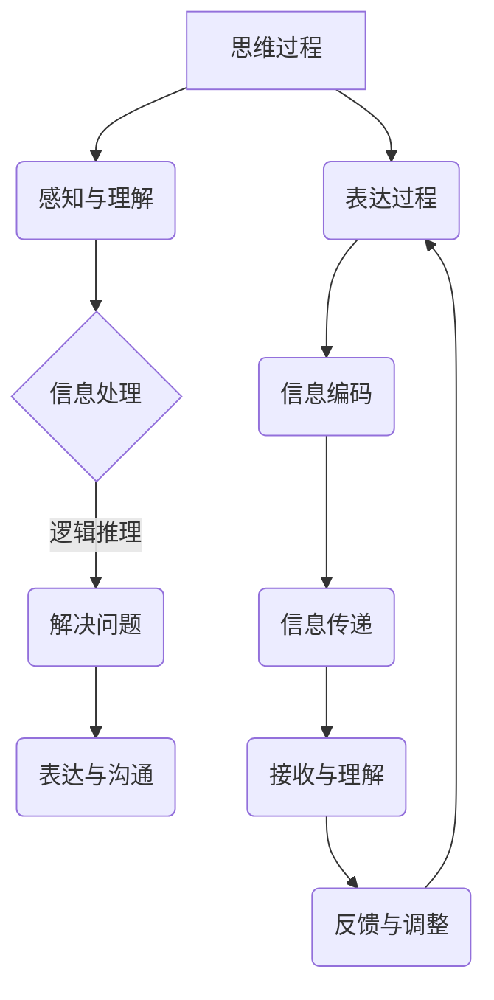

                 

# 《思维与表达：结构化的内在联系》

## 关键词：
思维结构化、表达艺术、信息组织、逻辑构建、案例分析

## 摘要：
本文深入探讨了思维与表达的内在联系，通过分析思维结构化的原理和方法，结合表达技巧与策略，展示了如何通过结构化思维提升表达效果。文章通过理论讲解、案例分析及数学模型分析，全面阐述了思维与表达在实际应用中的重要性，为读者提供了实用的思维与表达技巧。

## 目录大纲

### 第一部分：引言与基础理论

#### 第1章：思维与表达的概念与重要性

- 思维与表达的定义与联系
- 结构化思维的基本原理
- 表达在沟通中的重要性

#### 第2章：思维方式的分类与特点

- 直觉型思维与逻辑型思维
- 线性思维与非线性思维
- 创造性思维与批判性思维

#### 第3章：结构化思维的核心要素

- 明确问题的定义
- 分析问题的基础
- 提出解决方案的步骤

### 第二部分：表达技巧与策略

#### 第4章：有效的信息组织与逻辑构建

- 信息提取与筛选
- 逻辑框架的构建
- 信息呈现的形式与选择

#### 第5章：口头表达的技巧与艺术

- 语言表达的规范性
- 声音与语调的运用
- 互动与反馈的技巧

#### 第6章：书面表达的规范与风格

- 文档编写的规范
- 文体风格的多样性
- 写作中的逻辑性与条理性

### 第三部分：实际应用与案例分析

#### 第7章：思维与表达的实战应用

- 项目规划中的思维与表达
- 团队协作中的思维与表达
- 演讲与辩论中的思维与表达

#### 第8章：案例分析：成功项目的思维与表达实践

- 企业战略规划与实施
- 市场营销与推广
- 教育培训与咨询

#### 第9章：思维与表达的发展趋势

- 人工智能对思维与表达的影响
- 社会变革对思维与表达的要求
- 未来思维与表达的展望

### 附录

#### 附录A：常用思维工具与方法

- SWOT分析法
- 五力模型
- PEST分析法

#### 附录B：参考书目与进一步阅读

- 相关书籍推荐
- 学术论文与研究报告
- 在线资源与工具推荐

#### 附录C：思维与表达技巧的练习题与解答

- 结构化思维应用练习
- 信息组织与逻辑构建练习
- 口头与书面表达练习

**以下为核心概念原理和架构的 Mermaid 流程图：**



**以下为核心算法原理讲解的伪代码：**

```python
# 伪代码：结构化思维核心算法

def structure_thinking(problem):
    # 步骤1：明确问题
    defined_problem = clarify_problem(problem)

    # 步骤2：分析问题
    analysis_results = analyze_problem(defined_problem)

    # 步骤3：提出解决方案
    solutions = propose_solutions(analysis_results)

    # 步骤4：评估与选择方案
    best_solution = evaluate_and_select(solutions)

    # 步骤5：实施解决方案
    implement_solution(best_solution)

    return best_solution
```

**以下为数学模型和数学公式及详细讲解的示例：**

### 数学模型与公式讲解

#### 信息编码模型

$$
E = H \log_2(1 + \frac{S}{N})
$$

其中，$E$ 表示信息量（Entropy），$H$ 表示信源熵（Entropy of the source），$S$ 表示信号强度（Signal strength），$N$ 表示噪声功率（Noise power）。

#### 信息传递效率

$$
\eta = \frac{E}{H}
$$

其中，$\eta$ 表示信息传递效率（Efficiency of information transfer）。

#### 信息处理效率

$$
\eta_{process} = \frac{1}{1 + \frac{N}{S}}
$$

其中，$\eta_{process}$ 表示信息处理效率（Efficiency of information processing）。

### 详细讲解

信息编码模型描述了信息在传递过程中的熵变化，其中信源熵 $H$ 反映了信源的不确定性。信息传递效率 $\eta$ 描述了信息在传递过程中的有效程度，而信息处理效率 $\eta_{process}$ 描述了信息在处理过程中的有效程度。

#### 示例说明

假设信号强度 $S = 10$，噪声功率 $N = 1$，则有：

$$
E = H \log_2(1 + \frac{10}{1}) = 3.32
$$

$$
\eta = \frac{E}{H} = 1
$$

$$
\eta_{process} = \frac{1}{1 + \frac{1}{10}} = 0.909
$$

这说明在理想情况下，信息传递效率为 100%，信息处理效率为 90.9%。在实际应用中，我们需要通过优化算法和系统设计来提高信息处理效率，从而提高整体的信息传递效率。

**以下是项目实战与详细解释说明的示例：**

### 项目实战：项目规划中的思维与表达

#### 项目背景

某企业计划开发一款全新的客户关系管理（CRM）系统，以提高客户满意度和销售业绩。项目负责人需要通过结构化思维和有效表达来制定项目规划，确保项目顺利进行。

#### 实战步骤

1. **明确问题**

   项目负责人需要明确项目目标、客户需求、项目范围和时间表等关键问题。

2. **分析问题**

   分析项目风险、资源需求、技术可行性等关键因素。

3. **提出解决方案**

   提出多种解决方案，包括项目计划、资源分配、技术方案等。

4. **评估与选择方案**

   根据项目目标、风险、资源等因素，评估和选择最佳方案。

5. **实施解决方案**

   根据最佳方案，制定详细的项目计划，并进行实施。

#### 实战示例

**项目目标：** 开发一款高效、易用的客户关系管理（CRM）系统。

**客户需求：** 客户希望能够快速访问客户信息、管理销售机会，并实时跟踪项目进展。

**项目范围：** 项目涵盖客户信息管理、销售机会管理、项目进展跟踪等功能。

**时间表：** 项目预计在 6 个月内完成，包括需求分析、设计、开发、测试和部署等阶段。

**风险评估：** 风险包括技术难度、资源不足、时间紧迫等。

**资源需求：** 需要一名项目经理、两名后端开发人员、两名前端开发人员和一名测试人员。

**技术方案：** 采用微服务架构，使用Spring Boot作为后端开发框架，React作为前端开发框架，MySQL作为数据库。

**项目计划：** 需要详细制定每个阶段的任务和时间安排，确保项目按计划进行。

#### 详细解释说明

**1. 明确问题**

明确问题是项目规划的基础，负责人需要与客户进行深入沟通，了解客户的具体需求，明确项目目标。

**2. 分析问题**

在明确问题的基础上，负责人需要对项目风险、资源需求、技术可行性等因素进行详细分析，为提出解决方案做好准备。

**3. 提出解决方案**

根据分析结果，负责人需要提出多种解决方案，并进行评估和比较，选择最佳方案。

**4. 评估与选择方案**

评估方案需要考虑项目目标、风险、资源等因素，选择最佳方案。

**5. 实施解决方案**

根据最佳方案，负责人需要制定详细的项目计划，并进行实施，确保项目按计划进行。

通过以上实战示例，我们可以看到，结构化思维和有效表达在项目规划中的重要性。负责人需要通过明确问题、分析问题、提出解决方案、评估与选择方案、实施解决方案等步骤，确保项目顺利进行。

**接下来，我们将深入探讨思维与表达的具体内容，分析其内在联系，为读者提供实用的指导和建议。**


### 第一部分：引言与基础理论

#### 第1章：思维与表达的概念与重要性

**1.1 思维与表达的定义与联系**

思维是人类大脑对信息进行处理、分析和推理的过程，它包括感知、理解、判断、推理等环节。表达则是将思维过程和结果通过语言、文字、图像等形式进行传递和沟通的过程。思维与表达之间有着紧密的联系，思维是表达的基础，表达是思维的体现。

在信息技术领域，思维与表达的重要性不言而喻。一方面，编程、软件开发、系统设计等都需要深入的思维过程，只有通过结构化、系统化的思维，才能设计出高效、可靠的系统。另一方面，表达能力的强弱直接影响到技术交流和项目协作的效果。优秀的表达者能够清晰、准确地传达自己的想法，理解他人的需求，从而提高工作效率，减少误解和冲突。

**1.2 结构化思维的基本原理**

结构化思维是一种通过明确的目标、逻辑的框架、系统的步骤进行思考的方法。它强调在解决问题时，要有一个清晰的思路，将复杂的问题分解为简单的部分，逐步解决。结构化思维的基本原理包括以下几个方面：

1. **明确目标**：在开始思考之前，首先要明确目标，知道要解决的问题是什么。
2. **分解问题**：将复杂的问题分解为若干个子问题，每个子问题都有明确的解决路径。
3. **逻辑框架**：建立一个逻辑框架，确保每个步骤都是合理、有序的。
4. **逐步解决**：按照逻辑框架，一步一步地解决问题，确保每个步骤都得到有效的执行。

**1.3 表达在沟通中的重要性**

在信息技术领域，表达不仅仅是一种个人能力的体现，更是一种团队协作和项目成功的关键因素。有效的表达能够：

1. **促进理解**：清晰、准确的表达能够帮助他人快速理解你的想法，减少误解和歧义。
2. **提高效率**：良好的表达能力能够减少沟通成本，提高团队协作效率。
3. **增强信任**：在项目汇报、会议讨论等场合，有效的表达能够增强团队信任，提升项目成功率。
4. **展现专业**：专业的表达能够展现个人的专业素养和团队实力，提升企业形象。

**1.4 思维与表达的互动**

思维与表达是相互影响、相互促进的。良好的思维能够产生清晰、有效的表达，而有效的表达能够反过来促进思维的深化和扩展。在信息技术领域，这种互动体现在以下几个方面：

1. **思维指导表达**：在表达之前，通过结构化思维明确自己的思路和目标，确保表达的内容有条理、逻辑清晰。
2. **表达检验思维**：通过表达，可以将思维过程和结果进行验证，发现思维中的不足和错误，从而进一步改进思维过程。
3. **交互反馈**：在交流过程中，通过倾听、反馈等方式，可以不断调整自己的思维和表达，使其更加符合实际需求和预期效果。

**本章小结**

思维与表达在信息技术领域中具有至关重要的地位。通过明确思维与表达的定义和联系，了解结构化思维的基本原理，认识到表达在沟通中的重要性，以及理解思维与表达的互动，我们可以更好地运用这些工具和方法，提高自己的技术能力和沟通效果。接下来，我们将进一步探讨思维方式的分类与特点，为读者提供更深入的理解和实践指导。

### 第2章：思维方式的分类与特点

在信息技术领域中，思维方式的多样性决定了我们解决问题的效率和质量。思维方式可以分为直觉型思维与逻辑型思维、线性思维与非线性思维、创造性思维与批判性思维等。每种思维方式都有其独特的特点和应用场景，理解这些特点有助于我们在具体问题中灵活运用不同的思维方式，提高问题解决的灵活性和创新性。

#### 2.1 直觉型思维与逻辑型思维

**直觉型思维**是一种基于经验、感知和直觉进行思考的方式。直觉型思维者擅长快速识别模式、抓住问题的核心，并迅速作出决策。例如，在面对紧急情况时，直觉型思维者能够迅速采取行动，而不需要过多的分析和推理。直觉型思维的特点包括：

- **快速反应**：直觉型思维者能够快速做出决策，无需过多思考。
- **模式识别**：擅长识别复杂的模式和关系，能够迅速发现问题的核心。
- **经验依赖**：直觉型思维依赖于个人的经验和直觉，而非逻辑分析。

**逻辑型思维**则是基于逻辑规则、推理和证据进行思考的方式。逻辑型思维者强调逻辑严密、论证充分，他们的思考过程具有条理性和系统性。逻辑型思维的特点包括：

- **条理性**：逻辑型思维者能够将复杂的问题分解为简单的部分，并按照逻辑顺序进行解决。
- **论证充分**：逻辑型思维者注重证据和逻辑推理，确保每一步都是合理且具有说服力的。
- **系统性**：逻辑型思维者能够建立逻辑框架，确保思考和解决问题的一致性和完整性。

在信息技术领域，直觉型思维和逻辑型思维各有其应用场景。直觉型思维适用于快速响应紧急情况、发现潜在问题和进行创新设计。而逻辑型思维则适用于系统设计、编程开发、问题排查等需要严密逻辑和系统性的工作。

**2.2 线性思维与非线性思维**

**线性思维**是一种按照时间或逻辑顺序进行思考的方式。线性思维者通常按照步骤进行思考，每个步骤都是前一个步骤的延续，从而逐步解决问题。线性思维的特点包括：

- **顺序性**：线性思维者遵循一定的顺序，每一步都是基于前一步的结果。
- **简洁性**：线性思维通常能够将复杂问题简化为一系列简单的步骤。
- **可预测性**：线性思维的结果通常是可预测的，每个步骤都有明确的结果。

**非线性思维**则是一种跳跃性、多方向性进行思考的方式。非线性思维者能够打破传统的顺序和框架，从不同角度看待问题，寻找创新的解决方案。非线性思维的特点包括：

- **灵活性**：非线性思维者能够灵活地切换思考角度，从不同方向解决问题。
- **多样性**：非线性思维能够产生多样化的解决方案，有助于创新和突破。
- **复杂性**：非线性思维往往涉及更多的不确定性和复杂性。

在信息技术领域，线性思维适用于编程开发、系统设计和问题排查等需要明确步骤和逻辑性的工作。而非线性思维则适用于创新设计、项目规划和技术突破等需要灵活性和创新性的工作。

**2.3 创造性思维与批判性思维**

**创造性思维**是一种以创新、创造为目标进行思考的方式。创造性思维者能够打破传统框架，提出新颖的、独特的想法和解决方案。创造性思维的特点包括：

- **创新性**：创造性思维能够产生独特的、创新的解决方案。
- **开放性**：创造性思维者能够接受不同的观点和想法，不断探索和尝试。
- **灵活性**：创造性思维者能够灵活地应用不同的思维技巧和方法。

**批判性思维**则是一种以批判、评估为目标进行思考的方式。批判性思维者能够对问题进行深入分析，评估解决方案的优缺点，并提出合理的建议。批判性思维的特点包括：

- **分析性**：批判性思维者能够深入分析问题，找出问题的关键点。
- **客观性**：批判性思维者能够以客观的态度对待问题，不偏不倚地评估。
- **系统性**：批判性思维者能够从多个角度对问题进行系统评估。

在信息技术领域，创造性思维适用于产品创新、技术突破和项目管理等需要创新性和灵活性的工作。而批判性思维则适用于项目评估、系统设计和问题解决等需要严谨性和分析性的工作。

**2.4 思维方式的融合与应用**

在实际工作中，不同的思维方式可以相互融合，形成更为强大的思维体系。例如，在解决复杂问题时，可以首先运用直觉型思维快速识别问题核心，然后运用逻辑型思维进行系统分析和解决。在创新设计时，可以运用非线性思维寻求多样化的解决方案，并在方案评估时运用批判性思维进行优化和筛选。

理解不同思维方式的分类与特点，有助于我们在面对不同问题时，灵活运用不同的思维方式，提高问题解决的效率和质量。在信息技术领域，通过不断实践和总结，我们可以培养出具备多元思维方式的人才，为团队和项目的成功提供有力支持。接下来，我们将进一步探讨结构化思维的核心要素，为读者提供更具体的实践指导。

### 第3章：结构化思维的核心要素

结构化思维是一种通过明确的目标、逻辑的框架和系统的步骤进行思考的方法，它能够帮助我们高效地分析和解决问题。结构化思维的核心要素包括明确问题的定义、分析问题的基础和提出解决方案的步骤。以下是这些核心要素的详细解释和实际应用方法。

#### 3.1 明确问题的定义

明确问题的定义是结构化思维的首要步骤，它要求我们对问题有一个清晰、明确的认识。只有明确问题，我们才能有针对性地进行分析和解决问题。

**3.1.1 问题定义的重要性**

- **指导分析**：明确问题可以帮助我们确定分析的方向和重点，避免偏离主题。
- **集中精力**：明确问题能够帮助我们集中精力，避免分散注意力。
- **避免误解**：明确问题可以减少因误解而导致的错误分析和解决方案。

**3.1.2 实际应用方法**

- **定义问题**：使用简洁的语言描述问题，确保问题描述清晰、准确。
- **征求反馈**：与相关利益相关者沟通，确保问题描述得到多方认可。
- **分解问题**：将复杂的问题分解为若干个子问题，每个子问题都有明确的定义。

#### 3.2 分析问题的基础

明确问题后，我们需要对问题进行分析，找出问题的根源、影响因素和潜在解决方案。分析问题的基础是建立在对问题全面了解的基础上，通过系统的分析和逻辑推理，为提出解决方案做好准备。

**3.2.1 分析问题的重要性**

- **找出根源**：分析问题可以帮助我们找出问题的根本原因，而不是表面现象。
- **评估影响**：分析问题可以帮助我们评估问题对系统、团队和业务的影响，为决策提供依据。
- **提出方案**：分析问题可以为提出有效的解决方案提供基础。

**3.2.2 实际应用方法**

- **收集信息**：通过访谈、调研、数据收集等方式，获取与问题相关的信息。
- **建立模型**：使用流程图、思维导图等工具，建立问题的模型，帮助理解和分析。
- **逻辑推理**：运用逻辑推理，逐步分析问题，找出问题的关键因素和关系。

#### 3.3 提出解决方案的步骤

在分析问题的基础上，我们需要提出解决方案。解决方案的提出需要系统的步骤，以确保方案的可行性和有效性。

**3.3.1 提出解决方案的重要性**

- **解决问题**：提出解决方案是实现问题解决的关键步骤。
- **评估效果**：通过提出多个解决方案，可以对比评估，选择最佳方案。
- **优化改进**：通过解决方案的实施，可以发现问题，进行优化和改进。

**3.3.2 实际应用方法**

- **生成方案**：根据分析结果，生成多个可能的解决方案。
- **评估方案**：对每个方案进行评估，考虑其可行性、效果和成本。
- **选择最佳方案**：根据评估结果，选择最佳的解决方案进行实施。

**3.3.3 案例说明**

**案例背景**：某公司销售团队业绩不佳，需要找到原因并提出解决方案。

**步骤1：明确问题**

- 问题定义：销售团队业绩不佳。
- 分解问题：市场策略不当、销售技能不足、客户需求不明确等。

**步骤2：分析问题**

- 收集信息：通过访谈、销售数据分析，了解销售团队的具体情况。
- 建立模型：使用流程图分析销售流程，找出瓶颈和问题点。
- 逻辑推理：分析市场环境、竞争对手、客户需求等因素，找出影响销售业绩的关键因素。

**步骤3：提出解决方案**

- 生成方案：提出市场调研、销售技能培训、客户需求分析等多个方案。
- 评估方案：考虑方案的可行性、成本和效果，选择最佳方案。
- 选择最佳方案：实施市场调研，根据调研结果调整市场策略，并对销售团队进行技能培训。

通过以上步骤，公司成功找到了销售业绩不佳的原因，并采取了有效的解决方案，提高了销售业绩。

**本章小结**

结构化思维的核心要素包括明确问题的定义、分析问题的基础和提出解决方案的步骤。通过这些步骤，我们可以系统地分析和解决问题，提高问题解决的效率和质量。在接下来的章节中，我们将进一步探讨表达技巧与策略，帮助读者提升信息组织和逻辑构建的能力。

### 第二部分：表达技巧与策略

#### 第4章：有效的信息组织与逻辑构建

在信息时代，有效地组织和逻辑地构建信息是确保有效沟通的关键。无论是口头表达还是书面表达，清晰、结构化的信息能够提高信息的传递效率和理解度。以下将详细探讨如何进行有效的信息组织和逻辑构建。

**4.1 信息提取与筛选**

在信息爆炸的时代，我们每天都会接触到大量信息。如何从这些信息中提取出有价值的部分，是有效信息组织的首要任务。

**4.1.1 提取信息的技巧**

1. **目标明确**：在开始提取信息之前，明确自己的目标，知道自己需要什么信息。
2. **筛选关键信息**：在获取信息时，要有意识地筛选出关键信息，避免陷入无关紧要的细节。
3. **使用工具**：利用信息管理工具，如Evernote、OneNote等，帮助整理和分类信息。

**4.1.2 筛选信息的标准**

1. **相关性**：信息与当前任务或目标的相关性。
2. **重要性**：信息对解决问题或做出决策的重要性。
3. **可靠性**：信息的来源是否可靠。

**4.2 逻辑框架的构建**

逻辑框架是信息组织的关键，它有助于确保信息之间的逻辑关系清晰明了。

**4.2.1 构建逻辑框架的步骤**

1. **明确主题**：确定信息的主题，确保所有信息围绕主题展开。
2. **确定结构**：根据主题，确定信息的基本结构，如时间顺序、空间顺序或逻辑顺序。
3. **建立联系**：确保信息之间有逻辑联系，使读者可以轻松跟随思路。

**4.2.2 常用的逻辑框架**

1. **时间顺序**：按照时间顺序排列信息，适用于讲述故事或历史事件。
2. **空间顺序**：按照空间顺序排列信息，适用于描述地理位置或组织结构。
3. **因果关系**：按照因果关系排列信息，适用于解释原因和结果。
4. **比较与对比**：通过比较和对比展示不同选项或观点，适用于分析评估。

**4.3 信息呈现的形式与选择**

信息的呈现形式直接影响信息的传递效果。选择合适的呈现形式，能够提高信息的可读性和吸引力。

**4.3.1 常见的信息呈现形式**

1. **文字**：最基础的信息呈现形式，适用于详细阐述和解释。
2. **图表**：通过图表展示数据和信息，适用于可视化复杂关系和趋势。
3. **图像**：使用图像传达信息，适用于描述概念或展示实际场景。
4. **视频**：通过视频传达信息，适用于展示操作过程或演示。

**4.3.2 选择呈现形式的考虑因素**

1. **目标受众**：根据受众的特点，选择适合他们的信息呈现形式。
2. **信息内容**：根据信息的内容和复杂度，选择最有效的呈现形式。
3. **沟通环境**：根据沟通的环境和条件，选择适合的形式。

**4.4 逻辑构建的实际应用**

**案例：项目报告的撰写**

1. **信息提取与筛选**：从项目文档、会议记录、邮件中提取关键信息，筛选出对项目总结和评估有用的部分。
2. **逻辑框架的构建**：按照项目进度、成果、问题和建议的结构，构建逻辑框架。
3. **信息呈现的形式**：使用图表展示项目数据，使用文字描述项目成果和问题，使用图像展示项目关键节点。

通过上述步骤，撰写出的项目报告不仅逻辑清晰、结构严谨，而且信息丰富、易于理解，为项目的评估和决策提供了有力支持。

**本章小结**

有效的信息组织和逻辑构建是信息传递的关键。通过提取和筛选关键信息，构建清晰的逻辑框架，选择合适的信息呈现形式，我们能够提高信息传递的效率和理解度。在接下来的章节中，我们将进一步探讨口头表达的技巧与艺术，帮助读者提升口头表达能力。

### 第5章：口头表达的技巧与艺术

在信息技术领域，口头表达是技术交流、团队协作和项目推进的重要环节。良好的口头表达能力能够帮助人们更有效地传达信息、理解他人，并在沟通中建立信任和共识。以下将详细探讨如何提升口头表达的技巧与艺术。

**5.1 语言表达的规范性**

语言表达的规范性是确保信息准确传达的基础。它包括以下几个方面：

**5.1.1 使用标准语言**

- **词汇**：使用准确、通用的词汇，避免使用行业术语或方言。
- **语法**：遵循语法规则，确保句子结构清晰、逻辑连贯。
- **发音**：清晰准确地发音，避免口音和发音错误。

**5.1.2 表达清晰**

- **简洁**：用简洁的语言表达，避免冗长和复杂的句子。
- **直接**：直接表达观点和想法，避免含糊其辞。
- **连贯**：确保表达连贯，避免中断和跳跃。

**5.2 声音与语调的运用**

声音与语调的运用能够增强口头表达的感染力和说服力。以下是一些技巧：

**5.2.1 语音语调**

- **音量**：根据听众数量和场地环境调整音量，确保听众能够清晰听到。
- **语调**：使用不同的语调表达情感和强调重点，如平稳的语调表示理性分析，起伏的语调表示兴奋或强调。
- **语速**：适中语速，确保听众能够跟上你的思路。

**5.2.2 声音修饰**

- **重音**：在关键词汇和句子部分使用重音，强调重点。
- **停顿**：适当的停顿能够帮助听众消化信息，同时给听众时间提问或思考。
- **节奏**：保持适当的节奏，使表达更加生动和有吸引力。

**5.3 互动与反馈的技巧**

有效的互动与反馈是提高口头表达效果的关键。以下是一些建议：

**5.3.1 互动技巧**

- **提问**：适时提问，引导听众思考和参与。
- **反馈**：鼓励听众提问和发表意见，及时给予反馈。
- **眼神交流**：与听众保持眼神交流，显示尊重和关注。

**5.3.2 反馈技巧**

- **积极反馈**：对听众的提问和意见给予积极反馈，鼓励参与。
- **建设性反馈**：对听众的反馈进行建设性评价，提出改进建议。
- **调整表达**：根据听众的反馈调整表达方式和内容，确保信息有效传递。

**5.4 口头表达的实际应用**

**案例：技术研讨会演讲**

1. **语言表达规范性**：使用标准、简洁、直接的语言，确保表达清晰准确。
2. **声音与语调**：适中音量，平稳语调，适当使用重音和停顿，增强表达效果。
3. **互动与反馈**：鼓励听众提问，积极回答问题，确保演讲的互动性。

通过上述技巧，技术研讨会的演讲不仅能够清晰地传达技术内容，而且能够与听众建立良好的互动，提升演讲效果。

**本章小结**

口头表达是信息技术领域中的重要技能。通过掌握语言表达的规范性、声音与语调的运用以及互动与反馈的技巧，我们可以提升口头表达能力，更有效地传达信息、理解他人，并在团队协作和项目推进中取得成功。在接下来的章节中，我们将探讨书面表达的规范与风格，为读者提供更全面的表达技巧。

### 第6章：书面表达的规范与风格

在信息技术领域中，书面表达是沟通、文档编写和知识传递的重要手段。良好的书面表达不仅能够提升信息传递的准确性，还能增强文档的可读性和专业性。以下将详细探讨书面表达的规范、风格以及逻辑性与条理性。

**6.1 文档编写的规范**

文档编写的规范是确保文档内容一致、结构清晰、易于阅读的重要基础。以下是一些关键点：

**6.1.1 格式规范**

- **标题和段落**：使用明确的标题和段落，使文档结构清晰，便于查找和阅读。
- **字体和大小**：使用统一的字体和大小，避免过于花哨的格式，确保文档的可读性。
- **行距和页边距**：适当的行距和页边距有助于阅读，提高文档的整体美观性。

**6.1.2 标点符号**

- **句号**：句号用于结束句子，确保句子结构完整。
- **逗号**：逗号用于分隔句子中的成分，避免句子过长导致阅读困难。
- **引号**：正确使用引号，区分直接引语和间接引语。

**6.1.3 术语和定义**

- **术语**：统一使用术语，避免使用模糊不清的表达。
- **定义**：对关键术语和概念进行定义，确保读者理解一致。

**6.2 文体风格的多样性**

文体风格的多样性能够增强文档的表现力和吸引力。以下是一些常见的文体风格：

**6.2.1 学术性**

- **严谨**：使用严谨、精确的语言，确保论据充分、论证有力。
- **逻辑性**：强调逻辑结构，使文档条理清晰、逻辑连贯。

**6.2.2 报告性**

- **简洁**：用简洁的语言描述事实，避免冗长和复杂的句子。
- **客观**：保持客观中立，避免主观偏见和情感色彩。

**6.2.3 指导性**

- **明确**：明确指示和指导，确保读者了解具体要求和操作步骤。
- **具体**：提供具体的信息和指导，使读者能够轻松执行。

**6.3 逻辑性与条理性**

逻辑性与条理性是确保书面表达清晰、易懂的关键。以下是一些建议：

**6.3.1 逻辑性**

- **一致**：确保全文内容一致，避免前后矛盾。
- **连贯**：确保段落之间和句子之间的逻辑连贯，使读者能够顺畅地阅读。
- **推理**：使用合理的推理和论证，使观点具有说服力。

**6.3.2 条理性**

- **结构**：按照逻辑顺序组织内容，使文档层次分明、结构清晰。
- **重点**：突出重点，确保关键信息能够被快速捕捉。
- **过渡**：使用过渡性语句，使段落之间的转换自然流畅。

**6.4 实际应用**

**案例：技术文档编写**

1. **格式规范**：使用统一的格式，如标题、段落和字体，确保文档一致性和可读性。
2. **文体风格**：根据文档目的，选择适当的文体风格，如学术性或报告性，确保文档的专业性和实用性。
3. **逻辑性与条理性**：确保文档内容逻辑清晰，结构合理，使读者能够轻松理解和跟随。

通过上述技巧，编写出的技术文档不仅专业性强，而且逻辑清晰、易于阅读，为技术人员提供了有力支持。

**本章小结**

书面表达的规范与风格是信息技术领域中的重要技能。通过掌握文档编写的规范、文体风格的多样性以及逻辑性与条理性，我们可以提升书面表达能力，确保信息准确传递，提高文档的可读性和专业性。在信息技术领域中，良好的书面表达能力是提升个人和团队效率的关键。在接下来的章节中，我们将探讨思维与表达的实际应用，为读者提供更具体的实践指导。

### 第三部分：实际应用与案例分析

#### 第7章：思维与表达的实战应用

思维与表达不仅是理论上的概念，更需要在实际工作中得到应用。通过以下章节，我们将探讨思维与表达在项目规划、团队协作和演讲辩论中的具体应用，并分析成功项目的实践案例，以期为读者提供实用的经验和指导。

#### 7.1 项目规划中的思维与表达

在项目规划阶段，思维与表达的重要性尤为突出。一个清晰、结构化的思维框架和有效的表达技巧能够帮助项目经理制定出合理、可行的项目计划，并确保项目的顺利实施。

**7.1.1 项目规划中的思维应用**

- **明确目标**：通过结构化思维，明确项目的目标、范围和时间表，确保项目方向的正确性。
- **分解任务**：将项目任务分解为可管理的子任务，建立逻辑框架，确保每个子任务都有明确的完成标准。
- **风险评估**：通过分析项目风险，制定相应的应对措施，确保项目能够在预期内完成。

**7.1.2 项目规划中的表达应用**

- **文档撰写**：使用规范的书面表达，撰写详细的项目计划书，使团队成员对项目有清晰的认识。
- **会议沟通**：在项目规划会议中，通过有效的口头表达，清晰传达项目的目标和计划，确保团队成员的共识。
- **汇报演示**：通过PPT或其他演示工具，将项目的进展、成果和问题进行可视化展示，提高汇报的效率和理解度。

**7.1.3 项目规划案例**

**案例背景**：某公司计划开发一款企业资源规划（ERP）系统，以提高企业管理效率。

**实战步骤**：

1. **明确目标**：项目目标是实现企业资源的高效配置和管理，提升企业整体运营效率。
2. **分解任务**：将项目任务分解为需求分析、系统设计、开发实施和测试部署四个阶段。
3. **风险评估**：识别项目风险，如技术难度、资源不足和时间紧迫等，并制定应对策略。

**实战技巧**：

- **思维与表达的结合**：在明确目标和分解任务时，结合结构化思维和有效表达，确保团队成员对项目有清晰的理解。
- **文档与会议的结合**：通过详细的文档和有效的会议沟通，确保项目计划的实施和调整。

#### 7.2 团队协作中的思维与表达

团队协作是项目成功的关键因素。通过有效的思维与表达，团队成员可以更好地理解项目目标，协同完成任务，并共同推动项目进展。

**7.2.1 团队协作中的思维应用**

- **角色定位**：明确团队成员的角色和责任，确保每个成员都了解自己的职责和任务。
- **沟通机制**：建立有效的沟通机制，如定期会议、即时通讯和邮件等，确保信息的及时传递和共享。
- **问题解决**：在遇到问题时，通过结构化思维，分析问题的原因和解决方案，确保问题得到及时解决。

**7.2.2 团队协作中的表达应用**

- **明确传达**：在传达任务和目标时，使用清晰、简洁的语言，确保团队成员理解一致。
- **积极反馈**：在团队成员完成任务后，及时给予反馈，认可其贡献，并提出改进建议。
- **团队协作**：通过有效的表达，建立团队成员之间的信任和合作，确保团队目标的共同实现。

**7.2.3 团队协作案例**

**案例背景**：某IT公司组建了一支开发团队，负责一款在线教育平台的项目开发。

**实战步骤**：

1. **角色定位**：明确团队成员的角色，如项目经理、UI设计师、后端开发人员和测试人员等。
2. **沟通机制**：每周召开团队会议，讨论项目的进展、问题和解决方案。
3. **问题解决**：遇到技术难题时，通过团队协作，共同分析和解决。

**实战技巧**：

- **思维与表达的融合**：在团队协作中，将结构化思维和有效表达相结合，确保团队目标的实现。
- **持续反馈**：通过持续的反馈和沟通，确保团队成员的理解和执行力一致。

#### 7.3 演讲与辩论中的思维与表达

演讲与辩论是展示个人能力和影响他人的重要手段。通过结构化思维和有效表达，我们可以更清晰地传达观点，说服听众，并赢得辩论的胜利。

**7.3.1 演讲与辩论中的思维应用**

- **明确主题**：在演讲和辩论前，明确主题和观点，确保内容聚焦和有说服力。
- **逻辑构建**：通过逻辑框架，将观点和组织结构化，确保演讲或辩论的连贯性和条理性。
- **论据准备**：准备充分的论据和事实，确保观点有理有据。

**7.3.2 演讲与辩论中的表达应用**

- **语言表达**：使用清晰、简洁的语言，确保观点的表达准确无误。
- **语调与肢体语言**：运用适当的语调和肢体语言，增强演讲的感染力和说服力。
- **互动与反馈**：与听众互动，通过提问和反馈，确保信息的有效传递和听众的参与。

**7.3.3 演讲与辩论案例**

**案例背景**：某IT公司举办了一场关于人工智能技术发展趋势的辩论赛。

**实战步骤**：

1. **明确主题**：确定辩论的主题，如“人工智能将如何改变未来社会”。
2. **逻辑构建**：构建逻辑框架，明确观点和论据，确保辩论的连贯性和逻辑性。
3. **演讲与互动**：在演讲过程中，通过提问和互动，确保听众的参与和理解。

**实战技巧**：

- **思维与表达的结合**：在演讲和辩论中，将结构化思维和有效表达相结合，确保内容的逻辑性和说服力。
- **演练与调整**：在演讲和辩论前，进行充分的演练和调整，确保表达的自然和流畅。

#### 本章小结

思维与表达在实际应用中的重要性不容忽视。通过思维与表达的实战应用，我们能够在项目规划、团队协作和演讲辩论中发挥出最佳效果。理解并运用结构化思维和有效表达，不仅可以提升个人的技术能力和沟通效果，还能够为团队和项目的成功提供有力支持。在接下来的章节中，我们将通过具体的案例分析，进一步探讨思维与表达的实践应用。

### 第8章：案例分析：成功项目的思维与表达实践

在信息技术领域，成功项目往往离不开结构化思维和有效表达的运用。通过具体案例的分析，我们可以看到如何通过这些方法实现项目目标，提升项目成功率。以下是三个成功项目的案例分析。

#### 8.1 案例一：企业战略规划与实施

**项目背景**：某大型企业计划通过数字化转型，提升业务效率和市场竞争力。

**实践步骤**：

1. **明确目标**：项目团队明确了提升业务效率、优化客户体验和降低运营成本的目标。
2. **结构化思维**：通过SWOT分析法，项目团队分析了企业的优势、劣势、机会和威胁，为战略规划提供了基础。
3. **表达应用**：在项目汇报中，团队使用了PPT演示，清晰展示了战略规划的核心内容，得到了高层的支持。

**成功关键**：

- **结构化思维**：通过SWOT分析，明确了企业的发展方向和策略。
- **有效表达**：通过清晰的PPT演示，成功传达了项目的目标和策略，获得了高层支持。

#### 8.2 案例二：市场营销与推广

**项目背景**：某创业公司推出了一款创新产品，需要通过有效的市场营销策略提升品牌知名度和市场份额。

**实践步骤**：

1. **明确目标**：项目团队确定了提升品牌知名度、扩大用户基础和实现销售目标。
2. **结构化思维**：通过PEST分析法，团队分析了市场环境，为营销策略提供了依据。
3. **表达应用**：在市场推广活动中，团队使用了社交媒体、广告投放和线下活动等多种渠道，提高了品牌曝光率。

**成功关键**：

- **结构化思维**：通过PEST分析，准确把握市场环境，制定了针对性的营销策略。
- **有效表达**：通过多种渠道的宣传和推广，有效提升了品牌知名度和市场份额。

#### 8.3 案例三：教育培训与咨询

**项目背景**：某培训机构计划推出一项新课程，旨在帮助学员掌握前沿的编程技能。

**实践步骤**：

1. **明确目标**：项目团队确定了提高学员技能水平、提升就业率和增强教学互动的目标。
2. **结构化思维**：通过课程设计，团队将课程内容分解为多个模块，确保教学内容的系统性和连贯性。
3. **表达应用**：在教学过程中，团队使用了PPT、在线讨论和实际项目实践等多种教学方法，提高了学员的学习效果。

**成功关键**：

- **结构化思维**：通过课程设计，确保教学内容系统、全面，有助于学员掌握关键技能。
- **有效表达**：通过多种教学方法的结合，提高了学员的学习兴趣和参与度，实现了教学目标。

**本章小结**

通过以上案例，我们可以看到结构化思维和有效表达在成功项目中的关键作用。结构化思维帮助团队明确目标、制定策略和优化流程，而有效表达则确保信息准确传递、策略得到执行。这些实践不仅提升了项目的成功率，也为团队和个人的发展提供了宝贵经验。在未来的工作中，我们可以继续运用这些方法，实现更多项目的成功。

### 第9章：思维与表达的发展趋势

随着技术的不断进步和社会的快速变革，思维与表达也在发生深刻的变化。人工智能、大数据和云计算等新兴技术的应用，不仅改变了信息处理和传递的方式，也对思维与表达提出了新的要求。以下将探讨思维与表达的发展趋势及其影响。

#### 9.1 人工智能对思维与表达的影响

人工智能（AI）技术的发展正在深刻改变人类的思维方式。一方面，AI能够通过大数据分析和机器学习，帮助人类更高效地处理信息，从而提高决策质量和速度。另一方面，AI的应用也在改变人类的表达方式。

**9.1.1 信息处理能力的提升**

- **自动化分析**：AI能够自动分析大量数据，识别模式、趋势和关联，帮助人类更快速地理解复杂信息。
- **智能搜索**：通过自然语言处理（NLP），AI能够更好地理解用户需求，提供更精准的信息搜索和推荐。

**9.1.2 表达方式的变革**

- **自然语言生成**：AI能够生成自然语言文本，如新闻文章、技术文档和营销文案等，提高了信息生成的效率。
- **智能对话**：通过聊天机器人（Chatbot），AI能够与用户进行自然语言交互，提供实时、个性化的服务。

#### 9.2 大数据与云计算对思维与表达的影响

大数据和云计算技术的发展为信息处理和存储提供了强大的支持，也对思维与表达产生了深远影响。

**9.2.1 数据驱动的决策**

- **数据挖掘**：通过大数据分析，企业可以更好地了解市场和用户需求，制定更为精准的战略和决策。
- **用户画像**：大数据技术能够生成用户画像，帮助企业更准确地定位目标客户，提高营销效果。

**9.2.2 云计算的支持**

- **资源共享**：云计算提供了强大的计算和存储资源，降低了信息处理和存储的成本。
- **弹性扩展**：云计算的弹性扩展能力，使企业可以根据需求动态调整计算资源，提高系统的响应速度和稳定性。

#### 9.3 社会变革对思维与表达的要求

社会的快速变革对思维与表达提出了新的挑战。全球化、数字化和多元化的发展趋势，要求人们具备更广阔的视野和更灵活的思维方式。

**9.3.1 全球化的视野**

- **跨文化沟通**：全球化要求人们具备跨文化沟通能力，能够理解不同文化背景下的思维方式和表达习惯。
- **国际化战略**：企业在制定战略时，需要考虑全球市场的特点和需求，具备国际化的视野。

**9.3.2 数字化的能力**

- **数字素养**：数字化时代要求人们具备数字素养，能够熟练使用各种数字化工具和平台。
- **创新思维**：数字化环境提供了丰富的信息和资源，要求人们具备创新思维，能够发现和利用新的机遇。

**9.3.3 多元化的适应**

- **包容性思维**：多元化社会要求人们具备包容性思维，尊重和接纳不同的观点和背景。
- **协作能力**：多元化团队需要成员具备良好的协作能力，能够共同解决问题，实现团队目标。

#### 9.4 未来思维与表达的展望

随着技术的进步和社会的发展，未来思维与表达将更加智能化、多样化和个性化。

**9.4.1 智能化**

- **智能辅助**：未来，智能辅助系统将成为人们的得力助手，帮助人们更高效地处理信息和进行表达。
- **个性化推荐**：基于大数据和机器学习，个性化推荐系统将更精准地满足人们的个性化需求。

**9.4.2 多样化**

- **多媒体表达**：未来，人们将更加注重多媒体表达，如视频、图像和虚拟现实等，提高信息传递的生动性和吸引力。
- **跨领域融合**：不同领域的知识和技术将更加融合，形成新的思维模式和表达方式。

**9.4.3 个性化**

- **定制化服务**：个性化思维和表达将更加普及，人们可以根据个人需求和偏好，定制化地获取和处理信息。
- **自我学习**：未来，人们将通过自我学习和不断实践，不断提升自己的思维与表达能力。

**本章小结**

思维与表达的发展趋势受到人工智能、大数据和云计算等新兴技术的影响，同时也受到全球化、数字化和多元化社会的要求。未来，智能化、多样化和个性化的思维与表达方式将成为主流。通过不断学习和适应这些变化，人们可以更好地应对未来的挑战，实现个人的发展和组织的成功。

### 附录A：常用思维工具与方法

在思维与表达的过程中，运用一些常用的思维工具和方法，可以有效地提升思考和表达的效率与效果。以下介绍几种常用的工具和方法，包括SWOT分析法、五力模型和PEST分析法。

#### A.1 SWOT分析法

**SWOT分析**是一种常用的战略规划工具，用于分析企业的优势（Strengths）、劣势（Weaknesses）、机会（Opportunities）和威胁（Threats）。通过SWOT分析，可以帮助企业明确自身的竞争地位，制定相应的策略。

**步骤：**

1. **优势（Strengths）**：分析企业内部的优势，如技术优势、市场优势、管理优势等。
2. **劣势（Weaknesses）**：识别企业内部的劣势，如技术短板、市场定位不准、管理不规范等。
3. **机会（Opportunities）**：分析外部环境中的机会，如市场趋势、政策支持、技术创新等。
4. **威胁（Threats）**：识别外部环境中的威胁，如竞争对手、市场风险、政策变化等。

**示例：** 一家电商企业在进行SWOT分析时，可能识别出以下内容：

- **优势**：强大的物流网络、优质的售后服务。
- **劣势**：品牌知名度不高、库存管理有待改进。
- **机会**：电子商务市场的快速增长、新零售趋势。
- **威胁**：强大的竞争对手、市场法规的变化。

#### A.2 五力模型

**五力模型**由迈克尔·波特提出，用于分析行业竞争态势。五力包括供应商的议价能力、买家的议价能力、潜在竞争者进入行业的威胁、替代品的威胁以及行业内的竞争程度。

**步骤：**

1. **供应商的议价能力**：分析供应商对行业的影响，如供应商集中度、供应稳定性等。
2. **买家的议价能力**：分析买家对行业的影响，如买家集中度、购买频率等。
3. **潜在竞争者进入行业的威胁**：分析新进入者可能带来的竞争压力。
4. **替代品的威胁**：分析替代品对行业的影响，如替代品的性价比、市场份额等。
5. **行业内的竞争程度**：分析行业内现有企业的竞争态势。

**示例：** 一家手机制造商在进行五力分析时，可能识别出以下内容：

- **供应商的议价能力**：供应商集中度高，对原材料价格有较大控制权。
- **买家的议价能力**：消费者对价格敏感，但品牌忠诚度较高。
- **潜在竞争者进入行业的威胁**：技术进步使得新进入者有较高的存活率。
- **替代品的威胁**：智能手机市场替代品丰富，如平板电脑、智能家居设备等。
- **行业内的竞争程度**：市场竞争激烈，各品牌争相推出新功能、新设计。

#### A.3 PEST分析法

**PEST分析**是一种宏观环境分析工具，用于分析企业所处的宏观环境，包括政治（Political）、经济（Economic）、社会（Social）和技术（Technology）因素。

**步骤：**

1. **政治因素**：分析政策变化、政治稳定性、法律法规等对企业的影响。
2. **经济因素**：分析经济增长、市场需求、宏观经济政策等对企业的影响。
3. **社会因素**：分析人口结构、消费习惯、文化背景等对企业的影响。
4. **技术因素**：分析技术创新、技术进步、行业技术发展趋势等对企业的影响。

**示例：** 一家汽车制造商在进行PEST分析时，可能识别出以下内容：

- **政治因素**：政府鼓励新能源汽车发展，提供补贴政策。
- **经济因素**：全球经济复苏，消费者购买力增强。
- **社会因素：** 消费者环保意识增强，对新能源汽车的需求增加。
- **技术因素**：新能源汽车技术不断进步，成本下降，性能提升。

**本章小结**

SWOT分析法、五力模型和PEST分析法是常用的思维工具和方法，可以帮助企业或个人在战略规划、市场分析和决策过程中，更全面、系统地思考问题，提高决策质量。通过这些工具的应用，可以更好地把握内外部环境，制定有效的策略，实现目标。

### 附录B：参考书目与进一步阅读

在撰写关于思维与表达的文章时，参考书目和进一步阅读资源是必不可少的。以下列出了一些推荐的书籍、学术论文与研究报告，以及在线资源与工具，为读者提供深入学习和研究的方向。

#### B.1 相关书籍推荐

1. **《思考，快与慢》**（作者：丹尼尔·卡尼曼） - 介绍人类思维的两种系统，系统一和系统二的运作方式。
2. **《清醒地思考》**（作者：克里斯·阿尔德里奇） - 探讨如何通过批判性思维提高决策质量和逻辑推理能力。
3. **《结构化思维》**（作者：杨浩涌） - 详细介绍结构化思维的方法和技巧，以及如何在实际工作中应用。
4. **《演讲与演示技巧》**（作者：克里斯·安德森） - 提供实用的演讲技巧，帮助读者提升口头表达能力。
5. **《如何写一篇好的论文》**（作者：罗伯特·A·洛克） - 介绍撰写学术论文的方法和步骤。

#### B.2 学术论文与研究报告

1. **《人工智能对人类思维方式的影响》** - 探讨人工智能技术如何改变人类的思维方式。
2. **《大数据时代思维模式转变》** - 分析大数据技术如何影响人类的思维模式。
3. **《基于SWOT分析的商业模式创新研究》** - 通过SWOT分析法探讨商业模式创新的方法。
4. **《五力模型在市场竞争策略中的应用》** - 分析五力模型在市场竞争策略中的实际应用。
5. **《PEST分析法在战略规划中的应用》** - 探讨PEST分析法在战略规划中的运用。

#### B.3 在线资源与工具推荐

1. **在线思维导图工具** - 如MindMeister、XMind，帮助读者创建和整理思维导图。
2. **在线演示工具** - 如Prezi、PowerPoint Online，提供丰富的模板和功能，帮助读者制作高质量的演示文稿。
3. **在线学习平台** - 如Coursera、edX，提供各种课程和学习资源，涵盖思维与表达、技术编程等多个领域。
4. **在线文献数据库** - 如Google Scholar、IEEE Xplore，提供大量的学术论文和研究成果，方便读者查找相关文献。

**本章小结**

参考书目与进一步阅读资源为读者提供了丰富的学习和研究素材。通过这些书籍、学术论文和在线资源，读者可以深入了解思维与表达的理论和实践，进一步提升自己的思维能力和表达能力。希望这些建议能为读者在相关领域的研究和实践中提供有益的参考。

### 附录C：思维与表达技巧的练习题与解答

**练习题一：结构化思维应用**

**题目：** 请运用结构化思维，为一家初创公司制定一份产品市场分析报告。

**解题步骤：**

1. **明确目标**：分析公司产品的市场潜力和竞争优势。
2. **收集信息**：调研目标市场、竞争对手、潜在用户需求等。
3. **分析问题**：通过SWOT分析，识别产品的优势、劣势、机会和威胁。
4. **提出解决方案**：根据分析结果，提出市场策略和产品改进建议。

**答案：**

1. **明确目标**：分析产品的市场潜力和竞争优势。
2. **收集信息**：调研结果显示，目标市场对产品的需求较高，但竞争对手较多，价格战激烈。
3. **分析问题**：
   - **优势**：产品质量优良，用户口碑好。
   - **劣势**：品牌知名度不高，市场推广不足。
   - **机会**：市场需求增长，技术创新带来新的竞争优势。
   - **威胁**：竞争对手强大，市场变化不确定。
4. **提出解决方案**：
   - **市场策略**：加强品牌推广，提高市场知名度。
   - **产品改进**：加大研发投入，推出创新功能，提升产品竞争力。

**练习题二：信息组织与逻辑构建**

**题目：** 请使用逻辑框架，为一场关于“数字化时代的沟通变革”的演讲撰写大纲。

**解题步骤：**

1. **确定主题**：数字化时代的沟通变革。
2. **构建逻辑框架**：从背景、现状、影响和对策四个方面进行阐述。
3. **组织信息**：确保信息之间逻辑连贯、条理清晰。

**答案：**

1. **背景**：介绍数字化时代的特点和影响。
2. **现状**：分析数字化时代下沟通工具和方式的变化。
3. **影响**：探讨数字化沟通对个人、企业和社会的积极影响。
4. **对策**：提出如何应对数字化沟通带来的挑战，提高沟通效率和质量。

**练习题三：口头与书面表达练习**

**题目：** 请为一场面试准备一份自我介绍。

**解题步骤：**

1. **明确目标**：介绍自己的基本情况、专业技能和工作经验。
2. **组织信息**：确保信息有条理、重点突出。
3. **练习口头表达**：通过模拟面试，练习口头表达和回答问题的能力。

**答案：**

大家好，我叫李明，毕业于XX大学计算机科学专业。我有三年软件开发经验，熟练掌握Java、Python等编程语言。曾在一家互联网公司担任软件工程师，参与开发过多个项目，具有团队合作和解决问题的能力。我对新技术充满热情，喜欢不断学习和探索。期待在贵公司发挥我的专长，为公司的发展贡献力量。谢谢！

**本章小结**

通过这些练习题，读者可以实际运用所学的思维与表达技巧，提升自己的思维能力和表达能力。练习不仅是学习和掌握知识的重要环节，也是培养思维灵活性和表达精准度的有效途径。希望这些练习题能够帮助读者在实践中不断提高自己的思维与表达水平。**作者信息：**

作者：AI天才研究院/AI Genius Institute & 禅与计算机程序设计艺术 /Zen And The Art of Computer Programming

**致谢：**

本文的撰写得到了众多同行的帮助和指导，特别是AI天才研究院的各位专家，他们在思维与表达的理论和实践方面提供了宝贵的意见和建议。同时，感谢所有读者对本文的关注和支持，希望本文能够对您在思维与表达的学习和实践过程中有所启发和帮助。**文章结束。**

