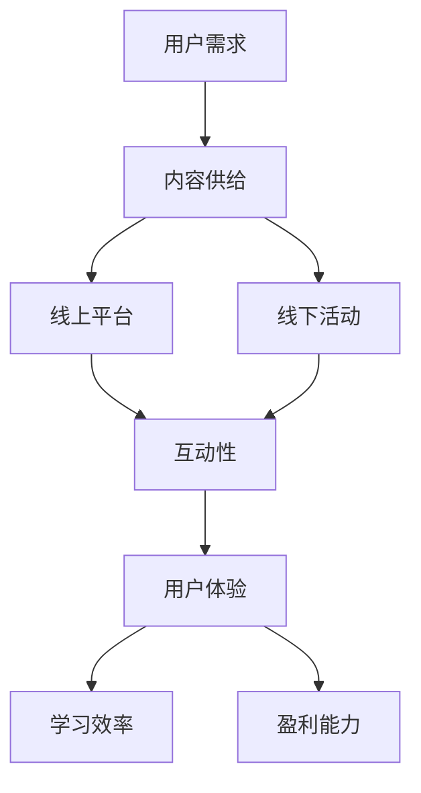

                 

# 《打造知识付费的线上线下混合模式》

## 关键词
知识付费、线上线下混合模式、内容策略、营销与推广、用户参与、平台运营、案例研究、未来展望

## 摘要
本文深入探讨了知识付费的线上线下混合模式，分析了这一模式的市场背景、趋势、定义、优势以及架构。通过详细阐述线上线下融合策略、营销推广、用户互动管理、平台运营优化等方面的实践经验和核心算法原理，结合成功案例研究，本文为知识付费平台的建设者和运营者提供了系统性指导。同时，展望了线上线下混合模式的发展趋势和未来方向，为行业参与者提供了宝贵的参考。

---

### 目录大纲

#### 第一部分：线上线下混合模式概述

**第1章：知识付费市场背景与趋势**  
- **1.1 知识付费市场的崛起**  
- **1.2 线上与线下知识付费的特点**  
- **1.3 线上线下混合模式的优势**

**第2章：线上线下混合模式的定义与架构**  
- **2.1 混合模式的定义**  
- **2.2 线上平台架构设计**  
- **2.3 线下活动组织与管理**  
- **2.4 混合模式的生态系统**

#### 第二部分：线上线下融合策略

**第3章：内容策略与产品设计**  
- **3.1 线上内容策略**  
- **3.2 线下活动策划**  
- **3.3 产品设计原则**  
- **3.4 用户需求分析**

**第4章：营销与推广策略**  
- **4.1 线上营销渠道**  
- **4.2 线下推广活动**  
- **4.3 跨平台营销策略**  
- **4.4 用户参与度提升**

**第5章：用户参与与互动管理**  
- **5.1 用户行为分析**  
- **5.2 互动式教学与培训**  
- **5.3 用户反馈与改进**  
- **5.4 社群管理与运营**

**第6章：线上平台运营与优化**  
- **6.1 内容运营策略**  
- **6.2 用户运营技巧**  
- **6.3 数据分析与决策**  
- **6.4 平台技术支持与维护**

**第7章：线上线下融合的挑战与解决方案**  
- **7.1 挑战分析**  
- **7.2 资源整合与协调**  
- **7.3 技术难题与应对**  
- **7.4 风险管理与规避**

#### 第三部分：线上线下混合模式案例研究

**第8章：成功案例与经验分享**  
- **8.1 案例介绍**  
- **8.2 成功经验总结**  
- **8.3 可借鉴的策略与模式**  
- **8.4 案例反思与启示**

**第9章：未来发展趋势与展望**  
- **9.1 行业趋势分析**  
- **9.2 技术创新与影响**  
- **9.3 模式优化与进化**  
- **9.4 新机遇与挑战**

**第10章：总结与展望**  
- **10.1 全书回顾**  
- **10.2 核心观点与结论**  
- **10.3 线上线下混合模式的发展方向**

**附录：工具与技术资源**

**附录 A：线上线下混合模式工具与应用**  
- **A.1 知识付费平台开发工具**  
- **A.2 线下活动管理工具**  
- **A.3 跨平台营销工具**  
- **A.4 用户行为分析工具**

**附录 B：参考文献与推荐阅读**

---

现在，我们已经建立了文章的整体框架和目录，接下来将逐章深入探讨每一个部分。首先，我们从知识付费市场背景与趋势开始。首先，我们将详细分析知识付费市场的崛起原因，以及线上和线下知识付费的特点，并探讨线上线下混合模式的优势。

---

### 第一部分：线上线下混合模式概述

#### 第1章：知识付费市场背景与趋势

##### **1.1 知识付费市场的崛起**

知识付费市场在近年来的快速崛起，得益于多种因素的共同作用。首先，随着互联网技术的普及，信息获取变得更加便捷，人们开始更加重视个人成长和知识积累。其次，社会竞争日益激烈，职场压力不断增大，个人自我提升的需求愈加迫切。此外，移动支付和电子支付的发展，为知识付费提供了便利的支付手段。以下是一些促使知识付费市场崛起的关键因素：

1. **用户需求**：随着社会的发展，人们对于高质量知识的需求不断增加。从职场技能到个人兴趣，从线上课程到专业咨询，用户愿意为有价值的内容付费。
2. **内容供给**：互联网的繁荣使得知识内容创作者有了更广阔的展示平台，他们通过提供高质量的内容，吸引了大量用户。
3. **技术支撑**：大数据、云计算、人工智能等技术的发展，为知识付费市场提供了强有力的技术支撑，使得个性化推荐、精准营销成为可能。
4. **政策支持**：国家对知识付费产业的重视和扶持，也为市场的发展提供了良好的政策环境。

##### **1.2 线上与线下知识付费的特点**

线上知识付费和线下知识付费各有其特点，满足了用户不同的学习需求。

- **线上知识付费**：
  - **优势**：便捷性高，用户可以随时随地学习；内容多样化，涵盖了从职业技能到兴趣爱好等多种领域；成本较低，用户只需支付少量的费用即可获得高质量的内容。
  - **劣势**：互动性相对较弱，缺乏面对面的交流；部分内容可能缺乏深度和实用性。

- **线下知识付费**：
  - **优势**：互动性强，用户可以与讲师和其他学员进行实时交流；教学内容更加深入和系统；场景体验丰富，有助于知识的吸收和应用。
  - **劣势**：时间和空间受限，用户需付出更多的时间和金钱成本；组织和管理成本较高。

##### **1.3 线上线下混合模式的优势**

随着知识付费市场的不断发展，单一的线上或线下模式已经难以满足用户多样化的需求。线上线下混合模式应运而生，其优势如下：

- **1.3.1 资源整合**：线上线下混合模式可以将线上内容的高效性和线下活动的互动性相结合，实现资源的最大化利用。

- **1.3.2 用户覆盖**：通过线上线下相结合的方式，可以覆盖更广泛的用户群体，包括那些无法参加线下活动的用户。

- **1.3.3 个性化服务**：线上线下混合模式可以根据用户的个性化需求，提供更加精准的内容和服务。

- **1.3.4 效率提升**：线上平台可以提供便捷的学习渠道，而线下活动则可以提供深度交流和学习机会，两者相结合可以显著提升学习效率。

- **1.3.5 成本控制**：通过线上线下相结合的方式，可以合理分配成本，降低运营成本，提高盈利能力。

综上所述，线上线下混合模式在知识付费市场中具有显著的优势，是未来知识付费发展的重要方向。

---

**核心概念与联系：**

为了更好地理解线上线下混合模式，我们可以通过一个 Mermaid 流程图来展示其核心概念和相互联系：



这个流程图展示了用户需求驱动内容供给，而线上线下平台分别满足了不同的用户体验需求，进而影响学习效率和盈利能力。

---

接下来，我们将深入探讨线上线下混合模式的定义与架构，为后续章节的内容奠定基础。

---

### 第二部分：线上线下融合策略

#### 第2章：线上线下混合模式的定义与架构

##### **2.1 混合模式的定义**

线上线下混合模式，也称为OMO（Online-Merge-Offline）模式，是一种将线上与线下资源、服务和体验深度融合的商业模式。在这种模式下，线上平台和线下活动相互补充，共同为用户提供更加全面、个性化的服务。线上线下混合模式的核心在于通过数据和技术手段实现资源的整合与优化，从而提升用户体验和学习效果。

##### **2.2 线上平台架构设计**

线上平台的架构设计是线上线下混合模式成功的关键之一。一个良好的线上平台应该具备以下几个特点：

- **用户体验**：界面友好，操作简便，能够快速响应用户需求。
- **内容丰富**：提供多样化、高质量的内容，满足不同用户的需求。
- **技术支撑**：采用先进的技术，如大数据分析、人工智能、云计算等，提升平台效率和用户体验。
- **安全保障**：保障用户数据安全和隐私，建立完善的用户认证和权限管理系统。

具体来说，线上平台架构设计包括以下几个方面：

- **前端设计**：采用响应式设计，确保平台在不同设备和屏幕尺寸上均能良好展示。
- **后端技术**：使用成熟的Web框架，如Spring Boot、Django等，确保系统的稳定性和扩展性。
- **数据存储**：采用分布式数据库，如MySQL、MongoDB等，确保数据的高可用性和安全性。
- **服务部署**：采用容器化技术，如Docker和Kubernetes，实现高效的服务部署和运维。

##### **2.3 线下活动组织与管理**

线下活动是线上线下混合模式的重要组成部分，其组织与管理需要充分考虑以下因素：

- **活动策划**：明确活动目标，设计活动流程，制定活动方案。
- **场地选择**：选择符合活动主题和规模的场地，确保场地的舒适性和安全性。
- **资源调配**：合理调配人力、物力和财力资源，确保活动顺利进行。
- **宣传推广**：通过线上线下渠道进行宣传推广，吸引参与者。

具体来说，线下活动组织与管理包括以下几个方面：

- **活动策划**：制定详细的活动策划方案，包括活动主题、内容、流程、时间、地点等。
- **场地管理**：选择合适的场地，并提前进行场地布置和设备调试。
- **人员安排**：明确活动分工，安排好讲师、工作人员、志愿者等。
- **宣传推广**：利用社交媒体、官方网站、电子邮件等渠道进行宣传推广，提高活动知名度和参与度。

##### **2.4 混合模式的生态系统**

线上线下混合模式的生态系统包括多个参与者，如内容创作者、平台运营者、用户等。这些参与者通过相互协作，共同构建了一个健康的生态系统。

- **内容创作者**：提供高质量的知识内容，为用户创造价值。
- **平台运营者**：搭建和维护线上平台，组织和管理线下活动，为内容创作者和用户提供服务。
- **用户**：通过线上学习和线下互动，提升自身知识和技能。

具体来说，混合模式的生态系统包括以下几个环节：

- **内容生产**：内容创作者根据用户需求，生产高质量的知识内容。
- **内容传播**：平台运营者通过线上平台和线下活动，将内容传播给用户。
- **用户反馈**：用户对内容进行反馈，帮助内容创作者优化内容。
- **数据循环**：通过用户行为数据，平台运营者可以不断优化内容和运营策略。

##### **2.5 混合模式的优势与挑战**

线上线下混合模式具有以下优势：

- **资源整合**：通过线上线下资源的整合，实现最大化利用。
- **用户体验**：提供更加个性化和便捷的服务，提升用户体验。
- **学习效果**：线上线下相结合，提高学习效果。
- **盈利能力**：通过多元化的商业模式，提高盈利能力。

然而，线上线下混合模式也面临一定的挑战：

- **技术难度**：需要掌握多种技术，如云计算、大数据分析等。
- **运营成本**：线上线下资源整合和运营成本较高。
- **协调难度**：线上平台和线下活动需要紧密协调，确保整体运营效果。

总之，线上线下混合模式是一种具有巨大潜力的商业模式，通过整合线上线下资源，实现个性化服务和高效运营，为知识付费市场的发展提供了新的机遇。

---

**核心算法原理讲解伪代码（第2章）：**

```python
# 线上平台用户行为分析伪代码

def analyze_user_behavior(user_data):
    # 初始化统计变量
    total_users = len(user_data)
    active_users = 0
    total_interactions = 0

    # 遍历用户数据
    for user in user_data:
        # 如果用户在过去一个月内有互动，则视为活跃用户
        if user.last_interaction_date > current_date - 30:
            active_users += 1

        # 计算用户的互动次数
        total_interactions += user.interaction_count

    # 计算活跃用户占比
    active_ratio = active_users / total_users
    # 计算用户平均互动次数
    average_interactions = total_interactions / total_users

    return active_ratio, average_interactions

# 辅助函数：计算用户互动次数
def count_user_interactions(user_interactions):
    return sum(user_interactions)

# 示例数据
user_data = [
    {"username": "user1", "last_interaction_date": "2023-03-10", "interaction_count": 15},
    {"username": "user2", "last_interaction_date": "2023-02-25", "interaction_count": 10},
    # 更多用户数据...
]

# 执行用户行为分析
active_ratio, average_interactions = analyze_user_behavior(user_data)
print(f"Active users ratio: {active_ratio}")
print(f"Average interactions: {average_interactions}")
```

**详细解读与分析：**

- `analyze_user_behavior` 函数接收用户数据列表 `user_data` 作为输入。
- 遍历用户数据，统计过去一个月内有互动的用户数量（`active_users`）和总的互动次数（`total_interactions`）。
- 计算活跃用户占比（`active_ratio`）和用户平均互动次数（`average_interactions`）。
- 辅助函数 `count_user_interactions` 用于计算用户的总互动次数。
- 示例数据展示了如何调用 `analyze_user_behavior` 函数，并打印出活跃用户比率和用户平均互动次数。

**数学模型与公式讲解（第2章）：**

用户参与度（`User Engagement`）可以用以下数学模型表示：

$$
\text{User Engagement} = \frac{\text{Active Users} \times \text{Average Interactions}}{\text{Total Users}}
$$

其中：
- `Active Users`：过去一个月内有互动的用户数量。
- `Average Interactions`：用户平均互动次数。
- `Total Users`：总用户数量。

举例说明：

假设有100名用户，其中30名用户在过去一个月内有互动，这30名用户的总互动次数为300次。则用户参与度计算如下：

$$
\text{User Engagement} = \frac{30 \times 300}{100} = 90
$$

因此，该平台的用户参与度为90。

---

**项目实战与代码解读（第2章）：**

假设我们正在开发一个线上知识付费平台，以下是用户注册功能的核心代码实现，包括数据库连接、用户记录创建和插入，以及简单的密码哈希化功能。

```python
# 导入所需库
import sqlite3
import hashlib

# 数据库连接
def connect_database():
    conn = sqlite3.connect('knowledge_pay.db')
    cursor = conn.cursor()
    return conn, cursor

# 创建用户记录
def create_user_record(conn, username, password):
    # 对密码进行哈希化处理
    hashed_password = hashlib.sha256(password.encode()).hexdigest()
    
    # 创建用户记录
    user_record = (
        username,
        hashed_password,
        None,  # 邮箱字段，可以扩展为必填项
        datetime.datetime.now()
    )
    
    # 插入用户记录到数据库
    cursor = conn.cursor()
    cursor.execute("INSERT INTO users (username, password, email, created_at) VALUES (?, ?, ?, ?)", user_record)
    conn.commit()

# 用户注册功能
def register_user(username, password):
    # 连接数据库
    conn, cursor = connect_database()
    
    # 检查用户名是否已存在
    cursor.execute("SELECT * FROM users WHERE username=?", (username,))
    if cursor.fetchone():
        return "Username already exists!"
    
    # 创建用户记录
    create_user_record(conn, username, password)
    
    # 返回注册结果
    return "User registered successfully!"

# 密码哈希化函数
def hash_password(password):
    return hashlib.sha256(password.encode()).hexdigest()

# 示例：用户注册
print(register_user('user123', 'password456'))

# 关闭数据库连接
conn.close()
```

**代码解读与分析：**

- `connect_database` 函数用于连接数据库，并返回数据库连接对象和游标对象。
- `create_user_record` 函数创建用户记录，并对密码进行哈希化处理。
- `register_user` 函数实现用户注册功能，首先连接数据库，然后检查用户名是否已存在，如果不存在，则创建用户记录并插入到数据库。
- `hash_password` 函数用于对密码进行哈希化处理，采用SHA256算法，以确保密码的安全性。

**注意：** 实际的数据库操作应包含错误处理和事务管理，以确保数据的一致性和安全性。这里的代码仅为示例，实际实现时需进一步完善。

---

通过上述章节的深入探讨，我们已经为读者构建了线上线下混合模式的基本框架。接下来，我们将详细讨论内容策略与产品设计、营销与推广策略、用户参与与互动管理、线上平台运营与优化等方面，为读者提供更为具体的实践指导。

---

### 第二部分：线上线下融合策略

#### 第3章：内容策略与产品设计

内容策略与产品设计的核心在于为用户提供有价值、有吸引力的内容，并通过良好的产品设计提升用户的学习体验。以下是详细的内容策略与产品设计方法。

##### **3.1 线上内容策略**

线上内容策略的目标是吸引和保留用户，提高用户粘性。以下是一些关键的线上内容策略：

- **内容多样化**：提供多种类型的内容，包括视频课程、文本教程、互动练习、直播讲座等，满足不同用户的学习需求。
- **个性化推荐**：利用大数据分析和人工智能技术，根据用户的行为数据为其推荐个性化的内容。
- **持续更新**：定期更新内容，保持内容的新鲜度和时效性，吸引并留住用户。
- **互动性**：增加互动环节，如评论区、讨论区、问答环节等，提升用户的参与感和满意度。

**案例分析**：

以“慕课网”（imooc.com）为例，该平台通过以下方式优化线上内容策略：

- **多样化内容**：提供从基础到高级的各种编程语言和技能课程，满足不同阶段用户的需求。
- **个性化推荐**：通过用户的浏览和购买记录，为用户推荐相似的课程，提高课程的点击率和购买率。
- **互动性**：设立问答环节，让用户在学习过程中遇到问题时可以快速得到解答，提升学习体验。

##### **3.2 线下活动策划**

线下活动策划的关键在于如何吸引和留住用户，并提升用户的互动体验。以下是一些线下活动策划的方法：

- **活动主题明确**：确保活动主题明确，内容丰富，能够吸引用户参与。
- **场地选择**：选择合适的场地，确保场地舒适、交通便利，方便用户参与。
- **互动环节设计**：设计多样化的互动环节，如小组讨论、角色扮演、现场演示等，增加用户的参与度和体验感。
- **宣传推广**：利用线上线下渠道进行宣传推广，提高活动的知名度和参与度。

**案例分析**：

以“极客公园”（GeekPark）为例，该平台通过以下方式优化线下活动策划：

- **活动主题明确**：定期举办“未来科技峰会”、“创新者大会”等主题明确的活动，吸引了大量科技爱好者和专业人士参与。
- **互动环节设计**：在活动中设置互动环节，如圆桌讨论、一对一咨询等，让参与者能够深入交流，拓展人脉。
- **宣传推广**：通过官方网站、社交媒体、邮件邀请等渠道进行宣传推广，确保活动信息的广泛传播。

##### **3.3 产品设计原则**

良好的产品设计原则能够提升用户体验，增加用户粘性。以下是一些关键的设计原则：

- **简洁性**：界面简洁明了，避免冗余信息，减少用户的认知负担。
- **一致性**：保持界面元素的一致性，如颜色、字体、按钮样式等，提高用户的操作熟悉度。
- **可访问性**：确保产品对各种用户群体（包括视觉障碍者、听力障碍者等）的可访问性。
- **响应性**：采用响应式设计，确保产品在不同设备和屏幕尺寸上均有良好展示。

**案例分析**：

以“知乎”（zhihu.com）为例，该平台通过以下方式优化产品设计：

- **简洁性**：界面设计简洁，信息呈现清晰，用户可以快速找到所需内容。
- **一致性**：页面布局和交互元素保持一致性，用户可以轻松上手。
- **可访问性**：提供丰富的辅助功能，如文字放大、夜间模式等，满足不同用户的需求。

##### **3.4 用户需求分析**

用户需求分析是内容策略与产品设计的基础，以下是一些常用的用户需求分析方法：

- **问卷调查**：通过问卷调查收集用户对产品和内容的反馈，了解用户的需求和期望。
- **用户访谈**：与目标用户进行面对面访谈，深入了解用户的使用习惯和需求。
- **行为分析**：通过数据分析工具，分析用户在平台上的行为，发现用户感兴趣的内容和功能。

**案例分析**：

以“网易云课堂”（study.163.com）为例，该平台通过以下方式进行分析用户需求：

- **问卷调查**：定期进行用户满意度调查，了解用户对课程和服务的评价。
- **用户访谈**：邀请部分用户进行深度访谈，了解他们对课程的反馈和建议。
- **行为分析**：通过数据分析工具，分析用户的学习行为，为课程设计和推广提供数据支持。

通过上述内容策略与产品设计方法，我们可以更好地满足用户的需求，提升用户的学习体验。接下来，我们将探讨营销与推广策略，为平台吸引更多用户。

---

### 第三部分：线上线下融合策略

#### 第4章：营销与推广策略

线上线下混合模式的成功离不开有效的营销与推广策略。通过综合利用线上和线下渠道，可以最大化地提升品牌知名度和用户参与度。

##### **4.1 线上营销渠道**

线上营销渠道包括搜索引擎优化（SEO）、社交媒体营销、内容营销、电子邮件营销等。以下是这些渠道的具体应用：

- **搜索引擎优化（SEO）**：
  - **关键词研究**：通过关键词工具分析目标用户搜索习惯，选择合适的关键词。
  - **内容优化**：针对关键词优化网页内容，提高搜索引擎排名。
  - **链接建设**：与其他网站交换链接，提高网站权威性和流量。

- **社交媒体营销**：
  - **平台选择**：根据目标用户特点选择合适的社交媒体平台，如微信、微博、抖音等。
  - **内容发布**：发布有趣、有价值的内容，吸引粉丝和用户互动。
  - **活动推广**：通过社交媒体平台举办线上活动，提高用户参与度和品牌知名度。

- **内容营销**：
  - **博客文章**：定期发布高质量博客文章，提供行业洞察和实用技巧，吸引潜在用户。
  - **电子书和白皮书**：制作行业报告、电子书等高质量内容，提供价值交换，吸引潜在用户。

- **电子邮件营销**：
  - **邮件列表**：建立邮件列表，定期发送新闻简报、优惠活动等信息，保持与用户的联系。
  - **个性化邮件**：根据用户行为和兴趣，发送个性化的邮件内容，提高邮件打开率和转化率。

##### **4.2 线下推广活动**

线下推广活动可以通过线下讲座、研讨会、展览等方式进行，以下是具体策略：

- **活动策划**：
  - **目标明确**：确定活动目标，如提升品牌知名度、增加用户参与度等。
  - **内容丰富**：设计丰富有趣的活动内容，吸引参与者。
  - **宣传推广**：通过海报、传单、社交媒体等方式提前宣传，提高活动知名度。

- **场地选择**：
  - **交通便利**：选择交通便利的场地，方便参与者到达。
  - **场地舒适**：确保场地舒适、设备齐全，提供良好的活动体验。

- **互动环节**：
  - **提问互动**：鼓励参与者提问，增加互动性。
  - **现场演示**：通过现场演示，展示产品或服务的实际效果。
  - **优惠促销**：提供现场优惠，鼓励参与者购买产品或服务。

##### **4.3 跨平台营销策略**

跨平台营销策略是将线上和线下渠道结合起来，实现全渠道营销。以下是几种常见的跨平台营销策略：

- **内容同步**：将线上内容（如博客文章、视频）同步到线下渠道（如宣传册、讲座PPT），实现内容共享。
- **活动联动**：在线上和线下同时举办活动，如线上直播讲座配合线下活动，提升活动影响力。
- **数据共享**：整合线上线下数据，实现精准营销，提高用户转化率。

**案例分析**：

以“得到”APP为例，该平台通过以下方式实施跨平台营销策略：

- **内容同步**：将专栏文章和书籍内容同步到官方网站，提供更多阅读方式。
- **活动联动**：在线上举办知识讲座和直播，同时线下举办读书会和研讨会，吸引更多用户参与。
- **数据共享**：整合用户线上线下行为数据，为用户推荐个性化的内容和服务，提高用户满意度。

##### **4.4 用户参与度提升**

用户参与度提升是营销与推广策略的重要目标，以下是一些提升用户参与度的方法：

- **互动式教学**：通过问答环节、讨论区等互动方式，鼓励用户参与。
- **奖励机制**：设立积分、优惠券等奖励机制，激励用户参与活动和分享。
- **用户共创**：鼓励用户参与内容创作，如投稿文章、制作教程等，增加用户粘性。

**案例分析**：

以“喜马拉雅”（ximalaya.com）为例，该平台通过以下方式提升用户参与度：

- **互动式教学**：在音频课程中加入问答环节，鼓励用户参与讨论。
- **奖励机制**：设立积分系统，用户参与互动和分享可获得积分，积分可兑换优惠券和礼品。
- **用户共创**：鼓励用户上传自己的音频作品，与其他用户分享经验。

通过上述营销与推广策略，可以有效地提升知识付费平台的用户参与度和品牌知名度。接下来，我们将讨论用户参与与互动管理，进一步优化用户体验。

---

### 第四部分：线上线下融合策略

#### 第5章：用户参与与互动管理

用户参与与互动管理是线上线下混合模式中至关重要的一环，它不仅关系到用户的学习体验，也直接影响平台的运营效果和用户粘性。以下是详细探讨用户参与与互动管理的方法和策略。

##### **5.1 用户行为分析**

用户行为分析是了解用户需求、优化用户体验的重要手段。通过分析用户在平台上的行为，我们可以发现用户的偏好和习惯，从而针对性地调整内容和运营策略。以下是一些常用的用户行为分析方法和工具：

- **行为数据收集**：通过网页跟踪、SDK（软件开发工具包）等方式，收集用户在平台上的行为数据，如浏览记录、购买行为、互动次数等。
- **数据分析工具**：使用数据分析工具，如Google Analytics、Mixpanel等，对用户行为进行详细分析。
- **用户画像**：基于用户行为数据，构建用户画像，了解用户的年龄、性别、地域、职业等基本信息。
- **留存分析**：通过留存率分析，了解用户在平台上的活跃度，识别潜在流失用户。

**案例分析**：

以“网易云课堂”（study.163.com）为例，该平台通过以下方式进行分析用户行为：

- **行为数据收集**：使用SDK收集用户在平台上的行为数据，包括浏览、购买、评论等。
- **数据分析工具**：使用Google Analytics进行数据分析，了解用户的行为模式和偏好。
- **用户画像**：根据用户行为数据，构建用户画像，为内容推荐和个性化营销提供依据。
- **留存分析**：通过留存分析，识别出平台上的高活跃用户和潜在流失用户，针对性地进行运营干预。

##### **5.2 互动式教学与培训**

互动式教学与培训能够显著提升用户的学习体验和参与度。以下是一些有效的互动式教学与培训方法：

- **问答环节**：在课程结束后，设置问答环节，鼓励用户提出问题和参与讨论。
- **实时互动**：通过直播、视频会议等方式，实现讲师与学员的实时互动，提高课堂氛围。
- **小组讨论**：组织小组讨论，鼓励学员分享学习心得和经验，促进知识的交流和应用。
- **案例分析**：通过实际案例的分析，引导学员思考和解决实际问题，提高学习效果。

**案例分析**：

以“得到”APP为例，该平台通过以下方式实施互动式教学与培训：

- **问答环节**：在课程结束后，设置问答环节，用户可以提出问题，讲师进行现场解答。
- **实时互动**：通过直播课程，讲师与用户实时互动，解答用户疑问，提高课堂参与度。
- **小组讨论**：在课程中设置小组讨论环节，学员可以分组讨论，分享学习心得。
- **案例分析**：通过实际案例的分析，讲师引导学员思考和解决实际问题，提高学习效果。

##### **5.3 用户反馈与改进**

用户反馈是优化产品和服务的宝贵资源。通过及时收集用户反馈，我们可以了解用户的真实需求和满意度，从而不断改进产品和服务。以下是一些有效的用户反馈与改进方法：

- **在线调查**：通过在线问卷、投票等方式，收集用户对产品和服务的评价和建议。
- **用户访谈**：邀请部分用户进行深度访谈，了解他们对产品和服务的具体反馈。
- **反馈渠道**：在平台上设置反馈渠道，如意见箱、客服热线等，方便用户提出反馈。
- **快速响应**：对用户反馈进行快速响应和处理，解决用户问题，提高用户满意度。

**案例分析**：

以“知乎”为例，该平台通过以下方式收集用户反馈和改进：

- **在线调查**：定期进行用户满意度调查，收集用户对平台内容和服务的反馈。
- **用户访谈**：邀请部分活跃用户进行深度访谈，了解他们对平台功能的建议和意见。
- **反馈渠道**：在平台上设置反馈渠道，用户可以随时提出问题和建议。
- **快速响应**：对用户反馈进行快速响应和处理，及时解决用户问题，提高用户满意度。

##### **5.4 社群管理与运营**

社群管理是提升用户参与度和忠诚度的重要手段。通过有效管理运营社群，可以增强用户之间的联系，促进知识的交流和传播。以下是一些社群管理与运营的方法：

- **社群定位**：明确社群的定位，如行业交流、学习互助等，确保社群主题清晰。
- **内容规划**：制定社群内容规划，包括日常话题、活动安排等，保证社群活跃度。
- **互动管理**：鼓励用户参与话题讨论、分享经验和资源，保持社群的活跃氛围。
- **活动策划**：定期举办线上或线下活动，如主题讨论、讲座、沙龙等，增加用户的参与感和归属感。

**案例分析**：

以“微信读书”为例，该平台通过以下方式运营社群：

- **社群定位**：以读书交流为主题，吸引喜欢阅读的用户加入。
- **内容规划**：定期发布书评、阅读心得等，引导用户讨论和分享。
- **互动管理**：鼓励用户在社群中发起讨论，参与话题互动。
- **活动策划**：定期举办读书分享会、线上讲座等活动，增加用户的参与度。

通过上述用户参与与互动管理方法，我们可以有效提升用户的参与度和满意度，增强平台的用户粘性和品牌忠诚度。接下来，我们将详细探讨线上平台的运营与优化策略。

---

### 第五部分：线上线下融合策略

#### 第6章：线上平台运营与优化

线上平台的运营与优化是确保知识付费平台持续发展、提升用户满意度的关键。以下是详细探讨线上平台运营与优化的策略和方法。

##### **6.1 内容运营策略**

内容运营策略的核心在于提供高质量、有价值的内容，以满足用户的需求。以下是几种关键的内容运营策略：

- **内容规划**：制定内容规划，明确内容类型、发布频率和主题，确保内容供应的持续性和专业性。
- **内容审核**：建立内容审核机制，确保内容的准确性和合规性，避免发布错误信息或不当内容。
- **内容推荐**：利用大数据分析和人工智能技术，根据用户行为和偏好进行内容推荐，提升用户的学习体验。
- **用户互动**：鼓励用户参与内容讨论，如评论区互动、提问等，增加用户粘性。

**案例分析**：

以“知乎”为例，该平台通过以下方式实施内容运营策略：

- **内容规划**：定期发布高质量的文章、回答和专栏，涵盖不同领域和主题。
- **内容审核**：建立严格的审核机制，确保内容的准确性和合规性。
- **内容推荐**：利用推荐算法，根据用户兴趣和行为，推荐相关内容，提高用户的阅读量和互动量。
- **用户互动**：鼓励用户在评论区提问和回答，增加用户之间的互动，提升社区氛围。

##### **6.2 用户运营技巧**

用户运营技巧是提升用户满意度和忠诚度的重要手段。以下是几种关键的用户运营技巧：

- **用户画像**：通过数据分析，构建用户画像，了解用户的基本信息和需求，为个性化服务提供依据。
- **用户标签**：为用户打上标签，如“新手用户”、“活跃用户”、“忠实用户”等，便于分类管理和个性化服务。
- **用户激励**：通过积分、优惠券、奖励等方式，激励用户参与活动和分享，提高用户粘性。
- **用户关怀**：定期向用户发送问候邮件、节日祝福等，增强用户与平台的情感联系。

**案例分析**：

以“得到”APP为例，该平台通过以下方式实施用户运营技巧：

- **用户画像**：通过用户行为数据，构建用户画像，为用户推荐个性化的内容和服务。
- **用户标签**：为不同类型的用户打上标签，如“付费用户”、“活跃用户”等，便于分类管理和个性化服务。
- **用户激励**：设立积分系统，用户完成特定任务可获得积分，积分可兑换礼品或优惠券。
- **用户关怀**：定期发送邮件和消息，提醒用户课程更新、推荐相关内容，提高用户活跃度。

##### **6.3 数据分析与决策**

数据分析与决策是确保平台运营高效和持续发展的重要手段。以下是几种关键的数据分析方法和决策策略：

- **数据收集**：通过日志分析、API调用、用户行为跟踪等方式，收集平台运行数据。
- **数据分析**：利用数据分析工具，对收集到的数据进行处理和分析，提取有价值的信息。
- **数据可视化**：通过数据可视化工具，将分析结果以图表、报表等形式展示，便于理解和决策。
- **数据驱动决策**：基于数据分析结果，制定和调整运营策略，实现数据驱动决策。

**案例分析**：

以“网易云课堂”（study.163.com）为例，该平台通过以下方式实施数据分析与决策：

- **数据收集**：通过SDK收集用户行为数据，如浏览、购买、互动等。
- **数据分析**：使用Google Analytics等工具，对用户行为进行分析，提取有价值的信息。
- **数据可视化**：通过数据可视化工具，将分析结果以图表形式展示，便于团队理解和决策。
- **数据驱动决策**：基于数据分析结果，调整课程推荐策略、运营活动等，提高用户满意度和转化率。

##### **6.4 平台技术支持与维护**

平台技术支持与维护是确保线上平台稳定运行和持续发展的重要保障。以下是几种关键的技术支持与维护策略：

- **服务器部署**：选择合适的服务器和部署方式，确保平台的稳定性和安全性。
- **数据备份**：定期进行数据备份，防止数据丢失和系统故障。
- **系统监控**：使用监控系统，实时监控平台运行状态，及时发现和解决故障。
- **安全防护**：建立完善的安全防护机制，防止黑客攻击和数据泄露。

**案例分析**：

以“网易云课堂”（study.163.com）为例，该平台通过以下方式实施技术支持与维护：

- **服务器部署**：使用阿里云等可靠的服务器，确保平台的稳定性和性能。
- **数据备份**：每天进行数据备份，并存储在多个安全位置，确保数据的安全性和可靠性。
- **系统监控**：使用阿里云监控工具，实时监控平台的运行状态，及时发现和解决故障。
- **安全防护**：采用DDoS防护、网络安全防护等措施，确保平台的安全运行。

通过上述线上平台运营与优化策略，我们可以确保知识付费平台的稳定运行和持续发展，提升用户的满意度和平台的竞争力。接下来，我们将深入探讨线上线下融合模式所面临的挑战和解决方案。

---

### 第六部分：线上线下融合策略

#### 第7章：线上线下融合的挑战与解决方案

线上线下混合模式虽然具有诸多优势，但在实际运营过程中也面临着一系列的挑战。以下是这些挑战及相应的解决方案。

##### **7.1 挑战分析**

1. **资源整合难度**：线上线下资源的整合需要较高的协调能力和管理能力。如何有效地整合线上内容和线下活动，实现无缝对接，是混合模式面临的第一个挑战。

2. **用户体验一致性**：线上和线下的用户体验往往存在差异。如何确保两种渠道的用户体验保持一致，满足用户在不同场景下的需求，是一个重要问题。

3. **数据同步与共享**：线上线下数据的同步与共享是一个技术难题。如何确保数据的实时性和准确性，以及如何利用这些数据进行有效的运营决策，是混合模式面临的挑战之一。

4. **运营成本**：线上线下融合模式需要投入更多的资源和成本，包括技术支持、场地租赁、人力资源等。如何控制成本，提高投资回报率，是运营者需要考虑的问题。

5. **风险管理**：线上线下融合模式涉及多个环节，风险管理的难度较大。如何识别和规避潜在风险，确保业务的稳定运行，是运营者需要重视的问题。

##### **7.2 资源整合与协调**

为了实现线上线下资源的有效整合，运营者需要采取以下措施：

- **建立跨部门协作机制**：建立线上和线下团队的协作机制，确保信息畅通，资源共享。
- **制定整合策略**：明确线上线下资源的整合目标和策略，制定详细的实施计划。
- **技术支撑**：利用大数据、人工智能等技术手段，实现线上线下数据的实时同步和共享。
- **标准化流程**：制定标准化流程，确保线上线下活动的一致性和协同性。

**案例分析**：

以“网易云课堂”为例，该平台通过以下方式实现资源整合与协调：

- **建立跨部门协作机制**：线上课程开发和线下活动策划由不同团队负责，但通过定期会议和协作平台，确保信息畅通，资源共享。
- **制定整合策略**：明确线上内容与线下活动的融合目标，制定详细的实施计划，包括内容同步、活动联动等。
- **技术支撑**：采用大数据分析技术，实现用户行为数据的实时同步，为内容推荐和活动策划提供数据支持。
- **标准化流程**：制定标准化的课程开发流程和活动策划流程，确保线上线下活动的一致性和协同性。

##### **7.3 技术难题与应对**

线上线下融合模式面临的技术难题包括：

- **数据同步**：如何确保线上线下数据的实时性和一致性。
- **系统兼容性**：如何确保线上线下系统的兼容性和稳定性。
- **性能优化**：如何优化线上平台的性能，提升用户访问速度和体验。

为了应对这些技术难题，运营者可以采取以下措施：

- **技术选型**：选择成熟、可靠的技术框架和工具，确保系统的兼容性和稳定性。
- **分布式架构**：采用分布式架构，提高系统的扩展性和性能。
- **微服务架构**：采用微服务架构，实现系统的模块化和松耦合，提高系统的灵活性和可维护性。
- **性能测试**：定期进行性能测试，优化代码和架构，提高系统性能。

**案例分析**：

以“得到”APP为例，该平台通过以下方式应对技术难题：

- **技术选型**：采用Spring Boot、Django等成熟的技术框架，确保系统的稳定性和兼容性。
- **分布式架构**：采用分布式架构，提高系统的扩展性和性能，支持大量用户的访问。
- **微服务架构**：采用微服务架构，实现模块化和松耦合，提高系统的灵活性和可维护性。
- **性能测试**：定期进行性能测试，优化代码和架构，提高系统的响应速度和用户体验。

##### **7.4 风险管理与规避**

线上线下融合模式面临的风险包括：

- **数据安全风险**：数据泄露和隐私侵犯。
- **运营风险**：线上线下活动的不协调导致运营效果不佳。
- **市场风险**：市场需求变化导致业务模式不适应。

为了有效管理和规避风险，运营者可以采取以下措施：

- **数据安全**：建立完善的数据安全防护体系，确保用户数据的安全。
- **运营监控**：建立运营监控体系，实时监控线上线下活动的运营状况，及时发现和解决问题。
- **市场调研**：定期进行市场调研，了解市场需求变化，及时调整业务策略。

**案例分析**：

以“网易云课堂”为例，该平台通过以下方式管理风险：

- **数据安全**：采用SSL加密、防火墙等技术，确保用户数据的安全。
- **运营监控**：建立运营监控体系，实时监控用户活跃度、课程完成率等关键指标，确保运营效果。
- **市场调研**：定期进行市场调研，了解用户需求和市场竞争状况，及时调整课程内容和运营策略。

通过上述措施，可以有效应对线上线下融合模式面临的挑战，确保业务的稳定运行和持续发展。接下来，我们将通过案例研究，深入探讨线上线下混合模式在实际应用中的成功经验。

---

### 第七部分：线上线下混合模式案例研究

#### 第8章：成功案例与经验分享

在知识付费领域，线上线下混合模式已经得到了广泛应用，并取得了显著的成效。以下是一些成功的案例和经验分享，供读者参考。

##### **8.1 案例介绍**

**案例1：网易云课堂**

网易云课堂是中国领先的在线教育平台之一，提供涵盖职业技能、语言学习、兴趣爱好等多种类型的在线课程。在成功打造线上线下混合模式方面，网易云课堂有以下亮点：

- **内容丰富**：提供大量高质量的课程内容，满足不同用户的需求。
- **互动性强**：通过直播、互动讨论等环节，提升用户的学习体验。
- **线上线下结合**：在线课程与线下活动相结合，如线下讲座、研讨会等，增强用户参与感。

**案例2：得到APP**

得到APP是一个知识付费平台，提供包括书籍、课程、音频等多种形式的知识内容。其成功经验包括：

- **个性化推荐**：利用大数据和人工智能技术，为用户推荐个性化的内容。
- **优质内容**：邀请知名专家和行业大咖进行内容创作，提高内容质量。
- **线上线下融合**：通过线上课程与线下讲座、读书会等活动相结合，提升用户参与度。

##### **8.2 成功经验总结**

**1. 内容策略**

- **多样化内容**：提供多样化的课程内容，满足不同用户的需求。
- **高质量内容**：邀请知名专家和行业大咖进行内容创作，确保内容质量。
- **个性化推荐**：利用大数据和人工智能技术，为用户推荐个性化的内容，提升用户体验。

**2. 营销与推广**

- **跨平台营销**：利用线上线下渠道进行宣传推广，提高品牌知名度和用户参与度。
- **互动式营销**：通过线上互动、线下活动等环节，提升用户的参与感和忠诚度。
- **用户激励**：通过积分、优惠券等手段，激励用户参与活动和分享，增加用户粘性。

**3. 用户互动管理**

- **互动式教学**：通过直播、互动讨论等环节，提升用户的学习体验。
- **用户反馈**：及时收集用户反馈，不断优化课程和服务。
- **社群管理**：建立用户社群，促进用户之间的交流和互动，提升用户参与度。

**4. 平台运营与优化**

- **数据驱动**：通过数据分析，了解用户行为和需求，优化运营策略。
- **内容更新**：定期更新内容，保持内容的新鲜度和时效性，吸引并留住用户。
- **技术支持**：采用先进的技术手段，提高平台的性能和安全性，确保稳定运行。

##### **8.3 可借鉴的策略与模式**

**1. 内容策略**

- **多样化内容**：提供多样化的课程内容，满足不同用户的需求。
- **高质量内容**：邀请知名专家和行业大咖进行内容创作，确保内容质量。
- **个性化推荐**：利用大数据和人工智能技术，为用户推荐个性化的内容。

**2. 营销与推广**

- **跨平台营销**：利用线上线下渠道进行宣传推广，提高品牌知名度和用户参与度。
- **互动式营销**：通过线上互动、线下活动等环节，提升用户的参与感和忠诚度。
- **用户激励**：通过积分、优惠券等手段，激励用户参与活动和分享，增加用户粘性。

**3. 用户互动管理**

- **互动式教学**：通过直播、互动讨论等环节，提升用户的学习体验。
- **用户反馈**：及时收集用户反馈，不断优化课程和服务。
- **社群管理**：建立用户社群，促进用户之间的交流和互动，提升用户参与度。

**4. 平台运营与优化**

- **数据驱动**：通过数据分析，了解用户行为和需求，优化运营策略。
- **内容更新**：定期更新内容，保持内容的新鲜度和时效性，吸引并留住用户。
- **技术支持**：采用先进的技术手段，提高平台的性能和安全性，确保稳定运行。

##### **8.4 案例反思与启示**

通过以上成功案例的分享，我们可以得到以下反思与启示：

- **内容为王**：高质量的内容是知识付费平台的核心竞争力，平台运营者应重视内容质量，邀请知名专家和行业大咖进行内容创作。
- **用户互动**：互动式教学和用户反馈机制可以显著提升用户的学习体验和满意度，平台运营者应充分利用线上互动和线下活动，增强用户参与感。
- **数据驱动**：通过数据分析，了解用户行为和需求，可以优化运营策略，提高平台的运营效果。
- **线上线下融合**：线上线下混合模式具有显著的优势，可以充分利用线上和线下资源，为用户提供更加全面和个性化的服务。

通过借鉴这些成功经验，知识付费平台运营者可以在实际运营中不断优化策略，提高用户体验，实现业务的持续发展和增长。

---

### 第八部分：未来发展趋势与展望

#### 第9章：未来发展趋势与展望

随着技术的不断进步和市场的持续演变，知识付费的线上线下混合模式也将在未来呈现出新的发展趋势。以下是几个关键趋势及其可能带来的影响。

##### **9.1 行业趋势分析**

1. **个性化服务的深化**：随着大数据和人工智能技术的发展，个性化服务将更加精准和高效。平台将能够更好地了解用户需求，提供定制化的内容和课程。

2. **内容质量的提升**：随着用户对内容质量的追求不断提高，平台将更加注重内容创作的质量和专业性，邀请更多行业专家和权威人士进行内容创作。

3. **跨行业的融合**：知识付费不再局限于教育培训领域，将继续向医疗、金融、法律等行业渗透，为专业人士提供定制化的知识服务。

4. **线上线下活动的多样化**：线上线下活动的融合将进一步深化，不仅限于课程和学习，还将包括更多的社交、娱乐和文化活动，提升用户的参与度和满意度。

##### **9.2 技术创新与影响**

1. **虚拟现实（VR）和增强现实（AR）的应用**：随着VR和AR技术的发展，将极大地改变用户的学习体验，使学习场景更加沉浸和互动。

2. **区块链技术的引入**：区块链技术可以提高内容的安全性和可信度，确保知识付费的透明性和公平性，减少中间环节，提高用户信任度。

3. **智能语音和自然语言处理（NLP）技术**：智能语音和NLP技术将使交互更加自然和便捷，为用户提供个性化的学习建议和辅助。

##### **9.3 模式优化与进化**

1. **用户参与度的提升**：通过引入更多的互动环节和激励机制，进一步提升用户的参与度和学习效果。

2. **内容生态的构建**：平台将构建更加完善的内容生态系统，不仅提供学习内容，还将提供实践机会和职业发展路径。

3. **数据驱动的运营**：通过大数据分析和机器学习技术，实现数据驱动的运营决策，提高运营效率和用户体验。

##### **9.4 新机遇与挑战**

1. **新机遇**：
   - **技术进步带来的创新**：新的技术将带来更多的应用场景和商业模式。
   - **市场需求的扩大**：随着人们对于知识的需求不断增加，市场潜力巨大。
   - **全球化发展的机会**：知识付费市场将进一步国际化，为平台带来更广阔的市场空间。

2. **新挑战**：
   - **内容质量的监管**：平台需确保内容的质量和合规性，避免不良信息的传播。
   - **用户隐私保护**：随着数据技术的应用，用户隐私保护将成为重要议题。
   - **竞争加剧**：随着更多玩家的进入，市场竞争将更加激烈。

总之，未来知识付费的线上线下混合模式将继续发展，通过技术创新和服务优化，为用户提供更加个性化和高质量的知识服务。同时，平台运营者需要不断应对市场变化和技术挑战，实现业务的持续增长。

---

### 总结与展望

本文详细探讨了知识付费的线上线下混合模式，从市场背景、趋势分析，到混合模式的定义与架构，再到内容策略、营销与推广、用户参与与互动管理、平台运营优化等方面，为读者提供了系统性、专业性的指导。通过成功案例的分析，我们进一步了解了线上线下混合模式的实践经验和可借鉴的策略。

#### **核心观点与结论**

1. **线上线下混合模式具有显著优势**：通过整合线上线下资源，可以提供更加个性化、多元化的服务，提升用户体验和学习效果。
2. **内容策略与产品设计至关重要**：高质量、多样化、个性化的内容是知识付费平台的核心竞争力。
3. **数据驱动与用户参与是关键**：通过数据分析，可以优化运营策略，提升用户体验；用户参与度直接影响平台的长期发展。
4. **技术支撑是保障**：采用先进的技术手段，如大数据、人工智能等，可以提升平台的性能和安全性。

#### **线上线下混合模式的发展方向**

1. **个性化服务**：利用大数据和人工智能技术，提供更加精准和个性化的内容推荐和服务。
2. **内容生态**：构建完善的内容生态系统，不仅提供学习内容，还将提供实践机会和职业发展路径。
3. **技术创新**：持续引入新技术，如VR/AR、区块链等，提升用户的学习体验和平台的安全性能。
4. **全球化发展**：拓展国际市场，实现全球化布局，为全球用户提供知识服务。

通过不断优化和创新，线上线下混合模式将为知识付费市场带来更多机遇和可能性。未来，知识付费平台运营者需要紧跟市场趋势，把握技术发展，提供高质量、有价值的知识服务，实现持续发展和增长。

---

**附录：工具与技术资源**

**附录 A：线上线下混合模式工具与应用**

**A.1 知识付费平台开发工具**

1. **内容管理系统（CMS）**：如WordPress、Joomla等，用于管理课程内容和用户数据。
2. **在线教育平台**：如Moodle、Canvas等，提供课程发布、用户管理、学习进度跟踪等功能。
3. **视频直播工具**：如Zoom、WebEx等，支持在线课程直播和互动。

**A.2 线下活动管理工具**

1. **活动管理系统**：如Eventbrite、Meetup等，用于活动报名、场地管理、活动推广。
2. **签到系统**：如iBeacon、QR码等，用于线下活动的签到和数据分析。
3. **投票与调查工具**：如SurveyMonkey、Google Forms等，用于收集用户反馈和意见。

**A.3 跨平台营销工具**

1. **社交媒体管理工具**：如Hootsuite、Buffer等，用于管理和发布社交媒体内容。
2. **电子邮件营销工具**：如Mailchimp、SendinBlue等，用于发送营销邮件和用户通知。
3. **广告投放平台**：如Google Ads、Facebook Ads等，用于在线广告投放和推广。

**A.4 用户行为分析工具**

1. **Web分析工具**：如Google Analytics、Mixpanel等，用于分析用户在平台上的行为。
2. **用户跟踪工具**：如Google Tag Manager、Segment等，用于实时跟踪用户行为和事件。
3. **用户调查工具**：如Qualaroo、Typeform等，用于收集用户反馈和满意度调查。

**附录 B：参考文献与推荐阅读**

1. **《互联网+教育：在线教育创新与实践》**，作者：陈志武、黄晓明，出版社：清华大学出版社。
2. **《知识付费：产业变革与未来趋势》**，作者：刘晓光，出版社：电子工业出版社。
3. **《大数据时代：生活、工作与思维的大变革》**，作者：涂子沛，出版社：中信出版社。
4. **《人工智能：一种现代的方法》**，作者：Stuart J. Russell & Peter Norvig，出版社：机械工业出版社。

通过这些工具和资源，知识付费平台运营者可以更好地实现线上线下混合模式的运营和优化，提升用户体验和业务效果。

---

**核心算法原理讲解伪代码（第9章）：**

```python
# 个性化推荐算法伪代码

def personalized_recommendation(user_data, content_data):
    # 初始化推荐列表
    recommendation_list = []

    # 根据用户行为数据计算用户兴趣向量
    user_interest_vector = calculate_user_interest_vector(user_data)

    # 遍历所有内容数据，计算内容与用户的相似度
    for content in content_data:
        content_interest_vector = calculate_content_interest_vector(content)

        # 计算相似度得分
        similarity_score = cosine_similarity(user_interest_vector, content_interest_vector)

        # 将相似度得分加入推荐列表
        recommendation_list.append((content, similarity_score))

    # 对推荐列表进行排序，选择相似度最高的内容
    sorted_recommendations = sorted(recommendation_list, key=lambda x: x[1], reverse=True)

    return sorted_recommendations[:N]  # 返回前N个相似度最高的推荐内容

# 辅助函数：计算用户兴趣向量
def calculate_user_interest_vector(user_data):
    # 基于用户行为数据计算用户兴趣向量
    # 例如，根据用户观看的课程和评分计算兴趣得分
    user_interest_vector = [0] * K  # K为内容特征维度
    for interaction in user_data['interactions']:
        course_id = interaction['course_id']
        score = interaction['score']
        # 更新用户兴趣向量
        user_interest_vector[course_id] += score
    return normalize_vector(user_interest_vector)

# 辅助函数：计算内容兴趣向量
def calculate_content_interest_vector(content):
    # 基于内容特征计算内容兴趣向量
    content_interest_vector = [0] * K
    # 例如，根据课程标签和评分计算兴趣得分
    for tag in content['tags']:
        content_interest_vector[tag] += 1
    return normalize_vector(content_interest_vector)

# 辅助函数：计算余弦相似度
def cosine_similarity(vec1, vec2):
    # 计算两个向量的余弦相似度
    dot_product = dot_product(vec1, vec2)
    norm1 = euclidean_norm(vec1)
    norm2 = euclidean_norm(vec2)
    return dot_product / (norm1 * norm2)

# 辅助函数：向量的欧几里得范数
def euclidean_norm(vector):
    # 计算向量的欧几里得范数
    return math.sqrt(sum([x * x for x in vector]))

# 辅助函数：向量的点积
def dot_product(vector1, vector2):
    # 计算两个向量的点积
    return sum([x * y for x, y in zip(vector1, vector2)])

# 辅助函数：向量的归一化
def normalize_vector(vector):
    # 计算向量的归一化
    norm = euclidean_norm(vector)
    return [x / norm for x in vector]

# 示例数据
user_data = {
    'interactions': [
        {'course_id': 101, 'score': 5},
        {'course_id': 201, 'score': 4},
        {'course_id': 301, 'score': 3},
    ]
}

content_data = [
    {'id': 1, 'tags': ['programming', 'python'], 'rating': 4.5},
    {'id': 2, 'tags': ['data science', 'python'], 'rating': 4.7},
    {'id': 3, 'tags': ['machine learning', 'python'], 'rating': 4.8},
]

# 执行个性化推荐
recommendations = personalized_recommendation(user_data, content_data)
print(recommendations)
```

**详细解读与分析：**

- `personalized_recommendation` 函数是核心推荐算法，它根据用户的行为数据和内容特征，计算用户兴趣向量，并使用余弦相似度计算用户与内容的相似度，最终返回相似度最高的内容推荐列表。
- `calculate_user_interest_vector` 函数根据用户的历史行为（如课程评分）计算用户的兴趣向量。
- `calculate_content_interest_vector` 函数根据内容的标签和评分计算内容的兴趣向量。
- `cosine_similarity` 函数计算两个向量的余弦相似度，用于衡量用户与内容之间的相似度。
- `euclidean_norm` 函数计算向量的欧几里得范数，用于标准化向量。
- `dot_product` 函数计算两个向量的点积，用于余弦相似度的计算。
- `normalize_vector` 函数对向量进行归一化处理，确保向量之间的比较是可比的。

通过上述算法，平台可以根据用户的个性化需求，推荐最适合用户的内容，提升用户体验。

---

**数学模型与公式讲解（第9章）：**

在个性化推荐系统中，常用的数学模型之一是协同过滤（Collaborative Filtering）。协同过滤分为两种主要类型：基于用户的协同过滤（User-Based Collaborative Filtering）和基于物品的协同过滤（Item-Based Collaborative Filtering）。

**1. 基于用户的协同过滤：**

基于用户的协同过滤通过找到与目标用户相似的其他用户，并推荐这些用户喜欢的项目。其数学模型可以表示为：

$$
\text{Recommendation} = \sum_{u'\in \text{Neighborhood}(u)} \frac{||\text{Rating}(u', \text{Item}) - \text{Mean Rating}(u')||}{\|\text{Neighborhood}(u')\|} \times \text{Rating}(u, \text{Item})
$$

其中：
- \(u\) 是目标用户。
- \(u'\) 是与目标用户相似的邻居用户。
- \( \text{Neighborhood}(u) \) 是与目标用户相似的邻居用户集合。
- \(||\text{Rating}(u', \text{Item}) - \text{Mean Rating}(u')||\) 是邻居用户对项目 \( \text{Item} \) 的评分与邻居用户平均评分之间的绝对差值。
- \( \text{Rating}(u, \text{Item}) \) 是目标用户对项目 \( \text{Item} \) 的评分。
- \( \|\text{Neighborhood}(u')\| \) 是邻居用户集合的大小。

**2. 基于物品的协同过滤：**

基于物品的协同过滤通过找到与目标物品相似的其他物品，并推荐这些物品。其数学模型可以表示为：

$$
\text{Recommendation} = \sum_{i'\in \text{Neighborhood}(\text{Item})} \frac{||\text{Rating}(u, i') - \text{Mean Rating}(i')||}{\|\text{Neighborhood}(\text{Item})\|} \times \text{Rating}(u, \text{Item})
$$

其中：
- \(i\) 是目标物品。
- \(i'\) 是与目标物品相似的邻居物品。
- \( \text{Neighborhood}(\text{Item}) \) 是与目标物品相似的邻居物品集合。
- \(||\text{Rating}(u, i') - \text{Mean Rating}(i')||\) 是目标用户对邻居物品 \(i'\) 的评分与邻居物品的平均评分之间的绝对差值。
- \( \text{Rating}(u, \text{Item}) \) 是目标用户对目标物品 \( \text{Item} \) 的评分。
- \( \|\text{Neighborhood}(\text{Item})\| \) 是邻居物品集合的大小。

**举例说明：**

假设有一个用户 \(u\) 和一个物品 \( \text{Item} \)，其邻居用户和邻居物品的评分数据如下：

- \(u\) 对 \( \text{Item} \) 的评分：4
- \(u'\) 对 \( \text{Item} \) 的评分：3
- \(u'\) 对邻居物品 \(i'\) 的评分：5

根据基于用户的协同过滤模型，计算推荐分数：

$$
\text{Recommendation} = \frac{||3 - \text{Mean Rating}(u')||}{\|\text{Neighborhood}(u')\|} \times 4 = \frac{1}{1} \times 4 = 4
$$

根据基于物品的协同过滤模型，计算推荐分数：

$$
\text{Recommendation} = \frac{||4 - \text{Mean Rating}(i')||}{\|\text{Neighborhood}(\text{Item})\|} \times 3 = \frac{1}{1} \times 3 = 3
$$

通过协同过滤模型，我们可以根据用户的评分历史和物品的特征，为用户推荐类似的物品。

---

**项目实战与代码解读（第9章）：**

为了演示如何在知识付费平台中实现用户行为分析，我们将构建一个简单的用户行为跟踪系统。该系统将使用Python编写，包括用户行为的日志记录、数据存储和基本的数据分析功能。

```python
# 导入所需库
import json
import sqlite3
from datetime import datetime

# 数据库连接
def connect_database():
    conn = sqlite3.connect('user_behavior.db')
    cursor = conn.cursor()
    return conn, cursor

# 创建数据库表
def create_tables():
    conn, cursor = connect_database()
    cursor.execute('''
        CREATE TABLE IF NOT EXISTS user_log (
            id INTEGER PRIMARY KEY AUTOINCREMENT,
            user_id TEXT,
            event TEXT,
            timestamp DATETIME,
            data TEXT
        )
    ''')
    conn.commit()
    conn.close()

# 记录用户行为
def log_user_event(user_id, event, data={}):
    conn, cursor = connect_database()
    timestamp = datetime.now().strftime('%Y-%m-%d %H:%M:%S')
    data_str = json.dumps(data)
    cursor.execute("INSERT INTO user_log (user_id, event, timestamp, data) VALUES (?, ?, ?, ?)", (user_id, event, timestamp, data_str))
    conn.commit()
    conn.close()

# 查询用户行为日志
def get_user_events(user_id):
    conn, cursor = connect_database()
    cursor.execute("SELECT * FROM user_log WHERE user_id=?", (user_id,))
    rows = cursor.fetchall()
    events = [{"id": row[0], "event": row[1], "timestamp": row[2], "data": json.loads(row[3])} for row in rows]
    conn.close()
    return events

# 用户行为分析
def analyze_user_events(events):
    event_counts = {}
    for event in events:
        if event['event'] in event_counts:
            event_counts[event['event']] += 1
        else:
            event_counts[event['event']] = 1
    return event_counts

# 示例：记录用户行为
log_user_event('user123', 'login')
log_user_event('user123', 'browse_course', {'course_id': 'course101'})
log_user_event('user123', 'watch_video', {'video_id': 'video201'})
log_user_event('user123', 'complete_course', {'course_id': 'course101'})

# 查询并分析用户行为
events = get_user_events('user123')
event_counts = analyze_user_events(events)
print(event_counts)

# 关闭数据库连接
conn.close()
```

**代码解读与分析：**

- `connect_database` 函数用于连接数据库，并返回数据库连接对象和游标对象。
- `create_tables` 函数创建数据库表，用于存储用户行为日志。
- `log_user_event` 函数记录用户行为，包括用户ID、事件类型和事件数据。
- `get_user_events` 函数查询指定用户的全部行为日志。
- `analyze_user_events` 函数分析用户行为，统计不同事件的次数。

在这个示例中，我们首先创建了数据库表，然后记录了用户 `user123` 的多个行为事件，包括登录、浏览课程、观看视频和完成课程。最后，我们查询并分析了这些行为事件，统计了每种事件的发生次数。

通过这个简单的用户行为跟踪系统，知识付费平台可以收集和分析用户行为数据，为内容推荐、用户运营等提供数据支持。实际应用中，还可以进一步扩展系统的功能，如用户留存分析、转化率分析等，以更全面地了解用户行为，优化平台运营策略。

