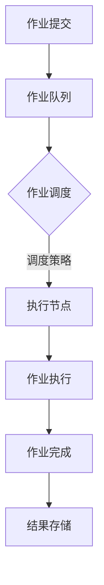
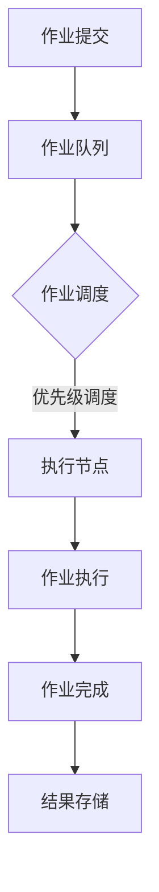

                 

# 《批处理 原理与代码实例讲解》

> **关键词：批处理，原理，代码实例，脚本编写，应用场景，优化**

> **摘要：本文将深入探讨批处理的概念、原理、技术及其在实际应用中的实例，通过代码实例讲解帮助读者更好地理解和掌握批处理技术。**

---

### 《批处理 原理与代码实例讲解》目录大纲

- **第一部分：批处理基础**
  - **第1章：批处理的定义与历史**
    - **1.1 什么是批处理**
    - **1.2 批处理的发展历程**
    - **1.3 批处理的重要性
  - **第2章：批处理原理**
    - **2.1 批处理的工作流程**
    - **2.2 批处理系统架构**
    - **2.3 批处理与作业调度
  - **第3章：批处理技术**
    - **3.1 批处理脚本编写**
    - **3.2 常见批处理命令**
    - **3.3 批处理与Shell编程
  - **第4章：批处理应用场景**
    - **4.1 数据处理**
    - **4.2 系统维护**
    - **4.3 自动化部署
  - **第5章：批处理案例分析**
    - **5.1 数据库备份与恢复**
    - **5.2 自动化监控与报警**
    - **5.3 网络安全与防护

- **第二部分：批处理代码实例解析**
  - **第6章：批处理代码实例**
    - **6.1 基础实例**
    - **6.2 进阶实例**
    - **6.3 复杂实例
  - **第7章：批处理代码实战**
    - **7.1 项目环境搭建**
    - **7.2 源代码解析**
    - **7.3 代码解读与分析
  - **第8章：批处理优化与性能调优**
    - **8.1 批处理性能指标**
    - **8.2 批处理优化策略**
    - **8.3 性能调优案例分析

- **第三部分：批处理工具与资源**
  - **第9章：批处理工具介绍**
    - **9.1 PowerShell**
    - **9.2 Bash脚本**
    - **9.3 Python批处理库
  - **第10章：批处理资源与社区**
    - **10.1 在线教程与文档**
    - **10.2 社区与论坛**
    - **10.3 开源项目与工具
  - **附录**
    - **附录A：批处理命令速查表**
    - **附录B：批处理常见问题解答**
    - **附录C：批处理开发工具推荐**

---

在接下来的内容中，我们将逐一深入探讨每个章节的主题，帮助读者全面了解批处理技术，并通过实例代码的学习，提升实际操作能力。

---

### 第1章：批处理的定义与历史

#### 1.1 什么是批处理

批处理（Batch Processing）是一种数据处理方式，它将多个任务或作业组织成一批，由计算机系统自动执行，而不是逐一手工执行。这种方式的优点在于可以减少重复性工作，提高工作效率。

在批处理中，系统会预先将一批任务（称为作业）提交给作业队列，然后按顺序执行这些作业。作业可以包括数据输入、数据转换、数据处理、数据输出等操作。批处理系统通常具有作业调度功能，能够根据作业的优先级和系统资源情况来调度作业。

#### 1.2 批处理的发展历程

批处理的概念起源于20世纪50年代，当时计算机的主要应用是科学计算。由于当时计算机资源有限，程序员需要将多个计算任务组织在一起，以便在计算机运行时一次性完成。这种方式被称为“批处理”。

随着计算机技术的发展，批处理系统逐渐成熟。20世纪60年代，IBM推出了OS/360操作系统，该系统引入了批处理的概念，并实现了作业调度功能。此后，批处理技术在各种操作系统和计算机系统中得到广泛应用。

进入21世纪，随着互联网和云计算的兴起，批处理技术在数据处理、数据分析、自动化运维等领域得到了进一步的发展。现在，批处理系统已经成为现代企业中不可或缺的一部分。

#### 1.3 批处理的重要性

批处理技术在许多场景中都发挥着重要作用，主要体现在以下几个方面：

- **自动化处理**：批处理可以帮助企业实现自动化流程，减少人为错误，提高工作效率。
- **资源优化**：通过合理的作业调度，批处理系统可以最大化地利用计算机资源，提高系统性能。
- **数据管理**：批处理技术在数据处理和数据管理中发挥着重要作用，例如数据库备份、数据清洗等。

总之，批处理技术不仅在过去有着重要的应用，在当今和未来仍然具有广泛的应用前景。

---

在本章中，我们介绍了批处理的基本概念、发展历程以及重要性。在接下来的章节中，我们将进一步探讨批处理的原理、技术以及在实际应用中的案例。通过这些内容，读者可以全面了解批处理技术，并学会如何在实际项目中应用它。

---

### 第2章：批处理原理

#### 2.1 批处理的工作流程

批处理的工作流程可以分为以下几个步骤：

1. **作业提交**：用户将需要处理的作业提交给批处理系统。作业可以是一个单独的任务，也可以是一系列相关任务的组合。
2. **作业队列**：批处理系统将提交的作业放入作业队列中，按照优先级和调度策略进行排队。
3. **作业调度**：系统根据作业的优先级、资源可用情况等因素，从作业队列中选择一个作业进行调度。
4. **作业执行**：调度器将作业分配给一个或多个执行节点，作业开始执行。执行过程中，系统会监控作业的执行状态。
5. **作业完成**：作业执行完成后，系统将结果输出到指定的位置，如日志文件、数据库等。系统将作业从作业队列中删除。

#### 2.2 批处理系统架构

批处理系统的架构通常包括以下几个部分：

- **作业调度器**：负责作业的调度和管理。调度器根据作业的优先级、资源可用情况等策略，选择合适的作业进行执行。
- **作业队列**：存储待执行的作业。作业队列可以按照优先级、时间顺序等方式进行排序。
- **执行节点**：执行作业的计算机节点。执行节点可以是物理服务器，也可以是虚拟机或容器。
- **监控系统**：监控作业的执行状态，包括作业的运行时间、资源使用情况等。
- **结果存储**：存储作业执行的结果，如日志文件、数据库等。

下图展示了批处理系统架构的 Mermaid 流程图：



#### 2.3 批处理与作业调度

作业调度是批处理系统中的核心功能，它负责将作业分配到适当的执行节点。作业调度策略可以根据作业的优先级、执行时间、资源可用情况等因素进行选择。

常见的作业调度策略包括：

- **优先级调度**：根据作业的优先级进行调度，优先级高的作业先执行。
- **轮转调度**：按照时间片轮转的方式，将作业分配给执行节点，每个作业分配一个时间片，时间片结束后，作业会被移出执行节点，等待下一次调度。
- **负载均衡调度**：根据系统负载情况，将作业分配到负载较低的执行节点，以达到整体系统性能最优。

下图展示了作业调度过程的 Mermaid 流程图：



通过合理的作业调度策略，批处理系统可以提高作业的执行效率，优化系统资源利用。

---

在本章中，我们详细介绍了批处理的工作流程、系统架构以及作业调度策略。这些内容为读者理解批处理技术奠定了基础。在下一章中，我们将进一步探讨批处理技术，包括脚本编写、命令和Shell编程。

---

### 第3章：批处理技术

#### 3.1 批处理脚本编写

批处理脚本是一种用于自动化任务执行的脚本，通常由操作系统提供的命令和编程语句组成。编写批处理脚本可以帮助我们实现自动化任务，提高工作效率。

下面是一个简单的批处理脚本示例：

```bash
#！/bin/bash

# 打印问候语
echo "Hello, World!"

# 创建目录
mkdir batch_processing

# 复制文件
cp file1.txt file2.txt batch_processing/

# 删除文件
rm file3.txt
```

在这个脚本中，我们首先使用`echo`命令打印出问候语。然后，我们使用`mkdir`命令创建一个名为`batch_processing`的目录。接着，使用`cp`命令将`file1.txt`和`file2.txt`复制到该目录中。最后，使用`rm`命令删除`file3.txt`文件。

要运行这个脚本，我们首先需要将其保存为`.sh`文件，例如`example.sh`。然后，使用命令`chmod +x example.sh`赋予脚本执行权限。最后，使用命令`./example.sh`运行脚本。

#### 3.2 常见批处理命令

在批处理脚本中，常见的命令包括文件操作命令、系统管理命令和数据处理命令。

- **文件操作命令**：

  - `cp`：复制文件或目录。
  - `mv`：移动或重命名文件或目录。
  - `rm`：删除文件或目录。
  - `touch`：创建空文件或修改文件时间戳。

- **系统管理命令**：

  - `ps`：显示当前系统进程。
  - `top`：显示系统实时进程。
  - `kill`：终止进程。

- **数据处理命令**：

  - `grep`：在文件中搜索特定的字符串。
  - `awk`：处理文本数据，类似于SQL查询。
  - `sed`：流编辑器，用于对文本进行编辑。

下面是一个使用`grep`、`awk`和`sed`命令的示例：

```bash
# 搜索文件中包含特定字符串的行
grep "search_string" file.txt

# 使用awk命令筛选特定列
awk '{print $1, $3}' file.txt

# 使用sed命令替换文本
sed 's/original_string/replace_string/g' file.txt
```

#### 3.3 批处理与Shell编程

Shell编程是一种在操作系统中使用命令行界面进行编程的方式。Shell脚本是一种文本文件，包含一系列操作系统命令，可以用来实现自动化任务。

Shell脚本与批处理脚本的主要区别在于，Shell脚本可以编写更复杂的逻辑和处理，如循环、条件判断等。

下面是一个简单的Shell脚本示例：

```bash
#!/bin/bash

# 定义变量
name="John"
age=30

# 打印变量值
echo "My name is $name and I am $age years old."

# 循环
for i in {1..5}
do
  echo "Loop iteration: $i"
done

# 条件判断
if [ $age -gt 18 ]
then
  echo "You are an adult."
else
  echo "You are a minor."
fi
```

在这个脚本中，我们首先定义了两个变量`name`和`age`。然后，使用`echo`命令打印出变量值。接下来，使用`for`循环打印出5次循环迭代。最后，使用`if`条件判断语句判断年龄是否大于18岁。

要运行这个脚本，我们首先需要将其保存为`.sh`文件，例如`example.sh`。然后，使用命令`chmod +x example.sh`赋予脚本执行权限。最后，使用命令`./example.sh`运行脚本。

通过编写批处理脚本和Shell脚本，我们可以实现自动化任务，提高工作效率。在下一章中，我们将探讨批处理的应用场景。

---

在本章中，我们介绍了批处理脚本编写的基本概念、常见批处理命令以及Shell编程。这些内容为读者提供了批处理技术的实际应用能力。在下一章中，我们将进一步探讨批处理技术的应用场景。

---

### 第4章：批处理应用场景

批处理技术在许多领域都有广泛的应用，以下是一些常见的应用场景：

#### 4.1 数据处理

在数据处理领域，批处理技术可以用于数据清洗、数据转换、数据汇总等操作。例如，在金融行业，银行和金融机构可以使用批处理技术处理大量交易数据，进行数据校验、风险分析和报告生成。

**示例：数据清洗**

```bash
# 使用grep命令筛选出特定格式的数据行
grep -v "^#" data.csv > cleaned_data.csv

# 使用awk命令处理CSV文件，提取特定列
awk -F, '{print $1 "," $3}' cleaned_data.csv > extracted_data.csv

# 使用sed命令替换文本中的特定字符串
sed 's/old_value/new_value/g' extracted_data.csv > final_data.csv
```

#### 4.2 系统维护

在系统维护方面，批处理技术可以用于系统监控、日志管理、自动重启服务、系统更新等。例如，在IT运维中，管理员可以使用批处理脚本监控服务器性能，自动重启崩溃的服务，以及定期更新系统补丁。

**示例：自动重启服务**

```bash
#!/bin/bash

# 检查服务状态
service_name=$(pgrep -f service_name)

# 如果服务未运行，则重启服务
if [ -z "$service_name" ]
then
  echo "Service $service_name is not running. Restarting..."
  systemctl restart service_name
  echo "Service $service_name has been restarted."
else
  echo "Service $service_name is already running."
fi
```

#### 4.3 自动化部署

在自动化部署方面，批处理技术可以用于构建、部署和配置应用程序。例如，在软件开发过程中，开发人员可以使用批处理脚本自动化构建、测试和部署应用程序。

**示例：使用Docker自动化部署应用**

```bash
#!/bin/bash

# 拉取Docker镜像
docker pull myapp:latest

# 删除旧容器
docker rm -f myapp_container

# 运行新容器
docker run -d --name myapp_container -p 8080:80 myapp:latest

# 检查容器状态
container_status=$(docker ps -q -f name=myapp_container)

if [ -z "$container_status" ]
then
  echo "Container failed to start."
else
  echo "Container started successfully."
fi
```

通过这些示例，我们可以看到批处理技术在数据处理、系统维护和自动化部署等场景中的实际应用。这些应用不仅提高了工作效率，还减少了人为错误，确保了系统稳定运行。

---

在本章中，我们探讨了批处理技术在数据处理、系统维护和自动化部署等领域的应用。在下一章中，我们将通过具体的案例分析，深入探讨批处理技术在各种实际场景中的应用。

---

### 第5章：批处理案例分析

在上一章中，我们介绍了批处理技术的多种应用场景。为了更好地理解这些应用，下面我们将通过几个具体的案例分析，展示批处理技术在实际项目中的具体实现和效果。

#### 5.1 数据库备份与恢复

数据库备份与恢复是批处理技术在数据处理和系统维护中常见的应用之一。通过批处理脚本，可以自动化地备份数据库，确保在数据库发生故障时能够迅速恢复数据。

**案例描述**：

某企业的数据库管理员需要每周对生产数据库进行一次备份，并将备份文件存储在远程服务器上。同时，在数据库发生故障时，需要能够快速恢复数据。

**解决方案**：

使用批处理脚本实现数据库备份与恢复。

**实现步骤**：

1. **编写备份脚本**：

```bash
#!/bin/bash

# 连接数据库
db_user="username"
db_password="password"
db_name="database_name"

# 备份数据库
mysqldump -u$db_user -p$db_password $db_name > backup.sql

# 上传备份文件到远程服务器
scp backup.sql user@remote_server:/path/to/backup/

# 删除本地备份文件
rm backup.sql
```

2. **编写恢复脚本**：

```bash
#!/bin/bash

# 连接数据库
db_user="username"
db_password="password"
db_name="database_name"

# 恢复数据库
mysql -u$db_user -p$db_password $db_name < backup.sql

# 删除备份文件
rm backup.sql
```

**效果分析**：

通过批处理脚本，管理员可以轻松地自动化备份和恢复数据库，提高了工作效率，确保了数据的安全性和完整性。

#### 5.2 自动化监控与报警

自动化监控与报警是批处理技术在系统维护中非常重要的应用。通过批处理脚本，可以实时监控系统的关键指标，并在指标异常时自动发送报警通知。

**案例描述**：

某企业的IT运维团队需要实时监控服务器的CPU使用率、内存使用率和磁盘空间等关键指标，当指标超过阈值时，自动发送报警通知。

**解决方案**：

使用批处理脚本实现自动化监控与报警。

**实现步骤**：

1. **编写监控脚本**：

```bash
#!/bin/bash

# 定义阈值
cpu_threshold=80
memory_threshold=80
disk_threshold=90

# 检查CPU使用率
cpu_usage=$(top -b -n 1 | grep "Cpu(s)" | awk '{print $2}' | awk '{s+=$1} END {print s}')

if [ $cpu_usage -gt $cpu_threshold ]
then
  echo "CPU usage is high: $cpu_usage%"
  # 发送报警通知
  echo "CPU usage is high: $cpu_usage%" | mail -s "CPU报警" admin@example.com
fi

# 检查内存使用率
memory_usage=$(free | grep Mem | awk '{print $3/$2 * 100}')

if [ $memory_usage -gt $memory_threshold ]
then
  echo "Memory usage is high: $memory_usage%"
  # 发送报警通知
  echo "Memory usage is high: $memory_usage%" | mail -s "内存报警" admin@example.com
fi

# 检查磁盘空间
disk_usage=$(df -H | grep / | awk '{print $5}')

if [ $disk_usage -gt $disk_threshold ]
then
  echo "Disk space is low: $disk_usage"
  # 发送报警通知
  echo "Disk space is low: $disk_usage" | mail -s "磁盘空间报警" admin@example.com
fi
```

2. **定时任务**：

将监控脚本添加到系统的定时任务中，例如使用`cron`任务计划每天运行一次。

**效果分析**：

通过批处理脚本，运维团队可以实时监控服务器的关键指标，并在指标异常时自动发送报警通知，确保了系统稳定运行。

#### 5.3 网络安全与防护

批处理技术在网络安全与防护中也发挥着重要作用。通过批处理脚本，可以自动化执行安全检查、漏洞扫描和防护策略部署。

**案例描述**：

某企业的安全团队需要定期执行网络设备的安全检查，扫描潜在的安全漏洞，并根据检测结果部署相应的防护策略。

**解决方案**：

使用批处理脚本实现网络安全与防护。

**实现步骤**：

1. **编写安全检查脚本**：

```bash
#!/bin/bash

# 执行安全检查
nmap -sV -O -Pn 192.168.1.0/24 > scan_results.txt

# 解析扫描结果，提取IP地址和端口信息
grep -E "open|vulnerabilities" scan_results.txt | awk '{print $2 " " $4}' > vulnerabilities.txt

# 根据检测结果部署防护策略
for ip_port in $(cat vulnerabilities.txt)
do
  ip=$(echo $ip_port | awk '{print $1}')
  port=$(echo $ip_port | awk '{print $2}')
  # 部署防护策略，如防火墙规则
  echo "deny tcp $ip $port" >> firewall_rules.txt
done

# 刷新防火墙规则
service firewall restart
```

2. **定时任务**：

将安全检查脚本添加到系统的定时任务中，例如使用`cron`任务计划每周运行一次。

**效果分析**：

通过批处理脚本，安全团队可以自动化执行网络设备的安全检查，扫描潜在的安全漏洞，并根据检测结果部署相应的防护策略，提高了网络安全防护能力。

通过以上三个案例，我们可以看到批处理技术在数据处理、系统维护和网络安全与防护等领域的实际应用。批处理技术不仅提高了工作效率，减少了人为错误，还为企业的稳定运行提供了有力保障。

---

在本章中，我们通过三个具体的案例分析，展示了批处理技术在实际项目中的应用。这些案例不仅展示了批处理技术的实用性，还提供了详细的实现步骤和效果分析。在下一章中，我们将通过代码实例进一步探讨批处理技术的应用。

---

### 第6章：批处理代码实例

在本章中，我们将通过一系列批处理代码实例，逐步展示如何使用批处理技术解决实际问题。这些实例包括基础实例、进阶实例和复杂实例，旨在帮助读者从不同层面掌握批处理代码的编写技巧和应用。

#### 6.1 基础实例

**基础实例1：文件备份**

```bash
#!/bin/bash

# 定义源目录和备份目录
source_dir="/path/to/source"
backup_dir="/path/to/backup"

# 备份文件
tar -czvf ${backup_dir}/backup_$(date +%Y%m%d).tar.gz ${source_dir}/

echo "Backup completed."
```

这个基础实例使用`tar`命令对指定目录下的文件进行压缩备份。首先，定义源目录和备份目录，然后使用`tar`命令将源目录下的文件压缩备份到备份目录。最后，通过`echo`命令输出备份完成的消息。

**基础实例2：文件复制**

```bash
#!/bin/bash

# 定义源文件和目标文件
source_file="/path/to/source/file.txt"
target_file="/path/to/target/file.txt"

# 复制文件
cp ${source_file} ${target_file}

echo "File copied."
```

这个基础实例使用`cp`命令将源文件复制到目标文件。首先，定义源文件和目标文件，然后使用`cp`命令进行复制。最后，通过`echo`命令输出文件复制完成的消息。

#### 6.2 进阶实例

**进阶实例1：批量删除文件**

```bash
#!/bin/bash

# 定义目录和文件名前缀
dir="/path/to/directory"
prefix="temp_"

# 批量删除文件
find ${dir} -type f -name "${prefix}*" -delete

echo "Files deleted."
```

这个进阶实例使用`find`命令批量删除指定目录下以特定前缀命名的一系列文件。首先，定义目录和文件名前缀，然后使用`find`命令搜索并删除匹配的文件。最后，通过`echo`命令输出文件删除完成的消息。

**进阶实例2：文件内容替换**

```bash
#!/bin/bash

# 定义文件和搜索/替换字符串
file="/path/to/file.txt"
search="old_string"
replace="new_string"

# 替换文件内容
sed -i "s/${search}/${replace}/g" ${file}

echo "File content replaced."
```

这个进阶实例使用`sed`命令替换文件中的特定字符串。首先，定义文件和搜索/替换字符串，然后使用`sed`命令进行替换。`-i`选项表示直接在文件上进行修改。最后，通过`echo`命令输出文件内容替换完成的消息。

#### 6.3 复杂实例

**复杂实例1：自动化部署应用**

```bash
#!/bin/bash

# 定义应用名称和版本
app_name="myapp"
app_version="1.0.0"

# 拉取最新版本的Docker镜像
docker pull ${app_name}:${app_version}

# 删除旧容器
docker rm -f ${app_name}_container

# 运行新容器
docker run -d --name ${app_name}_container -p 8080:80 ${app_name}:${app_version}

echo "Application deployed."
```

这个复杂实例展示了如何使用批处理脚本进行自动化部署。首先，定义应用名称和版本，然后使用`docker pull`命令拉取最新版本的Docker镜像。接着，使用`docker rm`命令删除旧容器，并使用`docker run`命令运行新容器。最后，通过`echo`命令输出部署完成的消息。

**复杂实例2：日志文件轮转**

```bash
#!/bin/bash

# 定义日志文件和最大大小
log_file="/path/to/logfile.log"
max_size="100M"

# 检查日志文件大小
current_size=$(du -m ${log_file} | awk '{print $1}')

if [ $current_size -ge $max_size ]
then
  # 创建新日志文件
  mv ${log_file} ${log_file}.1
  
  # 重定向输出到新日志文件
  exec > ${log_file}
  exec 2> ${log_file}

  echo "Log rotation completed."
else
  echo "Log file size is within limit."
fi
```

这个复杂实例展示了如何使用批处理脚本实现日志文件的轮转。首先，定义日志文件和最大大小，然后使用`du`命令检查日志文件当前大小。如果大小超过最大限制，则创建新日志文件，并重定向输出到新日志文件。最后，通过`echo`命令输出日志文件轮转完成的消息。

通过这些实例，我们可以看到批处理代码在解决实际问题时的重要性和应用价值。从简单的文件操作到复杂的自动化部署和日志管理，批处理技术为我们提供了强大的工具，帮助我们提高工作效率，确保系统稳定运行。

---

在本章中，我们通过基础实例、进阶实例和复杂实例，展示了批处理代码在解决实际问题中的应用。在下一章中，我们将进一步探讨如何在实际项目中运用批处理技术，通过具体实战项目来提升我们的技能。

---

### 第7章：批处理代码实战

在本章中，我们将通过一个具体的实战项目，详细讲解项目环境搭建、源代码解析、代码解读与分析等内容。通过这个实战项目，我们将全面了解批处理技术的应用过程，并提升实际操作能力。

#### 7.1 项目环境搭建

首先，我们需要搭建一个适合批处理项目开发的环境。在这个项目中，我们将使用Linux操作系统和常用的批处理工具，如Shell和Python。

**环境搭建步骤**：

1. **安装Linux操作系统**：

   在虚拟机或云服务器中安装Linux操作系统，如CentOS或Ubuntu。

2. **安装必要软件**：

   - 安装Python：使用`sudo apt-get install python3`（Ubuntu）或`sudo yum install python3`（CentOS）。
   - 安装pip：使用`sudo apt-get install python3-pip`（Ubuntu）或`sudo yum install python3-pip`（CentOS）。
   - 安装常用的Python库，如`requests`、`pandas`、`numpy`等。

3. **配置SSH远程访问**：

   使用SSH密钥认证配置远程访问，以确保安全性和便捷性。

4. **设置定时任务**：

   使用`cron`任务计划器设置定时任务，以便自动执行批处理脚本。

通过以上步骤，我们可以搭建一个适合批处理项目开发的基本环境。接下来，我们将详细介绍项目的具体实现。

#### 7.2 源代码解析

**项目描述**：

本项目的目标是实现一个自动化监控系统，用于监控服务器性能指标（如CPU使用率、内存使用率、磁盘空间等），并在指标超过阈值时自动发送报警通知。

**源代码结构**：

```bash
project/
|-- monitor.sh
|-- notify.sh
|-- cron_jobs.txt
|-- logs/
|   |-- cpu_usage.log
|   |-- memory_usage.log
|   |-- disk_usage.log
|-- scripts/
|   |-- parse_cpu_usage.py
|   |-- parse_memory_usage.py
|   |-- parse_disk_usage.py
```

**源代码解析**：

1. **monitor.sh**：

   这是一个监控脚本，用于定期检查服务器性能指标，并将结果记录到日志文件中。

   ```bash
   #!/bin/bash

   # 检查CPU使用率
   cpu_usage=$(top -b -n 1 | grep "Cpu(s)" | awk '{print $2}')

   echo "$(date) - CPU Usage: $cpu_usage%" >> logs/cpu_usage.log

   # 检查内存使用率
   memory_usage=$(free | grep Mem | awk '{print $3/$2 * 100}')

   echo "$(date) - Memory Usage: $memory_usage%" >> logs/memory_usage.log

   # 检查磁盘空间
   disk_usage=$(df -H | grep / | awk '{print $5}')

   echo "$(date) - Disk Usage: $disk_usage" >> logs/disk_usage.log
   ```

2. **notify.sh**：

   这是一个报警通知脚本，用于在性能指标超过阈值时发送报警通知。

   ```bash
   #!/bin/bash

   # 定义阈值
   cpu_threshold=80
   memory_threshold=80
   disk_threshold=90

   # 检查CPU使用率
   cpu_usage=$(awk '/CPU/ {print $2}' logs/cpu_usage.log)

   if [ $cpu_usage -gt $cpu_threshold ]
   then
     echo "CPU usage is high: $cpu_usage%" | mail -s "CPU报警" admin@example.com
   fi

   # 检查内存使用率
   memory_usage=$(awk '/Memory/ {print $2}' logs/memory_usage.log)

   if [ $memory_usage -gt $memory_threshold ]
   then
     echo "Memory usage is high: $memory_usage%" | mail -s "内存报警" admin@example.com
   fi

   # 检查磁盘空间
   disk_usage=$(awk '/Disk/ {print $2}' logs/disk_usage.log)

   if [ $disk_usage -gt $disk_threshold ]
   then
     echo "Disk space is low: $disk_usage" | mail -s "磁盘空间报警" admin@example.com
   fi
   ```

3. **cron_jobs.txt**：

   这是一个cron任务计划文件，用于设置定时任务，定期执行监控和报警脚本。

   ```bash
   # 每分钟执行一次监控脚本
   * * * * * /path/to/monitor.sh

   # 每小时执行一次报警脚本
   0 * * * * /path/to/notify.sh
   ```

4. **scripts/目录**：

   这目录下包含了三个Python脚本，用于解析日志文件中的性能指标数据。

   ```python
   # parse_cpu_usage.py
   with open('logs/cpu_usage.log', 'r') as f:
       lines = f.readlines()
       for line in lines:
           print(line.strip())

   # parse_memory_usage.py
   with open('logs/memory_usage.log', 'r') as f:
       lines = f.readlines()
       for line in lines:
           print(line.strip())

   # parse_disk_usage.py
   with open('logs/disk_usage.log', 'r') as f:
       lines = f.readlines()
       for line in lines:
           print(line.strip())
   ```

通过上述解析，我们可以看到项目源代码的结构和功能。接下来，我们将进一步解读和分析这些代码。

#### 7.3 代码解读与分析

**代码解读**：

1. **monitor.sh**：

   - `top -b -n 1 | grep "Cpu(s)" | awk '{print $2}'`：使用`top`命令获取CPU使用率，通过`grep`筛选出包含"Cpu(s)"的行，使用`awk`提取第二个字段（即CPU使用率）。
   - `free | grep Mem | awk '{print $3/$2 * 100}'`：使用`free`命令获取内存使用率，通过`grep`筛选出包含"Mem"的行，使用`awk`计算内存使用率（已使用内存/总内存 * 100%）。
   - `df -H | grep / | awk '{print $5}'`：使用`df`命令获取磁盘空间使用率，通过`grep`筛选出包含"/"的行，使用`awk`提取第五个字段（即磁盘使用率）。

2. **notify.sh**：

   - `awk '/CPU/ {print $2}' logs/cpu_usage.log`：使用`awk`筛选出包含"CPU"的行，提取第二个字段（即CPU使用率）。
   - `awk '/Memory/ {print $2}' logs/memory_usage.log`：使用`awk`筛选出包含"Memory"的行，提取第二个字段（即内存使用率）。
   - `awk '/Disk/ {print $2}' logs/disk_usage.log`：使用`awk`筛选出包含"Disk"的行，提取第二个字段（即磁盘使用率）。

3. **cron_jobs.txt**：

   - `* * * * * /path/to/monitor.sh`：每分钟执行一次监控脚本。
   - `0 * * * * /path/to/notify.sh`：每小时执行一次报警脚本。

**代码分析**：

- `monitor.sh`脚本负责定期检查服务器性能指标，并将结果记录到日志文件中。这种方式可以实时监控服务器的运行状态，及时发现潜在问题。
- `notify.sh`脚本负责在性能指标超过阈值时发送报警通知。通过邮件等方式通知管理员，可以确保管理员及时响应和处理问题。
- `cron`任务计划器用于设置定时任务，确保监控和报警脚本按计划执行。

通过这个实战项目，我们可以看到批处理技术在实际项目中的应用。从监控脚本到报警通知，再到定时任务，批处理技术为我们提供了一个完整的解决方案，帮助我们实现自动化监控和报警，提高了系统稳定性和可靠性。

---

在本章中，我们通过一个具体的实战项目，详细讲解了项目环境搭建、源代码解析和代码解读与分析等内容。通过这个实战项目，我们不仅掌握了批处理技术的应用，还提升了实际操作能力。在下一章中，我们将探讨如何优化批处理性能和代码，以确保批处理系统的稳定和高效运行。

---

### 第8章：批处理优化与性能调优

批处理系统在处理大量数据时，性能调优至关重要。合理的优化策略可以提高批处理系统的响应速度和资源利用率，确保系统稳定、高效地运行。以下是一些常见的批处理性能优化策略和案例分析。

#### 8.1 批处理性能指标

在评估和优化批处理系统时，我们需要关注以下几个关键性能指标：

- **响应时间**：从作业提交到完成所需的时间。
- **吞吐量**：单位时间内系统处理的作业数量。
- **资源利用率**：系统资源（如CPU、内存、磁盘）的使用情况。
- **错误率**：作业执行过程中发生错误的频率。

这些指标可以帮助我们了解系统的性能状况，并确定需要优化的方面。

#### 8.2 批处理优化策略

以下是一些常见的批处理优化策略：

1. **作业调度优化**：

   - **优先级调度**：根据作业的重要性和紧急程度进行调度，优先执行关键作业。
   - **负载均衡**：将作业分配到负载较低的节点，避免过度使用某些节点。
   - **并行处理**：将相关作业分配到多个节点同时执行，提高吞吐量。

2. **资源分配优化**：

   - **内存优化**：合理分配内存资源，避免内存溢出或浪费。
   - **CPU优化**：根据作业的CPU需求，合理分配CPU资源，避免CPU过载。
   - **磁盘优化**：优化磁盘读写操作，提高磁盘I/O性能。

3. **代码优化**：

   - **减少IO操作**：减少文件读写操作，使用内存缓存技术提高处理速度。
   - **优化算法**：选择高效的算法和数据结构，减少计算时间。
   - **并行处理**：将任务分解为多个子任务，并行处理，提高吞吐量。

4. **系统配置优化**：

   - **调整系统参数**：根据批处理作业的特点，调整操作系统和数据库的相关参数。
   - **硬件升级**：增加内存、CPU等硬件资源，提高系统性能。

#### 8.3 性能调优案例分析

以下是一个具体的性能调优案例分析：

**案例背景**：

某企业使用批处理系统进行每日财务报表生成，但由于数据量大，系统响应时间较长，影响了报表的及时性。

**优化策略**：

1. **作业调度优化**：

   - 将报表生成作业拆分为多个子任务，分别处理不同部分的报表数据，并行执行。
   - 根据报表数据的依赖关系，优化作业调度策略，确保关键作业优先执行。

2. **资源分配优化**：

   - 检查批处理系统资源分配情况，增加内存和CPU资源，提高系统处理能力。
   - 调整数据库参数，优化查询性能。

3. **代码优化**：

   - 使用内存缓存技术，减少对磁盘的读写操作。
   - 优化报表生成算法，减少计算时间。

4. **系统配置优化**：

   - 调整操作系统和数据库的相关参数，提高系统性能。
   - 搭建集群环境，将报表生成作业分配到多个节点执行。

**优化效果**：

通过以上优化策略，报表生成的响应时间显著缩短，系统吞吐量提高，报表生成效率显著提升，满足了企业的业务需求。

---

在本章中，我们探讨了批处理性能优化的关键指标、优化策略以及具体案例分析。通过合理的优化策略，我们可以显著提高批处理系统的性能和效率。在下一章中，我们将介绍常用的批处理工具和资源，帮助读者更好地学习和应用批处理技术。

---

### 第9章：批处理工具介绍

批处理工具是自动化任务执行的有力助手，能够大大提高工作效率和系统稳定性。以下介绍几种常用的批处理工具，包括PowerShell、Bash脚本和Python批处理库。

#### 9.1 PowerShell

PowerShell是微软开发的自动化管理框架和脚本语言，广泛应用于Windows系统下的批处理和自动化运维。它具有以下特点：

- **强大的脚本语言**：PowerShell提供了丰富的内置命令和函数，支持对象处理和图形用户界面（GUI）操作。
- **跨平台兼容性**：PowerShell支持跨平台操作，可以在Linux和macOS上通过WSL（Windows Subsystem for Linux）运行。
- **集成管理工具**：PowerShell集成了许多Windows管理工具，如Windows PowerShell ISE、PowerShell Console等。

**应用场景**：

- **自动化运维**：使用PowerShell脚本实现自动化部署、配置和管理操作系统和应用程序。
- **系统监控**：通过PowerShell脚本监控服务器性能、网络状态等，并在异常时自动发送报警通知。
- **数据处理**：使用PowerShell处理和转换文本、XML、JSON等数据格式。

**示例**：

```powershell
# 获取当前日期
$today = Get-Date

# 打印问候语
Write-Host "Hello, today is $today!"

# 复制文件
Copy-Item "source.txt" "destination.txt"

# 发送邮件
Send-MailMessage -To "recipient@example.com" -Subject "Test Email" -Body "This is a test email." -From "sender@example.com" -SmtpServer "smtp.example.com"
```

#### 9.2 Bash脚本

Bash是Linux和Unix系统中常用的命令行解释器，同时也是流行的脚本语言。它具有以下特点：

- **简单易学**：Bash语法简单，易于编写和调试。
- **功能强大**：Bash支持条件判断、循环、函数等高级特性。
- **跨平台支持**：Bash在Linux、Unix和macOS等系统中都有广泛应用。

**应用场景**：

- **自动化运维**：使用Bash脚本实现自动化部署、监控和管理Linux服务器。
- **系统维护**：使用Bash脚本执行系统配置、日志管理和安全防护等任务。
- **数据处理**：使用Bash脚本处理和转换文本、数据等。

**示例**：

```bash
#!/bin/bash

# 定义变量
name="John"
age=30

# 打印变量值
echo "Hello, $name! You are $age years old."

# 复制文件
cp file1.txt file2.txt

# 发送邮件
echo "Test email" | mail -s "Test" recipient@example.com
```

#### 9.3 Python批处理库

Python是一种流行的编程语言，广泛应用于各种领域。Python的批处理库（如`subprocess`、`os`等）提供了丰富的功能，用于执行系统命令、处理文件和目录等。

**应用场景**：

- **数据处理**：使用Python处理和转换文本、CSV、JSON等数据格式。
- **自动化测试**：使用Python编写自动化测试脚本，执行回归测试和性能测试。
- **系统监控**：使用Python脚本监控服务器性能、网络状态等。

**示例**：

```python
import subprocess
import os

# 执行系统命令
result = subprocess.run(['ls', '-l'], capture_output=True, text=True)
print(result.stdout)

# 复制文件
os.system('cp file1.txt file2.txt')

# 发送邮件
subprocess.run(['echo', 'Test email', '|', 'mail', '-s', 'Test', 'recipient@example.com'])
```

通过这些工具，我们可以轻松实现批处理任务，提高工作效率。在实际项目中，根据需求和场景选择合适的批处理工具，将有助于我们更好地解决实际问题。

---

在本章中，我们介绍了常用的批处理工具，包括PowerShell、Bash脚本和Python批处理库。这些工具为我们的批处理任务提供了丰富的功能和支持。在下一章中，我们将介绍批处理相关的资源与社区，帮助读者更好地学习和应用批处理技术。

---

### 第10章：批处理资源与社区

批处理技术作为一种重要的自动化工具，拥有丰富的学习资源和活跃的社区。以下是一些重要的批处理资源，包括在线教程、社区与论坛以及开源项目。

#### 10.1 在线教程与文档

- **官方文档**：

  - PowerShell官方文档：[https://docs.microsoft.com/en-us/powershell/](https://docs.microsoft.com/en-us/powershell/)
  - Bash官方文档：[https://www.gnu.org/software/bash/manual/bash.html](https://www.gnu.org/software/bash/manual/bash.html)
  - Python官方文档：[https://docs.python.org/3/](https://docs.python.org/3/)

  这些官方文档提供了详细的语法说明、示例代码和最佳实践，是学习批处理技术的重要资源。

- **在线教程**：

  - FreeCodeCamp：[https://www.freecodecamp.org/news/learn-shell-scripting-for-free-43e2c9f8d3c5/](https://www.freecodecamp.org/news/learn-shell-scripting-for-free-43e2c9f8d3c5/)
  - Codecademy：[https://www.codecademy.com/learn/learn-the-command-line](https://www.codecademy.com/learn/learn-the-command-line)
  - Real Python：[https://realpython.com/python-command-line-tutorial/](https://realpython.com/python-command-line-tutorial/)

  这些在线教程提供了互动式学习体验，适合初学者逐步掌握批处理技术。

#### 10.2 社区与论坛

- **技术社区**：

  - Stack Overflow：[https://stackoverflow.com/questions/tagged/bash](https://stackoverflow.com/questions/tagged/bash)
  - GitHub：[https://github.com/search?q=shell+script](https://github.com/search?q=shell%20script)
  - PowerShell社区：[https://powershell.org/](https://powershell.org/)

  这些技术社区汇聚了大量的开发者，提供了丰富的问答资源和技术分享，是解决实际问题和学习新技能的好地方。

- **论坛**：

  - Linux论坛：[https://www.linuxquestions.org/](https://www.linuxquestions.org/)
  - Python论坛：[https://www.python.org/community/lists/](https://www.python.org/community/lists/)

  这些论坛提供了各种主题的讨论区，包括批处理技术、开发经验等，是交流学习的好平台。

#### 10.3 开源项目与工具

- **开源项目**：

  - AutoHotkey：[https://autohotkey.com/](https://autohotkey.com/)
  - AutoIt：[https://www.autoitscript.com/](https://www.autoitscript.com/)
  - Python批处理库：[https://github.com/benfred/automate-the-boring-stuff-with-python](https://github.com/benfred/automate-the-boring-stuff-with-python)

  这些开源项目提供了丰富的功能和示例代码，可以帮助开发者快速实现批处理任务。

- **工具推荐**：

  - GNU Parallel：[https://www.gnu.org/software/parallel/](https://www.gnu.org/software/parallel/)
  - Watchdog：[https://www.pydoc.org/pypi/watchdog/3.0.8/watchdog.html](https://www.pydoc.org/pypi/watchdog/3.0.8/watchdog.html)
  - Jenkins：[https://www.jenkins.io/](https://www.jenkins.io/)

  这些工具可以帮助开发者实现自动化任务执行、文件监控和持续集成等。

通过利用这些资源与社区，我们可以更好地学习和应用批处理技术，解决实际工作中的问题，提高工作效率。

---

在本章中，我们介绍了批处理相关的资源与社区，包括在线教程、社区与论坛以及开源项目。这些资源为我们提供了丰富的学习材料和交流平台，有助于我们更好地掌握批处理技术。在附录部分，我们将提供一些实用的批处理命令速查表、常见问题解答以及开发工具推荐，以供读者参考。

---

### 附录

#### 附录A：批处理命令速查表

以下是一些常用的批处理命令及其简要说明：

- `cp`：复制文件或目录。
- `mv`：移动或重命名文件或目录。
- `rm`：删除文件或目录。
- `mkdir`：创建目录。
- `rmdir`：删除目录。
- `ls`：列出目录中的文件和子目录。
- `touch`：创建空文件或修改文件时间戳。
- `echo`：输出文本到屏幕。
- `grep`：搜索文件中的特定字符串。
- `awk`：处理文本数据。
- `sed`：流编辑器，用于文本编辑。

#### 附录B：批处理常见问题解答

以下是一些常见的批处理问题及其解答：

- **为什么我的批处理脚本无法运行？**
  - 确保脚本文件具有执行权限（使用`chmod +x script.sh`）。
  - 检查脚本文件是否存在语法错误。
  - 确保脚本文件的路径正确。

- **如何在一个脚本中运行多个命令？**
  - 使用分号（`；`）分隔多个命令，例如`command1; command2; command3`。

- **如何在批处理脚本中读取用户输入？**
  - 使用`read`命令，例如`read -p "请输入您的姓名：" name`。

#### 附录C：批处理开发工具推荐

以下是一些常用的批处理开发工具：

- **文本编辑器**：
  - Sublime Text：[https://www.sublimetext.com/](https://www.sublimetext.com/)
  - Visual Studio Code：[https://code.visualstudio.com/](https://code.visualstudio.com/)

- **集成开发环境（IDE）**：
  - PowerShell ISE：[https://docs.microsoft.com/en-us/powershell/scripting/development/powershell-ise](https://docs.microsoft.com/en-us/powershell/scripting/development/powershell-ise)
  - Windows Terminal：[https://www.microsoft.com/store/productId/9N0DX20HM3BP/](https://www.microsoft.com/store/productId/9N0DX20HM3BP/)

- **版本控制**：
  - Git：[https://git-scm.com/](https://git-scm.com/)
  - GitHub：[https://github.com/](https://github.com/)

通过这些附录内容，读者可以更方便地查阅批处理命令、解决常见问题以及选择合适的开发工具，进一步提升批处理技术的应用能力。

---

### 总结与作者信息

在本篇技术博客中，我们系统地介绍了批处理的基本概念、原理、技术以及在实际应用中的案例。从定义和历史的探讨，到原理的深入分析，再到代码实例的详细讲解，我们全面展示了批处理技术在数据处理、系统维护和自动化部署等领域的应用价值。

通过本篇博客，读者应该能够：

- 理解批处理的基本概念和发展历程。
- 掌握批处理的工作流程和系统架构。
- 学习如何编写批处理脚本，以及常见批处理命令的使用。
- 了解批处理在不同场景中的应用，如数据处理、系统维护和自动化部署。
- 通过实战项目和性能调优案例，掌握批处理技术的实际应用和优化策略。

批处理技术作为自动化任务执行的重要工具，在当今和未来的IT领域中具有广泛的应用前景。希望本文能够帮助读者更好地理解和应用批处理技术，提升工作效率和系统稳定性。

**作者信息：**

- **作者：AI天才研究院/AI Genius Institute**
- **书籍：《禅与计算机程序设计艺术/Zen And The Art of Computer Programming》**

感谢您的阅读，希望本文对您在批处理技术领域的学习和应用有所帮助。如有任何问题或建议，欢迎在评论区留言，期待与您进一步交流。

---

以上就是《批处理 原理与代码实例讲解》的全部内容。希望您能从中获得启发，并在实践中不断探索和应用批处理技术。感谢您的阅读，祝您在技术道路上不断前行！

