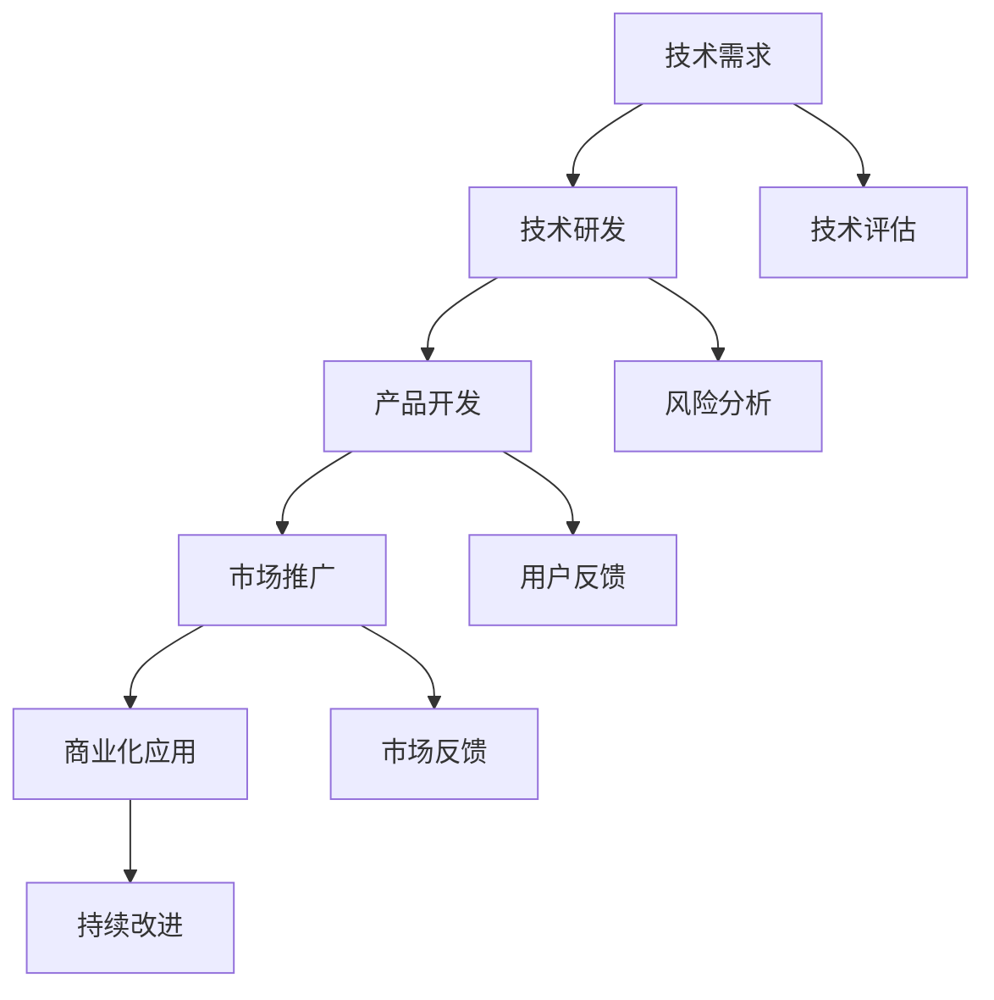

                 

# 技术创新：从发明到商业化全过程

> **关键词：技术创新、发明、商业化、企业战略、市场分析、投资融资、案例分析**

> **摘要：本文旨在探讨技术创新的完整生命周期，从基础理论到实际应用，详细解析技术创新的重要性、类型、驱动力，以及技术创新的商业化路径和企业发展战略。通过案例分析，为读者提供实用的指导和启示。**

---

### 《技术创新：从发明到商业化全过程》目录大纲

1. **第一部分：技术创新基础**

   1.1 技术创新概述
   1.2 技术创新的类型
   1.3 技术创新的驱动力
   1.4 技术发明的原理
   1.5 技术发明的流程
   1.6 技术发明的案例
   1.7 技术创新与企业发展

2. **第二部分：技术创新商业化**

   2.1 技术创新商业化概述
   2.2 市场分析与定位
   2.3 营销策略与推广
   2.4 技术创新商业化路径
   2.5 技术转移与许可
   2.6 创业与创业企业
   2.7 投资与融资
   2.8 技术创新案例研究
   2.9 技术创新的未来趋势
   2.10 技术创新与社会发展
   2.11 技术创新的国际合作

3. **附录**

   附录A：技术创新相关资源
   附录B：技术创新流程图
   附录C：核心算法原理伪代码
   附录D：数学模型与公式
   附录E：项目实战
   附录F：开发环境搭建指南

---

### 第一部分：技术创新基础

#### 第1章：技术创新概述

#### 1.1 技术创新的重要性

**技术创新在经济发展中的核心作用：**

技术创新是推动经济增长的重要引擎。根据经济学理论，技术创新能够提高生产效率、降低生产成本，从而增加社会财富。历史经验表明，每一次重大的技术创新都会引发产业革命，推动经济快速发展。例如，工业革命时期的蒸汽机、电气革命时期的电力、互联网革命时期的互联网技术，都是技术创新推动经济增长的典型例证。

**技术创新与社会进步的关系：**

技术创新不仅对经济发展具有重要意义，还对社会进步产生深远影响。通过技术创新，人类的生活质量得到显著提升。例如，医疗技术的进步使得人类的平均寿命延长，通信技术的发展使得全球信息传播更加迅速，交通工具的改进使得人们的出行更加便捷。

**技术创新的理论框架：**

技术创新的理论框架包括多种学派，如线性模型、非线性模型、系统动力学模型等。这些理论从不同角度探讨了技术创新的机制和过程。线性模型认为技术创新是一个线性的过程，从基础研究到应用研究，再到商业化应用。非线性模型则强调技术创新的非线性特性，认为技术创新过程具有突变性和复杂性的特点。系统动力学模型将技术创新视为一个动态系统，通过反馈机制和多层次结构来描述技术创新的复杂过程。

#### 1.2 技术创新的类型

**基础研究创新：**

基础研究创新是指为了探索自然规律和未知领域而进行的研究活动。这类创新通常不直接面向市场，而是为后续的应用研究提供理论基础。基础研究创新在科学研究中占据重要地位，为技术创新提供了源源不断的动力。

**应用研究创新：**

应用研究创新是指将基础研究成果转化为具体应用的过程。这类创新通常面向市场，解决实际问题，为企业和行业带来直接的经济效益。应用研究创新是技术创新的核心，是实现科技成果转化的关键环节。

**研发创新：**

研发创新是指在新产品、新工艺、新服务开发过程中进行的创新活动。这类创新通常以市场需求为导向，通过研发活动实现产品创新、工艺创新和服务创新，提高企业的竞争力。

#### 1.3 技术创新的驱动力

**市场需求：**

市场需求是推动技术创新的重要驱动力。企业为了满足市场需求，不断进行技术创新，开发出更具竞争力的产品和服务。市场需求的变化和升级，往往催生出一批新的技术创新。

**政策支持：**

政策支持是促进技术创新的重要手段。政府通过制定相关政策和法规，为技术创新提供资金、人才、技术等支持，营造良好的创新环境。政策支持能够有效激发企业的创新活力。

**竞争压力：**

竞争压力是推动技术创新的另一个重要因素。企业面临激烈的市场竞争，为了在竞争中占据优势，必须不断进行技术创新，提升自身的竞争力。

#### 第2章：技术发明

**2.1 技术发明的原理**

**技术发明的定义：**

技术发明是指通过科学研究和实验活动，创造出的新的技术或工艺。技术发明是技术创新的基础，为技术创新提供了技术支持。

**技术发明的常见模式：**

技术发明通常分为以下几种模式：

1. **渐进式创新：** 通过对现有技术进行改进和优化，实现技术升级。
2. **颠覆式创新：** 通过引入全新的技术或概念，彻底改变现有产业格局。
3. **集成创新：** 将不同领域的技术或理念集成在一起，实现新的技术突破。

**技术发明的常见障碍：**

技术发明过程中会遇到多种障碍，如技术难题、资金不足、人才短缺等。这些障碍需要通过科学的方法和策略来解决。

**2.2 技术发明的流程**

**研发策略：**

研发策略是指企业在技术发明过程中制定的研发计划和行动方案。研发策略的制定需要考虑市场需求、技术发展趋势、企业自身能力等因素。

**实验设计：**

实验设计是指为了验证技术发明假设而进行的一系列实验活动。实验设计需要遵循科学的方法，确保实验结果的有效性和可靠性。

**发明文档：**

发明文档是指对技术发明过程、实验结果和技术成果进行详细记录的文档资料。发明文档对于保护知识产权、申请专利具有重要意义。

**2.3 技术发明的案例**

**互联网技术的发展：**

互联网技术的发展是技术创新的一个典型案例。从最初的ARPANET到现在的全球互联网，互联网技术经历了多次重大创新，如TCP/IP协议、HTTP协议、HTML语言等。

**新能源汽车的崛起：**

新能源汽车的崛起是技术创新在交通运输领域的体现。通过引入新型电池技术、电机技术等，新能源汽车在续航里程、充电速度等方面实现了重大突破。

**生物技术的突破：**

生物技术的突破为医学、农业等领域带来了巨大变革。如基因编辑技术、单克隆抗体技术等，这些技术创新在医疗诊断、疾病治疗、农作物改良等方面取得了显著成果。

#### 第3章：技术创新与企业发展

**3.1 企业技术创新策略**

**创新战略：**

企业创新战略是指企业为了实现技术创新目标而制定的长期规划。创新战略的制定需要考虑企业的愿景、使命、核心竞争力等因素。

**创新组织：**

创新组织是指企业内部负责技术创新活动的组织机构。创新组织的建立需要充分考虑技术创新的特点，如跨学科、跨部门协作等。

**创新文化：**

创新文化是指企业内部鼓励创新、支持创新的价值观和行为规范。创新文化对于激发员工的创新潜力、推动技术创新具有重要意义。

**3.2 技术创新与企业竞争力**

**技术领先优势：**

技术领先优势是指企业通过技术创新在技术方面领先竞争对手的优势。技术领先优势能够提高企业的市场竞争力，为企业带来长期的市场优势。

**市场响应速度：**

市场响应速度是指企业对市场变化和技术趋势的敏感度和反应速度。市场响应速度快的企**业能够在竞争中抢占先机，迅速响应市场需求。

**创新能力评估：**

创新能力评估是指对企业技术创新能力的评估。创新能力评估可以帮助企业了解自身的创新优势和创新劣势，为企业制定创新战略提供依据。

**3.3 技术创新与企业成长**

**企业成长阶段：**

企业成长阶段是指企业从初创到成熟的各个发展阶段。不同成长阶段的企业在技术创新方面有不同的需求和特点。

**技术创新对企业成长的影响：**

技术创新对企业成长具有重要影响。通过技术创新，企业可以拓展市场、提高效率、降低成本，从而实现企业的持续成长。

**技术创新与企业可持续性：**

技术创新与企业可持续性密切相关。企业通过技术创新可以降低环境影响、提高资源利用效率，从而实现可持续发展。

### 第一部分总结

本部分从技术创新的重要性、类型、驱动力，以及技术发明的原理、流程和案例，以及技术创新与企业发展的关系进行了全面阐述。通过本部分的阅读，读者可以了解技术创新的基础知识，为后续章节的学习打下坚实的基础。

---

### 第一部分：技术创新基础

#### 第1章：技术创新概述

**1.1 技术创新的重要性**

**技术进步对经济增长的驱动作用：**

技术进步是推动经济增长的关键因素。在现代社会，经济增长越来越依赖于技术进步。通过技术创新，可以大幅提高生产效率，降低成本，从而增加企业的利润。例如，计算机技术的发展极大地提高了数据处理能力，使得现代企业能够更快速、更准确地处理海量数据，提高运营效率。

**创新对社会福利的提升：**

技术创新不仅对经济产生深远影响，还对社会福利产生积极影响。例如，医疗技术的进步使得疾病的治疗更加有效，延长了人类的平均寿命。交通技术的进步使得人们的出行更加便捷，促进了全球化的发展。此外，技术创新还带来了新的就业机会，提高了人们的生活质量。

**创新在推动产业升级中的作用：**

产业升级是经济发展的重要方向。通过技术创新，企业能够实现产品升级和服务优化，推动传统产业的转型升级。例如，制造业通过引入自动化技术、智能制造技术，实现了生产过程的智能化和自动化，提高了生产效率和质量。

**技术进步与全球竞争力的关系：**

在全球化的背景下，国家的竞争力越来越依赖于技术创新。一个国家的技术创新能力决定了其全球竞争力。例如，美国作为全球科技创新的领导者，通过持续的技术创新，在全球经济中占据了重要地位。

**技术创新的理论框架：**

技术创新的理论框架包括多种学派，如线性模型、非线性模型、系统动力学模型等。线性模型认为技术创新是一个线性的过程，从基础研究到应用研究，再到商业化应用。非线性模型则强调技术创新的非线性特性，认为技术创新过程具有突变性和复杂性的特点。系统动力学模型将技术创新视为一个动态系统，通过反馈机制和多层次结构来描述技术创新的复杂过程。

**1.2 技术创新的类型**

**基础研究创新：**

基础研究创新是指为了探索自然规律和未知领域而进行的研究活动。这类创新通常不直接面向市场，而是为后续的应用研究提供理论基础。例如，科学家通过研究基本物理原理，发现了量子力学，这一发现为后来的计算机技术的发展奠定了基础。

**应用研究创新：**

应用研究创新是指将基础研究成果转化为具体应用的过程。这类创新通常面向市场，解决实际问题，为企业和行业带来直接的经济效益。例如，科学家通过研究光纤传输技术，将其转化为实际应用，推动了互联网技术的发展。

**研发创新：**

研发创新是指在新产品、新工艺、新服务开发过程中进行的创新活动。这类创新通常以市场需求为导向，通过研发活动实现产品创新、工艺创新和服务创新，提高企业的竞争力。例如，汽车制造商通过研发新型发动机技术，提高了汽车的燃油效率，降低了排放。

**1.3 技术创新的驱动力**

**市场需求：**

市场需求是推动技术创新的重要驱动力。企业为了满足市场需求，不断进行技术创新，开发出更具竞争力的产品和服务。市场需求的变化和升级，往往催生出一批新的技术创新。例如，智能手机的兴起是由于消费者对移动通讯和互联网服务的需求不断增长。

**政策支持：**

政策支持是促进技术创新的重要手段。政府通过制定相关政策和法规，为技术创新提供资金、人才、技术等支持，营造良好的创新环境。政策支持能够有效激发企业的创新活力。例如，中国政府通过实施“大众创业、万众创新”政策，鼓励大众参与创新活动。

**竞争压力：**

竞争压力是推动技术创新的另一个重要因素。企业面临激烈的市场竞争，为了在竞争中占据优势，必须不断进行技术创新，提升自身的竞争力。例如，汽车行业中的特斯拉通过持续的技术创新，在电动汽车市场中脱颖而出。

**1.4 技术发明的原理**

**技术发明的定义：**

技术发明是指通过科学研究和实验活动，创造出的新的技术或工艺。技术发明是技术创新的基础，为技术创新提供了技术支持。

**技术发明的常见模式：**

技术发明的常见模式包括渐进式创新、颠覆式创新和集成创新。

- **渐进式创新：** 通过对现有技术进行改进和优化，实现技术升级。例如，手机从2G到3G再到4G的升级。
- **颠覆式创新：** 通过引入全新的技术或概念，彻底改变现有产业格局。例如，亚马逊通过电子商务颠覆了传统零售业。
- **集成创新：** 将不同领域的技术或理念集成在一起，实现新的技术突破。例如，苹果公司通过将计算机技术与消费电子产品相结合，创造了iPhone。

**技术发明的常见障碍：**

技术发明过程中会遇到多种障碍，如技术难题、资金不足、人才短缺等。这些障碍需要通过科学的方法和策略来解决。

- **技术难题：** 技术难题是技术发明过程中最常见的障碍。解决技术难题需要科学家、工程师和技术人员付出大量的努力和时间。
- **资金不足：** 技术发明需要大量的资金支持，包括研发资金、生产资金和营销资金等。资金不足往往导致技术发明项目无法顺利进行。
- **人才短缺：** 技术发明需要各类专业人才的支持，包括科学家、工程师、市场营销人员等。人才短缺会影响技术发明的进度和质量。

**1.5 技术发明的流程**

**研发策略：**

研发策略是指企业在技术发明过程中制定的研发计划和行动方案。研发策略的制定需要考虑市场需求、技术发展趋势、企业自身能力等因素。

- **市场需求分析：** 研发策略的制定首先需要对市场需求进行分析，了解消费者的需求和市场趋势。
- **技术发展趋势分析：** 研发策略的制定还需要对技术发展趋势进行分析，把握技术发展方向和前沿。
- **企业自身能力分析：** 研发策略的制定还需要考虑企业的自身能力，包括技术能力、资金能力、人才能力等。

**实验设计：**

实验设计是指为了验证技术发明假设而进行的一系列实验活动。实验设计需要遵循科学的方法，确保实验结果的有效性和可靠性。

- **实验目标设定：** 实验设计的第一步是设定实验目标，明确实验需要验证的假设或问题。
- **实验方案设计：** 实验方案设计包括实验方法、实验设备、实验数据收集等。
- **实验数据分析：** 实验数据收集完成后，需要对实验数据进行分析，验证假设或问题的正确性。

**发明文档：**

发明文档是指对技术发明过程、实验结果和技术成果进行详细记录的文档资料。发明文档对于保护知识产权、申请专利具有重要意义。

- **技术发明过程记录：** 发明文档需要详细记录技术发明的过程，包括研发策略、实验设计、实验结果等。
- **实验结果记录：** 发明文档需要详细记录实验结果，包括实验数据、实验结论等。
- **技术成果记录：** 发明文档需要详细记录技术成果，包括技术方案、技术原理、技术优势等。

**1.6 技术发明的案例**

**互联网技术的发展：**

互联网技术的发展是技术创新的一个典型案例。从最初的ARPANET到现在的全球互联网，互联网技术经历了多次重大创新，如TCP/IP协议、HTTP协议、HTML语言等。这些创新推动了互联网技术的快速发展，使得全球信息传播更加迅速、便捷。

**新能源汽车的崛起：**

新能源汽车的崛起是技术创新在交通运输领域的体现。通过引入新型电池技术、电机技术等，新能源汽车在续航里程、充电速度等方面实现了重大突破。特斯拉等企业通过持续的技术创新，推动了新能源汽车市场的发展。

**生物技术的突破：**

生物技术的突破为医学、农业等领域带来了巨大变革。如基因编辑技术、单克隆抗体技术等，这些技术创新在医疗诊断、疾病治疗、农作物改良等方面取得了显著成果。

**1.7 技术创新与企业发展**

**企业技术创新策略：**

企业技术创新策略是指企业为了实现技术创新目标而制定的战略。企业技术创新策略的制定需要考虑企业的愿景、使命、核心竞争力等因素。

- **愿景：** 企业技术创新策略的制定首先需要明确企业的愿景，即企业希望在未来实现的目标。
- **使命：** 企业技术创新策略的制定还需要明确企业的使命，即企业存在的意义和目的。
- **核心竞争力：** 企业技术创新策略的制定需要考虑企业的核心竞争力，即企业在市场竞争中的优势。

**创新组织：**

创新组织是指企业内部负责技术创新活动的组织机构。创新组织的建立需要充分考虑技术创新的特点，如跨学科、跨部门协作等。

- **组织结构：** 创新组织通常采用扁平化的组织结构，以便于跨学科、跨部门协作。
- **人才引进：** 创新组织需要引进各类专业人才，包括科学家、工程师、市场营销人员等。
- **激励机制：** 创新组织需要建立有效的激励机制，鼓励员工积极参与创新活动。

**创新文化：**

创新文化是指企业内部鼓励创新、支持创新的价值观和行为规范。创新文化对于激发员工的创新潜力、推动技术创新具有重要意义。

- **开放性：** 创新文化强调开放性，鼓励员工分享知识、经验和创新想法。
- **包容性：** 创新文化强调包容性，尊重员工的差异性和多样性。
- **合作性：** 创新文化强调合作性，鼓励员工团队合作，共同实现创新目标。

**技术创新与企业竞争力：**

技术创新是企业竞争力的关键因素。通过技术创新，企业可以提升产品质量、降低成本、开拓市场，从而提高市场竞争力。

- **技术领先优势：** 技术领先优势是指企业在技术创新方面领先竞争对手的优势。技术领先优势能够提高企业的市场竞争力，为企业带来长期的市场优势。
- **市场响应速度：** 市场响应速度是指企业对市场变化和技术趋势的敏感度和反应速度。市场响应速度快的企**业能够在竞争中抢占先机，迅速响应市场需求。
- **创新能力评估：** 创新能力评估是指对企业技术创新能力的评估。创新能力评估可以帮助企业了解自身的创新优势和创新劣势，为企业制定创新战略提供依据。

**技术创新与企业成长：**

技术创新对企业成长具有重要影响。通过技术创新，企业可以拓展市场、提高效率、降低成本，从而实现企业的持续成长。

- **企业成长阶段：** 企业成长阶段是指企业从初创到成熟的各个发展阶段。不同成长阶段的企业在技术创新方面有不同的需求和特点。
- **技术创新对企业成长的影响：** 技术创新对企业成长具有重要影响。通过技术创新，企业可以提升产品质量、降低成本、开拓市场，从而提高市场竞争力。
- **技术创新与企业可持续性：** 技术创新与企业可持续性密切相关。企业通过技术创新可以降低环境影响、提高资源利用效率，从而实现可持续发展。

### 第1章总结

本章从技术创新的重要性、类型、驱动力，以及技术发明的原理、流程和案例，以及技术创新与企业发展的关系进行了全面阐述。通过本章的阅读，读者可以了解技术创新的基础知识，为后续章节的学习打下坚实的基础。

---

### 第二部分：技术创新商业化

#### 第4章：技术创新商业化概述

**4.1 商业化的定义与过程**

**商业化的定义：**

商业化是指将技术创新转化为市场可接受的产品或服务，并通过市场推广实现价值的过程。商业化是技术创新的重要环节，是技术创新成果市场化、产业化的关键步骤。

**商业化的过程：**

商业化的过程通常包括以下几个阶段：

1. **市场需求分析：** 通过对市场需求进行深入分析，了解消费者的需求、痛点和潜在市场。
2. **技术评估：** 对技术创新进行全面的评估，包括技术成熟度、市场需求、成本效益等。
3. **产品开发：** 根据市场需求和技术评估结果，进行产品设计和开发，确保产品能够满足市场需求。
4. **市场定位：** 确定产品的市场定位，包括目标市场、目标客户群体等。
5. **市场推广：** 通过市场推广活动，提高产品的市场知名度和影响力。
6. **销售与运营：** 建立销售渠道，进行销售和运营活动，确保产品能够顺利进入市场。

**商业模式的创新：**

商业模式创新是指在商业化的过程中，通过创新的方式实现价值创造和传递。商业模式创新可以包括以下几个方面：

1. **产品组合创新：** 通过创新的产品组合，满足不同客户群体的需求。
2. **服务模式创新：** 通过创新的服务模式，提高客户体验和满意度。
3. **市场渠道创新：** 通过创新的市场渠道，扩大产品的市场覆盖范围。
4. **盈利模式创新：** 通过创新盈利模式，提高企业的盈利能力和竞争力。

**4.2 市场分析与定位**

**市场需求分析：**

市场需求分析是商业化过程中的关键步骤。通过市场需求分析，可以了解消费者的需求、痛点和潜在市场。市场需求分析的方法包括：

1. **市场调研：** 通过问卷调查、访谈、观察等方式，收集消费者的需求和意见。
2. **市场趋势分析：** 通过对市场趋势进行跟踪和分析，了解市场的变化和未来发展方向。
3. **竞争分析：** 对竞争对手的产品、市场策略、市场份额等进行分析，了解市场的竞争格局。

**目标市场与目标客户群体：**

在商业化过程中，明确目标市场和目标客户群体至关重要。目标市场是指最有可能购买产品的市场，而目标客户群体是指最具购买力的客户群体。确定目标市场和目标客户群体的方法包括：

1. **客户细分：** 通过客户细分，将市场划分为不同的小市场，确保产品能够满足不同客户群体的需求。
2. **定位策略：** 根据目标市场和目标客户群体的特点，制定相应的定位策略，确保产品能够准确传递价值。

**4.3 营销策略与推广**

**品牌建设：**

品牌建设是营销策略的重要组成部分。通过品牌建设，可以提高产品的知名度和美誉度，增强消费者的信任和忠诚度。品牌建设的方法包括：

1. **品牌定位：** 确定品牌的核心价值和定位，确保品牌能够准确传达价值。
2. **品牌传播：** 通过广告、公关、社交媒体等方式，提高品牌的知名度和美誉度。
3. **品牌体验：** 提供优质的客户体验，增强客户的品牌忠诚度。

**营销渠道选择：**

营销渠道选择是商业化过程中的关键决策。合适的营销渠道可以提高产品的市场覆盖率和销售效率。营销渠道的选择包括：

1. **线上渠道：** 如电商平台、社交媒体等，通过线上渠道可以扩大产品的市场覆盖范围。
2. **线下渠道：** 如专卖店、分销商等，通过线下渠道可以提高产品的知名度和信任度。
3. **渠道整合：** 结合线上和线下渠道，实现渠道的整合和优化，提高销售效率。

**推广策略：**

推广策略是提高产品市场知名度和销量的重要手段。推广策略包括：

1. **广告推广：** 通过广告宣传，提高产品的知名度和美誉度。
2. **公关活动：** 通过举办公关活动，提高产品的品牌形象和影响力。
3. **社交媒体推广：** 通过社交媒体平台，与客户互动，提高产品的知名度和忠诚度。
4. **口碑营销：** 通过提供优质的产品和服务，吸引客户口碑传播，提高产品的市场竞争力。

**4.4 技术创新商业化路径**

**技术转移与许可：**

技术转移与许可是技术创新商业化的重要路径。通过技术转移与许可，可以将技术创新转化为实际应用，为企业带来经济效益。

**技术转移的方式：**

技术转移的方式包括以下几种：

1. **技术转让：** 将技术创新的所有权或使用权转让给其他企业或机构。
2. **技术合作：** 与其他企业或机构合作，共同开发和应用技术创新。
3. **技术咨询：** 提供技术创新的咨询服务，帮助企业或机构实现技术创新。

**许可协议的设计：**

许可协议的设计是技术转移与许可的重要环节。许可协议的设计包括以下几个方面：

1. **许可范围：** 确定许可的技术范围，包括技术内容、技术用途等。
2. **许可费用：** 确定许可的费用，包括许可费、提成费等。
3. **许可期限：** 确定许可的期限，包括许可的开始时间和结束时间。
4. **许可条件：** 确定许可的条件，包括许可方的责任和义务、被许可方的责任和义务等。

**技术转移的风险与对策：**

技术转移过程中存在一定的风险，如技术风险、市场风险、法律风险等。为了降低技术转移的风险，可以采取以下对策：

1. **风险评估：** 对技术转移过程中可能出现的风险进行评估，制定相应的风险应对策略。
2. **合同管理：** 加强合同管理，明确各方责任和义务，降低法律风险。
3. **技术保护：** 通过专利申请、技术保密等方式，保护技术创新的知识产权。

**4.5 创业与创业企业**

**创业的概念：**

创业是指创立一个新的企业或组织，通过创新和创造实现价值的过程。创业通常包括市场机会的识别、资源的整合、产品的开发、市场的开拓等。

**创业企业的类型：**

创业企业可以根据不同的分类标准进行分类，如按照创业领域可以分为技术型创业、服务型创业、社会型创业等；按照创业动机可以分为机会型创业、需求型创业、学习型创业等。

**创业企业的生存与发展：**

创业企业的生存与发展是创业者面临的重大挑战。为了提高创业企业的生存和发展能力，可以采取以下策略：

1. **市场定位：** 确定清晰的市场定位，确保产品或服务能够满足市场需求。
2. **资源整合：** 整合内外部资源，包括资金、人才、技术、市场等。
3. **创新能力：** 保持持续创新能力，通过技术创新、产品创新、服务创新等提高企业的竞争力。
4. **风险管理：** 识别和应对创业过程中的风险，降低失败的可能性。

**4.6 投资与融资**

**投资者的角色：**

投资者在技术创新商业化过程中扮演着重要角色。投资者通过提供资金、资源、经验等支持，帮助企业实现技术创新和商业化。

**投资者的类型：**

投资者可以根据不同的分类标准进行分类，如按照投资领域可以分为风险投资、天使投资、创业投资等；按照投资方式可以分为股权投资、债权投资、基金投资等。

**融资方式的选择：**

融资方式的选择是技术创新商业化过程中的重要决策。常见的融资方式包括：

1. **股权融资：** 通过出让企业的部分股权换取资金，适用于初创企业和成长型企业。
2. **债权融资：** 通过借款、发行债券等方式获得资金，适用于需要长期资金的企业。
3. **政府补贴：** 通过申请政府补贴、专项基金等方式获得资金支持，适用于符合政府政策导向的企业。
4. **众筹：** 通过互联网平台向大众募集资金，适用于具有创新性和市场潜力的项目。

**投资决策：**

投资决策是投资者在技术创新商业化过程中需要考虑的关键问题。投资决策包括以下几个方面：

1. **项目评估：** 对技术创新项目的可行性、市场前景、盈利能力等进行评估。
2. **风险评估：** 对技术创新项目的风险因素进行识别和分析，制定相应的风险管理策略。
3. **投资回报：** 对投资项目的预期回报进行评估，确保投资决策的经济合理性。
4. **投资组合：** 结合投资者的整体投资战略和投资组合，确保投资风险的分散和收益最大化。

**4.7 技术创新案例研究**

**案例选择标准：**

在进行技术创新案例研究时，需要遵循以下标准：

1. **典型性：** 选择的案例应当具有代表性和典型性，能够反映技术创新的普遍规律和特点。
2. **创新性：** 选择的案例应当具有创新性，反映最新的技术趋势和突破。
3. **影响力：** 选择的案例应当具有广泛的社会影响力和市场影响力，能够引起读者的关注和兴趣。

**案例研究方法：**

案例研究方法包括以下几种：

1. **文献分析法：** 通过查阅相关文献、报告等，了解案例的背景、过程和成果。
2. **访谈法：** 通过与案例相关的人员进行访谈，获取第一手资料和观点。
3. **观察法：** 通过对案例的实施过程进行观察，了解案例的实际情况。
4. **数据分析法：** 通过对案例相关的数据进行收集和分析，评估案例的效果和影响。

**技术创新案例：**

以下是一些典型的技术创新案例：

1. **人工智能在医疗领域的应用：** 通过人工智能技术，实现疾病预测、诊断和治疗的智能化，提高了医疗服务的效率和质量。
2. **物联网技术在智能家居中的应用：** 通过物联网技术，实现家庭设备的互联互通，提高了家庭生活的便捷性和舒适度。
3. **区块链技术在金融行业的创新应用：** 通过区块链技术，实现金融交易的透明化、安全化和去中心化，提升了金融服务的效率和质量。

**案例分析：**

通过对技术创新案例的分析，可以总结出以下经验和启示：

1. **市场需求驱动：** 技术创新应当以市场需求为导向，解决实际问题和满足消费者需求。
2. **跨学科协作：** 技术创新需要跨学科的协作，结合不同的知识和技能，实现技术突破和创新。
3. **持续创新：** 技术创新是一个持续的过程，需要不断进行技术研发和优化，以保持竞争力。
4. **风险管理：** 技术创新过程中需要充分识别和管理风险，确保项目的顺利进行和成功商业化。

**4.8 技术创新的未来趋势**

**技术创新的发展趋势：**

技术创新的未来趋势表现在以下几个方面：

1. **智能化：** 智能化是技术创新的重要方向，通过人工智能、机器学习等技术，实现设备的智能化和自动化。
2. **绿色化：** 绿色化是技术创新的重要趋势，通过新能源、环保材料等技术，实现可持续发展。
3. **网络化：** 网络化是技术创新的重要方向，通过物联网、云计算等技术，实现设备的互联互通和智能化管理。
4. **个性化：** 个性化是技术创新的重要趋势，通过大数据、定制化生产等技术，实现产品的个性化和定制化。

**技术创新的未来挑战：**

技术创新的未来挑战包括：

1. **技术复杂性：** 随着技术的不断发展，技术创新的复杂性不断增加，需要更多的跨学科知识和技能。
2. **知识产权保护：** 技术创新过程中，知识产权保护至关重要，需要加强知识产权保护的法律和制度。
3. **市场不确定性：** 技术创新的市场前景具有不确定性，需要充分了解市场需求和竞争环境，制定相应的市场策略。
4. **人才短缺：** 技术创新需要高素质的人才支持，人才短缺将成为技术创新的重要挑战。

**4.9 技术创新与社会发展**

**技术创新对社会的影响：**

技术创新对社会发展产生深远影响，包括：

1. **经济增长：** 技术创新是推动经济增长的重要动力，通过提高生产效率、降低成本，实现经济快速发展。
2. **生活质量提高：** 技术创新提高了人们的生活质量，如医疗技术、交通技术等的进步，使得人们的生活更加便捷、舒适。
3. **就业机会增加：** 技术创新创造了新的就业机会，如互联网、人工智能等技术的发展，为人们提供了更多的就业选择。
4. **环境保护：** 技术创新有助于环境保护，如新能源技术、环保材料等的研发，为实现可持续发展提供了技术支持。

**社会责任与技术创新：**

技术创新过程中，企业需要承担社会责任，实现可持续发展。社会责任与技术创新的关系包括：

1. **环保技术创新：** 通过研发环保技术，降低企业的环境影响，实现绿色生产和可持续发展。
2. **公益技术创新：** 通过技术创新解决社会问题，如医疗健康、教育扶贫等，为社会贡献价值。
3. **伦理道德：** 技术创新需要遵循伦理道德原则，确保技术的应用不会对人类和社会产生负面影响。

**4.10 技术创新的国际合作**

**国际合作的重要性：**

国际合作在技术创新中具有重要地位，包括：

1. **知识共享：** 国际合作有助于知识共享，促进技术的跨国交流和合作，加速技术创新。
2. **资源整合：** 国际合作可以实现资源的整合和优化，提高技术创新的效率和质量。
3. **市场拓展：** 国际合作有助于市场拓展，通过国际合作，企业可以进入新的市场，扩大业务范围。
4. **竞争力提升：** 国际合作可以提升企业的竞争力，通过国际合作，企业可以吸收先进的经验和技术，提升自身的竞争力。

**国际合作的形式：**

国际合作的形式包括以下几种：

1. **跨国研发：** 通过跨国研发合作，共同开展技术研发，实现技术突破和创新。
2. **技术转移：** 通过技术转移合作，将先进技术引入国内，推动技术创新和产业发展。
3. **人才培养：** 通过人才培养合作，共同培养技术人才，提高技术创新的能力和水平。
4. **市场合作：** 通过市场合作，共同开拓市场，实现互利共赢。

**国际合作的机遇与挑战：**

国际合作既带来机遇，也带来挑战，包括：

1. **机遇：** 国际合作可以带来新的技术、市场、资源和合作伙伴，有助于技术创新和产业发展。
2. **挑战：** 国际合作可能面临文化差异、知识产权保护、政策法规等挑战，需要企业具备较强的国际竞争力和适应能力。

### 第二部分总结

本章从技术创新商业化的定义与过程，市场需求分析与定位，营销策略与推广，技术创新商业化路径，创业与创业企业，投资与融资，案例分析，技术创新的未来趋势，技术创新与社会发展，技术创新的国际合作等方面进行了全面阐述。通过本章的阅读，读者可以了解技术创新商业化的全过程，为实际操作提供指导。

---

### 附录

#### 附录A：技术创新相关资源

**技术创新的重要期刊与会议：**

- 《科学》（Science）
- 《自然》（Nature）
- 《工程学报》（IEEE Transactions on Engineering）
- 《商业周刊》（Business Week）

**技术创新的政策文件与报告：**

- 《国家中长期科学和技术发展规划纲要（2006-2020年）》
- 《“十三五”国家科技创新规划》
- 《国务院关于新形势下加快实施创新驱动发展战略的决定》

**技术创新的研究工具与数据库：**

- IEEE Xplore
- Web of Science
- Google Scholar
- PubMed

#### 附录B：技术创新流程图



#### 附录C：核心算法原理伪代码

```python
# 技术创新算法原理伪代码
def innovation_algorithm():
    # 初始化参数
    parameters = initialize_parameters()
    
    # 实验设计
    experiment = design_experiment()
    
    # 数据收集与分析
    data = collect_and_analyze_data(experiment)
    
    # 发明技术
    technology = invent_technology(data)
    
    # 技术创新
    innovation = innovate_technology(technology)
    
    # 商业化
    commercialization = commercialize_technology(innovation)
    
    return commercialization
```

#### 附录D：数学模型与公式

**技术创新价值评估模型：**

$$
V = \frac{\text{收益}}{\text{风险}}
$$

**技术创新风险模型：**

$$
R = \frac{\text{损失}}{\text{收益}}
$$`

#### 附录E：项目实战

**项目实战代码示例：**

```python
# 项目实战代码示例
def project_practice():
    # 初始化项目环境
    environment = initialize_environment()
    
    # 搭建开发环境
    build_development_environment(environment)
    
    # 源代码实现
    source_code = implement_source_code()
    
    # 代码解读与分析
    analysis = analyze_source_code(source_code)
    
    return analysis
```

**项目实战代码解读：**

1. **初始化项目环境：** 包括安装必要的软件和工具，如Python、PyTorch、TensorFlow等。
2. **搭建开发环境：** 包括配置代码编辑器、调试工具等。
3. **源代码实现：** 实现核心算法，如深度学习模型、数据处理等。
4. **代码解读与分析：** 分析代码结构、逻辑和性能，确保代码的有效性和可维护性。

#### 附录F：开发环境搭建指南

**开发工具的选择：**

- **代码编辑器：** 如Visual Studio Code、PyCharm等。
- **调试工具：** 如GDB、PyCharm Debugger等。
- **版本控制工具：** 如Git、Svn等。

**环境配置与调试：**

1. **安装开发工具：** 根据开发需求，选择合适的开发工具并安装。
2. **配置环境变量：** 设置环境变量，确保开发工具能够正常运行。
3. **调试环境：** 通过调试工具，对开发环境进行测试和调试，确保其稳定性。

**开发流程与管理：**

1. **项目规划：** 确定项目目标、需求和技术方案。
2. **代码编写：** 按照项目规划，编写源代码。
3. **代码评审：** 通过代码评审，确保代码的质量和可维护性。
4. **测试与调试：** 对代码进行测试和调试，确保其功能正确和性能稳定。
5. **文档编写：** 编写项目文档，包括需求文档、设计文档、用户手册等。

### 总结

本文从技术创新的基础、商业化过程、企业战略、市场分析、投资融资、案例分析等方面进行了全面阐述，为读者提供了技术创新的系统性知识。附录部分提供了相关资源和工具，为实际操作提供了指导。希望本文能够帮助读者深入理解技术创新的全过程，激发创新思维，推动技术的进步和社会的发展。

---

**作者：** AI天才研究院/AI Genius Institute & 禅与计算机程序设计艺术 /Zen And The Art of Computer Programming

---

### 结论

通过对技术创新从发明到商业化全过程的深入探讨，本文揭示了技术创新在推动经济发展、社会进步和国际竞争力提升中的核心作用。技术创新不仅是企业成长和竞争力的关键因素，也是国家繁荣和全球合作的基石。

**技术创新的重要性：** 技术创新是社会进步的驱动力，它能够提高生产效率、改善生活质量、促进环境保护，并为企业带来竞争优势。从基础研究到应用研究，再到研发创新，每个环节都是技术创新不可或缺的组成部分。

**技术创新的类型：** 技术创新可以分为基础研究创新、应用研究创新和研发创新。不同类型的创新在推动技术进步和产业发展中扮演着不同但相互补充的角色。

**技术发明的原理和流程：** 技术发明是一个复杂而系统的过程，涉及研发策略、实验设计、发明文档等。理解这一过程有助于提高技术创新的成功率。

**企业技术创新策略：** 企业应制定明确的创新战略，建立创新组织，培养创新文化，以保持技术领先优势，提高市场响应速度，实现可持续发展。

**技术创新商业化路径：** 技术创新的商业化过程包括市场分析、产品开发、市场定位、市场推广等。有效的商业模式创新是成功商业化的关键。

**投资与融资：** 投资者是技术创新的重要支持者，通过股权融资、债权融资等方式为企业提供资金支持。明智的投资决策是推动技术创新商业化的重要保障。

**案例分析：** 通过对实际案例的深入分析，可以总结出技术创新的最佳实践，为其他企业和创业者提供借鉴和启示。

**未来趋势：** 随着智能化、绿色化、网络化和个性化的不断推进，技术创新将迎来新的发展机遇。同时，技术创新也面临着技术复杂性、知识产权保护、市场不确定性和人才短缺等挑战。

**社会责任与国际合作：** 企业在追求技术创新的同时，应承担社会责任，推动可持续发展。国际合作在知识共享、资源整合和市场拓展中发挥着重要作用。

**总结：** 技术创新是一个持续的过程，需要不断投入资源、培养人才、优化管理。通过本文的探讨，希望读者能够深刻理解技术创新的内涵和路径，积极参与技术创新，为推动社会进步和经济发展贡献力量。

**作者：** AI天才研究院/AI Genius Institute & 禅与计算机程序设计艺术 /Zen And The Art of Computer Programming

---

感谢您阅读本文，希望它能够激发您对技术创新的兴趣和思考。如果您有任何问题或建议，欢迎在评论区留言，我们期待与您交流。再次感谢您的关注与支持！


