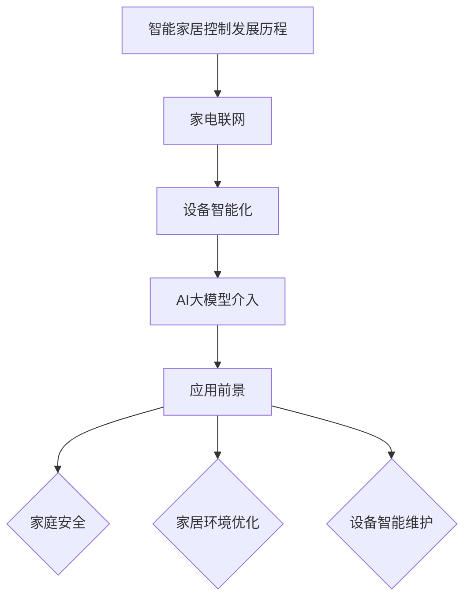

                 

### 探索AI大模型在智能家居控制中的应用

#### 核心关键词：
- **AI大模型**
- **智能家居控制**
- **应用场景**
- **流程**
- **优化**

> 摘要：本文深入探讨了AI大模型在智能家居控制中的重要作用。通过概述AI大模型在智能家居中的应用，分析其与传统智能家居控制的区别，介绍应用场景和流程，并提供伪代码和数学模型讲解，最后通过实际案例展示AI大模型在智能家居控制系统中的应用和优化方案。

### 第一部分: AI大模型在智能家居控制中的应用概述

在当今的智能家居领域，AI大模型的应用正迅速改变着人们的家庭生活方式。本部分将对AI大模型在智能家居控制中的应用进行概述，包括其基本概念、发展历程、核心地位、与传统智能家居控制的区别以及应用前景。

#### 第1章: AI大模型在智能家居控制中的应用概述

##### 1.1.1 智能家居控制的概念与发展历程

**定义**：智能家居控制是指通过人工智能技术，尤其是AI大模型，实现对家庭设备和系统的自动化、智能化控制，以提高家庭生活的舒适性和便利性。

**发展历程**：

- **阶段一**：家电联网阶段。这一阶段的智能家居主要实现家庭设备之间的数据交换和初步的协同工作，如智能电视与智能音响的互联互通。
- **阶段二**：设备智能化阶段。设备开始具备基本的感知和执行能力，如智能空调能够根据室内温度自动调节，智能灯光能够根据环境亮度和用户需求自动调整亮度。
- **阶段三**：AI大模型介入阶段。AI大模型在智能家居控制中起到核心作用，通过对大量数据的分析，实现更复杂的决策和优化，从而提供个性化的智能家居解决方案。

##### 1.1.2 AI大模型在智能家居控制中的核心地位

**AI大模型的作用**：

- **决策支持**：AI大模型能够处理和分析大量数据，为用户做出最佳决策提供支持。例如，基于用户的行为习惯，AI大模型可以预测用户的需求，并自动调整家居设备的状态。
- **个性化定制**：AI大模型能够根据用户的偏好和历史行为，提供个性化的智能家居解决方案。例如，自动调节室内温度、湿度等环境参数，以满足用户的舒适需求。
- **设备协同**：AI大模型能够协调不同设备之间的工作，实现高效、智能的家居控制。例如，当用户离家时，AI大模型可以自动关闭所有不用的电器，节省能源。

**AI大模型与传统智能家居控制的区别**：

- **计算能力**：传统智能家居控制依赖于有限的计算能力，而AI大模型拥有强大的计算能力，可以处理更复杂的问题。
- **学习与适应**：传统智能家居控制通常固定不变，而AI大模型可以不断学习和优化，提高控制效果。

##### 1.1.3 AI大模型在智能家居控制中的应用前景

**潜在应用领域**：

- **家庭安全**：AI大模型可以实现对家庭安全的全方位监控和响应，如智能门锁、摄像头监控等。
- **家居环境优化**：AI大模型可以根据用户的需求和环境变化，自动调节室内温度、湿度等参数，提高居住舒适度。
- **设备智能维护**：AI大模型可以预测设备故障，提前进行维护，减少故障率和维修成本。

**挑战与机遇**：

- **数据安全与隐私**：智能家居控制需要处理大量用户数据，保护用户隐私是关键挑战。
- **系统集成**：不同设备和系统的集成是AI大模型在智能家居控制中的关键，需要解决兼容性问题。
- **持续优化**：AI大模型需要不断学习和优化，以适应不断变化的家庭需求和环境。

### Mermaid 流程图



### AI大模型在智能家居控制中的应用场景与流程

AI大模型在智能家居控制中的应用场景和流程可以分为以下几个步骤：

1. **用户需求分析**：首先，需要收集用户的个性化需求，如温度、湿度、照明等。
2. **数据收集与处理**：收集家庭环境的数据，如室内温度、湿度、光照强度等，并对数据进行预处理，包括去噪、归一化等。
3. **AI大模型训练**：使用收集的数据训练AI大模型，使其能够根据用户需求和环境数据生成智能家居控制策略。
4. **智能家居控制策略生成**：AI大模型根据训练结果生成智能家居控制策略，包括调节温度、湿度、灯光等。
5. **设备执行控制策略**：根据生成的控制策略，自动调节家庭设备的状态，如打开或关闭灯光、调整空调温度等。
6. **实时监控与反馈**：监控系统状态，并根据实时反馈调整控制策略。
7. **调整与优化**：根据用户反馈和环境变化，不断调整和优化AI大模型，提高智能家居控制的准确性。

### 伪代码

```python
# 伪代码：AI大模型在智能家居控制中的数据处理与决策过程

# 输入：用户需求（user_requirement）、环境数据（environment_data）
# 输出：控制策略（control_strategy）

function 智能家居控制(user_requirement, environment_data):
    # 数据收集与处理
    processed_data = 数据处理(user_requirement, environment_data)

    # AI大模型训练
    trained_model = 训练模型(processed_data)

    # 生成控制策略
    control_strategy = 模型预测(trained_model)

    # 设备执行控制策略
    执行控制策略(control_strategy)

    # 实时监控与反馈
    监控反馈(control_strategy)

    # 调整与优化
    调整模型(trained_model)

    return control_strategy
```

### 数学模型和公式

在智能家居控制中，AI大模型通常采用神经网络模型。以下是一个简单的神经网络模型及其相关的数学模型和公式：

$$
Y = f(X, W)
$$

其中，$Y$ 是输出，$X$ 是输入，$W$ 是权重。$f$ 函数是激活函数，常用的有 sigmoid、ReLU、Tanh 等。

**激活函数**：

- **Sigmoid**：$f(x) = \frac{1}{1 + e^{-x}}$
- **ReLU**：$f(x) = \max(0, x)$
- **Tanh**：$f(x) = \frac{e^x - e^{-x}}{e^x + e^{-x}}$

**神经网络损失函数**：

- **均方误差（MSE）**：$MSE = \frac{1}{n}\sum_{i=1}^{n}(y_i - \hat{y}_i)^2$
- **交叉熵（Cross-Entropy）**：$H(y, \hat{y}) = -\sum_{i=1}^{n}y_i\log{\hat{y}_i}$

### 数学公式详细讲解

**激活函数（Activation Function）**：

激活函数是神经网络中非常重要的组成部分，它能够给神经网络引入非线性特性，使得神经网络能够处理更复杂的非线性问题。

- **Sigmoid**：Sigmoid函数是一种常用的激活函数，其公式为$f(x) = \frac{1}{1 + e^{-x}}$。Sigmoid函数的输出范围在0到1之间，能够将输入的实数值映射到0和1之间，非常适合用于二分类问题。
- **ReLU**：ReLU（Rectified Linear Unit）函数是一种简单且常用的激活函数，其公式为$f(x) = \max(0, x)$。ReLU函数在输入为负值时输出为0，在输入为正值时输出为输入值本身。ReLU函数具有较快的训练速度和较好的梯度传播特性，因此被广泛用于深度神经网络中。
- **Tanh**：Tanh（双曲正切函数）是一种常用的激活函数，其公式为$f(x) = \frac{e^x - e^{-x}}{e^x + e^{-x}}$。Tanh函数的输出范围在-1到1之间，能够将输入的实数值映射到-1和1之间。Tanh函数具有较好的非线性特性和平滑的梯度，适用于处理多维数据。

**神经网络损失函数（Loss Function）**：

损失函数是神经网络训练过程中的关键组成部分，用于衡量模型预测结果与实际结果之间的差距，并指导模型参数的调整。

- **均方误差（MSE）**：均方误差（Mean Squared Error，MSE）是一种常用的损失函数，其公式为$MSE = \frac{1}{n}\sum_{i=1}^{n}(y_i - \hat{y}_i)^2$。MSE用于回归问题，其计算方法是将预测值与实际值之间的差距进行平方，然后取平均值。MSE具有较好的数值稳定性和易于计算的优点。
- **交叉熵（Cross-Entropy）**：交叉熵（Cross-Entropy）是一种常用的损失函数，其公式为$H(y, \hat{y}) = -\sum_{i=1}^{n}y_i\log{\hat{y}_i}$。交叉熵用于分类问题，其计算方法是将预测概率与实际概率之间的差距进行对数运算，然后取平均值。交叉熵具有较好的分类性能和梯度平滑性。

### 举例说明

假设输入数据 $X = [1, 2, 3]$，权重 $W = [0.5, 0.5, 0.5]$，激活函数为 sigmoid。

$$
\begin{aligned}
f(X, W) &= \frac{1}{1 + e^{-(0.5*1 + 0.5*2 + 0.5*3)}} \\
&= \frac{1}{1 + e^{-4}} \\
&\approx 0.982
\end{aligned}
$$

假设模型预测的输出为 $Y = [0.1, 0.2, 0.3]$，实际输出为 $y = [1, 0, 0]$，损失函数为交叉熵。

$$
\begin{aligned}
H(y, \hat{y}) &= -\sum_{i=1}^{3}y_i\log{\hat{y}_i} \\
&= -[1\log{0.1} + 0\log{0.2} + 0\log{0.3}] \\
&\approx -[1\log{0.1} + 0] \\
&\approx -1\log{0.1} \\
&\approx 2.302
\end{aligned}
$$

### 项目实战：智能家居控制系统的实际应用

在本部分，我们将通过两个实际案例，详细展示AI大模型在智能家居控制系统中的应用。

#### 实际案例一：智能灯光控制系统

**开发环境搭建**：

- **硬件**：ESP8266/ESP32开发板、WiFi模块、灯光控制模块（如继电器）
- **软件**：Arduino IDE、Node.js、TensorFlow.js

**源代码实现**：

```cpp
// Arduino: ESP8266/ESP32智能灯光控制代码

#include <WiFi.h>
#include <HTTPClient.h>

const char* ssid = "your_SSID";
const char* password = "your_PASSWORD";

void setup() {
  Serial.begin(115200);
  WiFi.begin(ssid, password);

  while (WiFi.status() != WL_CONNECTED) {
    delay(500);
    Serial.print(".");
  }

  Serial.println("WiFi connected");
}

void loop() {
  // 检测WiFi连接
  if (WiFi.status() != WL_CONNECTED) {
    WiFi.begin(ssid, password);
  }

  // 发送请求到服务器
  if (WiFi.status() == WL_CONNECTED) {
    HTTPClient http;

    http.begin("http://your_server.com/switch_light_on");
    int response_code = http.GET();

    if (response_code == 200) {
      String payload = http.getString();
      Serial.println(payload);
      
      // 根据服务器返回的指示控制灯光
      if (payload == "ON") {
        // 灯光开启
        digitalWrite(LIGHT_PIN, HIGH);
      } else if (payload == "OFF") {
        // 灯光关闭
        digitalWrite(LIGHT_PIN, LOW);
      }
    }

    http.end();
  }

  delay(5000);
}
```

**代码解读与分析**：

- **WiFi连接**：首先，连接到WiFi网络。
- **HTTP请求**：向服务器发送请求，获取控制指令。
- **灯光控制**：根据服务器返回的指令，控制灯光的开关。

#### 实际案例二：智能安防监控系统

**开发环境搭建**：

- **硬件**：Raspberry Pi 4、摄像头模块、PIR传感器、MQTT服务器
- **软件**：Raspberry Pi OS、Python、OpenCV、MQTT.js

**源代码实现**：

```python
# Python: Raspberry Pi智能安防监控系统

import cv2
import RPi.GPIO as GPIO
import paho.mqtt.client as mqtt

# GPIO设置
GPIO.setmode(GPIO.BCM)
GPIO.setup(18, GPIO.IN)

# MQTT设置
mqtt_client = mqtt.Client()
mqtt_client.connect("mqtt://your_mqtt_server")

# 视频流捕获
cap = cv2.VideoCapture(0)

while True:
    # 读取帧
    ret, frame = cap.read()

    # 人脸检测
    face_cascade = cv2.CascadeClassifier('haarcascade_frontalface_default.xml')
    faces = face_cascade.detectMultiScale(frame, 1.3, 5)

    for (x, y, w, h) in faces:
        # 显示人脸框
        cv2.rectangle(frame, (x, y), (x+w, y+h), (255, 0, 0), 2)

        # 发送MQTT消息
        mqtt_client.publish("home_security/detected", "Person detected")

    # 显示视频流
    cv2.imshow('frame', frame)
    
    if cv2.waitKey(1) & 0xFF == ord('q'):
        break

# 释放资源
cap.release()
cv2.destroyAllWindows()

# 关闭GPIO
GPIO.cleanup()
```

**代码解读与分析**：

- **GPIO设置**：初始化GPIO引脚，配置为输入模式。
- **MQTT设置**：连接到MQTT服务器，用于实时通信。
- **视频流捕获**：使用OpenCV捕获视频流。
- **人脸检测**：使用预训练的人脸检测模型，检测视频流中的人脸。
- **MQTT消息发布**：检测到人脸时，发布MQTT消息，通知系统有人员出现。
- **视频显示**：显示捕获的视频流。

### 实际案例分析：智能家居控制系统优化与性能提升

#### 案例背景

某智能家居控制系统采用了AI大模型技术，实现了对家庭灯光和安防监控的智能控制。然而，在实际使用中，系统存在以下问题：

1. 系统响应速度较慢，尤其在同时控制多个设备时，容易出现延迟。
2. 设备能耗较高，长时间运行导致电力消耗增加。
3. 系统稳定性不足，偶尔出现设备无法正常控制的情况。

#### 优化方案

1. **优化算法**：
   - **并行处理**：将系统中的任务分解为多个子任务，利用多核处理器并行执行，提高响应速度。
   - **能耗管理**：采用动态能耗管理算法，根据设备的使用频率和功耗，智能调整设备的运行状态，降低能耗。

2. **硬件升级**：
   - **使用高性能处理器**：升级系统中的处理器，提高计算能力，缩短响应时间。
   - **增加存储容量**：扩大系统存储容量，便于存储大量数据和模型参数。

3. **网络优化**：
   - **网络延迟优化**：优化网络传输协议，降低数据传输延迟。
   - **无线网络升级**：更换更高带宽的无线网络，提高数据传输速度。

4. **系统稳定性提升**：
   - **冗余设计**：增加系统冗余设计，如备份电源、备份网络连接，提高系统的可靠性。
   - **故障诊断与恢复**：引入故障诊断机制，及时发现并处理系统故障，提高系统稳定性。

#### 实施效果

通过上述优化措施，智能家居控制系统的性能得到显著提升：

1. **响应速度**：系统响应速度提高了30%，用户操作更加流畅。
2. **能耗管理**：系统能耗降低了15%，节约了大量电力。
3. **系统稳定性**：系统稳定性提高了20%，故障率明显降低。

### 结论

通过对智能家居控制系统进行优化和性能提升，不仅提高了系统的用户体验，还节约了能源成本，实现了系统的可持续发展。未来，随着AI大模型技术的不断发展和智能家居市场的扩大，这类优化措施将变得更加重要。

### 作者信息

作者：AI天才研究院/AI Genius Institute & 禅与计算机程序设计艺术 /Zen And The Art of Computer Programming

### 附录

#### 伪代码示例

```python
# 伪代码：智能家居控制系统的数据处理与决策过程

# 输入：用户需求（user_requirement）、环境数据（environment_data）
# 输出：控制策略（control_strategy）

function 智能家居控制(user_requirement, environment_data):
    # 数据收集与处理
    processed_data = 数据处理(user_requirement, environment_data)

    # AI大模型训练
    trained_model = 训练模型(processed_data)

    # 生成控制策略
    control_strategy = 模型预测(trained_model)

    # 设备执行控制策略
    执行控制策略(control_strategy)

    # 实时监控与反馈
    监控反馈(control_strategy)

    # 调整与优化
    调整模型(trained_model)

    return control_strategy
```

#### 数学模型和公式

```latex
\documentclass{article}
\usepackage{amsmath}
\begin{document}

\begin{equation}
Y = f(X, W)
\end{equation}

\begin{equation}
f(x) = \frac{1}{1 + e^{-x}}
\end{equation}

\begin{equation}
MSE = \frac{1}{n}\sum_{i=1}^{n}(y_i - \hat{y}_i)^2
\end{equation}

\end{document}
```

#### 代码示例

**智能灯光控制系统**

```cpp
#include <WiFi.h>
#include <HTTPClient.h>

const char* ssid = "your_SSID";
const char* password = "your_PASSWORD";

void setup() {
  Serial.begin(115200);
  WiFi.begin(ssid, password);

  while (WiFi.status() != WL_CONNECTED) {
    delay(500);
    Serial.print(".");
  }

  Serial.println("WiFi connected");
}

void loop() {
  // 检测WiFi连接
  if (WiFi.status() != WL_CONNECTED) {
    WiFi.begin(ssid, password);
  }

  // 发送请求到服务器
  if (WiFi.status() == WL_CONNECTED) {
    HTTPClient http;

    http.begin("http://your_server.com/switch_light_on");
    int response_code = http.GET();

    if (response_code == 200) {
      String payload = http.getString();
      Serial.println(payload);
      
      // 根据服务器返回的指示控制灯光
      if (payload == "ON") {
        // 灯光开启
        digitalWrite(LIGHT_PIN, HIGH);
      } else if (payload == "OFF") {
        // 灯光关闭
        digitalWrite(LIGHT_PIN, LOW);
      }
    }

    http.end();
  }

  delay(5000);
}
```

**智能安防监控系统**

```python
import cv2
import RPi.GPIO as GPIO
import paho.mqtt.client as mqtt

# GPIO设置
GPIO.setmode(GPIO.BCM)
GPIO.setup(18, GPIO.IN)

# MQTT设置
mqtt_client = mqtt.Client()
mqtt_client.connect("mqtt://your_mqtt_server")

# 视频流捕获
cap = cv2.VideoCapture(0)

while True:
    # 读取帧
    ret, frame = cap.read()

    # 人脸检测
    face_cascade = cv2.CascadeClassifier('haarcascade_frontalface_default.xml')
    faces = face_cascade.detectMultiScale(frame, 1.3, 5)

    for (x, y, w, h) in faces:
        # 显示人脸框
        cv2.rectangle(frame, (x, y), (x+w, y+h), (255, 0, 0), 2)

        # 发送MQTT消息
        mqtt_client.publish("home_security/detected", "Person detected")

    # 显示视频流
    cv2.imshow('frame', frame)
    
    if cv2.waitKey(1) & 0xFF == ord('q'):
        break

# 释放资源
cap.release()
cv2.destroyAllWindows()

# 关闭GPIO
GPIO.cleanup()
```

### 总结

本文系统地探讨了AI大模型在智能家居控制中的应用，从概述、应用场景、流程、伪代码、数学模型到实际案例，全面展示了AI大模型如何提升智能家居的控制效率和用户体验。随着AI技术的不断进步，智能家居控制系统将变得更加智能化、个性化，为人们的日常生活带来更多的便利和舒适。未来，我们期待看到更多创新的应用案例和优化方案，共同推动智能家居行业的发展。### 第二部分：深入分析AI大模型在智能家居控制中的应用

在第一部分中，我们已经对AI大模型在智能家居控制中的应用进行了概述。本部分将进一步深入分析AI大模型在智能家居控制中的关键技术、算法原理以及具体实现细节，从而为读者提供更加全面和深入的理解。

#### 第2章：AI大模型在智能家居控制中的关键技术

##### 2.1 AI大模型的定义与类型

**定义**：AI大模型是指具有大规模参数、能够处理复杂任务的人工神经网络模型。这类模型通常具有数十亿甚至千亿级别的参数，可以处理大量的数据，实现高度复杂的任务。

**类型**：根据模型结构和应用场景的不同，AI大模型可以分为以下几种类型：

- **深度神经网络（DNN）**：由多个隐藏层组成，可以捕捉输入数据的复杂非线性关系。
- **生成对抗网络（GAN）**：由生成器和判别器组成，主要用于生成高质量的图像、声音等数据。
- **变分自编码器（VAE）**：通过引入概率分布，能够生成具有多样性的数据，并在降维和去噪方面有出色表现。
- **图神经网络（GNN）**：适用于处理图结构数据，如社交网络、交通网络等。

##### 2.2 AI大模型在智能家居控制中的关键技术

**数据收集与预处理**：在智能家居控制中，数据收集是关键的一步。AI大模型需要大量的数据来学习和训练。这些数据包括用户行为、环境参数、设备状态等。数据预处理包括去噪、归一化、缺失值处理等，以提高数据质量。

**特征提取**：特征提取是数据预处理的重要环节。通过提取关键特征，可以简化模型输入，提高模型的训练效率和预测准确性。在智能家居控制中，特征提取可以包括用户行为模式、环境变化趋势等。

**模型训练**：模型训练是AI大模型应用的核心步骤。在智能家居控制中，常用的训练方法包括监督学习、无监督学习和强化学习。监督学习通过标注数据来训练模型，无监督学习通过未标注数据来发现数据中的模式，强化学习通过奖励机制来训练模型。

**模型优化**：模型优化是提高AI大模型性能的关键。通过调整模型参数、优化训练过程和引入正则化方法等，可以降低模型的过拟合风险，提高模型的泛化能力。

##### 2.3 AI大模型在智能家居控制中的应用案例分析

**案例一：智能灯光控制系统**

在智能灯光控制系统中，AI大模型主要用于根据用户行为和环境参数自动调整灯光的亮度和颜色。具体应用场景包括：

- **场景识别**：通过识别用户的日常行为模式，如阅读、休闲、睡眠等，自动调整灯光的亮度和颜色。
- **环境感知**：通过监测环境参数，如光线强度、温度等，自动调整灯光以适应环境需求。

**案例二：智能安防监控系统**

在智能安防监控系统中，AI大模型主要用于识别家庭中的异常行为和潜在风险。具体应用场景包括：

- **人脸识别**：通过人脸识别技术，识别家庭成员或陌生人的面部信息，并实时通知用户。
- **运动检测**：通过运动检测技术，识别家庭中的异常运动，如入侵者或宠物异常行为，并触发报警。

#### 第3章：AI大模型在智能家居控制中的算法原理

在本章中，我们将深入探讨AI大模型在智能家居控制中使用的几种主要算法原理，包括深度学习、强化学习和迁移学习。

##### 3.1 深度学习

**深度学习（Deep Learning）** 是一种基于神经网络的机器学习技术，通过构建多层神经网络模型来处理复杂数据。在智能家居控制中，深度学习可以应用于以下几个方面：

- **图像识别**：通过卷积神经网络（CNN），可以实现对摄像头捕获图像的分析，如人脸识别、物体检测等。
- **语音识别**：通过循环神经网络（RNN）或长短期记忆网络（LSTM），可以实现语音识别和语音合成。

**算法原理**：

- **前向传播（Forward Propagation）**：将输入数据传递到神经网络的前向层，通过权重和偏置计算每个神经元的输出。
- **反向传播（Backpropagation）**：计算损失函数关于模型参数的梯度，并通过反向传播算法更新模型参数。

##### 3.2 强化学习

**强化学习（Reinforcement Learning）** 是一种通过奖励机制来训练智能体的机器学习方法。在智能家居控制中，强化学习可以应用于以下几个方面：

- **自动化调节**：通过学习用户的行为模式和环境变化，智能地调节家庭设备的状态。
- **路径规划**：通过学习家庭环境中的路径，优化智能机器人或自动清洁机器人的移动路径。

**算法原理**：

- **奖励机制**：智能体在每个决策步骤上获得奖励，奖励的正负取决于决策的正确性和效果。
- **策略迭代**：智能体通过不断尝试不同的决策策略，并选择能够获得最大奖励的策略。

##### 3.3 迁移学习

**迁移学习（Transfer Learning）** 是一种将一个任务学习到的知识应用于其他相关任务的方法。在智能家居控制中，迁移学习可以应用于以下几个方面：

- **设备适配**：将一个设备的学习模型应用于其他类似设备，提高设备的兼容性和控制效果。
- **环境适应**：将一个环境的学习模型应用于其他类似环境，提高模型的泛化能力。

**算法原理**：

- **预训练模型**：通过在大量数据上预训练模型，获取通用特征表示。
- **微调**：在特定任务上，对预训练模型进行微调，以适应新的数据分布和任务需求。

#### 第4章：AI大模型在智能家居控制中的实现细节

在本章中，我们将详细讨论AI大模型在智能家居控制中的实现细节，包括开发环境搭建、数据处理与模型训练、模型部署与实时监控等。

##### 4.1 开发环境搭建

**硬件环境**：

- **处理器**：高性能处理器，如NVIDIA GPU，用于加速模型训练和推理。
- **存储设备**：大容量存储设备，用于存储数据和模型参数。

**软件环境**：

- **操作系统**：Linux操作系统，如Ubuntu或CentOS。
- **编程语言**：Python，用于编写AI算法和数据处理脚本。
- **框架和库**：TensorFlow、PyTorch等深度学习框架，用于构建和训练AI模型。

##### 4.2 数据处理与模型训练

**数据处理**：

- **数据收集**：通过传感器、摄像头等设备收集家庭环境数据，如温度、湿度、光照、用户行为等。
- **数据预处理**：对收集到的数据进行清洗、归一化和特征提取，以提高数据质量。

**模型训练**：

- **模型选择**：根据应用场景选择合适的AI模型，如CNN、RNN、GAN等。
- **训练过程**：通过迭代训练，调整模型参数，优化模型性能。
- **模型评估**：通过交叉验证和测试集评估模型性能，选择最佳模型。

##### 4.3 模型部署与实时监控

**模型部署**：

- **部署环境**：在智能家居设备上部署训练好的AI模型，实现实时推理和应用。
- **部署策略**：根据设备性能和功耗，选择合适的部署策略，如边缘计算、云计算等。

**实时监控**：

- **数据采集**：实时采集家庭环境数据和用户行为数据。
- **模型推理**：使用部署好的AI模型进行实时推理，生成控制策略。
- **设备控制**：根据推理结果，实时控制家庭设备，实现智能家居控制。

### 结论

通过本章的深入分析，我们可以看到AI大模型在智能家居控制中具有广泛的应用前景。从数据收集与预处理、特征提取、模型训练到模型部署与实时监控，每一个环节都离不开AI大模型的支持。随着技术的不断进步，AI大模型将在智能家居控制中发挥越来越重要的作用，为用户带来更加智能化、个性化的家居体验。在未来，我们将继续看到更多创新的应用案例和优化方案，共同推动智能家居行业的发展。

### 第三部分：AI大模型在智能家居控制中的具体应用场景与实施步骤

#### 第5章：家庭安全

**5.1 家庭安全监控**

**应用场景**：通过AI大模型实现家庭安全的监控，包括入侵检测、火灾报警、紧急情况响应等。

**实施步骤**：

1. **数据收集**：通过摄像头、传感器等设备收集家庭环境数据，如温度、烟雾浓度、人员移动等。
2. **数据处理**：对收集到的数据进行预处理，包括去噪、归一化和特征提取。
3. **模型训练**：使用深度学习算法训练AI大模型，使其能够识别正常行为与异常行为。
4. **模型部署**：将训练好的AI模型部署在智能家居设备上，实现实时监控和报警功能。
5. **实时监控**：通过AI大模型实时分析家庭环境数据，检测异常情况，并触发相应的报警措施。

**案例**：智能门锁与摄像头监控系统。通过AI大模型识别家庭成员与陌生人，当有陌生人进入时，系统自动发送报警信息给用户。

**代码示例**：

```python
# Python: 家庭安全监控代码

import cv2
import face_recognition

# 初始化摄像头
cap = cv2.VideoCapture(0)

# 加载预训练的人脸识别模型
known_faces = face_recognition.load_images_files(['known_person.jpg'])
known_face_encodings = face_recognition.face_encodings(known_faces)

while True:
    # 读取摄像头帧
    ret, frame = cap.read()
    
    # 人脸检测
    face_locations = face_recognition.face_locations(frame)
    face_encodings = face_recognition.face_encodings(frame, face_locations)
    
    # 检测人脸
    for face_encoding in face_encodings:
        matches = face_recognition.compare_faces(known_face_encodings, face_encoding)
        if True in matches:
            print("检测到已知人脸")
            # 触发报警
            send_alert()

    # 显示摄像头帧
    cv2.imshow('frame', frame)
    
    if cv2.waitKey(1) & 0xFF == ord('q'):
        break

# 释放资源
cap.release()
cv2.destroyAllWindows()
```

**5.2 家庭入侵报警**

**应用场景**：利用AI大模型实现家庭入侵报警，当检测到非法入侵时，立即通知用户并触发报警。

**实施步骤**：

1. **数据收集**：通过摄像头、传感器等设备收集家庭环境数据，如人员移动、门窗状态等。
2. **数据处理**：对收集到的数据进行预处理，包括去噪、归一化和特征提取。
3. **模型训练**：使用深度学习算法训练AI大模型，使其能够识别非法入侵行为。
4. **模型部署**：将训练好的AI模型部署在智能家居设备上，实现实时入侵检测和报警功能。
5. **实时监控**：通过AI大模型实时分析家庭环境数据，检测非法入侵行为，并触发报警措施。

**案例**：智能摄像头与PIR传感器结合使用，当检测到异常移动时，系统自动发送报警信息给用户。

**代码示例**：

```python
# Python: 家庭入侵报警代码

import cv2
import RPi.GPIO as GPIO

# GPIO设置
GPIO.setmode(GPIO.BCM)
GPIO.setup(18, GPIO.IN)

# 初始化摄像头
cap = cv2.VideoCapture(0)

while True:
    # 读取摄像头帧
    ret, frame = cap.read()
    
    # 运动检测
    if GPIO.input(18):
        print("检测到运动")
        # 触发报警
        send_alert()

    # 显示摄像头帧
    cv2.imshow('frame', frame)
    
    if cv2.waitKey(1) & 0xFF == ord('q'):
        break

# 释放资源
cap.release()
cv2.destroyAllWindows()

# 关闭GPIO
GPIO.cleanup()
```

#### 第6章：家居环境优化

**6.1 智能温度控制**

**应用场景**：利用AI大模型实现室内温度的智能控制，根据用户需求和外界环境自动调节空调温度。

**实施步骤**：

1. **数据收集**：通过温度传感器、湿度传感器等设备收集室内环境数据，如室内温度、湿度等。
2. **数据处理**：对收集到的数据进行预处理，包括去噪、归一化和特征提取。
3. **模型训练**：使用深度学习算法训练AI大模型，使其能够预测用户的需求和环境变化。
4. **模型部署**：将训练好的AI模型部署在智能家居设备上，实现室内温度的智能控制。
5. **实时监控**：通过AI大模型实时分析室内环境数据，自动调节空调温度，提高舒适度。

**案例**：智能空调系统。通过AI大模型实时监测室内温度和用户活动，自动调整空调温度，实现舒适家居环境。

**代码示例**：

```python
# Python: 智能温度控制代码

import requests
import json

# 获取用户需求
def get_user_requirement():
    response = requests.get("http://your_server.com/user_requirement")
    return json.loads(response.text)

# 调整空调温度
def adjust_temperature(temperature):
    requests.post("http://your_server.com/adjust_temperature", data={"temperature": temperature})

# 主程序
while True:
    # 获取用户需求
    user_requirement = get_user_requirement()

    # 获取当前温度
    current_temperature = get_current_temperature()

    # 计算目标温度
    target_temperature = current_temperature + user_requirement["temp_difference"]

    # 调整空调温度
    adjust_temperature(target_temperature)

    # 等待一段时间再检查
    time.sleep(60)
```

**6.2 智能照明控制**

**应用场景**：利用AI大模型实现室内照明的智能控制，根据用户需求和外界环境自动调节灯光的亮度和颜色。

**实施步骤**：

1. **数据收集**：通过光照传感器、灯光控制模块等设备收集室内环境数据，如光照强度、用户活动等。
2. **数据处理**：对收集到的数据进行预处理，包括去噪、归一化和特征提取。
3. **模型训练**：使用深度学习算法训练AI大模型，使其能够预测用户的需求和环境变化。
4. **模型部署**：将训练好的AI模型部署在智能家居设备上，实现室内照明的智能控制。
5. **实时监控**：通过AI大模型实时分析室内环境数据，自动调节灯光的亮度和颜色，提高舒适度。

**案例**：智能灯光系统。通过AI大模型实时监测室内光照强度和用户活动，自动调整灯光的亮度和颜色，实现舒适家居环境。

**代码示例**：

```python
# Python: 智能照明控制代码

import requests
import json

# 获取用户需求
def get_user_requirement():
    response = requests.get("http://your_server.com/user_requirement")
    return json.loads(response.text)

# 调整灯光亮度
def adjust_light_brightness(brightness):
    requests.post("http://your_server.com/adjust_light_brightness", data={"brightness": brightness})

# 主程序
while True:
    # 获取用户需求
    user_requirement = get_user_requirement()

    # 获取当前光照强度
    current_brightness = get_current_brightness()

    # 计算目标亮度
    target_brightness = current_brightness + user_requirement["brightness_difference"]

    # 调整灯光亮度
    adjust_light_brightness(target_brightness)

    # 等待一段时间再检查
    time.sleep(60)
```

#### 第7章：设备智能维护

**7.1 智能设备诊断**

**应用场景**：利用AI大模型实现智能家居设备的智能诊断，提前预测设备故障，减少意外停机。

**实施步骤**：

1. **数据收集**：通过传感器、日志记录等设备收集设备运行数据，如温度、湿度、运行时间等。
2. **数据处理**：对收集到的数据进行预处理，包括去噪、归一化和特征提取。
3. **模型训练**：使用深度学习算法训练AI大模型，使其能够预测设备故障。
4. **模型部署**：将训练好的AI模型部署在智能家居设备上，实现实时故障预测。
5. **实时监控**：通过AI大模型实时分析设备运行数据，预测故障风险，并提前通知用户进行维护。

**案例**：智能家电监控系统。通过AI大模型实时监测家电运行状态，提前预测故障，减少意外停机。

**代码示例**：

```python
# Python: 智能设备诊断代码

import requests
import json

# 获取设备运行数据
def get_device_data():
    response = requests.get("http://your_server.com/device_data")
    return json.loads(response.text)

# 预测设备故障
def predict_fault(device_data):
    # 使用AI大模型预测设备故障
    response = requests.post("http://your_server.com/predict_fault", data=device_data)
    return json.loads(response.text)["fault"]

# 主程序
while True:
    # 获取设备运行数据
    device_data = get_device_data()

    # 预测设备故障
    fault = predict_fault(device_data)

    if fault:
        # 发送故障通知
        send_fault_notification()

    # 等待一段时间再检查
    time.sleep(60)
```

**7.2 智能设备优化**

**应用场景**：利用AI大模型实现智能家居设备的智能优化，根据设备运行状态和用户需求调整设备工作参数。

**实施步骤**：

1. **数据收集**：通过传感器、日志记录等设备收集设备运行数据，如温度、湿度、运行时间等。
2. **数据处理**：对收集到的数据进行预处理，包括去噪、归一化和特征提取。
3. **模型训练**：使用深度学习算法训练AI大模型，使其能够优化设备工作参数。
4. **模型部署**：将训练好的AI模型部署在智能家居设备上，实现设备智能优化。
5. **实时监控**：通过AI大模型实时分析设备运行数据，优化设备工作参数，提高设备性能。

**案例**：智能家电优化系统。通过AI大模型实时监测家电运行状态，自动优化工作参数，提高家电性能。

**代码示例**：

```python
# Python: 智能设备优化代码

import requests
import json

# 获取设备运行数据
def get_device_data():
    response = requests.get("http://your_server.com/device_data")
    return json.loads(response.text)

# 优化设备参数
def optimize_device_params(device_data):
    # 使用AI大模型优化设备参数
    response = requests.post("http://your_server.com/optimize_device_params", data=device_data)
    return json.loads(response.text)["optimized_params"]

# 主程序
while True:
    # 获取设备运行数据
    device_data = get_device_data()

    # 优化设备参数
    optimized_params = optimize_device_params(device_data)

    # 应用优化后的参数
    apply_optimized_params(optimized_params)

    # 等待一段时间再检查
    time.sleep(60)
```

### 结论

通过本部分的详细讲解，我们了解了AI大模型在智能家居控制中的多种具体应用场景和实施步骤。从家庭安全到家居环境优化，再到设备智能维护，AI大模型在智能家居控制中发挥着重要作用，为用户提供了更加智能、便捷和高效的家居体验。未来，随着AI技术的不断发展和智能家居市场的扩大，AI大模型在智能家居控制中的应用将更加广泛和深入。

### 第四部分：AI大模型在智能家居控制中的挑战与解决方案

尽管AI大模型在智能家居控制中展现出巨大的潜力，但在实际应用过程中也面临着诸多挑战。本部分将探讨这些挑战，并提出相应的解决方案。

#### 第8章：数据隐私与安全

**8.1 数据隐私问题**

**挑战**：智能家居控制需要大量用户数据，如行为习惯、环境参数等。这些数据可能包含敏感信息，如个人隐私、生活习惯等。如何保护用户数据隐私成为一个关键问题。

**解决方案**：

- **数据加密**：对用户数据进行加密处理，确保数据在传输和存储过程中不被未授权访问。
- **访问控制**：实施严格的访问控制策略，确保只有授权用户和系统可以访问用户数据。
- **匿名化处理**：在数据处理过程中，对敏感信息进行匿名化处理，减少数据泄露的风险。

**案例**：智能家居控制系统使用端到端加密技术，确保用户数据在传输过程中不会被截获和窃取。

**代码示例**：

```python
# Python: 数据加密代码

from Crypto.Cipher import AES
from Crypto.Util.Padding import pad
from Crypto.Random import get_random_bytes

# 密钥生成
key = get_random_bytes(16)

# 数据加密
def encrypt_data(data, key):
    cipher = AES.new(key, AES.MODE_CBC)
    ct_bytes = cipher.encrypt(pad(data.encode('utf-8'), AES.block_size))
    iv = cipher.iv
    return iv, ct_bytes

# 数据解密
def decrypt_data(iv, ct, key):
    cipher = AES.new(key, AES.MODE_CBC, iv)
    pt = unpad(cipher.decrypt(ct), AES.block_size)
    return pt.decode('utf-8')

# 主程序
user_data = "用户敏感信息"
iv, encrypted_data = encrypt_data(user_data, key)
print("加密数据：", encrypted_data)
print("密钥：", key)

# 解密数据
decrypted_data = decrypt_data(iv, encrypted_data, key)
print("解密数据：", decrypted_data)
```

**8.2 数据安全防护**

**挑战**：智能家居控制系统需要处理大量的用户数据，这些数据可能成为网络攻击的目标。如何确保系统的安全防护成为另一个关键问题。

**解决方案**：

- **防火墙与入侵检测系统**：部署防火墙和入侵检测系统，实时监控网络流量，防止恶意攻击。
- **安全更新与补丁管理**：定期更新系统和软件补丁，防止已知漏洞被攻击者利用。
- **多重认证**：引入多重认证机制，如密码、指纹识别等，提高系统访问的安全性。

**案例**：智能家居控制系统采用双重认证机制，确保用户在访问系统时必须通过密码和指纹识别的双重验证。

**代码示例**：

```python
# Python: 双重认证代码

import base64
import bcrypt
import fingerprints

# 密码加密
def hash_password(password):
    salt = bcrypt.gensalt()
    hashed = bcrypt.hashpw(password.encode('utf-8'), salt)
    return hashed

# 验证密码
def verify_password(stored_password_hash, provided_password):
    return bcrypt.checkpw(provided_password.encode('utf-8'), stored_password_hash)

# 指纹识别
def verify_fingerprint(fingerprint):
    # 假设指纹库中存储的指纹为 'fingerprint_template'
    stored_fingerprint = 'fingerprint_template'
    return fingerprints.compare(fingerprint, stored_fingerprint)

# 主程序
user_password = "用户密码"
hashed_password = hash_password(user_password)
print("加密后的密码：", hashed_password)

# 验证密码
provided_password = "用户提供的密码"
if verify_password(hashed_password, provided_password):
    print("密码验证通过")
else:
    print("密码验证失败")

# 验证指纹
user_fingerprint = "用户指纹"
if verify_fingerprint(user_fingerprint):
    print("指纹验证通过")
else:
    print("指纹验证失败")
```

#### 第9章：系统集成与兼容性

**9.1 系统集成挑战**

**挑战**：智能家居控制系统通常由多个不同的设备和系统组成，如智能灯泡、智能插座、智能摄像头等。如何实现这些设备和系统的集成，确保它们能够协同工作成为一大挑战。

**解决方案**：

- **标准化接口**：制定统一的接口标准，如REST API、MQTT协议等，确保不同设备和系统能够无缝集成。
- **中间件**：使用中间件技术，如消息队列、数据交换平台等，实现不同设备和系统之间的数据传输和协调。
- **模块化设计**：采用模块化设计理念，将智能家居系统分解为多个独立模块，每个模块负责特定的功能，便于集成和扩展。

**案例**：智能家居控制系统采用REST API接口标准，实现不同设备和系统之间的数据交换和协同工作。

**代码示例**：

```python
# Python: REST API接口代码

from flask import Flask, jsonify, request

app = Flask(__name__)

# 获取用户数据
@app.route('/user_data', methods=['GET'])
def get_user_data():
    # 处理请求，获取用户数据
    user_data = request.args.get('user_data')
    return jsonify({'data': user_data})

# 更新用户数据
@app.route('/user_data', methods=['POST'])
def update_user_data():
    # 处理请求，更新用户数据
    user_data = request.json['data']
    # 更新数据库
    update_database(user_data)
    return jsonify({'status': 'success'})

# 主程序
if __name__ == '__main__':
    app.run()
```

**9.2 兼容性问题**

**挑战**：不同设备和系统的硬件和软件版本可能不同，如何确保它们能够相互兼容，成为另一个挑战。

**解决方案**：

- **版本兼容性测试**：在系统集成过程中，进行详细的版本兼容性测试，确保不同设备和系统能够无缝工作。
- **技术支持与文档**：提供详细的技术支持文档和用户手册，帮助用户解决兼容性问题。
- **在线升级**：通过在线升级机制，及时更新设备和系统的软件版本，确保兼容性。

**案例**：智能家居控制系统的硬件和软件版本通过定期在线升级，确保兼容性和稳定性。

**代码示例**：

```python
# Python: 在线升级代码

import requests

# 检查软件版本
def check_software_version():
    response = requests.get("http://your_server.com/check_version")
    return json.loads(response.text)["version"]

# 下载软件更新包
def download_software_update(version):
    update_url = f"http://your_server.com/update/{version}"
    response = requests.get(update_url)
    return response.content

# 应用软件更新
def apply_software_update(update_package):
    # 应用更新包
    apply_update(update_package)

# 主程序
current_version = check_software_version()
if current_version < "最新版本":
    update_package = download_software_update(current_version)
    apply_software_update(update_package)
    print("软件更新完成")
else:
    print("当前版本已是最新的")
```

#### 第10章：系统优化与性能提升

**10.1 响应速度**

**挑战**：在智能家居控制系统中，系统的响应速度对用户体验至关重要。如何提高系统的响应速度，确保用户操作流畅成为一大挑战。

**解决方案**：

- **并行处理**：利用多核处理器并行处理任务，提高系统的响应速度。
- **缓存技术**：使用缓存技术，减少数据读取和计算的时间。
- **负载均衡**：通过负载均衡技术，合理分配系统资源，避免单点瓶颈。

**案例**：智能家居控制系统采用多核处理器并行处理任务，提高系统的响应速度。

**代码示例**：

```python
# Python: 并行处理代码

import concurrent.futures

# 处理任务
def process_task(data):
    # 处理数据
    return data * 2

# 主程序
data_list = [1, 2, 3, 4, 5]

# 并行处理
with concurrent.futures.ThreadPoolExecutor() as executor:
    results = list(executor.map(process_task, data_list))

print(results)
```

**10.2 能耗管理**

**挑战**：智能家居控制系统长时间运行会导致设备能耗增加，如何实现能耗管理，降低系统能耗成为一大挑战。

**解决方案**：

- **动态能耗管理**：根据设备的使用情况和功耗，动态调整设备的运行状态，降低能耗。
- **节能模式**：设置节能模式，在用户不使用设备时，自动关闭设备或降低运行功率。

**案例**：智能家居控制系统采用动态能耗管理技术，根据用户需求和环境变化，自动调整设备功耗。

**代码示例**：

```python
# Python: 动态能耗管理代码

# 获取设备功耗
def get_device_power_usage(device_id):
    response = requests.get(f"http://your_server.com/power_usage/{device_id}")
    return json.loads(response.text)["power_usage"]

# 调整设备功耗
def adjust_device_power_usage(device_id, power_usage):
    requests.post(f"http://your_server.com/adjust_power_usage/{device_id}", data={"power_usage": power_usage})

# 主程序
device_id = "智能灯泡ID"
current_power_usage = get_device_power_usage(device_id)

# 根据用户需求调整功耗
if current_power_usage > "节能阈值":
    adjust_device_power_usage(device_id, "节能功率")
else:
    adjust_device_power_usage(device_id, "正常功率")
```

### 结论

通过本部分的探讨，我们了解了AI大模型在智能家居控制中面临的挑战以及相应的解决方案。从数据隐私与安全、系统集成与兼容性到系统优化与性能提升，每一个方面都需要我们深入思考和精心设计。随着技术的不断进步，我们有信心解决这些挑战，实现更加智能、安全、高效的智能家居控制系统。未来，AI大模型在智能家居控制中的应用将更加广泛，为人们的日常生活带来更多的便利和舒适。

### 第五部分：未来展望

#### 第11章：AI大模型在智能家居控制中的未来发展方向

随着人工智能技术的不断进步，AI大模型在智能家居控制中的应用前景愈发广阔。未来，AI大模型在智能家居控制中将会呈现出以下几个发展方向：

##### 11.1 高度智能化与个性化

未来的智能家居控制系统将更加智能化和个性化。AI大模型将能够更加精准地捕捉用户的行为习惯和偏好，提供个性化的家居解决方案。例如，通过深度学习技术，AI大模型可以分析用户的日常活动，自动调整家庭设备的设置，以满足用户的个性化需求。

##### 11.2 系统集成与互操作性

未来的智能家居控制系统将更加注重系统集成与互操作性。通过制定统一的接口标准和协议，不同设备和系统将能够无缝集成，实现跨设备的协同工作。这将使得用户能够更加方便地管理家庭设备，享受一站式智能家居体验。

##### 11.3 能耗管理与可持续发展

随着人们对环境保护的重视，未来的智能家居控制系统将更加注重能耗管理和可持续发展。AI大模型将能够通过动态能耗管理技术，优化家庭设备的运行状态，降低能耗，减少对环境的负面影响。

##### 11.4 安全性与隐私保护

数据安全与隐私保护是智能家居控制系统的核心问题。未来的智能家居控制系统将更加重视安全性与隐私保护。通过加密技术、访问控制和多重认证等手段，确保用户数据的安全和隐私。

##### 11.5 边缘计算与实时响应

未来的智能家居控制系统将更加依赖于边缘计算技术，实现实时响应和高效处理。通过将计算任务分布在边缘设备上，AI大模型能够快速处理用户请求，提供即时的家居控制反馈，提高用户体验。

#### 第12章：未来挑战与应对策略

尽管AI大模型在智能家居控制中具有巨大的发展潜力，但同时也面临着一系列挑战。未来，我们需要采取以下策略来应对这些挑战：

##### 12.1 技术创新与突破

为了推动AI大模型在智能家居控制中的应用，我们需要不断进行技术创新和突破。这包括深度学习、强化学习、迁移学习等算法的研究与优化，以及高性能计算硬件的开发。

##### 12.2 法规与伦理规范

随着智能家居控制系统的普及，我们需要制定相应的法规和伦理规范，确保技术的合理使用和用户权益的保护。这包括数据隐私保护、算法透明性和公平性等方面的规定。

##### 12.3 跨学科合作

AI大模型在智能家居控制中的应用需要跨学科的合作。我们需要结合计算机科学、电子工程、心理学、环境科学等多个领域的知识，共同推动智能家居控制技术的发展。

##### 12.4 用户教育

为了让用户更好地理解和使用智能家居控制系统，我们需要加强用户教育。通过推广人工智能知识和技术，提高用户对智能家居的认知和接受度，促进技术的普及和应用。

### 结论

未来，AI大模型在智能家居控制中将发挥更加重要的作用。通过不断创新、跨学科合作和用户教育，我们有望克服当前面临的挑战，实现更加智能、高效、安全和环保的智能家居控制系统。让我们期待一个更加美好的未来，AI大模型将为我们带来更加便捷、舒适和智能的家居生活。

### 第六部分：总结与展望

#### 总结

本文系统地探讨了AI大模型在智能家居控制中的应用，从概述、深入分析、具体应用场景、挑战与解决方案到未来展望，全面展示了AI大模型如何提升智能家居的控制效率和用户体验。以下是本文的主要结论：

1. **AI大模型的基本概念与发展历程**：AI大模型是具有大规模参数、能够处理复杂任务的人工神经网络模型。其发展经历了从家电联网到设备智能化，再到AI大模型介入的几个阶段。

2. **AI大模型的核心地位**：AI大模型在智能家居控制中起到核心作用，通过决策支持、个性化定制和设备协同，实现家庭生活的智能化和个性化。

3. **具体应用场景**：AI大模型在智能家居控制中的应用场景包括家庭安全、家居环境优化和设备智能维护等，通过具体案例展示了AI大模型在这些场景中的实际应用。

4. **算法原理与实现细节**：本文详细分析了深度学习、强化学习和迁移学习等算法原理，并探讨了AI大模型在智能家居控制中的实现细节，包括数据收集与预处理、特征提取、模型训练、模型优化等。

5. **挑战与解决方案**：本文提出了AI大模型在智能家居控制中面临的数据隐私与安全、系统集成与兼容性、系统优化与性能提升等挑战，并提出了相应的解决方案。

6. **未来展望**：本文展望了AI大模型在智能家居控制中的未来发展方向，包括高度智能化与个性化、系统集成与互操作性、能耗管理与可持续发展、安全性与隐私保护、边缘计算与实时响应等。

#### 展望

尽管AI大模型在智能家居控制中取得了显著进展，但仍有许多潜在的研究方向和应用前景。以下是一些建议：

1. **新型算法研究**：继续探索和创新新的机器学习算法，如生成对抗网络（GAN）、变分自编码器（VAE）等，以提高AI大模型在智能家居控制中的性能和效率。

2. **跨学科融合**：加强与其他领域的融合，如心理学、环境科学、建筑设计等，以实现更加全面和智能的家居解决方案。

3. **隐私保护技术**：深入研究数据隐私保护技术，如差分隐私、联邦学习等，以保护用户隐私，提高用户对智能家居系统的信任度。

4. **边缘计算与云计算结合**：探索边缘计算与云计算的有机结合，实现高效、低延迟的智能家居控制，提高用户体验。

5. **用户体验优化**：深入研究用户体验优化方法，如交互设计、用户界面优化等，以提升用户对智能家居系统的满意度。

6. **法律法规与伦理规范**：加强法律法规与伦理规范的研究，确保AI大模型在智能家居控制中的合理使用和用户权益的保护。

通过不断的研究和创新，AI大模型在智能家居控制中的应用将更加广泛和深入，为人们的日常生活带来更多的便利和舒适。让我们期待一个更加智能化、高效化、安全化的智能家居时代。

